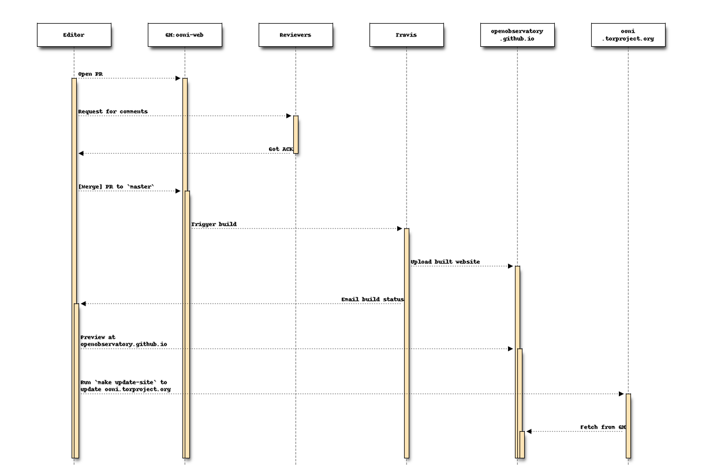

# OONI Web

This is the canonical website for OONI, that you can access via:

* https://ooni.io
* https://ooni.torproject.org
* https://openobservatory.github.io
* https://ooni.netlify.com

If you are having trouble accessing our website, please contact us at contact [at] openobservatory.org.

## Contributing articles

* Fork this repository if you're not a collaborator
* Add your post to `content/post/` directory
* Submit a pull request
* Wait for pull request to be reviewed and merged to `master` or merge it yourself :)
* Update your local copy using `git checkout master && git pull --ff-only`
* Wait for [Travis CI](https://travis-ci.org/TheTorProject/ooni-web/) to build [Github mirror](https://openobservatory.github.io/) or just proceed to the next step if you don't want to preview the mirror
* Publish GH mirror to https://ooni.torproject.org using `make update-site`



## Local build

### Setup

Dependencies to build the website **manually** are
[hugo](https://github.com/spf13/hugo/),
[ooni-probe](https://github.com/TheTorProject/ooni-probe), and
[sphinx](http://www.sphinx-doc.org/en/stable/) to build ooni-probe docs. Exact
versions are codified in "canonical" build procedure in
[travis.yml](./travis.yml).


### Running locally

If you want to preview the website while editing styles and posts you can do it running following command:

```
make server
```

If you want to publish to [Github mirror](https://openobservatory.github.io/), you should run:

```
make publish
```
