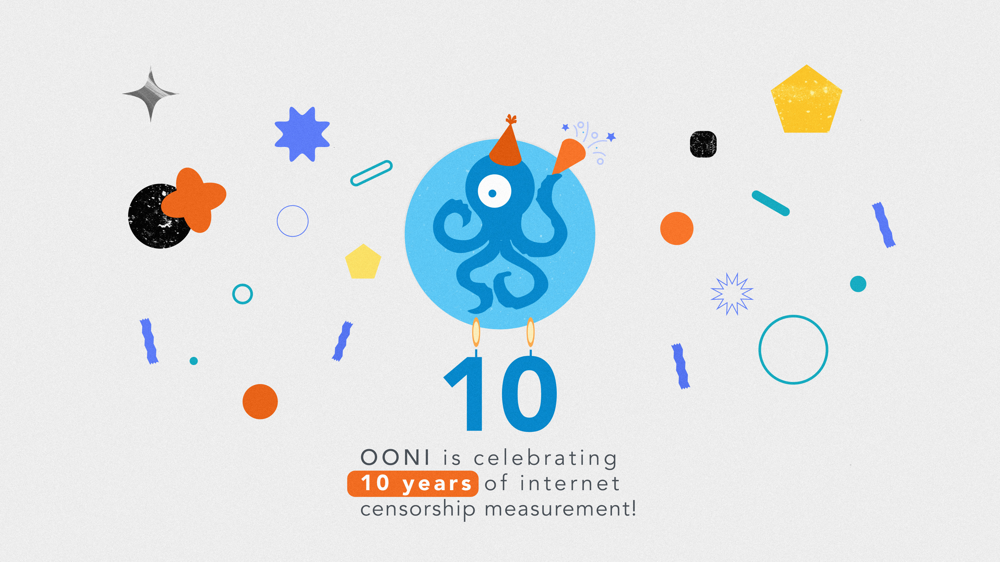

{{}}



You’re invited to join us for the celebration of OONI’s 10th
anniversary!

To share OONI highlights from the last 10 years, as well as how
community members have used OONI tools and data as part of their work,
we’ll be hosting **2 live-streamed events**:

* **OONI Highlights**:

    * Date and time: **5th December 2022 at 14:00 UTC** (1 hour event)

    * Location: Live-streamed on [OONI YouTube channel](https://www.youtube.com/c/OONIorg)

* **OONI Community:**

    * Date and time: **6th December 2022 at 13:00 UTC** (1 hour event)

    * Location: Live-streamed on [OONI YouTube channel](https://www.youtube.com/c/OONIorg)

[Subscribe to our YouTube channel](https://www.youtube.com/c/OONIorg)
and learn more details below.

* [About 10th Ooniversary](#about-10th-ooniversary)

* [10th Ooniversary: OONI Highlights](#10th-ooniversary-ooni-highlights)

* [10th Ooniversary: OONI Community](#10th-ooniversary-ooni-community)

# About 10th Ooniversary

Ten years ago, the [Open Observatory of Network Interference (OONI)](https://ooni.org/) was created with a vision: Build tools that
enable anyone around the world to independently investigate internet
censorship and publish open data that increases transparency of internet
censorship worldwide.

Today, 10 years later, our [OONI Probe app](https://ooni.org/install/)
enables you to measure various forms of internet censorship, and we
publish OONI Probe measurements from around the world as [open data](https://ooni.org/data/) in real-time. This has enabled us to
publish [75 reports](https://ooni.org/reports/) in collaboration with
our global network of [partners](https://ooni.org/partners),
documenting internet censorship worldwide.

None of this would have been possible without our global community, who
contribute censorship measurements every day, increasing transparency of
internet censorship around the world.

In tribute to our community, we have set **5th December as OONI’s
birthday**, because that is the day when we published the first OONI
measurement.

To celebrate 10 years of OONI censorship measurement, join us for the
following 2 live-streamed events, where we’ll share highlights from the
past 10 years, as well as stories from our community.

# 10th Ooniversary: OONI Highlights

Join us for a live-streamed event where we’ll share OONI highlights from
the past 10 years!

* Date and time: **5th December 2022 at 14:00 UTC** (1 hour event)

* Location: Live-streamed on [OONI YouTube channel](https://www.youtube.com/c/OONIorg)

As part of the event, we’ll provide a 30-minute presentation of key
highlights from the past 10 years. You’ll learn about the tools we built
for measuring internet censorship, how you can investigate internet
censorship based on real-time open data, and about our research and
community efforts. We’ll also share some of the key projects we’ll be
working on going forward.

Following the 30-minute presentation, we’d love to answer your
questions! We invite you to share your questions through the live chat,
or through this
[pad](https://pad.riseup.net/p/10th-ooniversary-questions-keep).

# 10th Ooniversary: OONI Community

Join us for a live-streamed event to hear from the OONI community!

* Date and time: **6th December 2022 at 13:00 UTC** (1 hour event)

* Location: Live-streamed on [OONI YouTube channel](https://www.youtube.com/c/OONIorg)

As part of this event, we have invited several OONI community members to
briefly share how they have used OONI tools and data as part of their
work.

We are excited to have the following speakers and presentations:

|**Presenter**                       |**Topic**                                                                         |
|--------------------------------|------------------------------------------------------------------------------|
|Felicia Anthonio ([Access Now](https://www.accessnow.org/))   |Using OONI data as part of [#KeepItOn](https://www.accessnow.org/keepiton/) advocacy                                 |
|Kelly Koh ([Sinar Project](https://sinarproject.org/))       |Using OONI tools and data to investigate internet censorship in Southeast Asia|
|Jakub Dalek ([Citizen Lab](https://citizenlab.ca/))       |Analyzing OONI data to investigate the blocking of LGBTIQ websites            |
|Igor Valentovitch ([Netalitica](https://netalitica.com/))  |Using OONI data for information controls research                             |
|Zaituni Njovu ([Zaina Foundation](https://zainafoundationtz.org/))|OONI community engagement efforts in Tanzania                                 |
|Raya Sharbain ([Tor Project](https://www.torproject.org/))     |Using OONI Probe to test Tor                                                  |

Following the above presentations, we encourage you to share your
questions through the live chat, or through this
[pad](https://pad.riseup.net/p/10th-ooniversary-community-questions-keep).

Looking forward to seeing you online for our 10th Ooniversary!
