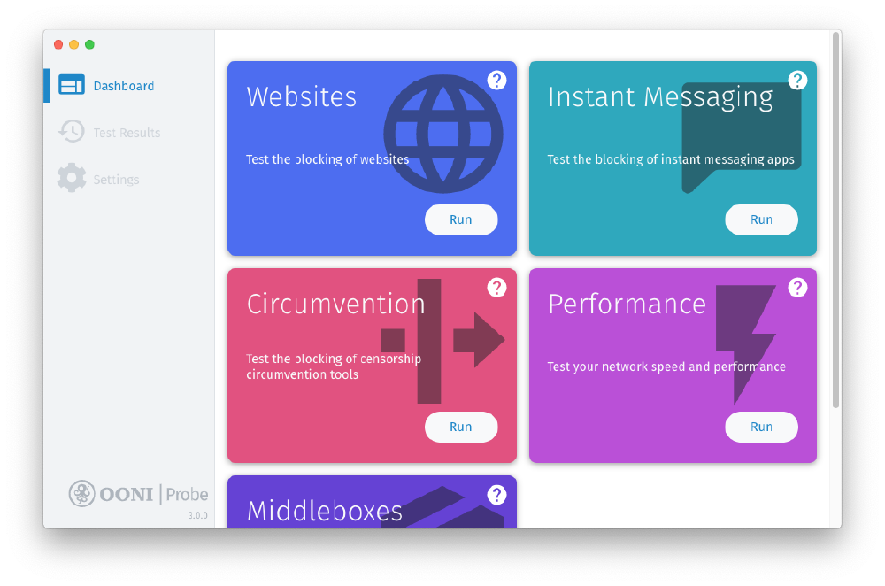
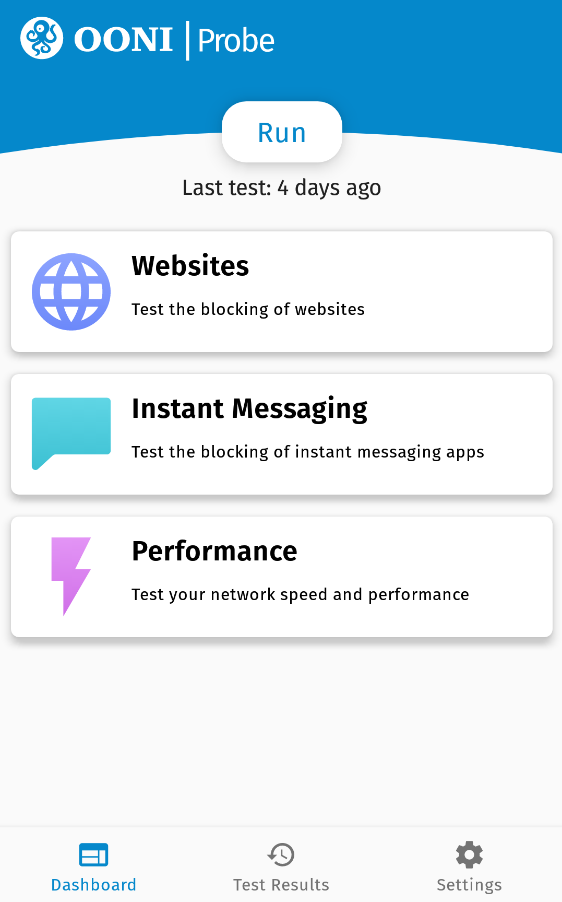

-----------------------------------------------------------------------------------------------------------

This is a **guest post by Arzu Geybullayeva** ([Azerbaijan Internet Watch](https://www.az-netwatch.org/)), originally published
[here](https://www.facebook.com/arzu.geybullayeva/posts/10101500262414261).

--------------------------------------------------------------------------------------------------------------------------

[Azerbaijan Internet Watch](https://www.az-netwatch.org/) Azərbaycanda
internet senzurasını izləyir və bu çərçəvədə aşkar etdiyi pozuntuları öz
səhifəsində sənədləşdirir. Bu barədə daha ətraflı məlumatı
[buradan](https://www.az-netwatch.org/about/) əldə edə bilərsiniz.

Layihənin bir vacib cəhətlərindən biri də ölkədə bloklanan veb
səhifələri izləmək ve bu bloklamaların necə baş verdiyini araşdırmaqdır.
Bu barədə isə daha ətraflı
[buradan](https://www.az-netwatch.org/news/how-websites-are-blocked-in-azerbaijan/)
və [buradan](https://www.az-netwatch.org/technical-analysis/measuring-website-blocks-in-azerbaijan-ooni-forensics/)
məlumat əldə edə bilərsiniz.

Gördüyünüz kimi, bu testleri aparmaq üçün Azerbaijan Internet Watch
[OONI](https://ooni.org/) ilə əməkdaşlıq edir. OONI dünyada internet
senzurasının şəffaflığını artırmağı hədəfləyən layihədir.

OONI bunu necə edir?

* İnternet senzurasının müxtəlif formalarını aşkar etmək üçün [OONI Probe Applər](https://ooni.org/install/) [yəni tədbiqlər] qurur;

* Dünyanın hər yerindən toplanmış senzura ölçmələri ilə bağlı
məlumatları [buradan](https://ooni.org/data/) yayımlayır;

* Son olaraq, dünyada senzura hadisələrini sənədləşdirən [tədqiqat hesabatları](https://ooni.org/reports/) dərc edir;

Azərbaycan da OONInin izlədiyi ölkələr arasında yer alır.

OONİ ilə bir yerdə ölkədə hansı texniki avadanlırqlardan istifadə
edildiyini, provayderlərin veb sehifələrini necə blokladığını və bu
qərarların necə verildiyini araşdırırıq.

# Amma bunun üçün köməyinizə ehtiyacımız var

Bu testləri həm kompüter həm telefon vasitəsi ilə etmək mümkündur. Və bu
testləri tətbiq etmək üçün texniki mütəxəssis olmağa ehtiyac yoxdur.

## Windows və macOS istifadəçilərin diqqətinə

Əgər siz Windows və/vəya macOS istifadəçisinizsə bu zaman aşağıda
verilən göstərişlərlə araşdırmanı dəstəkləyə bilərsiniz:

1)  [OONI Probe desktop tətbiqini](https://ooni.org/install/desktop) yükləyin və quraşdırın;

{{}}

2)  OONI Probe desktop tətbiqini açanda qarşınıza bir neçə “kart”
çıxacaq (şəkildə görüldüyü kimi). Buradan **Websites card**/ **veb
səhifələr** kartını seçib **“Run”/“test et”** düyməsina basın
([bloklanan veb səhifələri ölçmək üçün](https://ooni.org/nettest/web-connectivity/));

3)  Veb səhifələr kartından əlavə, yenə OONI Probe desktop tətbiqin
içində olan bir başqa kart - **Circumvention card** (bloklanan veb
səhifələrin girişinə məhdudiyyəti ortadan qaldıran proqramları
test etmək üçün istifadə edilən
[Tor](https://ooni.org/nettest/tor/) vəya
[Psiphon](https://ooni.org/nettest/psiphon/) VPN proqramları
kimi) seçib, **“Run”/“test et”** düyməsina basın - beləcə bu cür
proqramların da ölkədə bloklanıb bloklanmadığını görmək olar.

Nəzərinizə çatdırırıq ki veb səhiflələrin test edilməsi bir neçə saad
ala bilər.

Testlərin nəticələrini OONI Probe tətbiqi içində “Test Results”/”test
nəticələri” bölməsində görmək mümkündür. Ayrıca nəticələrin hamisi
[OONI Explorer səhifəsində](https://explorer.ooni.org/search?) də dərc
olunur.

## Android və iOS istifadəçilərin diqqətinə

Əgər siz Android və/vəya iOS istifadəçisinizsə bu zaman aşağıda verilən
göstərişlərlə araşdırmanı dəstəkləyə bilərsiniz:

1)  Telefona [OONI Probe mobil tətbiqini](https://ooni.org/install/mobile) yükləyin;

{{}}

2)  **WiFi ilə qoşulanların nəzərinə:**

* əlavənin **settings/parametrələrinə** daxil olun, **test
options/test variantlari** nişanını seçin. Qarşınıza
**websites/veb səhifələri** yazan nişan çıxacaq. Nişanı seçin
və **limit test duration/test müddətini məhdudlaşdır**
funksiyasını deaktiv edin
([dünyada](https://github.com/citizenlab/test-lists/blob/master/lists/global.csv)
və [Azərbaycanda](https://github.com/citizenlab/test-lists/blob/master/lists/az.csv)
bloklanan veb səhifələri test etmək üçün)

* OONI Probe tətbiqin idarə panelində **“Run”/”test et”**
düyməsinə basın (bütün testləri tətbiq etmək üçün)

3)  **mobil data ilə qoşulanların nəzərinə:**

* Bu veb səhifəsindən
[https://ooni.org/get-involved/run/](https://ooni.org/get-involved/run/)
“**Azerbaijan**” yazan nişanı seçin;

* Açılan səhifəni OONI Probe mobil tətbiqində
“Run” test et” düyməsinə basin;

4)  VPNləri test etmək üçün bu səhifədən
    [https://ooni.org/get-involved/run/](https://ooni.org/get-involved/run/) “**VPNs**” düyməsini
    seçin, və OONI Probe mobil tətbiqiniz ilə açib yenə,
    **“Run”/”test et”** düyməsinə basın.

Testlərin nəticələrini OONI Probe tətbiqində **“Test Results”/”test
nəticələri”** bölməsindən görmək mümkündür. Ayrıca nəticələrin hamisi
[OONI Explorer səhifəsində](https://explorer.ooni.org/search?) də dərc
olunur.

# VACİB

1) test etməyə başlamadan WiFi-yə qoşulun əks halda mobil datanızdan
xeyli gedəcək;

2) bu testləri edəndə VPN-ə bağlı olmadığınızı yoxlamağı unudmayın.

İndidən hamıya təşəkkürlər.
