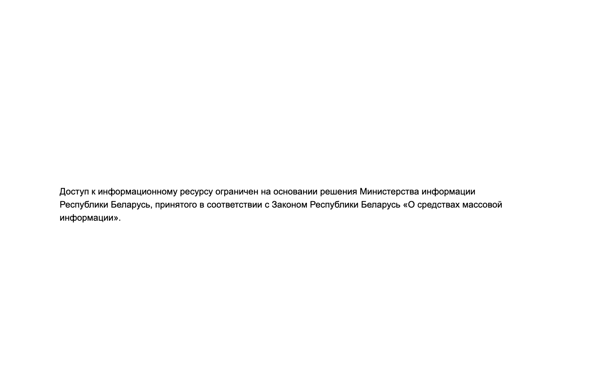
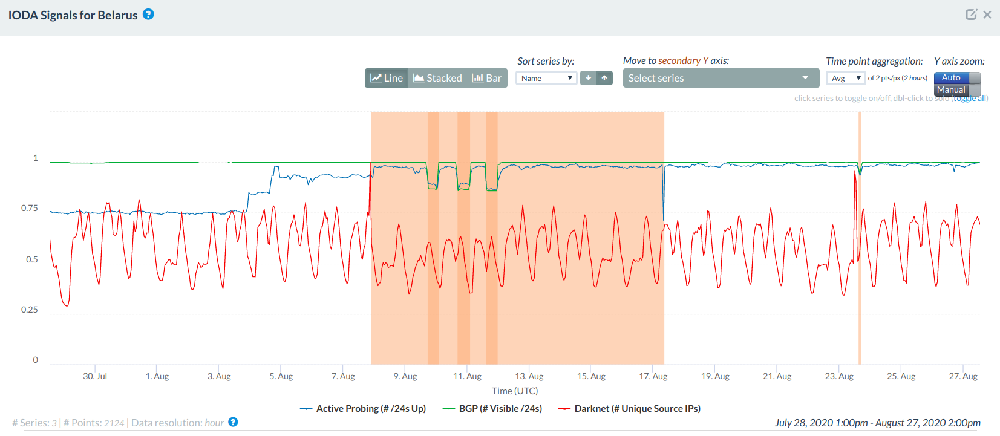
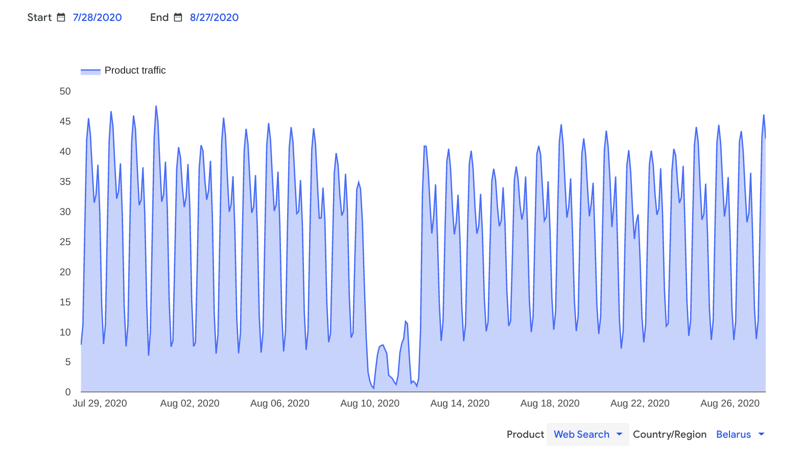
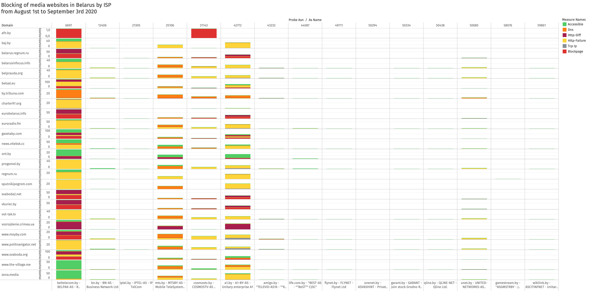
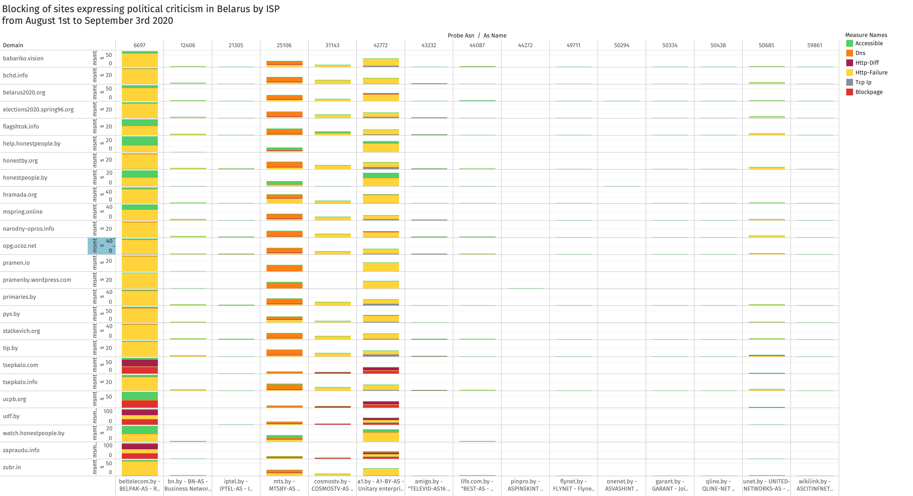
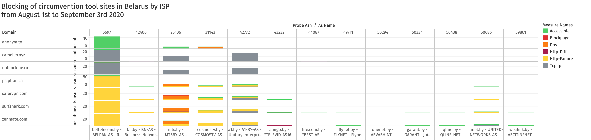

{{}}

**Image:** Block page served in Belarus.

*This report was prepared in collaboration with [Human Constanta](https://humanconstanta.by/) and the [Digital Observers Community Belarus](https://t.me/zabynet).*

More than 70 websites have been [blocked](https://www.hrw.org/news/2020/08/28/belarus-internet-disruptions-online-censorship)
in Belarus over the last weeks, following a [controversial presidential election](https://www.theguardian.com/world/2020/aug/10/its-outrageous-belarus-election-result-sparks-night-of-defiance-and-violence)
and amid [ongoing anti-government protests](https://time.com/5880593/belarus-protests-lukashenko/). Many
of the blocked sites include news media and are related to the
elections, while several other sites expressing political criticism were
blocked as well. At the time of writing, many of these sites remain
blocked in Belarus.

In this report, we share [OONI measurement data](https://explorer.ooni.org/search?until=2020-09-16&probe_cc=BY&test_name=web_connectivity&only=anomalies)
on the recent blocking of websites in Belarus.

* [Background](#background)

	* [2020 Belarusian presidential election](#2020-belarusian-presidential-election)

	* [Internet outages amid 2020 Belarusian presidential election](#internet-outages-amid-2020-belarusian-presidential-election)

* [Methods](#methods)

* [Blocked websites](#blocked-websites)

	* [Media](#media)

	* [Political](#political)

	* [Human rights](#human-rights)

	* [Communication](#communication)

	* [Circumvention](#circumvention)

	* [Other](#other)

* [Conclusion](#conclusion)

# Background

## 2020 Belarusian presidential election

Belarus has had the same president, [Alexander Lukashenko](https://www.theguardian.com/world/alexander-lukashenko),
for 26 years.

Having won every presidential election since 1994, Lukashenko has been
described as “[Europe’s last dictator](https://www.nytimes.com/2020/08/07/world/europe/belarus-election-aleksandr-lukashenko.html)”
-- particularly since international election observers have
[characterized](https://news.un.org/en/story/2015/10/512522-belarus-election-neither-free-nor-fair-says-un-human-rights-expert)
most of these elections as neither free nor fair. The latest
presidential [elections were held a month ago on 9th August 2020](https://www.bbc.com/news/world-europe-53707011), where Lukashenko
ran for -- and [won](https://www.dw.com/en/alexander-lukashenko-wins-belarus-election/a-54506718) -- a sixth term. But this landslide victory -- claiming [about 80% of the vote](https://www.bbc.com/news/world-europe-53707011) -- didn’t go unchallenged.

Mass protests
[erupted](https://time.com/5880593/belarus-protests-lukashenko/) in
Belarus leading up to the 2020 presidential election, following the
[arrest](https://www.euronews.com/2020/06/03/prominent-opposition-figures-arrested-in-belarus-as-presidential-election-approaches)
of opposition political candidates and against Lukashenko’s bid for a
sixth presidential term. Sergei Tikhanovsky, a Belarusian
[YouTuber](https://www.youtube.com/channel/UCFPC7r3tWWXWzUIROLx46mg)
and [pro-democracy activist](https://www.facebook.com/strana888),
announced his intention of running for the 2020 presidential election in
May 2020, but he was
[arrested](https://www.washingtonpost.com/world/europe/belarus-lukashenko-opposition-election/2020/07/23/86f231f6-c5ca-11ea-a825-8722004e4150_story.html)
two days later. In response, his wife, [Svetlana Tikhanovskaya](https://www.aljazeera.com/indepth/features/woman-challenging-belarusian-president-lukashenko-200807102413488.html),
decided to run against Lukasheno.

However, Tikhanovskaya [reportedly received threats that her children would be taken away](https://www.reuters.com/article/us-belarus-election-candidate-children-idUSKCN24L1Q6)
unless she stepped down from the presidential race, and was forced to
send her children abroad. Quite similarly, Amnesty International
[reported](https://www.amnesty.org.uk/press-releases/belarus-authorities-threatening-women-political-activists-ahead-election)
that several other female political activists were also threatened with
sexual violence and with threats that their children would be taken
away. Despite the harassment, Tikhanovskaya emerged as the [main opposition candidate](https://www.vox.com/2020/8/10/21357805/belarus-election-tikhanovskaya-lukashenko-protest-minsk)
in the 2020 presidential elections, whose political rallies [reportedly drew some of the largest crowds](https://www.theguardian.com/world/2020/aug/10/belarus-opposition-candidate-rejects-election-result-protests-svetlana-tikhanovskaya-lukashenko)
that the country has seen in decades.

When the country’s election commission announced that Lukashenko had won
around 80% of the vote, Tikhanovskaya
[rejected](https://www.theguardian.com/world/2020/aug/10/belarus-opposition-candidate-rejects-election-result-protests-svetlana-tikhanovskaya-lukashenko)
Lukashenko’s win, describing the election as massively rigged and
appealing to EU leaders to “[support the awakening](https://euobserver.com/opinion/149183)” of Belarus. While EU
leaders condemned the latest Belarusian elections as unfair, they
[stressed that any political change must come from within the country](https://www.ft.com/content/88954cad-db13-4ec8-af8c-65386f74b3c7),
rather than from foreign interference.

Meanwhile, mass anti-government
[protests](https://www.aljazeera.com/news/2020/08/belarus-turns-pressure-protesters-arrests-50-200826113250592.html),
calling for President Lukashenko to step down, have been ongoing.
According to Amnesty International, the [protests have been marred by violence](https://www.amnesty.org/en/latest/news/2020/08/belarus-mounting-evidence-of-a-campaign-of-widespread-torture-of-peaceful-protesters/),
as testimonies from protesters in Belarus describe being beaten,
tortured, threatened with rape, and being subjected to other
ill-treatment in detection centres. Recently, the UN office of the High
Commissioner for Human Rights released a
[statement](https://www.ohchr.org/EN/NewsEvents/Pages/DisplayNews.aspx?NewsID=26199)
calling on Belarusian authorities to stop torturing protesters and to
prevent enforced disappearances.

Yet, both the mass protests and the violent crackdown by authorities
remain ongoing. Following a fourth consecutive weekend of protests
against President Lukashenko, [hundreds of protesters have been arrested](https://www.bbc.com/news/world-europe-54044750) in recent
days. The situation in Belarus remains turbulent.

## Internet outages amid 2020 Belarusian presidential election

Several data sources suggest that access to the internet was disrupted
amid the Belarusian 2020 presidential election. This was also widely
[reported](https://www.wired.com/story/belarus-internet-outage-election/)
by media outlets, while some groups
[reported](https://blog-en.psiphon.ca/2020/08/amid-major-network-disruptions-176m.html)
that Deep Packet Inspection (DPI) technology (reportedly
[provided](https://www.bloomberg.com/news/articles/2020-09-11/sandvine-use-to-block-belarus-internet-rankles-staff-lawmakers)
by U.S. company [Sandvine Inc.](https://www.sandvine.com/hubfs/downloads/archive/policy-traffic-switch.pdf))
was used to block SSL traffic at scale, affecting popular messaging
apps, social media platforms, email providers, VPNs, among many other
services.

The [Internet Outage Detection and Analysis (IODA)](https://ioda.caida.org/) project of the [Centre for Applied Internet Data Analysis (CAIDA)](https://www.caida.org/) measures
internet outages worldwide in near real-time. To track and identify
internet outages, IODA uses [three complementary measurement and inference methods](https://www.caida.org/projects/ioda/): Routing (BGP)
announcements, Active Probing, and Internet Background Radiation (IBR)
traffic. Access to IODA measurements is openly available through their
[Dashboard](https://ioda.caida.org/ioda/dashboard), which enables
users to explore internet outages with county, region, and AS level of
granularity.

[IODA data](https://ioda.caida.org/ioda/dashboard#view=inspect&entity=country/BY&lastView=overview&from=1596114973&until=1598534173)
from the following chart (taken from the [IODA dashboard](https://ioda.caida.org/ioda/dashboard)) presents signals of
internet disruptions in Belarus between 8th August 2020 to 17th August
2020, with the most heavy disruptions being noted between 9th August
2020 to 12th August 2020.

{{}}

**Source:** [Internet Outage Detection and Analysis (IODA): Belarus](https://ioda.caida.org/ioda/dashboard#view=inspect&entity=country/BY&lastView=overview&from=1596114973&until=1598534173)

Within this time period, we observe in the chart that the first major
disruption occurs on election day on 9th August 2020, between around
18:00 UTC to midnight UTC, coinciding with the
[protests](https://www.dw.com/en/violent-protests-erupt-in-belarus-after-lukashenko-claims-election-win/a-54506078)
that erupted as soon as the election results were announced. The second
major disruption is observed the next day on 10th August 2020 between
16:00 UTC to around midnight. Very similarly, the third disruption is
observed during the same time period on the next day (11th August 2020).

These internet disruptions are corroborated by [Google traffic data](https://transparencyreport.google.com/traffic/overview?fraction_traffic=start:1595894400000;end:1598572799999;product:19;region:BY&lu=fraction_traffic),
which suggests that access to the internet was disrupted in Belarus
between 9th August 2020 to 12th August 2020, as illustrated below.

{{}}

**Source:** [Google Transparency Reports: Traffic and disruptions to Google in Belarus](https://transparencyreport.google.com/traffic/overview?fraction_traffic=start:1595894400000;end:1598572799999;product:19;region:BY&lu=fraction_traffic)

Similarly to IODA data, Google traffic data shows that Belarus
experienced major internet disruptions in the nights of 9th, 10th, and
11th August 2020, with internet access mildly being restored during the
day on 10th and 11th August 2020.

This is further corroborated by RIPE, who published a
[report](https://labs.ripe.net/Members/alun_davies/our-first-glance-at-the-belarus-outages)
on the internet outages in Belarus, discussing that this wasn’t a
complete internet shutdown affecting the entire country, as some RIPE
Atlas probes remained connected throughout this period. The fact that
the internet outages didn’t affect all networks across Belarus is
further [confirmed by OONI Probe measurements collected from Belarus between 9th to 12th August 2020](https://explorer.ooni.org/search?until=2020-08-12&probe_cc=BY)
(as [OONI Probe](https://ooni.org/install/) tests require internet
connectivity).

# Methods

Internet connectivity was
[restored](https://labs.ripe.net/Members/alun_davies/our-first-glance-at-the-belarus-outages)
in Belarus by 12th August 2020, but 10 days later, access to more than
50 websites was
[reportedly](https://time.com/5882656/belarus-blocks-news-websites-protests/)
blocked. To examine the potential blocking of websites amid the ongoing
[wave of protests](https://www.bbc.com/news/world-europe-54044750), we
analyzed [OONI measurements collected from Belarus](https://explorer.ooni.org/search?until=2020-09-08&probe_cc=BY&test_name=web_connectivity).

OONI Probe is [free and open source software](https://github.com/ooni)
designed to measure internet censorship and other forms of network
interference. The [OONI Probe app](https://ooni.org/install/)
(available for both [mobile](https://ooni.org/install/mobile) and
[desktop](https://ooni.org/install/desktop) platforms) includes tests
designed to [measure the blocking of websites](https://ooni.org/nettest/web-connectivity/), instant
messaging apps ([WhatsApp](https://ooni.org/nettest/whatsapp/),
[Facebook Messenger](https://ooni.org/nettest/facebook-messenger/),
[Telegram](https://ooni.org/nettest/telegram/)), and circumvention
tools ([Tor](https://ooni.org/nettest/tor/) and
[Psiphon](https://ooni.org/nettest/psiphon/)), among [other tests](https://ooni.org/nettest/).

As our aim through this study is to examine the blocking of websites, we
will focus on the OONI Probe [Web Connectivity test](https://ooni.org/nettest/web-connectivity/), which is designed to
measure the blocking of websites. This test does so by attempting to
perform a [DNS lookup](https://ooni.org/support/glossary/#dns-lookup),
[TCP](https://ooni.org/support/glossary/#tcp) connection, and [HTTP request](https://ooni.org/support/glossary/#http-request) (to the URLs
included in the [Citizen Lab test lists](https://github.com/citizenlab/test-lists/tree/master/lists))
from both a control vantage point and the local vantage point of the
user. The measurements collected from both vantage points are
automatically compared and if they differ, the result is flagged as
“[anomalous](https://ooni.org/support/faq/#what-do-you-mean-by-anomalies)”.
Depending on the type of anomaly detected (DNS, TCP/IP, HTTP), we can
infer the type of blocking.

Based on our current heuristics, OONI only automatically confirms cases
of blocking if a [block page](https://ooni.org/support/glossary/#block-page) is served, and if
the fingerprint of that block page has been added to the OONI database.
Given that [false positives](https://ooni.org/support/faq/#what-are-false-positives) can
occur, all other cases of blocking are confirmed through manual data
analysis.

Unless an OONI Probe user opts-out, their test results are automatically
sent to OONI’s servers, [processed](https://github.com/ooni/pipeline),
and [openly published](https://ooni.org/data/). Since September 2015,
[more than a million OONI Probe tests have been run in Belarus from 59
local networks](https://explorer.ooni.org/country/BY).

As part of this study, we analyzed [OONI Web Connectivity measurements collected from Belarus](https://explorer.ooni.org/search?until=2020-09-08&probe_cc=BY&test_name=web_connectivity)
between **1st August 2020 to 3rd September 2020**. The analysis period
was mainly limited to August 2020 because our goal was to identify
recently blocked websites (the blocking of which [reportedly began on 22nd August 2020](https://time.com/5882656/belarus-blocks-news-websites-protests/)).

As part of our analysis, we not only examined the testing of URLs
included in the Citizen Lab’s
[global](https://github.com/citizenlab/test-lists/blob/master/lists/global.csv)
and
[Belarusian](https://github.com/citizenlab/test-lists/blob/master/lists/by.csv)
test lists (which are [tested by default](https://ooni.org/get-involved/contribute-test-lists) when OONI
Probe users in Belarus run the Web Connectivity test for website
testing), but we also examined other URLs that were tested independently
by OONI Probe users in Belarus using the [OONI Run](https://run.ooni.io/) platform (which is used for [custom URL testing](https://ooni.org/post/ooni-run/)). To ensure that the
[recently blocked URLs](https://t.me/zatelecom/15474) are tested
regularly in Belarus, we [added them](https://github.com/citizenlab/test-lists/pull/666) to the Citizen
Lab’s Belarusian test list.

To confirm censorship events with greater confidence, we limited our
analysis to the networks and URLs that received the most testing
coverage, potentially excluding cases of blocking that received limited
testing coverage.

As we detected the presence of block pages within anomalous Web
Connectivity measurements, we updated our database with the fingerprints
of those block pages, and detected many cases of blocking automatically.
But as ISPs in Belarus adopted a variety of different censorship
techniques, we also performed more manual data analysis in order to
identify other cases of blocking as well. Our analysis is available
through this
**[file](https://docs.google.com/spreadsheets/d/15aLKEL9dxJMR6-VybMH7VV97f6Q9139_Iu9TgfT6YdY/edit?usp=sharing)**.

# Blocked websites

Amid [ongoing mass protests](https://www.theguardian.com/world/2020/aug/18/belarus-protests-who-are-the-key-players-and-what-do-they-want),
Belarusian ISPs [blocked access to more than 70 websites](https://www.hrw.org/news/2020/08/28/belarus-internet-disruptions-online-censorship),
many of which include news media, electoral sites, and sites expressing
political criticism. The blocking [reportedly began on 22nd August 2020](https://time.com/5882656/belarus-blocks-news-websites-protests/),
which is also when [OONI Probe](https://ooni.org/install/) users in
Belarus started testing most of the [reportedly blocked websites](https://t.me/zatelecom/15474).

Our
[analysis](https://docs.google.com/spreadsheets/d/15aLKEL9dxJMR6-VybMH7VV97f6Q9139_Iu9TgfT6YdY/edit?usp=sharing)
of [OONI measurements collected from Belarus](https://explorer.ooni.org/search?until=2020-09-03&probe_cc=BY&test_name=web_connectivity&only=anomalies)
between 1st August 2020 to 3rd September 2020 shows that **at least 86
websites appear to be blocked**. Many more websites presented
[anomalies](https://ooni.org/support/faq/#what-do-you-mean-by-anomalies)
as part of the testing, but we narrowed down the scope to the sites that
received *both* the highest volume of testing *and* which presented the
highest ratio of anomalies. This means that we excluded websites which
presented non-deterministic signs of blocking and which received limited
testing coverage, thereby limiting our ability to rule out potential
[false positives](https://ooni.org/support/glossary/#false-positive).

We automatically confirmed the blocking of websites when [block pages](https://ooni.org/support/glossary/#block-page) were served.
Based on this, we were able to **confirm the blocking** of the following
domains: `afn.by`, `www.belaruspartisan.org`, `www.afn.by`,
`www.charter97.org`, `intimby.net`, `charter97.org`, `dmp2.org`,
`is.gd`,`txti.es`, `zapraudu.info`, `svaboda2.net`,
`www.svaboda.org`, `www.praca-by.info`, `ucpb.org`,
`spring96.org`, `mfront.net`, `gazetaby.com`,
`eurobelarus.info`, `belsat.eu`,`belarus.regnum.ru`,
`tsepkalo.com`, `015.by`, `vkurier.by`, `udf.by`,
`rusproxy.telegramproxy.me`, `telegram-socks.tk`, `tgproxy.me`,
`www.ucpb.org`,`www.bchd.info`, `www.moyby.com`, `opg.ucoz.net`,
`zubr.in`, `naviny.by`, `nn.by`.

We observe a variance in terms of how sites are blocked across different
Internet Service Providers (ISPs) in Belarus, which we discuss in a bit
more detail in the following sections. In some cases, when sites are
hosted on HTTP, we see ISPs [serving a blockpage](https://explorer.ooni.org/measurement/20200827T200140Z_AS6697_3AaFyKd5jJXttGd2Ct2rjnfLB8hw4sXDwghlc8jeVXVrOzcOCN?input=http%3A%2F%2Fudf.by).
But when sites are hosted on encrypted HTTPS, we observe [interference during the TLS handshake](https://explorer.ooni.org/measurement/20200829T214713Z_AS6697_qPI6nu4s2ioTAz3CzcmflzSlcgt1xXXmk4tvFL1QjrcjOgW8uU?input=https%3A%2F%2Fudf.by%2F)
(after the TCP connection and before the HTTP request), resulting in a
connection reset error.

As [blocking appears to be implemented during the TLS
handshake](https://explorer.ooni.org/measurement/20200829T214713Z_AS6697_qPI6nu4s2ioTAz3CzcmflzSlcgt1xXXmk4tvFL1QjrcjOgW8uU?input=https%3A%2F%2Fudf.by%2F)
and the connection is being reset, this suggests that either Deep Packet
Inspection (DPI) technology is being used (the most probable scenario)
or that all traffic goes through a proxy that resets undesired
connections. It also seems likely that the SNI field in the TLS
handshake is being used to decide whether to block or let connections go
through.

In the following sections, we briefly discuss the blocking of media,
political, human rights, communication tools, and circumvention tool
websites, among other blocked sites.

## Media

At least 25 media websites appear to be blocked in Belarus, as suggested
through [OONI data](https://explorer.ooni.org/search?until=2020-09-03&probe_cc=BY&test_name=web_connectivity&only=anomalies).

{{}}

**Image:** Blocking of media websites across ISPs in Belarus, [OONI measurements collected from Belarus between 1st August 2020 to 3rd September 2020](https://explorer.ooni.org/search?until=2020-09-03&probe_cc=BY&test_name=web_connectivity&only=anomalies)

The above chart lists the 25 media websites that presented signs of
blocking through our analysis of OONI measurements collected throughout
August 2020 (between 1st August 2020 to 3rd September 2020). Results
from the testing of each site across 15 local networks are illustrated
through the above chart (relevant data is missing if those sites weren’t
tested on those networks during the data analysis period).

Out of these media websites, we **automatically confirm the blocking of
the following domains** (because [block pages](https://ooni.org/support/glossary/#block-page) were served):
`afn.by`, `www.afn.by`, `www.charter97.org`, `charter97.org`,
`svaboda2.net`, `www.svaboda.org`, `gazetaby.com`,
`eurobelarus.info`, `belsat.eu`, `belarus.regnum.ru`,
`vkurier.by`, `www.moyby.com`.

We observe a variance in blocking both in terms of which websites are
blocked across ISPs (i.e. different sites blocked on different
networks), as well as in terms of censorship techniques. We not only
observe variance in censorship techniques across ISPs, but we also see
that the same ISP may adopt different censorship techniques,
particularly depending on whether a site is hosted on HTTP or encrypted
HTTPS.

On 22nd August 2020, for example, [Beltelecom (AS6697) served a block page](https://explorer.ooni.org/measurement/20200822T112733Z_AS6697_h2Erqu5ueNF9B27O8MBhUlFtYz9dkQQQ2HEselOX55Hbv3roq8?input=http%3A%2F%2Fwww.svaboda.org)
in order to block access to the HTTP version of `www.svaboda.org`. On
the same day, we see Beltelecom blocking access to the HTTPS version of
`www.svaboda.org` by [interfering with the TLS handshake](https://explorer.ooni.org/measurement/20200822T120528Z_AS6697_5SAnPzRuc3J0IutcaieMIsxLEK4o6tUpfeQY6h8gCAMV6uKoLd?input=https%3A%2F%2Fwww.svaboda.org%2F)
and resetting the connection. While the blocking of many of these media
websites appears to have started on 22nd August 2020, some of these
media websites appear to have been blocked since earlier in the month.

[Charter 97](https://charter97.org/), a pro-democracy media website
covering human rights issues in Belarus, appears to have been [blocked
since at least 8th August 2020 on Beltelecom (AS6697)](https://explorer.ooni.org/measurement/20200808T193004Z_AS6697_0959wmgNu3SnvqzTWvUFHKPTAv7IMu6eZHjMVqGylIZp8zXde2?input=http%3A%2F%2Fcharter97.org),
as a block page was served (therefore confirming its blocking).
Similarly to `www.svaboda.org` and many other blocked sites, we
observe that [Beltelecom (AS6697) blocked access to the HTTPS version of charter97.org](https://explorer.ooni.org/measurement/20200822T013654Z_AS6697_JV4aQkeMLjJcHDAhoX9hJp2aqPPnkovgFHDLyqYVg8yX1uqayH?input=https%3A%2F%2Fcharter97.org%2F)
during the TLS handshake.

All measurements collected thereafter (testing `charter97.org` on
several different local networks) consistently presented signs of
blocking up until 11th September 2020, when the testing of
`charter97.org` on Beltelecom (AS6697) showed that the site was
[accessible](https://explorer.ooni.org/measurement/20200911T011117Z_AS6697_5pBmniHOdI1WaJ66E4Kf27KtfCDO2SBJRmqO9PbzT4Gzntr3sD?input=https%3A%2F%2Fcharter97.org%2F),
suggesting that it has now been unblocked on this network. Quite
similarly, some other media websites (such as eurobelarus.info) appear
to have been
[unblocked](https://explorer.ooni.org/search?until=2020-09-12&probe_cc=BY&domain=eurobelarus.info)
in recent days.

The [website](https://baj.by/be) of the Belarusian Association of
Journalists [presented signs of blocking mainly between 13th August 2020 to 18th August 2020](https://explorer.ooni.org/search?until=2020-09-12&domain=baj.by&probe_cc=BY),
during which most measurements consistently presented the same HTTP
failures. More recent measurements collected at the end of August 2020
showed that access to `baj.by` was
[accessible](https://explorer.ooni.org/measurement/20200829T214713Z_AS6697_qPI6nu4s2ioTAz3CzcmflzSlcgt1xXXmk4tvFL1QjrcjOgW8uU?input=https%3A%2F%2Fbaj.by%2F)
on Beltelecom (AS6697) -- at least during the moments when it was
tested.

In addition to the [blocking of independent media websites](https://explorer.ooni.org/search?until=2020-09-12&domain=belsat.eu&probe_cc=BY)
(such as `belsat.eu`), we observe the blocking of `regnum.ru` and
`sputnikipogrom.com` which, according to [local community members](https://github.com/citizenlab/test-lists/blob/master/lists/by.csv),
are Russian nationalist media with anti-Belarus sentiment.

The list of blocked media websites, and relevant OONI measurements from
their testing in Belarus, are available through the table below.

| Blocked domains        | OONI measurements                                                                           |
|------------------------|---------------------------------------------------------------------------------------------|
| `afn.by`                 | https://explorer.ooni.org/search?until=2020-09-12&probe_cc=BY&domain=afn.by                 |
| `belarus.regnum.ru`      | https://explorer.ooni.org/search?until=2020-09-12&probe_cc=BY&domain=belarus.regnum.ru      |
| `eurobelarus.info`       | https://explorer.ooni.org/search?until=2020-09-12&probe_cc=BY&domain=eurobelarus.info       |
| `svaboda2.net`           | https://explorer.ooni.org/search?until=2020-09-12&probe_cc=BY&domain=svaboda2.net           |
| `vkurier.by`             | https://explorer.ooni.org/search?until=2020-09-12&probe_cc=BY&domain=vkurier.by             |
| `vozrojdenie.crimea.ua`  | https://explorer.ooni.org/search?until=2020-09-12&probe_cc=BY&domain=vozrojdenie.crimea.ua  |
| `baj.by`                 | https://explorer.ooni.org/search?until=2020-09-12&probe_cc=BY&domain=baj.by                 |
| `belarusinfocus.info`    | https://explorer.ooni.org/search?until=2020-09-12&probe_cc=BY&domain=belarusinfocus.info    |
| `belprauda.org`          | https://explorer.ooni.org/search?until=2020-09-12&probe_cc=BY&domain=belprauda.org          |
| `belsat.eu`              | https://explorer.ooni.org/search?until=2020-09-12&probe_cc=BY&domain=belsat.eu              |
| `by.tribuna.com`         | https://explorer.ooni.org/search?until=2020-09-12&probe_cc=BY&domain=by.tribuna.com         |
| `charter97.org`          | https://explorer.ooni.org/search?until=2020-09-12&probe_cc=BY&domain=charter97.org          |
| `euroradio.fm`           | https://explorer.ooni.org/search?until=2020-09-12&probe_cc=BY&domain=euroradio.fm           |
| `gazetaby.com`           | https://explorer.ooni.org/search?until=2020-09-12&probe_cc=BY&domain=gazetaby.com           |
| `news.vitebsk.cc`        | https://explorer.ooni.org/search?until=2020-09-12&probe_cc=BY&domain=news.vitebsk.cc        |
| `ont.by`                 | https://explorer.ooni.org/search?until=2020-09-12&probe_cc=BY&domain=ont.by                 |
| `progomel.by`            | https://explorer.ooni.org/search?until=2020-09-12&probe_cc=BY&domain=progomel.by            |
| `regnum.ru`              | https://explorer.ooni.org/search?until=2020-09-12&probe_cc=BY&domain=regnum.ru              |
| `sputnikipogrom.com`     | https://explorer.ooni.org/search?until=2020-09-12&probe_cc=BY&domain=sputnikipogrom.com     |
| `vot-tak.tv`             | https://explorer.ooni.org/search?until=2020-09-12&probe_cc=BY&domain=vot-tak.tv             |
| `www.moyby.com`          | https://explorer.ooni.org/search?until=2020-09-12&probe_cc=BY&domain=www.moyby.com          |
| `www.politnavigator.net` | https://explorer.ooni.org/search?until=2020-09-12&probe_cc=BY&domain=www.politnavigator.net |
| `www.svaboda.org`        | https://explorer.ooni.org/search?until=2020-09-12&probe_cc=BY&domain=www.svaboda.org        |
| `www.the-village.me`     | https://explorer.ooni.org/search?until=2020-09-12&probe_cc=BY&domain=www.the-village.me     |
| `zona.media`             | https://explorer.ooni.org/search?until=2020-09-12&probe_cc=BY&domain=zona.media             | 

## Political

Following the Belarusian 2020 presidential election -- and amid
[protests over a disputed poll](https://www.bbc.com/news/world-europe-53731514) -- access to
several election related sites was blocked. More specifically, at least
25 political websites appear to have been blocked in Belarus, as
illustrated through the following chart (based on [OONI data](https://explorer.ooni.org/search?until=2020-09-03&probe_cc=BY&test_name=web_connectivity&only=anomalies)).

{{}}

**Image:** Blocking of political websites across ISPs in Belarus, [OONI measurements collected from Belarus between 1st August 2020 to 3rd September 2020](https://explorer.ooni.org/search?until=2020-09-03&probe_cc=BY&test_name=web_connectivity&only=anomalies)

It is evident that most of these sites appear to have been blocked on at
least 4 ISP networks in Belarus. In some cases (when the sites were
hosted on HTTP), block pages were served, while in most cases, we
observe interference during the TLS handshake, resulting in HTTP
failures and connection reset errors.

We **automatically confirmed the blocking** of the following political
sites (because [block pages](https://ooni.org/support/glossary/#block-page) were served):
`www.belaruspartisan.org`, `zapraudu.info`, `ucpb.org`,
`tsepkalo.com`, `udf.by`, `www.ucpb.org`, `www.bchd.info`,
`opg.ucoz.net`, `zubr.in`.

On election day, on 9th August 2020, we observed [DNS spoofing](https://explorer.ooni.org/measurement/20200809T132651Z_AS25106_le1qtl9iy9skehcmnmzFfJQAW5Yuk9dNLlVM8IG3vlzC9gSfAS?input=https%3A%2F%2Fbelarus2020.org%2F)
in the testing of an election related site: `belarus2020.org`. The
testing of `belarus2020.org` often presented [HTTP failures and genetic timeout errors from 10th August 2020 onwards](https://explorer.ooni.org/measurement/20200810T132315Z_AS6697_fI8fGBFEYxR2n6dseoKryRMBLy1nhmD3UZ5CKaNQBXj4nddPQS?input=http%3A%2F%2Fbelarus2020.org)
(though this could potentially have been affected by the internet
outages during that period), while previous testing showed that the site
used to be
[accessible](https://explorer.ooni.org/measurement/20200808T195259Z_AS6697_glOMJhH6hqIUX60LnN3WNmhy2ZGoFY320fFUqRPW2wNp3bjpXH?input=https%3A%2F%2Fbelarus2020.org%2F).

From 22nd August 2020, we start to observe that the testing of
`belarus2020.org` starts to [always present connection reset errors](https://explorer.ooni.org/measurement/20200822T112652Z_AS6697_2p2XxW4RqTNVNRvGc9pzAoa2D3FLTqUOnKbEjcByU7unTSvGBl?input=https%3A%2F%2Fbelarus2020.org%2F)
(instead of generic timeout errors), which is consistent with how most
of the other websites were blocked from that date onwards. This suggests
that that local ISPs (such as Beltelecom) may have switched to blocking
`belarus2020.org` with the same censorship technique as other sites.

Quite similarly, we observe that `zubr.in` -- a system for the online
monitoring of Belarus’ 2020 electoral process -- presented [HTTP failures and generic timeout errors](https://explorer.ooni.org/measurement/20200813T112239Z_AS6697_UBvtRokviFcpQ26bY18101WGzURQbCwA8hziVMwbhnpiqHMYsf?input=https%3A%2F%2Fzubr.in%2F)
everytime it was tested from 13th August 2020 onwards, suggesting
potential blocking. From 22nd August 2020, we start to observe that the
testing of the site consistently presents [connection reset errors](https://explorer.ooni.org/measurement/20200822T111315Z_AS6697_mA7Wp6ZvaaOJ90uJaGNvWx0WpV82UFCAfOhRqUtN4F3Klyl6lp?input=https%3A%2F%2Fzubr.in%2F)
(with interference happening during the TLS handshake), similarly to how
most sites were blocked from that date onwards.

In addition to the blocking of election monitoring sites, we observe the
blocking of political opposition and pro-democracy sites. These include
the [website](https://hramada.org/) of the Belarusian Social
Democratic Party (People's Assembly), the
[site](https://zapraudu.info/) of a political movement advocating for
democratic peaceful change, and the
[sites](https://pramen.io/ru/glavnaya/) of anarchist groups.

The list of blocked political websites, and relevant OONI measurements
from their testing in Belarus, are available through the table below.

| Blocked domains            | OONI measurements                                                                               |
|----------------------------|-------------------------------------------------------------------------------------------------|
| `ucpb.org`                   | https://explorer.ooni.org/search?until=2020-09-12&probe_cc=BY&domain=ucpb.org                   |
| `babariko.vision`            | https://explorer.ooni.org/search?until=2020-09-12&probe_cc=BY&domain=babariko.vision            |
| `bchd.info`                  | https://explorer.ooni.org/search?until=2020-09-12&probe_cc=BY&domain=bchd.info                  |
| `belarus2020.org`            | https://explorer.ooni.org/search?until=2020-09-12&probe_cc=BY&domain=belarus2020.org            |
| `elections2020.spring96.org` | https://explorer.ooni.org/search?until=2020-09-12&probe_cc=BY&domain=elections2020.spring96.org |
| `flagshtok.info`             | https://explorer.ooni.org/search?until=2020-09-12&probe_cc=BY&domain=flagshtok.info             |
| `honestby.org`               | https://explorer.ooni.org/search?until=2020-09-12&probe_cc=BY&domain=honestby.org               |
| `honestpeople.by`            | https://explorer.ooni.org/search?until=2020-09-12&probe_cc=BY&domain=honestpeople.by            |
| `watch.honestpeople.by`      | https://explorer.ooni.org/search?until=2020-09-12&probe_cc=BY&domain=watch.honestpeople.by      |
| `help.honestpeople.by`       | https://explorer.ooni.org/search?until=2020-09-12&probe_cc=BY&domain=help.honestpeople.by       |
| `hramada.org`                | https://explorer.ooni.org/search?until=2020-09-12&probe_cc=BY&domain=hramada.org                |
| `mspring.online`             | https://explorer.ooni.org/search?until=2020-09-12&probe_cc=BY&domain=mspring.online             |
| `narodny-opros.info`         | https://explorer.ooni.org/search?until=2020-09-12&probe_cc=BY&domain=narodny-opros.info         |
| `opg.ucoz.net`               | https://explorer.ooni.org/search?until=2020-09-12&probe_cc=BY&domain=opg.ucoz.net               |
| `pramen.io`                  | https://explorer.ooni.org/search?until=2020-09-12&probe_cc=BY&domain=pramen.io                  |
| `pramenby.wordpress.com`     | https://explorer.ooni.org/search?until=2020-09-12&probe_cc=BY&domain=pramenby.wordpress.com     |
| `primaries.by`               | https://explorer.ooni.org/search?until=2020-09-12&probe_cc=BY&domain=primaries.by               |
| `pyx.by`                     | https://explorer.ooni.org/search?until=2020-09-12&probe_cc=BY&domain=pyx.by                     |
| `statkevich.org`             | https://explorer.ooni.org/search?until=2020-09-12&probe_cc=BY&domain=statkevich.org             |
| `tip.by`                     | https://explorer.ooni.org/search?until=2020-09-12&probe_cc=BY&domain=tip.by                     |
| `tsepkalo.info`              | https://explorer.ooni.org/search?until=2020-09-12&probe_cc=BY&domain=tsepkalo.info              |
| `tsepkalo.com`               | https://explorer.ooni.org/search?until=2020-09-12&probe_cc=BY&domain=tsepkalo.com               |
| `udf.by`                     | https://explorer.ooni.org/search?until=2020-09-12&probe_cc=BY&domain=udf.by                     |
| `zapraudu.info`              | https://explorer.ooni.org/search?until=2020-09-12&probe_cc=BY&domain=zapraudu.info              |
| `zubr.in`                    | https://explorer.ooni.org/search?until=2020-09-12&probe_cc=BY&domain=zubr.in                    |

## Human rights

Several human rights sites have been blocked in Belarus as well, as
listed in the following table (which shares relevant [OONI data](https://explorer.ooni.org/search?until=2020-09-03&probe_cc=BY&test_name=web_connectivity&only=anomalies)).

| Blocked domains              | OONI measurements                                                                                 |
|------------------------------|---------------------------------------------------------------------------------------------------|
| `spring96.org`                 | https://explorer.ooni.org/search?until=2020-09-12&probe_cc=BY&domain=spring96.org                 |
| `praca-by.info`                | https://explorer.ooni.org/search?until=2020-09-12&probe_cc=BY&domain=praca-by.info                |
| `www.praca-by.info`            | https://explorer.ooni.org/search?until=2020-09-12&probe_cc=BY&domain=www.praca-by.info            |
| `vitebskspring.org`            | https://explorer.ooni.org/search?until=2020-09-12&probe_cc=BY&domain=vitebskspring.org            |
| `www.privacyinternational.org` | https://explorer.ooni.org/search?until=2020-09-12&probe_cc=BY&domain=www.privacyinternational.org |

Most measurements have been collected from Beltelecom (AS6697), but some
of these sites present signs of blocking on 3 other networks as well
(AS25106, AS31143, AS42772). The blocked sites include the
[site](https://spring96.org/) of the Human Rights Center “Viasna”, a
human rights NGO which was established in April 1996 during mass
protests by the democratic opposition in Belarus. The testing of their
site has [presented anomalies](https://explorer.ooni.org/search?until=2020-09-12&probe_cc=BY&domain=spring96.org)
mainly from 13th August 2020 onwards.

Other blocked sites include that of [Vitebsk Spring](https://vitebskspring.org/pra-nas), an independent information
resource created and maintained by human rights activists and
journalists in the city of Vitebsk and the Vitebsk region. From 22nd
August 2020 onwards, [almost all measurements](https://explorer.ooni.org/search?until=2020-09-12&probe_cc=BY&domain=vitebskspring.org)
collected from the testing of their site on several different networks
suggest that access was blocked. However, since the [OONI Probe](https://ooni.org/install/) testing of `vitebskspring.org` only
started on 22nd August 2020, we are unable to evaluate whether the
blocking started on an earlier date.

Privacy International’s [website](https://privacyinternational.org/)
also appears to have been [blocked by Beltelecom (AS6697)](https://explorer.ooni.org/search?until=2020-09-12&probe_cc=BY&domain=www.privacyinternational.org&probe_asn=AS6697)
in Belarus. Similarly to other sites hosted on HTTPS, we observe
interference during the TLS handshake, suggesting the potential presence
of SNI based filtering. All OONI measurements collected from 25th August
2020 onwards suggest
[blocking](https://explorer.ooni.org/search?until=2020-09-12&probe_cc=BY&domain=www.privacyinternational.org&probe_asn=AS6697)
of `www.privacyinternational.org` on Beltelecom (AS6697).

Similarly to other censorship cases discussed in this report, we observe
that Beltelecom (AS6697) [serve a block page](https://explorer.ooni.org/measurement/20200822T190352Z_AS6697_eGRtOy9yvLxkWh1cQ6WyLB2nIduQMIEHnArsxjxmP5u1UhDvkv?input=http%3A%2F%2Fwww.praca-by.info%2Findex.php%2Fru%2F)
for the HTTP version of `www.praca-by.info`, but we see that the
[connection times out](https://explorer.ooni.org/measurement/20200818T055320Z_AS6697_y4tXoY098dOGsZpDEyXhGSOTeUGAL0s2pVpUoWU4vSlvtIm5nN?input=https%3A%2F%2Fpraca-by.info%2F)
when they block access to the HTTPS version of the site.

## Communication

At least 19 domains of communication platforms (and proxies for those
platforms) have been blocked in Belarus in August 2020, all of which are
listed in the following table (which also shares relevant [OONI data](https://explorer.ooni.org/search?until=2020-09-03&probe_cc=BY&test_name=web_connectivity&only=anomalies)).

| Blocked domains             | OONI measurements                                                                                |
|-----------------------------|--------------------------------------------------------------------------------------------------|
| `proxygram.org`               | https://explorer.ooni.org/search?until=2020-09-12&probe_cc=BY&domain=proxygram.org               |
| `prx.nmja`                    | https://explorer.ooni.org/search?until=2020-09-12&probe_cc=BY&domain=prx.nmja                    |
| `rusproxy.telegramproxy.me`   | https://explorer.ooni.org/search?until=2020-09-12&probe_cc=BY&domain=rusproxy.telegramproxy.me   |
| `telegram.veesecurity.com`    | https://explorer.ooni.org/search?until=2020-09-12&probe_cc=BY&domain=telegram.veesecurity.com    |
| `telegramproxy.online`        | https://explorer.ooni.org/search?until=2020-09-12&probe_cc=BY&domain=telegramproxy.online        |
| `tginfo.yadda.club`           | https://explorer.ooni.org/search?until=2020-09-12&probe_cc=BY&domain=tginfo.yadda.club           |
| `tgproxy.me`                  | https://explorer.ooni.org/search?until=2020-09-12&probe_cc=BY&domain=tgproxy.me                  |
| `tlgrm.mnja`                  | https://explorer.ooni.org/search?until=2020-09-12&probe_cc=BY&domain=tlgrm.mnja                  |
| `txti.es`                     | https://explorer.ooni.org/search?until=2020-09-12&probe_cc=BY&domain=txti.es                     |
| `catalog-telegram.ru`         | https://explorer.ooni.org/search?until=2020-09-12&probe_cc=BY&domain=catalog-telegram.ru         |
| `cock.li`                     | https://explorer.ooni.org/search?until=2020-09-12&probe_cc=BY&domain=cock.li                     |
| `mssg.me`                     | https://explorer.ooni.org/search?until=2020-09-12&probe_cc=BY&domain=mssg.me                     |
| `proxy-gram.tk`               | https://explorer.ooni.org/search?until=2020-09-12&probe_cc=BY&domain=proxy-gram.tk               |
| `startmail.com`               | https://explorer.ooni.org/search?until=2020-09-12&probe_cc=BY&domain=startmail.com               |
| `tutanota.com`                | https://explorer.ooni.org/search?until=2020-09-12&probe_cc=BY&domain=tutanota.com                |
| `vk.com`                      | https://explorer.ooni.org/search?until=2020-09-12&probe_cc=BY&domain=vk.com                      |
| `www.liveu.tv`                | https://explorer.ooni.org/search?until=2020-09-12&probe_cc=BY&domain=www.liveu.tv                |
| `www.vamtlgrm.com`            | https://explorer.ooni.org/search?until=2020-09-12&probe_cc=BY&domain=www.vamtlgrm.com            |
| `zharov-lox.telegramproxy.me` | https://explorer.ooni.org/search?until=2020-09-12&probe_cc=BY&domain=zharov-lox.telegramproxy.me |

Telegram channels have
[reportedly](https://globalvoices.org/2020/08/18/how-one-telegram-channel-became-central-to-belarus-protests/)
served as an important information and communication platform amid the
ongoing protests in Belarus, which might explain why many of the above
Telegram-related domains were blocked. The
[blocked](https://explorer.ooni.org/search?until=2020-09-12&probe_cc=BY&domain=tutanota.com)
sites also include privacy-preserving email providers,
[tutanota.com](https://explorer.ooni.org/search?until=2020-09-12&probe_cc=BY&domain=tutanota.com)
and
[startmail.com](https://explorer.ooni.org/search?until=2020-09-12&probe_cc=BY&domain=startmail.com).
Access to `tutanota.com` appears to have been
[unblocked](https://explorer.ooni.org/measurement/20200911T010122Z_AS12406_udzNe3uY0vnwjaBQZFTJnPS8UVqoJQlYoRh6wuYyzzAzHVZZHQ?input=https%3A%2F%2Ftutanota.com%2F)
in recent days on some networks.

VK is a Russian social networking service which hosts the [channels of Belarusian human rights organizations](https://vk.com/humanrights_by)
and of groups [expressing criticism against President Lukashenko](https://vk.com/l_l_loc), which may potentially explain why
the platform was [recently blocked](https://explorer.ooni.org/search?until=2020-09-12&probe_cc=BY&domain=vk.com)
in Belarus.

## Circumvention

Several censorship circumvention tool websites have been blocked in
Belarus as well, as illustrated through the following chart (based on
[OONI data](https://explorer.ooni.org/search?until=2020-09-03&probe_cc=BY&test_name=web_connectivity&only=anomalies)).

{{}}

**Image:** Blocking of circumvention tool websites across ISPs in
Belarus, [OONI measurements collected from Belarus between 1st August 2020 to 3rd September 2020](https://explorer.ooni.org/search?until=2020-09-03&probe_cc=BY&test_name=web_connectivity&only=anomalies)

The following table shares relevant OONI measurements on the blocking of
these circumvention tool sites.

| Blocked domains | OONI measurements                                                                  |
|-----------------|------------------------------------------------------------------------------------|
| `anonym.to`       | https://explorer.ooni.org/search?until=2020-09-12&probe_cc=BY&domain=anonym.to     |
| `cameleo.xyz`     | https://explorer.ooni.org/search?until=2020-09-12&probe_cc=BY&domain=cameleo.xyz   |
| `noblockme.ru`    | https://explorer.ooni.org/search?until=2020-09-12&probe_cc=BY&domain=noblockme.ru  |
| `psiphon.ca`      | https://explorer.ooni.org/search?until=2020-09-12&probe_cc=BY&domain=psiphon.ca    |
| `safervpn.com`    | https://explorer.ooni.org/search?until=2020-09-12&probe_cc=BY&domain=safervpn.com  |
| `surfshark.com`   | https://explorer.ooni.org/search?until=2020-09-12&probe_cc=BY&domain=surfshark.com |
| `zenmate.com`     | https://explorer.ooni.org/search?until=2020-09-12&probe_cc=BY&domain=zenmate.com   |

Psiphon, SaferVPN, SurfShark, and ZenMate are among the VPN sites that
consistently presented anomalies as part of their recent testing in
Belarus. Almost all [OONI measurements collected from the testing of psiphon.ca](https://explorer.ooni.org/search?until=2020-09-12&probe_cc=BY&domain=psiphon.ca)
from 21st August 2020 onwards show that access to the site has been
blocked on several local networks (while some previous measurements from
9th August 2020 onwards also presented signs of potential blocking).
Yet, amid the network disruptions following the elections, Psiphon
[supported a peak of 1.76 million active daily users](https://blog-en.psiphon.ca/2020/08/amid-major-network-disruptions-176m.html)
in Belarus.

## Other

Apart from news, political, human rights, communication and
circumvention tool sites, we also observed the blocking of several other
websites as well (which are included in the [reported blocklist](https://t.me/zatelecom/15474)), as listed in the following
table.

| Blocked domains | OONI measurements                                                                    |
|-----------------|--------------------------------------------------------------------------------------|
| `mfront.net`      | https://explorer.ooni.org/search?until=2020-09-12&probe_cc=BY&domain=mfront.net      |
| `015.by`          | https://explorer.ooni.org/search?until=2020-09-12&probe_cc=BY&domain=015.by          |
| `masheka.by`      | https://explorer.ooni.org/search?until=2020-09-12&probe_cc=BY&domain=masheka.by      |
| `virtualbrest.by` | https://explorer.ooni.org/search?until=2020-09-12&probe_cc=BY&domain=virtualbrest.by |
| `intimby.net`     | https://explorer.ooni.org/search?until=2020-09-12&probe_cc=BY&domain=intimby.net     |

The first domain listed in the above table (mfront.net) has information
on health insurance in Russia, the next three sites (`015.by`, `masheka.by`,
`virtualbrest.by`) are web portals, while `intimby.net` is a
Belarusian dating site.

# Conclusion

At least **86 websites appear to have been blocked in Belarus** over the
last month, according to [OONI network measurement data](https://explorer.ooni.org/search?until=2020-09-03&probe_cc=BY&test_name=web_connectivity&only=anomalies).
These include **news media, political opposition, pro-democracy, and
election related websites**, as well as communication and circumvention
tool sites.

Given that these censorship events emerged [amid mass anti-government
protests](https://www.nytimes.com/2020/08/24/world/europe/belarus-protests-arrests.html),
they appear to be politically-motivated. These findings corroborate the
blocking of most sites included in a [reported blocklist](https://t.me/zatelecom/15474). Most of these sites appear to
have been blocked from 22nd August 2020 onwards, with some presenting
signs of blocking right after the Belarusian 2020 presidential election.

We observe a variance in blocking both in terms of which websites are
blocked across ISPs (i.e. different sites blocked on different
networks), as well as in terms of censorship techniques. We see that the
same ISP may adopt different censorship techniques, particularly
depending on whether a site is hosted on HTTP or encrypted HTTPS.

In some cases, when sites are hosted on HTTP, we see that ISPs [serve a blockpage](https://explorer.ooni.org/measurement/20200827T200140Z_AS6697_3AaFyKd5jJXttGd2Ct2rjnfLB8hw4sXDwghlc8jeVXVrOzcOCN?input=http%3A%2F%2Fudf.by).
But when sites are hosted on encrypted HTTPS, we observe [interference
during the TLS handshake](https://explorer.ooni.org/measurement/20200829T214713Z_AS6697_qPI6nu4s2ioTAz3CzcmflzSlcgt1xXXmk4tvFL1QjrcjOgW8uU?input=https%3A%2F%2Fudf.by%2F)
(after the TCP connection and before the HTTP request), resulting in a
connection reset error.

As [blocking appears to be implemented during the TLS handshake](https://explorer.ooni.org/measurement/20200829T214713Z_AS6697_qPI6nu4s2ioTAz3CzcmflzSlcgt1xXXmk4tvFL1QjrcjOgW8uU?input=https%3A%2F%2Fudf.by%2F),
this suggests that Deep Packet Inspection (DPI) technology is likely
being used. It seems likely that the SNI is being used to decide whether
to block or let connections go through.

These findings are limited to [our analysis of OONI measurements](https://docs.google.com/spreadsheets/d/15aLKEL9dxJMR6-VybMH7VV97f6Q9139_Iu9TgfT6YdY/edit?usp=sharing)
collected from multiple ISP networks in Belarus between 1st August 2020
to 3rd September 2020, and exclude websites which received limited
testing coverage during this period.

Protests in Belarus are
[ongoing](https://www.npr.org/2020/09/13/912513066/massive-protests-continue-in-belarus-as-demonstrators-demand-lukashenko-resign)
and the political environment remains tense. The findings of this study
suggest that there may be a correlation between the development of
political events and censorship events, raising the need for [further network measurement testing](https://ooni.org/install/mobile).

As this study was carried out through the use of [free and open source software](https://ooni.org/install/) and [open data](https://ooni.org/data/), it can potentially be reproduced and
expanded upon.

We thank all [OONI Probe](https://ooni.org/install/) users in Belarus
who made this study possible.
