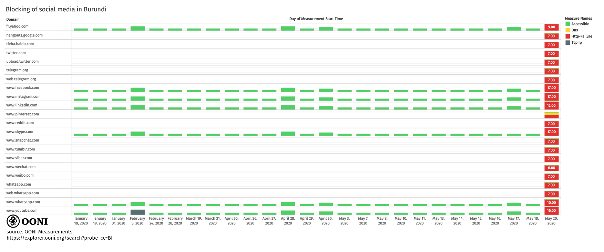

Yesterday, access to [social media was reportedly blocked in Burundi](https://www.bbc.com/news/world-africa-52737081) amid its 2020
general election.

The lead-up to the election was [marred by violence and unrest](https://www.aljazeera.com/news/2020/05/lead-up-burundi-election-marred-unrest-200517163130410.html),
as seven candidates vied to replace Incumbent President Nkurunziza, who
has been in power over the last 15 years. Despite [widespread deadly protests](https://www.theguardian.com/world/2015/may/07/burundi-protests-deaths-man-set-ablaze)
and a [coup attempt](https://www.bbc.com/news/world-africa-32724083),
President Nkurunziza won a third term in 2015 following [disputed elections](https://www.theguardian.com/world/2015/jul/24/burundi-pierre-nkurunziza-wins-third-term-disputed-election).
While President Nkurunziza [reportedly announced](https://www.dandc.eu/en/article/burundi-will-hold-presidential-parliamentary-and-municipal-elections-2020)
that he would not contest the next elections, he is set to become a
“[supreme guide to patriotism](https://www.bbc.com/news/world-africa-52682171)” as he
steps down now in 2020.

Burundi’s 2020 general election has not only been [questioned in terms of being free and fair](https://www.aljazeera.com/programmes/insidestory/2019/11/burundi-2020-elections-free-fair-191124182430057.html),
but it has also been
[criticized](https://www.bbc.com/news/world-africa-52682171) for
taking place during the [COVID-19 pandemic](https://www.who.int/emergencies/diseases/novel-coronavirus-2019/)
without adequate safeguards. Meanwhile, Access Now
[reported](https://www.accessnow.org/keepiton-burundi-silences-the-majority-on-election-day/)
that social media platforms were blocked in Burundi on election day,
starting in the morning of 20th May 2020.

In this report, we share [OONI network measurement data](https://explorer.ooni.org/search?until=2020-05-21&probe_cc=BI&test_name=web_connectivity&only=anomalies)
on the blocking of social media in Burundi amid its 2020 general
election.

* [Methods](#methods)

* [Blocking of social media websites](#blocking-of-social-media-websites)

* [Blocking of instant messaging apps](#blocking-of-instant-messaging-apps)

  * [WhatsApp](#whatsapp)

  * [Telegram](#telegram)

  * [Facebook Messenger](#facebook-messenger)

* [Conclusion](#conclusion)

# Methods

OONI Probe is [free and open source software](https://github.com/ooni)
designed to measure internet censorship and other forms of network
interference. The [OONI Probe app](https://ooni.org/install/)
(available for both [mobile](https://ooni.org/install/mobile) and
[desktop](https://ooni.org/install/desktop) platforms) includes tests
designed to [measure the blocking of websites](https://ooni.org/nettest/web-connectivity/) and instant
messaging apps ([WhatsApp](https://ooni.org/nettest/whatsapp/),
[Facebook Messenger](https://ooni.org/nettest/facebook-messenger/),
and [Telegram](https://ooni.org/nettest/telegram/)).

More specifically, the OONI Probe [Web Connectivity test](https://ooni.org/nettest/web-connectivity/) is designed to
measure the blocking of
[websites](https://ooni.org/support/faq/#which-websites-will-i-test-for-censorship-with-ooni-probe)
by attempting to perform a DNS lookup, TCP connection, and HTTP request
(to the URLs included in the [Citizen Lab test lists](https://github.com/citizenlab/test-lists/tree/master/lists))
from both a control vantage point and the local vantage point of the
user. The measurements collected from both vantage points are
automatically compared and if they differ, the result is flagged as
“anomalous”. Depending on the type of anomaly detected (DNS, TCP/IP,
HTTP), we can infer the type of blocking. The OONI Probe
[WhatsApp](https://ooni.org/nettest/whatsapp/), [Facebook Messenger](https://ooni.org/nettest/facebook-messenger/), and
[Telegram](https://ooni.org/nettest/telegram/) tests are designed to
measure the blocking of these apps through DNS lookups and by attempting
to establish TCP connections to the app endpoints.

Unless an OONI Probe user opts-out, their test results are automatically
sent to OONI’s servers, [processed](https://github.com/ooni/pipeline),
and [openly published](https://ooni.org/data/). Since April 2016,
[hundreds of thousands of OONI Probe tests have been run in Burundi](https://explorer.ooni.org/country/BI) from 9 local networks.

As part of this study, we examined [recent OONI measurements](https://explorer.ooni.org/search?until=2020-05-21&probe_cc=BI)
collected over the last months from Burundi in an attempt to corroborate
[reports](https://www.bbc.com/news/world-africa-52737081) on the
blocking of social media with network measurement data. As most OONI
measurements were collected on Econet (AS37336) over the last few days,
our findings are primarily limited to this network.

# Blocking of social media websites

Numerous social media websites were found to be blocked in Burundi on
20th May 2020, amid the 2020 general election.

The following chart illustrates the social media websites that we found
to be blocked in Burundi on Econet (AS37336) on 20th May 2020.

{{}}

**Source:** OONI measurements collected from Burundi, https://explorer.ooni.org/search?until=2020-05-22&probe_cc=BI&test_name=web_connectivity

What is evident from the above chart is that all of the tested social
media websites consistently presented network anomalies every time they
were tested on 20th May 2020. The fact that each of these sites was
tested multiple times on that day on Econet (AS37336), and that their
testing always presented anomalies, provides a strong signal of
potential blocking. When looking into the details of these anomalous
measurements, we observe that the HTTP requests consistently fail with a
[connection reset error](https://explorer.ooni.org/measurement/20200520T121941Z_AS37336_YrcLDykB6682Vba7pJp3ZlXXGDKtfu3NU5kxFdwK6HVc7FRG8j?input=https%3A%2F%2Ftieba.baidu.com%2F).

Furthermore, when comparing the anomalous measurements of 20th May 2020
with all the other OONI Probe measurements collected from the testing of
those sites in Burundi (prior to 20th May 2020), we observe that those
social media sites were previously accessible in the country. OONI
measurements show that many of these sites were consistently accessible
every time they were tested over the last years, and that they only
started to present anomalies on 20th May 2020. This sudden change --
which is evident in the measurements of many social media platforms --
strongly suggests that the blocking of these social media websites in
Burundi started at around the time of the 2020 general election.

More specifically, OONI measurements show that these social media
websites were blocked from the morning of the election day, [at least from 09:37 UTC](https://explorer.ooni.org/measurement/20200520T093759Z_AS37336_aYBHGgTX5D1QoNDZAMHK92ZRkgWP3Y2ExDAN6pOBOFN1mPER6N?input=https%3A%2F%2Fwww.facebook.com%2F)
on 20th May 2020. The absence of relevant OONI measurements from 19th
May 2020 limits our ability to determine if the blocking started before
the elections, though all measurements from 18th May 2020
[show](https://explorer.ooni.org/search?until=2020-05-21&probe_cc=BI&test_name=web_connectivity)
that these social media sites were accessible at the time.

The fact that the interference towards these websites only occurs when
we attempt to establish an HTTPS connection, as opposed to the IPs being
blocked or the DNS queries being interfered with, is a strong indication
of some form of Deep Packet Inspection (DPI) technology being used,
perhaps targeting the SNI field of the TLS connection.

As no previous OONI measurements (before 20th May 2020) were collected
for `www.weibo.com`, `www.wechat.com`, `www.snapchat.com`,
`hangouts.google.com`, `web.whatsapp.com`, `telegram.org`,
`web.telegram.org`, and `tieba.baidu.com`, we are unable to compare
their testing in Burundi over time.

The following table shares the relevant OONI measurements for each of
the blocked social media sites, as well as all other OONI measurements
collected from the testing of each site in Burundi.

| Domain              | Status on 20th May 2020 | OONI measurements                                                                                                   |
|---------------------|-------------------------|---------------------------------------------------------------------------------------------------------------------|
| www.skype.com       | Blocked                 | https://explorer.ooni.org/search?until=2020-05-21&probe_cc=BI&test_name=web_connectivity&domain=www.skype.com       |
| www.linkedin.com    | Blocked                 | https://explorer.ooni.org/search?until=2020-05-21&probe_cc=BI&test_name=web_connectivity&domain=www.linkedin.com    |
| www.youtube.com     | Blocked                 | https://explorer.ooni.org/search?until=2020-05-21&probe_cc=BI&test_name=web_connectivity&domain=www.youtube.com     |
| www.whatsapp.com    | Blocked                 | https://explorer.ooni.org/search?until=2020-05-21&probe_cc=BI&test_name=web_connectivity&domain=www.whatsapp.com    |
| web.whatsapp.com    | Blocked                 | https://explorer.ooni.org/search?until=2020-05-21&probe_cc=BI&test_name=web_connectivity&domain=web.whatsapp.com    |
| www.instagram.com   | Blocked                 | https://explorer.ooni.org/search?until=2020-05-21&probe_cc=BI&test_name=web_connectivity&domain=www.instagram.com   |
| twitter.com         | Blocked                 | https://explorer.ooni.org/search?until=2020-05-21&probe_cc=BI&test_name=web_connectivity&domain=twitter.com         |
| www.facebook.com    | Blocked                 | https://explorer.ooni.org/search?until=2020-05-21&probe_cc=BI&test_name=web_connectivity&domain=www.facebook.com    |
| www.weibo.com       | Blocked                 | https://explorer.ooni.org/search?until=2020-05-21&probe_cc=BI&test_name=web_connectivity&domain=www.weibo.com       |
| www.wechat.com      | Blocked                 | https://explorer.ooni.org/search?until=2020-05-21&probe_cc=BI&test_name=web_connectivity&domain=www.wechat.com      |
| www.pinterest.com   | Blocked                 | https://explorer.ooni.org/search?until=2020-05-21&probe_cc=BI&test_name=web_connectivity&domain=www.pinterest.com   |
| www.tumblr.com      | Blocked                 | https://explorer.ooni.org/search?until=2020-05-21&probe_cc=BI&test_name=web_connectivity&domain=www.tumblr.com      |
| www.viber.com       | Blocked                 | https://explorer.ooni.org/search?until=2020-05-21&probe_cc=BI&test_name=web_connectivity&domain=www.viber.com       |
| www.snapchat.com    | Blocked                 | https://explorer.ooni.org/search?until=2020-05-21&probe_cc=BI&test_name=web_connectivity&domain=www.snapchat.com    |
| hangouts.google.com | Blocked                 | https://explorer.ooni.org/search?until=2020-05-21&probe_cc=BI&test_name=web_connectivity&domain=hangouts.google.com |
| fr.yahoo.com        | Blocked                 | https://explorer.ooni.org/search?until=2020-05-21&probe_cc=BI&test_name=web_connectivity&domain=fr.yahoo.com        |
| telegram.org        | Blocked                 | https://explorer.ooni.org/search?until=2020-05-21&probe_cc=BI&test_name=web_connectivity&domain=telegram.org        |
| web.telegram.org    | Blocked                 | https://explorer.ooni.org/search?until=2020-05-21&probe_cc=BI&test_name=web_connectivity&domain=web.telegram.org    |
| www.reddit.com      | Blocked                 | https://explorer.ooni.org/search?until=2020-05-21&probe_cc=BI&test_name=web_connectivity&domain=www.reddit.com      |
| tieba.baidu.com     | Blocked                 | https://explorer.ooni.org/search?until=2020-05-21&probe_cc=BI&test_name=web_connectivity&domain=tieba.baidu.com     |

# Blocking of instant messaging apps

Both WhatsApp and Telegram were blocked in Burundi on election day, as
suggested by relevant OONI measurements.

## WhatsApp

On 20th May 2020, the WhatsApp app was
[measured](https://explorer.ooni.org/search?until=2020-05-21&probe_cc=BI&test_name=whatsapp)
on 3 local networks in Burundi: Econet (AS37336), Viettel Burundi
(AS327799), and Lacell Burundi (AS327720).

Starting at 04:06 UTC on 20th May 2020, we observe the [blocking of the WhatsApp app](https://explorer.ooni.org/measurement/20200520T040618Z_AS37336_g09tNCucQnJYy6DBcySo95NUJ46ppTJKYCWFToTm0IkyWSg6iN)
on Econet (AS37336). Similarly to the [Web Connectivity results](https://explorer.ooni.org/search?until=2020-05-21&probe_cc=BI&test_name=web_connectivity&only=anomalies&domain=web.whatsapp.com)
(discussed previously), we not only observe the blocking of WhatsApp’s
web interface (web.whatsapp.com), but we also see that it presents the
[exact same connection reset errors](https://explorer.ooni.org/measurement/20200520T040618Z_AS37336_g09tNCucQnJYy6DBcySo95NUJ46ppTJKYCWFToTm0IkyWSg6iN).
Furthermore, the measurements show that access to the WhatsApp mobile
app was blocked as well, since HTTP requests to WhatsApp’s registration
service consistently resulted in [connection reset errors](https://explorer.ooni.org/measurement/20200520T165341Z_AS37336_8GxKiHgXj5NLow9zvLV32lv2U1w8C2jgiHpe8Qivgq075bZwSb).
As all [measurements collected from this network](https://explorer.ooni.org/search?until=2020-05-21&probe_cc=BI&test_name=whatsapp&probe_asn=AS37336)
on 20th May 2020 consistently show the same failures, they strongly
suggest that WhatsApp was blocked in Burundi amid the 2020 general
election.

We do not observe blocking of the WhatsApp application endpoints when
doing a DNS resolution for eN.whatsapp.net or attempting to establish a
TCP connection to it. This is, however, a bit of a limitation in the
implementation of the [OONI WhatsApp test](https://ooni.org/nettest/whatsapp), as it does not send or
receive data from the app endpoints, which might be necessary in order
to trigger the DPI based blocking. The registration service blocking is
detected because, in that case, the test performs a full HTTPS request
to it.

We also observe the blocking of WhatsApp on Viettel Burundi (AS327799)
in the morning of 20th May 2020. Fewer [measurements were collected on this network](https://explorer.ooni.org/search?until=2020-05-21&probe_cc=BI&test_name=whatsapp&probe_asn=AS327799),
but they show the same connection reset errors for both web.whatsapp.com
and WhatsApp’s registration service. WhatsApp was [only tested once on
Lacell Burundi (AS327720)](https://explorer.ooni.org/search?until=2020-05-21&probe_cc=BI&test_name=whatsapp&probe_asn=AS327720)
on 20th May 2020 (at 16:56 UTC), and that one measurement shows that the
app was
[accessible](https://explorer.ooni.org/measurement/20200520T165601Z_AS327720_F14jOSUWWuHIe8yVRr6MMkl3mEhjXgdAfDWn3aEgAWPM4TXBFe).
It remains unclear, though, if WhatsApp was blocked on this network
earlier in the day.

## Telegram

Similarly to the testing of WhatsApp, Telegram was
[tested](https://explorer.ooni.org/search?until=2020-05-21&probe_cc=BI&test_name=telegram)
on 3 local networks in Burundi: Econet (AS37336), Viettel Burundi
(AS327799), and Lacell Burundi (AS327720).

Starting from 09:42 UTC on 20th May 2020, we observe the [blocking of Telegram](https://explorer.ooni.org/measurement/20200520T094236Z_AS37336_b9gSRqT3noTS3T2EwOhyIdzUwlVE4AsHlMKIkeGe8ZWvtlMMZr)
on Econet (AS37336). More specifically, we see that HTTP requests to
web.telegram.org result in [connection reset errors](https://explorer.ooni.org/measurement/20200520T094236Z_AS37336_b9gSRqT3noTS3T2EwOhyIdzUwlVE4AsHlMKIkeGe8ZWvtlMMZr)
(similarly to the [Web Connectivity testing of web.telegram.org](https://explorer.ooni.org/search?until=2020-05-21&probe_cc=BI&test_name=web_connectivity&domain=web.telegram.org)),
but HTTP POST requests and TCP connections to the tested Telegram
endpoints are successful. All other [measurements collected from this network](https://explorer.ooni.org/search?until=2020-05-21&probe_cc=BI&test_name=telegram&probe_asn=AS37336)
consistently present the same failures, strongly suggesting that
Telegram was blocked in Burundi on 20th May 2020. In contrast,
measurements collected from this network before 20th May 2020 show that
web.telegram.org was previously
[accessible](https://explorer.ooni.org/measurement/20200517T170013Z_AS37336_6ybbYI1al5rovNrIpwcCLDVfB8Lbrd52F4ydKmBe5jvsQhFw23).

Telegram also provided [signs of blocking on Viettel Burundi (AS327799)](https://explorer.ooni.org/measurement/20200520T073724Z_AS327799_rsWlgbMcEpk7d3oHaRNrvLv6Z3sJWclxbVuQDtbfKbQSRAQsIR),
where we observe that HTTP requests to web.telegram.org result in
connection reset errors. And similarly to the testing of WhatsApp,
Telegram was only tested once on Lacell Burundi (AS327720) on 20th May
2020 (at 16:56 UTC) and that measurement shows that the app was
[accessible](https://explorer.ooni.org/measurement/20200520T165624Z_AS327720_Nx2QH3PwbT8VKhE3GYVocPSmENSVEhbcTmCYaXIUfdJUHSGx8L).
It remains unclear, though, if Telegram was blocked on this network
earlier in the day.

## Facebook Messenger

While OONI’s Web Connectivity test clearly [shows the blocking of facebook.com](https://explorer.ooni.org/search?until=2020-05-21&probe_cc=BI&test_name=web_connectivity&domain=www.facebook.com),
we only observe [Facebook Messenger interference on the Lacell Burundi (AS327720)](https://explorer.ooni.org/measurement/20200520T165651Z_AS327720_FFjn0eg7OzuZs2CvcHZycyIhFONqQdwF4SZJo4qDsInSXt7YUM)
network.

OONI’s [Facebook Messenger test](https://ooni.org/nettest/facebook-messenger/) is designed to
measure the reachability of the app through DNS lookups to domains
associated with Facebook and by attempting to establish TCP connections
to Facebook’s endpoints. Almost all [measurements collected from Burundi](https://explorer.ooni.org/search?until=2020-05-21&probe_cc=BI&test_name=facebook_messenger)
on 20th May 2020 consistently show that the DNS lookups and TCP
connections were successful.

This is consistent with the hypothesis that Internet Service Providers
(ISPs) in Burundi appear to be using DPI technology to implement the
blocks (as discussed previously), which would therefore not have any
effect on the DNS lookups or the establishment of a TCP connection.

As a result, the OONI [Facebook Messenger test](https://ooni.org/nettest/facebook-messenger/) would not be able
to detect this sort of blocking. But even if the Facebook Messenger app
was not blocked, the blocking of facebook.com would likely result in the
interference of the app.

We have a [single measurement from Lacell Burundi (AS327720)](https://explorer.ooni.org/measurement/20200520T165651Z_AS327720_FFjn0eg7OzuZs2CvcHZycyIhFONqQdwF4SZJo4qDsInSXt7YUM)
which presents signs of DNS based interference. In particular, DNS
resolutions for hostnames corresponding to Facebook services resolve to
IP addresses in the 240.0.0.0/8 range, which is an IP space [reserved for future use](https://en.wikipedia.org/wiki/IPv4#Special-use_addresses). We
notice the same pattern of DNS based blocking for another [blocked website on the same network](https://explorer.ooni.org/measurement/20200520T165011Z_AS327720_hZxfUw75ZzgTwDmSh0kWMHT7XOcgfKdUr2VAvCE7STz93d72r0?input=http%3A%2F%2Fwww.luwaran.net%2F).

# Conclusion

OONI measurements have been [collected from Burundi since 2016](https://explorer.ooni.org/country/BI), and this is the first time
that we observe the [blocking of social media](https://explorer.ooni.org/search?until=2020-05-21&probe_cc=BI&test_name=web_connectivity&only=anomalies)
in the country.

It is quite likely the case that internet censorship on the Econet
(AS37336) and Viettel Burundi (AS327799) networks is applied through the
use of some form of Deep Packet Inspection (DPI) technology, as the
block is not implemented at the DNS or IP level.

It is also interesting to note that the blocks on the Lacell Burundi
(AS327720) network were implemented on a DNS level by returning an IP
address in the DNS answer which is in the “reserved for future use”
240.0.0.0/8 IP space.

While the measurements clearly show a censorship change in comparison to
previous measurements, there is still the need to expand the
longitudinal measurement coverage in order to detect and confirm
censorship cases with greater confidence.

As this study was carried out through the use of [free and open source software](https://ooni.org/install/), [open methodologies](https://ooni.org/nettest/), and [open data](https://ooni.org/data/), it can be expanded upon.

We thank all OONI Probe users in Burundi who contributed measurements,
making this study possible.
