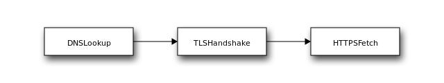

Reproduction rights site
[www.womenonweb.org](https://www.womenonweb.org) has been
blocked in Spain over the last months by several local Internet Service
Providers (ISPs). Once Spanish hacktivist communities noticed that
[www.womenonweb.org](http://www.womenonweb.org) was
inaccessible, they coordinated on running [OONI
Probe](https://ooni.org/install/) tests to collect
measurement data that could serve as evidence. The findings of this
investigation have been published in [an excellent
report](https://blog.magma.lavafeld.org/post/women-on-web-blocking/),
whose writing was coordinated by our former colleague, Vasilis Ververis.

We were involved in the technical review of the report. We found their
methodology particularly interesting. They used the OONI [Web
Connectivity experiment](https://ooni.org/nettest/web-connectivity/)
along with OONI's [experimental SNI based blocking
methodology](https://ooni.org/post/2020-iran-sni-blocking/),
and they also performed manual experiments with
[OpenSSL](https://www.openssl.org/) and
[cURL](https://curl.haxx.se/). Because OONI's mission is
to simplify and automate the collection of censorship evidence, we are
always interested in learning how we can expand [our Web Connectivity
methodology](https://ooni.org/nettest/web-connectivity/) to
automatically gather more data that is useful in specific cases.
Coincidentally, as part of [rewriting the Web Connectivity
implementation in Go](https://github.com/ooni/probe-engine/issues/40), we
have already written experimental code that combines [vanilla Web
Connectivity](https://ooni.org/nettest/web-connectivity/)
with [SNI blocking](https://ooni.org/post/2020-iran-sni-blocking/)
and other techniques. We therefore asked them to run this experimental
code with [www.womenonweb.org](https://www.womenonweb.org)
as a target. Our goal was to evaluate whether our working prototype
would have allowed them to obtain the same research results, without
resorting to manually running specifically tailored network experiments.

This report describes what we learned from this experience. We will
start off by describing recent research efforts focusing on SNI based
blocking. We will then discuss the blocking of
[www.womenonweb.org](https://www.womenonweb.org) and
explain why [Ververis et al](https://blog.magma.lavafeld.org/post/women-on-web-blocking/)
findings are very interesting in the context of SNI based blocking.
Afterwards, we briefly describe our experimental implementation and
explain how you can help us improve it. Next, we will describe how we
tailored our experimental implementation for the
[www.womenonweb.org](https://www.womenonweb.org) case. We
then describe our findings and what we plan on doing next.

## Index

[SNI Based Blocking Measurements](#sni-based-blocking-measurements)

[Blocking of Women on Web in Spain](#blocking-of-women-on-web-in-spain)

[Aladdin: our experimental implementation](#aladdin-our-experimental-implementation)

[Description of the Experiment](#description-of-the-experiment)

[Results Analysis & Discussion](#results-analysis-discussion)

[Conclusion](#conclusion)

## SNI Based Blocking Measurements

SNI based filtering appears to have been emerging around the world in
recent years. We previously reported on the [SNI based filtering of
Wikipedia in Venezuela](https://ooni.org/post/venezuela-blocking-wikipedia-and-social-media-2019/#blocking-of-wikipedia),
as well as on the SNI based filtering of [Facebook live-streaming in
Jordan](https://ooni.org/post/jordan-measuring-facebook-interference/)
(among other cases). Very interesting SNI based blocking investigations
have also been performed by researchers at India's Centre for Internet
and Society (CIS), who investigated, for example, [how the Jio ISP is
using SNI based blocking](https://cis-india.org/internet-governance/blog/reliance-jio-is-using-sni-inspection-to-block-websites) to prevent
access to specific websites.
[Researchers at Jigsaw have also started drafting improved website
blocking
methodologies](https://github.com/Jigsaw-Code/net-analysis/blob/master/netanalysis/blocktest/measure.sh)
that aim at providing the user with specific insights on what blocking
techniques are used. The SNI blocking bits of this Jigsaw methodology
[have already been integrated into OONI's measurement
engine](https://github.com/ooni/probe-engine/pull/298).
More recently, we published [a research
report](https://ooni.org/post/2020-iran-sni-blocking/)
evaluating our SNI blocking implementation in Iran, where we were able
to confirm that our SNI blocking experiment works as intended.

## Blocking of Women on Web in Spain

Starting from January 2020, OONI data shows that access to
www.womenonweb.org has been blocked on multiple local
networks in Spain, as illustrated through the following chart.

{{}}

**Source:** [OONI data on the blocking of Women on Web in Spain between
1st January 2020 to 28th April 2020](
https://explorer.ooni.org/search?until=2020-04-28&domain=www.womenonweb.org&probe_cc=ES).

This is not the first time that OONI data shows the blocking of
[www.womenonweb.org](http://www.womenonweb.org). Last
year, we
[reported](https://ooni.org/post/2019-blocking-abortion-rights-websites-women-on-waves-web/)
the blocking of
[www.womenonweb.org](http://www.womenonweb.org) and
[www.womenonwaves.org](http://www.womenonwaves.org) in
Brazil, Iran, Saudi Arabia, South Korea, and Turkey. More recently, as
mentioned above, this problem has been [studied and
documented](https://blog.magma.lavafeld.org/post/women-on-web-blocking/)
by Spanish hacktivists in coordination with our former colleague,
Vasilis Ververis (now working on the [Magma
Project](https://magma.lavafeld.org/)).

They (Ververis et al) subsequently published a
[report](https://blog.magma.lavafeld.org/post/women-on-web-blocking/)
which shares these findings. These are, in our view, the most
interesting findings, all occurring on Vodafone Spain:

1. SNI blocking only happens when connecting to the
[www.womenonweb.org](https://www.womenonweb.org) IP
address and, crucially, does not happen when connecting to an unrelated
server (which implies that [the SNI blocking
methodology](https://ooni.org/post/2020-iran-sni-blocking/)
that we recently implemented would not report any error in this case);

2. When connecting to
[www.womenonweb.org](https://www.womenonweb.org), the
inspection of the returned certificate indicates that
[Allot](https://www.allot.com/) most likely provided the
censorship equipment;

3. When ignoring the certificate validation error, the returned block
page provides further insights that could be useful to characterize the
blocking.

We will therefore discuss our experimental implementation architecture,
and how we tweaked its implementation to be able to reproduce the three
findings above.

## Aladdin: our experimental implementation

On May 1st, 2020 [we released a new experiment called
urlgetter](https://github.com/ooni/probe-engine/pull/567).
This experiment is not meant to be directly exposed to OONI Probe users.
Rather, we see this as a flexible building block that we will use to
implement the improved [Web
Connectivity](https://ooni.org/nettest/web-connectivity/)
experiment.

The gist of this experiment is that you give it a URL to measure. When
passed an `http://` or `https://` URL, this experiment fetches the
related web page. In addition, it also handles custom URL schemes, such
as `tlshandshake://` and `dnslookup://`. The former causes the
urlgetter to just perform a TLS handshake; the latter triggers a DNS
lookup.

Of course, the urlgetter allows us to force a specific SNI. It
additionally features a DNS cache, so that the results of a DNS lookup
could be validated before proceeding. This could be used, for example,
to ensure that the returned IP addresses are not part of the private
address space (a DNS based blocking technique that is frequently used).
What's more, the urlgetter also allows us to use different DNS engines
(e.g. we can use DNS over HTTPS).

In short, this basic building block allows us to decompose the steps of
fetching a web page, observe and evaluate intermediate results, and
decide how to move forward.

To understand how urlgetter could be very useful, let us consider the
classic steps involved in fetching a web page over HTTPS, which are
depicted in the following diagram:



Using our `miniooni` research client, you can perform these steps as
follows:

```bash
./miniooni -i dnslookup://example.com urlgetter

# TODO: extract and validate the returned IP addresses

./miniooni -ODNSCache="example.com 93.184.216.34"              \
           -i tlshandshake://example.com:443 urlgetter

# TODO: store and inspect the returned certificate and/or
# act upon errors

./miniooni -ODNSCache="example.com 93.184.216.34"              \
           -i https://example.com urlgetter

# TODO: inspect the returned web page and compare w/ a
# control measurement
```

Where the first step performs the DNS lookup, the second step does a TLS
handshake using the IP address returned in the previous step, the third
step fetches the web page.

Of course, we do not expect OONI Probe users to run these commands
manually. Also, you may have noticed that the above script contains a
bunch of TODOs. The aim of improving [Web Connectivity's
methodology](https://ooni.org/nettest/web-connectivity/) is
indeed to fill in the gaps with smart logic aimed at detecting the
several possible causes of blocking. Crucially, as mentioned above, we
already determined that we wanted to include the SNI blocking
methodology with every Web Connectivity run. This methodology could be
be easily implemented using urlgetter by doing something like:

```bash
./miniooni -OTLSServerName="example.com"                       \
           -i tlshandshake://helper.ooni.io:443 urlgetter
```

In this vein, we could also measure the consistency of the answer
returned by the system DNS by forcing another DNS lookup using DNS over
HTTPS, etc.

All in all, the availability of the urlgetter building block through
miniooni allowed us to [write Aladdin, a simple bash
script](https://github.com/bassosimone/aladdin) that could
implement all the steps we believe could be added to a future
enhancement of Web Connectivity. This bash script is, of course,
experimental, and we are planning on running further experiments like
the ones described in this report, to continue refining our methodology.
Once we are satisfied, we will rewrite the logic of this script in Go
and integrate it into OONI's measurement engine as the new Web
Connectivity.

You can help us move this process forward by [running
Aladdin](https://github.com/bassosimone/aladdin) in
interesting networks where you know there is blocking, and by discussing
the results with us. In this regard, the best course of action is
probably to [join our Slack
channels](https://slack.ooni.org/) and coordinate with us.

## Description of the Experiment

The version of aladdin that was used to measure
[www.womenonweb.org](https://www.womenonweb.org) contained
several checks, the most relevant of which are explained below. For
further information, we encourage you to read the [Aladdin
script](https://github.com/bassosimone/aladdin) and, if in
doubt, to ask us questions on [our Slack channels](https://slack.ooni.org/).

One of the first steps performed by Aladdin was indeed to [check for
SNI based blocking](https://github.com/bassosimone/aladdin/blob/9ef217926681d89917aeef9a8ed1019e41e88354/domain-check.bash#L157).
Since our SNI based blocking methodology connects to a test helper that
is unrelated to the domain we are testing, we expected this check to not
report any censorship for
[www.womenonweb.org](https://www.womenonweb.org) in the
specific ISP that exhibits the behaviour documented by [Ververis et
al](https://blog.magma.lavafeld.org/post/women-on-web-blocking/).
We will refer to this as the `sni_blocking` step.

Because we knew there was TLS interference when connecting to the
[www.womenonweb.org](https://www.womenonweb.org) IP
address with
[www.womenonweb.org](https://www.womenonweb.org) as the
TLS SNI, [we also added a subsequent step where we did just
that](https://github.com/bassosimone/aladdin/blob/9ef217926681d89917aeef9a8ed1019e41e88354/domain-check.bash#L234).
Incidentally, this step is what the Web Connectivity experiment that is
currently used by OONI Probe would already do. We expected this step to
fail, like it does for OONI Probe. We also wanted to assess whether it
collected useful extra evidence that is currently not collected by the
current version used by OONI Probe. We will refer to this as the
`system_resolver_validation` step.

Lastly, [we also wanted to fetch the block page returned by accessing
the website using HTTPS and by ignoring the invalid certificate
error](https://github.com/bassosimone/aladdin/blob/9ef217926681d89917aeef9a8ed1019e41e88354/domain-check.bash#L257).
While we could conclude that there is something fishy going on by just
observing that the TLS handshake fails, the report from [Ververis et
al](https://blog.magma.lavafeld.org/post/women-on-web-blocking/).
shows how the returned block page may potentially allow further
fingerprinting. We will refer to this as the `https_block
page_fetch` step.

## Results Analysis & Discussion

The result of the `sni_blocking` step confirms indeed that no
blocking occurs when we use the
[www.womenonweb.org](http://www.womenonweb.org) SNI with
an unrelated server used as a test helper.

This is the `miniooni` command that the measurement script invoked:

```bash
./miniooni -v -A session=58908c79-865c-4c57-a6f1-ed59a5608e95       \
           -A step=sni_blocking -O TLSServerName=www.womenonweb.org \
           -i tlshandshake://93.184.216.34:443 urlgetter
```

Where `93.184.216.34` is `example.org`'s IP address, `-O
TLSServerName` forces the SNI, and all the other options are functional
to make the submitted measurement more actionable. (We added a
`session` annotation to track a batch of related measurements and a
`step` annotation so that we know very easily the intent of each
measurement.)

Below is a relevant excerpt from the measurement result (which is
contained in the second line of [the published
report.jsonl file](https://gist.github.com/bassosimone/99f71de5f8fe30c60117b3acb630074f)\):

```JSON
{
  "annotations": {
    "step": "sni_blocking"
  },
  "input": "tlshandshake://93.184.216.34:443",
  "test_keys": {
    "tls_handshakes": [
      {
        "cipher_suite": "",
        "failure": "ssl_invalid_hostname",
        "negotiated_protocol": "",
        "no_tls_verify": false,
        "peer_certificates": [
          {
            "data": "MIIHQDCCBiigAwIBAgIQD9B43Ujxor1NDyupa2A4/jANBgkqhkiG9w0BAQsFADBNMQswCQYDVQQGEwJVUzEVMBMGA1UEChMMRGlnaUNlcnQgSW5jMScwJQYDVQQDEx5EaWdpQ2VydCBTSEEyIFNlY3VyZSBTZXJ2ZXIgQ0EwHhcNMTgxMTI4MDAwMDAwWhcNMjAxMjAyMTIwMDAwWjCBpTELMAkGA1UEBhMCVVMxEzARBgNVBAgTCkNhbGlmb3JuaWExFDASBgNVBAcTC0xvcyBBbmdlbGVzMTwwOgYDVQQKEzNJbnRlcm5ldCBDb3Jwb3JhdGlvbiBmb3IgQXNzaWduZWQgTmFtZXMgYW5kIE51bWJlcnMxEzARBgNVBAsTClRlY2hub2xvZ3kxGDAWBgNVBAMTD3d3dy5leGFtcGxlLm9yZzCCASIwDQYJKoZIhvcNAQEBBQADggEPADCCAQoCggEBANDwEnSgliByCGUZElpdStA6jGaPoCkrp9vVrAzPpXGSFUIVsAeSdjF11yeOTVBqddF7U14nqu3rpGA68o5FGGtFM1yFEaogEv5grJ1MRY/d0w4+dw8JwoVlNMci+3QTuUKf9yH28JxEdG3J37Mfj2C3cREGkGNBnY80eyRJRqzy8I0LSPTTkhr3okXuzOXXg38ugr1x3SgZWDNuEaE6oGpyYJIBWZ9jF3pJQnucP9vTBejMh374qvyd0QVQq3WxHrogy4nUbWw3gihMxT98wRD1oKVma1NTydvthcNtBfhkp8kO64/hxLHrLWgOFT/l4tz8IWQt7mkrBHjbd2XLVPkCAwEAAaOCA8EwggO9MB8GA1UdIwQYMBaAFA+AYRyCMWHVLyjnjUY4tCzhxtniMB0GA1UdDgQWBBRmmGIC4AmRp9njNvt2xrC/oW2nvjCBgQYDVR0RBHoweIIPd3d3LmV4YW1wbGUub3JnggtleGFtcGxlLmNvbYILZXhhbXBsZS5lZHWCC2V4YW1wbGUubmV0ggtleGFtcGxlLm9yZ4IPd3d3LmV4YW1wbGUuY29tgg93d3cuZXhhbXBsZS5lZHWCD3d3dy5leGFtcGxlLm5ldDAOBgNVHQ8BAf8EBAMCBaAwHQYDVR0lBBYwFAYIKwYBBQUHAwEGCCsGAQUFBwMCMGsGA1UdHwRkMGIwL6AtoCuGKWh0dHA6Ly9jcmwzLmRpZ2ljZXJ0LmNvbS9zc2NhLXNoYTItZzYuY3JsMC+gLaArhilodHRwOi8vY3JsNC5kaWdpY2VydC5jb20vc3NjYS1zaGEyLWc2LmNybDBMBgNVHSAERTBDMDcGCWCGSAGG/WwBATAqMCgGCCsGAQUFBwIBFhxodHRwczovL3d3dy5kaWdpY2VydC5jb20vQ1BTMAgGBmeBDAECAjB8BggrBgEFBQcBAQRwMG4wJAYIKwYBBQUHMAGGGGh0dHA6Ly9vY3NwLmRpZ2ljZXJ0LmNvbTBGBggrBgEFBQcwAoY6aHR0cDovL2NhY2VydHMuZGlnaWNlcnQuY29tL0RpZ2lDZXJ0U0hBMlNlY3VyZVNlcnZlckNBLmNydDAMBgNVHRMBAf8EAjAAMIIBfwYKKwYBBAHWeQIEAgSCAW8EggFrAWkAdwCkuQmQtBhYFIe7E6LMZ3AKPDWYBPkb37jjd80OyA3cEAAAAWdcMZVGAAAEAwBIMEYCIQCEZIG3IR36Gkj1dq5L6EaGVycXsHvpO7dKV0JsooTEbAIhALuTtf4wxGTkFkx8blhTV+7sf6pFT78ORo7+cP39jkJCAHYAh3W/51l8+IxDmV+9827/Vo1HVjb/SrVgwbTq/16ggw8AAAFnXDGWFQAABAMARzBFAiBvqnfSHKeUwGMtLrOG3UGLQIoaL3+uZsGTX3MfSJNQEQIhANL5nUiGBR6gl0QlCzzqzvorGXyB/yd7nttYttzo8EpOAHYAb1N2rDHwMRnYmQCkURX/dxUcEdkCwQApBo2yCJo32RMAAAFnXDGWnAAABAMARzBFAiEA5Hn7Q4SOyqHkT+kDsHq7ku7zRDuM7P4UDX2ft2Mpny0CIE13WtxJAUr0aASFYZ/XjSAMMfrB0/RxClvWVss9LHKMMA0GCSqGSIb3DQEBCwUAA4IBAQBzcIXvQEGnakPVeJx7VUjmvGuZhrr7DQOLeP4R8CmgDM1pFAvGBHiyzvCH1QGdxFl6cf7wbp7BoLCRLR/qPVXFMwUMzcE1GLBqaGZMv1Yh2lvZSLmMNSGRXdx113pGLCInpm/TOhfrvr0TxRImc8BdozWJavsn1N2qdHQuN+UBO6bQMLCD0KHEdSGFsuX6ZwAworxTg02/1qiDu7zW7RyzHvFYA4IAjpzvkPIaX6KjBtpdvp/aXabmL95YgBjT8WJ7pqOfrqhpcmOBZa6Cg6O1l4qbIFH/Gj9hQB5I0Gs4+eH6F9h3SojmPTYkT+8KuZ9w84Mn+M8qBXUQoYoKgIjN",
            "format": "base64"
          }
        ],
        "t": 0.339900763
      }
    ]
  }
}
```

Under normal conditions, we expect this experiment to *fail* by telling
us that the `example.org` server does not return a valid certificate
for the `www.womenonweb.org` website. This is exactly what the
`ssl_invalid_hostname` means in this context.

This finding is further confirmed by decoding from base64 and dumping
the certificate included in the measurement:

```bash
% echo $certificate | base64 -d | openssl x509 -inform der -noout -text
Certificate:
    Data:
        Version: 3 (0x2)
        Serial Number:
            0f:d0:78:dd:48:f1:a2:bd:4d:0f:2b:a9:6b:60:38:fe
    Signature Algorithm: sha256WithRSAEncryption
        Issuer: C=US, O=DigiCert Inc, CN=DigiCert SHA2 Secure Server CA
        Validity
            Not Before: Nov 28 00:00:00 2018 GMT
            Not After : Dec  2 12:00:00 2020 GMT
        Subject: C=US, ST=California, [...], CN=www.example.org
        Subject Public Key Info:
[...]
```

This clearly seems to be the certificate of `www.example.org`. We can
thus conclude from this that there is no DPI rule in the network that
blindly matches the `www.womenonweb.org` SNI. (We went on to manually
verify that the fingerprint of this certificate is indeed correct.)

Let us now focus on the `system_resolver_validation` step. The
related command was:

```bash
./miniooni -v -A session=58908c79-865c-4c57-a6f1-ed59a5608e95  \
           -A step=system_resolver_validation                  \
           -O DNSCache="www.womenonweb.org 67.213.76.19"       \
           -i https://www.womenonweb.org/ urlgetter
```

Here we are configuring the DNS cache in such a way that
`67.213.76.19` is returned as the IP address of
`www.womenonweb.org`, without making any network request. (This is
done because we have previously resolved `www.womenonweb.org` through
the system resolver and we want to reuse this result in this step,
without making an additional DNS request.)

We are marking this step as `system_resolver_validation` because
`67.213.76.19` was returned from the system resolver. Thus, if this
step succeeds, we can conclude that the IP address is either the address
of the server or the address of a transparent proxy that is letting us
reach the server without noticeably tampering with the TLS handshake.

As mentioned previously, this step is roughly equivalent to what OONI
currently implements with its [Web
Connectivity](https://ooni.org/nettest/web-connectivity/)
test. It follows the system resolver results, it validates certificates,
and it attempts to fetch the page hosted at the target URL. We expected
this measurement to fail by saying that it encountered an invalid
certificate, like [Ververis et
al.](https://blog.magma.lavafeld.org/post/women-on-web-blocking/)
found.

This is the relevant excerpt from the related measurement (the seventh
in the [report.jsonl file](https://gist.github.com/bassosimone/99f71de5f8fe30c60117b3acb630074f)\):

```JSON
{
  "annotations": {
    "step": "system_resolver_validation"
  },
  "input": "https://www.womenonweb.org/",
  "test_keys": {
    "dns_cache": [
      "www.womenonweb.org 67.213.76.19"
    ],
    "failure": "ssl_unknown_authority",
    "network_events": [
      {
        "address": "67.213.76.19:443",
        "failure": null,
        "operation": "connect",                 // 1
        "proto": "tcp",
        "t": 0.127838458
      },
      {
        "failure": null,
        "operation": "tls_handshake_start",
        "t": 0.127877221
      },
      {
        "failure": null,
        "num_bytes": 288,
        "operation": "write",
        "t": 0.128212052
      },
      {
        "failure": null,
        "num_bytes": 517,
        "operation": "read",
        "t": 0.147805763
      },
      {
        "failure": null,
        "num_bytes": 1559,
        "operation": "read",
        "t": 0.147886433
      },
      {
        "failure": null,
        "num_bytes": 7,
        "operation": "write",
        "t": 0.148626428
      },
      {
        "failure": "ssl_unknown_authority",     // 2
        "operation": "tls_handshake_done",
        "t": 0.148757176
      }
    ],
    "tls_handshakes": [
      {
        "failure": "ssl_unknown_authority",
        "peer_certificates": [
          {
            "data": "MIID3DCCAsSgAwIBAgIBATANBgkqhkiG9w0BAQsFADB/MQswCQYDVQQGEwJFUzEPMA0GA1UECAwGTWFkcmlkMQ8wDQYDVQQHDAZNYWRyaWQxDjAMBgNVBAoMBUFsbG90MQ4wDAYDVQQLDAVBbGxvdDEuMCwGA1UEAwwlYWxsb3QuY29tL2VtYWlsQWRkcmVzcz1pbmZvQGFsbG90LmNvbTAeFw0xNjEyMTYxMzA3NDlaFw0yNjEyMTYxMzA3NDlaMH8xCzAJBgNVBAYTAkVTMQ8wDQYDVQQIDAZNYWRyaWQxDzANBgNVBAcMBk1hZHJpZDEOMAwGA1UECgwFQWxsb3QxDjAMBgNVBAsMBUFsbG90MS4wLAYDVQQDDCVhbGxvdC5jb20vZW1haWxBZGRyZXNzPWluZm9AYWxsb3QuY29tMIIBIjANBgkqhkiG9w0BAQEFAAOCAQ8AMIIBCgKCAQEAtckdwPaklW7lAUz/jjFnePUeGNG0w9E1ajLq4UZOvol1ESRdiVXJhj43/4NtvFGiw0ujDwh8K5xErtaXx+W+Lk0yw2uXATBtdvr3pdDjcxNjUVYl6iis0lxgKff02fsLHdLvy9hJX08wsBF6NKW9YetM6WznDsWztucfg8a1QaUxFzwHxKjTaV9+RO1zosUgU6RIZwBJrXnyJPeMdbDeS7+WXIAQT1WlficRckAw4VX7l90AVXzng+Kf+SErsD0DtOiMS/nawa/0tW6whd6zmSaCtPJg37EBp3BQkpdnRvRCsG9h1aWkBUdFNb0mNbnHDP0dmWrDZEFKNmpeC6LmkQIDAQABo2MwYTAOBgNVHQ8BAf8EBAMCAQYwDwYDVR0TAQH/BAUwAwEB/zAdBgNVHQ4EFgQUqLwqHQ0a0mcpebqXCx9QL1ibqvcwHwYDVR0jBBgwFoAUqLwqHQ0a0mcpebqXCx9QL1ibqvcwDQYJKoZIhvcNAQELBQADggEBAHJsGkbv+mGhMHfc5z1UZGsH0rkV0U+tl/6hwutyMHPOtvHCwK30keSqiIz8E0grwkMAiS4Ir1w52hfJB0JndxWv1rBTk5gA5ASruhsNKcgvhDgfuVBwSw7ILX9wkl5J2Eu/ew3TRB8lDO7XX4DF0p2L1DyZl+r0HSB9NgQH4kI7HSxW0oo34bu+S/u3ycMZ1RjjzzVKtI5S6ydVz2qKVqhuSwuFJnndoKjrzMphwraNcKSTLyIj77FK1IUtiivprXk15/lrlnoK+zIlrCzR/Yl5pBYDjb1VhTLUBzm8uNV/dlYQqPygZFfK8Al/p1grILXWUHmdOaUX+AoWlitKDJo=",
            "format": "base64"
          }
        ],
        "t": 0.148757176
      }
    ]
  }
}
```

Note how (1) we actually connect to the specified IP address and (2) the
TLS handshake fails after a bunch of messages are exchanged. This is
consistent with the `ssl_unknown_authority` error, meaning that the
TLS handshake is completed, but the client doesn't trust the server
certificate, because the signing authority is not recognized by the
client itself. ([QED](https://en.wikipedia.org/wiki/Q.E.D.).)

Now, let us inspect the information that is automatically included in
this measurement and that was collected manually using `openssl` by
Ververis et al. For example, the rejected authority certificate looks
like this:

```bash
% echo $certificate | base64 -d | openssl x509 -inform der -text -noout 
Certificate:
    Data:
        Version: 3 (0x2)
        Serial Number: 1 (0x1)
    Signature Algorithm: sha256WithRSAEncryption
        Issuer: C=ES, ST=Madrid, L=Madrid, O=Allot, OU=Allot, CN=allot.com/emailAddress=info@allot.com
        Validity
            Not Before: Dec 16 13:07:49 2016 GMT
            Not After : Dec 16 13:07:49 2026 GMT
        Subject: C=ES, ST=Madrid, L=Madrid, O=Allot, OU=Allot, CN=allot.com/emailAddress=info@allot.com
[...]
```

The certificate seems to be signed by
[Allot](https://www.allot.com/corporate/about/profile/),
"*a leading provider of innovative network intelligence and security
solutions [\...] powered by inline DPI technology [that] generates
insightful intelligence that empowers our customers to optimize,
innovate, and capitalize on every service opportunity*". Since Allot
produces appliances to perform network intelligence, it seems plausible
to speculate that Vodafone Spain may indeed be using such appliances to
implement blocking. This corroborates the [findings of Ververis et
al](https://blog.magma.lavafeld.org/post/women-on-web-blocking/).

Lastly, for the `https_block page_fetch` step, we told `miniooni`
to accept any certificate returned by the server without validating it
(by using the `NoTLSVerify=true` flag). The purpose of this experiment
is to fetch (a) the full certificate chain and (b) the returned block
page. (A future version of [OONI Probe
Engine](https://github.com/ooni/probe-engine) may be able
to perform this step and the previous step together [by perhaps
delaying the verification of the certificate
chain](https://github.com/ooni/probe-engine/issues/614).)

```bash
./miniooni -v -A session=58908c79-865c-4c57-a6f1-ed59a5608e95  \
           -A step=https_block page_fetch                      \
           -O DNSCache="www.womenonweb.org 67.213.76.19"       \
           -O NoTLSVerify=true                                 \
           -i https://www.womenonweb.org/ urlgetter
```

Below is an excerpt from the measurement result (ninth line in the
[report.jsonl file](https://gist.github.com/bassosimone/99f71de5f8fe30c60117b3acb630074f)\):

```JSON
{
  "annotations": {
    "step": "https_block page_fetch"
  },
  "input": "https://www.womenonweb.org/",
  "test_keys": {
    "dns_cache": [
      "www.womenonweb.org 67.213.76.19"
    ],
    "failure": null,
    "network_events": [    // 1
      {
        "address": "67.213.76.19:443",
        "failure": null,
        "operation": "connect",
        "proto": "tcp",
        "t": 0.126191679
      },
      {
        "failure": null,
        "operation": "tls_handshake_done",
        "t": 0.194781749
      },
      {
        "failure": null,
        "operation": "http_transaction_done",
        "t": 0.211349336
      }
    ],
    "requests": [
      {
        "failure": null,
        "request": {
          "method": "GET",
          "url": "https://www.womenonweb.org/"
        },
        "response": {       // 2
          "body": {
            "data": "PGh0bWw+PGJvZHk+PHA+UG9yIGNhdXNhcyBhamVuYXMgYSBWb2RhZm9uZSwgZXN0YSB3ZWIgbm8gZXN04SBkaXNwb25pYmxlPC9ib2R5PjwvaHRtbD4=",
            "format": "base64"
          },
          "code": 502,
          "headers": {
            "Content-Length": "86",
            "Content-Type": "text/html"
          }
        },
        "t": 0.000207157
      }
    ],
    "tls_handshakes": [
      {
        "cipher_suite": "TLS_ECDHE_RSA_WITH_AES_128_GCM_SHA256",
        "failure": null,
        "negotiated_protocol": "",
        "no_tls_verify": true,
        "peer_certificates": [      // 3
          {
            "data": "MIIC7TCCAdWgAwIBAgIQeyWaXgAAAADZAAAAAAAAADANBgkqhkiG9w0BAQsFADB/MQswCQYDVQQGEwJFUzEPMA0GA1UECAwGTWFkcmlkMQ8wDQYDVQQHDAZNYWRyaWQxDjAMBgNVBAoMBUFsbG90MQ4wDAYDVQQLDAVBbGxvdDEuMCwGA1UEAwwlYWxsb3QuY29tL2VtYWlsQWRkcmVzcz1pbmZvQGFsbG90LmNvbTAeFw0xOTA0MTgyMjAxMjdaFw0yMTA0MTcyMjAxMjdaMB0xGzAZBgNVBAMMEnd3dy53b21lbm9ud2ViLm9yZzCBnzANBgkqhkiG9w0BAQEFAAOBjQAwgYkCgYEA9UyD0WP2caXbskYiQXhHX1etn2nJcc5pp72SHfkpXdk1Qqc5aQ6BPfFcLR3sA0F6Sz5LCT+0sKjXfwe2iWehvqxqeQ7SFjnTYDDvCmn5tG9JHyQmJrPtm7HKOcoRc3zBnFpU2vjzcFDj3UoSzD49q6zLZmY6ITe3F62GF4TzCskCAwEAAaNLMEkwHQYDVR0RBBYwFIISd3d3LndvbWVub253ZWIub3JnMB0GA1UdDgQWBBTaBm61uoraUud1o/DmVreIOD+JjDAJBgNVHRMEAjAAMA0GCSqGSIb3DQEBCwUAA4IBAQCHJZpRLixRQqojiB4+JywPW2LSNcBklXaPUWBhTE7SptCjpbVeNDJejQIt72DEiFc/ubrdSJtBAz9GzGiIcVQ4QIxYhxZz6h4MSDTbJ8UKHZ30nCinmOpTzZ4WvrLaMm9V8OzuTaqs6shaykVVerWFBG0PfH0IBxGjZskzo4no/dPosk/A++xY5wDCvWt4Dr7TTBDMI/QZxilQYLkiMj2mOXgoxH8hOWmrz+WpcHnVtJBg1iO+tLHnTzveARp4IAk33E+P3tb6ojm1OmYppO2AeEV+AMhLR2jSIbDdnMdvbvUymfB2kyuBi9UFIfQIE7lPN6U8TZnCr/rH7GRa1/+L",
            "format": "base64"
          },
          {
            "data": "MIID3DCCAsSgAwIBAgIBATANBgkqhkiG9w0BAQsFADB/MQswCQYDVQQGEwJFUzEPMA0GA1UECAwGTWFkcmlkMQ8wDQYDVQQHDAZNYWRyaWQxDjAMBgNVBAoMBUFsbG90MQ4wDAYDVQQLDAVBbGxvdDEuMCwGA1UEAwwlYWxsb3QuY29tL2VtYWlsQWRkcmVzcz1pbmZvQGFsbG90LmNvbTAeFw0xNjEyMTYxMzA3NDlaFw0yNjEyMTYxMzA3NDlaMH8xCzAJBgNVBAYTAkVTMQ8wDQYDVQQIDAZNYWRyaWQxDzANBgNVBAcMBk1hZHJpZDEOMAwGA1UECgwFQWxsb3QxDjAMBgNVBAsMBUFsbG90MS4wLAYDVQQDDCVhbGxvdC5jb20vZW1haWxBZGRyZXNzPWluZm9AYWxsb3QuY29tMIIBIjANBgkqhkiG9w0BAQEFAAOCAQ8AMIIBCgKCAQEAtckdwPaklW7lAUz/jjFnePUeGNG0w9E1ajLq4UZOvol1ESRdiVXJhj43/4NtvFGiw0ujDwh8K5xErtaXx+W+Lk0yw2uXATBtdvr3pdDjcxNjUVYl6iis0lxgKff02fsLHdLvy9hJX08wsBF6NKW9YetM6WznDsWztucfg8a1QaUxFzwHxKjTaV9+RO1zosUgU6RIZwBJrXnyJPeMdbDeS7+WXIAQT1WlficRckAw4VX7l90AVXzng+Kf+SErsD0DtOiMS/nawa/0tW6whd6zmSaCtPJg37EBp3BQkpdnRvRCsG9h1aWkBUdFNb0mNbnHDP0dmWrDZEFKNmpeC6LmkQIDAQABo2MwYTAOBgNVHQ8BAf8EBAMCAQYwDwYDVR0TAQH/BAUwAwEB/zAdBgNVHQ4EFgQUqLwqHQ0a0mcpebqXCx9QL1ibqvcwHwYDVR0jBBgwFoAUqLwqHQ0a0mcpebqXCx9QL1ibqvcwDQYJKoZIhvcNAQELBQADggEBAHJsGkbv+mGhMHfc5z1UZGsH0rkV0U+tl/6hwutyMHPOtvHCwK30keSqiIz8E0grwkMAiS4Ir1w52hfJB0JndxWv1rBTk5gA5ASruhsNKcgvhDgfuVBwSw7ILX9wkl5J2Eu/ew3TRB8lDO7XX4DF0p2L1DyZl+r0HSB9NgQH4kI7HSxW0oo34bu+S/u3ycMZ1RjjzzVKtI5S6ydVz2qKVqhuSwuFJnndoKjrzMphwraNcKSTLyIj77FK1IUtiivprXk15/lrlnoK+zIlrCzR/Yl5pBYDjb1VhTLUBzm8uNV/dlYQqPygZFfK8Al/p1grILXWUHmdOaUX+AoWlitKDJo=",
            "format": "base64"
          }
        ],
        "t": 0.194781749,
        "tls_version": "TLSv1.2"
      }
    ]
  },
  "test_name": "urlgetter",
  "test_runtime": 0.211467163,
  "test_start_time": "2020-05-04 13:53:50",
  "test_version": "0.0.3"
}
```

Where (1) we clearly see from the network events that we arrive without
errors to the end of the HTTP transaction (i.e. we fetch the web page);
(2) we see that the server returns a small, possibly-binary block page;
(3) we have the full certificate chain returned by the server.

If we decode the body from base64, we get this block page, which is
consistent with the same block page [mentioned in the report by
Ververis et
al](https://blog.magma.lavafeld.org/post/women-on-web-blocking/):

```HTML
<html><body><p>Por causas ajenas a Vodafone, esta web no está disponible</body></html>
```

Our (obvious) claim that the above is a block page, rather than the real
home page of [www.womenonweb.org](http://www.womenonweb.org), is
further substantiated by the eight measurement, where we successfully
fetch the real home page using [Psiphon](https://psiphon.ca/) to evade censorship. (We do
not show this measurement here for brevity; a real Web Connectivity
measurement would have probably determined this by talking to our
backend infrastructure instead.)

Let us instead focus on the certificate chain collected during this
experiment. The following snippet shows part of the content of the first
certificate in the chain:

```bash
% echo $certificate | base64 -d | openssl x509 -inform der -text -noout
Certificate:
    Data:
        Version: 3 (0x2)
        Serial Number:
            7b:25:9a:5e:00:00:00:00:d9:00:00:00:00:00:00:00
    Signature Algorithm: sha256WithRSAEncryption
        Issuer: C=ES, ST=Madrid, L=Madrid, O=Allot, OU=Allot, CN=allot.com/emailAddress=info@allot.com
        Validity
            Not Before: Apr 18 22:01:27 2019 GMT      # 1
            Not After : Apr 17 22:01:27 2021 GMT
        Subject: CN=www.womenonweb.org
[...]
```

This certificate was created around a year ago (see annotation 1). Interestingly, it does
not match [the similar certificate published by Ververis et
al](https://github.com/ooni/probe-cli/files/4567648/www_womenonweb_org.crt.txt),
which was created on 27th January 2019. Nonetheless, this certificate
and the one published by Ververis et al. clearly appear to be similar.

## Conclusion

We confirm the findings by [Ververis et
al](https://blog.magma.lavafeld.org/post/women-on-web-blocking/).
They could have obtained the same data using an enhanced version of
[OONI Probe](https://ooni.org/install/) implementing the
logic described in this report. The improvements we implemented enabled
us to reproduce the findings by Ververis et al. by running a single
command that automatically submits data to our collector.

We see that fetching the full certificate chain is much more informative
than fetching the block page, but in other cases the block page could
contain references to the vendor. Therefore, it seems that there is also
some value in going all the way to fetching the block page.

The urlgetter experiment building block is valuable to us because it
allows us to experiment with different logic for an improved
implementation of [OONI's Web Connectivity
test](https://ooni.org/nettest/web-connectivity/). (You
can, by the way, help this process, by [running the Aladdin bash
script](https://github.com/bassosimone/aladdin/blob/9ef217926681d89917aeef9a8ed1019e41e88354/domain-check.bash)
and [discussing its results with
us](https://slack.openobservatory.org/).)

It seems there are at least two ways to interfere with TLS. The case
where filtering is applied for a specific SNI regardless of the server
we are connecting to ([as previously
seen](https://ooni.org/post/2020-iran-sni-blocking/)). And
the case where, instead, blocking is only applied when using the right
IP address (as seen here). Thus, our [SNI blocking
methodology](https://ooni.org/post/2020-iran-sni-blocking/),
combined with ordinary Web Connectivity, allows us to conclude which
blocking strategy for offending SNIs is actually implemented by ISPs.

In the coming weeks, we are going to perform more data analysis
pertaining to results collected with
[Aladdin](https://github.com/bassosimone/aladdin) by
volunteers that are already engaging with us. The result of this process
will be an improved [Web Connectivity
test](https://ooni.org/nettest/web-connectivity/)
implemented in Go with enhanced capabilities, that will eventually be
shipped as part of the [OONI Probe apps](https://ooni.org/install/) so that people worldwide
can easily run these experiments.
