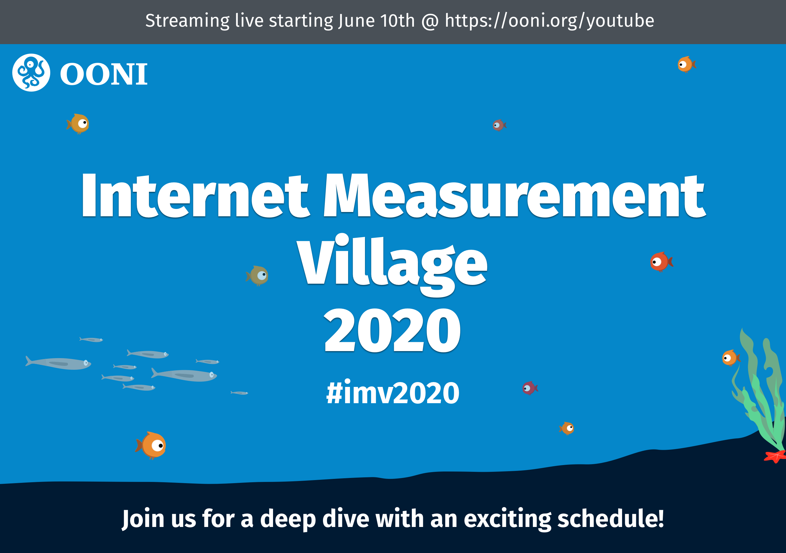
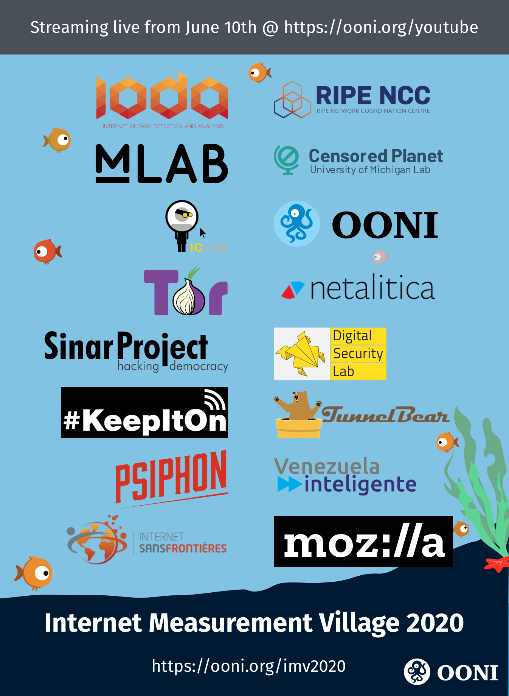

{{}}

We are excited to bring the first online Internet Measurement Village to
you this month.

Interested in learning all about Internet measurement and how to detect
Internet censorship? Curious to explore open datasets on Internet
censorship and Internet outages? Eager to learn how advocates are
pushing back against Internet shutdowns and defending a free and open
Internet?

Join us for the online Internet Measurement Village, **starting on
Wednesday, 10th June 2020 and ending on Friday, 3rd July 2020**.

Almost every day, we will **live-stream a presentation on the [OONI YouTube Channel](https://www.youtube.com/c/OONIorg)**, where you can
ask questions through the live chat. [Subscribe to our channel](https://www.youtube.com/c/OONIorg) and learn more details
through the schedule below.

* [About](#about)

* [Schedule](#schedule)

# About

The Internet Measurement Village 2020 is an online event that aims to
share the tools, datasets, and methodologies of projects that measure
the Internet. These include projects like [OONI](https://ooni.org/),
[Censored Planet](https://censoredplanet.org/), and
[ICLab](https://iclab.org/) that measure Internet censorship, projects
like [M-Lab](https://www.measurementlab.net/) that measure Internet
performance, as well as projects like [IODA](https://ioda.caida.org/)
that measure Internet outages. The Village also features local
measurement projects (in countries like
[Venezuela](https://vesinfiltro.com/),
[Malaysia](https://sinarproject.org/), and
[Ukraine](https://medium.com/@cyberlabukraine)), as well as
circumvention tool projects and advocacy efforts against Internet
shutdowns.

{{}}

Our goal is to share skills and knowledge around Internet measurement to
encourage greater community participation in examining how the Internet
works and defending a free and open Internet.

We were initially planning on hosting the Internet Measurement Village
during the last two days of the [Internet Freedom Festival (IFF)](https://internetfreedomfestival.org/), but since it was
[cancelled](https://internetfreedomfestival.org/wiki/index.php/Cancellation_of_the_2020_Internet_Freedom_Festival)
in light of the COVID-19 pandemic, we decided to host a version of the
Village *online* this year.

To enable anyone around the world to learn about Internet measurement,
we decided to host presentations that are [live-streamed on the OONI YouTube channel](https://www.youtube.com/c/OONIorg). This will make it
easier for people to watch the presentations asynchronously
(accommodating different time zones and schedules), as well as in the
future (expanding beyond the dates of the Village). Since the
presentations will continue to live on the OONI YouTube channel, we’re
hoping that the broader internet freedom community will find this
footage useful for their research, advocacy, and training efforts. To
enable participation, **a live chat will be included in the stream** so
that anyone can ask the presenters questions.

Apart from the live-streamed presentations, you’re welcome to **[join the OONI Slack channel](https://slack.ooni.org/)** (bridged with IRC) --
which includes a public `internet-measurement-village-20` channel --
to participate in discussions, ask questions, share updates and anything
else related to the Internet measurement world.

Next year, we hope to host an in-person version of the Internet
Measurement Village as part of the
[IFF](https://internetfreedomfestival.org/). This year, please join us
online for the Internet Measurement Village 2020!

# Schedule

All presentations will be [live-streamed on the OONI YouTube channel](https://www.youtube.com/c/OONIorg), where you can ask
questions through the live chat. Each presentation will last **60
minutes**.

| Date                      | Time (UTC) | Session title                                                                           | Brief session description                                                                                                                                                                                         | Speaker(s)                                                          |
|---------------------------|------------|-----------------------------------------------------------------------------------------|-------------------------------------------------------------------------------------------------------------------------------------------------------------------------------------------------------------------|---------------------------------------------------------------------|
| Wednesday, 10th June 2020 | 14:00      | **OONI: Measuring Internet Censorship**                                                     | Presentation of [OONI](https://ooni.org/)’s tools, methodologies, and dataset.                                                                                                                                                         | Maria Xynou (OONI)                                                  |
| Thursday, 11th June 2020  | 15:00      | **Test lists for measuring Internet censorship – applicability,problems and solutions**     | The session will focus on the [Citizen Lab test lists](https://ooni.org/get-involved/contribute-test-lists) that popular network measurement tools use to uncover Internet censorship. You will receive practical advice on how to update the test list of your country. | Igor Valentovitch (Netalitica)                                      |
| Monday, 15th June 2020    | 14:00      | **M-Lab: Measuring Internet Performance**                                                   | Presentation of [M-Lab](https://www.measurementlab.net/)'s tools, methodologies, and dataset.                                                                                                                                                        | Lai Yi Ohlsen (M-Lab)                                               |
| Tuesday, 16th June 2020   | 14:00      | tbd                                                                                     | tbd                                                                                                                                                                                                               | tbd                                                                 |
| Wednesday, 17th June 2020   | 14:00      | **RIPE Internet Measurements**                                                              | Presentation of [RIPE](https://www.ripe.net/)'s tools, methodologies, and dataset.                                                                                                                                                         | Vesna Manojlovic & Emile Aben (RIPE)                                |
| Thursday, 18th June 2020  | 14:00      | **KeepItOn campaign: Advocating against Internet shutdowns**                                | Presentation of Access Now’s [KeepItOn campaign](https://www.accessnow.org/keepiton/) and how it fights Internet shutdowns around the world.                                                                                                             | Felicia Anthonio (Access Now)                                       |
| Friday, 19th June 2020    | 14:00      | **Circumventing Internet Censorship with Psiphon**                                          | This session presents  [Psiphon](https://psiphon.ca/) and discusses how network measurement data informs the development and deployment of circumvention tools and strategies.                                                            | Keith McManamen or Jacob Klein (Psiphon)                            |
| Monday, 22nd June 2020    | 14:00      | **Advocating against Internet shutdowns in West Africa**                                    | Presentation of [advocacy efforts](https://internetwithoutborders.org/) against Internet shutdowns in West Africa.                                                                                                                                       | Julie Owono (Internet Sans Frontières)                              |
| Tuesday, 23rd June 2020   | 9:00       | **Measuring Internet Censorship in Southeast Asia**                                         | Presentation of [censorship measurement research](https://sinarproject.org/) in Southeast Asia.                                                                                                                                                | Khairil Yusof (Sinar Project)                                       |
| Wednesday, 24th June 2020 | 14:00      | **How we tried to establish a nationwide Internet censorship measurement system in Ukraine** | This session describes efforts in creating a [nationwide censorship measurement system](https://medium.com/@cyberlabukraine) in Ukraine.                                                                                                                 | Anton Koushnir & Natalia Onyshchenko (Digital Security Lab Ukraine) |
| Thursday, 25th June 2020  | 14:00      | **Coordinación de la medición de la censura en Venezuela**                                  | Presentación de mediciones de censura y esfuerzos de incidencia en Venezuela.                                                                                                                                     | Mariengracia Chirinos (Journalist)                                  |
| Friday, 26th June 2020    | 14:00      | **Censored Planet: Measuring Internet censorship remotely**                                 | Presentation of [Censored Planet](https://censoredplanet.org/)'s tools, methodologies, and dataset.                                                                                                                                              | Ram Sundara Raman (Censored Planet)                                  |
| Monday, 29th June 2020    | 14:00      | **Internet Censorship, DNS poisoning and Phishing in Venezuela**                            | Presentation of [censorship measurement research](https://vesinfiltro.com/) in Venezuela.                                                                                                                                                     | Andrés Azpúrua (VEsinFiltro)                                        |
| Tuesday, 30th June 2020   | 14:00      | **Circumventing Internet Censorship with Tor**                                              | This session presents [Tor](https://www.torproject.org/) and discusses how it can be used to circumvent Internet censorship.                                                                                                                     | Philipp Winter or Cecylia Bocovich (Tor)                            |
| Wednesday, 1st July 2020  | 14:00      | **ICLab: Measuring Internet Censorship**                                                    | Presentation of [ICLab](https://iclab.org/)'s tools and methodologies.                                                                                                                                                                  | Zack Weinberg (ICLab)                                               |
| Thursday, 2nd July 2020   | 14:00      | **Circumventing Internet Censorship with TunnelBear**                                       | This session presents [TunnelBear](https://www.tunnelbear.com/) and discusses how it can be used to circumvent Internet censorship.                                                                                                              | Shames Abdelwahab (TunnelBear)                                      |
| Friday, 3rd July 2020     | 17:00      | **IODA: Examining Internet blackouts through open data**                                    | Presentation of [IODA](https://ioda.caida.org/)'s dashboard and methodologies.                                                                                                                                                                 | Ramakrishna Padmanabhan (CAIDA)                                     |

*The schedule will be updated over the next few weeks (for example, to include details for the missing session on 16th June 2020).*

Looking forward to seeing you online soon in the Internet Measurement Village 2020!
