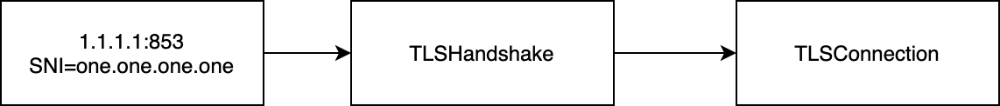

[DNS over TLS](https://tools.ietf.org/html/rfc7858) (DoT) is a network protocol that
allows one to use [DNS](https://en.wikipedia.org/wiki/Domain_Name_System) over
[TLS](https://en.wikipedia.org/wiki/Transport_Layer_Security) (i.e. with encryption
and authentication of the remote DNS server).

We investigated whether DoT works in Iran by gathering a list of 31
well-known DoT endpoints and running experiments from four distinct
Iranian mobile and fixed-line Internet Service Providers (ISPs):
[MCI](https://ipinfo.io/AS197207), [TCI](https://ipinfo.io/AS58224),
[Irancell](https://ipinfo.io/AS44244), and [Shatel](https://ipinfo.io/AS31549).

We discovered that:

* 57% of the endpoints are blocked on a least one ISP;

* the blocking is not implemented uniformly across ISPs;

* most blocking happens by interfering with the TLS handshake;

* in some cases TLS handshake blocking seems to depend on the SNI,
  while in other cases it seems to depend strictly on the TCP endpoint
  being used;

* forcing TLSv1.3 does not change the rate of successful TLS
  handshakes compared to letting the server choose a TLS version
  between v1.0 and v1.3.

In this report, we share details from our experiments and findings.

## Index

[Introduction](#introduction)

[Experiment Description](#experiment-description)

[Analysis of Results](#analysis-of-results)

[Conclusion](#conclusion)

## Introduction

[DNS over TLS](https://tools.ietf.org/html/rfc7858) (DoT)
uses port `853/tcp`. In some cases, the DoT endpoint contains
an IP address. For example, Cloudflare's public DoT server uses the
`1.1.1.1:853` endpoint. In this case, the [TLS ClientHello
message](https://tls.ulfheim.net/) uses `1.1.1.1` as the
[SNI](https://en.wikipedia.org/wiki/Server_Name_Indication) and
the corresponding [X.509](https://en.wikipedia.org/wiki/X.509) certificate,
of course, lists `1.1.1.1` as a valid IP address for the
domain. In other cases, the DoT endpoint contains a domain name. For
example, Cloudflare's public DoT server is *also* available
using the `one.one.one.one:853` endpoint and the `one.one.one.one` SNI.

When the endpoint contains a domain name, another DNS resolver is
required to get the IP address for that domain. Such a resolver is
typically the system resolver, which is the resolver used by default by
the operating system. Unless the user changes the operating system
configuration, such a resolver is usually the one advertised by the
[ISP](https://en.wikipedia.org/wiki/Internet_service_provider) using
[DHCP](https://en.wikipedia.org/wiki/Dynamic_Host_Configuration_Protocol).

The following diagram illustrates what happens when you use the system
resolver to lookup the IP addresses for the `one.one.one.one`
domain name. In most cases, you will get two IPv4 addresses:
`1.1.1.1` and `1.0.0.1` (as well as, possibly, IPv6 addresses),
as illustrated below.

{{}}
**Figure 1**: *Resolving DoT domain name using the system resolver*.

Once you know the IP address or addresses for a domain, you run the
same flow you would run if given a DoT endpoint containing an IP address
rather than a domain name. That is, you connect to the TCP endpoint,
establish a TLS connection, and use it to send DNS queries and receive
DNS replies. This is illustrated by the following diagram.

{{}}
**Figure 2**: *Establishing TLS connection with DoT server*.

A censor that wishes to block DoT could thus act in two ways.

Firstly, it could censor the system resolver so that you cannot resolve,
for example, `one.one.one.one`.

Secondly, it could prevent users from connecting to
`1.1.1.1:853` and performing a TLS handshake with the correct
SNI (`one.one.one.one` in this example). Of course, because a
specific DoT server typically works as intended if you know the right IP
address and SNI for the TLS handshake, it means that typically a censor
needs to be concerned with preventing you from accessing the TLS
endpoint on port `853`, which cannot be done with DNS blocking
alone.

Therefore, to investigate how DoT works in Iran, we checked whether we
could resolve the DoT endpoint domain name (where available), whether we
could perform a TLS handshake with the selected endpoint, and whether we
could successfully use it to resolve domains.

In the rest of this report, we describe our experiment, discuss the
results (providing a high level overview and investigating specific
aspects, such as DNS based blocking and TLS blocking), and we share the
conclusions.

## Experiment Description

We prepared a list of 31 well-known DoT endpoints. We compiled
`miniooni` from [ooni/probe-engine@f3594e5a](https://github.com/ooni/probe-engine/commit/f3594e5a134b0ddffae82fbf376efe16e9de8403)
and tested each of these endpoints. We ran this experiment
on 29th and 30th May, 2020.

We used the `-O DNSCache="<domain> <ip>"` option of
`miniooni` to ensure we were checking the first two IP
addresses associated with an endpoint, rather than just
the first IP.

Because we were testing DoT, we didn't bother with resolving specific
domain names. We always queried for `example.com`, under the
assumption that either DoT works for every domain, because we can query
it, or it does not work for any domain, because it's blocked.

The general command that we ran for a given `$endpoint` was like:

```
miniooni $extra_options -O ResolverURL=dot://$endpoint        \
                        -i dnslookup://example.com urlgetter
```

We also repeated some experiments forcing `miniooni` to use
TLSv1.3, to check whether forcing the latest version of TLS would make
a difference. (The default is instead that of using the version of TLS
between v1.0 and v1.3 chosen by the server.)

We ran the following number of measurements in the following networks:

|      ASN |  Network name | Access link | #Measurements |
| -------- | ------------- | ----------- | ------------- |
|  AS24940 | Hetzner (VPN) |         N/A |           116 |
|  AS44244 |      Irancell |      mobile |           116 |
| AS197207 |           MCI |      mobile |           116 |
|  AS58224 |           TCI |  fixed-line |           116 |
|  AS31549 |        Shatel |  fixed-line |            82 |

[Hetzner](https://www.hetzner.com/) is
an Internet hosting company where we were running a VPN server; we used
it as a control vantage point to compare other measurements to.
[Irancell](https://en.wikipedia.org/wiki/MTN_Irancell) is
an Iranian TLC that operates a large mobile network in the country.
[MCI](https://en.wikipedia.org/wiki/Mobile_Telecommunication_Company_of_Iran) is
the largest mobile operator.
[TCI](https://en.wikipedia.org/wiki/Telecommunication_Company_of_Iran) is
the incumbent fixed-line operator of Iran.
[Shatel](https://en.wikipedia.org/wiki/Shatel) is
another large Iranian ISP, which provides both ADSL and wireless lines.
We ran tests on Shatel using an ADSL connection.

## Analysis of Results

We tested 31 DoT endpoints. One of them was not working on any network
and its DNS record also appeared to be broken from Italy, so we
excluded it. 13 endpoints out of 30 (i.e. 43% of them) worked on all the
tested ISPs. Therefore, 57% of the tested endpoints were blocked.

The following table shows the frequency of measurement errors for all ISPs. The
`Failure` column indicates the overall measurement failure, and the `Frequency`
column indicates how many times such failure occurred. (The failures listed
for the Hetzner VPN are respectively caused by experimental errors as well as
by the aforementioned broken domain, as we will explain soon.)

|  Network |               Failure |     Frequency |
| -------- | --------------------- | ------------- |
|  Hetzner |    dns_nxdomain_error |             2 |
|  Hetzner |    unknown_failure... |            34 |
|  Hetzner |                  null |            80 |
| Irancell |    dns_nxdomain_error |             2 |
| Irancell | generic_timeout_error |            30 |
| Irancell |    unknown_failure... |            34 |
| Irancell |                  null |            50 |
|      MCI |    dns_nxdomain_error |             2 |
|      MCI | generic_timeout_error |            31 |
|      MCI |    unknown_failure... |            34 |
|      MCI |                  null |            49 |
|      TCI |             eof_error |             8 |
|      TCI | generic_timeout_error |            18 |
|      TCI |    unknown_failure... |            34 |
|      TCI |                  null |            56 |
|   Shatel |    dns_nxdomain_error |             2 |
|   Shatel |             eof_error |             5 |
|   Shatel | generic_timeout_error |            27 |
|   Shatel |                  null |            48 |

The failures indicated above have the following meaning:

* `dns_nxdomain_error` indicates that a DNS resolver said a
specific name does not exist;

* `eof_error` indicates that a TCP connection was unexpectedly closed;

* `generic_timeout_error` indicates that some operation timed out;

* `null` indicates that no error occurred;

* `unknown_failure...`  can safely be ignored in this
context because it just indicates that we tested a DoT server for which
a single IP address existed, hence our attempt at also using the
secondary IP address failed. We therefore excluded the measurements
containing this error.

The `dns_nxdomain_error` failure is, of course, clearly DNS
related. This is the aforementioned endpoint that we could not
resolve even from Italy. So we excluded it.

We classified the remaining errors and we attempted to correlate the
overall failure with the first failure occurring during the TLS
handshake. The following table shows the results. The `MeasurementFailure`
column indicates the overall failure of a measurement. The
`set(TLSFailures)` column indicates the set of errors observed during
TLS handshakes. If such column value is `null` it means there was no
TLS handshake; if it is `[null]` it means instead that all TLS
handshakes succeeded. The `Frequency` column indicates how many times
a specific set of TLS failures was observed along with a specific
overall measurement failure.

|  Network |    MeasurementFailure |                   set(TLSFailures) | Frequency |
| -------- | --------------------- | ---------------------------------- | --------- |
| Irancell | generic_timeout_error |            [generic_timeout_error] |        30 |
|      MCI | generic_timeout_error |            [generic_timeout_error] |        30 |
|      MCI | generic_timeout_error |                             [null] |         1 |
|      TCI | generic_timeout_error |            [generic_timeout_error] |        16 |
|      TCI |             eof_error |                        [eof_error] |         8 |
|      TCI | generic_timeout_error |                               null |         2 |
|   Shatel | generic_timeout_error |            [generic_timeout_error] |        22 |
|   Shatel |             eof_error | [generic_timeout_error, eof_error] |         3 |
|   Shatel |             eof_error |                        [eof_error] |         2 |
|   Shatel | generic_timeout_error |                             [null] |         2 |
|   Shatel | generic_timeout_error | [generic_timeout_error, eof_error] |         3 |


We can conclude that in all cases except a few cases in Shatel, MCI, and TCI
most `generic_timeout_error` and `eof_error` failures certainly
are caused by TLS failures. For this reason, we are going to focus on
the blocking of TLS handshakes. Yet, later we will also investigate the
measurements where the failure does not seem to be directly and
immediately related to what happened in the TLS handshake.

### TLS Blocking

We grouped measurements by the network in which they were run. We ran a
script on each measurement group. The purpose of this script was to
obtain the number of successes and/or failures for each IP address that
belongs to a specific DoT service. As far as this section is concerned,
we say that a measurement is successful if we can complete a TLS
handshake with the DoT endpoint. Otherwise, we say that the
measurement failed.

#### Hetzner

All the tested DoT endpoints were of course working from the
Hetzner-based VPN, which we used as a control vantage point to compare
measurements.

#### Irancell

The following table shows the failures observed from Irancell. A
`null` failure indicates that the experiment succeeded. A `null` TLS
version indicates that no TLS version was negotiated. The `Frequency`
column indicates how many times we observed a specific result.

|            Endpoint |                                   SNI | Failure | TLS version | Frequency |
| ------------------- | ------------------------------------- | ------- | ----------- | ----- |
|         1.0.0.1:853 |                               1.0.0.1 |    null |     TLSv1.3 |     4 |
|         1.0.0.1:853 |                       one.one.one.one | TIMEOUT |        null |    12 |
|         1.0.0.1:853 |      1dot1dot1dot1.cloudflare-dns.com | TIMEOUT |        null |    12 |
|         1.1.1.1:853 |                               1.1.1.1 | TIMEOUT |        null |    12 |
|         1.1.1.1:853 |                       one.one.one.one | TIMEOUT |        null |    12 |
|         1.1.1.1:853 |      1dot1dot1dot1.cloudflare-dns.com | TIMEOUT |        null |    12 |
|         8.8.4.4:853 |                               8.8.4.4 | TIMEOUT |        null |    12 |
|         8.8.4.4:853 |                            dns.google | TIMEOUT |        null |    12 |
|         8.8.8.8:853 |                               8.8.8.8 | TIMEOUT |        null |    12 |
|         8.8.8.8:853 |                            dns.google | TIMEOUT |        null |    12 |
|         9.9.9.9:853 |                               9.9.9.9 |    null |     TLSv1.3 |     4 |
|         9.9.9.9:853 |                         dns.quad9.net | TIMEOUT |        null |    12 |
|        9.9.9.10:853 |                   dns-nosec.quad9.net |    null |     TLSv1.3 |     4 |
| 149.112.112.112:853 |                         dns.quad9.net | TIMEOUT |        null |    12 |
|  159.69.198.101:853 |                    dot-de.blahdns.com | TIMEOUT |        null |    24 |
| 149.112.112.112:853 |                       149.112.112.112 |    null |     TLSv1.3 |     4 |
| 176.103.130.130:853 |                       dns.adguard.com | TIMEOUT |        null |    12 |
| 176.103.130.131:853 |                       dns.adguard.com | TIMEOUT |        null |    12 |

We observe that some of the most popular services (e.g. Google's DNS)
are not accessible from this vantage point. In all cases, either the TLS
handshake succeeds or terminates with a timeout. It is interesting to
note that the same endpoint could or could not be accessible depending
on the SNI being used. For example, `9.9.9.9:853` is accessible
when using `9.9.9.9` or `dns-nosec.quad9.net` as SNI;
inaccessible with `dns.quad9.net`. Likewise, `1.0.0.1:853` works with
`1.0.0.1` as SNI and fails with `one.one.one.one`.

#### MCI

The following table shows the failures observed from MCI.

|            Endpoint |                                   SNI | Failure | TLS version | Frequency |
| ------------------- | ------------------------------------- | ------- | ----------- | ----- |
|         1.0.0.1:853 |                               1.0.0.1 | TIMEOUT |        null |    12 |
|         1.0.0.1:853 |                       one.one.one.one | TIMEOUT |        null |    12 |
|         1.0.0.1:853 |      1dot1dot1dot1.cloudflare-dns.com | TIMEOUT |        null |    12 |
|         1.1.1.1:853 |                               1.1.1.1 |    null |     TLSv1.3 |     4 |
|         1.1.1.1:853 |                       one.one.one.one |    null |     TLSv1.3 |     4 |
|         1.1.1.1:853 |      1dot1dot1dot1.cloudflare-dns.com |    null |     TLSv1.3 |     4 |
|         8.8.4.4:853 |                               8.8.4.4 | TIMEOUT |        null |    12 |
|         8.8.4.4:853 |                            dns.google | TIMEOUT |        null |    12 |
|         8.8.8.8:853 |                               8.8.8.8 | TIMEOUT |        null |    12 |
|         8.8.8.8:853 |                            dns.google | TIMEOUT |        null |    12 |
|         9.9.9.9:853 |                               9.9.9.9 | TIMEOUT |        null |    12 |
|         9.9.9.9:853 |                         dns.quad9.net | TIMEOUT |        null |    12 |
|        9.9.9.10:853 |                   dns-nosec.quad9.net | TIMEOUT |        null |    12 |
| 149.112.112.112:853 |                         dns.quad9.net | TIMEOUT |        null |    12 |
| 149.112.112.112:853 |                       149.112.112.112 | TIMEOUT |        null |    12 |
|  185.228.168.10:853 |    adult-filter-dns.cleanbrowsing.org | TIMEOUT |        null |    12 |
|   185.228.168.9:853 | security-filter-dns.cleanbrowsing.org | TIMEOUT |        null |    12 |
| 185.228.168.168:853 |   family-filter-dns.cleanbrowsing.org | TIMEOUT |        null |    12 |

Also in this case we see consistent timeouts during TLS handshakes.
While in the previous network the blocking of `9.9.9.9` was
incomplete, here the blocking of Cloudflare DNS is incomplete:
`1.0.0.1` is blocked but `1.1.1.1` is not. Notably,
the blocking does not depend on the SNI alone, but it seems to depend on
the IP: `1.0.0.1:853` which does not work with SNI equal to
`one.one.one.one`, while `1.1.1.1:853` works as
intended with such an SNI.

This is [one of the measurements](https://gist.github.com/bassosimone/604a9d674238c2ed75da2e1ce0bac25d#file-20200529t184927z_as197207_cjsrzo-json)
that failed:

```JSON
{
  "input": "dnslookup://example.com",
  "probe_asn": "AS197207",
  "report_id": "20200529T184927Z_AS197207_CJSrZOavWNbfKOM3c1N6STCTIRxWiP8Hr9wSzaein4ZjlYHr9G",
  "resolver_asn": "AS197207",
  "test_keys": {
    "dns_cache": [
      ""
    ],
    "failure": "generic_timeout_error",
    "network_events": [
      {
        "failure": null,
        "operation": "resolve_start",
        "t": 0.000141754
      },
      {
        "failure": null,
        "operation": "dns_round_trip_start",
        "t": 0.000336556
      },
      {
        "address": "1.0.0.1:853",
        "failure": null,
        "operation": "connect",                     // 1
        "proto": "tcp",
        "t": 0.114608362
      },
      {
        "failure": null,
        "operation": "tls_handshake_start",         // 2
        "t": 0.114624373
      },
      {
        "failure": null,
        "num_bytes": 261,
        "operation": "write",                       // 3
        "t": 0.115186152
      },
      {
        "failure": "generic_timeout_error",         // 4
        "operation": "read",
        "t": 10.115200612
      },
      {
        "failure": "generic_timeout_error",
        "operation": "tls_handshake_done",
        "t": 10.115399137
      },
      {
        "failure": "generic_timeout_error",
        "operation": "dns_round_trip_done",
        "t": 10.115495971
      }
    ]
  }
}
```

We clearly see that (1) we connect successfully, (2) we start the TLS
handshake, (3) we write the ClientHello message, and (4) we timeout
waiting for the ServerHello message.

We were also wondering whether _not_ forcing a specific version of
TLS had an impact on this kind of blocking. We therefore repeated the
measurement forcing TLSv1.3. The relevant part of [the corresponding
measurement](https://gist.github.com/bassosimone/604a9d674238c2ed75da2e1ce0bac25d#file-20200529t185034z_as197207_waehqu-json)
is as follows:

```JSON
{
  "report_id": "20200529T185034Z_AS197207_WAEHqumLvUEVe0906xJjqUaFsFOJdMXxoHRpOScar3fgN3Us3e",
  "test_keys": {
    "dns_cache": [
      ""
    ],
    "network_events": [
      {
        "failure": null,
        "operation": "resolve_start",
        "t": 0.000255566
      },
      {
        "failure": null,
        "operation": "dns_round_trip_start",
        "t": 0.00039169
      },
      {
        "address": "1.0.0.1:853",
        "failure": null,
        "operation": "connect",
        "proto": "tcp",
        "t": 0.114715378
      },
      {
        "failure": null,
        "operation": "tls_handshake_start",
        "t": 0.114749918
      },
      {
        "failure": null,
        "num_bytes": 261,
        "operation": "write",
        "t": 0.115099435
      },
      {
        "failure": "generic_timeout_error",
        "operation": "read",
        "t": 10.12390586
      },
      {
        "failure": "generic_timeout_error",
        "operation": "tls_handshake_done",
        "t": 10.124356902
      },
      {
        "failure": "generic_timeout_error",
        "operation": "dns_round_trip_done",
        "t": 10.12445338
      }
```

As you can see, the structure of the JSON snippet is the same. Overall,
forcing TLSv1.3 did not change the result comparing to letting the
server pick a version between v1.0 and v1.3.

#### TCI

The following table shows the failures observed from TCI.

|            Endpoint |                                   SNI | Failure | TLS version | Frequency |
| ------------------- | ------------------------------------- | ------- | ----------- | ----- |
|         1.0.0.1:853 |                               1.0.0.1 |    null |     TLSv1.3 |     4 |
|         1.0.0.1:853 |                       one.one.one.one |    null |     TLSv1.3 |     4 |
|         1.0.0.1:853 |      1dot1dot1dot1.cloudflare-dns.com |    null |     TLSv1.3 |     5 |
|         1.1.1.1:853 |                               1.1.1.1 | TIMEOUT |        null |    12 |
|         1.1.1.1:853 |                       one.one.one.one | TIMEOUT |        null |    12 |
|         1.1.1.1:853 |      1dot1dot1dot1.cloudflare-dns.com | TIMEOUT |        null |    12 |
|         8.8.4.4:853 |                               8.8.4.4 | TIMEOUT |        null |    12 |
|         8.8.4.4:853 |                            dns.google | TIMEOUT |        null |    12 |
|         8.8.8.8:853 |                               8.8.8.8 | TIMEOUT |        null |    12 |
|         8.8.8.8:853 |                            dns.google | TIMEOUT |        null |    12 |
|         9.9.9.9:853 |                               9.9.9.9 |    null |     TLSv1.3 |     4 |
|         9.9.9.9:853 |                         dns.quad9.net |    null |     TLSv1.3 |     4 |
|        9.9.9.10:853 |                   dns-nosec.quad9.net |    null |     TLSv1.3 |     4 |
| 149.112.112.112:853 |                         dns.quad9.net | TIMEOUT |        null |    12 |
|  159.69.198.101:853 |                    dot-de.blahdns.com |     EOF |        null |     8 |
| 149.112.112.112:853 |                       149.112.112.112 |    null |     TLSv1.3 |     4 |
| 176.103.130.130:853 |                       dns.adguard.com |     EOF |        null |     4 |
| 176.103.130.131:853 |                       dns.adguard.com |     EOF |        null |     4 |

Also in this case, we see that some DoT endpoints work, while others are
blocked. We again see that Cloudflare DNS blocking seems to be
independent of the SNI being used. In fact, we see that with SNI
`one.one.one.one`, `1.0.0.1:853` works, while `1.1.1.1:853` fails.

Another difference is that we see `dot-de.blahdns.com` and
`dns.adguard.com` being blocked with the connection being
closed (`EOF`), as opposed to with a timeout (`TIMEOUT`). This the relevant snippet of is
[one of the
measurements](https://gist.github.com/bassosimone/604a9d674238c2ed75da2e1ce0bac25d#file-20200529t180716z_as58224_xlxeowh-json) regarding
`dns.adguard.com` that failed:

```JSON
{
  "probe_asn": "AS58224",
  "report_id": "20200529T180716Z_AS58224_XLxEoWh9ZK8ZEGza32TUMRFquB1BujsOI4nBLrY7bkHTf1EzTj",
  "resolver_asn": "AS58224",
  "test_keys": {
    "dns_cache": [
      ""
    ],
    "network_events": [
      {
        "failure": null,
        "operation": "resolve_start",
        "t": 0.000241651
      },
      {
        "failure": null,
        "operation": "dns_round_trip_start",
        "t": 0.000465461
      },
      {
        "failure": null,
        "operation": "resolve_start",
        "t": 0.000469994
      },
      {
        "failure": null,
        "operation": "resolve_done",
        "t": 0.241027373
      },
      {
        "address": "176.103.130.130:853",
        "failure": null,
        "operation": "connect",
        "proto": "tcp",
        "t": 0.484321535
      },
      {
        "failure": null,
        "operation": "tls_handshake_start",
        "t": 0.484337571
      },
      {
        "failure": null,
        "num_bytes": 285,
        "operation": "write",                              // 1
        "t": 0.484662834
      },
      {
        "failure": "eof_error",
        "operation": "read",                               // 2
        "t": 2.739924664
      },
      {
        "failure": "eof_error",
        "operation": "tls_handshake_done",
        "t": 2.740157413
      },
      {
        "failure": "eof_error",
        "operation": "dns_round_trip_done",
        "t": 2.740262478
      },
```

Like in previous networks, we observe that the anomaly (in this case an
`eof_error`) occurs after we have written the ClientHello (1).
It is also interesting to observe that the `eof_error` (which
means that the connection is closed by the remote host, or a middlebox),
occurs more than two seconds after we sent the ClientHello (2). This
behaviour could possibly be explained by retransmissions. Yet we checked
the whole dataset and noticed a consistent pattern: the
`eof_error` always arrives after some seconds. For now, we
will not investigate this behaviour further, but we will possibly do
that as part of future work.

#### Shatel

The following table shows the failures observed from Shatel.

|            Endpoint |                                   SNI | Failure | TLS version | Frequency |
| ------------------- | ------------------------------------- | ------- | ----------- | ----- |
|         1.0.0.1:853 |                               1.0.0.1 |    null |     TLSv1.3 |     4 |
|         1.0.0.1:853 |                       one.one.one.one | TIMEOUT |        null |    12 |
|         1.0.0.1:853 |      1dot1dot1dot1.cloudflare-dns.com | TIMEOUT |        null |    12 |
|         1.1.1.1:853 |                               1.1.1.1 | TIMEOUT |        null |    12 |
|         1.1.1.1:853 |                       one.one.one.one | TIMEOUT |        null |    12 |
|         1.1.1.1:853 |      1dot1dot1dot1.cloudflare-dns.com | TIMEOUT |        null |    12 |
|         8.8.4.4:853 |                               8.8.4.4 | TIMEOUT |        null |    12 |
|         8.8.4.4:853 |                            dns.google | TIMEOUT |        null |    12 |
|         8.8.8.8:853 |                               8.8.8.8 | TIMEOUT |        null |    12 |
|         8.8.8.8:853 |                            dns.google | TIMEOUT |        null |    12 |
|         9.9.9.9:853 |                               9.9.9.9 |    null |     TLSv1.3 |     4 |
|         9.9.9.9:853 |                         dns.quad9.net | TIMEOUT |        null |    12 |
|        9.9.9.10:853 |                   dns-nosec.quad9.net |    null |     TLSv1.3 |     4 |
| 149.112.112.112:853 |                         dns.quad9.net | TIMEOUT |        null |    12 |
|  159.69.198.101:853 |                    dot-de.blahdns.com |     EOF |        null |     5 |
|  159.69.198.101:853 |                    dot-de.blahdns.com | TIMEOUT |        null |     9 |
| 149.112.112.112:853 |                       149.112.112.112 |    null |     TLSv1.3 |     4 |
| 176.103.130.130:853 |                       dns.adguard.com |     EOF |        null |     4 |
| 176.103.130.130:853 |                       dns.adguard.com | TIMEOUT |        null |     1 |
| 176.103.130.131:853 |                       dns.adguard.com |     EOF |        null |     3 |
| 176.103.130.131:853 |                       dns.adguard.com | TIMEOUT |        null |     4 |


The results are similar to the ones on other networks. We see some
timeouts and some cases where the connection is closed. We see that
blocking is partial for some DoT providers. For example, the
`9.9.9.9` SNI is not blocked, but `dns.quad9.net` is blocked.

### Endpoint-Based TLS Blocking

On MCI and TCI we observed an interesting pattern where the blocking
seemed to be independent of the SNI and dependent on the endpoint. For
example, in TCI `1.0.0.1:853` works with
`one.one.one.one`, while `1.1.1.1:853` is blocked with the same SNI.

To better understand what is happening on TCI, we used OpenSSL to
connect to `1.0.0.1:853` using `1.1.1.1` as the SNI,
as well as to `1.1.1.1:853` using `1.0.0.1` as the SNI.

This is what happens when we use the `1.0.0.1:853` endpoint
with `1.1.1.1` as the SNI:

```
$ openssl s_client -servername 1.1.1.1 -connect 1.0.0.1:853
CONNECTED(00000006)
depth=2 C = US, O = DigiCert Inc, OU = www.digicert.com, CN = DigiCert Global Root CA
verify return:1
depth=1 C = US, O = DigiCert Inc, CN = DigiCert ECC Secure Server CA
verify return:1
depth=0 C = US, ST = California, L = San Francisco, O = "Cloudflare, Inc.", CN = cloudflare-dns.com
verify return:1
---
Certificate chain
0 s:C = US, ST = California, L = San Francisco, O = "Cloudflare, Inc.", CN = cloudflare-dns.com
  i:C = US, O = DigiCert Inc, CN = DigiCert ECC Secure Server CA
1 s:C = US, O = DigiCert Inc, CN = DigiCert ECC Secure Server CA
  i:C = US, O = DigiCert Inc, OU = www.digicert.com, CN = DigiCert Global Root CA
---
Server certificate
-----BEGIN CERTIFICATE-----
MIIFxjCCBUygAwIBAgIQAczjGN6fVn+rKySQH62nHTAKBggqhkjOPQQDAjBMMQsw
CQYDVQQGEwJVUzEVMBMGA1UEChMMRGlnaUNlcnQgSW5jMSYwJAYDVQQDEx1EaWdp
Q2VydCBFQ0MgU2VjdXJlIFNlcnZlciBDQTAeFw0xOTAxMjgwMDAwMDBaFw0yMTAy
MDExMjAwMDBaMHIxCzAJBgNVBAYTAlVTMRMwEQYDVQQIEwpDYWxpZm9ybmlhMRYw
FAYDVQQHEw1TYW4gRnJhbmNpc2NvMRkwFwYDVQQKExBDbG91ZGZsYXJlLCBJbmMu
MRswGQYDVQQDExJjbG91ZGZsYXJlLWRucy5jb20wWTATBgcqhkjOPQIBBggqhkjO
PQMBBwNCAATFIHCMIEJQKB59REF8MHkpHGNeHUSbxfdxOive0qKksWw9ash3uMuP
LlBT/fQYJn9hN+3/wr7pC125fuHfHOJ0o4ID6DCCA+QwHwYDVR0jBBgwFoAUo53m
H/naOU/AbuiRy5Wl2jHiCp8wHQYDVR0OBBYEFHCV3FyjjmYH28uBEMar58OoRX+g
MIGsBgNVHREEgaQwgaGCEmNsb3VkZmxhcmUtZG5zLmNvbYIUKi5jbG91ZGZsYXJl
LWRucy5jb22CD29uZS5vbmUub25lLm9uZYcEAQEBAYcEAQAAAYcEop+ENYcQJgZH
AEcAAAAAAAAAAAAREYcQJgZHAEcAAAAAAAAAAAAQAYcQJgZHAEcAAAAAAAAAAAAA
ZIcQJgZHAEcAAAAAAAAAAABkAIcEop8kAYcEop8uATAOBgNVHQ8BAf8EBAMCB4Aw
HQYDVR0lBBYwFAYIKwYBBQUHAwEGCCsGAQUFBwMCMGkGA1UdHwRiMGAwLqAsoCqG
KGh0dHA6Ly9jcmwzLmRpZ2ljZXJ0LmNvbS9zc2NhLWVjYy1nMS5jcmwwLqAsoCqG
KGh0dHA6Ly9jcmw0LmRpZ2ljZXJ0LmNvbS9zc2NhLWVjYy1nMS5jcmwwTAYDVR0g
BEUwQzA3BglghkgBhv1sAQEwKjAoBggrBgEFBQcCARYcaHR0cHM6Ly93d3cuZGln
aWNlcnQuY29tL0NQUzAIBgZngQwBAgIwewYIKwYBBQUHAQEEbzBtMCQGCCsGAQUF
BzABhhhodHRwOi8vb2NzcC5kaWdpY2VydC5jb20wRQYIKwYBBQUHMAKGOWh0dHA6
Ly9jYWNlcnRzLmRpZ2ljZXJ0LmNvbS9EaWdpQ2VydEVDQ1NlY3VyZVNlcnZlckNB
LmNydDAMBgNVHRMBAf8EAjAAMIIBfgYKKwYBBAHWeQIEAgSCAW4EggFqAWgAdgCk
uQmQtBhYFIe7E6LMZ3AKPDWYBPkb37jjd80OyA3cEAAAAWiVHhSLAAAEAwBHMEUC
IQDlnoPeMXtFkRsy3Vs0eovk3ILKt01x6bgUdMlmQTFIvAIgcAn0lFSjiGzHm2eO
jDZJzMiP5Uaj0Jwub9GO8RkxkkoAdQCHdb/nWXz4jEOZX73zbv9WjUdWNv9KtWDB
tOr/XqCDDwAAAWiVHhVsAAAEAwBGMEQCIFC0n0JModeol8b/Qicxd5Blf/o7xOs/
Bk0j9hdc5N7jAiAQocYnHL9iMqTtFkh0vmSsII5NbiakM/2yDEXnwkPRvAB3ALvZ
37wfinG1k5Qjl6qSe0c4V5UKq1LoGpCWZDaOHtGFAAABaJUeFJEAAAQDAEgwRgIh
AL3OPTBzOZpS5rS/uLzqMOiACCFQyY+mTJ+L0I9TcB3RAiEA4+SiPz0/5kFxvrk7
AKYKdvelgV1hiiPbM2YHY+/0BIkwCgYIKoZIzj0EAwIDaAAwZQIwez76hX2HTMur
/I3XRuwfdmVoa8J6ZVEVq+AZsE7DyQh7AV4WNLU+092BrPbnyVUFAjEAzUf5jdz1
pyc74lgOunC7LBE6cPtWbzfGpJiYyT/T+c5eIAwRYziKT0DKbaql7tiZ
-----END CERTIFICATE-----
subject=C = US, ST = California, L = San Francisco, O = "Cloudflare, Inc.", CN = cloudflare-dns.com
issuer=C = US, O = DigiCert Inc, CN = DigiCert ECC Secure Server CA
---
No client certificate CA names sent
Peer signing digest: SHA256
Peer signature type: ECDSA
Server Temp Key: X25519, 253 bits
---
SSL handshake has read 2740 bytes and written 379 bytes         // 1
Verification: OK
---
New, TLSv1.3, Cipher is TLS_AES_256_GCM_SHA384                  // 2
Server public key is 256 bit
Secure Renegotiation IS NOT supported
Compression: NONE
Expansion: NONE
No ALPN negotiated
Early data was not sent
Verify return code: 0 (ok)
---
```

The TLS handshake clearly completes successfully. In fact, we are able
to read and write bytes during the TLS handshake (1) and (2) we agree on
an encrypted channel.

This is, instead, what happens when using `1.1.1.1:853` with `1.0.0.1` as the SNI:

```
$ openssl s_client -servername 1.0.0.1 -connect 1.1.1.1:853
CONNECTED(00000006)
write:errno=0
---
no peer certificate available
---
No client certificate CA names sent
---
SSL handshake has read 0 bytes and written 299 bytes       // 1
Verification: OK
---
New, (NONE), Cipher is (NONE)
Secure Renegotiation IS NOT supported
Compression: NONE
Expansion: NONE
No ALPN negotiated
Early data was not sent
Verify return code: 0 (ok)
---
```

Here we clearly see a failure where we can write the ClientHello but we cannot
read anything back from the server (`...has read 0 bytes...`), as the handshake
is interrupted (1).

The above experiments suggest that blocking is caused by handshaking with the
`1.1.1.1:853` endpoint, rather than by the specific SNI. See also this follow-up
experiment:

```
$ openssl s_client -servername example.com -connect 1.1.1.1:853
CONNECTED(00000006)
write:errno=0
---
no peer certificate available
---
No client certificate CA names sent
---
SSL handshake has read 0 bytes and written 303 bytes
Verification: OK
---
New, (NONE), Cipher is (NONE)
Secure Renegotiation IS NOT supported
Compression: NONE
Expansion: NONE
No ALPN negotiated
Early data was not sent
Verify return code: 0 (ok)
---
```

Here we see that the connection is closed even with an unrelated
SNI (`example.com`). Again, in fact, we see that OpenSSL `has read 0 bytes` (i.e.
the handshake did not complete).

The final question is whether the blocking depends on the IP address or on the
endpoint. The following OpenSSL experiment connects to `1.1.1.1:443` with SNI `1.1.1.1`:

```
$ openssl s_client -servername 1.1.1.1 -connect 1.1.1.1:443
CONNECTED(00000006)
depth=2 C = US, O = DigiCert Inc, OU = www.digicert.com, CN = DigiCert Global Root CA
verify return:1
depth=1 C = US, O = DigiCert Inc, CN = DigiCert ECC Secure Server CA
verify return:1
depth=0 C = US, ST = California, L = San Francisco, O = "Cloudflare, Inc.", CN = cloudflare-dns.com
verify return:1
---
Certificate chain
0 s:C = US, ST = California, L = San Francisco, O = "Cloudflare, Inc.", CN = cloudflare-dns.com
  i:C = US, O = DigiCert Inc, CN = DigiCert ECC Secure Server CA
1 s:C = US, O = DigiCert Inc, CN = DigiCert ECC Secure Server CA
  i:C = US, O = DigiCert Inc, OU = www.digicert.com, CN = DigiCert Global Root CA
---
Server certificate
-----BEGIN CERTIFICATE-----
MIIFxjCCBUygAwIBAgIQAczjGN6fVn+rKySQH62nHTAKBggqhkjOPQQDAjBMMQsw
CQYDVQQGEwJVUzEVMBMGA1UEChMMRGlnaUNlcnQgSW5jMSYwJAYDVQQDEx1EaWdp
Q2VydCBFQ0MgU2VjdXJlIFNlcnZlciBDQTAeFw0xOTAxMjgwMDAwMDBaFw0yMTAy
MDExMjAwMDBaMHIxCzAJBgNVBAYTAlVTMRMwEQYDVQQIEwpDYWxpZm9ybmlhMRYw
FAYDVQQHEw1TYW4gRnJhbmNpc2NvMRkwFwYDVQQKExBDbG91ZGZsYXJlLCBJbmMu
MRswGQYDVQQDExJjbG91ZGZsYXJlLWRucy5jb20wWTATBgcqhkjOPQIBBggqhkjO
PQMBBwNCAATFIHCMIEJQKB59REF8MHkpHGNeHUSbxfdxOive0qKksWw9ash3uMuP
LlBT/fQYJn9hN+3/wr7pC125fuHfHOJ0o4ID6DCCA+QwHwYDVR0jBBgwFoAUo53m
H/naOU/AbuiRy5Wl2jHiCp8wHQYDVR0OBBYEFHCV3FyjjmYH28uBEMar58OoRX+g
MIGsBgNVHREEgaQwgaGCEmNsb3VkZmxhcmUtZG5zLmNvbYIUKi5jbG91ZGZsYXJl
LWRucy5jb22CD29uZS5vbmUub25lLm9uZYcEAQEBAYcEAQAAAYcEop+ENYcQJgZH
AEcAAAAAAAAAAAAREYcQJgZHAEcAAAAAAAAAAAAQAYcQJgZHAEcAAAAAAAAAAAAA
ZIcQJgZHAEcAAAAAAAAAAABkAIcEop8kAYcEop8uATAOBgNVHQ8BAf8EBAMCB4Aw
HQYDVR0lBBYwFAYIKwYBBQUHAwEGCCsGAQUFBwMCMGkGA1UdHwRiMGAwLqAsoCqG
KGh0dHA6Ly9jcmwzLmRpZ2ljZXJ0LmNvbS9zc2NhLWVjYy1nMS5jcmwwLqAsoCqG
KGh0dHA6Ly9jcmw0LmRpZ2ljZXJ0LmNvbS9zc2NhLWVjYy1nMS5jcmwwTAYDVR0g
BEUwQzA3BglghkgBhv1sAQEwKjAoBggrBgEFBQcCARYcaHR0cHM6Ly93d3cuZGln
aWNlcnQuY29tL0NQUzAIBgZngQwBAgIwewYIKwYBBQUHAQEEbzBtMCQGCCsGAQUF
BzABhhhodHRwOi8vb2NzcC5kaWdpY2VydC5jb20wRQYIKwYBBQUHMAKGOWh0dHA6
Ly9jYWNlcnRzLmRpZ2ljZXJ0LmNvbS9EaWdpQ2VydEVDQ1NlY3VyZVNlcnZlckNB
LmNydDAMBgNVHRMBAf8EAjAAMIIBfgYKKwYBBAHWeQIEAgSCAW4EggFqAWgAdgCk
uQmQtBhYFIe7E6LMZ3AKPDWYBPkb37jjd80OyA3cEAAAAWiVHhSLAAAEAwBHMEUC
IQDlnoPeMXtFkRsy3Vs0eovk3ILKt01x6bgUdMlmQTFIvAIgcAn0lFSjiGzHm2eO
jDZJzMiP5Uaj0Jwub9GO8RkxkkoAdQCHdb/nWXz4jEOZX73zbv9WjUdWNv9KtWDB
tOr/XqCDDwAAAWiVHhVsAAAEAwBGMEQCIFC0n0JModeol8b/Qicxd5Blf/o7xOs/
Bk0j9hdc5N7jAiAQocYnHL9iMqTtFkh0vmSsII5NbiakM/2yDEXnwkPRvAB3ALvZ
37wfinG1k5Qjl6qSe0c4V5UKq1LoGpCWZDaOHtGFAAABaJUeFJEAAAQDAEgwRgIh
AL3OPTBzOZpS5rS/uLzqMOiACCFQyY+mTJ+L0I9TcB3RAiEA4+SiPz0/5kFxvrk7
AKYKdvelgV1hiiPbM2YHY+/0BIkwCgYIKoZIzj0EAwIDaAAwZQIwez76hX2HTMur
/I3XRuwfdmVoa8J6ZVEVq+AZsE7DyQh7AV4WNLU+092BrPbnyVUFAjEAzUf5jdz1
pyc74lgOunC7LBE6cPtWbzfGpJiYyT/T+c5eIAwRYziKT0DKbaql7tiZ
-----END CERTIFICATE-----
subject=C = US, ST = California, L = San Francisco, O = "Cloudflare, Inc.", CN = cloudflare-dns.com
issuer=C = US, O = DigiCert Inc, CN = DigiCert ECC Secure Server CA
---
No client certificate CA names sent
Peer signing digest: SHA256
Peer signature type: ECDSA
Server Temp Key: X25519, 253 bits
---
SSL handshake has read 2740 bytes and written 379 bytes   // 1
Verification: OK
---
New, TLSv1.3, Cipher is TLS_AES_256_GCM_SHA384            // 2
Server public key is 256 bit
Secure Renegotiation IS NOT supported
Compression: NONE
Expansion: NONE
No ALPN negotiated
Early data was not sent
Verify return code: 0 (ok)
---
---
[snip]
```

Here we see that the handshake is able to progress (1) and we agree on a channel (2).

**It seems that what is blocked is not `1.1.1.1:*` in general, but `1.1.1.1:853`
in particular. In this regard, it is interesting to note, however, that the blocking
is not designed to prevent connecting to this TCP endpoint. Rather, the blocking
only happens during the TLS handshake.**

(It is also worth noting that `miniooni`
[wrongly](https://github.com/ooni/probe-engine/issues/660) used
`h2 http/1.1` as ALPN when performing DoT. Yet, we obtained the
same results with OpenSSL and no ALPN.)

### Analysis of Specific Measurements

We inspected all eleven measurements containing non-obvious causes of
failure. Three of them were associated with the server misbehaving and
were excluded. Two other measurements were associated with DNS failures
and were also excluded. The following table lists the remaining
measurements, along with the first 32 bytes of their report ID. All
these measurements were performed on Shatel (AS31549).

|                    ReportID[:32] |    MeasurementFailure |                   set(TLSFailures) |
| -------------------------------- | --------------------- | ---------------------------------- |
| 20200530T174535Z_AS31549_rVgNqMN |             eof_error | [eof_error, generic_timeout_error] |
| 20200530T174555Z_AS31549_i04a7o8 |             eof_error | [eof_error, generic_timeout_error] |
| 20200530T174623Z_AS31549_OmUGa28 |             eof_error | [eof_error, generic_timeout_error] |
| 20200530T181031Z_AS31549_lAqvSEE | generic_timeout_error | [eof_error, generic_timeout_error] |
| 20200530T181201Z_AS31549_o3qWCm4 | generic_timeout_error | [eof_error, generic_timeout_error] |
| 20200530T181248Z_AS31549_8fWDyk7 | generic_timeout_error | [eof_error, generic_timeout_error] |


These are cases in which we see a mixture of `eof_error` and
`generic_timeout_error` when performing the TLS handshake.
The following is, for example, a trimmed version of the
`network_events` section of [the last measurement in the
table](https://gist.github.com/bassosimone/604a9d674238c2ed75da2e1ce0bac25d#file-20200530t181248z_as31549_8fwdyk7-json).

```JSON
[
  {
    "failure": "generic_timeout_error",
    "operation": "read",
    "t": 10.141675515
  },
  {
    "failure": "generic_timeout_error",
    "operation": "tls_handshake_done",         // 1
    "t": 10.141765219
  },
  {
    "failure": "generic_timeout_error",
    "operation": "read",
    "t": 20.34222198
  },
  {
    "failure": "generic_timeout_error",
    "operation": "tls_handshake_done",         // 2
    "t": 20.342343819
  },
  {
    "failure": "generic_timeout_error",
    "operation": "read",
    "t": 30.4572344
  },
  {
    "failure": "generic_timeout_error",
    "operation": "tls_handshake_done",         // 3
    "t": 30.457394804
  },
  {
    "failure": null,
    "operation": "tls_handshake_start",        // 4
    "t": 30.570166418
  },
  {
    "failure": null,
    "num_bytes": 288,
    "operation": "write",
    "t": 30.570562975
  },
  {
    "failure": "eof_error",
    "operation": "read",
    "t": 38.809322017
  },
  {
    "failure": "eof_error",
    "operation": "tls_handshake_done",         // 5
    "t": 38.809483833
  }
]
```

In this JSON we see a single `eof_error` (5) and three
timeouts (1,2,3). It is also interesting to note how the final handshake
starts after 30 seconds (4) and it takes eight seconds for the network
to close the connection (5). This is in line with a previous observation
in which we reported that many `eof_error` happen several
seconds after the beginning of the TLS handshake, rather than
immediately after we send the ClientHello.

## Conclusion

We performed experiments on four Iranian ISPs
([MCI](https://ipinfo.io/AS197207), [TCI](https://ipinfo.io/AS58224),
[Irancell](https://ipinfo.io/AS44244), and
[Shatel](https://ipinfo.io/AS31549)) to check whether 31 well-known [DNS over
TLS](https://en.wikipedia.org/wiki/DNS_over_TLS) (DoT)
endpoints worked. As much as 57% of the endpoints appear to be blocked
on at least one network. The blocking is not implemented uniformly
across ISPs.

To perform these experiments we used [OONI's
Engine](https://github.com/ooni/probe-engine) experimental
client, `miniooni`.

We only observed one case of DNS blocking. All the other cases involved
tampering with the TLS handshake. We identified at least two cases where
blocking depended on the SNI being used: `9.9.9.3:853` seems to
be blocked using the SNI on Irancell and Shatel (using
`9.9.9.9` as SNI works, `dns.quad9.net` does not);
`1.0.0.1:853` seems to be blocked using the SNI on Irancell
(`1.0.0.1` works as SNI, `one.one.one.one` does not).

We also documented cases where TLS handshake blocking depends on the TCP
endpoint being used. Cloudflare's DoT resolver is blocked on an endpoint
basis both on MCI and TCI. On MCI, `1.0.0.1:853` fails with
several SNIs (including `one.one.one.one`) and
`1.1.1.1.1:853` works with several SNIs (including
`one.one.one.one`). On TCI, however, `1.1.1.1:853` fails and
`1.0.0.1:853` works. Again, this is true for several SNIs, including
`one.one.one.one`.

We also ran OpenSSL follow-up experiment to increase the confidence that
the blocking (1) does not depend on the SNI and (2) does not depend on
the port being used. Indeed, on TCI, we could not handshake with the
`1.1.1.1:853` endpoint regardless of the SNI. We also tested an
SNI as unrelated as `example.com`, but to no avail. Yet,
`1.1.1.1:443` was working. This led us to conclude that the
blocking is implemented per endpoint, rather than per IP address.

Also, the results of the experiment do not change when forcing TLSv1.3.

In conclusion, we were able to determine that Iran ISPs are interfering
with DNS over TLS. We observed cases of SNI based filtering as well as cases
in which the blocking applied to the port used by DNS over TLS.
