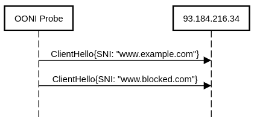

In this blog post we start evaluating [OONI's new SNI blocking
experiment](https://github.com/ooni/spec/blob/adf9537c43ef848b96792f8dea99fbd7f93fe608/nettests/ts-024-sni-blocking.md).
To this end, we will use measurements performed in Iran, where the
blocking technique measured by this experiment is deployed.

OONI's SNI blocking experiment discovers cases where [a Client Hello
packet](https://tls.ulfheim.net/) carrying a specific SNI
triggers blocking. In this context, SNI means [Server Name
Indication](https://en.wikipedia.org/wiki/Server_Name_Indication).
It is an extension to the [Transport Layer
Security](https://en.wikipedia.org/wiki/Transport_Layer_Security)
(TLS) protocol that allows a client to specify the domain name that it
wants an HTTP server to serve. This extension is used in many TLS use
cases. For example, when you access
[https://www.google.com](https://www.google.com) with your
browser, the code will send a Client Hello packet containing the string
`www.google.com` in the SNI extension.

The SNI blocking experiment works as illustrated by the following
diagram:



The experiment uses a test helper; in this example
[93.184.216.34](https://ipinfo.io/93.184.216.34). As of
24th April 2020, this is the IP address of a web server serving, among
others, the [www.example.com](http://www.example.com)
website. We start the first TLS handshake sending a Client Hello
containing the `www.example.com` SNI. Since
[www.example.com](http://www.example.com) is typically not
blocked in most countries, and because the test helper serves such a
domain, we expect the first handshake to nearly always
succeed.

The second TLS handshake instead is for an SNI that (1) we think could
be blocked and (2) is not served by `93.184.216.34`. We therefore expect
this second handshake to fail with the server telling us that it cannot
serve [www.blocked.com](http://www.blocked.com). However,
if the network between the Probe and the test helper implements a rule
saying "no matter what, block any TLSHello where the SNI extension
contains www.blocked.com", then the TLS handshake will instead
fail.

If we cannot perform the first TLS handshake, the experiment is
inconclusive. Otherwise, the result of the second TLS handshake tells us
whether there was network interference. For more information on the
algorithm used, please refer to [the specification of our SNI
experiment](https://github.com/ooni/spec/blob/adf9537c43ef848b96792f8dea99fbd7f93fe608/nettests/ts-024-sni-blocking.md).

To evaluate this methodology, we ran experiments in Iran because we
know that Iran implements SNI based blocking. We tested 112 domains for
signs of SNI based blocking across three different autonomous systems:

1. [AS12880](https://ipinfo.io/AS12880) (Information
Technology Company), henceforth indicated as DCI;

2. [AS58224](https://ipinfo.io/AS58224) (Iran
Telecommunication Company PJS), henceforth TCI;

3. [AS197207](https://ipinfo.io/AS197207) (Mobile
Communication Company of Iran, PLC), henceforth MCI.

Since the results of the SNI blocking experiment are not exposed through
[OONI Explorer](https://explorer.ooni.org/) yet, [we also published the scripts
to download and process the measurements](
https://gist.github.com/bassosimone/ad8eb608b42135dcae287de5d62f8551).

The following table shows all the domains (and hence SNIs) for which
we noticed signs of network interference for at least one of the three
tested ASNs:

| DOMAIN | AS12880 (DCI) | AS58224 (TCI) | AS197207 (MCI) |
| ------ | ------- | ------- | -------- |
| 9gag.com | | timeout | |
| d1vq87e9lcf771.cloudfront.net | timeout | timeout | reset |
| d3kwyfyztuo0xs.cloudfront.net | timeout | | got\_server\_hello |
| i.pinimg.com | got\_server\_hello | | reset |
| ifacetimeapp.com | | timeout | |
| instinctmagazine.com | | timeout | |
| isaalmasih.net | | timeout | |
| log.quora.com | | | reset |
| openvpn.net | | timeout | |
| pridesource.com | | timeout | |
| psiphon.ca | | timeout | |
| twitpic.com | | timeout | |
| www.eurogrand.com | | timeout | |
| www.jdate.com | | timeout | |
| www.monife.com | | timeout | |
| www.partypoker.net | | timeout | |
| www.pinkcupid.com | | timeout | |
| www.quora.com | got\_server\_hello | | reset |
| www.scruff.com | | timeout | |
| www.ucc.org | | timeout | |
| www.vice.com | | timeout | |
| www.vonage.com | | timeout | |
| www.xroxy.com | | timeout | |
| xhamster.com | | timeout | |

An empty cell indicates that there is no measurement for a
specific network; `timeout` indicates that the TLS handshake timed out;
`reset` means that the handshake was interrupted by a reset; and
`got_server_hello` means that we received the Server Hello as expected
(i.e. there was no interference).

We observe that connections are reset on the MCI network, while we
only observe timeout anomalies on the other two tested ASNs. We also
observe that in some cases there is interference in some networks and
no blocking in other networks.

To further understand the nature of the interference, we discuss two specific
measurements. We start with a measurement blocked with RST, whose JSON
has of course been trimmed to increase clarity and
readability.

```JavaScript
{
  "test_keys": {
    "target": {
      "sni": "d1vq87e9lcf771.cloudfront.net",
      "network_events": [
        {
          "proto": "tcp",
          "dial_id": 4,
          "conn_id": 1,
          "failure": null,
          "t": 0.312834468,
          "address": "93.184.216.34:443",
          "operation": "connect"                    // (1)
        },
        {
          "proto": "tcp",
          "num_bytes": 281,
          "conn_id": 1,
          "failure": null,
          "t": 0.31307321,
          "operation": "write"                      // (2)
        },
        {
          "failure": "connection_reset",            // (3)
          "operation": "read",
          "proto": "tcp",
          "t": 0.431875659,
          "conn_id": 1
        }
      ],
      "th_address": "example.com:443"               // (4)
    }
  },
  "probe_asn": "AS197207",
  "resolver_network_name": "Cloudflare, Inc.",      // (5)
  "report_id": "20200411T155627Z_AS197207_VlF35wOyEbESrCD4T0c8KpiKdsexqrdMwH5cqkL9OYLLY3040f"
}
```

We can see from this measurement that the connection is reset after we
have successfully established the connection (1), and we have written
the 281 bytes of the Client Hello (2). The reset, in particular, is
received when we're reading the response to the Hello (3). The test
helper we are using is example.com:443 (4), and the IP address we're
connecting to has been resolved using Cloudflare DNS over HTTPS resolver
(5).

Also, the following experiment performed on 24th April 2020, clearly shows
that the IP address is valid for example.com:

```text
% curl -svo/dev/null --connect-to example.com:443:93.184.216.34:443 https://example.com
* Connecting to hostname: 93.184.216.34
[...]
* Server certificate:
*  subject: C=US; ST=California; L=Los Angeles; O=Internet Corporation for Assigned Names and Numbers; OU=Technology; CN=www.example.org
*  start date: Nov 28 00:00:00 2018 GMT
*  expire date: Dec  2 12:00:00 2020 GMT
*  subjectAltName: host "example.com" matched cert's "example.com"
*  issuer: C=US; O=DigiCert Inc; CN=DigiCert SHA2 Secure Server CA
*  SSL certificate verify ok.
* Using HTTP2, server supports multi-use
```

In fact, "SSL certificate verify ok" means that curl has successfully
connected to the specified address and successfully negotiated a TLS
connection for the given domain name. Also, the "\--connect-to" option
ensures that we bypass the DNS and use 93.184.216.34
directly.

Let us now discuss a measurement where we see a timeout
anomaly:

```JavaScript
{
  "test_keys": {
    "target": {
      "sni": "psiphon.ca",
      "network_events": [
        {
          "proto": "tcp",
          "dial_id": 15,
          "conn_id": 13,
          "failure": null,
          "t": 0.254239264,
          "address": "93.184.216.34:443",
          "operation": "connect"                   // (1)
        },
        {
          "proto": "tcp",
          "num_bytes": 262,
          "conn_id": 13,
          "failure": null,
          "t": 0.254566734,
          "operation": "write"                     // (2)
        },
        {
          "failure": "unknown_failure: [...] use of closed network connection",
          "operation": "read",
          "proto": "tcp",
          "t": 10.264251304,                       // (4)
          "conn_id": 13
        }
      ],
      "th_address": "example.com:443",
      "tls_handshakes": [
        {
          "tls_version": "",
          "conn_id": 3,
          "peer_certificates": null,
          "cipher_suite": "",
          "failure": "generic_timeout_error",     // (3)
          "negotiated_protocol": "",
          "t": 10.264170017
        }
      ]
    }
  },
  "probe_asn": "AS58224",
  "resolver_network_name": "Cloudflare, Inc.",
  "report_id": "20200418T105440Z_AS58224_GguWqwSThCto4VAEZRXIvcYMK7QILkHt9LFAed09mTBLM2LsgX"
}
```

What we see happening here is that we can successfully connect to the
test helper (1), and we can successfully write the Client Hello (2).
However, the TLS handshake process terminates with timeout after ten
seconds (3). A few microseconds after that, the read operation that was
waiting for the response to the Client Hello also terminates with an
error (4). The IP address that we're connecting to is legitimate, since
it's exactly the same as what we validated before.

Similar patterns are observed for the other measurements, but we omit
the results from this discussion for brevity. The presence of the
`tls_handshakes` array for all the measurements presented here, which is
also not shown for brevity, indicates that all the measurements reached
the phase in which the TLS Handshake was being performed. That is, we
know that the interference happened *during* the handshake, not before
it.

We therefore conclude that our SNI blocking experiment works as
intended in a scenario where SNI based blocking is implemented. Blocking
is detected when connecting to a test helper that is unrelated with the
SNI we want to measure. Different ASNs implement blocking differently:
the mobile AS197207 autonomous system resets the connection; AS12880 and
AS58224 likely discard packets, causing the TLS handshake process to
timeout. We have strong evidence that the interference occurred when the
code was performing the TLS handshake.
