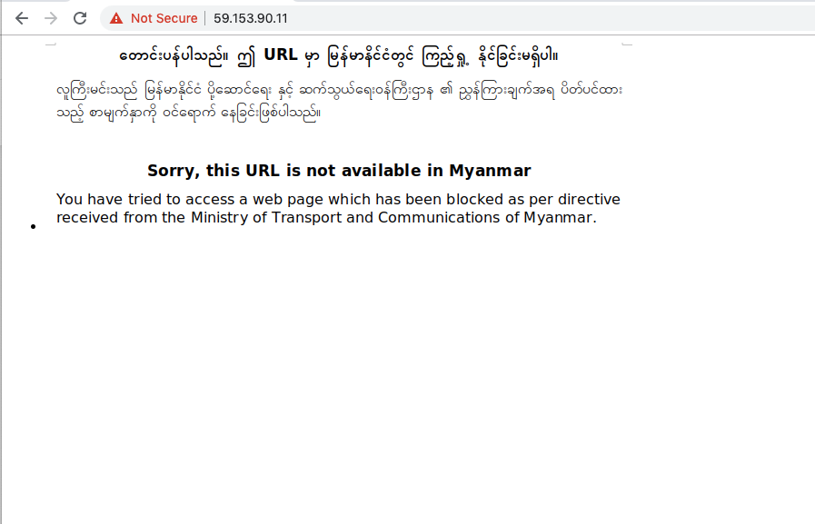
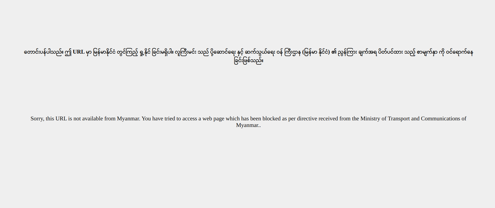
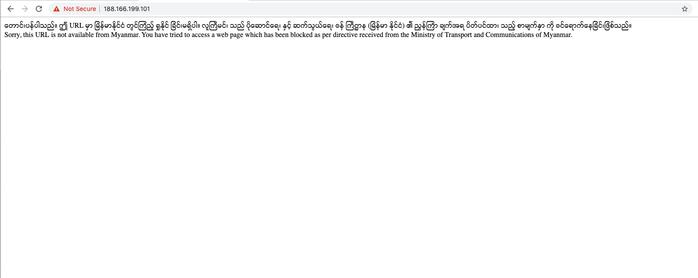

{{}}

In March 2020, Internet Service Providers (ISPs) in Myanmar received a
directive from the Ministry of Transport and Communications to [block 230 websites](https://www.telenor.com.mm/en/article/blocking-230-websites-myanmar-based-directive-authorities),
most of which contain adult content. However, 67 of these sites were
blocked on the grounds of spreading “fake news”. The list of these 230
websites has not been published.

In an attempt to potentially identify the newly blocked websites, we
analyzed [OONI network measurements collected from Myanmar](https://explorer.ooni.org/country/MM) over the last months,
between 1st January 2020 to 9th April 2020.

In this report, we share our findings based on the analysis of OONI
data, **confirming the DNS based blocking of 174 domains** in Myanmar.

* [Background](#background)

  * [Internet shutdown](#internet-shutdown)

  * [Blocking directive](#blocking-directive)

* [Methodology](#methodology)

* [Findings](#findings)

  * [Blocked news outlets](#blocked-news-outlets)

* [Conclusion](#conclusion)

* [Appendix](#appendix)

# Background

Since opening up the market to the foreign telecom operators in 2013,
Myanmar has experienced the connectivity revolution -- unprecedented
growth in internet connectivity and mobile services. While that change
enabled millions of people to access the internet, providing new
opportunities and services, it has also created new concerns for the
people’s rights on the internet, particularly regarding freedom of
expression and privacy.

Myanmar [lacks a data protection law](https://www.dw.com/en/digital-rights-under-growing-pressure-in-myanmar/a-48356715),
even though civil society has been advocating for privacy protections
over the years. In the absence of proper rule of law and a lawful
interception framework, the authorities have
[confiscated](https://www.washingtonpost.com/world/asia_pacific/security-tech-companies-once-flocked-to-myanmar-one-firms-tools-were-used-against-two-journalists-/2019/05/04/d4e9f7f0-5b5d-11e9-b8e3-b03311fbbbfe_story.html)
devices from human rights defenders, activists, and journalists and
pulled information from these devices. The government and military are
also leveraging increasingly sophisticated surveillance
hardware/software - putting activists and journalists at growing risk.

According to [research](http://ooni.org/post/myanmr-report) published
in March 2017 by the Open Observatory of Network Interference (OONI),
Sinar Project, and the Myanmar ICT for Development Organization (MIDO),
internet access was relatively unrestrained. Out of 1,927 sites that
were tested for censorship in six local vantage points in Myanmar, only
five sites presented TCP/IP and HTTP anomalies. No block pages were
detected as part of that study that could confirm any instances of
internet censorship in Myanmar.

However, in evaluating internet freedom levels more broadly, Freedom
House gave Myanmar a score of 36 out of 100 (“Not Free” status),
according to the [Freedom on the Net 2019 report](http://freedomhouse.org/country/myanmar/freedom-net/2019).

## Internet shutdown

Nine townships in the Rakhine and Chin States [experienced an internet shutdown](https://www.mmtimes.com/news/internet-shut-down-nine-townships-rakhine-chin.html)
that lasted over ten months (as of 30th April 2020), marking one of the
world’s [longest](https://www.accessnow.org/keepiton/) internet
shutdowns.

On 2nd May 2020, the Myanmar Ministry of Transport and Communications
(MoTC)
[allowed](https://www.telenor.com/internet-services-restricted-in-five-townships-in-myanmar-03-february-2020/)
all operators to restore internet services in the Maungdaw township in
Rakhine. However, the authorities ordered four townships (Buthidaung,
Rathedaung, Myebon, and Paletwa) to [remain under an internet shutdown until 1st August 2020](https://www.telenor.com/internet-services-restricted-in-five-townships-in-myanmar-03-february-2020/)
due to security reasons. It remains unclear if internet access can be
restored in the remaining four townships (Ponnagyun, Mrauk-U, Kyauktaw,
Minbya) that have been under an internet shutdown since 20th June 2019.

## Blocking directive

In March 2020, Internet Service Providers (ISPs) in Myanmar received a
directive from the Ministry of Transport and Communications to [block 230 websites](https://www.telenor.com.mm/en/article/blocking-230-websites-myanmar-based-directive-authorities).

Telenor Myanmar published a [press release](https://www.telenor.com.mm/en/article/blocking-230-websites-myanmar-based-directive-authorities)
disclosing this blocking request by authorities and stating that they
blocked access to 230 websites by serving a [block page](https://ooni.org/support/glossary/#block-page). They mention that
they initially refrained from blocking access to sites that fell under
the “fake news” category, but eventually complied with the blocking
request following a risk assessment. Telenor Myanmar also notes that the
blocking of “fake news” sites is part of a larger effort to tackle
disinformation in the fight against the [COVID-19 pandemic](https://www.who.int/emergencies/diseases/novel-coronavirus-2019).

The director general of the Directorate of Communications [reportedly stated](https://frontiermyanmar.net/en/operators-split-as-telenor-rejects-govt-order-to-block-fake-news-sites):

*“Fake news and disinformation can easily undermine the stability of the
state. At this moment, there are so many fake news stories about
COVID-19 so we have very recently instructed operators [to block
them].”*

While Telenor Myanmar has been
[transparent](https://www.telenor.com.mm/en/article/blocking-230-websites-myanmar-based-directive-authorities)
about the blocking request, they have not disclosed the 230 blocked URLs
yet.

Myanmar Now [reported](https://myanmar-now.org/mm/news/3391) that the
websites of the Myanmar Times and the Development Media Group (DMG) were
blocked without any prior notice on 23rd and 24th March 2020. Similarly,
Frontier
[reported](https://frontiermyanmar.net/en/operators-split-as-telenor-rejects-govt-order-to-block-fake-news-sites)
in March 2020 that the government order to block around 50 “fake news”
sites included ethnic media outlets, such as Rakhine-based Development
Media Group (DMG) and Narinjara. They
[note](https://frontiermyanmar.net/en/operators-split-as-telenor-rejects-govt-order-to-block-fake-news-sites)
that while the Myanmar Press Council recently published a [list of online news outlets that allegedly spread disinformation](http://myanmarpresscouncil.org/activities-mpc/statements-mpc/401-statements4-20.html),
this list did not include recognised ethnic media outlets like DMG or
Narinjara, both of which distribute up-to-date news on what is happening
in Rakhine. On April 1st, Burma News International (BNI) also
[reported](https://www.bnionline.net/en/news/govt-blocks-ethnic-media-groups-mobile-networks)
that online ethnic media outlets -- Narinjara, Development Media Group
(DMG), and Karen News -- were blocked.

These new blockages occur amidst a global
[pandemic](https://www.who.int/emergencies/diseases/novel-coronavirus-2019),
when access to information is crucial. But as part of efforts to tackle
disinformation, the Myanmar government issued directives to telecom
operators in Myanmar to block access to websites that are viewed as
spreading “fake news”. Neither the directives nor the affected URLs have
been publicly disclosed, but recent [reported blockages](https://www.bnionline.net/en/news/govt-blocks-ethnic-media-groups-mobile-networks)
suggest ethnic media outlets are amongst these censored sites.

# Methodology

[OONI Probe](https://ooni.org/install/) is [free and open source software](https://github.com/ooni) designed to [measure various forms of internet censorship](https://ooni.org/nettest/), such as the
blocking of websites, instant messaging apps, and circumvention tools.
This tool has been run in Myanmar since 2012, and [more than 244,700 network measurements](https://explorer.ooni.org/country/MM) have been
collected from 31 local networks.

We previously analyzed all OONI measurements collected from Myanmar and
published a [research report](https://ooni.org/post/myanmar-report/)
in March 2017. At the time, we barely detected the blocking of any
websites, and Blue Coat software (previously detected in late 2012) [no longer appeared to be present](https://ooni.org/post/myanmar-report/#key-findings) on local
tested networks.

To examine whether websites have more recently been blocked in Myanmar
(particularly in light of the [recent blocking directive](https://www.telenor.com.mm/en/article/blocking-230-websites-myanmar-based-directive-authorities)),
we analyzed all OONI measurements
[collected](https://explorer.ooni.org/country/MM) from Myanmar between
1st January 2020 to 9th April 2020.

This analysis involved OONI Probe [Web Connectivity](https://ooni.org/nettest/web-connectivity/) measurements
collected from the following 6 networks in Myanmar: Telenor Myanmar
(AS133385), Golden TMH Telecom (AS135307), Myanma Posts and
Telecommunications (AS9988), Telecom International Myanmar (AS136255),
RedLink Communications (AS133384), and Frontiir (AS58952).

However, as most OONI measurements during this period were primarily
gathered from Telenor Myanmar (AS133385) and Myanma Posts and
Telecommunications (AS9988), the findings are limited to these two
networks.

# Findings

Based on the analysis of [OONI measurements collected from Myanmar](https://explorer.ooni.org/search?until=2020-04-30&probe_cc=MM&test_name=web_connectivity),
we confirm the **DNS based blocking of 174 domains**, a full list of
which can be found in the appendix of this report.

Many of the blocked domains include news outlets, some of which are
based in Rakhine, while the majority of the blocked domains contain
adult content. Several insurgent group websites were confirmed blocked
too. These include the [Arakan Army website](https://explorer.ooni.org/search?until=2020-05-06&domain=www.arakanarmy.net&probe_cc=MM),
the [Palaung State Liberation Front website](https://explorer.ooni.org/search?until=2020-05-06&domain=www.pslftnla.org&probe_cc=MM),
and the [Shan State Progress Party](https://explorer.ooni.org/search?until=2020-05-06&domain=ssppssa.org&probe_cc=MM)
website.

Our analysis, including links to individual OONI measurements, is
available through this **[CSV file](/post/2020-myanmar/2020-mm-ooni-measurements.csv)**.

We were able to confirm that these 174 domains (listed in the appendix)
were blocked on Telenor Myanmar (AS133385) by means of [DNS tampering](https://ooni.org/support/glossary/#dns-tampering). The
blocking appears to be implemented at the DNS level because OONI
measurements
[show](https://explorer.ooni.org/measurement/20200423T052224Z_AS133385_ptCZnEW1SNMq6V4EbbtqQMHVoCnbPy5k7dNgHPbOE52vMnKEzJ?input=https%3A%2F%2Fwww.dmgburmese.com%2F)
that Telenor Myanmar returned the IP addresses of a Digital Ocean
machine hosting the block page, instead of the real IP of the host. The
IPs that are returned for [block pages](https://ooni.org/support/glossary/#block-page) are:
`167.172.4.60`, `188.166.199.101`, and `59.153.90.11`.

Each of these three IP addresses hosts a slightly different block page,
as illustrated through the following screenshots shared below.

{{}}

**Image:** Block page hosted on the IP `167.172.4.60`.

{{}}

**Image:** Block page hosted on the IP `188.166.199.101` (screenshot taken
on 9th April 2019).

{{}}

**Image:** Block page hosted on the IP `59.153.90.11`.

While we were not able to confirm the blocking on the Myanma Posts and
Telecommunications (AS9988) network, we
[observe](https://explorer.ooni.org/search?until=2020-05-06&probe_cc=MM&probe_asn=AS9988&only=anomalies)
that DNS requests to these sites consistently fail, strongly suggesting
that the sites (listed in the appendix) are also blocked on this
network.

We also analyzed OONI measurements collected from Myanmar prior to
January 2020 (between 2017 to the end of 2019), but we did not find any
significant blockages, suggesting that the censorship events discussed
in this study only emerged over the last few months. However, the
findings are limited by the relatively limited volume of collected
[measurements](https://explorer.ooni.org/search?until=2020-05-06&probe_cc=MM)
and the fact that many of the blocked sites were only added to the
[Citizen Lab’s test list for Myanmar](https://github.com/citizenlab/test-lists/blob/master/lists/mm.csv)
in recent months.

## Blocked news outlets

In February 2020, the Myanmar Press Council released a [press statement including a list of sites](http://myanmarpresscouncil.org/activities-mpc/statements-mpc/401-statements4-20.html)
viewed as spreading “fake news”. The remarks in this press release
accuse most of these sites of copyright infringement.

Since the recent (aforementioned) [blocking directive](https://www.telenor.com.mm/en/article/blocking-230-websites-myanmar-based-directive-authorities)
included many “fake news” sites, we decided to compare the news sites
that we confirmed blocked as part of our analysis with the news sites
listed as “fake news” by the Myanmar Press Council.

The following table does this comparison, as it includes the news
outlets that we found blocked (providing relevant OONI measurements),
along with a note on whether each of them was [listed as a “fake news” site by the Myanmar Press Council](http://myanmarpresscouncil.org/activities-mpc/statements-mpc/401-statements4-20.html).

| Blocked domains           | Listed as "fake news" | OONI measurements                                                                              |
|---------------------------|-----------------------|------------------------------------------------------------------------------------------------|
| `www.dmgburmese.com`        | No                    | https://explorer.ooni.org/search?until=2020-05-06&domain=www.dmgburmese.com&probe_cc=MM        |
| `www.narinjara.com`         | No                    | https://explorer.ooni.org/search?until=2020-05-06&domain=www.narinjara.com&probe_cc=MM         |
| `karennews.org`             | No                    | https://explorer.ooni.org/search?until=2020-05-06&domain=karennews.org&probe_cc=MM             |
| `www.vom-news.com`          | No                    | https://explorer.ooni.org/search?until=2020-05-06&domain=www.vom-news.com&probe_cc=MM          |
| `rohingyakhobor.com`        | No                    | https://explorer.ooni.org/search?until=2020-05-06&domain=rohingyakhobor.com&probe_cc=MM        |
| `www.thestateless.com`      | No                    | https://explorer.ooni.org/search?until=2020-05-06&domain=www.thestateless.com&probe_cc=MM      |
| `www.rohingyanewsbank.com`  | No                    | https://explorer.ooni.org/search?until=2020-05-06&domain=www.rohingyanewsbank.com&probe_cc=MM  |
| `maharmedianews.com`        | No                    | https://explorer.ooni.org/search?until=2020-05-06&domain=maharmedianews.com&probe_cc=MM        |
| `www.myanmarpress.com`      | No                    | https://explorer.ooni.org/search?until=2020-05-06&domain=www.myanmarpress.com&probe_cc=MM      |
| `barnyarbarnyar.com`        | Yes                   | https://explorer.ooni.org/search?until=2020-05-06&domain=barnyarbarnyar.com&probe_cc=MM        |
| `burmachannel.website`      | No                    | https://explorer.ooni.org/search?until=2020-05-06&domain=burmachannel.website&probe_cc=MM      |
| `medicalsharing.website`    | No                    | https://explorer.ooni.org/search?until=2020-05-06&domain=medicalsharing.website&probe_cc=MM    |
| `mmrednews.com`             | No                    | https://explorer.ooni.org/search?until=2020-05-06&domain=mmrednews.com&probe_cc=MM             |
| `mmsportmyanmar.com`        | No                    | https://explorer.ooni.org/search?until=2020-05-06&domain=mmsportmyanmar.com&probe_cc=MM        |
| `mmtimenews.com`            | No                    | https://explorer.ooni.org/search?until=2020-05-06&domain=mmtimenews.com&probe_cc=MM            |
| `mmtimespecialnews.com`     | Yes                   | https://explorer.ooni.org/search?until=2020-05-06&domain=mmtimespecialnews.com&probe_cc=MM     |
| `nenow.in`                  | No                    | https://explorer.ooni.org/search?until=2020-05-06&domain=nenow.in&probe_cc=MM                  |
| `realthadin.com`            | No                    | https://explorer.ooni.org/search?until=2020-05-06&domain=realthadin.com&probe_cc=MM            |
| `santhitsa.net`             | No                    | https://explorer.ooni.org/search?until=2020-05-06&domain=santhitsa.net&probe_cc=MM             |
| `shweman.website`           | No                    | https://explorer.ooni.org/search?until=2020-05-06&domain=shweman.website&probe_cc=MM           |
| `sportmyanmarnews.com`      | No                    | https://explorer.ooni.org/search?until=2020-05-06&domain=sportmyanmarnews.com&probe_cc=MM      |
| `thatinhman.com`            | No                    | https://explorer.ooni.org/search?until=2020-05-06&domain=thatinhman.com&probe_cc=MM            |
| `thazinmedia.com`           | Yes                   | https://explorer.ooni.org/search?until=2020-05-06&domain=thazinmedia.com&probe_cc=MM           |
| `tipsmyanmarnews.com`       | No                    | https://explorer.ooni.org/search?until=2020-05-06&domain=tipsmyanmarnews.com&probe_cc=MM       |
| `topmmnews.com`             | Yes                   | https://explorer.ooni.org/search?until=2020-05-06&domain=topmmnews.com&probe_cc=MM             |
| `trend.lwinpyin.com`        | Yes                   | https://explorer.ooni.org/search?until=2020-05-06&domain=trend.lwinpyin.com&probe_cc=MM        |
| `www.chitsakar.com`         | Yes                   | https://explorer.ooni.org/search?until=2020-05-06&domain=www.chitsakar.com&probe_cc=MM         |
| `www.everytimestory.com`    | Yes                   | https://explorer.ooni.org/search?until=2020-05-06&domain=www.everytimestory.com&probe_cc=MM    |
| `www.innlaymedia.com`       | No                    | https://explorer.ooni.org/search?until=2020-05-06&domain=www.innlaymedia.com&probe_cc=MM       |
| `www.kbzmedia.com`          | Yes                   | https://explorer.ooni.org/search?until=2020-05-06&domain=www.kbzmedia.com&probe_cc=MM          |
| `www.myanmarnewsteam.com`   | Yes                   | https://explorer.ooni.org/search?until=2020-05-06&domain=www.myanmarnewsteam.com&probe_cc=MM   |
| `www.newsvsinformation.com` | No                    | https://explorer.ooni.org/search?until=2020-05-06&domain=www.newsvsinformation.com&probe_cc=MM |
| `www.phothutaw.com`         | No                    | https://explorer.ooni.org/search?until=2020-05-06&domain=www.phothutaw.com&probe_cc=MM         |
| `mc.warnaing.website`       | No                    | https://explorer.ooni.org/search?until=2020-05-06&domain=mc.warnaing.website&probe_cc=MM       |
| `celemedia.club`            | No                    | https://explorer.ooni.org/search?until=2020-05-06&domain=celemedia.club&probe_cc=MM            |
| `itechmedia.info`           | No                    | https://explorer.ooni.org/search?until=2020-05-06&domain=itechmedia.info&probe_cc=MM           |
| `www.onlinelawka.com`       | Yes                   | https://explorer.ooni.org/search?until=2020-05-06&domain=www.onlinelawka.com&probe_cc=MM       |
| `shweyaunglan.com`          | Yes                   | https://explorer.ooni.org/search?until=2020-05-06&domain=shweyaunglan.com&probe_cc=MM          |
| `mckzonecelebrity.com`      | Yes                   | https://explorer.ooni.org/search?until=2020-05-06&domain=mckzonecelebrity.com&probe_cc=MM      |
| `kalaykalar.com`            | Yes                   | https://explorer.ooni.org/search?until=2020-05-06&domain=kalaykalar.com&probe_cc=MM            |
| `www.kalawnaryisin.com`     | Yes                   | https://explorer.ooni.org/search?until=2020-05-06&domain=www.kalawnaryisin.com&probe_cc=MM     |

From the above table, it is evident that out of 41 blocked news outlets,
the majority of them (27 sites) were *not*
[listed](http://myanmarpresscouncil.org/activities-mpc/statements-mpc/401-statements4-20.html)
as “fake news” by the Myanmar Press Council. However, it is possible
that those sites may have been included in a blocklist shared by
authorities with ISPs in Myanmar. Interestingly, some domains that are
listed as “fake news” by the Myanmar Press Council remain accessible,
such as
[myitter.net](https://explorer.ooni.org/search?until=2020-05-06&domain=myitter.net&probe_cc=MM)
or mmlivenews.com (which was [blocked on AS9988](https://explorer.ooni.org/measurement/20200329T120520Z_AS9988_SMeWOedI5Y2ALXkUH0rdC6Fg2v4rVOEpRlauqGiho7UbVTBDge?input=https%3A%2F%2Fmmlivenews.com%2F),
but [accessible on AS133385](https://explorer.ooni.org/measurement/20200423T052224Z_AS133385_ptCZnEW1SNMq6V4EbbtqQMHVoCnbPy5k7dNgHPbOE52vMnKEzJ?input=https%3A%2F%2Fmmlivenews.com%2F)).

Ethnic media websites that were
[reported](https://www.bnionline.net/en/news/govt-blocks-ethnic-media-groups-mobile-networks)
to be blocked -- such as [Development Media Group (DMG)](https://explorer.ooni.org/search?until=2020-05-06&domain=www.dmgburmese.com&probe_cc=MM),
[Narinjara](https://explorer.ooni.org/search?until=2020-05-06&domain=www.narinjara.com&probe_cc=MM),
and [Karen News](https://explorer.ooni.org/search?until=2020-05-06&domain=karennews.org&probe_cc=MM)
-- are [confirmed blocked by OONI data](https://explorer.ooni.org/search?until=2020-05-06&probe_cc=MM&only=anomalies).
The blocking of news outlets (as shared through the above table)
includes media websites reporting on the situation in Rakhine, as well
as Rohingya news sites, such as `www.thestateless.com`.

# Conclusion

This study confirms the **DNS based blocking of 174 domains by Telenor
Myanmar (AS133385)**. Most of these domains contain adult content, but
many of them include news outlets as well. While some of these news
outlets have been
[listed](http://myanmarpresscouncil.org/activities-mpc/statements-mpc/401-statements4-20.html)
as “fake news” by the Myanmar Press Council, it remains unclear if the
remaining blocked news outlets are blocked on the grounds of spreading
“fake news”, or on other grounds.

Telenor Myanmar
[disclosed](https://www.telenor.com.mm/en/article/blocking-230-websites-myanmar-based-directive-authorities)
that they blocked access to 230 websites, but the list of these URLs has
not been published. It’s worth highlighting, though, that the 174
domains that are confirmed blocked as part of this study fall under the
two major categories of sites that Telenor Myanmar
[mentioned](https://www.telenor.com.mm/en/article/blocking-230-websites-myanmar-based-directive-authorities)
that they are required to censor: pornography and news (which could
potentially be viewed as “fake news”). It is therefore plausible that
these 174 domains could be amongst the 230 sites that Telenor Myanmar
recently blocked access to. This is further suggested by the fact that
many of these sites only appear to have been blocked recently.

Authorities in Myanmar have
[defended](https://www.telenor.com.mm/en/article/blocking-230-websites-myanmar-based-directive-authorities)
the blocking of “fake news” as part of efforts to tackle disinformation
around COVID-19. However, transparency around which URLs are
specifically blocked (especially when they involve the sites of
vulnerable communities) and why/how they are viewed as “fake news” is
essential in ensuring press freedom, particularly amid a global
[pandemic](https://www.who.int/emergencies/diseases/novel-coronavirus-2019)
when access to information is crucial.

# Appendix

This study confirms the blocking of the following 174 domain names in
Myanmar between 1st January 2020 to 9th April 2020.

africanporn.blog

alixnxx.org

alohatube.mobi

anybunny.tv

arabxnxx.org

bangbros.com

barnyarbarnyar.com

bestamateursporn.com

bestfreetube.xxx

boypornmovie.com

burmachannel.website

celemedia.club

dailyporn.club

dailyxmovies.com

desixnxx2.net

easyporn.xxx

fap18.net

gigaporn.xxx

hlatawtar.com

itechmedia.info

join.allofgfs.com

join.allpornsitespass.com

join.ddfnetwork.com

join.myallaccesspass.com

join.newsensations.com

join.teamskeet.com

kalaykalar.com

karennews.org

kayatan.com

khitlunge.com

landing.babesnetwork.com

landing.brazzersnetwork.com

landing.digitalplaygroundnetwork.com

landing.lookathernow.com

landing.mofosnetwork.com

landing.rk.com

landing.twistysnetwork.com

maharmedianews.com

manporn.xxx

mc.warnaing.website

mckzonecelebrity.com

medicalsharing.website

megapornx.com

mmrednews.com

mmsportmyanmar.com

mmtimenews.com

mmtimespecialnews.com

myporngay.com

mzansi.porn

naturalforfood.com

nenow.in

newporn.pro

plusone8.com

pornmobile.online

pornprosnetwork.com

premiumpornsites.com

realthadin.com

redporn.xxx

rohingyakhobor.com

santhitsa.net

secure.hustler.com

sexhay69.net

shweman.website

shweyaunglan.com

softcore69.com

spankbang.com

sportmyanmarnews.com

ssppssa.org

thatinhman.com

thazinmedia.com

theporndude.com

tipsmyanmarnews.com

topmmnews.com

trend.lwinpyin.com

watch-my-gf.com

watchmygf.mobi

wct.link

www.arakanarmy.net

www.baise3x.com

www.beeg.icu

www.besthugecocks.com

www.bingoporno.com

www.bokep.space

www.bokepbarat.mobi

www.chitsakar.com

www.clips4sale.com

www.dmgburmese.com

www.everytimestory.com

www.fotosxxx.org

www.free-porn.info

www.freepornfull.com

www.fullxxxvideos.net

www.gayfuror.com

www.gaymaletube.com

www.gaytube.com

www.hornybank.com

www.hotmovies.com

www.hotporntubes.com

www.indianpornvideo.org

www.innlaymedia.com

www.ixxx.com

www.iyalc.com

www.japansex.me

www.jennymovies.com

www.joysporn.com

www.kalawnaryisin.com

www.kbzmedia.com

www.milfmovs.com

www.movieshark.com

www.myanmar-porn.com

www.myanmarnewsteam.com

www.myanmarpress.com

www.narinjara.com

www.newsvsinformation.com

www.onlinelawka.com

www.phothutaw.com

www.pornflixhd.com

www.pornhub.com

www.pornmd.com

www.pornogratisdiario.com

www.pornoplus.fr

www.pslftnla.org

www.puretaboo.com

www.putainporno.com

www.redtube.com

www.rohingyanewsbank.com

www.seemygf.com

www.sexloving.net

www.sexstories.com

www.thestateless.com

www.thumbzilla.com

www.tiava.com

www.trueamateurs.com

www.tubegals.com

www.videolucah.mobi

www.vom-news.com

www.watchmyexgf.net

www.watchmygf.me

www.wetandpuffy.com

www.whynotbi.com

www.wicked.com

www.xmxx.kim

www.xnxx-pornos.com

www.xnxx.com

www.xnxxgrey.com

www.xnxxsexmovies.com

www.xvideos.com

www.xxxindianfilms.com

www.youporn.com

www.youporngay.com

www.zteenporn.com

www.zzgays.com

xhamster.com

xnxx-zoo.com

xnxx.guru

xnxx.kim

xnxx.porno333.com

xnxx.vip

xnxx123.net

xnxx2019.info

xnxx2020.net

xnxxcomvideos.com

xnxxhamster.co

xnxxhd.red

xnxxvideoporn.com

xnxxx.cc

xvideos5.com.br

xvideosporno.blog.br

xxnx.fun

xxx4hindi.com

xxxmoviesdownloads.com

xxxnxx.org

xxxnxxx.live

zootube1.com
