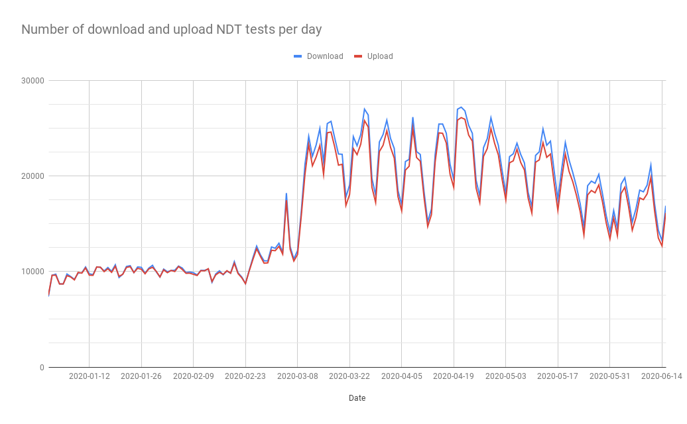
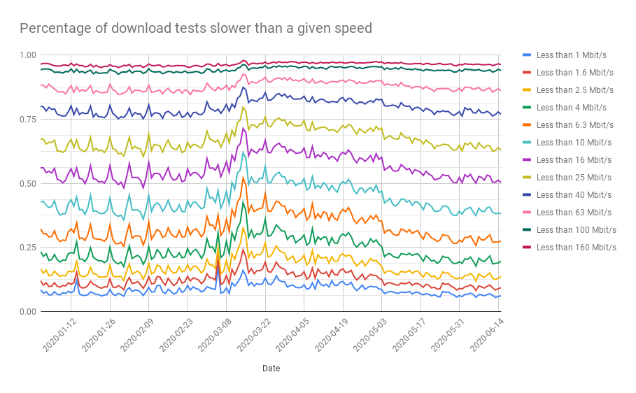
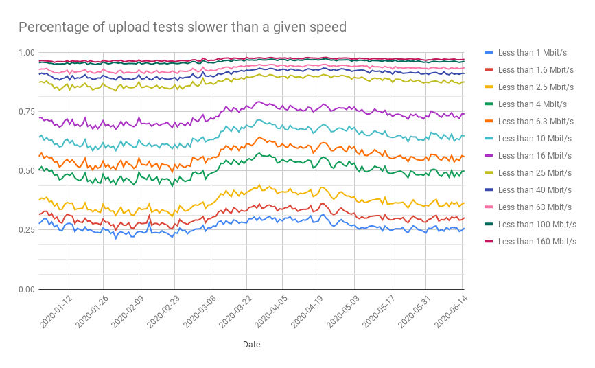

We were recently invited to participate in a [NetGain Partnership webinar](https://www.netgainpartnership.org/) (titled “[Surging Demand and The Global Internet Infrastructure](https://www.netgainpartnership.org/events/covid19/global-infrastructure)”)
to discuss the changing landscape for internet infrastructure and
technology in the wake of the COVID-19 pandemic.

As part of our preparation for this webinar, we looked at network
performance measurements collected from northern Italy over the last
months (i.e. when Italy was hit hard by the COVID-19 pandemic) in an
attempt to understand whether and to what extent there was a correlation
between increased internet use and reduced network performance. As our
observations may be of public interest, we decided to share them through
this blog post.

In summary, we observe:

* Significant increase in the number of NDT tests run per day around
the beginning of Italy’s nationwide lockdown (which started on
10th March 2020);

* Reduced NDT download and upload speed results during the nationwide
lockdown in Italy (between March 2020 to May 2020);

* Improved NDT download and upload speed results from early May 2020
onwards, when the Italian government gradually started to lift the
strict lockdown measures.

Further details are shared through this report.

* [The NDT speed test](#the-ndt-speed-test)

* [Data analysis](#data-analysis)

	* [Number of tests per day](#number-of-tests-per-day)

	* [Download speed](#download-speed)

	* [Upload speed](#upload-speed)

* [Conclusion](#conclusion)

# The NDT speed test

The [Network Diagnostic Test (NDT)](https://ooni.org/nettest/ndt) —
originally developed by [The Internet2 Project](https://www.internet2.edu/) and currently maintained by
[Measurement Lab (M-Lab)](https://www.measurementlab.net/tests/ndt/) —
is designed to measure the **speed and performance** of networks and to
collect data useful to diagnose performance issues.

Several integrations of the NDT measurement methodology exist. The
[most widely used one is run by Google](https://support.google.com/websearch/answer/6283840). Users
searching for “internet speed test” or “how fast is my Internet” in
selected countries and networks are offered the possibility of running
NDT as part of the search results, without visiting third party
websites. OONI also utilizes an [implementation of NDT](https://ooni.org/nettest/ndt), integrated in both the OONI Probe
[mobile](https://ooni.org/install/mobile) and
[desktop](https://ooni.org/install/desktop) apps. In all of these
cases, tests are always user-initiated.

While many people visit a website to run a test, or search for a test on
Google, or use OONI Probe, many other users also choose to run automatic
tests periodically using NDT client software running from a computer in
their network. There are cohorts of these long-running clients that
periodically run NDT. These clients act as “beacons” illuminating the
evolution of internet performance, because it is possible to track their
progress (or regress) over time.

Access to NDT servers is mediated by [M-Lab’s Locate services](https://www.measurementlab.net/develop/). Clients access the
Locate services to obtain a list of suitable nearby NDT servers. In
turn, servers are placed in data centres where ISP networks interconnect
their consumer-facing networks to the internet. This type of server
placement is called “off-net” because the server is almost always
outside of the network it is measuring. Video caches are often — [but not always](https://gist.github.com/bassosimone/bda49b1362391f12db59717e060281d0)
— deployed inside your ISP (as documented, for example, in OONI’s [2019 Jordan report](https://ooni.org/post/jordan-measuring-facebook-interference/)).
Otherwise, the architecture of the internet is such that when you access
content your request typically passes through an interconnection point
between your ISP and some other ISP or content provider. Because M-Lab’s
measurement servers are placed in popular data centres and because the
Locate service returns one of the nearby NDT servers at random, repeated
runs of NDT measure the quality of the path (including interconnections)
between the user’s device and a number of popular nearby data centers.

In the specific cases of running NDT measurements near Milan, there are
four groups of NDT servers there because it is a major hub of the
Italian internet. These servers are hosted by Google inside [a large data centre in Via Caldera, 21 Milan](https://www.ilsole24ore.com/art/a-milano-data-center-irideos-l-80percento-traffico-web-fibra-ABcSuVaB).
Each server group is attached to a different upstream provider. These
providers are Telia, GTT, Level3, and Vodafone.

Because NDT measures a long path including possibly the user’s Wi-Fi
network and the ISP’s interconnection with a data centre, its
measurements do not necessarily confirm the speed advertised by the ISP.
Of course, this happens because the ISP advertises the speed of just a
portion of the path measured by NDT, the access link. Therefore, factors
not under the control of the ISP (e.g. Wi-Fi interference) would impact
NDT measurements as it would impact, for example, a video call. A second
reason why it is incorrect to use NDT measurements to evaluate the
access link capacity is that the speed advertised by the ISP for the
access link describes the maximum bitrate of the access link, while NDT
measures the “bulk transport capacity” — the ability of TCP to deliver
the data over the whole path while adhering to Internet standard
conventions for congestion control.

On this note, NDT uses a single TCP connection. This choice makes it
less robust to network congestion or interference, hence more sensitive
to network issues. While modern web browsers will use multiple streams
of data, testing for multiple streams can compensate for data delivery
problems that are exposed by a single stream. A multi-stream test can
return measurements closer to link capacity but it would not represent
the adverse performance impact of low-level packet loss. By testing for
single-stream performance, NDT is thus an effective baseline for
measuring a user’s Internet performance.

The drawback of NDT’s approach is that a single measurement result is
usually not enough to evaluate the overall performance of a network.
Rather, it is necessary to examine measurements (collected from the same
network) in bulk over a longer period of time in order to better
characterize the performance of a network. This is probably one of the
reasons why tech savvy users configure NDT to run periodically from
their vantage points. (On this note, M-Lab has developed the [Murakami tool](https://github.com/m-lab/murakami) specifically to address this
usage case by allowing anyone to run automated measurements from a
Docker container.)

Lastly, we should mention that user-initiated measurements possibly have
a self-selection bias problem. As people are often more incentivised to
run tests when the performance of their internet connection is not
great, most measurements could possibly be run by users with a bad
internet connection. As a result, NDT measurements may potentially show
a worse-than-real picture, because we cannot exclude the hypothesis that
users with a good internet connection may not be running NDT tests as
often as users with issues.

# Data analysis

In an attempt to understand whether network performance was impacted by
the surge in demand in northern Italy amid the COVID-19 pandemic, we
analyzed [all NDT measurements](https://www.google.com/url?q=https://www.measurementlab.net/data/&sa=D&ust=1594130646885000&usg=AFQjCNGhPxvaEO6Y31LkKOhbFWC56eONwg)
collected in the provinces in [the Milan metropolitan area](https://en.wikipedia.org/wiki/Milan_metropolitan_area).

Our data analysis involved NDT measurements collected between **1st
January 2020 to 15th June 2020**. This period was selected because it
would enable us to examine whether network performance in the region was
affected before, during, and after the [peak of the COVID-19 pandemic](http://www.salute.gov.it/portale/nuovocoronavirus/dettaglioContenutiNuovoCoronavirus.jsp?lingua=english&id=5367&area=nuovoCoronavirus&menu=vuoto)
in March 2020. The analysis was performed on 7th July 2020.

To fetch and analyze NDT measurements, we used [M-Lab’s public BigQuery tables](https://www.measurementlab.net/data/). We ran the following
query to extract information pertaining to the upload speed and a
similar query to extract download information.

```
-- pull the names of the italian provinces
-- note: the global_gadm36_2 table isn’t publicly advertised. It was pulled
-- from https://gadm.org and allows us to use BigQuery's GIS functions to
-- determine the province name for each NDT test. The M-Lab team is
-- currently testing this table and will make it generally available when
-- satisfied with testing it in more research reports.
with provinces AS (
  SELECT * FROM `measurement-lab.geographies.global_gadm36_2`
  WHERE NAME_0="Italy"
),

-- pull the results for each client IP in each province
-- note: change uploads to downloads to obtain download results
per_ip AS (
  SELECT 
    tests.a.MeanThroughputMbps AS mbps, 
    NET.SAFE_IP_FROM_STRING(tests.Client.IP) AS ip, tests.test_date,
    provinces.NAME_2 AS province,
  FROM `measurement-lab.ndt.unified_uploads` tests, provinces
  WHERE test_date >= "2020-01-01"
  AND test_date <= "2020-06-15"
  AND ST_WITHIN(
        ST_GeogPoint(
              client.Geo.longitude,
              client.Geo.latitude
        ), provinces.geom
      )
)

-- compute buckets and limit results to the Milan metropolitan area
SELECT test_date,
  -- renard series R5: 1.00, 1.60, 2.50, 4.00, 6.30, 10.00
  SUM(IF(mbps < 1, 1, 0)) / COUNT(*) AS LessThan1,
  SUM(IF(mbps < 1.6, 1, 0)) / COUNT(*) AS LessThan1_dot_6,
  SUM(IF(mbps < 2.5, 1, 0)) / COUNT(*) AS LessThan2_dot_5,
  SUM(IF(mbps < 4, 1, 0)) / COUNT(*) AS LessThan4,
  SUM(IF(mbps < 6.30, 1, 0)) / COUNT(*) AS LessThan6_dot_30,
  --
  SUM(IF(mbps < 10, 1, 0)) / COUNT(*) AS LessThan10,
  SUM(IF(mbps < 16, 1, 0)) / COUNT(*) AS LessThan16,
  SUM(IF(mbps < 25, 1, 0)) / COUNT(*) AS LessThan25,
  SUM(IF(mbps < 40, 1, 0)) / COUNT(*) AS LessThan40,
  SUM(IF(mbps < 63, 1, 0)) / COUNT(*) AS LessThan63,
  --
  SUM(IF(mbps < 100, 1, 0)) / COUNT(*) AS LessThan100,
  SUM(IF(mbps < 160, 1, 0)) / COUNT(*) AS LessThan160,
  SUM(IF(mbps < 250, 1, 0)) / COUNT(*) AS LessThan250,
  SUM(IF(mbps < 400, 1, 0)) / COUNT(*) AS LessThan400,
  SUM(IF(mbps < 630, 1, 0)) / COUNT(*) AS LessThan630,
  --
  SUM(IF(mbps < 1000, 1, 0)) / COUNT(*) AS LessThan1000,
  count(*) AS count,
FROM per_ip
WHERE ip IS NOT NULL AND (
  province = "Milano" OR
  province = "Bergamo" OR
  province = "Varese" OR
  province = "Monza" OR
  province = "Como" OR
  province = "Pavia" OR
  province = "Novara" OR
  province = "Lecco" OR
  province = "Lodi"
)
GROUP BY test_date
ORDER BY test_date
```

The `SELECT` clause of the query computes the number of cases in which
a test result is lower than a specific threshold. The thresholds were
chosen using [the Renard R5 series](https://en.wikipedia.org/wiki/Renard_series), which divides
each decade in five buckets. For example, given a 5 Mbit/s result, the
above query would count such a result inside the following buckets:
slower than 1 Mbit/s, slower than 1.6 Mbit/s, slower than 2.5 Mbit/s,
and slower than 4 Mbit/s.

You can perform a similar analysis by following the [instructions to access the M-Lab dataset via BigQuery](https://www.measurementlab.net/data/docs/bq/quickstart/) and
by modifying the above query. You can export results to Google drive and
then analyse them using Google Sheets to produce plots.

## Number of tests per day

The following chart shows the number of download and upload NDT tests
performed per day.

{{}}

It is evident that the number of tests per day surges after 23rd
February 2020, which is [two days after the announcement of the “red zone”](https://www.dw.com/en/coronavirus-italy-towns-in-lockdown-after-covid-19-deaths/a-52477823)
that placed some municipalities in the province of Lodi under lockdown,
along with other provinces in Veneto (not covered in this analysis). We
also observed a spike in tests run since 10th March 2020, after [the
central Government placed under lockdown most provinces in the North of Italy](https://www.nytimes.com/2020/03/07/world/europe/coronavirus-italy.html)
and [subsequently extended the lockdown to the whole
country](https://www.cnbc.com/2020/03/10/italy-in-national-lockdown-heres-what-it-means.html).

The number of tests per day has doubled during the first week of the
lockdown. We can also see that the number of tests run begins to
decrease (with obvious weekly patterns) around the same time when [the
lockdown measures were progressively softened by the central Government](https://www.repubblica.it/politica/2020/04/26/news/coronavirus_riaperture_cabina_regia_governo_regioni-254928829/?ref=RHPPTP-BH-I254972764-C12-P3-S2.4-T1)
(May 4th, 2020). The increase in the number of tests has also been
[observed in previous research by
M-Lab](https://www.measurementlab.net/blog/covid19-test-rates-increase/),
who documented increases in the number of tests per day, both worldwide
and in selected areas (New York and São Paulo).

We currently do not have a good explanation of why the number of upload
tests is lower than the number of download tests. When we asked M-Lab
about this, they mentioned that this is a common pattern across M-Lab
data, likely due to the fact that some people stop testing after they
get the download rate (they are not as interested in the upload rate).
This is also enabled by the fact that the download test runs first in
their largest integration ([Google’s OneBox](https://support.google.com/websearch/answer/6283840)).

## Download speed

The following chart shows the evolution over time of the percentage of
tests for which the measured download speed was lower than a given speed
in Mbit/s. When the curve increases, it means that more tests were
slower in percentage than before. When it decreases, it means that more
tests were faster in percentage than before.

{{}}

Before Italy’s nationwide lockdown, we observe weekly patterns. For
example, we notice that the measured performance is worse on weekends,
as suggested by measurements collected on 26th January 2020 and 9th
February 2020 (both Sundays), in comparison to other days. It remains
unclear if this change is related to changes in the population that runs
tests, as this would probably require performing beacon analysis.

Since 8th March 2020, right before Italy’s nationwide lockdown (which
started on 10th March 2020), we observed that the percentage of tests
measuring high download speeds is significantly reduced (i.e. the curves
go up in the plot). This could potentially be correlated to increased
internet usage during those days, as a result of the lockdown.
Throughout March 2020 (which is when the COVID-19 pandemic was at its
peak in Italy), we see that the measured download speeds remained at
reduced levels. Overall, the measured performance starts improving in
late April 2020 and the download speeds returned to (more or less) the
pre-lockdown levels in early May 2020, which coincides with the gradual
lifting of strict lockdown measures in Italy.

We cannot exclude the hypothesis that the changes in the performance
depend chiefly on the changing population of users running NDT tests.
The drop in performance during the lockdown could also be caused by
Wi-Fi interference, more users using the home network concurrently, and
congestion inside ISPs’ networks or at interconnection points with
upstream ISPs. The best way to refine this analysis is probably to
identify beacons and monitor their performance over the lockdown time
period. It would also be interesting to perform a follow up analysis
where we break down the results by province and by ISP.

An NDT result lower than 2.5 Mbit/s indicates that that specific user
would likely not have been able to perform a [Google Meet](https://meet.google.com/) group video meeting with great quality,
if the Google Meet server was located at the same location as the M-Lab
server that we used (as part of the testing). In fact, Google Meet’s
[documentation](https://support.google.com/a/answer/1279090) mentions
that the ideal average bandwidth for such a meeting is 3.2 Mbit/s in
download and upload. Yet, we have no way of knowing whether other video
chat meetings or video streamings or video gaming sessions were active
in the moment in which the NDT test was run. The same documentation also
recommends using the 5 GHz Wi-Fi band where possible, because this has
generally less interference and results in better performance.

## Upload speed

The following chart shows the evolution over time of the percentage of
tests for which the measured upload speed was lower than a given speed
in Mbit/s. When the curve increases, it means that more tests were
slower in percentage than before. When it decreases, it means that more
tests were faster in percentage than before.

{{}}

Through the above chart, it is suggested that few NDT users have access
to high upload speeds. This is quite likely explained by the asymmetric
distribution of bandwidth between download and upload in Italy, but it
is also influenced by the population of users that run NDT tests.
Anecdotally, one of the authors of this report (Simone Basso) used to
have a [Fiber To The Home (FTTH)](https://en.wikipedia.org/wiki/Fiber_to_the_x) Vodafone access
link providing 1 Gbit/s in download and 200 Mbit/s in upload. Now, after
moving to a less well-provisioned area in Italy, it is [Fiber To The Node (FTTN)](https://en.wikipedia.org/wiki/Fiber_to_the_x) with 100
Mbit/s in download and 20 Mbit/s in upload.

Similarly to the download test results, we observe worse performance
during the lockdown period, as the fraction of tests measuring high
upload speeds is reduced in comparison to the pre-lockdown measurements.
However, we cannot exclude the hypothesis that the changes in the
performance depend chiefly on the changing population of users running
NDT tests. The drop in performance during the lockdown could also be
caused by Wi-Fi interference, more users using the home network
concurrently, and congestion inside ISPs’ networks or at interconnection
points with upstream ISPs. The best way to refine this analysis is
probably to identify beacons and monitor their performance over the
lockdown time period.

Whatever the cause of low performance in the moment in which the upload
tests were run, we see that in many cases there was no extra bulk
transport capacity for performing a video streaming meeting with high
quality, if the servers were placed near the NDT servers. Of course,
this statement is only valid for the moment in which tests were run, and
for these specific users, as it would be incorrect to generalise and
interpret the values in the chart as probabilities.

# Conclusion

Our analysis of NDT measurements collected from [the Milan metropolitan area](https://en.wikipedia.org/wiki/Milan_metropolitan_area) between
1st January 2020 to 15th June 2020 suggests that there is a correlation
between reduced network performance (i.e. reduced download and upload
speeds) measured using NDT and the peak of the COVID-19 pandemic in
Italy (which may have resulted in increased internet use and congestion
because of people working from home, studying from home, or more
generally streaming videos from home during the lockdown).

More specifically, we observe a surge in the volume of NDT tests run
following the [announcement of north Italy’s “red zone”](https://www.dw.com/en/coronavirus-italy-towns-in-lockdown-after-covid-19-deaths/a-52477823)
in February 2020, as well as a larger spike following the [nationwide lockdown](https://www.nytimes.com/2020/03/09/world/europe/italy-lockdown-coronavirus.html)
on 10th March 2020. Throughout the lockdown, more than double the amount
of NDT tests (in comparison to previous months) were run from northern
Italy, but we observe reduced download and upload speeds during this
period. Following the lifting of the nationwide lockdown in June 2020,
we observe speeds in line with pre-lockdown results.

As the available measurements suggest that there may be a correlation
between increased internet use and reduced network performance, they
highlight the need to invest in internet infrastructure that is more
robust and sustainable in the long-term. They also highlight the need
for more longitudinal measurements collected from more stable vantage
points to improve our understanding of network performance issues.

Running [NDT tests](https://ooni.org/nettest/ndt) every day,
regardless of your experience of your internet connection, is important,
because the results are [openly published](https://explorer.ooni.org/search?until=2020-07-08&test_name=ndt),
enabling researchers and technologists to better understand issues
around network performance and build solutions. You can run NDT and
contribute measurements on network performance through the [OONI Probe apps](https://ooni.org/install/) or by deploying [the Murakami tool](https://github.com/m-lab/murakami) in a Docker container.
