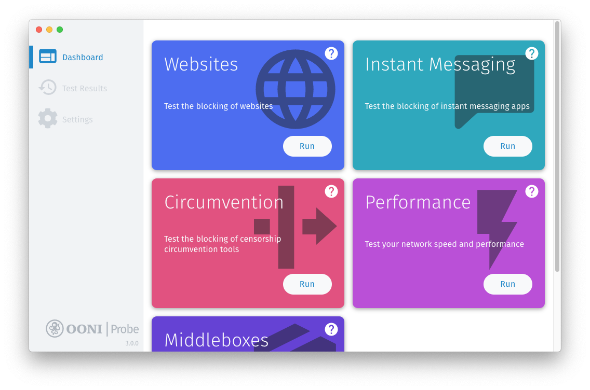
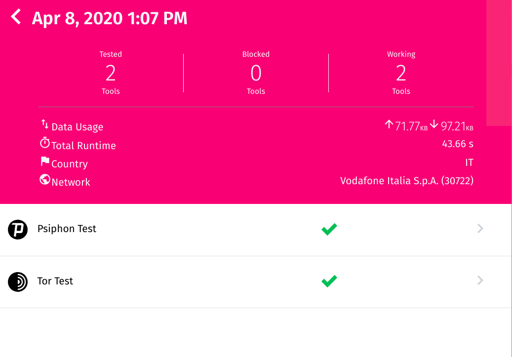
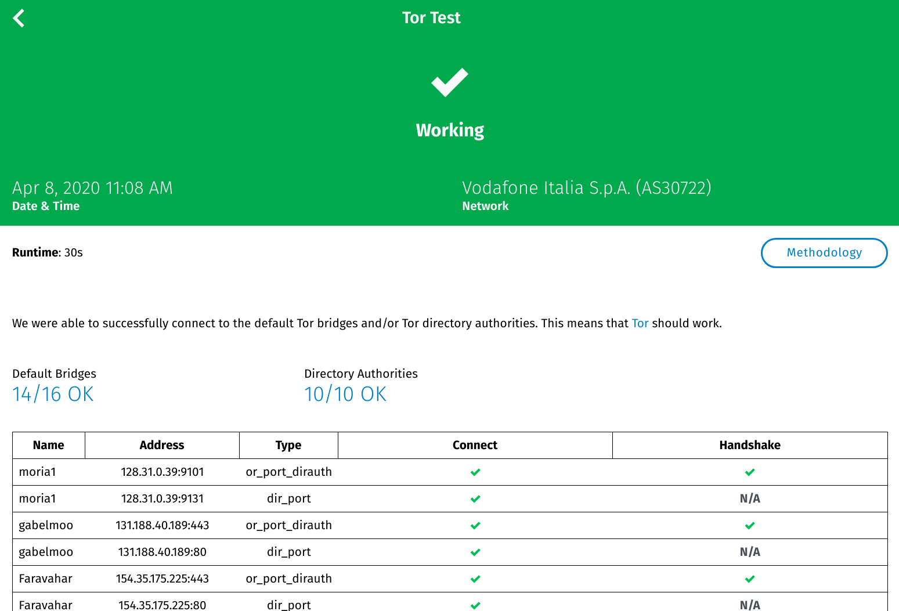
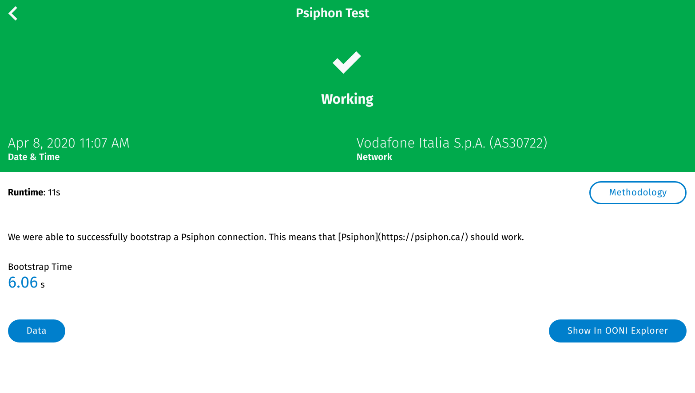
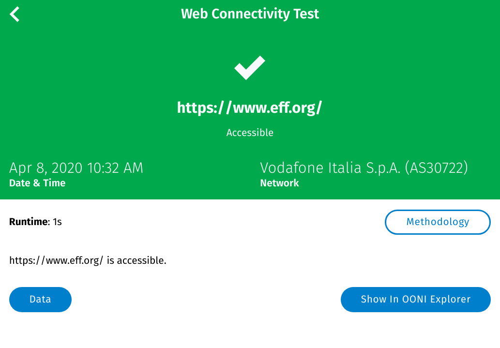

{{}}

Today, OONI is thrilled to announce the public launch of the **new OONI
Probe desktop app** that you can download and install on **Windows** and
**macOS** to measure internet censorship and network performance.



By running the tests in the new OONI Probe desktop app, you can measure:

* Blocking of [websites](https://ooni.org/nettest/web-connectivity/);

* Blocking of [WhatsApp](https://ooni.org/nettest/whatsapp/), [Facebook Messenger](https://ooni.org/nettest/facebook-messenger/), and
[Telegram](https://ooni.org/nettest/telegram/);

* Blocking of [Tor](https://ooni.org/nettest/tor/) and
[Psiphon](https://ooni.org/nettest/psiphon/);

* Presence of systems (“[middleboxes](https://ooni.org/nettest/http-invalid-request-line/)”)
that could potentially be responsible for censorship and/or surveillance;

* [Speed and performance](https://ooni.org/nettest/ndt/) of your
network;

* [Video streaming performance](https://ooni.org/nettest/dash/).

As soon as you run these tests, you will have access to the measurements
inside the app. Your test results will also automatically get
[published](https://ooni.org/data/) in near real-time (unless you
opt-out in the app settings), to increase transparency of internet
censorship and other forms of network interference.

Thanks to support from the [Localization Lab](https://www.localizationlab.org/) community, the new OONI Probe
desktop app has already been **[translated to 12 languages](https://www.transifex.com/otf/ooniprobe/)**: Chinese,
Russian, Spanish, French, Turkish, Thai, Italian, Greek,
Catalan, Slovak, Portuguese, and German.

We have generally tried to create a seamless experience between the OONI
Probe mobile and desktop apps, which is why you will notice that the
design and UX of the two apps is very similar, and that they include
many of the same tests. However, the new OONI Probe desktop app includes
new circumvention tool tests and allows for more extensive website
testing.

Below we share some highlights from the new OONI Probe desktop app.

* [Highlights](#highlights)

    * [New circumvention tool tests](#new-circumvention-tool-tests)

        * [Tor](#tor)

        * [Psiphon](#psiphon)

    * [More extensive website testing](#more-extensive-website-testing)

    * [Supported on Windows](#supported-on-windows)

* [Acknowledgements](#acknowledgements)

# Highlights

## New circumvention tool tests

{{}}

Along with the new OONI Probe desktop app, we are excited to release two new
OONI Probe tests:

* **[Tor test](https://ooni.org/nettest/tor/)**. Checks whether
[Tor](https://www.torproject.org/) works by measuring the
reachability of a set of services (Tor directory authorities, OR
port, OR port of directory authorities, and obfs4) and by
evaluating whether they can be used in the tested network.

* **[Psiphon test](https://ooni.org/nettest/psiphon/)**. Checks
whether the [Psiphon app](https://psiphon.ca/) works by
attempting to bootstrap, create, and use a Psiphon tunnel to fetch
a webpage from the internet.

Currently, these tests are only available via the new OONI Probe desktop
app, but we are working towards integrating them into the OONI Probe
mobile app as well. These tests build upon and expand our [previous methodologies](https://ooni.org/nettest/) for measuring the blocking of
circumvention tools.

Several years ago, we released OONI Probe tests for measuring the [reachability of the Tor network](https://ooni.org/nettest/vanilla-tor/),
[Meek](https://ooni.org/nettest/meek-fronted-requests/), and of other
[Tor bridges](https://ooni.org/nettest/tor-bridge-reachability/).
Quite similarly, we had released a Psiphon test. However, it was only
ever possible to run these tests via the [legacy python version of OONI Probe](https://github.com/ooni/probe-legacy) for Linux, macOS, and
Raspberry Pis, which required use of the command line. Due to this
technical barrier and the fact that they weren’t available for more
commonly-used platforms (like Windows and Android), the usage of these
tests globally was relatively limited. As a result, our global
understanding on the availability of popular circumvention tools (based
on openly available network measurement data) was rather limited.

Now that these tests are shipped as part of the new OONI Probe desktop
app, Windows and macOS users around the world can measure
[Tor](https://www.torproject.org/) and
[Psiphon](https://psiphon.ca/) with the click of a button!

### Tor

{{}}

The [Tor network](https://www.torproject.org/), which is free and open
source, provides its users with online anonymity, privacy, and
censorship circumvention. Tor software is designed to bounce
communications around a distributed network of relays run by volunteers
around the world, thereby hiding its users’ IP addresses and enabling
them to circumvent online tracking and internet censorship.

In an attempt to limit online anonymity and circumvention, some
governments have
[blocked](https://ooni.org/post/iran-internet-censorship/#anonymity-and-circumvention-tools)
access to Tor. The Tor Project has therefore created [Tor bridges](https://bridges.torproject.org/), enabling the circumvention of
Tor blocking. [Tor Browser](https://www.torproject.org/download/) – the
main way that Tor is used by millions of users around the world – is
shipped with a set of public bridges (called
[obfs4](https://bridges.torproject.org/bridges?transport=obfs4)) that
users in censored environments can enable.

To enable the public to check whether Tor works in a tested network, we
have expanded upon our previous methodologies and developed a [new OONI Probe Tor test](https://ooni.org/nettest/tor/). This test measures the
reachability of a set of services that are required for Tor to work and
evaluates whether these services can be used within the tested network.

Run the **[Tor test](https://ooni.org/nettest/tor/)** in the OONI
Probe desktop app and [contribute](https://explorer.ooni.org/)
measurements!

### Psiphon

{{}}

[Psiphon](https://psiphon.ca/) is a free
and open source tool that utilizes VPN, SSH, and HTTP proxy technology
for censorship circumvention. The [Psiphon VPN](https://psiphon.ca/en/download.html) essentially serves as a tunnel
that enables you to circumvent censorship because you access resources
on the internet through the non-censored tunnel that Psiphon provides.

In an attempt to limit censorship circumvention, some governments have
[blocked](https://ooni.org/post/iran-internet-censorship/#anonymity-and-circumvention-tools)
access to Psiphon. We therefore collaborated with Psiphon developers on
creating an OONI Probe [test](https://ooni.org/nettest/psiphon/)
(which improves upon and replaces our old Psiphon test) that anyone can
run to check if the Psiphon app works in the tested network.

Run the **[Psiphon test](https://ooni.org/nettest/psiphon/)** in the
OONI Probe desktop app and [contribute](https://explorer.ooni.org/)
measurements!

## More extensive website testing

{{}}

You can measure the blocking of more than a thousand websites with the
new OONI Probe desktop app.

Every time you click “Run” on the Websites card in the app, you will
[test](https://ooni.org/nettest/web-connectivity/) all the URLs
included in the following two
[lists](https://github.com/citizenlab/test-lists/tree/master/lists)
(hosted by the [Citizen Lab](https://citizenlab.ca/)):

* **[Global list](https://github.com/citizenlab/test-lists/blob/master/lists/global.csv)**.
Includes internationally-relevant websites (such as facebook.com).

* **[Country-specific list](https://github.com/citizenlab/test-lists/tree/master/lists)**.
Each list includes websites that are relevant to a specific country. You will test the URLs in the list of the
country that you are running OONI Probe from (if a list exists for that country).

Unlike the OONI Probe mobile app (where the default setting is
configured to only test a random sample of URLs within 90 seconds, due
to bandwidth constraints), the OONI Probe desktop app tests *all URLs*
included in the Citizen Lab’s
[country-specific](https://github.com/citizenlab/test-lists/tree/master/lists)
and [global test lists](https://github.com/citizenlab/test-lists/blob/master/lists/global.csv)
in one run.

The new OONI Probe desktop app is therefore best suited for *more
extensive website testing*. If, however, you would like to limit the
number of websites that you test, you can do so through the OONI Probe
desktop app settings.

## Supported on Windows

Windows is not only the [most widely used desktop operating system](https://gs.statcounter.com/os-market-share) in the world, but
it is also commonly used by human rights defenders globally
(particularly among those interested in running OONI Probe). Supporting
OONI Probe on Windows has therefore been a popular [community request](https://ooni.org/post/ooni-partner-gathering-2017/#challenges-and-needs)
over the last years.

We previously supported macOS and Linux users with a command line
version of OONI Probe that could also be run from a [web user interface](https://ooni.org/post/web-ui-post/). However, setting up OONI
Probe from the terminal presented a technical barrier for many community
members.

We are therefore very excited to release OONI Probe for Windows! This is
the first time that we are officially supporting Windows, and it’s the
first time we are releasing a native OONI Probe desktop app.

# Acknowledgements

We thank the [Open Technology Fund (OTF)](https://www.opentech.fund/)
for supporting the development of the OONI Probe desktop app and,
therefore, enabling Windows users to easily run censorship measurement
experiments.

We thank the [Localization Lab](https://www.localizationlab.org/) for
coordinating the translations and for helping to bring the new OONI
Probe desktop app to communities far and wide.

We also thank our amazing community for running, testing, and
[translating](https://www.transifex.com/otf/ooniprobe/) the app, and
for [reporting bugs](https://github.com/ooni/probe/issues) and sharing
feedback. We are very grateful for your support, and we hope you enjoy
the new app!
