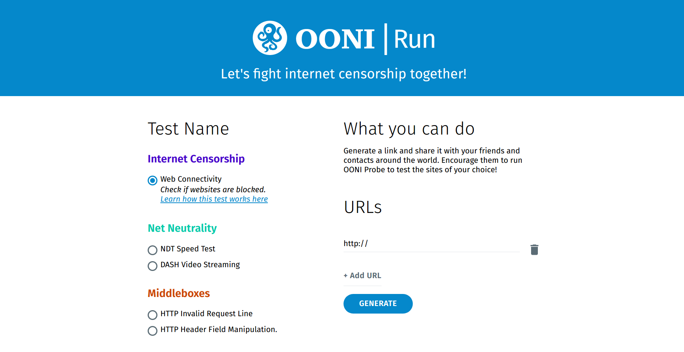
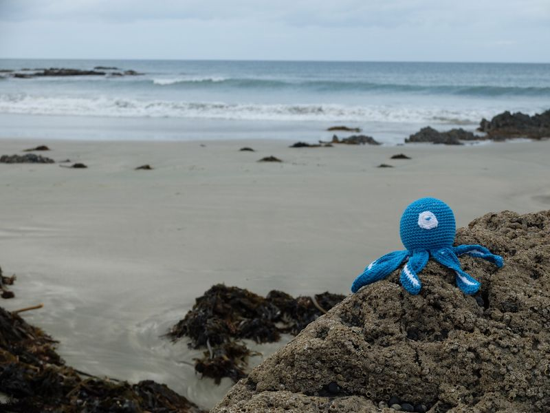

{{}}

[OONI Run](https://ooni.org/post/ooni-run/) is a platform that you can
use to generate mobile deep links and widget code to coordinate [OONI Probe](https://ooni.org/install/) testing.

Researchers and human rights defenders around the world have used [OONI Run](https://run.ooni.org/) to coordinate OONI Probe censorship
measurement campaigns, particularly leading up to and during political
events (such as elections and protests).

We’re excited to hear more about your experience with OONI Run so that
we can improve it.

If you’ve used [OONI Run](https://run.ooni.org/) or are interested in
potentially coordinating OONI Probe testing, please complete our
[survey](https://ooni.typeform.com/to/r9c5ee) and/or participate in an
interview to share your feedback.

# Survey

We’d love to hear your thoughts on [OONI Run](https://run.ooni.org/).

Please take a few minutes to complete our **survey**: https://ooni.typeform.com/to/r9c5ee

We’re particularly interested in learning about how you use the OONI Run
platform, the challenges you experienced, which features you find most
helpful, and whether you have any “wish list” features in mind that you
would like to see in future versions of OONI Run.

The survey includes 18 questions (most of which are multiple choice) and
should take **no longer than 15 minutes to complete**.

# Interviews

We also encourage you to participate in a **15 minute interview** to
share your feedback and let us know how we can make [OONI Run](https://run.ooni.org/) more useful for you.

We are particularly seeking to interview:

* **Measurement campaign coordinators.** Experienced [OONI Probe](https://ooni.org/install/) users who generate and share
[OONI Run](https://run.ooni.org/) links to coordinate OONI Probe
testing, often involving the testing of specific websites.

* **Measurement campaign volunteers.** [OONI Probe](https://ooni.org/install/) users who receive [OONI Run](https://run.ooni.org/) links (from measurement campaign coordinators) and participate in censorship measurement campaigns
by running the tests and/or testing the URLs included in the
shared OONI Run link(s).

* **Internet freedom community members.** Researchers, human rights
defenders, journalists, lawyers, and technologists who are part of
the broader internet freedom community and use [OONI Probe](https://ooni.org/install/) to measure internet censorship.
They don’t necessarily have experience using [OONI Run](https://run.ooni.org/), but could potentially be interested
in coordinating or participating in censorship measurement campaigns.

If you’re interested in participating in these interviews, please notify
us via the [survey](https://ooni.typeform.com/to/r9c5ee) or send an
email to
[maria@openobservatory.org](mailto:maria@openobservatory.org).

Thanks for your time. Your feedback will help us improve [OONI Run](https://run.ooni.org/) for a global community!

{{}}
