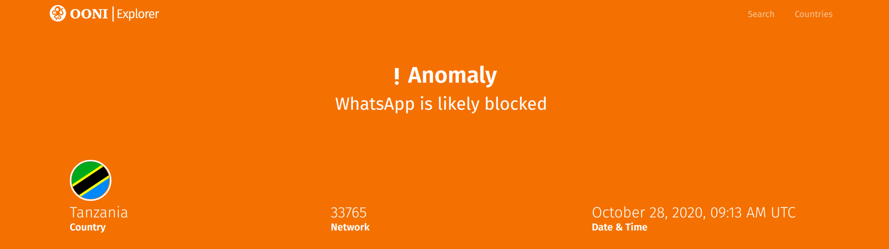
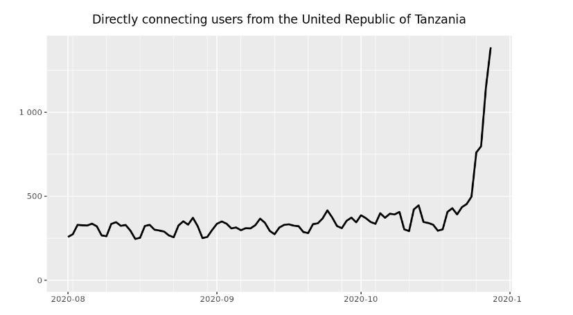

{{}}

Starting from yesterday (27th October 2020) -- *on the eve of
[Tanzania's 2020 general election](https://www.washingtonpost.com/world/africa/tanzania-election-tanzanias-democracy-faces-a-critical-test-in-wednesdays-presidential-election/2020/10/27/b1620b64-17c3-11eb-8bda-814ca56e138b_story.html)*
-- OONI measurements continue to
[show](https://explorer.ooni.org/search?until=2020-10-29&since=2020-09-28&probe_cc=TZ&only=anomalies)
the ongoing blocking of social media (and of the
[Tor](https://www.torproject.org/) circumvention tool) in Tanzania.

In this report, we share [OONI data collected from Tanzania](https://explorer.ooni.org/search?until=2020-10-29&since=2020-09-28&probe_cc=TZ&only=anomalies)
on these blocks, as well as relevant instructions for further OONI Probe
testing.

* [Methods](#methods)

* [Blocking of social media](#blocking-of-social-media)

    * [WhatsApp](#whatsapp)

    * [Facebook Messenger](#facebook-messenger)

    * [Telegram](#telegram)

    * [Social media websites](#social-media-websites)

* [Blocking of Tor?](#blocking-of-tor)

* [Further testing](#further-testing)

# Methods

OONI Probe is [free and open source software](https://github.com/ooni)
designed to measure various forms of network interference based on
[openly specified methodologies](https://github.com/ooni/spec/tree/master/nettests). The
**[OONI Probe app](https://ooni.org/install/)**, available for both
[mobile](https://ooni.org/install/mobile) and
[desktop](https://ooni.org/install/desktop) platforms, includes a
[variety of tests](https://ooni.org/nettest/) designed to measure the
blocking of websites, instant messaging apps, and circumvention tools
(it also includes several network performance related tests). By
default, as soon as you run OONI Probe tests, your test results are
automatically sent to OONI servers,
[processed](https://github.com/ooni/pipeline), and [openly published](https://ooni.org/data/) in **near real-time**.

Since 2016, OONI Probe users in Tanzania have
[contributed](https://explorer.ooni.org/country/TZ) more than 80,000
measurements from 30 local networks. On an ongoing basis, OONI Probe
users in Tanzania
[continue](https://explorer.ooni.org/search?until=2020-10-29&since=2020-09-28&probe_cc=TZ)
to run tests and contribute relevant measurements.

Once we were notified yesterday by community members in Tanzania that
they couldn’t access certain social media platforms without the use of a
VPN, we immediately looked at (openly available) [OONI measurements](https://explorer.ooni.org/search?until=2020-10-29&since=2020-09-28&probe_cc=TZ)
pertaining to the recent testing of social media websites and apps in
Tanzania.

More specifically, we looked at the following OONI measurements:

* **WhatsApp**: Collected from the [OONI Probe WhatsApp test](https://ooni.org/nettest/whatsapp/)

* **Facebook Messenger**: Collected from the [OONI Probe Facebook Messenger test](https://ooni.org/nettest/facebook-messenger/)

* **Telegram**: Collected from the [OONI Probe Telegram test](https://ooni.org/nettest/telegram/)

* **Websites**: Collected from the [OONI Probe Web Connectivity test](https://ooni.org/nettest/web-connectivity/) that measures
many [different types of websites](https://ooni.org/support/faq/#which-websites-will-i-test-for-censorship-with-ooni-probe)
(including internationally relevant social media sites)

Since we heard of increased VPN use in Tanzania (following reported
difficulties in accessing social media platforms), we also looked at
relevant OONI measurements to check whether access to circumvention
tools was blocked as well.

OONI Probe, however, currently only includes tests for the following 2
circumvention tools: [Tor](https://ooni.org/nettest/tor/) and
[Psiphon](https://ooni.org/nettest/psiphon/). We therefore looked at
the measurements collected from these 2 tests in Tanzania, as well as at
relevant [Web Connectivity](https://ooni.org/nettest/web-connectivity/) measurements
that pertain to the testing of circumvention tool websites.

The findings shared below are based on these [openly available measurements](https://explorer.ooni.org/search?until=2020-10-29&since=2020-09-28&probe_cc=TZ).

# Blocking of social media

Today, on election day, access to WhatsApp, Facebook Messenger, and
Telegram appears to be blocked in Tanzania.

## WhatsApp

Starting from yesterday (27th October 2020), we observe the [blocking of WhatsApp](https://explorer.ooni.org/search?until=2020-10-29&since=2020-09-29&probe_cc=TZ&test_name=whatsapp&only=anomalies)
on multiple networks in Tanzania.

In many cases, we
[see](https://explorer.ooni.org/measurement/20201028T105553Z_whatsapp_TZ_327885_n1_80oZokYfNoAmUyfz)
that attempts to connect to WhatsApp Web (web.whatsapp.com) and to
WhatsApp’s registration service fail, resulting in generic timeout
errors. Yet, TCP connections to the tested endpoints of WhatsApp’s
mobile app are often successful. Nonetheless, the failed attempts to
WhatsApp Web and to WhatsApp’s registration service suggest that access
to *both* WhatsApp Web *and* to WhatsApp’s mobile app was most likely
blocked in Tanzania.

This is further suggested by the following (main) factors:

* We consistently see the [testing of WhatsApp failing](https://explorer.ooni.org/search?until=2020-10-29&since=2020-09-28&probe_cc=TZ&test_name=whatsapp&only=anomalies)
in the same ways on the same networks (in multiple measurements);

* During the last months, the [previous testing of WhatsApp](https://explorer.ooni.org/search?until=2020-10-26&since=2020-07-01&probe_cc=TZ&test_name=whatsapp)
in Tanzania (before 27th October 2020) showed that it was
consistently *accessible* (based on the requirements of the [OONI Probe WhatsApp test](https://ooni.org/nettest/whatsapp/));

* Locals in Tanzania started reporting that they experienced
difficulties using WhatsApp on 27th October 2020 (on the eve of
Tanzania’s general election), which is also when OONI measurements
start showing blocking.

It therefore seems highly probable that access to WhatsApp was in fact
blocked (on multiple networks) in Tanzania amid their 2020 general
election. Recent
[measurements](https://explorer.ooni.org/measurement/20201028T172036Z_whatsapp_TZ_37035_n1_bVoMoDnPZiPCPdhp)
collected at around 5PM UTC on 28th October 2020 from Tanzania suggest that access to
WhatsApp remains blocked.

The blocking of WhatsApp in Tanzania is further suggested by OONI Probe
Web Connectivity measurements (though they are few), which
[show](https://explorer.ooni.org/search?until=2020-10-29&since=2020-09-29&probe_cc=TZ&test_name=web_connectivity&domain=www.whatsapp.com&only=anomalies)
that the testing of `www.whatsapp.com` presented anomalies on 3
different networks during the same time frame.

## Facebook Messenger

Facebook Messenger appears to be [blocked on multiple networks in Tanzania](https://explorer.ooni.org/search?until=2020-10-29&since=2020-09-29&probe_cc=TZ&test_name=facebook_messenger&only=anomalies)
on election day as well (starting from 27th October 2020).

We observe that access to Facebook Messenger is blocked in different
ways on different networks. For example, some
[measurements](https://explorer.ooni.org/measurement/20201028T172215Z_facebookmessenger_TZ_37035_n1_4ogaAuty5WX5gT0j)
(collected today) from MIC Tanzania (AS37035) show that TCP connections
to Facebook’s endpoints were successful, but DNS lookups did not resolve
to Facebook IP addresses. On Airtel (AS37133), we
[see](https://explorer.ooni.org/measurement/20201028T155014Z_facebookmessenger_TZ_37133_n1_5Dh7dPam4qTTQrNd)
that DNS lookups resolved to Facebook IP addresses, but a few TCP
connections to Facebook endpoints failed. Similarly, on Viettel
(AS327885) we
[see](https://explorer.ooni.org/measurement/20201028T150534Z_facebookmessenger_TZ_327885_n1_XEXVXZ1VlBoncgyi)
that a few TCP connections to Facebook endpoints failed (but the DNS
lookups were successful).

Similarly to the testing of WhatsApp, we observe a consistent pattern
where the testing of Facebook Messenger [consistently presented anomalies on multiple networks](https://explorer.ooni.org/search?until=2020-10-29&since=2020-09-29&probe_cc=TZ&test_name=facebook_messenger&only=anomalies)
in Tanzania from 27th October 2020 onwards, while [previous measurements](https://explorer.ooni.org/search?until=2020-10-26&since=2020-07-01&probe_cc=TZ&test_name=facebook_messenger)
(collected over the last months) show that the app used to be reachable.
This (along with the fact that many locals in Tanzania reported
difficulties using Facebook over the past day) therefore provides a
strong signal that access to Facebook Messenger was interfered with amid
Tanzania’s 2020 general election.

## Telegram

Along with WhatsApp and Facebook Messenger, access to Telegram appears
to have been [blocked on multiple networks](https://explorer.ooni.org/search?until=2020-10-29&since=2020-09-29&probe_cc=TZ&test_name=telegram&only=anomalies)
in Tanzania as well.

Measurements collected today from Tanzania
[show](https://explorer.ooni.org/measurement/20201028T125726Z_telegram_TZ_37133_n1_Ikf7CqSeBC5CCjos)
that HTTP(S) GET requests to `web.telegram.org` did not return a
consistent response (suggesting blocking of Telegram Web), while many
attempted connections to Telegram endpoints failed (suggesting potential
blocking of Telegram’s mobile app as well). This, for example, is
evident on [Airtel (AS37133)](https://explorer.ooni.org/measurement/20201028T125726Z_telegram_TZ_37133_n1_Ikf7CqSeBC5CCjos)
and on [Tanzania Telecommunications (AS33765)](https://explorer.ooni.org/measurement/20201028T120316Z_telegram_TZ_33765_n1_5n5qrx0ohlNDFfdn).
In other cases -- such as on Zanzibar Telecom (AS36930) -- we
[see](https://explorer.ooni.org/measurement/20201028T105042Z_telegram_TZ_36930_n1_OTbdRtE8t3THkbIj)
that Telegram Web appears blocked, but connections to the tested
Telegram endpoints were successful. This suggests that while
`web.telegram.org` may have been blocked, the Telegram mobile app may
have worked on this network (unless they blocked access to *different*
Telegram endpoints that weren’t tested as part of the [OONI Probe Telegram test](https://ooni.org/nettest/telegram/)).

Similarly to WhatsApp and Facebook Messenger, we observe the same
pattern where the [testing of Telegram consistently presents anomalies](https://explorer.ooni.org/search?until=2020-10-29&since=2020-09-29&probe_cc=TZ&test_name=telegram&only=anomalies)
on multiple networks in Tanzania (from 27th October 2020 onwards), while
[previous measurements](https://explorer.ooni.org/search?until=2020-10-26&since=2020-07-01&probe_cc=TZ&test_name=telegram)
collected over the last months show that Telegram used to be reachable.
Along with the fact that many locals in Tanzania reported experiencing
difficulties using Telegram (without a VPN) during this period, it seems
likely the case that access to Telegram was blocked amid Tanzania’s 2020
general election.

## Social media websites

In addition to social media apps, Internet Service Providers (ISPs) in
Tanzania appear to have likely blocked access to several social media
websites as well.

Almost all OONI
[measurements](https://explorer.ooni.org/search?until=2020-10-29&since=2020-09-29&probe_cc=TZ&test_name=web_connectivity&domain=twitter.com)
collected from the testing of `twitter.com` in Tanzania since
yesterday, 27th October 2020, consistently suggest that access to the
site was blocked on multiple networks. Across several different
networks, we
[see](https://explorer.ooni.org/measurement/20201028T042614Z_webconnectivity_TZ_36908_n1_69omJROteporVlsR?input=https%3A%2F%2Ftwitter.com%2F)
that the HTTP experiment failed, resulting in generic timeout errors.

We observe the same type of failures in the testing of
`www.instagram.com` in Tanzania on 27th October 2020 on [Viettel (AS327885)](https://explorer.ooni.org/measurement/20201027T145712Z_webconnectivity_TZ_327885_n1_cFvomlcAyMEuLs0t?input=https%3A%2F%2Fwww.instagram.com%2F)
and [Vodacom (AS36908)](https://explorer.ooni.org/measurement/20201027T141102Z_webconnectivity_TZ_36908_n1_TeiynLlhxjnFU9bz?input=https%3A%2F%2Fwww.instagram.com%2F),
but the limited volume of relevant measurements limits our ability to
confirm this with confidence.

Among [other social media sites](https://explorer.ooni.org/search?until=2020-10-29&since=2020-09-29&probe_cc=TZ&test_name=web_connectivity&only=anomalies)
that presented signs of potential blocking (such as `www.tiktok.com`),
we see `www.youtube.com`. Every time the site was tested over the last
day (6 times in total on 2 networks), we [consistently see that the
HTTP experiment always failed](https://explorer.ooni.org/search?until=2020-10-29&since=2020-09-29&probe_cc=TZ&test_name=web_connectivity&domain=www.youtube.com),
resulting in generic timeout errors (similarly to the testing of
`twitter.com` and `www.instagram.com`). While the relatively limited
testing coverage of social media sites limits our confidence in
confirming their blocking, it’s worth noting nonetheless that they
present the same types of failures (signaling that they might have in
fact been blocked).

# Blocking of Tor?

Circumventing these censorship events may have been a bit challenging in
Tanzania, given the fact that we observe what seems to be the blocking of
[Tor](https://www.torproject.org/), which can be used for
circumventing internet censorship (in addition to its online privacy and
anonymity properties).

As of 27th October 2020 (on the eve of Tanzania’s 2020 general
election), we observe that the [testing of Tor resulted in many timeout failures](https://explorer.ooni.org/search?until=2020-10-29&since=2020-09-29&probe_cc=TZ&test_name=tor&only=anomalies),
suggesting that access to Tor might have been blocked. To check whether
Tor works (in a tested network), the [OONI Probe Tor test](https://ooni.org/nettest/tor/) measures the reachability of Tor
directory authorities (used by Tor relays), OR port (used by Tor
bridges), OR port of directory authorities (used by Tor clients), and
obfs4 (Tor bridge that speaks the OBFS4 protocol).

As part of [Tor testing](https://explorer.ooni.org/search?until=2020-10-29&since=2020-09-29&probe_cc=TZ&test_name=tor&only=anomalies)
in Tanzania, in many cases (between 27th to 28th October 2020), we see that *most* attempted connections to OR
ports and obfs4 addresses failed (resulting in generic timeout errors).
This is evident on several local networks, such as [MIC Tanzania (AS37035)](https://explorer.ooni.org/measurement/20201028T172336Z_tor_TZ_37035_n1_fnGxcTeKpajt0sys),
[Vodacom (AS36908)](https://explorer.ooni.org/measurement/20201028T160946Z_tor_TZ_36908_n1_kiMTNzOIPIWanQHo),
and [Viettel (AS327885)](https://explorer.ooni.org/measurement/20201028T150641Z_tor_TZ_327885_n1_oF9WZIroBB5Cp6i1).
Given that [previous Tor measurements](https://explorer.ooni.org/search?until=2020-10-26&since=2020-07-01&probe_cc=TZ&test_name=tor)
(collected over the last months, before 26th October 2020) showed that
[Tor worked](https://explorer.ooni.org/measurement/20201021T122720Z_tor_TZ_37035_n1_6sMwvrff2wObXF7o)
in Tanzania (most Tor Browser bridges were reachable and almost all connections to Tor directory authorities were successful), the sudden failure of Tor testing (as seen on several networks in multiple measurements), along with the
parallel blocking of social media platforms, suggest that access to Tor
may have been interfered with in Tanzania amid its 2020 general election. It is also possible, however, that these timeouts may be the result of network congestion (rather than intentional blocking). 

That said, it may still be possible to connect to Tor from Tanzania through
the use of *private* [Tor bridges](https://bridges.torproject.org/). It's also worth highlighting that the number of timeouts varied across tests, and that *a few* connections to default Tor bridges and Tor directory authorities were successful. Regardless of potential interference, the Tor network saw a *spike* in both directly connecting Tor users and Tor bridge users in Tanzania.

The following chart, taken from [Tor Metrics](https://metrics.torproject.org/userstats-relay-country.html?start=2020-08-01&end=2020-10-30&country=tz&events=off), shows that the number of directly connecting Tor users in Tanzania has been increasing over the last days.

{{}}

Going forward, we aim to improve upon the [OONI Probe Tor experiment](https://ooni.org/nettest/tor/) to bootstrap `tor` from desktop probes, which could help with ruling out false positives and better evaluating whether Tor works in a tested network.

On a few occasions (on 27th and 28th October 2020), the testing of the
[Psiphon VPN](https://psiphon.ca/) in Tanzania presented some
[anomalies](https://explorer.ooni.org/search?until=2020-10-29&probe_cc=TZ&test_name=psiphon&only=anomalies)
on a few networks. While the [OONI Probe Psiphon test](https://ooni.org/nettest/psiphon/) was able to bootstrap Psiphon,
it was
[unable](https://explorer.ooni.org/measurement/20201027T181530Z_psiphon_TZ_36930_n1_5wjkjvWIbA2yFqg8)
to fetch a webpage from the internet. However, [most Psiphon measurements](https://explorer.ooni.org/search?until=2020-10-29&probe_cc=TZ&test_name=psiphon)
(collected from several networks in Tanzania over the last day) show
that it was [possible to successfully bootstrap Psiphon](https://explorer.ooni.org/measurement/20201028T203458Z_psiphon_TZ_36908_n1_WZFjouXZJz9jnIo1)
and use it to fetch web pages, suggesting that Psiphon currently works
in Tanzania.

# Further testing

In general, the more measurements we have available, the greater
confidence we may have in confirming censorship events. Longitudinal
measurements also enable us to examine whether and how censorship events
change over time.

If you are in Tanzania and interested in contributing (more) OONI
measurements, you can do so through the following steps:

1) Install the [OONI Probe mobile app](https://ooni.org/install/mobile)

2) Tap **Run** (to run all tests)

For more targeted testing, we also recommend the following:

1) Open the **Social media button** in [this page](https://ooni.org/get-involved/run) (when accessed from a mobile
browser)

2) Open that button with your OONI Probe mobile app (instead of a
browser)

3) Tap **Run** (to test 39 internationally relevant social media
websites)

Similarly:

1) Open the **VPNs button** in [this page](https://ooni.org/get-involved/run) (when accessed from a mobile
browser)

2) Open that button with your OONI Probe mobile app (instead of a
browser)

3) Tap **Run** (to test 21 circumvention tool websites)

In all cases, **please have your VPN turned off** when running OONI
Probe tests (to help ensure more accurate test results).

Once you have run OONI Probe tests, you will find your measurements in
the Test Results section of your OONI Probe app. By default (unless you
have opted out), all of your test results are automatically [openly published](https://explorer.ooni.org/search?until=2020-10-29&probe_cc=TZ)
in **near real-time**. By contributing measurements, you are not only
increasing transparency of internet censorship in Tanzania, but you are
also enabling researchers and advocates to monitor censorship events as
they emerge.

Warm thanks to all [OONI Probe](https://ooni.org/install/) users in
Tanzania for making this study possible.
