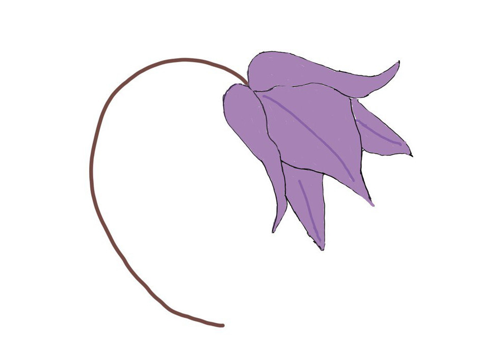

{{}}

This research report was produced by **[OTF Information Controls Fellow, Chinmayi S K](https://www.opentech.fund/about/people/chinmayi-sk/)**. OONI
served as her host organization throughout her fellowship.



The northeastern Indian state of Manipur has long been an area of conflict and
crackdowns. But although human rights violations are [well documented](https://www.hrw.org/report/2008/09/29/these-fellows-must-be-eliminated/relentless-violence-and-impunity-manipur) in the
state, few studies have examined the impact of censorship and internet shutdowns
in the region. In 2019, research fellow Chinmayi S K sought to address this
critical gap by documenting the blocking of websites in Manipur and assessing
how the use of information controls in the state compares to that in the rest of
India. Of particular note, the in-depth research project studied the impact of
online censorship on the identities, livelihoods, and activities of womxn living
in Manipur. 

In conducting this analysis, the study employed both quantitative and
qualitative methods in an effort to better understand the complex nature of
censorship in the remote region. From a quantitative perspective, [OONI Probe](https://ooni.org/install/)
network measurement testing and [OONI data](https://ooni.org/data/) analysis were used to determine if
websites were accessible and, if not, how access to them was being blocked.
Notably, because work on the study posed potential security risks for those
involved, travel to Manipur was limited to specific occasions during which OONI
Probe tests were run in the state. Testing was also conducted elsewhere across
India on a more consistent basis to enable an analysis of censorship variance
across different regions and Internet service providers (ISPs). 

Several key findings emerged from this testing including, most notably, that
censorship varies on a network-level in India. Chinmayi’s research revealed
website blocking within the country varies primarily from ISP to ISP, rather
than from region to region. Block pages were detected for 167 URLs in India
across five ISPs (including two networks in Manipur). Most of the blocked URLs
were blogs, file-sharing sites, or media websites. Interestingly, block pages
were primarily served only for specific articles or pages, as opposed to
blocking access to entire websites.

Qualitative methods were also employed as part of the study to help ensure a
well-rounded review of the effects of information controls on residents in the
region. These methods included a survey on internet usage and censorship,
interviews with womxn in Manipur, and an update to the [Citizen Lab’s test list for India](https://github.com/citizenlab/test-lists/blob/master/lists/in.csv). Manipur experienced at least five internet shutdowns from 2012 to the
time of Chinmayi’s research. Surveys and interviews confirmed these shutdowns
created significant obstacles for the womxn of Manipur, who reported a
subsequent loss of professional standing and opportunity as a result. Womxn in
the region also reported facing mental health issues, such as anxiety and
restlessness, due to the shutdowns (with a lack of information during times of
crisis particularly cited as increasing anxiety). Critically, interviewees
raised concerns about the need for such shutdowns as it remains unclear whether
and how the events have actually helped resolve conflict in the state (the
purported reason for the shutdowns). 

The surveys and interviews conducted as part of the study further demonstrated
how many womxn in Manipur practice self-censorship to avoid conflict. This is
due in large part to the fact that internet activities, such as engaging in
socio-political conversations and mobilizing for political activism, have led to
severe offline consequences for womxn—often in the form of threats to life and
security. Using social media can also result in the loss of business, social
boycotting, and legal action. These types of offline consequences for online
actions naturally have a chilling effect on freedom of expression. Womxn are
also affected by the censorship experiences of people they know, as it is not
uncommon for them to practice self-censorship based on the experiences of their
friends and family. 

Related effects on freedom of the press in the region were also reviewed. And
while OONI Probe testing did not reveal the blocking of any specific websites of
the Manipuri press, interviews demonstrated that members of the press
nonetheless experienced various forms of censorship and control, including
defamation suits, information takedown requests, and the feeling of being caught
in between forceful requests from the government and local insurgent groups. 

Chinmayi’s full-length report, **Those Unspoken Thoughts: A study of censorship
and media freedom in Manipur, India**, is available to read in full
**[here](/documents/those-unspoken-thoughts-otf-fellow.pdf)**.
