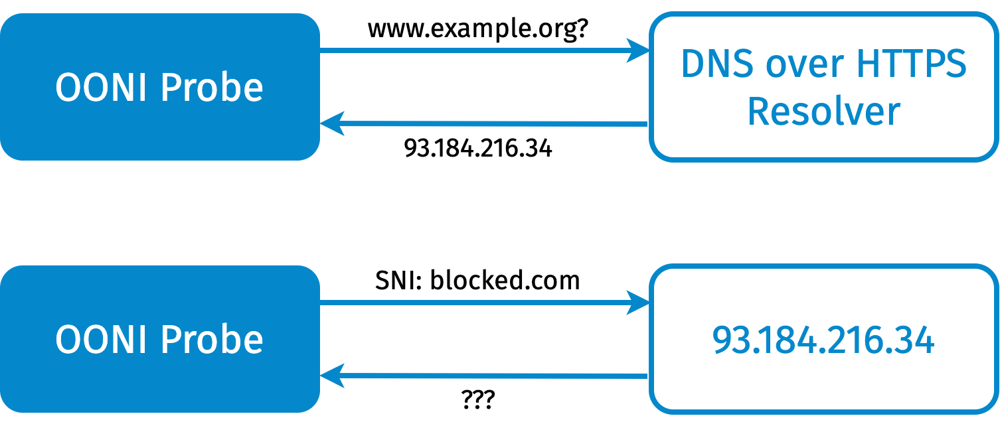
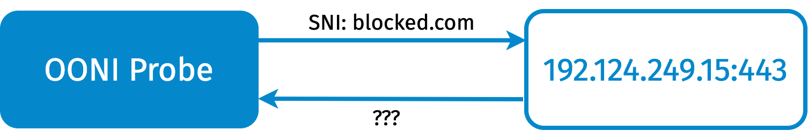
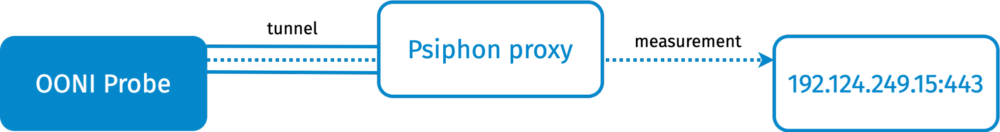

This report investigates Transport Layer Security
([TLS](https://en.wikipedia.org/wiki/Transport_Layer_Security))-based
blocking in India. [Previous
research](https://cis-india.org/internet-governance/blog/reliance-jio-is-using-sni-inspection-to-block-websites)
by the [Centre for Internet &
Society, India](https://cis-india.org/) (CIS) has already
exposed TLS blocking based on the value of the [SNI
field](https://en.wikipedia.org/wiki/Server_Name_Indication).
OONI has also [implemented and started
testing](https://ooni.org/post/2020-iran-sni-blocking/)
SNI-based TLS blocking measurements.

Recently, the Magma Project
[documented](https://blog.magma.lavafeld.org/post/women-on-web-blocking/)
cases where CIS India and OONI's methodologies could be improved. They
specifically found that blocking sometimes appears to depend not only on
the value of the SNI field but also on the address of the web server
being used. These findings were later confirmed by OONI measurements in
[Spain](https://ooni.org/post/2020-engine-evaluation-spain)
and [Iran](https://ooni.org/post/2020-iran-dot/) through
the use of an extended measurement methodology.

We were therefore curious to see whether such an extended methodology
would discover further cases of TLS blocking in India. To answer this
research question we ran experiments on the networks of three popular
Indian Internet Service Providers (ISPs) ([ACT
Fibernet](https://ipinfo.io/AS24309), [Bharti
Airtel](https://ipinfo.io/AS45609), and [Reliance
Jio](https://ipinfo.io/AS55836)) which account for [over
70% of the internet subscribers in
India](https://trai.gov.in/sites/default/files/PIR_08012020_0.pdf).

We recorded SNI-based blocking on both Bharti Airtel and Reliance Jio.
We also discovered that Reliance Jio blocks TLS traffic not just based
on the SNI value, but also on the web server involved with the TLS
handshake. Moreover, we noticed that ACT Fibernet's DNS resolver directs
users towards servers owned by ACT Fibernet itself. Such servers caused
the TLS handshake to fail, but the root cause of censorship was the DNS.

We also document that one of the endpoints we tested,
`collegehumor.com:443`, does not allow establishing TCP connection from
several vantage points and control measurements. Yet, in Reliance Jio,
we see cases where the connections to such endpoints complete
successfully and a timeout occurs during the TLS handshake. We believe
this is caused by some kind of proxy that terminates the TCP connection
and performs the TLS handshake.

## Index

[TLS Blocking Measurements](#tls-blocking-measurements)

[Web Censorship in India](#web-censorship-in-india)

[Aladdin: our Experimental Implementation](#aladdin-our-experimental-implementation)

[Description of the Experiments](#description-of-the-experiments)

[Results Analysis & Discussion](#results-analysis-discussion)

[Conclusion & Future Work](#conclusion-future-work)

## TLS Blocking Measurements

Transport Layer Security
([TLS](https://tools.ietf.org/html/rfc5246)) is a
cryptographic protocol that provides communication with end-to-end
security with guarantees of confidentiality and authenticity, which is
popularly used for encrypting web traffic as done in
[HTTPS](https://en.wikipedia.org/wiki/HTTPS). The [Server
Name
Indication](https://en.wikipedia.org/wiki/Server_Name_Indication)
(SNI), defined first in [RFC
6066](https://tools.ietf.org/html/rfc6066), is an extension
to TLS that facilitates multiplexing, i.e. the hosting of multiple HTTPS
websites on the same server. In other words, the SNI gives content
providers the opportunity to host a variety of websites under the same
IP address. For example, the `216.58.209.36` IP (belonging to Google)
allows accessing both `www.google.com` and `www.youtube.com` using HTTPS,
depending on the SNI being used. When a client wants to establish a
secure connection, it fills in the SNI with the hostname of the website
it wants to connect to.

Unfortunately, the SNI travels on the network in cleartext, even though
there are [experimental
efforts](https://blog.cloudflare.com/encrypted-sni/) to
work around this technical limitation. Thus, network operators can use
[deep packet
inspection](https://en.wikipedia.org/wiki/Deep_packet_inspection)
to track the websites someone is visiting, and also to filter traffic
based on the SNI. The use of SNI-based blocking filtering in
state-directed web censorship is being [increasingly
recorded](https://tools.ietf.org/html/draft-irtf-pearg-censorship-02).
In 2019, the use of SNI filtering was documented in
[China](https://www.usenix.org/system/files/foci19-paper_chai_0.pdf)
and [South
Korea](https://www.newamerica.org/cybersecurity-initiative/c2b/c2b-log/analysis-south-koreas-sni-monitoring/);
OONI reported on the SNI based filtering [of Wikipedia in
Venezuela](https://ooni.org/post/venezuela-blocking-wikipedia-and-social-media-2019/#blocking-of-wikipedia)
and
[China](https://ooni.org/post/2019-china-wikipedia-blocking/),
as well as of [Facebook live-streaming in
Jordan](https://ooni.org/post/jordan-measuring-facebook-interference/);
and CIS has earlier
[documented](https://cis-india.org/internet-governance/blog/reliance-jio-is-using-sni-inspection-to-block-websites)
the use of this technique by Reliance Jio, the [most popular
ISP](https://www.statista.com/statistics/639514/internet-subscribers-by-service-providers-india/)
in India.

Therefore, researchers in the internet freedom community have started
proposing and implementing techniques to measure SNI-based blocking. As
part of their research on the blocking practices of Indian ISPs, CIS
[proposed](https://cis-india.org/internet-governance/blog/reliance-jio-is-using-sni-inspection-to-block-websites)
a methodology to detect SNI blocking. Around the same time, researchers
at Jigsaw
[proposed](https://github.com/Jigsaw-Code/net-analysis/blob/master/netanalysis/blocktest/measure.sh)
improvements in detecting domain blocking, which also included SNI
blocking measurements. OONI later
[implemented](https://github.com/ooni/probe-engine/pull/298)
and [successfully tested on the
field](https://ooni.org/post/2020-iran-sni-blocking/) SNI
blocking measurements based on Jigsaw's methodology.

At their core, these methodologies detect SNI-based blocking by
connecting to an unrelated host that is not blocked (e.g. `example.com`),
and checking whether it is possible to successfully complete a TLS
handshake even if the SNI is filled with a hostname that is potentially
blocked (e.g. `pornhub.com` in India). The rationale of this technique is
to measure whether there is a specific filtering rule in the network
blocking of a given SNI.

A recent [report published by the Magma
project](https://blog.magma.lavafeld.org/post/women-on-web-blocking/),
however, shows that there are other ways of blocking TLS that are not
detected by this measurement methodology. In particular, they showed
that TLS connections to
[www.womenonweb.org](http://www.womenonweb.org) were being
blocked, but the SNI blocking measurement methodology did not detect it.
TLS blocking, in fact, only occurred when the SNI was equal to
`www.womenonweb.org` *and* the IP address was the one of
`www.womenonweb.org`.

Thus, OONI wrote an [experimental
implementation](https://github.com/bassosimone/aladdin)
based on [the new Go
engine](https://github.com/ooni/probe-engine) that was
performing two experiments. The first experiment connected to
`www.example.org` using the `www.womenonweb.org` SNI. The second experiment,
instead, connected directly to the IP address used by
`www.womenonweb.org`. The
[results](https://ooni.org/post/2020-engine-evaluation-spain/)
confirmed the findings of the Magma project's blog post, and sparked
additional curiosity on whether using the same methodology in other
contexts (e.g. India) could reveal more forms of blocking. A measurement
campaign run by OONI while we were researching this report
[documented](https://ooni.org/post/2020-iran-dot/) cases
of TLS blocking solely based on the endpoint being used for DNS over TLS
connections in Iran. Specifically, OONI found cases where the TLS
handshake with `1.1.1.1:853` was blocked regardless of the SNI.

## Web Censorship in India

India has a decentralised model of [web
censorship](https://censorbib.nymity.ch/pdf/Yadav2018a.pdf),
where state authorities order Internet Service Providers (ISPs) to block
certain websites for their users. State authorities draw these powers
from Section 69A and Section 79 of the Information Technology (IT) Act.
Since there are no technical specifications given by the government,
each ISP is at the liberty to adopt their own method of blocking
websites. A recent
[study](https://ooni.org/post/2020-those-unspoken-thoughts-otf-fellow-report/)
of censorship in the Indian state of Manipur using OONI data concluded,
in this regard, that "website blocking within the country varies
primarily from ISP to ISP, rather than from region to region".
Furthermore,
[regulations](https://cis-india.org/internet-governance/resources/information-technology-procedure-and-safeguards-for-blocking-for-access-of-information-by-public-rules-2009)
notified under Section 69A require ISPs to maintain confidentiality over
certain website blocking orders.

Recent [research](https://arxiv.org/pdf/1912.08590.pdf) at
the Centre for Internet and Society (CIS) revealed how Indian ISPs are
using a variety of techniques, including DNS-based blocking, HTTP host
header inspection, and SNI-based filtering. In the absence of a publicly
available official list of blocked hostnames, CIS India compiled a list
of [potentially blocked
websites](https://github.com/kush789/How-India-Censors-The-Web-Data)
from (i) publicly-available government orders, (ii) court orders, and
(iii) user reports from various sources. They devised network tests to
identify the methods that different ISPs are using, and recorded how
India's most popular ISP, Reliance Jio ([which serves 50% of Indian
internet
subscribers](https://trai.gov.in/sites/default/files/PIR_08012020_0.pdf)),
is using SNI inspection for blocking websites. Out of the 4379 websites
that the authors tested for, they **found Jio to be censoring 2951
websites via SNI inspection**.

In addition to the
[opaqueness](https://www.hindustantimes.com/analysis/to-preserve-freedoms-online-amend-the-it-act/story-aC0jXUId4gpydJyuoBcJdI.html)
surrounding the lists of websites being blocked, CIS India also found
inconsistencies in the list of websites being blocked by each ISP.
Furthermore, only some of the ISPs explicitly relayed a censorship
notice to its users. Simply put, Indian internet users can have wildly
different experiences of web censorship depending on their ISP.

## Aladdin: our Experimental Implementation

[Aladdin](https://github.com/bassosimone/aladdin) is a
bash script that uses [the new OONI Probe engine written in
Go](https://github.com/ooni/probe-engine). Given an input
domain (e.g. `blocked.com`), Aladdin performs a series of experiments
loosely inspired by the domain-blocking measurement methodology
[proposed](https://github.com/Jigsaw-Code/net-analysis/blob/master/netanalysis/blocktest/measure.sh)
by Jigsaw. OONI wrote this script to collect data that could be useful
in better understanding how to evolve its [Web
Connectivity](https://ooni.org/nettest/web-connectivity/)
nettest.

In this section, we only describe the experiments that are relevant to
this report. This text describes the performed experiments at a
functional level; the actual implementation may be different, typically
for efficiency reasons. For further information, we encourage you to
read the [script source
code](https://github.com/bassosimone/aladdin) and reach out
with questions and feedback on [OONI's Slack
channels](https://slack.ooni.org/).

Because Aladdin is based on the [OONI
Engine](https://github.com/ooni/probe-engine), all
experiment results are submitted to the OONI collector and
[automatically published](https://ooni.org/data/) as part
of OONI S3 buckets.

### sni\_check

The first experiment we discuss is called `sni_check`. It is similar to
[the OONI experiment called
sni\_blocking](https://github.com/ooni/spec/blob/master/nettests/ts-024-sni-blocking.md),
except that sni\_check does not check whether the helper website being
used (`example.org`) is actually reachable. This is not an issue because
we know it was reachable while we were running these manual experiments.
The following diagram shows the interactions that occur when performing
this experiment with `blocked.com` as its input.



**Figure 1**: description of the sni\_check experiment.

We use `example.org` as a test helper. The first step is to use Google's
[DNS over
HTTPS](https://en.wikipedia.org/wiki/DNS_over_HTTPS) (DoH)
resolver, to map `example.org` to its IP address. Once we know the IP
address, we connect to this address on port `443` and we initiate a TLS
handshake with `blocked.com` as the SNI. What happens next determines the
result of the experiment.

If there is blocking, we expect the connection to just be closed
(`eof_error`) or interrupted (`connection_reset`). A timeout
(`generic_timeout_error`) also in general implies that there is
interference. By repeating the experiment, we gain more confidence that
such an error is not just a temporary disruption.

If there is no interference, the handshake completes. Because the web
server for `example.org` does not handle `blocked.com`, the client code
should emit the `ssl_invalid_hostname` error indicating that the server
returned a certificate that is not valid for the requested SNI. In such
a case, we can inspect the returned certificate to have further
confidence that we are indeed speaking with the legitimate server that
handles the `example.org` domain.

### dns\_check

The second experiment is called `dns_check`. It is conceptually similar
to [the dns\_consistency OONI
experiment](https://github.com/ooni/spec/blob/master/nettests/ts-002-dns-consistency.md).
The following diagram illustrates the `dns_check` experiment.


**Figure 2**: description of the dns\_check experiment.

We basically resolve the same domain (e.g. `blocked.com`) using the system
resolver (i.e. the resolver configured on the system where OONI is
running) as well using a [DNS over
HTTPS](https://en.wikipedia.org/wiki/DNS_over_HTTPS) (DoH)
resolver that we trust. In this set of experiments, we used [Google's
DoH
resolver](https://developers.google.com/speed/public-dns/docs/doh).
The objective of this experiment is to understand whether we can trust
the answer of the system resolver, by comparing its results to the DoH
resolver ones.

When a DNS resolver claims that a domain name does not exist, the
corresponding error is `dns_nxdomain_error`. When a resolver returns
private addresses (e.g. `10.0.0.1`), the corresponding error is
`dns_bogon_error`. If there are no errors, we expect this experiment to
return two lists: a list of IP addresses for the domain obtained using
the system resolver and a similar list obtained instead using the
trusted DoH resolver. As we will see in the following sections, we will
then use the IP addresses from both lists to perform further checks.

### system\_resolver\_validation

The third experiment we discuss is called `system_resolver_validation`.
This experiment is roughly a subset of the [OONI's Web Connectivity
experiment](https://ooni.org/nettest/web-connectivity/).



**Figure 3**: description of the system\_resolver\_validation experiment.

It is called `system_resolver_validation` because we use the IP
addresses collected by the system resolver in the previous step to
access the target website using HTTPS, and verify that the IP address
indeed serves the target website. We connect on port `443` and, if we are
successful, we perform a TLS handshake using the target SNI. If the
handshake succeeds, we assume that the specific IP address we are using
is valid for the domain. This means that either we are speaking with the
legitimate web server or, in a less likely but still quite possible
scenario, with a proxy that is willing to let us through.

We consider the experiment successful if we are able to perform the HTTP
GET request fetching the home page of the domain without any TCP or TLS
errors. Failures during the TLS handshake, or later, are flagged as
likely interference. All the failures described previously may occur
during the handshake. It is worth noting that, in this context,
`ssl_invalid_hostname` is an error, because we should be able to
establish a TLS connection with the domain, given that we are attempting
to speak to a web server serving such a domain.

### doh\_resolver\_validation

The fourth experiment we discuss is called `doh_resolver_validation`.
This experiment is basically the same as the previous one, except that
here we are using the results returned by the DoH resolver as opposed to
the results returned by the system resolver. This experiment gives us an
opportunity to run our test with a valid IP for the domain, which is
useful for cases wherein the system resolver returns an error, or a list
of IPs not related to the domain. This experiment can therefore help us
measure SNI-based blocking when the test network is also blocking
websites using DNS poisoning or injections.

### psiphon\_check

The fifth experiment we discuss is called `psiphon_check`. This
experiment uses [the Psiphon
network](https://en.wikipedia.org/wiki/Psiphon) to fetch
the input domain over HTTPS. It consists of the following two steps.

The first step establishes an encrypted tunnel to one of the thousands
of geographically distributed proxy servers managed by Psiphon, Inc. The
technology used to establish such a tunnel depends on the censorship
techniques implemented in the country in which the experiment is run.
Psiphon, in fact, is optimised to select the censorship evasion
technique that provides the best performance, choosing among techniques
such as [obfuscated
protocols](https://github.com/Yawning/obfs4/blob/master/doc/obfs4-spec.txt)
and [domain
fronting](https://trac.torproject.org/projects/tor/wiki/doc/meek).
Once the encrypted tunnel with the remote proxy server is established,
Psiphon exposes it using [a SOCKS5
proxy](https://en.wikipedia.org/wiki/SOCKS#SOCKS5)
listening on a local port.

The second step performs an HTTPS measurement of the target domain using
the encrypted tunnel via the SOCKS5 proxy. Psiphon's implementation of
the SOCKS5 protocol is such that when Aladdin requests Psiphon to
connect to a specific domain name on port `443`, it will also rely on
Psiphon for the domain name resolution. For this reason, we do not need
to worry about DNS tampering in this experiment. In turn, Psiphon will
ask the remote proxy server to establish a TCP connection to the
specified domain and port. If the connection is successful, Aladdin will
then perform the TLS handshake and issue a GET request for the homepage.
Otherwise, the SOCKS5 server returns a byte indicating the error that
occurred. Because the set of error codes specified by SOCKS5 is rather
limited, the same error code may actually map to a variety of error
conditions. In our experience, two most frequent errors we have seen in
this context are `0x01` ("general failure") and `0x05` ("connection
refused").



**Figure 3**: description of the psiphon\_check experiment.

In the context of this report, we will use the results of the Psiphon
experiment to attempt to access the same domain from another vantage
point. This will give us further confidence of whether errors in
connecting to a website could be caused by interference by the local ISP
or, instead, by the website not currently being reachable.

To learn more about Psiphon, we encourage you to watch the
[presentation on
Psiphon](https://www.youtube.com/watch?v=McMkChIx_as) from
the [2020 edition of the Internet Measurement
Village](https://ooni.org/post/2020-internet-measurement-village/).

## Description of the Experiments

We ran the Aladdin script from three different ISPs in India: ACT
Fibernet ([AS24309](https://ipinfo.io/AS24309)), Bharti
Airtel ([AS45609](https://ipinfo.io/AS45609)), and
Reliance Jio ([AS55836](https://ipinfo.io/AS55836)). We
attempted to measure four domains for TLS blocking: `facebook.com` and
`google.com` (both accessible in India via all ISPs); and `collegehumor.com`
and `pornhub.com` (both usually blocked by Indian ISPs). We ran
experiments on May 11st, 12nd, 14th, and 19th, 2020 using
[github.com/bassosimone/aladdin\@5471390](https://github.com/bassosimone/aladdin/tree/547139068147a9fdc89045988d00ef869ddf5c86).
We also ran follow-up experiments on June 22nd and 23rd, 2020.

According to the latest Telecom Regulatory Authority of India's
[report](https://trai.gov.in/sites/default/files/PIR_08012020_0.pdf)
(Table 1.30), the three ISPs we tested together constitute 74.5% of the
internet subscribers in India. All the measurements were made in
Bengaluru to preclude any potential regional variations. The tests for
Reliance Jio and Bharti Airtel were run via mobile internet connections.
As ACT Fibernet does not provide a retail mobile connection, we used a
fixed internet connection to run tests for their network. As far as this
report is concerned, we assume that ISPs do not alter their behaviour
based on the type of connection (mobile or fixed).

## Results Analysis & Discussion

This section describes the results of all the experiments we performed.
We [fetched measurements from OONI's
S3](https://gist.github.com/bassosimone/d354508447e9a1d0fc2d6857767cdca6#file-fetch_measurements-sh).
For brevity, we are going to include only the results for
`collegehumor.com` and `pornhub.com`, since `facebook.com` and `google.com` were
not blocked in any of the experiments that we ran.

### sni\_check

The following table shows the sni\_check experiment results. In this
experiment we performed a TLS handshake with the web server serving
`example.org` using the SNI indicated in the table, to detect cases
where the presence of this SNI was sufficient to trigger blocking. The
script to generate the table is [published as a GitHub
gist](https://gist.github.com/bassosimone/d354508447e9a1d0fc2d6857767cdca6#file-sni_blocking_results-sh).

| ISP           | SNI                | Failure                | Count     |
| ------------- | ------------------ | ---------------------- | --------- |
| ACT Fibernet  | `collegehumor.com` | `ssl_invalid_hostname` | 2         |
| ACT Fibernet  | `pornhub.com`      | `ssl_invalid_hostname` | 2         |
| Bharti Airtel | `collegehumor.com` | `eof_error`            | 3         |
| Bharti Airtel | `pornhub.com`      | `eof_error`            | 2         |
| Bharti Airtel | `pornhub.com`      | `ssl_invalid_hostname` | 1         |
| Reliance Jio  | `collegehumor.com` | `ssl_invalid_hostname` | 1         |
| Reliance Jio  | `pornhub.com`      | `ssl_invalid_hostname` | 1         |

**Table 1.** Results of connecting to example.org's IP address when
using specific SNIs.

As mentioned above, the `eof_error` result indicates that the connection
was closed during the TLS handshake, likely because some middlebox
rejected the provided SNI. The following JSON snippet shows a
[measurement](https://explorer.ooni.org/measurement/20200519T080507Z_AS45609_RnakXZPQFjEaLZDn64vWuoslK8KVtfhLHJkywOCzRsYzK78RLk)
for collegehumor.com from Bharti Airtel:

```JSON
{
  "test_keys": {
    "network_events": [
      {
        "failure": null,
        "operation": "connect",
        "address": "93.184.216.34:443",        // (1)
        "t": 0.3199562,
        "proto": "tcp"
      },
      {
        "failure": null,
        "operation": "tls_handshake_start",    // (2)
        "t": 0.3199999
      },
      {
        "failure": null,
        "operation": "write",                  // (3)
        "num_bytes": 286,
        "t": 0.3213545
      },
      {
        "failure": "eof_error",                // (4)
        "operation": "read",
        "t": 0.382416
      },
      {
        "failure": "eof_error",
        "operation": "tls_handshake_done",
        "t": 0.383602
      }
    ]
  },
  "resolver_asn": "AS9498",
  "probe_cc": "IN",
  "probe_network_name": "Bharti Airtel Ltd. AS for GPRS Service",
  "input": "tlshandshake://93.184.216.34:443",
  "probe_asn": "AS45609",
  "annotations": {
    "step": "sni_blocking",
    "session": "38c221ed-5fc6-4897-984d-b612bc43dd24"
  },
  "resolver_network_name": "BHARTI Airtel Ltd.",
  "measurement_start_time": "2020-05-19 08:05:07"
}
```

Here we basically (1) connect to `example.org`'s IP address, (2) start the
TLS handshake, (3) write the ClientHello, and (4) observe that the
connection is closed.

It is also interesting to note that in one specific case we could
complete the TLS handshake with `example.org`'s IP address with the
`pornhub.com` SNI. We also observed the same pattern in the follow-up
measurements for `collegehumor.com` (see
[\#1](https://explorer.ooni.org/measurement/20200623T115028Z_AS45609_4xLT2hAbjhII7Hr9UiP6KbXeStWiZs5DAT4xlQH3SwzDQT215X),
[\#2](https://explorer.ooni.org/measurement/20200624T055439Z_AS45609_dlnFw0eY1rZ0WYNRKh7NYrvx9d2a37ykM0of62HG62Z1qIHdei),
[\#3](https://explorer.ooni.org/measurement/20200623T115028Z_AS45609_4xLT2hAbjhII7Hr9UiP6KbXeStWiZs5DAT4xlQH3SwzDQT215X),
[\#4](https://explorer.ooni.org/measurement/20200624T055439Z_AS45609_dlnFw0eY1rZ0WYNRKh7NYrvx9d2a37ykM0of62HG62Z1qIHdei),
[\#5](https://explorer.ooni.org/measurement/20200624T115857Z_AS45609_jE5DMMVehwjLSbTBospB3xACiyPaC7KTXKoRksjPmzffaBk2wD),
and
[\#6](https://explorer.ooni.org/measurement/20200624T142036Z_AS45609_4UnsqOk4VtVJzyBQyGi89HrxjEL5kwnuI6Y31eZfsxmJ0Jxu0R))
and for `pornhub.com` (see
[\#1](https://explorer.ooni.org/measurement/20200623T114854Z_AS45609_3RVbQFI6HLMk4eiSMUD3I45zD6PigHVe3tQxYWDWm2pkNauAg9),
[\#2](https://explorer.ooni.org/measurement/20200624T055317Z_AS45609_Vtsxlqy686pUlUX2viIFVcFE7XlRIr5Z1UhM6AWCqRYhCrn7bd),
[\#3](https://explorer.ooni.org/measurement/20200623T114854Z_AS45609_3RVbQFI6HLMk4eiSMUD3I45zD6PigHVe3tQxYWDWm2pkNauAg9),
[\#4](https://explorer.ooni.org/measurement/20200624T055317Z_AS45609_Vtsxlqy686pUlUX2viIFVcFE7XlRIr5Z1UhM6AWCqRYhCrn7bd),
and
[\#5](https://explorer.ooni.org/measurement/20200624T141913Z_AS45609_P9MCV5PKifzikwt3u4LqUJzxSUATEcRL3zVSaSJXfNQRtXekpW))
performed on June 22nd and 23rd, 2020. Typically there is blocking, but
three times we succeed to complete the TLS handshake.

Instead, the `ssl_invalid_hostname` result hints that there was no
blocking. To be sure about this, we [fetched the returned certificate
from the
measurement](https://gist.github.com/bassosimone/d354508447e9a1d0fc2d6857767cdca6#file-sni_blocking_certs-sh),
[ensured it was
unique](https://gist.github.com/bassosimone/d354508447e9a1d0fc2d6857767cdca6#file-sni_blocking_cert_unique-sh),
and [computed its
fingerprint](https://gist.github.com/bassosimone/d354508447e9a1d0fc2d6857767cdca6#file-sni_blocking_cert_fingerprint-sh).
In all cases, we received the following [X.509
certificate](https://en.wikipedia.org/wiki/X.509):

```bash
Certificate:
    Data:
        Version: 3 (0x2)
        Serial Number:
            0f:d0:78:dd:48:f1:a2:bd:4d:0f:2b:a9:6b:60:38:fe
    Signature Algorithm: sha256WithRSAEncryption
        Issuer: C=US, O=DigiCert Inc, CN=DigiCert SHA2 Secure Server CA
        Validity
            Not Before: Nov 28 00:00:00 2018 GMT
            Not After : Dec  2 12:00:00 2020 GMT
        Subject: C=US, ST=California, [...] CN=www.example.org
[...]
SHA1 Fingerprint=7B:B6:98:38:69:70:36:3D:29:19:CC:57:72:84:69:84:FF:D4:A8:89
```

This certificate is indeed the one used by `example.org`. We can therefore
conclude that, in all these cases, we were able to speak to the test
helper without interference.

### Establishing a baseline

In the following sections, we are going to comment on the experiments
where we attempt to connect to the target websites using HTTPS. Before
diving into that, let us check whether we could access such websites
using [Psiphon](https://psiphon.ca/). This check will give
us an opportunity to establish whether the websites were reachable when
we performed the measurement. In fact, the usage of the Psiphon
circumvention tool allowed us to access the websites we wanted to test
using alternative routes over encrypted and obfuscated tunnels to
Psiphon managed proxies.

The following table shows the results of the psiphon\_check experiment,
which was computed using [a script published at
GitHub](https://gist.github.com/bassosimone/d354508447e9a1d0fc2d6857767cdca6#file-psiphon_check-sh).

| ISP           | Domain             | Bootstrap Time  | Failure                                |
| ------------- | ------------------ | --------------- | -------------------------------------- |
| ACT Fibernet  | `pornhub.com`      | 6.5             | `null`                                 |
| ACT Fibernet  | `collegehumor.com` | 6.6             | `general SOCKS server failure`         |
| ACT Fibernet  | `pornhub.com`      | 5.7             | `null`                                 |
| ACT Fibernet  | `collegehumor.com` | 5.3             | `SOCKS: connection refused`            |
| Reliance Jio  | `pornhub.com`      | 7.2             | `null`                                 |
| Reliance Jio  | `collegehumor.com` | 6.8             | `SOCKS: connection refused`            |
| Bharti Airtel | `pornhub.com`      | 6.3             | `null`                                 |
| Bharti Airtel | `collegehumor.com` | 6.1             | `SOCKS: connection refused`            |
| Bharti Airtel | `pornhub.com`      | 6.5             | `http: unexpected EOF reading trailer` |
| Bharti Airtel | `collegehumor.com` | 6.7             | `SOCKS: connection refused`            |
| Bharti Airtel | `pornhub.com`      | 8.1             | `null`                                 |
| Bharti Airtel | `collegehumor.com` | 6.6             | `SOCKS: connection refused`            |

**Table 2.** Results of fetching the homepage of specific domains using
Psiphon.

The *Bootstrap Time* column indicates the number of seconds it took
Psiphon to establish an encrypted tunnel with a proxy server. Because
the bootstrap time is defined (and not `null`) for each measurement, [it
means](https://github.com/ooni/spec/blob/master/nettests/ts-015-psiphon.md#possible-conclusions)
that it was always possible to establish a tunnel. The OONI Engine
implementation, in fact, does not set the bootstrap time unless the
tunnel has been successfully established.

Regarding the *Failure* column, we notice that `pornhub.com` is available
on and off, and sometimes there are HTTP protocol errors. Yet, there are
definitely cases in which this domain is reachable via Psiphon. On the
contrary, `collegehumor.com` is consistently not reachable.

We could explain this consistent failure with either the website not
being reachable over HTTPS or with censorship experienced by the Psiphon
proxy we were using.

As a follow-up, we ran subsequent measurements targeting
`collegehumor.com` from [Bharti
Airtel](https://explorer.ooni.org/measurement/20200624T055538Z_AS45609_dK4fAl2oS2tKRyt9KfmDE8acLaTLD6755GOwSwfLGULOll82jZ),
[Vodafone
(Italy)](https://explorer.ooni.org/measurement/20200624T085415Z_AS30722_G4LE5UfuxDlPZiERUgZ8TLW5qSriS4WiapdIFPtCWX85Ac1X7p?input=https%3A%2F%2Fcollegehumor.com),
and [Google
Cloud](https://explorer.ooni.org/measurement/20200623T175544Z_AS15169_ubO4s49z6APnAbKFhMXT97gNvBoAaER5MiwduXvjaCsb5hi4ms?input=https%3A%2F%2Fcollegehumor.com)
(europe-west4 zone) on June 22nd and 23rd, 2020 using the OONI Probe
Engine, OONI Probe for iOS, and `netcat`. We attempted to connect to
collegehumor.com using HTTPS with and without using the Psiphon. When
using Psiphon, we [obtained the same
errors](https://explorer.ooni.org/measurement/20200623T185721Z_AS15169_YVFXtS7o2VZkfEehzmS9ZZJvAotnnASFLelrorYMmdwOFABpjW?input=https%3A%2F%2Fcollegehumor.com)
reported in the table above. When connecting directly [we noticed a
timeout](https://explorer.ooni.org/measurement/20200623T175544Z_AS15169_ubO4s49z6APnAbKFhMXT97gNvBoAaER5MiwduXvjaCsb5hi4ms?input=https%3A%2F%2Fcollegehumor.com)
when trying to establish a TCP connection on port `443`.

While investigating further, we also found [an "ancient"
measurement](https://explorer.ooni.org/measurement/20150108T150226Z_kkzgbiAmAeSfPKxtzAmmbPKsjdQNKyBogAhHxgMLAcLmQKdXXP?input=https%3A%2F%2Fcollegehumor.com%2F)
using OONI Probe 1.2 that timed out when attempting to connect to
`collegehumor.com` on port `443` from the [Telx ISP](https://ipinfo.io/AS36086) in the United States in
2015. However, we also
[found](https://transparencyreport.google.com/https/certificates?hl=en&cert_search_auth=&cert_search_cert=&cert_search=include_subdomains:false;domain:collegehumor.com&lu=cert_search)
that [records of an X.509 certificate for this website exist in the
Certificate Transparency
Log](https://transparencyreport.google.com/https/certificates/n%2BcofU0GqxQZKyhwSOyronS4gYsHeCEjdPaBA0FlrME%3D).

We concluded that `collegehumor.com` was quite likely not reachable on
port `443` when we measured it, which is why we will not flag as
censorship any failure in connecting to it on port `443` that we may
encounter in the following sections. At the same time, it is interesting
to note that Bharti Airtel was censoring the `collegehumor.com` SNI (as we
have seen in the previous section) even though it was not a properly
working HTTPS website during our measurements.

### dns\_check

The following table shows the domain names resolved using the system
resolver. For each target domain in the *Domain* column, we performed a
DNS resolution using the resolver configured in the operating system.
The ISP owning the resolver is indicated in the *Resolver* column. The
table has been computed using a script [published at
GitHub](https://gist.github.com/bassosimone/d354508447e9a1d0fc2d6857767cdca6#file-bogons_results-py).
We then manually annotated IP addresses with their [autonomous
system](https://en.wikipedia.org/wiki/Autonomous_system_(Internet))
number (ASN) and network name.

| ISP           | Resolver      | Domain             | Failure              | IP              | IP Network   | Count |
| ------------- | ------------- | ------------------ | -------------------- | --------------- | ------------ | ----- |
| ACT Fibernet  | ACT Fibernet  | `collegehumor.com` | `null`               | `202.83.21.15`  | ACT Fibernet | 1     |
| ACT Fibernet  | ACT Fibernet  | `collegehumor.com` | `null`               | `49.205.75.6`   | ACT Fibernet | 1     |
| ACT Fibernet  | ACT Fibernet  | `pornhub.com`      | `null`               | `202.83.21.15`  | ACT Fibernet | 1     |
| ACT Fibernet  | ACT Fibernet  | `pornhub.com`      | `null`               | `49.205.75.6`   | ACT Fibernet | 1     |
| Bharti Airtel | Bharti Airtel | `collegehumor.com` | `dns_nxdomain_error` |                 |              | 3     |
| Bharti Airtel | Bharti Airtel | `pornhub.com`      | `dns_nxdomain_error` |                 |              | 3     |
| Reliance Jio  | Reliance Jio  | `collegehumor.com` | `null`               | `52.8.26.172`   | AMAZON       | 1     |
| Reliance Jio  | Reliance Jio  | `collegehumor.com` | `null`               | `54.193.47.52`  | AMAZON       | 1     |
| Reliance Jio  | Reliance Jio  | `pornhub.com`      | `null`               | `66.254.114.41` | SWIFTMILL    | 1     |

**Table 3.** Results of resolving specific domains using the system's
default resolver.

Let us compare the above table with a similar table, where we show the
results obtained using Google public [DNS over
HTTPS](https://en.wikipedia.org/wiki/DNS_over_HTTPS) (DoH)
resolver and [a similar analysis
script](https://gist.github.com/bassosimone/d354508447e9a1d0fc2d6857767cdca6#file-doh_lookup_results-py).
(No errors are included into the table because no DoH query ever
failed.)

| ISP           | Domain             | DoH URL                      | IP              | IP ASN  | IP Network | Count |
| ------------- | ------------------ |----------------------------- | --------------- | ------- | ---------- | ----- |
| ACT Fibernet  | `collegehumor.com` | https://dns.google/dns-query | `52.8.26.172`   | AS16509 | AMAZON     | 5     |
| ACT Fibernet  | `collegehumor.com` | https://dns.google/dns-query | `54.193.47.52`  | AS16509 | AMAZON     | 2     |
| ACT Fibernet  | `pornhub.com`      | https://dns.google/dns-query | `66.254.114.41` | AS30361 | SWITFMILL  | 2     |
| Bharti Airtel | `collegehumor.com` | https://dns.google/dns-query | `52.8.26.172`   | AS16509 | AMAZON     | 3     |
| Bharti Airtel | `collegehumor.com` | https://dns.google/dns-query | `54.193.47.52`  | AS16509 | AMAZON     | 3     |
| Bharti Airtel | `pornhub.com`      | https://dns.google/dns-query | `66.254.114.41` | AS30361 | SWITFMILL  | 3     |
| Reliance Jio  | `collegehumor.com` | https://dns.google/dns-query | `52.8.26.172`   | AS16509 | AMAZON     | 1     |
| Reliance Jio  | `collegehumor.com` | https://dns.google/dns-query | `54.193.47.52`  | AS16509 | AMAZON     | 1     |
| Reliance Jio  | `pornhub.com`      | https://dns.google/dns-query | `66.254.114.41` | AS30361 | SWITFMILL  | 1     |

**Table 4.** Results of resolving specific domains using Google's DoH
resolver.

By comparing the two tables, we conclude that ACT Fibernet and Bharti
Airtel resolvers are lying to us. Reliance Jio's resolver instead
returns answers that are consistent with Google's DoH resolver, which we
assume to not be lying.

We say that ACT Fibernet's resolver is lying because it claims that the
two domains we are testing are hosted by ACT Fibernet itself and it also
claims that they share the same IP addresses. We say that Bharti
Airtel's resolver is lying because it claims that the two tested domains
do not exist (`dns_nxdomain_error`), but in fact they do. This is
consistent with the findings in CIS' recent
[study](https://arxiv.org/pdf/1912.08590.pdf), which found
ACT Fibernet and Bharti Airtel to be tampering with DNS responses in
this precise way.

While Bharti Airtel's resolver's answer prevents us from accessing these
websites, we cannot exclude that ACT Fibernet's answer is just directing
us to some cache. To investigate this hypothesis, we will need to
attempt to use such IPs and see what happens.

### system\_resolver\_validation

The following table shows the results of the
`system_resolver_validation experiment`. This means that we used the IP
addresses previously resolved using the system resolver to connect to
the specific websites to which they belong, according to such a
resolver. The script used to generate the table is [published on
GitHub](https://gist.github.com/bassosimone/d354508447e9a1d0fc2d6857767cdca6#file-system_resolver_validation_results-sh).

| ISP          | SNI                | Failure                 | Count |
| ------------ | ------------------ | ----------------------- | ----- |
| ACT Fibernet | `collegehumor.com` | `eof_error`             | 2     |
| ACT Fibernet | `pornhub.com`      | `eof_error`             | 2     |
| Reliance Jio | `collegehumor.com` | `generic_timeout_error` | 1     |
| Reliance Jio | `pornhub.com`      | `eof_error`             | 1     |

**Table 5.** Results of using the IP address for a domain returned by
the system's default resolver to fetch the homepage of such a domain
using the HTTPS protocol.

Of course, the table does not include Bharti Airtel entries, because
Bharti Airtel's resolver told us that the domains we were looking for do
not exist.

The following snippet shows the recorded
[measurement](https://explorer.ooni.org/measurement/20200511T163755Z_AS24309_aYTZ16a6lIKdVxHBD51kGsdjBb5t1vlAUN5iLF2McmwJxPmp38)
for pornhub.com from ACT Fibernet:

```JSON
{
  "test_keys": {
    "dns_cache": [
      "www.pornhub.com 49.205.75.6"                   // (1)
    ],
    "network_events": [
      {
        "failure": null,
        "operation": "connect",
        "address": "49.205.75.6:443",                 // (2)
        "t": 0.002680552,
        "proto": "tcp"
      },
      {
        "failure": null,
        "operation": "tls_handshake_start",           // (3)
        "t": 0.00271161
      },
      {
        "failure": null,
        "operation": "write",                         // (4)
        "num_bytes": 285,
        "t": 0.003049326
      },
      {
        "failure": "eof_error",                       // (5)
        "operation": "read",
        "t": 0.005205896
      }
    ]
  },
  "input": "https://www.pornhub.com/",
  "probe_asn": "AS24309",
  "annotations": {
    "step": "system_resolver_validation",
    "session": "c44b5e74-ecb4-4310-b5d8-f9d6b27a1599"
  }
}
```

We see that (1) we use the DNS cache to force the previously discovered
IP, (2) we connect successfully to such IP on port 443, (3) we start the
TLS handshake and then (4) write the ClientHello message, and (5) after
that the connection is closed. Because we know that the IP address we
are using is suspicious, given that it does not belong to the correct
ASN for `pornhub.com`, we assume that this is either blocking or a
misconfigured cache.

The same could of course be said for `collegehumor.com`
[failures](https://explorer.ooni.org/measurement/20200512T070942Z_AS24309_z8aoSdjnOVnTJEfJiOdRqtC1gafVhW0P47OeoCMMZbj276xU1F)
on ACT Fibernet. Because the IP address is suspicious, it may either be
blocking or a misconfigured cache.

The following snippet shows a `collegehumor.com`
[measurement](https://explorer.ooni.org/measurement/20200514T090849Z_AS55836_lrjnVphrogat2vgKJzOvwMOlzut94sAoCnrVXEeTZFRqijOTUK)
inside Reliance Jio:

```JSON
{
  "test_keys": {
    "dns_cache": [
      "collegehumor.com 52.8.26.172 54.193.47.52"     // (1)
    ],
    "network_events": [
      {
        "failure": null,
        "operation": "connect",
        "address": "52.8.26.172:443",                 // (2)
        "t": 0.0405582,
        "proto": "tcp"
      },
      {
        "failure": null,
        "operation": "tls_handshake_start",           // (3)
        "t": 0.0406031
      },
      {
        "failure": null,
        "operation": "write",                         // (4)
        "num_bytes": 286,
        "t": 0.0418597
      },
      {
        "failure": "generic_timeout_error",           // (5)
        "operation": "tls_handshake_done",
        "t": 10.0432773
      }
    ]
  },
  "probe_cc": "IN",
  "probe_network_name": "Reliance Jio Infocomm Limited",
  "test_runtime": 10.0446836,
  "input": "https://collegehumor.com/",
  "probe_asn": "AS55836",
  "annotations": {
    "step": "system_resolver_validation",
    "session": "40504ce1-94e0-4d6d-a4e5-6ede4272e385"
  }
}
```

The sequence of events we see here is basically the same as above. The
two main differences are that (1) the IP addresses we are using seem
legitimate and (5) the TLS handshake fails with a timeout rather than
with the connection being closed.

What is particularly interesting here, though, is that we should not
have been able to connect to `collegehumor.com:443/tcp`, according to the
results of the `psiphon_check` experiment. This fact seems to indicate
the presence of a some kind of proxy that terminates our TCP/IP
connection and then forwards TLS bytes to the remote server. Because we
know that the remote server is misconfigured on port `443`, it is
reasonable to assume that the timeout error we see is caused by such a
misconfiguration rather than by censorship.

We consider the successful connection to `collegehumor.com:443` an anomaly
because the `psiphon_check` experiment run around a minute afterwards
failed to connect. Also, the same measurement was later performed using
the result from `doh_resolver_check` which yielded the same result.
Subsequent measurements run between May 23rd and June 22nd 2020
confirmed this anomaly pattern (see
[\#1](https://explorer.ooni.org/measurement/20200624T060838Z_AS55836_FqtHVbNDPC7hQkXtbJiVnU3FM88eAREGyDacouFablZ7hTSiMo),
[\#2](https://explorer.ooni.org/measurement/20200624T060838Z_AS55836_FqtHVbNDPC7hQkXtbJiVnU3FM88eAREGyDacouFablZ7hTSiMo),
[\#3](https://explorer.ooni.org/measurement/20200624T114622Z_AS55836_Ugkk197GssjguUJwhx2HpMLd6pmxAqI4IHnizFSRVFiyfskSYc)),
but we also saw cases where the measurement failed with a TCP connect
timeout (see
[\#1](https://explorer.ooni.org/measurement/20200623T114229Z_AS55836_DKbMwrvc9woPckq5sgThzelryLYj2tqXhe4miM9Z7OTec7YNct),
[\#2](https://explorer.ooni.org/measurement/20200623T114229Z_AS55836_DKbMwrvc9woPckq5sgThzelryLYj2tqXhe4miM9Z7OTec7YNct),
[\#3](https://explorer.ooni.org/measurement/20200624T143401Z_AS55836_U6ZQFiEPZCSGqZVTL2APbmGZYwzKx7tCzusjC8lgynMgqzn1ar)),
consistently with what we observed from other ISPs. We will further
investigate this behavior as part of our future work.

The failure we see for `pornhub.com`, instead, is more suspicious. The
following is a relevant snippet of the JSON
[measurement](https://explorer.ooni.org/measurement/20200514T090719Z_AS55836_G4LeqeqNc3bM3BAX3KDGCEFZdbFZZBlbS523YKlIo9Jn5wD7bI)
archived at OONI's S3:

```JSON
{
  "test_keys": {
    "dns_cache": [
      "pornhub.com 66.254.114.41"
    ],
    "network_events": [
      {
        "failure": null,
        "operation": "connect",
        "address": "66.254.114.41:443",
        "t": 0.0369444,
        "proto": "tcp"
      },
      {
        "failure": null,
        "operation": "tls_handshake_start",
        "t": 0.0369909
      },
      {
        "failure": null,
        "operation": "write",
        "num_bytes": 281,
        "t": 0.0380669
      },
      {
        "failure": "eof_error",
        "operation": "read",
        "t": 0.2627324
      },
      {
        "failure": "eof_error",
        "operation": "tls_handshake_done",
        "t": 0.2640703
      }
    ]
  },
  "probe_cc": "IN",
  "probe_network_name": "Reliance Jio Infocomm Limited",
  "input": "https://pornhub.com/",
  "probe_asn": "AS55836",
  "annotations": {
    "step": "system_resolver_validation",
    "session": "285e6728-8c92-4034-8c0d-5c62034a71bd"
  },
}
```

We see the same events as before, except that the TLS handshake fails
with `eof_error`. This failure is similar to the one Magma
[noticed](https://blog.magma.lavafeld.org/post/women-on-web-blocking/)
in Spain and OONI
[noticed](https://ooni.org/post/2020-iran-dot/) in Iran.
Also in this case, blocking only happens when the IP address is
consistent with the SNI. We have in fact seen previously that the
`pornhub.com` SNI could be successfully used with `example.org`'s IP. (We
also saw this blocking pattern for all subsequent measurements run
between June 22nd and June 23rd, 2020: see
[\#1](https://explorer.ooni.org/measurement/20200623T114058Z_AS55836_aoggRVnA9TJRypHQJpHVVkfqvBSBH0B6r2E4OViQTfJL46WT3i),
[\#2](https://explorer.ooni.org/measurement/20200624T060608Z_AS55836_wAtaTw0S14PJ4QsJ6zyqf0b6owO7jWSgsolY9YQkSl41Asa8sJ),
[\#3](https://explorer.ooni.org/measurement/20200623T114058Z_AS55836_aoggRVnA9TJRypHQJpHVVkfqvBSBH0B6r2E4OViQTfJL46WT3i),
[\#4](https://explorer.ooni.org/measurement/20200624T060608Z_AS55836_wAtaTw0S14PJ4QsJ6zyqf0b6owO7jWSgsolY9YQkSl41Asa8sJ),
[\#5](https://explorer.ooni.org/measurement/20200624T114341Z_AS55836_V4HYPQuipdr8YBPaBoVLLM2vAkG1QYxEaRvzH1UK18jadeksCA),
and
[\#6](https://explorer.ooni.org/measurement/20200624T143150Z_AS55836_1MDV6ZYBtfYRK9I9GA9Ua99ElqC4aDVulU4LAQPLMj1KBFEwVN)).

Regarding ACT Fibernet and Bharti Airtel, we need to check what happens
when using the IP addresses returned by the DoH resolver before drawing
any conclusion concerning TLS blocking. We will do that in the following
subsection.

### doh\_resolver\_validation 

The following table shows the results of the `doh_resolver_validation`
experiment. This means we used the IP addresses returned by Google's DoH
resolver to connect to the websites to which they belong to, according
to this resolver. We assume that Google's DoH resolver is not returning
false answers. This experiment therefore gives us another chance to
verify whether there are additional forms of blocking beyond the system
resolver returning errors or wrong entries. The script used to generate
the table is [available on
GitHub](https://gist.github.com/bassosimone/d354508447e9a1d0fc2d6857767cdca6#file-doh_resolver_validation_results-sh).

| ISP           | SNI                | Failure                 | Count |
| ------------- | ------------------ | ----------------------- | ----- |
| ACT Fibernet  | `collegehumor.com` | `generic_timeout_error` | 2     |
| ACT Fibernet  | `pornhub.com`      | `null`                  | 2     |
| Bharti Airtel | `collegehumor.com` | `generic_timeout_error` | 3     |
| Bharti Airtel | `pornhub.com`      | `eof_error`             | 3     |
| Reliance Jio  | `collegehumor.com` | `generic_timeout_error` | 1     |
| Reliance Jio  | `pornhub.com`      | `eof_error`             | 1     |

**Table 6.** Results of using the IP address for a domain returned by
Google's DoH resolver to fetch the homepage of such a domain using the
HTTPS protocol.

In ACT Fibernet `collegehumor.com` is not accessible and `pornhub.com` is
reachable. The failure for `collegehumor.com` matches the following
pattern (the full
[measurement](https://explorer.ooni.org/measurement/20200511T164245Z_AS24309_ZSXOkWQRZwpp8PWIcLOpRIiUp0ah1CKeAZJxEpMQhtTE2I9rKl)
can of course be accessed on [OONI
Explorer](https://explorer.ooni.org/)):

```JSON
{
  "test_keys": {
    "dns_cache": [
      "collegehumor.com 52.8.26.172 54.193.47.52"  // (1)
    ],
    "network_events": [
      {
        "failure": "generic_timeout_error",
        "operation": "connect",
        "address": "52.8.26.172:443",              // (2)
        "t": 30.001980387,
        "proto": "tcp"
      },
      {
        "failure": "generic_timeout_error",
        "operation": "connect",
        "address": "54.193.47.52:443",             // (3)
        "t": 60.002742623,
        "proto": "tcp"
      }
    ]
  },
  "probe_asn": "AS24309",
  "annotations": {
    "step": "doh_resolver_validation",
    "session": "1ada324e-736e-45ab-8127-d1066b23c5f5"
  }
}
```

Here we see that (1) we are using the DNS cache to force the correct IPs
and we timeout when we attempt to connect to both IP addresses for the
domain (2, 3). This is consistent with our previous observation that
`collegehumor.com:443` is misconfigured and attempting to reach it fails
with a connection timeout when using
[Psiphon](https://psiphon.ca/), as well as when connecting
from vantage points in which it should be censored (e.g. Vodafone Italy
and Google Cloud).

In Bharti Airtel `collegehumor.com:443` is also failing with a connect
timeout as expected, as shown by the following
[measurement](https://explorer.ooni.org/measurement/20200519T080633Z_AS45609_9oEmuDI0dbCRUq3GDp2e9pfGERbC4F9uHyw4NHOtBCd3uQ4HFn):

```JSON
{
  "test_keys": {
    "dns_cache": [
      "collegehumor.com 52.8.26.172 54.193.47.52"
    ],
    "network_events": [
      {
        "failure": "generic_timeout_error",
        "operation": "connect",
        "address": "52.8.26.172:443",
        "t": 30.0091558,
        "proto": "tcp"
      },
      {
        "failure": "generic_timeout_error",
        "operation": "connect",
        "address": "54.193.47.52:443",
        "t": 60.014621,
        "proto": "tcp"
      }
    ]
  },
  "probe_asn": "AS45609",
  "annotations": {
    "step": "doh_resolver_validation",
    "session": "38c221ed-5fc6-4897-984d-b612bc43dd24"
  }
}
```

What we see here is again consistent with the results of the
`psiphon_check` experiment. The `collegehumor.com:443/tcp` endpoint, in
fact, is not working correctly and consistently fails with a timeout
when attempting to connect to it from several vantage points.

`Pornhub.com` is blocked by Bharti Airtel during the TLS handshake. This
is not surprising, since we have seen above that Bharti Airtel blocks
any handshake towards any host as long as the SNI contains `pornhub.com`.
The pattern that we see is roughly the same as what we previously saw
when discussing `sni_check` measurements for Bharti Airtel. Yet, in one
specific instance, we were able to perform a handshake for `pornhub.com`,
only to be redirected to `www.pornhub.com`, for which the TLS handshake
failed with `eof_error`. The following is the relevant snippet of the
[measurement](https://explorer.ooni.org/measurement/20200514T091743Z_AS45609_6XhCx0CFPprL06fprzU9okAyUJqWKodJ8Rv0gVZl40E9aw4hSK):

```JSON
{
  "test_keys": {
    "dns_cache": [
      "pornhub.com 66.254.114.41"
    ],
    "requests": [{
        "failure": "eof_error",
        "request": {
          "headers_list": [[
              "Referer",
              "https://pornhub.com/"
            ], [
              "Host",
              "www.pornhub.org"
            ]
          ],
          "url": "https://www.pornhub.org/",
          "method": "GET"
        }
    }, {
        "failure": null,
        "request": {
          "headers_list": [[
              "Host",
              "pornhub.com"
            ]
          ],
          "url": "https://pornhub.com/",
          "method": "GET"
        },
        "response": {
          "headers_list": [[
              "Location",
              "https://www.pornhub.org/"
          ]],
          "code": 302
        }
    }],
    "tls_handshakes": [
      {
        "tls_version": "TLSv1.2",
        "no_tls_verify": false,
        "server_name": "pornhub.com",
        "peer_certificates": [
          {
            "data": "...",
            "format": "base64"
          },
          {
            "data": "...",
            "format": "base64"
          }
        ],
        "cipher_suite": "TLS_ECDHE_ECDSA_WITH_AES_128_GCM_SHA256",
        "failure": null,                // (1)
        "negotiated_protocol": "",
        "t": 0.4989724
      },
      {
        "tls_version": "",
        "no_tls_verify": false,
        "server_name": "www.pornhub.org",
        "peer_certificates": null,
        "cipher_suite": "",
        "failure": "eof_error",         // (2)
        "negotiated_protocol": "",
        "t": 0.956141
      }
    ]
  }
  "probe_asn": "AS45609",
  "annotations": {
    "step": "doh_resolver_validation",
    "session": "f0cfc2f4-ea96-4e99-bf35-8a283db9d3e9"
  }
}
```

The `tls_handshakes` field of the above measurement shows, in particular,
that the `eof_error` occurs indeed when attempting to perform a TLS
handshake for `www.pornhub.com`. In fact, we see that the first handshake
is successful (1) and the second fails (2).

Regarding Reliance Jio, we see exactly the same results of the
`system_resolver_validation` experiment, since Reliance Jio's resolver
returned IP addresses consistent with Google's DoH resolver's answer.
This result, therefore, confirms previous findings.

## Conclusion & Future Work

We investigated
[TLS](https://en.wikipedia.org/wiki/Transport_Layer_Security)
blocking in India. The research question was to understand whether there
were cases of TLS blocking caused not only by the value of the [Server
Name
Indication](https://en.wikipedia.org/wiki/Server_Name_Indication)
(SNI) field in the [ClientHello](https://tls.ulfheim.net/)
TLS message, but also by the destination IP address. That is, cases in
which the SNI blocking methodology we previously developed was not
sufficient.

We measured four domains (`facebook.com`, `google.com`, `collegehumor.com`,
and `pornhub.com`) in three popular Indian ISPs: [ACT
Fibernet](https://ipinfo.io/AS24309) (fixed line), [Bharti
Airtel](https://ipinfo.io/AS45609), and [Reliance
Jio](https://ipinfo.io/AS55836) (mobile). For each domain,
we performed a series of experiments to answer the research question
using [a bash
script](https://github.com/bassosimone/aladdin) driving
[the new OONI measurement engine in
Go](https://github.com/ooni/probe-engine).

Neither `facebook.com` nor `google.com` were blocked in any of the measured
ISPs.

The following table recaps our findings regarding the blocking of
`collegehumor.com` and `pornhub.com` on the ACT Fibernet, Bharti Airtel, and
Reliance Jio networks. We call "SNI blocking" the case where we observed
that a specific SNI was blocked when connecting to a control server (the
one managing example.org). "SNI+IP blocking" instead covers the cases
where we observed TLS blocking only when connecting to the correct IP
for the domain.

| ISP           | Domain             | SNI blocking | DNS lying | SNI+IP blocking |
| ------------- | ------------------ | ------------ | --------- | --------------- |
| ACT Fibernet  | `collegehumor.com` |              | ✔️         |                 |
| ACT Fibernet  | `pornhub.com`      |              | ✔️         |                 |
| Bharti Airtel | `collegehumor.com` | ✔️            | ✔️         |                 |
| Bharti Airtel | `pornhub.com`      | ✔️            | ✔️         |                 |
| Reliance Jio  | `collegehumor.com` |              |           | ❓              |
| Reliance Jio  | `pornhub.com`      |              |           | ✔️               |

**Table 7.** Summary of the measured blocking techniques for each
measured ISP.

ACT Fibernet does not implement TLS blocking. ACT Fibernet's resolver is
configured to lie to users and redirect them to specific servers that
cause TLS handshakes to fail. While we see TLS failures, the root cause
of censorship is ACT Fibernet's resolver answer. We observed this
behaviour for both `collegehumor.com` and `pornhub.com`.

Bharti Airtel seems to be blocking `collegehumor.com` and `pornhub.com` by
inspecting the SNI field. Bharti Airtel's DNS resolver also claims that
`collegehumor.com` and `pornhub.com` are not existing domain names. While we
could not connect to `collegehumor.com:443/tcp`, we are confident that
this is not censorship, but the endpoint not behaving correctly. We
have, in fact, observed deterministic TCP connection timeout failures
for this domain across the measurement period, as well as during
subsequent follow-up measurements run from Vodafone Italy, Google Cloud,
and using the Psiphon censorship-evasion network.

Reliance Jio does not block `pornhub.com` solely based on the SNIs. We can
successfully use this SNIs when connecting to `example.org`. Yet, when
connecting to the legitimate web server for the domain, TLS handshakes
are actually blocked. This kind of blocking where both the SNI value and
the destination IP address value matter is similar to the one that
[Magma](https://blog.magma.lavafeld.org/post/women-on-web-blocking/)
and
[OONI](https://ooni.org/post/2020-engine-evaluation-spain)
previously observed in Spain for `www.womenonweb.org`.

Surprisingly, we can sometimes connect to the `collegehumor.com:443`
endpoint from Reliance Jio, even though all other measurements, as well
as control measurements, suggest that the endpoint is misbehaving: any
connection attempt to it fails to establish a TCP connection and times
out. We conclude that Reliance Jio implements some sort of proxying that
terminates the TCP connection and then performs the TLS handshake and
forwards the bytes back to the client. Therefore, we cannot conclude
whether the timeout we see during the TLS handshake to
`collegehumor.com:443` is censorship, or just the proxy failing at
establishing the connection, as it ought to be, and reporting an error
back to us.

In the future, we would like to better characterise TLS blocking in
India. [Previous measurements by CIS
India](https://cis-india.org/internet-governance/blog/reliance-jio-is-using-sni-inspection-to-block-websites),
for example, indicate that Reliance Jio was blocking specific SNIs
regardless of the destination address being used. For destination
addresses where they did not notice SNI censorship, they hypothesise
that a middlebox was not present on that particular network path. The
experiments included in this report, yet, open up the additional
possibility that Reliance Jio's blocking is intentionally depending also
on the destination IP address. It would be interesting to try and
understand whether it is possible to perform TLS handshakes for other
domains with one of the blocked websites. For example, we could check
what happens when connecting to the IP address of `collegehumor.com` with
the SNI being, e.g., `example.org`. It would also be interesting to
determine whether the blocking depends on the TLS version and other TLS
options.
