

## Key Findings

As part of our analysis of [OONI measurements collected from Azerbaijan](https://explorer.ooni.org/search?since=2021-05-16&probe_cc=AZ) between January 2020 to May 2021, we found:

*   **Blocking of independent news media and circumvention tool websites.** Throughout the testing period, several independent news media and circumvention tool sites presented HTTP failures caused by connection timeouts. This suggests the potential use of [Deep Packet Inspection (DPI)](https://ooni.org/support/glossary/#dpi) by ISPs in Azerbaijan.
*   **Attempts to block Tor and Psiphon.** ISPs in Azerbaijan [attempted to block Tor](https://explorer.ooni.org/measurement/20201014T142140Z_AS28787_C6HQmTGrA24EbrxJSHhmaEQ47D4QJZqAlTPWR5FNTJbRp97eXL) and [Psiphon](https://explorer.ooni.org/measurement/20201014T041710Z_AS203622_dzuDmZBynGUPa8JvJS4Tq6xYe4VWpIHr3BAm3yQQfetESvbGRD) amid the [2020 Nagorno-Karabakh war](https://www.bbc.com/news/world-europe-54324772). However, both attempts appear to have been quite ineffective.
*   **Temporary blocking of social media amid 2020 Nagorno-Karabakh war.** Between September 2020 to November 2020, several social media websites presented the same [HTTP failures](https://explorer.ooni.org/measurement/20201030T232015Z_webconnectivity_AZ_34876_n1_UWIBPqC9nIZq1L28?input=http%3A%2F%2Fwww.facebook.com%2F) (as news media and circumvention tool sites), while the testing of [WhatsApp](https://explorer.ooni.org/measurement/20201102T013112Z_whatsapp_AZ_39232_n1_jCcFoDIxyQlMrYtT) and [Telegram](https://explorer.ooni.org/measurement/20201102T183400Z_telegram_AZ_50274_n1_lngut2aTSYVobqHp) presented signs of TLS level interference.
*   **Variance of censorship across networks.** ISPs in Azerbaijan appear to be adopting similar censorship techniques. However, censorship varies from network to network, as different ISPs block different websites and apps at different moments in time.

## Introduction

In light of [reports](https://www.opendemocracy.net/en/odr/azerbaijans-blocking-of-websites/) on the blocking of websites in Azerbaijan, the [Open Observatory of Network Interference (OONI)](https://ooni.org/) and [Azerbaijan Internet Watch (AIW)](https://www.az-netwatch.org/) formed a [partnership](https://ooni.org/partners/azerbaijan-internet-watch/) to collaborate on researching internet censorship in the country. Over the past year, OONI and AIW have collaborated on [collecting](https://ooni.org/post/2020-azerbaijan-ooni-probe-testing/) and regularly [analyzing](https://www.az-netwatch.org/wp-content/uploads/2021/04/2021-04-Azerbaijan-Internet-Watch-Updates.pdf) censorship measurements from Azerbaijan, while providing timely updates through [reports](https://www.az-netwatch.org/category/technical-analysis/).

In this report, we share findings from our analysis of [OONI network measurements collected from Azerbaijan](https://explorer.ooni.org/search?since=2020-01-01&probe_cc=AZ) between 1st January 2020 to 1st May 2021. The aim of this study is to document and increase transparency of internet censorship in Azerbaijan through the analysis of empirical network measurement data. The following sections document our methodology and present the findings from our analysis.

## Methods

To measure internet censorship in Azerbaijan, we analyzed [OONI network measurements](https://explorer.ooni.org/search?since=2020-01-01&probe_cc=AZ)collected from the country between 1st January 2020 to 1st May 2021. Further details are shared below.

### OONI network measurement

Since 2012, OONI builds [free and open source software](https://github.com/ooni/probe) (called [OONI Probe](https://ooni.org/install/)) designed to measure the [blocking of websites](https://ooni.org/nettest/web-connectivity/), instant messaging apps ([WhatsApp](https://ooni.org/nettest/whatsapp/), [Facebook Messenger](https://ooni.org/nettest/facebook-messenger/), [Telegram](https://ooni.org/nettest/telegram/), [Signal](https://ooni.org/nettest/signal/)), circumvention tools ([Psiphon](https://ooni.org/nettest/psiphon/), [Tor](https://ooni.org/nettest/tor/), [RiseupVPN](https://ooni.org/nettest/riseupvpn/)), as well as the [speed and performance](https://ooni.org/nettest/ndt/) of tested networks. Every month, OONI Probe is run by communities in [around 200 countries](https://explorer.ooni.org/) and territories. By default, OONI Probe test results are automatically submitted to OONI servers, [processed](https://github.com/ooni/pipeline), and [openly published](https://ooni.org/data/) in near real-time.

To examine internet censorship in Azerbaijan, we:

*   [Updated](https://github.com/citizenlab/test-lists/pulls?q=is%3Apr+is%3Aclosed+az) the [Citizen Lab test list for Azerbaijan](https://github.com/citizenlab/test-lists/blob/master/lists/az.csv) (which is used by OONI Probe) to include more websites for testing;
*   Embedded an [“Azerbaijan” button](https://ooni.org/get-involved/run) (on the OONI website) to enable the testing of 57 Azerbaijani websites and [promoted its use](https://www.az-netwatch.org/news/measuring-website-blocks-in-azerbaijan-ooni-forensics/) for testing;
*   Published a [blog post](https://ooni.org/post/2020-azerbaijan-ooni-probe-testing/) (in Azerbaijani) with relevant OONI Probe testing instructions to encourage further testing in Azerbaijan;
*   Coordinated [OONI Probe](https://ooni.org/install/) testing directly with volunteers in Azerbaijan;
*   Analyzed [OONI measurements](https://explorer.ooni.org/search?since=2020-01-01&probe_cc=AZ) collected (and openly published) from Azerbaijan.

As part of our [preliminary analyses](https://www.az-netwatch.org/news/how-websites-are-blocked-in-azerbaijan/), we found that a number of independent news media websites presented signs of blocking (corroborating [past reports](https://www.opendemocracy.net/en/odr/azerbaijans-blocking-of-websites/)), along with several circumvention tool websites. We therefore decided to narrow the scope of our research to primarily study the blocking of such websites, particularly since they did not present [block pages](https://ooni.org/support/glossary/#block-page) (which would have enabled us to automatically confirm their blocking), and required further ongoing testing.

To measure the blocking of websites, we analyzed measurements collected from [OONI’s Web Connectivity test](https://ooni.org/nettest/web-connectivity/), which is designed to measure the DNS, TCP/IP, and HTTP blocking of websites (included in the [Citizen Lab test lists](https://github.com/citizenlab/test-lists/tree/master/lists)). To measure a URL, OONI’s Web Connectivity test performs a [DNS lookup](https://ooni.org/support/glossary/#dns-lookup), attempts to establish a [TCP connection](https://ooni.org/support/glossary/#tcp) (to the list of IP addresses identified during the DNS lookup), and perform an [HTTP GET request](https://ooni.org/support/glossary/#http-request) (to retrieve the content of the tested website). These steps are automatically performed over two vantage points: the local network of the OONI Probe user, and a “control” (non-censored) network. The test results from the two networks are automatically compared and if they’re the same, the tested URL is considered accessible from the local vantage point of the user. But if the test results differ, the measurement of the tested URL is flagged as an “[anomaly](https://ooni.org/support/faq/#how-can-i-interpret-ooni-data)”, which indicates the potential presence of censorship.

OONI only automatically confirms the blocking of websites when a [block page](https://ooni.org/support/glossary/#block-page) is served. When Internet Service Providers (ISPs) serve block pages (in countries that include [Iran](https://explorer.ooni.org/search?until=2021-06-03&since=2021-05-04&probe_cc=IR&only=confirmed), [Russia](https://explorer.ooni.org/search?until=2021-06-03&since=2021-05-04&probe_cc=IN&only=confirmed), and [Italy](https://explorer.ooni.org/search?until=2021-06-03&since=2021-05-04&probe_cc=IT&only=confirmed), among many others), the user does not view the content of the website they’re trying to access. Instead, they view a web page (the block page) that informs them that they’re not allowed to access the intended website (and block pages often reference the law behind the censorship). There is therefore no ambiguity on whether a site is blocked or not (when a block page is served), since the ISP clearly informs the internet user that access to a specific website is censored. Moreover, block pages contain fingerprints, which OONI can add to its database in order to automatically detect and confirm cases of blocking (based on those block pages).

However, many ISPs around the world -- and particularly in Azerbaijan -- adopt different censorship techniques, which are more subtle and harder to (automatically) confirm. In other cases of blocking (beyond a block page), an internet user may see an error, which may not be clear if the website is intentionally censored, if the website is temporarily down, if there’s a case of server-side blocking (where the website owner blocks IP addresses from a specific country, rather than an ISP implementing government-mandated censorship), or if the user is unable to access the website due to transient network failures. There are a number of reasons why a website may be inaccessible, many of which may have nothing to do with intentional blocking, and can potentially lead to [false positives](https://ooni.org/support/faq/#what-are-false-positives) in OONI measurements. This is why OONI flags all other cases (beyond block pages) as “[anomalies](https://ooni.org/support/faq/#how-can-i-interpret-ooni-data)”: to signal a potential case of blocking, while acknowledging the risk of false positives.

To evaluate whether “anomalous” measurements from Azerbaijan are indicators of blocking events, we analyzed relevant measurements in aggregate to examine whether the same type of anomalies (“HTTP failures”) were persistent (for the same URLs) on the same local networks over time. In other words, if a tested URL presents the same anomalies (in terms of network measurement data results) every time (or most times) it was tested on a specific network in Azerbaijan over a long period of time, that serves as a strong indicator that that website was blocked on that network. If, however, a tested URL presented a small ratio of anomalous measurements (in comparison to the overall measurements that indicated accessibility), it was excluded from our findings (since those few anomalous measurements were likely false positives).

As several circumvention tool websites consistently presented anomalies throughout the testing period, we also analyzed OONI measurements collected from OONI’s [Tor](https://ooni.org/nettest/tor/) and [Psiphon](https://ooni.org/nettest/psiphon/) tests. OONI’s [Tor](https://ooni.org/nettest/tor/) test is designed to measure whether [Tor](https://www.torproject.org/) (free software for online anonymity, privacy, and censorship circumvention) works from a tested network. To this end, the test measures the reachability of selected Tor directory authorities and [bridges](https://bridges.torproject.org/); if it succeeds, Tor may work on the tested network, but if it fails, access to Tor may be blocked. OONI’s [Psiphon](https://ooni.org/nettest/psiphon/) test, on the other hand, attempts to bootstrap the Psiphon tunnel and use it to fetch a web page from the internet. If this process is successful, the Psiphon VPN app may work on the tested network. But if the test is unable to fetch a web page (using the Psiphon tunnel), or is unable to bootstrap Psiphon at all, access to Psiphon may be blocked on the local network.

Amid the Nagorno-Karabakh war (between September to November in 2020), access to online social media was [reportedly blocked](https://www.washingtonpost.com/politics/2020/12/04/while-armenia-azerbaijan-fought-over-nagorno-karabakh-their-citizens-battled-social-media/) in Azerbaijan. We therefore analyzed OONI [Web Connectivity](https://ooni.org/nettest/web-connectivity/) measurements (discussed previously) pertaining to the testing of social media websites, as well as measurements collected from OONI’s [WhatsApp](https://ooni.org/nettest/whatsapp/), [Facebook Messenger](https://ooni.org/nettest/facebook-messenger/), and [Telegram](https://ooni.org/nettest/telegram/) tests. 

OONI’s [WhatsApp](https://ooni.org/nettest/whatsapp/) test is designed to examine the reachability of both WhatsApp’s app and the WhatsApp web version (web.whatsapp.com) within a tested network. To measure the WhatsApp app, this test attempts to perform TCP connections to WhatsApp’s endpoints and registration service, DNS lookups (to resolve IP addresses allocated to WhatsApp), and HTTP requests to WhatsApp’s registration service. If any of these steps fail, access to the WhatsApp app is likely blocked. To measure the WhatsApp web interface, the test attempts to perform a DNS lookup, TCP connection, and HTTP request to web.whatsapp.com. If these attempts fail or return inconsistent responses, access to web.whatsapp.com is likely blocked.

OONI’s [Facebook Messenger](https://ooni.org/nettest/facebook-messenger/) test attempts to perform DNS lookups (to domains associated with Facebook) and TCP connections to Facebook’s endpoints. If the DNS lookups do not resolve to IP addresses allocated to Facebook, and/or TCP connections to Facebook endpoints fail, access to Facebook Messenger is likely blocked. OONI’s [Telegram](https://ooni.org/nettest/telegram/) test attempts to perform TCP connections and HTTP POST requests to Telegram access points, as well as HTTP(S) GET requests to web.telegram.org. If these attempts fail or return inconsistent responses, access to Telegram’s app and/or web.telegram.org is likely blocked.

We analyzed all OONI measurements (from the aforementioned tests) collected from multiple local networks in Azerbaijan between 1st January 2020 to 1st May 2021. We discuss methodological limitations and present our findings in the following sections.

#### Acknowledgement of limitations

[OONI measurement coverage from Azerbaijan](https://explorer.ooni.org/country/AZ) has been rather limited over the years (in comparison to other countries), limiting our findings and confidence in confirming censorship events. OONI data (and our censorship measurement findings) depend entirely on volunteers running [OONI Probe](https://ooni.org/install/) locally in Azerbaijan, which can be challenging in light of the political environment, [potential risks](https://ooni.org/about/risks/) involved with running OONI Probe, and the relatively limited digital rights community engagement opportunities in Azerbaijan. Despite our [best efforts](https://ooni.org/post/2020-azerbaijan-ooni-probe-testing/) to encourage more OONI Probe testing, OONI measurement coverage remained relatively low throughout the testing period.

But starting from 24th December 2020, OONI Probe testing coverage in Azerbaijan increased significantly. The following chart illustrates that most domains from the [testing lists](https://ooni.org/support/faq/#which-websites-will-i-test-for-censorship-with-ooni-probe) were tested at least once between December 2020 to February 2021, while in many cases, around 1,400 domains were tested per day in Azerbaijan.

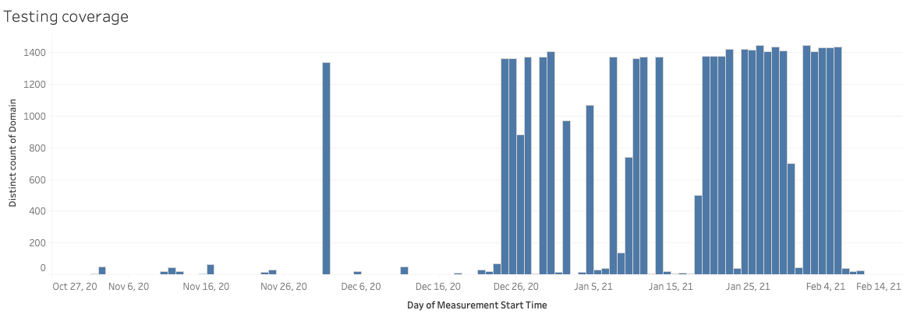

**Chart:** Distinct count of tested domains in Azerbaijan between October 2020 to February 2021.

Moreover, the overall volume of OONI measurements gathered every day from Azerbaijan (between December 2020 to February 2021) was quite stable, as illustrated through the following chart.

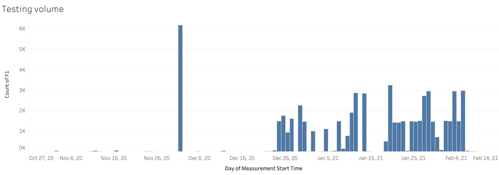

**Chart:** Number of OONI measurements collected per day (on the testing of websites) from Azerbaijan between October 2020 to February 2021.

It’s worth highlighting that, on average, more than 1,000 measurements were collected per day between January 2021 to February 2021. On several days (during this time frame), around 3,000 measurements were collected from Azerbaijan per day.

Apart from the overall measurement coverage, other limitations to this study are associated with per network measurement coverage and the types of domains tested. Overall, this study includes analysis of OONI measurements collected from 31 unique AS networks, but that does not include all AS networks in Azerbaijan. It is therefore possible that we may have missed censorship events on networks that weren’t tested in Azerbaijan during the analysis period. The relatively scarce and sporadic testing across AS networks also means that we may have missed potential temporary blocking events on networks that generally received measurement coverage.

While we tried to ensure that the Citizen Lab test lists include both [internationally-relevant websites](https://github.com/citizenlab/test-lists/blob/master/lists/global.csv) and [websites relevant to Azerbaijan](https://github.com/citizenlab/test-lists/blob/master/lists/az.csv) (including those that were previously reported as blocked by the media), the overall number of URLs tested was rather limited (i.e. we did not test every website available on the internet). Therefore, websites which may be blocked in Azerbaijan, but which were not included in the relevant [Citizen Lab test lists](https://github.com/citizenlab/test-lists/tree/master/lists), were not tested and are not included in our findings. Moreover, not all websites were tested on all networks (that received general testing coverage), nor were they all tested consistently over time, which means that we may have missed the blocking of some websites on some networks.

Finally, our app testing was limited to OONI’s [WhatsApp](https://ooni.org/nettest/whatsapp/), [Facebook Messenger](https://ooni.org/nettest/facebook-messenger/), [Telegram](https://ooni.org/nettest/telegram/), [Psiphon](https://ooni.org/nettest/psiphon/), and [Tor](https://ooni.org/nettest/tor/) tests, which means that other apps (which may have been blocked during our analysis period) were not tested and therefore excluded from the findings of this study. 

## Background

When the internet arrived in Azerbaijan in 1996, little did its users know that in a little over than decade, it would change the landscape of political and civic activism in the country. Similarly, the likelihood of the internet and its services, used for accessing information, raising awareness, campaigning, news sharing, and political activism, was not on the government agenda. Until it became evident, that this may as well be the case.

The most recent [available data](https://theinclusiveinternet.eiu.com/explore/countries/performance/availability/usage/internet-users?highlighted=AZ.;) shows that the internet penetration rate in Azerbaijan is at 80 percent. Having said that, internet quality and access remains poor and relatively inaccessible to the rural communities.

Despite the adoption of government plans and programs aimed at promoting internet development and freedoms, the government [continues to fully control](https://freedomhouse.org/country/azerbaijan/freedom-net/2020) the internet landscape, including internet infrastructure, access, and service quality in an environment [marred by human rights violations](https://www.amnesty.org/en/countries/europe-and-central-asia/azerbaijan/) and the state-of-the-art surveillance technology [utilized](https://www.academia.edu/37482634/Match_made_in_heaven_Authoritarian_states_and_digital_surveillance_Case_study_from_Azerbaijan) to [silence dissent](https://www.codastory.com/authoritarian-tech/surveillance-and-internet-disruption-in-baku/).

The Ministry of Transportation, Communication and High Technologies (MTCHT) remains the main internet regulator in the country, although the country’s Strategic Road Map for Telecommunications and Information Technologies for 2016-2020 [called for](https://monitoring.az/assets/upload/files/6683729684f8895c1668803607932190.pdf) the establishment of an independent regulatory body. Thus, there is currently a lack of independent oversight of the ICT sector. At the same time, [national legislation](http://www.e-qanun.az/framework/32626) requires telecommunications operators and providers to cooperate with law enforcement authorities on the implementation of surveillance schemes, in particular by installing special equipment that grants officials access to confidential information about their customers, in violation of international data protection standards.

The licensing process is regulated by the 2016 Law on Licenses and Permits and the Resolution No. 174 on "additional conditions required for the issuance of special permits (licenses) depending on the nature of the activity", which was adopted by the Cabinet of Ministers on 7 November 2002. This resolution requires a written affirmation of their readiness to install special equipment needed for law enforcement authorities to obtain information from telecommunications networks for reasons of national security. The license fee depends on the nature of the telecommunications services provided. According to Resolution No. 427 on the “Rules of registration of operators and providers of Internet telecommunication services”, which was approved by the Cabinet of Ministers on 12 October 2017, ISPs are required to present a guarantee that they will install special equipment needed to access information during search operations conducted by authorities.

### Network landscape and internet penetration

In addition to underdeveloped infrastructure, and widespread disparities in internet access and quality, the international connectivity of the broadband network is in need of an upgrade and expansion. Limited competition for fixed broadband infrastructure has led to complacency and slow internet speeds.

There are two companies in Azerbaijan - Delta Telekom and AzerTelekom - holding monopoly on the provision of international internet access and selling such services to other national Internet Service Providers (ISPs). Delta is state owned while AzerTelekom is controlled by the state run Azerfon mobile company. The rest of the ICT market is also dominated by state-owned companies.

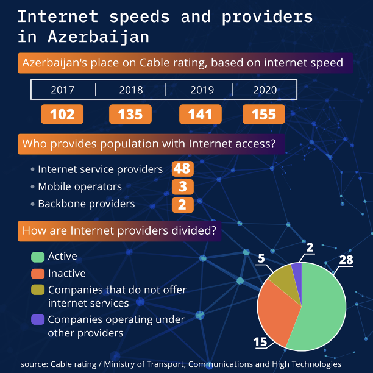

Infographic 1 developed by [MikroskopMedia](https://mikroskopmedia.com/)

In total, the country has 48 ISPs, 3 mobile operators (Azercell, Bakcell, and Azerfon/Nar Mobile) and as mentioned above, two backbone internet providers (See infographic 1).

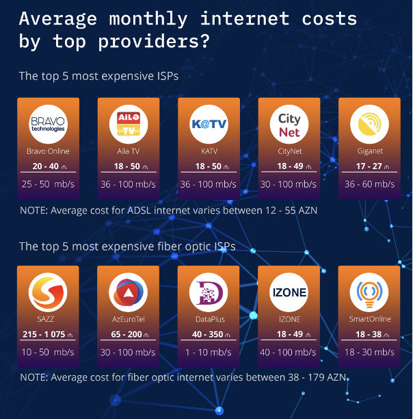

Infographic 2 developed by [MikroskopMedia](https://mikroskopmedia.com/)

The cost of the internet packages offered by ISPs ranges between 15AZN (10.5 USD) and 80 AZN (47 USD) per month. In comparison, the average monthly salary in Azerbaijan is estimated by independent experts to be about 340 AZN (200 USD), making the costs of internet access is prohibitively expensive for many in the country (see Infographic 2).

According to the 2020 Inclusive Internet Index, the [monthly cost of a fixed internet](https://theinclusiveinternet.eiu.com/explore/countries/performance/affordability/price/fixed-line-monthly-broadband-cost?highlighted=AZ) connection in Azerbaijan is 2 percent of the gross national income (GNI) per capita, while the [cost of a mobile data plan](https://theinclusiveinternet.eiu.com/explore/countries/performance/affordability/price/mobile-phone-cost-prepaid-tariff?highlighted=AZ) offering 1 GB per month is 1 percent of the GNI per capita, leaving Azerbaijan behind countries like Ukraine, Turkey and Russia.

### Legal environment

The government of Azerbaijan relies on the [Law on Telecommunications](http://www.e-qanun.az/framework/10663) and legal norms to control the ISPs and mobile operators. Although the law sets out as the basic principle the separation of state regulatory functions from telecommunications, in reality, the law grants the government broad powers with respect to the licensing, and certification of telecommunication activities; the application of tariffs for the use of telecommunication services and radio frequencies; and the regulation of competition, antimonopoly activity and other aspects of telecommunications. 

Recent decrees and legal amendments further signal the state’s approach to internet freedoms and independent media environment. On January 12, President Ilham Aliyev signed a decree “on deepening media reforms in the Republic of Azerbaijan.” As a result, the newly [established](https://www.azernews.az/nation/174953.html) Azerbaijani Agency for Media Development will replace the State Support Fund for Mass Media Development and will have all the rights of the former institution. In tandem, new media law is also being [drafted](https://apa.az/en/media-news/Azerbaijan-to-prepare-law-on-Media-340019) by the Administration of the President for the President’s review in two months. According to its charter, the agency can take measures to protect state and commercial secrets. In case of non-compliance with the information published in the online media within the requirements provided by law, the agency can contact the relevant authorities in order to take measures in this regard.

It also has the authority to take measures in accordance with the Code of Administrative Offenses in case of detecting signs of an administrative violation in the field of print and online media, and in case of detection of signs of a crime – to provide information to the appropriate authority the powers are similar to the National Council on Television and Radio which can and has in the past [deprived](https://www.turan.az/ext/news/2021/1/free/politics%20news/en/337.htm) radio and television companies of air hours.

It will also be accountable to the head of state.

The agency’s governing bodies – a Supervisory Board of six members – and the executive director, are appointed by the head of state. Ahmed Ismayilov, is the executive director of the new fund. In April 2020, he was [appointed](http://contact.az/ext/news/2021/1/free/politics%20news/en/311.htm) the executive director of the now defunct Media Development Support Fund. Ismayilov, 40, is a lawyer by education. Previously he has worked in various government institutions, including the Heydar Aliyev Foundation, managed by the first lady and the first vice president Mehriban Aliyeva. He is a member of the ruling Yeni Azerbaijan Party.

Previously, the central executive body supervising the media in Azerbaijan was abolished when the country joined the Council of Europe in 2001.

In his oOp-ed, the director of Turan News Agency, Mehman Aliyev [wrote](https://www.turan.az/ext/news/2021/1/free/analytics/en/354.htm), “Until now, the press supported by the state legally and illegally, has served the interests of the authorities, but not society; it has led to a deplorable situation in various areas, including the media themselves.”

In the meantime, notes Aliyev, while the new fund’s focus is on technological aspects of media development there is no mention of protection of free press whatsoever. Lack of avenues for independent media in the country and impunity is the challenge, not the lack of technological equipment, notesequipment notes Aliyev.

Alasgar Mammadli, the media law expert, [criticized](https://www.turan.az/ext/news/2021/1/free/politics%20news/en/333.htm) the new agency’s broad, vaguely defined legal powers and the absence of any wider preliminary discussions in the society ahead of its approval.

Six months down the line, the draft media law, is finally set for review, albeit much to the disappointment of freedom of the media advocates and media practitioners in Azerbaijan.

According to Azadliq Radio report, the new law, entails licensing the Internet television and radio broadcasting. The [proposal](https://www.azadliq.org/a/internet-tv-lisenziya/31313244.html) spearheaded by the National Television and Radio Council (NTRC) was announced on June 17.

Specifically the draft law states that:

1) the online channel must have its own website and broadcast from this site;

2) the online channels must broadcast for not less than 6 hours as determined by the proposed new draft bill.

In addition, the Agency for the Development of Mass Media would register online news sites and news agencies.

Several independent experts, said if true, the new bill and specifically the proposal about licensing, violate Article 10 of the European Convention on Human Rights and norms enshrined in Azerbaijan’s Constitution.

[Addressing](https://www.azadliq.org/a/internet-tv-lisenziya/31313244.html) the controversial new bill, a media law expert, Alasgar Mammadli, said in addition to contradicting [Article 10 of the Convention](https://www.echr.coe.int/documents/convention_eng.pdf) the license requirement can only be applied to broadcasters using frequency transmissions which is not the case for Internet television. In another [interview](https://www.azadliq.org/a/internet-tv-lisenziya/31313244.html), Mammadli said, *“Only during the broadcast, there should be compliance with the general law, which is currently regulated by the Law on Mass Media, Criminal Law, and other laws. There are no gaps, and there are even unnecessary regulations (restrictions).”*

Another legal expert, Khaled Aghaliyev, evaluating the bill in a post on social media platform Facebook [said](https://www.facebook.com/khaled.aqaliyev/posts/10225431628275433), *“It was clear that the government, which promised progressive reforms in the legal regulation of the media, worked harder than ever on reactionary regulatory mechanisms.”* Aghaliyev said, in all likelihood, the lawyers working on “progressive regulations” took it upon themselves to interpret one specific sentence of Article 10 word for word. That sentence, notes Aghaliyev, says Aghaliyev says, *“This Article shall not prevent States from requiring the licensing of broadcasting, television or cinema enterprises.” “But they [lawyers] thought wrong. The mentioning of that licensing applies only to traditional television, and radio. Therefore, the part of the new bill that we know of, is reactionary, binding freedom of expression. It does not comply with our constitutional norms or the European Convention.”*

In March 2020 of last, members of Azerbaijan’s National Parliament approved proposed amendments to the [Law on Information, Informatisation and Protection of Information](http://www.e-qanun.az/framework/3525) during the first reading.

Special clauses A special clause on “information-telecommunication network” and “information-telecommunication network users” were [added](http://www.meclis.gov.az/?/az/law/2380/1) to article 13.2. of the law.

While there is no definition of what the “information-telecommunication network [and its users]” clause actually means, [some](https://www.facebook.com/elesger/posts/10158086752689738) media experts and journalists suggested this referred to social media platforms and their users. In Azerbaijan, the Ministry of Transportation, Communication and High Technologies already [holds broad powers](https://www.refworld.org/docid/5a547d663.html) to block websites, without a court order. If these recent suggestions to the law are approved in the final reading, it would further deteriorate freedom of speech online as social media users, posting content the Ministry may deem as misinformation, may be arrested and face charges.

One parliament member, Ganira Pashayeva, even [suggested](https://www.azadliq.org/a/milli-meclis-sosial-mediada-koronavirus/30495529.html) setting up a special unit that would monitor social media platforms, and hold those spreading rumors accountable.

The controversial law on Information, informatisation and access to information was first adopted in 1998. On March 10, 2017, a [series of restrictive amendments](http://www.e-qanun.az/framework/3525) were added to the law, converting the law from a technical regulation into content regulation:

*   **Article 13.1.3.** Creates conditions for the regulation of the domain names without the participation of relevant the parties from the internet community, but by the relevant Ministry, which contradicts international norms, including [ICANN recommendations](https://www.icann.org/resources/pages/policy-2012-02-25-en) in this regard;
*   **Article 13.2.3.** All legal and ethical issues previously existing in various laws have been listed as prohibited information and it has been stressed that their dissemination is prohibited;
*   **Article 13.2.4.** When the owner of the internet information resource and its domain name posts the information, dissemination of which is prohibited or receives an application about that piece of shared information, it guarantees the removal of such information from the information resource;
*   **Article 13.2.5.** When a hosting provider reveals in its information systems some information, dissemination of which in internet information resources is prohibited or receives information about it, it should undertake immediate measures for its removal by the owner of the information resource;
*   **Article 13.3.3.** In cases of existence of real threat for the lawful interests of the state and society or in urgent cases when there is a risk for life or health of people, the access to internet information resources is temporarily restricted directly by the Ministry of Transport, Communications and High Technologies [restriction is applied without a court order. Although an application is made to the court, the decision to close down the online information source remains in force until the court handles the case or the decision is annulled.];
*   **Article 13.3.6.** Describes the List of information resources that are “blocked” which is curated and maintained by the Ministry [to this day, no such resource is publicly available however, AIW has a list of online resources that are regularly measured for blocking with [OONI Probe](https://ooni.org/install/) monitored relying on OONI for blocking]. Independent legal experts [believe](https://rm.coe.int/azerbaijan-analysis-of-legislation-on-access-to-information-december-2/16808ae03c) this kind of authority is restrictive in nature, particularly since it forces Internet Service Providers (ISPs) in the country to block access to specific online resources.

According to the law, the Ministry of Transport, Hich Technologies and Communication is the executive authority deciding on the type of information that is relevant, which websites get blocked and what information must be removed and so on. Yet again illustrating the state’s control and involvement as the sole decision making body.

### Internet censorship and media freedom environment

In Azerbaijan, the media is viewed as an element in the state’s political struggle according to the journalist Shahin Hajiyev. In an interview with Voice of America, Hajiyev [said](https://www.voanews.com/press-freedom/space-free-media-azerbaijan-shrinking-journalists-say), “The space for free media is shrinking by each passing year.”

As a result, almost all of the independent media platforms are currently based outside Azerbaijan with teams dispatched and operating on the ground, delivering news for an audience inside and outside Azerbaijan. Most of their websites have been blocked in the country since 2017. At the time, a court in Baku [ruled](https://freedomhouse.org/article/azerbaijani-court-bans-independent-media-websites) to block access to several popular independent and opposition websites including Meydan TV, Radio Liberty’s Azerbaijani service and three others. According to most recent measurements as presented in this report, the original list now includes at least ten news websites. Scores of independent journalists and activists have [reported](https://www.codastory.com/authoritarian-tech/surveillance-and-internet-disruption-in-baku/) over the years of [hacking attempts](https://www.az-netwatch.org/news/hacking-alert-activists-and-journalists-targeted-online-ongoing/) on their social media accounts and profiles, for their outspokenness or activism. Just as many have [faced criminal proceedings](https://www.az-netwatch.org/news/6-journalists-and-bloggers-behind-bars-in-azerbaijan/) in real life. As a result of deliberate internet censorship and stifling of online dissent, Azerbaijan consistently ranked poorly on a number of international rightswatch organisations, including the annual Freedom House, Freedom on the Net [report](https://freedomhouse.org/country/azerbaijan/freedom-net/2020).

In addition to controlling key infrastructure, the powers vested in the government, the lack of freedoms and the [country’s dismal human rights record](https://www.amnesty.org/en/countries/europe-and-central-asia/azerbaijan/), have also made the government a key player in controlling the internet and the content shared online. The government also resorted to a vast array of [information controls](https://advox.globalvoices.org/2018/01/03/will-we-ever-see-the-end-of-information-control-in-azerbaijan/) over the years, in great part thanks to [authoritarian technology](https://www.opendemocracy.net/en/odr/azerbaijans-authoritarianism-goes-digital/) it has [purchased](https://www.bloomberg.com/news/articles/2020-10-08/sandvine-s-tools-used-for-web-censoring-in-more-than-a-dozen-nations?sref=zAhiqZgK) over [the years](https://www.occrp.org/en/daily/4136-azerbaijan-bought-hacking-team-s-surveillance-spyware-leaks-reveal) and the legal acts such as the 2016 Law on Licenses and Permits and the Resolution No. 174 on "additional conditions required for the issuance of special permits (licenses) depending on the nature of the activity", granting government institutions such as the State Security Services powers to snoop around its citizens both online and offline.

Before advanced censorship authoritarian technology was [available](https://eurasianet.org/azerbaijan-state-and-dissidents-acquire-new-weapons-cyber-war), the government used its arbitrary powers to restrict the internet. This practice began as early as 2003, when the government requested ISPs to [cut access](https://www.refworld.org/docid/46e69182c.html) to all Chechen websites. The same year, now former, the Ministry of Communications and High Technologies official [said](https://www.refworld.org/docid/46e69182c.html), the government body had the right to ask ISPs to block sites containing material that was ‘contrary to the mentality, traditions, and customs’ of the country.

Since then, [blocking access to websites](https://www.az-netwatch.org/news/the-tale-of-blocked-websites/) has become a norm, with the government relying on the existing law on “Information, Informatisation and access to Information”, to implement internet carry out online censorship. That, in addition, non-transparency of the existing process in which ISPs and mobile operators implement government orders to block access to specific content online, makes it hard to fight internet censorship and advocate for internet freedoms. In the absence of any legal remedies at home, often users are left with little or no solution mechanisms. 

## Findings

As part of our analysis of [OONI measurements collected from Azerbaijan](https://explorer.ooni.org/search?since=2020-01-01&probe_cc=AZ) (between 1st January 2020 to 1st May 2021), we found a number of independent news media websites and circumvention tool websites blocked throughout the analysis period. We also found social media websites and apps temporarily blocked amid the 2020 Nagorno-Karabakh war. We share further details in the sections below.

### Blocked news media websites

Several independent news media websites presented signs of blocking in Azerbaijan throughout the analysis period.

These domains include:

1.  `azerbaycansaati.tv`
2.  `criminal.az`
3.  `www.24saat.org`
4.  `www.abzas.net`
5.  `www.azadliq.info`
6.  `www.azadliq.org`
7.  `www.gununsesi.info`
8.  `www.gununsesi.org`
9.  `www.kanal13.tv`
10. `www.meydan.tv`

Independent Azerbaijani media websites (such as `azadliq.info` and `meydan.tv`) have [reportedly](https://advox.globalvoices.org/2017/05/19/azerbaijan-blocks-independent-media-and-actually-admits-it/) been blocked since early 2017 for “posing a threat” to Azerbaijan’s national security. The state prosecutor reportedly accused these websites of sharing content that promotes violence, hatred, extremism, violates privacy and constitutes slander. However, the blocking of these media outlets may have been [politically motivated](https://advox.globalvoices.org/2017/05/19/azerbaijan-blocks-independent-media-and-actually-admits-it/). Azadliq, for example, reported on the [business dealings](https://www.azadliq.org/a/intihar-sui-qesd/28097510.html) of Vice President Mehriban Aliyeva's private foundation, while the website of Gunun Sesi (which has [reportedly](https://freedomhouse.org/country/azerbaijan/freedom-net/2020) been blocked since August 2018) is [operated](https://freedomhouse.org/country/azerbaijan/freedom-net/2020) by Parviz Hashimli, a former political prisoner. 

OONI data also suggests that the site (`www.occrp.org`) of the [Organized Crime and Corruption Reporting Project (OCCRP)](https://explorer.ooni.org/search?until=2021-06-03&since=2021-05-04&domain=www.occrp.org&probe_cc=AZ) and the site (`www.rferl.org`) of [RadioFreeEurope/RadioLiberty (RFE/RFL)](https://explorer.ooni.org/search?until=2021-06-03&since=2021-05-04&domain=www.rferl.org&probe_cc=AZ&only=anomalies) were blocked in Azerbaijan as well. The blocking of the OCCRP site [reportedly](https://www.meydan.tv/en/article/occrp-blocked-in-azerbaijan/) began in September 2017, following the publication of a major investigation (“[Azerbaijani Laundromat](https://www.occrp.org/en/azerbaijanilaundromat/)”) into corruption, bribery, and money laundering in which powerful figures were allegedly involved. The blocking of the RFE/RFL website also [reportedly](https://www.rferl.org/a/azerbaijan-rferl-service-website-court-orders-blocked/28482679.html) began in 2017, following an Azerbaijani court order which RFE/RFL [described](https://www.rferl.org/a/azerbaijan-rferl-service-website-court-orders-blocked/28482679.html) as “another blatant attempt at silencing its reporting in the country”. 

The following chart illustrates OONI measurement findings from the testing of these media websites (on multiple local networks) in Azerbaijan between January 2020 to May 2021.

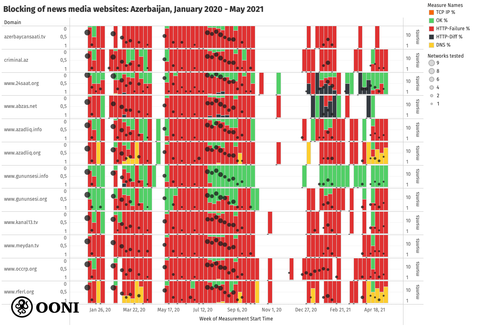

**Chart:** Blocking of media websites in Azerbaijan between January 2020 to May 2021 based on OONI data, [https://explorer.ooni.org/search?since=2020-01-01&probe_cc=AZ&test_name=web_connectivity&only=anomalies](https://explorer.ooni.org/search?since=2020-01-01&probe_cc=AZ&test_name=web_connectivity&only=anomalies)

Most OONI measurements collected from the testing of these media websites (on multiple local networks) [presented anomalies](https://explorer.ooni.org/search?until=2021-06-04&since=2021-05-05&probe_cc=AZ&test_name=web_connectivity&only=anomalies) throughout the testing period, strongly suggesting potential blocking. In contrast, most of the other URLs tested from the [Citizen Lab test lists](https://github.com/citizenlab/test-lists/tree/master/lists) during this period were found [accessible](https://explorer.ooni.org/search?until=2021-06-04&since=2021-05-05&probe_cc=AZ&test_name=web_connectivity) (on the same networks in Azerbaijan).

What is evident from the above chart is that most of the anomalous measurements (for these media websites) consistently presented the same “HTTP failures” throughout the testing period. This means that OONI Probe was able to successfully resolve via DNS the IP addresses of these domains and successfully establish TCP connections to the resolved IP addresses, but when it attempted to retrieve the website content, the connection failed. In most cases, we observe that these media websites appear to be blocked because the HTTP requests time out. This is an indication that the blocking might be implemented by means of [Deep Packet Inspection (DPI)](https://ooni.org/support/glossary/#dpi).

The above chart aggregates measurement findings (per domain) from many different networks in Azerbaijan (as annotated in the chart, where the largest dots correspond to measurements collected from 9 local networks). The reason why we see different measurement results (such as “OK” and “HTTP failure”) for the same URL on the same dates is because those results were collected from different networks. This therefore suggests that media website blocking varies from network to network in Azerbaijan. This is further evident through a per [ASN](https://ooni.org/support/glossary/#asn) analysis of measurements.

For example, when looking at measurements collected from the testing of `azerbaycansaati.tv`, we can see that it presented signs of blocking on at least 6 local networks (`AS15723`, `AS28787`, `AS31721`, `AS34170`, `AS39232`, `AS42779`) in February 2020, but had seemingly been unblocked on `AS15723` by May 2020 (as all subsequent measurements showed that the site was accessible on those networks), as illustrated through the following chart.

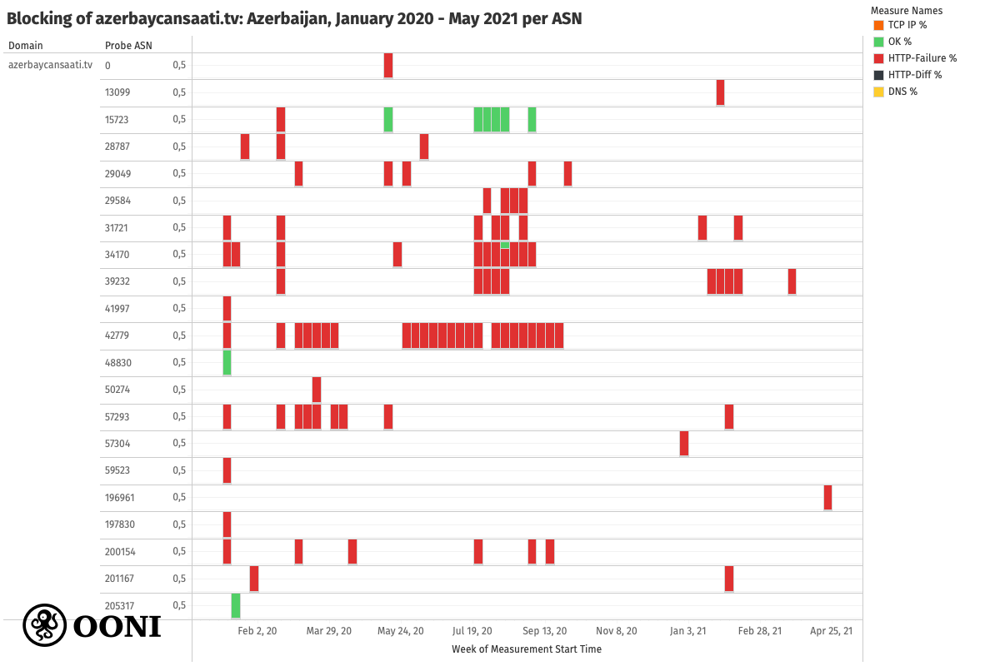

**Chart:** Blocking of `azerbaycansaati.tv` across AS networks in Azerbaijan between February 2020 to April 2021 based on OONI data, [https://explorer.ooni.org/search?until=2021-06-04&since=2021-05-05&domain=azerbaycansaati.tv&probe_cc=AZ](https://explorer.ooni.org/search?until=2021-06-04&since=2021-05-05&domain=azerbaycansaati.tv&probe_cc=AZ)

When looking at measurements collected from the testing of `www.azadliq.info`, we can see that it was found blocked on many networks, while accessible on a few networks (such as `AS29584` and `AS15723`), as illustrated below.

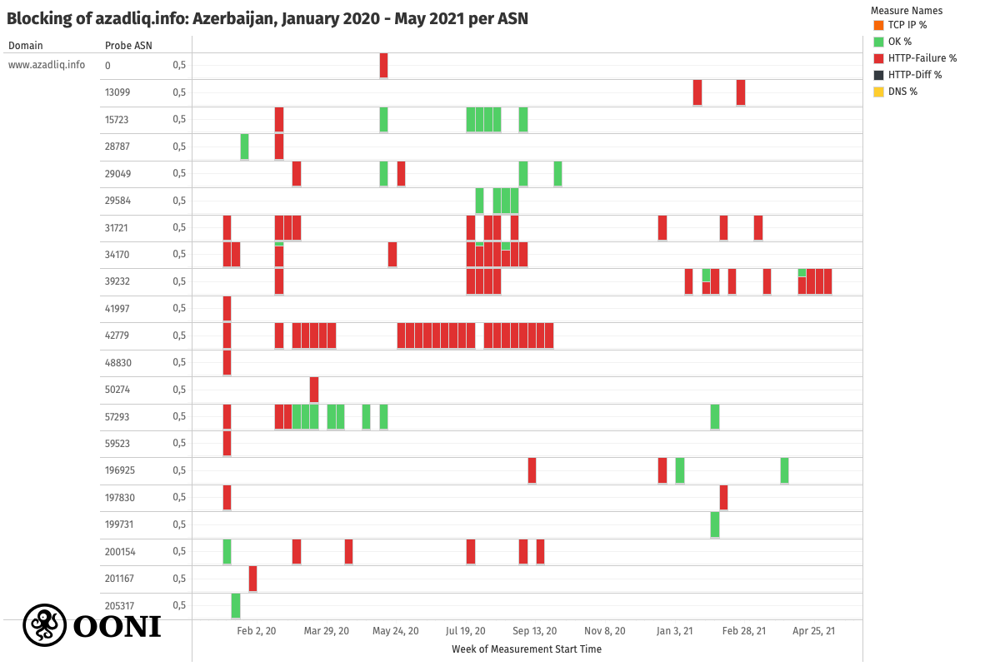

**Chart:** Blocking of `azadliq.info` across AS networks in Azerbaijan between February 2020 to April 2021 based on OONI data, [https://explorer.ooni.org/search?until=2021-06-04&since=2021-05-05&domain=www.azadliq.info&probe\_cc=AZ](https://explorer.ooni.org/search?until=2021-06-04&since=2021-05-05&domain=www.azadliq.info&probe_cc=AZ)

Interestingly, `www.gununsesi.org` appears to remain blocked on most networks, but `www.gununsesi.info` was found accessible every time it was tested (on multiple networks) from 26th July 2020 onwards (even though it previously presented signs of blocking, similarly to `www.gununsesi.org`), as illustrated through the following chart.

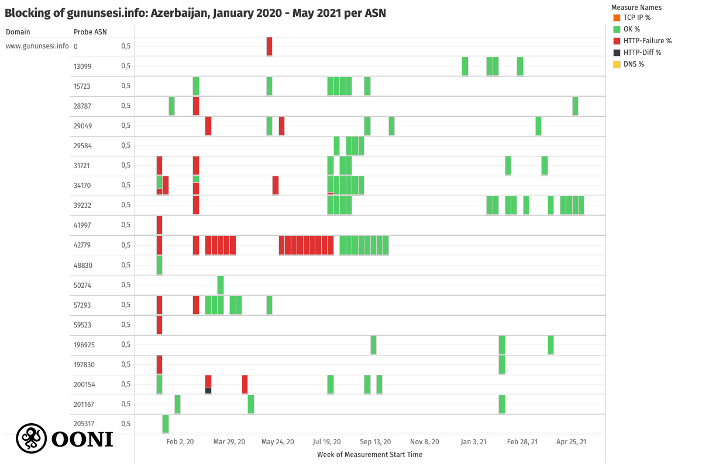

**Chart:** Blocking of `gununsesi.info` across AS networks in Azerbaijan between February 2020 to April 2021 based on OONI data, [https://explorer.ooni.org/search?until=2021-06-04&since=2021-05-05&domain=www.gununsesi.info&probe\_cc=AZ](https://explorer.ooni.org/search?until=2021-06-04&since=2021-05-05&domain=www.gununsesi.info&probe_cc=AZ)

When `www.gununsesi.org` is accessed from a browser, it redirects to `www.gununsesi.info`, suggesting that most internet users in Azerbaijan likely do not experience the blocking of `www.gununsesi.org` (at least on the networks where `www.gununsesi.info` is accessible).

### Blocking of social media amid 2020 Nagorno-Karabakh war

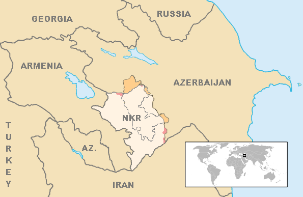

War [erupted](https://www.bbc.com/news/world-europe-54324772) in [Nagorno-Karabakh](https://www.bbc.com/news/world-europe-18270325) on 27th September 2020 between Azerbaijan and ethnic Armenians, once Azerbaijan [launched an offensive](https://www.theguardian.com/world/2020/nov/10/nagorno-karabakh-armenia-pm-signs-deal-to-end-war-with-azerbaijan-and-russia) to retake Nagorno-Karabakh and surrounding regions under Armenian control. The war lasted for six weeks -- up until 10th November 2020, when a Russian-brokered truce was signed.

The peace deal is [viewed](https://www.bbc.com/news/world-europe-54882564) as a victory for Azerbaijan (which regained most of the occupied territories surrounding Nagorno-Karabakh and large parts of Nagorno-Karabakh), and a defeat for Armenia.

This was the second war in the disputed region, following the [first Nagorno-Karabakh war](https://www.rferl.org/a/1065626.html) between 1988 to 1994, which ended with a ceasefire and tens of thousands of deaths. The region has since been internationally recognized as Azerbaijani, but run by separatist ethnic Armenians (backed by the Armenian government). While the second conflict ended with a peace deal and fewer casualties in comparison to the first war, the new ceasefire agreement prompted anger and [protests](https://www.crisisgroup.org/europe-central-asia/caucasus/nagorno-karabakh-conflict/getting-ceasefire-peace-nagorno-karabakh) in Armenia, while the details of the new peace deal have been [described](https://www.theguardian.com/world/2020/nov/10/nagorno-karabakh-armenia-pm-signs-deal-to-end-war-with-azerbaijan-and-russia) by the International Crisis Group as rather vague. There are therefore [concerns](https://www.cfr.org/global-conflict-tracker/conflict/nagorno-karabakh-conflict) of cease-fire violations and renewed tensions without successful mediation efforts.

#### Blocking of social media websites

Amid the [2020 Nagorno-Karabakh war](https://www.bbc.com/news/world-europe-54324772), OONI data [shows](https://explorer.ooni.org/search?since=2020-01-01&probe_cc=AZ&test_name=web_connectivity&only=anomalies&until=2021-06-10) that access to several social media websites and apps was blocked in Azerbaijan. The following chart, limited to social media websites that presented signs of blocking between February 2020 to May 2021, aggregates OONI measurement findings collected from 4 AS networks in Azerbaijan.

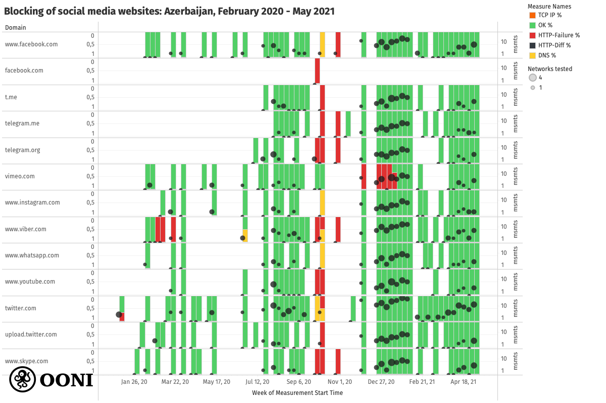

**Chart:** Blocking of social media websites in Azerbaijan based on OONI data (collected between March 2020 to May 2021), [https://explorer.ooni.org/search?since=2020-01-01&probe_cc=AZ&test_name=web_connectivity&only=anomalies](https://explorer.ooni.org/search?since=2020-01-01&probe_cc=AZ&test_name=web_connectivity&only=anomalies)

As is evident from the above chart, most of these social media websites primarily [presented signs of blocking](https://explorer.ooni.org/measurement/20201030T232015Z_webconnectivity_AZ_34876_n1_UWIBPqC9nIZq1L28?input=http%3A%2F%2Fwww.facebook.com%2F) during the 2020 Nagorno-Karabakh war (between 27th September 2020 to 10th November 2020), but were found [accessible](https://explorer.ooni.org/measurement/20201224T085701Z_webconnectivity_AZ_196925_n1_gILh6TXHAwl86poo?input=http%3A%2F%2Fwww.facebook.com%2F) when tested (on several networks in Azerbaijan) in the months before and after the war. Notably, most anomalous measurements presented HTTP failures (because the HTTP requests timed out), similarly to the blocking of news media websites (discussed previously). This provides a stronger indication that these social media websites were blocked, particularly since ISPs often use the same censorship technique(s) to block a variety of different websites.

Two social media websites though (`www.viber.com` and `vimeo.com`) appear to have potentially been blocked in dates before and after the 2020 Nagorno-Karabakh war. OONI data shows that the [testing](https://explorer.ooni.org/search?since=2021-05-11&domain=www.viber.com&probe_cc=AZ) of `www.viber.com` presented signs of blocking on 3 AS networks (`AS28787`, `AS50274`, `AS57923`) from as early as February and March 2020, as illustrated through the following chart.

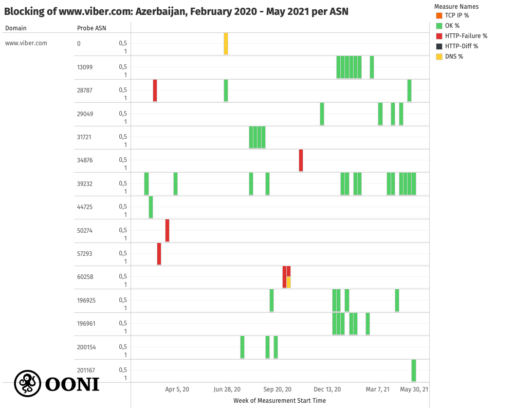

**Chart:** Testing of `www.viber.com` across AS networks in Azerbaijan between February 2020 to May 2021 based on OONI data, [https://explorer.ooni.org/search?since=2021-05-11&domain=www.viber.com&probe\_cc=AZ](https://explorer.ooni.org/search?since=2021-05-11&domain=www.viber.com&probe_cc=AZ)

More recent measurements collected from `AS28787` suggest that `www.viber.com` is accessible, but as the site hadn’t been tested on `AS50274` and `AS57923` since March 2020, it remains unclear if the potential block was persistent on those networks. Amid the 2020 Nagorno-Karabakh war, we observe the potential blocking of `www.viber.com` on the `AS60258` and `AS34876` networks. However, the limited testing coverage throughout this period limits our ability to evaluate whether the site was blocked on other networks, when the blocking started, and how long it lasted. Testing coverage of `www.viber.com` increased in January 2021, enabling us to confirm the accessibility of the site on multiple AS networks (as demonstrated through the above chart).

Vimeo.com, on the other hand, only started presenting signs of potential blocking after the 2020 Nagorno-Karabakh war. The following chart shows that vimeo.com appeared to have been [blocked](https://explorer.ooni.org/search?since=2020-11-01&domain=vimeo.com&probe_cc=AZ) in Azerbaijan between 1st December 2020 to 11th January 2021, though the blocking may have started at an earlier date (we cannot exclude this hypothesis due to the limited testing coverage).

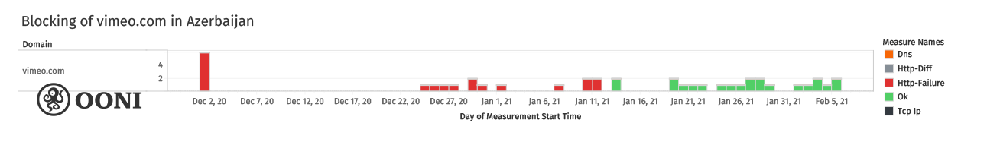

**Chart:** Blocking of vimeo.com in Azerbaijan between December 2020 to January 2021 based on OONI data.

This is suggested from OONI measurements which [show](https://explorer.ooni.org/measurement/20210111T075445Z_webconnectivity_AZ_39232_n1_MwN4fOSghJ1ttluE?input=https%3A%2F%2Fvimeo.com%2F) that connections to `https://vimeo.com` timed out when performing the HTTPS request to the site [every time that it was tested](https://explorer.ooni.org/search?since=2020-11-01&domain=vimeo.com&probe_cc=AZ) throughout this period. This is further suggested by the fact that we observe the exact same HTTP failures and timeouts (on 5 AS networks) as we did for the testing of other websites (discussed previously). The following chart provides a per-ASN breakdown of `vimeo.com` measurement coverage in Azerbaijan between February 2020 to May 2021.

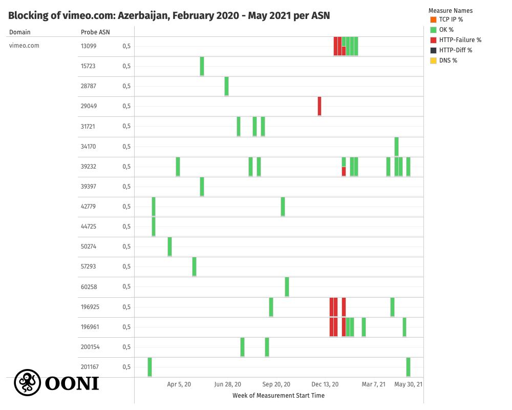

**Chart:** Testing of `vimeo.com` across AS networks in Azerbaijan between February 2020 to May 2021 based on OONI data, [https://explorer.ooni.org/search?since=2021-05-11&domain=vimeo.com&probe_cc=AZ](https://explorer.ooni.org/search?since=2021-05-11&domain=vimeo.com&probe_cc=AZ)

Currently, vimeo.com appears to be [accessible](https://explorer.ooni.org/search?since=2020-11-01&domain=vimeo.com&probe_cc=AZ) on several networks in Azerbaijan, as illustrated through the above chart.

#### Blocking of instant messaging apps

We also observe the potential blocking of instant messaging apps in Azerbaijan during the 2020 Nagorno-Karabakh war. The following chart aggregates OONI measurements collected from the testing of [WhatsApp](https://ooni.org/nettest/whatsapp/), [Telegram](https://ooni.org/nettest/telegram/), and [Facebook Messenger](https://ooni.org/nettest/facebook-messenger/) (on up to 9 AS networks) in Azerbaijan between January 2020 to May 2021.

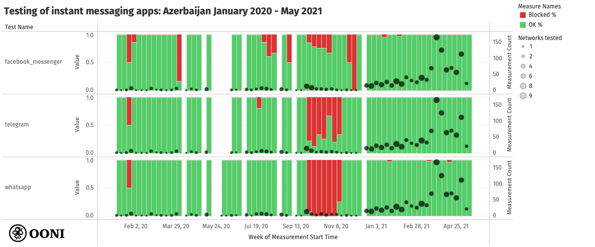

**Chart:** Blocking of instant messaging apps in Azerbaijan based on OONI data (collected between January 2020 to May 2021), [https://explorer.ooni.org/search?since=2021-05-11&probe_cc=AZ](https://explorer.ooni.org/search?since=2021-05-11&probe_cc=AZ)

It is evident from the above chart that the testing of [WhatsApp](https://explorer.ooni.org/measurement/20201013T091449Z_AS57293_FzfUoxzPn0MJ54QB0MfBDrvkise9gIC9s6UiCR9zBR3Xid4vPk) and [Telegram](https://explorer.ooni.org/measurement/20201013T091504Z_AS57293_EQwZAGeu31VSogUgZGcSD7dWkTXeO1GazIa0qYIEe3X8Sui5mB) primarily presented anomalies between September 2020 to November 2020, which coincides with the [2020 Nagorno-Karabakh war](https://www.bbc.com/news/world-europe-54324772). During this period, most measurements presented anomalies and signs of [WhatsApp](https://explorer.ooni.org/measurement/20201022T224244Z_whatsapp_AZ_57293_n1_URgnFAYE4EVt5qIP) and [Telegram](https://explorer.ooni.org/measurement/20201022T223851Z_telegram_AZ_57293_n1_k6k8ioloAMiEnxi5) blocking. But most measurements collected before and after the war show that these apps were [reachable](https://explorer.ooni.org/search?until=2021-06-12&since=2021-05-13&probe_cc=AZ&test_name=whatsapp) from local networks in Azerbaijan. While we also observe some [anomalous measurements pertaining to the testing of Facebook Messenger](https://explorer.ooni.org/measurement/20201029T142707Z_facebookmessenger_AZ_28787_n1_AVXqhgPois0hQj9z) during the 2020 Nagorno-Karabakh war, they are much fewer in comparison to the anomalies presented in the testing of Telegram and WhatsApp, limiting our confidence with respect to Facebook Messenger blocking.

It is possible that other social media apps may have been blocked during the 2020 Nagorno-Karabakh war, but our findings are limited to the testing of [WhatsApp](https://ooni.org/nettest/whatsapp/), [Telegram](https://ooni.org/nettest/telegram/), and [Facebook Messenger](https://ooni.org/nettest/facebook-messenger/) because these are the primary social media apps that [OONI Probe](https://ooni.org/install/) provides tests for. [Signal measurements](https://explorer.ooni.org/search?until=2021-06-12&since=2021-05-13&probe_cc=AZ&test_name=signal) are excluded from this analysis, because the [OONI Probe Signal test](https://ooni.org/nettest/signal/) was only released recently. However, recent measurements collected from Azerbaijan suggest that the Signal Private Messenger app [works](https://explorer.ooni.org/measurement/20210611T105112Z_signal_AZ_31721_n1_ZnEFy0jHnlAzE4X3) on several networks.

##### WhatsApp

Between 27th September 2020 to 11th November 2020, OONI measurements consistently presented signs of WhatsApp blocking in Azerbaijan, as illustrated through [OONI Probe WhatsApp measurements](https://explorer.ooni.org/search?until=2020-11-27&since=2020-09-01&probe_cc=AZ&test_name=whatsapp) collected from several local networks. During this period, all [OONI Probe WhatsApp tests showed signs of WhatsApp blocking](https://explorer.ooni.org/search?until=2020-11-27&since=2020-09-01&probe_cc=AZ&test_name=whatsapp&only=anomalies), while all [other](https://explorer.ooni.org/search?until=2020-11-27&since=2020-09-01&probe_cc=AZ&test_name=whatsapp) OONI measurements collected before and after this time period successfully connected to the tested endpoints of WhatsApp’s mobile app and web interface.

Within the [anomalous measurements](https://explorer.ooni.org/search?until=2020-11-27&since=2020-09-01&probe_cc=AZ&test_name=whatsapp&only=anomalies) (which suggested WhatsApp blocking), we observe that attempted connections to WhatsApp's registration service and web interface (web.whatsapp.com) failed. It’s worth noting that in [some cases](https://explorer.ooni.org/measurement/20201102T013112Z_whatsapp_AZ_39232_n1_jCcFoDIxyQlMrYtT), the HTTP request to web.whatsapp.com succeeded, while the HTTPS request failed, as illustrated below.

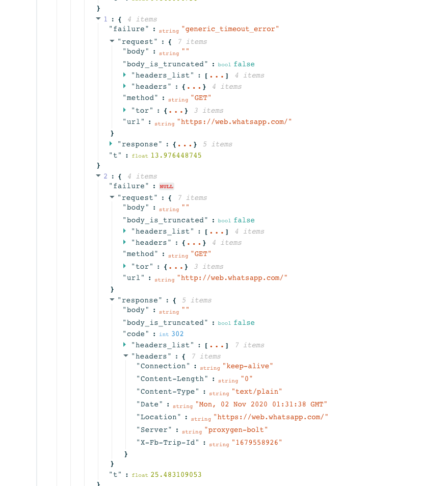

This could be an indication of SNI based filtering of WhatsApp. We also observe that the TLS handshakes field presented failures, further suggesting that access to WhatsApp was blocked in Azerbaijan by means of SNI based filtering. This pattern was observed on several ISPs in Azerbaijan between 27th September 2020 to 11th November 2020.

##### Telegram

Similarly to the testing of WhatsApp, OONI measurements presented [signs of Telegram blocking](https://explorer.ooni.org/search?until=2020-11-27&since=2020-09-01&probe_cc=AZ&test_name=telegram&only=anomalies) in Azerbaijan between 27th September 2020 to 11th November 2020. But unlike WhatsApp, a few Telegram tests during this period were successful. This is suggested through [OONI Probe Telegram measurements](https://explorer.ooni.org/search?until=2020-11-27&since=2020-09-01&probe_cc=AZ&test_name=telegram) collected from several local networks in Azerbaijan (illustrated through the previous chart) between 1st September 2020 to 27th November 2020.

We observe similarities between the date range of potential blocking (of WhatsApp and Telegram), but we see that both HTTP and HTTPS requests to Telegram Web (web.telegram.org) [timed out](https://explorer.ooni.org/measurement/20201102T183400Z_telegram_AZ_50274_n1_lngut2aTSYVobqHp). We observe a [timeout in the TLS handshake](https://explorer.ooni.org/search?until=2020-11-27&since=2020-09-01&probe_cc=AZ&test_name=telegram&only=anomalies), suggesting TLS level interference of Telegram.

As a result, it is possible that internet users in Azerbaijan couldn’t use the Telegram and WhatsApp mobile apps (on the tested networks) between 27th September 2020 to 11th November 2020.

### Blocked circumvention tool sites

Numerous circumvention tool websites presented signs of potential blocking when tested (on up to 3 AS networks) in Azerbaijan between February 2020 to May 2021, as illustrated through the following chart.

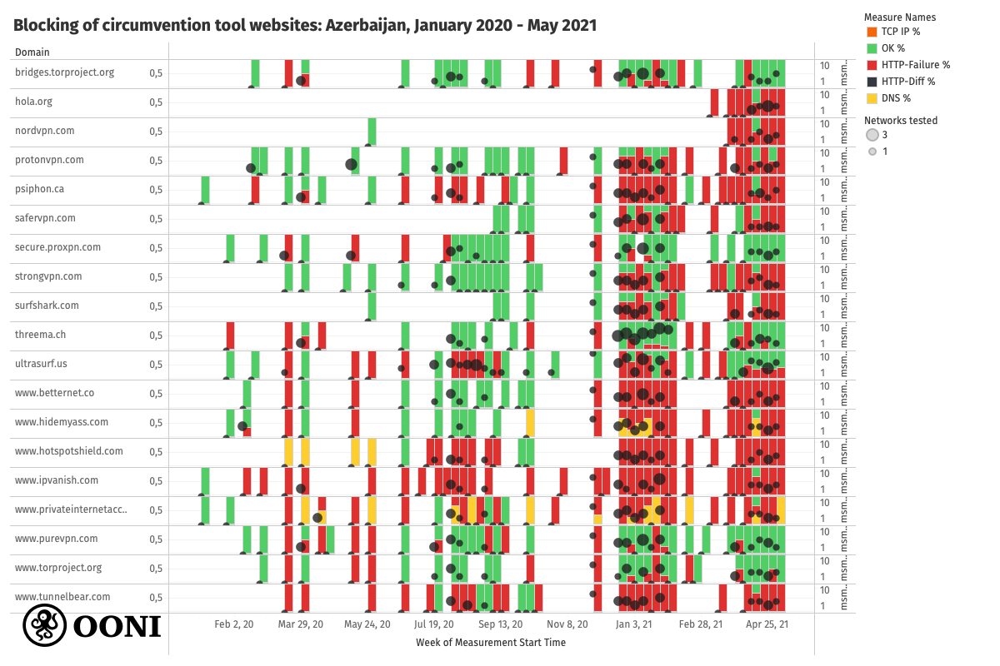

**Chart:** Blocking of circumvention tool websites in Azerbaijan based on OONI data (collected between January 2020 to May 2021), [https://explorer.ooni.org/search?since=2020-01-01&probe\_cc=AZ&test\_name=web\_connectivity&only=anomalies](https://explorer.ooni.org/search?since=2020-01-01&probe_cc=AZ&test_name=web_connectivity&only=anomalies)

Similarly to the blocking of news media and social media websites, we observe that the testing of circumvention tool websites [often](https://explorer.ooni.org/measurement/20210120T135659Z_webconnectivity_AZ_196961_n1_mmv1ohvJMITxyfXX?input=https%3A%2F%2Fwww.torproject.org%2F) [resulted](https://explorer.ooni.org/measurement/20201229T213913Z_webconnectivity_AZ_196925_n1_GrvcacpX2MhB9VN1?input=https%3A%2F%2Fpsiphon.ca%2F) in [HTTP failures](https://explorer.ooni.org/measurement/20210111T075445Z_webconnectivity_AZ_39232_n1_MwN4fOSghJ1ttluE?input=https%3A%2F%2Fwww.tunnelbear.com%2F) caused by connection timeouts. This consistency in terms of failures, observed on several AS networks over the period of a year, strongly suggests blocking of these circumvention tool websites. As testing coverage increased from January 2021 onwards, we observed an increased volume of anomalous measurements, most presenting the same HTTP failures.

It’s worth highlighting though that these circumvention tool sites did not display signs of blocking on all tested networks, suggesting that their blocking varies from ISP to ISP in Azerbaijan (as appears to also be the case for other blocked sites, discussed previously). Nor did they display signs of blocking every time that they were tested on those networks over time. All of this is evident from the above chart that aggregates measurement results (per URL) from several different AS networks in Azerbaijan, displaying a variance (“OK” and “anomalous”) in measurement results.

Even though we observe consistency in terms of blocking techniques adopted by ISPs, we see that different sites are blocked by different ISPs at different moments in time. Some circumvention tool sites (such as [torproject.org](https://explorer.ooni.org/measurement/20210527T135516Z_webconnectivity_AZ_39232_n1_OoeoxKSNHIoW7Qhd?input=https%3A%2F%2Fwww.torproject.org%2F) and [purevpn.com](https://explorer.ooni.org/measurement/20210526T172253Z_webconnectivity_AZ_39232_n1_mbREiLo5qZDnnnKG?input=https%3A%2F%2Fwww.purevpn.com%2F)) were recently found accessible on some networks. On the other hand, sites like [nordvpn.com](https://explorer.ooni.org/measurement/20210524T135523Z_webconnectivity_AZ_39232_n1_Nm8am7CasoIu9veI?input=https%3A%2F%2Fnordvpn.com%2F), [protonvpn.com](https://explorer.ooni.org/measurement/20210527T135516Z_webconnectivity_AZ_39232_n1_OoeoxKSNHIoW7Qhd?input=https%3A%2F%2Fprotonvpn.com%2F), [psiphon.ca](https://explorer.ooni.org/measurement/20210531T134250Z_webconnectivity_AZ_39232_n1_I7J0JPg8Hjr1ENeq?input=https%3A%2F%2Fpsiphon.ca%2F), and [strongvpn.com](https://explorer.ooni.org/measurement/20210527T124850Z_webconnectivity_AZ_39232_n1_wu1VodRzK1Jsloki?input=https%3A%2F%2Fstrongvpn.com%2F) presented HTTP failures (caused by connection timeouts) in most measurements collected in April 2021 -- providing a stronger signal of potential blocking.

Given that a number of news media websites appear to have been blocked in Azerbaijan throughout the testing period (between January 2020 to May 2021), it is possible that ISPs in Azerbaijan may have blocked access to popular circumvention tool sites in an attempt to prevent internet users from circumventing internet censorship (such as the blocking of news media websites).

#### Tor and Psiphon

As OONI Probe only includes tests for 3 circumvention tools ([Tor](https://ooni.org/nettest/tor/), [Psiphon](https://ooni.org/nettest/psiphon/), [RiseupVPN](https://ooni.org/nettest/riseupvpn/)), it remains unclear if the apps of all the other aforementioned circumvention tool websites were blocked as well (i.e. it is possible that only their websites were blocked). [RiseupVPN measurements](https://explorer.ooni.org/search?until=2021-06-12&since=2021-05-13&probe_cc=AZ&test_name=riseupvpn) are excluded from this analysis (since this [test](https://ooni.org/nettest/riseupvpn/) was only released a few months ago), but recent measurements collected from Azerbaijan suggest that RiseupVPN [works](https://explorer.ooni.org/measurement/20210611T095059Z_riseupvpn_AZ_196925_n1_dJNOgZV4x6UvCb41) on local networks.

The following chart aggregates all OONI measurements collected from the [testing of Psiphon](https://explorer.ooni.org/search?until=2021-06-12&since=2021-05-13&probe_cc=AZ&test_name=psiphon) and [Tor](https://explorer.ooni.org/search?until=2021-06-12&since=2021-05-13&probe_cc=AZ&test_name=tor) on up to 9 AS networks in Azerbaijan, between January 2020 to May 2021.

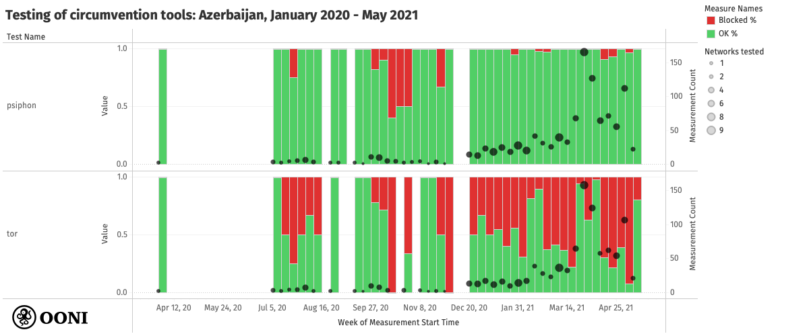

**Chart:** Testing of circumvention tools in Azerbaijan based on OONI data (collected between January 2020 to May 2021), [https://explorer.ooni.org/search?since=2021-05-11&probe\_cc=AZ](https://explorer.ooni.org/search?since=2021-05-11&probe_cc=AZ)

As is evident, the [testing of Tor](https://explorer.ooni.org/search?until=2021-06-12&since=2021-05-13&probe_cc=AZ&test_name=tor) presented a significantly larger volume of anomalies in comparison to the [testing of Psiphon](https://explorer.ooni.org/search?until=2021-06-12&since=2021-05-13&probe_cc=AZ&test_name=psiphon) throughout the testing period. We also see that both Tor and Psiphon presented a larger volume of anomalous measurements between September 2020 to November 2020, which coincides with the [2020 Nagorno-Karabakh war](https://www.bbc.com/news/world-europe-54324772). As access to social media platforms was [blocked](https://www.balcanicaucaso.org/eng/Areas/Azerbaijan/Azerbaijan-the-Internet-in-times-of-war-205919) in Azerbaijan during this period (as discussed previously), it’s possible that internet users may have made [greater use of circumvention tools](https://surfshark.com/blog/azerbaijan-starts-blocking-media) (to bypass social media blocks), which local ISPs may have attempted to block.

In [Tor anomalous measurements](https://explorer.ooni.org/search?until=2021-06-12&since=2021-05-13&probe_cc=AZ&test_name=tor&only=anomalies), we observe a blocking attempt by several local ISPs, but internet users in Azerbaijan could likely use [Tor](https://www.torproject.org/) nonetheless. Using Tor requires connecting to 1 Tor directory authority, and the [OONI Probe Tor test](https://ooni.org/nettest/tor/) measures the reachability of 10 Tor directory authorities, in addition to 15 Tor Browser [bridges](https://bridges.torproject.org/) (which help with circumventing Tor blocking).

In OONI measurements, we see that some ISPs in Azerbaijan appear to have blocked connections to a subset of Tor directory authorities (for example, on `AS28787` we see that [connections failed to 7](https://explorer.ooni.org/measurement/20201014T142140Z_AS28787_C6HQmTGrA24EbrxJSHhmaEQ47D4QJZqAlTPWR5FNTJbRp97eXL) out of 10 directory authorities, while on `AS42779` we see that [connections failed to 8](https://explorer.ooni.org/measurement/20201014T142943Z_AS42779_dEF2KNECjwt7r8LqeuxgPNnRDJrnDZ6nss3kQnu47NXWydCDWk) out of 10 directory authorities). On some networks (such as `AS196925`), we see [all connections to all 10 tested directory authorities failing](https://explorer.ooni.org/measurement/20201029T211052Z_tor_AZ_196925_n1_ZgoVCny0Au4972rz) (as well as failed connections to 8 Tor bridges), while on other networks (such as `AS39397`), we see [successful connections to all 10 tested directory authorities](https://explorer.ooni.org/measurement/20201030T205554Z_tor_AZ_39397_n1_GEwUsMJXNrLnnDcG) (where there’s no sign of Tor blocking).

In short, it seems that some ISPs in Azerbaijan attempted to block access to Tor (some more effectively than others), while other ISPs did not. Even in the cases where ISPs appear to have attempted to block access to Tor, the fact that they often didn’t block access to all Tor directory authorities suggests that internet users in Azerbaijan may have been able to use Tor nonetheless (since connecting to 1 Tor directory authority is sufficient for using Tor). Moreover, it’s possible to circumvent Tor blocking through the use of [Tor bridges](https://bridges.torproject.org/) (many of which were [not blocked](https://explorer.ooni.org/measurement/20201014T142140Z_AS28787_C6HQmTGrA24EbrxJSHhmaEQ47D4QJZqAlTPWR5FNTJbRp97eXL), according to OONI measurements). Tor also maintains a list of fallback directory authorities (which are not currently tested by the [OONI Probe Tor test](https://ooni.org/nettest/tor/)) and a connection to any of those is usually sufficient to successfully bootstrap Tor.

The hypothesis that the blocking attempt against Tor was ineffective is further suggested by Tor Metrics, which [show a large spike in directly connecting Tor users from Azerbaijan](https://metrics.torproject.org/userstats-relay-country.html?start=2020-08-01&end=2020-12-30&country=az&events=off) during this period (amid the 2020 Nagorno-Karabakh war).

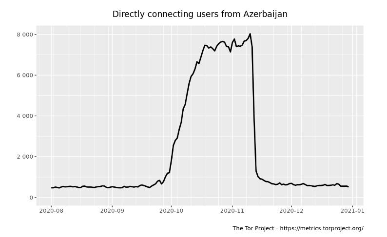

**Chart:** Tor Metrics, Directly connecting users from Azerbaijan between 1st August 2020 to 30th December 2020, [https://metrics.torproject.org/userstats-relay-country.html?start=2020-08-01&end=2020-12-30&country=az&events=off](https://metrics.torproject.org/userstats-relay-country.html?start=2020-08-01&end=2020-12-30&country=az&events=off)

Even in cases where ISPs appeared to [attempt to block access to Tor](https://explorer.ooni.org/measurement/20201014T142140Z_AS28787_C6HQmTGrA24EbrxJSHhmaEQ47D4QJZqAlTPWR5FNTJbRp97eXL), on most networks they did not block access to all Tor directory authorities, meaning that internet users in Azerbaijan could likely use Tor anyway -- as further suggested by the spike in Tor usage during this time frame.

Quite similarly, Tor Metrics also [show a large spike in Tor bridge users from Azerbaijan](https://metrics.torproject.org/userstats-bridge-country.html?start=2020-08-01&end=2020-12-30&country=az) during the same period.

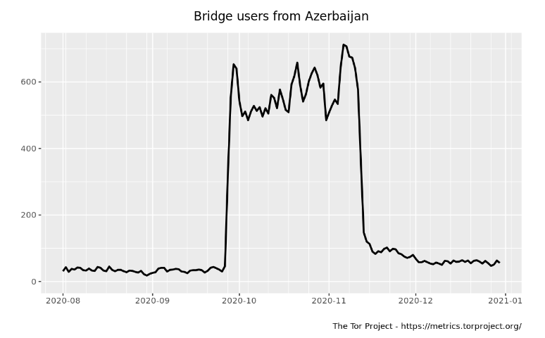

**Chart:** Tor Metrics, Bridge users from Azerbaijan between 1st August 2020 to 30th December 2020, [https://metrics.torproject.org/userstats-bridge-country.html?start=2020-08-01&end=2020-12-30&country=az](https://metrics.torproject.org/userstats-bridge-country.html?start=2020-08-01&end=2020-12-30&country=az)

As we observe the [potential blocking of all 10 tested Tor directory authorities](https://explorer.ooni.org/measurement/20201029T211052Z_tor_AZ_196925_n1_ZgoVCny0Au4972rz) on some networks, this may have resulted in the increased use of Tor bridges in Azerbaijan. Recent OONI measurements suggest that [attempts to block Tor appear to be ongoing](https://explorer.ooni.org/search?until=2021-06-12&since=2021-05-13&probe_cc=AZ&test_name=tor), while Tor’s website (www.torproject.org) appears to be [blocked](https://explorer.ooni.org/measurement/20210530T105053Z_webconnectivity_AZ_60258_n1_H3bQBQuydpgs0Gjm?input=https%3A%2F%2Fwww.torproject.org%2F) on some networks, but [accessible](https://explorer.ooni.org/measurement/20210611T095506Z_webconnectivity_AZ_196925_n1_4oaAaCs3Qxn2z8ZB?input=https%3A%2F%2Fwww.torproject.org%2F) on many others.

Psiphon also presented an increased volume of [anomalous measurements](https://explorer.ooni.org/measurement/20201014T041710Z_AS203622_dzuDmZBynGUPa8JvJS4Tq6xYe4VWpIHr3BAm3yQQfetESvbGRD) amid the 2020 Nagorno-Karabakh, suggesting that local ISPs may have attempted to block access to it as well. However, we also observe many [successful measurements](https://explorer.ooni.org/measurement/20201013T092707Z_AS57293_psovJca5TFn72zSu5eXtXF9bF4KAUFoYXR8O8FVRm271RF9wXB) during this period (where the [OONI Probe Psiphon test](https://ooni.org/nettest/psiphon/) is able to successfully bootstrap Psiphon and fetch a webpage from the internet), and [Psiphon has built-in circumvention techniques (fallback options)](https://github.com/Psiphon-Labs/psiphon-tunnel-core#circumvention-optimizations), suggesting that attempts to block Psiphon may have been quite ineffective. 

While the testing of Psiphon presented a few anomalies after the 2020 Nagorno-Karabakh war, those anomalies are likely [false positives](https://ooni.org/support/faq/#what-are-false-positives) (particularly since the vast majority of measurements were successful). Recent measurements suggest that access to Psiphon’s website (`psiphon.ca`) is [blocked](https://explorer.ooni.org/search?until=2021-06-12&since=2021-05-13&probe_cc=AZ&test_name=web_connectivity&domain=psiphon.ca) on several networks, but the Psiphon app seems to [work](https://explorer.ooni.org/search?until=2021-06-12&since=2021-05-13&probe_cc=AZ&test_name=psiphon)(based on tests on several networks).

## Conclusion

Press freedom appears to be quite limited in Azerbaijan, as suggested by the [blocking of several independent news media websites](https://explorer.ooni.org/search?since=2020-01-01&probe_cc=AZ&test_name=web_connectivity&only=anomalies&until=2021-06-15) in the country. These media websites presented signs of blocking throughout their testing (on several local AS networks) between January 2020 to May 2021 (corroborating [past reports](https://advox.globalvoices.org/2017/05/19/azerbaijan-blocks-independent-media-and-actually-admits-it/) on the blocking of media websites in Azerbaijan), with recent OONI measurements suggesting that their [blocking remains ongoing](https://explorer.ooni.org/measurement/20210611T125048Z_webconnectivity_AZ_196925_n1_UPy97oSW7tyjVHUP?input=https%3A%2F%2Fwww.gununsesi.org%2F).

Potentially in an attempt to prevent the circumvention of media censorship, ISPs in Azerbaijan appear to have [blocked access to a number of circumvention tool websites](https://explorer.ooni.org/search?since=2020-01-01&probe_cc=AZ&test_name=web_connectivity&only=anomalies&until=2021-06-15) over the last year as well. It remains unclear, however, if the apps of these circumvention tool sites were also blocked (as they were not tested as part of this study); and even if they were, it’s possible that local internet users may have been able to use them nonetheless, given that circumvention tools often include built-in circumvention techniques for evading censors.

Amid the [2020 Nagorno-Karabakh war](https://www.bbc.com/news/world-europe-54324772), ISPs in Azerbaijan appear to have attempted to block the [Tor](https://explorer.ooni.org/measurement/20201029T211052Z_tor_AZ_196925_n1_ZgoVCny0Au4972rz) and [Psiphon](https://explorer.ooni.org/measurement/20201014T041710Z_AS203622_dzuDmZBynGUPa8JvJS4Tq6xYe4VWpIHr3BAm3yQQfetESvbGRD) circumvention tools. Yet, these attempts were likely ineffective, given that both tools have [built-in circumvention techniques](https://github.com/Psiphon-Labs/psiphon-tunnel-core#circumvention-optimizations) and [fallback options](https://gitlab.torproject.org/legacy/trac/-/wikis/doc/FallbackDirectoryMirrors) for circumventing blocks. In [Tor measurements](https://explorer.ooni.org/measurement/20201014T142140Z_AS28787_C6HQmTGrA24EbrxJSHhmaEQ47D4QJZqAlTPWR5FNTJbRp97eXL), we observe that most ISPs did not block all tested Tor directory authorities, suggesting that it was possible to use [Tor](https://www.torproject.org/) nonetheless (as also indicated by the [spike in Tor usage](https://metrics.torproject.org/userstats-relay-country.html?start=2020-08-01&end=2020-12-30&country=az&events=off) from Azerbaijan during that period). Similarly, many Psiphon measurements during this period were [successful](https://explorer.ooni.org/measurement/20201013T092707Z_AS57293_psovJca5TFn72zSu5eXtXF9bF4KAUFoYXR8O8FVRm271RF9wXB), suggesting that it may have been possible to use the [Psiphon VPN](https://psiphon.ca/) on many networks.

Several social media websites (such as `www.facebook.com` and `www.youtube.com`) and apps (primarily [WhatsApp](https://explorer.ooni.org/measurement/20201022T224244Z_whatsapp_AZ_57293_n1_URgnFAYE4EVt5qIP) and [Telegram](https://explorer.ooni.org/measurement/20201022T223851Z_telegram_AZ_57293_n1_k6k8ioloAMiEnxi5)) presented [signs of blocking](https://explorer.ooni.org/measurement/20201030T232015Z_webconnectivity_AZ_34876_n1_UWIBPqC9nIZq1L28?input=http%3A%2F%2Fwww.facebook.com%2F) between September 2020 to November 2020, which coincides with the [2020 Nagorno-Karabakh war](https://www.bbc.com/news/world-europe-54324772). It is therefore possible that ISPs may have increased efforts to block circumvention tools (during this period) in an attempt to prevent the circumvention of social media censorship.

Interestingly, we observe similar censorship techniques adopted by different ISPs in Azerbaijan, but variance in terms of which internet services are blocked by ISPs over time. In other words, we see ISPs blocking websites and apps in similar ways (seemingly using the same censorship techniques), but different ISPs block access to different websites and apps (and sometimes this varies at different moments in time).

Throughout the testing period, independent news media and circumvention tool websites presented HTTP failures caused by connection timeouts, suggesting the potential use of [Deep Packet Inspection (DPI)](https://ooni.org/support/glossary/#dpi) by ISPs in Azerbaijan. Similarly, when social media websites were temporarily blocked amid the [2020 Nagorno-Karabakh war](https://www.bbc.com/news/world-europe-54324772), their testing also presented HTTP failures caused by connection timeouts. This suggests that most ISPs in Azerbaijan block websites using similar (if not the same) censorship techniques.

Both WhatsApp and Telegram presented signs of TLS level interference on several different AS networks in Azerbaijan amid the 2020 Nagorno-Karabakh war. In the case of [WhatsApp](https://explorer.ooni.org/measurement/20201102T013112Z_whatsapp_AZ_39232_n1_jCcFoDIxyQlMrYtT), the HTTP requests to `web.whatsapp.com` succeeded, while the HTTPS requests failed (during the TLS handshake), which could be an indication of SNI based filtering. In the case of [Telegram](https://explorer.ooni.org/measurement/20201102T183400Z_telegram_AZ_50274_n1_lngut2aTSYVobqHp), we see that both HTTP and HTTPS requests to `web.telegram.org` timed out.

As media censorship (and the blocking of circumvention tool websites) appears to be ongoing in Azerbaijan, there is need for further testing to evaluate these censorship events in more depth over time. The temporary blocking of social media amid the 2020 Nagorno-Karabakh war also suggests that new censorship events can emerge in Azerbaijan, as political events evolve.

This study was carried out through the use of [open methodologies](https://github.com/ooni/spec/tree/master/nettests), [free and open source software](https://ooni.org/install/), and [open data](https://ooni.org/data/), enabling independent third-party verification of our research findings. We encourage researchers to expand upon this study by [running OONI Probe](https://ooni.org/install/) and analyzing [OONI measurements from Azerbaijan](https://explorer.ooni.org/search?since=2021-05-16&probe_cc=AZ). 

## Acknowledgements

We thank all [OONI Probe](https://ooni.org/install/) users in Azerbaijan for contributing measurements, making this study possible.
