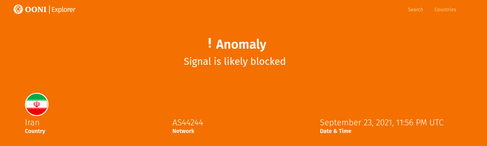
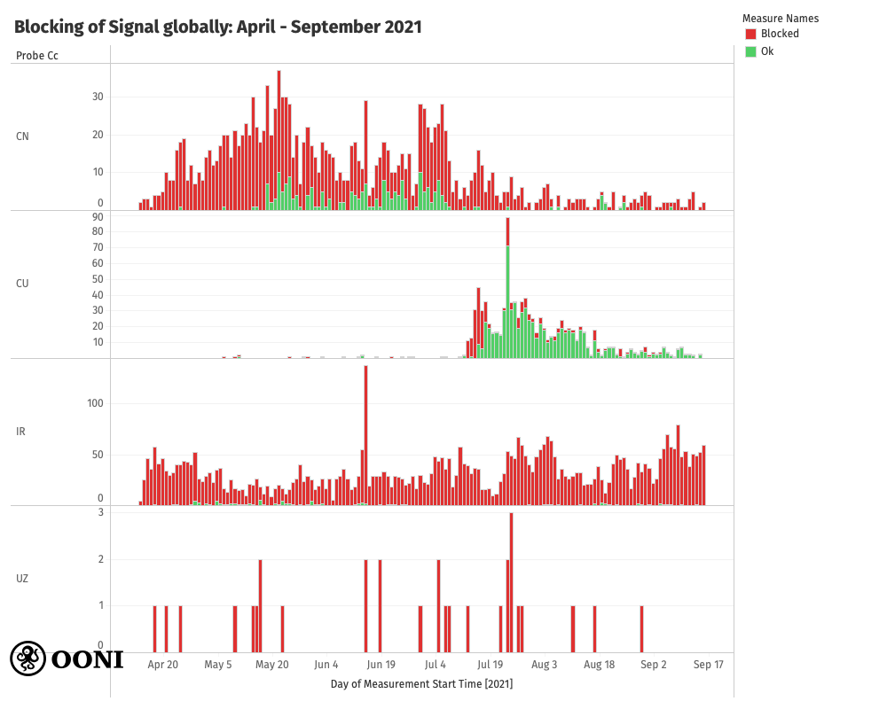
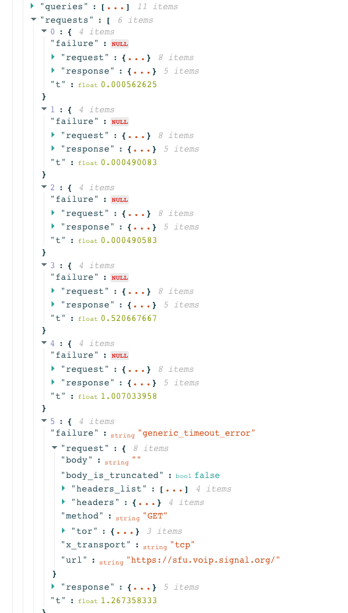
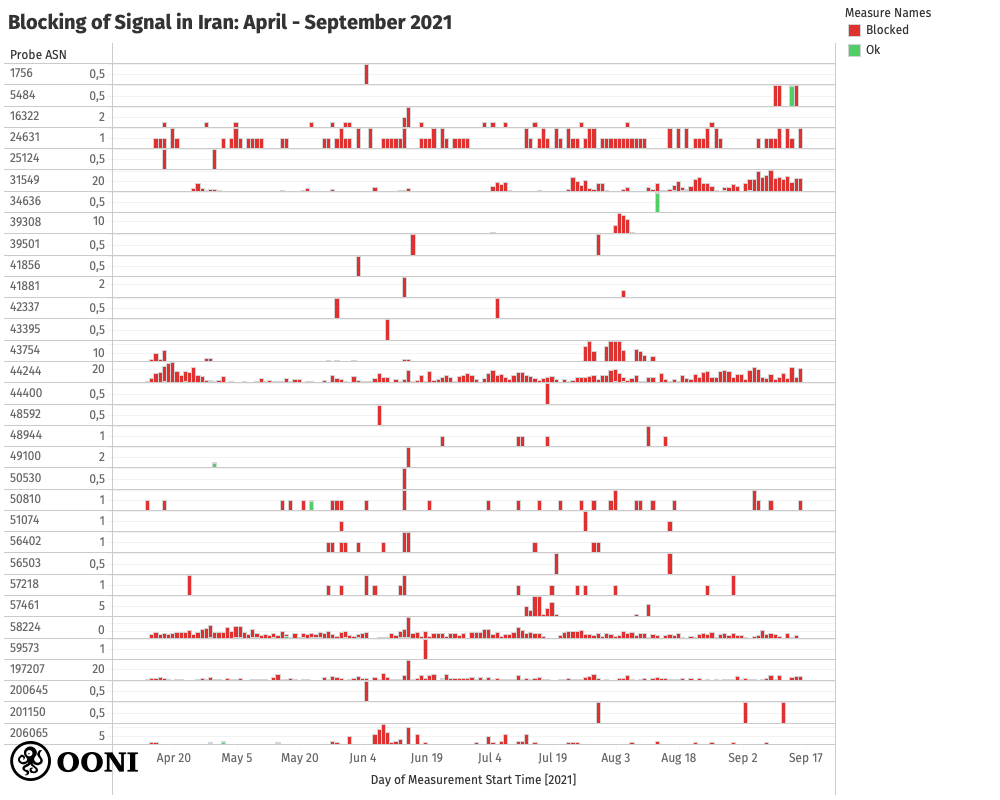
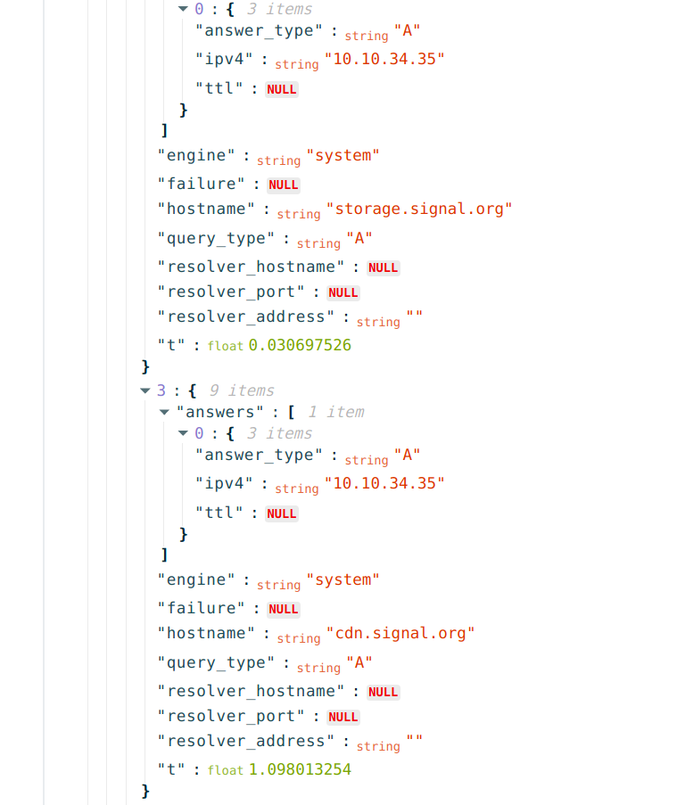
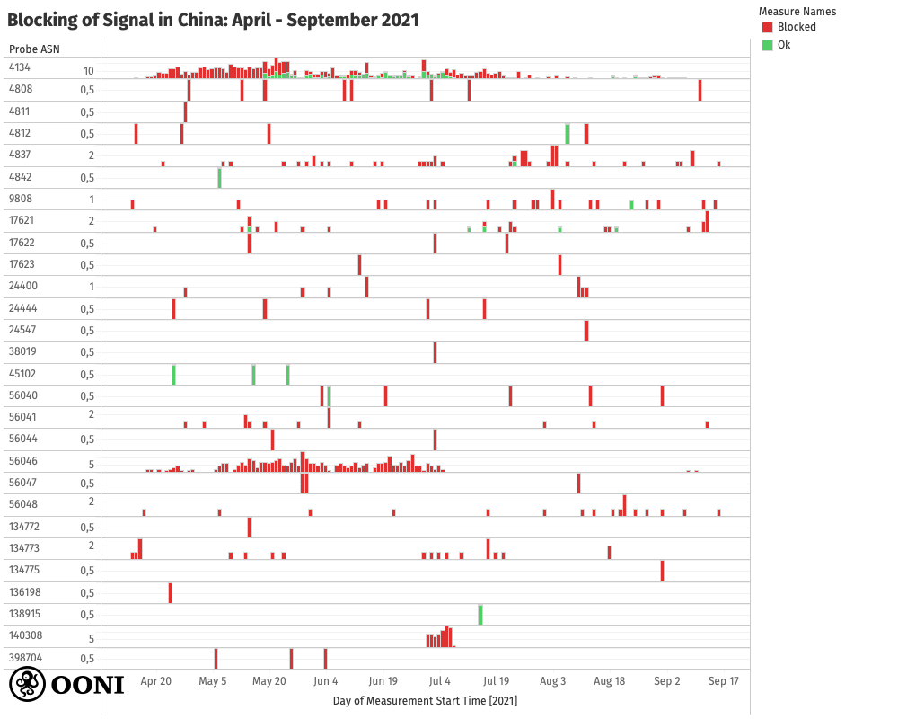
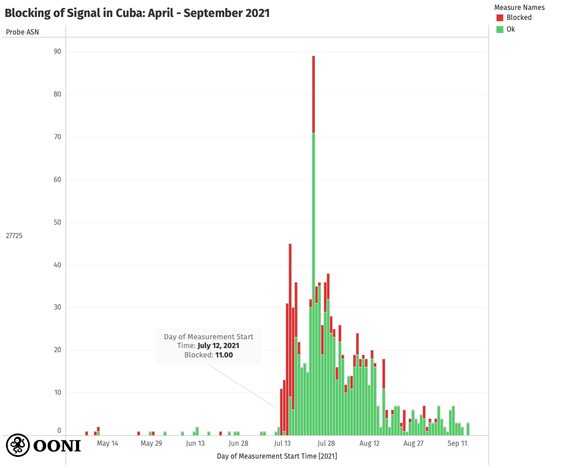
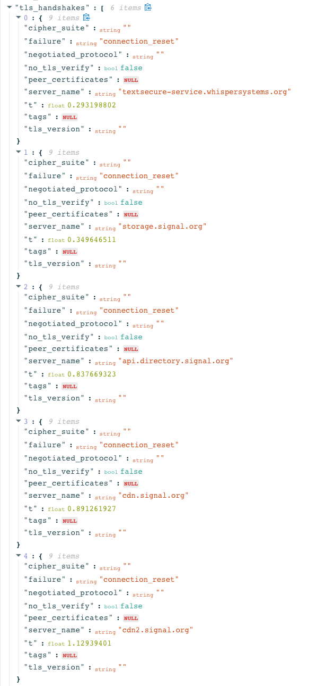
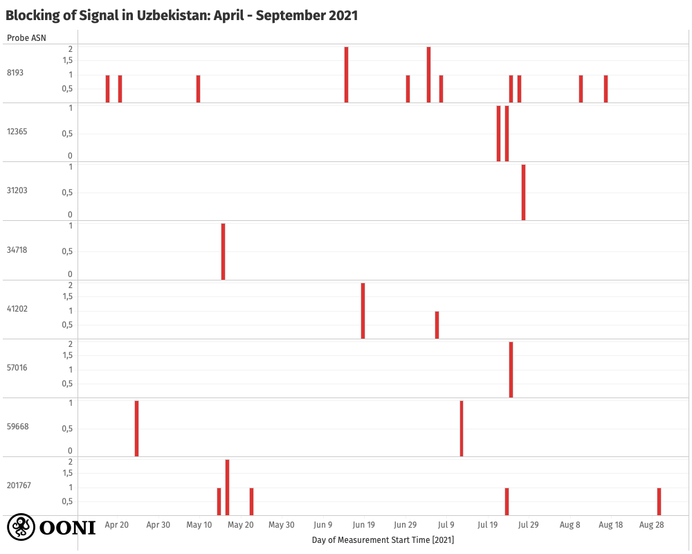
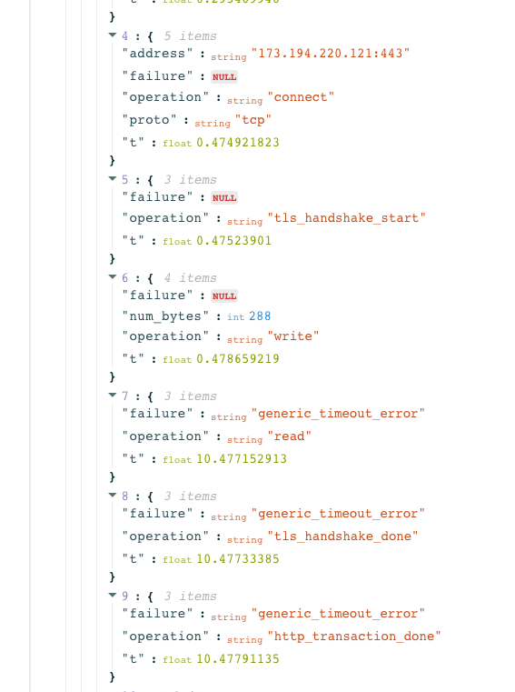

{{}}

[Signal Private Messenger](https://signal.org/), commonly used by
human rights defenders worldwide, is widely considered the
state-of-the-art app for private and secure communications. But as its
[popularity surged](https://edition.cnn.com/2021/01/12/tech/signal-growth-whatsapp-confusion/index.html)
recently, we have started to observe its
[blocking](https://explorer.ooni.org/search?until=2021-09-29&since=2021-08-30&test_name=signal&only=anomalies)
in several countries.

In this report, we share our analysis of [OONI network measurement data](https://explorer.ooni.org/search?until=2021-09-29&since=2021-08-30&test_name=signal&only=anomalies)
on the blocking of the Signal Private Messenger app in **Iran, China,
Cuba, and Uzbekistan**.

Currently, circumvention is [enabled by default](https://github.com/signalapp/Signal-Android/blob/83b9fbac11868833925f9395364b8167a1c6615a/app/src/main/java/org/thoughtcrime/securesms/push/SignalServiceNetworkAccess.java#L53)
for Signal users in Iran, Egypt, Oman, Qatar, and the UAE. If Signal
users in other countries are unable to use the app, they can enable the
“Censorship Circumvention” setting on iOS. On Android, Signal blocking
can be circumvented through the use of [Signal TLS proxies](https://support.signal.org/hc/en-us/articles/360056052052-Proxy-Support).

* [Background](#background)

* [Methods](#methods)

* [Findings](#findings)

	* [Iran](#iran)

	* [China](#china)

	* [Cuba](#cuba)

	* [Uzbekistan](#uzbekistan)

* [Conclusion](#conclusion)

* [Acknowledgements](#acknowledgements)

# Background

[Signal](https://signal.org/) is a free and open source messaging app
for encrypted voice calls and instant messages, developed by an
independent non-profit organization ([Signal Foundation](https://signalfoundation.org/), the successor of [Open Whisper Systems](https://en.wikipedia.org/wiki/Open_Whisper_Systems)).

Signal provides security by encrypting communications in transit
(end-to-end encryption) and by ensuring that past communications are
secure even if encryption keys are stolen (forward secrecy). Over the
years, a number of high profile security experts and anti-surveillance
activists have strongly recommended using the Signal app for private and
secure communications.

[Edward Snowden](https://www.theguardian.com/world/2013/jun/09/edward-snowden-nsa-whistleblower-surveillance)
(the whistleblower who became famous in 2013 after leaking secret NSA
documents, exposing vast surveillance capabilities) has
[stated](https://twitter.com/snowden/status/661313394906161152?lang=en)
that he uses Signal every day. [Bruce Schneier](https://www.schneier.com/), an internationally renowned
security technologist, [said](https://signal.org/):

*“I am regularly impressed with the thought and care put into both the
security and the usability of this app. It's my first choice for an
encrypted conversation."*

Signal’s protocol for end-to-end encryption has been integrated by
several other applications with large global user bases. Notably,
[WhatsApp integrated the Signal protocol](https://www.theguardian.com/technology/2016/apr/05/whatsapp-rolls-out-full-encryption-to-a-billion-messenger-users)
in 2016, bringing end-to-end encryption to a billion users worldwide.

But even though Signal and WhatsApp now use the same protocol for
end-to-end encryption, the [Signal app is still considered more secure](https://securityinabox.org/en/blog/why-we-still-recommend-signal-over-whatsapp/)
because it’s open source, enabling independent security review of the
overall app (unlike WhatsApp, which is closed source). Both Signal and
WhatsApp require a phone number for the creation of an account. It’s
worth highlighting that WhatsApp only encrypts the content of
communications, while Signal encrypts *both* communication content *and*
[metadata](https://signal.org/blog/sealed-sender/) (such as who you
contact).

This means, for example, that WhatsApp knows who you communicate with,
knows the name of each WhatsApp group and who is in it, and knows the
profile picture of every user and group. Signal, on the other hand,
never knows who you communicate with and how often, does not know the
name of any group or who’s in each group, and does not have access to
individual or group profile pictures. This difference between Signal and
WhatsApp (in terms of access to metadata) is particularly important for
vulnerable individuals and groups (such as human rights activists).

Signal is created by a non-profit organization whose
[mission](https://signalfoundation.org/) is to “protect free
expression and enable secure global communication”. WhatsApp, on the
other hand, is owned by Facebook, whose business model is rooted in
advertising (fuelled by data mining). When WhatsApp first integrated the
Signal protocol in 2016, they provided users the ability to opt-out of
sharing metadata with Facebook. However, the reference to this opt-out
option was [removed from WhatsApp’s privacy policy in January 2021](https://www.whatsapp.com/legal/updates/privacy-policy/), sparking
a [major public backlash](https://www.forbes.com/sites/carlypage/2021/02/19/whatsapp-is-pushing-ahead-with-its-controversial-privacy-update-despite-user-backlash/).
Yet, rather than changing the policy that sparked the controversy,
WhatsApp [extended the deadline that required users to accept the policy changes](https://www.wired.com/story/whatsapp-privacy-policy-facebook-data-sharing/),
without which the app is gradually rendered unusable.

As a result, Signal saw a [new surge in global usage](https://edition.cnn.com/2021/01/12/tech/signal-growth-whatsapp-confusion/index.html)
earlier this year. Signal was also endorsed by [Elon Musk](https://twitter.com/elonmusk/status/1347165127036977153?lang=en),
among other influential people. Over the last months, millions of people
worldwide have
[flocked](https://www.nytimes.com/2021/01/13/technology/telegram-signal-apps-big-tech.html)
to [Signal](https://signal.org/) (and
[Telegram](https://telegram.org/)) over privacy concerns, triggered by
WhatsApp’s latest privacy policy update.

But as Signal popularity increased, so have concerns that the app may be
targeted for censorship -- particularly as part of broader social media
blocks (which tend to [occur during political events](https://ooni.org/reports/) around the world). In recent months,
our community members have reported that they could not use Signal in
certain countries, requesting that we develop a new network measurement
experiment specifically designed to measure the reachability of the
Signal Private Messenger app. We
[released](https://github.com/ooni/probe-cli/releases/tag/v3.9.0) this
[test](https://ooni.org/nettest/signal) in April 2021, and we share
the findings from our analysis in this report.

# Methods

Since 2011, the [OONI](https://ooni.org/) team has developed [free and open source software tests](https://github.com/ooni/spec/tree/master/nettests) designed to
measure internet censorship and other forms of network interference.
These tests are shipped as part of the [OONI Probe app](https://ooni.org/install/), which is available for both
[mobile](https://ooni.org/install/mobile) and
[desktop](https://ooni.org/install/desktop) platforms.

More specifically, the OONI Probe app includes
[tests](https://ooni.org/nettest/) for measuring the [blocking of websites](https://ooni.org/nettest/web-connectivity/); the blocking of
instant messaging apps
([WhatsApp](https://ooni.org/nettest/whatsapp/), [Facebook Messenger](https://ooni.org/nettest/facebook-messenger/),
[Telegram](https://ooni.org/nettest/telegram/)); the blocking of
circumvention tools ([Tor](https://ooni.org/nettest/tor/),
[Psiphon](https://ooni.org/nettest/psiphon/),
[RiseupVPN](https://ooni.org/nettest/riseupvpn/)); and [network speed and performance](https://ooni.org/nettest/#performance).

Every month, OONI Probe is run by users in around [200 countries and territories](https://explorer.ooni.org/), who perform tests on their
local networks. As soon as they run OONI Probe, they immediately have
access to the test results directly in their OONI Probe app. To increase
transparency of internet censorship worldwide, OONI Probe measurements
are automatically sent to OONI servers,
[processed](https://github.com/ooni/pipeline), and published as [open data](https://ooni.org/data/) in near real-time. OONI data has
supported research and [advocacy](https://www.accessnow.org/keepiton/)
efforts worldwide, particularly those examining the [blocking of social media apps](https://ooni.org/reports/).

In April 2021, we released a [new OONI Probe test for the Signal Private Messenger App](https://ooni.org/nettest/signal). We prioritized
developing this test in response to community requests, and because we
started to hear reports of its blocking. As the global use of Signal
[increased significantly](https://edition.cnn.com/2021/01/12/tech/signal-growth-whatsapp-confusion/index.html)
over the last months, so did the need to measure its reachability and
provide [open data](https://explorer.ooni.org/search?until=2021-10-01&since=2021-09-01&test_name=signal).
Moreover, as Signal is increasingly being used by activist communities,
the risk of it being blocked has increased -- particularly during
[political events](https://ooni.org/reports/) (such as elections and
protests).

The [OONI Probe Signal test](https://github.com/ooni/spec/blob/master/nettests/ts-029-signal.md)
is designed to measure the reachability of the Signal messaging app
within a tested network. To this end, this test checks whether it’s
possible to establish a TLS connection (while validating the TLS
certificate against the custom Signal CA root certificate) and send an
HTTP GET request to the Signal server backends from the vantage point of
the user. If the test successfully performs an HTTPS request to the
tested Signal endpoints, the Signal app is considered reachable from the
tested network. If, however, connections to any of the tested Signal
endpoints fail, the Signal measurement is flagged as
“[anomalous](https://ooni.org/support/glossary/#network-anomaly)”,
indicating that Signal might be unreachable or blocked on the tested
network.

It’s important to highlight though that [false positives](https://ooni.org/support/faq/#what-are-false-positives) can
occur. OONI Probe Signal measurements may present anomalies due to
several reasons which are unrelated to the intentional blocking of
Signal. For example, false positives can occur due to transient network
failures, if the Signal backend infrastructure is down, or if Signal
makes changes to their infrastructure which affects how this test is
performed.

It is therefore necessary to look at measurements in *aggregate* in
order to check if the same types of anomalies are persistent on the same
network over time. In other words, if the testing of Signal provides
anomalies (with the same errors in the raw network measurement data)
every time that it is tested on a specific network, those measurements
may provide an indication that access to Signal is blocked on that
network (particularly if Signal is reachable on other networks). If,
however, a large volume of Signal measurements show that the app is
reachable on a network, the few anomalous measurements may be false
positives.

As part of this study, we analyzed [all OONI Probe Signal measurements](https://explorer.ooni.org/search?until=2021-10-01&since=2021-09-01&test_name=signal)
collected from around the world since the release of the [OONI Probe Signal test](https://ooni.org/nettest/signal/), between **1st April
2021 to 15th September 2021**. This means that if Signal was only
blocked in certain countries *before* this testing period, we do not
have relevant measurements and have therefore excluded those cases from
this study. In December 2016, for example, Signal
[reported](https://twitter.com/signalapp/status/810945070182469632)
that its service was blocked in Egypt. In response, Signal [added support for domain fronting](https://www.wired.com/2016/12/encryption-app-signal-fights-censorship-clever-workaround/)
to make Signal traffic look no different from a Google search; this
would require censors to block Google in order to block Signal. But
Egypt did precisely that, inadvertently resulting in [collateral damage](https://twitter.com/signalapp/status/817062093094604800).
Recent [OONI Probe Signal measurements from Egypt](https://explorer.ooni.org/search?until=2021-10-06&since=2021-09-06&probe_cc=EG&test_name=signal)
suggest that the app is now reachable, which is why it has been excluded
as a case study in this research.

Moreover, the volume of OONI measurements varies from country to
country, and from network to network within countries. The availability
of Signal measurements depends on when OONI Probe users run the Signal
test, which countries those OONI Probe users are in, and on which AS
networks they run the test on. As a result, the *decentralized
crowdsourcing nature of Signal measurements* means that there is
variance in global measurement coverage, presenting another limitation
to the findings of this study.

To explore where Signal is potentially blocked, we started off by
narrowing down our analysis to the countries where the testing of Signal
presented a relatively high volume of
[anomalies](https://explorer.ooni.org/search?until=2021-10-01&since=2021-09-01&test_name=signal&only=anomalies)
(in comparison to the overall number of “reachable” Signal measurements
per country). We further limited our analysis to the countries which
presented the highest volume of anomalies, while excluding cases (and
countries) where anomalies appeared to be false positives, or which
received limited testing coverage (such as
[Oman](https://explorer.ooni.org/search?until=2021-10-06&since=2021-09-06&probe_cc=OM&test_name=signal)
and
[Qatar](https://explorer.ooni.org/search?until=2021-10-06&since=2021-09-06&probe_cc=QA&test_name=signal)).
This left us with
[Iran](https://explorer.ooni.org/search?until=2021-10-01&since=2021-09-01&probe_cc=IR&test_name=signal&only=anomalies),
[China](https://explorer.ooni.org/search?until=2021-10-01&since=2021-09-01&probe_cc=CN&test_name=signal&only=anomalies),
[Cuba](https://explorer.ooni.org/search?until=2021-10-01&since=2021-09-01&probe_cc=CU&test_name=signal),
and
[Uzbekistan](https://explorer.ooni.org/search?until=2021-10-01&since=2021-09-01&probe_cc=UZ&test_name=signal)
-- all of which presented a relatively high ratio of anomalous
measurements, suggesting potential Signal blocking.

To explore further, we inspected the raw measurement data in anomalous
Signal measurements from
[Iran](https://explorer.ooni.org/search?until=2021-10-01&since=2021-09-01&probe_cc=IR&test_name=signal&only=anomalies),
[China](https://explorer.ooni.org/search?until=2021-10-01&since=2021-09-01&probe_cc=CN&test_name=signal&only=anomalies),
[Cuba](https://explorer.ooni.org/search?until=2021-10-01&since=2021-09-01&probe_cc=CU&test_name=signal),
and
[Uzbekistan](https://explorer.ooni.org/search?until=2021-10-01&since=2021-09-01&probe_cc=UZ&test_name=signal)
with the goal of better understanding the means by which the Signal
blocking is implemented in each of those countries. We share our
analysis findings in the following sections.

# Findings

OONI data analysis suggests that the [Signal Private Messenger app](https://signal.org/) has been blocked over the last months in
[Iran](https://explorer.ooni.org/search?until=2021-10-01&since=2021-09-01&probe_cc=IR&test_name=signal&only=anomalies),
[China](https://explorer.ooni.org/search?until=2021-10-01&since=2021-09-01&probe_cc=CN&test_name=signal&only=anomalies),
[Cuba](https://explorer.ooni.org/search?until=2021-10-01&since=2021-09-01&probe_cc=CU&test_name=signal),
and
[Uzbekistan](https://explorer.ooni.org/search?until=2021-10-01&since=2021-09-01&probe_cc=UZ&test_name=signal).

Our findings are summarized in the following chart, which illustrates
that the [testing of Signal](https://ooni.org/nettest/signal)
presented anomalies in China, Cuba, Iran, and Uzbekistan during the
analysis period.

{{}}

**Source:** OONI measurements on the testing of the Signal Private
Messenger app in China, Cuba, Iran, and Uzbekistan between April 2021 to
September 2021, https://explorer.ooni.org/search?until=2021-10-01&since=2021-09-01&test_name=signal

As is evident through the above charts, the testing of Signal presented
signs of blocking in China, Iran and Uzbekistan throughout the whole
testing period. This not only provides a strong signal of blocking
(since we observe anomalies on multiple AS networks over a relatively
long timeline), but also suggests that the blocking of Signal is ongoing
in these countries. In Cuba, on the other hand, the blocking of Signal
appears to have been temporary, as most anomalous measurements were
present in mid-July 2021 (while most measurements collected thereafter
showed that Signal was reachable).

Out of the four countries, Cuba and Uzbekistan received the least
testing coverage, presenting a limitation in our findings. Signal was
tested sporadically in Uzbekistan during our analysis period, but
presented signs of blocking every time it was tested. In Cuba, Signal
was primarily tested from mid-July onwards, likely in response to
[social media blocks amid mass protests](https://www.wired.com/story/cuba-social-media-blackout/).

In both China and Iran, the testing of Signal has presented a relatively
high volume of anomalies, with Iran receiving the most consistent
testing coverage throughout the analysis period. Measurements collected
from China and Iran therefore provide a strong signal regarding the
blocking of the Signal messenger app.

Apart from these four countries, we also observe signs of [potential
Signal app blocking in the United Arab Emirates (UAE)](https://explorer.ooni.org/search?until=2021-10-06&since=2021-09-06&probe_cc=AE&test_name=signal)
-- the blocking of which was
[reported](https://github.com/signalapp/Signal-iOS/issues/2678) as far
back as 2017. OONI data (below)
[shows](https://explorer.ooni.org/measurement/20211003T222308Z_signal_AE_5384_n1_7luQzc4PJmyeYigo)
that ISPs in the UAE only appear to be blocking Signal’s VoIP endpoint
(`sfu.voip.signal.org`), while all other tested endpoints were
reachable. It’s worth highlighting though that the [OONI Probe Signal test](https://ooni.org/nettest/signal) only issues a single HTTPS
request to the endpoints, which means that it might not be able to
capture the blocking if it only happens after a certain amount of
traffic is exchanged with the endpoints.

{{}}

While it’s possible that the UAE may be blocking the VoIP service of
Signal, we have excluded the UAE from the case studies of this report
because the country received relatively limited Signal testing coverage
during our analysis period, and many of the anomalous measurements were
quite inconclusive. In recent weeks though, Signal measurement coverage
has increased significantly in the UAE, with [most measurements suggesting Signal blocking](https://explorer.ooni.org/search?until=2021-10-06&since=2021-09-06&probe_cc=AE&test_name=signal)
in the country.

It’s worth noting that the UAE (along with Egypt, Oman, Qatar, and Iran)
is among the countries for which Signal enables [censorship circumvention by default](https://github.com/signalapp/Signal-Android/blob/83b9fbac11868833925f9395364b8167a1c6615a/app/src/main/java/org/thoughtcrime/securesms/push/SignalServiceNetworkAccess.java#L53).
Egypt, though, has been excluded from the case studies of this report
because [recent OONI measurements suggest that Signal now works](https://explorer.ooni.org/search?until=2021-10-06&since=2021-09-06&probe_cc=EG&test_name=signal)
in the country. While both
[Oman](https://explorer.ooni.org/search?until=2021-10-06&since=2021-09-06&probe_cc=OM&test_name=signal)
and
[Qatar](https://explorer.ooni.org/search?until=2021-10-06&since=2021-09-06&probe_cc=QA&test_name=signal)
present signs of potential Signal blocking, they have both been excluded
from this report’s case studies because they received very limited
Signal testing coverage during our analysis period.

In the following sections, we provide a per-country breakdown of our
analysis and findings for Iran, China, Cuba, and Uzbekistan.

## Iran

OONI data strongly suggests that [Signal is blocked in Iran](https://explorer.ooni.org/search?until=2021-10-01&since=2021-09-01&test_name=signal&probe_cc=IR).

The blocking of Signal in Iran
[reportedly](https://www.aljazeera.com/news/2021/1/26/iran-blocks-signal-messaging-app-after-whatsapp-exodus)
began in January 2021, once Iranians flocked to the messaging platform
over privacy concerns following [WhatsApp’s controversial privacy policy update](https://edition.cnn.com/2021/01/12/tech/signal-growth-whatsapp-confusion/index.html).
In response, [Signal immediately added support for a simple TLS proxy](https://signal.org/blog/help-iran-reconnect/) that can be used
to circumvent the block and securely route traffic to the Signal
service. While this has hopefully enabled many Iranians to circumvent
the block and use Signal, OONI data
[shows](https://explorer.ooni.org/search?until=2021-10-01&since=2021-09-01&test_name=signal&probe_cc=IR)
that the blocking of Signal continues to be enforced in Iran.

Signal has been tested in Iran quite consistently between April 2021 to
September 2021, during which most measurements presented signs of
blocking. The blocking of Signal in Iran is not only suggested by the
relatively large volume of anomalous measurements, but also by the fact
that such anomalies were found on multiple AS networks in the country,
as demonstrated through the following chart.

{{}}

**Source:** OONI measurements on the testing of the Signal Private
Messenger app across AS networks in Iran between April 2021 to September
2021, https://explorer.ooni.org/search?until=2021-10-01&since=2021-09-01&test_name=signal&probe_cc=IR

The above chart shows that the Signal messenger app was found blocked
consistently on all measured networks in Iran between April 2021 to
September 2021. These include **32 distinct AS network vantage points**.

On many networks, the blocking of Signal appears to be
[performed](https://explorer.ooni.org/measurement/20210622T232644Z_signal_IR_24631_n1_lx5oIUTBiWMA8bTs)
at a **DNS level** by returning the IP address `10.10.34.35`, which is
[commonly used to serve the Iranian blockpage](https://ooni.org/post/2020-iran-blocks-farsi-wikipedia/).

Specifically, the domain names `api.directory.signal.org`,
`storage.signal.org`, `cdn.signal.org`, `uptime.signal.org`,
`cdn2.signal.org`, and `sfu.voip.signal.org` all resolve to the IP
`10.10.34.35`. The following snippet (taken from a relevant [OONI measurement](https://explorer.ooni.org/measurement/20210622T232644Z_signal_IR_24631_n1_lx5oIUTBiWMA8bTs))
illustrates this.

{{}}

It’s worth noting though that the domain name
`textsecure-service.whispersystems.org` does *not* appear to be
affected by DNS level interference and is not impacted by the block.

Iran appears to block Signal by means of bidirectional DNS injection, as
suggested by the fact that DNS queries from outside the country also result in
injected responses, even though they target a publicly routed IP in Iran that
does not run a DNS server.

```
$ dig +short signal.org @tehran.ir 
10.10.34.35
```

Recent OONI measurements suggest that [Signal remains blocked](https://explorer.ooni.org/search?until=2021-10-01&since=2021-09-01&test_name=signal&probe_cc=IR)
on many AS networks in Iran.

## China

OONI data also indicates that [Signal is blocked in China](https://explorer.ooni.org/search?until=2021-10-01&since=2021-09-01&test_name=signal&probe_cc=CN&only=anomalies),
the blocking of which
[reportedly](https://www.theguardian.com/world/2021/mar/16/signal-blocked-china-encrypted-messaging-app)
began in mid-March 2021.

The following chart aggregates Signal measurement coverage from **28
distinct AS networks** in China between April 2021 to September 2021.

{{}}

**Source:** OONI measurements on the testing of the Signal Private
Messenger app across AS networks in China between April 2021 to
September 2021, https://explorer.ooni.org/search?until=2021-10-01&since=2021-09-01&test_name=signal&probe_cc=CN&only=anomalies

As is evident through the above chart, the testing of Signal
consistently presented [signs of blocking](https://explorer.ooni.org/search?until=2021-10-01&since=2021-09-01&test_name=signal&probe_cc=CN&only=anomalies)
on most AS networks in China during our analysis period.

China appears to [block of Signal at a DNS level](https://explorer.ooni.org/measurement/20210521T145812Z_signal_CN_4134_n1_oMnqbO0wN9OXowCu)
by returning IP addresses which are not associated with the Signal
backend services. But instead of returning the IP of a blockpage, we
observe the [typical pattern of the Great Firewall of China](https://www.usenix.org/system/files/sec21-hoang.pdf), returning
IP addresses inside of random IP ranges.

Similarly to Iran, China appears to block Signal by means of bidirectional **DNS
injection**, as suggested by the fact that DNS queries from *outside*
the country also result in injected responses, even though they target a
publicly routed IP in China that does not run a DNS server.

```
$ dig +short cdn.signal.org @14.121.1.0
69.171.233.24
$ dig +short cdn.signal.org @14.121.1.0
202.160.128.210
```

Moreover, we observe that the block also targets non-existent
`signal.org` subdomains, such as `doesnotexist.signal.org`:

```
$ dig +short doesnotexist.signal.org @14.121.1.0
202.160.128.16
```

Recent OONI measurements suggest that [Signal remains blocked](https://explorer.ooni.org/search?until=2021-10-01&since=2021-09-01&test_name=signal&probe_cc=CN)
on many AS networks in China.

## Cuba

OONI data suggests that Signal was [temporarily blocked in Cuba in mid-July 2021](https://explorer.ooni.org/search?until=2021-07-31&since=2021-07-01&test_name=signal&probe_cc=CU),
amid [mass anti-government protests](https://www.bbc.com/news/world-latin-america-57799852).

As Cuba only has one AS network (AS27725 - ETECSA), we cannot provide a
per-AS breakdown of measurement coverage, similarly to Iran and China.
We instead share the overall Signal measurement coverage from Cuba
between April 2021 to September 2021 through the following chart.

{{}}

**Source:** OONI measurements on the testing of the Signal Private
Messenger app in Cuba between April 2021 to September 2021, https://explorer.ooni.org/search?until=2021-10-01&since=2021-09-01&test_name=signal&probe_cc=CU

We clearly observe a spike in anomalous Signal measurements from Cuba,
starting on **12th July 2021**. Very few Signal measurements were
collected from Cuba in previous months, but many of them suggest that
Signal was previously accessible. The spike in anomalous measurements on
12th July 2021 coincides with the [mass anti-government protests](https://www.bbc.com/news/world-latin-america-57799852)
(triggered by a shortage of food and medicine and the government’s
response to the COVID-19 pandemic), which started on 11th July 2021.

Amid the protests, [social media blocks were widely reported](https://www.wired.com/story/cuba-social-media-blackout/) in
Cuba. OONI data from this period not only suggests that [access to
Signal was blocked](https://explorer.ooni.org/search?until=2021-07-13&since=2021-06-12&probe_cc=CU&test_name=signal),
but also indicates that other social media platforms were blocked as
well, such as
[WhatsApp](http://explorer.ooni.org/search?until=2021-07-13&since=2021-06-12&probe_cc=CU&test_name=whatsapp),
[Telegram](https://explorer.ooni.org/search?until=2021-07-13&since=2021-06-12&probe_cc=CU&test_name=telegram),
[facebook.com](https://explorer.ooni.org/search?until=2021-07-30&since=2021-06-30&probe_cc=CU&domain=www.facebook.com&only=anomalies),
and
[tiktok.com](https://explorer.ooni.org/search?until=2021-07-30&since=2021-06-30&probe_cc=CU&domain=www.tiktok.com).

Anomalous Signal measurements
[show](https://explorer.ooni.org/measurement/20210714T194436Z_signal_CU_27725_n1_QtpCKjV8IpvR0po4)
that the TLS handshake to the Signal backend service failed consistently
with a `connection_reset` error. This is likely an indication of the
use of Deep Packet Inspection (DPI) technology targeting the SNI field
of the TLS handshake.

{{}}

OONI data suggests that the blocking of Signal only lasted a few days,
as most measurements collected thereafter showed that [Signal was reachable](https://explorer.ooni.org/search?until=2021-10-01&since=2021-09-01&test_name=signal&probe_cc=CU)
from Cuba (as illustrated through the previous chart). However, we
continue to observe a [low percentage of anomalous measurements](https://explorer.ooni.org/measurement/20210930T011041Z_signal_CU_27725_n1_2X6cpMaElMheXogQ)
in the months since. It’s quite unclear though if ETECSA is
intentionally trying to block Signal, or if these anomalous measurements
are caused by some misconfiguration of their filtering equipment.

## Uzbekistan

OONI data indicates that [Signal is blocked in Uzbekistan](https://explorer.ooni.org/measurement/20210926T222024Z_signal_UZ_201767_n1_DRRr4WJQ5hKHYhs2).

The following chart aggregates Signal measurement coverage from **8
distinct AS networks** in Uzbekistan between April 2021 to September
2021, all of which present signs of blocking.

{{}}

**Source:** OONI measurements on the testing of the Signal Private
Messenger app across AS networks in Uzbekistan between April 2021 to
September 2021, https://explorer.ooni.org/search?until=2021-10-01&since=2021-09-01&probe_cc=UZ&test_name=signal

Unfortunately, Signal hasn’t received much OONI Probe testing coverage
in Uzbekistan during our analysis period. However, it’s important to
highlight that every time that Signal *was* tested, it presented signs
of blocking. The raw measurement data, coupled with the fact that such
anomalies were present on 8 distinct AS networks, provides a fairly
strong indication of intentional blocking.

When attempting to perform a TLS handshake to all Signal backend
services, the connection constantly times out after writing the first
data packet to the network, as illustrated through [OONI data](https://explorer.ooni.org/measurement/20210723T054512Z_signal_UZ_12365_n1_GGIRpuK8XkJxRQcN)
below.

{{}}

This indicates that the blocking of Signal might be implemented through
the use of Deep Packet Inspection (DPI) technology configured to
selectively drop packets.

Recent OONI measurements suggest that [Signal remains blocked](https://explorer.ooni.org/measurement/20210926T222024Z_signal_UZ_201767_n1_DRRr4WJQ5hKHYhs2)
in Uzbekistan.

# Conclusion

Since April 2021, OONI data analysis suggests that access to the Signal
Private Messenger app has been blocked in (at least) 4 countries:
[Iran](https://explorer.ooni.org/search?until=2021-10-01&since=2021-09-01&probe_cc=IR&test_name=signal&only=anomalies),
[China](https://explorer.ooni.org/search?until=2021-10-01&since=2021-09-01&probe_cc=CN&test_name=signal&only=anomalies),
[Cuba](https://explorer.ooni.org/search?until=2021-10-01&since=2021-09-01&probe_cc=CU&test_name=signal),
and
[Uzbekistan](https://explorer.ooni.org/search?until=2021-10-01&since=2021-09-01&probe_cc=UZ&test_name=signal).

Between April 2021 to September 2021, the testing of Signal consistently
presented signs of blocking on multiple AS networks in Iran, China, and
Uzbekistan. In Cuba, Signal only appears to have [temporarily been blocked in mid-July 2021](https://explorer.ooni.org/measurement/20210714T194436Z_signal_CU_27725_n1_QtpCKjV8IpvR0po4)
amid [mass anti-government protests](https://www.bbc.com/news/world-latin-america-57799852).

The technical means of blocking varied between countries. In Iran, OONI
data
[shows](https://explorer.ooni.org/measurement/20210622T232644Z_signal_IR_24631_n1_lx5oIUTBiWMA8bTs)
that many ISPs blocked Signal by means of DNS based interference,
returning the IP address `10.10.34.35` (which is [known to serve the Iraninan blockpage](https://ooni.org/post/2020-iran-blocks-farsi-wikipedia/)).
China appears to [block Signal by means of DNS injection](https://explorer.ooni.org/measurement/20210521T145812Z_signal_CN_4134_n1_oMnqbO0wN9OXowCu),
returning IP addresses inside of random IP ranges.

When Signal was temporarily blocked in Cuba, the [TLS handshake to the Signal backend service consistently failed](https://explorer.ooni.org/measurement/20210714T194436Z_signal_CU_27725_n1_QtpCKjV8IpvR0po4)
with a `connection_reset` error, suggesting the potential use of Deep
Packet Inspection (DPI) technology. Uzbekistan appears to use DPI
technology configured to selectively drop packets, as attempts to
perform a TLS handshake to Signal backend services [resulted in connection timeouts](https://explorer.ooni.org/measurement/20210723T054512Z_signal_UZ_12365_n1_GGIRpuK8XkJxRQcN)
after writing the first data packet to the network.

Signal offers two ways for circumventing blocking: domain fronting and
TLS proxies. Support for these varies between Android and iOS.

Domain fronting is currently [enabled by default](https://github.com/signalapp/Signal-Android/blob/83b9fbac11868833925f9395364b8167a1c6615a/app/src/main/java/org/thoughtcrime/securesms/push/SignalServiceNetworkAccess.java#L53)
for Signal users (on both Android and iOS) in Iran, Egypt, Oman, Qatar,
and the UAE (though the Signal account needs to be using a phone number
from those countries). This should probably be enabled for Signal users
in Uzbekistan, China, and Cuba too. On iOS, Signal users from any
country can enable domain fronting by switching on the “Censorship
Circumvention” setting in the app.

[Signal TLS proxies](https://support.signal.org/hc/en-us/articles/360056052052-Proxy-Support)
are currently only supported on Android. You can help Android Signal
users circumvent blocking (if they have a phone number which is not from
Iran, Egypt, Oman, Qatar, and the UAE) by [running a Signal TLS proxy](https://github.com/signalapp/Signal-TLS-Proxy) and sharing with
them the mobile deep link: `https://signal.tube/#<your_host_name>`.

You can also help monitor the blocking of Signal by running [OONI Probe](https://ooni.org/install/) and contributing
[measurements](https://explorer.ooni.org/search?until=2021-10-07&since=2021-09-07&test_name=signal).

To test Signal automatically every day, [enable automated testing](https://ooni.org/support/ooni-probe-desktop#automated-ooni-probe-testing)
in the OONI Probe desktop app. Otherwise, you can tap the “Run” button
in the OONI Probe Dashboard to run OONI’s [Signal test](https://ooni.org/nettest/signal/) (along with other
[tests](https://ooni.org/nettest/)). As soon as OONI Probe tests
Signal, you will immediately have access to the test result inside your
app. Unless you opt-out of publication, your Signal test result will
also be published as [open data](https://explorer.ooni.org/search?until=2021-10-07&since=2021-09-07&test_name=signal)
in near real-time.

As we tend to observe a [spike in the blocking of instant messaging apps during political events](https://ooni.org/reports/) around the
world, measuring the reachability of Signal is more important than ever
-- especially now that it’s being used by [millions of users](https://www.businessofapps.com/data/signal-statistics/)
worldwide who rely on the app for private and secure communications.

# Acknowledgements

We thank [OONI Probe](https://ooni.org/install/) users who contributed
measurements, supporting this study.

We also thank [Signal](https://signal.org/) for their tireless efforts
in bringing end-to-end encryption to the masses worldwide.
