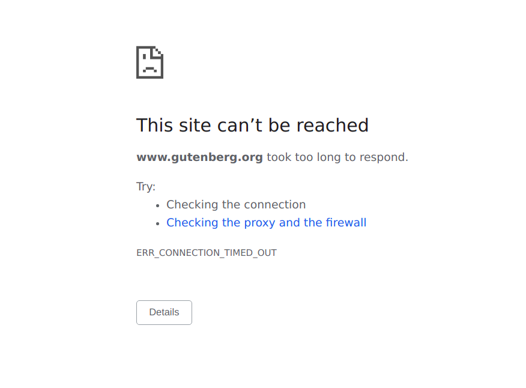
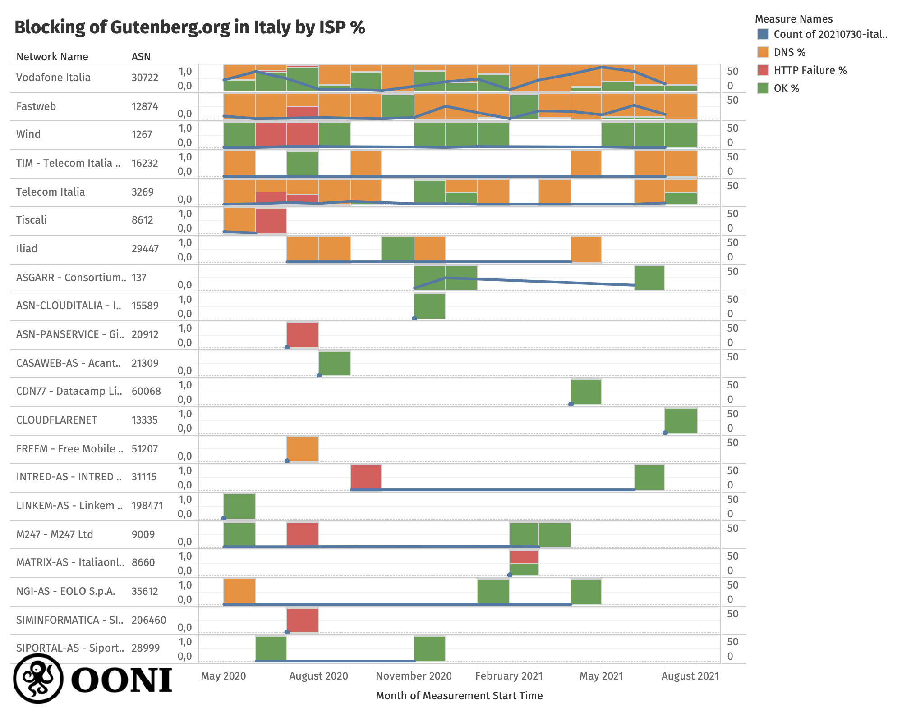
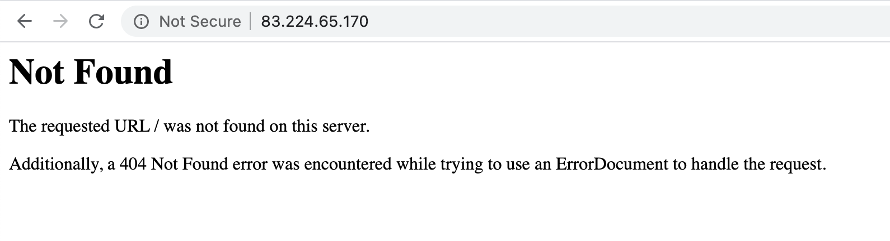
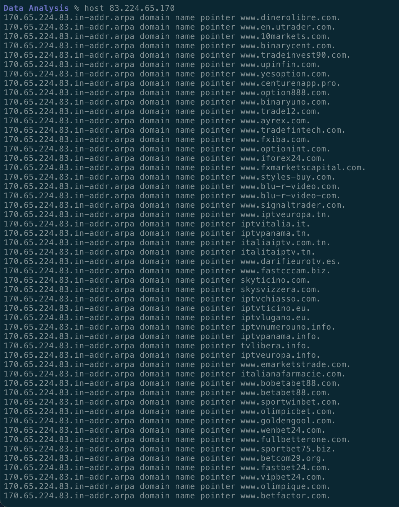
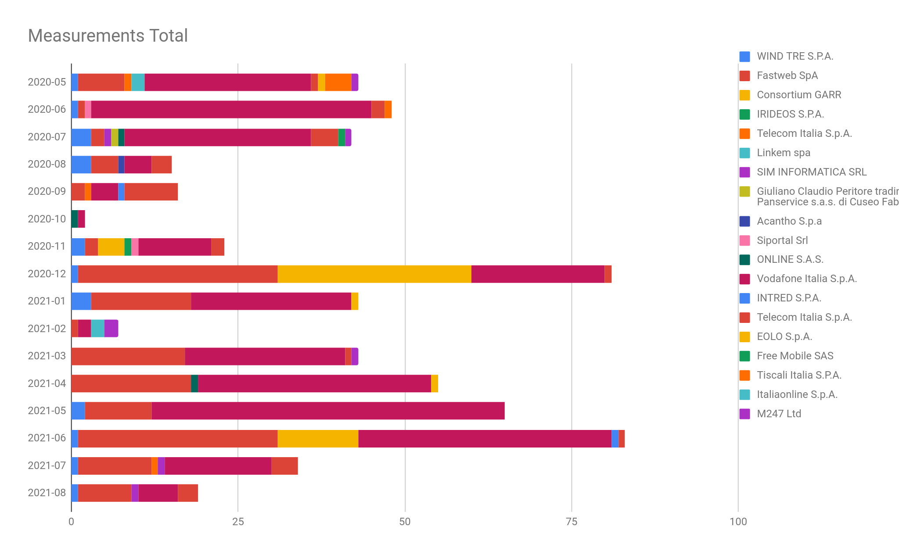
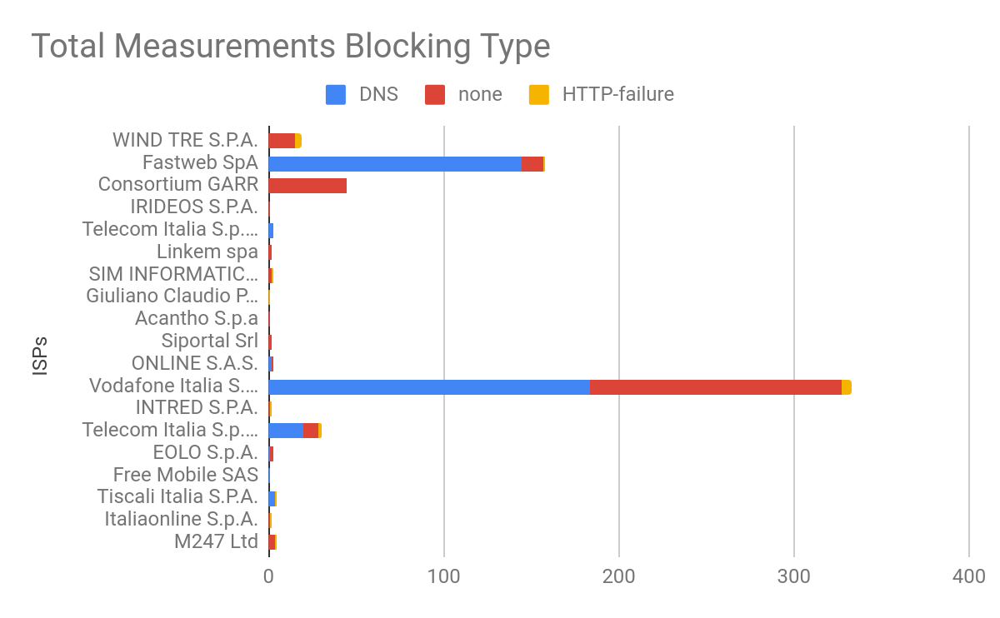
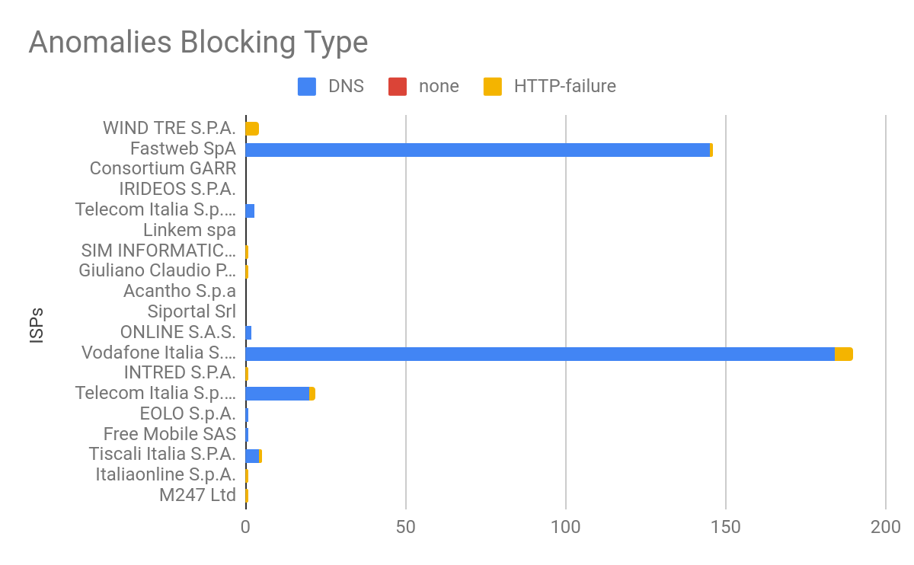
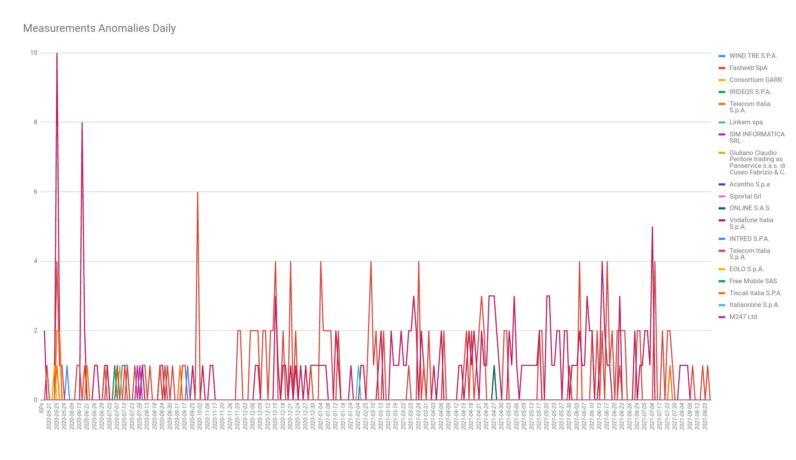
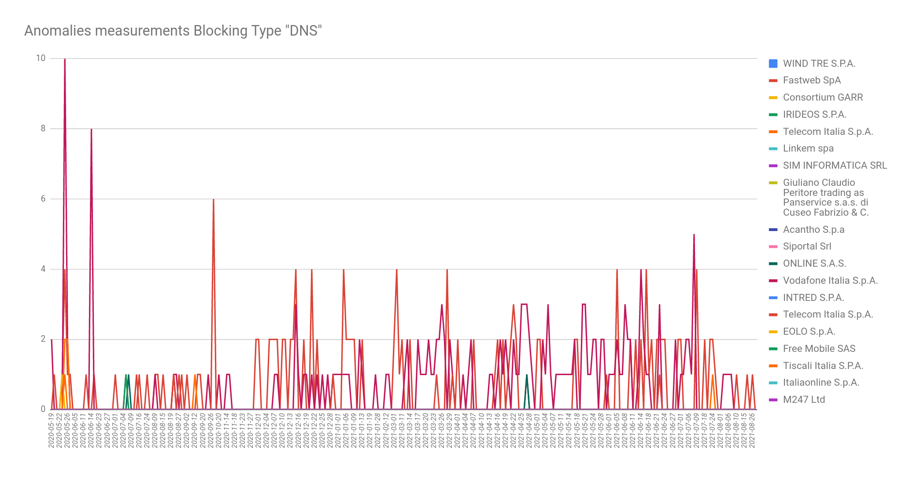
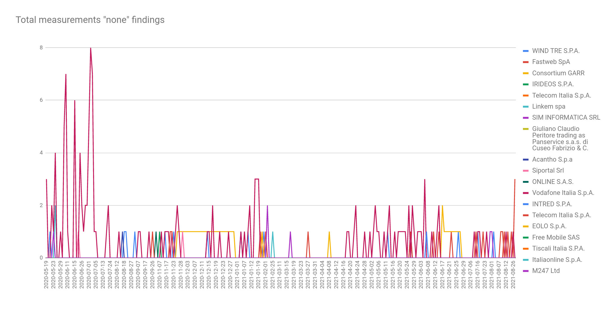

{{}}

Cases of internet censorship (that affect public interest) are rarely reported
in Europe. Yet, `www.gutenberg.org`, a book-publishing website run by
a non-profit organization, has been [blocked in Italy since May 2020](https://www.wired.it/internet/web/2020/06/30/progetto-gutenberg-sequestro/).

In this report, we share [OONI network measurement data](https://explorer.ooni.org/search?until=2021-09-08&since=2021-08-09&domain=www.gutenberg.org&probe_cc=IT)
on the ongoing blocking of `www.gutenberg.org` across networks in
Italy.

* [Background](#background)

* [Methods](#methods)

* [Findings](#findings)

	* [Blocking methods by ISP](#blocking-methods-by-isp)

		* [Vodafone Italia (AS30722)](#vodafone-italia-as30722)

		* [Fastweb (AS12874)](#fastweb-as12874)

		* [Wind (AS1267)](#wind-as1267)

		* [TIM (AS16232)](#tim-as16232)

		* [Telecom Italia (AS3269)](#telecom-italia-as3269)

		* [Tiscali (AS8612)](#tiscali-as8612)

		* [Iliad (AS29447)](#iliad-as29447)

	* [Additional measurement analysis between May 2020 to August 2021](#additional-measurement-analysis-between-may-2020-to-august-2021)

* [Conclusion](#conclusion)

# Background

The gutenberg.org website is maintained by the Project Gutenberg
Literary Archive Foundation (PGLAF), a non-profit organization active
since 1971. Micheal Hart, founder of gutenberg.org, created the project
for [“the storage, retrieval, and searching of what was stored in libraries”](http://www.gutenberg.org/).

The mission of Project Gutenberg is simple: [“To encourage the creation and distribution of eBooks”](http://www.gutenberg.org/), with the motto
[“Break Down the Bars of Ignorance and Illiteracy.”](http://www.gutenberg.org/) The site's main scope is to
share books and literature content when their copyright protection law
terms have expired. Publishing this content on the site in a
[“copyright free” form allows for the distribution of verbatim or non-verbatim copies](http://www.gutenberg.org/) in the US.

In mid-April 2020, the FIEG (Italian Federation Editors of Journals)
filed a request to AGCOM (Italian Competition Authority) to intervene in
some alleged illegal operation of sharing copyright protected content
(newspaper) [on the Telegram platform](https://www.repubblica.it/economia/2020/04/14/news/appello_della_fieg_all_agcom_fermi_telegram_basta_con_la_diffusione_illecita_dei_quotidiani_-253997660/).

The criminal prosecution started soon thereafter in cooperation with a
special department (of “Guardia di Finanza”) working on privacy and
online fraud. The judge assigned to the case (on 5th May 2020) requested
the temporary seizure of the domain (“sequestro preventivo mediante
oscuramento” ex. Art. 321 c.p.). The provision has been applied to
several Telegram channels and some internet sites involved in sharing
journals, books, with [profit motives](https://xmau.com/wp/notiziole/2020/06/04/repubblica-italiana-contro-project-gutenberg-un-case-study/) (personal data collection used
for advertising) by the software “Teleport Ultra”, in violation of art. 16 L. 633/1941.
The decree has been sent to Italian Internet Service Providers (ISPs)
for enforcement and by mid-May 2020, all the sites included in the list
have been blocked, one of which was gutenberg.org.

Project Gutenberg has no legal representation in Italy. Only some time
later did the project’s [CEO acknowledge that their site was blocked](https://twitter.com/gutenberg_org/status/1264512881309085702)
in the country. Even if AIB (Italian Library Association) [showed its support](https://www.aib.it/attivita/2020/82486-ripristino-accesso-project-gutenberg/),
the only viable option is to intervene with a formal request instructed
by a lawyer to the court to review the decree.

An informal letter [sent to the Guardia Di Finanza](https://xmau.com/wp/notiziole/2020/06/04/repubblica-italiana-contro-project-gutenberg-un-case-study/)
analyzed the content hosted on the Gutenberg site and identified 5 books
that, according to Italian copyright law, are still protected --- even
if they are not according to US copyright law (as per ToS the country in
which the content is shared and available).

According to US law, what has been published before 1978 has a copyright
of 95 years; instead, under Italian law, copyright terms are considered
expired after 70 years from the death of the author.

The current situation with the ongoing criminal lawsuit prevents access
to more detailed information. It will therefore be necessary to follow
up with requests for the disclosure of further information (when
available) to better understand the case.

# Methods

We examined the blocking of gutenberg.org in Italy through the analysis
of [OONI measurements](https://explorer.ooni.org/search?until=2021-09-08&since=2021-08-09&domain=www.gutenberg.org&probe_cc=IT)
collected from multiple local AS networks. We analyzed OONI measurements
(from the testing of `www.gutenberg.org`) collected from Italy between
May 2020 (when the [blocking reportedly started](https://www.wired.it/internet/web/2020/06/30/progetto-gutenberg-sequestro/))
to August 2021. We supplemented our study with online research to
understand how and why the court of Rome took the decision to block the
Gutenberg website.

[OONI](https://ooni.org/about/) is a free software project that aims
to empower decentralized efforts in increasing transparency of internet
censorship around the world. Since 2012, OONI has developed [free and open source software](https://github.com/ooni/probe), called [OONI Probe](https://ooni.org/install/), that can be run to measure the
blocking of websites, collecting data that can potentially serve as
evidence of internet censorship since it shows how, when, where, and by
whom it is implemented.

As part of this study, we analyzed measurements collected from OONI’s
[Web Connectivity](https://ooni.org/nettest/web-connectivity/) test.
This test examines whether websites (included in the [Citizen Lab test lists](https://github.com/citizenlab/test-lists/tree/master/lists)) are
reachable and if they are not, it attempts to determine whether access
to them is blocked by means of [DNS tampering](https://ooni.org/support/glossary/#dns-tampering), [TCP/IP blocking](https://ooni.org/support/glossary/#tcp-ip-blocking) or by a
[transparent HTTP proxy](https://ooni.org/support/glossary/#http-transparent-proxy). We
limited our analysis to Web Connectivity measurements collected from the
testing of `www.gutenberg.org` on different AS networks in Italy
between May 2020 to August 2021.

Please consider that the findings are limited by the number of OONI
Probe tests run by users in Italy. We only have measurements available
depending on when OONI Probe users tested `www.gutenberg.org` in
Italy, and depending on which networks these tests were performed.

# Findings

OONI data
[shows](https://explorer.ooni.org/search?until=2021-09-08&since=2021-08-09&domain=www.gutenberg.org&probe_cc=IT&only=anomalies)
that `www.gutenberg.org` presented signs of blocking on at least 7 AS
networks in Italy since May 2020. Most ISPs in Italy primarily appear to
block access to `www.gutenberg.org` by means of [DNS hijacking](https://ooni.org/support/glossary/#dns-hijacking). However,
we also observe HTTP failures on some networks as well.

In the following sections, we explain how the blocking of
`www.gutenberg.org` varies across AS networks in Italy.

## Blocking methods by ISP

OONI data
[shows](https://explorer.ooni.org/search?until=2021-09-08&since=2021-08-09&domain=www.gutenberg.org&probe_cc=IT)
that the testing of `www.gutenberg.org` presented signs of blocking on
multiple AS networks in Italy between May 2020 to August 2021, as
illustrated through the following chart.

{{}}

**Source:** OONI measurements on the testing of `www.gutenberg.org`
across AS networks in Italy between May 2020 to August 2021, https://explorer.ooni.org/search?until=2021-09-08&since=2021-08-09&domain=www.gutenberg.org&probe_cc=IT

As is evident from the above chart, `www.gutenberg.org` received the
highest volume of testing coverage during our analysis period on
Vodafone Italia (AS30722) and Fastweb (AS12874), where most measurements
presented DNS based anomalies. In particular, such measurements show
that access to `www.gutenberg.org` was blocked by means of [DNS
hijacking](https://ooni.org/support/glossary/#dns-hijacking), as
internet users on those networks did not receive the correct IP address
for the website. Similarly, we observe a high ratio of DNS anomalies on
other AS networks as well, such as Telecom Italia (AS3269) and TIM
(AS16232). We also observe HTTP failures caused by connection timeouts
on several other AS networks as well.

It’s worth highlighting though that the blocking of
`www.gutenberg.org` appears to vary across AS networks in Italy, as
recent measurements suggest that the site is accessible on some
networks, such as Wind (AS1267). Moreover, on networks (such as Vodafone
Italia) where we observe the DNS hijacking of `www.gutenberg.org`, we
also see that some measurements are successful -- likely because a
different [DNS resolver](https://ooni.org/support/glossary/#dns-resolver) was used by
the OONI Probe user(s) who contributed those measurements.

In the following sections, we summarize our main technical findings
related to the blocking of `www.gutenberg.org` on 7 major ISPs in
Italy based on OONI data.

### Vodafone Italia (AS30722)

OONI data shows that Vodafone Italia blocks `www.gutenberg.org` by
means of DNS hijacking.

When attempting to query the domain name `www.gutenberg.org`, instead
of receiving the legitimate IP of the site, we
[received](https://explorer.ooni.org/measurement/20210104T104452Z_webconnectivity_IT_30722_n1_O4jGiINtXvHHzLko?input=https%3A%2F%2Fwww.gutenberg.org%2F)
the IP address `83.224.65.170` (which belongs to Vodafone) as a
response. This IP address does not listen on port 443 and therefore
results in a connection timeout when attempting to connect to the site
over HTTPS, as illustrated below.

{{}}

**Image:** Screenshot of attempting to connect to `www.gutenberg.org`
over HTTPS on Vodafone Italia (AS30722), resulting in a connection
timeout.

When accessed over HTTP, it instead returns an 404 error page without
any content (as illustrated below). This means that the block is not
implemented transparently.

{{}}

**Image:** Screenshot of attempting to connect to `www.gutenberg.org`
over HTTP on Vodafone Italia (AS30722), resulting in an 404 error page.

It’s also interesting to highlight that the reverse pointer records
(PTR) for the IP address `83.224.65.170` returns a list of all other pages
which are blocked by returning this IP (as shared below). This makes it
easy to enumerate all the websites which are blocked using the same
technique.

{{}}

**Image:** Reverse pointer records (PTR) for the IP address
83.224.65.170 returns a list of all other domains which are blocked by
returning this IP.

Some OONI measurements collected from Vodafone Italia show that
`www.gutenberg.org` was accessible, but that is due to the fact that
in these cases the probe client has been configured to use a resolver
different from the ISP provided one.

### Fastweb (AS12874)

OONI data shows that Fastweb appears to be consistently blocking
`www.gutenberg.org` by means of DNS based tampering.

Some OONI measurements indicate the site being accessible, but this is
because the probe in question was configured to use a resolver that is
different from the ISP provided resolver. In the cases in which the
probe is properly configured to use the ISP resolver, we can see that
the means by which the [block is implemented is that of returning an NXDOMAIN](https://explorer.ooni.org/measurement/20210727T104149Z_webconnectivity_IT_12874_n1_AA3pWAE46cUUC7L5?input=https%3A%2F%2Fwww.gutenberg.org%2F)
to the DNS query for `www.gutenberg.org`. This is concerning because
it doesn’t provide any transparency on the block being implemented,
since a user will see an error message in their browser rather than a
[block page](https://ooni.org/support/glossary/#block-page) (which
would have informed the user that access to the website is intentionally
blocked).

### Wind (AS1267)

For the most part, Wind does not appear to be implementing the block for
`www.gutenberg.org`. OONI measurements, for example,
[show](https://explorer.ooni.org/measurement/20210128T104054Z_webconnectivity_IT_1267_n1_Z2GXvyDiRnsJCbYS?input=https%3A%2F%2Fwww.gutenberg.org%2F)
that even though the probe is configured to use the ISP provided
resolver, we do not observe the blocking of the website.

We only have a [few measurements](https://explorer.ooni.org/measurement/20200713T133404Z_AS1267_FVCwNzN1wUx0rhNLoPYfnBYv5bSH69QXFqhfVq0B0uKNnTB6mT?input=https%3A%2F%2Fwww.gutenberg.org%2F)
that are indicative of blocking and, in those cases, the reason for the
failure appears to be a [TLS certificate validation error](https://explorer.ooni.org/measurement/20200713T133404Z_AS1267_FVCwNzN1wUx0rhNLoPYfnBYv5bSH69QXFqhfVq0B0uKNnTB6mT?input=https%3A%2F%2Fwww.gutenberg.org%2F),
which is a sign that they might be doing a TLS man-in-the-middle (MITM)
to implement the blocking of the site.

### TIM (AS16232)

Telecom Italia Mobile (TIM) appears to block `www.gutenberg.org` by
means of DNS hijacking. Specifically, when attempting to query
`www.gutenberg.org` they will [return the IP address of the loopback
interface (127.0.0.1)](https://explorer.ooni.org/measurement/20210430T190134Z_webconnectivity_IT_16232_n1_8ORqDEhJaxCmRk96?input=https%3A%2F%2Fwww.gutenberg.org%2F)
resulting in connection errors. This is concerning because to an
internet user it will not be clear that the site is being intentionally
blocked and might wrongly attribute the inaccessibility of the site to
poor network conditions.

As part of our analysis, only one OONI measurement
[showed](https://explorer.ooni.org/measurement/20200731T184253Z_AS16232_zokmx31pil2Jpuz8iq7iWoiujuml4v3F8KYBTzS0oz45ISKfwF?input=https%3A%2F%2Fwww.gutenberg.org%2F)
that the site was accessible, but this was due to the probe being
configured with a different resolver from the ISP resolver.

### Telecom Italia (AS3269)

Similarly to TIM, Telecom Italia also
[blocks](https://explorer.ooni.org/measurement/20210718T114741Z_webconnectivity_IT_3269_n1_xaVyJSWYrdaEzlF5?input=https%3A%2F%2Fwww.gutenberg.org%2F)
`www.gutenberg.org` by returning the IP address `127.0.0.1` in the
DNS query answer, resulting in a blocking that is not transparent to the
user.

### Tiscali (AS8612)

Tiscali blocks `www.gutenberg.org` by means of DNS based interference.
Similarly to Fastweb, they [return an NXDOMAIN](https://explorer.ooni.org/measurement/20200526T095821Z_AS8612_SkhhsPaJOx8muuamd2BLBuqdJjMjO7ArgnAeAjhgMDk2OEKhwS?input=https%3A%2F%2Fwww.gutenberg.org%2F)
when looking up `www.gutenberg.org`, which is not transparent to the
end user.

### Iliad (AS29447)

Similarly to TIM and Telecom Italia, Iliad
[blocks](https://explorer.ooni.org/measurement/20210427T084458Z_webconnectivity_IT_29447_n1_zbicaC7niq9Bcd96?input=https%3A%2F%2Fwww.gutenberg.org%2F)
`www.gutenberg.org` by means of DNS based interference, returning the
IP address `127.0.0.1`, which is not transparent to the end user.

## Additional measurement analysis between May 2020 to August 2021

In this section, we share additional observations from analysis provided
by one of our community members: Davide Brunello (independent
researcher). Davide analyzed OONI [Web Connectivity](https://ooni.org/nettest/web-connectivity/) measurements
collected from the testing of `www.gutenberg.org` in Italy between May
2020 to August 2021.

The following chart illustrates the volume of monthly OONI measurements
collected from the testing of `www.gutenberg.org` on different AS
networks in Italy between May 2020 (when the block started) to August
2021.

{{}}

**Source:** Volume of monthly OONI measurements (on the testing of
`www.gutenberg.org`) collected from different ISPs in Italy each month
between May 2020 to August 2021.

As is evident through the above chart, `www.gutenberg.org` received
the highest volume in testing coverage in June 2021, while most
measurements (throughout the analysis period) were collected from
Vodafone Italia and Fastweb. The diversity of AS coverage (as it
pertains to the OONI Probe testing of `www.gutenberg.org`) enabled us
to compare the blocking of `www.gutenberg.org` across different ISPs
in Italy, as discussed in previous sections of this report.

Overall (between May 2020 to August 2021), 619 OONI measurements were
collected from 19 unique ASNs (corresponding to 19 different ISPs) in
Italy, with most measurements collected from Vodafone Italia (54%),
Fastweb SpA (26%), Consortium GARR (7%), and Telecom Italia S.p.A. (5%).

The following chart characterizes the total volume of OONI measurements
(from the testing of `www.gutenberg.org`) collected across AS networks
in Italy, distinguishing between those that presented anomalies (and
further characterizing those as “DNS” and “HTTP-failure”) and those that
didn’t (“none”).

{{}}

**Source:** Total of OONI measurements (from the testing of
`www.gutenberg.org`) by blocking type across ISPs in Italy between May
2020 to August 2021.

The characterization of the blocking type (as illustrated through the
above chart) is based on OONI’s [Web Connectivity](https://ooni.org/nettest/web-connectivity/) methodology,
which was used for the testing of `www.gutenberg.org`. OONI’s Web
Connectivity test is designed to measure the blocking of a URL by first
attempting to identify the [DNS resolver](https://ooni.org/support/glossary/#dns-resolver) used by the
OONI Probe user, perform a [DNS lookup](https://ooni.org/support/glossary/#dns-lookup) for the domain
in question, establish a [TCP connection](https://ooni.org/support/glossary/#tcp) to the IP
address(es) identified during the DNS lookup, and send an [HTTP GET request](https://ooni.org/support/glossary/#http-request) for the
content of the webpage. These steps are automatically performed over two
vantage points: the local network of the OONI Probe user and a “control”
(non-censored) network. If the results from both networks are the same,
the tested URL is flagged as “accessible”. If, however, the results
differ, the tested URL is flagged as
“[anomalous](https://ooni.org/support/glossary/#network-anomaly)”
(which provides an indication of potential blocking).

Based on OONI’s Web Connectivity methodology, there are 4 possible
anomalies that can occur:

* **DNS anomaly.** If the DNS responses (i.e. the IP addresses
returned for a domain) between the local and “control” networks do
not match;

* **TCP/IP anomaly.** If a TCP session to connect to websites was not
established over the network of the user;

* **HTTP-failure.** If the HTTP request from the user’s network fails;

* **HTTP-diff.** If the [HTTP status codes](https://ooni.org/support/glossary/#http-status-codes), the
[HTTP header](https://ooni.org/support/glossary/#http-header) names, the HTML title tags, and the body length of the website
differ from the local network of the OONI Probe user in comparison
to the “control” (non-censored) network.

As part of his analysis of Web Connectivity measurements (on the testing
of `www.gutenberg.org`), Davide identified 3 types of measurements:

* Accessible (flagged as “none” in the above chart)

* DNS anomalies (flagged as “DNS” in the above chart)

* HTTP failures (flagged as “HTTP-Failure” in the above chart)

Davide notes that out of the total number of measurements, 58% presented
DNS anomalies, while 3% presented HTTP failures. 43% of measurements
collected from Vodafone Italia (where a total of 333 measurements were
collected) are annotated as “none” (indicating that
`www.gutenberg.org` was accessible), but as mentioned in previous
sections, this seems to be the result of OONI Probe users using
different [DNS resolvers](https://ooni.org/support/glossary/#dns-resolver) (instead of
the one provided by the ISP, which implements the block).

The following chart provides a further breakdown of OONI measurements,
limiting them to those that presented anomalies.

{{}}

**Source:** OONI measurements (from the testing of
`www.gutenberg.org`) by blocking type across ISPs in Italy between May
2020 to August 2021.

As can be seen through the graph, the majority (97%) of anomalous
measurements on Vodafone Italia presented signs of DNS based
interference, while a few (3%) presented HTTP failures. On Fastweb, 99%
of anomalous measurements presented signs of DNS based tampering, while
only 1% of measurements presented HTTP failures. On Wind, all (100%)
anomalous measurements presented HTTP failures, but we observe limited
testing coverage on this network, while all other measurements were
successful (as illustrated through the previous chart).

This data may be helpful to demonstrate how the blocking of
`www.gutenberg.org` (in compliance with the criminal court of Rome)
has been implemented across AS networks in Italy. As is evident through
the previous charts, most ISPs in Italy primarily block access to
`www.gutenberg.org` by means of DNS tampering.

The following chart shares the volume of daily measurements that
presented anomalies on 19 ISPs in Italy between May 2020 to August 2021.

{{}}

**Source:** Daily anomalous OONI measurements (from the testing of
`www.gutenberg.org`) across ISPs in Italy between May 2020 to August
2021.

The fact that we observe consistent anomalies over a relatively long
timeline -- on many local networks -- provides a strong signal of
blocking (reducing the likelihood of [false positives](https://ooni.org/support/glossary/#false-positive) that
could have occurred from temporary transient network failures).

In the first days after the decree became effective (5th May 2021), the
number of OONI measurements reached its peak on different networks;
after 1 year it has been concentrated on certain networks (Fastweb SpA,
Vodafone Italia S.p.A.) on a regular basis.

The following chart presents the number of daily OONI measurements that
presented DNS anomalies on different networks in Italy between May 2020
to August 2021.

{{}}

**Source:** Daily OONI measurements (from the testing of `www.gutenberg.org`) that presented DNS
anomalies across ISPs in Italy between May 2020 to August 2021.

Most anomalous measurements presented signs of DNS tampering. Meanwhile,
a number of measurements (collected from many local networks) also
showed that `www.gutenberg.org` was accessible at the time of testing,
as illustrated below.

{{}}

**Source:** Daily OONI measurements (from the testing of `www.gutenberg.org`) that presented DNS
anomalies across ISPs in Italy between May 2020 to August 2021.

As discussed previously, the accessibility of measurements reflects the
variance in how censorship is implemented across networks in Italy, as
well as the fact that some OONI Probe users used different DNS resolvers
(thereby circumventing the DNS blocks),

# Conclusion

Since May 2020, access to the Gutenberg book publishing website has been
blocked in Italy (in compliance with a decree of the court of Rome) over
copyright violation. The criminal lawsuit is currently ongoing and that
does not permit access to relevant documents that would help with
further understanding the background and situation that resulted in the
blocking of `www.gutenberg.org`.

OONI measurement analysis shows that access to `www.gutenberg.org` is
blocked on at least 7 AS networks in Italy. Most ISPs primarily appear
to block access to `www.gutenberg.org` by means of **DNS tampering**.
However, in implementing DNS hijacking, different ISPs serve different
results to users. Some ISPs (like Fastweb and Tiscali) [return an NXDOMAIN](https://explorer.ooni.org/measurement/20210727T104149Z_webconnectivity_IT_12874_n1_AA3pWAE46cUUC7L5?input=https%3A%2F%2Fwww.gutenberg.org%2F),
others (like TIM, Telecom Italia, and Iliad) [return the IP address](https://explorer.ooni.org/measurement/20210430T190134Z_webconnectivity_IT_16232_n1_8ORqDEhJaxCmRk96?input=https%3A%2F%2Fwww.gutenberg.org%2F)
`127.0.0.1`, while Vodafone Italia [returns the IP address](https://explorer.ooni.org/measurement/20210104T104452Z_webconnectivity_IT_30722_n1_O4jGiINtXvHHzLko?input=https%3A%2F%2Fwww.gutenberg.org%2F)
`83.224.65.170` (for HTTPS connections, this results in connection
timeout errors; for HTTP connections, this returns a 404 error page). On
other networks (like Wind), recent measurements suggest that
`www.gutenberg.org` is
[accessible](https://explorer.ooni.org/measurement/20210128T104054Z_webconnectivity_IT_1267_n1_Z2GXvyDiRnsJCbYS?input=https%3A%2F%2Fwww.gutenberg.org%2F).

Regardless of what is returned in the DNS response, what all ISPs in
Italy (at least those included in this study) appear to have in common
is the **lack of transparency** of the fact that access to
`www.gutenberg.org` is intentionally blocked. When internet users in
Italy attempt to access `www.gutenberg.org`, they view an error
message which (unlike a [block page](https://ooni.org/support/glossary/#block-page)) does not
communicate that access to the site is blocked. Instead, internet users
may think that the website is temporarily down, or that they’re unable
to access it due to network performance issues.

As the necessity and proportionality surrounding the blocking of
`www.gutenberg.org` remains quite unclear, further [OONI Probe](https://ooni.org/install/) testing is needed to keep monitoring
the accessibility of the site, and to continue collecting [open data](https://ooni.org/data/) on its blocking.
