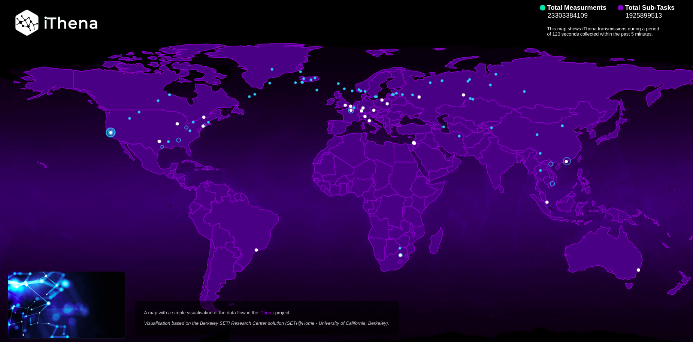
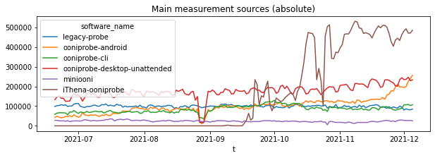
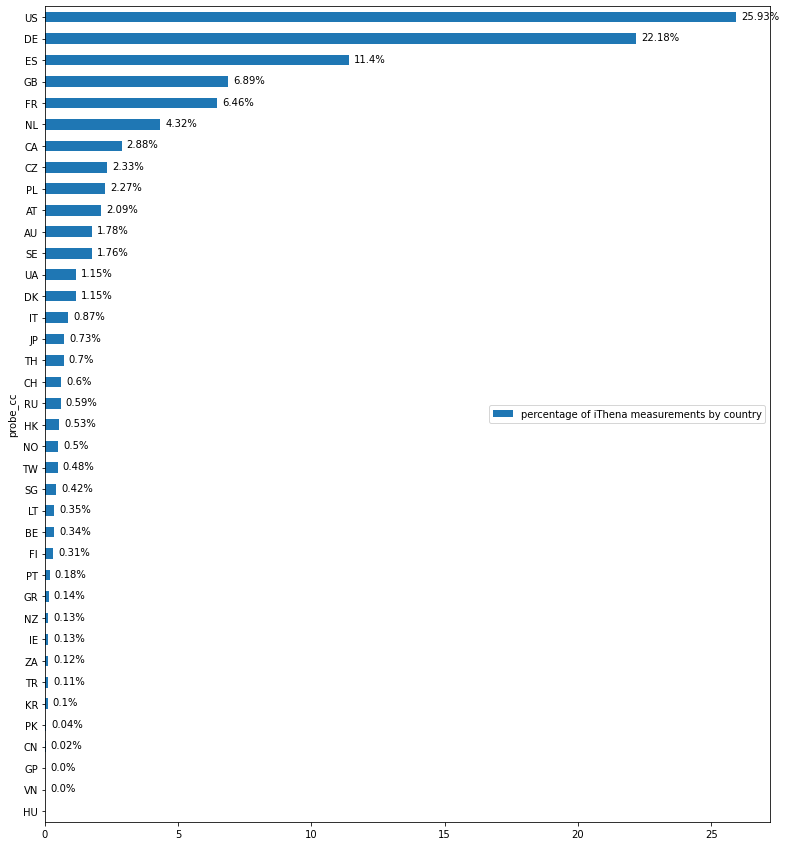

Over the last months, the [iThena](https://root.ithena.net/) project
[integrated OONI Probe](https://root.ithena.net/usr/forum_thread.php?id=151) into their
platform, resulting in a [major spike](https://twitter.com/OpenObservatory/status/1443944726235856901)
in [OONI censorship measurement coverage](https://ooni.org/data/)
around the world.

In this blog post, we’re excited to introduce you to iThena and discuss
how they helped support censorship measurement worldwide.

* [About iThena](#about-ithena)

* [OONI Probe integration into iThena](#ooni-probe-integration-into-ithena)

# About iThena

[iThena](https://root.ithena.net/), developed by the [Cyber-Complex Foundation](https://cybercomplex.net/), is a distributed computation
and measurement project based on the [Berkeley Open Infrastructure for Network Computing (BOINC)](https://boinc.berkeley.edu/) platform.
iThena [aims](https://boinc.berkeley.edu/forum_thread.php?id=13966) to
generate a dynamic topological model of the Internet, based on
measurements from distributed devices.

To this end, iThena [maps network structures](https://everipedia.org/wiki/lang_en/ithena) by performing a
sequence of [traceroute procedures and performance tests](https://root.ithena.net/usr/apps.php) from client stations
(BOINC) and other nodes. The resulting data is sent back to their server
and submitted to their main database, where it is further analyzed.
Based on this data, iThena
[plans](https://root.ithena.net/usr/about.php) to publish network
structure mapping summaries.

In the meanwhile, you can refer to their [data visualization](https://vi.ithena.net/) which shows iThena data
transmissions from around the world (during a period of 120 seconds,
collected within the past 5 minutes).

{{}}

**Image:** iThena data map, https://vi.ithena.net/

# OONI Probe integration into iThena

Our app, [OONI Probe](https://ooni.org/install/), is [free and open source software](https://github.com/ooni/probe) designed to measure
internet censorship and other forms of network interference. Every
month, OONI Probe is run by tens of thousands of users in [more than 150 countries and territories](https://explorer.ooni.org/), who
contribute network measurements that are [openly published](https://ooni.org/data/) in real-time.

Currently, OONI Probe includes [tests](https://ooni.org/nettest/)
designed to measure:

* Blocking of [websites](https://ooni.org/nettest/web-connectivity/);

* Blocking of instant messaging apps
([WhatsApp](https://ooni.org/nettest/whatsapp/), [Facebook Messenger](https://ooni.org/nettest/facebook-messenger/),
[Signal](https://ooni.org/nettest/signal/),
[Telegram](https://ooni.org/nettest/telegram/));

* Blocking of circumvention tools
([Tor](https://ooni.org/nettest/tor/),
[Psiphon](https://ooni.org/nettest/psiphon/),
[RiseupVPN](https://ooni.org/nettest/riseupvpn/));

* Presence of [middleboxes](https://ooni.org/nettest/#boxes);

* [Network speed](https://ooni.org/nettest/ndt/) and performance;

* [Video-streaming performance](https://ooni.org/nettest/dash/).

In September 2021, OONI Probe was
[integrated](https://root.ithena.net/usr/forum_thread.php?id=151) into
the iThena platform. As a result, users who participate in iThena
measurements [automatically run OONI Probe](https://root.ithena.net/usr/apps.php) on a regular basis. Their
OONI Probe measurements are automatically submitted to OONI servers,
[processed](https://github.com/ooni/pipeline), and [openly published](https://ooni.org/data/) by OONI in real-time.

Thanks to iThena’s integration of OONI Probe, OONI measurement coverage
has increased significantly! The following chart shows the global volume
of OONI measurement coverage by platform over the last months,
illustrating the major
[spike](https://root.ithena.net/usr/forum_thread.php?id=156) in
coverage by iThena’s OONI Probe client (beginning from September 2021).

{{}}

**Figure 1:** Global OONI measurement coverage by platform between July
2021 to December 2021.

As is evident from the above chart, the iThena OONI Probe client is the
distinct client contributing the largest volume of measurements.

As iThena OONI Probe measurements are primarily contributed from servers
in datacenters (leased from hosting companies by iThena project users),
the hosts used to run OONI Probe experiments have a much better uptime
in comparison to OONI Probe clients which are run from the personal
devices of volunteers. Moreover, the [Linux version of OONI Probe](https://ooni.org/install/cli/ubuntu-debian) which has been
integrated into the iThena platform is currently configured to run
automated tests every 12 hours, whereas automated testing on [other OONI Probe clients](https://ooni.org/install/) is not always as regular
(since it depends on users’ mobile devices being connected to power and
WiFi, and [manually enabling the automated testing setting](https://ooni.org/support/ooni-probe-desktop#automated-ooni-probe-testing)
in the OONI Probe app). Software compilations for 32-bit, 64-bit and ARM
processors are available for iThena OONI Probe.

Overall, iThena OONI Probe measurements are contributed from **38
countries** (covering 172 AS networks), as illustrated in the following
chart.

{{}}

**Figure 2:** iThena OONI Probe measurement coverage by country between
September 2021 to December 2021

The above chart demonstrates that the largest volume of iThena OONI
Probe measurements is contributed from the U.S. (with 7,606,694
measurements), followed by Germany (6,430,573 measurements), Spain
(3,234,386 measurements), the UK (2,003,058 measurements), France
(1,890,631 measurements), and the Netherlands (1,240,740 measurements).

It’s worth highlighting that iThena OONI Probe measurement coverage also
includes several countries which are known to experience more pervasive
levels of internet censorship, such as
[Russia](https://censoredplanet.org/russia) (178,584 measurements) and
[China](https://www.usenix.org/system/files/sec21-hoang.pdf) (6,881
measurements).

We are thrilled by [iThena’s OONI Probe integration](https://root.ithena.net/usr/forum_thread.php?id=151)
because it contributes a large volume of stable measurements from around
the world on a regular basis. [OONI data](https://ooni.org/data/)
contributed by iThena will help support [longitudinal studies on internet censorship](https://ooni.org/reports/) around the world, as
well as [advocacy efforts](https://www.accessnow.org/keepiton/) in
response to emergent censorship events.

We therefore thank the [iThena project](https://root.ithena.net/) for
integrating OONI Probe, boosting OONI measurement coverage, and
supporting the research and advocacy efforts of the global internet
freedom community.

We encourage other projects to consider integrating OONI Probe as well!
If you are interested in **integrating OONI Probe into your platform**,
please start off by [reaching out to the OONI team](https://ooni.org/about/#contact). You can send an email to
`contact@openobservatory.org`, and/or message us on the [OONI Slack channel](https://slack.ooni.org/). We would love to be in touch with
you to discuss which integration approaches would work best based on the
architecture of your platform, and so that we can coordinate on an
ongoing basis and assist where we can.
