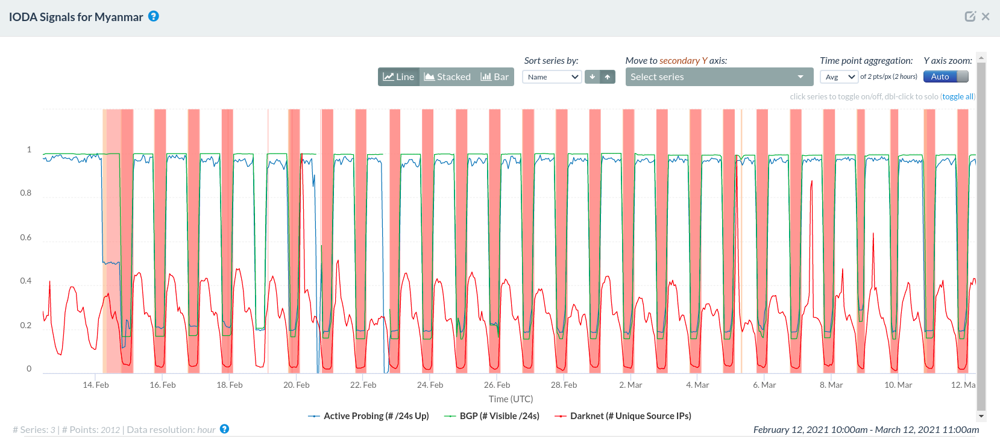
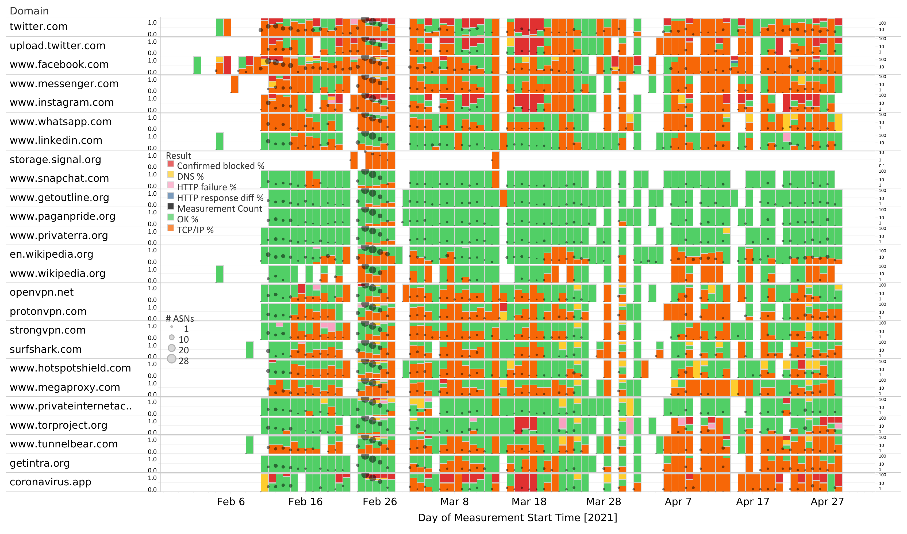
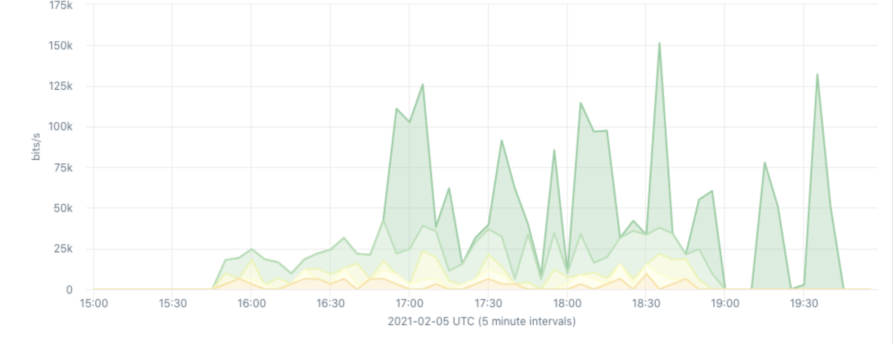
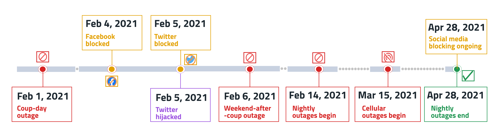

In the wake of a [military coup](https://www.bbc.com/news/world-asia-55882489) in February 2021,
Myanmar experienced unprecedented levels of internet censorship.

In response, we collaborated with CAIDA’s [Internet Outage Detection and Analysis (IODA)](https://ooni.org/partners/ioda/) team and
[Myanmar ICT for Development Organization (MIDO)](https://ooni.org/partners/mido/) on publishing a [research report](https://ooni.org/post/2021-myanmar-internet-blocks-and-outages/)
which documents a [series of nightly internet outages](https://ooni.org/post/2021-myanmar-internet-blocks-and-outages/#internet-outages)
and the
[blocking](https://ooni.org/post/2021-myanmar-internet-blocks-and-outages/#findings)
of social media, Wikipedia, and circumvention tool sites in Myanmar
following the military coup.

In the months that followed, we continued to examine internet censorship
in Myanmar quite closely. We collaborated with
[IODA](https://ioda.caida.org/), [Kentik](https://www.kentik.com/),
and other researchers from [UC San Diego](https://ucsd.edu/) and the
[University of Michigan](https://umich.edu/) to expand our analysis.
We used diverse datasets and measurement methods to offer a holistic
view into the censorship events in Myanmar that occurred since the coup
and show how internet censorship *evolved* between **1st February 2021
to 30th April 2021**.

As an outcome, we produced a [research paper](https://dl.acm.org/doi/pdf/10.1145/3473604.3474562) (“A
multi-perspective view of Internet censorship in Myanmar”) which we
submitted to the [ACM SIGCOMM 2021 Workshop on Free and Open Communications on the Internet (FOCI 2021)](https://conferences.sigcomm.org/sigcomm/2021/workshop-foci.html).
Our paper was
[published](https://dl.acm.org/doi/10.1145/3473604.3474562) by FOCI
2021 and CAIDA’s Ramakrishna Padmanabhan
[presented](https://conferences.sigcomm.org/sigcomm/2021/workshop-foci.html)
our research findings at the workshop.

**[READ RESEARCH PAPER](https://dl.acm.org/doi/pdf/10.1145/3473604.3474562)**

Below we summarize the key findings of our paper.

* [Summary of findings](#summary-of-findings)

    * [Internet outages](#internet-outages)

    * [Website and social media blocking](#website-and-social-media-blocking)

    * [Twitter hijack and collateral damage](#twitter-hijack-and-collateral-damage)

    * [Conclusion](#conclusion)

# Summary of findings

You can learn about the findings of our [research paper](https://dl.acm.org/doi/pdf/10.1145/3473604.3474562) by viewing
the following video produced by [CAIDA](https://www.caida.org/)’s
Ramakrishna Padmanabhan.



## Internet outages

Following the military coup on 1st February 2021, Myanmar experienced a
[series of internet outages](https://ioda.caida.org/ioda/dashboard#view=inspect&entity=country/MM&lastView=overview&from=1612175543&until=1614508343)
until 28th April 2021.

{{}}

**Source:** Internet Outage Detection and Analysis (IODA), IODA Signals
for Myanmar, https://ioda.caida.org/ioda/dashboard#view=inspect&entity=country/MM&lastView=overview&from=1613125943&until=1615545143

In summary, these include:

* **Coup-day outage.** On 1st February 2021, IODA data
[shows](https://ioda.caida.org/ioda/dashboard#view=inspect&entity=country/MM&lastView=overview&from=1612089143&until=1612261943)
that Myanmar experienced a significant internet outage, starting
at 03:30 AM local time. Notably, there were several differences in
the extent to which ISPs were affected by the outage and in timing
patterns, suggesting the *lack of an internet kill switch*.

* **Weekend-after-coup outage.** On 6th February 2021, IODA data
[shows](https://ioda.caida.org/ioda/dashboard#view=inspect&entity=country/MM&lastView=overview&from=1612434743&until=1612866743)
that Myanmar experienced a *28-hour long internet outage that
affected most ISPs* in Myanmar. The outage end-times were similar
across most ISPs, suggesting synchronization and improved
planning, coordination, and execution of the shutdown.

* **Nightly outages.** Starting from the night of 14th February 2021,
Myanmar experienced [nightly internet outages](https://ioda.caida.org/ioda/dashboard#view=inspect&entity=country/MM&lastView=overview&from=1613125943&until=1615545143)
(which affected most ISPs) for *72 nights*, until [28th April 2021](https://ioda.caida.org/ioda/dashboard#view=inspect&entity=country/MM&lastView=overview&from=1617273143&until=1619778743).
These outages began at the same time (01:00 local time) and lasted
8 hours for most nights. In contrast to the coup-day outage, the
nightly outages occurred in a *highly synchronized* manner, with
outages beginning and ending at identical times for most ISPs.

* **Cellular outages.** As of 15th March 2021, Kentik traffic data
shows that cellular connectivity has been heavily restricted in
Myanmar. The cellular restrictions were ongoing, as of
mid-May 2021.

## Website and social media blocking

Starting from 4th February 2021 (3 days after the coup), ISPs in Myanmar
started [blocking access to a number of websites](https://explorer.ooni.org/search?until=2021-02-28&since=2021-02-01&probe_cc=MM&test_name=web_connectivity&only=anomalies)
-- including
[Wikipedia](https://explorer.ooni.org/search?until=2021-02-28&since=2021-02-01&probe_cc=MM&test_name=web_connectivity&only=anomalies&domain=www.wikipedia.org),
social media (such as
[facebook.com](https://explorer.ooni.org/search?until=2021-02-28&since=2021-02-01&probe_cc=MM&test_name=web_connectivity&domain=www.facebook.com)
and
[twitter.com](https://explorer.ooni.org/search?until=2021-02-28&since=2021-02-01&probe_cc=MM&test_name=web_connectivity&domain=twitter.com)),
and circumvention tool websites. These blocks remain
[ongoing](https://explorer.ooni.org/search?until=2021-11-12&since=2021-10-13&probe_cc=MM&test_name=web_connectivity&only=anomalies).

We share these blocked websites through the following chart, which
summarizes [OONI measurement findings](https://explorer.ooni.org/search?until=2021-02-28&since=2021-02-01&probe_cc=MM&test_name=web_connectivity&only=anomalies)
between February 2021 to April 2021.

{{}}

**Source:** Blocking of websites in Myanmar from February 2021 to April
2021 based on OONI measurements.

In terms of censorship techniques, we found:

* **IP blocking became more prevalent after the coup.** We primarily
observed IP-based blocking of websites, as most OONI measurements
(across ASes) [show](https://explorer.ooni.org/search?until=2021-02-28&since=2021-02-01&probe_cc=MM&test_name=web_connectivity&only=anomalies)
that TCP connections to the resolved IP addresses failed (when
resolution succeeded in providing the right IP address for the
website). This censorship technique is primarily seen in OONI data
*after* the coup, as our [analysis in Myanmar in 2020](https://ooni.org/post/2020-myanmar-blocks-websites-amid-covid19/)
showed that DNS based interference was previously more prevalent.

* **Collateral damage as a result of IP blocks.** IP based blocking
can potentially lead to collateral damage, affecting the
accessibility of other domains hosted on a blocked IP address. We
found 2 such cases:

    * **Domains hosted on the IP 172.217.194.121.** This IP address
    belongs to the Google hosting network and includes domains
    such as `www.snapchat.com`, `www.getoutline.org`,
    `www.paganpride.org`, and `www.privaterra.org`, all of
    which presented TCP/IP anomalies between 24th-27th February
    2021 (as illustrated in the above chart). This suggests that
    some of these domains may have been *blocked unintentionally*
    as a result of collateral damage.

    * **Domains hosted on the IP 151.101.1.195.** This address belongs
    to the Fastly network and includes the domains
    `coronavirus.app` and `getintra.org`, both of which
    started to present TCP/IP anomalies on 2nd March 2021. Reverse
    IP lookups indicate that the blocking of this IP may lead to
    the blocking of more than 10,000 websites, showing the
    severity of collateral damage due to IP blocking.

* **Ongoing DNS based tampering.** Even though ISPs in Myanmar
primarily appear to implement IP-based blocks following the coup,
we continue to observe cases of DNS based interference as well.
Many ISPs in Myanmar showed evidence of [confirmed DNS blocking](https://explorer.ooni.org/search?until=2021-11-12&since=2021-10-13&probe_cc=MM&only=confirmed)
(as illustrated in the previous chart), usually resolving to an IP
address that hosted a blockpage. Some ISPs responded with
[NXDOMAIN responses](https://explorer.ooni.org/measurement/20210329T050836Z_webconnectivity_MM_9988_n1_bBaISuXqutQl4AWs?input=http%3A%2F%2Fwww.facebook.com%2F)
for domains like `www.facebook.com`. DNS interference was *not
consistent inside an ISP*; some DNS resolvers implemented DNS
blocking while others in the same ISP did not.

Overall, we found:

* **Censorship variance across networks.** We found [different websites blocked on different networks](https://explorer.ooni.org/search?until=2021-02-28&since=2021-02-01&probe_cc=MM&test_name=web_connectivity&only=anomalies),
and different censorship methods used by different ISPs in
Myanmar. This suggests that internet censorship in Myanmar is
*not* centralized and that local ISPs may implement blocking at
their own discretion.

* **Non-deterministic censorship.** OONI measurements show that IP
blocks are not implemented consistently, offering additional signs
that ISPs operate independently and (sometimes) arbitrarily.
Within the same AS, we do not observe IP blocking for all the
addresses associated with a domain. One cause of this
inconsistency could potentially be the result of ISPs using
incomplete addresslists for blocking. For example, OONI
measurements collected from the testing of `facebook.com` on
Frontiir (AS58952) show the [blocking of Facebook’s IP](https://explorer.ooni.org/measurement/20210317T005357Z_webconnectivity_MM_58952_n1_MteMb1KXYXhoLrai?input=http%3A%2F%2Fwww.facebook.com%2F)
`157.240.15.35`, but [not](https://explorer.ooni.org/measurement/20210309T055405Z_webconnectivity_MM_58952_n1_zecC0byweotbcOw5?input=http%3A%2F%2Fwww.facebook.com%2F)
of Facebook’s IP `31.13.64.35`.

## Twitter hijack and collateral damage

On 5th February 2021 —the same day that [Twitter was blocked](https://explorer.ooni.org/measurement/20210205T174630Z_webconnectivity_MM_132686_n1_6TBGxfWH0KJlHkQH?input=https%3A%2F%2Ftwitter.com) in Myanmar—
Myanmar’s Campana Mythic (AS136168) announced the `104.244.42.0/24`
prefix, belonging to Twitter. The proximity of this hijacking event in
time to the blocking of Twitter in other Myanmar ISPs suggests that the
original intent was to blackhole traffic to Twitter for users of this
Myanmar ISP. However, this route accidentally leaked to the global
internet, appearing as if AS136168 owned/hosted Twitter’s address space.
This accidental event offers additional evidence that providers used
various ways to perform IP-level blocking to censor domains.

Our analysis of BGP data collected by the Routeviews and RIPE RIS
projects shows the illegitimate route propagated (at least) to operators
in Singapore (AS4844, AS56300, AS24482, AS132132) and Vietnam (AS45903)
who received, accepted, and further propagated it. This resulted in
collateral damage for Twitter users outside Myanmar.

We quantify the extent of this collateral damage in the following graph,
which shows that a small volume of traffic from Kentik’s customers
outside Myanmar was directed towards the hijacker (AS136168) instead of
Twitter (AS13414).

{{}}

**Source:** Collateral damage to Twitter users outside Myanmar as a
result of the BGP hijack event affecting Twitter’s address space. The
figure shows Twitter traffic observed by Kentik from different source
ASes (indicated by different colors) that was being routed towards
Campana Mythic (AS136168).

## Conclusion

The following timeline summarizes the main internet censorship events
that we detected in Myanmar following the February 2021 military coup.

{{}}

**Image:** Timeline of censorship events in Myanmar.

Collectively, these are among the most disruptive, long-lasting, and
widespread censorship events in recent times.

The censorship events in Myanmar reflect [emerging patterns](https://ooni.org/reports/) of **politically inspired
censorship** and offer insight into the ways in which authoritarian
regimes combine censorship approaches strategically to achieve their
immediate goals. The *timing of censorship events* in Myanmar coincided
with the [military coup](https://www.bbc.com/news/world-asia-55882489), which is
consistent with many other studies which have shown that internet
censorship is targeted during sensitive political time periods and
periods of potential power transitions, such as
[elections](https://ooni.org/post/2021-uganda-general-election-blocks-and-outage/)
and [large-scale protests](https://ooni.org/post/2020-belarus-internet-outages-website-censorship/).

The fact that the initial outages were implemented by the challenger
rather than the incumbent government suggests that internet censorship
during a coup attempt can increase the probability of a successful coup.
Conspirators in a coup may benefit from shutting communications quickly,
to prevent public or government coordination against their coup attempt.
Yet, the haphazard nature of the outages during the initial coup in
Myanmar may reflect the difficulty of the challenger in implementing
this censorship, and could be a reflection of their initial lack of
political control.

After consolidating power, the new junta in Myanmar began imposing
internet curfews, shutting down the internet during the night while
keeping it on in the day. Like physical curfews, regimes may implement
internet curfews to target organization of political dissent while
minimizing the impact on the economy, as many sectors require internet access
during the day.

While nightly outages in Myanmar have now ended, the [ongoing blocking of social media and circumvention tool websites](https://explorer.ooni.org/search?until=2021-11-12&since=2021-10-13&probe_cc=MM&only=confirmed)
(which has persisted since February 2021) may indicate a move
toward more selective methods of censorship. This shift is consistent
with a pattern in authoritarian regimes of engaging in [targeted censorship](https://ooni.org/reports/) to maximize political impact
while [minimizing its cost](https://web.archive.org/web/20210513221939/https://asia.nikkei.com/Spotlight/Myanmar-Coup/Myanmar-junta-builds-walled-garden-of-internet-services).

We hope this
[paper](https://dl.acm.org/doi/pdf/10.1145/3473604.3474562) can
provide a template of combining internet measurements to provide a
broader understanding of digital strategy of autocrats, an effort that
could be scaled and replicated cross-nationally in future work.
