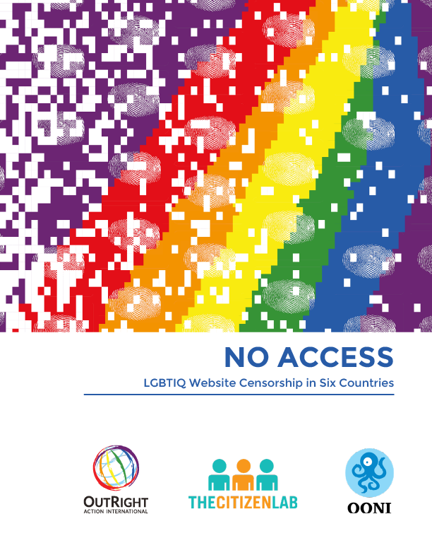
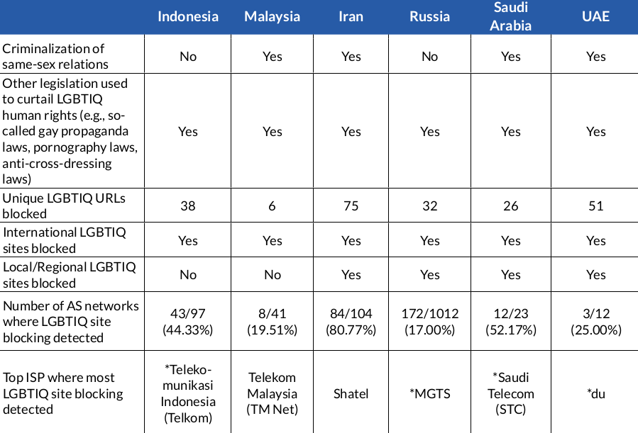
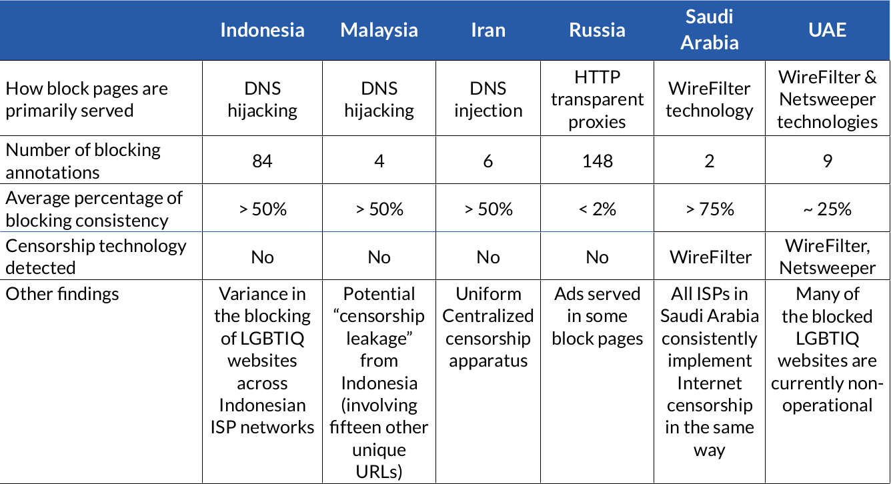

{{}}

Today, in collaboration with [OutRight Action International](https://outrightinternational.org/) and the [Citizen Lab](https://citizenlab.ca/), we are excited to share our new research report, “**No Access: LGBTIQ Website Censorship in Six Countries**”,
which examines the blocking of LGBTIQ websites in Indonesia, Malaysia,
Iran, Russia, Saudi Arabia, and the United Arab Emirates (UAE).

**[READ FULL REPORT](/documents/2021-lgbtiq-website-censorship-report/2021-lgbtiq-website-censorship-report-v2.pdf)**

[Annotated Bibliography](/documents/2021-lgbtiq-website-censorship-report/annotated-bibliography.pdf)

Below we share some of our key research findings.

# Summary of findings

We joined forces with [OutRight Action International](https://outrightinternational.org/) and the [Citizen Lab](https://citizenlab.ca/) to examine the blocking of LGBTIQ websites
in six countries: Indonesia, Malaysia, Iran, Russia, Saudi Arabia, and
the United Arab Emirates (UAE). We selected these countries because they
are (a) known to serve [block pages](https://ooni.org/support/glossary/#block-page) (i.e., pages that
website visitors may see when access is restricted), which enable us to
automatically confirm the blocking of LGBTIQ websites, and (b) known to
censor LGBTIQ related content, based on prior research.

We adopted a mixed methods research approach, combining [OONI network measurement analysis](https://explorer.ooni.org/search) with interviews
and literature research. Specifically, we analyzed [OONI measurements](https://api.ooni.io/) collected from these six countries
to detect the blocking of LGBTIQ websites, and to examine how their
blocking varies across AS networks in each country (if at all). The
timeframe that we selected for OONI data analysis was **June 1, 2016 to
July 31, 2020**. To examine the impact of online LGBTIQ censorship,
[OutRight Action International](https://outrightinternational.org/)
and the [Citizen Lab](https://citizenlab.ca/) interviewed LGBTIQ
communities in the six countries.

Our technical findings, along with information on the criminalization of
LGBTIQ related activities, are summarized for each country in the
following tables.

{{}}

**Image:** Table 1: Summary of findings 

{{}}

**Image:** Table 2: Summary of findings 

Overall, through OONI data analysis we found:

* **Iran blocks the highest number of LGBTIQ URLs in our [test lists](https://github.com/citizenlab/test-lists/tree/master/lists).**
Out of the six countries, the highest instance of LGBTIQ URL
blocking was seen in Iran, where 75 unique LGBTIQ URLs were
detected as blocked. In Iran, we also observed the blocking of
`www.outrightinternational.org`, the website of OutRight Action
International, one of this report’s authors. In second place is
the UAE where 51 unique LGBTIQ URLs in our [test lists](https://github.com/citizenlab/test-lists/tree/master/lists)
were found blocked.

* **Russia has the highest number of networks that block LGBTIQ websites.** Specifically, we detected the blocking of LGBTIQ
websites on 172 distinct AS networks. Iran has the second highest
prevalence of blocking, with LGBTIQ websites being blocked on 84
AS networks. In Indonesia, LGBTIQ websites were blocked on 43 AS
networks, while in the UAE, LGBTIQ websites were found blocked on
only 3 AS networks. We should note, however, that these figures
also reflect the diversity of each country’s ISP market.

* **Saudi Arabia has the highest percentage of LGBTIQ website blocking consistency.** The highest blocking consistency was found in Saudi
Arabia, where most LGBTIQ URLs that we tested were found blocked
more than 75 percent of the time. Blocking consistency refers to
the amount of times that we found each LGBTIQ URL to be blocked in
each country in comparison to the total amount of times tested
throughout our analysis period. The more times a URL is found
blocked in comparison to the times that it was tested, the higher
its blocking consistency. Our research across the six countries
found variation in blocking consistency.

* **LGBTIQ websites on “culture and community” were blocked most often.** In Indonesia, Iran, Malaysia, and Saudi Arabia, the most
frequently blocked LGBTIQ websites were those that belong under
the “Culture and Community” category. These are websites that aim
primarily to create a sense of community among LGBTIQ individuals,
as well as provide information about art and culture. This is not
the case in Russia, however, where LGBTIQ websites under the “News
Media" category instead presented the most blocking, while in the
UAE, most of the LGBTIQ websites found to be blocked were no
longer operational (categorized as “404 Not Found”).

* **Variation in the blocking of internationally-relevant LGBTIQ websites vs. locally-relevant ones.** All six countries blocked
LGBTIQ websites that are internationally-relevant and meant for an
international audience, including popular dating websites (e.g.,
`www.grindr.com`), news media sites (e.g.,
`www.advocate.com`), and websites of organizations defending
LGBTIQ human rights around the world (e.g., `ilga.org`). In
Malaysia and Indonesia, all local LGBTIQ websites tested (e.g.,
queerlapis.com and suarakita.org), however, were accessible during
our analysis period, and therefore, it appears that both countries
block internationally-relevant LGBTIQ websites only. In contrast,
Iran, Russia, Saudi Arabia, and the UAE blocked access to several
local and regional LGBTIQ sites, in addition to blocking
internationally-relevant LGBTIQ sites.

* **Variation in the implementation of internet censorship across networks in the six countries.** Iran, for example, appears to
have a uniform censorship apparatus, as most ISPs not only block
the same websites, but they also use the same set of censorship
techniques. Nevertheless, Iranian ISPs appear to alternate between
blocking and unblocking LGBTIQ URLs over time. In Indonesia, on
the other hand, despite the Communications and Information
Technology Ministry’s (Kominfo) Trust Positif censorship program,
we observed differences in LGBTIQ URLs blocked on different
networks. This variation signals that different ISPs block access
to different websites at different moments in time.

* **Variation in the number of blocking annotations.** Blocking
annotations indicate the distinct ways by which internet
censorship was implemented. Where the implementation of internet
censorship varies from ISP to ISP, we would see a high number of
blocking annotations in that country. The highest number was found
in Russia with 148 different annotations, while in Indonesia, we
detected 84 distinct blocking annotations. In contrast, we
observed fewer than 10 different blocking annotations each in
Malaysia, Iran, and the UAE, while in Saudi Arabia (where ISPs
consistently serve the same single blockpage) we only detected 2
blocking annotations.

* **Variation in how block pages are served for LGBTIQ websites.**
Local ISPs in all six countries serve [block pages](https://ooni.org/support/glossary/#block-page) when users
try to access blocked LGBTIQ content, but the technical means by
which these pages are served by ISPs vary across countries—in some
cases, they even vary between ISPs within the same country. ISPs
in Indonesia and Malaysia serve block pages by means of [DNS hijacking](https://ooni.org/support/glossary/#dns-hijacking),
whereas Iranian ISPs serve block pages primarily by means of [DNS injection](https://ooni.org/support/glossary/#dns-tampering). In
Russia, ISPs commonly make use of [HTTP transparent proxies](https://ooni.org/support/glossary/#http-transparent-proxy)
to serve blockpages, but some Russian ISPs serve block pages by means of [DNS hijacking](https://ooni.org/support/glossary/#dns-hijacking)
instead. In Saudi Arabia and the UAE, ISPs deliver block pages to
internet users through the use of censorship technologies.

* **Some block pages in Russia contained affiliate ads.** Unlike other
countries, some block pages in Russia contained affiliate ads,
suggesting the presence of financial incentives. We have observed
ads being served as part of censorship efforts previously. In
2018, both [OONI](https://ooni.org/post/egypt-internet-censorship/) and the
[Citizen Lab](https://citizenlab.ca/2018/03/bad-traffic-sandvines-packetlogic-devices-deploy-government-spyware-turkey-syria/)
reported on the injection of ads by ISPs in Egypt, while implementing internet censorship.

* **Detection of censorship technologies in Saudi Arabia and the UAE.** In both Saudi Arabia and the UAE, ISPs deliver block pages
to internet users through the use of WireFilter technology, which
is a network filtering device made for the ISP and commercial
market, manufactured by Riyadh-based Sewar Technologies Ltd. In
the UAE, we also observed blocking using a tool manufactured by
Netsweeper, which is a Canadian company that sells internet
filtering products to ISPs around the world.

Further details are available through our **[report](/documents/2021-lgbtiq-website-censorship-report/2021-lgbtiq-website-censorship-report-v2.pdf)**.

We thank OONI Probe users who contributed measurements, supporting this
study.

To [measure the blocking of LGBTIQ websites](https://ooni.org/post/2019-measure-blocking-lgbtqi-sites/)
around the world (and contribute [open data](https://explorer.ooni.org/)), you can [install the OONI Probe mobile app](https://ooni.org/install/mobile) and tap on the `LGBTIQ` buttons on this page: https://ooni.org/get-involved/run/
