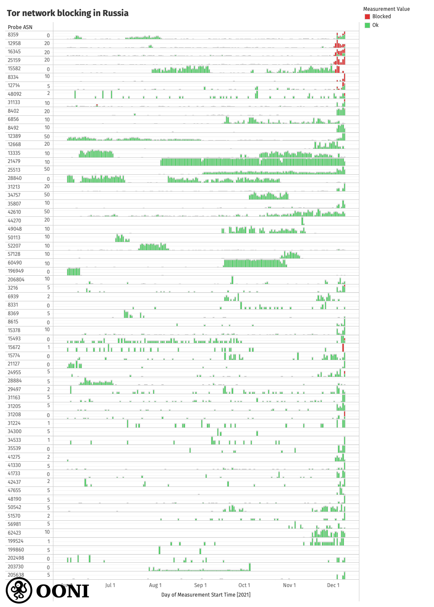

On 1st December 2021, some Internet Service Providers (ISPs) in Russia
started
[blocking](https://explorer.ooni.org/search?since=2021-11-08&until=2021-12-09&failure=false&probe_cc=RU&test_name=tor&only=anomalies)
access to the [Tor](https://www.torproject.org/) anonymity network.

In this report, we share [OONI network measurement data](https://explorer.ooni.org/search?since=2021-11-08&until=2021-12-09&failure=false&probe_cc=RU&test_name=tor&only=anomalies)
on the blocking of the Tor network and `www.torproject.org` in Russia.

* [About Tor](#about-tor)

* [Methods](#methods)

* [Findings](#findings)

    * [Blocking of the Tor network](#blocking-of-the-tor-network)

    * [Blocking of the Tor Project website](#blocking-of-the-tor-project-website)

* [Conclusion](#conclusion)

* [Acknowledgements](#acknowledgements)

# About Tor

If you want real privacy and anonymity on the internet, the answer is
simple: use [Tor](https://www.torproject.org/download/).

This is not a question of promotion, but a question of **software
design**: Tor software is designed to bounce communications around a
distributed network of relays (run by volunteers around the world),
thereby hiding its users’ IP addresses and enabling them to circumvent
online tracking and internet censorship.

When you use [Tor](https://www.torproject.org/download/), the online
services that you connect to don’t see your real IP address, but some
other IP address of the Tor relay you are exiting from. As a result,
it’s harder for governments and corporations to track your online
activity, and you can circumvent internet censorship in your country
because you look like you’re connecting from a different location (where
that service may not be blocked).

In short, the Tor network is uniquely designed in such a way that
*actually* guarantees you online privacy and anonymity. Tor software is
developed by a nonprofit organization (the [Tor Project](https://www.torproject.org/)), whose mission is to advance
human rights and freedoms by creating and deploying free and open source
anonymity and privacy technologies, supporting their unrestricted
availability and use, and furthering their scientific and popular
understanding. The fact that it’s [free and open source](https://gitlab.torproject.org/tpo) means that potentially
anyone can use it, and its codebase is regularly reviewed (and improved
upon) by security experts around the world.

This is why human rights defenders,
[journalists](https://archives.cjr.org/behind_the_news/can_we_still_trust_tor.php),
and
[whistleblowers](https://blog.torproject.org/what-tor-supporter-looks-edward-snowden/)
around the world rely on Tor for online privacy, anonymity, and
censorship circumvention (along with other [digital security tools](https://ssd.eff.org/)). But it’s also why some governments (in
countries like
[China](https://explorer.ooni.org/search?since=2021-11-08&until=2021-12-09&failure=false&probe_cc=CN&test_name=tor)
and
[Iran](https://explorer.ooni.org/search?since=2021-11-08&until=2021-12-09&failure=false&probe_cc=IR&test_name=tor))
target and block access to Tor. The Tor Project has therefore created
[Tor bridges](https://bridges.torproject.org/), enabling the
circumvention of Tor blocking. [Tor Browser](https://www.torproject.org/download/) – the main way that Tor
is used by millions of users around the world – is shipped with a set of
public bridges (called built-in
[obfs4](https://bridges.torproject.org/bridges?transport=obfs4)
bridges) that users in censored environments can enable.

On 1st December 2021, [Russia started blocking access to Tor](https://explorer.ooni.org/search?since=2021-11-08&until=2021-12-09&failure=false&probe_cc=RU&test_name=tor&only=anomalies),
and the Tor Project
[responded](https://blog.torproject.org/tor-censorship-in-russia/)
with a call for support from the internet freedom community. According
to the Tor Project, Russia is the country with the [second largest number of Tor users](https://metrics.torproject.org/userstats-relay-table.html) with
more than 300,000 daily users (about 15% of all Tor users).

To learn about the impact of Tor blocking, view the Tor Project’s
[online PrivChat event](https://www.torproject.org/privchat/) to hear
from an [artist and activist who lives in Russia and relies on Tor](https://twitter.com/torproject/status/1468344092123795459).

# Methods

Since 2012, [OONI](https://ooni.org/) (a project born out of the Tor
Project) has developed [free and open source software](https://github.com/ooni) -- called [OONI Probe](https://ooni.org/install/) -- designed to measure internet
censorship and other forms of network interference. Every month, OONI
Probe is run by tens of thousands of users in [around 200 countries](https://explorer.ooni.org/), including
[Russia](https://explorer.ooni.org/search?since=2021-11-08&until=2021-12-09&failure=false&probe_cc=RU).
As soon as OONI Probe users run tests on their network, their test
results (“measurements”) are automatically submitted to OONI servers,
[processed](https://github.com/ooni/pipeline), and [openly published](https://ooni.org/data/) in real-time.

The [OONI Probe app](https://ooni.org/install/) includes a variety of
different [network measurement tests](https://ooni.org/nettest/),
including a [test](https://ooni.org/nettest/tor/) specifically
designed to measure Tor reachability. The OONI Probe Tor test provides
an automated way of examining whether
[Tor](https://www.torproject.org/) works in a tested network.

To this end, this
[test](https://github.com/ooni/spec/blob/master/nettests/ts-023-tor.md)
measures the reachability of a set of services that allow Tor to work.
These include the following services:

* Tor directory authorities (used by Tor relays)

* OR port (used by Tor bridges)

* OR port of directory authorities (used by Tor clients)

* Built-in obfs4 bridges (Tor bridge that speaks the OBFS4 protocol)

By measuring the reachability of selected Tor directory authorities and
bridges, this test evaluates whether they can be used within the tested
network.

More specifically, this test attempts to perform the following actions
from the vantage point of the user:

* HTTP GET request to the `tor/status-vote/current/consensus.z`
resource, which is required for Tor directory authorities;

* Connect to OR ports and OR ports of directory authorities and
perform a TLS handshake;

* Connect to obfs4 addresses and perform an OBFS4 handshake (an
obfuscated handshake).

Based on our heuristics, if the test succeeds in performing all of the
above, Tor may work on a tested network (unless it's blocked in ways
that aren’t being measured). In these cases, we automatically annotate
Tor measurements as “OK”, indicating that Tor works on the tested
network.

If the test fails in performing any of the above, Tor may not work in
the tested network and may be blocked. In these cases, we automatically
annotate Tor measurements as
“[anomalies](https://ooni.org/support/faq/#what-do-you-mean-by-anomalies)”,
providing a sign of potential Tor blocking.

To examine [Tor blocking in Russia](https://blog.torproject.org/tor-censorship-in-russia/), we
analyzed all [Tor measurements collected from Russia](https://explorer.ooni.org/search?since=2021-11-08&until=2021-12-09&failure=false&probe_cc=RU&test_name=tor)
between 1st January 2021 to 8th December 2021. We explored whether the
testing of Tor presented anomalies, and we aggregated [anomalous measurements](https://explorer.ooni.org/search?since=2021-11-08&until=2021-12-09&failure=false&probe_cc=RU&test_name=tor&only=anomalies)
to evaluate whether they were persistent on the same AS networks. These
aggregated anomalies were compared with [other measurements](https://explorer.ooni.org/search?since=2021-11-08&until=2021-12-09&failure=false&probe_cc=RU&test_name=tor)
collected from the same AS networks, as well as with measurements
collected from other AS networks. Beyond aggregation, we analyzed the
raw measurement data within [anomalous measurements](https://explorer.ooni.org/search?since=2021-11-08&until=2021-12-09&failure=false&probe_cc=RU&test_name=tor&only=anomalies)
to evaluate how access to Tor was being interfered with in Russia.

Similarly, we analyzed [OONI Web Connectivity measurements](https://explorer.ooni.org/search?since=2021-11-08&until=2021-12-09&failure=false&probe_cc=RU&test_name=web_connectivity&domain=www.torproject.org)
to examine the blocking of `www.torproject.org`. The OONI Probe [Web Connectivity test](https://ooni.org/nettest/web-connectivity/) is
designed to measure URLs (provided in the [Citizen Lab test lists](https://github.com/citizenlab/test-lists/tree/master/lists)) by
performing a DNS lookup, TCP connection, and HTTP GET request to each
tested URL over two vantage points: the local vantage point of the user
and a control (non-censored) vantage point. The results from both
networks are automatically compared and if they are the same, the tested
URL is annotated as “accessible” (unless if the measurement fails). If
the results differ, the measurement is annotated as an “anomaly”.
Anomalous measurements are further annotated as `dns`, `tcp/ip`,
`http-diff`, and `http-failure`, depending on the reason which
caused the anomaly (for example, if the DNS responses from the local and
control vantage points do not match).

To analyze [Web Connectivity measurements](https://explorer.ooni.org/search?since=2021-11-08&until=2021-12-09&failure=false&probe_cc=RU&test_name=web_connectivity&domain=www.torproject.org)
pertaining to the testing of `www.torproject.org` in Russia, we
aggregated the measurements to identify on which AS networks they
presented the highest volume of anomalies. We further analyzed the
measurements based on the types of anomalies that they presented
(`dns`, `tcp/ip`, `http-diff`, and `http-failure`) to evaluate
whether those types of anomalies were consistent on each network. By
analyzing the raw data (for example, examining what was served in the
HTTP response of measurements), we were able to characterize the blocks.

The summary findings from our analysis are presented in the following
sections.

# Findings

As of 1st December 2021, several ISPs in Russia started [blocking access to the Tor network](https://explorer.ooni.org/search?since=2021-11-08&until=2021-12-09&failure=false&probe_cc=RU&test_name=tor&only=anomalies).
OONI data also shows that some Russian ISPs
[block](https://explorer.ooni.org/search?since=2021-11-08&until=2021-12-09&failure=false&probe_cc=RU&test_name=web_connectivity&domain=www.torproject.org&only=anomalies)
access to the Tor Project’s website (`www.torproject.org`) as well.

## Blocking of the Tor network

Starting from 1st December 2021, OONI data suggests that several ISPs in
Russia started [blocking access to the Tor network](https://explorer.test.ooni.org/experimental/mat?probe_cc=RU&since=2021-11-08&until=2021-12-09&test_name=tor&axis_x=measurement_start_day).
The block does *not* seem to be implemented across all ISPs in Russia,
but only a
[subset](https://explorer.test.ooni.org/experimental/mat?probe_cc=RU&since=2021-11-08&until=2021-12-09&test_name=tor&axis_x=measurement_start_day&axis_y=probe_asn)
of them. The following chart aggregates [Tor measurement coverage from Russia](https://explorer.ooni.org/search?since=2021-11-08&until=2021-12-09&failure=false&probe_cc=RU&test_name=tor)
over the last months (providing a per-ASN breakdown), illustrating that
Tor blocking differs significantly from ISP to ISP in Russia.

{{}}

**Source:** OONI Probe Tor measurements collected from Russia between
June 2021 to December 2021, https://explorer.ooni.org/search?since=2021-11-08&until=2021-12-09&failure=false&probe_cc=RU&test_name=tor

As [OONI measurement coverage from Russia](https://explorer.ooni.org/country/RU) is quite large (OONI data
collected from Russia covers 2,556 local networks since December 2012),
we have limited the above chart to:

* AS networks where Tor testing presented
[anomalies](https://explorer.ooni.org/search?since=2021-11-08&until=2021-12-09&failure=false&probe_cc=RU&test_name=tor&only=anomalies)
(during the analysis period);

* AS networks where at least 16 Tor measurements were collected in the
analysis period.

Out of 65 AS networks included in the above chart, the testing of Tor
only presented signs of blocking on the following 15 networks:
`AS48092`, `AS3216`, `AS8334`, `AS8359`, `AS8402`,
`AS12714`, `AS12958`, `AS15493`, `AS15582`, `AS15672`,
`AS16345`, `AS24955`, `AS25159`, `AS31133`, `AS31208`.

The [anomalous measurements](https://explorer.ooni.org/search?since=2021-11-08&until=2021-12-09&failure=false&probe_cc=RU&test_name=tor&only=anomalies)
from those networks provide a strong signal of Tor blocking because we
observe that they began on several AS networks on the same day (1st
December 2021), whereas previous measurements show that Tor was
previously reachable on those networks. Moreover, Tor testing continued
to present anomalies on those networks thereafter, providing a further
signal of Tor blocking.

Tor blocking is further suggested by the recent spike in the use of
[Tor bridges](https://bridges.torproject.org/) (used for circumventing
Tor blocking) in Russia, as illustrated below by [Tor Metrics](https://metrics.torproject.org/userstats-bridge-country.html?start=2021-11-09&end=2021-12-08&country=ru).

{{}}

**Source:** Tor Metrics: Bridge users from Russia, https://metrics.torproject.org/userstats-bridge-country.html?start=2021-11-09&end=2021-12-08&country=ru

When looking at raw OONI data from [anomalous Tor measurements](https://explorer.ooni.org/search?since=2021-11-08&until=2021-12-09&failure=false&probe_cc=RU&test_name=tor&only=anomalies),
we can see that the block is implemented by means of **IP blocking**,
which is [consistent](https://censoredplanet.org/russia) with how we
have seen ISPs in Russia implement blocks in the past. In particular,
OONI data shows that attempts to connect to OR ports, OR ports of
directory authorities, and obfs4 addresses consistently failed,
resulting in generic timeout errors. This, for example, is illustrated
from the following summary table, taken from an [OONI measurement](https://explorer.ooni.org/measurement/20211208T181239Z_tor_RU_8359_n1_vpm7c98293BSrYkD)
collected from the `AS8359` network in Russia on 8th December 2021.

{{}}

**Source:** OONI Probe Tor measurement collected from the `AS8359`
network in Russia on 8th December 2021, https://explorer.ooni.org/measurement/20211208T181239Z_tor_RU_8359_n1_vpm7c98293BSrYkD

In cases where obfs4 addresses (the default [Tor bridges](https://bridges.torproject.org/) shipped as part of [Tor Browser](https://www.torproject.org/download/)) are blocked, Tor users
in Russia would need to [get private bridges](https://forum.torproject.net/t/tor-blocked-in-russia-how-to-circumvent-censorship/982)
(which are not publicly listed and therefore less likely to be blocked).

Interestingly, we observe that within the same network, Tor blocking
does not appear to be implemented for all users. For example, on
`AS16345` (VEON), some users appear to [experience Tor blocking](https://explorer.ooni.org/measurement/20211208T123808Z_tor_RU_16345_n1_rs7f8POuI9xRdxcl),
while other users on the same AS network [do not](https://explorer.ooni.org/measurement/20211208T124613Z_tor_RU_16345_n1_O2h6Iy7B0G9mtbws).
This could potentially be explained if the rollout of Tor blocking is
not being carried out in the same way across all their infrastructure.
The non-deterministic nature of Tor blocking is further suggested by
OONI measurements which show that [Tor was reachable from multiple AS networks](https://explorer.ooni.org/search?since=2021-11-14&until=2021-12-15&failure=false&probe_cc=RU&test_name=tor)
during certain windows of time (such as on 8th December 2021),
corroborating what was
[reported](https://gitlab.torproject.org/tpo/anti-censorship/pluggable-transports/snowflake/-/issues/40014#note_2765276)
by internet users in Russia.

Russia’s Federal Service for Supervision of Communications, Information
Technology and Mass Media (Roskomnadzor) maintains a blocklist and
provides a [portal](https://eais.rkn.gov.ru/en/) through which
internet users can check if specific IP addresses, domains, or URLs are
included in their blocklist. A GitHub
[project](https://github.com/zapret-info/z-i) provides a dump of the
IPs which are present in their blocklist, but none of the IP addresses
associated with Tor directory authorities or bridges appear to currently
be present in this registry. It is therefore likely that ISP
coordination to implement Tor blocking happened through other means.

It’s worth highlighting though that most Tor measurements from most AS
networks in Russia were
[successful](https://explorer.ooni.org/search?since=2021-11-08&until=2021-12-09&failure=false&probe_cc=RU&test_name=tor),
suggesting that it’s *still* possible to connect directly to Tor on many
networks in Russia.

## Blocking of the Tor Project website

On 6th December 2021, the Tor Project [received an abuse notice from Roskomnadzor](https://gitlab.torproject.org/tpo/community/support/-/issues/40050#note_2764565),
threatening to block access to the Tor Project’s main website
(`www.torproject.org`). By 7th December 2021, `www.torproject.org`
had [officially been added to the blocklist](https://gitlab.torproject.org/tpo/community/support/-/issues/40050#note_2765035).

This is corroborated by [OONI data](https://explorer.ooni.org/search?since=2021-11-08&until=2021-12-09&failure=false&probe_cc=RU&test_name=web_connectivity&domain=www.torproject.org&only=anomalies),
which not only shows that *some* ISPs in Russia appear to block access
to `www.torproject.org`, but which also suggests that the blocking may
have begun as early as September 2021.

The following chart aggregates [OONI measurement coverage](https://explorer.ooni.org/search?since=2021-11-08&until=2021-12-09&failure=false&probe_cc=RU&test_name=web_connectivity&domain=www.torproject.org)
from the testing of `www.torproject.org` across AS networks in Russia
over the last months, illustrating how the blocking of the site varies
across ISPs in the country.

{{}}

**Source:** OONI measurements from the testing of
`www.torproject.org` in Russia between
January 2021 to December 2021, https://explorer.ooni.org/search?since=2021-11-08&until=2021-12-09&failure=false&probe_cc=RU&test_name=web_connectivity&domain=www.torproject.org

Similarly to the graph produced for the testing of Tor (based on OONI
data), we have limited this chart to AS networks where the testing of
`www.torproject.org` presented anomalies and which received at least
16 measurements during the analysis period.

OONI data shows that the testing of `www.torproject.org` presented
signs of blocking on several AS networks. However, the censorship
techniques across ISPs differ.

On some networks (such as `AS21127`), OONI data provides **evidence**
of torproject.org blocking, as we observe that a [block page was served](https://explorer.ooni.org/measurement/20211208T105240Z_webconnectivity_RU_21127_n1_vuA5flblHujkP12E?input=http%3A%2F%2Ftorproject.org)
(as illustrated below).

{{}}

**Image:** Block page served on `AS21127` in Russia when
torproject.org was tested on 8th December 2021, https://explorer.ooni.org/measurement/20211208T105240Z_webconnectivity_RU_21127_n1_vuA5flblHujkP12E?input=http%3A%2F%2Ftorproject.org

Similarly, we observe a [block page being served](https://explorer.ooni.org/measurement/20211208T103229Z_webconnectivity_RU_31163_n1_HMGBbnFmuqyMIAtE?input=http%3A%2F%2Ftorproject.org)
when torproject.org was tested on `AS31163` on 8th December 2021, as
illustrated below.

{{}}

**Image:** Block page served on `AS31163` in Russia when
torproject.org was tested on 8th December 2021, https://explorer.ooni.org/measurement/20211208T103229Z_webconnectivity_RU_31163_n1_HMGBbnFmuqyMIAtE?input=http%3A%2F%2Ftorproject.org

We also observe [block pages](https://explorer.ooni.org/measurement/20211208T101854Z_webconnectivity_RU_8359_n1_4ergxVLtT3HvXoYO?input=http%3A%2F%2Ftorproject.org)
on other networks, such as `AS8359` (shared below).

{{}}

**Image:** Block page served on `AS8359` in Russia when torproject.org
was tested on 8th December 2021, https://explorer.ooni.org/measurement/20211208T101854Z_webconnectivity_RU_8359_n1_4ergxVLtT3HvXoYO?input=http%3A%2F%2Ftorproject.org

In some cases though (such as on `AS42437`), OONI data suggests that
access to torproject.org is being interfered with by means of a [TLS man-in-the-middle attack](https://explorer.ooni.org/measurement/20211208T092220Z_webconnectivity_RU_42437_n1_nFZlCmxOs4RnVpYA?input=http%3A%2F%2Ftorproject.org),
while in other cases (such as on `AS51570`), we observe that the
[connection is reset once the TLS handshake has been initiated](https://explorer.ooni.org/measurement/20211208T003455Z_webconnectivity_RU_51570_n1_ZYAu31bx2EDQUiOv?input=https%3A%2F%2Ftorproject.org),
suggesting the use of Deep Packet Inspection (DPI) technology.

On many tested networks in Russia though, OONI data suggests that
`www.torproject.org` is
[accessible](https://explorer.ooni.org/measurement/20211208T195602Z_webconnectivity_RU_24955_n1_rnonFvJpOw9Ko4s4?input=https%3A%2F%2Fwww.torproject.org%2F).

# Conclusion

OONI data collected from Russia suggests that access to both the [Tor network](https://explorer.ooni.org/search?since=2021-11-10&until=2021-12-11&failure=false&probe_cc=RU&test_name=tor&only=anomalies)
and the [Tor Project’s website](https://explorer.ooni.org/search?since=2021-11-10&until=2021-12-11&failure=false&probe_cc=RU&test_name=web_connectivity&only=anomalies&domain=www.torproject.org)
is blocked on *some* AS networks in Russia.

* **Tor blocking.** On 1st December 2021, *some* ISPs in Russia
started blocking access to the Tor network by means of IP
blocking.

    * Out of (more than) 65 tested AS networks, OONI data only shows
    signs of [Tor blocking](https://explorer.ooni.org/search?since=2021-11-10&until=2021-12-11&failure=false&probe_cc=RU&test_name=tor&only=anomalies)
    on 15 AS networks in Russia.

    * The block also [impacts obfs4 addresses](https://explorer.ooni.org/measurement/20211208T181239Z_tor_RU_8359_n1_vpm7c98293BSrYkD),
    which means that Tor users in Russia may need to [use private Tor bridges](https://forum.torproject.net/t/tor-blocked-in-russia-how-to-circumvent-censorship/982)
    to circumvent the block.

    * Tor blocking differs from ISP to ISP in Russia. However, not all
    users on the same AS network experience Tor blocking.

* **Blocking of Tor Project website.** In September 2021, *some* ISPs
in Russia started blocking access to `www.torproject.org`.
Censorship techniques across ISPs differ.

    * On some networks (such as `AS21127`, `AS31163`, and
    `AS8359`), a [block page](https://explorer.ooni.org/measurement/20211208T105240Z_webconnectivity_RU_21127_n1_vuA5flblHujkP12E?input=http%3A%2F%2Ftorproject.org)
    is served for `www.torproject.org`, enabling us to
    automatically confirm the block.

    * On other networks (such as on `AS42437`), OONI data suggests
    that access to `www.torproject.org` is being interfered with
    by means of a [TLS man-in-the-middle attack](https://explorer.ooni.org/measurement/20211208T092220Z_webconnectivity_RU_42437_n1_nFZlCmxOs4RnVpYA?input=http%3A%2F%2Ftorproject.org).

    * In other cases (such as on `AS51570`), we observe that the
    [connection is reset once the TLS handshake has been initiated](https://explorer.ooni.org/measurement/20211208T003455Z_webconnectivity_RU_51570_n1_ZYAu31bx2EDQUiOv?input=https%3A%2F%2Ftorproject.org),
    suggesting the use of Deep Packet Inspection (DPI) technology.

Despite these blocks, OONI data suggests that both the Tor network and
`www.torproject.org` are still
[accessible](https://explorer.ooni.org/search?since=2021-11-10&until=2021-12-11&failure=false&probe_cc=RU&test_name=tor)
on most networks in Russia. The blocking of the Tor network and
`www.torproject.org` appears to vary from ISP to ISP in Russia, and
different ISPs adopt different censorship techniques.

This variance could be explained by the fact that internet
infrastructure in Russia is fairly
[decentralized](https://www.ndss-symposium.org/ndss-paper/decentralized-control-a-case-study-of-russia/),
limiting the ability to implement a uniform country-wide internet
censorship policy. As a result, it is at the discretion of each ISP to
independently implement blocking orders from the central government
authority (Roskomnadzor).

To [circumvent Tor blocking](https://blog.torproject.org/tor-censorship-in-russia/), you
can:

* Use a [private Tor bridge](https://forum.torproject.net/t/tor-blocked-in-russia-how-to-circumvent-censorship/982);

* [Run a Tor bridge](https://forum.torproject.net/t/help-censored-users-run-a-tor-bridge/704)
to help more Russians stay connected to the Tor network;

* Teach users about [Tor bridges](https://tb-manual.torproject.org/bridges/).

Meanwhile, the Tor Project [identified and responded to the use of DTLS fingerprinting to block the Snowflake pluggable transport](https://gitlab.torproject.org/tpo/anti-censorship/pluggable-transports/snowflake/-/issues/40014),
and they will be rolling out the fix in the [next Tor Browser release](https://www.torproject.org/releases/). We therefore recommend
keeping an eye out for (and updating to) the next Tor Browser version,
and configuring Tor Browser to [use Snowflake](https://support.torproject.org/censorship/how-can-i-use-snowflake/).

If access to `www.torproject.org` is blocked on your network, you can:

* Circumvent this block by visiting the Tor Project’s [website mirror](https://tor.eff.org/);

* Get Tor Browser by sending an email to `gettor@torproject.org`
([GetTor](https://gettor.torproject.org/)), while specifying the
operating system and language (eg. `windows ru`) you would like
a download link for.

If you’re in Russia and would like to contribute more OONI measurements,
please consider running [OONI Probe](https://ooni.org/install/) to
continue [testing Tor reachability](https://ooni.org/support/ooni-probe-mobile#measuring-the-blocking-of-circumvention-tools).

# Acknowledgements

We thank [OONI Probe](https://ooni.org/install/) users in Russia who
contributed measurements, supporting this study.

We also thank the [Tor Project](https://www.torproject.org/) for their
tireless efforts in building an online world that protects humans
worldwide.
