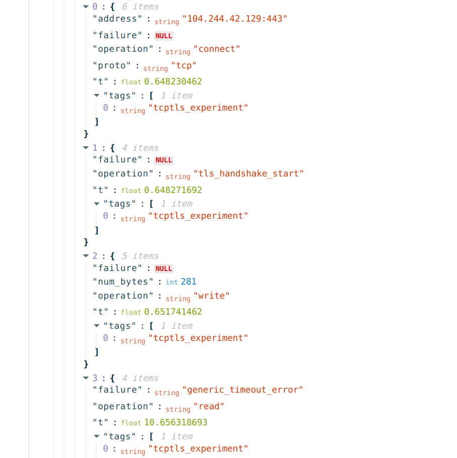

{{}}

Recently, on 12th August 2021, [general elections](https://www.elections.org.zm/category/2021-general-election/)
were held in Zambia, during which access to popular online social media
platforms was [reportedly blocked](https://edition.cnn.com/2021/08/12/africa/zambia-election-social-media-blackout-intl/index.html).

In this report, we share relevant [OONI data](https://explorer.ooni.org/search?until=2021-08-20&since=2021-07-21&probe_cc=ZM)
on the blocking of
[WhatsApp](https://explorer.ooni.org/search?until=2021-08-20&since=2021-08-10&probe_cc=ZM&test_name=whatsapp&only=anomalies),
[Twitter](https://explorer.ooni.org/search?until=2021-08-20&since=2021-07-21&domain=twitter.com&probe_cc=ZM&only=anomalies),
and
[Facebook](https://explorer.ooni.org/search?until=2021-08-20&since=2021-07-21&domain=www.facebook.com&probe_cc=ZM&only=anomalies)
amid Zambia’s 2021 general election.

* [Background](#background)

* [Methods](#methods)

* [Findings](#findings)

    * [Blocking of WhatsApp](#blocking-of-whatsapp)

    * [Blocking of Twitter and Facebook](#blocking-of-twitter-and-facebook)

* [Conclusion](#conclusion)

* [Acknowledgements](#acknowledgements)

# Background

While Zambia hasn’t experienced pervasive forms of internet censorship
(such as the blocking of popular social media apps) over the last years,
various forms of
[censorship](https://ooni.org/post/zambia-election-monitoring/#previous-cases-of-internet-censorship-and-surveillance)
have been reported in the country.

Back in 2012, Zambia’s registrar of societies
[threatened](https://ooni.org/post/zambia-election-monitoring/#previous-cases-of-internet-censorship-and-surveillance)
to deregister the [Zambian Watchdog](https://www.zambiawatchdog.com/),
an investigative online media that focuses on corruption and other major
crimes, for allegedly failing to pay required fees and submit a postal
address. While this attempt was unsuccessful, the news website was
nonetheless blocked. In 2013, we published a
[report](https://ooni.org/post/zambia/) demonstrating that Deep Packet
Inspection (DPI) filtering techniques were used to block access to
Zambian Watchdog’s website. Between July 2013 to April 2014, Zambia
Reports, Barotse Post, and Radio Barotse (in addition to Zambian
Watchdog) were [reportedly censored](https://freedomhouse.org/sites/default/files/resources/FOTN%202015_Zambia.pdf)
for about nine months for their critical coverage of the ruling party.

During Zambia’s 2016 general election, [OONI network measurements](https://explorer.ooni.org/country/ZM) were collected from
the country to examine the accessibility of websites and applications.
We analyzed more than 38,000 network measurements collected from a local
vantage point (MTN) in Zambia. At the time, we published a [research report](https://ooni.org/post/zambia-election-monitoring/) documenting
that we had not found any substantial evidence of internet censorship
amid Zambia’s 2016 general election (though our study did present
[limitations](https://ooni.org/post/zambia-election-monitoring/#acknowledgement-of-limitations)).

Other forms of censorship, however, were reported leading up to the
election. In June 2016, for example, the government [banned The Post](https://www.voanews.com/africa/zambia-government-shuts-down-newspaper-unpaid-taxes),
one of Zambia’s few independent newspapers, over unpaid taxes. Following
the 2016 general election, opposition leader Mr Hakainde Hichilema was
[arrested on treason charges in April 2017](https://www.bbc.com/news/world-africa-40945825) (and held in
prison until August 2017) for allegedly failing to give way to the
presidential motorcade. While in prison, Mr Hichilema
[reported](https://www.bbc.co.uk/programmes/p05lpdkr) that he was held
in solitary confinement for eight days in a room without electricity,
water or a toilet.

In the years leading up to Zambia’s 2021 general election, Amnesty
International
[reported](https://www.amnesty.org/en/latest/press-release/2021/06/zambia-killings-and-brutal-crackdown-against-dissent-set-the-tone-for-august-election/)
that censorship, excessive use of force by the police, arbitrary arrests
and detention created a climate of fear and impunity in the country. In
March 2020, for example, a 15-year-old boy was charged with three counts
of criminal libel for [allegedly defaming President Lungu](https://www.theguardian.com/world/2020/mar/11/zambia-boy-arrested-allegedly-defaming-president-facebook)
on Facebook. In April 2020, Zambian authorities [revoked the broadcasting license of Prime TV](https://cpj.org/2020/04/zambia-cancels-broadcaster-prime-tvs-license-polic/),
a popular television station known for its critical coverage of the
government.

Zambia’s 2021 general election resulted in a [landslide victory for Mr Hichilema](https://www.bbc.com/news/world-africa-58226695) of the
United Party for National Development (UPND) -- defeating incumbent
President Edgar Lungu of the Patriotic Front. This was Mr Hichilema’s
sixth attempt at winning the presidency, having lost the previous (2016)
election by a very narrow margin. Mr Lungu
[claimed](https://www.bbc.com/news/world-africa-58215507) that the
2021 elections were “not free and fair”, but accepted defeat and
[committed](https://www.bbc.com/news/world-africa-58226695) to a
smooth transfer of power.

As internet access has frequently been interfered with during elections
across Africa over the last years (such as during [Uganda’s 2021 general election](https://ooni.org/post/2021-uganda-general-election-blocks-and-outage/)
and [Tanzania’s 2020 general election](https://ooni.org/post/2020-tanzania-blocks-social-media-tor-election-day/)),
the [#KeepItOn campaign](https://www.accessnow.org/keepiton/) -- a
global coalition of human rights organizations fighting internet
shutdowns worldwide -- published an [open letter](https://www.accessnow.org/cms/assets/uploads/2021/08/KeepItOn_-open-letter-Zambia.pdf)
to President Lungu ahead of Zambia’s 2021 general election, requesting
that access to the internet in Zambia be kept open and secure throughout
the election period. Amid fears of an internet shutdown, the Zambian
government
[reportedly](https://www.openzambia.com/politics/2021/8/7/there-will-be-no-internet-shutdown-in-zambia-government)
dismissed these concerns and promised to maintain the free flow of
information during the elections. But a few days later, the Zambian
government [reportedly threatened](https://www.openzambia.com/politics/2021/8/10/government-threatens-to-turn-off-internet-again)
to shut down the internet if citizens used it to “mislead and misinform”
voters.

On election day, 12th August 2021, multiple reports surfaced on the
[blocking of WhatsApp](https://www.openzambia.com/politics/2021/8/12/whatsapp-blocked-in-zambia)
and other [online social media services](https://techcrunch.com/2021/08/12/whatsapp-and-other-social-media-platforms-restricted-in-zambia-amidst-ongoing-elections/).
Community members in Zambia ran [OONI Probe](https://ooni.org/install/) (our app for measuring the blocking
of websites and apps) and
[reported](https://twitter.com/tawmug/status/1425797792509874177) that
WhatsApp was blocked. This was further
[confirmed](https://edition.cnn.com/2021/08/12/africa/zambia-election-social-media-blackout-intl/index.html)
by a Facebook spokesperson, who reported that Zambia’s “social media
shutdown had affected their apps and others, like Twitter”. While Zambia
counted votes the next day, internet restrictions
[reportedly](https://www.reuters.com/world/africa/zambia-counts-votes-internet-restriction-remain-force-2021-08-13/)
remained in place, while Zambians said that they were using VPNs to
circumvent the social media blocks.

In the following sections, we share our analysis of [OONI measurements collected from Zambia](https://explorer.ooni.org/search?until=2021-08-20&since=2021-07-21&probe_cc=ZM),
examining the blocking of social media services amid Zambia’s 2021
general election.

# Methods

Since 2012, we have built a [free and open source](https://github.com/ooni) app -- called [OONI Probe](https://ooni.org/install/) -- designed to measure various forms
of network interference. OONI Probe includes a variety of [network measurement tests](https://ooni.org/nettest/) which measure the
blocking of websites, instant messaging apps (WhatsApp, Telegram,
Facebook Messenger, Signal), and circumvention tools (Tor, Psiphon,
RiseupVPN); OONI Probe also includes several network performance tests.

OONI Probe has been run by people in Zambia since 2016. By default, all
OONI Probe test results (called “measurements”) are automatically sent
to OONI servers, [processed](https://github.com/ooni/pipeline), and
[openly published](https://ooni.org/data/) in near real-time. This
enables us -- and the broader internet freedom community -- to examine
censorship events in Zambia and around the world based on empirical
network measurement data. Since 2016, OONI Probe users in Zambia have
[contributed more than 742,000 measurements](https://explorer.ooni.org/country/ZM) from 20 local
networks.

As part of this study, we limited our analysis to [OONI measurements collected from Zambia](https://explorer.ooni.org/search?until=2021-08-20&since=2021-07-21&probe_cc=ZM)
between **1st August 2021 to 18th August 2021** (to include Zambia’s
2021 general election period). We further limited our analysis to
measurements collected from the following OONI Probe tests (which check
for the accessibility of social media services):

* [WhatsApp](https://ooni.org/nettest/whatsapp/) test

* [Facebook Messenger](https://ooni.org/nettest/facebook-messenger/) test

* [Telegram](https://ooni.org/nettest/telegram/) test

* [Signal](https://ooni.org/nettest/signal/) test

* [Web Connectivity](https://ooni.org/nettest/web-connectivity/) test

The first 4 tests (WhatsApp, Facebook Messenger, Telegram, Signal) are
designed to measure the reachability of the respective apps from the
local vantage point of the OONI Probe user. The [WhatsApp test](https://ooni.org/nettest/whatsapp/), for example, aims to examine
whether the WhatsApp mobile app and WhatsApp web version
(web.whatsapp.com) are blocked on a local network, and if so, how.

To this end, the [WhatsApp test](https://github.com/ooni/spec/blob/master/nettests/ts-018-whatsapp.md)
attempts to perform an [HTTP GET request](https://ooni.org/support/glossary/#http-request), [TCP connection](https://ooni.org/support/glossary/#tcp), and [DNS
lookup](https://ooni.org/support/glossary/#dns-lookup) to WhatsApp’s
endpoints, registration service, and web version (web.whatsapp.com) from
the local vantage point of the [OONI Probe](https://ooni.org/install/)
user. If TCP connections fail, HTTP requests do not send back a
consistent response, and/or DNS lookups resolve to IP addresses that are
not allocated to WhatsApp, then those test results (called
“measurements”) are automatically annotated as
“[anomalies](https://ooni.org/support/faq/#what-do-you-mean-by-anomalies)”.

An anomalous measurement presents a sign of network interference (and
may contain evidence of blocking), though [false positives](https://ooni.org/support/faq/#what-are-false-positives) can
emerge. To rule out false positives, it is necessary to examine relevant
measurements (collected from the same AS network) in *aggregate* over
time, in order to evaluate whether the same failures persist within a
specific timeframe. The larger the volume of measurements presenting the
same anomalies, the greater our confidence in determining the blocking
of an internet service.

As part of our analysis, the testing of [WhatsApp presented a larger volume of anomalous measurements](https://explorer.ooni.org/search?until=2021-08-20&since=2021-07-25&probe_cc=ZM&test_name=whatsapp&only=anomalies)
within the analysis time frame in comparison to the testing of Telegram,
Facebook Messenger, and Signal. While the testing of
[Telegram](https://explorer.ooni.org/search?until=2021-08-20&since=2021-07-25&probe_cc=ZM&test_name=telegram&only=anomalies)
and [Facebook Messenger](https://explorer.ooni.org/search?until=2021-08-20&since=2021-07-25&probe_cc=ZM&test_name=facebook_messenger&only=anomalies)
presented some anomalies during Zambia’s election period, we have
excluded those measurements from our findings because most of the
measurements collected during that period were successful, and the few
anomalous measurements didn’t suffice for the confirmation of
censorship.

Similarly, we limited our findings to OONI [Web Connectivity](https://ooni.org/nettest/web-connectivity/) measurements
that presented the largest volume of consistent anomalies within the
analysis period. The OONI Probe Web Connectivity test is designed to
measure the DNS, TCP/IP, and HTTP blocking of websites from two vantage
points: the local network of the OONI Probe user and a control
(non-censored) network. If the results from both networks match, the
tested URL is considered accessible. But if the results differ from the
two networks, the measurement is flagged as an “anomaly”.

[Anomalous measurements](https://ooni.org/support/faq/#what-do-you-mean-by-anomalies)
are further characterized by the means of failure:

* If a measurement presents an inconsistent DNS response, it is
flagged as a “DNS anomaly”;

* If a measurement fails to establish a TCP connection to the resolved
IP addresses, it is flagged as a “TCP/IP anomaly”;

* If the HTTP request fails, or the HTTP status codes do not match, or
the body length of compared websites differs by some percentage,
and the HTTP header names and HTML title tags do not match, the
measurement is flagged as an “HTTP anomaly”.

Based on our current heuristics, we only [automatically confirm](https://ooni.org/support/faq/#how-can-i-interpret-ooni-data)
the blocking of websites when a [block page](https://ooni.org/support/glossary/#block-page) is served (and we
have added the fingerprint of that block page to our database). As we
did not detect any block pages in Zambia, we have analyzed anomalous Web
Connectivity measurements to examine whether the same types of anomalies
(“DNS”, “TCP/IP”, “HTTP-failure”, “HTTP-diff”) are present consistently
on the same AS networks.

Generally, the OONI Probe Web Connectivity test [measures the websites](https://ooni.org/support/faq/#which-websites-will-i-test-for-censorship-with-ooni-probe)
included in the [Citizen Lab test lists](https://github.com/citizenlab/test-lists/tree/master/lists)
(where URLs are categorized based on [30 standardized category codes](https://github.com/citizenlab/test-lists/blob/master/lists/00-LEGEND-new_category_codes.csv)).
As part of this study, we limited our analysis to websites (from the
Citizen Lab test lists) categorized as “[Social Networking (GRP)](https://github.com/citizenlab/test-lists/blob/master/lists/00-LEGEND-new_category_codes.csv)”,
since our goal was to check whether social media websites were in fact
blocked in Zambia amid the 2021 elections.

# Findings

OONI data suggests that access to
[WhatsApp](https://explorer.ooni.org/search?until=2021-08-20&since=2021-08-10&probe_cc=ZM&test_name=whatsapp&only=anomalies),
[Twitter](https://explorer.ooni.org/search?until=2021-08-20&since=2021-07-21&domain=twitter.com&probe_cc=ZM&only=anomalies),
and
[Facebook](https://explorer.ooni.org/search?until=2021-08-20&since=2021-07-21&domain=www.facebook.com&probe_cc=ZM&only=anomalies)
was blocked on several local networks in Zambia on election day, 12th
August 2021. Further details are shared below.

## Blocking of WhatsApp

Leading up to Zambia’s 2021 general election, the WhatsApp app was
[tested](https://explorer.ooni.org/search?until=2021-08-24&since=2021-07-25&probe_cc=ZM&test_name=whatsapp)
periodically on a few local networks in Zambia and those measurements
showed that the app was
[reachable](https://explorer.ooni.org/measurement/20210811T134326Z_whatsapp_ZM_36959_n1_suGxsE7CuE0OGW3y)
at the time. But suddenly on 12th August 2021 (the day of Zambia’s 2021
general election), OONI measurements collected from 7 local networks
showed that the [testing of WhatsApp presented anomalies](https://explorer.ooni.org/search?until=2021-08-18&since=2021-08-01&probe_cc=ZM&test_name=whatsapp&only=anomalies),
suggesting that the app was blocked.

The following chart aggregates OONI measurements collected from 8 local
networks in Zambia, illustrating the [blocking of WhatsApp](https://explorer.ooni.org/measurement/20210812T202507Z_whatsapp_ZM_36962_n1_ZqvmjgBoRMKIaWV5)
on 12th August 2021.

{{}}

**Source:** OONI measurements on the testing of WhatsApp, collected from
Zambia between 1st August 2021 to 18th August 2021: https://explorer.ooni.org/search?until=2021-08-18&since=2021-08-01&probe_cc=ZM&test_name=whatsapp

As is evident from the above chart, almost all [OONI measurements](https://explorer.ooni.org/search?until=2021-08-18&since=2021-08-01&probe_cc=ZM&test_name=whatsapp)
collected from 7 local networks in Zambia presented signs of blocking
between 12th August 2021 to 14th August 2021, which coincides with
Zambia’s 2021 general election. The timing of these anomalies is also
consistent with what was reported by internet users on the ground, who
[reported](https://twitter.com/tawmug/status/1425790154476826625)
WhatsApp inaccessibility on 12th August 2021, mentioning that access had
been [restored](https://twitter.com/tawmug/status/1426514210813530112)
by 14th August 2021. Overall, the fact that most OONI WhatsApp
measurements presented
[anomalies](https://explorer.ooni.org/search?until=2021-08-18&since=2021-08-01&probe_cc=ZM&test_name=whatsapp&only=anomalies)
on 12th August 2021 (whereas [measurements collected before 12th August 2021 and after 14th August 2021](https://explorer.ooni.org/search?until=2021-08-24&since=2021-07-25&probe_cc=ZM&test_name=whatsapp)
were accessible), coupled with [widespread user reports](https://twitter.com/iampilato/status/1425787480918433798) from
Zambia, provides a strong indication that WhatsApp was in fact blocked
amid the election.

When looking at raw [OONI measurement data](https://explorer.ooni.org/search?until=2021-08-20&since=2021-08-10&probe_cc=ZM&test_name=whatsapp&only=anomalies),
we see that the connections to the WhatsApp registration service and
WhatsApp web interface (web.whatsapp.com) [timeout during the TLS handshake](https://explorer.ooni.org/measurement/20210812T193919Z_whatsapp_ZM_36959_n1_eQoGMPZL9SGn5yUQ)
(while the IP addresses of the services were *not* blocked), as
illustrated below:

{{}}

**Source:** OONI measurement testing WhatsApp in Zambia on 12th August
2021, https://explorer.ooni.org/measurement/20210812T193919Z_whatsapp_ZM_36959_n1_eQoGMPZL9SGn5yUQ

This suggests that the [blocking of WhatsApp](https://explorer.ooni.org/search?until=2021-08-20&since=2021-08-10&probe_cc=ZM&test_name=whatsapp&only=anomalies)
was likely implemented through the use of Deep Packet Inspection (DPI)
technology. Interestingly, we observe that WhatsApp was blocked in the
same way on at least 7 different local networks.

## Blocking of Twitter and Facebook

Similarly to WhatsApp, we observe that
[Twitter](https://explorer.ooni.org/search?until=2021-08-25&since=2021-07-26&domain=twitter.com&probe_cc=ZM)
and
[Facebook](https://explorer.ooni.org/search?until=2021-08-25&since=2021-07-26&domain=www.facebook.com&probe_cc=ZM)
domains were
[accessible](https://explorer.ooni.org/measurement/20210811T133029Z_webconnectivity_ZM_36959_n1_CEkfOh8ymRkHv7Cd?input=https%3A%2F%2Fwww.facebook.com%2FZambiaReports%2Fposts%2F598392566945439)
when tested on several local networks in Zambia leading up to the 2021
general election. But on election day, 12th August 2021, the testing of
these domains [presented anomalies](https://explorer.ooni.org/search?until=2021-08-25&since=2021-07-26&domain=www.facebook.com&probe_cc=ZM&only=anomalies),
while accessibility appears to have been
[restored](https://explorer.ooni.org/measurement/20210814T115350Z_webconnectivity_ZM_37287_n1_3qneW4Yj3bhOD4Ma?input=https%3A%2F%2Fwww.facebook.com)
by 14th August 2021.

The following chart aggregates OONI measurements (collected from several
local networks in Zambia) on the [testing of Twitter](https://explorer.ooni.org/search?until=2021-08-25&since=2021-07-26&domain=twitter.com&probe_cc=ZM)
and
[Facebook](https://explorer.ooni.org/search?until=2021-08-25&since=2021-07-26&domain=www.facebook.com&probe_cc=ZM)
domains during the 2021 election period, illustrating that these domains
were
[blocked](https://explorer.ooni.org/search?until=2021-08-25&since=2021-07-26&domain=www.facebook.com&probe_cc=ZM&only=anomalies)
on election day.

{{}}

**Source:** OONI measurements on the testing of Twitter and Facebook
domains in Zambia between 1st August 2021 to 16th August 2021, https://explorer.ooni.org/search?until=2021-08-25&since=2021-07-26&domain=twitter.com&probe_cc=ZM, https://explorer.ooni.org/search?until=2021-08-25&since=2021-07-26&domain=www.facebook.com&probe_cc=ZM

As is evident from the above chart, we not only observe that the testing
of Twitter and Facebook domains presented anomalies (on several
different networks) on the same dates (12th and 13th August 2021), but
we also see that they presented the exact same anomalies (annotated as
“HTTP failures”), providing a stronger signal of blocking (since it
suggests the use of a specific censorship technique, rather than
transient failures that can lead to false positives). The timing of the
[Twitter](https://explorer.ooni.org/search?until=2021-08-25&since=2021-07-26&domain=twitter.com&probe_cc=ZM&only=anomalies)
and [Facebook anomalies](https://explorer.ooni.org/search?until=2021-08-25&since=2021-07-26&domain=www.facebook.com&probe_cc=ZM&only=anomalies)
is also consistent with the timing of the [anomalies presented in the testing of WhatsApp](https://explorer.ooni.org/search?until=2021-08-25&since=2021-07-26&probe_cc=ZM&test_name=whatsapp&only=anomalies)
(as discussed in the previous section), further providing a signal of
blocking.

In the testing of both `twitter.com` and `www.facebook.com` (on
several networks in Zambia), we observe [HTTP failures caused by connection timeouts during the TLS handshake](https://explorer.ooni.org/measurement/20210812T204908Z_webconnectivity_ZM_36959_n1_AZ5BoKKNzq2lCohc?input=https%3A%2F%2Fwww.facebook.com%2FZambiaReports%2Fposts%2F598392566945439)
(which is also what we observed in [anomalous WhatsApp measurements](https://explorer.ooni.org/measurement/20210812T193919Z_whatsapp_ZM_36959_n1_eQoGMPZL9SGn5yUQ)),
suggesting the potential use of Deep Packet Inspection (DPI) technology.

This, for example, is observed in the following snippet taken from an
[OONI measurement](https://explorer.ooni.org/measurement/20210812T204908Z_webconnectivity_ZM_36959_n1_AZ5BoKKNzq2lCohc?input=https%3A%2F%2Fwww.facebook.com%2FZambiaReports%2Fposts%2F598392566945439)
testing `www.facebook.com` on AfriConnect Zambia (AS36959) on 12th
August 2021.

{{}}

**Source:** OONI measurement testing `www.facebook.com` in Zambia on
12th August 2021, https://explorer.ooni.org/measurement/20210812T204908Z_webconnectivity_ZM_36959_n1_AZ5BoKKNzq2lCohc?input=https%3A%2F%2Fwww.facebook.com%2FZambiaReports%2Fposts%2F598392566945439

Similarly, we observe [connection timeouts during the TLS handshake](https://explorer.ooni.org/measurement/20210812T202638Z_webconnectivity_ZM_37287_n1_o1wGOLDUlLYa175o?input=https%3A%2F%2Ftwitter.com%2F)
when testing `twitter.com` on Zain Zambia (AS37287) on 12th August
2021 (as well as on [several other networks](https://explorer.ooni.org/search?until=2021-08-25&since=2021-07-26&domain=twitter.com&probe_cc=ZM&only=anomalies)),
as illustrated below.

{{}}

**Source:** OONI measurement testing `twitter.com` in Zambia on 12th
August 2021, https://explorer.ooni.org/measurement/20210812T202638Z_webconnectivity_ZM_37287_n1_o1wGOLDUlLYa175o?input=https%3A%2F%2Ftwitter.com%2F

Interestingly, we observe the same connection timeouts in the testing of
`twitter.com` and `www.facebook.com` across several different AS
networks in Zambia, suggesting that local ISPs adopted the same
censorship techniques for the blocking of online social media services.

Reports surfaced on the [blocking of Instagram](https://www.theverge.com/2021/8/12/22621875/whatsapp-twitter-facebook-blocked-zambia-presidential-election)
amid the elections, but we have not been able to corroborate this based
on OONI data, which shows that `www.instagram.com` was
[accessible](https://explorer.ooni.org/search?until=2021-08-25&since=2021-07-26&probe_cc=ZM&test_name=web_connectivity&domain=www.instagram.com)
when tested on 3 AS networks (AS37287, AS36962, AS36959) in Zambia
between [11:53 UTC](https://explorer.ooni.org/measurement/20210812T115318Z_webconnectivity_ZM_37287_n1_H9434ocuP8utCsAI?input=https%3A%2F%2Fwww.instagram.com%2F)
to [20:49 UTC](https://explorer.ooni.org/measurement/20210812T204908Z_webconnectivity_ZM_36959_n1_AZ5BoKKNzq2lCohc?input=https%3A%2F%2Fwww.instagram.com%2F)
on 12th August 2021.

# Conclusion

Amid [Zambia's 2021 general election](https://www.elections.org.zm/category/2021-general-election/),
[WhatsApp](https://explorer.ooni.org/search?until=2021-08-25&since=2021-07-26&probe_cc=ZM&test_name=whatsapp&only=anomalies),
[Twitter](https://explorer.ooni.org/search?until=2021-08-25&since=2021-07-26&domain=twitter.com&probe_cc=ZM&only=anomalies),
and
[Facebook](https://explorer.ooni.org/search?until=2021-08-25&since=2021-07-26&domain=www.facebook.com&probe_cc=ZM&only=anomalies)
presented signs of blocking on several local networks in the country.

OONI data on the testing of the WhatsApp mobile app and web interface
(web.whatsapp.com), Twitter and Facebook domains shows that:

* Starting on 12th August 2021 (election day), all services [started
to present anomalies](https://explorer.ooni.org/search?until=2021-08-25&since=2021-07-26&probe_cc=ZM&only=anomalies&test_name=whatsapp)
(but were accessible in previous years, up until 11th August 2021);

* All services presented the same [HTTP failures caused by connection timeouts during the TLS handshake](https://explorer.ooni.org/measurement/20210812T193919Z_whatsapp_ZM_36959_n1_eQoGMPZL9SGn5yUQ),
suggesting the potential use of Deep Packet Inspection (DPI) technology;

* Connection timeouts (during the TLS handshake) were observed on [at least 7 AS networks](https://explorer.ooni.org/search?until=2021-08-25&since=2021-07-26&probe_cc=ZM&only=anomalies&test_name=whatsapp) in Zambia;

* Accessibility was [restored](https://explorer.ooni.org/measurement/20210814T115350Z_webconnectivity_ZM_37287_n1_3qneW4Yj3bhOD4Ma?input=https%3A%2F%2Fwww.facebook.com)
by 14th August 2021 (and all subsequent measurements show that they remain accessible).

The fact that [WhatsApp](https://explorer.ooni.org/search?until=2021-08-25&since=2021-07-26&probe_cc=ZM&test_name=whatsapp&only=anomalies),
[Twitter](https://explorer.ooni.org/search?until=2021-08-25&since=2021-07-26&domain=twitter.com&probe_cc=ZM&only=anomalies),
and
[Facebook](https://explorer.ooni.org/search?until=2021-08-25&since=2021-07-26&domain=www.facebook.com&probe_cc=ZM&only=anomalies)
presented the same timing in terms of connectivity failures, and that
they presented the same connection timeouts during the TLS handshake,
suggests:

* Coordination (among ISPs) in the implementation of social media blocks;

* ISPs in Zambia implemented social media blocks using the same censorship techniques (further suggesting the use of specific
censorship technology).

Moreover, the timing of anomalies presented in OONI network measurement
data is corroborated by widespread [media reports](https://edition.cnn.com/2021/08/12/africa/zambia-election-social-media-blackout-intl/index.html)
and [user reports](https://twitter.com/iampilato/status/1425787480918433798) from
the ground on the blocking of these specific social media services.

This is not the first time that [social media is blocked](https://ooni.org/reports/) during elections. Access to social media has [frequently been blocked amid
elections](https://www.accessnow.org/keepiton-2021-elections-watch/)
across Africa (and around the world) over the last years. Earlier this
year, for example, [Uganda blocked social media services](https://ooni.org/post/2021-uganda-general-election-blocks-and-outage/#social-media)
(regardless of [OTT tax](https://www.mtn.co.ug/product/ott-tax/)
payment) in the run-up to its 2021 general election, and [disconnected the internet entirely](https://ooni.org/post/2021-uganda-general-election-blocks-and-outage/#internet-outage-amid-2021-general-election)
on a nationwide level on the eve of the election (the internet outage
lasted for almost 5 days). Last year,
[Tanzania](https://ooni.org/post/2020-tanzania-blocks-social-media-tor-election-day/),
[Burundi](https://ooni.org/post/2020-burundi-blocks-social-media-amid-election/),
and
[Togo](https://ooni.org/post/2020-togo-blocks-instant-messaging-apps/)
blocked access to social media services on election day.

While it seems that social media services may have been blocked in
Zambia in an [attempt to prevent the spread of misinformation](https://www.openzambia.com/politics/2021/8/10/government-threatens-to-turn-off-internet-again),
the necessity and proportionality of these blocks remains unclear, while
the free flow of information is
[essential](https://www.ohchr.org/Documents/Issues/Opinion/ElectionsReportDigitalAge.pdf)
in ensuring free and fair elections.

You can monitor the accessibility of social media services in your
country (and around the world) through the use of [OONI Probe](https://ooni.org/install/) (and [OONI Run](https://run.ooni.io/) for the coordination of remote testing), and
by analyzing [OONI data](https://explorer.ooni.org/search), which is
openly published in near real-time.

# Acknowledgements

We thank [OONI Probe](https://ooni.org/install/) users in Zambia who
contributed measurements, supporting this study.
