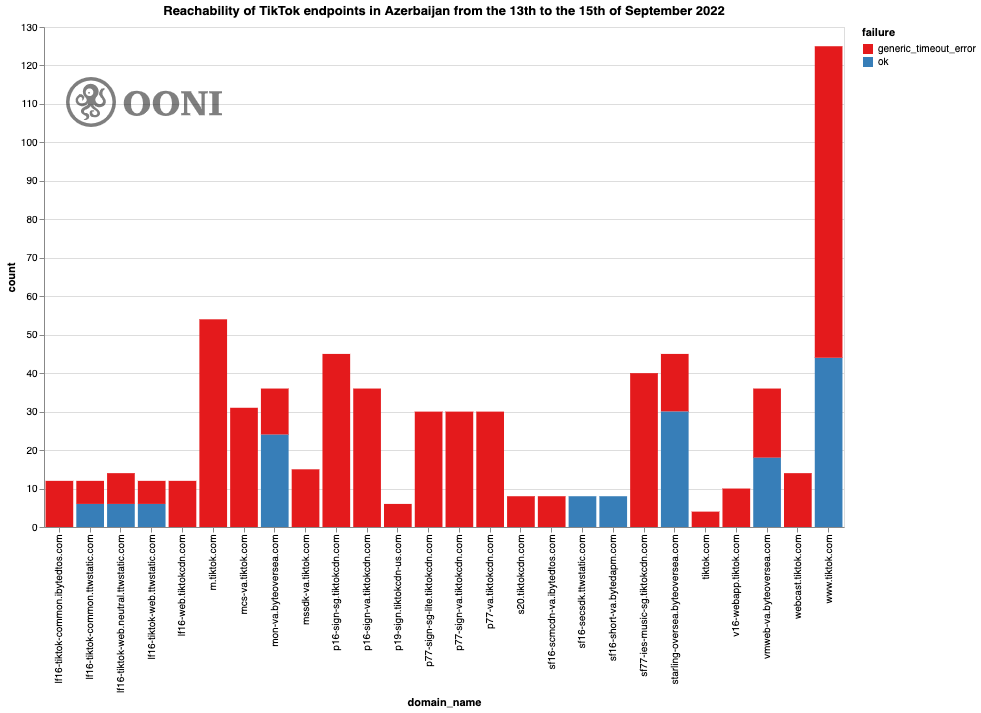
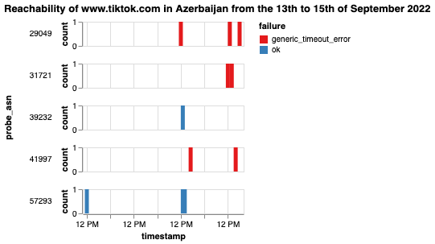
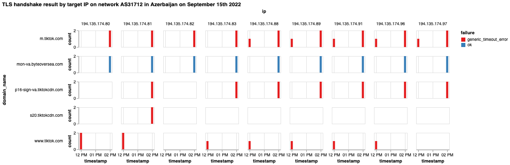
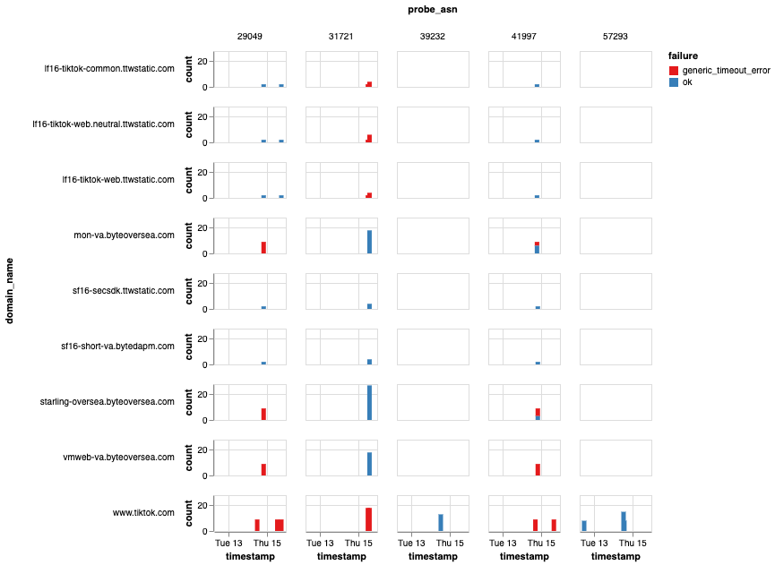
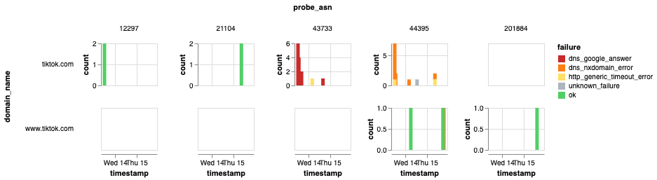
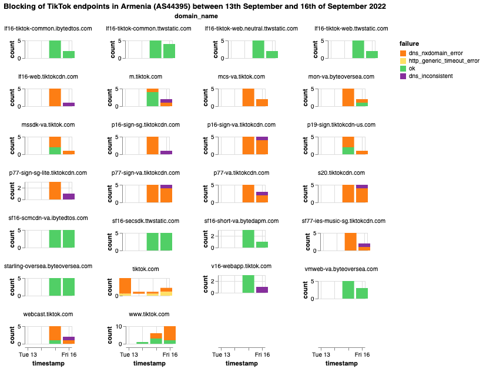

Earlier this week, on 12th September 2022, fighting [erupted](https://www.bbc.com/news/world-europe-62828239) between Azerbaijani and Armenian troops along their border. Over the next few days, community members in Azerbaijan reported that the TikTok app was blocked locally.

We analyzed [OONI network measurement data](https://ooni.org/data) to investigate the block. We found that TikTok has been blocked in both [Azerbaijan](https://explorer.ooni.org/search?since=2022-08-17&until=2022-09-17&failure=false&probe_cc=AZ&test_name=web_connectivity&domain=www.tiktok.com) and [Armenia](https://explorer.ooni.org/search?since=2022-08-17&until=2022-09-17&failure=false&probe_cc=AM&test_name=web_connectivity&domain=tiktok.com) over the last few days.

In this report, we share our technical findings. In both Armenia and Azerbaijan, we found TLS and DNS level interference of TikTok domains and endpoints during the border clashes.



## Background

On 12th September 2022, fighting [erupted](https://www.bbc.com/news/world-europe-62888891) along the Azerbaijan-Armenia border between Azerbaijani and Armenian troops. The next day, Russia brokered a [ceasefire](https://www.bbc.com/news/world-europe-62828239), but it was immediately breached. Another ceasefire was [announced](https://www.aljazeera.com/news/2022/9/15/armenia-azerbaijan-negotiate-another-ceasefire-yerevan) in the evening of 14th September 2022 by the secretary of Armenia’s Security Council. Within 2 days of clashes, [more than 100](https://www.aljazeera.com/news/2022/9/15/azerbaijan-says-71-soldiers-killed-in-armenia-border-clashes) Armenian and Azerbaijani soldiers were killed.

This is the latest fighting [amid on-going clashes](https://globalvoices.org/2022/09/08/azerbaijan-armenia-and-tenuous-prospects-for-peace/) since [the 44-day war](https://www.bbc.com/news/world-europe-54324772) Armenia and Azerbaijan fought in 2020.

In 1994, the Armenian military secured victory over Nagorno-Karabakh and the seven adjacent regions in the aftermath of the first Karabakh war. Since then, Nagorno-Karabakh has been under the control of its [ethnic Armenian population](https://globalvoices.org/2020/12/11/how-will-the-war-in-nagorno-karabakh-change-azerbaijan/) as a [self-declared state](https://globalvoices.org/2020/10/01/international-conflicts-are-also-about-names-the-case-of-nagorno-karabakh/). The two sides often blamed each other for violating the 1994 ceasefire agreement over the years with continued fighting. These clashes culminated in September 2020 during the second Karabakh war, with Azerbaijan [regaining](https://carnegieeurope.eu/2021/02/11/unfinished-business-in-armenia-azerbaijan-conflict-pub-83844) control over the previously occupied seven regions, as well as [one-third of Karabakh](https://carnegieeurope.eu/2021/02/11/unfinished-business-in-armenia-azerbaijan-conflict-pub-83844) itself. A ceasefire agreement signed on 10th November 2020 ended the hostilities temporarily. Despite both sides pledging to make progress towards a final peace deal and a [series of high level meetings](https://globalvoices.org/2022/05/25/armenian-and-azerbaijani-leaders-take-tentative-steps-toward-peace/) taking place since the second war, no significant progress on achieving a final peace treaty has been made. 

During the [2020 Nagorno-Karabakh war](https://www.bbc.com/news/world-europe-54324772), access to several social media platforms was [blocked](https://ooni.org/post/2021-azerbaijan/#blocking-of-social-media-amid-2020-nagorno-karabakh-war) in Azerbaijan. At the time (between September 2020 to November 2020), OONI data collected from Azerbaijan showed that several [social media websites](https://ooni.org/post/2021-azerbaijan/#blocking-of-social-media-websites) (such as `facebook.com` and `twitter.com`) presented signs of blocking, while the testing of [WhatsApp](https://explorer.ooni.org/measurement/20201102T013112Z_whatsapp_AZ_39232_n1_jCcFoDIxyQlMrYtT) and [Telegram](https://explorer.ooni.org/measurement/20201102T183400Z_telegram_AZ_50274_n1_lngut2aTSYVobqHp) presented signs of TLS level interference.

During the latest clashes over the last days, OONI data shows that these social media platforms appear to be accessible in Azerbaijan, but [TikTok started to present signs of blocking](https://explorer.ooni.org/chart/mat?probe_cc=AZ&test_name=web_connectivity&domain=www.tiktok.com&since=2022-08-16&until=2022-09-16&axis_x=measurement_start_day). On 14th September 2022, Azerbaijan’s state security services [announced](https://dtx.gov.az/az/news/1715.html) the temporary suspension of social media platform TikTok. According to the statement, the content circulating on the social media platform was revealing military secrets and forming wrong opinions in society. As a result, the State Security Service decided to temporarily block access to the platform. Similarly, OONI data shows that the testing of TikTok also started to present signs of [blocking in Armenia](https://explorer.ooni.org/chart/mat?probe_cc=AM&test_name=web_connectivity&domain=tiktok.com&since=2022-08-16&until=2022-09-16&axis_x=measurement_start_day) from 13th September 2022 onwards.

## Methods

Since 2012, OONI has developed free and open source software (called [OONI Probe](https://ooni.org/install/)) which is designed to [measure various forms of internet censorship](https://ooni.org/nettest/), including the blocking of websites and apps. Every month, OONI Probe is regularly run by volunteers in [around 170 countries](https://explorer.ooni.org/), and network measurements collected by OONI Probe users are automatically published as [open data in real-time](https://ooni.org/data).

This study involves the analysis of OONI measurements pertaining to the testing of TikTok, collected from local networks in [Azerbaijan](https://explorer.ooni.org/search?since=2022-08-17&until=2022-09-17&failure=false&probe_cc=AZ) and [Armenia](https://explorer.ooni.org/search?since=2022-08-17&until=2022-09-17&failure=false&probe_cc=AM) over the last days. In particular, we analyzed [OONI Web Connectivity measurements](https://explorer.ooni.org/search?since=2022-08-17&until=2022-09-17&failure=false&probe_cc=AZ&test_name=web_connectivity) pertaining to the testing of the TikTok homepage (`https://www.tiktok.com`), as well as several [other web resources that are needed for the TikTok web app and mobile app to function](https://github.com/citizenlab/test-lists/pull/1111) (hereafter referred to as “TikTok endpoints”). We thank a community member who kindly shared with us a list of TikTok endpoints, which were subsequently [added](https://github.com/citizenlab/test-lists/pulls?q=is%3Apr+is%3Aclosed) (to the [lists of URLs](https://ooni.org/support/faq#which-websites-will-i-test-for-censorship-with-ooni-probe) measured by OONI Probe users in [Azerbaijan](https://github.com/citizenlab/test-lists/pull/1111) and [Armenia](https://github.com/citizenlab/test-lists/pull/1112)) for testing. OONI’s [URL prioritization system](https://ooni.org/post/policy-url-prioritization/ooni-policy-url-prioritization.pdf) ensures that once URLs are merged into the [Citizen Lab test lists](https://github.com/citizenlab/test-lists/tree/master/lists), they are immediately prioritized for OONI Probe testing. As a result, measurements from the testing of TikTok endpoints were collected almost immediately from both Armenia and Azerbaijan (supporting this study).

OONI’s [Web Connectivity experiment](https://ooni.org/nettest/web-connectivity/) is designed to measure the accessibility of URLs by performing the following steps:

*   Resolver identification
*   DNS lookup
*   TCP connect to the resolved IP address
*   TLS handshake to the resolved IP addresses
*   HTTP(s) GET request

The above steps are automatically performed from both the local network of the user, and from a control vantage point. If the results from both networks are the same, the tested URL is annotated as `accessible`. If the results differ, the tested URL is annotated as `anomalous`, and the type of [anomaly](https://ooni.org/support/faq#what-do-you-mean-by-anomalies) is further characterized depending on the reason that caused the failure (for example, if the TCP connection fails, the measurement is annotated as a `TCP/IP anomaly`).

Each [Web Connectivity](https://ooni.org/nettest/web-connectivity/) measurement provides further network information (such as information pertaining to TLS handshakes) that helps with evaluating whether an anomalous measurement presents signs of blocking (or is a [false positive](https://ooni.org/support/faq#what-are-false-positives)). Based on our heuristics, we are able to automatically confirm the blocking of websites if a [block page](https://ooni.org/support/glossary#block-page) is served, or if DNS resolution returns an IP known to be associated with censorship (and such fingerprints have been added to our database).

In the cases of Azerbaijan and Armenia, we have never come across block pages, limiting our ability to automatically confirm cases of blocking with confidence. Instead, ISPs in both Azerbaijan and Armenia appear to adopt different censorship techniques (as discussed, for example, in our [previous research](https://ooni.org/post/2021-azerbaijan/) examining blocks in Azerbaijan), requiring more manual analysis of measurements for the confirmation of blocks. This study focused in the case of Azerbaijan, we analyzed network measurement data provided under the [network_events](https://github.com/ooni/spec/blob/master/data-formats/df-008-netevents.md) keys of Web Connectivity measurements, which provided insight on TLS level interference of TikTok endpoints. In the case of Armenia, we analyzed both TLS handshakes and DNS query results. Another limitation to our study is the [limited OONI measurement coverage from Azerbaijan](https://explorer.ooni.org/country/AZ) (in comparison to [Armenia](https://explorer.ooni.org/country/AM) and [other countries](https://explorer.ooni.org/countries)). Generally, the larger the relevant measurement volume, the greater our ability in identifying and confirming blocks.

## Findings

OONI data shows that both [Azerbaijan](https://explorer.ooni.org/search?since=2022-08-17&until=2022-09-17&failure=false&probe_cc=AZ&test_name=web_connectivity&domain=www.tiktok.com) and [Armenia](https://explorer.ooni.org/search?since=2022-08-17&until=2022-09-17&failure=false&probe_cc=AM&test_name=web_connectivity&domain=www.tiktok.com) started blocking access to TikTok right after clashes erupted along their border.

### Blocking of TikTok in Azerbaijan

We analyzed [OONI measurements collected from Azerbaijan](https://explorer.ooni.org/search?since=2022-08-17&until=2022-09-17&failure=false&probe_cc=AZ&test_name=web_connectivity&domain=www.tiktok.com) from 13th-15th September 2022 and noticed that many of them appear to time out when attempting to establish a TLS handshake to the target endpoint.

While many such measurements are annotated (on [OONI Explorer](https://explorer.ooni.org/search?since=2022-08-17&until=2022-09-17&failure=false&probe_cc=AZ&test_name=web_connectivity&domain=www.tiktok.com)) as presenting DNS inconsistency, we were able to exclude that by validating that the returned IPs are able to complete a TLS handshake with a valid certificate for the target domain name. Moreover, when issuing an HTTP request with the appropriate headers, the response payload is consistent with the response from an endpoint served to a user in Europe. By inspecting the response header and server certificate, it seems to be an Akamai cache.

To evaluate the extent to which the blocking is happening and establish if it’s in fact caused by an intentional block, we analyzed the values of the `network_events` keys of [Web Connectivity measurements](https://explorer.ooni.org/search?since=2022-08-17&until=2022-09-17&failure=false&probe_cc=AZ&test_name=web_connectivity&domain=www.tiktok.com). These keys contain very rich information on every read and write operation performed during a TLS handshake.

In the following charts, we consider a single “datapoint” as a single network event transcript (i.e. a TLS handshake operation towards a certain IP, port, server\_name tuple). When grouping the measurements by server_name, we can see that most domains fail quite consistently, yet some of them don’t fail as often as others.



**Chart:** OONI data on the testing of tiktok.com and TikTok endpoints in Azerbaijan between 13th-15th September 2022.

As is evident from the above chart, the testing of `www.tiktok.com` and Tiktok endpoints presented a relatively large volume of anomalies between 13th to 15th September 2022, following the eruption of border clashes on 12th September 2022. It’s worth noting though that while www.[tiktok.com measurements](https://explorer.ooni.org/chart/mat?probe_cc=AZ&test_name=web_connectivity&domain=www.tiktok.com&since=2022-08-17&until=2022-09-17&axis_x=measurement_start_day) (showing signs of blocking) were collected from Azerbaijan from 13th September onwards, TikTok endpoint measurements are only available from 14th September 2022 onwards (when they were [added](https://github.com/citizenlab/test-lists/pull/1111) to the test list for Azerbaijan).

As a result, based on available OONI data, we can only confirm that the blocking of TikTok in Azerbaijan started the latest at the following times, on the following networks:

*   [AS29049 2022-09-14 12:11:10.918957](https://explorer.ooni.org/measurement/20220914T120706Z_webconnectivity_AZ_29049_n1_Cu3koLuoPGns9bSD?input=https%3A%2F%2Fwww.tiktok.com%2F)
*   [AS41997 2022-09-14 17:55:02.886038](https://explorer.ooni.org/measurement/20220914T175409Z_webconnectivity_AZ_41997_n1_Eol1esXIwdj3OzZo?input=https%3A%2F%2Fwww.tiktok.com%2F)
*   [AS31721 2022-09-15 12:40:17.991472](https://explorer.ooni.org/measurement/20220915T123839Z_webconnectivity_AZ_31721_n1_FH1xsyCR6aZEseFP?input=https%3A%2F%2Fwww.tiktok.com%2F)

The OONI Probe testing of `www.tiktok.com` on 5 networks in Azerbaijan between 13th to 15th September 2022 can be further examined through the following chart, which shows that its testing consistently presented `generic_timeout_errors` on at least 3 networks by 15th September 2022.



**Chart:** OONI Probe testing of `www.tiktok.com` on 5 networks in Azerbaijan between 13th-15th September 2022.

In the above cases, we can see that attempts to connect to `www.tiktok.com` failed due to a connection timeout. Upon inspecting [relevant network measurement data](https://explorer.ooni.org/search?since=2022-09-13&until=2022-09-16&failure=false&domain=www.tiktok.com&probe_cc=AZ), we see that this always happened after the first write operation (the one responsible for writing the ClientHello which contains the server_name field (SNI)), which is consistent with the hypothesis that the block is some form of TLS based interference, possibly by looking at the SNI field of the ClientHello message.

The blocking looks quite consistent on a per domain basis, which is compatible with the hypothesis that it’s some sort of SNI-based TLS level block.

To additionally support this claim, we notice that several different domain names resolve to the same IP address. When looking at the TLS reachability of the same IPs on a particular network, but with a different server\_name value, we can see (by reading the chart horizontally) that they are consistently reachable when a specific server_name is provided, as illustrated below.



**Chart:** OONI data on TLS handshake results by target IP on network AS531712 in Azerbaijan on 15th September 2022.

On the other hand, if you read the chart vertically you can see that the same IP is both reachable and unreachable depending on the domain_name value.

This strongly suggests that the block is intentional and a consequence of filtering of those particular domain names.

When looking at the subset of domain names that are not consistently blocked, we can see that they are consistently blocked within the same network, which leads us to believe that there are different filtering policies deployed across networks.



**Chart:** OONI data providing a per-ASN comparison on the testing of `www.tiktok.com` and TikTok endpoint domains in Azerbaijan between 13th-15th September 2022.

In summary, based on the analysis of 681 OONI metrics collected from 5 different networks in Azerbaijan, we conclude that:

*   The main TikTok website (`www.tiktok.com`) and several endpoints essential to its functionality were blocked on at least 3 different networks (`AS29049`, `AS41997`, `AS31721`);
*   On all networks where we identified blocking, it seems to be implemented by means of TLS level interference by dropping packets after noticing a disallowed server_name;
*   ISPs in Azerbaijan block TikTok based on different lists of TikTok endpoint domains, and there is some level of inconsistency.

### Blocking of TikTok in Armenia

OONI data shows the [blocking of TikTok in Armenia](https://explorer.ooni.org/chart/mat?probe_cc=AM&test_name=web_connectivity&domain=tiktok.com&since=2022-08-17&until=2022-09-17&axis_x=measurement_start_day) on 13th September 2022. Out of the 5 networks from which TikTok measurements were collected, we are able to establish that the blocking began on 2 of them on 13th September 2022. Specifically:

*   [AS43733 2022-09-13 12:05:33](https://explorer.ooni.org/measurement/20220913T120506Z_webconnectivity_AM_43733_n1_ejea5bTX30wLekZe?input=https%3A%2F%2Ftiktok.com)
*   [AS44395 2022-09-13 12:03:50](https://explorer.ooni.org/measurement/20220913T120347Z_webconnectivity_AM_44395_n1_dMsbSChpjjLus2T5?input=https%3A%2F%2Ftiktok.com)

The following chart shares OONI data on the testing of `www.tiktok.com` and `tiktok.com` from 5 networks in Armenia between 13th-15th September 2022.



**Chart:** OONI data on the testing of `tiktok.com` and `www.tiktok.com` on 5 networks in Armenia between 13th-15th September 2022.

As is evident from the above charts, these ISPs in Armenia seem to employ a mix of different techniques to implement the blocking of TikTok. In the case of Ucom (AS44395), they appear to mostly return an NXDOMAIN error when the TikTok domain is queried.

In the case of MTS Armenia (AS43733), it’s interesting to note that upon querying the `tiktok.com` domain, the IP address `172.217.17.228` is [returned](https://explorer.ooni.org/measurement/20220913T122142Z_webconnectivity_AM_43733_n1_snPCpNoLYDm79tSw?input=https%3A%2F%2Ftiktok.com), which is associated with `www.google.com`. It’s also worth noting that the TLS handshake timed out, which is not consistent with the behavior of the real server, which may indicate that they implement an additional TLS layer block on top of the DNS level interference.

It’s also interesting to note that the nameserver for MTS Armenia allows us to do a zone transfer for `tiktok.com` and through that we are able to see the tainted google IP A record:

```
$ dig @ns.mts.am tiktok.com axfr
; <<>> DiG 9.16.22-Debian <<>> @ns.mts.am tiktok.com axfr
; (1 server found)
;; global options: +cmd
tiktok.com.                1800        IN        SOA        ns2.mts.am. ns.mts.am. 2020101600 3600 600 1296000 3600
tiktok.com.                1800        IN        NS        ns2.mts.am.
tiktok.com.                1800        IN        NS        ns.mts.am.
tiktok.com.                1800        IN        A        172.217.17.228
tiktok.com.                1800        IN        SOA        ns2.mts.am. ns.mts.am. 2020101600 3600 600 1296000 3600
;; Query time: 95 msec
;; SERVER: 217.76.1.85#53(217.76.1.85)
;; WHEN: Thu Sep 15 23:54:58 CEST 2022
;; XFR size: 5 records (messages 1, bytes 196)
```

No other [tested TikTok endpoints](https://github.com/citizenlab/test-lists/pull/1112/files) allow zone transfers from the MTS nameserver, nor any other domain which we tested. This might be due to the fact that to implement the block the zone for tiktok.com was set up quickly and they forgot to disable zone transfers on it.

By focusing our attention on the Ucom network (AS44395), we can see that not all TikTok endpoints appear to be blocked.



**Chart:** OONI data on the testing of TikTok endpoints on Ucom (AS44395) in Azerbaijan between 13th-16th September 2022.

Interestingly, starting from today (16th September 2022), the DNS response appears to be inconsistent and returns an IP address that has an expired letsencrypt certificate. When accessed, it will direct to:

`http://it-nxd-domain.com/?terms=Google%20Server%20Cloud,Free%20Host%20Server,%20Create%20an%20Ecommerce%20Website%20for%20Free,Email%20Server%20Hosting%20Services&subid1=parrz.com`.

```
$ openssl s_client -connect 95.216.36.80:443
CONNECTED(00000003)
Can't use SSL_get_servername
depth=1 C = US, O = Let's Encrypt, CN = R3
verify error:num=20:unable to get local issuer certificate
verify return:1
depth=0 CN = it.domain.name
verify error:num=10:certificate has expired
notAfter=Jun 12 15:18:58 2021 GMT
verify return:1
depth=0 CN = it.domain.name
notAfter=Jun 12 15:18:58 2021 GMT
verify return:1
---
Certificate chain
 0 s:CN = it.domain.name
   i:C = US, O = Let's Encrypt, CN = R3
   a:PKEY: rsaEncryption, 2048 (bit); sigalg: RSA-SHA256
   v:NotBefore: Mar 14 15:18:58 2021 GMT; NotAfter: Jun 12 15:18:58 2021 GMT
 1 s:C = US, O = Let's Encrypt, CN = R3
   i:O = Digital Signature Trust Co., CN = DST Root CA X3
   a:PKEY: rsaEncryption, 2048 (bit); sigalg: RSA-SHA256
   v:NotBefore: Oct  7 19:21:40 2020 GMT; NotAfter: Sep 29 19:21:40 2021 GMT
---
```

In all other cases of blocking, we notice that the HTTPS request times out, which leads us to believe that they might be using some form of TLS level interference.

To summarize:

*   Armenia has been blocking TikTok since at least 13th September 2022 on at least two networks (AS44395, AS43733);
*   On most networks, TikTok interference was observed at the DNS level by returning an NXDOMAIN error, an IP address associated with `www.google.com`, or a set of unrelated IP addresses which contain an expired certificate for the server_name it.domain.name;
*   Not all tested networks in Armenia implemented the TikTok block and censorship techniques varied from network to network;
*   Several endpoints used by the TikTok app and website are also blocked on at least one network in Armenia.

## Conclusion

Social media censorship often appears to be weaponized during conflicts and other moments of political turmoil around the world. By controlling the flow of information on social media platforms, governments may attempt to control the narrative surrounding political events. Over the last 6 years, OONI data has shown that [access to major social media platforms is commonly blocked](https://ooni.org/documents/2022-ooni-submission-ohchr-report-internet-shutdowns.pdf) during elections and protests around the world. Earlier this year, Russia [ramped up its censorship](https://ooni.org/post/2022-russia-blocks-amid-ru-ua-conflict/) following the war in Ukraine.

Azerbaijan previously [blocked access to social media platforms during the 2020 Nagorno-Karabakh war](https://ooni.org/post/2021-azerbaijan/#blocking-of-social-media-amid-2020-nagorno-karabakh-war). In similar vein, both [Azerbaijan](https://explorer.ooni.org/search?since=2022-08-17&until=2022-09-17&failure=false&probe_cc=AZ&test_name=web_connectivity&domain=www.tiktok.com) and [Armenia](https://explorer.ooni.org/search?since=2022-08-17&until=2022-09-17&failure=false&probe_cc=AM&test_name=web_connectivity&domain=tiktok.com) blocked access to TikTok during the border clashes over the last days. OONI data shows that Azerbaijan blocked TikTok by means of TLS level interference, while Armenia implemented both DNS level blocks and TLS level interference.

You can continue to monitor the reachability of TikTok (and other platforms) in Armenia and Azerbaijan through [OONI data](https://explorer.ooni.org/chart/mat).

## Acknowledgements

We thank [OONI Probe](https://ooni.org/install/) users in Armenia and Azerbaijan who contributed measurements, supporting this study.
