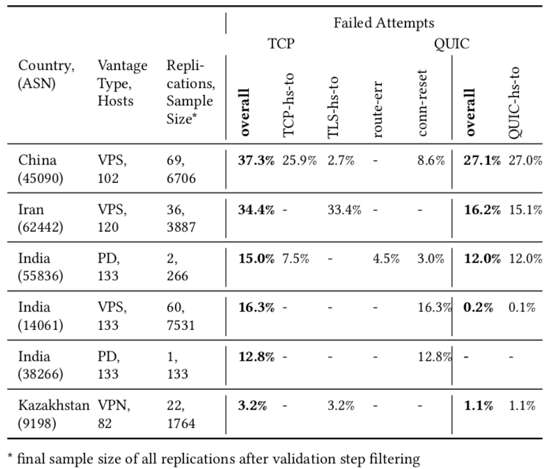
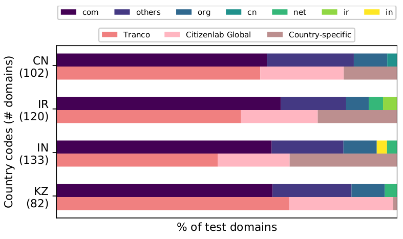
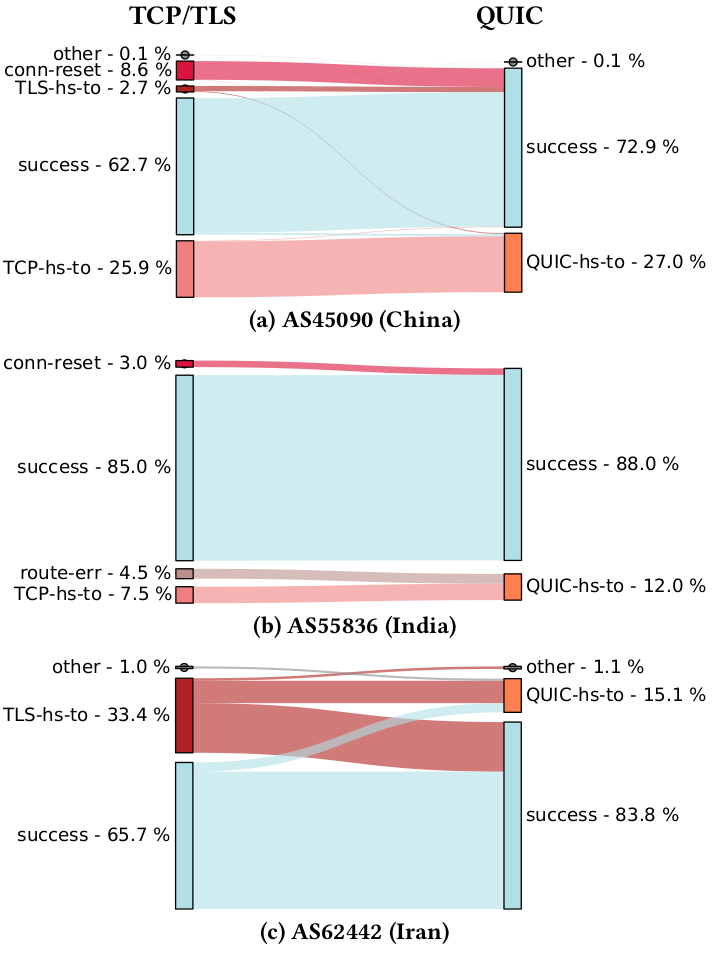

Last year, QUIC emerged as a new internet protocol for creating reliable connections and encrypting communications between clients over the new HTTP/3 protocol. Observing the emergence and growing deployment of HTTP/3, we want to enable [OONI Probe](https://ooni.org/install/) to measure HTTP/3 censorship and monitor how censors respond and adapt to technical innovation.  

We therefore added HTTP/3 support (in early 2021) into [OONI Probe](https://ooni.org/install/) (through our [urlgetter](https://github.com/ooni/spec/blob/master/nettests/ts-027-urlgetter.md) research tool) to conduct measurements in **China, Iran, India and Kazakhstan to investigate the state of HTTP/3 censorship** in these countries.  

We discovered that the deployment of HTTP/3 censorship varies significantly between the observed countries and networks. While some censors do not filter HTTP/3 traffic at all and some collaterally block HTTP/3 hosts, we uncovered HTTP/3-targeting censorship in Iran.

We collaborated with Kathrin Elmenhorst, who has described and analysed the measurements thoroughly in her Bachelor thesis. We have summarized the results in a short research paper and submitted it to [AMC Internet Measurement Conference](https://dl.acm.org/doi/proceedings/10.1145/3487552). Our paper was published and [presented by Kathrin at the conference](https://www.youtube.com/watch?v=P_kFjBDhbmM).  

**[READ RESEARCH PAPER](https://dl.acm.org/doi/abs/10.1145/3487552.3487836)**  

In this post, we summarize the key findings of our measurements and provide a brief introduction to QUIC and HTTP/3.  

* [A quic(k) introduction to QUIC and HTTP3](#intro)  
    
* [Overview](#overview)  
    
* [Kazakhstan and India: HTTP/3 traffic passes the censorship filter.](#no-blocking)  
    
* [China and India: Collateral blocking of HTTP/3 hosts.](#ip-blocking)  
    
* [Iran: HTTP/3-targeting blocking of UDP endpoints.](#udp-blocking)  
    
* [Conclusion](#conclusion)  
    
* [Appendix](#appendix)  

# A quic(k) introduction to QUIC and HTTP/3  

Internet _protocols_ define rules of how computers communicate on the web. HTTP is the internet protocol that carries the great majority of web traffic.  

Recently, we have seen the next major version of HTTP emerge: HTTP/3. Unlike prior versions of HTTP that use TCP for transport, HTTP/3 uses the new internet protocol QUIC which was standardized last year ([RFC 9000](https://www.rfc-editor.org/rfc/rfc9000.html)).  

QUIC unites transport connectivity and encryption. This means that QUIC creates reliable connections (like [TCP](https://ooni.org/support/glossary/#tcp)) and allows encrypted communication (with [TLS](https://ooni.org/support/glossary/#tls)) between clients.  

Unlike TCP which was developed in the 1980s, QUIC was designed to provide built-in, always-on encryption. QUIC runs on top of UDP and reduces the overhead for connection establishment.  

HTTP/3 is the next major version of the [Hypertext Transfer Protocol (HTTP)](https://ooni.org/support/glossary/#http) which exclusively uses QUIC for transport. Currently, HTTP/3 is used by [24% of all websites](https://w3techs.com/technologies/details/ce-http3). This rather large share can be explained by the fact that huge internet companies have deployed HTTP/3 for their services and browsers early on. Since QUIC was initially designed by Google, HTTP/3 is supported by the Chrome browser and Google-owned services such as YouTube and Blogger. Facebook and Cloudflare have their own QUIC implementations and use HTTP/3 on their servers.  

  

# Overview  

For the HTTP/3 measurements we used vantage points in several Autonomous Systems in China, India, Iran and Kazakhstan:  

*   China: VPS in AS45090  
    
*   Iran: VPS in AS62442, device in AS48147  
    
*   India: VPS in AS14061, device in AS55836  
    
*   Kazakhstan: VPN in AS9198  
    

We used the OONI Probe research client [miniooni](https://github.com/ooni/probe-cli#miniooni) and ran the [urlgetter experiment](https://github.com/ooni/spec/blob/master/nettests/ts-027-urlgetter.md) to collect the measurements. Urlgetter takes a list of urls as input, so we collected URLs from the [test lists provided by the Citizen Lab](https://github.com/citizenlab/test-lists/), as well as the [Tranco list](https://tranco-list.eu/) of popular websites.  

We filtered the lists for HTTP/3 support and ended up with 5-10% of the country-specific test-URLs (keep in mind that HTTP/3 deployment was at a much lower rate at that time). We also removed websites with critical content (e.g. pornography or human rights issues) from the test set to decrease the potential risk for our partners running the measurements. In order to disregard DNS censorship, we pre-resolved the IP addresses in an uncensored network.  

We measured the HTTP/3 test-URLs repeatedly over the span of a months to increase confidence in the results and make up for potential temporary network or host failures. For each HTTP/3 measurement, we ran the same measurement over [HTTPS](https://ooni.org/support/glossary/#https) (TCP with TLS).  

When analyzing the results, we determined the availability of a website and classified the network failure, if one had occured.  

{{}}

The overview table above depicts the percentage and types of network failures when trying to reach test websites from 6 vantage points. As shown, HTTP/3 traffic was less censored than HTTPS at all vantage points. While there was no indication of any HTTP/3 filtering in some networks, others have shown a certain degree of HTTP/3 impairment, e.g. AS45090 in China or AS62442 in Iran. The failure type abbreviations (e.g. TCP-hs-to) are explained in the [Appendix](#appendixB).  

  

# Kazakhstan and India: HTTP/3 traffic passes the censorship filter.  

There was no indication of any HTTP/3 censorship at the vantage points in AS9198 (Kazakhstan), AS14061 and AS38266 (India). This specifically means that there were hosts that were blocked over HTTPS for the majority of measurements, but always available over HTTP/3.  

This finding indicates that censors in the respective networks have not implemented any HTTP/3 blocking rules yet. Due to the novelty of the protocol and the still rather low deployment in comparison to HTTPS, it is not surprising that censors are not able or willing to invest resources in blocking HTTP/3. This is especially true in countries where Internet Service Providers are responsible to implement internet censorship (based on laws and regulations), as ISPs might not have the same resources available as, for example, state-organized censorship systems.  

Yet, with its growing significance and deployment, the efforts to block QUIC will rise. Thus, it is important to continuously monitor the availability of HTTP/3 hosts in these networks.  

# China and India: Collateral blocking of HTTP/3 hosts.  

Our measurements at vantage points in AS45090 in China and AS55836 in India have shown significant impairments of HTTP/3 traffic for certain websites. In AS45090 we have found 27% of HTTP/3 measurements unsuccessful, while HTTPS measurements failed in 37% of cases. Similarly, around 12% of HTTP/3 and 15% of HTTPS requests failed in the network of AS55836 in India.  

By examining the timing of interference as well as the correlation between corresponding HTTPS and HTTP/3 measurements, we came to the conclusion that there is no HTTP/3-specific blocking implemented in those networks. Instead, there is evidence to assume that certain HTTP/3 endpoints are unreachable due to the blocklisting of IP addresses.  

When an IP address is blocklisted by a censor, all traffic to this host will be blocked regardless of the overlying protocols. Thus, HTTP/3 traffic and HTTPS traffic to these IP endpoints is affected in the same way.  

# Iran: HTTP/3-targeting blocking of UDP endpoints.  

When examining the measurements collected from AS62442 in Iran we discovered something unexpected: While there were less failures when using HTTP/3 as supposed to HTTPS, the websites blocked over HTTP/3 were not a subset of the websites blocked over HTTPS. This means that there were websites reachable over HTTPS, but blocked when using HTTP/3.  

We found this observation unexpected because there is no apparent reason why a website should _only_ be blocked using HTTP/3, as HTTPS is the more widely used protocol.  

As a follow-up experiment, we re-tried the unreachable hosts again, but this time we set the SNI (Server Name Indication) field to an allowed domain name. With this modification, all HTTPS requests passed the firewall, indicating that HTTPS traffic was filtered based on the SNI. However, the HTTP/3 endpoints were still unreachable, i.e. the censorship mechanism was triggered by something _other_ than the SNI.  

Clearly, there is a different censorship method used for HTTPS and HTTP/3 traffic respectively which explains the inconsistent blocking and the different effect of the SNI.  

We propose that the HTTP/3 filter is applied only to UDP traffic and identifies forbidden websites based on the IP address. In the paper, we have used the term "UDP endpoint blocking" to describe this method.  

# Conclusion  

We have seen less HTTP/3 blocking than HTTPS blocking at the vantage points in China, India, Iran and Kazakhstan. At the vantage point in Kazakhstan and in two networks in India, HTTP/3 traffic remained entirely unfiltered. In China (AS45090) and India (AS55836), we observed HTTP/3 impairment due to IP-blocklisting. In Iran (AS62442), we identified the use of a blocking method which targets HTTP/3 traffic differently than HTTPS traffic. We assume that it is in fact a UDP endpoint filter.  

# Appendix  

## A Input composition

_Figure 1: Distribution of top-level domains (first horizontal bar) and sources (second horizontal bar) within each country-specific host list._  

{{}}

Figure 1 shows the composition of our country-specific input lists. The upper bar depicts the ratios of top-level domains. As you can see, there is a strong predominance of .com domains over local top-level domains. This is due to the fact that HTTP/3 was mostly deployed by large internet companies like Google, Facebook and Cloudflare that hold international domains. The lower bar shows which source lists we used to populate the input. Tranco is a research-oriented ranking of worldwide top sites. The [lists](https://github.com/citizenlab/test-lists/tree/master/lists) provided by the Citizen Lab include websites with global and local relevance in regards to censorship.  

  

## B Abbreviations for failure types
|  |  |
|---|---|
|_TCP-hs-to_  |TCP handshake timeout  |
|_TLS-hs-to_  |TLS handshake timeout   |
|_QUIC-hs-to_ |QUIC handshake timeout |
|_conn-reset_ |Connection reset during TLS handshake|
|_route-err_  |IP routing error  |
  

## C Comparing HTTPS and HTTP/3 measurements  

_Figure 2: Correlation of HTTPS and HTTP/3 request results in AS45090, AS55836, and AS62442._  

{{  }}

Figure 2 shows the correlation between HTTPS and HTTP/3 requests in specific networks in China, India and Iran.  

The plots show the distribution of result types for both protocols. For example: 65.7% of HTTPS requests in AS62442 passed the firewall and 33.4% ended with a TLS handshake timeout (_TLS-hs-to_).  

You can also use the plots to compare corresponding HTTPS and HTTP/3 results by reading them, for example, like this: In AS45090, all websites that were unavailable over HTTPS due to connection reset failures (_conn-reset_) were successful when using HTTP/3.