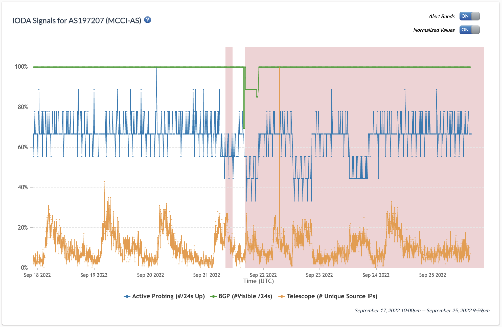
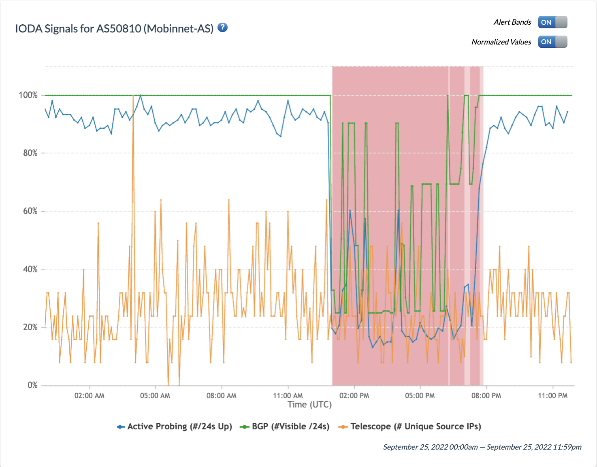
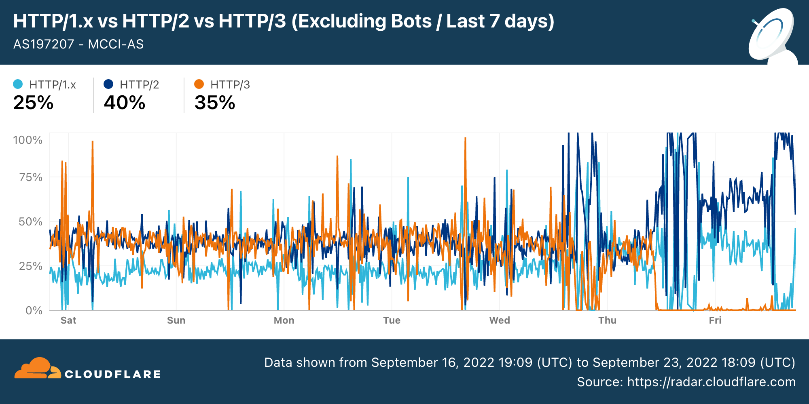

Protests [erupted](https://www.theguardian.com/world/2022/sep/17/iran-protests-death-kurdish-woman-mahsaa-amini-morality-police) in Iran over the last week following the death of Mahsa Amini, a 22-year-old Kurdish woman who was reportedly beaten to death by Iran’s morality police for allegedly violating strict hijab rules. Amid the [ongoing protests](https://www.bbc.com/news/world-middle-east-62994003), which have [reportedly](https://iranhr.net/fa/articles/5496/) resulted in at least 31 civilian deaths, Iranian authorities [cracked down on the internet](https://www.theguardian.com/world/2022/sep/22/iran-blocks-capitals-internet-access-as-amini-protests-grow) in an attempt to curb dissent.

Over the past week, Iran experienced [severe mobile network outages](https://ioda.inetintel.cc.gatech.edu/country/IR?from=1663279200&until=1664143140), in addition to increased levels of internet censorship. In this report, we share [OONI network measurement findings from Iran](https://explorer.ooni.org/search?since=2022-08-22&until=2022-09-25&probe_cc=IR&test_name=web_connectivity&failure=false) on the blocking of WhatsApp, Instagram, Linkedin, Skype, Google Play Store, Apple App Store, and encrypted DNS (DNS over HTTPS). We also share [IODA](https://ioda.inetintel.cc.gatech.edu/country/IR?from=1663279200&until=1664143140) and [Cloudflare Radar](https://radar.cloudflare.com/asn/44244?date_filter=last_7_days) data on mobile network outages over the last few days.



## Key Findings

OONI data shows new blocking events in Iran amid ongoing protests:

* **Increased blocking of encrypted DNS.** As of 20th September 2022, OONI data shows that ISPs in Iran started [blocking domain-based DNS over HTTPS (DoH) endpoints](https://explorer.ooni.org/search?since=2022-09-22&until=2022-09-23&probe_cc=IR&test_name=web_connectivity&domain=dns.google&failure=false) by means of DNS based tampering (returning bogons), in addition to implementing [TLS level interference](https://explorer.ooni.org/search?since=2022-09-07&until=2022-09-08&probe_cc=IR&test_name=web_connectivity&domain=dns.google&failure=false). Previously reachable DoH endpoints (such as `cloudflare-dns.com`) are now [blocked](https://explorer.ooni.org/search?since=2022-09-16&until=2022-09-23&probe_cc=IR&test_name=web_connectivity&domain=cloudflare-dns.com&failure=false).
* **Blocking of WhatsApp and Instagram.** As of 21st September 2022, OONI data shows that many ISPs in Iran started [blocking access to WhatsApp endpoints](https://explorer.ooni.org/chart/mat?probe_cc=IR&test_name=whatsapp&since=2022-08-24&until=2022-09-24&axis_x=measurement_start_day), [web.whatsapp.com](https://explorer.ooni.org/chart/mat?probe_cc=IR&test_name=web_connectivity&domain=web.whatsapp.com&since=2022-08-25&until=2022-09-25&axis_x=measurement_start_day), and [www.instagram.com](https://explorer.ooni.org/chart/mat?probe_cc=IR&test_name=web_connectivity&domain=www.instagram.com&since=2022-08-25&until=2022-09-25&axis_x=measurement_start_day). We mostly observe TCP/IP blocking, with additional DNS and TLS blocking.
* **Blocking of Google Play Store and Apple App Store.** As of 22nd September 2022, OONI data shows that multiple ISPs in Iran started [blocking access to Google Play Store](https://explorer.ooni.org/search?since=2022-09-22&until=2022-09-23&probe_cc=IR&test_name=web_connectivity&domain=play.googleapis.com&failure=false) and [Apple App Store](https://explorer.ooni.org/search?since=2022-09-22&until=2022-09-23&probe_cc=IR&test_name=web_connectivity&domain=iosapps.itunes.apple.com&failure=false) domains. 
* **Blocking of Skype and Linkedin.** As of 23rd September 2022, OONI data shows the [blocking of Skype](https://explorer.ooni.org/chart/mat?probe_cc=IR&test_name=web_connectivity&domain=www.skype.com&since=2022-08-25&until=2022-09-25&axis_x=measurement_start_day), while the [blocking of Linkedin is automatically confirmed on at least 10 networks](https://explorer.ooni.org/chart/mat?probe_cc=IR&test_name=web_connectivity&domain=www.linkedin.com&since=2022-08-24&until=2022-09-25&axis_x=measurement_start_day&axis_y=probe_asn) in Iran. 

In addition to the above blocks (and many other long-term blocks), Iran experienced multiple severe [outages affecting mobile networks](https://github.com/net4people/bbs/issues/125) over the past week, which are visible in the [IODA](https://ioda.inetintel.cc.gatech.edu/country/IR?from=1663279200&until=1664143140), [Cloudflare Radar](https://radar.cloudflare.com/asn/44244?date_filter=last_7_days) and [Kentik](https://twitter.com/DougMadory/status/1573309958791241728) datasets. 

OONI data suggests that [Psiphon](https://explorer.ooni.org/chart/mat?probe_cc=IR&test_name=psiphon&since=2022-08-24&until=2022-09-24&axis_x=measurement_start_day) and [Tor Snowflake](https://explorer.ooni.org/chart/mat?probe_cc=IR&test_name=torsf&since=2022-08-24&until=2022-09-24&axis_x=measurement_start_day) work in Iran, and can potentially be used for [censorship circumvention](https://forum.torproject.net/t/iran-circumventing-censorship-with-tor/4590). While our tests determine that it’s possible to bootstrap these tools from Iran and use them to fetch a small webpage, we have no data regarding whether they are effective in providing circumvention for long periods of time.

## Background

Last week, on 13th September 2022, Mahsa Amini, a 22-year-old Kurdish woman from the north-western city of Saqqez, visited Tehran with her family when she was [arrested](https://www.bbc.com/news/world-middle-east-62994003) by morality police officers, who accused her of violating Iran’s strict hijab rules. Her family was told that she would be released after a “re-education session”, but she died in custody three days later. 

Witnesses [reported](https://www.theguardian.com/world/2022/sep/17/iran-protests-death-kurdish-woman-mahsaa-amini-morality-police) that Amini was beaten in the detention van, but the police [deny](https://www.bbc.com/news/world-middle-east-62994003) this allegation, maintaining that she suffered “sudden heart failure”. Her family said that she was fit and healthy, and her father [reported](https://edition.cnn.com/2022/09/22/middleeast/iran-protests-mahsa-amini-father-internet-blackout-intl-hnk/index.html) that the authorities lied about his daughter’s death.

Amini’s death sparked [widespread protests](https://www.nytimes.com/2022/09/22/world/middleeast/iran-protests.html) in multiple cities in Iran. The ongoing protests have been [described](https://www.bbc.com/news/world-middle-east-62994003) as the most serious challenge to the Islamic leadership of Iran in recent years. Authorities have cracked down on the protests, which have [reportedly](https://iranhr.net/fa/articles/5496/) resulted in at least 31 civilian deaths, including a 16-year-old boy who was [shot dead](https://www.bbc.com/news/world-middle-east-62986057) when security forces opened fire at protesters. 

As the protests intensified, Iranian authorities [cracked down on internet access](https://www.theguardian.com/world/2022/sep/22/iran-blocks-capitals-internet-access-as-amini-protests-grow) in an attempt to curb dissent. Over the past week, multiple [outages affecting mobile networks](https://github.com/net4people/bbs/issues/125) in Iran were [reported](https://twitter.com/maasalan/status/1571914473753149442), which are also visible in the [IODA](https://ioda.inetintel.cc.gatech.edu/country/IR?from=1663279200&until=1663970399), [Cloudflare Radar](https://radar.cloudflare.com/asn/44244?date_filter=last_7_days) and [Kentik](https://twitter.com/DougMadory/status/1573309958791241728) datasets. Beyond mobile network outages, Iran also ramped up its internet censorship. We [reported](https://twitter.com/OpenObservatory/status/1572548266587475968) that as of 20th September 2022, OONI data started to show that Iran intensified the blocking of encrypted DNS services. On 21st September 2022, OONI data started to show the blocking of [WhatsApp](https://explorer.ooni.org/chart/mat?probe_cc=IR&test_name=whatsapp&since=2022-08-24&until=2022-09-24&axis_x=measurement_start_day) and [Instagram](https://explorer.ooni.org/chart/mat?probe_cc=IR&test_name=web_connectivity&domain=www.instagram.com&since=2022-08-24&until=2022-09-24&axis_x=measurement_start_day) in Iran as well (we dive into these – and other – cases in the Findings section below). 

The latest censorship events follow a pattern where Iran restricts internet access during protests and unrest. Iran previously experienced a [nation-wide internet blackout](https://ooni.org/post/2019-iran-internet-blackout/) during the [November 2019 protests](https://www.aljazeera.com/news/2019/11/20/irans-protests-all-you-need-to-know-in-600-words/). During the blackout, most Iranians were barred from connecting to the global Internet, but they still had [access to Iran’s national intranet](https://ooni.org/post/2019-iran-internet-blackout/#irans-intranet) (the domestic network hosting Iranian websites and services). Amid major [anti-government protests](https://www.theguardian.com/world/2018/jan/02/iran-protests-how-did-they-start-and-where-are-they-heading) between late December 2017 to early January 2018, Iran [blocked](https://ooni.org/post/2018-iran-protests/) access to Telegram, Instagram, and Facebook Messenger. 

While Iran has intensified its internet restrictions in recent days, it’s important to highlight that major social media platforms are not only blocked during protests. Iran has [pervasive levels of internet censorship](https://ooni.org/post/iran-internet-censorship/), as many different types of websites (including [human rights](https://explorer.ooni.org/chart/mat?probe_cc=IR&test_name=web_connectivity&category_code=HUMR&since=2022-08-25&until=2022-09-25&axis_x=measurement_start_day) and [news media](https://explorer.ooni.org/chart/mat?probe_cc=IR&test_name=web_connectivity&category_code=NEWS&since=2022-08-25&until=2022-09-25&axis_x=measurement_start_day) websites) and apps (such as [Telegram](https://explorer.ooni.org/chart/mat?probe_cc=IR&test_name=telegram&since=2022-01-25&until=2022-09-25&axis_x=measurement_start_day)) have been blocked in the country for years. In January 2021, Iran also started [blocking access to the Signal Private Messenger app](https://ooni.org/post/2021-how-signal-private-messenger-blocked-around-the-world/#iran), while in 2020 we found that Iran was [blocking DNS over TLS (DoT)](https://ooni.org/post/2020-iran-dot/). In addition to government mandated internet censorship implemented by Iranian Internet Service Providers (ISPs), Iranians have also [experienced server-side blocking](https://censoredplanet.org/assets/403forbidden.pdf) as a result of U.S sanctions. But notably, on 23rd September 2022, the U.S Treasury [issued](https://home.treasury.gov/news/press-releases/jy0974) an [Iran General License D-2](https://home.treasury.gov/system/files/126/iran_gld2.pdf) to broaden the scope of software and services that U.S. companies are allowed to offer to Iranian users.  \

In the following sections of this report, we share [OONI data](https://ooni.org/data) on new blocks that emerged in Iran over the past week amid the ongoing protests.

## Methods

Since 2012, OONI has developed free and open source software (called [OONI Probe](https://ooni.org/install/)) which is designed to [measure various forms of internet censorship](https://ooni.org/nettest/), including the blocking of websites and apps. Every month, OONI Probe is regularly run by volunteers in [around 170 countries](https://explorer.ooni.org/) (including [Iran](https://explorer.ooni.org/country/IR)), and network measurements collected by OONI Probe users are automatically published as [open data in real-time](https://ooni.org/data).

As part of this study, we looked at measurements collected from OONI’s [Web Connectivity](https://ooni.org/nettest/web-connectivity/) and [WhatsApp](https://ooni.org/nettest/whatsapp/) tests in Iran over the past week (from 16th September 2022 onwards). While OONI Probe includes a variety of different [network measurement experiments](https://github.com/ooni/spec/tree/master/nettests), we narrowed our focus to these two specific tests because they measure the accessibility of services that were reportedly blocked in recent days (other apps, like [Signal](https://explorer.ooni.org/chart/mat?probe_cc=IR&test_name=signal&since=2021-09-25&until=2022-09-25&axis_x=measurement_start_day) and [Facebook Messenger](https://explorer.ooni.org/chart/mat?probe_cc=IR&test_name=facebook_messenger&since=2021-09-25&until=2022-09-25&axis_x=measurement_start_day), had already been blocked over the past year). 

OONI’s [WhatsApp test](https://ooni.org/nettest/whatsapp/) is designed to measure the reachability of both WhatsApp’s app and the WhatsApp web version (`web.whatsapp.com`) within a tested network. Specifically, the test attempts to perform an HTTP GET request, TCP connection and DNS lookup to WhatsApp’s endpoints, registration service and web version over the vantage point of the user. Based on our methodology, we automatically annotate WhatsApp measurements as “successful” if the test succeeds in performing these steps. 

If, however, any of the following occur, WhatsApp measurements are automatically annotated as “[anomalies](https://ooni.org/support/faq#what-do-you-mean-by-anomalies)”:

* TCP connections to WhatsApp’s endpoints, registration service, or web.whatsapp.com fail;
* DNS lookups resolve to IP addresses that are not allocated to WhatsApp;
* HTTP requests to WhatsApp’s registration service or `web.whatsapp.com` do not send back a consistent response to OONI’s servers.

[Anomalous measurements](https://ooni.org/support/faq#what-do-you-mean-by-anomalies) may be indicative of blocking, but [false positives](https://ooni.org/support/faq#what-are-false-positives) can occur. We therefore consider that the likelihood of blocking is greater if the overall volume of anomalous WhatsApp measurements is high in comparison to the overall WhatsApp measurement count (compared on an ASN level within the same date range). We further disaggregate based on the reasons that caused the anomaly (e.g. TCP connection failures towards a set of WhatsApp endpoints) and if they are consistent, they provide a stronger signal of potential blocking.

OONI’s [Web Connectivity test](https://ooni.org/nettest/web-connectivity/), on the other hand, is designed to measure the accessibility of URLs by performing the following steps:

* Resolver identification
* DNS lookup
* TCP connect to the resolved IP addresses
* TLS handshake to the resolved IP addresses
* HTTP(s) GET request following redirects

The above steps are automatically performed from both the local network of the user, and from a control vantage point. If the results from both networks are the same, the tested URL is annotated as accessible. If the results differ, the tested URL is annotated as [anomalous](https://ooni.org/support/faq#what-do-you-mean-by-anomalies), and the type of anomaly is further characterized depending on the reason that caused the failure (for example, if the TCP connection fails, the measurement is annotated as a TCP/IP anomaly).

Each [Web Connectivity](https://ooni.org/nettest/web-connectivity/) measurement provides further network information (such as information pertaining to TLS handshakes) that helps with evaluating whether an anomalous measurement presents signs of blocking (or is a [false positive](https://ooni.org/support/faq#what-are-false-positives)). Based on our heuristics, we are able to automatically confirm the blocking of websites if a [block page](https://ooni.org/support/glossary#block-page) is served, or if DNS resolution returns an IP known to be associated with censorship (and such fingerprints have been added to our database). 

Over the past years, Iranian ISPs have blocked websites by serving block pages and by returning IPs associated with censorship (which, for example, used to host block pages). By adding such fingerprints to our database, we have been able to [automatically confirm the blocking of numerous websites in Iran](https://explorer.ooni.org/search?since=2022-08-25&until=2022-09-25&failure=false&probe_cc=IR&only=confirmed). Moreover, the overall OONI measurement coverage in Iran is relatively [high](https://explorer.ooni.org/country/IR) (in [comparison](https://explorer.ooni.org/countries) to many other countries), increasing our confidence in our findings.

## Findings

As of 20th September 2022 (amid [protests](https://www.bbc.com/news/world-middle-east-62986057) following the death of Mahsa Amini), Iran intensified the [blocking of encrypted DNS (DoH)](https://explorer.ooni.org/chart/mat?probe_cc=IR&test_name=web_connectivity&domain=dns.google&since=2022-08-25&until=2022-09-25&axis_x=measurement_start_day) services. We previously (in 2020) reported on the blocking of [encrypted DNS (DoT)](https://ooni.org/post/2020-iran-dot/) services in Iran, but at the time, we found that they were blocked during the TLS handshake by means of destination-endpoint or SNI based filtering. Now, Iranian ISPs appear to [implement the block by means of DNS](https://explorer.ooni.org/measurement/20220924T111914Z_webconnectivity_IR_44244_n1_QXdrKsNisTkYTipo?input=https%3A%2F%2Fdns.google%2F) as well. 

On 21st September 2022, OONI data started to show the [blocking of WhatsApp](https://explorer.ooni.org/chart/mat?probe_cc=IR&test_name=whatsapp&since=2022-08-25&until=2022-09-25&axis_x=measurement_start_day) and [Instagram](https://explorer.ooni.org/chart/mat?probe_cc=IR&test_name=web_connectivity&domain=www.instagram.com&since=2022-08-25&until=2022-09-25&axis_x=measurement_start_day) on most tested networks in Iran, while previously, they were among the few major social media platforms that were accessible on most tested networks. On the next day, 22nd September 2022, OONI data shows that Iranian ISPs started blocking access to Google’s Play Store and Apple’s App store as well, limiting Iranians’ ability to install new apps (such as circumvention tools).  As of 23rd September 2022, OONI data shows that Iranian ISPs also started [blocking access to Linkedin](https://explorer.ooni.org/chart/mat?probe_cc=IR&test_name=web_connectivity&domain=www.linkedin.com&since=2022-08-25&until=2022-09-25&axis_x=measurement_start_day). Further details are provided in the report below. 

### Blocking of DNS over HTTPS (DoH)

In 2020 we reported that [DNS over TLS (DoT) was blocked in Iran](https://ooni.org/post/2020-iran-dot/), following the testing of 31 well-known DoT endpoints on four distinct mobile and fixed-line networks in Iran (Iracell, MCI, TCI, Shatel). At the time, we found that 57% of the tested endpoints were blocked on at least one ISP, and that most blocking was implemented by interfering with the TLS handshake. As part of an [expanded study on encrypted DNS blocking](https://www.ndss-symposium.org/wp-content/uploads/dnspriv21-02-paper.pdf) (in Iran, China, and Kazakhstan), we found that[ 50% of tested DoT endpoints were blocked](https://ooni.org/post/2022-doh-dot-paper-dnsprivacy21/) in Iran, while 92% of tested DoH endpoints worked.

In recent months, [OONI measurements from the testing of multiple DoH endpoints](https://explorer.ooni.org/chart/mat?probe_cc=IR&test_name=web_connectivity&since=2022-08-25&until=2022-09-25&axis_x=measurement_start_day&axis_y=domain) on several networks in Iran showed signs of TLS based interference. But as of 20th September 2022, we observe a noticeable _change_ in the blocking of domain-based DoH endpoints, as we view _both_ TLS level interference and DNS based tampering. 

{{}}

**Chart**: OONI data on the blocking of popular DNS over HTTPS endpoints in Iran (source: [OONI MAT](https://explorer.ooni.org/chart/mat?probe_cc=IR&test_name=web_connectivity&since=2022-08-25&until=2022-09-25&axis_x=measurement_start_day&axis_y=domain)).

From the above chart (which aggregates OONI measurement coverage from the testing of popular DoH endpoints in Iran), we can see that as of 20th September 2022:

* DoH endpoints that were _previously accessible_ (such as `cloudflare-dns.com` and `doh.opendns.com`) started being blocked;
* DoH endpoints that previously presented “anomalies” (due to TLS based interference, which is not automatically confirmed blocked) started to be annotated as “confirmed blocked” as well (as a result of ISPs implementing DNS based blocking by returning [bogons](https://en.wikipedia.org/wiki/Bogon_filtering), enabling the automatic detection and confirmation of censorship).

In other words, we observe a noticeable _change_ in how the blocking of encrypted DNS is implemented in Iran (from 20th September 2022 onwards). Previously, we primarily observed TLS level interference, whereas now, most (tested) ISPs implement DNS based blocking of DoH endpoints as well. We also observe that this block has been expanded to more DoH endpoints, in comparison to previous months. 

The availability of some measurements collected using [an experimental version of Web Connectivity](https://github.com/ooni/probe/issues/2237) containing several data quality improvements allows us to further characterize the blocking techniques being employed by the censors. To illustrate that, we focus on ``doh.dns.apple.com`` [measurements](https://explorer.ooni.org/search?since=2022-09-24&until=2022-09-25&probe_cc=IR&test_name=web_connectivity&domain=doh.dns.apple.com&failure=false) collected on 24th September 2022. The following table classifies these measurements by the number of times we observed specific results for different ASNs:

|ASN|AS name|#dns|#tcpip|#tls|#success|count|
|--- |--- |--- |--- |--- |--- |--- |
|197207|MCI|yes||yes||1|
|197207|MCI|yes||yes|yes|1|
|206065|Zi-Tel|yes|yes|yes||12|
|206065|Zi-Tel|yes||yes||18|
|44244|Irancell|yes|yes|yes||4|
|58224|TCI|yes|||yes|1|
|58224|TCI|yes|yes||yes|1|
|58224|TCI|yes|yes|yes||1|
|58224|TCI|yes|yes|yes|yes|5|
|58224|TCI|yes||yes||1|
|58224|TCI|yes||yes|yes|21|

**Table**: Failures and successes for ``doh.dns.apple.com`` using experimental Web Connectivity.

Each row of the table describes the number of times (indicated as _count_) in which we observed a given result for an ASN. The #dns column indicates whether we detected DNS blocking. The #tcpip column indicates whether we detected TCP/IP blocking. The #tls column indicates whether we detected blocking during the TLS handshake. The #success column indicates whether at least one of the available IP addresses was reachable (this experimental version of Web Connectivity tries all the available IP addresses and also uses IP addresses obtained from the test helper to detect all the possible forms of censorship that may be applied to a given input URL).

We can therefore conclude from the above table that ``doh.dns.apple.com`` was always censored by means of DNS and, in most cases, there was _also_ TCP or TLS based blocking. However, it also indicates how, in a few cases, the censor failed to censor all the available IP addresses for the domain. These results thus allow us to reject the hypothesis that TLS based blocking solely depends on the SNI field. This can be further explored by inspecting some of these measurements, such as [#1](https://explorer.ooni.org/measurement/20220923T234545Z_webconnectivity_IR_58224_n1_fNBfuliQG5IF0uiW?input=https://doh.dns.apple.com/dns-query?dns=q80BAAABAAAAAAAAA3d3dwdleGFtcGxlA2NvbQAAAQAB), [#2](https://explorer.ooni.org/measurement/20220924T003214Z_webconnectivity_IR_197207_n1_PJRlrrZxs01501zD?input=https://doh.dns.apple.com/dns-query?dns=q80BAAABAAAAAAAAA3d3dwdleGFtcGxlA2NvbQAAAQAB), and [#3](https://explorer.ooni.org/measurement/20220924T225232Z_webconnectivity_IR_58224_n1_zJdYcSXspJ29UD2k?input=https://doh.dns.apple.com/dns-query?dns=q80BAAABAAAAAAAAA3d3dwdleGFtcGxlA2NvbQAAAQAB).

### Blocking of WhatsApp

OONI data suggests that ISPs in [Iran started blocking access to WhatsApp](https://explorer.ooni.org/search?since=2022-09-21&until=2022-09-22&probe_cc=IR&test_name=whatsapp&failure=false) on 21st September 2022. This is visible through the following [chart](https://explorer.ooni.org/chart/mat?probe_cc=IR&test_name=whatsapp&since=2022-08-24&until=2022-09-24&axis_x=measurement_start_day), which aggregates OONI measurement coverage from the testing of WhatsApp on multiple networks in Iran over the past month. 

{{}}

**Chart**: OONI data on the testing of WhatsApp on multiple networks in Iran between August 2022 to September 2022 (source: [OONI MAT](https://explorer.ooni.org/chart/mat?probe_cc=IR&test_name=whatsapp&since=2022-08-24&until=2022-09-24&axis_x=measurement_start_day)).

As is evident through the above chart, most WhatsApp measurements started to present a large volume of anomalies from 21st September 2022 onwards, indicating WhatsApp blocking. Beyond the WhatsApp mobile app, we also observe [increased blocking of WhatsApp Web](https://explorer.ooni.org/chart/mat?probe_cc=IR&test_name=web_connectivity&domain=web.whatsapp.com&since=2022-08-25&until=2022-09-25&axis_x=measurement_start_day) (`web.whatsapp.com`) in Iran from 21st September 2022 onwards.

{{}}

**Chart:** OONI data on the testing of `web.whatsapp.com` on multiple networks in Iran between August 2022 to September 2022 (source: [OONI MAT](https://explorer.ooni.org/chart/mat?probe_cc=IR&test_name=web_connectivity&domain=web.whatsapp.com&since=2022-08-25&until=2022-09-25&axis_x=measurement_start_day)).

The above chart shows that in recent months, WhatsApp Web was [already blocked on at least MCI (AS197207)](https://explorer.ooni.org/search?since=2022-08-04&until=2022-09-25&probe_cc=IR&test_name=web_connectivity&domain=web.whatsapp.com&failure=false&probe_asn=AS197207), but accessible on other tested networks in Iran. As of 21st September 2022, we observe a spike in anomalous measurements, as [other ISPs started to block](https://explorer.ooni.org/search?since=2022-09-22&until=2022-09-23&probe_cc=IR&test_name=web_connectivity&domain=web.whatsapp.com&failure=false) access to `web.whatsapp.com` as well.

WhatsApp blocking is further suggested by looking at [Web Connectivity measurements](https://explorer.ooni.org/chart/mat?probe_cc=IR&test_name=web_connectivity&since=2022-08-25&until=2022-09-25&axis_x=measurement_start_day&axis_y=domain) pertaining to the testing of WhatsApp endpoints during the same date range in Iran, as illustrated through the following chart.  

{{}}

**Chart**: OONI data on the testing of WhatsApp endpoints in Iran between August 2022 to September 2022 (source: [OONI MAT](https://explorer.ooni.org/chart/mat?probe_cc=IR&test_name=web_connectivity&since=2022-08-25&until=2022-09-25&axis_x=measurement_start_day&axis_y=domain)).

We observe a similar blocking pattern: WhatsApp endpoint measurements were mostly successful until 20th September 2022, but started to present a [high ratio of anomalies](https://explorer.ooni.org/chart/mat?probe_cc=IR&test_name=web_connectivity&domain=v.whatsapp.net&since=2022-08-25&until=2022-09-25&axis_x=measurement_start_day) on the next day. In some of those measurements, we were also able to [automatically confirm the blocking](https://explorer.ooni.org/measurement/20220922T113024Z_webconnectivity_IR_197207_n1_o6CnMtH6xPtDEtUy?input=https%3A%2F%2Fv.whatsapp.net%2Frobots.txt) of WhatsApp endpoints.

To classify what was happening in terms of anomalies and confirmed anomalies, we analyzed [86 measurements](https://explorer.ooni.org/search?since=2022-09-22&until=2022-09-23&probe_cc=IR&test_name=web_connectivity&domain=static.whatsapp.net&failure=false) for ``static.whatsapp.net`` collected on 22nd September 2022. We determined that:

* Out of 296 DNS lookups resolving ``static.whatsapp.net``, 250 (84%) failed and the most common failure is a timeout, which happened 243 times. The 46 lookups that succeeded returned valid IPv4 addresses in 34 cases and contained [bogon](https://en.wikipedia.org/wiki/Bogon_filtering) IP addresses in 12 cases.
* Out of 123 TCP connect attempts using non-bogon IP addresses resolved for the measured URL’s domain, 107 (87%) timed out, and only 16 succeeded.
* Out of the 16 remaining connections, 14 (88%) timed out during the TLS handshake (annotated as anomalies in the MAT chart above), and only 2 completed the handshake.

To summarize, we see mostly TCP/IP blocking, with additional DNS and TLS blocking. The presence of bogon IP addresses results in measurements being annotated as “confirmed blocked”, while other failures are annotated as “anomalies”.

### Blocking of Instagram

Many ISPs in Iran also started blocking Instagram on 21st September 2022. The following [chart](https://explorer.ooni.org/chart/mat?probe_cc=IR&test_name=web_connectivity&domain=www.instagram.com&since=2022-08-25&until=2022-09-25&axis_x=measurement_start_day), which aggregates OONI measurement coverage from the testing of `www.instagram.com` on multiple networks in Iran, clearly shows a surge in anomalous measurements in recent days. 

{{}}

**Chart:** OONI data on the testing of `www.instagram.com` on multiple networks in Iran between August 2022 to September 2022 (source: [OONI MAT](https://explorer.ooni.org/chart/mat?probe_cc=IR&test_name=web_connectivity&domain=www.instagram.com&since=2022-08-25&until=2022-09-25&axis_x=measurement_start_day)).

From the above chart, we can see that `www.instagram.com` was [already blocked](https://explorer.ooni.org/search?since=2022-05-28&until=2022-08-29&probe_cc=IR&test_name=web_connectivity&domain=www.instagram.com&failure=false&only=confirmed) on a few networks in recent months, but accessible on most tested networks in Iran. But as of 21st September 2022, most measurements started to present anomalies (along with a few cases where [blocking was automatically confirmed](https://explorer.ooni.org/search?since=2022-09-22&until=2022-09-23&probe_cc=IR&test_name=web_connectivity&domain=www.instagram.com&failure=false&only=confirmed)), and the data shows that [Instagram was blocked](https://explorer.ooni.org/search?since=2022-09-22&until=2022-09-23&probe_cc=IR&test_name=web_connectivity&domain=www.instagram.com&failure=false) on most tested networks in Iran. The same pattern is also observed when looking at measurements from the testing of other Instagram domains, shared through the chart below.

{{}}

**Chart**: OONI data on the testing of Instagram domains in Iran between August 2022 to September 2022 (source: [OONI MAT](https://explorer.ooni.org/chart/mat?probe_cc=IR&test_name=web_connectivity&since=2022-08-25&until=2022-09-25&axis_x=measurement_start_day&axis_y=domain)).

To further investigate what was happening in terms of blocking, we analyzed [96 measurements](https://explorer.ooni.org/search?since=2022-09-22&until=2022-09-23&probe_cc=IR&test_name=web_connectivity&domain=edge-chat.instagram.com&failure=false) for the ``edge-chat.instagram.com`` domain collected on 22nd September 2022. We determined that:

* Out of 347 DNS lookups resolving ``edge-chat.instagram.com``, 293 (84%) failed and the most common failure was a timeout, which happened 277 times. The 54 lookups that succeeded returned valid IPv4 and IPv6 addresses 51 times, and [bogon](https://en.wikipedia.org/wiki/Bogon_filtering) IP addresses 3 times.
* Out of 132 TCP connect attempts using non-bogon IP addresses resolved for measured URL’s domain, 132 (100%) timed out.

We therefore mostly observe TCP/IP blocking, with some additional DNS blocking. The presence of bogon IP addresses results in measurements being annotated as “confirmed blocked”, while other failures are annotated as “anomalies”.

### Blocking of Apple App Store

As of 22nd September 2022, OONI data shows that several ISPs in Iran started blocking access to Apple’s app store. The following [chart](https://explorer.ooni.org/chart/mat?probe_cc=IR&test_name=web_connectivity&since=2022-08-25&until=2022-09-25&axis_x=measurement_start_day&axis_y=domain) aggregates OONI measurement coverage from the testing of domains related to Apple’s app store.

{{}}

**Chart**: OONI data on the testing of domains related to Apple’s app store in Iran between August 2022 to September 2022 (source: [OONI MAT](https://explorer.ooni.org/chart/mat?probe_cc=IR&test_name=web_connectivity&since=2022-08-25&until=2022-09-25&axis_x=measurement_start_day&axis_y=domain)).

While the domains from the above chart were only tested in Iran from 13th September 2022 onwards, we observed that a few measurements were annotated as “confirmed blocked” from as early as 14th September 2022. Most measurements were successful until 22nd September 2022, when we started to observe a spike in measurements where Apple app store domains were automatically confirmed blocked.

It’s worth noting that measurements from the testing of `store.apple.com` were mostly [successful](https://explorer.ooni.org/search?since=2022-09-24&until=2022-09-25&probe_cc=IR&test_name=web_connectivity&domain=store.apple.com&failure=false), indicating that users in Iran might still be able to browse the store, but not be able to install or update apps.

When looking at the [80 measurements](https://explorer.ooni.org/search?since=2022-09-22&until=2022-09-23&probe_cc=IR&test_name=web_connectivity&domain=iosapps.itunes.apple.com&failure=false) for ``iosapps.itunes.apple.com`` collected on 22nd September 2022, we can see that:

* Out of 268 DNS lookups, 86 (32%) failed with 85 being timeouts. The 182 successful lookups returned generally legitimate IP addresses 144 times and bogons 38 times.
* We attempted 402 TCP connects with legitimate addresses, timing out 44 (10%) times and otherwise succeeding in establishing connections.
* Out of 358 attempted TLS handshakes, 54 (15%) failed with 53 timeouts and a single connection reset instance. All the other attempts were successful.

{{}}

**Chart**: OONI data on the blocking of ``iosapps.itunes.apple.com`` by ASN in Iran in September 2022 (source: [OONI MAT](https://explorer.ooni.org/chart/mat?probe_cc=IR&test_name=web_connectivity&domain=iosapps.itunes.apple.com&since=2022-09-13&until=2022-09-25&axis_x=measurement_start_day&axis_y=probe_asn)).

The above chart shows that different networks treat ``iosapps.itunes.apple.com`` differently. It seems that  blocking by returning bogon IP addresses was implemented for networks such as [AS58224](https://explorer.ooni.org/search?since=2022-09-22&until=2022-09-23&probe_cc=IR&test_name=web_connectivity&probe_asn=58224&domain=iosapps.itunes.apple.com&failure=false) and [AS206065](https://explorer.ooni.org/search?since=2022-09-22&until=2022-09-23&probe_cc=IR&test_name=web_connectivity&probe_asn=206065&domain=iosapps.itunes.apple.com&failure=false) only on 22nd September 2022. In fact, we observe correlation between time and the measurement result. For example, all measurements for [AS206065](https://explorer.ooni.org/search?since=2022-09-22&until=2022-09-23&probe_cc=IR&test_name=web_connectivity&probe_asn=206065&domain=iosapps.itunes.apple.com&failure=false) after 11:54 UTC were annotated as “confirmed blocked”, while previous measurements succeed or present “anomalies”, as illustrated through the above chart. 

### Blocking of Google Play Store

Similarly to Apple’s app store, OONI data suggests that (more) ISPs in Iran started to block Google’s Play Store in recent days. The following chart aggregates OONI measurement coverage from the testing of domains related to Google Play Store in Iran. On 22nd September 2022, we observed a spike in anomalies in the testing of `play.googleapis.com`, which is [one of the key domains used](https://www.netify.ai/resources/applications/google-play) by Google’s Play Store.

{{}}

**Chart**: OONI data on the testing of domains related to Google Play Store in Iran between August 2022 to September 2022 (source: [OONI MAT](https://explorer.ooni.org/chart/mat?probe_cc=IR&test_name=web_connectivity&since=2022-08-25&until=2022-09-25&axis_x=measurement_start_day&axis_y=domain)).

When looking at the [87 measurements](https://explorer.ooni.org/search?since=2022-09-22&until=2022-09-23&probe_cc=IR&test_name=web_connectivity&domain=play.googleapis.com&failure=false) for ``play.googleapis.com`` collected on 22nd September 2022, we can see that:

* Out of 267 DNS lookups, 21 (8%) failed with 19 being timeouts. Successful lookups always returned legitimate IP addresses and never returned bogons.
* We attempted 608 TCP connects with legitimate addresses, failing 46 times (8%) with timeouts, and otherwise we succeeded in establishing connections.
* Out of 562 attempted TLS handshakes, 417 (74%) failed with 415 timeouts and two connection abort instances. All the other attempts (145) were successful.

Through the following chart, we explore the blocking of `play.googleapis.com` on the following ASNs: [AS197207 (MCI)](https://ipinfo.io/AS197207), [AS206065 (Zi-Tel)](https://ipinfo.io/AS206065), [AS44244 (Irancell)](https://ipinfo.io/AS44244), [AS58224 (TCI)](https://ipinfo.io/AS58224). On all 4 networks, we observe a surge in anomalous measurements on 22nd September 2022. 

{{}}

**Chart**: OONI data providing a per-ASN breakdown of testing coverage for `play.googleapis.com` in Iran between August 2022 to September 2022 (source: [OONI MAT](https://explorer.ooni.org/chart/mat?probe_cc=IR&test_name=web_connectivity&domain=play.googleapis.com&since=2022-08-25&until=2022-09-25&axis_x=measurement_start_day&axis_y=probe_asn)).

Specific measurements from [AS58224](https://explorer.ooni.org/measurement/20220923T100230Z_webconnectivity_IR_58224_n1_G0hHW8u5DPqolJK4?input=https%3A%2F%2Fplay.googleapis.com%2Frobots.txt), [AS44244](https://explorer.ooni.org/measurement/20220923T083537Z_webconnectivity_IR_44244_n1_u3l7nko9CceffiDf?input=https%3A%2F%2Fplay.googleapis.com%2Frobots.txt), and [AS206065](https://explorer.ooni.org/measurement/20220923T060846Z_webconnectivity_IR_206065_n1_fZw4yeYXGCftMBZF?input=https%3A%2F%2Fplay.googleapis.com%2Frobots.txt) show different patterns. Measurements from [AS44244](https://explorer.ooni.org/measurement/20220923T083537Z_webconnectivity_IR_44244_n1_u3l7nko9CceffiDf?input=https%3A%2F%2Fplay.googleapis.com%2Frobots.txt) and [AS206065](https://explorer.ooni.org/measurement/20220923T060846Z_webconnectivity_IR_206065_n1_fZw4yeYXGCftMBZF?input=https%3A%2F%2Fplay.googleapis.com%2Frobots.txt) timeout in the TLS handshake for each returned IP address. On the contrary, the [AS58224](https://explorer.ooni.org/measurement/20220923T100230Z_webconnectivity_IR_58224_n1_G0hHW8u5DPqolJK4?input=https%3A%2F%2Fplay.googleapis.com%2Frobots.txt) (TCI) measurement fails in the TLS handshake for 17 addresses, but succeeds for 13 addresses. Some of the addresses that succeeded were discovered by the probe using DNS lookups, while others were obtained from the test helper response (this measurement was collected using [an experimental version of Web Connectivity](https://github.com/ooni/probe/issues/2237) containing several data quality improvements).

### Blocking of LinkedIn

As of 23rd September 2022, ISPs in Iran started blocking access to Linkedin, as illustrated below.

{{}}

**Chart:** OONI data on the testing of `www.linkedin.com` on multiple networks in Iran between August 2022 to September 2022 (source: [OONI MAT](https://explorer.ooni.org/chart/mat?probe_cc=IR&test_name=web_connectivity&domain=www.linkedin.com&since=2022-08-25&until=2022-09-25&axis_x=measurement_start_day)). 

OONI data shows that `www.linkedin.com` was [blocked on at least 7 networks](https://explorer.ooni.org/chart/mat?probe_cc=IR&test_name=web_connectivity&domain=www.linkedin.com&since=2022-08-24&until=2022-09-24&axis_x=measurement_start_day&axis_y=probe_asn) in Iran.

{{}}

**Chart:** OONI data providing a per-ASN breakdown on the blocking of `www.linkedin.com` in Iran in September 2022 (source: [OONI MAT](https://explorer.ooni.org/chart/mat?probe_cc=IR&test_name=web_connectivity&domain=www.linkedin.com&since=2022-08-24&until=2022-09-24&axis_x=measurement_start_day&axis_y=probe_asn)).

From the above chart we can see that while `www.linkedin.com` was mostly found accessible on these 7 networks over the last month, the testing of the site was [automatically confirmed blocked](https://explorer.ooni.org/search?since=2022-09-23&until=2022-09-24&probe_cc=IR&test_name=web_connectivity&domain=www.linkedin.com&failure=false&only=confirmed) on all 7 networks on the same day (23rd September 2022). By the next day (24th September 2022), access to `www.linkedin.com` was [automatically confirmed blocked on 3 additional networks](https://explorer.ooni.org/chart/mat?probe_cc=IR&test_name=web_connectivity&domain=www.linkedin.com&since=2022-08-24&until=2022-09-25&axis_x=measurement_start_day&axis_y=probe_asn) in Iran. We are able to automatically confirm the blocking of `www.linkedin.com` because the DNS answer [contained](https://explorer.ooni.org/measurement/20220923T235845Z_webconnectivity_IR_44244_n1_Df2CR671hc4WjiX9?input=https%3A%2F%2Fwww.linkedin.com%2F) the private IPv4 address `10.10.34.35`, which is a bogon IP address commonly used to serve the Iranian blockpage. 

### Blocking of Skype

As of 23rd September 2022, many ISPs in Iran appear to have started [blocking access to Skype](https://explorer.ooni.org/chart/mat?probe_cc=IR&test_name=web_connectivity&domain=www.skype.com&since=2022-08-25&until=2022-09-25&axis_x=measurement_start_day) as well. 

{{}}

**Chart:** OONI data on the testing of `www.skype.com` on multiple networks in Iran between August 2022 to September 2022 (source: [OONI MAT](https://explorer.ooni.org/chart/mat?probe_cc=IR&test_name=web_connectivity&domain=www.skype.com&since=2022-08-25&until=2022-09-25&axis_x=measurement_start_day)). 

The above chart shows that while Skype was [previously automatically confirmed blocked](https://explorer.ooni.org/measurement/20220826T195853Z_webconnectivity_IR_31549_n1_DkwTGMHgZE8gzrif?input=https%3A%2F%2Fwww.skype.com%2F) on one network in Iran, _all_ measurements collected (from several networks) from [19:02 UTC on 23rd September 2022 onwards](https://explorer.ooni.org/search?since=2022-09-23&until=2022-09-24&probe_cc=IR&test_name=web_connectivity&domain=www.skype.com&failure=false) consistently presented anomalies. When looking at these anomalous measurements, we can see that they present [timeout errors as a result of TLS level interference](https://explorer.ooni.org/measurement/20220923T174554Z_webconnectivity_IR_50810_n1_XN4YDfdNk515HA99?input=https%3A%2F%2Fwww.skype.com%2F).

### Circumvention

In light of Iran’s increased censorship events in recent days (on top of long-term [pervasive levels of internet censorship](https://ooni.org/post/iran-internet-censorship/)), the use of censorship circumvention technologies is now even more crucial. 

[OONI Probe](https://ooni.org/install) includes experiments designed to measure the reachability of several circumvention tools: [Psiphon](https://ooni.org/nettest/psiphon/), [Tor](https://ooni.org/nettest/tor/), and [Tor Snowflake](https://ooni.org/nettest/tor-snowflake/) (which helps [Tor](https://www.torproject.org/) users circumvent censorship). Iranian ISPs have been attempting to [block access to the Tor network](https://ooni.org/post/iran-internet-censorship/#anonymity-and-circumvention-tools) for years, but users can circumvent this block through the use of pluggable transports (such as [Tor Snowflake](https://gitlab.torproject.org/tpo/anti-censorship/pluggable-transports/snowflake/-/wikis/home)). 

The following 2 charts aggregate OONI measurement coverage from the testing of [Psiphon](https://explorer.ooni.org/chart/mat?probe_cc=IR&test_name=psiphon&since=2022-08-24&until=2022-09-24&axis_x=measurement_start_day) and [Tor Snowflake](https://explorer.ooni.org/chart/mat?probe_cc=IR&test_name=torsf&since=2022-08-24&until=2022-09-24&axis_x=measurement_start_day) in Iran over the past month. 

{{}}

**Chart**: OONI data on the testing of Psiphon in Iran between August 2022 to September 2022 (source: [OONI MAT](https://explorer.ooni.org/chart/mat?probe_cc=IR&test_name=psiphon&since=2022-08-24&until=2022-09-24&axis_x=measurement_start_day)).

{{}}

**Chart**: OONI data on the testing of Tor Snowflake in Iran between August 2022 to September 2022 (source: [OONI MAT](https://explorer.ooni.org/chart/mat?probe_cc=IR&test_name=torsf&since=2022-08-24&until=2022-09-24&axis_x=measurement_start_day)).

From the above charts, we can see that most measurements from the testing of both Psiphon and Tor Snowflake were successful, indicating that these circumvention tools may work in Iran. This is further suggested by metrics published by both [Psiphon](https://psix.ca/d/nyi8gE6Zk/regional-overview?orgId=2&var-region=IR) and [Tor](https://metrics.torproject.org/userstats-bridge-country.html?start=2022-09-11&end=2022-09-24&country=ir).

{{}}

**Chart:** Daily unique Psiphon users from Iran in September 2022 (source: [Psiphon Data Engine](https://psix.ca/d/nyi8gE6Zk/regional-overview?orgId=2&var-region=IR)).

On 21st September 2022, the above chart (taken from the [Psiphon Data Engine](https://psix.ca/d/nyi8gE6Zk/regional-overview?orgId=2&var-region=IR)) shows a spike in the number of daily Psiphon users from Iran, indicating increased Psiphon adoption, which correlates with the blocking of WhatsApp and Instagram (which also began on 21st September 2022). 

Around the same dates, Tor Metrics below show a [spike in the number of Tor bridge users](https://metrics.torproject.org/userstats-bridge-country.html?start=2022-09-11&end=2022-09-24&country=ir) connecting from Iran. 

{{}}

**Chart:** Tor bridge users connecting from Iran in September 2022 (source: [Tor Metrics](https://metrics.torproject.org/userstats-bridge-country.html?start=2022-09-11&end=2022-09-24&country=ir)).

Notably, the Tor Project published a [new guide for Iranians](https://forum.torproject.net/t/iran-circumventing-censorship-with-tor/4590), explaining how to circumvent internet censorship with Tor.

Increased Tor and Psiphon usage not only suggests that these circumvention tools work in Iran, but also further corroborates our censorship findings, as we generally tend to observe [increased circumvention tool use during censorship events](https://ooni.org/reports/) that impact major platforms (such as WhatsApp and Instagram). 

While discussing these results, it is important to point out two relevant limitations to our experiments. The first limitation is that, while the Psiphon experiment performs a cold bootstrap without a previous cache, the [Tor Snowflake experiment uses an on-disk cache](https://github.com/ooni/probe/issues/2018).

The second limitation is that our [circumvention tool experiments](https://ooni.org/nettest/) are designed to answer the question of whether it is possible to create an encrypted tunnel and use such a tunnel to fetch a small resource. They are not, crucially, designed to assess whether such a tunnel is going to be usable for a long period of time. 

In other words, our tests determine that it’s possible to bootstrap these tools from Iran and use them to fetch a small webpage, but we have no data regarding whether they are effective in providing circumvention for long periods of time.

## Network outages

*This section of the report was updated on 27th September 2022 based on contributions provided by our partner, [IODA](https://ioda.inetintel.cc.gatech.edu/).*

In addition to the blocking events described in previous sections of this report, multiple [outages affecting mobile networks](https://github.com/net4people/bbs/issues/125) in Iran were reported over the past week. These outages are visible in the [IODA](https://ioda.inetintel.cc.gatech.edu/country/IR?from=1663279200&until=1664143140), [Cloudflare Radar](https://radar.cloudflare.com/asn/44244?date_filter=last_7_days) and [Kentik](https://twitter.com/DougMadory/status/1573309958791241728) datasets.

[IODA](https://ioda.inetintel.cc.gatech.edu/country/IR?from=1663279200&until=1664143140) and [Cloudflare Radar](https://radar.cloudflare.com/asn/44244?date_filter=last_7_days) data (also corroborated by [Kentik](https://twitter.com/DougMadory/status/1573309958791241728)) show the presence of eight major outages with daily outages occurring from late afternoon to just past midnight:

* **First outage:**
	* 19th September 2022 between ~ 16:20 to 19:30 UTC on TCI (AS58224)
* **Second outage**:
    * 21st September 2022 between ~ 17:00 to 22:00 UTC on MCI (AS197207)
    * 21st September 2022 between ~ 17:00 to 4:00 UTC (22nd September) on RighTel (AS57218) and IranCell (AS44244)
* **Third outage**:
    * 22nd September 2022 between ~ 12:00 to 22:00 UTC on IranCell (AS44244) and MCI (AS197207)
    * 22nd September 2022 between ~ 14:00 to 22:00 UTC on Rightel (AS57218)
* **Fourth outage**:
    * 23rd September 2022 between ~ 12:00 to 20:30 UTC (Irancell, MCI, and RighTel).
* **Fifth outage**:
    * 24th September 2022 between ~ 13:00 to 22:00 UTC on Rightel (AS57218) and IranCell (AS44244)
    * 24th September 2022 between ~ 12:00 to 21:00 UTC on MCI (AS197207)
* **Sixth outage:**
    * 25th September 2022 between ~ 12:00 to 20:25 UTC on Rightel (AS57218) and IranCell (AS44244)
    * 25th September 2022 between ~ 12:55 to 19:45 UTC on Mobinnet (AS50810)
* **Seventh outage:**
	* 26th September 2022 between ~ 12:25 to 20:30 UTC on Rightel (AS57218) and IranCell (AS44244)
* **Eighth outage:**
	* 27th September 2022 ~ 12:20 UTC (ongoing) on Rightel (AS57218) and IranCell (AS44244)

{{}}

**Chart:** Internet Outage Detection and Analysis (IODA) signals for Iran between 16th September 2022 to 27th September 2022 (source: [IODA](https://ioda.inetintel.cc.gatech.edu/country/IR?from=1663249181&until=1664285981)).

{{}}

**Chart:** Internet Outage Detection and Analysis (IODA) signals for RighTel (AS57218) between 16th September 2022 to 27th September 2022 (source: [IODA](https://ioda.inetintel.cc.gatech.edu/asn/57218?from=1663248843&until=1664285643)).

{{}}

**Chart:** Cloudflare Radar signals for RighTel (AS57218) between 18th September 2022 to 25th September 2022 (source: [Cloudflare Radar](https://radar.cloudflare.com/)).

        

{{}}

**Chart:** Internet Outage Detection and Analysis (IODA) signals for MCCI (AS197207) between 18th September 2022 to 25th September 2022 (source: [IODA](https://ioda.inetintel.cc.gatech.edu/asn/197207?from=1663248905&until=1664285705)).

{{}}

**Chart:** Cloudflare Radar signals for MCCI (AS197207) between 18th September 2022 to 25th September 2022 (source: [Cloudflare Radar](https://radar.cloudflare.com/)).

       

{{}}

**Chart:** Internet Outage Detection and Analysis (IODA) signals for IranCell (AS44244) between 16th September 2022 to 27th September 2022 (source: [IODA](https://ioda.inetintel.cc.gatech.edu/asn/44244?from=1663248940&until=1664285740)).

{{}}

**Chart:** Cloudflare Radar signals for IranCell (AS44244) between 18th September 2022 to 25th September 2022 (source: [Cloudflare Radar](https://radar.cloudflare.com/)).

{{}}

**Chart:** Internet Outage Detection and Analysis (IODA) signals for Mobinnet (AS50810) on 25th September 2022 (source: [IODA](https://ioda.inetintel.cc.gatech.edu/asn/50810?from=1664064000&until=1664150399)).

## HTTP/3 traffic drop

[Cloudflare Radar](https://radar.cloudflare.com) data showed how the percentage of HTTP/3 traffic (using the QUIC protocol over UDP) dropped to virtually zero over the last days on major Iranian networks (Irancell, TCI, and MCI), as shown through the charts below. 

{{}}

**Chart**: HTTP/3 traffic drop in Irancell (source: [Cloudflare Radar](https://radar.cloudflare.com)).

{{}}

**Chart**: HTTP/3 traffic drop in TCI (source: [Cloudflare Radar](https://radar.cloudflare.com)).

{{}}

**Chart**: HTTP/3 traffic drop in MCI (source: [Cloudflare Radar](https://radar.cloudflare.com)).

Because QUIC is used both as an alternative way to access web content and for circumvention, this change likely aimed to limit its availability and force applications that could otherwise use HTTP/3 to use HTTPS, for which arguably there are more advanced network filtering techniques (since HTTPS predates HTTP/3 by around 20 years).

## Conclusion

Iran has had a tight grip on the internet for years, implementing [pervasive levels of internet censorship](https://ooni.org/post/iran-internet-censorship/) ([blocking numerous websites](https://explorer.ooni.org/search?since=2022-08-25&until=2022-09-25&failure=false&probe_cc=IR&test_name=web_connectivity&only=confirmed) and [major apps](https://ooni.org/post/2021-how-signal-private-messenger-blocked-around-the-world/#iran)). Over the years, as anti-government protests emerged (such as the [protests in late 2017](https://www.theguardian.com/world/2018/jan/02/iran-protests-how-did-they-start-and-where-are-they-heading) and [November 2019](https://www.aljazeera.com/news/2019/11/20/irans-protests-all-you-need-to-know-in-600-words/)), Iranian authorities followed a pattern of [blocking social media apps](https://ooni.org/post/2018-iran-protests/) that Iranians rely on for communication, information sharing, and coordination – even resorting to [shutting networks entirely](https://ooni.org/post/2019-iran-internet-blackout/). The latest censorship events that emerged in Iran in recent days amid the [ongoing protests](https://www.theguardian.com/world/2022/sep/17/iran-protests-death-kurdish-woman-mahsaa-amini-morality-police) follow the same pattern. 

Specifically, the blocking of major social media platforms (such as [WhatsApp](https://explorer.ooni.org/chart/mat?probe_cc=IR&test_name=whatsapp&since=2022-08-24&until=2022-09-24&axis_x=measurement_start_day) and [Instagram](https://explorer.ooni.org/chart/mat?probe_cc=IR&test_name=web_connectivity&domain=www.instagram.com&since=2022-08-25&until=2022-09-25&axis_x=measurement_start_day)) suggest that Iranian authorities are attempting to control the narrative surrounding the ongoing protests and stifle the dissent. While some circumvention tools (such as [Psiphon](https://psiphon.ca/) and [Tor](https://snowflake.torproject.org/)) seem to work in Iran, the [blocking of Google Play Store](https://explorer.ooni.org/search?since=2022-09-22&until=2022-09-23&probe_cc=IR&test_name=web_connectivity&domain=play.googleapis.com&failure=false) and [Apple App Store](https://explorer.ooni.org/search?since=2022-09-22&until=2022-09-23&probe_cc=IR&test_name=web_connectivity&domain=iosapps.itunes.apple.com&failure=false) may limit Iranians’ ability to install or update apps. Meanwhile, the [increased blocking of encrypted DNS services](https://explorer.ooni.org/search?since=2022-09-22&until=2022-09-23&probe_cc=IR&test_name=web_connectivity&domain=dns.google&failure=false) in Iran raises alarms, because the blocking of encrypted DNS will make censorship circumvention – _in an already heavily censored environment_ – harder.

## Acknowledgements

We thank [OONI Probe](https://ooni.org/install) users in Iran who contributed measurements, supporting this study. 

