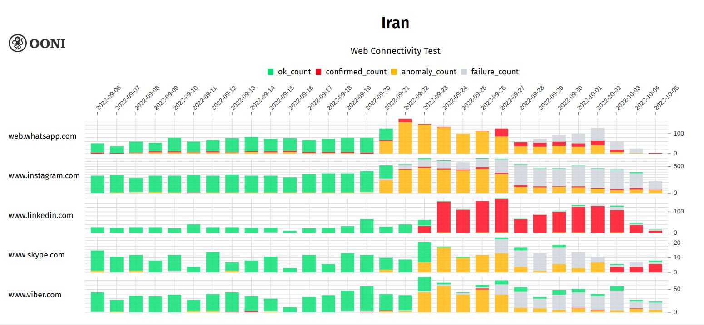
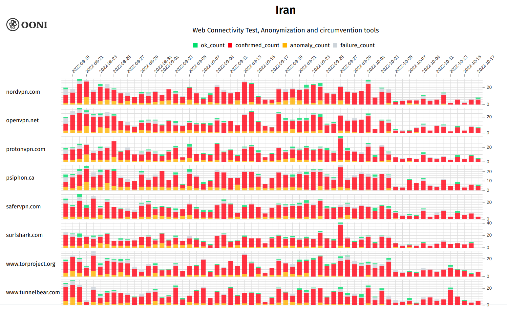

* **Coordinators:** OONI, ISOC
* **Contributors:** [OONI](https://ooni.org/), [IODA](https://ioda.inetintel.cc.gatech.edu/), [Measurement Lab (M-Lab)](https://www.measurementlab.net/), [Cloudflare](https://www.cloudflare.com/), [Kentik](https://www.kentik.com/), [Censored Planet](https://censoredplanet.org/), [ISOC](https://www.internetsociety.org/), [Article19](https://www.article19.org/)
* **Facilitators:** European Commission, United States



This report shares empirical technical findings on the recent Internet
shutdown events that emerged in Iran following the death of Jhina
(Mahsa) Amini in September 2022. The report is intended to be the first
among a series of multi-stakeholder reports aimed at shedding light on
what is becoming a widespread and increasingly sophisticated practice of
certain governments around the world. The stakeholders participating in
the report share a concern about the global trend in Internet shutdowns,
but are contributing to the analysis only on the basis of their
technical expertise.

Over the years, Iranian authorities have followed a pattern of
[blocking social media apps](https://ooni.org/post/2018-iran-protests/), [numerous websites](https://explorer.ooni.org/search?since=2022-08-25&until=2022-09-25&failure=false&probe_cc=IR&test_name=web_connectivity&only=confirmed)
and even resorting to [shutting networks entirely](https://ooni.org/post/2019-iran-internet-blackout/),
implementing overall pervasive [levels of Internet control](https://ooni.org/post/iran-internet-censorship/). The latest
shutdown events that emerged in Iran in September 2022 amid [ongoing protests](https://www.theguardian.com/world/2022/sep/17/iran-protests-death-kurdish-woman-mahsaa-amini-morality-police)
follow the same pattern, but show a wider range of technical strategies
to prevent censorship circumvention.

* [Summary of Key Findings](#summary-of-key-findings)

* [Disruptions to Network Infrastructure](#disruptions-to-network-infrastructure)

  * [Mobile Network Outages](#mobile-network-outages)

    * [Comparison to Previous Outages](#comparison-to-previous-outages)

  * [Regional Outages](#regional-outages)

  * [HTTP/3 and QUIC Traffic Drop](#http3-and-quic-traffic-drop)

  * [IPv6 disruption on Irancell](#ipv6-disruption-on-irancell)

  * [Increased blocking of encrypted DNS](#increased-blocking-of-encrypted-dns)

  * [Impact on Internet Speed Tests](#impact-on-internet-speed-tests)

* [Targeted Disruptions to Apps and Services](#targeted-disruptions-to-apps-and-services)

  * [Blocking of WhatsApp, Instagram, Skype, Viber and Linkedin](#blocking-of-whatsapp-instagram-skype-viber-and-linkedin)

  * [Blocking of Google Play Store and Apple App Store](#blocking-of-google-play-store-and-apple-app-store)

  * [Blocking of Browser Extension Repositories](#blocking-of-browser-extension-repositories)

  * [Circumvention Tools](#circumvention-tools)

* [The Economic Impact of Iran's Internet Shutdowns](#the-economic-impact-of-irans-internet-shutdowns)

  * [Measuring Economic Activity with Light Output](#measuring-economic-activity-with-light-output)

  * [Stock Market Indicators](#stock-market-indicators)

  * [Iran Import/Export Indicators](#iran-importexport-indicators)

* [Conclusion](#conclusion)

* [Annex: Methods](#annex-methods)

  * [Technical Details of Blocking Analyses](#technical-details-of-blocking-analyses)

    * [OONI](#ooni)

    * [Censored Planet](#censored-planet)

  * [Technical Details of Outage Analyses](#technical-details-of-outage-analyses)

    * [IODA](#ioda)

    * [Cloudflare Radar](#cloudflare-radar)

    * [Kentik](#kentik)

  * [Technical Details of the Economic Impact Analysis](#technical-details-of-the-economic-impact-analysis)

  * [Acknowledgement of limitations](#acknowledgement-of-limitations)

# Summary of Key Findings

Iran has implemented [pervasive Internet censorship](https://ooni.org/post/iran-internet-censorship/) for years.
Following the death of Jhina (Mahsa) Amini and widespread protests, new
forms of Internet censorship and shutdowns emerged in Iran. This report
combines multiple network measurement datasets to investigate the recent
Internet censorship and shutdown events in Iran. The findings of this
report are based on the analysis of measurements between **16th
September 2022 to 16th October 2022**.

Public measurement datasets show the following new censorship events in
Iran:

|**Disruption**                                              |**Timing**                                                                                                    |**Details**                                                                                                                                                                                                                                                                                                                                                                          |**Impact**                                                                                                                                                                                                                                                                |
|--------------------------------------------------------|----------------------------------------------------------------------------------------------------------|---------------------------------------------------------------------------------------------------------------------------------------------------------------------------------------------------------------------------------------------------------------------------------------------------------------------------------------------------------------------------------|----------------------------------------------------------------------------------------------------------------------------------------------------------------------------------------------------------------------------------------------------------------------|
|**Mobile network outages** (IODA, Cloudflare, Kentik)      |Between 21st Sept. to 3rd Oct. from 4 PM to midnight daily, and again on 8th, 12th, and 15th Oct.         |The Iranian government enacted a “digital curfew” by shutting down access to 3 major mobile networks (Irancell, Rightel, and MCCI) in the evenings.                                                                                                                                                                                                                              |Users on these networks lost all Internet connectivity. They could access the Internet only through fixed-line or satellite providers. This may have had a severe impact on protest documentation.                                                                    |
|**Regional Internet outages** (IODA, Cloudflare)           |Kurdistan province: 19th Sept and 8th-9th Oct (afternoon/ evening)  Khuzestan province: 16th Oct (all day)|Disruptions to Internet services were observed on multiple days in September and October in Kordestan and Khuzestan. Protests following Jhina Amini’s death were particularly heavy in this province, and protest repression is always treated with [far higher levels of severity in these regions dominated by Iran’s ethnic minorities](https://www.article19.org/resources/iran-bullets-detention-and-shutdowns-the-authorities-response-to-protests-in-khuzestan/) (Iran’s Kurdish and Ahwazi minorities). |Users on affected networks in the affected regions lost all Internet connectivity. They could access the Internet only through alternative providers. This, too, may have had a severe impact on protest documentation.                                               |
|**Blocking of HTTP/3 and QUIC traffic** (Cloudflare)       |22nd Sept. onward                                                                                         |HTTP/3 is the latest version of the protocol for transferring web data. It relies on QUIC, a similarly recent low-level protocol. Both QUIC and HTTP/3 traffic dropped to near zero, suggesting a blanket block on QUIC.                                                                                                                                                         |When these protocols are blocked, users lose the performance and security benefits that they offer. Existing tools may be better at inspecting and filtering traffic on older protocols, so blocking them would also make users more vulnerable to targeted filtering.|
|**IPv6 disruption** (OONI, Cloudflare)                     |22nd Sept. to 2nd Oct.                                                                                    |Traffic using the newer IPv6 networking protocol dropped substantially on Irancell, which could indicate the protocol was blocked.                                                                                                                                                                                                                                               |It is unclear what implications this would have for most users.                                                                                                                                                                                                       |
|**Increased blocking of encrypted DNS** (OONI)             |20th Sept. onward                                                                                         |Many ISPs in Iran increased the blocking of [secure domain name resolution servers](https://explorer.ooni.org/search?since=2022-09-22&until=2022-09-23&probe_cc=IR&test_name=web_connectivity&domain=dns.google&failure=false) (DNS over HTTPS, or DoH) by several technical means (interference with [DNS](https://explorer.ooni.org/search?since=2022-09-16&until=2022-09-23&probe_cc=IR&test_name=web_connectivity&domain=cloudflare-dns.com&failure=false) and [TLS](https://explorer.ooni.org/search?since=2022-09-07&until=2022-09-08&probe_cc=IR&test_name=web_connectivity&domain=dns.google&failure=false)).                                                                                                                                                                                                           |DoH helps circumvent censorship by encrypting the names of the websites a user is visiting. Network administrators then cannot see when a website or service they want to block is being accessed by name. Blocking DoH thus makes circumvention harder.              |
|**Increased throughput for mobile networks** (M-Lab)       |21st Sept. onward                                                                                         |Throughput of mobile networks (Mobile Communication Company of Iran PLC and Irancell) increased from 10-15 Mbps to 20 Mbps.                                                                                                                                                                                                                                                      |Mobile users experienced higher transfer speeds, potentially as the result of increased cellular base station infrastructure (which may also be used for finer grained surveillance).                                                                                 |
|**Blocking of social media and messaging platforms** (OONI)|WhatsApp and Instagram: 21st Sept. onward  Skype, Viber and LinkedIn: 23rd Sept. onward                   |Many ISPs in Iran started blocking [WhatsApp](https://explorer.ooni.org/chart/mat?probe_cc=IR&test_name=whatsapp&since=2022-08-24&until=2022-09-24&axis_x=measurement_start_day) and [Instagram](https://explorer.ooni.org/chart/mat?probe_cc=IR&test_name=web_connectivity&domain=www.instagram.com&since=2022-08-25&until=2022-09-25&axis_x=measurement_start_day). A few days later, they also started blocking [Skype](https://explorer.ooni.org/chart/mat?probe_cc=IR&test_name=web_connectivity&domain=www.skype.com&since=2022-08-25&until=2022-09-25&axis_x=measurement_start_day), [Viber](https://explorer.ooni.org/chart/mat?probe_cc=IR&test_name=web_connectivity&domain=www.viber.com&since=2022-08-25&until=2022-09-27&axis_x=measurement_start_day), and [Linkedin](https://explorer.ooni.org/chart/mat?probe_cc=IR&test_name=web_connectivity&domain=www.linkedin.com&since=2022-08-24&until=2022-09-25&axis_x=measurement_start_day&axis_y=probe_asn).                                                                                                                                                                                                                                              |Even when Internet connectivity was available, users could not use these communication services without circumvention tools (e.g., VPNs).                                                                                                                             |
|**Blocking of app stores** (OONI)                          |22nd Sept. onward                                                                                         |Multiple ISPs in Iran started blocking access to the domain names for the [Google Play Store](https://explorer.ooni.org/search?since=2022-09-22&until=2022-09-23&probe_cc=IR&test_name=web_connectivity&domain=play.googleapis.com&failure=false) and [Apple App Store](https://explorer.ooni.org/search?since=2022-09-22&until=2022-09-23&probe_cc=IR&test_name=web_connectivity&domain=iosapps.itunes.apple.com&failure=false).                                                                                                                                                                                                                                                                 |Affected Iranians would have had difficulty installing or updating apps, including apps that provide relevant socio-economic services and censorship circumvention tools.                                                                                             |
|**Blocking of browser extension repositories** (OONI)      |26th Sept. (or earlier) and onward                                                                        |Multiple ISPs in Iran blocked the browser extension repository URLs for [Firefox](https://explorer.ooni.org/chart/mat?probe_cc=IR&test_name=web_connectivity&domain=addons.mozilla.org&since=2022-09-06&until=2022-10-06&axis_x=measurement_start_day), [Chrome](https://explorer.ooni.org/chart/mat?probe_cc=IR&test_name=web_connectivity&input=https%3A%2F%2Fchrome.google.com%2Fwebstore%2Fcategory%2Fextensions&since=2022-09-06&until=2022-10-06&axis_x=measurement_start_day), [Microsoft Edge](https://explorer.ooni.org/chart/mat?probe_cc=IR&test_name=web_connectivity&input=https%3A%2F%2Fmicrosoftedge.microsoft.com%2Faddons%2FMicrosoft-Edge-Extensions-Home&since=2022-09-06&until=2022-10-06&axis_x=measurement_start_day) and [Opera](https://explorer.ooni.org/chart/mat?probe_cc=IR&test_name=web_connectivity&input=https%3A%2F%2Faddons.opera.com%2Fen%2Fextensions%2F&since=2022-09-06&until=2022-10-06&axis_x=measurement_start_day).                                                                                                                                                                                                                                                               |Affected Iranians would have had limited ability to install and update browser extensions, including extensions that provide privacy protection and censorship circumvention capabilities.                                                                            |

These findings are visualized through the following image, which
provides a timeline of shutdown events in Iran (between 16th September
and 16th October 2022) following the death of Jhina (Mahsa) Amini.

{{}}

**Image:** Timeline of events in Iran between 16th September 2022 to
16th October 2022.

Economic indicators (gathered
by [ISOC](https://www.internetsociety.org/)) make clear that Iran’s
economy suffered during the period of the shutdowns. Nighttime light
output was down, the stock market saw a steady decline, and
imports/exports were down slightly.

These economic changes *may* have been caused or exacerbated by the
shutdowns themselves. All of these data points are correlational, not
causal. Drawing strong conclusions about causality would require far
more data over an extended period. In the case of Iran, some of this
data is hard, if not impossible, to obtain. For example, in this case
public opinion data about the shutdown would be valuable to gauge the
on-the-ground effects, but that data is not currently available. Still,
the shutdowns present a plausible explanation for at least some of the
economic variation, which future analysis may be able to confirm.

The evidence demonstrating these events and conclusions is described in
detail in the sections below.

# Disruptions to Network Infrastructure

## Mobile Network Outages

In the wake of the death of Jhina (Mahsa) Amini on 16th September 2022,
protests
[erupted](https://www.theguardian.com/world/2022/sep/17/iran-protests-death-kurdish-woman-mahsaa-amini-morality-police)
in Iran. With this mobilization came daily shutdowns to Iran's top 3
mobile network providers: Irancell, Rightel, and MCCI.

For 13 consecutive days, from 21st September 2022 to 3rd October 2022,
the Iranian government enacted a “digital curfew” by shutting down
access to mobile networks from 4:00 PM local time until around midnight.
Over the 13 day period, Iranians experienced \~100 hours without access
to mobile networks. Mobile networks were again shut down on 8th, 12th
and 15th October 2022.

These outages are visible through telemetry provided by the [Internet Outage Detection and Analysis (IODA)](https://ioda.inetintel.cc.gatech.edu/country/IR?from=1663542000&until=1665788399)
project, shown in Figure 1.

{{}}

**Figure 1:** IODA data showing Internet outages in Iran between 16th
September 2022 to 16th October 2022 (source:
[IODA](https://ioda.inetintel.cc.gatech.edu/country/IR?from=1663542000&until=1665788399)).
The red vertical bands indicate outages, which are detected as abnormal
drops in the green “BGP” signal. The BGP data source represents routing
announcements or global routing information that each ISP router
exchanges with other routers, and it is usually quite stable. An
abnormal drop can indicate a disruption in Internet connectivity. During
the digital curfews, the blue Active Probing and purple Google search
signals (see Methods below) are not reaching the maximums
they normally would. (IODA’s “telescope” signal is removed from the time
series for this view as it does not provide additional information.)

The IODA chart in Figure 2
[shows](https://ioda.inetintel.cc.gatech.edu/asn/57218?from=1663560000&until=1665028799)
the daily outages observed on RighTel between 18th September 2022 to 5th
October 2022.

{{}}

**Figure 2:** IODA data showing BGP signal for mobile operator RightTel
between 18th September 2022 to 5th October 2022 (source:
[IODA](https://ioda.inetintel.cc.gatech.edu/asn/57218?from=1663560000&until=1665028799)).
As in the previous figure, the red vertical bands indicate outages as
evidenced by abnormal drops in the green BGP signal.

Similarly, IODA data
[shows](https://ioda.inetintel.cc.gatech.edu/asn/44244?from=1663714800&until=1665097199)
daily outages on Irancell between 18th September 2022 to 5th October
2022.

{{}}

**Figure 3:** IODA data showing the “Telescope” signal for mobile
operator IranCell between 18th September 2022 to 5th October 2022
(source:
[IODA](https://ioda.inetintel.cc.gatech.edu/asn/44244?from=1663714800&until=1665097199)).
The graph shows red vertical bands for abnormal drops in the Telescope
signal. Telescope is a measure of unsolicited network traffic on a
network (see Methods). An abnormal decrease in Telescope could indicate a drop in Internet
connectivity.

The timing and the networks affected by outages in Iran are corroborated
by [Cloudflare Radar data](https://blog.cloudflare.com/protests-internet-disruption-ir/)
(Figure 4), which also shows traffic drops from Irancell, RighTel and
MCCI.

{{}}

**Figure 4:** Graph showing Cloudflare traffic volumes for Irancell
(green), Rightel (yellow), and MCCI (red) between 18th September 2022
and 16th October 2022 (source: [Cloudflare Radar](https://radar.cloudflare.com/ir)).

The Cloudflare Radar graph shows not only that traffic on these network
providers was
[disrupted](https://blog.cloudflare.com/protests-internet-disruption-ir/)
for several hours each day, but also that traffic was significantly
higher than pre-shutdown levels each day after connectivity returned.

The mobile network outages are further corroborated by Kentik data
(Figure 5), which shows daily drops in traffic from Irancell, MCCI, and
RighTel during the same date range.

{{}}

**Figure 5:** Graph showing Kentik traffic volumes for the Iranian three
mobile carriers Irancell (dark green), Rightel (yellow), and MCI (light
green) between 18th September 2022 and 5th October 2022 (source:
[Kentik](http://www.kentik.com/)).

Additionally, Kentik’s data show increases in traffic on fixed-line
services in Iran during the outages of mobile networks (Figure 6),
suggesting that a small portion of the Internet traffic lost due to
mobile blockages was rerouted over fixed-line services.

{{}}

**Figure 6:** Graph showing Kentik traffic volumes for Iran’s largest
wireline carrier (TCI, in blue) surging during shutdowns of Iran’s
largest mobile carrier (Irancell, in green) between 22nd September 2022
and 28th September 2022 (source: [Kentik](http://www.kentik.com/)).

### Comparison to Previous Outages

Iran has previously experienced Internet outages during protests. Amid
the [November 2019 protests](https://www.nytimes.com/2019/11/15/world/middleeast/iran-gasoline-prices-rations.html),
Iran implemented a [nationwide Internet shutdown](https://ooni.org/post/2019-iran-internet-blackout/). During
the shutdown, most Iranians were barred from connecting to the global
Internet, but they still had *access to Iran’s national intranet* (the
domestic network hosting Iranian websites and services).

The main differences between the recent Internet outages in Iran with
the nationwide Internet shutdown in November 2019 are:

* **Impacted networks.** The recent outages affected the top three
mobile network providers. While the 2022 shutdown had an extensive
impact, it affected fewer networks in Iran in comparison to the
2019 Internet shutdown.

* **Duration.** The 2019 Internet shutdown lasted for 5 continuous
days, whereas the recent outages spanned over several weeks,
mainly affecting networks between 4:00 PM local time until around
midnight.

## Regional Outages

In addition to above network shutdowns with country-wide scale, IODA
data, corroborated by Cloudflare data, demonstrates signs of Internet
disruption impacting the Kordestan and Khuzestan provinces (see dates
and times in table below with hyperlinked images to IODA data views).
The [IODA graphs](https://ioda.inetintel.cc.gatech.edu/region/1846?from=1663473600&until=1663732799)
show BGP (green), Active Probing (blue), and Telescope (orange) signals;
the [Cloudflare](https://radar.cloudflare.com/ir) graphs show HTTP
requests per second. The dip in traffic in the last Cloudflare graph is
indicated by the red arrow.

{{}}
{{}}

## HTTP/3 and QUIC Traffic Drop

HTTP, the foundation of the World Wide Web that allows users to request
data and documents from servers, rests on many underlying protocols for
lower-level functionality (e.g., transmitting raw data). HTTP/3 is the
latest revision of this protocol. Instead of using the more traditional
TCP and TLS protocols for transport and security, HTTP/3 is based on UDP
and QUIC. Since it is relatively new and uses a quite different
networking stack, it is likely that existing filtering equipment is not
as effective at blocking it.

On 22nd September 2022, Cloudflare Radar data shows a drop to near-zero
level of HTTP/3 and QUIC traffic coming from Iran, as shown in Figure 7.

{{}}

**Figure 7:** Cloudflare Radar graphs showing distribution of traffic by
the three different HTTP versions and distribution of secure traffic by
protocol for Iran (source: [Cloudflare Radar](https://radar.cloudflare.com/adoption-and-usage/ir?range=28d)).

This strongly suggests that QUIC, which HTTP/3 relies on, was blocked
entirely, perhaps by blocking UDP port 443. It is possible that network
operators in Iran found it easier to block all QUIC traffic than to
effectively implement targeted filtering on the newer QUIC protocol.
This is supported by [previous research](https://ooni.org/post/2022-http3-measurements-paper/#iran-http3-targeting-blocking-of-udp-endpoints) that shows a difference in
blocking for HTTP/3 vs HTTPS traffic.

## IPv6 disruption on Irancell

IPv6 is the latest version of the Internet Protocol, the low-level
protocol that enables computers to find each other by their “IP address”
and send and receive data. It supersedes the older IPv4. OONI
measurements
[suggest](https://explorer.ooni.org/search?since=2022-09-27&until=2022-09-28&probe_cc=IR&test_name=web_connectivity&probe_asn=AS44244&domain=www.wikipedia.org&failure=false&only=anomalies)
that Irancell may have interfered with IPv6 traffic from 22nd September
2022 to at least 29th September 2022. Within this period, OONI
measurements collected from Irancell (Figure 8) show that while attempts
to connect to IPv4 addresses succeeded, attempts to connect to IPv6
addresses failed.

{{}}

**Figure 8:** OONI attempts to make TCP connections using IPv6 in
Irancell, showing failures starting on 22nd September 2022.The few
measurements annotated in purple pertain to cases where OONI Probe users
did not have IPv6 support.

Figure 8 shows that before 22nd September 2022, the majority of the
attempts succeed, but from 22nd September 2022 onwards, the majority of
the attempts result in connection timeouts. This suggests that IPv6 was
not reachable on Irancell.

This is further suggested by [Cloudflare Radar data](https://radar.cloudflare.com/adoption-and-usage/as44244?range=28d)
(Figure 9), which shows a drop in IPv6 traffic on Irancell during the
same period.

{{}}

**Figure 9:** Cloudflare Radar graph showing distribution of traffic by
IP version for Irancell (source: [Cloudflare Radar](https://radar.cloudflare.com/adoption-and-usage/as44244?range=28d)).

These results are further corroborated by “ping” measurements of a
[RIPE Atlas probe](https://atlas.ripe.net/probes/33779) towards the
IPv6 address of a root DNS resolver (Figure 10). These measurements
indicate how long it took a device in Iran to reach a server providing a
core global service for IPv6.

{{}}

**Figure 10:** Ping measurements towards the IPv6 address of one of the
a.root-servers.net root DNS resolver (source: [RIPE Atlas](https://atlas.ripe.net/probes/33779)). Red blocks indicate times
when the resolver’s IPv6 address could not be reached.

Kentik data shows similar disruptions in traffic volume to IPv6
addresses (Figure 11).

{{}}

**Figure 11:** Graph showing Kentik traffic volumes for IPv6 only for
the Iranian three mobile carriers Irancell (dark green), Rightel (light
green), and MCI (yellow) between 18th September 2022 and 5th October
2022 (source: [Kentik](http://www.kentik.com/)).

It remains unclear what implications IPv6 blocking would have had for
users.

## Increased blocking of encrypted DNS

The Domain Name Service (DNS) is how Internet devices map from names
(e.g., `www.example.com`) to IP addresses. In
recent years, encrypted DNS was introduced to make users’ Internet
traffic more private and secure, and to make it harder for governments
to monitor and block access to Internet services. Encrypted DNS works by
exchanging the DNS data over secure protocols such as TLS and HTTPS,
preventing authorities or others from seeing the names of requested
websites and services or interfering with the DNS results.

In 2020, however, OONI reported that [Iran blocked DNS over TLS (DoT)](https://ooni.org/post/2020-iran-dot/). At the time, OONI found
that 57% of the tested endpoints were blocked on at least one ISP, and
that most blocking was implemented by interfering with the TLS
handshake, i.e., ISPs were preventing a secure connection from being
established. A subsequent OONI study
[found](https://ooni.org/post/2022-doh-dot-paper-dnsprivacy21/) that
50% of tested DoT endpoints were blocked in Iran, while 92% of tested
DNS over HTTPS (DoH) endpoints worked in Iran. These studies involved
users within Iran testing publicly available DoH and DoT servers that
were operated globally outside of Iran.

The situation changed in September 2022, when OONI data started to show
increased blocking of encrypted DNS in Iran. As of 20th September 2022,
OONI data shows that ISPs in Iran started [blocking DNS over HTTPS (DoH) endpoints](https://explorer.ooni.org/search?since=2022-09-22&until=2022-09-23&probe_cc=IR&test_name=web_connectivity&domain=dns.google&failure=false)
by means of DNS based tampering, in addition to implementing [TLS level interference](https://explorer.ooni.org/search?since=2022-09-07&until=2022-09-08&probe_cc=IR&test_name=web_connectivity&domain=dns.google&failure=false).
Previously reachable DoH endpoints (such as cloudflare-dns.com) are now
[blocked](https://explorer.ooni.org/search?since=2022-09-16&until=2022-09-23&probe_cc=IR&test_name=web_connectivity&domain=cloudflare-dns.com&failure=false).

{{}}

**Figure 12:** OONI data on the blocking of popular DNS over HTTPS
endpoints in Iran between August 2022 to September 2022 (source: [OONI MAT](https://explorer.ooni.org/chart/mat?probe_cc=IR&test_name=web_connectivity&since=2022-08-25&until=2022-09-25&axis_x=measurement_start_day&axis_y=domain)).

Figure 12 aggregates OONI measurement coverage from the testing in Iran
of multiple DoH endpoints. These measurements are aggregated from
multiple tested networks in Iran. OONI measurements are annotated as
“OK” (green) when the tested URL is considered to be accessible on a
tested network according to OONI’s [Web Connectivity](https://ooni.org/nettest/web-connectivity/) methodology.

Measurements are annotated as “anomalous” (orange) when the tested URL
fails to meet the [Web Connectivity](https://ooni.org/nettest/web-connectivity/) methodology
requirements for accessibility, indicating potential blocking.
Measurements are annotated as “confirmed” (red) when blocking is
automatically confirmed. OONI is able to automatically confirm blocking
based on the fingerprints of blockpages, or when DNS resolution returns
an IP known to be associated with censorship. When URLs are blocked
through the use of other censorship techniques, those measurements are
annotated as “anomalous” (because their blocking cannot be confirmed
automatically). Finally, OONI measurements are annotated as “failed”
when the experiment fails (this can be due to blocking, bugs, or other
reasons).

As of 20th September 2022, [OONI data collected from Iran](https://explorer.ooni.org/chart/mat?probe_cc=IR&test_name=web_connectivity&since=2022-08-25&until=2022-09-25&axis_x=measurement_start_day&axis_y=domain)
shows a noticeable *change* in how the blocking of encrypted DNS is
implemented. Previously, OONI data showed TLS level interference
(annotated in orange as “anomalous”), whereas now, most (tested) ISPs
implement DNS based blocking of DoH endpoints as well. These blocking
cases are [automatically confirmed](https://explorer.ooni.org/search?since=2022-09-24&until=2022-09-25&probe_cc=IR&test_name=web_connectivity&domain=dns.google&failure=false)
(and annotated in red). OONI data also shows that this block has been
expanded to more DoH endpoints than in previous months.

The [impact of DoH blocking](https://blog.cloudflare.com/protests-internet-disruption-ir/)
in Iran is also evident through Cloudflare data (Figure 13), which also
shows that it started on 20th September 2022.

{{}}

**Figure 13:** Traffic to Cloudflare 1.1.1.1 resolver from clients in
Iran (source: Cloudflare).

As a result of the increased blocking of encrypted DNS services,
circumventing Internet censorship in Iran – a heavily censored
environment – may now be harder.

## Impact on Internet Speed Tests

When users had at least some Internet connectivity, they were able to
connect to network diagnostic tests such as M-Lab’s. Since mid-September
2022, M-Lab data shows a marked increase in daily tests from 5 Iranian
ISPs, particularly for Iran Telecommunication Company PJS and Irancell.
Figure 14 shows the daily diagnostic test volumes for the five Iranian
providers with the most tests observed in the M-Lab dataset.

{{}}

**Figure 14:** Number of speed tests per day since September 1, 2022 for
five ISPs. Iran Telecommunication Company PJS (AS58224) is shown in
orange; Irancell (AS44244) is shown in purple. (Source:
[M-Lab](https://www.measurementlab.net/data/)).

Zooming in on tests per hour for these five networks reveals the impact
of periodic shutdowns on test activity. The figure below shows hourly
test volume for mobile networks (left) and fixed-line ISPs (right). Both
types of networks exhibit periodic shutdown behavior, but with differing
periodicity.

{{}}
{{}}

**Figure 15:** Hourly test volume for speed tests
(9/25/2022-10/05/2022), separating out mobile networks (top chart) and fixed
line ISPs (bottom chart). (Source:
[M-Lab](https://www.measurementlab.net/data/)).

Based on the quantity of speed tests, it can be inferred that users are
concerned about their network connectivity and navigate to the speed
test to check their access. However, despite reports of network
interference, M-Lab data shows that when users were able to connect to
the global Internet to run the speed test, they saw a sustained increase
in network throughput on Irancell and Mobile Communication Company of
Iran PLC, both cellular network providers (Figure 16). This could be as
a result of increased deployment of cell towers (e.g., to make more
precise observations of mobile subscriber IDs), but we are currently
unable to verify this hypothesis.

{{}}

**Figure 16:** Median daily throughput for speed tests from Iran, 2022.
There is an increase in median throughput for cellular carriers Mobile
Communication Company of Iran PLC (AS197207) and Irancell (AS44244).
(Source: [M-Lab](https://www.measurementlab.net/data/)).

M-Lab data does *not* show discernible changes in network latency or
loss for Iranian clients of the speed test.

# Targeted Disruptions to Apps and Services

Iran has blocked numerous websites and apps over the past decade,
implementing some of the most [pervasive forms of Internet censorship](https://ooni.org/post/iran-internet-censorship/) in the
world. In 2017, OONI published a
[report](https://ooni.org/post/iran-internet-censorship/) based on the
analysis of network measurements collected from Iran between 2014 to
2017. This study found numerous *news media websites*, *human rights
websites*, and *political websites* blocked in the country. Subsequent
studies also show the [blocking of numerous LGBTIQ websites](https://ooni.org/post/2021-no-access-lgbtiq-website-censorship-six-countries/)
in Iran.

Amid [anti-government protests](https://www.theguardian.com/world/2018/jan/02/iran-protests-how-did-they-start-and-where-are-they-heading)
between December 2017 to January 2018, OONI
[reported](https://ooni.org/post/2018-iran-protests/) on the blocking
of Telegram, Facebook Messenger, and Instagram in Iran. In March 2020,
Iran [temporarily blocked access to the Farsi language edition of Wikipedia](https://ooni.org/post/2020-iran-blocks-farsi-wikipedia/). In
January 2021, Iran started *blocking access to the Signal Private
Messenger app*. While many of these (and other) blocks remain
[ongoing](https://explorer.ooni.org/search?since=2022-09-05&until=2022-10-06&failure=false&probe_cc=IR&only=confirmed),
OONI data shows that Iran *increased* the levels of Internet censorship
following the September 2022 protests: more ISPs now block access to
more platforms, as shown below.

## Blocking of WhatsApp, Instagram, Skype, Viber and Linkedin

As of 21st September 2022, OONI data shows that many ISPs in Iran
started [blocking access to WhatsApp endpoints](https://explorer.ooni.org/chart/mat?probe_cc=IR&test_name=whatsapp&since=2022-08-24&until=2022-09-24&axis_x=measurement_start_day),
[web.whatsapp.com](https://explorer.ooni.org/chart/mat?probe_cc=IR&test_name=web_connectivity&domain=web.whatsapp.com&since=2022-08-25&until=2022-09-25&axis_x=measurement_start_day),
and
[www.instagram.com](https://explorer.ooni.org/chart/mat?probe_cc=IR&test_name=web_connectivity&domain=www.instagram.com&since=2022-08-25&until=2022-09-25&axis_x=measurement_start_day).
In most cases, OONI data shows signs of *TCP/IP blocking* (disrupting
connections with and data transfer to/from the server), with additional
blocking via *DNS* (preventing users from retrieving an IP address for
the server’s domain name) and *TLS* (preventing users from securing
their connections with the server). As of 23rd September 2022, OONI data
shows the [blocking of Skype](https://explorer.ooni.org/chart/mat?probe_cc=IR&test_name=web_connectivity&domain=www.skype.com&since=2022-08-25&until=2022-09-25&axis_x=measurement_start_day)
and
[Viber](https://explorer.ooni.org/chart/mat?probe_cc=IR&test_name=web_connectivity&domain=www.viber.com&since=2022-08-25&until=2022-09-27&axis_x=measurement_start_day),
while the [blocking of Linkedin is automatically confirmed on at least 10 networks](https://explorer.ooni.org/chart/mat?probe_cc=IR&test_name=web_connectivity&domain=www.linkedin.com&since=2022-08-24&until=2022-09-25&axis_x=measurement_start_day&axis_y=probe_asn)
in Iran.

{{}}

**Figure 17:** OONI data on the testing of WhatsApp Web, Instagram,
Viber, Linkedin and Skype in Iran between September 2022 to October 2022
(source: [OONI MAT](https://explorer.ooni.org/chart/mat?probe_cc=IR&test_name=web_connectivity&since=2022-09-06&until=2022-10-06&axis_x=measurement_start_day&axis_y=domain)).

Figure 17 aggregates OONI measurement coverage from the testing of
WhatsApp Web, Instagram, Linkedin and Skype on multiple networks in Iran
between 6th September 2022 to 5th October 2022. As is evident from the
chart, both [WhatsApp Web](https://explorer.ooni.org/chart/mat?probe_cc=IR&test_name=web_connectivity&domain=web.whatsapp.com&since=2022-09-06&until=2022-10-06&axis_x=measurement_start_day)
and
[Instagram](https://explorer.ooni.org/chart/mat?probe_cc=IR&test_name=web_connectivity&domain=www.instagram.com&since=2022-09-06&until=2022-10-06&axis_x=measurement_start_day)
were previously accessible on most tested networks in Iran, and only
started to present signs of blocking from 21st September 2022 onwards.
Meanwhile, the testing of
[Skype](https://explorer.ooni.org/chart/mat?probe_cc=IR&test_name=web_connectivity&domain=www.skype.com&since=2022-09-06&until=2022-10-06&axis_x=measurement_start_day),
[Viber](https://explorer.ooni.org/chart/mat?probe_cc=IR&test_name=web_connectivity&domain=www.viber.com&since=2022-08-25&until=2022-09-27&axis_x=measurement_start_day),
and
[Linkedin](https://explorer.ooni.org/chart/mat?probe_cc=IR&test_name=web_connectivity&domain=www.linkedin.com&since=2022-09-06&until=2022-10-06&axis_x=measurement_start_day)
started presenting signs of blocking on multiple networks two days
later, on 23rd September 2022.

Similarly, OONI data suggests that Iran [started blocking access to the WhatsApp app](https://explorer.ooni.org/chart/mat?probe_cc=IR&test_name=whatsapp&since=2022-09-06&until=2022-10-06&axis_x=measurement_start_day)
on 21st September 2022 (Figure 18).

{{}}

**Figure 18:** OONI data on the testing of WhatsApp in Iran between
September 2022 to October 2022 (source: [OONI MAT](https://explorer.ooni.org/chart/mat?probe_cc=IR&test_name=whatsapp&since=2022-09-06&until=2022-10-06&axis_x=measurement_start_day)).

The figure aggregates OONI measurement coverage from the testing of
WhatsApp endpoints on multiple networks in Iran between 6th September
2022 to 5th October 2022. It is evident that while WhatsApp was
previously accessible on most tested networks in Iran, it started
presenting signs of blocking on almost all tested networks from 21st
September 2022 onwards.

Kentik data confirms that traffic volume from Facebook’s network, which
would include WhatsApp traffic, dropped substantially on 21st September
2022 (Figure 19).

{{}}

**Figure 19:** Graph showing Kentik traffic volumes from Facebook
(AS32934) to the Iranian three mobile carriers Irancell (dark green),
Rightel (yellow), and MCI (light green) between 18th September 2022 and
5th October 2022 (source: [Kentik](http://www.kentik.com/)).

## Blocking of Google Play Store and Apple App Store

As of 22nd September 2022, OONI data shows that multiple ISPs in Iran
started [blocking access to Google Play Store](https://explorer.ooni.org/search?since=2022-09-22&until=2022-09-23&probe_cc=IR&test_name=web_connectivity&domain=play.googleapis.com&failure=false)
and [Apple App Store](https://explorer.ooni.org/search?since=2022-09-22&until=2022-09-23&probe_cc=IR&test_name=web_connectivity&domain=iosapps.itunes.apple.com&failure=false)
domains, limiting Iranians’ ability to install or update apps.

{{}}

**Figure 20:** OONI data on the testing of Google Play Store and Apple
App Store domains in Iran between September 2022 to October 2022
(source: [OONI MAT](https://explorer.ooni.org/chart/mat?probe_cc=IR&test_name=web_connectivity&since=2022-09-06&until=2022-10-06&axis_x=measurement_start_day&axis_y=domain)).

Figure 20 aggregates OONI measurement coverage from the testing of
Google Play Store and Apple App Store domains on multiple networks in
Iran between 6th September 2022 to 5th October 2022. From 22nd September
2022 onwards, OONI data
[shows](https://explorer.ooni.org/chart/mat?probe_cc=IR&test_name=web_connectivity&since=2022-09-06&until=2022-10-06&axis_x=measurement_start_day&axis_y=domain)
a spike in measurements presenting both “*anomalies*” (signs of
blocking) and those where the block is *automatically confirmed*.
Notably, the blocked domains include play.googleapis.com, which is [one of the key domains used](https://www.netify.ai/resources/applications/google-play) by
Google Play Store.

## Blocking of Browser Extension Repositories

Beyond the blocking of app stores, OONI data suggests that Iran started
blocking several browser extension repositories, limiting Iranians’
ability to install and update browser extensions.

{{}}

**Figure 21:** OONI data on the testing of browser extensions in Iran
between September 2022 to October 2022 (source: [OONI MAT](https://explorer.ooni.org/chart/mat?probe_cc=IR&test_name=web_connectivity&since=2022-09-06&until=2022-10-06&axis_x=measurement_start_day&axis_y=input)).

Figure 21 aggregates OONI measurement coverage from the testing of the
browser extension repository URLs for
[Firefox](https://explorer.ooni.org/chart/mat?probe_cc=IR&test_name=web_connectivity&domain=addons.mozilla.org&since=2022-09-06&until=2022-10-06&axis_x=measurement_start_day),
[Chrome](https://explorer.ooni.org/chart/mat?probe_cc=IR&test_name=web_connectivity&input=https%3A%2F%2Fchrome.google.com%2Fwebstore%2Fcategory%2Fextensions&since=2022-09-06&until=2022-10-06&axis_x=measurement_start_day),
[Microsoft Edge](https://explorer.ooni.org/chart/mat?probe_cc=IR&test_name=web_connectivity&input=https%3A%2F%2Fmicrosoftedge.microsoft.com%2Faddons%2FMicrosoft-Edge-Extensions-Home&since=2022-09-06&until=2022-10-06&axis_x=measurement_start_day)
and
[Opera](https://explorer.ooni.org/chart/mat?probe_cc=IR&test_name=web_connectivity&input=https%3A%2F%2Faddons.opera.com%2Fen%2Fextensions%2F&since=2022-09-06&until=2022-10-06&axis_x=measurement_start_day)
from multiple networks in Iran between 6th September 2022 to 5th October
2022. Most URLs from the figure lack testing coverage before 26th
September 2022 because they were only added to the list of tested
websites on that date. Given that access to [addons.mozilla.org was blocked on 24th September 2022](https://explorer.ooni.org/chart/mat?probe_cc=IR&test_name=web_connectivity&domain=addons.mozilla.org&since=2022-09-06&until=2022-10-06&axis_x=measurement_start_day),
it is possible that ISPs may have started blocking access to the other
URLs on the same day (if they synchronized the blocking of browser
extension repositories).

It is worth highlighting that all of the above tested URLs were
[automatically confirmed blocked](https://explorer.ooni.org/chart/mat?probe_cc=IR&test_name=web_connectivity&since=2022-09-06&until=2022-10-06&axis_x=measurement_start_day&axis_y=input)
when tested on multiple networks in Iran from 26th September 2022
onwards.

## Circumvention Tools

Internet censorship can be evaded through the use of circumvention
tools. However, numerous circumvention tool websites have been *blocked
in Iran over the past years*, as demonstrated through [OONI data](https://explorer.ooni.org/chart/mat?probe_cc=IR&test_name=web_connectivity&category_code=ANON&since=2022-09-06&until=2022-10-06&axis_x=measurement_start_day&axis_y=domain).

Figure 22 aggregates [OONI measurement coverage](https://explorer.ooni.org/chart/mat?probe_cc=IR&test_name=web_connectivity&category_code=ANON&since=2022-08-18&until=2022-10-18&axis_x=measurement_start_day&axis_y=domain)
from the testing of circumvention tool websites on multiple networks in
Iran between 18th August 2022 to 17th October 2022.

{{}}

**Figure 22:** OONI data on the blocking of circumvention tool websites
in Iran between 18th August 2022 to 17th October 2022 (source: [OONI MAT](https://explorer.ooni.org/chart/mat?probe_cc=IR&test_name=web_connectivity&category_code=ANON&since=2022-08-18&until=2022-10-18&axis_x=measurement_start_day&axis_y=domain)).

As is evident from the chart, numerous circumvention tool websites have
been blocked in Iran *before* the recent protests.

The blocking of circumvention tool websites in Iran is further
corroborated by [Censored Planet data](https://censoredplanet.org/data/raw) (Figure 23).

{{}}

**Figure 23:** Censored Planet data on the blockage of circumvention and
VPN provider websites in Iran as of October 14, 2022 (source: [Censored Planet](https://censoredplanet.org/data/raw)).

Censored Planet measured the reachability of these circumvention tool
providers’ secure websites, as of 14th October 2022, from 13 vantage
points behind 7 ISPs inside Iran. Probes trying to reach popular
circumvention websites such as the torproject.org and VPN provider
websites have all been blocked across the tested networks. While the
majority of the networks block webpages by timing out the low-level TCP
request, the AFRANET network performs the blocking by resetting TCP
requests.

While [circumvention tool websites have been blocked in Iran](https://explorer.ooni.org/chart/mat?probe_cc=IR&test_name=web_connectivity&category_code=ANON&since=2022-08-18&until=2022-10-18&axis_x=measurement_start_day&axis_y=domain)
for years, the extent to which ISPs in Iran are able to successfully
block the actual circumvention tools is less clear – particularly since
some circumvention tools include built-in techniques for evading
censors.

OONI data suggests that the [Psiphon](https://psiphon.ca/) and [Tor Snowflake](https://snowflake.torproject.org/) circumvention tools [may work](https://explorer.ooni.org/chart/circumvention?since=2022-09-05&until=2022-10-06&probe_cc=IR)
in Iran, and can potentially be used for [censorship circumvention](https://forum.torproject.net/t/iran-circumventing-censorship-with-tor/4590).
While OONI tests indicate that it is possible to bootstrap these tools
from Iran and use them to fetch a small webpage, there is no public data
available on whether these tools are effective in providing
circumvention for long periods of time. It is worth noting though that
both
[Psiphon](https://psix.ca/d/nyi8gE6Zk/regional-overview?orgId=2&var-region=IR)
and [Tor Metrics](https://metrics.torproject.org/userstats-bridge-country.html?start=2022-09-11&end=2022-10-04&country=ir)
show a spike in the number of users connecting from Iran in September
2022, suggesting increased circumvention attempts following more
pervasive forms of Internet censorship in Iran.

# The Economic Impact of Iran’s Internet Shutdowns

Measuring the impact of a shutdown like the ones in Iran presents a
unique challenge. There are many kinds of “impact,” ranging from
economic to social to, political, to daily-life in Iran. This section
will focus on the economic impact, which itself has many facets.

## Measuring Economic Activity With Light Output

One dataset that economists have been using recently to measure economic
activity is satellite imagery of the nighttime light output of a given
geographic area. Nighttime light output has been found to correlate with
how economically active a region’s population is during the timeframe
observed.

ISOC’s data comes from the low-light imaging sensor on [NASA's Suomi National Polar-orbiting Partnership (S-NPP)](https://worldview.earthdata.nasa.gov/) satellite. This is part
of the Visible Infrared Imaging Radiometer Suite (VIIRS), and is called
the Day/Night Band (DNB).

The video below shows that nighttime light intensified from 16th
September 2022 through 3rd October 2022 in Tehran. Over the following
days, nighttime lighting dropped below its initial levels, which could
indicate Iranians became less active as the government crackdown
intensified and movement was restricted in the region. The drop in
lighting could be a lagging indicator of reduced economic activity due
to both Internet shutdowns and night curfews on movement, though the
nature and timing of these effects is confounded by potential lighting
increases from widespread nighttime protests.



**Video:** ISOC Impact Shutdown - Tehran (Night-time lights data 16th Sept.-16th Oct).

This analysis demonstrates the difficulties in measuring the impact of a
shutdown. Nighttime lights provide valuable insights where robust
statistical systems may be absent, and economists typically [use them](https://onlinelibrary.wiley.com/doi/abs/10.1111/1467-8268.12528)
to map impacts of sudden policy changes (e.g., COVID-19 restrictions).
Since this is the first attempt to link nighttime lights in the context
of an Internet shutdown, various confounding effects cannot be ruled
out. However, without this analysis we would be uncertain about the
potential of nighttime lights to explore potential correlation with
shutdowns. While we can infer from the reduction in light that Iranians
are changing their use of personal appliances (e.g., lights, mobile
phones, TVs) and public lighting (e.g., street lights), there is no way
to make a causal link directly to the shutdown, and simultaneous events
muddy the analysis. In order to conclude that there was a drop in
economic productivity, we would also need information on the
“business-as-usual” number of productive hours (e.g., if economic
activity is not regulated during the night time, as it may be in certain
jurisdictions).

A second **[video from the Sistan and Baluchestan region](https://vimeo.com/765587406)** shows a similar
pattern. This is the region that has seen the most fatalities in Iran
during the recent protests and associated shutdowns. There is a marked
decline in luminosity as of 3rd October 2022. This is a capture of a
larger region than the Tehran image above, and shows certain areas
within the province going completely dark following a period of
intensified activity leading up to 3rd October 2022.

## Stock Market Indicators

The stock market is another commonly used indicator of a country’s
economic output and health. This data is theoretically available yet at
a finer-grained timescale: even within a day, any stock market can have
swings between the opening and closing bell. The charts in Figure 24
show only day-level data, but they clearly indicate that Iran witnessed
a steady drop in stock market performance during the shutdowns. Again,
the shutdowns plausibly played a role here, although it is difficult to
disentangle their impact from other factors such as general political
instability.

{{}}

**Figure 24:** Changes in Stock Market Performance in Iran between 10th
September 2022 to 12th October 2022 (Source: [Tehran Stock Exchange Main Index (TEDPIX)](https://mondovisione.com/),
[ISOC](https://isoc.app.box.com/s/adh1n5nk68dk1iz8w6ivb8rykb44lhro)).
See the Technical Details section below for individual datasets.

## Iran Import/Export Indicators

Another indicator of the health of a country’s economy is trade data.
One way to measure trade in a region is to measure how many cargo ships
deliver and receive goods at major ports. In the case of Iran, there are
many major ports whose data we can explore to understand economic
activity. This can add information beyond stock market data, which is
subject to fluctuations and may only capture a component of the impact
of business and corporate activity in the country.

Data on exports and imports by volume of goods is presented in Figure
25. Viewing just the data for September 2022 or October 2022 may provide
an incomplete picture, since we need to know how much trade has changed
relative to business-as-usual. To capture this, we need to look at how
much trade is taking place following the shutdown relative to how much
trade would normally take place during this time.

The data presented below shows the ratio of the current imports and
exports data to their values averaged during the 2017-19 period. There
is a decline in shipping containers moving out from Iran, and a decline
in bulk and food coming into the country’s ports. As with earlier data,
this is correlational, not necessarily causal, as we see changes in the
types of exports (e.g., more oil and chemicals being exported), and a
small increase in overall container imports following the current
Internet shutdown in Iran. This suggests that Internet shutdowns may
have hampered logistics associated with trade (e.g., lack of timely
communication about arrivals at ports), where certain trade in specific
trade operations were more adversely affected than others in Iran.

{{}}

**Figure 25:** Trade Data on Imports and Exports in Metric Tons
(Relative to 2017-2019) for Iran. See the Technical Details section for individual datasets.

# Conclusion

Iran has had a tight grip on the Internet for years, implementing
[pervasive levels of Internet censorship](https://ooni.org/post/iran-internet-censorship/)
([blocking numerous websites](https://explorer.ooni.org/search?since=2022-08-25&until=2022-09-25&failure=false&probe_cc=IR&test_name=web_connectivity&only=confirmed)
and major apps). Over the years, as anti-government protests emerged
(such as the [protests in late 2017](https://www.theguardian.com/world/2018/jan/02/iran-protests-how-did-they-start-and-where-are-they-heading)
and [November 2019](https://www.aljazeera.com/news/2019/11/20/irans-protests-all-you-need-to-know-in-600-words/)),
Iranian authorities have followed a pattern of [blocking social media apps](https://ooni.org/post/2018-iran-protests/) that Iranians rely on
for communication, information sharing, and coordination—even resorting
to [shutting networks down entirely](https://ooni.org/post/2019-iran-internet-blackout/).

Amid the ongoing protests following the death of Jhina (Mahsa) Amini,
the Internet shutdown events in Iran have followed the same pattern,
involving the blocking of social media platforms and mobile network
outages. **What differs, though, is the duration and scale of the
impact, as well as the fact that these shutdowns were implemented in an
*already heavily censored* environment.**

While major instant messaging platforms (such as
[Telegram](https://explorer.ooni.org/chart/mat?probe_cc=IR&test_name=telegram&since=2022-06-19&until=2022-10-19&axis_x=measurement_start_day),
[Facebook Messenger](https://explorer.ooni.org/chart/mat?probe_cc=IR&test_name=facebook_messenger&since=2022-06-19&until=2022-10-19&axis_x=measurement_start_day),
and [Signal](https://ooni.org/post/2021-how-signal-private-messenger-blocked-around-the-world/#iran)) were already blocked *prior* to the protests, the
additional blocking of
[WhatsApp](https://explorer.ooni.org/chart/mat?probe_cc=IR&test_name=whatsapp&since=2022-09-13&until=2022-10-19&axis_x=measurement_start_day),
[Instagram](https://explorer.ooni.org/chart/mat?probe_cc=IR&test_name=web_connectivity&domain=www.instagram.com&since=2022-09-13&until=2022-10-19&axis_x=measurement_start_day),
[Skype](https://explorer.ooni.org/chart/mat?probe_cc=IR&test_name=web_connectivity&domain=www.skype.com&since=2022-09-13&until=2022-10-19&axis_x=measurement_start_day),
[Viber](https://explorer.ooni.org/chart/mat?probe_cc=IR&test_name=web_connectivity&domain=www.viber.com&since=2022-08-25&until=2022-09-27&axis_x=measurement_start_day)
and
[Linkedin](https://explorer.ooni.org/chart/mat?probe_cc=IR&test_name=web_connectivity&domain=www.linkedin.com&since=2022-09-13&until=2022-10-19&axis_x=measurement_start_day)
means that Iranians have fewer options for communicating, coordinating,
sharing and accessing information. While Iran [started blocking encrypted DNS services in 2020](https://ooni.org/post/2020-iran-dot/),
the [increased blocking of encrypted DNS endpoints in September 2022](https://explorer.ooni.org/search?since=2022-09-22&until=2022-09-23&probe_cc=IR&test_name=web_connectivity&domain=dns.google&failure=false)
means that circumventing Internet censorship will be harder. And the
recent [blocking of Google Play Store](https://explorer.ooni.org/search?since=2022-09-22&until=2022-09-23&probe_cc=IR&test_name=web_connectivity&domain=play.googleapis.com&failure=false),
[Apple App Store](https://explorer.ooni.org/search?since=2022-09-22&until=2022-09-23&probe_cc=IR&test_name=web_connectivity&domain=iosapps.itunes.apple.com&failure=false),
and [browser extension repositories](https://explorer.ooni.org/chart/mat?probe_cc=IR&test_name=web_connectivity&input=https%3A%2F%2Fchrome.google.com%2Fwebstore%2Fcategory%2Fextensions&since=2022-09-06&until=2022-10-06&axis_x=measurement_start_day)
means that installing and updating apps and browser extensions
(including circumvention tools) will be harder.

When comparing the recent Internet outages in Iran with the [nationwide Internet shutdown in November 2019](https://ooni.org/post/2019-iran-internet-blackout/), we see that
they differ in terms of impacted networks and duration. In 2019,
multiple networks were impacted for 5 continuous days, whereas the
recent outages mainly affected three mobile networks (primarily as part
of “digital curfews”) over the span of several weeks.

Iran’s recent “digital curfews” are reminiscent of the *nightly Internet
outages (“digital curfews”) that Myanmar experienced for several months*
following the military coup in February 2021. In both cases, several
independent network measurement data sets show that while Internet
outages occurred almost like clockwork for specific hours each day, the
blocking of major social media apps and circumvention tools remained
ongoing. This shift towards targeted censorship (observed in both
Myanmar and Iran) suggests that authorities may be attempting to
minimize the cost of Internet outages (limiting them to specific
networks and timings), while maximizing the political impact by
maintaining the pattern of blockages for long periods.

Independent researchers can continue to monitor and investigate Internet
shutdowns in Iran through publicly available datasets, such as
[OONI](https://explorer.ooni.org/chart/mat?probe_cc=IR&test_name=web_connectivity&since=2022-09-18&until=2022-10-18&axis_x=measurement_start_day),
[IODA](https://ioda.inetintel.cc.gatech.edu/country/IR), [Cloudflare Radar](https://radar.cloudflare.com/ir), [Censored Planet](https://data.censoredplanet.org/raw), and
[M-Lab](https://www.measurementlab.net/data/).

# Annex: Methods

This study aims to investigate the breadth and extent of Internet
shutdown events reported in Iran amid protests, following the death of
Jhina (Mahsa) Amini on 16th September 2022.

For the purpose of this study, we have limited the **analysis period to
16th September 2022 to 16th October 2022**. This is the period
immediately following Mahsa Amini’s death during which protests and
censorship and shutdown events occurred. Several charts in this report
provide longer date ranges (depending on the findings that they attempt
to communicate), but the core findings of this analysis are between 16th
September 2022 to 16th October 2022.

We analyze and compare relevant network measurement datasets that can
help answer the following main questions:

* Which websites and apps were blocked in Iran *after* 16th September
2022? How did ISPs in Iran implement these blocks?

* Which networks in Iran were affected by outages *after* 16th
September 2022? When and for how long did these outages occur?

* Did the network disruptions have an impact on Iran’s economy?

To examine the above questions, we refer to the following datasets:

* **Blocking:**

  * **OONI.** The [Open Observatory of Network Interference (OONI)](https://ooni.org/) project builds free software
(called [OONI Probe](https://ooni.org/install/)) designed to
[measure](https://ooni.org/nettest/) various forms of
Internet censorship, such as the blocking of websites, instant
messaging apps, and circumvention tools. Since 2012, OONI
Probe users have contributed [more than 1 billion network measurements](https://explorer.ooni.org/) collected from 25
thousand unique local networks in 241 countries and
territories. OONI measurements collected from around the world
are published as [open data in real-time](https://explorer.ooni.org/chart/mat).

  * **Censored Planet.** [Censored Planet](https://censoredplanet.org/) is a censorship
measurement platform that continuously measures reachability
to over 2,000 websites from more than 95,000 vantage points in
221 countries. It uses remote measurement techniques that do
not require users in Iran to run tests.

* **Network performance:**

  * **M-Lab.** [Measurement Lab (M-Lab)](https://ccronline.sigcomm.org/2022/ccr-january-2022/m-lab-user-initiated-internet-data-for-the-research-community/)
is an open, distributed server platform comprising hundreds of
servers located in 70+ cities in 40+ countries globally. M-Lab
analysis in this report focuses on [Network Diagnostic Test (NDT)](https://www.measurementlab.net/tests/ndt/) speed test
data. NDT is the most popular measurement service running on
M-Lab, with ~3 million measurements each day globally. It
tests a user’s network connectivity by downloading and
uploading an object and measuring the time it takes. In
technical terms, it uses a WebSocket over TLS to measure how
fast a user’s device can send/receive data using a single TCP
connection (bulk transport as defined in IETF’s [RFC 3148](https://www.rfc-editor.org/rfc/rfc3148.html)).

* **Outages:**

  * **IODA.** [Internet Outage Detection and Analysis](http://ioda.live/) (IODA) is an operational
prototype system that monitors the connectivity of the
Internet infrastructure, in near-real time, to identify
Internet outages affecting networks, nations, and subnational
regions. It is run out of the [Internet Intelligence Lab](https://inetintel.notion.site/Internet-Intelligence-Research-Lab-d186184563d345bab51901129d812ed6)
at Georgia Tech’s College of Computing, in the School of
Computer Science.

  * **Cloudflare Radar.** [Cloudflare Radar](https://radar.cloudflare.com/) is a hub that showcases
global Internet traffic, attacks, and technology trends and
insights. Cloudflare Radar is powered by data from
Cloudflare's global network, as well as aggregated and
anonymized data from Cloudflare's 1.1.1.1 public DNS resolver.

  * **Kentik.** [Kentik](https://www.kentik.com/) is a network
monitoring vendor that offers a Software-as-a-Service (SaaS)
platform to help companies and organizations analyze the
traffic data captured by their network routers. The graphs in
this report are based on aggregated NetFlow data from
customers.

Each of the above datasets has its strengths and limitations, and they
are designed to address different questions. They thus offer
complementary insights when attempting to examine and corroborate
Internet shutdown events.

In addition to network measurement data,
[ISOC](https://www.internetsociety.org/) also analyzed a variety of
proxies for economic impact, as described below.

## Technical Details of Blocking Analyses

To examine the blocking of apps and services, we refer to
[OONI](https://ooni.org/data/) and [Censored Planet](https://censoredplanet.org/data/raw) data. While both OONI and
Censored Planet measure the blocking of websites, the measurement
techniques and collection methods vary. OONI relies on volunteers in
Iran and elsewhere to run [OONI Probe](https://ooni.org/install/) to
contribute [measurements](https://explorer.ooni.org/country/IR) from
local vantage points, while Censored Planet performs [testing remotely](https://censoredplanet.org/projects) from a centralized
location.

### OONI

OONI measures website blocking through its [Web Connectivity experiment](https://ooni.org/nettest/web-connectivity/), which is
designed to measure the accessibility of URLs by performing the
following steps:

* Resolver identification

* DNS lookup

* TCP connect to the resolved IP addresses

* TLS handshake to the resolved IP addresses

* HTTP(s) GET request following redirects

The above steps are automatically performed from both the local network
of the user, and from a control vantage point. If the results from both
networks are the same, the tested URL is annotated as accessible. If the
results differ, the tested URL is annotated as *anomalous*, and the type
of anomaly is further characterized depending on the reason that caused
the failure (for example, if the TCP connection fails, the measurement
is annotated as a TCP/IP anomaly).

Each Web Connectivity measurement provides further network information
(such as information pertaining to TLS handshakes) that helps with
evaluating whether an anomalous measurement presents signs of blocking.
Based on its heuristics, OONI is often able to automatically confirm the
blocking of websites. In recent years, Iranian ISPs have blocked
websites by serving block pages and by returning IPs associated with
censorship (which may have previously hosted block pages). By adding
such fingerprints to their database, OONI has been able to
[automatically confirm the blocking of numerous websites in Iran](https://explorer.ooni.org/search?since=2022-09-18&until=2022-10-19&failure=false&probe_cc=IR&only=confirmed).
Moreover, the overall [OONI measurement coverage in Iran is relatively high](https://explorer.ooni.org/country/IR) (in
[comparison](https://explorer.ooni.org/countries) to many other
countries), increasing confidence in OONI findings.

Beyond website testing, the [OONI Probe app](https://ooni.org/install)
also includes experiments for measuring the blocking of the
[WhatsApp](https://ooni.org/nettest/whatsapp/), [Facebook Messenger](https://ooni.org/nettest/facebook-messenger/),
[Telegram](https://ooni.org/nettest/telegram/), and
[Signal](https://ooni.org/nettest/signal/) apps. OONI Probe also
includes experiments for measuring the reachability of
[Psiphon](https://ooni.org/nettest/psiphon/),
[Tor](https://ooni.org/nettest/tor/), and [Tor Snowflake](https://ooni.org/nettest/tor-snowflake/), which are
censorship circumvention tools. The [methodology of each of these tests](https://ooni.org/nettest) varies, as they measure different
properties depending on the tool. Unlike Web Connectivity measurements,
the measurements from all these other tests cannot be annotated as
“confirmed blocked”, as OONI does not have heuristics for
*automatically* detecting and confirming blocking. Instead, measurements
pertaining to blocking are annotated as “anomalous”, and require data
analysis to rule out false positives. This involves analyzing anomalous
measurements in aggregate, comparing the overall volume of anomalies
with the overall measurement count (on each network, for a specific date
range), and evaluating whether the reasons that caused the anomalies are
consistent. This analysis helps provide confidence levels regarding the
likelihood of blocking.

### Censored Planet

[Censored Planet](https://censoredplanet.org/) detects interference on
HTTP(S) traffic by making use of publicly accessible web servers with
consistent behavior as vantage points. Censored Planet first builds a
template of a public web server’s typical response by requesting bogus
domains that are not hosted on the server. After that requests are sent
out with the HTTP "Host" header or TLS SNI extension set to a domain of
interest. If there is a censor blocking the domain on the path between
the measurement machine and the public web server, the measurement
machine will receive a TCP RST, a blockpage, or experience a connection
timeout that does not match the web server’s typical response.

## Technical Details of Outage Analyses

To examine Internet outages, we refer to IODA, Cloudflare Radar, and
Kentik data.

### IODA

[IODA](https://ioda.inetintel.cc.gatech.edu/) measures connectivity of
Internet infrastructure through three measurements: BGP, Active Probing,
and Internet Pollution.

* Every 5 minutes, IODA fetches updated Internet routing data from
public data collection projects such as RouteViews and RIPE RIS.
From this data, IODA calculates the percentage of BGP routers that
observe each network prefix. It then aggregates the prefix
visibility statistics by country, region, and provider (ASN).

* To create the Active Probing signal, IODA continuously pings
networks using the Trinocular technique from ISI/USC. It probes a
few million /24 blocks at least once every 10 minutes from 20
probers currently located at Georgia Tech. Most networks are
designed to automatically respond to these pings by echoing them
back to the sender. IODA collects these responses and calculates
the number of responses for each /24 block. These are then used to
generate aggregated statistics for each country, region and
provider (ASN).

* Internet Pollution or Internet Background Radiation (IBR) is
background noise traffic generated by hundreds of thousands of
Internet hosts worldwide. IODA is the only outage detection system
using IBR, thanks to a methodology published by CAIDA in
collaboration with RIPE NCC. IODA processes IBR traffic collected
by the Merit Network Telescope applying anti-spoofing heuristics
and noise reduction filters. For each packet that passes the
filters, it performs geolocation and ASN lookups on the source IP
address, and then computes the number of unique source IPs per
minute, aggregated by country, region, and provider (ASN).

IODA has also integrated Google usage data, which is only available at
the country level. These measurements are described further in the
[Google Transparency Report](https://transparencyreport.google.com/).

### Cloudflare Radar

Based on its global network and the Internet traffic handled for
millions of customers, [Cloudflare](https://radar.cloudflare.com/)
aggregates this traffic data at both geographical (country/region/city)
and network (ASN) levels. Internet outages are measured/inferred based
on observed and sustained drops in traffic volume for a given geography
or network, and we generally work to correlate these traffic changes
with real-world events.

### Kentik

[Kentik](https://www.kentik.com/) is a popular cloud-based NetFlow
analytics platform. Outage conclusions in this report are based on
NetFlow from customers who have agreed to allow the use of their data in
aggregate form. These customers include network service providers,
content providers, and other types of major digital businesses whose use
of the Internet is central to their business. Because this NetFlow data
is from numerous sources, it represents a composite view of the Internet
from multiple perspectives. NetFlow-based analysis is weakest when there
is little or no traffic exchanged with a particular network or
geography.

## Technical Details of the Economic Impact Analysis

The economic information available about any country comes on many
different time scales. For example, a common way to measure a country’s
economic output is Gross Domestic Product (GDP). However, GDP is
calculated on an annual basis, and a month-long period of shutdowns
would likely not affect Iran’s total GDP in the short term. In addition,
as GDP is designed to calculate macroeconomic changes, the effects of a
shutdown could be too subtle to show up in a country-level measure. For
example, the blocking of specific apps like WhatsApp would affect the ability of many Iranians to make transactions and/or
interact with businesses, but it is unlikely that the effect of any of
these could be identified easily in a GDP measure in the short term.

Instead, our goal is to collect as many economic indicators as possible
that vary on the timeframe of days to weeks and that could show the
effects of the shutdowns. None of these data points are causal, and any
could be caused by myriad factors other than the shutdown (political
instability, global markets in turmoil, low oil prices, etc.). We do,
however, see some data points that suggest the shutdown has had an
effect on economic activity in Iran, even as measuring the magnitude of
that impact remains difficult.

As noted above, [ISOC](https://www.internetsociety.org/)’s approach to
measuring the impact of the shutdown in Iran relies on gathering many
data points, none of which are causal, but paint a broad picture of how
the shutdown may have affected the population of Iran’s economic
activity. There are certainly many other ways to measure impact, but
given how rapidly this shutdown evolved it would take further analysis
to obtain useful data. Below are the sources of all of the data cited
above.

**Night-time lights data:**

Suomi NPP / VIIRS Imagery from the NASA Worldview application
([https://worldview.earthdata.nasa.gov](https://worldview.earthdata.nasa.gov/)),
part of the NASA Earth Observing System Data and Information System
(EOSDIS).

**Financial markets data:**

[Mondo Visione Weekly Market Reviews](https://mondovisione.com/) for
Tehran Stock Exchange (10 September to 12 October)

* TSE Weekly Market Review (10.09.2022 - 14.09.2022):
[Link](https://mondovisione.com/_assets/files/TSE_Weekly-Market-Review-Ended-on-14-September-2022.pdf)

* TSE Weekly Market Review (01.10.2022 - 04.10.2022):
[Link](https://mondovisione.com/_assets/files/TSE_Weekly-Market-Review-Ended-on-4-October-2022.pdf)

* TSE Weekly Market Review (08.10.2022 - 12.10.2022):
[Link](https://mondovisione.com/_assets/files/TSE_Weekly-Market-Review-Ended-on-12-October-2022.pdf)

**Trade data:**

Imports and Exports data from UN COMTRADE Monitor:
[Link](https://comtrade.un.org/data/monitor).

[Cerdeiro, Komaromi, Liu and Saeed (2020)](https://www.imf.org/en/Publications/WP/Issues/2020/05/14/World-Seaborne-Trade-in-Real-Time-A-Proof-of-Concept-for-Building-AIS-based-Nowcasts-from-49393);
AIS data collected by MarineTraffic; available at [UN COMTRADE Monitor](https://comtrade.un.org/data/monitor).

Cerdeiro, D., Komáromi, A., Liu, Y., & Saeed, M. (2020). *World Seaborne
Trade in Real Time: A Proof of Concept for Building AIS-based Nowcasts
from Scratch* (No. 2020/057). International Monetary Fund.

## Acknowledgement of limitations

This study includes several limitations. First, the date range of the
analysis period is limited to 16th September 2022 to 16th October 2022.
As a result, any Internet censorship and shutdown events that occurred
before or after this date range are excluded from the findings of this
study. Second, this study focuses on *new* Internet censorship events
that emerged after 16th September 2022, and does not report on the
[many other ongoing blocks](https://explorer.ooni.org/search?since=2022-09-18&until=2022-10-19&failure=false&probe_cc=IR&only=confirmed)
that have been in place in Iran for years.

Moreover, each dataset used as part of this study has its own
limitations. For example, [OONI data](https://ooni.org/data/) depends
on when, where, and how often people in Iran choose to run [OONI Probe](https://ooni.org/install). As a result, OONI measurement
coverage in Iran varies from network to network and over time, and it
also varies in terms of testing targets. This means that the findings
may exclude censorship events that occurred on networks that were not
tested, or if blocked services were not tested within the analysis
period. Additionally, [IODA](https://ioda.inetintel.cc.gatech.edu/)
limitations currently include limited visibility into cellular networks,
inability to measure throttling, and challenges in the accurate
geolocation of providers (ASes) that operate in multiple
countries/sub-national regions. These limitations are part of ongoing
research for improvement. [Censored Planet](https://censoredplanet.org/)’s vantage points are not
fine-grained enough to measure every local instance of censorship,
especially those applied very close to end-users, such as in schools or
workplaces. Additionally, Censored Planet uses off-the-shelf geolocation
databases that are known to sometimes be inaccurate.

Regarding the economic analysis, a general caveat on using nighttime
lighting data to infer economic activity is that the data may be
confounded by light-emitting phenomena (e.g., fires) that do not
correlate with economic activity. Additionally, as noted above,
causation is difficult to establish.

In general, the Internet is now a technically very complex network of
networks which is key to organizing socio-economic and cultural
activities of many different societies. Accordingly, the process of
shutting down the communication processes of the Internet is equally
complex, and the impacts pervasive. The participants of this report will
continue working to improve the process of bringing transparency to
Internet shutdowns and their impacts as rapidly and comprehensively as
possible.
