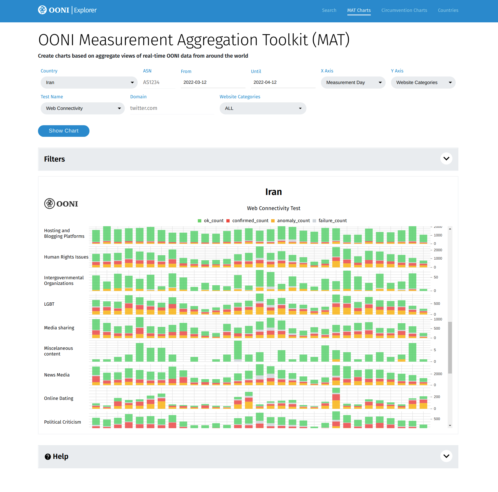
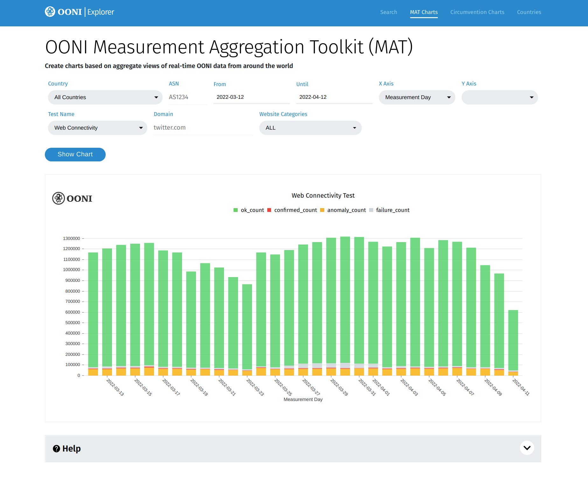
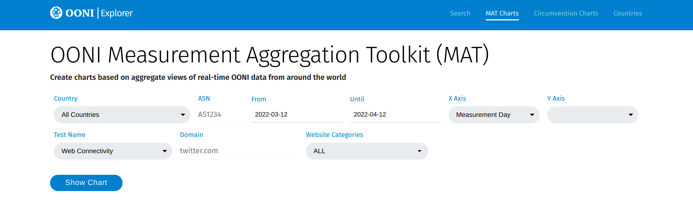
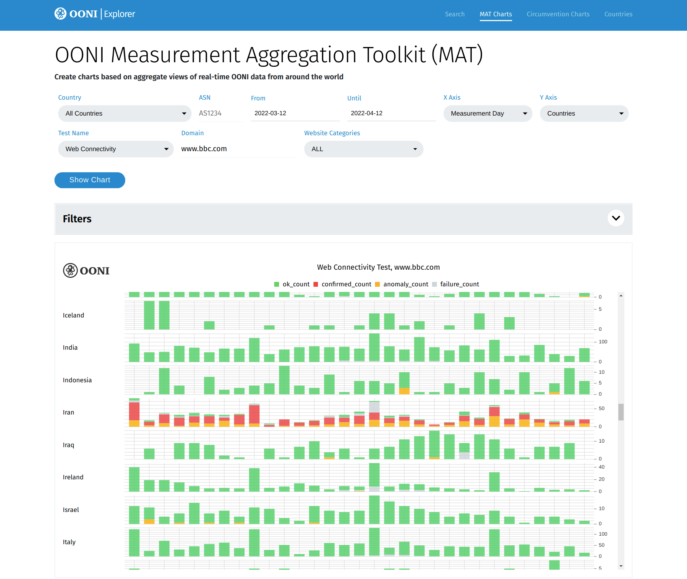
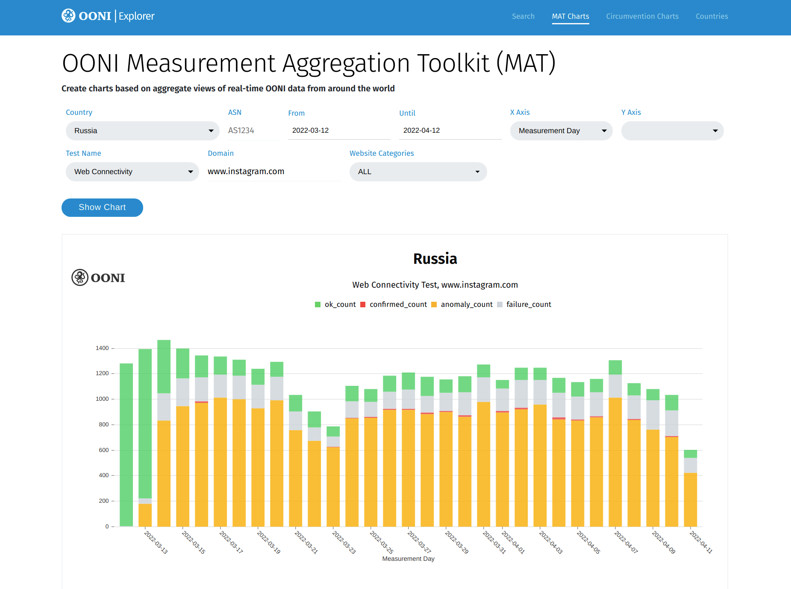
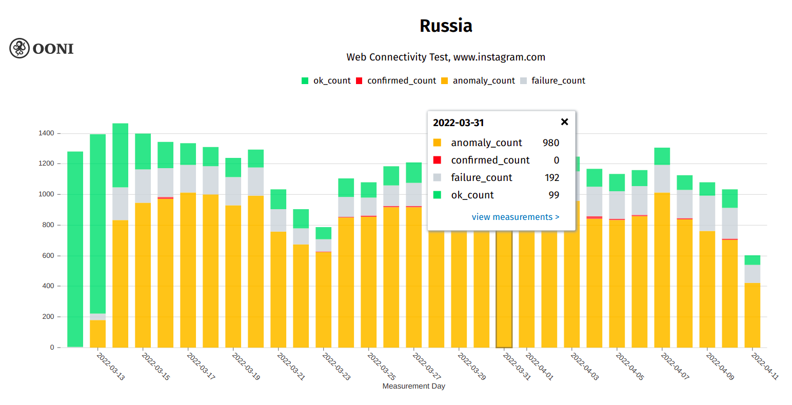

{{}}

Today the Open Observatory of Network Interference (OONI) team is
thrilled to announce the public launch of the **[OONI Measurement Aggregation Toolkit (MAT)](https://explorer.ooni.org/chart/mat)**!

The [MAT](https://explorer.ooni.org/chart/mat) is a tool that enables
you to **create your own custom charts based on aggregate views of
real-time OONI data** collected from around the world.

Use the MAT to **track internet censorship worldwide** based on
real-time OONI data!

* [About the MAT](#about-the-mat)

    * [What is OONI data?](#what-is-ooni-data)

    * [Why use the MAT?](#why-use-the-mat)

* [Using the MAT](#using-the-mat)

    * [Interpreting MAT charts](#interpreting-mat-charts)

* [Acknowledgements](#acknowledgements)

# About the MAT

{{}}

Are you a researcher, journalist, or human rights defender interested in
investigating internet censorship around the world? OONI’s new
[Measurement Aggregation Toolkit (MAT)](https://explorer.ooni.org/chart/mat) was built for you!

The MAT enables you to track internet censorship around the world and
create your own custom charts based on real-time OONI network
measurement data.

## What is OONI data?

Since 2012, OONI has built a [free and open source app](https://github.com/ooni/probe) (called [OONI Probe](https://ooni.org/install/)) that you can install and run to
measure various forms of internet censorship. Through the [OONI Probe app](https://ooni.org/install/), you can run tests on your network to
[measure the blocking of websites](https://ooni.org/nettest/web-connectivity/), the blocking of
instant messaging apps
([WhatsApp](https://ooni.org/nettest/whatsapp/), [Facebook Messenger](https://ooni.org/nettest/facebook-messenger/),
[Telegram](https://ooni.org/nettest/telegram/),
[Signal](https://ooni.org/nettest/signal/)), and to measure the
reachability of censorship circumvention tools (such as
[Psiphon](https://ooni.org/nettest/psiphon/) and
[Tor](https://ooni.org/nettest/tor/)), among many other
[tests](https://ooni.org/nettest/). By default, all OONI Probe test
results are automatically sent to OONI servers, processed, and
**published as [open data](https://ooni.org/data/) in real-time**.

In short, **OONI data is OONI Probe test results**. And OONI Probe test
results contain network measurements on the testing of websites and apps
around the world, often containing **evidence of internet censorship**.

Since 2012, OONI has [openly published more than 808 million network measurements](https://explorer.ooni.org/) collected from 24 thousand
networks in 240 countries and territories. Every minute, as OONI Probe
users around the world run more tests, *new measurements* are
automatically published in real-time. The OONI database is therefore
**one of the largest open datasets on internet censorship** to date.

## Why use the MAT?

To enable the public to explore OONI data and to investigate internet
censorship around the world, we created [OONI Explorer](https://explorer.ooni.org/), which is a web platform that
enables users to [explore OONI measurements through a search tool](https://ooni.org/post/next-generation-ooni-explorer/#search-tool).
However, OONI Explorer lists [individual measurements](https://explorer.ooni.org/search), requiring users to
inspect each measurement one by one. This can make it difficult to
observe *trends and patterns*, as identifying and confirming the
blocking of services often requires **looking at many measurements at
once** (“in aggregate”).

We have therefore provided data analysis support to our partners and
broader community over the years, analyzing OONI data in order to answer
key questions such as the following:

* Does the testing of a service (e.g. Facebook) present **signs of
blocking every time that it is tested** in a country? This can be
helpful for ruling out [false positives](https://ooni.org/support/faq/#what-are-false-positives).

* What types of websites (e.g. LGBTQI websites) are blocked in each
country?

* In which countries is a specific website (e.g. \`bbc.com\`) blocked?

* How does the blocking of different apps (e.g. WhatsApp or Telegram)
vary across countries?

* How does the blocking of a service vary across countries and
networks?

* How does the blocking of a service change over time?

The [MAT](https://explorer.ooni.org/chart/mat) incorporates our data
analysis techniques, enabling you to answer such questions *without* any
data analysis skills, simply with the click of a button! **You can also
generate your own custom charts based on aggregate views of real-time
OONI data, which you can then share on social media and use as part of
your research and/or advocacy.**

# Using the MAT

{{}}

The [MAT](https://explorer.ooni.org/chart/mat) provides filters that
enable you to select the parameters you care about in order to plot
charts based on aggregate views of OONI data.

Specifically, the MAT includes the following filters:

* **Countries:** Select a country through the drop-down menu
(the "All Countries" option will show global coverage)

* **Test Name:** Select an [OONI Probe test](https://ooni.org/nettest/) based on which you would like to get
measurements (for example, select `Web Connectivity` to view the
testing of websites)

* **Domain:** Type the domain for the website you would like to
get measurements (e.g. `twitter.com`)

* **Website categories:** Select the [website category](https://github.com/citizenlab/test-lists/blob/master/lists/00-LEGEND-new\_category\_codes.csv)
for which you would like to get measurements (e.g. `News Media` for
news media websites)

* **ASN:** Type the [ASN](https://ooni.org/support/glossary/\#asn) of the network for
which you would like to get measurements (e.g. `AS30722` for Vodafone
Italia)

* **Date range:** Select the date range of the measurements by
adjusting the `From` and `Until` filters

* **X axis:** Select the values that you would like to appear
on the horizontal axis of your chart

* **Y axis:** Select the values that you would like to appear
on the vertical axis of your chart

Depending on what you would like to explore, adjust the MAT filters
accordingly and click **Show Chart** to generate a chart.

For example, if you would like to check the testing of BBC in all
countries around the world:

* Type `www.bbc.com` under `Domain`

* Select `Countries` under the `Y axis`

* Click `Show Chart`

This will plot numerous charts based on the OONI Probe testing of
`www.bbc.com` worldwide, as illustrated below.

{{}}

## Interpreting MAT charts

The [MAT](https://explorer.ooni.org/chart/mat) charts (and associated
tables) include the following values:

* **OK count:** Successful measurements (i.e. no sign of internet
censorship)

* **Confirmed count:** Measurements from automatically
**confirmed blocked websites** (e.g. a [block page](https://ooni.org/support/glossary/\#block-page) was served)

* **Anomaly count:** Measurements that provided **signs of
potential blocking** (however, [false positives](https://ooni.org/support/faq/\#what-are-false-positives) can
occur)

* **Failure count:** Failed experiments that should be discarded

* **Measurement count:** Total volume of OONI measurements
(pertaining to the selected country, resource, etc.)

When trying to identify the blocking of a service (e.g.
`twitter.com`), check whether:

* Measurements are annotated as `confirmed`, automatically confirming
the blocking of websites

* A large volume of measurements (in comparison to the overall
measurement count) present `anomalies` (i.e. signs of potential
censorship)

For example, if you would like to check the potential blocking of
Instagram in Russia through the MAT:

* Select `Russia` under `Countries`

* Type `www.instagram.com` under `Domain`

* Click `Show Chart`

This will generate the following MAT chart.

{{}}

From the above chart, we can see that `www.instagram.com` was
previously accessible in Russia, and only started to present signs of
blocking on 13th March 2022. From 14th March 2022 onwards, we observe a
large volume of anomalies which has persisted ever since, providing a
strong signal of blocking. We are also able to see that the blocking of
Instagram is confirmed on some networks (where measurements show that
the blocking of `www.instagram.com` was automatically confirmed).
Moreover, the fact that some measurements over the last month show that
`www.instagram.com` was accessible suggests that the block is not
implemented on all networks in Russia. To explore how the blocking of
`www.instagram.com` varies across networks in the country, select
`ASN` under the `Y axis` of the MAT.

Please note that the presence of anomalies is *not* always indicative of
blocking, as [false positives](https://ooni.org/support/faq/#what-are-false-positives) can
occur. A large volume of anomalies can provide a signal of potential
blocking, but it’s useful to corroborate such data with other relevant
resources (when possible). For example, when looking at measurements
pertaining to the reachability testing of circumvention tools like
[Tor](https://ooni.org/nettest/tor/) and
[Psiphon](https://ooni.org/nettest/psiphon/), it’s worth looking at
[Tor Metrics](https://metrics.torproject.org/) and the [Psiphon Data Engine](https://psix.ca/) (both of which share usage stats) as well.
Quite similarly, OONI data on the testing of `www.youtube.com` can be
cross-referenced with [YouTube traffic data from the Google Transparency Report](https://transparencyreport.google.com/traffic/overview?hl=en&fraction_traffic=start:1646611200000;end:1649289599999;product:21;region:US&lu=fraction_traffic).
OONI data on the testing of websites can also generally be compared with
data collected from [Censored Planet](https://data.censoredplanet.org/raw).

You can access raw OONI data by clicking on the bars of
[MAT](https://explorer.ooni.org/chart/mat) charts, and subsequently
clicking on the relevant measurement links.

{{}}

We hope the internet freedom community finds the
[MAT](https://explorer.ooni.org/chart/mat) useful for investigating
and responding to internet censorship events around the world.

If you have any questions, feedback, or feature requests, we’d love to
hear from you! You can [open a ticket](https://github.com/ooni/explorer/issues/) or [write us an email](https://ooni.org/about/#contact).

# Acknowledgements

We thank all [OONI Probe](https://ooni.org/install/) users worldwide
who have contributed (and continue to contribute) measurements,
supporting the [MAT](https://explorer.ooni.org/chart/mat). We also
thank our community members for their invaluable feedback.
