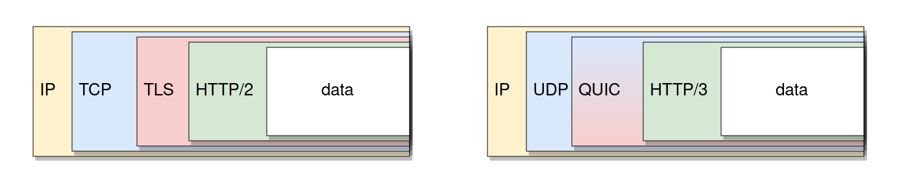
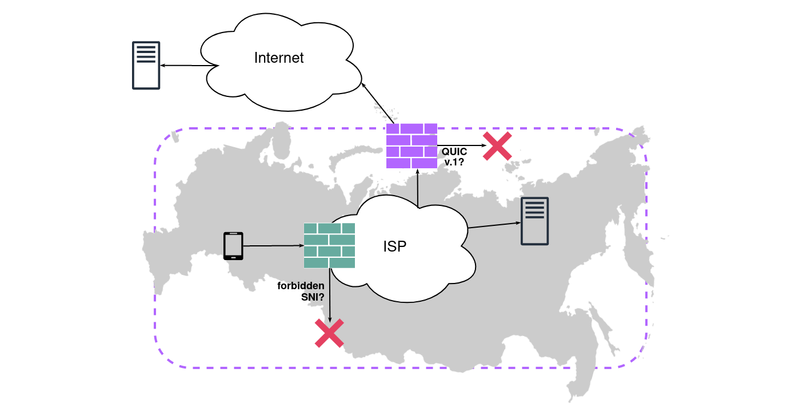
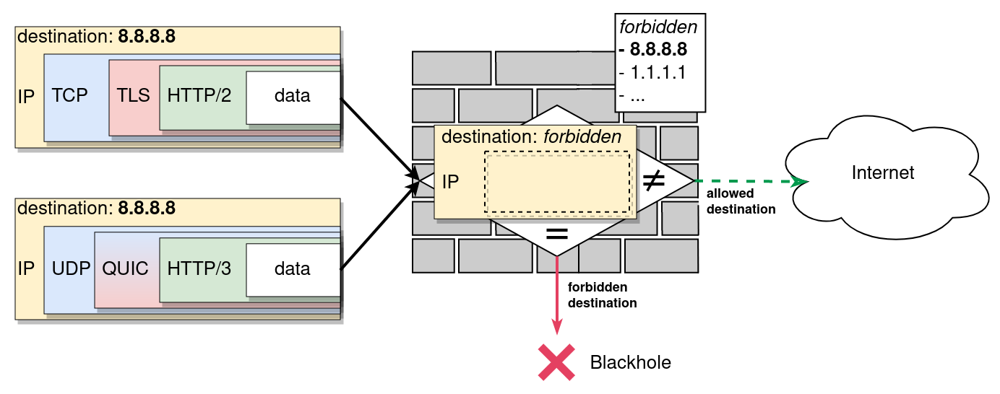

*This blog post was [originally published by the Open Technology Fund](
https://www.opentech.fund/news/a-quick-look-at-quic/) to disseminate Kathrin
Elmenhorst's QUIC-and-HTTP/3 censorship research as part of her ICFP fellowship
at OONI. Republishing with permission.*

Last year, the new network protocol **QUIC** was introduced. QUIC
is a general-purpose transport layer network with the goal of
reducing latency compared to existing protocols. Since the introduction
of QUIC, we have seen rising volumes of QUIC-based web traffic in
the form of **HTTP/3**.

As QUIC usage increases, it has become the target of censorship
efforts. From the perspective of censors, the emergence of QUIC and
HTTP/3 means two things:

* HTTP/3 web traffic looks differently to firewalls, such that
censors need to deploy new strategies to detect it.

* QUIC is better protected by encryption. QUIC encryption hides
not only the details of the communication but also most of the
connection metadata from observers.

From the perspective of the anti-censorship community, the emergence
of QUIC comes with new challenges and possibilities: Monitoring
developments in QUIC censorship since its launch is the groundwork
for developing appropriate censorship evasion tools as early as
possible. Beyond that, the measurements provide unique insights
into how censorship systems are maintained and adapted to change.

This article is an introduction to QUIC and its potential for
censorship resistance, as well as a survey of current QUIC blocking
in various countries. The presented findings reveal QUIC censorship
in China, India, Russia and Uganda.

## A QUIC introduction  

If you had a close look at what your browser is doing when you are
surfing the web, you would see that, over the past few years,
something has been changing. More and more websites are loaded
through HTTP/3 rather than the prior versions HTTP/1.1 or HTTP/2.

This seemingly small change is actually quite a revolution. HTTP/3
is the first version of HTTP that uses QUIC. As a network protocol,
QUIC defines how computers communicate over the internet. Specifically,
QUIC provides secure and reliable connections between clients and
servers.

Instead of using the Transmission Control Protocol (which earlier
HTTP versions used), QUIC builds upon the User Datagram Protocol
(UDP) and provides better network performance. Using UDP – an already
established protocol for sending and receiving messages in an IP
network – also made the large-scale deployment of QUIC a lot easier
since networking devices are already used to this kind of network
traffic.

Privacy and security have become important considerations in the
development of new internet technologies. QUIC is no exception. It
uses built-in encryption which means that TLS 1.3 encryption is
mandatory and an integral part of the protocol.

While work on QUIC began in Google in 2013, it was finalized and
published as Internet Engineering Task Force (IETF) standard in
2021. QUIC is used as the underlying transport for the new major
version of HTTP, HTTP/3. HTTP/3 is currently supported by 73% of
running web browsers and used by [25% of the top 10 million
websites](https://w3techs.com/technologies/details/ce-http3). The
wide deployment of HTTP/3 is largely attributed to how large internet
companies like Google and Facebook use QUIC for their services and
browsers. As it was first developed by Google, the company strongly
pushed its deployment. Thus, the story of QUIC is once more a story
of the extreme influence large players have on the technical landscape
of the internet.

## HTTP protocol stacks  

Network protocols like IP, UDP, TCP and QUIC define how communication
over the internet works. A network protocol is a set of semantical
rules describing in what precise way messages on the web are composed,
formatted, packed, encrypted, sent, relayed, received, and acknowledged.
These rules can then be implemented into software, in any programming
language, on any platform.

Network protocols are designed in layers, adding new functionalities
with each layer. In terms of network packets, each protocol adds
an additional header to the transmitted data (see figure below).

HTTP is an application layer protocol which is mainly used to load
websites from the world wide web into web browsers. The main
difference between traditional HTTPS (HTTP/1.1, HTTP/2) and HTTP/3
is in their underlying protocol stacks. This means that HTTP/3 uses
different network protocols than the prior versions of HTTP:

{{}}
_Left: HTTP/2 protocol stack. Right: HTTP/3 protocol stack._  

HTTP/3 data travels over the network in QUIC packets which are
encapsulated in UDP datagrams. Meanwhile, traditional HTTPS data
is contained in TLS frames which are packed in TCP packets.

UDP provides unreliable transport between ports on source and
destination host, so it only has a subset of the functionality of
TCP. QUIC adds reliability and connection state, so the combination
of UDP and QUIC replaces TCP. Instead of adding TLS as a separate
protocol, QUIC integrates TLS-based encryption.

Finally, the Internet Protocol (IP) routes all internet traffic
between hosts. Thus, both HTTPS (TCP/TLS) and HTTP/3 (QUIC) data
is encapsulated in IP packets labeled with the IP addresses of
source and destination.

## Potentials for censorship resistance

For the blocking of traditional HTTPS traffic, censors often inspect
the Server Name Indication (SNI) which is contained in the very
first TLS packet sent by the client ("Client Hello"). The SNI reveals
the requested host name (e.g. "ooni.org") to anyone monitoring the
network, and can therefore be used for the blocking of specific
hosts.

Early in its development, there were considerations of the potential
of QUIC to be censorship resistant. By design, QUIC protects more
communication data than traditional TCP+TLS traffic. Unlike TCP-based
TLS, QUIC already encrypts the initial packets of a connection.
Although the keys of this initial encryption are known to observers
of the connection, censors have to do the additional work of
extracting the keys and decrypting the information in order to
eavesdrop on the information contained in the initial packets. This
makes packet inspection more complex and less efficient.

So, while it is technically still possible to censor HTTP/3 connections
based on the SNI in TLS, the collected data shows that hardly any
censors actually parse and use this information (even when they do
parse the SNI in traditional HTTPS traffic).

Additionally, the built-in encryption and authentication makes QUIC
traffic less vulnerable to attacks by censors that try to force-terminate
connections ("reset attacks"). Consequently, the (likely) only way
to block QUIC connections is to drop packets until the connection
times out ("null routing"). Since the client will re-transmit lost
packets, null routing requires the censor to invest more resources
in comparison to reset attacks. The data seems to confirm this idea
since the only error type observed for HTTP/3 connections were
timeouts either during the QUIC connection establishment ("handshake")
or in the middle of the working connection.

QUIC connections are designed in a way that makes it harder for
stateful censors to remember and identify QUIC data flows. The
identification numbers of connections can be changed during the
encrypted communication. Thus, a censor that monitors connection
IDs can be tricked by changing the connection IDs mid-communication.

Moreover, QUIC connections can persist even when the IP addresses
of the communication partners change. This feature might also be
useful for tricking stateful censors.

### OONI Probe QUIC measurement tools  

HTTP/3 is supported by the Open Observatory of Network Interference
(OONI) Probe engine since late 2020, and it has been used in two
experimental network tests so far.

**urlgetter** is an experimental measurement tool which tries to
fetch websites to test whether they are accessible or not. urlgetter
can be configured to use HTTP/3 or traditional HTTPS over TCP.

**quicping** is a new network experiment which I developed during
my ICFP fellowship at OONI. The experiment sends out a single initial
QUIC packet which has no valid TLS payload. This ping request elicits
an immediate response from the targeted QUIC server because it
triggers the server's Version Negotiation mechanism.

quicping can be used to test the availability of UDP endpoints (on
hosts that support QUIC). If certain HTTP/3 hosts are blocked in a
network, the experiment can also help narrow down the specific
censorship method: If a blocked HTTP/3 host does not respond to
quicping either, it is very likely that the censor blocks any initial
QUIC packets immediately.

OONI Probe measurements produce report files in JSON format. During
my fellowship, I have developed a toolchain to automatically evaluate
QUIC censorship measurements. The evaluation techniques have a focus
on comparing HTTP/3 and HTTPS blocking.

If you are curious to test some of my evaluation techniques and
investigate HTTP/3 measurements in the country of your interest,
[try out this
notebook](https://colab.research.google.com/drive/1d-UWvDsAHLGFwY583J9kckCfBJfdpmh6?usp=sharing).

Find out more details about the HTTP/3 measurement methodology:  

* [OONI probe-cli urlgetter specification](https://github.com/ooni/spec/blob/master/nettests/ts-027-urlgetter.md)  
    
* [OONI probe-cli quicping specification](https://github.com/ooni/spec/blob/master/nettests/ts-031-quicping.md)  
    
* [postprocessing and evaluation tool chain](https://github.com/kelmenhorst/http3-toolchain)  
    

## QUIC censorship, as of 2022-04-20  

I have investigated networks in China, India, Iran, Kazakhstan,
Russia, Uganda and Venezuela and have found impairment of HTTP/3
traffic in most countries.

Unsurprisingly, the censorship techniques vary between networks.
Some censors do not _specifically_ block QUIC or HTTP/3, but they
use IP censorship which is rather unspecific and blocks HTTP/3
as collateral damage. Others block specific UDP endpoints (combination
of IP address and UDP port) while some even try to inspect individual
QUIC packets ("Deep Packet Inspection").

### Russia (AS31213, AS12389)

Since the beginning of Russia's invasion of Ukraine, [internet
censorship in Russia is rapidly changing and getting more
restrictive](https://ooni.org/post/2022-russia-blocks-amid-ru-ua-conflict/).
Reports suggest that Russia started to block HTTP/3 traffic nationwide
on 4th March 2022. During the last week of March, we were able to
run HTTP/3 measurements in a mobile and a landline network in Russia.

In the mobile network of the ISP Yota (AS31213), HTTP/3 traffic
seems to be generally blocked. However, at least one website, vk.com,
a popular Russian social network, is not affected by this blocking.

The [detailed
analysis](https://github.com/kelmenhorst/quic-censorship/issues/4) of
the measurements suggests a likely blocking scenario which contains
two separate filters for HTTP/3 traffic:

* The first filter blocks all _international_ HTTP/3 connections
that use the most common QUIC version 1.

* The second filter seems to be applied to both national and
international HTTP/3 traffic and it inspects the SNI: If the SNI
of a given packet is on the blacklist, it cannot pass this filter.

This assumed scenario is in line with [recent
reports](https://github.com/net4people/bbs/issues/108) from other
networks in Russia: Users indicated that their ISPs use Deep Packet
Inspection to parse the SNI from the initial packet and block certain
domain names.

{{}}
_Depiction of a potential setup of HTTP/3 censorship in Russia. While the location
and order of filters is unknown, this structure is in line with the observed measurements
in AS31213 and user reports from other networks._

[More info on HTTP/3 censorship in Russia.](https://github.com/kelmenhorst/quic-censorship/issues/4)  

### India (AS133694)

Between the 21st and 25th of February, I ran measurements in India
using a VPN service connected to network AS133694.

The results suggest that there is systematic censorship of HTTP/3
in this network which is done by blocking certain UDP endpoints
completely. Follow-up measurements with an allowed SNI and quicping
were helpful tools to narrow down the blocking technique.

The blocking of HTTP/3 seems rather unstable, since it is not as
consistent as HTTPS blocking in the same network.

In India, ISPs are responsible for implementing state-ordered
censorship. Therefore, it is not surprising that when I ran
measurements in other networks, the results differed. In fact, some
networks (e.g. AS55836) showed no signs of HTTP/3 blocking at all.

[More info on HTTP/3 censorship in India.](https://github.com/kelmenhorst/quic-censorship/issues/2)  

### Uganda (AS37075, AS20294)

In Uganda, we measured in two networks, Airtel and MTN Mobile,
during the month of March. For testing, we used several facebook.com
pages as well as the websites of VPN services. Facebook has been
[blocked nationwide since January
2021](https://freedomhouse.org/country/uganda/freedom-net/2021).

Both ISPs seem to block HTTP/3 traffic to certain hosts.

Strikingly, both networks have a rather high temporal variance of
censorship. Over the span of only a few days, the amount of HTTP/3
blocking as well as the observed blocking methods frequently changed.
While the extent of this variance is unclear to me, it may be a
sign that ISPs in Uganda do not have a stable way to handle HTTP/3
traffic yet and seem to be experimenting in this new territory.

Up until this point, measurements had only recorded QUIC interference
in the form of timeouts during the handshake, i.e. during the
connection establishment. But when measuring in Uganda, on some
days timeouts exclusively occurred on _working_ QUIC connections
(i.e., after the handshake).

[More info on HTTP/3 censorship in Uganda.](https://github.com/kelmenhorst/quic-censorship/issues/3)  

### China (AS45090)  

China deploys a centralized censorship system, colloquially known
as the Great Firewall. I have conducted measurements from a VPS in
China which I was able to use thanks to
[GreatFire.org](https://en.greatfire.org/). The measurements show
that many blocked HTTPS websites are not available over HTTP/3
either.

This data and [other current
research](https://www.usenix.org/conference/foci19/presentation/chai)
suggests that the Great Firewall blacklists IP addresses of unwanted
websites, which is a very broad and unspecific form of censorship.
As many Google domains are targeted by IP blocking, a lot of QUIC
traffic is affected by these blocks as well (a large portion of
QUIC-supporting hosts belong to Google).

This form of IP-blocking affects all protocols that use IP, so any
connection attempt over HTTPS or HTTP/3 to a blocked IP address
will not work. However, I found no evidence that the Great Firewall
_specifically_ targets QUIC or HTTP/3.

{{}}
_Exemplified depiction of how IP censorship affects both HTTPS and HTTP/3: Such
firewalls inspect only the IP header and block every packet with a blacklisted
destination (or source) address._

It may seem surprising that the Great Firewall, which is known to
apply very restrictive and rather sophisticated blocking, does not
explicitly block HTTP/3 yet. But there are a few considerations to
keep in mind:

**a)** While the usage of HTTP/3 is increasing, it is not used as
much as HTTPS so it may seem less important to the censor.

**b)** By default browsers always do an HTTPS request first in order
to find out whether a website even uses HTTP/3. Thus, blocking HTTPS
is enough for censors to prevent browser-based QUIC usage at the
moment. At least for the default usage. That is to say, you can
[force the browser to use HTTP/3 immediately without trying HTTPS
first](https://github.com/kelmenhorst/quic-censorship/blob/main/browsers.md).

[More info on HTTP/3 impairment in China.](https://github.com/kelmenhorst/quic-censorship/issues/1)  

### Iran (AS60178, AS58224, AS197207)  

We have run measurements in multiple networks in Iran, including
the ISPs of the previously state-owned Telecommunication Company
of Iran (TCI). Overall, it seems like HTTP/3 traffic was not affected
by censorship in any of the investigated networks in Iran.

This is curious, with respect to the fact that [our prior
study](https://dl.acm.org/doi/abs/10.1145/3487552.3487836) revealed
QUIC censorship in Iran in 2021. This might be an example of how
dynamic QUIC censorship deployment is at the moment. As censors
still adapt to this new protocol, inconsistencies and changes in
QUIC censorship are to be expected.

### Kazakhstan and Venezuela (AS48716, AS8048)  

There was no indication for systematic HTTP/3 censorship in the
tested networks in Kazakhstan and Venezuela. For Kazakhstan, this
corresponds to HTTP/3 measurements taken last year. For Venezuela,
there were no prior HTTP/3 measurements.

I assume the censors have not implemented any HTTP/3 blocking rules
yet. Due to the novelty of the protocol and the still rather low
deployment in comparison to HTTPS, this is not too surprising but
likely to change in the future when HTTP/3 deployment further
increases.

## Final thoughts: What to expect from censors and how to prepare  

Last year, in early 2021, we did [the first QUIC censorship
measurements with OONI
Probe](https://dl.acm.org/doi/abs/10.1145/3487552.3487836). We only
found two networks in one country (Iran) where it seemed like HTTP/3
was specifically blocked. Only one year later, most networks we
measured in showed some kind of HTTP/3 specific blocking. In Russia,
we have even observed multiple layers of HTTP/3 censorship and Deep
Packet Inspection of QUIC packets (SNI blocking). While the censorship
methodologies appear to be unstable in many networks still, this
is clearly showing that HTTP/3 censorship is increasing proportionally
to HTTP/3 usage.

QUIC is a reality that the anti-censorship community has to be aware
of in order to better monitor and fight censorship in the future.

With that in mind, I have defined [approaches for QUIC censorship
evasion](https://github.com/kelmenhorst/quic-censorship/blob/main/evade.md)
which refer back to [QUIC's potentials for censorship
resistance](#potentials-censorship-resistance).
