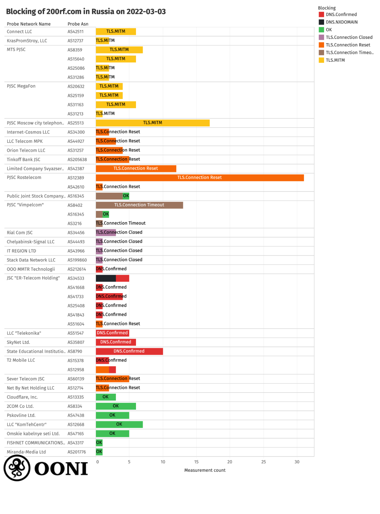
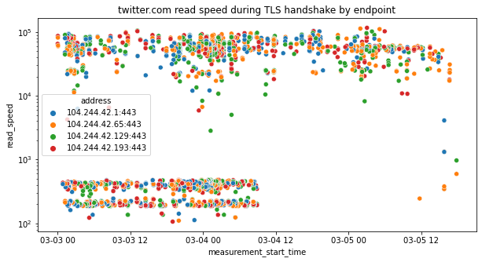
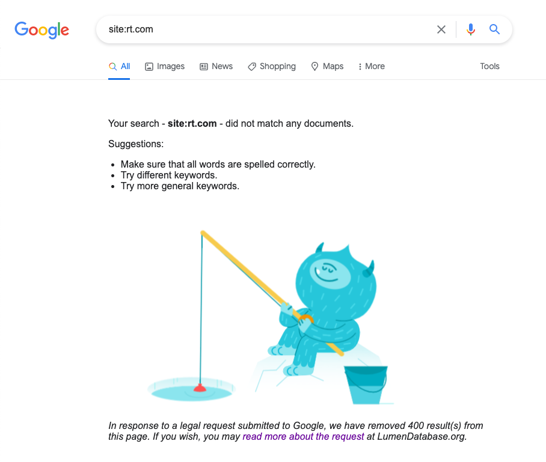



Information controls are known to occur during conflicts, and that’s exactly what we’re seeing in Russia following the recent invasion of Ukraine on 24th February 2022.

In recent days, [OONI network measurement data](https://explorer.ooni.org/search?since=2022-02-04&until=2022-03-07&failure=false&probe_cc=RU) collected from Russia shows that many Internet Service Providers (ISPs) have started [blocking](https://explorer.ooni.org/search?since=2022-02-04&until=2022-03-07&failure=false&probe_cc=RU&test_name=web_connectivity&only=anomalies) access to several news media websites, as well as to a [website](https://explorer.ooni.org/search?since=2022-02-04&until=2022-03-07&failure=false&probe_cc=RU&test_name=web_connectivity&only=anomalies&domain=200rf.com) (200rf.com) that shares information about captured and killed Russian soldiers in Ukraine. OONI data also shows that Russian ISPs started [throttling access to Twitter](https://explorer.ooni.org/search?since=2022-02-26&until=2022-03-04&failure=false&domain=twitter.com&probe_cc=RU) on 26th February 2022, and switched to [blocking](https://explorer.ooni.org/measurement/20220306T202033Z_webconnectivity_RU_51604_n1_oVoIGdnUmlxCWmyR?input=https%3A%2F%2Ftwitter.com%2F) it by 4th March 2022 – at which point, they also started [blocking access to Facebook](https://explorer.ooni.org/search?since=2022-02-04&until=2022-03-07&failure=false&domain=www.facebook.com&probe_cc=RU&only=anomalies). Censorship in Russia is generally implemented in a [decentralized](https://www.ndss-symposium.org/ndss-paper/decentralized-control-a-case-study-of-russia/) way, as blocks are not observed on all networks, while ISPs adopt a variety of different censorship techniques.

In this report, we share an in-depth analysis of new censorship events that have recently emerged in Russia based on [OONI network measurement data](https://explorer.ooni.org/search?since=2022-02-04&until=2022-03-07&failure=false&probe_cc=RU&test_name=web_connectivity&only=anomalies).



## Key Findings

*   **Media censorship.** Russia recently started blocking access to independent Russian news media websites (such as [Dozhd](https://explorer.ooni.org/search?since=2022-02-03&until=2022-03-07&failure=false&domain=tvrain.ru&probe_cc=RU&only=anomalies) and [New Times](https://explorer.ooni.org/search?since=2022-03-04&until=2022-03-07&failure=false&domain=newtimes.ru&probe_cc=RU&only=anomalies)) and foreign news media websites (such as [BBC](https://explorer.ooni.org/search?since=2022-02-03&until=2022-03-07&failure=false&domain=www.bbc.com&probe_cc=RU&only=anomalies), [Deutsche Welle](https://explorer.ooni.org/search?since=2022-02-03&until=2022-03-07&failure=false&domain=www.dw.com&probe_cc=RU&only=anomalies), [Russian version of Voice of America](https://explorer.ooni.org/search?since=2022-02-03&until=2022-03-07&failure=false&domain=www.golos-ameriki.ru&probe_cc=RU&only=anomalies), and [Russian service of Radio Liberty](https://explorer.ooni.org/search?since=2022-02-03&until=2022-03-07&failure=false&domain=www.svoboda.org&probe_cc=RU&only=anomalies)).
*   **Blocking of a website about captured and killed Russian soldiers.** Russia [blocked access to 200rf.com](https://explorer.ooni.org/search?since=2022-03-03&until=2022-03-06&failure=false&domain=200rf.com&probe_cc=RU), which was created by representatives of the Ministry of Internal Affairs of Ukraine to [share information about captured and killed Russian soldiers](https://200rf.com/) in Ukraine.
*   **Centralized throttling of Twitter.** OONI data suggests that access to [twitter.com was throttled](https://explorer.ooni.org/search?since=2022-02-26&until=2022-03-04&failure=false&domain=twitter.com&probe_cc=RU) in Russia between 26th February 2022 to 4th March 2022. As the throttling of twitter.com seems to have stopped across all ISPs in Russia at the same time (~08:00 on 4th March 2022 UTC), it appears to have been centralized. Moreover, interference to twitter.com appears to have changed from throttling to blocking (through the injection of a RST packet) on 4th March 2022.
*   **Blocking of Facebook and Twitter.** OONI data shows that access to [facebook.com](https://explorer.ooni.org/search?since=2022-02-04&until=2022-03-07&failure=false&domain=www.facebook.com&probe_cc=RU&only=anomalies) and [twitter.com was blocked](https://explorer.ooni.org/search?since=2022-03-04&until=2022-03-07&failure=false&domain=twitter.com&probe_cc=RU) in Russia by 4th March 2022 (primarily through the injection of RST packets).
*   **Decentralized censorship.** Every Internet Service Provider (ISP) in Russia is responsible for implementing government-mandated blocks independently. As a result, we observe variance in how internet censorship is implemented across Russia, as blocks are not implemented on all networks in the country, and different ISPs adopt different censorship techniques. Some ISPs implement blocks through the use of multiple techniques at the same time, making circumvention harder.
*   **Different censorship techniques.** To block websites, OONI data shows that Russian ISPs adopt the following censorship techniques (beyond throttling):
    *   [DNS manipulation, redirecting in some cases to blockpages](https://explorer.ooni.org/measurement/20220305T042324Z_webconnectivity_RU_35807_n1_7gOd4SMmKjQ3mmYn?input=https%3A%2F%2Fwww.bbc.com%2Frussian%2F)
    *   [HTTP man-in-the-middle, serving blockpages](https://explorer.ooni.org/measurement/20220304T214241Z_webconnectivity_RU_12389_n1_UeXMqEpughRTTzLU?input=http%3A%2F%2Fwww.bbc.com%2Fnews)
    *   [TLS man-in-the-middle](https://explorer.ooni.org/measurement/20220304T050209Z_webconnectivity_RU_8359_n1_Ajrlzw7jakFRM3pM?input=https%3A%2F%2Fwww.bbc.com%2F)
    *   [Injection of a RST packet after the ClientHello during the TLS handshake](https://explorer.ooni.org/measurement/20220305T090244Z_webconnectivity_RU_8732_n1_oCVFwxN1oAYddBoX?input=https%3A%2F%2Fwww.bbc.com%2Frussian%2F) (most prevalent)
    *   [Timing out the session after the ClientHello during the TLS handshake](https://explorer.ooni.org/measurement/20220304T080535Z_webconnectivity_RU_16345_n1_3v6HMrLt0KTMXcpm?input=https%3A%2F%2Fwww.bbc.com%2F)
    *   [Closing the connection after the ClientHello during the TLS handshake](https://explorer.ooni.org/measurement/20220304T034651Z_webconnectivity_RU_31163_n1_asVR1x6WcRk5AdL0?input=https%3A%2F%2Fwww.bbc.com%2F)

## Background

On 24th February 2022, [Russia invaded Ukraine](https://www.dw.com/en/russias-invasion-of-ukraine-2022/t-60931789) and the military operation is currently ongoing. The conflict between the two nations began 8 years ago (February 2014), when Russia invaded and [annexed the Crimean Peninsula](https://www.bbc.com/news/world-europe-26644082) from Ukraine. This was followed by the [war in the eastern Donbas region](https://www.bbc.com/news/world-europe-59599066) of Ukraine (which has since been ongoing), where Russian separatist groups have been backed by the Russian military. Over the years, the conflict has also involved cyberwarfare, with a series of [cyberattacks](https://en.wikipedia.org/wiki/Russian%E2%80%93Ukrainian_cyberwarfare) reportedly launched by both Russia and Ukraine.

Leading up to and following the current full-scale invasion of Ukraine, DDoS attacks have been launched against Ukrainian government and banking websites, which US officials [attributed](https://www.wired.com/story/ukraine-ddos-russia-crypo-roblox-security-news/) to Russia, but the Russian government [denied](https://www.cnbc.com/2022/02/23/cyberattack-hits-ukrainian-banks-and-government-websites.html) involvement. Russia was also accused of targeting the machines of multiple organizations in Ukraine with [data-wiper malware](https://www.theguardian.com/world/2022/feb/24/russia-unleashed-data-wiper-virus-on-ukraine-say-cyber-experts). Meanwhile, the Anonymous hacker collective [declared cyberwar](https://www.theguardian.com/world/2022/feb/27/anonymous-the-hacker-collective-that-has-declared-cyberwar-on-russia) against the Russian government, claiming credit for hacking the Russian Ministry of Defense database. They also reportedly hacked Russian state TV channels to post pro-Ukraine content and [taking down](https://twitter.com/YourAnonTV/status/1496968999900377088) the website (rt.com) of the Russian state news website RT. Amid the war, Ukraine has experienced [internet outages affecting several networks](https://ioda.inetintel.cc.gatech.edu/country/UA?from=1645315200&until=1646351999) over the last week, but overall, the country’s [internet infrastructure appears to continue to function](https://labs.ripe.net/author/emileaben/the-ukrainian-internet/) despite the conflict. 

Over the years, both Russia and Ukraine have engaged in geopolitical censorship, as [Russia has been blocking Ukrainian websites](https://explorer.ooni.org/search?since=2022-02-01&until=2022-03-04&failure=false&probe_cc=RU&only=confirmed) (such as [uapolitics.com](https://explorer.ooni.org/measurement/20220209T105254Z_webconnectivity_RU_34456_n1_KKpP9t7GsvOoSpso?input=http%3A%2F%2Fuapolitics.com%2F), [24tv.ua](https://explorer.ooni.org/measurement/20220205T225542Z_webconnectivity_RU_51813_n1_tvDoPQfDxPE9RLGu?input=https%3A%2F%2F24tv.ua%2F), [donbass.ua](https://explorer.ooni.org/measurement/20211202T235114Z_webconnectivity_RU_51570_n1_yvzXZ3JcMTOzGuKY?input=http%3A%2F%2Fdonbass.ua%2F)), while [Ukraine has been blocking Russian websites](https://explorer.ooni.org/search?since=2022-02-01&until=2022-03-04&failure=false&probe_cc=UA&only=confirmed) (such as [mail.ru](https://explorer.ooni.org/measurement/20220301T043010Z_webconnectivity_UA_35362_n1_5ncpRAizRmdWcaXq?input=http%3A%2F%2Fmail.ru%2F), [rt.com](https://explorer.ooni.org/measurement/20220302T043733Z_webconnectivity_UA_13188_n1_1NoiSEKgixSqo1OU?input=http%3A%2F%2Frt.com%2F), [gazeta.ru](https://explorer.ooni.org/measurement/20220302T062501Z_webconnectivity_UA_13188_n1_cz1btWU7agooErpV?input=http%3A%2F%2Fgazeta.ru%2F)). Russia though has been implementing more widespread internet censorship, also [blocking numerous LGBTIQ websites](https://ooni.org/post/2021-no-access-lgbtiq-website-censorship-six-countries/), a variety of websites that express political criticism (such as [ej.ru](https://explorer.ooni.org/measurement/20220303T142326Z_webconnectivity_RU_8402_n1_tZlHfk2hR4eLRhK6?input=http%3A%2F%2Fwww.ej.ru%2F), [imrussia.org](https://explorer.ooni.org/measurement/20220302T211436Z_webconnectivity_RU_51813_n1_DdYZMJBi9cKyvb7I?input=https%3A%2F%2Fimrussia.org%2Fru%2F), [kasparov.ru](https://explorer.ooni.org/measurement/20220303T050847Z_webconnectivity_RU_8790_n1_bua5WgKgLMSiTCqQ?input=http%3A%2F%2Fkasparov.ru%2F), [fbk.info](https://explorer.ooni.org/measurement/20220303T010633Z_webconnectivity_RU_51813_n1_woCOU3fsT8qop47t?input=https%3A%2F%2Ffbk.info%2F)), as well as the [website of opposition leader Alexei Navalny](https://explorer.ooni.org/search?since=2022-02-01&until=2022-03-04&failure=false&probe_cc=RU&domain=navalny.com) (which OONI data suggests has been [blocked since 26th July 2021](https://explorer.ooni.org/search?since=2021-07-01&until=2021-07-31&failure=false&probe_cc=RU&domain=navalny.com)). 

Following the recent Russian invasion of Ukraine, we started to hear of some new censorship events in Russia, which we corroborate with OONI data and share in this report.

## Methods

Since 2012, OONI has developed [free and open source software](https://github.com/ooni/), called [OONI Probe](https://ooni.org/install/), designed to [measure various forms of internet censorship](https://ooni.org/nettest/). OONI Probe is run by volunteers in around 160 countries every month, and their test results are automatically [published by OONI as open data in real-time](https://ooni.org/data/). More than [675 million network measurements](https://explorer.ooni.org/) have been collected and published from 23,000 networks in 240 countries and territories over the last decade.

OONI Probe users in Russia, in particular, regularly contribute a large volume of measurements, having contributed [154,672,256 measurements from 2,600 local networks in Russia](https://explorer.ooni.org/country/RU) over the years. Every day, new measurements are collected from Russia and [openly published](https://explorer.ooni.org/search?since=2022-02-02&until=2022-03-05&failure=false&probe_cc=RU) in real-time. We base the analysis of this research on a subset of these measurements collected from Russia (and several European countries) over the last month.

More specifically, this report involves an analysis of measurements collected from [OONI’s Web Connectivity test](https://ooni.org/nettest/web-connectivity/), which is designed to measure the blocking of websites (these websites are publicly hosted on the [Citizen Lab test list Github repository](https://github.com/citizenlab/test-lists/tree/master/lists)). This test measures the accessibility of websites by attempting to perform a [DNS lookup](https://ooni.org/support/glossary/#dns-lookup), TCP/IP connection, and [HTTP GET request](https://ooni.org/support/glossary/#http-request) from two vantage points: (1) the local vantage point of the user and (2) a control network (non-censored network). The results from both networks are automatically compared and if they match, the tested URL is annotated as “accessible” (if the testing succeeds from the control vantage point). If the results differ, the tested URL is annotated as “[anomalous](https://ooni.org/support/faq/#what-do-you-mean-by-anomalies)”, which may provide a signal of potential blocking.

Depending on why the anomaly emerges, the anomalous measurement is automatically annotated as a `DNS`, `TCP/IP`, `HTTP diff`, or `HTTP failure` anomaly. For example, if the DNS lookup resolves to an IP address which differs from that resolved from the control vantage point, the measurement is annotated as a “DNS anomaly”, which may be a sign of [DNS tampering](https://ooni.org/support/glossary/#dns-tampering).

However, [false positives](https://ooni.org/support/faq/#what-are-false-positives) can occur, which is why we look at anomalous measurements in aggregate in order to determine if a tested URL consistently presents a large volume of anomalous measurements (in comparison to successful measurements) on a tested network. If a tested URL presents a large volume of anomalies, it may provide a stronger signal of potential blocking. If the types of anomalies are consistent (for example, always presenting DNS anomalies on a tested network), they offer an even stronger signal of potential censorship (since they suggest the use of a specific censorship technique, such as [DNS hijacking](https://ooni.org/support/glossary/#dns-hijacking)). But beyond aggregating anomalous measurements, we also analyze the raw data pertaining to anomalous measurements in order to identify the specific errors that occurred as part of the testing, offering insight into how a tested URL is potentially blocked.

Based on our current heuristics, we automatically confirm the blocking of websites when a [block page](https://ooni.org/support/glossary/#block-page) is served and we have added the fingerprint of that blockpage to our database. We also automatically confirm the blocking of websites based on DNS answers containing IP addresses that are known to be associated with implementing internet censorship. For other forms of censorship, we analyze OONI data in order to aggregate anomalous measurements and identify why and how those anomalies occur, offering insight into additional cases of potential blocking.

To enable the internet freedom community to benefit from our analysis (and to support rapid response efforts), we have been building a [Measurement Aggregation Toolkit (MAT)](https://explorer.ooni.org/experimental/mat) which enables users to produce custom charts based on aggregate views of OONI data. We use charts generated from the MAT in this report.

While OONI does not currently have a methodology specifically designed to automatically measure throttling, we are able to infer potential throttling by analyzing the `network_event` keys of the raw data in [Web Connectivity measurements](https://explorer.ooni.org/search?since=2022-02-02&until=2022-03-05&failure=false&probe_cc=RU&test_name=web_connectivity). We share the findings of our analysis in the following sections of this report.

## Findings

Following the invasion of Ukraine, OONI data shows that Russia started:

*   Blocking several [news media websites](https://explorer.ooni.org/search?since=2022-02-04&until=2022-03-07&failure=false&probe_cc=RU&test_name=web_connectivity&only=anomalies)
*   Blocking a [website](https://explorer.ooni.org/search?since=2022-02-04&until=2022-03-07&failure=false&probe_cc=RU&test_name=web_connectivity&only=anomalies&domain=200rf.com) (200rf.com) that shares information about captured and killed Russian soldiers
*   [Centralized throttling of Twitter](https://explorer.ooni.org/search?since=2022-02-26&until=2022-03-04&failure=false&domain=twitter.com&probe_cc=RU) (between 26th February 2022 to 4th March 2022)
*   Blocking [Facebook](https://explorer.ooni.org/search?since=2022-02-04&until=2022-03-07&failure=false&domain=www.facebook.com&probe_cc=RU&only=anomalies) and [Twitter](https://explorer.ooni.org/search?since=2022-03-04&until=2022-03-07&failure=false&domain=twitter.com&probe_cc=RU) (from 4th March 2022 onwards)

But these censorship events are not present on all networks in Russia.

Russia implements internet censorship in a [decentralized](https://www.ndss-symposium.org/ndss-paper/decentralized-control-a-case-study-of-russia/) manner, as every Internet Service Provider (ISP) in Russia is responsible for implementing government-mandated blocks independently. As a result, we observe [variance](https://censoredplanet.org/assets/russia.pdf) in how internet censorship is implemented across Russia, as blocks are not implemented on all networks in the country, and different ISPs adopt different censorship techniques.

To block websites, OONI data shows that Russian ISPs adopt the following censorship techniques:

*   [DNS manipulation, redirecting in some cases to blockpages](https://explorer.ooni.org/measurement/20220305T042324Z_webconnectivity_RU_35807_n1_7gOd4SMmKjQ3mmYn?input=https%3A%2F%2Fwww.bbc.com%2Frussian%2F)
*   [HTTP man-in-the-middle, serving blockpages](https://explorer.ooni.org/measurement/20220304T214241Z_webconnectivity_RU_12389_n1_UeXMqEpughRTTzLU?input=http%3A%2F%2Fwww.bbc.com%2Fnews)
*   [TLS man-in-the-middle](https://explorer.ooni.org/measurement/20220304T050209Z_webconnectivity_RU_8359_n1_Ajrlzw7jakFRM3pM?input=https%3A%2F%2Fwww.bbc.com%2F)
*   [Injection of a RST packet after the ClientHello during the TLS handshake](https://explorer.ooni.org/measurement/20220305T090244Z_webconnectivity_RU_8732_n1_oCVFwxN1oAYddBoX?input=https%3A%2F%2Fwww.bbc.com%2Frussian%2F)
*   [Timing out the session after the ClientHello during the TLS handshake](https://explorer.ooni.org/measurement/20220304T080535Z_webconnectivity_RU_16345_n1_3v6HMrLt0KTMXcpm?input=https%3A%2F%2Fwww.bbc.com%2F)
*   [Closing the connection after the ClientHello during the TLS handshake](https://explorer.ooni.org/measurement/20220304T034651Z_webconnectivity_RU_31163_n1_asVR1x6WcRk5AdL0?input=https%3A%2F%2Fwww.bbc.com%2F)

The most common method we see implemented (in terms of the number of ISPs relying on it) is the injection of a RST packet following the ClientHello during the TLS handshake. DNS based filtering is also very prevalent.

Not only does internet censorship vary across providers in Russia, but OONI data also suggests that censorship can also vary in how it’s implemented within an ASN. On some networks where we see block pages being served for a tested website (thereby confirming the block), we see other measurements collected from the same network (on the same day) that show that the same site is accessible. This suggests that on some networks, the blocking of websites is not implemented consistently on an ASN-level, but may vary in its implementation within the same network. Moreover, certain ISPs have implemented blocking through the use of multiple techniques at the same time, making circumvention harder.

But Russia is not the only country to have increased its censorship amid the war in Ukraine. Following [EU sanctions on Russian state-owned media outlets](https://www.consilium.europa.eu/en/press/press-releases/2022/03/02/eu-imposes-sanctions-on-state-owned-outlets-rt-russia-today-and-sputnik-s-broadcasting-in-the-eu/), several European countries (such as [Greece](https://explorer.ooni.org/measurement/20220304T144806Z_webconnectivity_GR_3329_n1_dsFVoQ4VJpoCt8fI?input=https%3A%2F%2Fwww.rt.com) and [France](https://explorer.ooni.org/measurement/20220306T025735Z_webconnectivity_FR_15557_n1_KvMNzvez6OP3omZT?input=https%3A%2F%2Fwww.rt.com%2F)) have recently started blocking access to the Russia Today (RT) and Sputnik News websites. Both Russia and the EU argue that these new censorship events are on the grounds of limiting the spread of misinformation.

### Russia

#### Blocking of news media websites

On 24th February 2022, Roskomnadzor published a [statement](https://rkn.gov.ru/news/rsoc/news74084.htm) claiming that media organizations are obliged to “only use information and data received from official Russian sources”. In the same statement, Roskomnadzor reminds the media that “the dissemination of knowingly false information entails liability under Article 13.15 of the Code of Administrative Offenses of the Russian Federation in the form of an administrative fine of up to 5 million rubles”. They also warned that the dissemination of false information on the Internet will result in the immediate blocking of such materials by Roskomnadzor in accordance with Article 15.3 of the Federal Law No. 149-FZ ("On Information, Information Technologies and Information Protection").

On 4th March 2022, Roskomnadzor [reportedly began blocking access to several foreign news media websites](https://cpj.org/2022/03/russia-further-blocks-media-outlets-social-media/) (including [BBC](https://www.theguardian.com/media/2022/mar/04/bbc-website-blocked-in-russia-as-shortwave-radio-brought-back-to-cover-ukraine-war), [Deutsche Welle](https://www.dw.com/en/dw-website-blocked-in-russia-letter-from-director-general-to-users/a-61011476), [Voice of America](https://www.voanews.com/a/voa-bbc-vow-to-keep-news-flowing-despite-russian-ban-/6470590.html), [Meduza](https://meduza.io/en/feature/2022/03/04/we-ain-t-done-yet), and several services of [Radio Free Europe/Radio Liberty](https://www.rferl.org/a/31735597.html)) on the grounds of spreading false information. On the same day, Russia [adopted a bill with amendments to the Russian Criminal Code](https://interfax.com/newsroom/top-stories/75419/) which introduces higher penalties – including a [prison sentence of up to 15 years](https://cpj.org/2022/03/proposed-russian-legislation-threatens-15-years-in-prison-for-fake-information-about-ukraine-invasion/) –  for those convicted of disseminating false information about Russian military operations, discrediting the Russian Armed Forces, and calls for anti-Russian sanctions. This has resulted in western media outlets [suspending their reporting and broadcasts](https://www.washingtonpost.com/media/2022/03/05/cnn-russia-abc-putin-censorship-law/) from within Russia in order to protect their journalists. Tim Davie, the BBC’s Director General, reportedly [stated](https://www.theguardian.com/media/2022/mar/04/bbc-temporarily-suspending-work-all-news-journalists-russia) the legislation “appears to criminalize the process of independent journalism” in Russia.

We are able to observe the blocking of media websites in Russia through OONI data, as illustrated in the chart below.


**Chart:** Blocking of news media websites in Russia based on OONI measurements (collected between February to March 2022), [https://explorer.ooni.org/experimental/mat?probe_cc=RU&test_name=web_connectivity&category_code=NEWS&since=2022-02-02&until=2022-03-05&axis_x=measurement_start_day&axis_y=input](https://explorer.ooni.org/experimental/mat?probe_cc=RU&test_name=web_connectivity&category_code=NEWS&since=2022-02-02&until=2022-03-05&axis_x=measurement_start_day&axis_y=input)

The above chart aggregates OONI measurements collected from Russia (between February 2022 to March 2022) pertaining to the testing of news media websites that started presenting anomalies following the invasion of Ukraine (which started on 24th February 2022). Each bar for a given domain and day represents the percentage of measurements for a given status (`anomaly`, `confirmed` or `OK`) aggregated across all networks.

As is evident from the above chart, these media websites were found accessible (i.e. green) on almost all tested networks in Russia over the last month, and only started presenting signs of blocking (“anomalies”, indicated in orange) following the invasion of Ukraine. It is also evident that these media websites are not blocked on all tested networks in Russia, as we observe that they were found accessible on some networks.

Moreover, our analysis (through the above chart) shows that the blocking of news media websites started on different days. First we observe the [blocking of Current Time TV](https://explorer.ooni.org/search?since=2022-02-27&until=2022-02-28&failure=false&domain=www.currenttime.tv&probe_cc=RU&only=anomalies) (currentime.tv), [Crimea Realities](https://explorer.ooni.org/search?since=2022-02-27&until=2022-02-28&failure=false&domain=ru.krymr.com&probe_cc=RU&only=anomalies) (ru.krymr.com) and [Interfax](https://explorer.ooni.org/search?since=2022-02-27&until=2022-02-28&failure=false&domain=www.interfax.ru&probe_cc=RU&only=anomalies) (interfax.ru), which appears to have started on 27th February 2022. The timing of the block (as suggested by OONI data) is also corroborated by Radio Free Europe/Radio Liberty (RFE/RL), who published a [statement](https://pressroom.rferl.org/a/rferl-strongly-condemns-blockage-of-russian-language-websites-and-harassment-of-journalists/31728748.html) about the blocking of currentime.tv and ru.krymr.com on 28th February 2022. We then observe that the blocking of tvrain.ru [began](https://explorer.ooni.org/search?since=2022-03-01&until=2022-03-02&failure=false&domain=tvrain.ru&probe_cc=RU&only=anomalies) on 1st March 2022. The blocking of all other media websites listed in the above graph appears to have [started](https://explorer.ooni.org/search?since=2022-03-03&until=2022-03-05&failure=false&probe_cc=RU&only=anomalies&test_name=web_connectivity) on the night of 3rd-4th March 2022.

##### BBC

On 4th March 2022, it was [reported](https://www.theguardian.com/media/2022/mar/04/bbc-website-blocked-in-russia-as-shortwave-radio-brought-back-to-cover-ukraine-war) that ISPs in Russia began blocking access to BBC, with their website reportedly being available at only 17% of normal levels in Russia.

This is corroborated by OONI data. At 21:34 UTC on 3rd March 2022, OONI measurements collected from Russia started to show the [first signs of BBC blocking](https://explorer.ooni.org/measurement/20220303T213429Z_webconnectivity_RU_41668_n1_krRshjjBSYrOQK0l?input=https%3A%2F%2Fwww.bbc.com%2Fnews). On 4th March 2022, most OONI measurements from the testing of bbc.com on multiple networks in Russia [presented signs of blocking](https://explorer.ooni.org/search?since=2022-02-03&until=2022-03-06&failure=false&probe_cc=RU&domain=www.bbc.com&only=anomalies), as illustrated below.


**Chart:** OONI data on the testing of bbc.com in Russia, [https://explorer.ooni.org/search?since=2022-02-03&until=2022-03-06&failure=false&domain=www.bbc.com&probe_cc=RU](https://explorer.ooni.org/search?since=2022-02-03&until=2022-03-06&failure=false&domain=www.bbc.com&probe_cc=RU)

The OONI Probe testing of bbc.com in Russia [shows](https://explorer.ooni.org/search?since=2022-02-03&until=2022-03-06&failure=false&probe_cc=RU&domain=www.bbc.com) that different ISPs block access to the site using different censorship techniques, and that bbc.com is still accessible on some networks in Russia.

Based on OONI data, we are able to [automatically confirm the blocking of bbc.com](https://explorer.ooni.org/search?since=2022-02-03&until=2022-03-06&failure=false&probe_cc=RU&domain=www.bbc.com&only=confirmed) on the following 17 networks in Russia: `AS34533`, `AS31213`, `AS48642`, `AS3216`, `AS13335`, `AS8492`, `AS31133`, `AS31257`, `AS25513`, `AS42668`, `AS8402`, `AS8427`, `AS8359`, `AS50542`, `AS41733`, `AS12389`, `AS52207`. On these networks, OONI data shows that a [block page is served](https://explorer.ooni.org/measurement/20220305T093618Z_webconnectivity_RU_41733_n1_oOXBvcd4vbRZrnPh?input=http%3A%2F%2Fwww.bbc.com%2Fnews) when internet users try to access bbc.com.


**Image:** Block page served for bbc.com on AS41733 network in Russia.

We observe DNS based interference on 14 different networks, as illustrated by the following table:

|probe_asn|blocking_method|count|
|---------|-----------------------|-----|
|AS12389  |dns.confirmed          |1    |
|         |http.confirmed_pipeline|5    |
|         |https.connection_reset |10   |
|         |tls.connection_reset   |87   |
|AS15378  |dns.confirmed          |1    |
|         |tls.timeout |2    |
|AS197460 |dns.confirmed          |1    |
|AS2848   |dns.confirmed          |9    |
|AS3335   |dns.confirmed          |1    |
|AS35807  |dns.confirmed          |24   |
|         |https.connection_closed|1    |
|         |tls.connection_closed  |7    |
|AS41668  |dns.confirmed          |3    |
|         |https.connection_reset |1    |
|         |tls.connection_reset   |7    |
|AS41733  |dns.confirmed          |11   |
|         |https.connection_reset |2    |
|         |tls.connection_reset   |8    |
|AS42289  |dns.confirmed          |3    |
|AS51547  |dns.confirmed          |10   |
|AS51604  |dns.confirmed          |1    |
|         |tls.connection_reset   |5    |
|AS52207  |dns.confirmed          |13   |
|AS8427   |dns.confirmed          |5    |
|         |http.confirmed_pipeline|2    |
|         |https.generic_failure  |3    |
|AS8790   |dns.confirmed          |16   |

On some networks, such as AS12389, we notice that the blocking is implemented using three distinct methods. For example, if we look at an [OONI measurement collected on 4th March 2022](https://explorer.ooni.org/measurement/20220304T044651Z_webconnectivity_RU_12389_n1_BmRicVwEpc4HG72k?input=https%3A%2F%2Fwww.bbc.com%2F), we can see that the DNS query produces an inconsistent result (the IP `31.28.24.3` which is known to serve a block page), yet when the probe performs a TLS handshake with `31.28.24.3` using the SNI for [www.bbc.com](http://www.bbc.com) we see a RST packet being injected. We exclude that this behavior is of the destination host when an unrecognized SNI is presented as we are able to perform a successful TLS handshake from a non-local vantage point in Italy:

```
% openssl s_client -connect 31.28.24.3:443 -servername www.bbc.com
CONNECTED(00000003)
depth=2 C = US, O = Internet Security Research Group, CN = ISRG Root X1
verify return:1
depth=1 C = US, O = Let's Encrypt, CN = R3
verify return:1
depth=0 CN = forbidden.citytelecom.ru
verify return:1
\[ SNIP \]
SSL handshake has read 4691 bytes and written 410 bytes
Verification: OK
```

If we look at [another measurement](https://explorer.ooni.org/measurement/20220304T193118Z_webconnectivity_RU_12389_n1_on9XrTfXhL94EEdR?input=http%3A%2F%2Fwww.bbc.com%2Fnews), where the plaintext HTTP version of BBC was accessed, we notice that the DNS query returned a consistent response, but we were still served a block page, likely as a result of an HTTP transparent proxy device.

This leads us to conclude that multiple blocking technologies are being employed at the same time to implement the filtering, making attempts at circumvention harder. In this specific example, it would not be sufficient for a user on such a network to circumvent the block by using an encrypted DNS transport (e.g. [DNS over HTTPS](https://support.mozilla.org/en-US/kb/firefox-dns-over-https)).

On 17 networks in Russia we see that a block page known by our data processing pipeline is served when performing an HTTP request:

|probe_asn|blocking_method|count|
|---------|-----------------------|-----|
|AS12389  |dns.confirmed          |1    |
|         |http.confirmed_pipeline|5    |
|         |https.connection_reset |10   |
|         |tls.connection_reset   |87   |
|AS12714  |http.confirmed_pipeline|1    |
|         |https.connection_reset |2    |
|         |tls.connection_reset   |23   |
|AS13335  |http.confirmed_pipeline|1    |
|         |tls.connection_reset   |2    |
|AS25513  |http.confirmed_pipeline|2    |
|         |https.connection_reset |1    |
|         |tls.connection_reset   |54   |
|         |tls.mitm               |9    |
|AS31133  |http.confirmed_pipeline|1    |
|         |tls.connection_reset   |1    |
|AS31213  |http.confirmed_pipeline|2    |
|         |tls.connection_reset   |20   |
|AS31257  |http.confirmed_pipeline|1    |
|         |tls.connection_reset   |2    |
|         |tls.timeout |8    |
|AS3216   |http.confirmed_pipeline|2    |
|         |https.connection_reset |1    |
|         |tls.connection_reset   |2    |
|AS34533  |http.confirmed_pipeline|1    |
|         |https.connection_closed|2    |
|         |tls.connection_closed  |4    |
|         |tls.connection_reset   |3    |
|AS42668  |http.confirmed_pipeline|2    |
|         |https.generic_failure  |8    |
|AS48642  |http.confirmed_pipeline|6    |
|         |https.generic_failure  |13   |
|AS50542  |http.confirmed_pipeline|1    |
|AS8334   |http.confirmed_pipeline|1    |
|         |https.connection_reset |1    |
|         |tls.connection_reset   |20   |
|AS8359   |http.confirmed_pipeline|3    |
|         |https.connection_reset |7    |
|         |tls.connection_reset   |36   |
|         |tls.mitm               |8    |
|AS8402   |http.confirmed_pipeline|1    |
|         |https.connection_reset |6    |
|         |tls.connection_reset   |23   |
|         |tls.timeout |2    |
|AS8427   |dns.confirmed          |5    |
|         |http.confirmed_pipeline|2    |
|         |https.generic_failure  |3    |
|AS8492   |http.confirmed_pipeline|1    |
|         |tls.connection_reset   |1    |
|         |tls.timeout |5    |

When a measurement is marked as `http.confirmed_pipeline`, it means that the DNS query result is consistent, yet we are still seeing a known block page. This means that it’s most likely the case that the technology being used is some form of transparent HTTP proxy.

Also in this case, we can see on many networks the presence of `tls.connection_reset` type blocking events. This is an indication that not only there is HTTP blocking using a transparent proxy, but also there is HTTPS blocking using TLS tampering.

On 6 networks in Russia, we notice the presence of a TLS man-in-the-middle:

|probe_asn|blocking_method|count|
|---------|-----------------------|-----|
|AS202422 |tls.mitm               |1    |
|AS25513  |http.confirmed_pipeline|2    |
|         |https.connection_reset |1    |
|         |tls.connection_reset   |54   |
|         |tls.mitm               |9    |
|AS31286  |tls.mitm               |8    |
|AS42511  |http-failure           |2    |
|         |tls.connection_closed  |1    |
|         |tls.mitm               |12   |
|AS8359   |http.confirmed_pipeline|3    |
|         |https.connection_reset |7    |
|         |tls.connection_reset   |36   |
|         |tls.mitm               |8    |
|AS8580   |tls.mitm               |9    |

These are cases in which the DNS response was consistent, but when we attempted to perform a TLS handshake the presented peer certificate chain was not valid. All the presented certificate chains contained a single self-signed certificate.

On networks AS202422, AS31286, AS8359 and AS8580 we see the same certificate being presented, with the following metadata:

```
Subject: O=Internet Widgits Pty Ltd,ST=Some-State,C=AU
Issuer: O=Internet Widgits Pty Ltd,ST=Some-State,C=AU
Not valid after: 2014-11-12 12:46:03
Not valid before: 2014-10-13 12:46:03
Fingerprint SHA256: d514098b2c23ca8c0267a8b3c7602b6adae97883a172022ec3d1bcf048f12625
```

As all these ASs belong to [MTS](https://moskva.mts.ru/), it's not surprising that we see them using the same, expired, TLS certificate for performing a man-in-the-middle.

On networks AS25513 and AS8359 (which also belong to MTS), however, we see a different TLS certificate:

```
Subject: CN=MGTS,OU=MGTS,O=MGTS,L=Moscow,ST=Moscow,C=RU
Issuer: CN=MGTS,OU=MGTS,O=MGTS,L=Moscow,ST=Moscow,C=RU
Not valid after: 2030-05-06 08:05:56
Not valid before: 2020-05-08 08:05:56
Fingerprint SHA256: 2edf3dff36efd2e247eeb91940f3cf4ce6ab315291461c72fca7091135075283
```

It’s interesting to note that two different measurements coming from the same AS network (AS8359) encounter a different TLS certificate. This is likely due to internal routing differences within the same AS network (in turn this stresses out the decentralized nature of censorship in Russia, not only in terms of different ISPs, but also in terms of different paths within ISPs).

Finally, on network AS42511, we see the following certificate:

  
```
Subject: 1.2.840.113549.1.9.1=internet@bizbi.pro,CN=Bizbi.Internet,OU=ISP,O=Bizbi,L=Naro-Fominsk,ST=Moscow reg,C=RU
Issuer: 1.2.840.113549.1.9.1=internet@bizbi.pro,CN=Bizbi.Internet,OU=ISP,O=Bizbi,L=Naro-Fominsk,ST=Moscow reg,C=RU
Not valid after: 2022-12-08 09:25:38
Not valid before: 2019-12-04 09:25:38
Fingerprint SHA256: 7ea0c22ac47012b1c11a479ed76c29f47c833b32ef880e519f758f0ad97bce03
```

We then look at the breakdown of measurements that show the connection being reset during the TLS handshake. We limit our analysis to networks where we have seen at least 3 connection reset errors in the analysis period.

This blocking pattern is seen on a total of 30 different networks, as illustrated in the table below:

|probe_asn|blocking_method|count|
|---------|-----------------------|-----|
|AS12389  |http.confirmed_pipeline|5    |
|         |https.connection_reset |10   |
|         |tls.connection_reset   |87   |
|AS12668  |tls.connection_reset   |8    |
|AS12714  |tls.connection_reset   |23   |
|AS15640  |tls.connection_reset   |8    |
|AS15774  |tls.connection_reset   |3    |
|AS16345  |tls.connection_reset   |6    |
|         |tls.timeout |14   |
|AS201776 |tls.connection_reset   |10   |
|AS20632  |tls.connection_reset   |5    |
|AS21479  |tls.connection_reset   |17   |
|AS25513  |tls.connection_reset   |54   |
|         |tls.mitm               |9    |
|AS31200  |tls.connection_reset   |5    |
|AS31213  |tls.connection_reset   |20   |
|AS31257  |tls.timeout |8    |
|AS34533  |tls.connection_closed  |4    |
|         |tls.connection_reset   |3    |
|AS34757  |tls.connection_reset   |5    |
|AS41330  |tls.connection_reset   |10   |
|AS41668  |dns.confirmed          |3    |
|         |tls.connection_reset   |7    |
|AS41733  |dns.confirmed          |11   |
|         |tls.connection_reset   |8    |
|AS41843  |tls.connection_reset   |3    |
|AS42387  |tls.connection_reset   |35   |
|AS42610  |tls.connection_reset   |26   |
|AS43966  |tls.connection_reset   |11   |
|AS47438  |tls.connection_reset   |6    |
|AS51604  |tls.connection_reset   |5    |
|AS56724  |tls.connection_reset   |7    |
|AS8334   |tls.connection_reset   |20   |
|AS8359   |http.confirmed_pipeline|3    |
|         |https.connection_reset |7    |
|         |tls.connection_reset   |36   |
|         |tls.mitm               |8    |
|AS8402   |https.connection_reset |6    |
|         |tls.connection_reset   |23   |
|AS8492   |tls.timeout |5    |
|AS8732   |tls.connection_reset   |3    |

Based on these results, it appears that this blocking technique is the most prevalent one. The determination of the `tls.connection_reset` blocking method was produced by analyzing the `network_events` keys of [OONI Web Connectivity measurements](https://explorer.ooni.org/search?since=2022-02-01&until=2022-03-07&failure=false&probe_cc=RU&test_name=web_connectivity) and looking for a `connection_reset` failure event following the first write operation during the TLS handshake, which is the ClientHello containing the SNI field.

This is a strong indication that the blocking is happening on an SNI basis.

On some networks we observe, though, that the filtering seems to not only be based on the SNI field, but is also impacted by the endpoint being used for the TLS handshake. For example, in a [measurement collected by the same probe on AS12389](https://explorer.ooni.org/measurement/20220304T062650Z_webconnectivity_RU_12389_n1_oI0Kzt4RWhmcwT2K?input=https%3A%2F%2Fwww.bbc.com%2F), we see the following:

|address           |operation          |t          |failure         |num_bytes|
|------------------|-------------------|-----------|----------------|---------|
|151.101.128.81:443|connect            |0.267042897|None            |         |
|                  |tls_handshake_start|0.267067831|None            |         |
|                  |write              |0.267614199|None            |281      |
|                  |read               |0.343365312|None            |517      |
|                  |read               |0.343795116|None            |5425     |
|                  |write              |0.345515376|None            |64       |
|                  |tls_handshake_done |0.345627751|None            |         |
|                  |write              |0.345712189|None            |24       |
|151.101.192.81:443|connect            |0.276041318|None            |         |
|                  |tls_handshake_start|0.276056963|None            |         |
|                  |write              |0.276530626|None            |281      |
|                  |read               |0.355957975|connection_reset|         |
|                  |tls_handshake_done |0.356011613|connection_reset|         |
|151.101.0.81:443  |connect            |0.271324447|None            |         |
|                  |tls_handshake_start|0.271373825|None            |         |
|                  |write              |0.271804327|None            |281      |
|                  |read               |0.353673048|None            |517      |
|                  |read               |0.35409447 |None            |5425     |
|                  |write              |0.355859988|None            |64       |
|                  |tls_handshake_done |0.355952597|None            |         |
|                  |write              |0.356013918|None            |24       |
|151.101.64.81:443 |connect            |0.411044031|None            |         |
|                  |tls_handshake_start|0.411065681|None            |         |
|                  |write              |0.411473135|None            |281      |
|                  |read               |0.475398862|connection_reset|         |
|                  |tls_handshake_done |0.47547457 |connection_reset|         |

The connection is reset when performing a handshake towards `151.101.192.81` and `151.101.64.81`, but not when the same operation is done on `151.101.0.81` and `151.101.128.81`.

According to [zapret-info](https://github.com/zapret-info/z-i) (a public dump of the Russian blocklist) all of the above IPs were added to the blocklist for [www.bbc.com](http://www.bbc.com):

```
8630:151.101.0.81 | 151.101.128.81 | 151.101.192.81 | 151.101.64.81;\*.www.bbc.com;;
```

On 4 networks, where we have enough measurement coverage, we notice that the connection is closed after the ClientHello is sent. This is different from the `connection_reset` as it’s generally the result of the server attempting to close the connection gracefully using a FIN packet.

Below is a table summarizing the results:

|probe_asn|blocking_method        |count|
|---------|-----------------------|-----|
|AS25086  |tls.connection_closed  |4    |
|AS31163  |https.connection_closed|1    |
|         |tls.connection_closed  |18   |
|AS34533  |http.confirmed_pipeline|1    |
|         |https.connection_closed|2    |
|         |tls.connection_closed  |4    |
|         |tls.connection_reset   |3    |
|AS35807  |dns.confirmed          |24   |
|         |https.connection_closed|1    |
|         |tls.connection_closed  |7    |

On network AS35807 we see both [the use of the connection close method](https://explorer.ooni.org/measurement/20220304T012511Z_webconnectivity_RU_35807_n1_b0wpCIVPbzcN760T?input=https%3A%2F%2Fwww.bbc.com%2Fnews%2Fworld-51235105), when the probe is using an alternative DNS resolver, while we see [DNS based blocking](https://explorer.ooni.org/measurement/20220304T043237Z_webconnectivity_RU_35807_n1_Hj5CTc008e5iioML?input=https%3A%2F%2Fwww.bbc.com%2F) when the provider's DNS resolver is used.

We record the blocking method as `tls.timeout`, when the read operation timed out following the TLS ClientHello message.

This is seen on 4 different networks:

|probe_asn|blocking_method         |count|
|---------|------------------------|-----|
|AS16345  |https.connection_reset  |1    |
|         |tls.connection_reset    |6    |
|         |tls.timeout  |14   |
|AS31257  |http.confirmed_pipeline |1    |
|         |tls.connection_reset    |2    |
|         |tls.timeout  |8    |
|AS35533  |https.connection_timeout|2    |
|         |tls.timeout  |14   |
|AS8492   |http.confirmed_pipeline |1    |
|         |tls.connection_reset    |1    |
|         |tls.timeout  |5    |

##### Deutsche Welle

In early February 2022, [Russia banned Deutsche Welle (DW) from broadcasting in Russia](https://www.dw.com/en/dw-ban-in-russia-how-it-happened/a-60666435), in response to Germany blocking Russian state broadcaster RT for not having a broadcasting license. However, Moscow’s reaction to ban DW was viewed as disproportionate, given that DW correspondents lost their accreditation in Russia even though DW has an official broadcast license in Russia for its channels, while RT journalists were still allowed to work in Germany.

Similarly to BBC, access to Deutsche Welle’s website (www.dw.com) was reportedly blocked in Russia on 4th March 2022. Peter Limbourg, the Director General of Deutsche Welle, [published a letter](https://www.dw.com/en/dw-website-blocked-in-russia-letter-from-director-general-to-users/a-61011476) stating that their website had been blocked in all broadcast languages in Russia, asking DW readers to [use censorship circumvention tools](https://www.dw.com/en/tor-psiphon-signal-and-co-how-to-move-unrecognized-on-the-internet/a-51720615) to access DW channels. DW’s website can also be accessed through the use of a [Tor onion address](https://www.dw.com/en/dw-websites-accessible-via-tor-protocol/a-51338328).

The blocking of dw.com is corroborated by OONI data, which shows that while dw.com was previously accessible in Russia, it [started showing signs of blocking](https://explorer.ooni.org/search?since=2022-03-03&until=2022-03-04&failure=false&probe_cc=RU&domain=www.dw.com) on 4th March 2022, as illustrated below.


**Chart:** OONI data on the testing of dw.com in Russia, [https://explorer.ooni.org/search?since=2022-02-03&until=2022-03-06&failure=false&domain=www.dw.com&probe_cc=RU](https://explorer.ooni.org/search?since=2022-02-03&until=2022-03-06&failure=false&domain=www.dw.com&probe_cc=RU)

The above graph aggregates OONI measurement coverage (pertaining to the testing of dw.com) from multiple AS networks in Russia between early February 2022 to March 2022. The sudden and large volume of anomalies on 4th March 2022 provides a signal of interference, though it’s worth highlighting that dw.com still appeared to be accessible on some networks in Russia.

Based on our analysis of anomalous measurements, we provide a table below that summarizes the ways through which access to dw.com is being [blocked](https://explorer.ooni.org/search?since=2022-03-03&until=2022-03-07&failure=false&probe_cc=RU&domain=www.dw.com&only=anomalies) in Russia.

|probe_asn|blocking_recalc       |count|
|---------|----------------------|-----|
|AS15378  |dns.confirmed         |1    |
|AS2848   |dns.confirmed         |1    |
|AS34533  |dns.confirmed         |7    |
|         |dns.nxdomain          |2    |
|         |tls.connection_reset  |1    |
|AS35807  |dns.confirmed         |19   |
|         |tls.connection_closed |1    |
|AS41330  |dns.confirmed         |2    |
|AS41668  |dns.confirmed         |2    |
|         |tls.connection_reset  |10   |
|AS41733  |dns.confirmed         |4    |
|         |tls.connection_reset  |1    |
|AS41786  |dns.confirmed         |3    |
|AS42289  |dns.confirmed         |1    |
|AS43478  |dns.confirmed         |2    |
|AS51547  |dns.confirmed         |7    |
|AS51604  |dns.confirmed         |6    |
|AS51813  |dns.confirmed         |1    |
|AS52207  |dns.confirmed         |6    |
|AS8427   |dns.confirmed         |2    |
|         |https.generic_failure |1    |
|AS8790   |dns.confirmed         |9    |
|         |tls.connection_reset  |1    |
|AS25513  |https.connection_reset|2    |
|         |tls.connection_reset  |35   |
|         |tls.timeout|2    |
|         |tls.mitm              |1    |
|AS42511  |tls.connection_closed |4    |
|         |tls.mitm              |6    |
|AS8359   |tls.connection_reset  |44   |
|         |tls.mitm              |1    |
|AS8580   |tls.connection_reset  |3    |
|         |tls.mitm              |5    |
|AS12389  |tls.connection_reset  |91   |
|         |tls.timeout|1    |
|AS12668  |tls.connection_reset  |2    |
|AS12714  |tls.connection_reset  |19   |
|AS15640  |tls.connection_reset  |16   |
|AS15774  |dns.nxdomain          |5    |
|         |tls.connection_reset  |5    |
|AS16345  |tls.connection_reset  |17   |
|         |tls.timeout|8    |
|AS201776 |tls.connection_reset  |4    |
|AS205638 |tls.connection_reset  |9    |
|AS20632  |tls.connection_reset  |5    |
|AS21479  |https.connection_reset|1    |
|         |tls.connection_reset  |9    |
|AS25159  |tls.connection_reset  |2    |
|AS25490  |tls.connection_reset  |8    |
|AS28840  |tls.connection_reset  |6    |
|AS29226  |tls.connection_reset  |5    |
|AS31059  |tls.connection_reset  |2    |
|AS31200  |tls.connection_reset  |11   |
|AS31213  |tls.connection_closed |2    |
|         |tls.connection_reset  |15   |
|AS31224  |https.connection_reset|1    |
|         |tls.connection_reset  |10   |
|AS31257  |tls.connection_reset  |2    |
|         |tls.timeout|12   |
|AS3216   |tls.connection_reset  |3    |
|AS34757  |tls.connection_reset  |9    |
|AS35533  |tls.connection_reset  |2    |
|         |tls.timeout|8    |
|AS41843  |tls.connection_reset  |2    |
|AS42387  |tls.connection_reset  |26   |
|AS42610  |tls.connection_reset  |22   |
|AS43966  |tls.connection_reset  |4    |
|AS47438  |tls.connection_reset  |11   |
|AS50542  |tls.connection_reset  |2    |
|AS56724  |tls.connection_reset  |3    |
|AS8334   |tls.connection_reset  |15   |
|AS8402   |https.connection_reset|7    |
|         |tls.connection_reset  |13   |
|AS8492   |tls.connection_reset  |10   |
|         |tls.timeout|3    |
|AS8732   |tls.connection_reset  |2    |
|AS31163  |tls.connection_closed |13   |
|         |tls.timeout|1    |

Specifically, we see a **strong indication of blocking on at least 54 distinct ASNs** and we are able to confirm the blocking (though DNS based fingerprints) on 16 networks and see a TLS man-in-the-middle on 4 of them.

As the patterns and specifics of the blocking techniques are similar to those seen for bbc.com, we recommend referring to that section for a more in-depth analysis.

##### Radio Free Europe/Radio Liberty (RFE/RL) service websites

Radio Free Europe/Radio Liberty (RFE/RL) is a US government-funded nonprofit organization that [aims](https://pressroom.rferl.org/about-us) to “promote democratic values and institutions and advance human rights by reporting the news in countries where a free press is banned by the government or not fully established”. They rely on their network of local reporters to provide news and information in 27 languages and 23 countries, and they reach Russian-speaking audiences in 26 countries.

On 4th March 2022, RFE/RL published a [statement](https://pressroom.rferl.org/a/despite-website-blockages-russians-and-ukrainians-turn-to-rferl-for-war-coverage/31736201.html) on the blocking of their Russian, Tatar-Bashkir, and North Caucasus website services in Russia. These websites were [reportedly](https://www.svoboda.org/a/genprokuratura-potrebovala-zablokirovatj-teksty-o-voyne-v-ukraine-na-sayte-radio-svoboda/31732974.html) blocked after RFE/RL refused to comply with Roskomnadzor’s demands to delete information about Russia’s invasion of Ukraine.

Below we share OONI data on the blocking of websites run by RFE/RL services.

**Russian service of Radio Liberty**

On 4th March 2022, the Russian service of Radio Liberty [reported](https://www.svoboda.org/a/sayt-radio-svoboda-zablokirovan-v-rossii/31732804.html) that access to their website (svoboda.org) was blocked in Russia (which was confirmed by Roskomnadzor, along with the blocking of other media websites discussed in this report).

OONI data corroborates both the [blocking of svoboda.org](https://explorer.ooni.org/search?since=2022-02-03&until=2022-03-06&failure=false&domain=www.svoboda.org&probe_cc=RU) in Russia and the timing of the block.


**Chart:** OONI data on the testing of svoboda.org in Russia, [https://explorer.ooni.org/search?since=2022-02-03&until=2022-03-06&failure=false&domain=www.svoboda.org&probe_cc=RU](https://explorer.ooni.org/search?since=2022-02-03&until=2022-03-06&failure=false&domain=www.svoboda.org&probe_cc=RU)

The above graph aggregates OONI measurement coverage from the testing of svoboda.org on multiple ASNs in Russia between early February 2022 to early March 2022. It is evident that the testing of svoboda.org only [started to present signs of blocking](https://explorer.ooni.org/search?since=2022-02-03&until=2022-03-05&failure=false&domain=www.svoboda.org&probe_cc=RU) in the early hours of 4th March 2022, while most other measurements collected previously show that svoboda.org used to be accessible on many networks in Russia. It’s worth highlighting that the [blocking of svoboda.org](https://explorer.ooni.org/search?since=2022-02-03&until=2022-03-07&failure=false&domain=www.svoboda.org&probe_cc=RU) varies across ISPs in Russia, and we observe many different censorship techniques (such as [TLS man-in-the-middle](https://explorer.ooni.org/measurement/20220306T134733Z_webconnectivity_RU_31163_n1_srGrkRq3HprfJLoS?input=https%3A%2F%2Fwww.svoboda.org%2F) and [connection resets](https://explorer.ooni.org/measurement/20220306T135204Z_webconnectivity_RU_42387_n1_WMsbYmBIDAWpawBM?input=https%3A%2F%2Fwww.svoboda.org%2F)). The site still appears to be [accessible](https://explorer.ooni.org/measurement/20220306T135016Z_webconnectivity_RU_34757_n1_DNlTue65wo3iJLqO?input=https%3A%2F%2Fwww.svoboda.org%2F) on some networks in Russia.

**Krym.Realii**

[Krym.Realii](https://ru.krymr.com/) is the Crimean project of the Ukrainian service of Radio Liberty that was launched following the annexation of the Crimean Peninsula by Russia.

On 28th February 2022, Radio Liberty [reported](https://pressroom.rferl.org/a/rferl-strongly-condemns-blockage-of-russian-language-websites-and-harassment-of-journalists/31728748.html) that Roskomnadzor blocked access to the Russian-language site of Krym.Realii (`ru.krymr.com`). This is corroborated by OONI data, which [shows](https://explorer.ooni.org/search?since=2022-02-01&until=2022-03-07&failure=false&probe_cc=RU&domain=ru.krymr.com&only=anomalies) that the testing of `ru.krymr.com` presented an increased volume of anomalies from 27th February 2022 onwards (in comparison to previous months), suggesting that access to the site was blocked on some networks in Russia.


**Chart:** OONI data on the testing of ru.krymr.com in Russia, [https://explorer.ooni.org/search?since=2022-02-03&until=2022-03-06&failure=false&domain=ru.krymr.com&probe_cc=RU](https://explorer.ooni.org/search?since=2022-02-03&until=2022-03-06&failure=false&domain=ru.krymr.com&probe_cc=RU) 

The blocking of `ru.krymr.com` is [automatically confirmed](https://explorer.ooni.org/search?since=2022-02-03&until=2022-03-06&failure=false&domain=ru.krymr.com&probe_cc=RU&only=confirmed) on AS51813 in Russia, where OONI data [shows](https://explorer.ooni.org/measurement/20220305T163057Z_webconnectivity_RU_51813_n1_IMd0vUCbilW3jp95?input=https%3A%2F%2Fru.krymr.com%2F) that DNS resolution leads to the IP `62.33.207.196` which hosts the following Russian block page:


**Image:** Block page served for ru.krymr.com on AS51813 in Russia.

On other networks, OONI data shows that access to `ru.krymr.com` is blocked by a variety of censorship techniques, such as [connections being reset](https://explorer.ooni.org/measurement/20220305T180355Z_webconnectivity_RU_52207_n1_92jLVjn2CcESOUDc?input=https%3A%2F%2Fru.krymr.com%2F) and [TLS man-in-the-middle](https://explorer.ooni.org/measurement/20220305T164647Z_webconnectivity_RU_31163_n1_GlL89tCA0gIDZjgX?input=https%3A%2F%2Fru.krymr.com%2Fradio%2Fschedule%2F103%2F). Krym.Realii [published](https://ru.krymr.com/a/news-krym-realii-blokirovka-roskomnadzor/31727577.html) a blog post on the blocking of their website, sharing their [mirror site](https://rukrymr.azureedge.net/) for censorship circumvention.

**Idel.Realii**

[Idel.Realii](https://www.idelreal.org/) is a media project of the Tatar-Bashkir service of Radio Liberty about the Volga region.

Starting from the early hours of 4th March 2022, OONI data [shows](https://explorer.ooni.org/search?since=2022-03-03&until=2022-03-05&failure=false&domain=www.idelreal.org&probe_cc=RU) that multiple ISPs in Russia started blocking access to idelreal.org, as illustrated below.


**Chart:** OONI data on the testing of idelreal.org in Russia, [https://explorer.ooni.org/search?since=2022-02-03&until=2022-03-06&failure=false&domain=www.idelreal.org&probe_cc=RU](https://explorer.ooni.org/search?since=2022-02-03&until=2022-03-06&failure=false&domain=www.idelreal.org&probe_cc=RU)

The above graph aggregates OONI measurement coverage from the testing of idelreal.org on multiple ASNs in Russia between early February 2022 to early March 2022. It is evident that while idelreal.org was previously accessible in Russia, it started presenting signs of [blocking](https://explorer.ooni.org/search?since=2022-03-03&until=2022-03-07&failure=false&domain=www.idelreal.org&probe_cc=RU&only=anomalies) on many networks from the early hours of 4th March 2022. It’s worth noting though that idelreal.org was still [accessible](https://explorer.ooni.org/measurement/20220306T120304Z_webconnectivity_RU_203337_n1_ZHNDGamWG9otw6kv?input=https%3A%2F%2Fwww.idelreal.org%2F) on some networks in Russia.

Idel.Realii provide [information on how to circumvent the blocking](https://www.idelreal.org/p/8513.html) of their website.

**Kavkaz.Realii**

[Kavkaz.Realii](https://www.kavkazr.com/) is a media project of the North Caucasus Service of Radio Free Europe/Radio Liberty. On 4th March 2022, they [reported](https://www.kavkazr.com/a/sayt-kavkaz-realii-zablokirovan-v-rossii-chto-delatj/31734935.html) that access to their website was blocked in Russia, following Roskomnadzor’s demands that their editors remove [news](https://www.kavkazr.com/a/kadyrov-priznal-poteri-sredi-chechenskih-voennyh-v-ukraine/31729658.html) about the losses among military personnel from Chechnya in the war in Ukraine.

OONI data corroborates both the [blocking of kavkazr.com](https://explorer.ooni.org/search?since=2022-03-03&until=2022-03-07&probe_cc=RU&test_name=web_connectivity&category_code=NEWS&input=https%3A%2F%2Fwww.kavkazr.com%2F&domain=www.kavkazr.com&failure=false&only=anomalies) and the timing of the block.


**Chart:** OONI data on the testing of kavkazr.com in Russia, [https://explorer.ooni.org/search?since=2022-02-03&until=2022-03-06&failure=false&domain=www.kavkazr.com&probe_cc=RU](https://explorer.ooni.org/search?since=2022-02-03&until=2022-03-06&failure=false&domain=www.kavkazr.com&probe_cc=RU)

The above graph aggregates OONI measurement coverage from the testing of kavkazr.com on multiple ASNs in Russia between early February 2022 to early March 2022. We can clearly see that while kavkazr.com was previously accessible in Russia, it [started presenting signs of blocking](https://explorer.ooni.org/search?since=2022-03-03&until=2022-03-05&probe_cc=RU&test_name=web_connectivity&category_code=NEWS&input=https%3A%2F%2Fwww.kavkazr.com%2F&domain=www.kavkazr.com&failure=false) in the early hours of 4th March 2022 (which has persisted since). Similarly to the blocking of other websites, we see that the [blocking of kavkazr.com](https://explorer.ooni.org/search?since=2022-03-03&until=2022-03-07&probe_cc=RU&test_name=web_connectivity&category_code=NEWS&input=https%3A%2F%2Fwww.kavkazr.com%2F&domain=www.kavkazr.com&failure=false&only=anomalies) varies from ISP to ISP in Russia (while some ISPs do not block access), and that different censorship techniques are employed (such as [connection resets](https://explorer.ooni.org/measurement/20220306T100850Z_webconnectivity_RU_25513_n1_y0bso0XKm1jpHe2z?input=https%3A%2F%2Fwww.kavkazr.com%2F)).

**Sever.Realii**

[Sever.Realii](https://www.severreal.org/) is a media project of the [Russian Service of Radio Liberty](https://www.svoboda.org/contact). Starting from the early hours of 4th March 2022, OONI data starts to show the [blocking of severreal.org](https://explorer.ooni.org/search?since=2022-02-03&until=2022-03-05&failure=false&domain=www.severreal.org&probe_cc=RU) on multiple networks in Russia, as illustrated below.


**Chart:** OONI data on the testing of severreal.org in Russia, [https://explorer.ooni.org/search?since=2022-02-03&until=2022-03-06&failure=false&domain=www.severreal.org&probe_cc=RU](https://explorer.ooni.org/search?since=2022-02-03&until=2022-03-06&failure=false&domain=www.severreal.org&probe_cc=RU)

The above graph aggregates OONI measurement coverage from the testing of severreal.org on multiple ASNs in Russia between early February 2022 to early March 2022. We can clearly see that the testing of severreal.org only started to present signs of blocking from the early hours of 4th March 2022 onwards. Similarly to the blocking of other websites, we see that the [blocking of severreal.org](https://explorer.ooni.org/search?since=2022-02-03&until=2022-03-07&failure=false&domain=www.severreal.org&probe_cc=RU) varies from ISP to ISP in Russia (while some ISPs do not block access), and that different censorship techniques are employed (we primarily see [connections being reset](https://explorer.ooni.org/measurement/20220306T102640Z_webconnectivity_RU_42610_n1_90cWPpqSoxbryShI?input=https%3A%2F%2Fwww.severreal.org%2F)).

Sever.Realii published [information on how to circumvent the blocking](https://www.severreal.org/block) of their website.

**Siberia.Realii**

[Siberia.Realii](https://www.sibreal.org/) is a media project of the [Russian service of Radio Liberty](https://www.svoboda.org/contact). Starting from the early hours of 4th March 2022, OONI data starts to show the [blocking of sibreal.org](https://explorer.ooni.org/search?since=2022-02-03&until=2022-03-05&failure=false&domain=www.sibreal.org&probe_cc=RU) on multiple networks in Russia, as illustrated below.


**Chart:** OONI data on the testing of sibreal.org in Russia, [https://explorer.ooni.org/search?since=2022-02-03&until=2022-03-06&failure=false&domain=www.sibreal.org&probe_cc=RU](https://explorer.ooni.org/search?since=2022-02-03&until=2022-03-06&failure=false&domain=www.sibreal.org&probe_cc=RU)

The above graph aggregates OONI measurement coverage from the testing of sibreal.org on multiple ASNs in Russia between early February 2022 to early March 2022. We can clearly see that the testing of sibreal.org only started to present signs of blocking from the early hours of 4th March 2022 onwards. Similarly to the blocking of other websites, we see that the [blocking of sibreal.org](https://explorer.ooni.org/search?since=2022-02-03&until=2022-03-07&failure=false&domain=www.sibreal.org&probe_cc=RU) varies from ISP to ISP in Russia (while some ISPs do not block access), and that different censorship techniques are employed (we primarily see [connections being reset](https://explorer.ooni.org/measurement/20220306T100850Z_webconnectivity_RU_25513_n1_y0bso0XKm1jpHe2z?input=https%3A%2F%2Fwww.sibreal.org%2F)).

Siberia.Realii published [information on how to circumvent the blocking](https://www.sibreal.org/block) of their website.

##### Voice of America

On 2nd March 2022, Voice of America (VOA) [reported](https://www.voanews.com/a/russia-media-regulator-moves-to-block-voa/6467886.html) that Roskomnadzor threatened to block access to their Russian-language site (`golosameriki.com`) if they didn’t remove content that Moscow deems illegal. Starting from 4th March 2022, OONI data shows that multiple ISPs in Russia [started blocking access golos-ameriki.ru](https://explorer.ooni.org/search?since=2022-03-03&until=2022-03-05&failure=false&domain=www.golos-ameriki.ru&probe_cc=RU), as illustrated in the following chart.


**Chart:** OONI data on the testing of VOA in Russia, [https://explorer.ooni.org/search?since=2022-02-03&until=2022-03-06&failure=false&domain=www.golos-ameriki.ru&probe_cc=RU](https://explorer.ooni.org/search?since=2022-02-03&until=2022-03-06&failure=false&domain=www.golos-ameriki.ru&probe_cc=RU)

The above graph aggregates OONI measurement coverage from the testing of golos-ameriki.ru on multiple ASNs in Russia between early February 2022 to early March 2022. While OONI data shows that the site was previously accessible in Russia, we start to observe [blocking of golos-ameriki.ru](https://explorer.ooni.org/search?since=2022-02-01&until=2022-03-07&failure=false&domain=www.golos-ameriki.ru&probe_cc=RU) from 4th March 2022 onwards. On many networks, we observe the [injection of a RST packet](https://explorer.ooni.org/measurement/20220306T142058Z_webconnectivity_RU_44943_n1_1BuqOmMQy0KMhnp7?input=https%3A%2F%2Fwww.golos-ameriki.ru%2F) after the ClientHello during the TLS handshake, while on other networks, we observe a [TLS man-in-the-middle](https://explorer.ooni.org/measurement/20220306T034232Z_webconnectivity_RU_31163_n1_8ng4wgrawcikw9qp?input=https%3A%2F%2Fwww.golos-ameriki.ru%2F). The block [varies](https://explorer.ooni.org/search?since=2022-02-01&until=2022-03-07&failure=false&domain=www.golos-ameriki.ru&probe_cc=RU) across networks, and the site remains accessible on some networks.

##### Current Time TV

[Current Time](https://www.currenttime.tv/about) is a Russian-language TV channel created by [Radio Free Europe/Radio Liberty (RFE/RL)](https://www.rferl.org/) with the participation of [Voice of America](https://www.voanews.com/). On 27th February 2022, it was [reported](https://www.interfax.ru/russia/824983) that Current Time TV received a notification from Roskomnadzor about the blocking of their website. In response, Current Time TV published [information on how to circumvent the blocking](https://d3olbu2cl74039.cloudfront.net/block) of their website.

From 27th February 2022 onwards, OONI data suggests increased interference with access to currenttime.tv in Russia, as illustrated through the following chart.


**Chart:** OONI data on the testing of currenttime.tv in Russia, [https://explorer.ooni.org/search?since=2022-02-03&until=2022-03-06&failure=false&domain=www.currenttime.tv&probe_cc=RU](https://explorer.ooni.org/search?since=2022-02-03&until=2022-03-06&failure=false&domain=www.currenttime.tv&probe_cc=RU) 

Based on our heuristics, the blocking of currenttime.tv is [automatically confirmed](https://explorer.ooni.org/search?since=2022-02-02&until=2022-03-05&failure=false&domain=www.currenttime.tv&probe_cc=RU&only=confirmed) on 2 networks in Russia ([AS44507](https://explorer.ooni.org/measurement/20220302T073622Z_webconnectivity_RU_44507_n1_buL9JKgTiQGWpbIK?input=https%3A%2F%2Fwww.currenttime.tv) and [AS212614](https://explorer.ooni.org/measurement/20220301T150906Z_webconnectivity_RU_212614_n1_7P7s1onMrMLkj2ui?input=https%3A%2F%2Fwww.currenttime.tv%2F)), as OONI data shows that the DNS resolution leads to the  IP `62.33.207.196`, which hosted the following Russian block page:


**Image:** Block page served for currenttime.tv on AS44507 and AS212614 in Russia.

We are also able to confirm the blocking of currenttime.tv on other networks in Russia (such as AS60139) where OONI data [shows](https://explorer.ooni.org/measurement/20220303T120931Z_webconnectivity_RU_60139_n1_RqlkvqFzTf9cySzI?input=https%3A%2F%2Fwww.currenttime.tv%2Ftv%2Fschedule%2F92%2F) that the DNS resolution leads to the  IP `185.77.150.2`, which hosts the following Russian block page:


**Image:** Block page served for currenttime.tv on AS60139 network in Russia.

Access to currenttime.tv appears to be [blocked](https://explorer.ooni.org/search?since=2022-01-31&until=2022-03-05&failure=false&domain=www.currenttime.tv&probe_cc=RU&only=anomalies) on many other networks in Russia as well, as OONI data shows [connections being reset](https://explorer.ooni.org/measurement/20220302T111402Z_webconnectivity_RU_31364_n1_hDpBow5xK4oXoQ8G?input=https%3A%2F%2Fwww.currenttime.tv%2Ftv%2Fschedule%2F92%2F) and [timing out](https://explorer.ooni.org/measurement/20220302T112017Z_webconnectivity_RU_50716_n1_Inf9Y6D3rzAuZ5HW?input=https%3A%2F%2Fwww.currenttime.tv%2F). It’s worth highlighting though that currenttime.tv still appears to be [accessible](https://explorer.ooni.org/search?since=2022-01-31&until=2022-03-05&failure=false&domain=www.currenttime.tv&probe_cc=RU) on some networks in Russia. The OONI Measurement Aggregation Toolkit provides a [per-ASN breakdown](https://explorer.ooni.org/experimental/mat?probe_cc=RU&test_name=web_connectivity&input=https%3A%2F%2Fwww.currenttime.tv%2F&since=2022-01-31&until=2022-03-05&axis_x=measurement_start_day&axis_y=probe_asn) on the testing of currenttime.tv in Russia.

##### Meduza

[Meduza](https://meduza.io/) is a Russian-language independent news website, based out of Latvia. On 4th March 2022, Meduza [reported](https://meduza.io/feature/2022/03/04/meduza-zablokirovana-v-rossii-my-byli-k-etomu-gotovy-i-prodolzhaem-rabotat) that their website was blocked in Russia, while sharing information on how to circumvent the block. Both the [blocking of meduza.io](https://explorer.ooni.org/search?since=2022-03-04&until=2022-03-05&failure=false&domain=meduza.io&probe_cc=RU) in Russia and the timing of the block are corroborated by OONI data, as illustrated below.


**Chart:** OONI data on the testing of meduza.io in Russia, [https://explorer.ooni.org/search?since=2022-02-03&until=2022-03-06&failure=false&domain=meduza.io&probe_cc=RU](https://explorer.ooni.org/search?since=2022-02-03&until=2022-03-06&failure=false&domain=meduza.io&probe_cc=RU)

OONI data shows that multiple ISPs in Russia started blocking access to meduza.io on 4th March 2022, and the block remains ongoing. The block [varies](https://explorer.ooni.org/search?since=2022-02-03&until=2022-03-06&failure=false&domain=meduza.io&probe_cc=RU) across networks in Russia, while the site still remains accessible on a few networks.

##### New Times

The [New Times](https://newtimes.ru/) is an independent Russian news magazine which was [reportedly blocked](https://www.themoscowtimes.com/2022/02/28/russia-blocks-number-of-independent-and-ukrainian-media-outlets-a76649) in Russia on 28th February 2022 for its coverage on the invasion of Ukraine. We only heard of this block on 4th March 2022, at which point we realized that newtimes.ru wasn’t already included in the [Citizen Lab test list for Russia](https://github.com/citizenlab/test-lists/blob/master/lists/ru.csv) (and, therefore, hadn’t been tested by [OONI Probe](https://ooni.org/install/) users in Russia yet).

We immediately [added](https://github.com/citizenlab/test-lists/pull/930) newtimes.ru to the Russian test list and within 15 minutes, many OONI measurements on the testing of newtimes.ru had been collected and [openly published](https://explorer.ooni.org/search?since=2022-03-04&until=2022-03-05&failure=false&domain=newtimes.ru&probe_cc=RU) from several ASNs in Russia (the speed of testing was enabled by [OONI’s smart URL list system](https://ooni.org/post/ooni-smart-url-list-system/) which prioritizes the testing of recently merged URLs). The testing coverage for newtimes.ru therefore begins on 4th March 2022, when we see that a large volume of measurements (collected from multiple ASNs in Russia) suggest blocking, as illustrated below.


**Chart:** OONI data on the testing of newtimes.ru in Russia, [https://explorer.ooni.org/search?since=2022-02-03&until=2022-03-06&failure=false&domain=newtimes.ru&probe_cc=RU](https://explorer.ooni.org/search?since=2022-02-03&until=2022-03-06&failure=false&domain=newtimes.ru&probe_cc=RU)

Similarly to the testing of other blocked websites (as discussed in this report), we observe that the [blocking of newtimes.ru varies across networks](https://explorer.ooni.org/search?since=2022-03-04&until=2022-03-07&failure=false&domain=newtimes.ru&probe_cc=RU) in Russia (while still being accessible on a few tested networks). We primarily observe that the blocking of newtimes.ru occurs through the [injection of an RST packet](https://explorer.ooni.org/measurement/20220304T232821Z_webconnectivity_RU_8359_n1_SSowISKoztyyjFst?input=https%3A%2F%2Fnewtimes.ru%2F) following the ClientHello during the TLS handshake, but we also observe [TLS man-in-the-middle](https://explorer.ooni.org/measurement/20220304T232901Z_webconnectivity_RU_31224_n1_Be3goGoFuQ0u39R1?input=https%3A%2F%2Fnewtimes.ru%2F) and other censorship techniques.

##### TV Rain

TV Rain (also known as “Dozhd”) is an independent Russian television channel. On 1st March 2022, access to their website (tvrain.ru) was [reportedly blocked](https://www.newyorker.com/news/dispatch/russia-blocks-its-last-independent-television-channel) in Russia in response to their coverage of the invasion of Ukraine. Both the [blocking of tvrain.ru](https://explorer.ooni.org/search?since=2022-03-01&until=2022-03-02&failure=false&domain=tvrain.ru&probe_cc=RU) and the timing of the block are corroborated by OONI data, as illustrated below.


**Chart:** OONI data on the testing of tvrain.ru in Russia, [https://explorer.ooni.org/search?since=2022-02-03&until=2022-03-06&failure=false&domain=tvrain.ru&probe_cc=RU](https://explorer.ooni.org/search?since=2022-02-03&until=2022-03-06&failure=false&domain=tvrain.ru&probe_cc=RU)

Starting from 1st March 2022, OONI data shows the blocking of tvrain.ru on several networks in Russia. Similarly to the testing of other blocked websites (as discussed in this report), we observe that the [blocking of tvrain.ru](https://explorer.ooni.org/search?since=2022-02-03&until=2022-03-07&failure=false&domain=tvrain.ru&probe_cc=RU) varies across networks in Russia (while still being accessible on a few tested networks). We primarily observe that the blocking of tvrain.ru occurs through the [injection of an RST packet](https://explorer.ooni.org/measurement/20220306T155905Z_webconnectivity_RU_44943_n1_CDgUljZIR0Wpho0S?input=https%3A%2F%2Ftvrain.ru%2F) following the ClientHello during the TLS handshake. On 3rd March 2022, TV Rain [reportedly](https://www.svoboda.org/a/v-rossii-nachali-blokirovatj-sayty-meduzy-bbc-i-deutsche-welle/31735721.html) announced the suspension of their work.

##### Interfax News

[Interfax](https://www.interfax.ru/) is an independent Russian news agency based in Moscow. OONI data shows that the [blocking of interfax.ru in Russia began on 26th February 2022](https://explorer.ooni.org/search?since=2022-02-26&until=2022-02-27&failure=false&domain=www.interfax.ru&probe_cc=RU).

The following chart aggregates OONI measurement coverage on the testing of interfax.ru on multiple ASNs in Russia between early February 2022 to early March 2022, [showing](https://explorer.ooni.org/search?since=2022-02-03&until=2022-03-07&failure=false&domain=www.interfax.ru&probe_cc=RU) that the block began on 26th February 2020 and is currently ongoing.


**Chart:** OONI data on the testing of interfax.ru in Russia, [https://explorer.ooni.org/search?since=2022-02-03&until=2022-03-06&failure=false&domain=www.interfax.ru&probe_cc=RU](https://explorer.ooni.org/search?since=2022-02-03&until=2022-03-06&failure=false&domain=www.interfax.ru&probe_cc=RU)

Similarly to the blocking of other websites (discussed in this report), the blocking of interfax.ru varies across networks in Russia, but still remains accessible on a few tested networks.

#### Blocked website about captured and killed Russian soldiers

On 27th February 2022, the Ministry of Internal Affairs of Ukraine [launched](https://www.pravda.com.ua/eng/news/2022/02/27/7326424/) a new website (200rf.com) to enable Russians to find their family members who were captured or killed during the invasion of Ukraine. This website shares videos about captured and killed Russian soldiers in Ukraine, and also includes a Russian-language form that can be submitted to search for prisoners.

On the same day, Russia [reportedly blocked](https://www.pravda.com.ua/eng/news/2022/02/27/7326633/) access to 200rf.com. We only heard of this on 3rd March 2022, at which point we checked OONI data to see if we could confirm the blocking of 200rf.com in Russia. We realized that 200rf.com hadn’t been tested in the country yet, because it wasn’t included in the [lists of websites](https://ooni.org/support/faq/#which-websites-will-i-test-for-censorship-with-ooni-probe) tested by [OONI Probe](https://ooni.org/install/) users in Russia. We immediately [added](https://github.com/citizenlab/test-lists/pull/929) 200rf.com to the [Citizen Lab test list for Russia](https://github.com/citizenlab/test-lists/blob/master/lists/ru.csv), and OONI measurements were collected and [openly published](https://explorer.ooni.org/search?since=2022-03-03&until=2022-03-04&failure=false&domain=200rf.com&probe_cc=RU) soon thereafter (as [OONI’s smart URL list system](https://ooni.org/post/ooni-smart-url-list-system/) prioritizes the testing of recently merged URLs).

OONI data collected from multiple networks in Russia (on 3rd March 2022) corroborates the [blocking](https://explorer.ooni.org/search?since=2022-03-03&until=2022-03-06&failure=false&domain=200rf.com&probe_cc=RU) of 200rf.com, as illustrated in the following chart.  



**Chart:** OONI data on the testing of 200rf.com in Russia on 3rd March 2022.

From the above chart, it is evident that 200rf.com was:

*   Blocked on most tested networks in Russia;
*   Blocked in many different ways (i.e. we observe different censorship techniques on different networks);
*   Still accessible (on 3rd March 2022) on some networks in Russia.

Notably, we observe that access to 200rf.com is being interfered with through a TLS man-in-the-middle on the following 13 networks in Russia: [AS15640 (MTS PJSC)](https://explorer.ooni.org/search?since=2022-02-01&until=2022-03-04&failure=false&domain=200rf.com&probe_cc=RU&probe_asn=AS15640), [AS25159 (PJSC MegaFon)](https://explorer.ooni.org/search?since=2022-02-01&until=2022-03-04&failure=false&domain=200rf.com&probe_cc=RU&probe_asn=AS25159), [AS25513 (PJSC Moscow city telephone network)](https://explorer.ooni.org/search?since=2022-02-01&until=2022-03-04&failure=false&domain=200rf.com&probe_cc=RU&probe_asn=AS25513), [AS31163 (PJSC MegaFon)](https://explorer.ooni.org/search?since=2022-02-01&until=2022-03-04&failure=false&domain=200rf.com&probe_cc=RU&probe_asn=AS31163), [AS35807 (SkyNet Ltd.)](https://explorer.ooni.org/search?since=2022-02-01&until=2022-03-04&failure=false&domain=200rf.com&probe_cc=RU&probe_asn=AS35807), [AS42511 (Connect LLC)](https://explorer.ooni.org/search?since=2022-02-01&until=2022-03-04&failure=false&domain=200rf.com&probe_cc=RU&probe_asn=AS42511), [AS8359 (MTS PJSC)](https://explorer.ooni.org/search?since=2022-02-01&until=2022-03-04&failure=false&domain=200rf.com&probe_cc=RU&probe_asn=AS8359), [AS25086](https://explorer.ooni.org/measurement/20220303T215229Z_webconnectivity_RU_25086_n1_k3kIlSnoMVyUqosa?input=https%3A%2F%2F200rf.com%2F), [AS8580](https://explorer.ooni.org/measurement/20220303T214034Z_webconnectivity_RU_8580_n1_PpttWGZRuR8eD9hS?input=https%3A%2F%2F200rf.com%2F), [AS12737](https://explorer.ooni.org/measurement/20220303T212121Z_webconnectivity_RU_12737_n1_DGKkNb1wSAd9vNmo?input=https%3A%2F%2F200rf.com%2F), [AS20632](https://explorer.ooni.org/measurement/20220303T210357Z_webconnectivity_RU_20632_n1_MXDLRcv2gIdKeQG6?input=https%3A%2F%2F200rf.com%2F), [AS31286](https://explorer.ooni.org/measurement/20220303T162827Z_webconnectivity_RU_31286_n1_Ko83GT1jdv0FYH2E?input=https%3A%2F%2F200rf.com%2F), [AS31213](https://explorer.ooni.org/measurement/20220303T120016Z_webconnectivity_RU_31213_n1_MI62mKfi2ZFeiC6R?input=https%3A%2F%2F200rf.com%2F).

On other networks (such as AS8790), OONI data [shows](https://explorer.ooni.org/measurement/20220303T111548Z_webconnectivity_RU_8790_n1_rMZoIX9SJJI0NRB0?input=https%3A%2F%2F200rf.com%2F) that access to 200rf.com is blocked by means of DNS tampering, as the DNS queries resolve to the IP `85.142.29.248` which hosts the following Russian blockpage:


**Image:** Block page served for 200rf.com on AS8790 in Russia.

On other networks (such as [AS60139](https://explorer.ooni.org/measurement/20220303T111938Z_webconnectivity_RU_60139_n1_o7KFBFqAwSFdVcW4?input=https%3A%2F%2F200rf.com%2F) and [AS12389](https://explorer.ooni.org/measurement/20220303T111841Z_webconnectivity_RU_12389_n1_TNulGfMNA5nfH7P4?input=https%3A%2F%2F200rf.com%2F)), OONI data shows the injection of a RST packet during the TLS handshake. While on other networks, we [see](https://explorer.ooni.org/search?since=2022-03-03&until=2022-03-06&failure=false&domain=200rf.com&probe_cc=RU&only=anomalies) that the session times out during the TLS handshake, or that the connection is closed before the TLS handshake is complete.

#### Twitter and Facebook blocked

On 26th February 2022, we started to observe anomalies in the testing of twitter.com on some networks in Russia. Those [measurements suggested potential throttling of Twitter](https://explorer.ooni.org/search?probe_cc=RU&test_name=web_connectivity&since=2022-01-26&until=2022-02-27&failure=false&domain=twitter.com) because the `network_event` keys of raw OONI data showed that the TLS handshake was performed by reading very small chunks of data very slowly, sometimes leading to a timeout. This pattern changed by 4th March 2022, when we instead started to primarily observe blocking of twitter.com through the [injection of a RST packet](https://explorer.ooni.org/measurement/20220304T234236Z_webconnectivity_RU_12389_n1_Sy7B8SjkD18aFR3r?input=https%3A%2F%2Ftwitter.com%2F) following the ClientHello during the TLS handshake.

Starting from 3rd March 2022, OONI data [shows](https://explorer.ooni.org/search?since=2022-03-03&until=2022-03-04&failure=false&domain=www.facebook.com&probe_cc=RU) the blocking of facebook.com on multiple networks in Russia, where we also observe [connection resets](https://explorer.ooni.org/measurement/20220304T234236Z_webconnectivity_RU_12389_n1_Sy7B8SjkD18aFR3r?input=https%3A%2F%2Fwww.facebook.com%2F) (similarly to the blocking of Twitter). Roskomnadzor published a [statement](https://rkn.gov.ru/news/rsoc/news74156.htm) disclosing their decision to block Facebook. They argue that they have recorded 26 cases of discrimination against Russian media and information resources by Facebook, mentioning that Facebook recently restricted access to several Russian news agency accounts (such as RT and Sputnik). Both facebook.com and twitter.com have since been added to [Roskomnadzor’s blocklist](https://blocklist.rkn.gov.ru/), where it is disclosed that they are blocked on the grounds of violating [Article 15.3](https://blocklist.rkn.gov.ru/article15-3/) of the Federal Law.

The following chart aggregates OONI measurement coverage from Russia, showing that the blocking of facebook.com started several days after the blocking of twitter.com.


**Chart:** OONI data on the testing of Twitter and Facebook domains in Russia (February - March 2022), [https://explorer.ooni.org/search?since=2022-02-04&until=2022-03-07&failure=false&domain=twitter.com&probe_cc=RU](https://explorer.ooni.org/search?since=2022-02-04&until=2022-03-07&failure=false&domain=twitter.com&probe_cc=RU), [https://explorer.ooni.org/search?since=2022-02-04&until=2022-03-07&failure=false&domain=www.facebook.com&probe_cc=RU](https://explorer.ooni.org/search?since=2022-02-04&until=2022-03-07&failure=false&domain=www.facebook.com&probe_cc=RU)

Similarly to the blocking of news media websites (discussed in previous sections of this report), OONI data shows that access to [facebook.com is blocked](https://explorer.ooni.org/search?since=2022-02-04&until=2022-03-07&failure=false&domain=www.facebook.com&probe_cc=RU&only=anomalies) in Russia through the use of similar censorship techniques.

The following table summarizes the methods we have observed on 56 different networks in Russia for which we have a strong indication of facebook.com blocking.

|probe_asn|blocking_recalc         |count|
|---------|------------------------|-----|
|AS12958  |dns.confirmed           |2    |
|AS15378  |dns.confirmed           |1    |
|         |tls.connection_reset    |5    |
|AS197460 |dns.confirmed           |10   |
|         |dns.confirmed_pipeline  |4    |
|AS34533  |dns.confirmed           |11   |
|         |https.connection_reset  |6    |
|         |tls.connection_reset    |11   |
|AS35807  |dns.confirmed           |52   |
|AS41668  |dns.confirmed           |1    |
|         |tls.connection_reset    |19   |
|AS41733  |dns.confirmed           |25   |
|         |tls.connection_reset    |1    |
|AS41786  |dns.confirmed           |15   |
|AS51547  |dns.confirmed           |5    |
|AS51604  |dns.confirmed           |22   |
|         |tls.connection_reset    |16   |
|AS52207  |dns.confirmed           |16   |
|AS8790   |dns.confirmed           |20   |
|         |tls.connection_reset    |11   |
|AS12737  |https.connection_reset  |2    |
|         |tls.connection_reset    |1    |
|         |tls.mitm                |6    |
|AS25513  |https.connection_reset  |1    |
|         |tls.connection_reset    |140  |
|         |tls.timeout  |1    |
|         |tls.mitm                |4    |
|AS31224  |tls.connection_reset    |2    |
|         |tls.mitm                |3    |
|AS8359   |https.connection_timeout|13   |
|         |tls.connection_reset    |92   |
|         |tls.mitm                |2    |
|AS8580   |https.connection_reset  |6    |
|         |tls.connection_reset    |2    |
|         |tls.mitm                |4    |
|AS12389  |https.connection_reset  |9    |
|         |https.connection_timeout|1    |
|         |tls.connection_reset    |208  |
|         |tls.timeout  |2    |
|AS12668  |tls.connection_reset    |22   |
|AS12714  |tls.connection_reset    |45   |
|AS15582  |tls.connection_reset    |6    |
|AS15640  |tls.connection_reset    |20   |
|AS15774  |tls.connection_reset    |4    |
|AS16345  |tls.connection_reset    |9    |
|         |tls.timeout  |24   |
|AS201776 |tls.connection_reset    |14   |
|AS202173 |dns.inconsistent        |2    |
|         |tls.connection_reset    |5    |
|AS20632  |tls.connection_reset    |6    |
|         |tls.timeout  |1    |
|AS21479  |https.connection_reset  |14   |
|         |tls.connection_reset    |34   |
|         |tls.timeout  |1    |
|AS25159  |tls.connection_reset    |12   |
|AS25490  |https.connection_reset  |2    |
|         |tls.connection_reset    |2    |
|AS28775  |tls.connection_reset    |2    |
|AS28840  |tls.connection_reset    |8    |
|AS31059  |tls.connection_reset    |21   |
|AS31200  |tls.connection_reset    |10   |
|AS31213  |tls.connection_closed   |2    |
|         |tls.connection_reset    |48   |
|AS31214  |tls.connection_reset    |2    |
|AS31257  |tls.connection_reset    |3    |
|         |tls.timeout  |18   |
|AS3216   |tls.connection_reset    |3    |
|         |tls.timeout  |1    |
|AS34757  |tls.connection_reset    |15   |
|AS35533  |tls.connection_reset    |12   |
|         |tls.timeout  |6    |
|AS42387  |tls.connection_reset    |91   |
|AS42610  |tls.connection_reset    |37   |
|AS42682  |tls.connection_reset    |2    |
|AS43966  |tls.connection_reset    |38   |
|AS44507  |tls.connection_reset    |2    |
|AS47438  |tls.connection_reset    |25   |
|AS50498  |tls.connection_reset    |13   |
|AS50544  |tls.connection_reset    |2    |
|AS52193  |tls.connection_reset    |2    |
|AS56724  |tls.connection_reset    |12   |
|AS8334   |tls.connection_reset    |29   |
|AS8402   |https.connection_reset  |18   |
|         |tls.connection_reset    |65   |
|AS8492   |tls.connection_reset    |7    |
|         |tls.timeout  |19   |
|AS8732   |tls.connection_reset    |13   |
|AS25086  |tls.connection_closed   |12   |
|AS31163  |tls.connection_closed   |54   |
|         |tls.timeout  |4    |

##### Twitter throttled

Interestingly, when examining measurements for twitter.com, we notice a significantly different pattern of blocking. In the initial phase of the block (starting from 26th February 2022), we notice a [large number of measurements failing due to sessions timing out](https://explorer.ooni.org/search?probe_cc=RU&test_name=web_connectivity&since=2022-01-27&until=2022-02-28&failure=false&domain=twitter.com). To characterize the block, we examined the `network_events` keys of raw OONI data which record timing information related to network operations. In particular, during a TLS handshake, they tell us how many bytes were read by the underlying socket at a given time delta, compared to the initial connect operation.

Below is an example of the `network_events` keys for a particular twitter.com measurement:

|address          |operation          |t         |failure              |num_bytes|
|-----------------|-------------------|----------|---------------------|---------|
|104.244.42.65:443|connect            |0.1498925 |None                 |         |
|                 |tls_handshake_start|0.1498925 |None                 |         |
|                 |write              |0.1498925 |None                 |281      |
|                 |read               |5.7848419 |None                 |517      |
|                 |read               |5.7848419 |None                 |507      |
|                 |read               |9.4657245 |None                 |848      |
|                 |read               |10.1593542|generic_timeout_error|         |
|                 |write              |10.1593542|generic_timeout_error|         |
|                 |tls_handshake_done |10.1593542|generic_timeout_error|         |
|104.244.42.1:443 |connect            |0.1604312 |None                 |         |
|                 |tls_handshake_start|0.1604312 |None                 |         |
|                 |write              |0.1604312 |None                 |281      |
|                 |read               |5.7848419 |None                 |517      |
|                 |read               |5.7848419 |None                 |507      |
|                 |read               |10.160695 |None                 |848      |
|                 |read               |10.160695 |generic_timeout_error|         |
|                 |write              |10.160695 |generic_timeout_error|         |
|                 |tls_handshake_done |10.160695 |generic_timeout_error|         |

What this tells us is that when performing a TLS handshake with the endpoint `104.244.42.65:443` we read 1024 bytes in 5 seconds after the initial connect operation, then we read another 848 bytes in 4 seconds and then after 10 seconds the session timed out.

Already in looking at the above network event listing, we notice that the session does not timeout immediately after the ClientHello is written, but rather some data is let through. This seems to indicate that there might be some potential throttling happening.

In order to evaluate this hypothesis, we came up with a `read_speed` metric (expressed in Bytes/s) based on the network event keys. We calculated this for every address in the `network_event` listing for which there is a `tls_handshake` session. The `read_speed` is defined as the number of bytes read divided by the time of the last successful operation (we do this to avoid having a delta that, in the case of a session timeout, is always 10 seconds). We restricted our analysis to networks where we have a large enough sample of collected metrics to avoid having unnecessary noise.

Below we provide a scatterplot of this metric over time grouped by ASN.


Through the above chart we can see that there was a change in the blocking pattern for twitter.com between 26th February 2022 to 4th March 2022. In particular, we can see that between these dates, the `read_speed` metric (for many samples) during the TLS handshake for twitter.com is very slow (suggesting Twitter throttling), while from 4th March 2022 onwards, we observe that the `read_speed` metric resumes to previous levels. However, [OONI data](https://explorer.ooni.org/search?probe_cc=RU&test_name=web_connectivity&since=2022-03-03&until=2022-03-07&failure=false&domain=twitter.com&only=anomalies) from 4th March 2022 onwards shows [connection resets](https://explorer.ooni.org/measurement/20220306T173949Z_webconnectivity_RU_12389_n1_91bgJ29ePo9jdHyk?input=https%3A%2F%2Ftwitter.com%2FGraniTweet%2F), suggesting that interference to twitter.com **changed from throttling to blocking** (through the injection of a RST packet).

As another proxy for inferring unusual behavior at the network level during the TLS handshake, we also plotted the number of distinct read operations over time, as illustrated below. We consider this to be a good enough proxy, because we make the assumption that the amount of data downloaded during a TLS handshake is constant.


The idea behind this is that if we have recorded many distinct reads, it’s a sign that data is being read in small chunks and is likely the result of some form of throttling. Again, we notice the same pattern of metrics resuming to normal levels on 4th March 2022.

What is also interesting to note is that the **throttling of twitter.com seems to stop across all ISPs in Russia at the same time** (~08:00 on 4th March 2022 UTC), as illustrated below.


This may suggest that throttling is performed in some sort of centralized way, as opposed to relying on ISPs to implement it independently. This finding is consistent with what was recently documented in a [research paper](https://censoredplanet.org/assets/throttling-imc-paper.pdf) on Twitter throttling in Russia.  

Furthermore, we break down the `read_speed` metric by destination endpoint to conclude that there doesn’t seem to be any difference in the endpoint being contacted when performing the TLS handshake.



It’s worth highlighting that we do not see a similar pattern in the testing of facebook.com (which, as discussed in the previous section, is blocked through other means).


The above graph (based on the `read_speed` metric during the TLS handshake for facebook.com) shows that access to facebook.com does not appear to have been throttled.

### EU

Following the recent [decision of the Council of the European Union](https://www.consilium.europa.eu/en/press/press-releases/2022/03/02/eu-imposes-sanctions-on-state-owned-outlets-rt-russia-today-and-sputnik-s-broadcasting-in-the-eu/) to suspend the broadcasting activities of Sputnik and Russia Today (RT) in the EU, some EU countries have started to implement blocks. In Greece, for example, OONI measurements collected from the [Vodafone network (AS3329)](https://explorer.ooni.org/measurement/20220304T144806Z_webconnectivity_GR_3329_n1_dsFVoQ4VJpoCt8fI?input=https%3A%2F%2Fwww.rt.com) show an IP hosting the following block page in response to DNS queries for rt.com:


**Image:** Block page served for rt.com on Vodafone (AS3329) in Greece.

The reason for the block is stated to be related to copyright infringement, though that seems unlikely in this case. Similarly, OONI data collected from France shows that rt.com is blocked on [SFR (AS15557)](https://explorer.ooni.org/measurement/20220306T025735Z_webconnectivity_FR_15557_n1_KvMNzvez6OP3omZT?input=https%3A%2F%2Fwww.rt.com%2F), as DNS queries resolve to an IP that hosts a block page (displaying a message related to customer service). We also observe blocking of rt.com in several other EU countries, such as [Romania](https://explorer.ooni.org/measurement/20220304T030739Z_webconnectivity_RO_8708_n1_tKowJ4mIheQGZPiz?input=https%3A%2F%2Fwww.rt.com%2F), [Spain](https://explorer.ooni.org/measurement/20220304T101513Z_webconnectivity_ES_57269_n1_D7A7ZT1FeLjafEOE?input=https%3A%2F%2Fwww.rt.com%2F), [Poland](https://explorer.ooni.org/measurement/20220304T050514Z_webconnectivity_PL_12741_n1_bp9mc7xQI7gwVUAO?input=https%3A%2F%2Fwww.rt.com%2F), and [Germany](https://explorer.ooni.org/measurement/20220304T165036Z_webconnectivity_DE_3320_n1_DlRC00SS0DwYLpYB?input=https%3A%2F%2Fwww.rt.com%2F). Moreover, we observe the blocking of sputniknews.com in several European countries, such as [France](https://explorer.ooni.org/measurement/20220304T011137Z_webconnectivity_FR_15557_n1_mUlmsixqs8azGuO0?input=https%3A%2F%2Fsputniknews.com%2F), [Germany](https://explorer.ooni.org/measurement/20220307T100807Z_webconnectivity_DE_3320_n1_BuMiChfm9KH2yGCU?input=https%3A%2F%2Fsputniknews.com%2F), [Spain](https://explorer.ooni.org/measurement/20220307T094622Z_webconnectivity_ES_57269_n1_reCUJVZ0B5LSbJ7G?input=https%3A%2F%2Fsputniknews.com%2F), and the [Czech Republic](https://explorer.ooni.org/measurement/20220304T141642Z_webconnectivity_CZ_28725_n1_gz9A36dCD9LIPA0K?input=https%3A%2F%2Fsputniknews.com%2F). 

On 4th March 2022, the [European Commission requested](https://lumendatabase.org/notices/26927483) Google to remove results from Google Search that pertain to rt.com and sputniknews.com. The following screenshot is taken from our web browser in Italy (when searching for rt.com).



Moreover, [Facebook has recently made the RTNews Facebook page unavailable](https://www.politico.eu/article/facebook-parent-company-restricts-eu-access-to-russia-rt-sputnik/) to users accessing it from Europe. We analyzed OONI measurements from 62 countries and 221 networks using a custom heuristic that is able to distinguish between a Facebook geoblock and an available page. When a specific Facebook page is geoblocked, a login page is presented when a user attempts to access it, while a different page is shown when it isn’t.

When Facebook users in Europe attempt to access the RTNews page while logged in, the following page is presented:


Based on OONI measurements, we were able to confirm that Facebook is blocking access to the RTNews page for users in the following 19 countries: [Austria (AT)](https://explorer.ooni.org/measurement/20220306T210225Z_webconnectivity_AT_8447_n1_fwLwEdNLIj0QiSo9?input=https%3A%2F%2Fwww.facebook.com%2FRTNews), [Belgium (BE)](https://explorer.ooni.org/measurement/20220306T210926Z_webconnectivity_BE_12392_n1_sG5mC5UnRykwr9Xf?input=https%3A%2F%2Fwww.facebook.com%2FRTNews), [Czechia (CZ)](https://explorer.ooni.org/measurement/20220306T211233Z_webconnectivity_CZ_16019_n1_h4V2X6qXCJJyYzC1?input=https%3A%2F%2Fwww.facebook.com%2FRTNews), [Germany (DE)](https://explorer.ooni.org/measurement/20220306T212241Z_webconnectivity_DE_8422_n1_cQBffpeCBU0fo6uk?input=https%3A%2F%2Fwww.facebook.com%2FRTNews), [Denmark (DK)](https://explorer.ooni.org/measurement/20220306T211917Z_webconnectivity_DK_209424_n1_ToegUOFED9o9SnYM?input=https%3A%2F%2Fwww.facebook.com%2FRTNews), [Spain (ES)](https://explorer.ooni.org/measurement/20220306T212412Z_webconnectivity_ES_12430_n1_gR565oHabLNjUCFo?input=https%3A%2F%2Fwww.facebook.com%2FRTNews), [Finland (FI)](https://explorer.ooni.org/measurement/20220306T212812Z_webconnectivity_FI_24940_n1_SrZlX6hdzkhcBMot?input=https%3A%2F%2Fwww.facebook.com%2FRTNews), [France (FR)](https://explorer.ooni.org/measurement/20220306T212658Z_webconnectivity_FR_51207_n1_o7uEURSMoXto7Xe7?input=https%3A%2F%2Fwww.facebook.com%2FRTNews), [United Kingdom (GB)](https://explorer.ooni.org/measurement/20220306T212248Z_webconnectivity_GB_5607_n1_iezd2nkTHyyrZk4E?input=https%3A%2F%2Fwww.facebook.com%2FRTNews), [Hungary (HU)](https://explorer.ooni.org/measurement/20220306T204455Z_webconnectivity_HU_213155_n1_VD1a6oo886jTbGpq?input=https%3A%2F%2Fwww.facebook.com%2FRTNews), [Ireland (IE)](https://explorer.ooni.org/measurement/20220306T212211Z_webconnectivity_IE_15751_n1_D5Z5RYcOPuDYVyqu?input=https%3A%2F%2Fwww.facebook.com%2FRTNews), [Italy (IT)](https://explorer.ooni.org/measurement/20220306T212618Z_webconnectivity_IT_30722_n1_XJ4OoZaLsE5zJhzW?input=https%3A%2F%2Fwww.facebook.com%2FRTNews), [Netherlands (NL)](https://explorer.ooni.org/measurement/20220306T212457Z_webconnectivity_NL_13127_n1_ROmuzUyW2kdKNLsr?input=https%3A%2F%2Fwww.facebook.com%2FRTNews), [Poland (PL)](https://explorer.ooni.org/measurement/20220306T210513Z_webconnectivity_PL_6830_n1_tiDLY5X4BvEbgf4n?input=https%3A%2F%2Fwww.facebook.com%2FRTNews), [Portugal (PT)](https://explorer.ooni.org/measurement/20220306T205906Z_webconnectivity_PT_12353_n1_e70hrvcpiJY8Rwfw?input=https%3A%2F%2Fwww.facebook.com%2FRTNews), [Sweden (SE)](https://explorer.ooni.org/measurement/20220306T212703Z_webconnectivity_SE_2119_n1_enYyM1xOyAy3I3lr?input=https%3A%2F%2Fwww.facebook.com%2FRTNews), [Slovenia (SI)](https://explorer.ooni.org/measurement/20220306T205407Z_webconnectivity_SI_21283_n1_8F6bZv8vEkIv1VSM?input=https%3A%2F%2Fwww.facebook.com%2FRTNews), [Slovakia (SK)](https://explorer.ooni.org/measurement/20220306T205352Z_webconnectivity_SK_197398_n1_H3gEapy67NMWkLGn?input=https%3A%2F%2Fwww.facebook.com%2FRTNews), [Ukraine (UA)](https://explorer.ooni.org/measurement/20220306T212417Z_webconnectivity_UA_34743_n1_15WMAWgpEYxVIO0V?input=https%3A%2F%2Fwww.facebook.com%2FRTNews). These OONI measurements are annotated as accessible on OONI Explorer because we don’t currently have this custom heuristic integrated into our data processing pipeline. It’s interesting to see that Facebook also blocks the RTNews page for users in countries that are not technically part of the EU, such as the UK.

Similar geoblocks have been implemented by Twitter. When attempting to access [RT_com](https://twitter.com/RT_com) from an EU country, the following page is displayed:


## Conclusion

Russia has ramped up its censorship in an attempt to control the narrative surrounding the war in Ukraine. As the implementation of internet censorship is decentralized in Russia, different internet users in Russia may experience different blocks, depending on which network they’re connected to. Yet, the seemingly centralized throttling of Twitter raises alarms about Russia potentially having centralized censorship capabilities, which would make censorship more effective and harder to circumvent.

EU countries are not known for blocking news media websites, and the recent [decision of the Council of the European Union](https://www.consilium.europa.eu/en/press/press-releases/2022/03/02/eu-imposes-sanctions-on-state-owned-outlets-rt-russia-today-and-sputnik-s-broadcasting-in-the-eu/) to suspend the broadcasting activities of Sputnik and Russia Today (RT) in the EU raises the question of whether this would be setting a precedent for further censorship in the future.

Both Russia and the EU argue that these new media blocks are on the grounds of limiting the spread of misinformation. But this may risk evolving into a censorship war.
