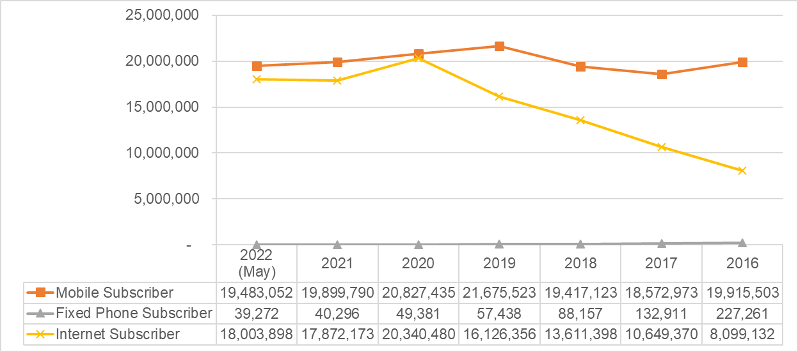
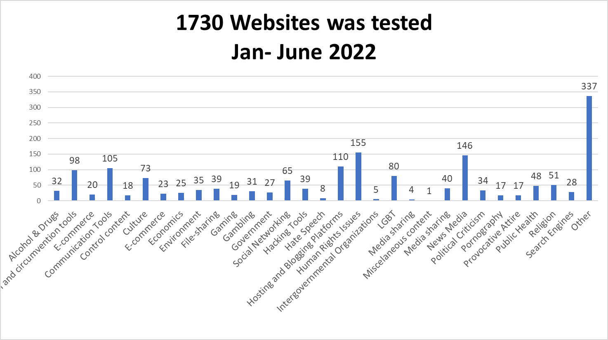
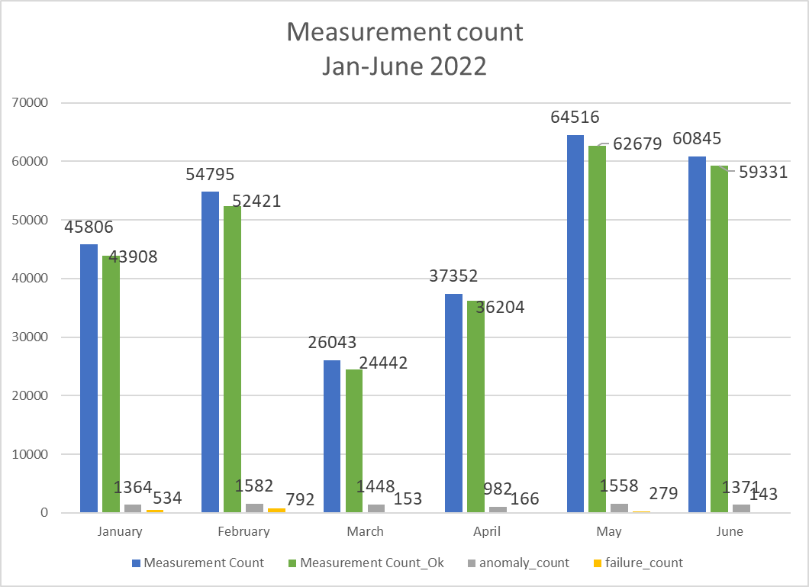
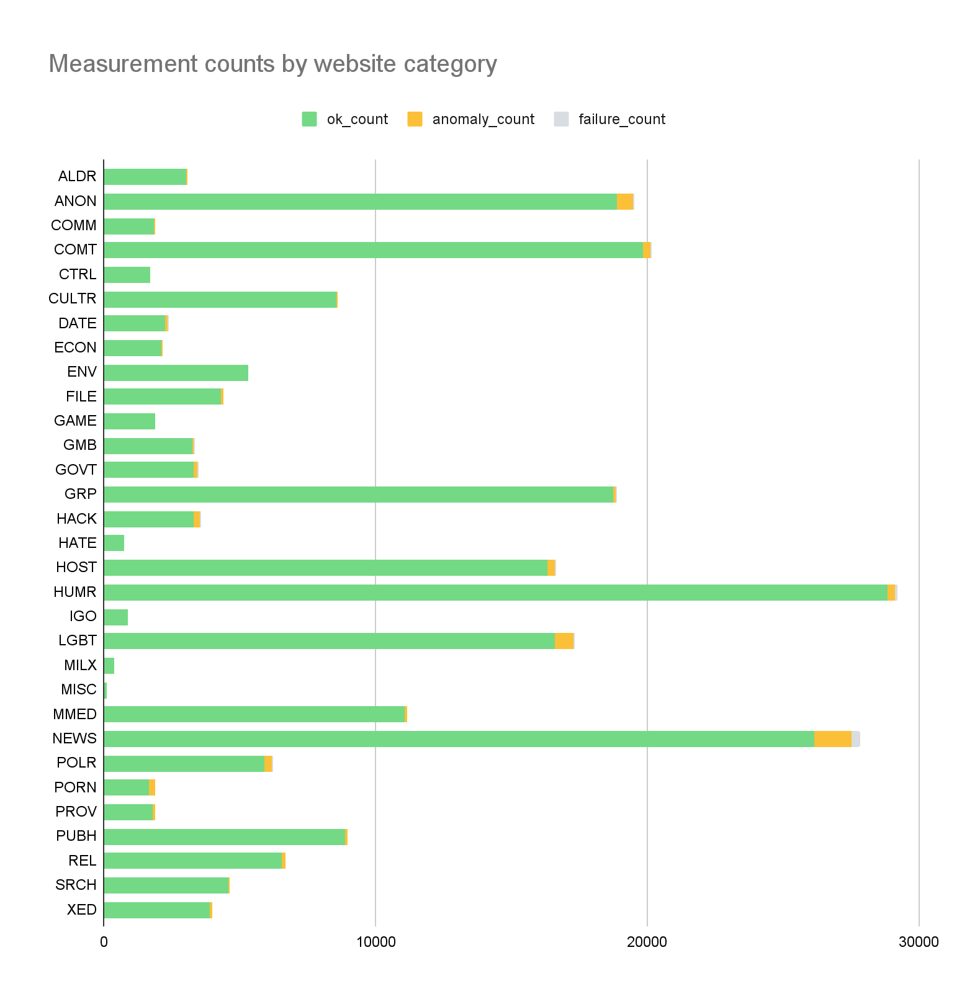
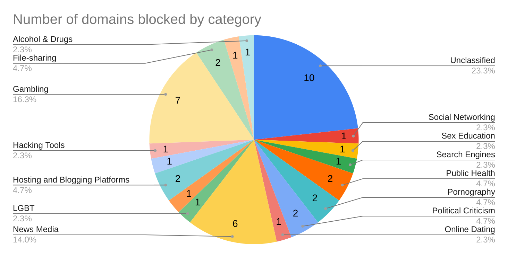

---

title: "iMAP State of Internet Censorship Report 2022 - Cambodia"

description: "This report shares internet censorship during the first half of 2022 in Cambodia using OONI data."

author: " Lam Socheat (API), Tan Thary (API), Chan Vibol (Consultant), Siti Nurliza Samsudin (Sinar Project) and Kelly Koh (Sinar Project)"

date: "2022-12-23"

tags: ["cambodia", "censorship", "country-kh", "theme-news_media"]

categories: ["report"]

---

[បកប្រែជាភាសាខ្មែរ](https://imap.sinarproject.org/reports/2022/imap-state-of-internet-censorship-country-report-2022-cambodia/2022-cambodia-translation) 

* News and other websites are periodically blocked in Cambodia, particularly those that disseminate information that could be perceived as a threat to the ruling government.[^1] In July 2018, the government ordered internet service providers (ISPs) to block at least 15 news websites during the country’s election.[^2] In the wake of the COVID-19 pandemic, the government has reportedly blocked access to news sites.[^3] In June 2020, the Ministry of Post telecommunications (MPTC) blocked six online gambling sites.[^4] In November 2021, TRC blocked 79 illegal online gambling websites.[^5] In December 2021, TRC blocked 9 websites and URLs that posted child pornographic images and videos.[^6] In February 2022, TRC blocked 15 illegal lottery websites.[^7]

* The OONI explorer measurements collected from Jan to June 2022 show that 43 websites (national and Intergovernmental Organizations website) are blocked by DNS, mainly by VIETTEL (CAMBODIA) PTE., LTD. (AS38623) and S.I Group (AS38623). The highest number of blockings were found to be in Gambling and News Media categories.
* However, as data from Cambodia currently do not show any block pages, more measurements may be needed in the next round of reporting to make more substantial conclusions.
* WhatsApp, Facebook Messenger, and the [Tor network](https://www.torproject.org/) appear to have been [accessible](https://api.ooni.io/files/by_country/TH) across all tested networks throughout the testing period and the result indicated that there is no censorship.

## **Table of Contents**

**[Introduction](#introduction)**

**[Background](#background)**

> [Network landscape and internet penetration](#network-landscape-and-internet-penetration)
>> [Mobile Subscribers](#mobile-subscribers)
>
> >[Instant Messaging](#instant-messaging)
> 
>> [Mobile Company](#mobile-company)
>
>> [Internet Service Providers](#internet-service-providers)
>
> [Legal environment](#legal-environment)
> 
>> [Freedom of expression](#freedom-of-expression)
>
>>> [Constitution](#constitution)
>>
> >>[Penal Code](#penal-code)
> 
>>>[Law on the Management of the Nation in a State of Emergency](#law-on-the-management-of-the-nation-in-a-state-of-emergency)
>
> >>[2019 draft Law on Access to Information](#draft-law-on-access-to-information)
>> >[Law on Telecommunications](#law-on-telecommunications)
>> >[Cybercrime Law (Draft)](#cybercrime-law-draft)

> >[Freedom from interference](#freedom-from-interference)
> 
>>[Freedom from censorship](#freedom-from-censorship)
>
>> [Free access to information](#free-access-to-information)
>
>> [Privacy](#privacy)
>
>>> [Inter-Ministerial Prakas (Proclamation) No. 170](#inter-ministerial-prakas-proclamation-no.-170)
>
>>> [National Internet Gateway](#national-internet-gateway)

> [Reported cases of internet censorship and surveillance](#reported-cases-of-internet-censorship-and-surveillance)

**[Examining internet censorship in Cambodia](#examining-internet-censorship-in-cambodia)**

> [Methodology](#methodology)
> 
> [Findings](#findings)
> 
> [Testing of websites](#testing-of-websites)
> 
> [Instant messaging](#instant-messaging)
> 
> [Circumvention tools](#circumvention-tools)

**[Conclusion and recommendations](#conclusion-and-recommendations)**

> [Contribute to the study](#contribute-to-the-study)

**[Acknowledgements](#acknowledgements)**

**[Annex I: Glossary](#annex-i-glossary)**

**[Annex II: Methodology](#annex-ii-methodology)**

> [Data](#data)
> 
> [Coverage](#coverage)
> 
> [How are the network measurements gathered?](#how-are-the-network-measurements-gathered)
> 
> [How are the network measurements analysed?](#how-are-the-network-measurements-analysed)
> 
> [Country code](#country-code)
> 
> [Autonomous System Number (ASN)](#autonomous-system-number-asn)
> 
> [Date and time of measurements](#date-and-time-of-measurements)
> 
> [Categories](#categories)
> 
> [IP addresses and other information](#ip-addresses-and-other-information)
> 
> [Network measurements](#network-measurements)
> 
> [Confirmed vs Heuristics](#confirmed-vs-heuristics)

**[About iMAP](#about-imap)**

**[About Sinar Project](#about-sinar-project)**

**[About Advocacy and Policy Institute](#about-advocacy-and-policy-institute)**

## **Introduction**

News and other websites are periodically blocked in Cambodia, particularly those that disseminate information that could be perceived as a threat to the ruling government.[^8] In July 2018, the government ordered internet service providers (ISPs) to block at least 15 news websites during the country’s election.[^9] In the wake of the COVID-19 pandemic, the government has reportedly blocked access to news sites.[^10] In June 2020, the Ministry of Post telecommunications (MPTC) blocked six online gambling sites.[^11] In November 2021, TRC blocked 79 illegal online gambling websites.[^12] In December 2021, TRC blocked 9 websites and URLs that posted child pornographic images and videos.[^13] In February 2022, TRC blocked 15 illegal lottery websites.[^14]

In an attempt to examine the current state of internet censorship in Cambodia, the [Open Observatory of Network Interference (OONI)](https://ooni.org/), [Sinar Project](https://sinarproject.org/), and the [Advocacy and Policy Institute](https://apiinstitute.org/) collaborated on a joint study to examine whether internet censorship events were persisting in the country through data collection and analysis of network measurements.

The aim of this study was to increase transparency of internet controls and to collect data that can potentially corroborate rumors and reports of internet censorship events. The following sections of this report provide information about Cambodia’s network landscape and internet penetration levels, its legal environment with respect to freedom of expression, access to information, and privacy, as well as about cases of censorship and surveillance that have previously been reported in the country. The remainder of the report documents key findings of this study.

## **Background**

As an old society in Southeast Asia, the Kingdom of Cambodia borders its [181,035 km2](https://en.wikipedia.org/wiki/Geography_of_Cambodia) (69,898 sq mi) territory with [Thailand](https://en.wikipedia.org/wiki/Thailand), [Laos](https://en.wikipedia.org/wiki/Laos), [Vietnam](https://en.wikipedia.org/wiki/Vietnam), and the [Gulf of Thailand](https://en.wikipedia.org/wiki/Gulf_of_Thailand), and hosts [16.78](https://worldpopulationreview.com/countries/cambodia-population) million population, [51% female](https://countrymeters.info/en/Cambodia). A vast majority is original Khmer, accounting for [90%](https://en.wikipedia.org/wiki/Ethnic_groups_in_Cambodia) of the total population, followed by 5% of Vietnamese, 4% of ethnic minority groups, and 1% of Chinese. Buddhism is officially recognized as a state religion, in which over [97% of the population practice Theravada Buddhism](https://www.asiahighlights.com/cambodia/religion); other religions include Islam, Christianity, and tribal animism. 

After the invasion of Vietnam, the new government installed in early 1979 ruled the country for decades until the first-ever democratic election in 1993. The election was administered by the UN peacemaking council, the so-called UNTAC ([United Nations Transitional Authority in Cambodia](https://en.wikipedia.org/wiki/United_Nations_Transitional_Authority_in_Cambodia)), in which 48 political parties joined, including the four fighting factions. A coalition government was formed and headed by two prime ministers from a long-standing party, CPP (Cambodian People Party) and a royalist party, FUNCINPEC (National United Front for an Independent, Neutral, Peaceful and Cooperative Cambodia). 

Civil Society Organizations (CSO) worked intensively to reduce poverty for the rural and affected communities, increase agricultural productivity, increase economic development, promote gender equality and equity, and democratic governance as well as advance democracy and promote human rights. They represent various sectors of work to demand responsive policy and practices from relevant governments and stakeholders. Starting from 2012 onwards, journalists, CSOs and Human Rights Defenders (HRD) embraced the internet as a means to advocate and disseminate their work. The LANGO (Law on Association and NGO) and taxation laws are perceived by several CSOs and experts as tools of the government to restrict NGOs that are critical of the government and the ruling party, in particular NGOs working in democracy, human rights, and advocacy. Some NGOs, like NDI (National Democratic Institute) from the US, were shut down or pushed to do so by the government. 

Several media outlets - television stations and most radio outlets - are aligned with the ruling party[^15] or the government. A few robust and independent media outlets and NGOs are in trouble with their operations under the conditions set in the LANGO and taxation laws, in particular. The government is criticized for the increased control over the media landscape in the country. Soon after the dissolution of the opposition party, some international media outlets, mainly from the US, were forcefully shut down by the government. Those media could only broadcast their online programs from abroad. 

Activism has emerged in the last decade. Human rights defenders, environmental activists, and farmer activists are prominent in the politics of the kingdom working to demand responsiveness and accountability of the government to the society and constituencies, while citizen journalists become powerful in the media sector on the ground. Their personal movement and relations and online communications are increasingly under the surveillance of the government. Journalists, activists, and other internet users increasingly face physical and online harassment for their online posts. Cambodian journalist, Mr. Kouv Piseth is arrested on the 24 July 2021 after he posted criticisms on Facebook about the Cambodia government’s decision to use China’s Sinopharm and Sinovac vaccines, and Mr. Oun Chhiv was arrested on 28th Sept 2021 after his reporting of the on a land dispute which allegedly involved high-ranking officials in the Botum Sakor National Park, Koh Kong province.[^16]

Cambodia is claimed by the government as a lower-income country in 2015 and to become a middle-income country by 2030. Such a claim changed the financing landscape. It is implied in the move out of Western NGOs and donor communities, while the influx of Chinese programs and loans for development and business advancement. The internet development of the country dramatically increased in just a few years. Five IPS companies are increasingly investing in this dramatic boom business. All of these companies are from communist and totalist countries, mainly China and Vietnam.

The government claimed that cybercrimes posed great challenges and threats to national safety and security. To protect these, the government put much more effort into developing and putting into practice laws and legal regulations relating to the media and the internet. In contrast, these laws and legal regulations are criticized as tools to increase the surveillance of the works of CSOs, media, and activists that are critical of the government and the ruling party.

### Network landscape and internet penetration

Through its strong relations and influence over the ISPs, the government has expanded its control over the internet. As implied, internet freedom in Cambodia is increasingly under threat. Five major telecommunication firms are providing both land-based and mobile internet services in Cambodia—Viettel, Smart Axiata, CamGSM, Xinwei Telecom, and Southeast Asia Telecom, all originating from countries with authoritarian leanings. Their management is closely affiliated with the Royal Government of Cambodia (RGC) and its officials, and they are likely to provide cover for each other when public scrutiny arises.[^17] As restricted by the laws on telecommunications, ISPs must have licenses from MPTC. 

Three prominent communication tools in Cambodia are mobile phone, fixed phone and internet. According to the newly functioning [Telecommunication Regulators of Cambodia](https://trc.gov.kh/en/internet-subscriptions/) (TRC), the usage of the fixed phone decreased from 227,261 subscribers in 2016 to 39,272 subscribers in 2022 (May). The usage of mobile phone is moderately stable, just slightly decreased from 19.91 million subscribers in 2016 to 19.48 million in May 2022. However, the internet penetration has increased dramatically in 7 years. It increased from 8.09 millions in 2016 to 18.00 million internet subscribers in May 2022. It is worth noting that one person could subscribe to more than one network. 

#### Mobile Subscribers

Source: [Telecommunication Regulators of Cambodia](https://trc.gov.kh/en/internet-subscriptions/)

#### Instant Messaging

Based on the available data, the fixed internet service increased slightly from 283,508 in 2021 to 312,233 in 2022 (May). 

Social media is widely used in Cambodia. Data presented in the table below shows that in early 2022, Facebook had 11.60 million users, Facebook Messenger reached 7.85 million users in Cambodia[^18]. They are followed by Instagram which had[ 2.05 million users, ](https://datareportal.com/reports/digital-2022-cambodia)equating to 12.0 percent of the total population and TikTok reached 6.68 million users. Despite being the least used platform, LinkedIn is also used in the country.[^19]

| Year (mil.) | [Facebook Messenger](https://datareportal.com/reports/digital-2022-cambodia) | [Facebook User](https://datareportal.com/reports/digital-2022-cambodia) | [Instagram](https://datareportal.com/reports/digital-2022-cambodia) | [TikTok](https://datareportal.com/reports/digital-2022-cambodia) | [LinkedIn](https://datareportal.com/reports/digital-2022-cambodia) |
| ----------- | ---------------------------------------------------------------------------- | ----------------------------------------------------------------------- | ------------------------------------------------------------------- | ---------------------------------------------------------------- | ------------------------------------------------------------------ |
| 2022        | 7.85                                                                         | 11.60                                                                   | 2.05                                                                | 6.68                                                             | 0.46                                                               |

Source: [DATAREPORTAL](https://datareportal.com/reports/digital-2022-cambodia)

#### Mobile Company

According to TRC, three (Metfone, Cellcard, and Smart) of the [five telecommunications](https://trc.gov.kh/en/licenses/) companies account for 90% of users. Metfone has the widest coverage on mobile data and internet usage, but Cellcard has won the Ookla Speed Test Award for 4 years from 2017 to 2020. Smart got its reputation by promoting tech startups for the youth and teenager audience. Cellcard and Smart, in particular, such as offering many promotions, e-sport and e-games that have gained the interest of young audiences.  

| No. | Network           | Company                                     |     |
|-----|-------------------|---------------------------------------------|-----|
| 1   | Smart             | Smart Axiata Co., Ltd                       |     |
| 2   | Mobitel/ CellCard | CamGSM Co., Ltd.                            |     |
| 3   | CooTel            | Xinwei (Cambodia) Telecom Co., Ltd          |     |
| 4   | SEATEL            | Southeast Asia Telecom (Cambodia) Co., Ltd. |     |
| 5   | Metfone           | Viettel (Cambodia) Pte., Ltd.               |     |

Source: [Telecommunication Regulators of Cambodia](https://trc.gov.kh/en/internet-subscriptions/)

#### Internet Service Providers

With a license from MPTC, around 30 ISPs have operated in Cambodia. Among those, there are five major telecommunication firms, providing both land-based and mobile internet services —Viettel, Smart Axiata, CamGSM, Xinwei Telecom and Southeast Asia Telecom, all originating from countries with authoritarian leanings. Viettel, a Vietnamese company run by Vietnam’s Ministry of Defence, operates in Cambodia under the name Metfone. 

CamGSM was originally known as Mobitel before rebranding itself to Cellcard in 2005. Viettel, Smart Axiata and local CamGSM account for around 90% of the market share of mobile subscriptions. Smart Axiata enjoyed a market share of almost 60% while Viettel and CamGSM enjoyed 26% and 11% of the market share respectively. Xinwei Telecom from China, which operates under the name CooTel, and Southeast Asia Telecom from Singapore account for 2.67% and 0.65% of the market share, respectively.[^20] In particular, Metfone is providing all types of services (Internet access, leased lines, private leased circuits, mobile phone voice and messaging services, ADSL), while each of the other ISPs also provides some of these services.

| No. | ISP Name           | ASNs   |
| --- | ------------------ | ------ |
| 1   | Cogetel Online     | 23673  |
|     |                    | 24325
| 2   | AngkorNet          | 24478  |
| 3   | EZECOM             | 38901  |
| 4   | MetFone            | 38623  |
| 5   | Clicknet           | 38893  |
| 6   | TeleSURF / Mobitel | 17976  |
| 7   | WiCam              | 24492  |
| 8   | CamNet             | 17726  |
| 9   | Chuan Wei          | 45348  |
| 10  | City Link          | 18014  |
|     |                    | 24441
| 11  | Camintel           | 38209  |
| 12  | MekongNet          | 131186 |
|     |                    | 131203
| 13  | Smart Mobile       | 45498  |
| 14  | MekongNet IXP      | 38235  |
| 15  | WirelessIP         | 24567  |
| 16  | BeyondTel          | 45339  |
| 17  | CIDC IT            | 7712   |
| 18  | Cambo Technology   | 17981  |
| 19  | DTV Star           | 45429  |
| 20  | Hello              | 38600  |
|     |                    |45281
| 21  | NeocomISP          | 9902   |
|     |                    | 23868
| 22  | PPCTV              | 38286  |
| 23  | Finder IXP         | 45124  |
| 24  | Star-Cell          | 38723  |
| 25  | Flash Tech         | 45465  |
| 26  | Opennet            | 131178 |
| 27  | S.I Net            | 131207 |
| 28  | CB                 | 38579  |

### Legal environment

With the justification to promote national safety and security protection, the Cambodian government has drafted, enacted and or put into force several laws and legal regulations. However, these have been criticized as tools of the government to increase the control over the internet usage which are affecting the basic rights to freedom of expression.  

#### Freedom of expression

##### Constitution

Article 41 of the Constitution guarantees freedom of expression. However, Article 41 stipulates that, in exercising freedom of expression, “no one shall exercise these rights to infringe upon the honor of others, or to affect the good customs of society, public order and national security”. As evidenced in later national legislation and non-legal measures, the state has actively promulgated measures to roll back guarantees of internet freedom based on such concerns regarding honor, public order and national security. Article 41 also provides for regulation of the media: the “regime of the media shall be determined by law”.

The latest amendment to the Constitution in 2018 further diminished compliance with international standards. An amendment to Article 49 —concerning respect for the constitution and laws and defending the nation—was the most damaging to fundamental freedoms. The amendment now obligates “Every Khmer citizen to uphold national interest” and to refrain from “conducting any activities which either directly or indirectly affect the interests of the Kingdom of Cambodia and of Khmer citizens.” When justifying the necessity of the amendment, Minister of Interior Sar Kheng singled out activists, HRDs and opposition members for their appeals to the international community to impose sanctions on Cambodia over its crackdown on opposition and civil society (Nachemson & Dara, 2018). In such context, it is evident that Article 49 as amended can be easily used to curtail freedom of expression online, especially when the statement criticizes the state or emphasizes a call to action against the State. Any dissent against the government can prompt disproportionate legal actions penalizing the exercise of freedom of expression.[^21]

##### Penal Code

The 2009 Penal Code contains vaguely-worded provisions on “plotting”, sharing “false information" and “incitement to commit a felony,” which have been used to charge internet users for posting and sharing critical content on social media. Criminal defamation is provided for under Article 305 of the 2009 Penal Code. Furthermore, spreading disinformation and conspiracy are criminalized under Article 425 and 453; while laws related to the incitement and provocation to commit crimes are stipulated under Articles 494 and 495. The latest amendment in 2018 introduced Article 437 bis, or the lèse-majesté provision, to the Code.

Article 305 on public defamation stipulates that “any allegation or slanderous charge that undermines the honor or the reputation of a person or an institution” is a criminal offense. The crime can be committed through several means. These categories of assessment apply to all provisions mentioned in this section and cover the common activities of most users online, such as the writing and sharing of posts on online platforms or social media. If these online actions are deemed defamatory, the act is punishable by fines between US$ 24.60 to US$ 2,460. Article 305, in tandem with other provisions in the Penal Code, have been disproportionately used to silence criticisms by opposition politicians and critics. 

Article 425 (false information) criminalizes the “communication or disclosure of any false information with a view to inducing a belief that a destruction, defacement or damage dangerous to other persons will be carried out”. This has been utilized by local authorities as criminalizing the dissemination of information they perceive as fake news, including critical comments directed at the government that they believe may potentially cause political instability or damage to their reputation. The use of this Article to penalize an individual can result in imprisonment from one to two years, or a fine ranging from $490USD to $981USD. 

Similarly, Article 453 on conspiracy and plotting against the government criminalizes “any scheme set up between several persons to commit a criminal attempt, and this scheme was materialized by one or several concrete actions, constitutes a conspiracy”. Individuals charged can face a minimum of five and up to ten years of imprisonment. The article has been misused to criminalize dissent against the state, even in instances where there is no evidence of plotting. 

The provisions most frequently used to persecute members of the opposition, government critics, activists and media professionals are Articles 494 and 495 (incitement to commit a felony). Under Article 495, incitement to “commit a felony or to disturb social security” by means identified in Article 494, the same as those under Article 305, is “punishable by imprisonment from six months to two years and a fine from one million to four million Riels, where the incitement was ineffective”.

Article 437 bis (lèse-majesté) prohibits criticism of the King and outlines penalties of between one to five years imprisonment and monetary fines ranging from US$500 to US$2,460. Following Thailand's lead in prosecuting political critics for lèse-majesté, this provision encroaches on social media users’ online freedoms (Boyle and Chhengpor, 2018). Internet users can be charged with this crime through any “word, gesture, writing, picture or other media which affects the dignity of the individual”.[^22] 

##### Law on the Management of the Nation in a State of Emergency

In April 2020, the Cambodian government passed the Law on the Management of the Nation in a State of Emergency, to respond to the COVID-19 pandemic. This law was heavily criticized by civil society for providing the government with extensive powers to restrict free expression during a state of emergency.[^23] It empowered the government to monitor information online, ban or restrict news and media sharing, and implement other measures it deems necessary.[^24] Prime Minister Hun Sen prepared a royal decree for the King to use if he decided to declare a state of emergency following a COVID-19 outbreak in November 2020; however, the government did not officially declare a state of emergency during the coverage period.[^25]

##### 2019 draft Law on Access to Information

Containing protections for whistleblowers and having the potential to positively impact free expression online if approved and enforced, the updated draft released to the public in August 2019 raised concerns about the law’s adherence to international human rights standards, as well as its use of broad and unclear standards that could threaten access of information and freedom of expression. For example, the law narrowly defines the type of information and institutions it applies to; lacks effective oversight procedures; permits public authorities to deny disclosure in various overly broad situations; and contains a criminal libel and defamation provision. In August 2020, the law was finalized and was set to be approved by the Council of Ministers[^26]; however, due to delays because of the pandemic, the law had not yet been sent to parliament until the end of 2021.[^27]

##### Law on Telecommunications

The 2015 Law on Telecommunication imposes generic obligations on telecommunications service providers, which authorities claim will enhance service access in the countryside and rural areas. Within the broad range of regulations, however, the law also functions as a legal tool to monitor internet activity. Freedom of expression is threatened through the imposition of monitoring actors (Article 70 and 71), decreased data protection (Article 97 and 6) and the criminalisation of free speech on radio, television, online and in private messages (Article 80).

Article 6 requires “all telecommunications operators and persons involved with the telecommunications sector” to provide MPTC with “the telecommunications, information and communication technology service data”. The lack of definition of who this legitimate authority is highly problematic and could potentially lead to arbitrary surveillance. Hence the law—by allowing surveillance of electronic devices—enables Cambodian authorities to actively phone-tap and monitor online discourses in order to selectively persecute targeted individuals.

Article 80 states that the “establishment, installation and utilization of equipment in [the] telecommunication sector, if these acts lead to national insecurity, shall be punished by sentences from 7 to 15 years imprisonment.” The lack of clarity over types of telecommunication activity could heavily punish legitimate expression via radio shows, television, online and even through private messages and phone conversations between individuals, should the authorities determine it to be a threat.[^28]

##### Cybercrime Law (Draft)[^29]

Proposed in 2012, The law is subject to further changes in response to critical backlash, and as of August 2021, there was no specific date for the completion of the drafting nor for the implementation of the Law. Articles 8 and 12 state that service providers must “preserve traffic data for at least 180 days”, to be shared with “competent authorities” upon their request.

Articles 32 and 33 criminalize the “unauthorized access” to a computer system or the transferring of data from one system to another without permission. Those charged face up to 10 years imprisonment. These Articles also pose concerns to whistleblowers and HRDs who access such information to expose rights violations by the state, as they are not provided adequate safeguards.

Article 40 criminalizes the use of computers to initiate “interruptions, fear, threats, abuses, [and] intimidation”. Individuals charged under this Article face a maximum of six months imprisonment. Article 45 criminalizes “any person who knowingly and intentionally makes a false statement or material misrepresentation through information technology” that could be detrimental to “public safety” and “national security”.

#### Freedom from interference

Press freedom and internet freedom in Cambodia are increasingly under threat. In 2022  ‘[Freedom in the World](https://freedomhouse.org/country/cambodia)’ report by Freedom House, Cambodia was classified as “Not Free”. People are afraid to express their view or opinion online, especially those who are critical of the government. The Cambodian government has used the existing laws and legal regulations and developed new ones to increase interference. It was noted that the Criminal Code has been used in cases involving journalists and the COVID-19 Law has been used in cases involving journalists and human rights defenders.

In 2020, the government enacted legislation to declare a state of emergency that would grant authorities vast powers to conduct digital surveillance, ban assemblies, and ban or limit broadcasting, among other provisions that amounted to virtually unchecked powers. As noted by the [Freedom House](https://freedomhouse.org/country/cambodia/freedom-world/2022), while a state of emergency was never declared, the government issued numerous threats as the global pandemic became apparent, and a number of people, including private citizens and those considered political opponents, were indeed arrested throughout year on the pretext of spreading false information about COVID-19 or purportedly contravening government narratives about public health. In 2021, dozens of people were arrested for criticizing the government’s response to the COVID-19 pandemic.

According to a recent study of the [OHCHR](https://www.ohchr.org/sites/default/files/2022-08/press-freedom-cambodia-en.pdf) that surveyed 35 journalists revealed that journalists have been interfered with. All the respondents reported that they had faced some forms of interference while carrying out their jobs. The most common form of interference was surveillance or arbitrary detention. The record of OHCHR showed that as of May 2022, 4,323 individual instances of arbitrary detention in the context of the strike at NagaWorld Casino. Another record of OHCHR reported since January 2017, 23 journalists have faced criminal charges as a result of their work. In the recent report of [OHCHR](https://www.ohchr.org/en/press-releases/2022/08/increasing-attacks-cambodias-media-are-threat-democracy-un-human-rights) it is concluded that journalists in Cambodia are increasingly being subjected to various forms of harassment and pressure, as well as violence amid growing restrictions on civic space and press freedoms in the country.

#### Freedom from censorship

Censorship has dramatically increased in Cambodia in recent years through different forms. The forceful impose on legal and non-legal measures by the Cambodian government against  targeted groups or individuals have negatively restricted the exercise of freedom of expression and internet freedoms.

[OHCHR](https://www.ohchr.org/sites/default/files/2022-08/press-freedom-cambodia-en.pdf) argued that while neither Prakas 170 nor the Sub-Decree on the National Internet Gateway are specifically targeted at the media, the potential impact of these instruments on freedom of expression more broadly and press freedom, in particular, is profound. Both instruments vest broad powers in government to censor expression in a manner that appears to go well beyond what is permitted by Article 19(3) of ICCPR, giving rise to situations where government agencies will be empowered to censor expression and reporting that they deem inconvenient. Reflecting the order from the Ministry of Information to ISPs to block the services of 15 independent media outlets or news websites during the previous national election in 2018, it is argued that Prakas 170 and the Sub-Decree on the National Internet Gateway threaten to provide a more formal legislative basis for the closure of websites, including those of news outlets, giving rise to fears of the routing, shutting down of critical voices and reporting. 

People are afraid to speak up against the ruling regime. According to a recent study of the [Asiacenter](https://asiacentre.org/wp-content/uploads/Internet-Freedoms-in-Cambodia-A-Gateway-to-Control.pdf), it is suggested that individuals have taken a step back from sharing their own political opinions online or participating in political events, and instead prefer to simply read or listen to such content as they are afraid to get into trouble with the Cambodian authorities, who have ramped up their control of the online sphere. 

In 2020, according to CCHR’s Cambodia Fundamental Freedoms Monitor report, 108 cases of restriction on freedom of expression by the RGC were reported; out of which 57 cases (53%) occurred online[^30]. The report suggested that the trend has been consistent in the past three years where 83% (2019), 73% (2018), 69% (2017) of respondents were cautious for their own safety when sending or sharing information over social media. Recently, in 2022, a report from [OHCHR](https://www.ohchr.org/sites/default/files/2022-08/press-freedom-cambodia-en.pdf) that interviewed 15 men and six women journalists showed that 60% of them had faced verbal threats in connection with their work. Another study noted that Facebook was the most surveilled online platform, with 46 cases of restrictions on freedom of expression reported, followed by Tiktok (8) and YouTube (7).[^31,][^32]

#### Free access to information

In line with the international human rights standards and principles concerning access to information, several laws and legal regulations of Cambodia have guaranteed access to information (A2I). Three provisions in the current Cambodian Constitution provide the constitutional underpinnings of a protected right of “timely and effective access to high quality and accurate information held by the Cambodian government and other public institutions''. Article 5 of the Press Law recognizes the “right of access to information in government-held records. Article 13 of the 2005 Archive Law states: Public archives, which are published documents, are permitted to be used by the public for research and consultations as unrestricted information. Other public activities shall be permitted for free research 20 years thereafter the date of the documents or thereafter the end of the proceeding, or in special cases as stipulated in Article 14 of this Law.[^33] The Information Law remains in the draft version till late 2021 since its initiative version was drafted in 2007.

However, free access to information remains a great challenge. A recent [study of OHCHR](https://www.ohchr.org/sites/default/files/2022-08/press-freedom-cambodia-en.pdf) with journalists suggested that journalists are working in an increasingly difficult environment, one that is particularly fraught with difficulties when it comes to accessing information from public sources. While the authorities have adopted laws that seem to curtail the right to freedom of expression, they have delayed finalizing a promised new law that will permit journalists and media personnel to access official information.

#### Privacy

##### Inter-Ministerial Prakas (Proclamation) No. 170[^34]

This Prakas was implemented amidst an environment of stricter controls on online platforms during the elections, such as blocking of pro-democracy websites. The Prakas’ initial proclamation enables the close collaboration between the Ministry of Information, Ministry of Interior and MPTC to monitor social media usage. The regulation directly targets website publications and social media networks within the Cambodian Internet space. Under Clause 6, the Ministry of Information is authorized to manage published online information through electronic systems and “take action” against illegal publications.

While the Inter-Ministerial Prakas was often called Cambodia’s ‘fake news’ law, it has rarely been used to criminalize the act of disseminating disinformation. Rather, it has been used as a justification for governmental digital surveillance.

##### National Internet Gateway[^35]

The Sub-Decree significantly enhances monitoring capacities over user activity, as gateway operators will report their observations on internet usage to the Ministry of Telecommunications. Similar to the Inter-Ministerial Prakas, this law is geared towards online state surveillance rather than criminalizing online activities. Therefore, this new policy is a highly potent tool against online expression and the right to privacy. 

Article 6 of the document describes the functions and duties of the NIG operator. These include the management of access to connection and internet services. This Article, due to vague and overly-broad provisions, allows for the government to block access to sites that propagate critical views against the state, by branding it as information that threatens social order or safety. 

Article 12 (revenue collection, safety, and public order protection) also requires NIG operators to “[assure] safety, public order, dignity, culture, tradition and custom of the society, as well as preventing and cracking down on crimes”. Vague definitions and unclear assessments of what constitutes a crime, or what actions threaten “social order, dignity, culture, traditions, and customs” potentially allows for continued politically motivated prosecution of online activists and internet users. Service providers must also urge users to complete online forms and verify their identities - the collection of such data, with no existing safeguards on data privacy, may result in its use to surveil and monitor internet activity. As such monitoring is already commonplace in Cambodia, the NIG only serves to worsen the situation of internet freedoms and self-censorship. 

Under Article 14, gateway operators are required to store data and provide routine status reports to the authorities. The storage of technical records, IP addresses, and identification of the route of traffic through the NIG for 12 months, allows operators to monitor user activities.

### Reported cases of internet censorship and surveillance

Several cases of internet censorship and surveillance have been reported in Cambodia over the last decade. On the 27th and 28th July 2018 election day, [15 websites](https://projects.voanews.com/cambodia-election-2018/english/feature/government-confirm-blocking-fifteen-independent-news-sites-over-poll-disruption.html) of the independent news like voice of America's Khmer, Radio Free Asia's Khmer, Voice of Democracy, Vayo FM Radio, Phnom Penh Post, Monorom.info and the news site of the Independent Network for Social Justice. were blocked by ISPs through the order from the government authorities.

## Examining internet censorship in Cambodia

The [Open Observatory of Network Interference (OONI)](https://ooni.org/), in collaboration with [Sinar Project](http://sinarproject.org/en) and the [Advocacy and Policy Institute](https://apiinstitute.org/), performed a study of internet censorship in Cambodia. The aim of this study was to understand whether and to what extent censorship events occurred in Cambodia during the testing period from Jan to June 2022.

The sections below document the methodology and key findings of this study.

### Methodology

In an attempt to identify potential internet censorship events in Cambodia, the study has applied the following methodologies: 

* Review of the Citizen Lab’s Cambodia test list;
* Run OONI network measurements; and
* Undertake data analysis.

A [list of URLs](https://github.com/citizenlab/test-lists/blob/master/lists/th.csv) that are relevant and commonly accessed in Cambodia was created by the Citizen Lab for the purpose of enabling network measurement researchers to examine their accessibility in Cambodia. As part of this study, this list of URLs was reviewed to include additional URLs - along with [other URLs](https://github.com/citizenlab/test-lists/blob/master/lists/global.csv) that are commonly accessed around the world - and tested for blocking based on [OONI’s free software tests](https://github.com/TheTorProject/ooni-probe). A total of 191 URLs from Cambodia were added. Such tests were run from local vantage points in Cambodia, and they also examined whether systems that are responsible for censorship, surveillance, and traffic manipulation were present in the tested network. Once network measurement data was collected from these tests, the data was subsequently processed and analyzed based on a set of heuristics for detecting internet censorship and traffic manipulation.

The testing period for this study started from January 2022 to June 2022.

### Findings

#### Testing of websites

The test lists containing the websites to be tested for monitoring internet censorship using the OONI probe are grouped into 32 different categories.

Until the end of June, 1,730 websites (Cambodia-based and international websites) from different categories. These consist of websites from the Citizen Lab test lists and custom lists run by users using the OONI probe tool. The chart below presents the number of domains by website category. 

As presented in the table below, the OONI Probe ran 289,357 measurements during the reporting period. Out of these, 96.42% or 278,985 were successfully run with a positive result, indicating no blockage or hijack, and 0.71% or 2067 unsuccessful runs were counted. The remainder of 2.87% or 8305 measurements were recorded as anomalies count. The chart below shows measurement results from January to June 2022.

    

| **Measurement Count from the OONI Running** |                        |            |             |             |
|---------------------|-----------------------|-------------------|-------------------|-------------------|
| **Month**                                   | **Total measurements** | **OK**     | **Anomaly** | **Failure** |
| January                                     | 45806                  | 43908      | 1364        | 534         |
| February                                    | 54795                  | 52421      | 1582        | 792         |
| March                                       | 26043                  | 24442      | 1448        | 153         |
| April                                       | 37352                  | 36204      | 982         | 166         |
| May                                         | 64516                  | 62679      | 1558        | 279         |
| June                                        | 60845                  | 59331      | 1371        | 143         |
| **Total**                                   | **289357**             | **278985** | **8305**    | **2067**    |
| **Percentage share (%)**                    | **100%**               | **96.42%** | **2.87%**   | **0.71%**   |

As a part of this study, [network measurements](https://explorer.ooni.org/country/TH) were collected through [OONI Probe software tests](https://github.com/TheTorProject/ooni-probe), with the period of testing from January to June, The result showed that among 43 of 1730 ULRs/Websites are blocked or hijacked. In addition to this, results of the heuristics analysis reported that 43 domains have been potentially blocked by DNS tampering through redirecting to 2 IP addresses: `10.10.10.1` and `36.37.242.94`. Although these two do not have any blockpages, it is likely that they are used as methods of blocking by ISP VIETTEL (CAMBODIA) PTE., LTD. (AS38623), S.I Group (AS38623) and CAMGSM Company Ltd (AS17976). These 43 websites are comprised of categories as in the chart below:

In this report, selected websites in Cambodia are found to be blocked through DNS tampering by an Internet Service Provider (ISP) listed in the table as follows:  

| **Domain**                  | **Website category**                  |
|-----------------------------|---------------------------------------|
| www.cannabis.info\*         | Alcohol & Drugs                       |
| guardster.com               | Anonymization and circumvention tools |
| adultfriendfinder.com       | Online Dating                         |
| www.appzplanet.com          | File-sharing                          |
| www.serials.ws              | File-sharing                          |
| www.888casino.com           | Gambling                              |
| www.carnivalcasino.com      | Gambling                              |
| www.casino.com              | Gambling                              |
| www.casinotropez.com        | Gambling                              |
| www.europacasino.com        | Gambling                              |
| www.partypoker.com          | Gambling                              |
| www.sportsinteraction.com\* | Gambling                              |
| www.ebuddy.com\*            | Social Networking                     |
| www.blackhat.be             | Hacking Tools                         |
| www.nazi-lauck-nsdapao.com  | Hate Speech                           |
| pingomatic.com              | Hosting and Blogging Platforms        |
| technorati.com              | Hosting and Blogging Platforms        |
| www.hrcr.org\*              | Human Rights Issues                   |
| www.samesexmarriage.ca      | LGBT                                  |
| www.almanar.com.lb          | News Media                            |
| www.phnompenhpost.com       | News Media                            |
| khmer.cambodiadaily.com     | News Media                            |
| stubes.info\*               | News Media                            |
| www.kirivong.com\*          | News Media                            |
| www.ruf-ch.org\*            | News Media                            |
| dailystormer.name           | Political Criticism                   |
| www.cnrp7.org\*             | Political Criticism                   |
| alt.com                     | Pornography                           |
| www.wetplace.com            | Pornography                           |
| apps.crowdtangle.com        | Public Health                         |
| coronavirus-map.com\*       | Public Health                         |
| www.mamma.com               | Search Engines                        |
| www.teenhealthfx.com        | Sex Education                         |
| mixi.jp                     | Unclassified                          |
| secure.friendfinder.com     | Unclassified                          |
| www.anonymizer.com          | Unclassified                          |
| www.rotten.com\*            | Unclassified                          |
| anonnews.org\*              | Unclassified                          |
| moqavemat.ir\*              | Unclassified                          |
| veracrypt.codeplex.com\*    | Unclassified                          |
| www.fring.com\*             | Unclassified                          |
| www.pokerroom.com\*         | Unclassified                          |
| www.volcanomail.com\*       | Unclassified                          |

Note: Websites marked with asterisk (*) were not accessible at the time of writing.

Two of the 43 websites blocked are [www.cnrp7.org](http://www.cnrp7.org/) and [www.hrcr.org](http://www.hrcr.org/) via DNS blocking methods. The former is a website of the Cambodia National Rescue Party, recently known as Candlelight Party and is currently the official opposition to ruling the Cambodia People Party. It was found blocked as it was [redirected to IP address 36.37.242 .94](https://explorer.ooni.org/measurement/20220627T194345Z_webconnectivity_KH_38623_n1_UIv4kD80lS9p2Giv?input=http://www.cnrp7.org/), although this occurred only once during the reporting period. Whereas the latter is a Human & Constitutional Rights Resource Page, no longer updated since 2008. It was also found to be [redirected to the same IP address on 27 June 2022](https://explorer.ooni.org/measurement/20220627T205310Z_webconnectivity_KH_38623_n1_o88bbheV4OOm8amY?input=http://www.hrcr.org/). This IP address is likely to be a sign of blocking by the ISP Viettel Cambodia.

However, these sites were found no longer accessible at time of writing. The current website of the Candlelight Party (candlelightparty.org) was not tested on OONI during the period.

#### Instant messaging

The result of OONI Probe running from Jan to June 2022  of  2967  Facebook measurement, 2977 Telegram measurement, 2965 whatApp measurement and 2959 Signal measurement show that these platforms haven't been blocked from Internet service providers. 

| **Website** | **measurement_count** | **ok_count** | **Confirm_Count** | **anomaly_count** | **failure_count** |
|-----------------|-----------------|-----------------|-----------------|-----------------|-----------------|
| Facebook    | 2967                  | 2961         | 0                 | 6                 | 0                 |
| Telegram    | 2977                  | 2950         | 0                 | 27                | 0                 |
| WhatApp     | 2965                  | 2941         | 0                 | 24                | 0                 |
| Signal      | 2959                  | 2946         | 0                 | 13                | 0                 |

#### Circumvention tools

The OONI Probe testing result and the heuristic result report showed the tools in the Circumvention with the number of  measurement count and anomaly count which was listed in the below table haven't been blocked.

| **Circumvention** | **measurement_count** | **measurement_ok** | **anomaly_count** | **failure_count** |
|-------------------|-----------------------|--------------------|-------------------|-------------------|
| PSIPHON           | 2987                  | 2946               | 41                | 0                 |
| Tor               | 37                    | 33                 | 4                 | 0                 |
| Tor Snowflake     | 20                    | 18                 | 2                 | 0                 |

## **Conclusion and recommendations**

News and other websites are periodically blocked in Cambodia, particularly those that disseminate information that could be perceived as a threat to the ruling government. Several cases of internet censorship and surveillance have been reported in Cambodia over the last decade. On the 27 and 28 2018 election day, 15 websites of the independent news like voice of America's Khmer service, Radio Free Asia's Khmer service, Voice of Democracy, Vayo FM Radio, Monorom.info and the news site of the Independent Network for Social Justice. were blocked by ISPs through the order from the government authorities.

Press freedom and internet freedom in Cambodia are increasingly under threat. In 2022, Cambodia was classified as “Not Free”. People are afraid to express their views or opinions online, especially those who are critical of the government. The Cambodian government has used the existing laws and legal regulations and developed new ones to increase interference. Censorship has dramatically increased in Cambodia in recent years through different forms. The forceful imposition of legal and non-legal measures by the Cambodian government against  targeted groups or individuals have negatively restricted the exercise of freedom of expression and internet freedoms.

OONI data showed 43 highly likely blocked websites that are censored by DNS, mainly by VIETTEL (CAMBODIA) PTE., LTD. (AS38623), S.I Group (AS38623) and CAMGSM Company Ltd (AS17976). These websites include news and media websites, and thus raises concern about press freedom, internet freedom and censorship in Cambodia.  However, as data from Cambodia currently do not show any block pages, more measurements may be needed in the next round of reporting to make more substantial conclusions.

Based on the analysis and findings of the report, we reiterate the commendations made by the OHCHR. So, it is recommended that the State review and revise its current and pending legislation, including the Sub-Decree on National Internet Gateway and the amendments to the Press Law and the draft laws on cybercrimes and on access to information to avoid the use of vague terminology and overly broad restrictions. The UN Human Rights Committee further recommended the State to ensure that in the formulation and enforcement of its legislation, including Ministerial Sub-Decrees, any restrictions on the exercise of freedom of expression and association comply with the strict requirements of articles 19 (3) and 22 of the Covenant.

### Contribute to the study

There are various ways one may contribute to the OONI measurements:

* Testing: You may test on [various platforms](https://ooni.org/install/), both on Mobile (iOS and Android) and Desktop, including on the CLI on Linux platforms. The domains you test can be either randomly selected from the [Citizenlab Test Lists](https://github.com/citizenlab/test-lists) or custom test lists specific to your needs.
* Contribute to the test lists: You can contribute to the test lists on GitHub or on [OONI](https://test-lists.ooni.org/).
* Translate the OONI Probe to your local language [here](https://www.transifex.com/otf/ooniprobe/).
* Participate in community discussions on the [OONI’s Slack channel](https://slack.ooni.org/)

## **Acknowledgements**

We would like to thank the OONI team for their various contributions to the writing of this report, as well as our volunteers and anonymous users who have contributed in running the OONI probe.

## **Annex I: Glossary**

| **Term**         | Definition                                                                                                                                                                                                                                                                                                                                                                                                                                                                                                                                                                                                                                                                                                                                                                                                                                               |
|------------------|----------------------------------------------------------------------------------------------------------------------------------------------------------------------------------------------------------------------------------------------------------------------------------------------------------------------------------------------------------------------------------------------------------------------------------------------------------------------------------------------------------------------------------------------------------------------------------------------------------------------------------------------------------------------------------------------------------------------------------------------------------------------------------------------------------------------------------------------------------|
| **DNS**          | DNS stands for “Domain Name System” and it maps domain names to IP addresses. A domain is a name that is commonly attributed to websites (when they’re created), so that they can be more easily accessed and remembered. For example, twitter.com is the domain of the Twitter website. However, computers can’t connect to internet services through domain names, but based on IP addresses: the digital address of each service on the internet. Similarly, in the physical world, you would need the address of a house (rather than the name of the house itself) in order to visit it. The Domain Name System (DNS) is what is responsible for transforming a human- readable domain name (such as ooni.org) into its numerical IP address counterpart (in this case:104.198.14.52), thus allowing your computer to access the intended website.  |
| **HTTP**         | The Hypertext Transfer Protocol (HTTP) is the underlying protocol used by the World Wide Web to transfer or exchange data across the internet. The HTTP protocol allows communication between a client and a server. It does so by handling a client’s request to connect to a server, and the server’s response to the client’s request. All websites include an HTTP (or HTTPS) prefix (such as http://example.com/) so that your computer (the client) can request and receive the content of a website (hosted on a server). All websites include an HTTP (or HTTPS) prefix (such as http://example.com/) so that your computer (the client) can request and receive the content of a website (hosted on a server). The transmission of data over the HTTP protocol is unencrypted.                                                                  |
| **ISP**          | An Internet Service Provider (ISP) is an organization that provides services for accessing and using the internet. ISPs can be state-owned, commercial, community-owned, non-profit, or otherwise privately owned. Vodafone, AT&T, Airtel, and MTN are examples of ISPs.                                                                                                                                                                                                                                                                                                                                                                                                                                                                                                                                                                                 |
| **Middle boxes** | A middlebox is a computer networking device that transforms, inspects, filters, or otherwise manipulates traffic for purposes other than packet forwarding. Many Internet Service Providers (ISPs) around the world use middleboxes to improve network performance, provide users with faster access to websites, and for a number of other networking purposes. Sometimes though, middleboxes are also used to implement internet censorship and/or surveillance. The OONI Probe app includes two tests designed to measure networks with the aim of identifying the presence of middleboxes.                                                                                                                                                                                                                                                           |
| **TCP**          | The Transmission Control Protocol (TCP) is one of the main protocols on the internet. To connect to a website, your computer needs to establish a TCP connection to the address of that website. TCP works on top of the Internet Protocol (IP), which defines how to address computers on the internet. When speaking to a machine over the TCP protocol you use an IP and port pair, which looks something like this: 10.20.1.1:8080. The main difference between TCP and (another very popular protocol called) UDP is that TCP has the notion of a “connection”, making it a “reliable” transport protocol.                                                                                                                                                                                                                                          |
| **TLS**          | Transport Layer Security (TLS) – also referred to as “SSL” – is a cryptographic protocol that allows you to maintain a secure, encrypted connection between your computer and an internet service. When you connect to a website through TLS, the address of the website will begin with HTTPS (such as https://www.facebook.com/), instead of HTTP.                                                                                                                                                                                                                                                                                                                                                                                                                                                                                                     |

A comprehensive glossary related to OONI can be accessed here: [https://ooni.org/support/glossary/](https://ooni.org/support/glossary/). 

## **Annex II: Methodology**

### Data

Data computed based on the heuristics for this report can be downloaded here: [https://github.com/Sinar/imap-data](https://github.com/Sinar/imap-data) whereas aggregated data can be downloaded from [OONI Explorer](https://explorer.ooni.org/).

### Coverage

The iMAP State of Internet Censorship Country Report covers the findings of network measurement collected through Open Observatory of Network Interference (OONI) [OONI Probe App](https://ooni.org/install/) that measures the blocking of websites, instant messaging apps, circumvention tools and network tampering. The findings highlight the websites, instant messaging apps and circumvention tools confirmed to be blocked, the ASNs with censorship detected and method of network interference applied. The report also provides background context on the network landscape combined with the latest legal, social and political issues and events which might have an effect on the implementation of internet censorship in the country.

In terms of timeline, this first iMAP report covers measurements obtained in the six-month period from 1 January 2022 to 30 June 2022. The countries covered in this round are Cambodia, Hong Kong, Indonesia, Malaysia, Myanmar, Philippines, Thailand, and Viet Nam. India will only be included starting in the next period of reporting.  

### How are the network measurements gathered?

Network measurements are gathered through the use of [OONI Probe app](https://ooni.org/install/), a free software tool developed by [Open Observatory of Network Interference (OONI)](https://ooni.org/). To learn more about how the OONI Probe test works, please visit: [https://ooni.org/nettest/](https://ooni.org/nettest/).

iMAP Country Researchers and anonymous volunteers run OONI Probe app to examine the accessibility of websites included in the [Citizen Lab test lists](https://github.com/citizenlab/test-lists/tree/master/lists). iMAP Country Researchers actively review the country-specific test lists to ensure up-to-date websites are included and context-relevant websites are properly categorised, in consultation with local communities and digital rights network partners. We adopt the [approach taken by Netalitica](https://netalitica.com/wp-content/uploads/2021/10/Guideline-for-Test-List-Researchers-V7.pdf) in reviewing country-specific test lists.

It is important to note that the findings are only applicable to the websites that were examined and do not fully reflect all instances of censorship that might have occurred during the testing period. 

### How are the network measurements analysed?

OONI processes the following types of data through its data pipeline: https://github.com/ooni/pipeline.

#### Country code

OONI by default collects the code which corresponds to the country from which the user is running OONI Probe tests from, by automatically searching for it based on the user’s IP address through their [ASN database](https://github.com/ooni/asn-db-generator) the [MaxMind GeoIP database](https://www.maxmind.com/en/home). 

#### Autonomous System Number (ASN)

OONI by default collects the Autonomous System Number (ASN) of the network used to run OONI Probe app, thereby revealing the network provider of a user. 

#### Date and time of measurements

OONI by default collects the time and date of when tests were run to evaluate when network interferences occur and to allow comparison across time. UTC is used as the standard time zone in the time and date information. In addition, the charts generated on OONI MAT will exclude measurements on the last day by default.

#### Categories

The 32 website categories are based on the Citizenlab test lists: [https://github.com/citizenlab/test-lists](https://github.com/citizenlab/test-lists). As not all websites tested on OONI are on these test lists, these websites would have unclassified categories.

| **No.** | **Category Description**              | **Code** | **Description**                                                                                                                                                                                                                                                                                 |
|-----------|----------------------------|------------|--------------------------------------------------|
| 1       | Alcohol & Drugs                       | ALDR     | Sites devoted to the use, paraphernalia, and sale of drugs and alcohol irrespective of the local legality.                                                                                                                                                                                      |
| 2       | Religion                              | REL      | Sites devoted to discussion of religious issues, both supportive and critical, as well as discussion of minority religious groups.                                                                                                                                                              |
| 3       | Pornography                           | PORN     | Hard-core and soft-core pornography.                                                                                                                                                                                                                                                            |
| 4       | Provocative Attire                    | PROV     | Websites which show provocative attire and portray women in a sexual manner, wearing minimal clothing.                                                                                                                                                                                          |
| 5       | Political Criticism                   | POLR     | Content that offers critical political viewpoints. Includes critical authors and bloggers, as well as oppositional political organizations. Includes pro-democracy content, anti-corruption content as well as content calling for changes in leadership, governance issues, legal reform. Etc. |
| 6       | Human Rights Issues                   | HUMR     | Sites dedicated to discussing human rights issues in various forms. Includes women\'s rights and rights of minority ethnic groups.                                                                                                                                                              |
| 7       | Environment                           | ENV      | Pollution, international environmental treaties, deforestation, environmental justice, disasters, etc.                                                                                                                                                                                          |
| 8       | Terrorism and Militants               | MILX     | Sites promoting terrorism, violent militant or separatist movements.                                                                                                                                                                                                                            |
| 9       | Hate Speech                           | HATE     | Content that disparages particular groups or persons based on race, sex, sexuality or other characteristics                                                                                                                                                                                     |
| 10      | News Media                            | NEWS     | This category includes major news outlets (BBC, CNN, etc.) as well as regional news outlets and independent media.                                                                                                                                                                              |
| 11      | Sex Education                         | XED      | Includes contraception, abstinence, STDs, healthy sexuality, teen pregnancy, rape prevention, abortion, sexual rights, and sexual health services.                                                                                                                                              |
| 12      | Public Health                         | PUBH     | HIV, SARS, bird flu, centers for disease control, World Health Organization, etc                                                                                                                                                                                                                |
| 13      | Gambling                              | GMB      | Online gambling sites. Includes casino games, sports betting, etc.                                                                                                                                                                                                                              |
| 14      | Anonymization and circumvention tools | ANON     | Sites that provide tools used for anonymization, circumvention, proxy-services and encryption.                                                                                                                                                                                                  |
| 15      | Online Dating                         | DATE     | Online dating services which can be used to meet people, post profiles, chat, etc                                                                                                                                                                                                               |
| 16      | Social Networking                     | GRP      | Social networking tools and platforms.                                                                                                                                                                                                                                                          |
| 17      | LGBT                                  | LGBT     | A range of gay-lesbian-bisexual-transgender queer issues. (Excluding pornography)                                                                                                                                                                                                               |
| 18      | File-sharing                          | FILE     | Sites and tools used to share files, including cloud-based file storage, torrents and P2P file-sharing tools.                                                                                                                                                                                   |
| 19      | Hacking Tools                         | HACK     | Sites dedicated to computer security, including news and tools. Includes malicious and non-malicious content.                                                                                                                                                                                   |
| 20      | Communication Tools                   | COMT     | Sites and tools for individual and group communications. Includes webmail, VoIP, instant messaging, chat and mobile messaging applications.                                                                                                                                                     |
| 21      | Media sharing                         | MMED     | Video, audio or photo sharing platforms.                                                                                                                                                                                                                                                        |
| 22      | Hosting and Blogging Platforms        | HOST     | Web hosting services, blogging and other online publishing platforms.                                                                                                                                                                                                                           |
| 23      | Search Engines                        | SRCH     | Search engines and portals.                                                                                                                                                                                                                                                                     |
| 24      | Gaming                                | GAME     | Online games and gaming platforms, excluding gambling sites.                                                                                                                                                                                                                                    |
| 25      | Culture                               | CULTR    | Content relating to entertainment, history, literature, music, film, books, satire and humour                                                                                                                                                                                                   |
| 26      | Economics                             | ECON     | General economic development and poverty related topics, agencies and funding opportunities                                                                                                                                                                                                     |
| 27      | Government                            | GOVT     | Government-run websites, including military sites.                                                                                                                                                                                                                                              |
| 28      | E-commerce                            | COMM     | Websites of commercial services and products.                                                                                                                                                                                                                                                   |
| 29      | Control content                       | CTRL     | Benign or innocuous content used as a control.                                                                                                                                                                                                                                                  |
| 30      | Intergovernmental Organizations       | IGO      | Websites of intergovernmental organizations such as the United Nations.                                                                                                                                                                                                                         |
| 31      | Miscellaneous content                 | MISC     | Sites that don\'t fit in any category (XXX Things in here should be categorised)                                                                                                                                                                                                                |

#### IP addresses and other information

OONI does not collect or store users’ IP addresses deliberately. OONI takes measures to remove them from the collected measurements, to protect its users from [potential risks](https://ooni.org/about/risks/). However, there may be instances where users’ IP addresses and other potentially personally-identifiable information are unintentionally collected, if such information is included in the HTTP headers or other metadata of measurements. For example, this can occur if the tested websites include tracking technologies or custom content based on a user’s network location.

#### Network measurements

The types of network measurements that OONI collects depend on the types of tests that are run. Specifications about each OONI test can be viewed through its [git repository](https://github.com/ooni/spec), and details about what collected network measurements entail can be viewed through [OONI Explorer](https://explorer.ooni.org/world/) or through [OONI’s measurement API](https://api.ooni.io/).

In order to derive meaning from the measurements collected, OONI processes the data types mentioned above to answer the following questions:

* Which types of OONI tests were run?
* In which countries were those tests run?
* In which networks were those tests run?
* When were tests run?
* What types of network interference occurred?
* In which countries did network interference occur?
* In which networks did network interference occur?
* When did network interference occur?
* How did network interference occur?

To answer such questions, OONI’s pipeline is designed to answer such questions by processing network measurements data to enable the following:

* Attributing measurements to a specific country.
* Attributing measurements to a specific network within a country.
* Distinguishing measurements based on the specific tests that were run for their collection.
* Distinguishing between “normal” and “anomalous” measurements (the latter indicating that a form of network tampering is likely present).
* Identifying the type of network interference based on a set of heuristics for DNS tampering, TCP/IP blocking, and HTTP blocking.
* Identifying block pages based on a set of heuristics for HTTP blocking.
* Identifying the presence of “middle boxes” within tested networks.

According to OONI, false positives may occur within the processed data due to a number of reasons. DNS resolvers (operated by Google or a local ISP) often provide users with IP addresses that are closest to them geographically. While this may appear to be a case of DNS tampering, it is actually done with the intention of providing users with faster access to websites. Similarly, false positives may emerge when tested websites serve different content depending on the country that the user is connecting from, or in the cases when websites return failures even though they are not tampered with.

Furthermore, measurements indicating HTTP or TCP/IP blocking might actually be due to temporary HTTP or TCP/IP failures, and may not conclusively be a sign of network interference. It is therefore important to test the same sets of websites across time and to cross-correlate data, prior to reaching a conclusion on whether websites are in fact being blocked.

Since block pages differ from country to country and sometimes even from network to network, it is quite challenging to accurately identify them. OONI uses a series of heuristics to try to guess if the page in question differs from the expected control, but these heuristics can often result in false positives. For this reason OONI only says that there is a confirmed instance of blocking when a block page is detected.

Upon collection of more network measurements, OONI continues to develop its data analysis heuristics, based on which it attempts to accurately identify censorship events.

The full list of country-specific test lists containing confirmed blocked websites in Myanmar, Cambodia, Hong Kong, Indonesia, Malaysia, Philippines, Thailand, and Vietnam can be viewed here: [https://github.com/citizenlab/test-lists](https://github.com/citizenlab/test-lists). 

#### 

#### Confirmed vs Heuristics

Confirmed OONI measurements were based on blockpages with fingerprints recorded here [https://github.com/ooni/blocking-fingerprints](https://github.com/ooni/blocking-fingerprints). 

Hence, heuristics as below were run on raw measurements on all countries under iMAP to further confirm blockings. 

Firstly, IP addresses with more than 10 domains were identified. Then each of the IP address was checked for the following:

When blocking is determined, any domain redirected to these IP addresses would be marked as ‘dns.confirmed’. 

Secondly, HTTP titles and bodies were analyzed to determine blockpages. This [example](https://explorer.ooni.org/measurement/20220411T125618Z_webconnectivity_IN_58678_n1_6zLG8ySiJHIq07Un?input=http%3A%2F%2Finfluence.in%2F) shows that the HTTP returns the text _‘The URL has been blocked as per the instructions of the DoT in compliance to the orders of Court of Law’_. Any domain redirected to these HTTP titles and bodies would be marked as ‘http.confirmed’. 

As a result, false positives are eliminated and more confirmed blockings were obtained including countries like Cambodia, Vietnam and Philippines which have no confirmed blocking fingerprints on OONI.

In the case of Hong Kong, the results of the heuristics showed external censorship from outside of the country instead of local censorship. Thus, the local researchers had analysed the OONI measurements manually to identify confirmed blockings. The domains identified were based on the timed-out instances. 

## **About iMAP**

Internet Monitoring Action Project (iMAP) aims to establish regional and in-country networks that monitor network interference and restrictions to the freedom of expression online in 9 countries: Myanmar, Cambodia, Hong Kong, India, Indonesia, Malaysia, Philippines, Thailand, and Vietnam. Sinar Project is currently working with national digital rights partners in these 9 countries. The project is done via Open Observatory Network Interference (OONI) detection and reporting systems, involving the maintenance of test lists and measurements.

More information available at: [imap.sinarproject.org](http://imap.sinarproject.org). Any enquiries and suggestions about this report can be directed to [team@sinarproject.org](mailto:team@sinarproject.org).

## **About Sinar Project**

Sinar Project is a civic tech initiative using open technology, open data and policy analysis to systematically make important information public and more accessible to the Malaysian people. It aims to improve governance and encourage greater citizen involvement in the public affairs of the nation by making Parliament and the Malaysian Government more open, transparent and accountable. More information available at: [https://sinarproject.org](https://sinarproject.org).

## **About Advocacy and Policy Institute**

The Advocacy and Policy Institute (API) is a Cambodian non-governmental organization active in advocacy, policy influencing, good governance and civic engagement. Capacity building and dialogue facilitation are at the heart of our efforts towards democratic and sustainable development. More information available at: [https://apiinstitute.org/](https://apiinstitute.org/). 

[^1]:

     Freedom House. (2021). _Cambodia._ [https://freedomhouse.org/country/cambodia/freedom-net/2021](https://freedomhouse.org/country/cambodia/freedom-net/2021) 

[^2]:
     Narin, S. and Chhengpor, A. (2018) _Government Confirms Blocking 15 Independent News Sites Over Poll “Disruption,”_ VOA Cambodia. [https://www.voacambodia.com/a/government-confirm-blocking-fifteen-independent-news-sites-over-poll-disruption/4503739.html](https://www.voacambodia.com/a/government-confirm-blocking-fifteen-independent-news-sites-over-poll-disruption/4503739.html)      

[^3]:
      Freedom House. (2021). _Cambodia._ [https://freedomhouse.org/country/cambodia/freedom-net/2021](https://freedomhouse.org/country/cambodia/freedom-net/2021) 

[^4]:
      Freedom House. (2021). _Cambodia._ [https://freedomhouse.org/country/cambodia/freedom-net/2021](https://freedomhouse.org/country/cambodia/freedom-net/2021) 

[^5]:
     Cambodia Blocks 79 Online Gambling Websites. (2021, November 16). FRESH NEWS. [http://m.en.freshnewsasia.com/index.php/en/localnews/25644-2021-11-16-07-56-33.html](http://m.en.freshnewsasia.com/index.php/en/localnews/25644-2021-11-16-07-56-33.html) 

[^6]:
     _Telecom regulator of Cambodia blocks 9 websites and URL that posted child pornographic images and videos_	 . . (2021, December 5). Khmer Times. [https://www.khmertimeskh.com/50982698/telecom-regulator-of-cambodia-blocks-9-websites-and-url-that-posted-child-pornographic-images-and-videos/](https://www.khmertimeskh.com/50982698/telecom-regulator-of-cambodia-blocks-9-websites-and-url-that-posted-child-pornographic-images-and-videos/) 

[^7]:
     Cambodia blocks 15 illegal lottery websites. (2022, February 16). Focus Asia Pacific. [https://focusgn.com/asia-pacific/cambodia-blocks-15-illegal-lottery-websites](https://focusgn.com/asia-pacific/cambodia-blocks-15-illegal-lottery-websites) 

[^8]:
     Freedom House. (2021). _Cambodia._ [https://freedomhouse.org/country/cambodia/freedom-net/2021](https://freedomhouse.org/country/cambodia/freedom-net/2021) 

[^9]:
     Narin, S. and Chhengpor, A. (2018) _Government Confirms Blocking 15 Independent News Sites Over Poll “Disruption,”_ VOA Cambodia. [https://www.voacambodia.com/a/government-confirm-blocking-fifteen-independent-news-sites-over-poll-disruption/4503739.html](https://www.voacambodia.com/a/government-confirm-blocking-fifteen-independent-news-sites-over-poll-disruption/4503739.html)      

[^10]:
      Freedom House. (2021). _Cambodia._ [https://freedomhouse.org/country/cambodia/freedom-net/2021](https://freedomhouse.org/country/cambodia/freedom-net/2021) 

[^11]:
      Freedom House. (2021). _Cambodia._ [https://freedomhouse.org/country/cambodia/freedom-net/2021](https://freedomhouse.org/country/cambodia/freedom-net/2021) 

[^12]:
     Cambodia Blocks 79 Online Gambling Websites. (2021, November 16). FRESH NEWS. [http://m.en.freshnewsasia.com/index.php/en/localnews/25644-2021-11-16-07-56-33.html](http://m.en.freshnewsasia.com/index.php/en/localnews/25644-2021-11-16-07-56-33.html) 

[^13]:
     _Telecom regulator of Cambodia blocks 9 websites and URL that posted child pornographic images and videos_	 . . (2021, December 5). Khmer Times. [https://www.khmertimeskh.com/50982698/telecom-regulator-of-cambodia-blocks-9-websites-and-url-that-posted-child-pornographic-images-and-videos/](https://www.khmertimeskh.com/50982698/telecom-regulator-of-cambodia-blocks-9-websites-and-url-that-posted-child-pornographic-images-and-videos/) 

[^14]:
     Cambodia blocks 15 illegal lottery websites. (2022, February 16). Focus Asia Pacific. [https://focusgn.com/asia-pacific/cambodia-blocks-15-illegal-lottery-websites](https://focusgn.com/asia-pacific/cambodia-blocks-15-illegal-lottery-websites) 

[^15]:
     Robert Carmichael. (2011, February 17). Opposition sites blocked in Cambodia. Dw.Com. [https://www.dw.com/en/opposition-sites-blocked-in-cambodia/a-6441906](https://www.dw.com/en/opposition-sites-blocked-in-cambodia/a-6441906) 

[^16]:
     United Nations Human Rights Office of the High Commissioner. (2022). _State of Press Freedom in Cambodia._ [https://www.ohchr.org/sites/default/files/2022-08/press-freedom-cambodia-en.pdf](https://www.ohchr.org/sites/default/files/2022-08/press-freedom-cambodia-en.pdf) 

[^17]:
     Asia Centre. (2021). Internet Freedoms in Cambodia: A Gateway To Control. [https://asiacentre.org/wp-content/uploads/Internet-Freedoms-in-Cambodia-A-Gateway-to-Control.pdf](https://asiacentre.org/wp-content/uploads/Internet-Freedoms-in-Cambodia-A-Gateway-to-Control.pdf) 

[^18]:
     It is important to note that social media users may not represent unique individuals.

[^19]:
     Kemp, S. (2022, February 15). _Digital 2022: Cambodia._ DataReportal – Global Digital Insights. [https://datareportal.com/reports/digital-2022-cambodia](https://datareportal.com/reports/digital-2022-cambodia) 

[^20]:
     Asia Centre. (2021). Internet Freedoms in Cambodia: A Gateway To Control. [https://asiacentre.org/wp-content/uploads/Internet-Freedoms-in-Cambodia-A-Gateway-to-Control.pdf](https://asiacentre.org/wp-content/uploads/Internet-Freedoms-in-Cambodia-A-Gateway-to-Control.pdf) 

[^21]:
     Nachemson, A., Dara, M., Nachemson, A., & Dara, M. (2018, January 30). G_overnment looks to make controversial amendments to Constitution._ Phnom Penh Post. [https://www.phnompenhpost.com/national-politics/government-looks-make-controversial-amendments-constitution](https://www.phnompenhpost.com/national-politics/government-looks-make-controversial-amendments-constitution) 

[^22]:
     Asia Centre. (2021). Internet Freedoms in Cambodia: A Gateway To Control. [https://asiacentre.org/wp-content/uploads/Internet-Freedoms-in-Cambodia-A-Gateway-to-Control.pdf](https://asiacentre.org/wp-content/uploads/Internet-Freedoms-in-Cambodia-A-Gateway-to-Control.pdf) 

[^23]:
     [Civil Society Organizations call for the Royal Government of Cambodia to Amend the State of  Emergency Law to Protect Human Rights](https://cchrcambodia.org/index_old.php?title=Civil-Society-Organizations-call-for-the-Royal-Government-of-Cambodia-to-Amend-the-State-of-Emergency-Law-to-Protect-Human-Rights&url=media/media.php&p=press_detail.php&prid=756&id=5&lang=eng) cited in Freedom House. (2021). _Cambodia_. [https://freedomhouse.org/country/cambodia/freedom-net/2021](https://freedomhouse.org/country/cambodia/freedom-net/2021). 

[^24]:
     [Opportunism, COVID-19, and Cambodia’s State of Emergency Law](https://www.justsecurity.org/71194/opportunism-covid-19-and-cambodias-state-of-emergency-law/) cited in Freedom House. (2021). _Cambodia_. [https://freedomhouse.org/country/cambodia/freedom-net/2021](https://freedomhouse.org/country/cambodia/freedom-net/2021). 

[^25]:
    Freedom House. (2021). _Cambodia_. [https://freedomhouse.org/country/cambodia/freedom-net/2021](https://freedomhouse.org/country/cambodia/freedom-net/2021). 

[^26]:
    Freedom House. (2021). _Cambodia_. [https://freedomhouse.org/country/cambodia/freedom-net/2021](https://freedomhouse.org/country/cambodia/freedom-net/2021). 

[^27]:
     IFJ. (2022, July 1). _Cambodia: Government needs to pass Access to Information Law._[https://www.ifj.org/media-centre/news/detail/category/press-releases/article/cambodia-government-needs-to-pass-access-to-information-law.html](https://www.ifj.org/media-centre/news/detail/category/press-releases/article/cambodia-government-needs-to-pass-access-to-information-law.html) 

[^28]:
     Asia Centre. (2021). Internet Freedoms in Cambodia: A Gateway To Control. [https://asiacentre.org/wp-content/uploads/Internet-Freedoms-in-Cambodia-A-Gateway-to-Control.pdf](https://asiacentre.org/wp-content/uploads/Internet-Freedoms-in-Cambodia-A-Gateway-to-Control.pdf) 

[^29]:
     Asia Centre. (2021). Internet Freedoms in Cambodia: A Gateway To Control. [https://asiacentre.org/wp-content/uploads/Internet-Freedoms-in-Cambodia-A-Gateway-to-Control.pdf](https://asiacentre.org/wp-content/uploads/Internet-Freedoms-in-Cambodia-A-Gateway-to-Control.pdf) 

[^30]:
    Asia Centre. (2021). Internet Freedoms in Cambodia: A Gateway To Control. [https://asiacentre.org/wp-content/uploads/Internet-Freedoms-in-Cambodia-A-Gateway-to-Control.pdf](https://asiacentre.org/wp-content/uploads/Internet-Freedoms-in-Cambodia-A-Gateway-to-Control.pdf) 

[^31]:
     Asia Centre. (2021). Internet Freedoms in Cambodia: A Gateway To Control. [https://asiacentre.org/wp-content/uploads/Internet-Freedoms-in-Cambodia-A-Gateway-to-Control.pdf](https://asiacentre.org/wp-content/uploads/Internet-Freedoms-in-Cambodia-A-Gateway-to-Control.pdf) 

[^32]:
     

[^33]:
     Leos, R. (n.d.) _Access to Information in Southeast Asia and Cambodia. _[https://apiinstitute.org/uploads/Handbooks_Info%20Materials/Access%20to%20Information/Access%20to%20Information%20in%20Southeast%20Asia%20and%20Cambodia%20-%202010.pdf](https://apiinstitute.org/uploads/Handbooks_Info%20Materials/Access%20to%20Information/Access%20to%20Information%20in%20Southeast%20Asia%20and%20Cambodia%20-%202010.pdf) 

[^34]:
     Asia Centre. (2021). Internet Freedoms in Cambodia: A Gateway To Control. [https://asiacentre.org/wp-content/uploads/Internet-Freedoms-in-Cambodia-A-Gateway-to-Control.pdf](https://asiacentre.org/wp-content/uploads/Internet-Freedoms-in-Cambodia-A-Gateway-to-Control.pdf) 

[^35]:
     Asia Centre. (2021). Internet Freedoms in Cambodia: A Gateway To Control. [https://asiacentre.org/wp-content/uploads/Internet-Freedoms-in-Cambodia-A-Gateway-to-Control.pdf](https://asiacentre.org/wp-content/uploads/Internet-Freedoms-in-Cambodia-A-Gateway-to-Control.pdf) 
