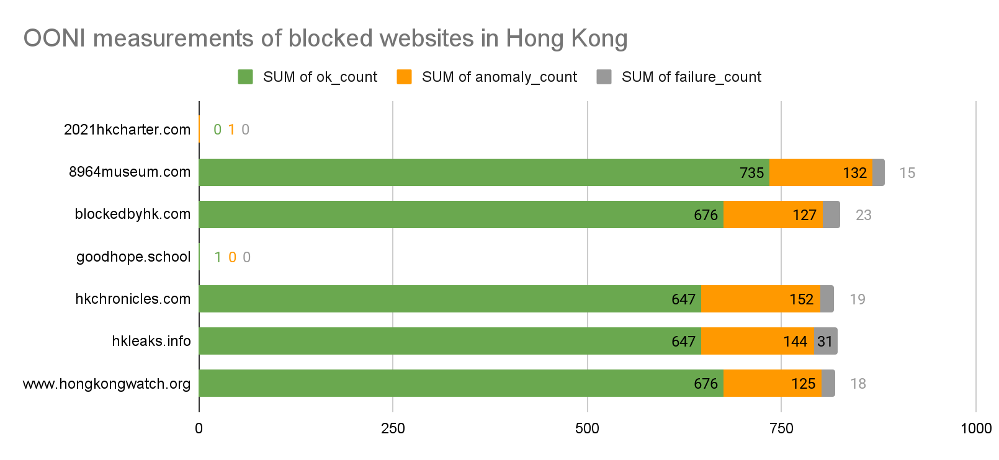
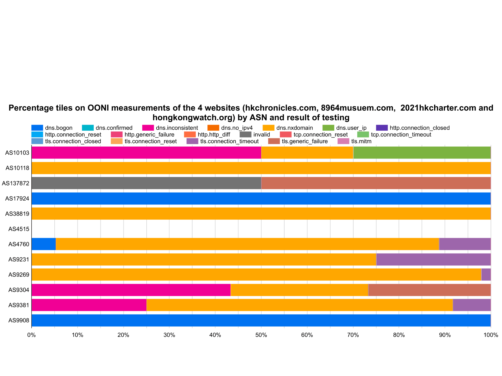
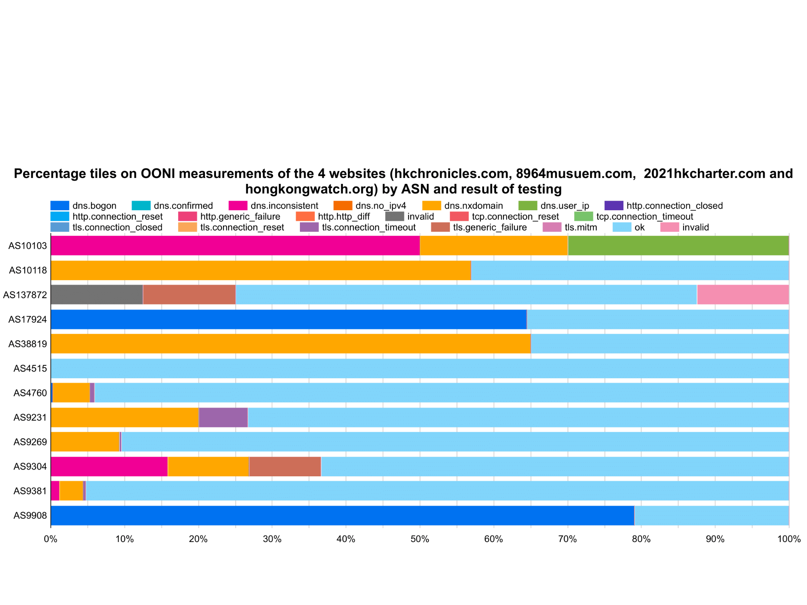
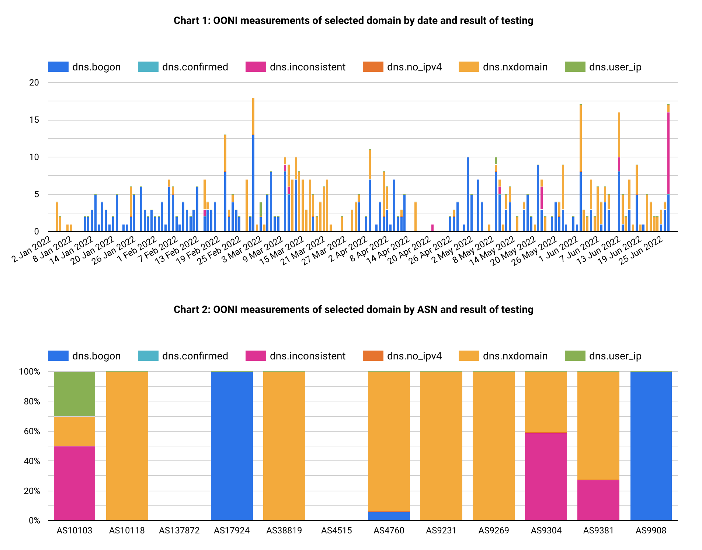
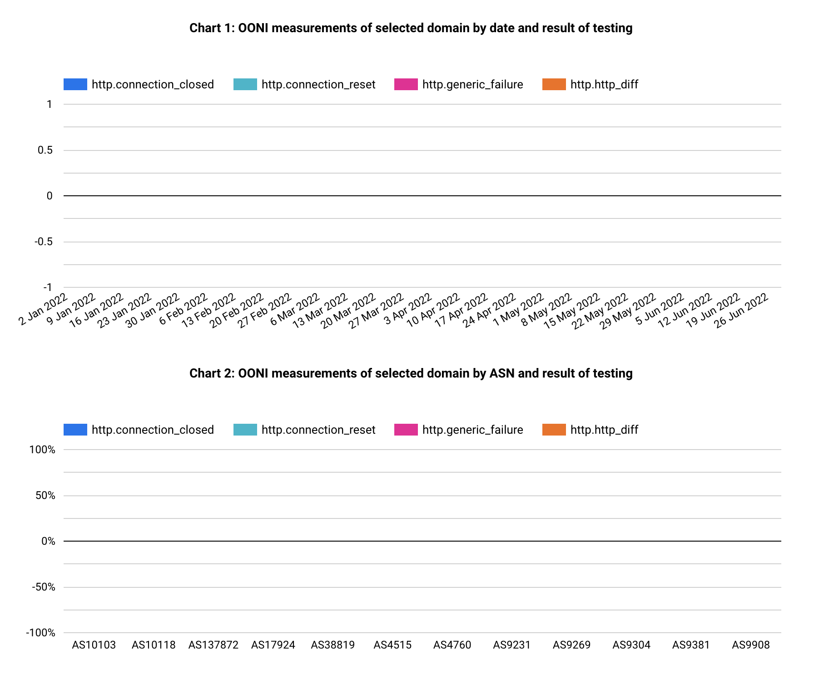
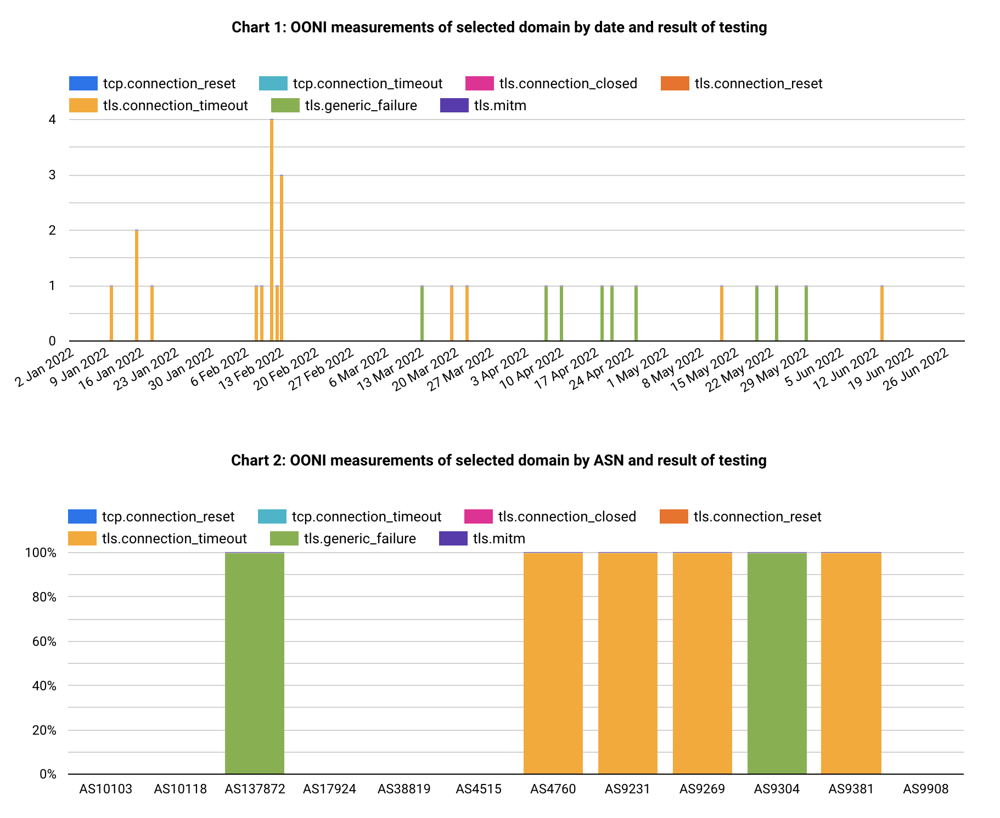

---

title: "iMAP State of Internet Censorship Report 2022 - Hong Kong"

description: "This report shares internet censorship during the first half of 2022 in Hong Kong using OONI data."

author: " Independent Researchers (Anonymous), Siti Nurliza Samsudin (Sinar Project) and Kelly Koh (Sinar Project)"

date: "2022-12-23"

tags: ["hong-kong", "censorship", "country-hk", "theme-human_rights"]

categories: ["report"]

---

Hong Kong, a place geographically conjunct to the soil of Mainland China, has been previously known as a free society, endured and still enduring multiple historical occasions. Once, there was no nationwide internet censorship until the latest development that local authorities and Beijing forcefully implemented the Hong Kong national security law in late June 2020. Currently, at least four websites are known to be censored, and a few ongoing discussions among pro-Beijing parties and the government to put censorship up on instant messaging and social platforms.

In this country report, we focus on depicting the current and new censorship events post-establishment of the Hong Kong National Security Law between January 1 to June 30, 2022, based on OONI network measurement data.

---

* In 2019 and early 2020, citizens of Hong Kong demonstrated widespread Anti-ELAB (Anti Extradition Law Amendment Bill) protests in response to the amendment bill on extradition conditions for fugitive offenders proposed by the Hong Kong government. 
* On June 30, 2020, the Standing Committee of the National People’s Congress unanimously decided to enact and implement the Hong Kong National Security Law. 
* In January 2021, a local ISP “Hong Kong Broadband Network”, responded to media inquiries, affirming their execution of censorship was responding to the request from the Hong Kong Police Force on the grounds of National Security. 
* Since the enactment of the Hong Kong national security law, up until now, at least four political and dissident-related websites have been nationally blocked on national security grounds. The four websites were related to political criticism and human rights issues.
* There were a total of 1,416,459 OONI measurements of web connectivity recorded in Hong Kong during the first half of 2022. This came from the testing of 2228 domains via 30 local ASNs and 18 foreign ASNs.
* The broadly used censorship method in Hong Kong for the censored websites in scope is DNS tampering, followed by very little TCP and TLS connection interference.
* Depicting from the OONI Probe measuring results, there is no conspicuous or known censorship carried out on four major Instant Messaging Apps and circumvention tools.


## Table of Content

**[Key Findings](#key-findings)**

**[Introduction](#introduction)**

**[Background](#background)**

> [Legal environment](#legal-environment)
> 
> [Hong Kong Basic Law](#hong-kong-basic-law)
> 
> [Legislative context](#legislative-context)
> 
> [Hong Kong National Security Law & Legislative Reform](#hong-kong-national-security-law-legislative-reform)
> 
> [Reported cases of internet censorship](#reported-cases-of-internet-censorship)
> 
> [ISP officially confirms national censorship](#isp-officially-confirms-national-censorship)

**[Examining internet censorship in Hong
Kong](#examining-internet-censorship-in-hong-kong)**

> [Findings](#findings)
> 
> [Blocking of Websites](#blocking-of-websites)
> 
> [Censorship technologies](#censorship-technologies)
> 
> [Blocking of Instant Messaging Apps](#blocking-of-instant-messaging-apps)
> 
> [Blocking of Circumvention Tools](#blocking-of-circumvention-tools) 

**[Acknowledgement of Limitations](#acknowledgement-of-limitations)**

**[Conclusion](#conclusion)**

> [Contribute to the study](#contribute-to-the-study)

**[Acknowledgements](#acknowledgements)**

**[Annex I: Glossary](#annex-i-glossary)**

**[Annex II: Methodology](#annex-ii-methodology)**

> [Data](#data)
> 
> [Coverage](#coverage)
> 
> [How are the network measurements gathered?](#how-are-the-network-measurements-gathered)
> 
> [How are the network measurements analysed?](#how-are-the-network-measurements-analysed)
> 
> [Country code](#country-code)
> 
> [Autonomous System Number (ASN)](#autonomous-system-number-asn)
> 
> [Date and time of measurements](#date-and-time-of-measurements) 
> 
> [IP addresses and other information](#ip-addresses-and-other-information)
> 
> [Network measurements](#network-measurements)
> 
> [Confirmed vs Heuristics](#confirmed-vs-heuristics)

**[About iMAP](#about-imap)**

**[About Sinar Project](#about-sinar-project)**

**[Footnotes and Citations](#footnotes-and-citations)**


## Introduction

Since the enactment of the Hong Kong national security law, up until now, at least four political and dissident-related websites have been nationally blocked on national security grounds. Freedom of speech, civil society, and pro-democratic press and publication also suffered from high-pressure crackdowns from local authorities, as reported in the 135th session of the UN Human Rights committee.

The Open Observatory of Network Interference (OONI), Sinar Project, and a group of independent Hong Kong researchers collaborated on a joint study. Throughout this report, the team examines whether internet censorship events persist in the country through the collection and analysis of network measurements.

This study aims to increase the transparency of internet controls in Hong Kong. This report will provide information about the network landscape and internet penetration levels of Hong Kong, its legal environment concerning freedom of expression, access to information, and privacy, as well as cases of censorship in the country. The remaining parts of the report document this study’s methodology and key findings.

Selected scope of ISPs in this report:


* AS4515 & AS4760 & AS38819 - PCCW HKT
* AS9231 & AS131872 - China Mobile Hong Kong
* AS9269 & AS9381 & AS10103 - Hong Kong Broadband Network
* AS9304 & AS10118 - Hutchison Global Communications (Hong Kong)
* AS9908 - HK Cable TV
* AS17924 - SmarTone Mobile Communications


## Background

Hong Kong is a special administrative region of China[^1], an ex-colony of the United Kingdom, and was previously known as one of the most popular free ports and major trade centres in Asia. This land has a population of roughly 7.2 million[^2] with a total of 100% urban population[^3], inclusively spanning across multi-ethnicity and different religions[^3] as well.

Historically, Great Britain signed the “Sino-British Joint Declaration” with the People’s Republic of China to resolve the “Agreement on the future of Hong Kong” for both countries. China regained sovereignty to the ex-colony in July 1997 and “preserves Hong Kong’s familiar legal system and the rights and freedoms enjoyed there.” [^4] Different from China, Hong Kong looks up to the principle of “One Country, Two Systems” [^5], the very foundation laid in the organic law “Hong Kong Basic Law” [^6].

Politically, Hong Kong has been governed by a hybrid regime[^7] since July 1997. The Chief Executive is the head of government[^8]. The Standing Committee of the National People’s Congress is in charge of appointing the elected Chief Executive[^8]. Chief Executive candidates are vetted and only approved by the Committee for Safeguarding National Security without a straightforward appealing mechanism[^9].

In 2019 and early 2020, citizens of Hong Kong demonstrated widespread Anti-ELAB(Anti Extradition Law Amendment Bill) protests in responding to the amendment bill on extradition conditions for fugitive offenders proposed by the Hong Kong government. On June 30, 2020, the Standing Committee of the National People’s Congress unanimously decided[^10][^11] to enact and implement the Hong Kong National Security Law, a countermeasure to the mass protest on the street and establishing the legislative power for local authorities to censorships based on national security grounds.


### **Legal environment**


#### Hong Kong Basic Law

The Hong Kong Basic Law, which served as organic law, and is also seen as a constitutional document[^6] by the Hong Kong government, has guaranteed that all residents of Hong Kong are equal before the law and possess inviolable rights to “freedom of speech, of the press and of publication; freedom of association, of assembly, of procession and of demonstration; and the right and freedom to form and join trade unions, and to strike.” [^12]


#### Legislative context

There are three major criminal laws currently ruling computer crimes in Hong Kong:


* Cap. 106 Telecommunications Ordinance
    * Section 27A 	Unauthorized access to computer by telecommunications
* Cap. 200 Crimes Ordinance
    * Section 60 	Destroying or damaging property
    * Section 161 	Access to computer with criminal or dishonest intent

Over the past ten years, some computer crime cases have been dismissed differently because of frail to no evidence of the defendant purposefully stealing or without authorization to gain information from online information systems.

For instance, on July 3, 2019, a flight passenger Chan was released from court with a bind-over condition[^13], only that he found out the electronic boarding pass website leaked information to other users by changing a few characters in the web address field. In this court case, Chan stated he had immediately notified the airline company and the Privacy Commissioner for Personal Data right after discovering the vulnerability. However, there were no replies from both parties after three weeks. Instead, Chan was then arrested and prosecuted for “unauthorized access to computer by telecommunications” by the authorities, accusing Chan of having accessed the personal information of other passengers.

A side note to better illustrates the legislative landscape would be the recent judicial review filed by Hong Kong citizen Cheuk-Kin Kwok. The applicant hopes to stop the government from nullifying vaccination exemption letters through a declaration in the Gazette. However, soon after the court ruling in favour of Kwok, Chief Execute John Lee Ka-Chiu amended the law, empowering concrete legal rights to the health secretary in nullifying exemption letters upon “reasonable grounds”.

Also, given that the current ruling party in Hong Kong took sides with Beijing, this curated great convenience for the government and pro-Beijing parties on policy-making and legislative changes. For example, on October 21, 2022, the Hong Kong government published in the Gazette an amendment bill proposal to the Cap. 138A “Pharmacy and Poisons Regulations” to further restrict antipyretic drug sales[^14]. Without any opposition from the Legislative Council, drugs like aspirin and paracetamol will be added to the “Schedule 1” list of poisons in a year. General citizens then can only purchase simplex painkillers like Tylenol and Panadol (common brand names for paracetamol) from registered pharmacies, dispensaries, government-sanctioned “listed sellers of poisons”, or clinics. On the complementary side, Cap. 134 “Dangerous Drugs Ordinance” rules that nobody can possess poison listed in “Schedule 1” or be fined or imprisoned for up to 7 years.


#### Hong Kong National Security Law & Legislative Reform

Currently, there are a total of 66 articles inside the Hong Kong National Security Law in effect, with a prominent count of 3 articles affecting the global population:


* **Article 38**: This Law shall apply to offences under this Law committed against the Hong Kong Special Administrative Region from outside the Region by a person who is not a permanent resident of the Region.
* **Article 43**: ... the department for safeguarding national security of the Police Force of the Hong Kong Special Administrative Region may ... **requiring a person, who is suspected, on reasonable grounds, of having in possession information or material relevant to investigation, to answer questions and furnish such information or produce such material** ...
* **Article 47**: The courts of the Hong Kong Special Administrative Region shall obtain a certificate from the Chief Executive to certify whether an act involves national security or whether the relevant evidence involves State secrets when such questions arise in the adjudication of a case. The certificate shall be binding on the courts.

As of writing, no court judgements or valuable legislative perspectives give valid explanations and justification for cyber crimes charges using the Hong Kong National Security Law.

The Law Reform Commission of Hong Kong has gathered a cybercrime-specific legislative reforming committee[^15]. On July 2022, the sub-committee published a consultation paper[^16]. Inside, it proposes five cybercrime categories: “illegal access to program or data”, “illegal interception of computer data”, “illegal interference of computer data”, “illegal interference of computer system”, and “making available or possessing a device or data for committing a crime” in the documents from the committee.


### **Reported cases of internet censorship**


#### ISP officially confirms national censorship

The first censorship happened in January 2021[^17] [^18] [^19]. The website “HKChronicles” displays doxxed personal information of police officers, pro-Beijing members of the Legislative Council, and a revelation of graphics and videos depicting police brutalities since the 2019 Anti-ELAB(Anti Extradition Law Amendment Bill) social movement.

Later that month, a local major Internet Service Provider(ISP), “Hong Kong Broadband Network”, responded to media inquiries[^20] [^21], affirming their execution of censorship was responding to the request from the Hong Kong Police Force on the grounds of National Security. It is the first time a local ISP has come out and revealed that authorities have been exercising administrative power granted by the Hong Kong National Security Law to perform censorship nationwide. Other local ISPs have not responded to media inquiries directly, only stating that the company will follow local regulations[^22].


## Examining internet censorship in Hong Kong

A group of independent Hong Kong researchers, in collaboration with the Sinar Project and with assistance from the Open Observatory of Network Interference (OONI), performed a study on internet censorship in Hong Kong. This study aimed to understand whether and to what extent censorship events occurred in Hong Kong during the testing period.

The sections below document the findings of this study.

### **Findings**

This study collected network measurements through OONI Probe software tests performed across different local vantage points in Hong Kong between January 1, 2022, and June 30, 2022. The tests resulted in four types of results:

* **OK**: Successful measurements (i.e. no sign of internet censorship)
* **Anomaly**: Measurements that provided signs of potential blocking (however, false 
* positives can occur)
* **Confirmed**: Measurements from automatically confirmed blocked websites (e.g. a block page was served)
* **Failure**: Failed experiments 

#### Blocking of Websites

While there had been no confirmed blocked websites on OONI during the six-month period,  censorship was found across four websites based on news reports and measurements on OONI Explorer:

* **Blocking of a website about doxxed pro-Beijing individuals and police officers.** The Hong Kong authorities have blocked access to hkchronicles.com. A website created by Naomi Chan to display personal information about individuals with a pro-Beijing political stance, police officers, and their family members in Hong Kong.
* **Blocking of a museum website about the Tiananmen Square massacre.** The Hong Kong authorities, without public denying, blocked access to 8964museum.com, created by academics and pro-democratic individuals, to observe the remembrance of the “June 4 Incident” back at 1989 China Tiananmen Square.
* **Blocking of a political website about the 2021 Hong Kong Charter.** The Hong Kong Police Force has reportedly censored access to the political website 2021hkcharter.com, created by a few political leads in exile who hope to unite diaspora Hongkongers.
* **Blocking of a website from Hong Kong Watch.** The UK-based charity, which advocates monitoring the implementation of the Sino-British Joint Declaration, has its website hongkongwatch.org censored in Hong Kong.

The below table shows the total measurements, and individual result counts of OONI web connectivity measurements in Hong Kong over the above said period: 


| **Measurements** | **OK**  | **Anomaly** | **Confirmed** | **Failure** |
|------------------|---------|-------------|---------------|-------------|
| 1416459          | 1345667 | 52173       | 0             | 18619       |


The following list is the local Hong Kong ISPs probed within the above said period:


| **ASN**  | **ASN Name**         | **ASN Ownership/ Description**                       | **ASN Registration Country** | **Measurement Count** |
|------------|----------------------|---------------|------------|-------------|
| AS3363   | HKUST-AS-HK          | Hong Kong University of Science and Technology       | HK                           | 34                    |
| AS3661   | ERX-CUHKNET          | The Chinese University of Hong Kong                  | HK                           | 162                   |
| AS4515   | ERX-STAR             | HKT Limited                                          | HK                           | 1400                  |
| AS4528   | HKU-AS-HK            | The University of Hong Kong                          | HK                           | 41                    |
| AS4760   | HKTIMS-AP            | HKT Limited                                          | HK                           | 770352                |
| AS9231   | IPEOPLESNET-AS-AP    | China Mobile Hong Kong Company Limited               | HK                           | 2115                  |
| AS9269   | HKBN-AS-AP           | Hong Kong Broadband Network Ltd.                     | HK                           | 162381                |
| AS9304   | HUTCHISON-AS-AP      | HGC Global Communications Limited                    | HK                           | 17856                 |
| AS9381   | HKBNES-AS-AP         | HKBN Enterprise Solutions HK Limited                 | HK                           | 94085                 |
| AS9908   | HKCABLE2-HK-AP       | HK Cable TV Ltd                                      | HK                           | 35568                 |
| AS10103  | HKBN-AS-AP           | HK Broadband Network Ltd.                            | HK                           | 3003                  |
| AS10118  | HTCL-IAS-HK-AP       | Hutchison Telephone Company Limited                  | HK                           | 26510                 |
| AS17924  | SMARTONE-MB-AS-AP    | SmarTone Mobile Communications Ltd                   | HK                           | 153575                |
| AS24000  | LIHGL-AS-AP          | [<u>24.hk</u>](http://24.hk) global BGP              | HK                           | 7346                  |
| AS24002  | SCMP-AS-HK-AP        | South China Morning Post Publishers Limited. English | HK                           | 7                     |
| AS38008  | APERTURE-AS-AP       | Aperture Science Limited                             | HK                           | 100                   |
| AS38819  | HKCSL-AS-AP          | HKCSL GPRS NETWORK                                   | HK                           | 4130                  |
| AS58453  | CMI-INT-HK           | Level 30, Tower 1                                    | HK                           | 13446                 |
| AS63888  | TISP-AS              | TISP LIMITED                                         | HK                           | 20                    |
| AS64096  | BIH-GLOBAL           | BIH-Global Internet Harbor                           | HK                           | 1                     |
| AS131685 | SUN-HK               | Sun Network Hong Kong Limited                        | HK                           | 13532                 |
| AS133073 | SZKF-AS-AP           | TELEGLOBAL COMMUNICATION SERVICES LIMITED            | HK                           | 2693                  |
| AS133752 | LEASEWEB-APAC-HKG-10 | Leaseweb Asia Pacific pte. ltd.                      | HK                           | 424                   |
| AS135330 | ADCDATACOM-AS-AP     | [<u>ADCDATA.COM</u>](http://adcdata.com)             | HK                           | 13                    |
| AS135391 | AOFEI-HK             | AOFEI DATA INTERNATIONAL COMPANY LIMITED             | HK                           | 1586                  |
| AS136907 | HWCLOUDS-AS-AP       | HUAWEI CLOUDS                                        | HK                           | 4626                  |
| AS137872 | PEOPLESPHONE-HK      | China Mobile Hong Kong Company Limited               | HK                           | 258                   |
| AS137969 | HKBIL-AS-AP          | HONG KONG BRIDGE INFO-TECH LIMITED                   | HK                           | 73                    |
| AS138997 | EDCL-AS-AP           | Eons Data Communications Limited                     | HK                           | 1934                  |
| AS141677 | NATHOSTS-AS-AP       | Nathosts Limited                                     | HK                           | 46292                 |


The following list is the foreign Hong Kong ISPs probed within the above said period:

| **ASN**  | **ASN Name**                | **ASN Ownership/ Description**       | **ASN Registration Country** | **Measurement Count** |
|------------|----------------------|--------------|-------------|------------|
| AS6939   | HURRICANE                   |                                      | US                           | 13541                 |
| AS8075   | MICROSOFT-CORP-MSN-AS-BLOCK |                                      | US                           | 37                    |
| AS9009   | M247                        |                                      | GB                           | 11653                 |
| AS13335  | CLOUDFLARENET               | Cloudflare                           | US                           | 7229                  |
| AS16509  | AMAZON-02                   | Amazon                               | US                           | 9                     |
| AS21859  | ZEN-ECN                     |                                      | US                           | 15                    |
| AS22363  | PHMGMT-AS1                  |                                      | US                           | 3161                  |
| AS32242  | ULTRA-KING                  |                                      | VG                           | 4                     |
| AS45102  | ALIBABA-CN-NET              | Alibaba US Technology Co., Ltd.      | CN                           | 7383                  |
| AS54574  | DMIT-LEGACY                 |                                      | US                           | 1261                  |
| AS55720  | GIGABIT-MY                  | Gigabit Hosting Sdn Bhd              | MY                           | 299                   |
| AS60068  | CDN77                       | Datacamp Limited                     | GB                           | 4501                  |
| AS132203 | TENCENT-NET-AP-CN           | Tencent Building, Kejizhongyi Avenue | CN                           | 20                    |
| AS136787 | TEFINCOMSA-AS-AP            | TEFINCOM S.A.                        | PA                           | 2208                  |
| AS199524 | GCORE                       |                                      | LU                           | 2                     |
| AS206092 | SECFIREWALLAS               |                                      | GB                           | 1514                  |
| AS206264 | AMARUTU-TECHNOLOGY          |                                      | SC                           | 38                    |
| AS398704 | STACKS-INC-01               |                                      | US                           | 21                    |

At the beginning of 2021, Hong Kong authorities had, first in history, executed the administrative power to censor political and dissident-related websites. The first website being censored was “HKChronicles”, happening at noon on January 6, 2021[^23]. Netizens of Hong Kong started experiencing a widespread problem of being unable to browse this website. A local Internet Service Provider, “Hong Kong Broadband Network”, later officially confirmed the censorship, stating their action was responding to the executive decisions from the Hong Kong Police Force and also relevant legistlations[^20] [^21].

Since then, at least three more websites and multiple aliases of the censored website have been blocked[^24] [^25] [^26] inside Hong Kong across the entire year of 2021 and have remained until now. By analysing OONI measurements collected over the first half of 2022, it is possible to detect and inspect how websites are being blocked in the country.

The following charts depict precisely the four known censored websites with their seven domain names out of 2228 domains tested. The seven domains by category are as follows:

| **Domain**                                                   | **Category**        |
|------------------------------------|------------------------------------|
| [hkchronicles.com](http://hkchronicles.com)           | Political Criticism |
| [8964museum.com](http://8964museum.com)               | Political Criticism |
| [blockedbyhk.com](http://blockedbyhk.com)             | Political Criticism |
| [hkleaks.info](http://hkleaks.info)                   | Political Criticism |
| [www.hongkongwatch.org](http://www.hongkongwatch.org) | Human Rights Issues |
| [2021hkcharter.com](http://2021hkcharter.com/)        | Political Criticism |
| [goodhope.school](https://goodhope.school/)           | Political Criticism |

Note: [blockedbyhk.com](http://blockedbyhk.com), [goodhope.school](https://goodhope.school/) and [hkleaks.info](http://hkleaks.info) were alias domains for HKChronicles.



##### Censorship technologies

The following charts depict precisely the four known censored websites with their seven domain names.

```
Types of Blocking

DNS
- dns.confirmed - one of the returned IPs matches an IP known to be used to implement blocking
- dns.no_ipv4 - no IPv4 address was returned
- dns.bogon - a bogon IP address was returned
- dns.nxdomain - we got an NXDOMAIN response from the probe, but we got a valid response from the control vantage point
- dns.inconsistent - our DNS consistency heuristics determined the returned IP to be inconsistent
- dns.user_ip - The particular measurement included the IP address of the probe in the DNS query response and since OONI scrubs sensitive data from measurements the IP was replaced with [scrubbed].

HTTP
These are all blocking types related to plaintext HTTP requests:
- http.confirmed - the returned page is a known blockpage
- http.http_diff - the page doesn't match based on our page consistency heuristics
- http.connection_reset - we got a connection reset to a plaintext HTTP request
- http.connection_closed - the connection was closed before all data was transmitted
- http.connection_timeout - the connection timed out before we could retrieve all the data
- http.generic_failure - this is a generic error from legacy OONI probes

TLS
These are all blocking types related to TLS:
- tls.connection_reset - a reset packet was seen after the client sent the ClientHello packet
- tls.connection_closed - the connection was closed after the ClientHello
- tls.connection_timeout - the connection timed out after the ClientHello

All of the above can also have the _after_hello suffix, indicating that the event happened after the client sent the ClientHello packet
- tls.mitm - The DNS is consistent, but the TLS certificate validation failed. This suggest a TLS man-in-the-middle
- tls.generic_failure - generic error from legacy OONI probes
```



Figure 1: Censorship Methodologies by local ISPs with respect to the four websites



Figure 2: Censorship Methodologies vs All nation-wide test results by local ISPs including OK and Invalid results

From January to June 2022, there are a total of 12 ASNs possessed by six network operators:

* AS4515 & AS4760 & AS38819 - PCCW HKT
* AS9231 & AS131872 - China Mobile Hong Kong
* AS9269 & AS9381 & AS10103 - Hong Kong Broadband Network
* AS9304 & AS10118 - Hutchison Global Communications (Hong Kong)
* AS9908 - HK Cable TV
* AS17924 - SmarTone Mobile Communications

Among OONI measurements collected over this period, more than 3000 tests were performed on all these ASNs for these four censored websites. Notably, AS4515, owned by PCCW HKT, is a network primarily serving the finance, business industry and public sectors, such as AASTOCKS.COM, Ruijiang Group, Cathay Pacific, The Bank of East Asia, and more[^27]. By comparing figures 1 and 2 specifically on this ASN, it clearly shows no signs of internet traffic in these service and sector categories being censored or altered in a way that complies with the executive order issued by local authorities.


Figure 3: DNS censorship/anomaly results by local ISPs


Figure 4: HTTP censorship by local ISPs


Figure 5: TCP and TLS censorship/interference by local ISPs

The broadly used censorship method in Hong Kong for the censored websites in scope is “DNS tampering”, followed by very little TCP and TLS connection interference. 

Last, by comparing Figures 3, 4 and 5 it tells The result also suggests that residential use connectivity is censored while commercial and public sectors can be largely immune.


#### Blocking of Instant Messaging Apps

Depicting from the OONI Probe measuring results, no conspicuous or known censorship is carried out on four major Instant Messaging Apps. The table below shows the total and individual measurement results for each of the application services:


|                        | **Facebook Messenger** | **Signal** | **Telegram** | **Whatsapp** |
|------------------|--------------|--------------|--------------|--------------|
| **Total Measurements** | 17180                  | 16804      | 17138        | 17114        |
| **OK**                 | 16228                  | 16270      | 16697        | 16617        |
| **Anomaly**            | 952                    | 534        | 441          | 451          |
| **Failure**            | 0                      | 0          | 0            | 46           |


#### Blocking of Circumvention Tools

The measurement results on the blocking of circumvention tools show no remarkable results. The table below tells the total and individual measurement results against each tool to use in circumventing nationwide censorship technologies:

|                        | **Psiphon** | **Tor** | **Tor Snowflake** |
|------------------------|-------------|---------|-------------------|
| **Total Measurements** | 17084       | 17029   | 56                |
| **OK**                 | 16994       | 16935   | 44                |
| **Anomaly**            | 90          | 94      | 12                |
| **Failure**            | 0           | 0       | 0                 |

Note: Anomalies detected from testing Tor Snowflake on AS4760 have been removed due to found errors in the OONI Probe ([Example measurement](https://explorer.ooni.org/measurement/20220610T224821Z_torsf_HK_4760_n1_utB8jZPJ3G0RMI18)).


## Acknowledgement of Limitations

The examination of the findings of this study is limited to network measurements that were collected[^28] from January 1 to June 30, 2022, to examine the most recent censorship trends and events and do not necessarily reflect a comprehensive view of internet censorship in Hong Kong. The test lists included a limited number of websites and it may be possible that websites outside of the lists are blocked.

Although the network measurements were collected from multiple local vantage points in Hong Kong, the running of OONI software testing was not consistent across all networks.

## Conclusion

The objective of this study is to gain a better understanding of internet censorship events in Hong Kong through the collection and analysis of network measurements. To this end, OONI software tests were run across different local vantage points in Hong Kong to collect and analyse network measurement data that could help examine whether sites, instant messaging apps, and censorship circumvention tools were blocked. Some of the tests also run were designed to examine whether systems (“middleboxes”) that could be responsible for censorship, surveillance, and traffic manipulation were present in the tested networks. Overall, the accessibility of 2228 domains was tested, and the network measurement data collected between January 1, 2022, to June 30 2022, was analysed.

The key findings of this study show that local ISPs in Hong Kong appear to primarily be implementing censorship through DNS hijacking and DNS-based censorship (in the case of blocking the four censored websites, for example).

As part of this study, four websites with multiple of their aliases domain names were confirmed to be blocked across 6 ISPs (PCCW HKT, China Mobile Hong Kong, Hong Kong Broadband Network, Hutchison Global Communications (Hong Kong), HK Cable TV, and SmarTone Mobile Communications) and their downstream providers as well. It is worth highlighting that PCCW HKT leaves its commercial and public sector networks to remain uncensored; only the residential lines are affected. On the positive side, WhatsApp, Facebook Messenger, Telegram, Signal, Psiphon and the Tor network (vanilla) appeared to remain accessible across most ISPs presented in the OONI measurement test results.

Given the limited transparency around information controls in Hong Kong and the potential implications they may have on human rights, we encourage ISPs to disclose their motivation and justification behind blocking sites and services. We also encourage public debate based on the findings of this study around the necessity and proportionality of information controls.

### **Contribute to the study**

There are various ways one may contribute to the OONI measurements:

* Testing: You may test on [various platforms](https://ooni.org/install/), both on Mobile (iOS and Android) and Desktop, including on the CLI on Linux platforms. The domains you test can be either randomly selected from the [Citizen Lab Test Lists](https://github.com/citizenlab/test-lists) or custom test lists specific to your needs.*
* Contribute to the test lists: You can contribute to the test lists on GitHub or on [OONI](https://test-lists.ooni.org/).
* Translate the OONI Probe to your local language [here](https://www.transifex.com/otf/ooniprobe/).
* Participate in community discussions on the [OONI’s Slack channel](https://slack.ooni.org/)

Note: Specific to Hong Kong users, it is recommended to avoid using China-based DNS resolvers and instead, to use an alternative resolver or an encrypted DNS solution like DoH.


## Acknowledgements

We would like to thank the OONI team for developing OONI Probe and publishing measurements as open data.


## Annex I: Glossary

| **Term**         | Definition                                                                                                                                                                                                                                                                                                                                                                                                                                                                                                                                                                                                                                                                                                                                                                                                                                               |
|------------------|----------------------------------------------------------------------------------------------------------------------------------------------------------------------------------------------------------------------------------------------------------------------------------------------------------------------------------------------------------------------------------------------------------------------------------------------------------------------------------------------------------------------------------------------------------------------------------------------------------------------------------------------------------------------------------------------------------------------------------------------------------------------------------------------------------------------------------------------------------|
| **DNS**          | DNS stands for “Domain Name System” and it maps domain names to IP addresses. A domain is a name that is commonly attributed to websites (when they’re created), so that they can be more easily accessed and remembered. For example, twitter.com is the domain of the Twitter website. However, computers can’t connect to internet services through domain names, but based on IP addresses: the digital address of each service on the internet. Similarly, in the physical world, you would need the address of a house (rather than the name of the house itself) in order to visit it. The Domain Name System (DNS) is what is responsible for transforming a human- readable domain name (such as ooni.org) into its numerical IP address counterpart (in this case:104.198.14.52), thus allowing your computer to access the intended website.  |
| **HTTP**         | The Hypertext Transfer Protocol (HTTP) is the underlying protocol used by the World Wide Web to transfer or exchange data across the internet. The HTTP protocol allows communication between a client and a server. It does so by handling a client’s request to connect to a server, and the server’s response to the client’s request. All websites include an HTTP (or HTTPS) prefix (such as http://example.com/) so that your computer (the client) can request and receive the content of a website (hosted on a server). All websites include an HTTP (or HTTPS) prefix (such as http://example.com/) so that your computer (the client) can request and receive the content of a website (hosted on a server). The transmission of data over the HTTP protocol is unencrypted.                                                                  |
| **ISP**          | An Internet Service Provider (ISP) is an organization that provides services for accessing and using the internet. ISPs can be state-owned, commercial, community-owned, non-profit, or otherwise privately owned. Vodafone, AT&T, Airtel, and MTN are examples of ISPs.                                                                                                                                                                                                                                                                                                                                                                                                                                                                                                                                                                                 |
| **Middle boxes** | A middlebox is a computer networking device that transforms, inspects, filters, or otherwise manipulates traffic for purposes other than packet forwarding. Many Internet Service Providers (ISPs) around the world use middleboxes to improve network performance, provide users with faster access to websites, and for a number of other networking purposes. Sometimes though, middleboxes are also used to implement internet censorship and/or surveillance. The OONI Probe app includes two tests designed to measure networks with the aim of identifying the presence of middleboxes.                                                                                                                                                                                                                                                           |
| **TCP**          | The Transmission Control Protocol (TCP) is one of the main protocols on the internet. To connect to a website, your computer needs to establish a TCP connection to the address of that website. TCP works on top of the Internet Protocol (IP), which defines how to address computers on the internet. When speaking to a machine over the TCP protocol you use an IP and port pair, which looks something like this: 10.20.1.1:8080. The main difference between TCP and (another very popular protocol called) UDP is that TCP has the notion of a “connection”, making it a “reliable” transport protocol.                                                                                                                                                                                                                                          |
| **TLS**          | Transport Layer Security (TLS) – also referred to as “SSL” – is a cryptographic protocol that allows you to maintain a secure, encrypted connection between your computer and an internet service. When you connect to a website through TLS, the address of the website will begin with HTTPS (such as https://www.facebook.com/), instead of HTTP.                                                                                                                                                                                                                                                                                                                                          
A comprehensive glossary related to OONI can be accessed here: [https://ooni.org/support/glossary/](https://ooni.org/support/glossary/). 


## Annex II: Methodology


### **Data**

Data computed based on the heuristics for this report can be downloaded here: [https://github.com/Sinar/imap-data](https://github.com/Sinar/imap-data) whereas aggregated data can be downloaded from [OONI Explorer](https://explorer.ooni.org/).


### **Coverage**

The iMAP State of Internet Censorship Country Report covers the findings of network measurement collected through Open Observatory of Network Interference (OONI) [OONI Probe App](https://ooni.org/install/) that measures the blocking of websites, instant messaging apps, circumvention tools and network tampering. The findings highlight the websites, instant messaging apps and circumvention tools confirmed to be blocked, the ASNs with censorship detected and method of network interference applied. The report also provides background context on the network landscape combined with the latest legal, social and political issues and events which might have an effect on the implementation of internet censorship in the country.

In terms of timeline, this first iMAP report covers measurements obtained in the six-month period from 1 January 2022 to 30 June 2022. The countries covered in this round are Cambodia, Hong Kong, Indonesia, Malaysia, Myanmar, Philippines, Thailand, and Viet Nam. India will only be included starting in the next period of reporting.  


### **How are the network measurements gathered?**

Network measurements are gathered through the use of [OONI Probe app](https://ooni.org/install/), a free software tool developed by [Open Observatory of Network Interference (OONI)](https://ooni.org/). To learn more about how the OONI Probe test works, please visit [https://ooni.org/nettest/](https://ooni.org/nettest/).

iMAP Country Researchers and anonymous volunteers run OONI Probe app to examine the accessibility of websites included in the [Citizen Lab test lists](https://github.com/citizenlab/test-lists/tree/master/lists). iMAP Country Researchers actively review the country-specific test lists to ensure up-to-date websites are included and context-relevant websites are properly categorised, in consultation with local communities and digital rights network partners. We adopt the [approach taken by Netalitica](https://netalitica.com/wp-content/uploads/2021/10/Guideline-for-Test-List-Researchers-V7.pdf) in reviewing country-specific test lists.

It is important to note that the findings are only applicable to the websites that were examined and do not fully reflect all instances of censorship that might have occurred during the testing period. 


### **How are the network measurements analysed?**

OONI processes the following types of data through its data pipeline: https://github.com/ooni/pipeline.


#### Country code

OONI by default collects the code which corresponds to the country from which the user is running OONI Probe tests from, by automatically searching for it based on the user’s IP address through their [ASN database](https://github.com/ooni/asn-db-generator) the [MaxMind GeoIP database](https://www.maxmind.com/en/home). 


#### Autonomous System Number (ASN)

OONI by default collects the Autonomous System Number (ASN) of the network used to run OONI Probe app, thereby revealing the network provider of a user. 


#### Date and time of measurements

OONI by default collects the time and date of when tests were run to evaluate when network interferences occur and to allow comparison across time. UTC is used as the standard time zone in the time and date information. In addition, the charts generated on OONI MAT will exclude measurements on the last day by default.


#### Categories

The 31 website categories are based on the Citizenlab test lists: [https://github.com/citizenlab/test-lists](https://github.com/citizenlab/test-lists). As not all websites tested on OONI are on these test lists, these websites would have unclassified categories.

| **No.** | **Category Description**              | **Code** | **Description**                                                                                                                                                                                                                                                                                 |
|-----------|----------------------------|------------|--------------------------------------------------|
| 1       | Alcohol & Drugs                       | ALDR     | Sites devoted to the use, paraphernalia, and sale of drugs and alcohol irrespective of the local legality.                                                                                                                                                                                      |
| 2       | Religion                              | REL      | Sites devoted to discussion of religious issues, both supportive and critical, as well as discussion of minority religious groups.                                                                                                                                                              |
| 3       | Pornography                           | PORN     | Hard-core and soft-core pornography.                                                                                                                                                                                                                                                            |
| 4       | Provocative Attire                    | PROV     | Websites which show provocative attire and portray women in a sexual manner, wearing minimal clothing.                                                                                                                                                                                          |
| 5       | Political Criticism                   | POLR     | Content that offers critical political viewpoints. Includes critical authors and bloggers, as well as oppositional political organizations. Includes pro-democracy content, anti-corruption content as well as content calling for changes in leadership, governance issues, legal reform. Etc. |
| 6       | Human Rights Issues                   | HUMR     | Sites dedicated to discussing human rights issues in various forms. Includes women\'s rights and rights of minority ethnic groups.                                                                                                                                                              |
| 7       | Environment                           | ENV      | Pollution, international environmental treaties, deforestation, environmental justice, disasters, etc.                                                                                                                                                                                          |
| 8       | Terrorism and Militants               | MILX     | Sites promoting terrorism, violent militant or separatist movements.                                                                                                                                                                                                                            |
| 9       | Hate Speech                           | HATE     | Content that disparages particular groups or persons based on race, sex, sexuality or other characteristics                                                                                                                                                                                     |
| 10      | News Media                            | NEWS     | This category includes major news outlets (BBC, CNN, etc.) as well as regional news outlets and independent media.                                                                                                                                                                              |
| 11      | Sex Education                         | XED      | Includes contraception, abstinence, STDs, healthy sexuality, teen pregnancy, rape prevention, abortion, sexual rights, and sexual health services.                                                                                                                                              |
| 12      | Public Health                         | PUBH     | HIV, SARS, bird flu, centers for disease control, World Health Organization, etc                                                                                                                                                                                                                |
| 13      | Gambling                              | GMB      | Online gambling sites. Includes casino games, sports betting, etc.                                                                                                                                                                                                                              |
| 14      | Anonymization and circumvention tools | ANON     | Sites that provide tools used for anonymization, circumvention, proxy-services and encryption.                                                                                                                                                                                                  |
| 15      | Online Dating                         | DATE     | Online dating services which can be used to meet people, post profiles, chat, etc                                                                                                                                                                                                               |
| 16      | Social Networking                     | GRP      | Social networking tools and platforms.                                                                                                                                                                                                                                                          |
| 17      | LGBT                                  | LGBT     | A range of gay-lesbian-bisexual-transgender queer issues. (Excluding pornography)                                                                                                                                                                                                               |
| 18      | File-sharing                          | FILE     | Sites and tools used to share files, including cloud-based file storage, torrents and P2P file-sharing tools.                                                                                                                                                                                   |
| 19      | Hacking Tools                         | HACK     | Sites dedicated to computer security, including news and tools. Includes malicious and non-malicious content.                                                                                                                                                                                   |
| 20      | Communication Tools                   | COMT     | Sites and tools for individual and group communications. Includes webmail, VoIP, instant messaging, chat and mobile messaging applications.                                                                                                                                                     |
| 21      | Media sharing                         | MMED     | Video, audio or photo sharing platforms.                                                                                                                                                                                                                                                        |
| 22      | Hosting and Blogging Platforms        | HOST     | Web hosting services, blogging and other online publishing platforms.                                                                                                                                                                                                                           |
| 23      | Search Engines                        | SRCH     | Search engines and portals.                                                                                                                                                                                                                                                                     |
| 24      | Gaming                                | GAME     | Online games and gaming platforms, excluding gambling sites.                                                                                                                                                                                                                                    |
| 25      | Culture                               | CULTR    | Content relating to entertainment, history, literature, music, film, books, satire and humour                                                                                                                                                                                                   |
| 26      | Economics                             | ECON     | General economic development and poverty related topics, agencies and funding opportunities                                                                                                                                                                                                     |
| 27      | Government                            | GOVT     | Government-run websites, including military sites.                                                                                                                                                                                                                                              |
| 28      | E-commerce                            | COMM     | Websites of commercial services and products.                                                                                                                                                                                                                                                   |
| 29      | Control content                       | CTRL     | Benign or innocuous content used as a control.                                                                                                                                                                                                                                                  |
| 30      | Intergovernmental Organizations       | IGO      | Websites of intergovernmental organizations such as the United Nations.                                                                                                                                                                                                                         |
| 31      | Miscellaneous content                 | MISC     | Sites that don\'t fit in any category (XXX Things in here should be categorised)                                                                                                                                                                                                                |


#### IP addresses and other information

OONI does not collect or store users’ IP addresses deliberately. OONI takes measures to remove them from the collected measurements, to protect its users from [potential risks](https://ooni.org/about/risks/). However, there may be instances where users’ IP addresses and other potentially personally-identifiable information are unintentionally collected, if such information is included in the HTTP headers or other metadata of measurements. For example, this can occur if the tested websites include tracking technologies or custom content based on a user’s network location.


#### Network measurements

The types of network measurements that OONI collects depend on the types of tests that are run. Specifications about each OONI test can be viewed through its [git repository](https://github.com/ooni/spec), and details about what collected network measurements entail can be viewed through [OONI Explorer](https://explorer.ooni.org/world/) or through [OONI’s measurement API](https://api.ooni.io/).

In order to derive meaning from the measurements collected, OONI processes the data types mentioned above to answer the following questions:

* Which types of OONI tests were run?
* In which countries were those tests run?
* In which networks were those tests run?
* When were tests run?
* What types of network interference occurred?
* In which countries did network interference occur?
* In which networks did network interference occur?
* When did network interference occur?
* How did network interference occur?

To answer such questions, OONI’s pipeline is designed to answer such questions by processing network measurements data to enable the following:

* Attributing measurements to a specific country.
* Attributing measurements to a specific network within a country.
* Distinguishing measurements based on the specific tests that were run for their collection.
* Distinguishing between “normal” and “anomalous” measurements (the latter indicating that a form of network tampering is likely present).
* Identifying the type of network interference based on a set of heuristics for DNS tampering, TCP/IP blocking, and HTTP blocking.
* Identifying block pages based on a set of heuristics for HTTP blocking.
* Identifying the presence of “middle boxes” within tested networks.

According to OONI, false positives may occur within the processed data due to a number of reasons. DNS resolvers (operated by Google or a local ISP) often provide users with IP addresses that are closest to them geographically. While this may appear to be a case of DNS tampering, it is actually done with the intention of providing users with faster access to websites. Similarly, false positives may emerge when tested websites serve different content depending on the country that the user is connecting from, or in the cases when websites return failures even though they are not tampered with.

Furthermore, measurements indicating HTTP or TCP/IP blocking might actually be due to temporary HTTP or TCP/IP failures, and may not conclusively be a sign of network interference. It is therefore important to test the same sets of websites across time and to cross-correlate data, prior to reaching a conclusion on whether websites are in fact being blocked.

Since block pages differ from country to country and sometimes even from network to network, it is quite challenging to accurately identify them. OONI uses a series of heuristics to try to guess if the page in question differs from the expected control, but these heuristics can often result in false positives. For this reason OONI only says that there is a confirmed instance of blocking when a block page is detected.

Upon collection of more network measurements, OONI continues to develop its data analysis heuristics, based on which it attempts to accurately identify censorship events.

The full list of country-specific test lists containing confirmed blocked websites in Myanmar, Cambodia, Hong Kong, Indonesia, Malaysia, Philippines, Thailand, and Vietnam can be viewed here: [https://github.com/citizenlab/test-lists](https://github.com/citizenlab/test-lists). 


#### Confirmed vs Heuristics

Confirmed OONI measurements were based on blockpages with fingerprints recorded here [https://github.com/ooni/blocking-fingerprints](https://github.com/ooni/blocking-fingerprints). 

Hence, heuristics as below were run on raw measurements on all countries under iMAP to further confirm blockings. 

Firstly, IP addresses with more than 10 domains were identified. Then each of the IP address was checked for the following:


When blocking is determined, any domain redirected to these IP addresses would be marked as ‘dns.confirmed’. 

Secondly, HTTP titles and bodies were analysed to determine blockpages. This [example](https://explorer.ooni.org/measurement/20220411T125618Z_webconnectivity_IN_58678_n1_6zLG8ySiJHIq07Un?input=http%3A%2F%2Finfluence.in%2F) shows that the HTTP returns the text _‘The URL has been blocked as per the instructions of the DoT in compliance to the orders of Court of Law’_. Any domain redirected to these HTTP titles and bodies would be marked as ‘http.confirmed’. 

As a result, false positives are eliminated and more confirmed blockings were obtained including countries like Cambodia, Vietnam and Philippines which have no confirmed blocking fingerprints on OONI.

In the case of Hong Kong, the results of the heuristics showed external censorship from outside of the country instead of local censorship. Thus, the local researchers had analysed the OONI measurements manually to identify confirmed blockings. The domains identified were based on the timed-out instances. 

## About iMAP

Internet Monitoring Action Project (iMAP) aims to establish regional and in-country networks that monitor network interference and restrictions to the freedom of expression online in 9 countries: Myanmar, Cambodia, Hong Kong, India, Indonesia, Malaysia, Philippines, Thailand, and Vietnam. Sinar Project is currently working with national digital rights partners in these 9 countries. The project is done via Open Observatory Network Interference (OONI) detection and reporting systems, involving the maintenance of test lists and measurements.

More information available at: [imap.sinarproject.org](http://imap.sinarproject.org). Any enquiries and suggestions about this report can be directed to [team@sinarproject.org](mailto:team@sinarproject.org).


## About Sinar Project

Sinar Project is a civic tech initiative using open technology, open data and policy analysis to systematically make important information public and more accessible to the Malaysian people. It aims to improve governance and encourage greater citizen involvement in the public affairs of the nation by making Parliament and the Malaysian Government more open, transparent and accountable. More information available at: [https://sinarproject.org](https://sinarproject.org).

## Footnotes and Citations

[^1]: 中华人民共和国行政区划. (2005). http://www.gov.cn/test/2005-06/15/content_18253.htm

[^2]: Snapshot of Hong Kong. (2022). https://www.censtatd.gov.hk/en/scode460.html

[^3]: Hong Kong - The World Factbook. (2022). https://www.cia.gov/the-world-factbook/countries/hong-kong/

[^4]: Speech signing the Joint Declaration | Margaret Thatcher Foundation. (1984, December 19). https://www.margaretthatcher.org/document/105817

[^5]: Horace Yeung, & Flora Huang. (2015). “One Country Two Systems” as Bedrock of Hong Kong’s Continued Success: Fiction or Reality? Boston College International and Comparative Law Review, 38(2), 191. http://repository.essex.ac.uk/18431/

[^6]: Basic Law - Home (EN). (n.d.). https://www.basiclaw.gov.hk/en/index/

[^7]: Cheng, E. W. (2016). Street Politics in a Hybrid Regime: The Diffusion of Political Activism in Post-colonial Hong Kong. The China Quarterly, 226, 383–406. https://doi.org/10.1017/s0305741016000394

[^8]: Basic Law - Basic Law - Chapter II (EN). (n.d.). https://www.basiclaw.gov.hk/en/basiclaw/chapter2.html

[^9]: Improve Electoral System - Candidate Eligibility Review Mechanism. (n.d.). https://www.cmab.gov.hk/improvement/en/qualification-review/index.html

[^10]: Presidium elected, agenda set for China’s annual legislative session. (n.d.). http://www.npc.gov.cn/englishnpc/c23934/202005/ce05b9dfce7546209e6630e7ba73a653.shtml

[^11]: Regan, H. (2020, June 30). China passes sweeping Hong Kong national security law. CNN. https://edition.cnn.com/2020/06/29/china/hong-kong-national-security-law-passed-intl-hnk/index.html

[^12]: Basic Law - Basic Law - Chapter III (EN). (n.d.). https://www.basiclaw.gov.hk/en/basiclaw/chapter3.html

[^13]: 港航網上系統現漏洞　男乘客通告不果反被指取用資料　准守行為. (2019, July 3). 香港01. https://web.archive.org/web/20221021043142/https://www.hk01.com/%E7%A4%BE%E6%9C%83%E6%96%B0%E8%81%9E/347780/%E6%B8%AF%E8%88%AA%E7%B6%B2%E4%B8%8A%E7%B3%BB%E7%B5%B1%E7%8F%BE%E6%BC%8F%E6%B4%9E-%E7%94%B7%E4%B9%98%E5%AE%A2%E9%80%9A%E5%91%8A%E4%B8%8D%E6%9E%9C%E5%8F%8D%E8%A2%AB%E6%8C%87%E5%8F%96%E7%94%A8%E8%B3%87%E6%96%99-%E5%87%86%E5%AE%88%E8%A1%8C%E7%82%BA

[^14]: Pharmacy and Poisons (Amendment) (No. 5) Regulation 2022. (n.d.). https://www.legco.gov.hk/yr2022/english/subleg/negative/2022ln194-e.pdf

[^15]: Cybercrime Sub-committee of the Law Reform Commission. (n.d.). https://www.hkreform.gov.hk/en/projects/cybercrime.htm

[^16]: Cybercrime Sub-committee of the Law Reform Commission. (2022). Cyber-Dependent Crimes and Jurisdictional Issues: (HKLRC Consultation Paper). The Law Reform Commission of Hong Kong. https://www.hkreform.gov.hk/en/publications/cybercrime.htm

[^17]: Kwan, R. (2021b, September 29). In a first under security law, Hong Kong police order telecom firms to block anti-gov’t doxing website – report. Hong Kong Free Press HKFP. https://hongkongfp.com/2021/01/11/in-a-first-under-security-law-hong-kong-police-order-telecoms-firms-to-block-anti-govt-doxing-website/

[^18]: Kwan, R. (2021, May 26). Anti-gov’t website blocked on national security grounds acquires new domain amid fears of further internet censorship in Hong Kong. Hong Kong Free Press HKFP. https://hongkongfp.com/2021/01/15/anti-govt-website-blocked-on-national-security-grounds-acquires-new-domain-amid-fears-of-further-internet-censorship-in-hong-kong/

[^19]: Mozur, P., & Krolik, A. (2021, January 9). A Hong Kong Website Gets Blocked, Raising Censorship Fears. The New York Times. https://www.nytimes.com/2021/01/09/technology/hong-kong-website-blocked.html

[^20]: Reuters. (2021, January 14). Hong Kong telecoms provider blocks website for first time citing security law. Reuters. https://www.reuters.com/world/china/hong-kong-telecoms-provider-blocks-website-first-time-citing-security-law-2021-01-14/

[^21]: Standard, T. (n.d.). HKBN blocks protest website Hong Kong Chronicles. The Standard. https://www.thestandard.com.hk/breaking-news/section/4/163412/HKBN-blocks-protest-website-Hong-Kong-Chronicles

[^22]: Pang, J. (2021, January 15). Hong Kong censorship debate grows as internet firm says can block “illegal acts.” Reuters. https://www.reuters.com/business/media-telecom/hong-kong-censorship-debate-grows-internet-firm-says-can-block-illegal-acts-2021-01-15/

[^23]: Chan, N. (2021, January 8). Announcement for the connection problem faced by Hong Kong users. HKChronicles. https://hkchronicles.com/d/view/announcement-on-blockage

[^24]: 孔繁栩, & 鄭秋玲. (2021, June 18). 國安法一年｜「香港約章」網站再被禁　消息︰港電訊商被勒令封網. 香港01. https://www.hk01.com/%E7%A4%BE%E6%9C%83%E6%96%B0%E8%81%9E/639845/%E5%9C%8B%E5%AE%89%E6%B3%95%E4%B8%80%E5%B9%B4-%E9%A6%99%E6%B8%AF%E7%B4%84%E7%AB%A0-%E7%B6%B2%E7%AB%99%E5%86%8D%E8%A2%AB%E7%A6%81-%E6%B6%88%E6%81%AF-%E6%B8%AF%E9%9B%BB%E8%A8%8A%E5%95%86%E8%A2%AB%E5%8B%92%E4%BB%A4%E5%B0%81%E7%B6%B2

[^25]: 「六四記憶．人權博物館」網站疑被封　由支聯會眾籌設立　香港網民須「翻牆」瀏覽 | 立場報道 | 立場新聞. (n.d.). 立場新聞 Stand News. https://web.archive.org/web/20211021192323/https://www.thestandnews.com/politics/%E5%85%AD%E5%9B%9B%E8%A8%98%E6%86%B6%E4%BA%BA%E6%AC%8A%E5%8D%9A%E7%89%A9%E9%A4%A8%E7%B6%B2%E7%AB%99%E7%96%91%E8%A2%AB%E5%B0%81-%E7%94%B1%E6%94%AF%E8%81%AF%E6%9C%83%E7%9C%BE%E7%B1%8C%E8%A8%AD%E7%AB%8B-%E9%A6%99%E6%B8%AF%E7%B6%B2%E6%B0%91%E9%A0%88%E7%BF%BB%E7%89%86%E7%80%8F%E8%A6%BD

[^26]: 明報. (n.d.). Hong Kong Watch網頁港無法入 稱料警要求 - 20220215 - 港聞. 明報新聞網 - 每日明報 Daily News. https://web.archive.org/web/20220215003834/https://news.mingpao.com/pns/%E6%B8%AF%E8%81%9E/article/20220215/s00002/1644861077099/hong-kong-watch%E7%B6%B2%E9%A0%81%E6%B8%AF%E7%84%A1%E6%B3%95%E5%85%A5-%E7%A8%B1%E6%96%99%E8%AD%A6%E8%A6%81%E6%B1%82

[^27]: APNIC - Query the APNIC Whois Database. (n.d.). https://wq.apnic.net/apnic-bin/whois.pl?searchtext=AS4515

[^28]: OONI Explorer - Hong Kong. (n.d.). https://explorer.ooni.org/country/HK
