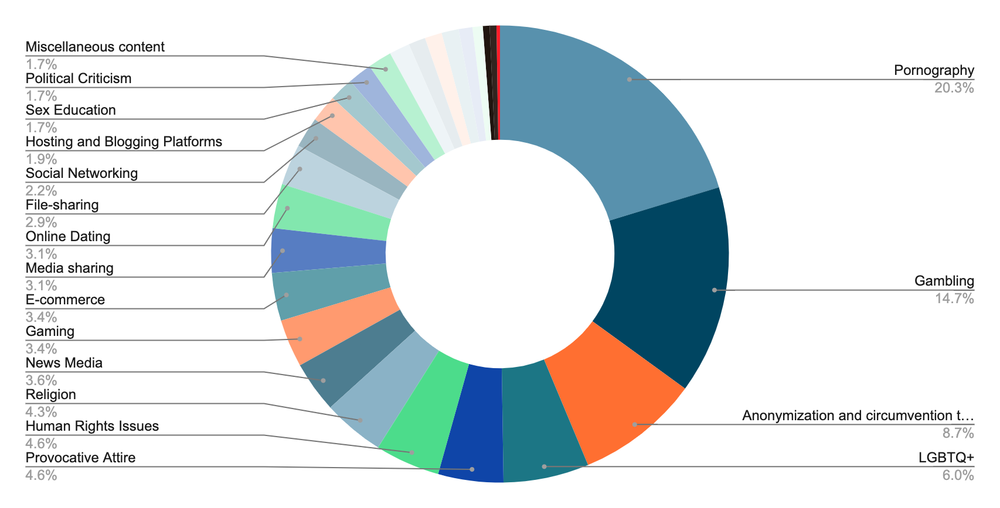

---

title: "iMAP State of Internet Censorship Report 2022 - Indonesia"

description: "This report shares internet censorship during the first half of 2022 in Indonesia using OONI data."

author: "Khairil Zhafri (EngageMedia), Pradipa P. Rasidi (EngageMedia), Debby Kristin (EngageMedia), Siti Nurliza Samsudin (Sinar Project) and Kelly Koh (Sinar Project)"

date: "2022-12-23"

tags: ["indonesia", "censorship", "country-id", "theme-circumvention", "theme-human_rights", "theme-news_media"]

categories: ["report"]

---
* In July 2014, Regulation of the Minister of Communications and Informatics Number 19 of 2014 on the Handling of Negative Internet Sites came into force as part of the regulator's programme for Healthy and Safe Internet (INSAN or Internet Sehat dan Aman). The law mandated ISPs to block any internet content that is deemed to carry "negative" elements such as pornography, hoaxes, or SARA conflicts. 
* As of September 2022, the Indonesian Ministry of Information and Communication (Kominfo) has blocked over 1,000,000 websites through TrustPositif,[^1] a filtering application that has been operational since 2010 per Ministerial Regulation No 19 of 2014.

* OONI network measurement data collected from 62 ISPs confirms the blocking in Indonesia of 414 websites from 1 January 2022 to 30 June 2022. The blocking was primarily done through DNS hijacking (95% of websites measured). 
* Around half of the blocked websites are related to pornography (20.3%), gambling (14.7%), anonymization and circumvention tools (8.7%) and LGBTQ+ (6%). Other blocked sites found in the measurement data are in the following categories: Provocative Attire (4.6%); News Media (4.6%); Religion (4.4%); Gaming (3.4%); Human Rights Issues (4.6%); and Media sharing (3.1%).
* No significant censorship has been detected on instant messaging apps and circumvention tools tested on OONI.

## Table of Contents

**[Country Background](#country-background)**

> [Network landscape and internet penetration](#network-landscape-and-internet-penetration)
>
> [Political context](#political-context)
>
> [Legal environment](#legal-environment)
>
> >[Freedom of expression](#freedom-of-expression)
>
>> >[Article 27 and 45 of the Electronic Information and Transactions (ITE) Law No 11 of 2008](#article-27-and-45-of-the-electronic-information-and-transactions-ite-law-no-11-of-2008)
>
>>> [2013 Law on Civil Society Organizations](#law-on-civil-society-organizations)
>
>> [Press freedom](#press-freedom)
>
>>> [Press Law No 40 of 1999](#press-law-no-40-of-1999)
>
>> [Access to information](#access-to-information)
>
> >>[Public Information Openness Law No 14 of  2008](#public-information-openness-law-no-14-of-2008)
>
>>> [State Intelligence Law No 17 of 2011](#state-intelligence-law-no-17-of-2011)
>
>> [Privacy](#privacy)
>
> >>[Personal Data Protection Law No 27 of 2022](#personal-data-protection-law-no-27-of-2022)
>
>>> [Right to be Forgotten (2016 Amendment to the ITE Law)](#right-to-be-forgotten-2016-amendment-to-the-ite-law)
>
>> [Censorship and surveillance](#censorship-and-surveillance)
>
>>> [Pornography Law No 44 of 2008](#pornography-law-no-44-of-2008) 
>
>>> [Article 40 of the Electronic Information and Transactions (ITE) Law No 11 of 2008](#article-40-of-the-electronic-information-and-transactions-ite-law-no-11-of-2008)
>
>>> [Handling of Internet Sites Containing Negative Content Ministerial Regulation No 19 of 2014](#handling-of-internet-sites-containing-negative-content-ministerial-regulation-no-19-of-2014)
>
> >>[Private Electronic System Operators (PSE) Ministerial Regulation No 5 of 2020](#private-electronic-system-operators-pse-ministerial-regulation-no-5-of-2020)
>
> [Cases of internet censorship](#cases-of-internet-censorship)
>
>> [TrustPositif by Kominfo](#trustpositif-by-kominfo)
>
>> [LGBTQ+ apps take down requests](#lgbtq-apps-take-down-requests) 
>
> >[“Hoax” take down requests](#hoax-take-down-requests)
>
> >[Extraterritorial internet censorship](#extraterritorial-internet-censorship)
>
>> [Blasphemy law and internet censorship](#blasphemy-law-and-internet-censorship)
>
> >[Anti-Pancasila and internet censorship](#anti-pancasila-and-internet-censorship)

**[Examining internet censorship in Indonesia](#examining-internet-censorship-in-indonesia)**

> [Findings](#findings)
>
> [Blocked websites](#blocked-websites)
>
>> [Pornography](#pornography)
>
> >[Gambling](#gambling)
>
> >[Anonymization and circumvention tools](#anonymization-and-circumvention-tools)
>
> >[LGBTQ+](#lgbtq)
>
> >[News Media](#news-media)
>
> >[Religion](#religion)
>
>> [Provocative Attire](#provocative-attire)
>
>> [Human Rights Issues](#human-rights-issues)
>
> >[File and media sharing](#file-and-media-sharing)
>
> [Instant messaging and circumvention tools](#instant-messaging-and-circumvention-tools)
>
> [Acknowledgement of limitations](#acknowledgement-of-limitations)
>
> [Conclusion](#conclusion)

**[Annex I: Glossary](#annex-id-1-probed-isps)**

**[Annex II: Methodology](#annex-ii-methodology)**

> [Data](#data)
>
> [Coverage](#coverage)
>
> [How are the network measurements gathered?](#how-are-the-network-measurements-gathered)
>
> [How are the network measurements analysed?](#how-are-the-network-measurements-analysed)
>
> [Country code](#country-code)
>
> [Autonomous System Number (ASN)](#autonomous-system-number-asn)
>
> [Date and time of measurements](#date-and-time-of-measurements) 
>
> [IP addresses and other information](#ip-addresses-and-other-information)
>
> [Network measurements](#network-measurements)
>
> [Confirmed vs Heuristics](#confirmed-vs-heuristics)

**[About iMAP](#about-imap)**

**[About Sinar Project](#about-sinar-project)**

**[About EngageMedia](#about-engagemedia)**

## Country Background

### **Network landscape and internet penetration**

**Population:** 270.2 million people[^2]

**Internet penetration rate:** 69.8% in 2020[^3], 73.70% in 2019/2020 vs 77.02% in 2021/2022[^4]

**Mobile broadband:** 355 million subscriptions – the third largest in the world after India and China[^5] 

**Fixed-line broadband:** 11.7 million subscriptions[^6]

**Major mobile ISPs:** Telkomsel (169.5 mil users), Indosat (60.3 mil), and XL Axiata (57.89 mil) – together controlling more than 80% of the mobile internet market[^7] 

**Major fixed-line ISPs:** Indihome (67.5%), First Media (3.88%), MNC (2.88%). There is also a high percentage of users using varieties of regional ISPs (12.8%)[^8]

The government-linked Telkom Indonesia operates fixed-line broadband services as Indihome, Astinet, and DigiConnect, amongst others, and has a majority ownership in the mobile operator Telkomsel. Singapore state-owned Singtel also has significant ownership of Telkomsel. The joint venture between Qatari government-linked Ooredoo and Hong Kong-based CK Hutchison has majority ownership of Indosat while XL is a subsidiary of Axiata, a Malaysian government-linked corporation. 

In the eastern Indonesian provinces of Maluku, North Maluku, West Papua, and Papua, Telkomsel owns most base transceiver station (BTS) towers,[^9] making the company the dominant player in the region. Based on interviews conducted in 2019 with a Telkomsel representative and government officials in three localities in Maluku, the connectivity in the province relies on Telkomsel network for individual users and a government-subsidised network, which collaborate with either local ISPs or Telkom Indonesia.[^10] Telkom Indonesia remains a market leader in Indonesia’s network landscape since its founding.

### Political context

Hypernationalist discourses have been growing in Indonesia over the past decade since the election of President Jokowi (Joko Widodo) in 2014, especially so after the blasphemy conviction of ethnic Chinese-Christian Jakarta governor, Basuki “Ahok” Tjahaja Purnama during his re-election campaign in 2017.[^11] As a measure to downplay ideologies of political Islam,[^12] and as a response to terrorist attacks and violent extremism that have scarred the country since its democratic reform in 1998, Jokowi’s administration has been increasingly espousing the idea of Indonesia as diverse multicultural body politic being united together both by respect to a perceived uniqueness that borders cultural tokenism and the rule of a strong yet benevolent government. 

These hypernationalist discourses have strong implications on internet censorship. On religious matters, Indonesia’s policies sit awkwardly within what some scholars have called “godly nationalism”, a nation-state modelled after acceptance of pluralist yet monotheistic orthodoxy.[^13] [^14] While violent extremism is being cracked down and widely prevented through laws, heterodox religious teachings that go against the orthodoxy are similarly censored and even punished for being morally incorrect. This pursuit of moral correctness entails similar limitation towards LGBTQ+ communities and other sexual minorities. With a nationalistic bent, sexual minorities are condemned as contradicting “eastern values” (“_budaya ketimuran_”) and accused of being imports of morally fraught lifestyle from the West. 

Both cases hinge upon the tenets of Indonesian state ideology Pancasila, of which has been going through a critical revival in political discourses through government’s active socialization amongst the citizenry.[^15] The ambition of Jokowi’s administration to build networked infrastructure across the country that reaches eastern Indonesia—often depicted as being “underdeveloped”—further entrenches the imagination of a vast archipelago being united under a benevolent central government.[^16] The Unitary State of the Republic of Indonesia (NKRI or Negara Kesatuan Republik Indonesia), the official name for Indonesia, has been often evoked to produce this imagination of a strong, united state. This is particularly apparent in the governing of Papua and West Papua, two provinces with pro-independence movements that have faced constant military deployment. The slogan “safeguarding NKRI” has been evoked in the region to conjure the idea of a saviour state cultivating their less developed subjects, describing both Jokowi’s administration infrastructure development and the internet throttling and blackouts in the region.[^17] [^18] Similarly, the recent law on Private Electronic System Operators, which will be discussed below, is supported by nationalist narrative on the importance of safeguarding “Indonesian digital sovereignty”.[^19]

The hypernationalist discourse is embraced by politicians both of the ruling and opposition parties. In fact, as some scholars have argued, this discourse—as well as political Islam that seemingly oppose them—obscures the fact that political opposition is nonexistent in Indonesia.[^20] Actors involved both in the ruling party and opposition parties are the same actors in the network of oligarchic elites. In his second term, Jokowi appointed Prabowo Subianto, who used to be his electoral rival in presidential elections in 2014 and 2019. 

Like other countries in Southeast Asia, the information control situation in Indonesia is colored by the troll industry that is also interlocked with the country’s influencer industry.[^21] [^22] The oligarchic nature of Indonesia’s political landscape sees trolls being mobilized not only to protect the Jokowi’s administration interest, but also to fight in national and local electoral contest,[^23] as well as to shield corporate interest—as were the case in social media campaigns defending land developers like Tommy Winata’s PT Tirta Wahana Bali International in Bali’s land reclamation project and tech unicorns that struggle with labor issues like Gojek.[^24] Business and political interest tend to overlap, given that the country’s parliament is composed of 55% businessmen[^25] and having ministers like Nadiem Makarim who founded Gojek and Luhut Binsar Pandjaitan who holds the share of various mining companies.[^26] 

Human rights advocacy remains a challenge in the country. In addition to multiple arrests, surveillance, and troll and doxxing attacks,[^27] cases of data breach in public and private sectors have occurred nine times in 2022 alone, even more in the preceding years.[^28] The lack of data protection fuels the work of political trolls, while the recent law on Personal Data Protection is notable for allowing even more restriction, as will be discussed below. To add insult to the injury, some human rights activists support disbandment of organisations deemed threatening to national security,[^29] and some others who now work for the government have defended government censorship in public.[^30] Some academics accused the activists for building a patronage network with political elites to secure their economic interest.[^31] 

### Legal environment

#### Freedom of expression

##### Article 27 and 45 of the Electronic Information and Transactions (ITE) Law No 11 of 2008

Articles 27 and 45 of the 2008 ITE Law[^32] have been used to prosecute individuals who “knowingly and without authority” distribute, transmit, or make accessible electronic information or documents containing (i) material against propriety, (ii) gambling material, (iii) defamatory material, and (iv) material containing extortions or threats. Under Article 45, any individual satisfying any of the elements could be sentenced to imprisonment of up to 6 years, and/or a maximum fine of 1 billion rupiah. The 2016 amendment to Article 45 reduces the criminal sanction for the crime under Article 27(iii) regarding defamation to a maximum imprisonment term of 4 years and a fine of 750 million rupiah, in addition to clarifying that the provision for the dissemination of defamatory material is a crime by the complaint.[^33]

##### 2013 Law on Civil Society Organizations

The 2013 Civil Society Organizations Law[^34] subjects civil society organisations (CSOs) to increased bureaucratic and discriminatory controls, authorizing government screening of all CSOs in the country. The law stipulates CSOs to various prohibitions and obligations to be able to obtain a permit to operate within the country, including prohibiting CSOs from propagating ideologies conflicting with the state ideology of Pancasila, which embraces the five principles of Indonesian nationalism; internationalism; consent or democracy; social prosperity; and belief in one God, thus directly infringing upon the rights of organisations to freedom of religion.

The law places severe limitations on the running of foreign-funded CSOs within the country. Article 52 of the law prohibits CSOs founded by foreign citizens from conducting any intelligence or political activities, or any activities which may “disrupt the stability and integrity” of Indonesia or which may “disrupt diplomatic relations”.

Article 52(g) prohibits the “raising of funds from the Indonesian community”; and (h) “the use of facilities and infrastructures of government agencies and institutions”. Violations of such repressive provisions may result in the dissolution of the CSO.

The law has been used to threaten labour unions of disbandment in 2014[^35] and disband Islamist organisation Hizbut Tahrir Indonesia in 2017 with accusations of “promoting the establishment of a caliphate”.[^36]

#### Press freedom

##### Press Law No 40 of 1999

Article 4 of the 1999 Press Law[^37] guarantees freedom of the press as a basic human right for every citizen. The law contains many positive stipulations which serve to protect the freedom of the press. 4(2) provides that the national press shall not have censorship or broadcast limitations imposed upon it, while 4(3) provides the national press with the right to seek, acquire, and disseminate ideas and information freely to ensure the freedom of the press.

However, the Press Law also contains a number of potentially harmful restrictions on content which may be open to abuse. Article 5 of the law constrains the national press to report events and opinions with respect to the religious and moral norms of the public, in accordance with the presumption of innocence. This places restrictions on forms of expression such as legitimate criticisms of religious bodies, which contradicts the stipulation in Article 6 that provides that the national press plays its role in fulfilling the public’s right to know, and in providing criticism, correction and suggestion towards public concerns.

#### Access to information

##### Public Information Openness Law No 14 of 2008

The 2008 Law on Public Information Openness[^38] guarantees freedom of information as a right for Public Information Requesters, restricted only to Indonesian citizens or legal entities. Under Articles 22 and 35, requests for information require that the name, address and reason for the request be provided by requesters. Problematically, the law would enable the possibility of sanitization of requested documents, allowing for the redaction or “blackening” of restricted information while providing access to the rest of the document.[^39]

Under the law, criminal sanctions are provided for public officials found to deliberately disregard their obligation to provide and publish public information. However, under Article 51, harsh penalties are also prescribed for any person found to have committed deliberate use of public information “in an unlawful manner”, with violators being liable to imprisonment of up to one year, and a maximum fine of five million rupiah. What is considered to be “against the law” is vaguely defined, and leaves such provisions open to abuse.

Although provisions exist to guarantee the right to freedom of information, implementation remains flawed: A 2012 study revealed structural inefficiencies in the way requests for information were handled by public bodies in Indonesia.[^40] Only 46 per cent of 224 information requests had been granted, and participants frequently reported that their requests had been ignored or lost by public authorities.

##### State Intelligence Law No 17 of 2011

The law authorises the Indonesian State Intelligence Agency (BIN or Badan Intelijen Nasional) to conduct expansive intelligence gathering efforts against “opponents” deemed to be “harmful to national interests and security”. Additionally, Article 31 of the law authorises the State Intelligence Agency to intercept communications without the need for prior court approval. The broad and ambiguous language behind "opponents" and "national interests and security" opens up the legislation to criminalization.

Article 25(4) and 25(5) stipulates that “intelligence secrets” (“_rahasia intelijen”_) through which BIN operates as closed information and cannot be disclosed unless for the purpose of a trial. Thus, as Article 44 penalises individuals for the dissemination of “intelligence secrets” with imprisonment of up to 10 years, and a maximum fine of 500 million rupiah, the law allows for no transparency to “intelligence secrets” and State Intelligence Agency past operations on which it is based.

#### Privacy

##### Personal Data Protection Law No 27 of 2022

Article 28g(1) of the Indonesian Constitution provides for the rights to “protection” and the right to “feel secure”. Indonesia did not have specific laws governing the right to privacy until September 2022 with the passing of the national Personal Data Protection Law No  27 of 2022.[^41] The law provides for a comprehensive legal framework that covers different categories of personal data, the right of the personal data subject, obligations of personal data controllers, breaches of personal data, personal data protection authority, and prohibited uses of personal data.

Most Indonesian financial services are governed by another regulatory framework under the Financial Services Authority (OJK or _Otoritas Jasa Keuangan_), including matters related to data protection. However, not all financial services come under the purview of OJK including unlicensed online lending services. The 2022 Personal Data Protection Law applies not only to entities based in Indonesia but also to those who process the personal data of Indonesian citizens or that have legal consequences in Indonesia. It is, however, not applicable to personal data processing related to national security, law enforcement, and public interests by the state.

##### Right to be Forgotten (2016 Amendment to the ITE Law)

A provision was added to Article 26 of the 2016 Amendment of the Electronic Information and Transactions (ITE) Law regulating that Electronic System Operators (a) provide a mechanism to remove irrelevant information or electronic data and that they (b) remove all electronic information or electronic records under their control according to a court order at the initiation of a relevant person. Though this seems to provide individuals with an element of privacy protection, the amendment lacks specifics on the circumstances in which electronic information may be deemed ‘irrelevant’, nor the criteria to be considered a ‘relevant person’.[^42]

Concerns have been raised over the potential for misuse in a statement by the Secretary General of the Alliance of Independent Journalists, which argues that the provision could be a potential threat to press freedom, as “anyone may request a court order with impunity to erase negative news concerning them in digital media”.[^43]

#### Censorship and surveillance

##### Pornography Law No 44 of 2008

The 2008 law on pornography prohibits the creation, dissemination, or consumption of pornographic material.[^44] The law presents a loose definition of what constitutes pornography, to the point of criminalizing actions such as the kissing of lips in public, the display of sensual parts of the body (defined in Article 4 as the genitals, buttocks, hips, thighs, navel and female breasts), or any form of art and cultural expression perceived to be explicit. Section 4:1a of the law explicitly prohibits the action of or any writing/audio-visual presentation of sexual activities involving same-sex relations. The law is routinely used to censor LGBTQ+ content on the internet.

##### Article 40 of the Electronic Information and Transactions (ITE) Law No 11 of 2008

Article 40 of the ITE broadly dictates that the government protect the public interest from any misuse of Electronic Information and Transactions deemed as threats against the public interest and which could offend public order.[^45]

The 2016 amendment widens the authority of the government with the addition of 2 sub-paragraphs under Article 40 stipulating that the government is authorized to take preventative actions against the dissemination of electronic information and documents containing content violating applicable laws, such as hate speech, defamatory material, or immoral content. The amendment enhances the scope of the government in monitoring electronic information, authorising them to terminate access to content deemed to fall under such criteria.

##### Handling of Internet Sites Containing Negative Content Ministerial Regulation No 19 of 2014

In July 2014, Regulation of the Minister of Communications and Informatics Number 19 of 2014 on the Handling of Negative Internet Sites came into force as part of the regulator's programme for Healthy and Safe Internet (INSAN or Internet Sehat dan Aman). 

The law mandated ISPs to block any internet content that is deemed to carry "negative" elements such as pornography, hoaxes, or SARA conflicts. As the primary internet regulator, the ministry maintained a database of blocked sites known as TrustPositif which ISPs must check against to implement internet censorship. The regulation drew criticism from civil society organisations for its potential abuse.[^46]

##### Private Electronic System Operators (PSE) Ministerial Regulation No 5 of 2020

The law came into effect in November 2020 to replace and consolidate Kominfo Regulations No 19 of 2014 on Handling of Internet Sites Containing Negative Content and No 36 of 2014 on Registration of Electronic System Operators.[^47] The law requires private electronic system operators (_penyelenggara sistem elektronik_ or PSE) to register themselves with Kominfo before providing any service to internet users. 

Through the single registration system, a PSE must disclose how their system works and the kinds of user information they collect, store, and process. The law does not only apply to domestic operators but also to foreign private PSEs that have users in Indonesia. Failing registration, Kominfo would block the websites of private PSEs in Indonesia.[^48] 

This law shifts the regulatory burden to PSEs who would now have to make sure that their systems do not contain prohibited electronic content or facilitate the dissemination of prohibited content. These responsibilities also extend to platforms that host user-generated content such as web-hosting providers and cloud computing operators who are PSEs in their own right. According to internal documents to industry players,[^49] the regulator is planning to introduce fines of up to $33,000 on PSEs for failure to take down prohibited content under this regime.

A PSE must take down prohibited content within 24 hours – or 4 hours ​​in the cases of terrorism, pornography, or other violation of laws – of warning from Kominfo failing which the regulator has the authority to instruct ISPs to block user access to the PSE. Under this law, Kominfo or any relevant government agency may compel a PSE to provide access to its system for supervision and law enforcement purposes.

Advocates for internet freedom raised concerns over encroachment on online freedom of expression and opinion.[^50] The definition of prohibited content as anything that may cause anxiety in society (“_meresahkan masyarakat_”) and disturbs public order (“_mengganggu ketertiban umum_”) is too broad and may be used to curtail dissenting voices. Many activists are also concerned that state apparatus may abuse their supervision and law enforcement powers under the law to target human rights defenders, especially those championing the rights of women, LGBTQ+ persons, and ethnic and religious minorities. The law, many activists argued, is inconsistent with the Indonesian constitution and the country's international human rights obligations.[^51]

### Cases of internet censorship

#### TrustPositif by Kominfo

As of September 2022, the Indonesian Ministry of Information and Communication (Kominfo) has blocked over 1,000,000 websites through TrustPositif,[^52] a filtering application that has been operational since 2010 per Ministerial Regulation No 19 of 2014. The majority of the blocked websites fall under the categories of gambling and pornography. Other categories of blocked websites include online scams, intellectual property violations, and "negative content" recommended by related-sector agencies. There have been reported cases of newly registered domain names being falsely pre-blocked on TrustPositif.[^53] An official from Kominfo claims that the blocks are based on citizen reports.[^54]

#### LGBTQ+ apps take down requests

Kominfo requested Google to remove 73 apps related to LGBTQ+ communities from its Indonesian PlayStore.[^55] The apps identified are primarily instant messaging, online dating, and social networking apps dedicated to LGBTQ+ communities. While singling out Blued, the ministry confirmed having blocked the use of the gay social network app but it was circumvented via a different DNS configuration.  

#### “Hoax” take down requests

Kominfo boasted that it has taken down over 565,000 “hoax content” circulated on social media in 2021, claiming that most of them are related to Covid-19 hoaxes.[^56] They also claimed to having blocked “hoax websites” and requested big tech companies to delist and suspend links and accounts on their platforms.[^57]

However, “hoax”—a broad label to designate all kinds of misinformation and disinformation—has been increasingly used to delegitimize political opponents, arrest critics, and justify internet shutdown.[^58] The government throttled and shut down internet in West Papua in 2019 as the region was deemed to be “rife with hoaxes”.[^59] Activists protesting against the Omnibus Law in 2020 were arrested for “spreading hoaxes” because they shared an earlier draft of the law.[^60] As a measure to appear to be the legitimate fact-checker, Kominfo regularly attempts to verify and labels content it deems misinformation as “hoax”,[^61] to the point of labelling a meme of adult entertainer Ricardo Milos depicted in the uniform of the ruling Indonesian Democratic Party of Struggle (PDI-P) as a hoax.[^62] 

#### Extraterritorial internet censorship 

In June 2022, Kominfo warned that big tech platforms like Google, Facebook, Twitter, and others may be blocked for not registering themselves as private PSEs per Ministerial Regulation No 5 of 2020.[^63] Paypal, Yahoo, Epic Games, and Steam were among the sites blocked by the regulator for failing to complete their private PSE registration before the July 2022 cutoff.[^64] As of August 2022, more than 289 foreign private PSEs were registered with Kominfo and a few of these PSEs have been suspended for illegal gambling activities.[^65] 

#### Blasphemy law and internet censorship

In March 2022, ex-Muslim YouTube preacher Saifuddin Ibrahim (also known as Abraham Ben Moses) became a target of blasphemy law for his provocative and critical views on Islamic teachings and practices.[^66] Following an investigation, the Indonesian police coordinated with Kominfo to remove Saifuddin Ibrahim's YouTube channels according to news reports.[^67] [^68] However, as of April 2022, both YouTube channels belonging to the US-based preacher are still not blocked in Indonesia. 

In April 2022, the youth wing of the moderate Muslim group Nahdlatul Ulama, Gerakan Pemuda Ansor, reported a Facebook account named Husain to the police accusing the account of promoting heresy (“_ajaran sesat”_).[^69] The police proceeded to investigate the account and hunted down the person behind the account. There is no further news report on the case, but citizens filing a report to the police for the accusation of blasphemy or heresy, along with requests for accounts and websites to be taken down, is a common occurrence. Such was the case with Joseph Paul Zhang in 2021 who claimed to be a prophet,[^70] leader of Kelompok Doa Hati Kudus Allah Kerahiman Ilahi who was accused in 2019 of claiming to be equal to Jesus,[^71] land-rights Gafatar Movement who was accused in 2016 of being syncretic,[^72] and the well-known case of Salamullah religion led by Lia Eden,[^73] who was arrested in 2008.

#### Anti-Pancasila and internet censorship

In June 2022, the Indonesian police arrested the leaders of the spiritual organisation Khilafatul Muslimin and disbanded the organisation,[^74] based on the accusation that the organisation is acting against Pancasila. The arrest was supported by the state’s anti-terrorism agency.[^75] The website and YouTube channel of Khilafatul Muslimin have been shut down following the arrest. Critics have noted that the government confused the inward-looking spiritual movement with a political organisation due to the organisation bearing the name caliphate (_khilafah_).

This effort is a part of the re-emergence of Pancasila doctrine as the government’s guiding policies to deter opposition, dubbed by some scholars as Indonesia’s authoritarian turn.[^76] Since the disbandment of the Islamist organization Hizbut Tahrir Indonesia following the Jakarta election in 2017, the central government has been actively cracking down on organizations deemed as “radicals” and “treasonous”.[^77] This includes the realignment of the independent Anti-corruption Commission (KPK or _Komisi Pemberantasan Korupsi_) and firing of its personnel in 2019, as it was accused of being infested by Taliban. With support from one of the largest moderate Islam organisation Nahdlatul Ulama,[^78] the government treads between the fine line of fighting extremism and hypernationalist censorship.

## Examining internet censorship in Indonesia

### Findings

#### Blocked websites

Multiple websites were found to be blocked in Indonesia as part of this study. Analysis of network measurement data collected through OONI Probe Web Connectivity tests of 2,474 websites performed across 62 ISPs, we found that Indonesian ISPs served block pages for 414 websites primarily through DNS hijacking (95% of websites tested). Most measurements of these blocked websites presented anomalies as part of the testing, which may need to be investigated further.

The blocked sites fall under various categories including pornography, gambling, anonymization and circumvention tools, LGBTQ+, provocative attire, news media, religion, gaming, human rights issues, file and media sharing, and others.

The table below illustrates the distribution of websites that were confirmed to be blocked in Indonesia by category as part of this study from 1 January 2022 to 30 June 2022. 

| **Category Code**  |  **Category**                                     | **Blocked Websites** | **OONI Probe Measurements** | **OONI Probe Confirmed Blocks** | **Block Rate** |
|------------|------------|------------|------------|------------|------------|
| PORN          | Pornography                           | 84                   | 6,692                       | 3,883                           | 58.02%         |
| GMB           | Gambling                              | 61                   | 6,276                       | 2,771                           | 44.15%         |
| ANON          | Anonymization and circumvention tools | 36                   | 6,926                       | 436                             | 6.30%          |
| LGBT          | LGBTQ+                                | 25                   | 3,921                       | 2,280                           | 58.15%         |
| PROV          | Provocative Attire                    | 19                   | 2,284                       | 1,282                           | 56.13%         |
| HUMR          | Human Rights Issues                   | 19                   | 3,357                       | 1,498                           | 44.62%         |
| REL           | Religion                              | 18                   | 3,092                       | 1,440                           | 46.57%         |
| NEWS          | News Media                            | 15                   | 3,164                       | 978                             | 30.91%         |
| GAME          | Gaming                                | 14                   | 584                         | 332                             | 56.85%         |
| COMM          | E-commerce                            | 14                   | 1,102                       | 352                             | 31.94%         |
| MMED          | Media sharing                         | 13                   | 2,630                       | 1,419                           | 53.95%         |
| DATE          | Online Dating                         | 13                   | 1,602                       | 746                             | 46.57%         |
| FILE          | File-sharing                          | 12                   | 1,352                       | 468                             | 34.62%         |
| GRP           | Social Networking                     | 9                    | 1,875                       | 751                             | 40.05%         |
| HOST          | Hosting and Blogging Platforms        | 8                    | 1,246                       | 374                             | 30.02%         |
| XED           | Sex Education                         | 7                    | 1,044                       | 495                             | 47.41%         |
| POLR          | Political Criticism                   | 7                    | 1,549                       | 570                             | 36.80%         |
| MISC          | Miscellaneous content                 | 7                    | 132                         | 7                               | 5.30%          |
| CULTR         | Culture                               | 6                    | 669                         | 302                             | 45.14%         |
| PUBH          | Public Health                         | 5                    | 572                         | 258                             | 45.10%         |
| HATE          | Hate Speech                           | 5                    | 498                         | 197                             | 39.56%         |
| ALDR          | Alcohol & Drugs                       | 5                    | 599                         | 228                             | 38.06%         |
| HACK          | Hacking Tools                         | 4                    | 231                         | 1                               | 0.43%          |
| ENV           | Environment                           | 3                    | 447                         | 98                              | 21.92%         |
| COMT          | Communication Tools                   | 2                    | 206                         | 93                              | 45.15%         |
| MILX          | Terrorism and Militants               | 2                    | 192                         | 6                               | 3.13%          |
| GOVT          | Government                            | 1                    | 15                          | 0                               | 0.00%          |
| **Aggregate** |                                       | **414**              | **52,257**                  | **21,265**                      | **40.69%**     |

##### Pornography

84 pornography websites were found to be blocked during the testing period of 1 January 2022 until 30 June 2022. 75 of these websites were confirmed through OONI Probe while 9 were confirmed through heuristic analysis. The measurements include websites that were miscategorised as LGBTQ+ (www.bglad.com and www.gayscape.com) and as news media (pornhub.com and xvideos.com) in the test list.

| **Websites**              | **Measured** | **Blocked**  | **Not Blocked** | **Anomalous** | **Failed**  |
|------------|------------|------------|------------|------------|------------|
| www.bglad.com             | 207          | 127 (61.35%) | 7 (3.38%)       | 30 (14.49%)   | 43 (20.77%) |
| www.gayscape.com          | 206          | 127 (61.65%) | 9 (4.37%)       | 27 (13.11%)   | 43 (20.87%) |
| www.pornhub.com           | 145          | 80 (55.17%)  | 6 (4.14%)       | 31 (21.38%)   | 28 (19.31%) |
| alt.com                   | 130          | 84 (64.62%)  | 6 (4.62%)       | 22 (16.92%)   | 18 (13.85%) |
| beeg.com                  | 128          | 81 (63.28%)  | 4 (3.13%)       | 25 (19.53%)   | 18 (14.06%) |
| www.xvideos.com           | 125          | 76 (60.8%)   | 3 (2.4%)        | 12 (9.6%)     | 34 (27.2%)  |
| www.purextc.com           | 121          | 72 (59.5%)   | 5 (4.13%)       | 23 (19.01%)   | 21 (17.36%) |
| hotgaylist.com            | 121          | 70 (57.85%)  | 8 (6.61%)       | 19 (15.7%)    | 24 (19.83%) |
| www.sex.com               | 121          | 70 (57.85%)  | 4 (3.31%)       | 18 (14.88%)   | 29 (23.97%) |
| www.wetplace.com          | 120          | 72 (60%)     | 3 (2.5%)        | 34 (28.33%)   | 11 (9.17%)  |
| www.livejasmin.com        | 120          | 69 (57.5%)   | 3 (2.5%)        | 24 (20%)      | 24 (20%)    |
| milfhunter.com            | 120          | 74 (61.67%)  | 4 (3.33%)       | 22 (18.33%)   | 20 (16.67%) |
| www.playboy.com           | 120          | 70 (58.33%)  | 4 (3.33%)       | 22 (18.33%)   | 24 (20%)    |
| realdoll.com              | 120          | 78 (65%)     | 4 (3.33%)       | 18 (15%)      | 20 (16.67%) |
| xhamster.com              | 120          | 73 (60.83%)  | 6 (5%)          | 18 (15%)      | 23 (19.17%) |
| www.freegaypornfinder.com | 120          | 73 (60.83%)  | 3 (2.5%)        | 13 (10.83%)   | 31 (25.83%) |
| youjizz.com               | 120          | 71 (59.17%)  | 2 (1.67%)       | 13 (10.83%)   | 34 (28.33%) |
| hardsextube.com           | 119          | 70 (58.82%)  | 7 (5.88%)       | 41 (34.45%)   | 1 (0.84%)   |
| www.nurumassage.net       | 119          | 67 (56.3%)   | 4 (3.36%)       | 23 (19.33%)   | 25 (21.01%) |
| www.tubev.sex             | 119          | 67 (56.3%)   | 6 (5.04%)       | 22 (18.49%)   | 24 (20.17%) |

Table: A sample of pornography websites blocked in Indonesia

##### Gambling

61 gambling websites found to be blocked during the testing period of 1 January 2022 until 30 June 2022. All except five websites were confirmed through OONI Probe. The five websites could only be confirmed blocked through heuristics. 

| **Websites**              | **Measured** | **Blocked** | **Not Blocked** | **Anomalous** | **Failed**  |
|------------|------------|------------|------------|------------|------------|
| 198.96.92.14              | 123          | 1 (0.81%)   | 0 (0%)          | 7 (5.69%)     | 115 (93.5%) |
| 88bola.com                | 122          | 78 (63.93%) | 5 (4.1%)        | 16 (13.11%)   | 23 (18.85%) |
| bolazoom.com              | 122          | 73 (59.84%) | 9 (7.38%)       | 5 (4.1%)      | 35 (28.69%) |
| www.slotland.com          | 121          | 73 (60.33%) | 4 (3.31%)       | 19 (15.7%)    | 25 (20.66%) |
| indolucky7.com            | 121          | 74 (61.16%) | 9 (7.44%)       | 10 (8.26%)    | 28 (23.14%) |
| www.usacasino.com         | 121          | 19 (15.7%)  | 2 (1.65%)       | 46 (38.02%)   | 54 (44.63%) |
| fifabola.com              | 120          | 69 (57.5%)  | 6 (5%)          | 35 (29.17%)   | 10 (8.33%)  |
| human-rights-for-all.org  | 120          | 67 (55.83%) | 6 (5%)          | 19 (15.83%)   | 28 (23.33%) |
| www.gambling.com          | 120          | 68 (56.67%) | 9 (7.5%)        | 19 (15.83%)   | 24 (20%)    |
| www.poker.com             | 120          | 66 (55%)    | 5 (4.17%)       | 18 (15%)      | 31 (25.83%) |
| www.spinpalace.com        | 120          | 65 (54.17%) | 4 (3.33%)       | 16 (13.33%)   | 35 (29.17%) |
| www.sportsinteraction.com | 120          | 66 (55%)    | 3 (2.5%)        | 18 (15%)      | 33 (27.5%)  |
| www.betfair.com           | 120          | 70 (58.33%) | 4 (3.33%)       | 20 (16.67%)   | 26 (21.67%) |
| www.royalvegas.com        | 120          | 16 (13.33%) | 4 (3.33%)       | 67 (55.83%)   | 33 (27.5%)  |
| axiooqq.online            | 119          | 52 (43.7%)  | 13 (10.92%)     | 19 (15.97%)   | 35 (29.41%) |
| bolanaga.com              | 119          | 70 (58.82%) | 7 (5.88%)       | 1 (0.84%)     | 41 (34.45%) |
| bolauntung.com            | 119          | 66 (55.46%) | 7 (5.88%)       | 20 (16.81%)   | 26 (21.85%) |
| taruhan.org               | 119          | 67 (56.3%)  | 4 (3.36%)       | 48 (40.34%)   | 0 (0%)      |
| www.onlinegambling.com    | 119          | 67 (56.3%)  | 4 (3.36%)       | 22 (18.49%)   | 26 (21.85%) |
| www.partypoker.com        | 119          | 62 (52.1%)  | 4 (3.36%)       | 26 (21.85%)   | 27 (22.69%) |

Table: A sample of gambling websites blocked in Indonesia

##### Anonymization and circumvention tools

36 websites that provide anonymization and circumvention tools were blocked in Indonesia during the testing period of 1 January 2022 until 30 June 2022. These websites are predominantly websites that provide web proxies, virtual private network services, and other tools that help internet users protect their anonymity and circumvent censorship online. All websites in this category could be confirmed blocked using OONI Probe except seven websites which were confirmed blocked through heuristics only.

| **Websites**           | **Measured** | **Blocked** | **Not Blocked** | **Anomalous** | **Failed**   |
|------------|------------|------------|------------|------------|------------|
| www.xroxy.com          | 405          | 3 (0.74%)   | 0 (0%)          | 8 (1.98%)     | 394 (97.28%) |
| multiproxy.org         | 230          | 4 (1.74%)   | 0 (0%)          | 1 (0.43%)     | 225 (97.83%) |
| guardster.com          | 218          | 3 (1.38%)   | 2 (0.92%)       | 4 (1.83%)     | 209 (95.87%) |
| anonymizer.secuser.com | 216          | 3 (1.39%)   | 0 (0%)          | 4 (1.85%)     | 209 (96.76%) |
| proxify.com            | 216          | 0 (0%)      | 0 (0%)          | 6 (2.78%)     | 210 (97.22%) |
| hola.org               | 216          | 1 (0.46%)   | 1 (0.46%)       | 4 (1.85%)     | 210 (97.22%) |
| anonymouse.org         | 215          | 129 (60%)   | 5 (2.33%)       | 26 (12.09%)   | 55 (25.58%)  |
| anonymousproxylist.net | 214          | 0 (0%)      | 0 (0%)          | 5 (2.34%)     | 209 (97.66%) |
| proxy.org              | 214          | 2 (0.93%)   | 1 (0.47%)       | 9 (4.21%)     | 202 (94.39%) |
| anonymat.org           | 212          | 3 (1.42%)   | 0 (0%)          | 3 (1.42%)     | 206 (97.17%) |
| www.allproxysites.com  | 211          | 12 (5.69%)  | 2 (0.95%)       | 102 (48.34%)  | 95 (45.02%)  |
| tor.eff.org            | 209          | 1 (0.48%)   | 1 (0.48%)       | 9 (4.31%)     | 198 (94.74%) |
| securevpn.im           | 209          | 1 (0.48%)   | 0 (0%)          | 1 (0.48%)     | 207 (99.04%) |
| www.betternet.co       | 209          | 1 (0.48%)   | 0 (0%)          | 0 (0%)        | 208 (99.52%) |
| www.http-tunnel.com    | 208          | 2 (0.96%)   | 1 (0.48%)       | 4 (1.92%)     | 201 (96.63%) |
| www.torproject.org     | 208          | 0 (0%)      | 0 (0%)          | 4 (1.92%)     | 204 (98.08%) |
| www.anonymsurfen.com   | 207          | 5 (2.42%)   | 0 (0%)          | 3 (1.45%)     | 199 (96.14%) |
| www.hidemyass.com      | 207          | 0 (0%)      | 0 (0%)          | 4 (1.93%)     | 203 (98.07%) |
| www.inetprivacy.com    | 207          | 2 (0.97%)   | 0 (0%)          | 2 (0.97%)     | 203 (98.07%) |
| www.megaproxy.com      | 207          | 0 (0%)      | 0 (0%)          | 5 (2.42%)     | 202 (97.58%) |

Table: A sample of anonymization and circumvention websites blocked in Indonesia

##### LGBTQ+

25 LGBTQ+ websites were confirmed blocked in Indonesia during the testing period from 1 January 2022 until 30 June 2022. They include websites of LGBTQ+ rights organisations, online forums, magazines, travel bookings, and others. All of these websites were confirmed blocked based on OONI Probe measurement data except for four websites which could only be confirmed through heuristic analysis. Three online dating sites (www.grindr.com, www.planetromeo.com, and www.scruff.com) and two pornography websites (www.bglad.com and www.gayscape.com) were miscategorised as LGBTQ+ websites in the test list.

| **Websites**            | **Measured** | **Blocked**  | **Not Blocked** | **Anomalous** | **Failed**  |
|------------|------------|------------|------------|------------|------------|
| ilga.org                | 230          | 137 (59.57%) | 2 (0.87%)       | 38 (16.52%)   | 53 (23.04%) |
| gayindonesiaforum.com   | 216          | 135 (62.5%)  | 5 (2.31%)       | 25 (11.57%)   | 51 (23.61%) |
| pridesource.com         | 215          | 119 (55.35%) | 2 (0.93%)       | 40 (18.6%)    | 54 (25.12%) |
| www.gay.com             | 210          | 133 (63.33%) | 7 (3.33%)       | 24 (11.43%)   | 46 (21.9%)  |
| transsexual.org         | 209          | 129 (61.72%) | 7 (3.35%)       | 20 (9.57%)    | 53 (25.36%) |
| www.gayegypt.com        | 208          | 134 (64.42%) | 8 (3.85%)       | 25 (12.02%)   | 41 (19.71%) |
| www.shoe.org            | 207          | 116 (56.04%) | 7 (3.38%)       | 37 (17.87%)   | 47 (22.71%) |
| www.ifge.org            | 207          | 129 (62.32%) | 8 (3.86%)       | 26 (12.56%)   | 44 (21.26%) |
| www.glbtq.com           | 206          | 131 (63.59%) | 9 (4.37%)       | 32 (15.53%)   | 34 (16.5%)  |
| www.glil.org            | 206          | 122 (59.22%) | 9 (4.37%)       | 26 (12.62%)   | 49 (23.79%) |
| www.ilga-europe.org     | 206          | 105 (50.97%) | 8 (3.88%)       | 36 (17.48%)   | 57 (27.67%) |
| www.tsroadmap.com       | 205          | 126 (61.46%) | 8 (3.9%)        | 28 (13.66%)   | 43 (20.98%) |
| www.nifty.org           | 205          | 108 (52.68%) | 7 (3.41%)       | 36 (17.56%)   | 54 (26.34%) |
| www.out.com             | 204          | 120 (58.82%) | 7 (3.43%)       | 34 (16.67%)   | 43 (21.08%) |
| www.queernet.org        | 202          | 125 (61.88%) | 9 (4.46%)       | 24 (11.88%)   | 44 (21.78%) |
| www.samesexmarriage.ca  | 202          | 127 (62.87%) | 10 (4.95%)      | 25 (12.38%)   | 40 (19.8%)  |
| www.nclrights.org       | 201          | 121 (60.2%)  | 9 (4.48%)       | 26 (12.94%)   | 45 (22.39%) |
| bisexual.org            | 176          | 107 (60.8%)  | 3 (1.7%)        | 35 (19.89%)   | 31 (17.61%) |
| www.lgbtglobalfaith.org | 122          | 8 (6.56%)    | 1 (0.82%)       | 60 (49.18%)   | 53 (43.44%) |
| bi.org                  | 49           | 24 (48.98%)  | 1 (2.04%)       | 5 (10.2%)     | 19 (38.78%) |

Table: A sample of LGBTQ+ websites blocked in Indonesia

##### News Media

15 news media websites were found to be blocked during the testing period of 1 January 2022 until 30 June 2022. 9 of these websites were confirmed through OONI Probe while 6 were confirmed through heuristic analysis. 

These do not include three websites that were miscategorised as news media www.reddit.com (social networking) as well as pornhub.com and xvideos.com (pornography). Some of these sites (hariankompas.net, kabobfest.com) seem to be content farms masquerading as news outlets by taking the name of major publications (kompas.com), or gambling sites masquerading as news outlets to promote gambling.

| **Websites**          | **Measured** | **Blocked**  | **Not Blocked** | **Anomalous** | **Failed**   |
|------------|------------|------------|------------|------------|------------|
| crito.jw.lt           | 218          | 133 (61.01%) | 5 (2.29%)       | 31 (14.22%)   | 49 (22.48%)  |
| papuapost.com         | 217          | 142 (65.44%) | 5 (2.3%)        | 54 (24.88%)   | 16 (7.37%)   |
| opinibangsa.com       | 216          | 113 (52.31%) | 4 (1.85%)       | 34 (15.74%)   | 65 (30.09%)  |
| harianandalas.com     | 216          | 52 (24.07%)  | 16 (7.41%)      | 20 (9.26%)    | 128 (59.26%) |
| beritasore.com        | 215          | 124 (57.67%) | 5 (2.33%)       | 30 (13.95%)   | 56 (26.05%)  |
| hariankompas.net      | 215          | 112 (52.09%) | 18 (8.37%)      | 12 (5.58%)    | 73 (33.95%)  |
| www.balipost.co.id    | 208          | 108 (51.92%) | 7 (3.37%)       | 39 (18.75%)   | 54 (25.96%)  |
| www.warungbebas.com   | 202          | 128 (63.37%) | 9 (4.46%)       | 24 (11.88%)   | 41 (20.3%)   |
| www.kabobfest.com     | 186          | 66 (35.48%)  | 8 (4.3%)        | 24 (12.9%)    | 88 (47.31%)  |
| kepri.haluan.co       | 217          | 0 (0%)       | 19 (8.76%)      | 68 (31.34%)   | 130 (59.91%) |
| www.galamedianews.com | 215          | 0 (0%)       | 22 (10.23%)     | 68 (31.63%)   | 125 (58.14%) |
| samudranesia.id       | 214          | 0 (0%)       | 13 (6.07%)      | 2 (0.93%)     | 199 (92.99%) |
| sulawesi24.com        | 213          | 0 (0%)       | 17 (7.98%)      | 139 (65.26%)  | 57 (26.76%)  |
| www.bldaily.com       | 209          | 0 (0%)       | 26 (12.44%)     | 72 (34.45%)   | 111 (53.11%) |
| www.ruf-ch.org        | 203          | 0 (0%)       | 11 (5.42%)      | 3 (1.48%)     | 189 (93.1%)  |

Table: News media websites blocked in Indonesia

##### Religion

18 websites related to religion were found to be blocked in Indonesia during the testing period of 1 January 2022 until 30 June 2022. All except four websites were confirmed through OONI Probe. The four websites could only be confirmed blocked through heuristics. 

| **Websites**                      | **Measured** | **Blocked**  | **Not Blocked** | **Anomalous** | **Failed**   |
|------------|------------|------------|------------|------------|------------|
| exmuslim.wordpress.com            | 312          | 164 (52.56%) | 9 (2.88%)       | 52 (16.67%)   | 87 (27.88%)  |
| thequran.com                      | 153          | 80 (52.29%)  | 2 (1.31%)       | 19 (12.42%)   | 52 (33.99%)  |
| trulyislam.blogspot.com           | 156          | 90 (57.69%)  | 1 (0.64%)       | 23 (14.74%)   | 42 (26.92%)  |
| www.arrahmah.com                  | 155          | 72 (46.45%)  | 6 (3.87%)       | 48 (30.97%)   | 29 (18.71%)  |
| www.komunitaseden.com             | 158          | 89 (56.33%)  | 4 (2.53%)       | 27 (17.09%)   | 38 (24.05%)  |
| beritamuslim.wordpress.com        | 313          | 170 (54.31%) | 5 (1.6%)        | 44 (14.06%)   | 94 (30.03%)  |
| indonesia.faithfreedom.org        | 313          | 168 (53.67%) | 8 (2.56%)       | 38 (12.14%)   | 99 (31.63%)  |
| answering-islam.org               | 156          | 70 (44.87%)  | 6 (3.85%)       | 36 (23.08%)   | 44 (28.21%)  |
| www.faithfreedom.org              | 155          | 93 (60%)     | 1 (0.65%)       | 20 (12.9%)    | 41 (26.45%)  |
| www.gensyiah.com                  | 155          | 91 (58.71%)  | 1 (0.65%)       | 21 (13.55%)   | 42 (27.1%)   |
| www.raymondibrahim.com            | 159          | 93 (58.49%)  | 4 (2.52%)       | 20 (12.58%)   | 42 (26.42%)  |
| www.submission.org                | 154          | 6 (3.9%)     | 1 (0.65%)       | 7 (4.55%)     | 140 (90.91%) |
| www.jesussaves.cc                 | 153          | 0 (0%)       | 3 (1.96%)       | 15 (9.8%)     | 135 (88.24%) |
| www.murtad.xyz                    | 155          | 0 (0%)       | 19 (12.26%)     | 45 (29.03%)   | 91 (58.71%)  |
| islamagamasetan.blogspot.co.id    | 155          | 75 (48.39%)  | 6 (3.87%)       | 33 (21.29%)   | 41 (26.45%)  |
| komiknabimuhammad.blogspot.com    | 156          | 85 (54.49%)  | 2 (1.28%)       | 19 (12.18%)   | 50 (32.05%)  |
| cbst.org                          | 1            | 0 (0%)       | 0 (0%)          | 1 (100%)      | 0 (0%)       |
| mualaf-alhamdulillah.blogspot.com | 133          | 94 (70.68%)  | 1 (0.75%)       | 10 (7.52%)    | 28 (21.05%)  |

Table: Websites related to religion blocked in Indonesia

##### Provocative Attire

19 provocative websites were found to be blocked in Indonesia during the testing period of 1 January 2022 until 30 June 2022. These websites include men's lifestyle magazines, online lingerie shops, celebrity news blogs, nudist subculture and other similar websites. All of the websites were confirmed blocked based on measurement data from OONI Probe.

| **Websites**                       | **Measured** | **Blocked**  | **Not Blocked** | **Anomalous** | **Failed**  |
|------------|------------|------------|------------|------------|------------|
| fhm.com                            | 239          | 130 (54.39%) | 13 (5.44%)      | 42 (17.57%)   | 54 (22.59%) |
| fhm.nl                             | 120          | 65 (54.17%)  | 6 (5%)          | 21 (17.5%)    | 28 (23.33%) |
| panties.com                        | 117          | 68 (58.12%)  | 8 (6.84%)       | 24 (20.51%)   | 17 (14.53%) |
| trashy.com                         | 117          | 71 (60.68%)  | 5 (4.27%)       | 24 (20.51%)   | 17 (14.53%) |
| www.3wishes.com                    | 117          | 68 (58.12%)  | 8 (6.84%)       | 24 (20.51%)   | 17 (14.53%) |
| www.agentprovocateur.com           | 126          | 75 (59.52%)  | 4 (3.17%)       | 21 (16.67%)   | 26 (20.63%) |
| www.bodylingerie.com               | 117          | 72 (61.54%)  | 3 (2.56%)       | 17 (14.53%)   | 25 (21.37%) |
| www.delicates.co.uk                | 117          | 67 (57.26%)  | 2 (1.71%)       | 18 (15.38%)   | 30 (25.64%) |
| www.fotoartis.in                   | 119          | 67 (56.3%)   | 4 (3.36%)       | 19 (15.97%)   | 29 (24.37%) |
| www.maxim.com                      | 120          | 67 (55.83%)  | 4 (3.33%)       | 24 (20%)      | 25 (20.83%) |
| www.purenudism.net                 | 119          | 69 (57.98%)  | 5 (4.2%)        | 20 (16.81%)   | 25 (21.01%) |
| www.smog.pl                        | 118          | 70 (59.32%)  | 3 (2.54%)       | 13 (11.02%)   | 32 (27.12%) |
| www.trashy.com                     | 120          | 72 (60%)     | 3 (2.5%)        | 14 (11.67%)   | 31 (25.83%) |
| profilselebryti.blogspot.com       | 120          | 75 (62.5%)   | 7 (5.83%)       | 17 (14.17%)   | 21 (17.5%)  |
| www.chantelle.com                  | 119          | 74 (62.18%)  | 2 (1.68%)       | 20 (16.81%)   | 23 (19.33%) |
| www.coquette.com                   | 118          | 76 (64.41%)  | 2 (1.69%)       | 18 (15.25%)   | 22 (18.64%) |
| beritapanasselebritis.blogspot.com | 122          | 79 (64.75%)  | 2 (1.64%)       | 20 (16.39%)   | 21 (17.21%) |
| www.lingeriebowl.com               | 19           | 13 (68.42%)  | 1 (5.26%)       | 5 (26.32%)    | 0 (0%)      |
| duniamalam168.com                  | 120          | 4 (3.33%)    | 1 (0.83%)       | 62 (51.67%)   | 53 (44.17%) |

Table: Websites related to provocative attire blocked in Indonesia

##### Human Rights Issues

20 websites related to human rights issues were blocked in Indonesia during the testing period of 1 January 2022 until 30 June 2022. All websites in this category could be confirmed blocked using OONI Probe except two websites which were confirmed blocked through heuristics only. 

These measurements include six websites incorrectly categorised as Terrorism and Militants in the test list. These websites are not actually terrorist or militant websites but they represent leaders and groups of the West Papuan pro-independence movement.

| **Websites**                | **Measured** | **Blocked**  | **Not Blocked** | **Anomalous** | **Failed**   |
|------------|------------|------------|------------|------------|------------|
| guerrillagirls.com          | 218          | 135 (61.93%) | 7 (3.21%)       | 32 (14.68%)   | 44 (20.18%)  |
| infopapua.org               | 218          | 135 (61.93%) | 3 (1.38%)       | 24 (11.01%)   | 56 (25.69%)  |
| hrwg.org                    | 217          | 109 (50.23%) | 7 (3.23%)       | 36 (16.59%)   | 65 (29.95%)  |
| www.guerrillagirls.com      | 216          | 116 (53.7%)  | 6 (2.78%)       | 41 (18.98%)   | 53 (24.54%)  |
| www.freespeechcoalition.com | 212          | 122 (57.55%) | 4 (1.89%)       | 37 (17.45%)   | 49 (23.11%)  |
| www.freespeech.org          | 211          | 117 (55.45%) | 5 (2.37%)       | 41 (19.43%)   | 48 (22.75%)  |
| www.tifafoundation.org      | 209          | 34 (16.27%)  | 20 (9.57%)      | 44 (21.05%)   | 111 (53.11%) |
| www.mampu.or.id             | 207          | 0 (0%)       | 20 (9.66%)      | 24 (11.59%)   | 163 (78.74%) |
| www.hrusa.org               | 207          | 1 (0.48%)    | 0 (0%)          | 21 (10.14%)   | 185 (89.37%) |
| www.hrcr.org                | 206          | 0 (0%)       | 13 (6.31%)      | 1 (0.49%)     | 192 (93.2%)  |
| www.womenwarpeace.org       | 204          | 120 (58.82%) | 7 (3.43%)       | 27 (13.24%)   | 50 (24.51%)  |
| www.womenonwaves.org        | 204          | 3 (1.47%)    | 0 (0%)          | 1 (0.49%)     | 200 (98.04%) |
| secure.avaaz.org            | 167          | 82 (49.1%)   | 9 (5.39%)       | 27 (16.17%)   | 49 (29.34%)  |
| www.ilhr.org                | 153          | 87 (56.86%)  | 4 (2.61%)       | 26 (16.99%)   | 36 (23.53%)  |
| freepapua.com               | 124          | 77 (62.1%)   | 6 (4.84%)       | 21 (16.94%)   | 20 (16.13%)  |
| www.freewestpapua.org       | 120          | 72 (60%)     | 6 (5%)          | 23 (19.17%)   | 19 (15.83%)  |
| www.ilwp.org                | 118          | 73 (61.86%)  | 5 (4.24%)       | 17 (14.41%)   | 23 (19.49%)  |
| www.ipwp.org                | 118          | 76 (64.41%)  | 5 (4.24%)       | 15 (12.71%)   | 22 (18.64%)  |
| www.ulmwp.org               | 118          | 67 (56.78%)  | 7 (5.93%)       | 17 (14.41%)   | 27 (22.88%)  |
| www.bennywenda.org          | 117          | 72 (61.54%)  | 8 (6.84%)       | 20 (17.09%)   | 17 (14.53%)  |

Table: Websites related to human rights issues blocked in Indonesia

##### File and media sharing

25 file and media sharing websites were found to be blocked in Indonesia during the testing period of 1 January 2022 until 30 June 2022. All except three websites were confirmed through OONI Probe. The three websites could only be confirmed blocked through heuristic analysis. 

| **Websites**         | **Measured** | **Blocked**  | **Not Blocked** | **Anomalous** | **Failed**   |
|------------|------------|------------|------------|------------|------------|
| vimeo.com            | 448          | 219 (48.88%) | 18 (4.02%)      | 88 (19.64%)   | 123 (27.46%) |
| dramaserial.xyz      | 183          | 110 (60.11%) | 4 (2.19%)       | 5 (2.73%)     | 64 (34.97%)  |
| filmapik.club        | 183          | 112 (61.2%)  | 5 (2.73%)       | 51 (27.87%)   | 15 (8.2%)    |
| premierexxi.com      | 183          | 109 (59.56%) | 3 (1.64%)       | 52 (28.42%)   | 19 (10.38%)  |
| bigolivepc.com       | 182          | 116 (63.74%) | 5 (2.75%)       | 21 (11.54%)   | 40 (21.98%)  |
| bigospace.com        | 182          | 117 (64.29%) | 6 (3.3%)        | 22 (12.09%)   | 37 (20.33%)  |
| bioskopkerenin.com   | 182          | 110 (60.44%) | 5 (2.75%)       | 2 (1.1%)      | 65 (35.71%)  |
| dewabioskop21.org    | 182          | 114 (62.64%) | 5 (2.75%)       | 10 (5.49%)    | 53 (29.12%)  |
| filmapik.fun         | 181          | 100 (55.25%) | 7 (3.87%)       | 34 (18.78%)   | 40 (22.1%)   |
| idxx1.cam            | 181          | 94 (51.93%)  | 6 (3.31%)       | 55 (30.39%)   | 26 (14.36%)  |
| juraganfilm.live     | 181          | 108 (59.67%) | 10 (5.52%)      | 1 (0.55%)     | 62 (34.25%)  |
| lk21tv.com           | 181          | 110 (60.77%) | 5 (2.76%)       | 18 (9.94%)    | 48 (26.52%)  |
| imgur.com            | 181          | 0 (0%)       | 0 (0%)          | 3 (1.66%)     | 178 (98.34%) |
| thepiratebay.org     | 143          | 86 (60.14%)  | 2 (1.4%)        | 20 (13.99%)   | 35 (24.48%)  |
| subscene.com         | 139          | 76 (54.68%)  | 6 (4.32%)       | 13 (9.35%)    | 44 (31.65%)  |
| savefrom.net         | 136          | 0 (0%)       | 1 (0.74%)       | 3 (2.21%)     | 132 (97.06%) |
| kat.sx               | 134          | 84 (62.69%)  | 4 (2.99%)       | 9 (6.72%)     | 37 (27.61%)  |
| www.slsknet.org      | 133          | 2 (1.5%)     | 1 (0.75%)       | 5 (3.76%)     | 125 (93.98%) |
| www.serials.ws       | 133          | 0 (0%)       | 0 (0%)          | 2 (1.5%)      | 131 (98.5%)  |
| www.speedtorrent.net | 131          | 73 (55.73%)  | 4 (3.05%)       | 22 (16.79%)   | 32 (24.43%)  |

Table: File and media sharing websites blocked in Indonesia

#### Instant messaging and circumvention tools

Most measurements examining the reachability of instant messaging services (Facebook Messenger, Telegram, Signal, WhatsApp) and circumvention tools (Psiphon and Tor) did not indicate any blocking throughout the testing period. However, there is a very small number of anomalies that may need to be investigated further.

| **Tests**          | **Measured** | **Blocked** | **Not Blocked** | **Anomalous** | **Failed** | **ISPs** |
|-----------|-----------|-----------|-----------|-----------|-----------|-----------|
| Facebook Messenger | 3,998        | –           | 3,901 (97.57%)  | 96 (2.40%)    | 1 (0.03%)  | 57       |
| Telegram           | 4,051        | –           | 3,893 (96.10%)  | 15 (73.88%)   | 1 (0.02%)  | 57       |
| Signal             | 3,928        | –           | 3,765 (95.85%)  | 16 (24.12%)   | 1 (0.03%)  | 56       |
| WhatsApp           | 4,053        | –           | 3,963 (97.78%)  | 89 (2.20%)    | 1 (0.02%)  | 57       |
| Psiphon            | 4,028        | –           | 3,998 (99.26%)  | 29 (0.72%)    | 1 (0.02%)  | 56       |
| Tor                | 3,962        | –           | 3,780 (95.41%)  | 18 (24.59%)   | –          | 54       |
| Tor Snowflake      | 137          | –           | 118 (86.13%)    | 19 (13.87%)   | –          | 29       |

Table: Summary of OONI Probe Web Connectivity measurement data for Indonesia from 1 January until 30 Jun 2022

During the testing period from 1 January 2022 until 30 June 2022, more than 387,000 web connectivity measurements in Indonesia were collected using the OONI Probe. The distribution of measurements, however, is not consistent when compared month-to-month throughout the testing period with more than 70% collected in the second half. As a result of having significantly fewer measurements in the first half, the months of January, February, and March show a higher rate of blocking. This means that no inference can reliably be made whether internet censorship has improved or worsened in Indonesia over the six-month period. 

Another limitation of this study is the number and types of websites included in the OONI Probe measurements. A total of 2,473 websites were tested during the six-month period but the number of different websites tested varies when compared month-to-month ranging from 2,106 to 2,308 websites. While the low variance indicates a good coverage of websites tested across the testing period, a number of limitations should be taken into account.

The global and country test lists contain a very small sample of URLs that may be visited by Indonesian internet users. Testing web connectivity using the test lists is thus not representative of the whole internet in Indonesia. Some URLs included in the test lists could be outdated, miscategorised, or belonged to multiple categories which may have resulted in skewed or varying interpretations of the measurement data.

These websites include those for West Papuan pro-independence movement miscategorised as terrorism as well as gambling and content farm websites masquerading as news outlets wrongly categorised as news media. Another notable example is the online adult entertainment site krucil.com. The site, currently labelled as e-commerce, sits in areas of several categories as it provides pornography and sex education, and is also used for advertising sex work.

The measurements collected are also limited by the number of different ISPs covered. In any given month, only 21 to 35 different ISPs are included in the measurement data as compared to 65 different ISPs covered for the whole testing period. The high variance between these figures indicates less than ideal ISP coverage of the measurement data. There may be Indonesian ISPs not included in some measurements that would return confirmed blocking and thus limit the data analysis.

Despite these limitations, the measurement data from OONI Probe is useful in providing a broad indication of the general depth and breadth of internet censorship in Indonesia. Similar studies in the future may overcome some of these limitations by deploying OONI Probe on more devices, running a consistent number of tests periodically, and having wider coverage of ISPs across Indonesia.

### Conclusion

As shown in the analysis of OONI Probe measurement data, the study found ample evidence of extensive internet censorship in Indonesia, especially websites relating to pornography, online gambling, anonymization and circumvention tools, and LGBTQ+ communities. Indonesia has an increasingly regimented internet censorship approach judging by how national laws and policies have changed in recent years. With the implementation of the PSE regulatory framework, the compliance burden of internet censorship is shifting from ISPs to other intermediaries including publishers, hosts, platform owners, app developers, and so on. 

This approach towards regulating the internet may result in further alienation and disenfranchisement of marginalised communities including LGBTQ+ persons, religious groups, and pro-independence activists in Indonesia. Websites, apps, and other internet-based services that cater to these communities in Indonesia have to constantly reassess whether they can take on the liability of being regulated as PSEs or risk being blocked in Indonesia. With the re-emergence of Pancasila as hypernationalist political discourse, it also threatens to deter Indonesia’s already flailing political opposition by deeming political critics as treasonous and, in case of critics from political Islam, masquerading censorship as combating Islamist extremism. The expansive powers granted to the authorities under current regulations raise legitimate concerns over state surveillance and other potential abuses. 

The expansion of TrustPositif as a centralised web filtering system is worrying not least because it will only make internet censorship in Indonesia more effective and efficient. The Indonesian network regulator is already coordinating with other non-state internet governing bodies like APJII and PANDI – the Indonesian domain name registry – to extend the use of TrustPositif. In promoting INSAN ("healthy and safe internet"), the regulator, ISPs, and other stakeholders must exercise considerable restraint so that any restriction does not infringe on the right to freedom of expression and opinion. If advocates are not vigilant about the creeping encroachment on online freedom of expression and opinion, Indonesia will move a step closer to having its own Great Firewall like China.[^79] The standard for what is "healthy" and "safe" on the internet should always be challenged and tested against normative human rights principles of legality, necessity, and proportionality.[^80] 

## Annex ID-1: Probed ISPs

**Probed ISPs:** Biznet Networks (AS17451), CV Natanetwork Solution (AS138131), Hutchison CP Telecommunications, PT (AS45727), IAIN Walisongo Semarang (AS132638), Indosat Internet Network Provider (AS4761), Kementerian Riset dan Teknologi Badan Riset dan Inovasi Nasional (AS139968), Lembaga Ilmu Pengetahuan Indonesia - LIPI (AS45292), Linknet-Fastnet ASN (AS23700), Lintas Data Prima, PT (AS45305), Neuviz Net (AS18103), PT Asia Teknologi Solusi (AS56233), PT Bali Towerindo Sentra, Tbk (AS136119), PT Biznet Gio Nusantara (AS133800), PT Centrin Utama (AS9326), PT Citra Jelajah Informatika (AS131717), PT Cloud Hosting Indonesia (AS136052), PT Global Data Akses Persada (AS142368), PT Green Net Indonesia (AS138873), PT iForte Global Internet (AS17995), PT Ikhlas Cipta Teknologi (AS140457), PT Indonesia Comnets Plus (AS9341), PT Inovasi Global Mumpuni (AS55664), PT Jala Lintas Media (AS55685), PT Jaringan VNT Indonesia (AS59278), PT Jaringanku Sarana Nusantara (AS64300), PT Jembatan Citra Nusantara (AS23951), PT Media Sarana Data (AS55666), PT Mega Data Akses (AS142369), PT Mitra Lintas Multimedia (AS136093), PT Mora Telematika Indonesia (AS131111), PT Parsaoran Global Datatrans (AS58495), PT Quantum Tera Network (AS46023), PT Remala Abadi (AS38511), PT Shangkuriang Telekomunikasi Indonesia (AS137310), PT Solnet Indonesia (AS9422), PT Telekomunikasi Indonesia (AS7713), PT Telekomunikasi Indonesia (AS17974), PT Wireless Indonesia Win (AS18004), PT XL Axiata (AS24203), PT XL Axiata Tbk (AS17885), PT XL Axiata Tbk (AS139994), PT Adeaksa Indo Jayatama (AS138123), PT Artha Lintas Data Mandiri (AS137329), PT Cemerlang Multimedia (AS55699), PT Cipta Informatika Cemerlang (AS45295), PT Cyberindo Aditama (AS135478), PT Eka Mas Republik (AS63859), PT Fiber Networks Indonesia (AS58369), PT Hipernet Indodata (AS38758), PT Jinom Network Indonesia (AS138064), PT Jupiter Jala Arta (AS131775), PT Mahameru Media Nusantara (AS138100), PT MNC Kabel Mediacom (AS17670), PT Smartfren Telecom, Tbk (AS133798), PT Telekomunikasi Selular (AS23693), PT Total Info Kharisma (AS9228), PT Transhybrid Communication (AS24534), PT Wanriau Indoxp (AS45294), PT Yasmin Amanah Media (AS139967), Varnion Technology Semesta, PT (AS45287), M247 (AS9009), and Zenlayer Inc (AS21859).

## Annex I: Glossary

| **Term**         | Definition                                                                                                                                                                                                                                                                                                                                                                                                                                                                                                                                                                                                                                                                                                                                                                                                                                               |
|------------------|----------------------------------------------------------------------------------------------------------------------------------------------------------------------------------------------------------------------------------------------------------------------------------------------------------------------------------------------------------------------------------------------------------------------------------------------------------------------------------------------------------------------------------------------------------------------------------------------------------------------------------------------------------------------------------------------------------------------------------------------------------------------------------------------------------------------------------------------------------|
| **DNS**          | DNS stands for “Domain Name System” and it maps domain names to IP addresses. A domain is a name that is commonly attributed to websites (when they’re created), so that they can be more easily accessed and remembered. For example, twitter.com is the domain of the Twitter website. However, computers can’t connect to internet services through domain names, but based on IP addresses: the digital address of each service on the internet. Similarly, in the physical world, you would need the address of a house (rather than the name of the house itself) in order to visit it. The Domain Name System (DNS) is what is responsible for transforming a human- readable domain name (such as ooni.org) into its numerical IP address counterpart (in this case:104.198.14.52), thus allowing your computer to access the intended website.  |
| **HTTP**         | The Hypertext Transfer Protocol (HTTP) is the underlying protocol used by the World Wide Web to transfer or exchange data across the internet. The HTTP protocol allows communication between a client and a server. It does so by handling a client’s request to connect to a server, and the server’s response to the client’s request. All websites include an HTTP (or HTTPS) prefix (such as http://example.com/) so that your computer (the client) can request and receive the content of a website (hosted on a server). All websites include an HTTP (or HTTPS) prefix (such as http://example.com/) so that your computer (the client) can request and receive the content of a website (hosted on a server). The transmission of data over the HTTP protocol is unencrypted.                                                                  |
| **ISP**          | An Internet Service Provider (ISP) is an organization that provides services for accessing and using the internet. ISPs can be state-owned, commercial, community-owned, non-profit, or otherwise privately owned. Vodafone, AT&T, Airtel, and MTN are examples of ISPs.                                                                                                                                                                                                                                                                                                                                                                                                                                                                                                                                                                                 |
| **Middle boxes** | A middlebox is a computer networking device that transforms, inspects, filters, or otherwise manipulates traffic for purposes other than packet forwarding. Many Internet Service Providers (ISPs) around the world use middleboxes to improve network performance, provide users with faster access to websites, and for a number of other networking purposes. Sometimes though, middleboxes are also used to implement internet censorship and/or surveillance. The OONI Probe app includes two tests designed to measure networks with the aim of identifying the presence of middleboxes.                                                                                                                                                                                                                                                           |
| **TCP**          | The Transmission Control Protocol (TCP) is one of the main protocols on the internet. To connect to a website, your computer needs to establish a TCP connection to the address of that website. TCP works on top of the Internet Protocol (IP), which defines how to address computers on the internet. When speaking to a machine over the TCP protocol you use an IP and port pair, which looks something like this: 10.20.1.1:8080. The main difference between TCP and (another very popular protocol called) UDP is that TCP has the notion of a “connection”, making it a “reliable” transport protocol.                                                                                                                                                                                                                                          |
| **TLS**          | Transport Layer Security (TLS) – also referred to as “SSL” – is a cryptographic protocol that allows you to maintain a secure, encrypted connection between your computer and an internet service. When you connect to a website through TLS, the address of the website will begin with HTTPS (such as https://www.facebook.com/), instead of HTTP.                                                                                                                                                                                                                                                                                                                                                                                                                                                                                                     |

A comprehensive glossary related to OONI can be accessed here: [https://ooni.org/support/glossary/](https://ooni.org/support/glossary/). 

## Annex II: Methodology

### Data

Data computed based on the heuristics for this report can be downloaded here: [https://github.com/Sinar/imap-data](https://github.com/Sinar/imap-data), whereas aggregated data can be downloaded from [OONI Explorer](https://explorer.ooni.org/).

### Coverage

The iMAP State of Internet Censorship Country Report covers the findings of network measurement collected through Open Observatory of Network Interference (OONI) [OONI Probe App](https://ooni.org/install/) that measures the blocking of websites, instant messaging apps, circumvention tools and network tampering. The findings highlight the websites, instant messaging apps and circumvention tools confirmed to be blocked, the ASNs with censorship detected and method of network interference applied. The report also provides background context on the network landscape combined with the latest legal, social and political issues and events which might have an effect on the implementation of internet censorship in the country.

In terms of timeline, this first iMAP report covers measurements obtained in the six-month period from 1 January 2022 to 30 June 2022. The countries covered in this round are Cambodia, Hong Kong, Indonesia, Malaysia, Myanmar, Philippines, Thailand, and Viet Nam. India will only be included starting in the next period of reporting.  

### How are the network measurements gathered?

Network measurements are gathered through the use of [OONI Probe app](https://ooni.org/install/), a free software tool developed by [Open Observatory of Network Interference (OONI)](https://ooni.org/). To learn more about how the OONI Probe test works, please visit [https://ooni.org/nettest/](https://ooni.org/nettest/).

iMAP Country Researchers and anonymous volunteers run OONI Probe app to examine the accessibility of websites included in the [Citizen Lab test lists](https://github.com/citizenlab/test-lists/tree/master/lists). iMAP Country Researchers actively review the country-specific test lists to ensure up-to-date websites are included and context-relevant websites are properly categorised, in consultation with local communities and digital rights network partners. We adopt the [approach taken by Netalitica](https://netalitica.com/wp-content/uploads/2021/10/Guideline-for-Test-List-Researchers-V7.pdf) in reviewing country-specific test lists.

It is important to note that the findings are only applicable to the websites that were examined and do not fully reflect all instances of censorship that might have occurred during the testing period. 

### **How are the network measurements analysed?**

OONI processes the following types of data through its data pipeline: https://github.com/ooni/pipeline.

#### Country code

OONI by default collects the code which corresponds to the country from which the user is running OONI Probe tests from, by automatically searching for it based on the user’s IP address through their [ASN database](https://github.com/ooni/asn-db-generator) the [MaxMind GeoIP database](https://www.maxmind.com/en/home). 

#### Autonomous System Number (ASN)

OONI by default collects the Autonomous System Number (ASN) of the network used to run OONI Probe app, thereby revealing the network provider of a user. 

#### Date and time of measurements

OONI by default collects the time and date of when tests were run to evaluate when network interferences occur and to allow comparison across time. UTC is used as the standard time zone in the time and date information. In addition, the charts generated on OONI MAT will exclude measurements on the last day by default.

#### Categories

The 32 website categories are based on the Citizenlab test lists: [https://github.com/citizenlab/test-lists](https://github.com/citizenlab/test-lists). As not all websites tested on OONI are on these test lists, these websites would have unclassified categories.

| **No.** | **Category Description**              | **Code** | **Description**                                                                                                                                                                                                                                                                                 |
|-----------|----------------------------|------------|--------------------------------------------------|
| 1       | Alcohol & Drugs                       | ALDR     | Sites devoted to the use, paraphernalia, and sale of drugs and alcohol irrespective of the local legality.                                                                                                                                                                                      |
| 2       | Religion                              | REL      | Sites devoted to discussion of religious issues, both supportive and critical, as well as discussion of minority religious groups.                                                                                                                                                              |
| 3       | Pornography                           | PORN     | Hard-core and soft-core pornography.                                                                                                                                                                                                                                                            |
| 4       | Provocative Attire                    | PROV     | Websites which show provocative attire and portray women in a sexual manner, wearing minimal clothing.                                                                                                                                                                                          |
| 5       | Political Criticism                   | POLR     | Content that offers critical political viewpoints. Includes critical authors and bloggers, as well as oppositional political organizations. Includes pro-democracy content, anti-corruption content as well as content calling for changes in leadership, governance issues, legal reform. Etc. |
| 6       | Human Rights Issues                   | HUMR     | Sites dedicated to discussing human rights issues in various forms. Includes women\'s rights and rights of minority ethnic groups.                                                                                                                                                              |
| 7       | Environment                           | ENV      | Pollution, international environmental treaties, deforestation, environmental justice, disasters, etc.                                                                                                                                                                                          |
| 8       | Terrorism and Militants               | MILX     | Sites promoting terrorism, violent militant or separatist movements.                                                                                                                                                                                                                            |
| 9       | Hate Speech                           | HATE     | Content that disparages particular groups or persons based on race, sex, sexuality or other characteristics                                                                                                                                                                                     |
| 10      | News Media                            | NEWS     | This category includes major news outlets (BBC, CNN, etc.) as well as regional news outlets and independent media.                                                                                                                                                                              |
| 11      | Sex Education                         | XED      | Includes contraception, abstinence, STDs, healthy sexuality, teen pregnancy, rape prevention, abortion, sexual rights, and sexual health services.                                                                                                                                              |
| 12      | Public Health                         | PUBH     | HIV, SARS, bird flu, centers for disease control, World Health Organization, etc                                                                                                                                                                                                                |
| 13      | Gambling                              | GMB      | Online gambling sites. Includes casino games, sports betting, etc.                                                                                                                                                                                                                              |
| 14      | Anonymization and circumvention tools | ANON     | Sites that provide tools used for anonymization, circumvention, proxy-services and encryption.                                                                                                                                                                                                  |
| 15      | Online Dating                         | DATE     | Online dating services which can be used to meet people, post profiles, chat, etc                                                                                                                                                                                                               |
| 16      | Social Networking                     | GRP      | Social networking tools and platforms.                                                                                                                                                                                                                                                          |
| 17      | LGBT                                  | LGBT     | A range of gay-lesbian-bisexual-transgender queer issues. (Excluding pornography)                                                                                                                                                                                                               |
| 18      | File-sharing                          | FILE     | Sites and tools used to share files, including cloud-based file storage, torrents and P2P file-sharing tools.                                                                                                                                                                                   |
| 19      | Hacking Tools                         | HACK     | Sites dedicated to computer security, including news and tools. Includes malicious and non-malicious content.                                                                                                                                                                                   |
| 20      | Communication Tools                   | COMT     | Sites and tools for individual and group communications. Includes webmail, VoIP, instant messaging, chat and mobile messaging applications.                                                                                                                                                     |
| 21      | Media sharing                         | MMED     | Video, audio or photo sharing platforms.                                                                                                                                                                                                                                                        |
| 22      | Hosting and Blogging Platforms        | HOST     | Web hosting services, blogging and other online publishing platforms.                                                                                                                                                                                                                           |
| 23      | Search Engines                        | SRCH     | Search engines and portals.                                                                                                                                                                                                                                                                     |
| 24      | Gaming                                | GAME     | Online games and gaming platforms, excluding gambling sites.                                                                                                                                                                                                                                    |
| 25      | Culture                               | CULTR    | Content relating to entertainment, history, literature, music, film, books, satire and humour                                                                                                                                                                                                   |
| 26      | Economics                             | ECON     | General economic development and poverty related topics, agencies and funding opportunities                                                                                                                                                                                                     |
| 27      | Government                            | GOVT     | Government-run websites, including military sites.                                                                                                                                                                                                                                              |
| 28      | E-commerce                            | COMM     | Websites of commercial services and products.                                                                                                                                                                                                                                                   |
| 29      | Control content                       | CTRL     | Benign or innocuous content used as a control.                                                                                                                                                                                                                                                  |
| 30      | Intergovernmental Organizations       | IGO      | Websites of intergovernmental organizations such as the United Nations.                                                                                                                                                                                                                         |
| 31      | Miscellaneous content                 | MISC     | Sites that don\'t fit in any category (XXX Things in here should be categorised)                                                                                                                                                                                                                |

#### IP addresses and other information

OONI does not collect or store users’ IP addresses deliberately. OONI takes measures to remove them from the collected measurements, to protect its users from [potential risks](https://ooni.org/about/risks/). However, there may be instances where users’ IP addresses and other potentially personally-identifiable information are unintentionally collected, if such information is included in the HTTP headers or other metadata of measurements. For example, this can occur if the tested websites include tracking technologies or custom content based on a user’s network location.

#### Network measurements

The types of network measurements that OONI collects depend on the types of tests that are run. Specifications about each OONI test can be viewed through its [git repository](https://github.com/ooni/spec), and details about what collected network measurements entail can be viewed through [OONI Explorer](https://explorer.ooni.org/world/) or through [OONI’s measurement API](https://api.ooni.io/).

In order to derive meaning from the measurements collected, OONI processes the data types mentioned above to answer the following questions:

* Which types of OONI tests were run?
* In which countries were those tests run?
* In which networks were those tests run?
* When were tests run?
* What types of network interference occurred?
* In which countries did network interference occur?
* In which networks did network interference occur?
* When did network interference occur?
* How did network interference occur?

To answer such questions, OONI’s pipeline is designed to answer such questions by processing network measurements data to enable the following:

* Attributing measurements to a specific country.
* Attributing measurements to a specific network within a country.
* Distinguishing measurements based on the specific tests that were run for their collection.
* Distinguishing between “normal” and “anomalous” measurements (the latter indicating that a form of network tampering is likely present).
* Identifying the type of network interference based on a set of heuristics for DNS tampering, TCP/IP blocking, and HTTP blocking.
* Identifying block pages based on a set of heuristics for HTTP blocking.
* Identifying the presence of “middle boxes” within tested networks.

According to OONI, false positives may occur within the processed data due to a number of reasons. DNS resolvers (operated by Google or a local ISP) often provide users with IP addresses that are closest to them geographically. While this may appear to be a case of DNS tampering, it is actually done with the intention of providing users with faster access to websites. Similarly, false positives may emerge when tested websites serve different content depending on the country that the user is connecting from, or in the cases when websites return failures even though they are not tampered with.

Furthermore, measurements indicating HTTP or TCP/IP blocking might actually be due to temporary HTTP or TCP/IP failures, and may not conclusively be a sign of network interference. It is therefore important to test the same sets of websites across time and to cross-correlate data, prior to reaching a conclusion on whether websites are in fact being blocked.

Since block pages differ from country to country and sometimes even from network to network, it is quite challenging to accurately identify them. OONI uses a series of heuristics to try to guess if the page in question differs from the expected control, but these heuristics can often result in false positives. For this reason OONI only says that there is a confirmed instance of blocking when a block page is detected.

Upon collection of more network measurements, OONI continues to develop its data analysis heuristics, based on which it attempts to accurately identify censorship events.

The full list of country-specific test lists containing confirmed blocked websites in Myanmar, Cambodia, Hong Kong, Indonesia, Malaysia, Philippines, Thailand, and Vietnam can be viewed here: [https://github.com/citizenlab/test-lists](https://github.com/citizenlab/test-lists). 

#### Confirmed vs Heuristics

Confirmed OONI measurements were based on blockpages with fingerprints recorded here [https://github.com/ooni/blocking-fingerprints](https://github.com/ooni/blocking-fingerprints). 

Hence, heuristics as below were run on raw measurements on all countries under iMAP to further confirm blockings. 

Firstly, IP addresses with more than 10 domains were identified. Then each of the IP address was checked for the following:

When blocking is determined, any domain redirected to these IP addresses would be marked as ‘dns.confirmed’. 

Secondly, HTTP titles and bodies were analysed to determine blockpages. This [example](https://explorer.ooni.org/measurement/20220411T125618Z_webconnectivity_IN_58678_n1_6zLG8ySiJHIq07Un?input=http%3A%2F%2Finfluence.in%2F) shows that the HTTP returns the text _‘The URL has been blocked as per the instructions of the DoT in compliance to the orders of Court of Law’_. Any domain redirected to these HTTP titles and bodies would be marked as ‘http.confirmed’. 

As a result, false positives are eliminated and more confirmed blockings were obtained including countries like Cambodia, Vietnam and Philippines which have no confirmed blocking fingerprints on OONI.

In the case of Hong Kong, the results of the heuristics showed external censorship from outside of the country instead of local censorship. Thus, the local researchers had analysed the OONI measurements manually to identify confirmed blockings. The domains identified were based on the timed-out instances. 

## About iMAP

Internet Monitoring Action Project (iMAP) aims to establish regional and in-country networks that monitor network interference and restrictions to the freedom of expression online in 9 countries: Myanmar, Cambodia, Hong Kong, India, Indonesia, Malaysia, Philippines, Thailand, and Vietnam. Sinar Project is currently working with national digital rights partners in these 9 countries. The project is done via Open Observatory Network Interference (OONI) detection and reporting systems, involving the maintenance of test lists and measurements.

More information available at: [imap.sinarproject.org](http://imap.sinarproject.org). Any enquiries and suggestions about this report can be directed to [team@sinarproject.org](mailto:team@sinarproject.org).

## About Sinar Project 

Sinar Project is a civic tech initiative using open technology, open data and policy analysis to systematically make important information public and more accessible to the Malaysian people. It aims to improve governance and encourage greater citizen involvement in the public affairs of the nation by making Parliament and the Malaysian Government more open, transparent and accountable. More information available at: [https://sinarproject.org](https://sinarproject.org).

## About EngageMedia

EngageMedia is a nonprofit that promotes digital rights, open and secure technology, and social issue documentary. Combining video, technology, knowledge, and networks, we support Asia-Pacific and global changemakers advocating for human rights, democracy, and the environment. In collaboration with diverse networks and communities, we defend and advance digital rights. Learn more about EngageMedia at [https://engagemedia.org](https://engagemedia.org).

[^1]:

     Direktorat Jenderal Aplikasi Informatika Kementerian Komunikasi dan Informatika RI. (2022). Statistik. TrustPositif. https://trustpositif.kominfo.go.id/Statistik

[^2]:
     Hasil Sensus Penduduk 2020. (2021). Badan Pusat Statistik. https://www.bps.go.id/pressrelease/2021/01/21/1854/hasil-sensus-penduduk-2020.html

[^3]:
     Nurhayati-Wolff, H. (2021, August 16). Indonesia: internet penetration rate 2026. Statista. https://www.statista.com/statistics/254460/internet-penetration-rate-in-indonesia/

[^4]:
     Asosiasi Penyelenggara Jasa Internet Indonesia. (2022). Hasil Survei Profil Internet Indonesia 2022. APJII. https://apjii.or.id/content/read/39/559/Hasil-Survei-Profil-Internet-Indonesia-2022

[^5]:
     International Trade Administration. (2022). Indonesia - Country Commercial Guide. U.S. Department of Commerce. https://www.trade.gov/country-commercial-guides/indonesia-information-and-telecommunications-technology

[^6]:
     Ibid.

[^7]:
     Ibid.

[^8]:
     Pahlevi, R. (2022, June 10). Ini Provider Internet yang Paling Banyak Digunakan di Indonesia. Databoks; Katadata. https://databoks.katadata.co.id/datapublish/2022/06/10/ini-provider-internet-yang-paling-banyak-digunakan-di-indonesia

[^9]:
     Oktarini, L., & Kawano, H. (2019). Telecommunication access business model options in Maluku and Papua, the less-favored business regions in Indonesia. Digital Policy, Regulation and Governance, 21(4), 384–401. https://doi.org/10.1108/DPRG-10-2018-0061

[^10]:
     Rasidi, P. P. (2019). [Interviews with Telkomsel representatives and government officials in Maluku: Ambon, Bula, and Geser Island].

[^11]:
     Hadiz, V. (2017, October 19). Behind Indonesia’s illiberal turn. New Mandala.  https://www.newmandala.org/indonesia-illiberal/

[^12]:
     Wilson, I. (2016, November 2). Making enemies out of friends. New Mandala. https://www.newmandala.org/making-enemies-friends/

[^13]:
     Menchik, J. (2014). Productive intolerance: Godly nationalism in Indonesia. Comparative Studies in Society and History, 56(3), 591–621. https://doi.org/10.1017/s0010417514000267

[^14]:
     Bourchier, D. (2019). Two Decades of Ideological Contestation in Indonesia: From Democratic Cosmopolitanism to Religious Nationalism. Journal of Contemporary Asia, 49(5), 713–733. https://doi.org/10.1080/00472336.2019.1590620

[^15]:
     Heryanto, A. (2021, November 6). Pancasila Sejak Orde Baru. Kompas. https://www.kompas.id/baca/opini/2021/11/06/pancasila-sejak-orde-baru

[^16]:
     Bourchier, op. cit.

[^17]:
     Elisabeth, A. (2022, July 8). How internet blackouts violate the digital rights of Papuans. EngageMedia. https://engagemedia.org/2022/internet-blackouts-papua/

[^18]:
     Heryanto, A. (2019, September 6). Tensions in Papua and hyper-nationalism in Indonesia. The Jakarta Post. https://www.thejakartapost.com/academia/2019/09/06/tensions-in-papua-and-hyper-nationalism-in-indonesia.html

[^19]:
     Yusuf. (2022, August 4). Penerapan Tata Kelola PSE untuk Bangun Indonesia Digital Nation Berdaulat. Kementerian Komunikasi dan Informatika. https://aptika.kominfo.go.id/2022/08/penerapan-tata-kelola-pse-untuk-bangun-indonesia-digital-nation-berdaulat/

[^20]:
     Hadiz, op. cit.

[^21]:
     Rasidi, P. P. (in press). Of Play and Good Men: Moral Economy of Political Buzzing in Indonesia. In Y. Sastramidjaja (Ed.), Digital Technologies and Democracy in Southeast Asia. ISEAS-Yusof Ishak Institute.

[^22]:
     Rudyansjah, T. & Rasidi, P. P. (2022). Virtual embodiment in physical realities: Brand buzzers and disciplined bodies in an Indonesian cyberscape. HAU: Journal of Ethnographic Theory, 12(2), 436–452. https://doi.org/10.1086/720302

[^23]:
     Wijayanto & Berenschot, W. (2021, October 3). Organisation and funding of social media propaganda. Inside Indonesia. https://www.insideindonesia.org/organisation-and-funding-of-social-media-propaganda

[^24]:
     Rasidi, P. P. (2016). [Interviews with “buzzer” digital strategists and fake account operators].

[^25]:
     Aidulsyah, F., Margiansyah, D., Kurniawan, F.E., Kusumaningrum, D., Sabilla, K., & Aini, Y.N. (2020). Peta Pebisnis di Parlemen: Potret Oligarki di Indonesia. Marepus Corner Working Paper No. 01. https://www.researchgate.net/publication/344890558_PETA_PEBISNIS_DI_PARLEMEN_POTRET_OLIGARKI_DI_INDONESIA

[^26]:
     Coalruption: Elite Politik dalam Pusaran Bisnis Batu Bara. (2018). Jaringan Advokasi Tambang. https://www.jatam.org/coalruption-elit-politik-dalam-pusaran-bisnis-batu-bara/

[^27]:
     Southeast Asia Freedom of Expression Network. (2022). 2021 Digital Rights in Indonesia Situation Report: The Pandemic Might Be Under Control, but Digital Repression Continues. https://safenet.or.id/2022/03/in-indonesia-digital-repression-is-keep-continues/

[^28]:
     Aqil, A. M. I. (2022, August 24). Exposed: Data breaches on the rise in Indonesia. The Jakarta Post. https://www.thejakartapost.com/indonesia/2022/08/24/exposed-data-breaches-on-the-rise-in-indonesia.html

[^29]:
     Huda, L. (2022, May 2). Activist Backs Police Plan to Disband Hizbut Tahrir. Tempo.co English Version. https://en.tempo.co/read/871575/activist-backs-police-plan-to-disband-hizbut-tahrir

[^30]:
     Ansyari, S. & Rahmat, A. (2019, September 13). Teten Masduki: Wajar Mereka Marah. VIVA.co.id. https://www.viva.co.id/berita/nasional/1234026-teten-masduki-wajar-mereka-marah

[^31]:
     Mudhoffir, A. M. (2021, June 9). Aktivisme Borjuis: Mengapa Kelas Menengah Reformis Gagal Mempertahankan Demokrasi?. Project Multatuli. https://projectmultatuli.org/aktivisme-borjuis-kelas-menengah-reformis-gagal/

[^32]:
     Undang-Undang Nomor 11 Tahun 2008 tentang Informasi dan Transaksi Elektronik, (2008). https://jdih.kominfo.go.id/produk_hukum/view/id/167/t/undangundang+nomor+11+tahun+2008+tanggal+21+april++2008

[^33]:
     Undang-Undang Republik Indonesia Nomor 19 Tahun 2016 tentang Perubahan atas Undang-Undang Nomor 11 Tahun 2008 Tentang Informasi dan Transaksi Elektronik, (2016). https://jdih.kominfo.go.id/produk_hukum/view/id/555/t/undangundang+nomor+19+tahun+2016+tanggal+25+november+2016

[^34]:
     Undang-undang No 16 Tahun 2013 tentang Organisasi Kemasyarakatan, (2013), https://peraturan.bpk.go.id/Home/Details/38876/uu-no-17-tahun-2013

[^35]:
     ADY. (2014, March 14). UU Ormas Mulai Memakan Korban. Hukumonline.com. https://www.hukumonline.com/berita/a/uu-ormas-mulai-memakan-korban-lt5321da472379e

[^36]:
     Supreme Court upholds disbandment of Hizbut Tahrir Indonesia. (2019, February 15). The Jakarta Post. https://www.thejakartapost.com/news/2019/02/15/supreme-court-upholds-disbandment-of-hizbut-tahrir-indonesia.html

[^37]:
     Undang-undang No 40 Tahun 1990 tentang Pers, (1999). https://peraturan.bpk.go.id/Home/Details/45370/uu-no-40-tahun-1999

[^38]:
     Undang-Undang Nomor 14 Tahun 2008 tentang Keterbukaan Informasi Publik, (2008). https://jdih.kominfo.go.id/produk_hukum/view/id/172/t/undangundang+nomor+14+tahun++2008+tanggal+30+april+2008

[^39]:
     ARTICLE 19. (2015). Country Report: The Right to Information in Indonesia. https://www.article19.org/resources/country-report-the-right-to-information-in-indonesia/

[^40]:
     Toby. (2012, April 10). Indonesia: Large RTI Requesting Exercise Leads to Key Recommendations. Centre for Law and Democracy. https://www.law-democracy.org/live/indonesia-large-rti-requesting-exercise-leads-to-key-recommendations/

[^41]:
     Undang-undang tentang Pelindungan Data Pribadi, (2022). https://peraturan.bpk.go.id/Home/Details/229798/uu-no-27-tahun-2022

[^42]:
      Undang-Undang Republik Indonesia Nomor 19 Tahun 2016 tentang Perubahan Atas Undang-Undang Nomor 11 Tahun 2008 Tentang Informasi dan Transaksi Elektronik, (2016). https://jdih.kominfo.go.id/produk_hukum/view/id/555/t/undangundang+nomor+19+tahun+2016+tanggal+25+november+2016

[^43]:
     Varagur, K. (2016, November 7). Indonesia Poised to Pass Asia’s First “Right to Be Forgotten” Law. VOA. https://www.voanews.com/a/indonesia-poised-to-pass-asia-first-right-to-be-forgotten-law/3584318.html

[^44]:
     Undang-undang No 44 Tahun 2008 tentang Pornografi, (2008). https://peraturan.bpk.go.id/Home/Details/39740

[^45]:
     Undang-Undang Republik Indonesia Nomor 19 Tahun 2016 tentang Perubahan Atas Undang-Undang Nomor 11 Tahun 2008 Tentang Informasi dan Transaksi Elektronik, (2016). https://jdih.kominfo.go.id/produk_hukum/view/id/555/t/undangundang+nomor+19+tahun+2016+tanggal+25+november+2016

[^46]:
     Wiwoho, L. H. (2014, August 11). Masyarakat Tolak Peraturan Menkominfo tentang Blokir Situs. Kompas. https://nasional.kompas.com/read/2014/08/11/15420961/Masyarakat.Tolak.Peraturan.Menkominfo.tentang.Blokir.Situs

[^47]:
     Peraturan Menteri Komunikasi dan Informatika Nomor 5 Tahun 2020 tentang Penyelenggara Sistem Elektronik Lingkup Privat, (2020). https://jdih.kominfo.go.id/produk_hukum/view/id/759/t/peraturan+menteri+komunikasi+dan+informatika+nomor+5+tahun+2020

[^48]:
     Muthiariny, D. E. (2022, June 28). Indonesia to Block Netflix, Google, and Twitter If They Miss Registration. Tempo. https://en.tempo.co/read/1606310/indonesia-to-block-netflix-google-and-twitter-if-they-miss-registration

[^49]:
     Timmerman, A. (2022, August 16). Indonesia will enforce laws on content moderation with tight response time and harsh fines, documents show. Rest of World. https://restofworld.org/2022/indonesia-social-media-regulations/

[^50]:
     Southeast Asia Freeedom of Expression Network. (2022, June 24). Stop Registrasi PSE Lingkup Privat dan Tarik Kembali Permenkominfo yang Mengancam Kebebasan Berekspresi dan Hak Atas Privasi Pengguna. SAFEnet. https://safenet.or.id/id/2022/06/siaran-pers-stop-registrasi-pse-lingkup-privat-dan-tarik-kembali-permenkominfo-yang-mengancam-kebebasan-berekspresi-dan-hak-atas-privasi-pengguna/

[^51]:
     Access Now, ARTICLE 19, Asia Democracy Network (ADN), Cambodia Center for Human Rights, Electronic Frontier Foundation (EFF), Manushya Foundation, Open Net Korea, Southeast Asia Freedom of Expression Network (SAFEnet), The William Gomes Podcast UK, & The Kenya Human Rights Commission. (2022, July 4). Indonesia: Regulations will severely impede internet freedom. ARTICLE 19. https://www.article19.org/resources/indonesia-regulations-impede-internet-freedom/

[^52]:
     Direktorat Jenderal Aplikasi Informatika Kementerian Komunikasi dan Informatika RI. (2022). Statistik. TrustPositif. https://trustpositif.kominfo.go.id/Statistik

[^53]:
     Domain Baru Sudah Kena Internet Positif? (2022). Diskusi Web Hosting. https://www.diskusiwebhosting.com/search/101526/?q=trustpositif&o=date

[^54]:
     Pramisti, N. Q. (2018, March 16). Aksi Blokir Situs Oleh Pemerintah, Bermanfaatkah? Tirto.id. https://tirto.id/aksi-blokir-situs-oleh-pemerintah-bermanfaatkah-cGf7

[^55]:
     Setyowati, D. (2018, January 22). Kominfo Minta Google Cabut 73 Aplikasi LGBT dari Play Store. Katadata Green. https://katadata.co.id/pingitaria/digital/5e9a560a9f6fa/kominfo-minta-google-cabut-73-aplikasi-lgbt-dari-play-store

[^56]:
     Rizkinaswara, L. (2022, 3 January). Kominfo Blokir 565.449 Konten Hoaks di Medsos Sepanjang 2021. Direktorat Jenderal Aplikasi Informatika. https://aptika.kominfo.go.id/2022/01/kominfo-blokir-565-449-konten-hoaks-di-medsos-sepanjang-2021/

[^57]:
     Timmerman, op. cit.

[^58]:
     Tapsell, R. (2019). Indonesia’s Policing of Hoax News Increasingly Politicised. ISEAS Perspective, 2019(75), 1–10 https://www.iseas.edu.sg/articles-commentaries/iseas-perspective/201975-indonesias-policing-of-hoax-news-increasingly-politicised-by-ross-tapsell/

[^59]:
     Thea, Ady. (2020, 9 June). Media Dituding Sebar Berita Hoax Putusan Pembatasan Internet, Ini Klarifikasi LBH Pers. Hukum Online. https://www.hukumonline.com/berita/a/media-dituding-sebar-berita-hoax-putusan-pembatasan-internet--ini-klarifikasi-lbh-pers-lt5edf460dd6361

[^60]:
     Sastramidjaja, Y. & Rasidi, P. P. (2019). The Hashtag Battle over Indonesia’s Omnibus Law: From Digital Resistance to Cyber-Control. ISEAS Perspective, 2021(95), 1–15 https://www.iseas.edu.sg/articles-commentaries/iseas-perspective/2021-95-the-hashtag-battle-over-indonesias-omnibus-law-from-digital-resistance-to-cyber-control-by-yatun-sastramidjaja-and-pradipa-p-rasidi/

[^61]:
     Hoax News Reports. (2020). Ministry of Communication and Information Technology Republic of Indonesia. https://www.kominfo.go.id/content/all/laporan_isu_hoaks

[^62]:
     [HOAKS] Ricardo Milos Berseragam PDIP Sumbang Rp 69 Miliar untuk Tangani Covid-19. (2022, July 21). Kementerian Komunikasi dan Informasi Republik Indonesia. https://www.kominfo.go.id/content/detail/28006/hoaks-ricardo-milos-berseragam-pdip-sumbang-rp-69-miliar-untuk-tangani-covid-19/0/laporan_isu_hoaks

[^63]:
     Putri, D. L. (2022, June 24). Pemerintah Ancam Blokir Google, Facebook, WhatsApp dkk, Alasannya Apa? Halaman all. Kompas. https://www.kompas.com/tren/read/2022/06/24/123000765/pemerintah-ancam-blokir-google-facebook-whatsapp-dkk-alasannya-apa-?page=all

[^64]:
     Sharwood, S. (2022, August 1). Indonesia blocks PayPal, gaming sites, for late paperwork. The Register. https://www.theregister.com/2022/08/01/indonesia_blocks_sites_pse_noncompliance/

[^65]:
     Yudha, T. (2022, August 3). Update Terbaru PSE, Ada yang Diblokir Ada yang Dinormalisasi. SINDOnews.com. https://tekno.sindonews.com/read/845513/207/update-terbaru-pse-ada-yang-diblokir-ada-yang-dinormalisasi-1659528480

[^66]:
     Pramana, R. A. (2022, March 30). Saifuddin Ibrahim Officially Becomes A Blasphemy Suspect, Butut Asks To Delete 300 Al-Quran Verses. VOI English. https://voi.id/en/news/151417/saifuddin-ibrahim-officially-becomes-a-blasphemy-suspect-butut-asks-to-delete-300-al-quran-verses

[^67]:
     Polri Gandeng Kominfo untuk Blokir Youtube Saifuddin Ibrahim. (2022, April 1). Kompas. https://nasional.kompas.com/read/2022/04/01/14310081/polri-gandeng-kominfo-untuk-blokir-youtube-saifuddin-ibrahim

[^68]:
     Ramadhan, A. B. (2022, April 1). Polri Koordinasi ke Kominfo untuk Blokir YouTube Pendeta Saifuddin Ibrahim. Detik. https://news.detik.com/berita/d-6011447/polri-koordinasi-ke-kominfo-untuk-blokir-youtube-pendeta-saifuddin-ibrahim 

[^69]:
     Husdinariyanto, N. (2022, April 11). Unggah video ajaran sesat, GP Ansor Situbondo polisikan akun anonim facebook “Husain.” Antara. https://jatim.antaranews.com/berita/592585/unggah-video-ajaran-sesat-gp-ansor-situbondo-polisikan-akun-anonim-facebook-husain

[^70]:
     Office of International Religious Freedom. (2022). 2021 Report on International Religious Freedom: Indonesia. In U.S. Department of State. https://www.state.gov/reports/2021-report-on-international-religious-freedom/indonesia/

[^71]:
     Pengikut Kelompok Aliran Sesat Merupakan ASN dan Mantan Pejabat di Papua. (2019, August 3). Kompas. https://regional.kompas.com/read/2019/08/03/15380581/pengikut-kelompok-aliran-sesat-merupakan-asn-dan-mantan-pejabat-di-papua

[^72]:
     Linggasari, Y. (2016, January 13). Seluruh Situs Gafatar Tak Bisa Lagi Diakses. CNN Indonesia. https://www.cnnindonesia.com/nasional/20160113095659-12-103920/seluruh-situs-gafatar-tak-bisa-lagi-diakses

[^73]:
     Makin, A. (2018). Challenging Islamic Orthodoxy: Accounts of Lia Eden and Other Prophets in Indonesia (pp. 25–46). Springer.

[^74]:
     Rachman, A. (2022, June 8). Pakar Terorisme Ungkap Bukti Pemahaman Khilafatul Muslimin Tak Berbahaya. Tempo. https://metro.tempo.co/read/1599724/pakar-terorisme-ungkap-bukti-pemahaman-khilafatul-muslimin-tak-berbahaya

[^75]:
     Respons Khilafatul Muslimin, BNPT Dorong Aturan Larang Paham Radikal. (2022, June 2). CNN Indonesia. https://www.cnnindonesia.com/nasional/20220602094212-12-803776/respons-khilafatul-muslimin-bnpt-dorong-aturan-larang-paham-radikal

[^76]:
     Power, T. P. (2018). Jokowi’s Authoritarian Turn and Indonesia’s Democratic Decline. Bulletin of Indonesian Economic Studies, 54(3), 307–338. https://doi.org/10.1080/00074918.2018.1549918

[^77]:
     Citra, D. & Rasidi, P. P. (2022). In the Name of Religious Harmony: Challenges in Advancing Religious Freedom in Digital Indonesia. EngageMedia. https://engagemedia.org/projects/research-religious-freedom-indonesia/

[^78]:
     Daftar Media Islam Radikal (Salafi-Wahabi) Versi Siber NU. (2019, August 18). PC NU Kota Blitar. https://nublitar.or.id/daftar-media-islam-radikal-salafi-wahabi-versi-siber-nu/

[^79]:
     Welirang, A. (2022, August 8). Pemblokiran PSE dan Hal-hal yang Melampauinya. Serunai. https://serunai.co/2022/08/08/pemblokiran-pse-dan-hal-hal-yang-melampauinya/

[^80]:
     Policy Recommendations: Internet Freedom. (2022). Freedom House. https://freedomhouse.org/policy-recommendations/internet-freedom
