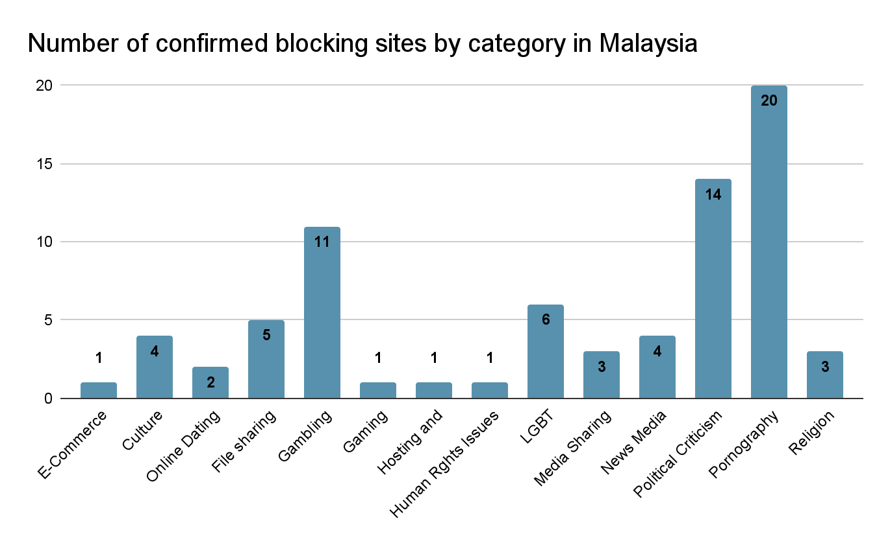
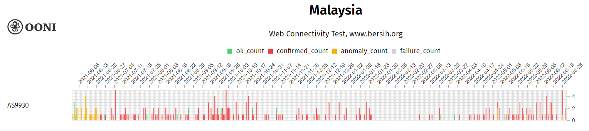
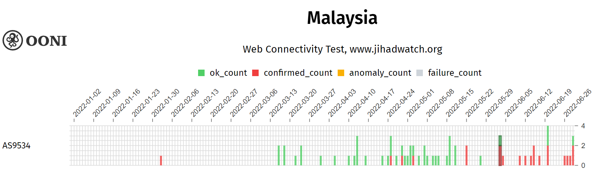

---

title: "iMAP State of Internet Censorship Report 2022 - Malaysia"

description: "This report shares internet censorship during the first half of 2022 in Malaysia using OONI data."

author: "Kelly Koh (Sinar Project)  and Siti Nurliza Samsudin (Sinar Project)"

date: "2022-12-23"

tags: ["malaysia", "censorship", "country-my", "theme-news_media", "theme-human_rights"]

categories: ["report"]

---

It is a codified guarantee that the internet will not be censored except for illegal, obscene and indecent content, while in reality the extent of censorship and its implementation are wider than projected and remain to be explored.

---

[Diterjemah ke dalam bahasa Melayu](https://imap.sinarproject.org/reports/2022/imap-state-of-internet-censorship-country-report-2022-malaysia/2022-malaysia-translation)

* The Ministry of Communications and Multimedia (MCMC) do not publish list of blocked sites, however statements were released from time to time to announce the number of sites blocked. It was revealed that 2,195 websites promoting online gambling were blocked as of March 2021.[^1] Between 2020 to July 2021, 960 phishing sites were blocked.[^2] From 2018 to September 2021, 4,068 pornography sites were blocked by MCMC.[^3]

* A total of a total of 75 sites were found to face instances of blocking from January to June 2022, ranging from pornography, political criticism, gambling, LGBT, file sharing, news media, religion, culture, media sharing, online dating, e-commerce, gaming, hosting and blogging platform, and human rights issues sites.
* The main method used to implement censorship is by way of DNS tampering.
* The main categories of sites being blocked are pornography, political criticism, gambling, LGBT sites.
* NFT site monyetistana.com featuring a cartoon monkey in royal suit is found to be blocked, as it was alleged to be insulting to the monarchy.
* Official website of the Coalition for Clean and Fair Election, bersih.org was found to be blocked since June 2021 on TIME dotCom.
* No instant messaging apps and circumvention tools are found to be blocked.

## Table of Contents

**[Introduction](#introduction)**

**[Background](#background)**

>> [Political Landscape](#political-landscape)
>
>> [Legal environment](#legal-environment)
>
>> >[Communications and Multimedia Act 1998](#communications-and-multimedia-act-1998)
>
>>> [Sedition Act 1948](#sedition-act-1948)
>
>>> [Penal Code](#penal-code)
>
>>> [Evidence Act 1950](#evidence-act-1950)
>
>> [Reported cases of internet censorship](#reported-cases-of-internet-censorship)

>>[Network Landscape and Internet Penetration](#network-landscape-and-internet-penetration)

**[Findings of internet censorship in
Malaysia](#findings-of-internet-censorship-in-malaysia)**

> [Blocking of Websites](#blocking-of-websites)
>
>> [Political Criticism](#political-criticism)
>
>> [News Media](#news-media)
>
> >[LGBT](#lgbt)
>
> [Blocking of Instant Messaging Apps](#blocking-of-instant-messaging-apps)
>
> [Blocking of Circumvention Tools](#blocking-of-circumvention-tools)

**[Acknowledgement of Limitations](#acknowledgement-of-limitations)**

**[Conclusion](#conclusion)**

**[Acknowledgements](#acknowledgements)**

**[Annex MY-1](#annex-my-1)**

**[Annex MY-2](#annex-my-2)**

**[Annex I: Glossary](#annex-i-glossary)**

**[Annex II: Methodology](#annex-ii-methodology)**

> [Data](#data)
>
> [Coverage](#coverage)
>
> [How are the network measurements gathered?](#how-are-the-network-measurements-gathered)
>
> [How are the network measurements analysed?](#how-are-the-network-measurements-analysed)
>
> [Country code](#country-code)
>
> [Autonomous System Number (ASN)](#autonomous-system-number-asn)
>
> [Date and time of measurements](#date-and-time-of-measurements)
>
> [Categories](#categories)
>
> [IP addresses and other information](#ip-addresses-and-other-information)
>
> [Network measurements](#network-measurements)

**[About iMAP](#about-imap)**

**[About Sinar Project](#about-sinar-project)**

## Introduction

The Internet Monitoring Action Project (iMAP) aims to promote and defend Internet freedoms in South and Southeast Asia by pursuing the following interconnected objectives: (1) establish in-country networks that will monitor network interference and restrictions to the freedom of expression online; (2) promote legal advocacy to expand Internet freedoms; and (3) enable civil society action for a freer Internet. The purpose of the Internet Monitoring Action Project (iMAP) State of Internet Censorship Country Report is to understand whether and to what extent internet censorship events occurred through collection and analysis of network measurements in Malaysia during the testing period from 1 January 2022 to 30 June 2022.

The following sections of this report provide information on the network landscape and internet penetration levels, its legal environment with respect to freedom of expression, access to information and privacy, as well as about cases of censorship in Malaysia.

## Background

In 2022, Malaysia has a total population estimated at 32.7 million, of which 30.7 million are citizens. There is a total of 17 million male population whilst the female population is 15.7 million. Gender ratio differs between citizens and non-citizens, with citizens stands at 103 males while non-citizens at 227 males for every 100 females.[^4] 

As a multicultural country, the major ethnic group Bumiputera comprised of 69.9 percent out of the 30.2 million citizens, followed by Chinese ethic group at 22.8 percent, Indian population at 6.6 percent, and other ethnic group at 0.7 percent. 

The state of Selangor has the highest population composition at 21.6 percent, followed by Johor at 12.3 percent and Sabah at 10.4 percent. The population density is different, with Kuala Lumpur has the highest population density of 8,045 per square meter, followed by Putrajaya at 2,418 and Penang at 1,656 per square meter. The largest state, Sarawak has the lowest with 20 people per square kilometer, followed by the third largest state, Pahang at 45 people and the second largest state, Sabah at 46 people.

### Political Landscape 

Malaysia is in the state of political instability, with the change of 3 governments between February 2020 to October 2022.

Malaysia has been ruled by the National Front (_Barisan Nasional_) (BN) coalition since independence in 1957, except the period from 2018 to 2020 when the Alliance of Hope (_Pakatan Harapan_) (PH) coalition took over after successfully gaining the majority seats during the 14th General Election. The administration by PH was short-lived. After 22 months in power, it was ousted after a change of alliance by many of its key members, causing PH to lose its majority. 

The Perikatan Nasional (PN) coalition took over in March 2020 after gaining the majority. Muhyiddin Yassin, who is President of the Malaysian United Indigenous Party (Parti Pribumi Bersatu Malaysia) (BERSATU), a then-member of the PH coalition, became the Prime Minister. After 17 months in office, he resigned from the position in August 2021 due to instability within the PN coalition with the withdrawal of support by United Malays Nation Organisation (UMNO), a party aligned with PN. 

Following Muhyiddin’s resignation, Ismail Sabri who is the Vice President of the United Malays Nation Organisation (UMNO), a component party of the BN coalition, was appointed as the Prime Minister by The Yang di-Pertuan Agong in August 2022. The selection process was by way of submission of Statutory Declarations from all the Members of Parliament on their respective choice of Prime Minister to and verified by the King.[^5]  

Outside of the coverage period, Ismail Sabri called for Parliament to be dissolved in October 2022 after 15 months in office to make way for the national General Election.  A new unity government was formed after the 15th General Election held on 19 November 2022.

### Legal environment

The Federal Constitution expressly guarantees the right to freedom of expression under article 10.[^6] Under the objects of the Communications and Multimedia Act (CMA) 1998, it is expressly stated that the act does not permit the censorship of the internet, under section 3(3). The Malaysian Government has also provided guarantees to companies with Malaysia Digital status [formerly known as Multimedia Super Corridor (MSC)] ensuring that internet will not be censored under Bill of Guarantees (BoGs), except illegal, obscene or indecent materials or any other actions that are deemed illegal in the physical world.[^7] 

Restrictions to freedom of expression online can be seen in the use of sections 211 and 233 of the CMA 1998, Sedition Act 1948, Penal Code, section 114A of the Evidence Act 1950.

#### Communications and Multimedia Act 1998

Both Sections 211 and 233 are applied in regulating offensive content on the internet that are deemed to be “indecent, obscene, false, menacing, or offensive in character with intent to annoy, abuse, threaten or harass any person”. Section 211 deals with the prohibition of provision of such offensive content, whilst Section 233 deals with the improper use of network service or application service to carry out such offence through communication. Both sections carry a penalty of RM50,000 and below or imprisonment not exceeding one year or both.

#### Sedition Act 1948

Section 4(1) covers a range of actions that reflects “seditious” tendency, including carrying out actions or uttering seditious words, publishing or importing seditious publications. This section has been challenged to be unconstitutional and void in the past but ruled otherwise by the Federal Court. While not specifically stated, it has been applied to publication made online.[^8] Malaysian artist, Fahmi Reza, was investigated under Section 4(1) of the Sedition Act 1948 and Section 233 of the Communications and Multimedia Act 1998 over his satirical drawing posted online that depicted a cartoon ape in a royal attire.[^9]

#### Penal Code

Several sections of the Penal Code have been used in the past against online users for contents posted online, notably section 298A for online contents alleged to be insulting Islam[^10], section 500 for criminal defamation over an online graphic resembling the then Health Minister Dr Adham Baba,[^11] and section 505 for “statements conducing to public mischief” over a blog post written by a politician of an opposition party in criticism of the ruling government.[^12]

#### Evidence Act 1950

Evidence Act 1950 does not impose punishment on offenses carried out in the online space, but the amendment came into force in 2012 with the introduction of section 114A has a direct impact on online users. Under section 114A, a person is deemed to be the publisher of online content, if the person’s identity is shown to possess control over the content, or if the content originates from the network subscribed under the name of the person, or if the content originates from the computer in custody of the person. This presumption is problematic as it could lead to a situation where a person could be found responsible over actions committed online by another using the person’s computer or the person’s network. Malaysiakini, local online news portal, was found to be liable for contempt of court by the Federal Court over a comment left by its reader in relation to the judiciary on its portal.[^13] 

### Reported cases of internet censorship

The Ministry of Communications and Multimedia (MCMC) do not publish list of blocked sites, however statements were released from time to time to announce the number of sites blocked. It was revealed that 2,195 websites promoting online gambling were blocked as of March 2021.[^14] Between 2020 to July 2021, 960 phishing sites were blocked.[^15] From 2018 to September 2021, 4,068 pornography sites were blocked by MCMC.[^16]

The Malaysian government made attempts to remove online contents, but do not have direct control over contents hosted on platforms registered outside of Malaysia.[^17] In December 2021, MCMC requested Twitter to remove posts by netizens that were critical over the handling of flash floods by the government, however such request was rejected by Twitter.[^18] In January 2022, MCMC requested Twitter to remove a post by political analyst made in September 2021 that criticized sympathizers of the Taliban, however it was rejected.[^19] 

## Network Landscape and Internet Penetration

The first quarter of 2022 recorded fixed broadband penetration rate at 29.2% per 100 premises and mobile broadband at 124.1 per 100 inhabitants. For fixed broadband, Kelantan has the lowest penetration rates followed by Sabah and Pahang, while Putrajaya has the lowest mobile broadband penetration rate followed by Sabah and Labuan.[^20]

Second quarter of 2022 recorded the average penetration rate of fixed-broadband is 45.3% per 100 premises, with the Selangor State has the highest at 59.9% followed by Kuala Lumpur at 57.5% and Putrajaya at 56.1%, while the lowest penetration rate is in the state of Kelantan at 21.2%, followed by the smallest state in Malaysia, Perlis at 26.6% and Sabah at 27%.[^21] The average mobile broadband penetration is different at 127.9% per 100 inhabitants, with Kuala Lumpur having the highest penetration at 220.6 % per 100 inhabitants, followed by Penang at 153.4% and Negeri Sembilan at 140.9%. The lowest penetration rate of mobile-broadband is Putrajaya at 95.2%, followed by Labuan at 99.2% and Sabah at 101.7%.[^22] Putrajaya is the administrative capital of Malaysia with its development began in 1995 and declared as a Federal Territory in 2001.[^23] As at August 2020, areas with poor internet access covers less than 20 percent.[^24]

As of 2020, 54.3% of internet users are males and 45.7% are females. The largest age group of internet users falls under 20 to 24 years old at 34.1% followed by 25 to 29 years old at 11.8%.[^25]

Internet and mobile service providers in Malaysia are privately-owned except for Telekom Malaysia whose majority shareholder consists of Khazanah Nasional, the investment holding arm under the Malaysian government. Telekom Malaysia is the largest broadband provider[^26], whereas Maxis is the top mobile service provider, followed by Digi and Celcom.[^27] Some of the main internet and mobile service providers are as follows:

| **Mobile Operators/ISPs** | **Fixed Internet** | **Mobile Internet** |
|---------------------------|--------------------|---------------------|
| Celcom Axiata             | x                  | x                   |
| Digi Telecommunications   | x                  | x                   |
| Maxis Communications      | x                  | x                   |
| redONE                    |                    | x                   |
| Telekom Malaysia          | x                  | x                   |
| Time dotCom               | x                  |                     |
| Tune Talk                 |                    | x                   |
| U Mobile                  | x                  | x                   |
| Yes                       | x                  | x                   |
| Yoodo                     |                    | x                   |

## Findings of internet censorship in Malaysia

### Blocking of Websites

Between 1 January to 30 June 2022, 1,039,734 measurements were collected from 21 Autonomous Systems tested in Malaysia. 

| **OK** | **Confirmed** | **Anomaly** | **Failure** | **Total** |
| --- | --- | --- | --- | --- |
| 998,822(96.07%) | 7,341(0.71%) | 24,378(2.34%) | 9,193(0.88%) | 1,039,734(100%) |

Table MY-A : Breakdown of total measurements collected between 1 January 2022 to 30 June 2022. Breakdown of total measurements collected identified through ASN between 1 January 2022 to 30 June 2022 tested in Malaysia can be found in Annex MY-1.

Based on OONI’s data, a total of 75 sites were found to face instances of blocking from January to June 2022 based on returned IPs that are identified and known to implement blocking. The full list of websites found to be blocked can be found in Annex MY-2. 

Chart MY-B shows the number of websites found to be blocked broken down into categories.

Based on measurements collected from January to June 2022, the main categories of websites with the most domains blocked are pornography (20), political criticism (14), and gambling (11). These measurements of confirmed blockings revealed that the main method used to implement censorship is by way of DNS tampering, when the returned Internet Protocol (IP) matches an IP known to implement blocking.

In this report, focus will be made on the confirmed blocked websites under Political Criticism, News Media and LGBT categories to explore what was blocked in Malaysia during the coverage period.

#### Political Criticism

| **Websites found to be blocked**               | **Description**                                                                                                                                                                   |
|-------------------------------|-----------------------------------------|
| monyetistana.com                               | NFT Fundraising Campaign website featuring a cartoon monkey mimicking royalty                                                                                                     |
| steadyaku47.com                                | Blog with articles commenting on current affairs in Malaysia.                                                                                                                     |
| www.hizb-ut-tahrir.org                         | Islamic blog promoting Khilafah state with contents on political analysis with publications from Islamic perspectives                                                             |
| www.khilafah.com                               | Website promoting Khilafah state and Islamic affairs around the world                                                                                                             |
| bigdogdotcom.wordpress.com                     | Blog with articles commenting on current affairs in Malaysia, last updated in December 2020.                                                                                      |
| elizabethwong.wordpress.com                    | Blog belonging to politician Elizabeth Wong, a member of an opposition party, People’s Justice Party (*Parti Keadilan Rakyat*). It was last updated in 2009.                      |
| peoplestrustmalaysia.wordpress.com             | Blog with articles commenting on current affairs in Malaysia.                                                                                                                     |
| prabaganesan.wordpress.com                     | Blog with articles commenting on current affairs in Malaysia, managed by                                                                                                          |
| www.bersih.org                                 | Official website of the Coalition for Clean and Fair Elections formed by members of civil society organisations and political parties in campaigning for clean and fair elections |
| www.financetwitter.com                         | Blog featuring contents on economy and financial-related news including political impact on the market                                                                            |
| edisisiasatmy.blogspot.com\*                   | Blog exposing alleged scandals and corruption practices in the police force                                                                                                       |
| dahalmi.wordpress.com\*                        | Blog with articles commenting on current affairs, elections, forecasting, business development, economics in Malaysia.                                                            |
| steadyaku-steadyaku-husseinhamid.blogspot.my\* | Blog with articles commenting on current affairs in Malaysia.                                                                                                                     |
| khilafah.net\*                                 | Website promoting Khilafah state and Islamic affairs around the world                                                                                                             |

Note: Websites marked with asterisk (*) were uncategorised and outside of the CitizenLab Malaysia country test list during the testing period. They are categorised under Political Criticism in this report by the researcher.

Amongst the websites found to be blocked at several instances, monyetistana.com is a recent addition first detected to be blocked on 29 April 2022 at 06:52 UTC on Celcom network and subsequently on Telekom, Digi and Maxis. This is an NFT site created for the selling of a caricature depicting a monkey in a royal suit by political activist Fahmi Reza. His artwork led to police investigation under Section 233 of the Communications and Multimedia Act 1998 and his arrest. Around the same period in April 2022, he also discovered that he was barred by the Immigration Department from leaving the country, possibly due to his then-ongoing legal proceedings involving political graphics posted on social media. A report by Sinar Project on the findings of censorship of monyetistana.com can be found at [https://sinarproject.org/digital-rights/measuring-and-detecting-network-interference/nft-fundraising-campaign-website-of-malaysian-artist-fahmi-reza-blocked](https://sinarproject.org/digital-rights/measuring-and-detecting-network-interference/nft-fundraising-campaign-website-of-malaysian-artist-fahmi-reza-blocked).

The official website belonging to the Coalition for Clean and Fair Election, bersih.org was found to be blocked during the coverage period since June 2021 on AS9930 TIME dotCom, with the first detection of blocking found on 23 June 2021. This coincided with the launch of a stimulated recall election campaign called Sack or Keep? (_Pecat atau kekal?_) on 21 June 2021 as a platform for eligible registered voters to initiate a recall election, and could be the trigger that led to censorship. During the stimulated recall election, at least 10% of registered voters in the constituency must participate to decide whether to remove or to keep the representative of a constituency, without having to wait for general election.[^28] Censorship is not found on other ISPs.

Graph shows the blocking of bersih.org from June 2021 to June 2022.

Steadyaku47.com and steadyaku-steadyaku-husseinhamid.blogspot.my are both managed by the same blogger with regular commentary on the current administration and political issues. The blogger is wanted by the police for an article deemed defamatory against the Pahang state royalty.[^29] Steadyaku47.com is found to be blocked on AS4788 TM Net, AS9930 TIME dotCom, AS9534 Maxis Broadband and AS10030 Celcom Axiata throughout the coverage period, whereas steadyaku-steadyaku-husseinhamid.blogspot.my was only tested on AS9930 during coverage period and found to be blocked on all 3 measurements collected.

#### News Media

| **Websites found to be blocked** | **Description**                                                                                                                                                                                                                    |
|----------------------------|--------------------------------------------|
| www.malaysia-chronicle.com       | News and commentary on local political issues.                                                                                                                                                                                     |
| seapa.wordpress.com              | Inactive blog belonging to the Southeast Asian Press Alliance (SEAPA), with the latest post published on 27 November 2007. SEAPA is a non-profit organisation working on promoting and protecting press freedom in Southeast Asia. |
| www.jihadwatch.org               | News and commentary centring on the jihad theology and ideology, and Islamic law.                                                                                                                                                  |

Malaysia Chronicle was found to be blocked in our 2016 report and continues to be blocked during the coverage period by AS9930 TIME dotCom. It was categorised as a Political Criticism site in our 2016 report, but has since re-categorised under News Media site.

Blog belonging to the Southeast Asian Press Alliance (SEAPA) was found to be blocked only on 14 June 2022 by AS4788 TM Net, while remaining accessible for the rest of the coverage period.

Jihad Watch was first detected to be blocked on 2 February 2022 by AS9534 Maxis Broadband. The website was sparingly tested and found to be accessible after that in the same network from 16 March to 27 May 2022, with instances of blocking found on 25 April, 29 April, 3 May, 22 May. Measurements collected from 3 June onwards to the end of coverage period show a mixed of confirmed blockings and accessible counts, as shown in the graph below:

 

#### LGBT

| **Websites found to be blocked** | **Description**                                                                                                                                                       |
|----------------------------|--------------------------------------------|
| www.gaystarnews.com              | Site on gay current affairs, entertainment, business and news                                                                                                         |
| www.planetromeo.com              | Dating site for gay, bi, and trans person                                                                                                                             |
| www.utopia-asia.com              | Asian gay & lesbian resources and information site                                                                                                                    |
| justiceforsisters.wordpress.com  | Local grassroots campaign to raise public awareness about issues surrounding violence and persecution against the Mak Nyah (trans women) community in Malaysia.       |
| ilga.org                         | Official website of the International Lesbian, Gay, Bisexual, Trans and Intersex Association campaigning for lesbian, gay, bisexual, trans and intersex human rights. |
| www.gay.com                      | Since 2017, it redirects to https://lalgbtcenter.org/, official website of Los Angeles LGBT Center                                                                    |

In our previous report in 2016, no LGBT sites were found to be blocked.

Measurements for Gay Star News began to be collected in November 2018. It was first found to be blocked since November 2018 under AS4818 Digi Telecommunications and continues to be blocked during coverage period under AS4788 TM Net, AS4818 Digi Telecommunications, AS9534 Maxis Broadband, and AS10030 Celcom Axiata. 

Testing for Planet Romeo (now renamed as Romeo) began in April 2017. It was found to be blocked since the beginning of collection of measurement under AS17971 TM Net and AS4788 TM Net and has since collected confirmed blocking measurements. During the coverage period, confirmed blockings were found under AS4788 TM Net, AS9930 TIME dotCom, AS4818 Digi Telecommunications, AS9534 Maxis Broadband, AS10030 Celcom Axiata and AS45960 YTL Communications.

Testing for Utopia Asia ([www.utopia-asia.com](http://www.utopia-asia.com)) began in 2016. The first detection of confirmed blocking measurement was collected in April 2018 under AS4788 TMNet, and subsequently under AS4818 Digi Telecommunications in May 2018, AS17971 TM Net in September 2018 and AS38466 U-Mobile in November 2018.[^30] During the coverage period, it is blocked under AS4788 TM Net, AS9930 TIME dotCom, AS4818 Digi Telecommunications, AS9534 Maxis Broadband, and AS10030 Celcom Axiata.

Justice for Sisters, a local grassroot that works on trans woman rights,  were accessible during the coverage period, except on 14 and 15 June 2022. The reason for temporary censorship is not known, but it is suspected to coincide with the period when the government announced that the animation Buzz Lightyear would not be screened in Malaysia due to its LGBT elements.[^31]

Collection of measurements of ILGA website began in 2016. The first measurement of confirmed blocking was found in November 2017 by ASN9534 Maxis Broadband. During the coverage period, it continues to be blocked by ASN9534 only.

Gay.com used to be a social networking site for the LGBT community. Since 2017 it has been redirecting to https://lalgbtcenter.org/, the official website of Los Angeles LGBT Center. The measurements for gay.com began in 2016 for AS4788, AS4818 and AS17971. Detection of confirmed blocking was first found on 10 February 2017 when it was first tested under AS9534 Maxis Broadband, and continues to be blocked during the coverage period.  

### Blocking of Instant Messaging Apps

There are a total of 9,902 measurements collected on Facebook Messenger, 9,823 measurements on Signal, 10,511 measurements on Telegram, and 9,872 measurements on WhatsApp. 

There is no instance of confirmed blocking found in the measurements on WhatsApp, Facebook Messenger, Signal or Telegram during the coverage period.

### Blocking of Circumvention Tools

A total of 10,513 measurements were collected on Psiphon[^32], 10,440 on Tor[^33], and 118 on Tor Snowflake[^34].

There is no instance of confirmed blocking found in the measurements of Psiphon, Tor or Tor Snowflake during the coverage period.

## Acknowledgement of Limitations

The examination of the findings of this study is limited to network measurements that were collected from 1 January to 30 June 2022 to examine the most recent censorship trends and events. 

The findings of this study are limited to a total of 260,452 URLs tested for censorship and shall not be deemed as an exhaustive list of websites affected by censorship[^35]. 

Although the network measurements were collected from 21 local vantage points in Malaysia, the running of OONI software testing was not consistent across all networks. This study focuses on the main ASNs with higher counts of measurements collected.

## Conclusion

The coverage period from January to June 2022 revealed that censorship is implemented mainly by way of DNS tampering and the focus of censorship lies heavily on pornography and gambling sites that fall within the scope of illegal and indecent content. However, the application of censorship is also seen on political criticism sites and news media sites, though the justification remains unknown, and its treatment varies by ISPs. 

This study found that several outdated political criticism and news media sites are still subject to the risk of being blocked, indicating that they are still being monitored by authorities despite long inactivity. More recent blockings reveal that sites appear to be in satirical of the royalty (monyetistana.com) or in criticism of the administration (such as [www.bersih.org](http://www.bersih.org), edisisiasatmy.blogspot.com) are also targeted. With the announcement of merger of Digi Telecommunications and Celcom Axiata, it remains to be seen how censorship would be implemented after the new largest telco in Malaysia is formed.

The state of internet censorship could change from time to time. We encourage individuals in Malaysia to join us in increasing transparency around internet censorship, to reveal when and if internet censorship occurs, how internet censorship is being implemented and the sites affected by internet censorship. Should you wish to contribute, you may:

* Increase testing by using OONI Probe app, available on iOS and Android mobile, and desktop.
* Review the Malaysia country test list available at <https://github.com/citizenlab/test-lists/blob/master/lists/my.csv> and refer to the guidelines prepared by OONI at <https://ooni.org/get-involved/contribute-test-lists>
* Translate the OONI Probe app into your local language at <https://explore.transifex.com/otf/ooniprobe/>
* Find out more about the state of internet censorship in community discussions by joining the OONI’s Slack channel at <https://slack.ooni.org/>.

## Acknowledgements

We would like to thank our local partners, activists, academicians, researchers, and anonymous users in Malaysia in running the OONI Probe, and the OONI team in providing support.

## Annex MY-1

Breakdown of total measurements collected identified through ASN between 1 January 2022 to 30 June 2022

| ASN      | Name                                         | Anomaly Count | Confirmed Count | Failure Count | Measurement Count |
|-----------|------------------|-----------|------------|----------|-------------|
| AS4788   | Telekom Malaysia (TM)                        | 6,596         | 2,850           | 2,906         | 315,439           |
| AS4818   | Digi Telecommunications                      | 10,676        | 1,539           | 2,972         | 426,981           |
| AS9534   | Maxis Broadband                              | 2,136         | 743             | 336           | 90,566            |
| AS9930   | Time dotCom                                  | 3,771         | 2,160           | 2,604         | 182,446           |
| AS10030  | Celcom Axiata                                | 60            | 42              | 24            | 2,502             |
| AS17971  | TM-VADS DC Hosting                           | 0             | 0               | 0             | 26                |
| AS21859  | Zenlayer Inc                                 | 269           | 0               | 25            | 6,546             |
| AS23678  | MyKris Asia                                  | 4             | 0               | 3             | 351               |
| AS24020  | University ITM                               | 648           | 0               | 317           | 6,984             |
| AS24028  | Redtone                                      | 70            | 0               | 4             | 5,180             |
| AS38278  | Orient Telecoms                              | 2             | 0               | 0             | 4                 |
| AS38322  | Webe Digital                                 | 0             | 0               | 0             | 10                |
| AS38466  | U Mobile                                     | 5             | 4               | 0             | 279               |
| AS45344  | International Islamic University of Malaysia | 4             | 0               | 0             | 20                |
| AS45839  | Shinjiru Technology                          | 0             | 0               | 0             | 19                |
| AS45960  | YTL Communications                           | 3             | 3               | 0             | 159               |
| AS55720  | Gigabit Hosting                              | 5             | 0               | 1             | 200               |
| AS132531 | M East                                       | 10            | 0               | 0             | 58                |
| AS136552 | Pacific Comnet                               | 116           | 0               | 1             | 1901              |
| AS137005 | Universiti Malaysia Kelantan                 | 2             | 0               | 0             | 26                |
| AS206804 | EstNOC                                       | 1             | 0               | 0             | 27                |
|          | Total                                        | 24,378        | 7,341           | 9,193         | 1,039,734         |

## Annex MY-2

Websites blocked in Malaysia between 1 January 2022 to 30 June 2022

| Blocked Websites                              | Categories                     | ASN                                              | Details                                                                                                                                                                                                         |
|-----------------------------------------------|--------------------------------|--------------------------------------------------|-----------------------------------------------------------------------------------------------------------------------------------------------------------------------------------------------------------------|
| www.binance.com                               | E-commerce                     | AS4788, AS9534                                   | https://explorer.ooni.org/chart/mat?probe_cc=MY&test_name=web_connectivity&domain=www.binance.com&since=2022-01-01&until=2022-06-30&axis_x=measurement_start_day&axis_y=probe_asn                               |
| www.fanfiction.net                            | Culture                        | AS4788, AS4818, AS9534, AS10030                  | https://explorer.ooni.org/chart/mat?probe_cc=MY&test_name=web_connectivity&domain=www.fanfiction.net&since=2022-01-01&until=2022-06-30&axis_x=measurement_start_day&axis_y=probe_asn                            |
| www.lushstories.com                           | Culture                        | AS4788, AS4818. AS9534, AS9930,                  | https://explorer.ooni.org/chart/mat?probe_cc=MY&test_name=web_connectivity&domain=www.lushstories.com&since=2022-01-01&until=2022-06-30&axis_x=measurement_start_day&axis_y=probe_asn                           |
| subscene.com                                  | Culture                        | AS4788, AS4818, AS9534, AS9930                   | https://explorer.ooni.org/chart/mat?probe_cc=MY&test_name=web_connectivity&domain=subscene.com&since=2022-01-01&until=2022-06-30&axis_x=measurement_start_day&axis_y=probe_asn                                  |
| www.literotica.com                            | Culture                        | AS4788, AS9534                                   | https://explorer.ooni.org/chart/mat?probe_cc=MY&test_name=web_connectivity&domain=www.literotica.com&since=2022-01-01&until=2022-06-30&axis_x=measurement_start_day&axis_y=probe_asn                            |
| adultfriendfinder.com                         | Online Dating                  | AS4788, AS4818, AS9534, AS9930                   | https://explorer.ooni.org/chart/mat?probe_cc=MY&test_name=web_connectivity&domain=adultfriendfinder.com&since=2022-01-01&until=2022-06-30&axis_x=measurement_start_day&axis_y=probe_asn                         |
| sucrebook.com                                 | Online Dating                  | AS4788, AS4818, AS9534, AS9930                   | https://explorer.ooni.org/chart/mat?probe_cc=MY&test_name=web_connectivity&domain=sucrebook.com&since=2022-01-01&until=2022-06-30&axis_x=measurement_start_day&axis_y=probe_asn                                 |
| thepiratebay.org                              | File-sharing                   | AS4788, AS4818, AS9534, AS9930                   | https://explorer.ooni.org/chart/mat?probe_cc=MY&test_name=web_connectivity&domain=thepiratebay.org&since=2022-01-01&until=2022-06-30&axis_x=measurement_start_day&axis_y=probe_asn                              |
| www.rarbg.to                                  | File-sharing                   | AS4788, AS4818, AS9534                           | https://explorer.ooni.org/chart/mat?probe_cc=MY&test_name=web_connectivity&domain=www.rarbg.to&since=2022-01-01&until=2022-06-30&axis_x=measurement_start_day&axis_y=probe_asn                                  |
| extratorrent.cc*                              | File sharing                   | AS4788, AS9534                                   | https://explorer.ooni.org/chart/mat?probe_cc=MY&test_name=web_connectivity&domain=extratorrent.cc&since=2022-01-01&until=2022-06-30&axis_x=measurement_start_day&axis_y=probe_asn                               |
| torrentz.eu*                                  | File sharing                   | AS4788, AS9534                                   | https://explorer.ooni.org/chart/mat?probe_cc=MY&test_name=web_connectivity&domain=torrentz.eu&since=2022-01-01&until=2022-06-30&axis_x=measurement_start_day&axis_y=probe_asn                                   |
| turbobit.net                                  | File sharing                   | AS9930, AS9534                                   | https://explorer.ooni.org/chart/mat?probe_cc=MY&test_name=web_connectivity&domain=turbobit.net&since=2022-01-01&until=2022-06-30&axis_x=measurement_start_day&axis_y=probe_asn                                  |
| www.europacasino.com                          | Gambling                       | AS9930, AS4818, AS9534, AS10030                  | https://explorer.ooni.org/chart/mat?probe_cc=MY&test_name=web_connectivity&domain=www.europacasino.com&since=2022-01-01&until=2022-06-30&axis_x=measurement_start_day&axis_y=probe_asn                          |
| www.spinpalace.com                            | Gambling                       | AS9930, AS4818, AS9534, AS10030                  | https://explorer.ooni.org/chart/mat?probe_cc=MY&test_name=web_connectivity&domain=www.spinpalace.com&since=2022-01-01&until=2022-06-30&axis_x=measurement_start_day&axis_y=probe_asn                            |
| www.goldenrivieracasino.com                   | Gambling                       | AS9930, AS4818, AS9534, AS45960                  | https://explorer.ooni.org/chart/mat?probe_cc=MY&test_name=web_connectivity&domain=www.goldenrivieracasino.com&since=2022-01-01&until=2022-06-30&axis_x=measurement_start_day&axis_y=probe_asn                   |
| www.888casino.com                             | Gambling                       | AS4788, As4818, AS9534, AS9930                   | https://explorer.ooni.org/chart/mat?probe_cc=MY&test_name=web_connectivity&domain=www.888casino.com&since=2022-01-01&until=2022-06-30&axis_x=measurement_start_day&axis_y=probe_asn                             |
| www.betfair.com                               | Gambling                       | AS4788, AS9930, AS4818, AS9534                   | https://explorer.ooni.org/chart/mat?probe_cc=MY&test_name=web_connectivity&domain=www.betfair.com&since=2022-01-01&until=2022-06-30&axis_x=measurement_start_day&axis_y=probe_asn                               |
| www.pokerstars.com                            | Gambling                       | AS4788, AS9534                                   | https://explorer.ooni.org/chart/mat?probe_cc=MY&test_name=web_connectivity&domain=www.pokerstars.com&since=2022-01-01&until=2022-06-30&axis_x=measurement_start_day&axis_y=probe_asn                            |
| www.carnivalcasino.com                        | Gambling                       | AS9930, AS4818, AS9534                           | https://explorer.ooni.org/chart/mat?probe_cc=MY&test_name=web_connectivity&domain=www.carnivalcasino.com&since=2022-01-01&until=2022-06-30&axis_x=measurement_start_day&axis_y=probe_asn                        |
| www.casino.com                                | Gambling                       | AS9930, AS4818, AS9534                           | https://explorer.ooni.org/chart/mat?probe_cc=MY&test_name=web_connectivity&domain=www.casino.com&since=2022-01-01&until=2022-06-30&axis_x=measurement_start_day&axis_y=probe_asn                                |
| www.casinotropez.com                          | Gambling                       | AS9930, AS4818, AS9534                           | https://explorer.ooni.org/chart/mat?probe_cc=MY&test_name=web_connectivity&domain=www.casinotropez.com&since=2022-01-01&until=2022-06-30&axis_x=measurement_start_day&axis_y=probe_asn                          |
| www.clubdicecasino.com                        | Gambling                       | AS4818, AS9930, AS9534                           | https://explorer.ooni.org/chart/mat?probe_cc=MY&test_name=web_connectivity&domain=www.clubdicecasino.com&since=2022-01-01&until=2022-06-30&axis_x=measurement_start_day&axis_y=probe_asn                        |
| www.roxypalace.com*                           | Gambling                       | AS9930, AS4818, AS9534                           | https://explorer.ooni.org/chart/mat?probe_cc=MY&test_name=web_connectivity&domain=www.roxypalace.com&since=2022-01-01&until=2022-06-30&axis_x=measurement_start_day&axis_y=probe_asn                            |
| forums.luckynetwork.id*                       | Gaming                         | AS4788                                           | https://explorer.ooni.org/chart/mat?probe_cc=MY&test_name=web_connectivity&domain=forums.luckynetwork.id&since=2022-01-01&until=2022-06-30&axis_x=measurement_start_day&axis_y=probe_asn                        |
| www.angelfire.com                             | Hosting and Blogging Platforms | AS9534                                           | https://explorer.ooni.org/chart/mat?probe_cc=MY&test_name=web_connectivity&domain=www.angelfire.com&since=2022-01-01&until=2022-06-30&axis_x=measurement_start_day&axis_y=probe_asn                             |
| gerakmalaysiablog.wordpress.com               | Human Rights Issues            | AS4788                                           | https://explorer.ooni.org/chart/mat?probe_cc=MY&test_name=web_connectivity&domain=gerakmalaysiablog.wordpress.com&since=2022-01-01&until=2022-06-30&axis_x=measurement_start_day&axis_y=probe_asn               |
| www.gaystarnews.com                           | LGBT                           | AS4788, AS4818, AS9534, AS10030                  | https://explorer.ooni.org/chart/mat?probe_cc=MY&test_name=web_connectivity&domain=www.gaystarnews.com&since=2022-01-01&until=2022-06-30&axis_x=measurement_start_day&axis_y=probe_asn                           |
| www.planetromeo.com                           | LGBT                           | AS4788, AS9930, AS4818, AS9534, AS10030, AS45960 | https://explorer.ooni.org/chart/mat?probe_cc=MY&test_name=web_connectivity&domain=www.planetromeo.com&since=2022-01-01&until=2022-06-30&axis_x=measurement_start_day&axis_y=probe_asn                           |
| www.utopia-asia.com                           | LGBT                           | AS4788, AS9930, AS4818, AS9534, AS10030          | https://explorer.ooni.org/chart/mat?probe_cc=MY&test_name=web_connectivity&domain=www.utopia-asia.com&since=2022-01-01&until=2022-06-30&axis_x=measurement_start_day&axis_y=probe_asn                           |
| justiceforsisters.wordpress.com               | LGBT                           | AS4788                                           | https://explorer.ooni.org/chart/mat?probe_cc=MY&test_name=web_connectivity&domain=justiceforsisters.wordpress.com&since=2022-01-01&until=2022-06-30&axis_x=measurement_start_day&axis_y=probe_asn               |
| ilga.org                                      | LGBT                           | AS9534                                           | https://explorer.ooni.org/chart/mat?probe_cc=MY&test_name=web_connectivity&domain=ilga.org&since=2022-01-01&until=2022-06-30&axis_x=measurement_start_day&axis_y=probe_asn                                      |
| www.gay.com                                   | LGBT                           | AS9534                                           | https://explorer.ooni.org/chart/mat?probe_cc=MY&test_name=web_connectivity&domain=www.gay.com&since=2022-01-01&until=2022-06-30&axis_x=measurement_start_day&axis_y=probe_asn                                   |
| www.depositfiles.com                          | Media sharing                  | AS9534                                           | https://explorer.ooni.org/chart/mat?probe_cc=MY&test_name=web_connectivity&domain=www.depositfiles.com&since=2022-01-01&until=2022-06-30&axis_x=measurement_start_day&axis_y=probe_asn                          |
| dandanzan.com*                                | Media sharing                  | AS4788                                           | https://explorer.ooni.org/chart/mat?probe_cc=MY&test_name=web_connectivity&domain=dandanzan.com&since=2022-01-01&until=2022-06-30&axis_x=measurement_start_day&axis_y=probe_asn                                 |
| 9anime.to*                                    | Media sharing                  | AS9534                                           | https://explorer.ooni.org/chart/mat?probe_cc=MY&test_name=web_connectivity&domain=9anime.to&since=2022-01-01&until=2022-06-30&axis_x=measurement_start_day&axis_y=probe_asn                                     |
| seapa.wordpress.com                           | News Media                     | AS4788                                           | https://explorer.ooni.org/chart/mat?probe_cc=MY&test_name=web_connectivity&domain=seapa.wordpress.com&since=2022-01-01&until=2022-06-30&axis_x=measurement_start_day&axis_y=probe_asn                           |
| www.jihadwatch.org                            | News Media                     | AS9534                                           | https://explorer.ooni.org/chart/mat?probe_cc=MY&test_name=web_connectivity&domain=www.jihadwatch.org&since=2022-01-01&until=2022-06-30&axis_x=measurement_start_day&axis_y=probe_asn                            |
| www.malaysia-chronicle.com                    | News Media                     | AS9930                                           | https://explorer.ooni.org/chart/mat?probe_cc=MY&test_name=web_connectivity&domain=www.malaysia-chronicle.com&since=2022-01-01&until=2022-06-30&axis_x=measurement_start_day&axis_y=probe_asn                    |
| monyetistana.com                              | Political Criticism            | AS4788, AS9534, AS4818, AS10030                  | https://explorer.ooni.org/chart/mat?probe_cc=MY&test_name=web_connectivity&domain=monyetistana.com&since=2022-01-01&until=2022-06-30&axis_x=measurement_start_day&axis_y=probe_asn                              |
| steadyaku47.com                               | Political Criticism            | AS4788, AS9930, AS9534, AS10030                  | https://explorer.ooni.org/chart/mat?probe_cc=MY&test_name=web_connectivity&domain=steadyaku47.com&since=2022-01-01&until=2022-06-30&axis_x=measurement_start_day&axis_y=probe_asn                               |
| www.hizb-ut-tahrir.org                        | Political Criticism            | AS4788, AS4818, AS9534, AS10030                  | https://explorer.ooni.org/chart/mat?probe_cc=MY&test_name=web_connectivity&domain=www.hizb-ut-tahrir.org&since=2022-01-01&until=2022-06-30&axis_x=measurement_start_day&axis_y=probe_asn                        |
| www.khilafah.com                              | Political Criticism            | AS4788, AS4818, AS9534, AS10030, AS38466         | https://explorer.ooni.org/chart/mat?probe_cc=MY&test_name=web_connectivity&domain=www.khilafah.com&since=2022-01-01&until=2022-06-30&axis_x=measurement_start_day&axis_y=probe_asn                              |
| bigdogdotcom.wordpress.com                    | Political Criticism            | AS4788                                           | https://explorer.ooni.org/chart/mat?probe_cc=MY&test_name=web_connectivity&domain=bigdogdotcom.wordpress.com&since=2022-01-01&until=2022-06-30&axis_x=measurement_start_day&axis_y=probe_asn                    |
| elizabethwong.wordpress.com                   | Political Criticism            | AS4788                                           | https://explorer.ooni.org/chart/mat?probe_cc=MY&test_name=web_connectivity&domain=elizabethwong.wordpress.com&since=2022-01-01&until=2022-06-30&axis_x=measurement_start_day&axis_y=probe_asn                   |
| peoplestrustmalaysia.wordpress.com            | Political Criticism            | AS4788                                           | https://explorer.ooni.org/chart/mat?probe_cc=MY&test_name=web_connectivity&domain=peoplestrustmalaysia.wordpress.com&since=2022-01-01&until=2022-06-30&axis_x=measurement_start_day&axis_y=probe_asn            |
| prabaganesan.wordpress.com                    | Political Criticism            | AS4788                                           | https://explorer.ooni.org/chart/mat?probe_cc=MY&test_name=web_connectivity&domain=prabaganesan.wordpress.com&since=2022-01-01&until=2022-06-30&axis_x=measurement_start_day&axis_y=probe_asn                    |
| www.bersih.org                                | Political Criticism            | AS9930                                           | https://explorer.ooni.org/chart/mat?probe_cc=MY&test_name=web_connectivity&domain=www.bersih.org&since=2022-01-01&until=2022-06-30&axis_x=measurement_start_day&axis_y=probe_asn                                |
| www.financetwitter.com                        | Political Criticism            | AS9930                                           | https://explorer.ooni.org/chart/mat?probe_cc=MY&test_name=web_connectivity&domain=www.financetwitter.com&since=2022-01-01&until=2022-06-30&axis_x=measurement_start_day&axis_y=probe_asn                        |
| edisisiasatmy.blogspot.com*                   | Political Criticism            | AS10030, AS4788, AS38466                         | https://explorer.ooni.org/chart/mat?probe_cc=MY&test_name=web_connectivity&domain=edisisiasatmy.blogspot.com&since=2022-01-01&until=2022-06-30&axis_x=measurement_start_day&axis_y=probe_asn                    |
| dahalmi.wordpress.com*                        | Political Criticism            | AS4788                                           | https://explorer.ooni.org/chart/mat?probe_cc=MY&test_name=web_connectivity&domain=dahalmi.wordpress.com&since=2022-01-01&until=2022-06-30&axis_x=measurement_start_day&axis_y=probe_asn                         |
| steadyaku-steadyaku-husseinhamid.blogspot.my* | Political Criticism            | AS9930                                           | https://explorer.ooni.org/chart/mat?probe_cc=MY&test_name=web_connectivity&domain=steadyaku-steadyaku-husseinhamid.blogspot.my&since=2022-01-01&until=2022-06-30&axis_x=measurement_start_day&axis_y=probe_asn  |
| khilafah.net*                                 | Political Criticism            | AS4788, AS9534                                   | https://explorer.ooni.org/chart/mat?probe_cc=MY&test_name=web_connectivity&domain=khilafah.net&since=2022-01-01&until=2022-06-30&axis_x=measurement_start_day&axis_y=probe_asn                                  |
| www.malayporn.space                           | Pornography                    | AS4788, AS9930, AS4818, AS9534, AS10030          | https://explorer.ooni.org/chart/mat?probe_cc=MY&test_name=web_connectivity&domain=www.malayporn.space&since=2022-01-01&until=2022-06-30&axis_x=measurement_start_day&axis_y=probe_asn                           |
| www.pornhub.com                               | Pornography                    | AS4788, AS9930, AS4818, AS9534, AS10030          | https://explorer.ooni.org/chart/mat?probe_cc=MY&test_name=web_connectivity&domain=www.pornhub.com&since=2022-01-01&until=2022-06-30&axis_x=measurement_start_day&axis_y=probe_asn                               |
| www.sex.com                                   | Pornography                    | AS9930, AS4788, AS4818, AS9534, AS10030          | https://explorer.ooni.org/chart/mat?probe_cc=MY&test_name=web_connectivity&domain=www.sex.com&since=2022-01-01&until=2022-06-30&axis_x=measurement_start_day&axis_y=probe_asn                                   |
| www.xvideos.com                               | Pornography                    | AS4788, AS9930, AS4818, AS9534, AS10030          | https://explorer.ooni.org/chart/mat?probe_cc=MY&test_name=web_connectivity&domain=www.xvideos.com&since=2022-01-01&until=2022-06-30&axis_x=measurement_start_day&axis_y=probe_asn                               |
| xhamster.com                                  | Pornography                    | AS4788, AS9930, AS4818, AS9534                   | https://explorer.ooni.org/chart/mat?probe_cc=MY&test_name=web_connectivity&domain=xhamster.com&since=2022-01-01&until=2022-06-30&axis_x=measurement_start_day&axis_y=probe_asn                                  |
| www.youporn.com                               | Pornography                    | AS9930, AS4818, AS9534, AS45960                  | https://explorer.ooni.org/chart/mat?probe_cc=MY&test_name=web_connectivity&domain=www.youporn.com&since=2022-01-01&until=2022-06-30&axis_x=measurement_start_day&axis_y=probe_asn                               |
| beeg.com                                      | Pornography                    | AS4788, AS9930, AS4818, AS9534                   | https://explorer.ooni.org/chart/mat?probe_cc=MY&test_name=web_connectivity&domain=beeg.com&since=2022-01-01&until=2022-06-30&axis_x=measurement_start_day&axis_y=probe_asn                                      |
| hotgaylist.com                                | Pornography                    | AS4788, AS9534                                   | https://explorer.ooni.org/chart/mat?probe_cc=MY&test_name=web_connectivity&domain=hotgaylist.com&since=2022-01-01&until=2022-06-30&axis_x=measurement_start_day&axis_y=probe_asn                                |
| lucahmelayu.club                              | Pornography                    | AS4788, AS4818                                   | https://explorer.ooni.org/chart/mat?probe_cc=MY&test_name=web_connectivity&domain=lucahmelayu.club&since=2022-01-01&until=2022-06-30&axis_x=measurement_start_day&axis_y=probe_asn                              |
| malaypornhub.com                              | Pornography                    | AS4788, AS9930, AS4818, AS9534                   | https://explorer.ooni.org/chart/mat?probe_cc=MY&test_name=web_connectivity&domain=malaypornhub.com&since=2022-01-01&until=2022-06-30&axis_x=measurement_start_day&axis_y=probe_asn                              |
| www.89.com                                    | Pornography                    | AS4788, AS9930, AS4818, AS9534                   | https://explorer.ooni.org/chart/mat?probe_cc=MY&test_name=web_connectivity&domain=www.89.com&since=2022-01-01&until=2022-06-30&axis_x=measurement_start_day&axis_y=probe_asn                                    |
| www.hustler.com                               | Pornography                    | AS4788, AS9930                                   | https://explorer.ooni.org/chart/mat?probe_cc=MY&test_name=web_connectivity&domain=www.hustler.com&since=2022-01-01&until=2022-06-30&axis_x=measurement_start_day&axis_y=probe_asn                               |
| xmalay.com                                    | Pornography                    | AS4788, AS9930, AS9534                           | https://explorer.ooni.org/chart/mat?probe_cc=MY&test_name=web_connectivity&domain=xmalay.com&since=2022-01-01&until=2022-06-30&axis_x=measurement_start_day&axis_y=probe_asn                                    |
| www.wetplace.com                              | Pornography                    | AS9930, AS4818, AS9534                           | https://explorer.ooni.org/chart/mat?probe_cc=MY&test_name=web_connectivity&domain=www.wetplace.com&since=2022-01-01&until=2022-06-30&axis_x=measurement_start_day&axis_y=probe_asn                              |
| www.playboy.com                               | Pornography                    | AS9534                                           | https://explorer.ooni.org/chart/mat?probe_cc=MY&test_name=web_connectivity&domain=www.playboy.com&since=2022-01-01&until=2022-06-30&axis_x=measurement_start_day&axis_y=probe_asn                               |
| bravotube.net*                                | Pornography                    | AS4788, AS9534                                   | https://explorer.ooni.org/chart/mat?probe_cc=MY&test_name=web_connectivity&domain=bravotube.net&since=2022-01-01&until=2022-06-30&axis_x=measurement_start_day&axis_y=probe_asn                                 |
| www.porntrex.com*                             | Pornography                    | AS4788                                           | https://explorer.ooni.org/chart/mat?probe_cc=MY&test_name=web_connectivity&domain=www.porntrex.com&since=2022-01-01&until=2022-06-30&axis_x=measurement_start_day&axis_y=probe_asn                              |
| www.spankbang.com*                            | Pornography                    | AS4788                                           | https://explorer.ooni.org/chart/mat?probe_cc=MY&test_name=web_connectivity&domain=www.spankbang.com&since=2022-01-01&until=2022-06-30&axis_x=measurement_start_day&axis_y=probe_asn                             |
| pornhub.com                                   | Pornography                    | AS10030                                          | https://explorer.ooni.org/chart/mat?probe_cc=MY&test_name=web_connectivity&domain=pornhub.com&since=2022-01-01&until=2022-06-30&axis_x=measurement_start_day&axis_y=probe_asn                                   |
| xvideos.com                                   | Pornography                    | AS10030, AS38466                                 | https://explorer.ooni.org/chart/mat?probe_cc=MY&test_name=web_connectivity&domain=xvideos.com&since=2022-01-01&until=2022-06-30&axis_x=measurement_start_day&axis_y=probe_asn                                   |
| www.answering-islam.org                       | Religion                       | AS4788, AS4818, AS9534, AS10030                  | https://explorer.ooni.org/chart/mat?probe_cc=MY&test_name=web_connectivity&domain=www.answering-islam.org&since=2022-01-01&until=2022-06-30&axis_x=measurement_start_day&axis_y=probe_asn                       |
| www.patheos.com                               | Religion                       | AS9534, AS10030                                  | https://explorer.ooni.org/chart/mat?probe_cc=MY&test_name=web_connectivity&domain=www.patheos.com&since=2022-01-01&until=2022-06-30&axis_x=measurement_start_day&axis_y=probe_asn                               |
| www.thereligionofpeace.com                    | Religion                       | AS4788, AS9930, AS4818, AS9534, AS10030          | https://explorer.ooni.org/chart/mat?probe_cc=MY&test_name=web_connectivity&domain=www.thereligionofpeace.com&since=2022-01-01&until=2022-06-30&axis_x=measurement_start_day&axis_y=probe_asn                    |

Note: Websites marked with asterisk (*) were uncategorised and outside of the CitizenLab Malaysia country test list during the testing period. These websites are categorized by the researcher for purposes of this report.

## Annex I: Glossary

| **Term**         | Definition                                                                                                                                                                                                                                                                                                                                                                                                                                                                                                                                                                                                                                                                                                                                                                                                                                               |
|------------------|----------------------------------------------------------------------------------------------------------------------------------------------------------------------------------------------------------------------------------------------------------------------------------------------------------------------------------------------------------------------------------------------------------------------------------------------------------------------------------------------------------------------------------------------------------------------------------------------------------------------------------------------------------------------------------------------------------------------------------------------------------------------------------------------------------------------------------------------------------|
| **DNS**          | DNS stands for “Domain Name System” and it maps domain names to IP addresses. A domain is a name that is commonly attributed to websites (when they’re created), so that they can be more easily accessed and remembered. For example, twitter.com is the domain of the Twitter website. However, computers can’t connect to internet services through domain names, but based on IP addresses: the digital address of each service on the internet. Similarly, in the physical world, you would need the address of a house (rather than the name of the house itself) in order to visit it. The Domain Name System (DNS) is what is responsible for transforming a human- readable domain name (such as ooni.org) into its numerical IP address counterpart (in this case:104.198.14.52), thus allowing your computer to access the intended website.  |
| **HTTP**         | The Hypertext Transfer Protocol (HTTP) is the underlying protocol used by the World Wide Web to transfer or exchange data across the internet. The HTTP protocol allows communication between a client and a server. It does so by handling a client’s request to connect to a server, and the server’s response to the client’s request. All websites include an HTTP (or HTTPS) prefix (such as http://example.com/) so that your computer (the client) can request and receive the content of a website (hosted on a server). All websites include an HTTP (or HTTPS) prefix (such as http://example.com/) so that your computer (the client) can request and receive the content of a website (hosted on a server). The transmission of data over the HTTP protocol is unencrypted.                                                                  |
| **ISP**          | An Internet Service Provider (ISP) is an organization that provides services for accessing and using the internet. ISPs can be state-owned, commercial, community-owned, non-profit, or otherwise privately owned. Vodafone, AT&T, Airtel, and MTN are examples of ISPs.                                                                                                                                                                                                                                                                                                                                                                                                                                                                                                                                                                                 |
| **Middle boxes** | A middlebox is a computer networking device that transforms, inspects, filters, or otherwise manipulates traffic for purposes other than packet forwarding. Many Internet Service Providers (ISPs) around the world use middleboxes to improve network performance, provide users with faster access to websites, and for a number of other networking purposes. Sometimes though, middleboxes are also used to implement internet censorship and/or surveillance. The OONI Probe app includes two tests designed to measure networks with the aim of identifying the presence of middleboxes.                                                                                                                                                                                                                                                           |
| **TCP**          | The Transmission Control Protocol (TCP) is one of the main protocols on the internet. To connect to a website, your computer needs to establish a TCP connection to the address of that website. TCP works on top of the Internet Protocol (IP), which defines how to address computers on the internet. When speaking to a machine over the TCP protocol you use an IP and port pair, which looks something like this: 10.20.1.1:8080. The main difference between TCP and (another very popular protocol called) UDP is that TCP has the notion of a “connection”, making it a “reliable” transport protocol.                                                                                                                                                                                                                                          |
| **TLS**          | Transport Layer Security (TLS) – also referred to as “SSL” – is a cryptographic protocol that allows you to maintain a secure, encrypted connection between your computer and an internet service. When you connect to a website through TLS, the address of the website will begin with HTTPS (such as https://www.facebook.com/), instead of HTTP.                                                                                                                                                                                                                                                                                                                                                                                                                                                                                                     |

A comprehensive glossary related to OONI can be accessed here: [https://ooni.org/support/glossary/](https://ooni.org/support/glossary/). 

## Annex II: Methodology

### Data

Data computed based on the heuristics for this report can be downloaded here: [https://github.com/Sinar/imap-data](https://github.com/Sinar/imap-data) whereas aggregated data can be downloaded from [OONI Explorer](https://explorer.ooni.org/).

### Coverage

The iMAP State of Internet Censorship Country Report covers the findings of network measurement collected through Open Observatory of Network Interference (OONI) [OONI Probe App](https://ooni.org/install/) that measures the blocking of websites, instant messaging apps, circumvention tools and network tampering. The findings highlight the websites, instant messaging apps and circumvention tools confirmed to be blocked, the ASNs with censorship detected and method of network interference applied. The report also provides background context on the network landscape combined with the latest legal, social and political issues and events which might have an effect on the implementation of internet censorship in the country.

In terms of timeline, this first iMAP report covers measurements obtained in the six-month period from 1 January 2022 to 30 June 2022. The countries covered in this round are Cambodia, Hong Kong, Indonesia, Malaysia, Myanmar, Philippines, Thailand, and Viet Nam. India will only be included starting in the next period of reporting.  

### How are the network measurements gathered?

Network measurements are gathered through the use of [OONI Probe app](https://ooni.org/install/), a free software tool developed by [Open Observatory of Network Interference (OONI)](https://ooni.org/). To learn more about how the OONI Probe test works, please visit [https://ooni.org/nettest/](https://ooni.org/nettest/).

iMAP Country Researchers and anonymous volunteers run OONI Probe app to examine the accessibility of websites included in the [Citizen Lab test lists](https://github.com/citizenlab/test-lists/tree/master/lists). iMAP Country Researchers actively review the country-specific test lists to ensure up-to-date websites are included and context-relevant websites are properly categorised, in consultation with local communities and digital rights network partners. We adopt the [approach taken by Netalitica](https://netalitica.com/wp-content/uploads/2021/10/Guideline-for-Test-List-Researchers-V7.pdf) in reviewing country-specific test lists.

It is important to note that the findings are only applicable to the websites that were examined and do not fully reflect all instances of censorship that might have occurred during the testing period. 

### How are the network measurements analysed?

OONI processes the following types of data through its data pipeline: https://github.com/ooni/pipeline.

#### Country code

OONI by default collects the code which corresponds to the country from which the user is running OONI Probe tests from, by automatically searching for it based on the user’s IP address through their [ASN database](https://github.com/ooni/asn-db-generator) the [MaxMind GeoIP database](https://www.maxmind.com/en/home). 

#### Autonomous System Number (ASN)

OONI by default collects the Autonomous System Number (ASN) of the network used to run OONI Probe app, thereby revealing the network provider of a user. 

#### Date and time of measurements

OONI by default collects the time and date of when tests were run to evaluate when network interferences occur and to allow comparison across time. UTC is used as the standard time zone in the time and date information. In addition, the charts generated on OONI MAT will exclude measurements on the last day by default.

#### Categories

The 32 website categories are based on the Citizenlab test lists: [https://github.com/citizenlab/test-lists](https://github.com/citizenlab/test-lists). As not all websites tested on OONI are on these test lists, these websites would have unclassified categories.

| **No.** | **Category Description**              | **Code** | **Description**                                                                                                                                                                                                                                                                                 |
|--------|--------------------|---------|-----------------------------------|
| 1       | Alcohol & Drugs                       | ALDR     | Sites devoted to the use, paraphernalia, and sale of drugs and alcohol irrespective of the local legality.                                                                                                                                                                                      |
| 2       | Religion                              | REL      | Sites devoted to discussion of religious issues, both supportive and critical, as well as discussion of minority religious groups.                                                                                                                                                              |
| 3       | Pornography                           | PORN     | Hard-core and soft-core pornography.                                                                                                                                                                                                                                                            |
| 4       | Provocative Attire                    | PROV     | Websites which show provocative attire and portray women in a sexual manner, wearing minimal clothing.                                                                                                                                                                                          |
| 5       | Political Criticism                   | POLR     | Content that offers critical political viewpoints. Includes critical authors and bloggers, as well as oppositional political organizations. Includes pro-democracy content, anti-corruption content as well as content calling for changes in leadership, governance issues, legal reform. Etc. |
| 6       | Human Rights Issues                   | HUMR     | Sites dedicated to discussing human rights issues in various forms. Includes women's rights and rights of minority ethnic groups.                                                                                                                                                               |
| 7       | Environment                           | ENV      | Pollution, international environmental treaties, deforestation, environmental justice, disasters, etc.                                                                                                                                                                                          |
| 8       | Terrorism and Militants               | MILX     | Sites promoting terrorism, violent militant or separatist movements.                                                                                                                                                                                                                            |
| 9       | Hate Speech                           | HATE     | Content that disparages particular groups or persons based on race, sex, sexuality or other characteristics                                                                                                                                                                                     |
| 10      | News Media                            | NEWS     | This category includes major news outlets (BBC, CNN, etc.) as well as regional news outlets and independent media.                                                                                                                                                                              |
| 11      | Sex Education                         | XED      | Includes contraception, abstinence, STDs, healthy sexuality, teen pregnancy, rape prevention, abortion, sexual rights, and sexual health services.                                                                                                                                              |
| 12      | Public Health                         | PUBH     | HIV, SARS, bird flu, centers for disease control, World Health Organization, etc                                                                                                                                                                                                                |
| 13      | Gambling                              | GMB      | Online gambling sites. Includes casino games, sports betting, etc.                                                                                                                                                                                                                              |
| 14      | Anonymization and circumvention tools | ANON     | Sites that provide tools used for anonymization, circumvention, proxy-services and encryption.                                                                                                                                                                                                  |
| 15      | Online Dating                         | DATE     | Online dating services which can be used to meet people, post profiles, chat, etc                                                                                                                                                                                                               |
| 16      | Social Networking                     | GRP      | Social networking tools and platforms.                                                                                                                                                                                                                                                          |
| 17      | LGBT                                  | LGBT     | A range of gay-lesbian-bisexual-transgender queer issues. (Excluding pornography)                                                                                                                                                                                                               |
| 18      | File-sharing                          | FILE     | Sites and tools used to share files, including cloud-based file storage, torrents and P2P file-sharing tools.                                                                                                                                                                                   |
| 19      | Hacking Tools                         | HACK     | Sites dedicated to computer security, including news and tools. Includes malicious and non-malicious content.                                                                                                                                                                                   |
| 20      | Communication Tools                   | COMT     | Sites and tools for individual and group communications. Includes webmail, VoIP, instant messaging, chat and mobile messaging applications.                                                                                                                                                     |
| 21      | Media sharing                         | MMED     | Video, audio or photo sharing platforms.                                                                                                                                                                                                                                                        |
| 22      | Hosting and Blogging Platforms        | HOST     | Web hosting services, blogging and other online publishing platforms.                                                                                                                                                                                                                           |
| 23      | Search Engines                        | SRCH     | Search engines and portals.                                                                                                                                                                                                                                                                     |
| 24      | Gaming                                | GAME     | Online games and gaming platforms, excluding gambling sites.                                                                                                                                                                                                                                    |
| 25      | Culture                               | CULTR    | Content relating to entertainment, history, literature, music, film, books, satire and humour                                                                                                                                                                                                   |
| 26      | Economics                             | ECON     | General economic development and poverty related topics, agencies and funding opportunities                                                                                                                                                                                                     |
| 27      | Government                            | GOVT     | Government-run websites, including military sites.                                                                                                                                                                                                                                              |
| 28      | E-commerce                            | COMM     | Websites of commercial services and products.                                                                                                                                                                                                                                                   |
| 29      | Control content                       | CTRL     | Benign or innocuous content used as a control.                                                                                                                                                                                                                                                  |
| 30      | Intergovernmental Organizations       | IGO      | Websites of intergovernmental organizations such as the United Nations.                                                                                                                                                                                                                         |
| 31      | Miscellaneous content                 | MISC     | Sites that don't fit in any category (XXX Things in here should be categorised)                                                                                                                                                                                                                 |

#### IP addresses and other information

OONI does not collect or store users’ IP addresses deliberately. OONI takes measures to remove them from the collected measurements, to protect its users from [potential risks](https://ooni.org/about/risks/). However, there may be instances where users’ IP addresses and other potentially personally-identifiable information are unintentionally collected, if such information is included in the HTTP headers or other metadata of measurements. For example, this can occur if the tested websites include tracking technologies or custom content based on a user’s network location.

#### Network measurements

The types of network measurements that OONI collects depend on the types of tests that are run. Specifications about each OONI test can be viewed through its [git repository](https://github.com/ooni/spec), and details about what collected network measurements entail can be viewed through [OONI Explorer](https://explorer.ooni.org/world/) or through [OONI’s measurement API](https://api.ooni.io/).

In order to derive meaning from the measurements collected, OONI processes the data types mentioned above to answer the following questions:

* Which types of OONI tests were run?
* In which countries were those tests run?
* In which networks were those tests run?
* When were tests run?
* What types of network interference occurred?
* In which countries did network interference occur?
* In which networks did network interference occur?
* When did network interference occur?
* How did network interference occur?

To answer such questions, OONI’s pipeline is designed to answer such questions by processing network measurements data to enable the following:

* Attributing measurements to a specific country.
* Attributing measurements to a specific network within a country.
* Distinguishing measurements based on the specific tests that were run for their collection.
* Distinguishing between “normal” and “anomalous” measurements (the latter indicating that a form of network tampering is likely present).
* Identifying the type of network interference based on a set of heuristics for DNS tampering, TCP/IP blocking, and HTTP blocking.
* Identifying block pages based on a set of heuristics for HTTP blocking.
* Identifying the presence of “middle boxes” within tested networks.

According to OONI, false positives may occur within the processed data due to a number of reasons. DNS resolvers (operated by Google or a local ISP) often provide users with IP addresses that are closest to them geographically. While this may appear to be a case of DNS tampering, it is actually done with the intention of providing users with faster access to websites. Similarly, false positives may emerge when tested websites serve different content depending on the country that the user is connecting from, or in the cases when websites return failures even though they are not tampered with.

Furthermore, measurements indicating HTTP or TCP/IP blocking might actually be due to temporary HTTP or TCP/IP failures, and may not conclusively be a sign of network interference. It is therefore important to test the same sets of websites across time and to cross-correlate data, prior to reaching a conclusion on whether websites are in fact being blocked.

Since block pages differ from country to country and sometimes even from network to network, it is quite challenging to accurately identify them. OONI uses a series of heuristics to try to guess if the page in question differs from the expected control, but these heuristics can often result in false positives. For this reason OONI only says that there is a confirmed instance of blocking when a block page is detected.

Upon collection of more network measurements, OONI continues to develop its data analysis heuristics, based on which it attempts to accurately identify censorship events.

The full list of country-specific test lists containing confirmed blocked websites in Myanmar, Cambodia, Hong Kong, Indonesia, Malaysia, Philippines, Thailand, and Vietnam can be viewed here: [https://github.com/citizenlab/test-lists](https://github.com/citizenlab/test-lists). 

## About iMAP

Internet Monitoring Action Project (iMAP) aims to establish regional and in-country networks that monitor network interference and restrictions to the freedom of expression online in 9 countries: Myanmar, Cambodia, Hong Kong, India, Indonesia, Malaysia, Philippines, Thailand, and Vietnam. Sinar Project is currently working with national digital rights partners in these 9 countries. The project is done via Open Observatory Network Interference (OONI) detection and reporting systems, involving the maintenance of test lists and measurements.

More information available at: [imap.sinarproject.org](http://imap.sinarproject.org). Any enquiries and suggestions about this report can be directed to [team@sinarproject.org](mailto:team@sinarproject.org).

## About Sinar Project

Sinar Project is a civic tech initiative using open technology, open data and policy analysis to systematically make important information public and more accessible to the Malaysian people. It aims to improve governance and encourage greater citizen involvement in the public affairs of the nation by making Parliament and the Malaysian Government more open, transparent and accountable. More information available at: [https://sinarproject.org](https://sinarproject.org).

[^1]:

     Bernama. (2021, April 21). MCMC blocks 2,195 websites, 19,756 phone lines promoting online gambling. _New Straits Times_. [https://www.nst.com.my/news/nation/2021/04/684201/mcmc-blocks-2195-websites-19756-phone-lines-promoting-online-gambling](https://www.nst.com.my/news/nation/2021/04/684201/mcmc-blocks-2195-websites-19756-phone-lines-promoting-online-gambling)  

[^2]:
     FMT Reporters. (2021, September 23). 3,398 complaints received on online fraud, says minister. _Free Malaysia Today_. [https://www.freemalaysiatoday.com/category/nation/2021/09/23/3398-complaints-received-on-online-fraud-says-minister/](https://www.freemalaysiatoday.com/category/nation/2021/09/23/3398-complaints-received-on-online-fraud-says-minister/)  

[^3]:
     Husain, N. H. (2021, December 8). Rakyat Malaysia antara paling ramai layari laman web lucah. _Sinar Harian_. [https://m.sinarharian.com.my/mobile-article?articleid=218677](https://m.sinarharian.com.my/mobile-article?articleid=218677)  

[^4]:
     Department of Statistics Malaysia. (2022, April 28). ICT Use and Access by Individuals and Households Survey Report, Malaysia 2021. [https://www.dosm.gov.my/v1/index.php?r=column/cthemeByCat&cat=395&bul_id=bCs4UlNSQktybTR3THZ3a0RzV2RkUT09&menu_id=amVoWU54UTl0a21NWmdhMjFMMWcyZz09](https://www.dosm.gov.my/v1/index.php?r=column/cthemeByCat&cat=395&bul_id=bCs4UlNSQktybTR3THZ3a0RzV2RkUT09&menu_id=amVoWU54UTl0a21NWmdhMjFMMWcyZz09) 

[^5]:
     Ismail Sabri sworn in as Malaysia’s ninth Prime Minister. (2021, September 15). The Star. [https://www.thestar.com.my/news/nation/2021/08/21/ismail-sabri-sworn-in-as-ninth-prime-minister](https://www.thestar.com.my/news/nation/2021/08/21/ismail-sabri-sworn-in-as-ninth-prime-minister) 

[^6]:
     Malaysia Federal Constitution. [https://lom.agc.gov.my/federal-constitution.php](https://lom.agc.gov.my/federal-constitution.php) 

[^7]:
     Malaysia Digital Economy Corporation. The Malaysia Digital (MD) Bill of Guarantees. [https://mdec.my/wp-content/uploads/MD-BoG-Explanatory-Notes_30-June-2022.pdf](https://mdec.my/wp-content/uploads/MD-BoG-Explanatory-Notes_30-June-2022.pdf) 

[^8]:
     Lim, I. (2015, October 6). Federal Court rules Sedition Act constitutional, UM’s Azmi Sharom to stand trial. _Malay Mail_. [https://www.malaymail.com/news/malaysia/2015/10/06/federal-court-rules-sedition-act-constitutional-ums-azmi-sharom-to-stand-tr/982345](https://www.malaymail.com/news/malaysia/2015/10/06/federal-court-rules-sedition-act-constitutional-ums-azmi-sharom-to-stand-tr/982345)  

[^9]:
     FMT Reporters. (2022, April 14). Fahmi Reza probed for sedition over satirical ape cartoon, say cops. _Free Malaysia Today_. [https://www.freemalaysiatoday.com/category/nation/2022/04/14/fahmi-reza-probed-for-sedition-over-satirical-ape-cartoon-say-cops/](https://www.freemalaysiatoday.com/category/nation/2022/04/14/fahmi-reza-probed-for-sedition-over-satirical-ape-cartoon-say-cops/)  

[^10]:
     Teoh, P. Y. (2022, July 17). Man who allegedly insulted Islam arrested by police. _New Straits Times_. [https://www.nst.com.my/news/crime-courts/2022/07/814085/man-who-allegedly-insulted-islam-arrested-police](https://www.nst.com.my/news/crime-courts/2022/07/814085/man-who-allegedly-insulted-islam-arrested-police)  

[^11]:
     SoyaCincau. (2021, March 9). Fahmi Reza investigated for alleged defamation against Ministry of Health. _SoyaCincau_. [https://soyacincau.com/2021/03/09/fahmi-reza-investigated-for-alleged-defamation-against-ministry-of-health/](https://soyacincau.com/2021/03/09/fahmi-reza-investigated-for-alleged-defamation-against-ministry-of-health/)  

[^12]:
     Palansamy, Y. (2022, May 21). Cops say probe opened after Kit Siang’s tweet on Sri Lankans burning homes of their PM, Cabinet. _Malay Mail_. [https://www.malaymail.com/news/malaysia/2022/05/21/cops-say-probe-openedafter-kit-siangs-tweet-on-sri-lankans-burning-homes-of-their-pm-cabinet/7969](https://www.malaymail.com/news/malaysia/2022/05/21/cops-say-probe-openedafter-kit-siangs-tweet-on-sri-lankans-burning-homes-of-their-pm-cabinet/7969)  

[^13]:
     Abdul Rashid, H. R. (2021, February 21). Malaysiakini in contempt over readers’ comments, rules Federal Court. _Malaysiakini_. [https://www.malaysiakini.com/news/563548](https://www.malaysiakini.com/news/563548)  

[^14]:
     Bernama. (2021, April 21). MCMC blocks 2,195 websites, 19,756 phone lines promoting online gambling. _New Straits Times_. [https://www.nst.com.my/news/nation/2021/04/684201/mcmc-blocks-2195-websites-19756-phone-lines-promoting-online-gambling](https://www.nst.com.my/news/nation/2021/04/684201/mcmc-blocks-2195-websites-19756-phone-lines-promoting-online-gambling)  

[^15]:
     FMT Reporters. (2021, September 23). 3,398 complaints received on online fraud, says minister. _Free Malaysia Today_. [https://www.freemalaysiatoday.com/category/nation/2021/09/23/3398-complaints-received-on-online-fraud-says-minister/](https://www.freemalaysiatoday.com/category/nation/2021/09/23/3398-complaints-received-on-online-fraud-says-minister/)  

[^16]:
     Husain, N. H. (2021, December 8). Rakyat Malaysia antara paling ramai layari laman web lucah. _Sinar Harian_. [https://m.sinarharian.com.my/mobile-article?articleid=218677](https://m.sinarharian.com.my/mobile-article?articleid=218677)  

[^17]:
     Carvalho, M., & Tan, T. (2021, December 1). ‘We cannot regulate online content.’ _The Star_. [https://www.thestar.com.my/news/nation/2021/12/01/we-cannot-regulate-online-content](https://www.thestar.com.my/news/nation/2021/12/01/we-cannot-regulate-online-content) 

[^18]:
     Mohd, H. (2021, December 23). S’gor floods: MCMC tries to remove posts critical of govt, Twitter says “No.” _Malaysiakini_. [https://www.malaysiakini.com/news/604259](https://www.malaysiakini.com/news/604259) 

[^19]:
     Mohd, H. (2022, January 31). MCMC asks Twitter to take down analyst’s tweet critical of Taliban sympathisers. _Malaysiakini_. [https://www.malaysiakini.com/news/609118](https://www.malaysiakini.com/news/609118)  

[^20]:
     Malaysian Communications and Multimedia Commission. (2022). Communications & Multimedia Facts & Figures 1Q 2022. [https://www.mcmc.gov.my/skmmgovmy/media/General/pdf2/1Q-2022_C-M_220704_BI.pdf](https://www.mcmc.gov.my/skmmgovmy/media/General/pdf2/1Q-2022_C-M_220704_BI.pdf) 

[^21]:
     Malaysian Communications and Multimedia Commission. (2022, October). Communications & Multimedia Facts & Figures 2Q 2022 [https://cognos.mcmc.gov.my/ibmcognos/bi/?perspective=dashboard&pathRef=.public_folders%2FMy%2BContent_Backup%2FInfographic%2FDashboard%2FPublication%2FInfographic_Q22022_220928_Sharepoint&action=view&mode=dashboard&subView=model000001818a35bca1_00000000](https://cognos.mcmc.gov.my/ibmcognos/bi/?perspective=dashboard&pathRef=.public_folders%2FMy%2BContent_Backup%2FInfographic%2FDashboard%2FPublication%2FInfographic_Q22022_220928_Sharepoint&action=view&mode=dashboard&subView=model000001818a35bca1_00000000) 

[^22]:
     Malaysian Communications and Multimedia Commission. (2022, October). Communications & Multimedia Facts & Figures 2Q 2022 [https://cognos.mcmc.gov.my/ibmcognos/bi/?perspective=dashboard&pathRef=.public_folders%2FMy%2BContent_Backup%2FInfographic%2FDashboard%2FPublication%2FInfographic_Q22022_220928_Sharepoint&action=view&mode=dashboard&subView=model000001818a35bca1_00000000](https://cognos.mcmc.gov.my/ibmcognos/bi/?perspective=dashboard&pathRef=.public_folders%2FMy%2BContent_Backup%2FInfographic%2FDashboard%2FPublication%2FInfographic_Q22022_220928_Sharepoint&action=view&mode=dashboard&subView=model000001818a35bca1_00000000) 

[^23]:
     Landau, E. (2020, September 25). NST175: From Prang Besar to Putrajaya. _New Straits Times_. [https://www.nst.com.my/news/nation/2020/09/627093/nst175-prang-besar-putrajaya](https://www.nst.com.my/news/nation/2020/09/627093/nst175-prang-besar-putrajaya)  

[^24]:
     Bernama. (2020, August 3). Poor internet access in less than 20pc of Malaysia, Dewan Rakyat told. Malay Mail. [https://www.malaymail.com/news/malaysia/2020/08/03/poor-internet-access-in-less-than-20pc-of-malaysia-dewan-rakyat-told/1890532](https://www.malaymail.com/news/malaysia/2020/08/03/poor-internet-access-in-less-than-20pc-of-malaysia-dewan-rakyat-told/1890532)  

[^25]:
     Malaysian Communications and Multimedia Commission. (2020). Internet Users Survey 2020, [https://www.mcmc.gov.my/skmmgovmy/media/General/pdf/IUS-2020-Infographic.pdf](https://www.mcmc.gov.my/skmmgovmy/media/General/pdf/IUS-2020-Infographic.pdf) 

[^26]:
     Teoh, K.B., et al. (2022). A Study on Customer Satisfaction of Telekom Malaysia Broadband. Asia Pacific Journal of Management and Education, 5(1), 79-93 [https://ejournal.aibpmjournals.com/index.php/APJME/article/viewFile/1429/1301](https://ejournal.aibpmjournals.com/index.php/APJME/article/viewFile/1429/1301)   

[^27]:
     Chu, M. (2022, June 29). Axiata, Telenor win approval to form Malaysia’s top mobile operator. _Reuters_. [https://www.reuters.com/markets/deals/malaysias-communications-regulator-approves-celcom-digi-merger-2022-06-29/](https://www.reuters.com/markets/deals/malaysias-communications-regulator-approves-celcom-digi-merger-2022-06-29/)  

[^28]:
     Subramaniam, S. (2021, June 21). Sack or Keep?: Bersih rolls out simulated recall polls for seats with party-hopping reps. _The Vibes_. [https://www.thevibes.com/articles/news/31842/Bersih-rolls-out-simulated-recall-polls-campaign-for-seats-with-party-hopping-reps](https://www.thevibes.com/articles/news/31842/Bersih-rolls-out-simulated-recall-polls-campaign-for-seats-with-party-hopping-reps)  

[^29]:
     FMT Reporters. (2022, May 13). Cops looking for blogger steadyaku47 over ‘defamatory’ article. _Free Malaysia Today_. [https://www.freemalaysiatoday.com/category/nation/2022/05/13/cops-looking-for-blogger-steadyaku47-over-defamatory-article/](https://www.freemalaysiatoday.com/category/nation/2022/05/13/cops-looking-for-blogger-steadyaku47-over-defamatory-article/) 
     

[^30]:
     Open Observatory Network Interference. OONI Measurement Aggregation Toolkit (MAT) showing measurement collected from Malaysia on the testing of [www.utopia-asia.com](www.utopia-asia.com) from January 1st, 2018 to December 30, 2018. [https://explorer.ooni.org/chart/mat?probe_cc=MY&test_name=web_connectivity&domain=www.utopia-asia.com&since=2018-01-01&until=2018-12-30&axis_x=measurement_start_day&axis_y=probe_asn](https://explorer.ooni.org/chart/mat?probe_cc=MY&test_name=web_connectivity&domain=www.utopia-asia.com&since=2018-01-01&until=2018-12-30&axis_x=measurement_start_day&axis_y=probe_asn) 

[^31]:
     Chua, D. (2022, June 13). #Showbiz: Buzz Lightyear’s latest adventure will not be screened in Malaysia. New Straits Times. [https://www.nst.com.my/lifestyle/groove/2022/06/804618/showbiz-buzz-lightyears-latest-adventure-will-not-be-screened](https://www.nst.com.my/lifestyle/groove/2022/06/804618/showbiz-buzz-lightyears-latest-adventure-will-not-be-screened) . 

[^32]:
     Open Observatory Network Interference. OONI Measurement Aggregation Toolkit (MAT) showing measurement collected from Malaysia on the testing of Psiphon from January 1st, 2022 to June 30, 2022. [https://explorer.ooni.org/chart/mat?probe_cc=MY&test_name=psiphon&since=2022-01-01&until=2022-06-30&axis_x=measurement_start_day&axis_y=probe_cc](https://explorer.ooni.org/chart/mat?probe_cc=MY&test_name=psiphon&since=2022-01-01&until=2022-06-30&axis_x=measurement_start_day&axis_y=probe_cc) 

[^33]:
     Open Observatory Network Interference. OONI Measurement Aggregation Toolkit (MAT) showing measurement collected from Malaysia on the testing of Tor from January 1st, 2022 to June 30, 2022. [https://explorer.ooni.org/chart/mat?probe_cc=MY&test_name=tor&since=2022-01-01&until=2022-06-30&axis_x=measurement_start_day&axis_y=probe_cc](https://explorer.ooni.org/chart/mat?probe_cc=MY&test_name=tor&since=2022-01-01&until=2022-06-30&axis_x=measurement_start_day&axis_y=probe_cc) 

[^34]:
     Open Observatory Network Interference. OONI Measurement Aggregation Toolkit (MAT) showing measurement collected from Malaysia on the testing of Tor Snowflake from January 1st, 2022 to June 30, 2022. [https://explorer.ooni.org/chart/mat?probe_cc=MY&test_name=torsf&since=2022-01-01&until=2022-06-30&axis_x=measurement_start_day&axis_y=probe_cc](https://explorer.ooni.org/chart/mat?probe_cc=MY&test_name=torsf&since=2022-01-01&until=2022-06-30&axis_x=measurement_start_day&axis_y=probe_cc) 

[^35]:
     Open Observatory Network Interference. OONI Measurement Aggregation Toolkit (MAT) showing measurement collected from Malaysia on the testing of web connectivity from January 1st, 2022 to June 30, 2022. [https://explorer.ooni.org/chart/mat?probe_cc=MY&test_name=web_connectivity&since=2022-01-01&until=2022-06-30&axis_x=measurement_start_day&axis_y=domain](https://explorer.ooni.org/chart/mat?probe_cc=MY&test_name=web_connectivity&since=2022-01-01&until=2022-06-30&axis_x=measurement_start_day&axis_y=domain) 
