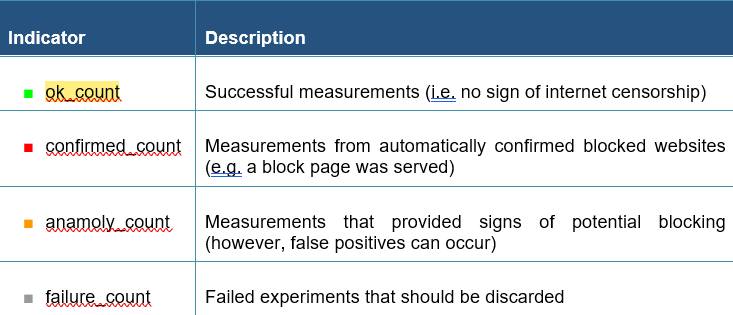
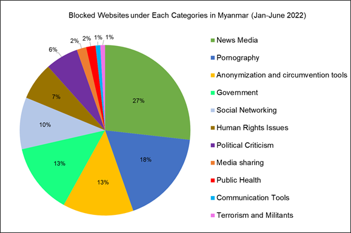
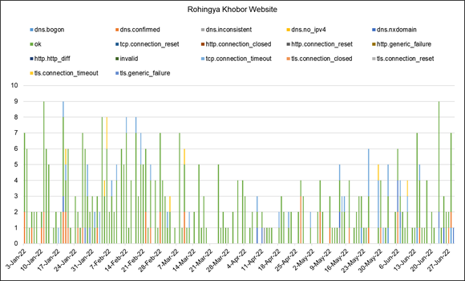
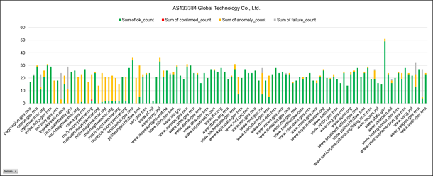
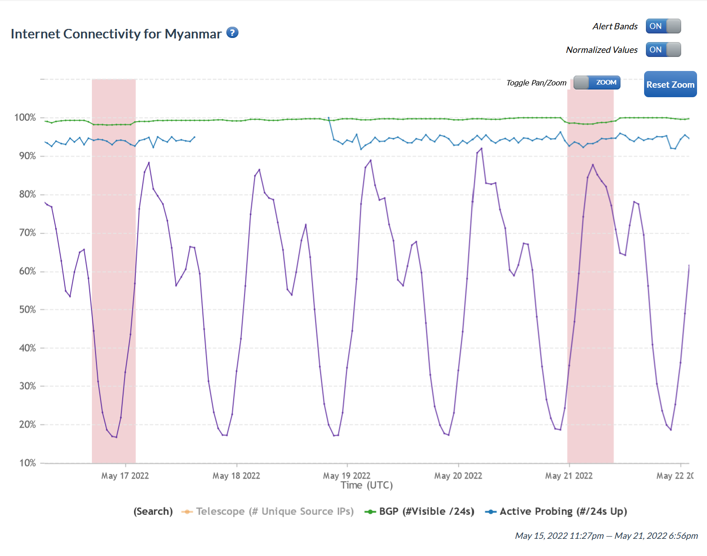
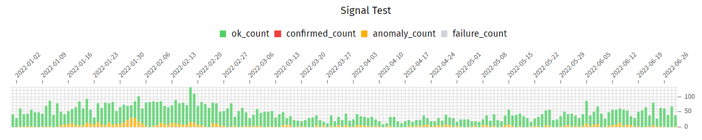
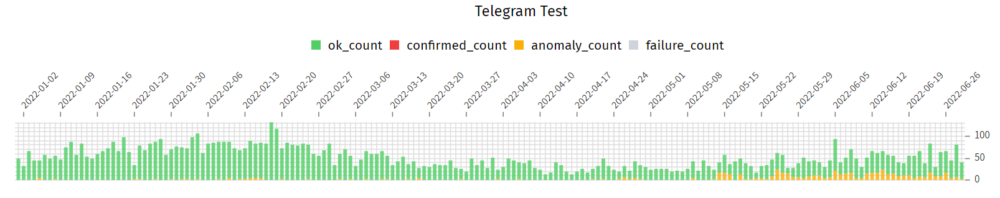

---

title: "iMAP State of Internet Censorship Report 2022 - Myanmar"

description: "This report shares internet censorship during the first half of 2022 in Myanmar using OONI data."

author: " Independent Researcher (Anonymous), Kelly Koh (Sinar Project), Siti Nurliza Samsudin (Sinar Project)"

date: "2022-12-23"

tags: ["myanmar", "censorship", "country-mm", "theme-news_media", "theme-circumvention", "theme-im"]

categories: ["report"]

---

[မြန်မာဘာသာသို့ ပြန်ဆိုပါသည်။](https://imap.sinarproject.org/reports/2022/imap-state-of-internet-censorship-country-report-2022-myanmar/2022-myanmar-translation)

* **Blocking of independent New Media**. 112 out of 2,130 websites were detected 1,473 confirmed blocking counts through 6 local vantages under DNS level interference and HTTP level interference. There were 11 out of 31 websites’ categories from OONI were found as confirmed blocking.  Among 11 categories, News Media was experiential as the highest confirmed blocking measurement, following to pornography to the second largest blocking counts. Interestingly, within 117 government websites, OONI detects 15 websites were blocked from 2 vantage points of 2 ISPs.
* **Sign of internet outages:** IODA and Google Traffic data indicate that no major internet connectivity outages have been reported between January 1, 2022, and June 30, 2022. However, on May 16, 2022, and May 20, 2022, there were alerts regarding an Internet disruption and a possible internet outage.
* **Potential blocking of Instant Messaging Apps**: Apart from this finding period, we found no confirmed blocking in Facebook Messengers, Signal, and Telegram. In spite of this, Facebook Messenger found a large volume of anomalies during the test, which could be a sign of possible blocking. WhatsApp also detected a sign of potential blockings.
* **Circumvention Tools**: Circumvention tools appear to be blocked after the coup. As part of this study, Psiphon and Tor circumvention tools were detected accessible across the local networks.  

## Table of Contents

**[Introduction](#introduction)**

**[Background](#background)**

>> [Political Landscape](#political-landscape)
>
>>> [Post 2010: Reforms](#post-2010-reforms)
>
>>> [Post 2016: Civil military relations](#post-2016-civil-military-relations)
>
>>> [Post 2021: Military coup](#post-2021-military-coup)
>
>> [Legal Environment](#legal-environment)
>
>>> [Constitution of the Republic of Myanmar (2008)](#constitution-of-the-republic-of-myanmar-2008)
>
>>> [Draft Cybersecurity Bill (2021)](#draft-cybersecurity-bill-2021)
>
>>[Reported cases of internet censorship](#reported-cases-of-internet-censorship)

**[Network Landscape and Internet
Penetration](#network-landscape-and-internet-penetration)**

**[Findings of internet censorship in Myanmar](#section-4)**

> [Blocking of Websites](#blocking-of-websites)
>
>> [Blocking of News Media](#blocking-of-news-media)
>
>> [Blocking of Government Websites](#blocking-of-government-websites)
>
> [Internet outages events](#internet-outages-events)
>
> [Blocking of Instant Messaging
> Apps](#blocking-of-instant-messaging-apps)
>
> [Blocking of Circumvention Tools](#blocking-of-circumvention-tools)

**[Acknowledgement of Limitations](#acknowledgement-of-limitations)**

**[Conclusion](#conclusion)**

**[References:](#references)**

**[Acknowledgements](#acknowledgements)**

**[Annex I: Glossary](#annex-mm-1-confirmed-blockings)**

**[Annex II: Methodology](#annex-ii-methodology)**

> [Data](#data)
>
> [Coverage](#coverage)
>
> [How are the network measurements
> gathered?](#how-are-the-network-measurements-gathered)
>
> [How are the network measurements analysed?](#how-are-the-network-measurements-analysed)
>
> [Country code](#country-code)
>
> [Autonomous System Number (ASN)](#autonomous-system-number-asn)
>
> [Date and time of measurements](#date-and-time-of-measurements)
>
> [Categories](#categories)
>
> [IP addresses and other information](#ip-addresses-and-other-information)
>
> [Network measurements](#network-measurements)
>
> [Confirmed vs Heuristics](#confirmed-vs-heuristics)

**[About iMAP](#about-imap)**

**[About Sinar Project](#about-sinar-project)**

## Introduction

Myanmar today is among one of the most censored countries in the world. The country is ranked 17 out of 100 on internet freedom with a score of 9 out of 100 on the Global Freedom Index after the military coup.[^1] The military shut down the internet, took control of the telecommunication infrastructure, blocked social media platforms, and increased intrusive surveillance to maintain their power. After one year of the coup, the Myanmar military arrested  more than 100 journalists under section 505(A) of the penal code law.[^2]

To examine the current state of internet censorship in Myanmar, this report looks at network interference measurements from OONI data during the period from 1 January 2022 to 30 June 2022.

In this study, we utilized OONI data which is run and collected by volunteers in Myanmar, to examine internet censorship in order to assess levels of internet freedom, freedom of expression and access to information. State surveillance has increased privacy and security concerns, immediately after the coup d'état in the country, however the period of assessment for this study was a year after the event.

## Background

Myanmar is situated in Southeast Asia and is bordered on the north and north-east by China, on the east and south-east by Laos and Thailand. According to DATAREPORTAL[^3], the population of Myanmar was 55.02 million in January 2022. 51.8 percent of Myanmar’s population is female, while 48.2 percent of the population is male. Out of 55.02 million, 31.8 percent of the population lived in urban areas, while the majority (68.2 percent) lived in rural areas.

Myanmar is divided into seven states and seven regions, as one union territory which is divided generally by ethnic group. Kachin, Shan, Mon, Kayan, Kayin, Chin, Rakhine and Shan States are predominantly ethnic. As highlighted, almost three quarters of the population in Myanmar live in rural areas, which is largely dominated by ethnic minorities.[^4]

Even though digital and network access has grown rapidly since 2011[^5], the benefits of the digital transformation in Myanmar are spread unevenly especially among women and ethnic minorities from rural communities. Gendered cultural biases limit Myanmar women from accessing both digital tools and skills.[^6] Less women than men use the internet.[^7] Communities living in rural and remote areas, also experience infrastructure barriers to accessing the internet Including, lack of basic infrastructure such as electricity, cellular and internet connections.

Figure 1: Individuals using the Internet (% of population) -[ Myanmar ](https://data.worldbank.org/indicator/IT.NET.USER.ZS?end=2020&locations=MM&start=1990&view=chart)

### Political Landscape

#### Post 2010: Reforms

Myanmar (or Burma as it was previously known) has undergone significant political and economic reforms under military rule for many decades. Until the elections in November 2010 the military junta ruled from 1962 until 2011. In the period of military rule, activists who defended information access, freedom of expression, and human rights were arrested regularly. In 2012, the country transitioned to democratization which seemed to be the end of military rule. Thein Sein who was a former president of Myanmar, becoming the country’s first civilian president[^8] in the first half of the century, however, it was still  under military influence. During that period of time the government released hundreds of political prisoners including the chairperson of NLDs Aung San Suu Kyi from house arrest.  The NLDs party began campaigning in 2011, with Aung San Suu Kyi leading the party in negotiations to attain multiparty democracy. 

#### Post 2016: Civil military relations

In the 2015 general election, the NLD party won the election and became the first non-military governments ending 54 years of military rule. The NLD government has endeavored to maintain a friendly relationship with the junta since coming to power in 2016. The high profile case of persecution of the Rohingya ethnic minority in Rakhine State, shifted the international perception of the state counselor Aung San Suu Kyi who was highly criticized for the denying all accusations of genocide at the International Court of Justice in 2019.[^9]

#### Post 2021: Military coup

Although the Aung San Suu Kyi maintained an amiable relationship with the military regime, General Min Aung Hlaing seized back the power after 10-year non-military ruling. On February 1, 2021, Senior General Min Aung Hlaing and other military leaders staged a coup and detained and charged de facto civilian leader Aung San Suu Kyi who won the landslide general elections in November 2020 with corruption and other crimes. The military claimed that the election was irregular due to unfair voter turnout and detained many NLD party members. In the week after the coup, nationwide peaceful protests took place, known as Spring Revolution, which called for the military to relinquish power.[^10] Street demonstrations occurred throughout the country, civil servants enacted a Civil Disobedience Movement through strikes, a flurry of images, print materials, and graffiti slogans against the military dictatorship were shared physically and via social media. The Human Rights Watch report that the SAC denied the call for the military to relinquish power and killed at least 1,200 protesters and bystanders, including approximately 75 children, and have detained over 8700 government officials, activists, journalists, and civil servants.[^11]

An opposition party was formed consisting of ousted NLD lawmakers, protest leaders, and activists from several minority groups, to counter the SAC and represent a civilian parallel government known as the National Unity Government (NUG). On September 7, 2021, the NUG declared war on the junta and formed an armed division known as the People’s Defense Force (PDF).[^12] By 2022, nationwide civil war between ethnic arms groups, PDF and SAC has been occurring not only in the ethnic territories but also in the cities.[^13] Since the coup, the military imposed martial law in several townships and severely targeted ethnic armed groups. Continued military rule threatens human rights, freedoms of expression and perpetuates persecution against ethnic minorities and women. There was a significant impact of violence perpetrated against women and girls before the coup. Post coup, women and girls are more likely to become victims of emotional and physical abuse due to increased safety concerns. A new United Nations survey has found that women feel unsafe even in their home at night.[^14] 

### **Legal Environment**

A number of laws both directly and indirectly related to censorship in Myanmar. These include the following:

Internet freedom in Myanmar collapsed following the February 2021 military coup reported by Freedom House 2021[^15]. Several laws amended and proposed which affect both directly and indirectly related to freedom of expression online, access to information online, online privacy, censorship and surveillance in the digital space in Myanmar. These include the following:

* Constitution of the Republic of Myanmar (2008)
* Draft Cybersecurity Bill (2021)[^16] 
* Electronic Transactions Law (2004, amended 2021)
* Telecommunications Law (2013)
* Law Protecting the Privacy and Security of Citizens (2017, August 2020)
* Draft Right to Information Bill (2016)
* Myanmar Penal Code (1861)
* Broadcast Law (2015)
* Official Secrets Act (1923)

#### **Constitution of the Republic of Myanmar (2008)**

Among the rights, the 2008 constitution[^17] somewhat guarantees all citizens the right to freedom of expression under Articles 354 and 365. However, the Constitution does not fully protect the right to freedom of expression. Articles 354[^18] (liberty of expression and publication) and 365[^19] (freedom of artistic expression) do not comply with international standards. Furthermore, it threatens freedom of expression for journalists and human rights defenders, said Human Rights Watch[^20].

#### **Draft Cybersecurity Bill (2021)**[^21]

A draft Cybersecurity Bill was first introduced in 2019[^22], but it was abandoned. This Cybersecurity bill (1.0) was again proposed by the State Administration Council a week after the coup in 2021. On 28 January 2022[^23], the military revised the draft law (Law 2.0) by requesting a few stakeholders’ feedback. Based on Free Expression Myanmar (FEM) analysis, the new draft Cyber Law (2.0) repeats and adds on the repressive provisions of previous drafts (2021), seriously threatening the safety and security of Myanmar’s digital space[^24]. This amendment further threatens privacy, information access and freedom of expression. The Asia legal adviser at Human Rights Watch, Linda Lakhdhir, told Human Rights Watch that the proposed cybersecurity law would consolidate the junta’s ability to conduct pervasive censorship and surveillance and hamper the operation of businesses in Myanmar”[^25] as this law does not only apply to social media and other content-sharing platforms, but to digital marketplaces, search engines, financial services, data processing services, and communications services providing messaging or video calls and games.

·        **_Electronic Transactions Law (2004, 2014 and amended 2021)_**

The Myanmar Electronic Transactions Law[^26], originally enacted in 2004, and was amended in 2014 to remove some problematic provisions. On February 15, 2021, after the military coup, the SAC amended this law again without forewarning and opportunity to consult. This new amendment mostly copies the 2021 Draft Cybersecurity Bill, including Articles 9/38, 38a, 38d and 38e. This new crime amendment will restrict further digital rights.

The 2021 amendment extends criminalizing antiregime statements which further restricts information access and freedom of expression. The new crimes and their long prison sentences will create significant risk to the right to freedom of expression especially in the digital space. Dozens of journalists have been forced to flee following the military’s crackdown on press freedoms. According to the Committee to Protect Journalists (CPJ), more than 100 journalists were arrested under criminal charges in 2021[^27].

### **Reported cases of internet censorship**

The internet in Myanmar was introduced in the early 2000 when the first internet connection was established after the former president Thein Sein under a new regime of civilian government, rejected almost all forms of censorship by opening internet access for all.[^28] Since 2011, the internet accessibility in Myanmar seems relatively positive until 2019, during ongoing conflict between the military junta and ethnic armed groups in Rakhine state, where the Rohingya ethnic group was specifically targeted. The Ministry of Transportation and Communication, ordered four internet service providers to suspend internet access including mobile internet services to nine townships in northern Rakhine state and southern Chin state.[^29] Together, more than 200 websites and several Indigenous news sites were blocked.[^30] Free Expression Myanmar reports that digital freedom of expression in Myanmar declined between  2018 to 2020[^31], see Table 1. 

At the beginning of the COVID-19 pandemic a proliferation of fake news started spreading regarding the pandemic which was challenging for the government to counter.  Then the Myanmar Press Council released a press statement including a list of sites viewed as spreading “fake news”.[^32] The 2020 OONI report, showed that Internet Service Providers (ISPs) in Myanmar received a directive from the Ministry of Transport and Communications to block 230 websites.[^33] Telenor Myanmar (previously renamed as ATOM) disclosed that they blocked access to 230 websites, but the list of these URLs has not been published. However, the OONI measurement revealed that 174 domains had been blocked through DNS by Telenor Myanmar under the pornography and news media categories (under the pretext that these sites could potentially be viewed as “fake news”). The Myanmar Press Council’s list of blocked domains contain sites belonging to news outlet and content relating to News pornography. In March 2020, the Frontier reported that 50 “fake news”[^34] sites including ethnic media outlets, such as Rakhine-based Development Media Group (DMG) and Narinjara were blocked under section 77 of the Telecommunications Law. According to Myanmar illegal contents such as drugs, alcohol, or gambling, and pornography are highly restricted in addition to prohibition of sexual education content and homosexuality.[^35] By far the most censored content online is that of political dissidents.  Any criticism or anti-military content, directly or indirectly  in opposition to the current military authorities can lead to jail sentences under existing laws. Human Rights Watch reported 98 journalists arrested for violating section 505A of the penal code according to the Assistance Association for Political Prisoners, as of October 25, 2021.[^36] Since the passing of the year anniversary of the coup d'etat, more than 100 journalists have been arrested.[^37]

February 1, 2021, marked significant disruptions to the country's internet connection. Digital access became limited for all in Myanmar, exceptionally impacted were ethnic groups living in conflict-affected zones, including the Rohingya. The military regime banned local ethnic news outlets,[^38] as well as satellite TV and radio, which are the dominant forms of access to information in rural areas.[^39] Additionally, Freedom House reported that 2000+ websites have been blocked from February to August 2021, under the Telecommunication Law[^40] and Myanmar’s low ranking in 2018 with 36 points dropped further to 17 points in 2021 (see Table 1). 

Table 1. Freedom on the Net 2021 country report

On February 3, 2021, Access Now reported that the military ordered all internet providers to block social media such as Facebook, including Instagram, WhatsApp, and Messenger[^41]. Almost half of the population[^42] in Myanmar use Facebook to access and contribute information. Facebook is synonymous with the internet for the user in Myanmar. Although the military regime restricted using Facebook in Myanmar, citizens in Myanmar used circumvention tools like virtual private network (VPN) to overcome Facebook access restriction. To further restrict the flow of information to and from the country, the regime is set to ban VPN use.[^43] On February 5, 2022 Privacysavvy reported that Twitter and Instagram were also blocked.[^44]

Surveillance of the Myanmar population has increased significantly through developing technical tools,amending laws and introduction of the Cybersecurity bill to monitor and target critics and protesters. The New York Times reported that the military uses dual-purpose surveillance, hacking, and forensic technology to monitor and target critics and protesters.[^45] For example, by installing spyware to private communications, they can monitor users via listening conversation on phone, view private messages, and track people’s locations. Furthermore, the military’s intent to introduce a new Cybersecurity Bill[^46] [^47] is likely to increase digital control, suppress free speech and access to information across Myanmar. 

All in all, Myanmar today is among one of the most censored countries in the world. Through extreme restrictions and control the military regime has limited internet access through  online surveillance, intimidation and threats, physical shutdowns and through laws and regulations that if violated incurred  criminal charges with heavy punishments. The military junta’s main objective here appears to be total control over  the telecommunication infrastructure in an effort to block social media platforms, and increase intrusive surveillance to maintain power and crush dissent.

## Network Landscape and Internet Penetration

Digital access has grown quickly in Myanmar since its relatively recent entry into the digital revolution in 2011. Increasingly affordable SIMs and smartphones, combined with more internet service providers and high-speed connection access points has meant that as at January 2021, there were 69.43 million mobile SIMs connections[^48] and 23.65 million internet users,[^49] compared to a total population of Myanmar of 54.61 million in 2021, amounting to half the population of Myanmar before the military coup. 

The Myanmar government began to liberalize towards a digital transformation and invited private investments into the development of communications infrastructure and technology. Similarly, internet censorship also declined for the first time during this period of historical change. International news sites, including Voice of America, BBC, and Radio Free Asia, and local news such as the Democratic Voice of Burma and Irrawaddy, long blocked by Burmese censors, were suddenly accessible.[^50] The transformation saw the government's openness to the world, as well as significant relaxation of its censorship policies, noted in Freedom Express, which showed that internet censorship had declined slightly between 2018 to 2020.

Myanmar’s four telecommunications network operators[^51] - Myanmar Posts and Telecommunications (MPT) is a state owned enterprise under the supervision of the Ministry of Transport and Communication. Ooredoo is a subsidiary of the Qatari Ooredoo Group but intends to sell it to Singapore vehicle Nine Communications Pte. Ltd, with an enterprise value of $576 million, according to Ooredoo Group announcement on September 8, 2022.[^52] Telenor (a Norwegian firm) recently withdrew and sold to the M1 Group, which has a master lease agreement with military-backed Mytel.[^53] Similarly, while there are more than 30 internet service providers[^54] licensed under the Ministry of Transport and Communications (MoTC) but the market is dominated by four main ISPs: Myanmar Net, Myanmar MPT, MyTel, and 5BB.[^55] Freedom House reported that the fixed-line internet speed is slower than average after the coup.[^56] Since February 2021, all media, internet, and mobile connections have been fully controlled by the State Administrative Council (SAC)[^57]  affecting internet speeds and social media platform access and websites have been banned.[^58]

Though internet users rapidly increased in the previous year, the unexpected transition back to high censorship and Internet restrictions has seen periodic blackouts of the internet, inability to use VPN, reduction of internet speed, increased mobile data and SIMs card price, telecommunications infrastructure problem, and unstable electricity supply affecting not just connectivity but general living standards.  The general impact has resulted in a general reduction of online usage, mainly due to increased fear and insecurity. Additionally, pro-democracy protectors or Civil Disobedience Movement (CDM) advocates proactively discourage the use of mobile connections using telco-services that are associated with military junta, further reducing internet usage and online activities.  

Regardless, the systematic and nationwide internet shutdowns for 8 hours from 1 am to 9 am was mandated immediately after the military coup took over and lasted for approximately two weeks[^59] (see figure 2).[^60] Although internet connections have relatively been restored, the military had continued to crackdown on internet usage and accessibility by repeatedly reducing the network speed, and blocking mobile networks across 22 townships[^61] until now.

Figure 2: Internet connectivity, Myanmar: February 15, 2022 to February 16, 2022 UTC

## 

## Findings of internet censorship in Myanmar

Open Observatory of Network Interference (OONI) is a software that monitors free and open internet disruptions to help by increasing transparency around internet censorship around the world. The measurements of internet censorship can be carried out by[ OONI Run](https://run.ooni.io/) and[ OONI Probe](https://ooni.org/install/). The results of the measurements are recorded on[ OONI Explorer](https://explorer.ooni.org/search?since=2022-07-22&until=2022-08-22&failure=false&probe_cc=MM) and the measurement consists of many different[ tests](https://ooni.org/nettest/#boxes).

**Web connectivity test** is to measure whether websites are blocked by means of DNS tampering, TCP/IP blocking or by a transparent HTTP proxy. **Instant messaging** is to measure the reachability of WhatsApp, Facebook Messenger, Telegram, and Signal, within a tested network. **Circumvention** is to test the blocking of circumvention tools such as Psiphon, Tor or RiseupVPN. **Performance test** is to measure the speed and performance of the network by [NDT](https://ooni.org/nettest/ndt/) (Network Diagnostic Test) and to measure video streaming performance by [DASH](https://ooni.org/nettest/dash/) (Dynamic Adaptive Streaming over HTTP). **Middleboxes** test consists of  HTTP Invalid Request Line Test and HTTP Header Field Manipulation Test, to detect the presence of network components.

The test results of OONI measurements are determined by the indicators listed in Table 2. Table 3 shows the breakdown of OONI measurements on web connectivity, instant messaging and circumvention tools from January to June 2022.

Table 2. Indicators of OONI Measurements

Table 3. The Breakdown of OONI Measurements for Various Tests

### Blocking of Websites

The websites to be tested are distinguished into 30 categories.

During the first half-year of 2022, 753,018 OONI measurements were collected from 2,130 websites through 37 vantage points in Myanmar. From this total, it was seen that 88.8% (668,881) were OK, 9.9% (74,711) were anomalies, 1.1% (7,953) were failed measurements and 0.2% (1,473) were confirmed blockings.

Among those 2,130 websites, there are 112 blocked websites (5.26% of 2,130) of 11 categories with 1,473 blocking times through 6 vantage points from 6 internet service providers (ISPs). The ISPs  blocking the websites are:

1.  Frontiir Co., Ltd.
2. Myanmar Net
3. Global Technology Co., Ltd.
4. Atom Myanmar Ltd. (former Telenor Myanmar)
5. Fortune Telecom Co., Ltd.
6. Myanmar Information Highway Ltd.

The following chart illustrates the blocking of websites of 11 categories in Myanmar from January to June 2022, based on OONI data.

 
Figure 3: Websites categories with blocking counts

In order to filter out the false positives of the OONI measurement and to confirm the blocking fingerprints of the measurement, the heuristics analysis has also been applied to these 112 blocked websites from OONI measurements. The concepts of the heuristics are as follows: 

1. Does the IP in question have a PTR record pointing to something that looks like a blockpage (eg. a hostname that is related to the ISP)?
2. What information can we get about the IP by doing a whois lookup?
3. Is the ASN of the IP the same as the network where the measurement was collected?
4. Do we get a valid TLS certificate for one of the domains in question when doing a TLS handshake and specifying the SNI?

The analysis confirms again that these 112 websites are blocked by ISPs with the use of blocking types such as DNS level interference and HTTP level interference. 

Figure 4: 6 ISPs blocked the websites during Jan to June 2022

According to the test results, News media websites are mainly blocked and secondly Pornography websites whereas Social networking websites are the ones with the largest blocking times of 683. Please see Table 5 and Figure 5 .

| **Item** | **Category of Blocked Websites**      | **Category Code** | **Internet Service Providers (ISPs)**                                                                    | **Number of Websites** | **Blocking Times** |
|-------|-------------------|-----------|------------------|-----------|---------|
| 1        | News Media                            | NEWS              | Atom Myanmar Ltd., Global Technology Co., Ltd.                                                           | 30                     | 119                |
| 2        | Pornography                           | PORN              | Atom Myanmar Ltd.                                                                                        | 20                     | 48                 |
| 3        | Anonymization and circumvention tools | ANON              | Atom Myanmar Ltd., Myanmar Information Highway Ltd.                                                      | 15                     | 41                 |
| 4        | Government                            | GOVT              | Global Technology Co., Ltd., Atom Myanmar Ltd.                                                           | 15                     | 47                 |
| 5        | Social Networking                     | GRP               | Frontiir Co. Ltd, Myanmar Net, Global Technology Co., Ltd., Atom Myanmar Ltd., Fortune Telecom Co., Ltd. | 11                     | 683                |
| 6        | Human Rights Issues                   | HUMR              | Global Technology Co., Ltd., Atom Myanmar Ltd., Fortune Telecom Co., Ltd.                                | 8                      | 34                 |
| 7        | Political Criticism                   | POLR              | Global Technology Co., Ltd., Atom Myanmar Ltd.                                                           | 7                      | 27                 |
| 8        | Media sharing                         | MMED              | Frontiir Co. Ltd, Myanmar Net, Atom Myanmar Ltd., Fortune Telecom Co., Ltd.                              | 2                      | 383                |
| 9        | Public Health                         | PUBH              | Frontiir Co. Ltd, Myanmar Net, Atom Myanmar Ltd.                                                         | 2                      | 88                 |
| 10       | Communication Tools                   | COMT              | Atom Myanmar Ltd.                                                                                        | 1                      | 2                  |
| 11       | Terrorism and Militants               | MILX              | Atom Myanmar Ltd.                                                                                        | 1                      | 1                  |
|          |                                       |                   | Total                                                                                                    | 112                    | 1473               |

Table 5. Blocked websites in Myanmar (Jan-June 2022)

Figure 5: Breakdown of Blocked Websites under Categories

#### Blocking of News Media

During the first half of 2022, 30 websites of News Media were blocked by 2 ISPs: Atom Myanmar Ltd. with the network AS133385 and Global Technology Co., Ltd. with AS133384.

Figure 6: ISPs blocked News Media websites

Among the 30 News Media websites, we have selected 3 websites: [http://karennews.org/](http://karennews.org/), 

[https://rohingyakhobor.com/](https://rohingyakhobor.com/), and [https://www.rohingyanewsbank.com/](https://www.rohingyanewsbank.com/) for detailed findings of heuristics. 

Karen News website is partly blocked by 2 ISPs with the use of DNS tempering and TCP/IP blocking (See Figure 7) but ISPs sometimes give the access in some days during the testing period (See Figure 8). The blocking times increase in May and June 2022.

 

 Figure 7: Karen News page blocked by ISPs

 

Figure 8: Measurements of Karen News page

The following charts describe that Rohingya Khobor and Rohingya News Bank sites are also blocked by DNS tempering (dns.confirmed) and TCP/IP blocking (tcp.connection_timeout) during the testing period and the websites are sometimes accessible.   

 

Figure 9: Measurements of Rohingya Khobor page

 

Figure 10: Measurements of Rohingya News Bank page

#### Blocking of Government Websites

In the case of blocking the government websites, the websites are referred to as those of CRPH (Committee Representing Pyidaungsu Hluttaw) and NUG (National Unity Government). The State Administration Council (SAC), the country's ruling military junta, has declared the NUG and CRPH illegal. This becomes the reason for blocking. Those 15 websites are blocked by 2 ISPs: Atom Myanmar Ltd. with the network AS133385 and Global Technology Co., Ltd. with AS133384. The following Table states the 15 blocked websites under Government categories with the blocking times from 2 vantage points of 2 ISPs.

Table 6. Blocked Websites under Government Categories

OONI measurements recorded the same 117 Government websites for each ISPs. Apart from those 15 sites, the others are accessible and sometimes likely blocked. The following charts describe the measurements on the government websites by 2 ISPs during the testing period.

Figure 11: Measurements on Government Websites from Global Technology Co., Ltd.

Figure 12: Measurements on Government Websites from Atom Myanmar Ltd.

### Internet outages events

Internet access was apparently stable until Monday February 1, 2021 while the military regime took power, shutting down the entire internet connection approximately from 3:00 am Myanmar local time until 8:00 am. That was the first nationwide internet outage after a decade of digital transformation in which internet connectivity in Myanmar has fallen to 50% from ordinary levels reported by Netblocks (see Figure 13).[^62] Then internet disruption repeatedly occurs in the year of 2021 (see the OONI previous [report](https://ooni.org/post/2021-myanmar-internet-blocks-and-outages/)).[^63]

Figure 13: Network Connectivity: January 30, 2022 to February 1, 2022 UTC (Source: Netblocks)

In this finding, we utilized  [Internet Outage Detection and Analysis (IODA)](https://ioda.inetintel.cc.gatech.edu/country/MM?from=1641056400&until=1648745999) and  [Google traffic](https://transparencyreport.google.com/traffic/overview?hl=en&fraction_traffic=start:1640995200000;end:1656547199999;product:19;region:MM&lu=fraction_traffic) data to observe internet connectivity outages in Myanmar. The Internet Outage Detection and Analysis (IODA) is a project to measure internet outages worldwide in near real-time. IODA uses four measurement[^64] including google traffic[^65] and inference methods to track and identify internet outages. IODA provides access to their measurements through their Dashboard, which allows users to explore internet outages with country, region, and AS level of granularity. In this observation, we show only two measurements ([Routing (BGP), Active Probing](https://ioda.inetintel.cc.gatech.edu/help)) from the IODA dashboard and Google transparency report dashboard. 

Figure 14: Internet connectivity status in Myanmar: January 01, 2022 to March 30, 2022 ([IODA Dashboard, 2022](https://ioda.inetintel.cc.gatech.edu/country/MM?from=1641056400&until=1648659599))

Figure 15: Internet connectivity status in Myanmar: April 01, 2022 to June 30, 2022 ([IODA Dashboard, 2022](https://ioda.inetintel.cc.gatech.edu/country/MM?from=1641056400&until=1648659599))

Figure 16: Internet connectivity alert in Myanmar: May 15, 2022 to May 21, 2022 ([IODA Dashboard, 2022](https://ioda.inetintel.cc.gatech.edu/country/MM?from=1641056400&until=1648659599))

Figure 17: Internet connectivity status in Myanmar: January 01, 2022 to June 30, 2022 ([Google Transparency Report, 2022](https://transparencyreport.google.com/traffic/overview?hl=en&fraction_traffic=start:1640995200000;end:1656547199999;product:19;region:MM&lu=fraction_traffic))

According to public data source [IODA](https://ioda.inetintel.cc.gatech.edu/country/MM?from=1641056400&until=1648745999) and [Google traffic](https://transparencyreport.google.com/traffic/overview?hl=en&fraction_traffic=start:1640995200000;end:1656547199999;product:19;region:MM&lu=fraction_traffic)  data, there were no significant internet connectivity outages between January 1, and June 30, 2022. However, IODA detects that there was an alert of internet connectivity drop on May 16, 2022 and May 20, 2022 (as figure 9 shown) measured by ([Routing (BGP), Active Probing](https://ioda.inetintel.cc.gatech.edu/help) and Google traffic) that appear a sign of internet connectivity outages. In some ways, mobile and wifi internet outages occurred in some regions and states including Sagaing region especially in the conflict-zone due to electricity shortage and political conflict.[^66] 

### Blocking of Instant Messaging Apps

In testing the blocking of Instant Messaging Apps, we can measure for Facebook Messenger, Signal, Telegram and WhatsApp.

OONI’s Facebook Messenger test is to examine the reachability of Facebook Messenger within a tested network by a TCP connection and DNS lookup to Facebook’s endpoints over the vantage point of the user. The blocking occurs if TCP connections to Facebook’s endpoints fail or/and if DNS lookups to domains associated with Facebook do not resolve to IP addresses allocated to Facebook.

According to OONI’s measurements, there were more than 90% anomalies across 3 ASNs (AS9988, AS139711 and AS141704). Hence it may be concluded that Facebook Messenger is likely blocked due to TCP connections failing by preventing the target IP from being reachable.

Figure 18: Measurement on Facebook Messenger

Signal Test is to measure the reachability of the Signal messaging app within a tested network. According to the OONI measurements from January to June 2022, most of Signal TestsTeat are found accessible. On the other hand, some results show the anomaly presenting signs of potential network interference.

Figure 19: Measurement on Signal App

Telegram Test is to examine the reachability of Telegram’s app and web version within a tested network. The below chart shows that almost all of Telegram tests reported continued access during the testing period. It is likely blocked in May and June 2022. 

 

Figure 20: Measurement on Telegram App

WhatsApp Test is designed to examine the reachability of both WhatsApp’s app and web version within a tested network. The measurements show  that WhatsApp was  accessible in Myanmar during the testing period but with signs of potential blocking on some vantage points.

---

Figure 21: Measurement on WhatsApp

### Blocking of Circumvention Tools

Psiphon is a free and open source tool that utilizes VPN, SSH, and HTTP proxy technology for censorship circumvention. The Psiphon VPN essentially serves as a tunnel that enables you to circumvent censorship. The OONI Probe Psiphon test provides an automated way of examining whether the Psiphon app works in a tested network. In almost the whole research period, Psiphon works in the tested network and can be used to circumvent internet censorship.

Figure 22: OONI data on the testing of Psiphon circumvention tool

Tor is a free and open software for anonymity, privacy, and censorship circumvention, and OONI Tor Test examines whether Tor works in a tested network. In Jan-June 2022, Tor was reachable in Myanmar.

 

Figure 23: OONI data on the testing of Psiphon circumvention tool

## Acknowledgement of Limitations

Through this study, various limitations were found, which could reflect on the internet censorship finding. 

Firstly, the examination might not include sufficient test lists and measurements counts for this study period that could reflect the finding. After the coup, the military government highly restricted cyber users who could be threatened to run the OONI run and test lists with local vantage points in Myanmar.

Another limitation is unspecified categories. Within the study period, some blocked sites are detected that do not fall into any of the 30 categories. Thus, in this finding, only 112 websites that are categorized under the CitizenLab test lists are reported here in detail. The remaining blocked sites that are unspecified, are not reported in this report but included in a separate sheet in Annex MM-1.

## Conclusion

The state of internet freedom was improved until the 2019 Rohingya crisis, and it went downhill after February 1, 2022, when the military regime took power in the country. Myanmar now became among one of the most censored countries in the world. The military took control of the telecommunication infrastructure, blocked social media platforms, and shut down the internet to increase its surveillance.

Consequently, multiple censorship events have been reported after the coup. In order to comprehend internet censorship, the independent researcher and iMAP team collected and analyzed network interference measurements between 1 January 2022 and 30 June 2022 to find out whether sites, instant messaging apps, and censorship circumvention tools were blocked or not. 

Throughout OONI’s study, it has been discovered that internet censorship has increased in Myanmar to a wider extent than ever before when comparing it to the 2017 report. According to 2022 OONI measurement analysis, 112 out of 2,130 websites within eleven categories in Myanmar are found as confirmed blocking sites by 6 local networks relating DNS and HTTP level interference. Among 112 websites under 11 categories, News media category is the category with the highest number of confirmed blocked websites, including ethnic independent News media[ http://karennews.org/](http://karennews.org/) and[ https://www.rohingyanewsbank.com/](https://www.rohingyanewsbank.com/) censored by way of DNS tempering and TCP/IP blocking. OONI detected 15 out of 117 government websites were confirmed blocking due to multiple government actors against one another. In addition to this finding, there was no sign of confirmed blocking of Instant Messaging Apps, however, Facebook messenger and WhatsApp were found to have a high number of anomalies during the tests, which could be concluded as confirmed blocking. During the test, circumvention tools such as Tor and Psiphon appear to be reachable across the Myanmar local networks where OONI tests were run. 

Finally, in comparison to the data shown in Myanmar’s report in 2017, which presented only five sites of TCP/IP and HTTP blocking, the state of internet censorship is showing a huge change by now with its significant increase and the decline of internet freedom.

## References

Xynou, M. (2021). _A multi-perspective view of Internet censorship in Myanmar._ OONI. [https://ooni.org/post/2021-multiperspective-view-internet-censorship-myanmar/](https://ooni.org/post/2021-multiperspective-view-internet-censorship-myanmar/)

## Acknowledgements

Foremost, we would like to thank the Open Observatory of Network Interference for their work on this project. We would also like to thank the anonymous volunteers in Myanmar who have run the OONI Probe and provide this data. If not, this study would not be possible.  

## Annex MM-1: Confirmed blockings

| **No.** | **Domain**                           | **Category Description**              | **Confirmed by OONI** | **Confirmed by Heuristics** |
|---------|-------------------|---------------|---------------|---------------|
| 1       | www.beer.com                         | Alcohol & Drugs                       | \#N/A                 | TRUE                        |
| 2       | www.budweiser.com                    | Alcohol & Drugs                       | \#N/A                 | TRUE                        |
| 3       | www.cannaweed.com                    | Alcohol & Drugs                       | \#N/A                 | TRUE                        |
| 4       | anonymouse.org                       | Anonymization and circumvention tools | TRUE                  | TRUE                        |
| 5       | hola.org                             | Anonymization and circumvention tools | TRUE                  | TRUE                        |
| 6       | nordvpn.com                          | Anonymization and circumvention tools | TRUE                  | TRUE                        |
| 7       | ooni.torproject.org                  | Anonymization and circumvention tools | TRUE                  | TRUE                        |
| 8       | openvpn.net                          | Anonymization and circumvention tools | TRUE                  | TRUE                        |
| 9       | protonvpn.com                        | Anonymization and circumvention tools | TRUE                  | TRUE                        |
| 10      | speedify.com                         | Anonymization and circumvention tools | TRUE                  | TRUE                        |
| 11      | strongvpn.com                        | Anonymization and circumvention tools | TRUE                  | TRUE                        |
| 12      | surfshark.com                        | Anonymization and circumvention tools | TRUE                  | TRUE                        |
| 13      | www.hidemyass.com                    | Anonymization and circumvention tools | TRUE                  | TRUE                        |
| 14      | www.hotspotshield.com                | Anonymization and circumvention tools | TRUE                  | TRUE                        |
| 15      | www.ipvanish.com                     | Anonymization and circumvention tools | TRUE                  | TRUE                        |
| 16      | www.megaproxy.com                    | Anonymization and circumvention tools | TRUE                  | TRUE                        |
| 17      | www.privateinternetaccess.com        | Anonymization and circumvention tools | TRUE                  | TRUE                        |
| 18      | www.torproject.org                   | Anonymization and circumvention tools | TRUE                  | TRUE                        |
| 19      | opera.com                            | Communication Tools                   | TRUE                  | TRUE                        |
| 20      | adultfriendfinder.com                | Online Dating                         | \#N/A                 | TRUE                        |
| 21      | www.okcupid.com                      | Online Dating                         | \#N/A                 | TRUE                        |
| 22      | www.gambling.com                     | Gambling                              | \#N/A                 | TRUE                        |
| 23      | moh.nugmyanmar.org                   | Government                            | TRUE                  | TRUE                        |
| 24      | crphmyanmar.org                      | Government                            | TRUE                  | TRUE                        |
| 25      | gov.nugmyanmar.org                   | Government                            | TRUE                  | TRUE                        |
| 26      | mod.nugmyanmar.org                   | Government                            | TRUE                  | TRUE                        |
| 27      | moe.nugmyanmar.org                   | Government                            | TRUE                  | TRUE                        |
| 28      | mofa.nugmyanmar.org                  | Government                            | TRUE                  | TRUE                        |
| 29      | mohadm.nugmyanmar.org                | Government                            | TRUE                  | TRUE                        |
| 30      | mohai.nugmyanmar.org                 | Government                            | TRUE                  | TRUE                        |
| 31      | mohr.nugmyanmar.org                  | Government                            | TRUE                  | TRUE                        |
| 32      | moic.nugmyanmar.org                  | Government                            | TRUE                  | TRUE                        |
| 33      | mol.nugmyanmar.org                   | Government                            | TRUE                  | TRUE                        |
| 34      | monrec.nugmyanmar.org                | Government                            | TRUE                  | TRUE                        |
| 35      | mopfi.nugmyanmar.org                 | Government                            | TRUE                  | TRUE                        |
| 36      | mowyca.nugmyanmar.org                | Government                            | TRUE                  | TRUE                        |
| 37      | nugmyanmar.org                       | Government                            | TRUE                  | TRUE                        |
| 38      | www.4chan.org                        | Social Networking                     | \#N/A                 | TRUE                        |
| 39      | abs.twimg.com                        | Social Networking                     | TRUE                  | TRUE                        |
| 40      | edge-chat.instagram.com              | Social Networking                     | TRUE                  | TRUE                        |
| 41      | external.xx.fbcdn.net                | Social Networking                     | TRUE                  | TRUE                        |
| 42      | fbcdn.net                            | Social Networking                     | TRUE                  | TRUE                        |
| 43      | i.instagram.com                      | Social Networking                     | TRUE                  | TRUE                        |
| 44      | scontent.xx.fbcdn.net                | Social Networking                     | TRUE                  | TRUE                        |
| 45      | static.xx.fbcdn.net                  | Social Networking                     | TRUE                  | TRUE                        |
| 46      | staticxx.facebook.com                | Social Networking                     | TRUE                  | TRUE                        |
| 47      | upload.twitter.com                   | Social Networking                     | TRUE                  | TRUE                        |
| 48      | video.twimg.com                      | Social Networking                     | TRUE                  | TRUE                        |
| 49      | www.instagram.com                    | Social Networking                     | TRUE                  | TRUE                        |
| 50      | cultdeadcow.com                      | Hacking Tools                         | \#N/A                 | TRUE                        |
| 51      | www.justiceformyanmar.org            | Human Rights Issues                   | TRUE                  | TRUE                        |
| 52      | hiburma.net                          | Human Rights Issues                   | TRUE                  | TRUE                        |
| 53      | karen.kicnews.org                    | Human Rights Issues                   | TRUE                  | TRUE                        |
| 54      | kicnews.org                          | Human Rights Issues                   | TRUE                  | TRUE                        |
| 55      | progressivevoicemyanmar.org          | Human Rights Issues                   | TRUE                  | TRUE                        |
| 56      | www.athanmyanmar.org                 | Human Rights Issues                   | TRUE                  | TRUE                        |
| 57      | www.bhrn.org.uk                      | Human Rights Issues                   | TRUE                  | TRUE                        |
| 58      | www.savemyanmar.org                  | Human Rights Issues                   | TRUE                  | TRUE                        |
| 59      | gaytoday.com                         | LGBT                                  | \#N/A                 | TRUE                        |
| 60      | www.facebook.com                     | LGBT                                  | TRUE                  | TRUE                        |
| 61      | www.gaystarnews.com                  | LGBT                                  | \#N/A                 | TRUE                        |
| 62      | www.nifty.org                        | LGBT                                  | \#N/A                 | TRUE                        |
| 63      | www.samesexmarriage.ca               | LGBT                                  | \#N/A                 | TRUE                        |
| 64      | www.arakanarmy.net                   | Terrorism and Militants               | TRUE                  | TRUE                        |
| 65      | www.pslftnla.org                     | Terrorism and Militants               | \#N/A                 | TRUE                        |
| 66      | channelmyanmar.org                   | Media sharing                         | TRUE                  | TRUE                        |
| 67      | burmachannel.website                 | News Media                            | TRUE                  | TRUE                        |
| 68      | rohingyakhobor.com                   | News Media                            | TRUE                  | TRUE                        |
| 69      | 7day.news                            | News Media                            | TRUE                  | TRUE                        |
| 70      | barnyarbarnyar.com                   | News Media                            | TRUE                  | TRUE                        |
| 71      | celemedia.club                       | News Media                            | TRUE                  | TRUE                        |
| 72      | facebook.com                         | News Media                            | TRUE                  | TRUE                        |
| 73      | karennews.org                        | News Media                            | TRUE                  | TRUE                        |
| 74      | maharmedianews.com                   | News Media                            | TRUE                  | TRUE                        |
| 75      | medicalsharing.website               | News Media                            | TRUE                  | TRUE                        |
| 76      | mizzima.com                          | News Media                            | TRUE                  | TRUE                        |
| 77      | mmrednews.com                        | News Media                            | TRUE                  | TRUE                        |
| 78      | mrattkthu.com                        | News Media                            | TRUE                  | TRUE                        |
| 79      | myanmar-now.org                      | News Media                            | TRUE                  | TRUE                        |
| 80      | nenow.in                             | News Media                            | TRUE                  | TRUE                        |
| 81      | santhitsa.net                        | News Media                            | TRUE                  | TRUE                        |
| 82      | ssppssa.org                          | News Media                            | TRUE                  | TRUE                        |
| 83      | thatinhman.com                       | News Media                            | TRUE                  | TRUE                        |
| 84      | trend.lwinpyin.com                   | News Media                            | TRUE                  | TRUE                        |
| 85      | www.boommyanmar.com                  | News Media                            | TRUE                  | TRUE                        |
| 86      | www.dmgburmese.com                   | News Media                            | TRUE                  | TRUE                        |
| 87      | www.irrawaddy.com                    | News Media                            | TRUE                  | TRUE                        |
| 88      | www.m-mediagroup.com                 | News Media                            | TRUE                  | TRUE                        |
| 89      | www.mizzima.com                      | News Media                            | TRUE                  | TRUE                        |
| 90      | www.mizzimaburmese.com               | News Media                            | TRUE                  | TRUE                        |
| 91      | www.narinjara.com                    | News Media                            | TRUE                  | TRUE                        |
| 92      | www.newsvsinformation.com            | News Media                            | TRUE                  | TRUE                        |
| 93      | www.phothutaw.com                    | News Media                            | TRUE                  | TRUE                        |
| 94      | www.rohingyanewsbank.com             | News Media                            | TRUE                  | TRUE                        |
| 95      | www.sbs.com.au                       | News Media                            | TRUE                  | TRUE                        |
| 96      | www.thestateless.com                 | News Media                            | TRUE                  | TRUE                        |
| 97      | www.thithtoolwin.com                 | News Media                            | TRUE                  | TRUE                        |
| 98      | mc.warnaing.website                  | News Media                            | \#N/A                 | TRUE                        |
| 99      | tipsmyanmarnews.com                  | News Media                            | \#N/A                 | TRUE                        |
| 100     | burmese.narinjara.com                | News Media                            | \#N/A                 | TRUE                        |
| 101     | nwayoomyanmar.com                    | Political Criticism                   | TRUE                  | TRUE                        |
| 102     | 1221cd.org                           | Political Criticism                   | TRUE                  | TRUE                        |
| 103     | aungsanu.com                         | Political Criticism                   | TRUE                  | TRUE                        |
| 104     | burmacampaign.org.uk                 | Political Criticism                   | TRUE                  | TRUE                        |
| 105     | twitter.com                          | Political Criticism                   | TRUE                  | TRUE                        |
| 106     | www.cdmmyanmar.org                   | Political Criticism                   | TRUE                  | TRUE                        |
| 107     | www.isupportmyanmar.com              | Political Criticism                   | TRUE                  | TRUE                        |
| 108     | www.mmcdm.org                        | Political Criticism                   | TRUE                  | TRUE                        |
| 109     | www.mmpeaceMonitor.org               | Political Criticism                   | \#N/A                 | TRUE                        |
| 110     | myporngay.com                        | Pornography                           | TRUE                  | TRUE                        |
| 111     | streetmeatasia.com                   | Pornography                           | \#N/A                 | TRUE                        |
| 112     | www.asianthumbs.org                  | Pornography                           | \#N/A                 | TRUE                        |
| 113     | www.bangkokstreetwhores.com          | Pornography                           | \#N/A                 | TRUE                        |
| 114     | www.freecamstars.com                 | Pornography                           | \#N/A                 | TRUE                        |
| 115     | www.fuckingfreemovies.com            | Pornography                           | \#N/A                 | TRUE                        |
| 116     | www.indianporngirls.com              | Pornography                           | \#N/A                 | TRUE                        |
| 117     | www.seemygf.com                      | Pornography                           | TRUE                  | TRUE                        |
| 118     | www.sex.com                          | Pornography                           | \#N/A                 | TRUE                        |
| 119     | www.thaichix.com                     | Pornography                           | \#N/A                 | TRUE                        |
| 120     | www.thaicuties.com                   | Pornography                           | \#N/A                 | TRUE                        |
| 121     | www.trueamateurs.com                 | Pornography                           | TRUE                  | TRUE                        |
| 122     | www.watchmyexgf.net                  | Pornography                           | TRUE                  | TRUE                        |
| 123     | www.wetplace.com                     | Pornography                           | \#N/A                 | TRUE                        |
| 124     | www.xnxxsexmovies.com                | Pornography                           | TRUE                  | TRUE                        |
| 125     | www.xvideos.com                      | Pornography                           | TRUE                  | TRUE                        |
| 126     | www.zzgays.com                       | Pornography                           | TRUE                  | TRUE                        |
| 127     | xhamster.com                         | Pornography                           | TRUE                  | TRUE                        |
| 128     | xxx4hindi.com                        | Pornography                           | TRUE                  | TRUE                        |
| 129     | arabxnxx.org                         | Pornography                           | TRUE                  | TRUE                        |
| 130     | bestfreetube.xxx                     | Pornography                           | TRUE                  | TRUE                        |
| 131     | join.allpornsitespass.com            | Pornography                           | TRUE                  | TRUE                        |
| 132     | manporn.xxx                          | Pornography                           | TRUE                  | TRUE                        |
| 133     | spankbang.com                        | Pornography                           | TRUE                  | TRUE                        |
| 134     | theporndude.com                      | Pornography                           | TRUE                  | TRUE                        |
| 135     | www.indianpornvideo.org              | Pornography                           | TRUE                  | TRUE                        |
| 136     | www.myanmar-porn.com                 | Pornography                           | TRUE                  | TRUE                        |
| 137     | www.pornhub.com                      | Pornography                           | TRUE                  | TRUE                        |
| 138     | www.whynotbi.com                     | Pornography                           | TRUE                  | TRUE                        |
| 139     | www.youporn.com                      | Pornography                           | TRUE                  | TRUE                        |
| 140     | xnxxx.cc                             | Pornography                           | TRUE                  | TRUE                        |
| 141     | dailyporn.club                       | Pornography                           | \#N/A                 | TRUE                        |
| 142     | www.hotporntubes.com                 | Pornography                           | \#N/A                 | TRUE                        |
| 143     | www.redtube.com                      | Pornography                           | \#N/A                 | TRUE                        |
| 144     | www.xnxx.com                         | Pornography                           | \#N/A                 | TRUE                        |
| 145     | www.youporngay.com                   | Pornography                           | \#N/A                 | TRUE                        |
| 146     | panties.com                          | Provocative Attire                    | \#N/A                 | TRUE                        |
| 147     | www.coquette.com                     | Provocative Attire                    | \#N/A                 | TRUE                        |
| 148     | coronavirus-map.com                  | Public Health                         | TRUE                  | TRUE                        |
| 149     | coronavirus.app                      | Public Health                         | TRUE                  | TRUE                        |
| 150     | www.itsyoursexlife.com               | Sex Education                         | \#N/A                 | TRUE                        |
| 151     | www.positive.org                     | Sex Education                         | \#N/A                 | TRUE                        |
| 152     | www.scarleteen.com                   | Sex Education                         | \#N/A                 | TRUE                        |
| 153     | www.sexedlibrary.org                 | Sex Education                         | \#N/A                 | TRUE                        |
| 154     | www.siecus.org                       | Sex Education                         | \#N/A                 | TRUE                        |
| 155     | www.teenhealthfx.com                 | Sex Education                         | \#N/A                 | TRUE                        |
| 156     | www.teensource.org                   | Sex Education                         | \#N/A                 | TRUE                        |
| 157     | bravotube.net                        | Unclassified                          | \#N/A                 | TRUE                        |
| 158     | www.grandonline.com                  | Unclassified                          | \#N/A                 | TRUE                        |
| 159     | www.rotten.com                       | Unclassified                          | \#N/A                 | TRUE                        |
| 160     | anybunny.tv                          | Unclassified                          | TRUE                  | TRUE                        |
| 161     | bestamateursporn.com                 | Unclassified                          | TRUE                  | TRUE                        |
| 162     | fap18.net                            | Unclassified                          | TRUE                  | TRUE                        |
| 163     | hlatawtar.com                        | Unclassified                          | TRUE                  | TRUE                        |
| 164     | itechmedia.info                      | Unclassified                          | TRUE                  | TRUE                        |
| 165     | join.ddfnetwork.com                  | Unclassified                          | TRUE                  | TRUE                        |
| 166     | join.myallaccesspass.com             | Unclassified                          | TRUE                  | TRUE                        |
| 167     | join.teamskeet.com                   | Unclassified                          | TRUE                  | TRUE                        |
| 168     | kalaykalar.com                       | Unclassified                          | TRUE                  | TRUE                        |
| 169     | landing.brazzersnetwork.com          | Unclassified                          | TRUE                  | TRUE                        |
| 170     | landing.digitalplaygroundnetwork.com | Unclassified                          | TRUE                  | TRUE                        |
| 171     | landing.lookathernow.com             | Unclassified                          | TRUE                  | TRUE                        |
| 172     | mmtimenews.com                       | Unclassified                          | TRUE                  | TRUE                        |
| 173     | mmtimespecialnews.com                | Unclassified                          | TRUE                  | TRUE                        |
| 174     | naturalforfood.com                   | Unclassified                          | TRUE                  | TRUE                        |
| 175     | newporn.pro                          | Unclassified                          | TRUE                  | TRUE                        |
| 176     | pornprosnetwork.com                  | Unclassified                          | TRUE                  | TRUE                        |
| 177     | realthadin.com                       | Unclassified                          | TRUE                  | TRUE                        |
| 178     | secure.hustler.com                   | Unclassified                          | TRUE                  | TRUE                        |
| 179     | sexhay69.net                         | Unclassified                          | TRUE                  | TRUE                        |
| 180     | shweman.website                      | Unclassified                          | TRUE                  | TRUE                        |
| 181     | sportmyanmarnews.com                 | Unclassified                          | TRUE                  | TRUE                        |
| 182     | watch-my-gf.com                      | Unclassified                          | TRUE                  | TRUE                        |
| 183     | www.besthugecocks.com                | Unclassified                          | TRUE                  | TRUE                        |
| 184     | www.bingoporno.com                   | Unclassified                          | TRUE                  | TRUE                        |
| 185     | www.bokepbarat.mobi                  | Unclassified                          | TRUE                  | TRUE                        |
| 186     | www.chitsakar.com                    | Unclassified                          | TRUE                  | TRUE                        |
| 187     | www.clips4sale.com                   | Unclassified                          | TRUE                  | TRUE                        |
| 188     | www.free-porn.info                   | Unclassified                          | TRUE                  | TRUE                        |
| 189     | www.freepornfull.com                 | Unclassified                          | TRUE                  | TRUE                        |
| 190     | www.fullxxxvideos.net                | Unclassified                          | TRUE                  | TRUE                        |
| 191     | www.gayfuror.com                     | Unclassified                          | TRUE                  | TRUE                        |
| 192     | www.gaymaletube.com                  | Unclassified                          | TRUE                  | TRUE                        |
| 193     | www.gaytube.com                      | Unclassified                          | TRUE                  | TRUE                        |
| 194     | www.hotmovies.com                    | Unclassified                          | TRUE                  | TRUE                        |
| 195     | www.jennymovies.com                  | Unclassified                          | TRUE                  | TRUE                        |
| 196     | www.onlinelawka.com                  | Unclassified                          | TRUE                  | TRUE                        |
| 197     | www.pornmd.com                       | Unclassified                          | TRUE                  | TRUE                        |
| 198     | www.pornogratisdiario.com            | Unclassified                          | TRUE                  | TRUE                        |
| 199     | www.pornoplus.fr                     | Unclassified                          | TRUE                  | TRUE                        |
| 200     | www.putainporno.com                  | Unclassified                          | TRUE                  | TRUE                        |
| 201     | www.tubegals.com                     | Unclassified                          | TRUE                  | TRUE                        |
| 202     | www.twitter.com                      | Unclassified                          | TRUE                  | TRUE                        |
| 203     | www.wicked.com                       | Unclassified                          | TRUE                  | TRUE                        |
| 204     | www.xnxx-pornos.com                  | Unclassified                          | TRUE                  | TRUE                        |
| 205     | www.xnxxgrey.com                     | Unclassified                          | TRUE                  | TRUE                        |
| 206     | www.xxxindianfilms.com               | Unclassified                          | TRUE                  | TRUE                        |
| 207     | www.zteenporn.com                    | Unclassified                          | TRUE                  | TRUE                        |
| 208     | xnxx2020.net                         | Unclassified                          | TRUE                  | TRUE                        |
| 209     | xnxxhamster.co                       | Unclassified                          | TRUE                  | TRUE                        |
| 210     | xnxxvideoporn.com                    | Unclassified                          | TRUE                  | TRUE                        |
| 211     | xvideos5.com.br                      | Unclassified                          | TRUE                  | TRUE                        |
| 212     | xxnx.fun                             | Unclassified                          | TRUE                  | TRUE                        |
| 213     | www.altpenis.com                     | Unclassified                          | \#N/A                 | TRUE                        |
| 214     | www.breastenlargementmagazine.com    | Unclassified                          | \#N/A                 | TRUE                        |
| 215     | africanporn.blog                     | Unclassified                          | \#N/A                 | TRUE                        |
| 216     | alixnxx.org                          | Unclassified                          | \#N/A                 | TRUE                        |
| 217     | alohatube.mobi                       | Unclassified                          | \#N/A                 | TRUE                        |
| 218     | bangbros.com                         | Unclassified                          | \#N/A                 | TRUE                        |
| 219     | boypornmovie.com                     | Unclassified                          | \#N/A                 | TRUE                        |
| 220     | dailyxmovies.com                     | Unclassified                          | \#N/A                 | TRUE                        |
| 221     | desixnxx2.net                        | Unclassified                          | \#N/A                 | TRUE                        |
| 222     | easyporn.xxx                         | Unclassified                          | \#N/A                 | TRUE                        |
| 223     | gigaporn.xxx                         | Unclassified                          | \#N/A                 | TRUE                        |
| 224     | hdxnxx.xxx                           | Unclassified                          | \#N/A                 | TRUE                        |
| 225     | join.allofgfs.com                    | Unclassified                          | \#N/A                 | TRUE                        |
| 226     | join.newsensations.com               | Unclassified                          | \#N/A                 | TRUE                        |
| 227     | kayatan.com                          | Unclassified                          | \#N/A                 | TRUE                        |
| 228     | landing.babesnetwork.com             | Unclassified                          | \#N/A                 | TRUE                        |
| 229     | landing.mofosnetwork.com             | Unclassified                          | \#N/A                 | TRUE                        |
| 230     | landing.rk.com                       | Unclassified                          | \#N/A                 | TRUE                        |
| 231     | megapornx.com                        | Unclassified                          | \#N/A                 | TRUE                        |
| 232     | mmsportmyanmar.com                   | Unclassified                          | \#N/A                 | TRUE                        |
| 233     | myitter.net                          | Unclassified                          | \#N/A                 | TRUE                        |
| 234     | mzansi.porn                          | Unclassified                          | \#N/A                 | TRUE                        |
| 235     | plusone8.com                         | Unclassified                          | \#N/A                 | TRUE                        |
| 236     | pornmobile.online                    | Unclassified                          | \#N/A                 | TRUE                        |
| 237     | premiumpornsites.com                 | Unclassified                          | \#N/A                 | TRUE                        |
| 238     | razzwire.net                         | Unclassified                          | \#N/A                 | TRUE                        |
| 239     | redporn.xxx                          | Unclassified                          | \#N/A                 | TRUE                        |
| 240     | topmmnews.com                        | Unclassified                          | \#N/A                 | TRUE                        |
| 241     | watchmygf.tv                         | Unclassified                          | \#N/A                 | TRUE                        |
| 242     | wct.link                             | Unclassified                          | \#N/A                 | TRUE                        |
| 243     | www.baise3x.com                      | Unclassified                          | \#N/A                 | TRUE                        |
| 244     | www.bokep.space                      | Unclassified                          | \#N/A                 | TRUE                        |
| 245     | www.filmpornofrancais.fr             | Unclassified                          | \#N/A                 | TRUE                        |
| 246     | www.fotosxxx.org                     | Unclassified                          | \#N/A                 | TRUE                        |
| 247     | www.hornybank.com                    | Unclassified                          | \#N/A                 | TRUE                        |
| 248     | www.ixxx.com                         | Unclassified                          | \#N/A                 | TRUE                        |
| 249     | www.iyalc.com                        | Unclassified                          | \#N/A                 | TRUE                        |
| 250     | www.japansex.me                      | Unclassified                          | \#N/A                 | TRUE                        |
| 251     | www.joysporn.com                     | Unclassified                          | \#N/A                 | TRUE                        |
| 252     | www.milfmovs.com                     | Unclassified                          | \#N/A                 | TRUE                        |
| 253     | www.movieshark.com                   | Unclassified                          | \#N/A                 | TRUE                        |
| 254     | www.mvideoporno.xxx                  | Unclassified                          | \#N/A                 | TRUE                        |
| 255     | www.pornflixhd.com                   | Unclassified                          | \#N/A                 | TRUE                        |
| 256     | www.puretaboo.com                    | Unclassified                          | \#N/A                 | TRUE                        |
| 257     | www.sexstories.com                   | Unclassified                          | \#N/A                 | TRUE                        |
| 258     | www.thumbzilla.com                   | Unclassified                          | \#N/A                 | TRUE                        |
| 259     | www.tiava.com                        | Unclassified                          | \#N/A                 | TRUE                        |
| 260     | www.videolucah.mobi                  | Unclassified                          | \#N/A                 | TRUE                        |
| 261     | www.watchmygf.me                     | Unclassified                          | \#N/A                 | TRUE                        |
| 262     | www.wetandpuffy.com                  | Unclassified                          | \#N/A                 | TRUE                        |
| 263     | www.xmxx.kim                         | Unclassified                          | \#N/A                 | TRUE                        |
| 264     | www.xnxx.fit                         | Unclassified                          | \#N/A                 | TRUE                        |
| 265     | www.xnxxxvideos.net                  | Unclassified                          | \#N/A                 | TRUE                        |
| 266     | xnxx-zoo.com                         | Unclassified                          | \#N/A                 | TRUE                        |
| 267     | xnxx.guru                            | Unclassified                          | \#N/A                 | TRUE                        |
| 268     | xnxx.kim                             | Unclassified                          | \#N/A                 | TRUE                        |
| 269     | xnxx.porno333.com                    | Unclassified                          | \#N/A                 | TRUE                        |
| 270     | xnxx.vip                             | Unclassified                          | \#N/A                 | TRUE                        |
| 271     | xnxx1.net                            | Unclassified                          | \#N/A                 | TRUE                        |
| 272     | xnxx1.org                            | Unclassified                          | \#N/A                 | TRUE                        |
| 273     | xnxx123.net                          | Unclassified                          | \#N/A                 | TRUE                        |
| 274     | xnxx2019.info                        | Unclassified                          | \#N/A                 | TRUE                        |
| 275     | xnxxcomvideos.com                    | Unclassified                          | \#N/A                 | TRUE                        |
| 276     | xnxxhd.red                           | Unclassified                          | \#N/A                 | TRUE                        |
| 277     | xvideosporno.blog.br                 | Unclassified                          | \#N/A                 | TRUE                        |
| 278     | xxnx.sex                             | Unclassified                          | \#N/A                 | TRUE                        |
| 279     | xxxmoviesdownloads.com               | Unclassified                          | \#N/A                 | TRUE                        |
| 280     | xxxnxx.org                           | Unclassified                          | \#N/A                 | TRUE                        |
| 281     | xxxnxxx.live                         | Unclassified                          | \#N/A                 | TRUE                        |
| 282     | zootube1.com                         | Unclassified                          | \#N/A                 | TRUE                        |
| 283     | join.sensual-network.com             | Unclassified                          | \#N/A                 | TRUE                        |
| 284     | watchmygf.mobi                       | Unclassified                          | \#N/A                 | TRUE                        |
| 285     | www.beeg.icu                         | Unclassified                          | \#N/A                 | TRUE                        |
| 286     | www.sexloving.net                    | Unclassified                          | \#N/A                 | TRUE                        |

Notes:

Website categories are based on the Citizen Lab test lists. If the websites are unclassified, it means that the website is not part of the test list. If the column ‘Confirmed by OONI’ shows “TRUE”, it means that the website has been confirmed blocking by OONI based on current blocking fingerprints. If this column shows “#N/A” but the column ‘Confirmed by Heuristics’ shows “TRUE” the website has been only confirmed blocked through heuristics, which is further explained in [Annex II](#annex-ii-methodology). More metadata is also available to download here: [https://github.com/Sinar/imap-data](https://github.com/Sinar/imap-data).

## Annex I: Glossary

| **Term**         | Definition                                                                                                                                                                                                                                                                                                                                                                                                                                                                                                                                                                                                                                                                                                                                                                                                                                               |
|------------------|----------------------------------------------------------------------------------------------------------------------------------------------------------------------------------------------------------------------------------------------------------------------------------------------------------------------------------------------------------------------------------------------------------------------------------------------------------------------------------------------------------------------------------------------------------------------------------------------------------------------------------------------------------------------------------------------------------------------------------------------------------------------------------------------------------------------------------------------------------|
| **DNS**          | DNS stands for “Domain Name System” and it maps domain names to IP addresses. A domain is a name that is commonly attributed to websites (when they’re created), so that they can be more easily accessed and remembered. For example, twitter.com is the domain of the Twitter website. However, computers can’t connect to internet services through domain names, but based on IP addresses: the digital address of each service on the internet. Similarly, in the physical world, you would need the address of a house (rather than the name of the house itself) in order to visit it. The Domain Name System (DNS) is what is responsible for transforming a human- readable domain name (such as ooni.org) into its numerical IP address counterpart (in this case:104.198.14.52), thus allowing your computer to access the intended website.  |
| **HTTP**         | The Hypertext Transfer Protocol (HTTP) is the underlying protocol used by the World Wide Web to transfer or exchange data across the internet. The HTTP protocol allows communication between a client and a server. It does so by handling a client’s request to connect to a server, and the server’s response to the client’s request. All websites include an HTTP (or HTTPS) prefix (such as http://example.com/) so that your computer (the client) can request and receive the content of a website (hosted on a server). All websites include an HTTP (or HTTPS) prefix (such as http://example.com/) so that your computer (the client) can request and receive the content of a website (hosted on a server). The transmission of data over the HTTP protocol is unencrypted.                                                                  |
| **ISP**          | An Internet Service Provider (ISP) is an organization that provides services for accessing and using the internet. ISPs can be state-owned, commercial, community-owned, non-profit, or otherwise privately owned. Vodafone, AT&T, Airtel, and MTN are examples of ISPs.                                                                                                                                                                                                                                                                                                                                                                                                                                                                                                                                                                                 |
| **Middle boxes** | A middlebox is a computer networking device that transforms, inspects, filters, or otherwise manipulates traffic for purposes other than packet forwarding. Many Internet Service Providers (ISPs) around the world use middleboxes to improve network performance, provide users with faster access to websites, and for a number of other networking purposes. Sometimes though, middleboxes are also used to implement internet censorship and/or surveillance. The OONI Probe app includes two tests designed to measure networks with the aim of identifying the presence of middleboxes.                                                                                                                                                                                                                                                           |
| **TCP**          | The Transmission Control Protocol (TCP) is one of the main protocols on the internet. To connect to a website, your computer needs to establish a TCP connection to the address of that website. TCP works on top of the Internet Protocol (IP), which defines how to address computers on the internet. When speaking to a machine over the TCP protocol you use an IP and port pair, which looks something like this: 10.20.1.1:8080. The main difference between TCP and (another very popular protocol called) UDP is that TCP has the notion of a “connection”, making it a “reliable” transport protocol.                                                                                                                                                                                                                                          |
| **TLS**          | Transport Layer Security (TLS) – also referred to as “SSL” – is a cryptographic protocol that allows you to maintain a secure, encrypted connection between your computer and an internet service. When you connect to a website through TLS, the address of the website will begin with HTTPS (such as https://www.facebook.com/), instead of HTTP.                                                                                                                                                                                                                                                                                                                                                                                                                                                                                                     |

A comprehensive glossary related to OONI can be accessed here: [https://ooni.org/support/glossary/](https://ooni.org/support/glossary/). 

## Annex II: Methodology

### **Data**

Data computed based on the heuristics for this report can be downloaded here: [https://github.com/Sinar/imap-data](https://github.com/Sinar/imap-data) whereas aggregated data can be downloaded from [OONI Explorer](https://explorer.ooni.org/).

### **Coverage**

The iMAP State of Internet Censorship Country Report covers the findings of network measurement collected through Open Observatory of Network Interference (OONI) [OONI Probe App](https://ooni.org/install/) that measures the blocking of websites, instant messaging apps, circumvention tools and network tampering. The findings highlight the websites, instant messaging apps and circumvention tools confirmed to be blocked, the ASNs with censorship detected and method of network interference applied. The report also provides background context on the network landscape combined with the latest legal, social and political issues and events which might have an effect on the implementation of internet censorship in the country.

In terms of timeline, this first iMAP report covers measurements obtained in the six-month period from 1 January 2022 to 30 June 2022. The countries covered in this round are Cambodia, Hong Kong, Indonesia, Malaysia, Myanmar, Philippines, Thailand, and Viet Nam. India will only be included starting in the next period of reporting.  

### How are the network measurements gathered?

Network measurements are gathered through the use of [OONI Probe app](https://ooni.org/install/), a free software tool developed by [Open Observatory of Network Interference (OONI)](https://ooni.org/). To learn more about how the OONI Probe test works, please visit [https://ooni.org/nettest/](https://ooni.org/nettest/).

iMAP Country Researchers and anonymous volunteers run OONI Probe app to examine the accessibility of websites included in the [Citizen Lab test lists](https://github.com/citizenlab/test-lists/tree/master/lists). iMAP Country Researchers actively review the country-specific test lists to ensure up-to-date websites are included and context-relevant websites are properly categorised, in consultation with local communities and digital rights network partners. We adopt the [approach taken by Netalitica](https://netalitica.com/wp-content/uploads/2021/10/Guideline-for-Test-List-Researchers-V7.pdf) in reviewing country-specific test lists.

It is important to note that the findings are only applicable to the websites that were examined and do not fully reflect all instances of censorship that might have occurred during the testing period. 

### How are the network measurements analysed?

OONI processes the following types of data through its data pipeline: https://github.com/ooni/pipeline

#### Country code

OONI by default collects the code which corresponds to the country from which the user is running OONI Probe tests from, by automatically searching for it based on the user’s IP address through their [ASN database](https://github.com/ooni/asn-db-generator) the [MaxMind GeoIP database](https://www.maxmind.com/en/home). 

#### Autonomous System Number (ASN)

OONI by default collects the Autonomous System Number (ASN) of the network used to run OONI Probe app, thereby revealing the network provider of a user. 

#### Date and time of measurements

OONI by default collects the time and date of when tests were run to evaluate when network interferences occur and to allow comparison across time. UTC is used as the standard time zone in the time and date information. In addition, the charts generated on OONI MAT will exclude measurements on the last day by default.

#### Categories

The 32 website categories are based on the Citizenlab test lists: [https://github.com/citizenlab/test-lists](https://github.com/citizenlab/test-lists). As not all websites tested on OONI are on these test lists, these websites would have unclassified categories.

| **No.** | **Category Description**              | **Code** | **Description**                                                                                                                                                                                                                                                                                 |
|-----------|----------------------------|------------|--------------------------------------------------|
| 1       | Alcohol & Drugs                       | ALDR     | Sites devoted to the use, paraphernalia, and sale of drugs and alcohol irrespective of the local legality.                                                                                                                                                                                      |
| 2       | Religion                              | REL      | Sites devoted to discussion of religious issues, both supportive and critical, as well as discussion of minority religious groups.                                                                                                                                                              |
| 3       | Pornography                           | PORN     | Hard-core and soft-core pornography.                                                                                                                                                                                                                                                            |
| 4       | Provocative Attire                    | PROV     | Websites which show provocative attire and portray women in a sexual manner, wearing minimal clothing.                                                                                                                                                                                          |
| 5       | Political Criticism                   | POLR     | Content that offers critical political viewpoints. Includes critical authors and bloggers, as well as oppositional political organizations. Includes pro-democracy content, anti-corruption content as well as content calling for changes in leadership, governance issues, legal reform. Etc. |
| 6       | Human Rights Issues                   | HUMR     | Sites dedicated to discussing human rights issues in various forms. Includes women\'s rights and rights of minority ethnic groups.                                                                                                                                                              |
| 7       | Environment                           | ENV      | Pollution, international environmental treaties, deforestation, environmental justice, disasters, etc.                                                                                                                                                                                          |
| 8       | Terrorism and Militants               | MILX     | Sites promoting terrorism, violent militant or separatist movements.                                                                                                                                                                                                                            |
| 9       | Hate Speech                           | HATE     | Content that disparages particular groups or persons based on race, sex, sexuality or other characteristics                                                                                                                                                                                     |
| 10      | News Media                            | NEWS     | This category includes major news outlets (BBC, CNN, etc.) as well as regional news outlets and independent media.                                                                                                                                                                              |
| 11      | Sex Education                         | XED      | Includes contraception, abstinence, STDs, healthy sexuality, teen pregnancy, rape prevention, abortion, sexual rights, and sexual health services.                                                                                                                                              |
| 12      | Public Health                         | PUBH     | HIV, SARS, bird flu, centers for disease control, World Health Organization, etc                                                                                                                                                                                                                |
| 13      | Gambling                              | GMB      | Online gambling sites. Includes casino games, sports betting, etc.                                                                                                                                                                                                                              |
| 14      | Anonymization and circumvention tools | ANON     | Sites that provide tools used for anonymization, circumvention, proxy-services and encryption.                                                                                                                                                                                                  |
| 15      | Online Dating                         | DATE     | Online dating services which can be used to meet people, post profiles, chat, etc                                                                                                                                                                                                               |
| 16      | Social Networking                     | GRP      | Social networking tools and platforms.                                                                                                                                                                                                                                                          |
| 17      | LGBT                                  | LGBT     | A range of gay-lesbian-bisexual-transgender queer issues. (Excluding pornography)                                                                                                                                                                                                               |
| 18      | File-sharing                          | FILE     | Sites and tools used to share files, including cloud-based file storage, torrents and P2P file-sharing tools.                                                                                                                                                                                   |
| 19      | Hacking Tools                         | HACK     | Sites dedicated to computer security, including news and tools. Includes malicious and non-malicious content.                                                                                                                                                                                   |
| 20      | Communication Tools                   | COMT     | Sites and tools for individual and group communications. Includes webmail, VoIP, instant messaging, chat and mobile messaging applications.                                                                                                                                                     |
| 21      | Media sharing                         | MMED     | Video, audio or photo sharing platforms.                                                                                                                                                                                                                                                        |
| 22      | Hosting and Blogging Platforms        | HOST     | Web hosting services, blogging and other online publishing platforms.                                                                                                                                                                                                                           |
| 23      | Search Engines                        | SRCH     | Search engines and portals.                                                                                                                                                                                                                                                                     |
| 24      | Gaming                                | GAME     | Online games and gaming platforms, excluding gambling sites.                                                                                                                                                                                                                                    |
| 25      | Culture                               | CULTR    | Content relating to entertainment, history, literature, music, film, books, satire and humour                                                                                                                                                                                                   |
| 26      | Economics                             | ECON     | General economic development and poverty related topics, agencies and funding opportunities                                                                                                                                                                                                     |
| 27      | Government                            | GOVT     | Government-run websites, including military sites.                                                                                                                                                                                                                                              |
| 28      | E-commerce                            | COMM     | Websites of commercial services and products.                                                                                                                                                                                                                                                   |
| 29      | Control content                       | CTRL     | Benign or innocuous content used as a control.                                                                                                                                                                                                                                                  |
| 30      | Intergovernmental Organizations       | IGO      | Websites of intergovernmental organizations such as the United Nations.                                                                                                                                                                                                                         |
| 31      | Miscellaneous content                 | MISC     | Sites that don\'t fit in any category (XXX Things in here should be categorised)                                                                                                                                                                                                                |

#### IP addresses and other information

OONI does not collect or store users’ IP addresses deliberately. OONI takes measures to remove them from the collected measurements, to protect its users from [potential risks](https://ooni.org/about/risks/). However, there may be instances where users’ IP addresses and other potentially personally-identifiable information are unintentionally collected, if such information is included in the HTTP headers or other metadata of measurements. For example, this can occur if the tested websites include tracking technologies or custom content based on a user’s network location.

#### Network measurements

The types of network measurements that OONI collects depend on the types of tests that are run. Specifications about each OONI test can be viewed through its [git repository](https://github.com/ooni/spec), and details about what collected network measurements entail can be viewed through [OONI Explorer](https://explorer.ooni.org/world/) or through [OONI’s measurement API](https://api.ooni.io/).

In order to derive meaning from the measurements collected, OONI processes the data types mentioned above to answer the following questions:

* Which types of OONI tests were run?
* In which countries were those tests run?
* In which networks were those tests run?
* When were tests run?
* What types of network interference occurred?
* In which countries did network interference occur?
* In which networks did network interference occur?
* When did network interference occur?
* How did network interference occur?

To answer such questions, OONI’s pipeline is designed to answer such questions by processing network measurements data to enable the following:

* Attributing measurements to a specific country.
* Attributing measurements to a specific network within a country.
* Distinguishing measurements based on the specific tests that were run for their collection.
* Distinguishing between “normal” and “anomalous” measurements (the latter indicating that a form of network tampering is likely present).
* Identifying the type of network interference based on a set of heuristics for DNS tampering, TCP/IP blocking, and HTTP blocking.
* Identifying block pages based on a set of heuristics for HTTP blocking.
* Identifying the presence of “middle boxes” within tested networks.

According to OONI, false positives may occur within the processed data due to a number of reasons. DNS resolvers (operated by Google or a local ISP) often provide users with IP addresses that are closest to them geographically. While this may appear to be a case of DNS tampering, it is actually done with the intention of providing users with faster access to websites. Similarly, false positives may emerge when tested websites serve different content depending on the country that the user is connecting from, or in the cases when websites return failures even though they are not tampered with.

Furthermore, measurements indicating HTTP or TCP/IP blocking might actually be due to temporary HTTP or TCP/IP failures, and may not conclusively be a sign of network interference. It is therefore important to test the same sets of websites across time and to cross-correlate data, prior to reaching a conclusion on whether websites are in fact being blocked.

Since block pages differ from country to country and sometimes even from network to network, it is quite challenging to accurately identify them. OONI uses a series of heuristics to try to guess if the page in question differs from the expected control, but these heuristics can often result in false positives. For this reason OONI only says that there is a confirmed instance of blocking when a block page is detected.

Upon collection of more network measurements, OONI continues to develop its data analysis heuristics, based on which it attempts to accurately identify censorship events.

The full list of country-specific test lists containing confirmed blocked websites in Myanmar, Cambodia, Hong Kong, Indonesia, Malaysia, Philippines, Thailand, and Vietnam can be viewed here: [https://github.com/citizenlab/test-lists](https://github.com/citizenlab/test-lists). 

#### Confirmed vs Heuristics

Confirmed OONI measurements were based on blockpages with fingerprints recorded here [https://github.com/ooni/blocking-fingerprints](https://github.com/ooni/blocking-fingerprints). 

Hence, heuristics as below were run on raw measurements on all countries under iMAP to further confirm blockings. 

Firstly, IP addresses with more than 10 domains were identified. Then each of the IP address was checked for the following:

When blocking is determined, any domain redirected to these IP addresses would be marked as ‘dns.confirmed’. 

Secondly, HTTP titles and bodies were analysed to determine blockpages. This [example](https://explorer.ooni.org/measurement/20220411T125618Z_webconnectivity_IN_58678_n1_6zLG8ySiJHIq07Un?input=http%3A%2F%2Finfluence.in%2F) shows that the HTTP returns the text _‘The URL has been blocked as per the instructions of the DoT in compliance to the orders of Court of Law’_. Any domain redirected to these HTTP titles and bodies would be marked as ‘http.confirmed’. 

As a result, false positives are eliminated and more confirmed blockings were obtained including countries like Cambodia, Vietnam and Philippines which have no confirmed blocking fingerprints on OONI.

In the case of Hong Kong, the results of the heuristics showed external censorship from outside of the country instead of local censorship. Thus, the local researchers had analysed the OONI measurements manually to identify confirmed blockings. The domains identified were based on the timed-out instances. 

## About iMAP

Internet Monitoring Action Project (iMAP) aims to establish regional and in-country networks that monitor network interference and restrictions to the freedom of expression online in 9 countries: Myanmar, Cambodia, Hong Kong, India, Indonesia, Malaysia, Philippines, Thailand, and Vietnam. Sinar Project is currently working with national digital rights partners in these 9 countries. The project is done via Open Observatory Network Interference (OONI) detection and reporting systems, involving the maintenance of test lists and measurements.

More information available at: [imap.sinarproject.org](http://imap.sinarproject.org). Any enquiries and suggestions about this report can be directed to [team@sinarproject.org](mailto:team@sinarproject.org).

## About Sinar Project

Sinar Project is a civic tech initiative using open technology, open data and policy analysis to systematically make important information public and more accessible to the Malaysian people. It aims to improve governance and encourage greater citizen involvement in the public affairs of the nation by making Parliament and the Malaysian Government more open, transparent and accountable. More information available at: [https://sinarproject.org](https://sinarproject.org).

The internet and data accessibilities have been heavily controlled following the military coup that overthrew the democratically-elected government and seized power in February 2021. 

[^1]:
     Freedom House. (2021). _[2021 Myanmar Country Report](https://freedomhouse.org/country/myanmar/freedom-world/2021). _https://freedomhouse.org/country/myanmar/freedom-net/2021

[^2]:
     Human Rights Watch. (2021, July 27). _Myanmar: Junta Escalates Media Crackdown_. [Myanmar: Junta Escalates Media Crackdown | Human Rights Watch (hrw.org)](https://www.hrw.org/news/2021/07/27/myanmar-junta-escalates-media-crackdown)

[^3]:
     Datareportal. (2022, February 15). _Digital 2022: Myanmar. _https://datareportal.com/reports/digital-2022-myanmar

[^4]:
     Open Development Myanmar. (2016, November 21).[ Population and Censuses](https://opendevelopmentmyanmar.net/topics/population-and-censuses/)_. _https://opendevelopmentmyanmar.net/topics/population-and-censuses/

[^5]:
     The World Bank. (n.d). _Individuals using the Internet (% of population) - Myanmar._ https://data.worldbank.org/indicator/IT.NET.USER.ZS?end=2020&locations=MM&start=1990&view=chart

[^6]:
     Chung, M. and Chung, P. (2020). Mekong women in open data. _Open Development Initiative_. Retrieved September 30, 2022, from https://data.opendevelopmentmekong.net/en/library_record/mekong-women-in-open-data

[^7]:
     Statista. (2022). _Share of internet users in Myanmar in January 2019, by age and gender. _https://www.statista.com/statistics/1060308/myanmar-share-of-internet-users-by-age-and-gender/

[^8]:
    Chaudhury, D. R. (2021, February 1). _In points: A timeline of Myanmar's politics. _
    https://economictimes.indiatimes.com/news/defence/in-points-a-timeline-of-myanmars-politics/articleshow/80625630.cms

[^9]:
     Banerjee, S. (2022) The Enduring Challenges to Democratic Transition in Myanmar. _Observer Research Foundation_. Retrieved September 30, 2022, from https://www.orfonline.org/research/enduring-challenges-to-democratic-transition-in-myanmar/

[^10]:
     Min Naing Soon. (2021, November 2). _The current crisis in Myanmar: The different political positions of the Mon people_. https://www.tni.org/en/article/the-current-crisis-in-myanmar-the-different-political-position-of-the-mon-people

[^11]:
     Human Rights Watch (2022). _Myanmar Events of 2021_. [https://www.hrw.org/world-report/2022/country-chapters/myanmar-burma](https://www.hrw.org/world-report/2022/country-chapters/myanmar-burma) 

[^12]:
     Mathieson, D. S. (2021, September 7). _Myanmar’s shadow government formally declares war_. https://asiatimes.com/2021/09/myanmars-shadow-government-formally-declares-war/

[^13]:
     Maizland, L. (2022, January 31). _Myanmar’s troubled history: Coups, military rule, and ethnic conflict._ [https://www.cfr.org/backgrounder/myanmar-history-coup-military-rule-ethnic-conflict-rohingya](https://www.cfr.org/backgrounder/myanmar-history-coup-military-rule-ethnic-conflict-rohingya). 

[^14]:
     Yee, T. H. (2022, March 8). _[Effects of Myanmar coup especially devastating for women: UN survey. The Straits Times](https://www.straitstimes.com/asia/se-asia/effects-of-myanmar-coup-especially-devastating-for-women-un-survey)_. https://www.straitstimes.com/asia/se-asia/effects-of-myanmar-coup-especially-devastating-for-women-un-survey

[^15]:
     Freedom House. (2021). _[2021 Myanmar Country Report](https://freedomhouse.org/country/myanmar/freedom-world/2021). _https://freedomhouse.org/country/myanmar/freedom-net/2021

[^16]:

    . Human Rights Watch. (2022). _Cyber security law draft (1)_. (Free Expression Myanmar, Trans.). State Administration Council. (Original work published 2022).

[^17]:
     _2008-Constitution_ (MM).

[^18]:
     _2008-Constitution_ (MM).

[^19]:
     _2008-Constitution_ (MM).

[^20]:
     Human Rights Watch. (2019, April 11). _Myanmar: Guarantee the right to free expression in the constitution_.https://www.hrw.org/news/2019/04/11/myanmar-guarantee-right-free-expression-constitution

[^21]:
     Human Rights Watch. (2022). _Cyber security law draft (1)_. (Free Expression Myanmar, Trans.). State Administration Council. (Original work published 2022).

[^22]:
     _Myanmar Cyber Law (Draft) 2019_ (MM).

[^23]:
     Gan, A. & See, K. (2022, February 12). Myanmar: _The introduction of a prohibition on the use of virtual private networks._ Global Compliance News. [https://www.globalcompliancenews.com/2022/02/12/myanmar-the-introduction-of-a-prohibition-on-the-use-of-virtual-private-networks250122/](https://www.globalcompliancenews.com/2022/02/12/myanmar-the-introduction-of-a-prohibition-on-the-use-of-virtual-private-networks250122/) 

[^24]:
     Free Expression Myanmar. (2022, January 22). _Military’s cyber security bill worse than their previous draft. _[https://freeexpressionmyanmar.org/militarys-cyber-security-bill-worse-than-their-previous-draft/](https://freeexpressionmyanmar.org/militarys-cyber-security-bill-worse-than-their-previous-draft/) 

[^25]:
     Human Rights Watch. (2022, February 15). _Myanmar: Scrap Draconian Cybersecurity Bill_. https://www.hrw.org/news/2022/02/15/myanmar-scrap-draconian-cybersecurity-bill

[^26]:
     _Electronic Transaction Law 2004_ (MM). 

[^27]:
     Freedom House. (2022). _[2022 Myanmar Country Report](https://freedomhouse.org/country/myanmar/freedom-world/2021). _https://freedomhouse.org/country/myanmar/freedom-world/2022

[^28]:
     Beech, H. (2021, March 3). _Myanmar’s military deploys digital arsenal of repression in crackdown._ The New York Times. https://www.nytimes.com/2021/03/01/world/asia/myanmar-coup-military-surveillance.html

[^29]:
     Human Rights Watch. (2022). _Cyber security law draft (1)_. (Free Expression Myanmar, Trans.). State Administration Council. (Original work published 2022).

[^30]:
     Human Rights Watch. (2022, February 15). _Myanmar: Scrap Draconian Cybersecurity Bill_. https://www.hrw.org/news/2022/02/15/myanmar-scrap-draconian-cybersecurity-bill

[^31]:
     Freedom House. (2020). _2020 Myanmar Country Report.    _https://freeexpressionmyanmar.org/freedom-of-the-net-2020/

[^32]:
     Myanmar Press Council. (n.d). _Statements._ http://myanmarpresscouncil.org/activities-mpc/statements-mpc/401-statements4-20.html

[^33]:
     Phyu Phyu Kyaw. Xynou, M. & Filasto, A. (2020, May 6). _Myanmar blocks “fake news” websites amid COVID-19 pandemic._ OONI. https://ooni.org/post/2020-myanmar-blocks-websites-amid-covid19/

[^34]:
     Kyaw Lin Htoon & Kean, T. (2020, March 27). _Operators split as Telenor rejects govt order to block ‘fake news’ sites. Frontier. _https://www.frontiermyanmar.net/en/operators-split-as-telenor-rejects-govt-order-to-block-fake-news-sites/

[^35]:
     Mathenge, R. (2022, September 19). _Internet censorship in Myanmar and how to evade it in 2022. _Privacysavvy. https://privacysavvy.com/geoblocking/censorship/myanmar-intee-it/rnet-censorship-evad

[^36]:
     Human Rights Watch (2022). _Myanmar Events of 2021_. [https://www.hrw.org/world-report/2022/country-chapters/myanmar-burma](https://www.hrw.org/world-report/2022/country-chapters/myanmar-burma) 

[^37]:
     Freedom House. (2022). _[2022 Myanmar Country Report](https://freedomhouse.org/country/myanmar/freedom-world/2021). _https://freedomhouse.org/country/myanmar/freedom-world/2022

[^38]:
     Human Rights Watch. (2021, March 6). _Myanmar: Junta bans satellite television. _https://www.hrw.org/news/2021/05/06/myanmar-junta-bans-satellite-television

[^39]:
     Ratcliffe, R. (2021, May 5). _Myanmar junta bans satellite dishes in media crackdown_. The Guardian. https://www.theguardian.com/world/2021/may/05/myanmar-junta-bans-satellite-dishes-in-media-crackdown

[^40]:
     Freedom House & Freedom Expression Myanmar. (2021). [ Freedom of net in Myanmar](https://freeexpressionmyanmar.org/wp-content/uploads/2021/09/FOTN-2021.pdf?fbclid=IwAR1ycPm9oGnENplT-MkwHbJJTZPjcrCkFIPcQjCZjPlfoghRGQ9jlBIrL6o). chrome-extension://efaidnbmnnnibpcajpcglclefindmkaj/https://freeexpressionmyanmar.org/wp-content/uploads/2021/09/FOTN-2021.pdf?fbclid=IwAR1ycPm9oGnENplT-MkwHbJJTZPjcrCkFIPcQjCZjPlfoghRGQ9jlBIrL6o

[^41]:
     Accessnow. (2022, March 18). _Internet access, censorship, and the Myanmar coup_. https://www.accessnow.org/update-internet-access-censorship-myanmar/

[^42]:
     Datareportal. (2022, February 15). _Digital 2022: Myanmar. _https://datareportal.com/reports/digital-2022-myanmar

[^43]:
     Mathenge, R. (2022, September 19). _Internet censorship in Myanmar and how to evade it in 2022. _Privacysavvy. https://privacysavvy.com/geoblocking/censorship/myanmar-internet-censorship-evade-it/

[^44]:
     Mathenge, R. (2022, September 19). _Internet censorship in Myanmar and how to evade it in 2022. _Privacysavvy. https://privacysavvy.com/geoblocking/censorship/myanmar-intee-it/rnet-censorship-evad

[^45]:
     Beech, H. (2021, March 3). Myanmar’s military deploys digital arsenal of repression in crackdown. The New York Times. https://www.nytimes.com/2021/03/01/world/asia/myanmar-coup-military-surveillance.html

[^46]:
     Human Rights Watch. (2022). _Cyber security law draft (1)_. (Free Expression Myanmar, Trans.). State Administration Council. (Original work published 2022).

[^47]:
     Human Rights Watch. (2022, February 15). _Myanmar: Scrap Draconian Cybersecurity Bill_. https://www.hrw.org/news/2022/02/15/myanmar-scrap-draconian-cybersecurity-bill

[^48]:
     SIMs users have multiple SIM cards.Freedom House. (2021). _[2021 Myanmar Country Report](https://freedomhouse.org/country/myanmar/freedom-world/2021). _https://freedomhouse.org/country/myanmar/freedom-net/2021

[^49]:
     Datareportal. (2022, February 12). _Digital 2022: Myanmar. _https://datareportal.com/reports/digital-2021-myanmar

[^50]:
     Poetranto, I. (2012). _Update on information controls in Burma. _OpenNet Initiative. https://opennet.net/blog/2012/10/update-information-controls-burma

[^51]:
     Fenwick, S. (2020). _Myanmar: Mobile Network Experience Report._ Open Signal. https://www.opensignal.com/reports/2020/10/myanmar/mobile-network-experience

[^52]:
     Ooredoo. (2022, September 8). _Ooredoo Group announces the sale of its telecom business in Myanmar to nine communications Pte. Ltd at an enterprise value of USD 576 million._ [https://www.ooredoo.com/en/media/news_view/ooredoo-group-announces-the-sale-of-its-telecom-business-in-myanmar-to-nine-communications-pte-ltd-at-an-enterprise-value-of-usd-576-million/](https://www.ooredoo.com/en/media/news_view/ooredoo-group-announces-the-sale-of-its-telecom-business-in-myanmar-to-nine-communications-pte-ltd-at-an-enterprise-value-of-usd-576-million/) 

[^53]:
     Klesty, V. (2021, July 8). _Telenor quits Myanmar with $105 mln sale to Lebanon's M1 Group._ Reuters. https://www.reuters.com/business/media-telecom/telenor-sells-myanmar-operations-m1-group-105-mln-2021-07-08/

[^54]:
     News Media Lists. (n.d.). _Internet providers in Myanmar._ https://www.newsmedialists.com/isp/myanmar

[^55]:
     Dataxis. (n.d.). _Fixed broadband and voice - Myanmar_. https://dataxis.com/product/market-report/fixed-broadband-and-voice-myanmar/

[^56]:
     Freedom House. (2021). _[2021 Myanmar Country Report](https://freedomhouse.org/country/myanmar/freedom-world/2021). _https://freedomhouse.org/country/myanmar/freedom-net/2021

[^57]:
     Lehmann-Jacobsen, E. (2021). _The military tightens its grip on access to information in Myanmar_. The Diplomat. https://thediplomat.com/2021/02/the-military-tightens-its-grip-on-access-to-information-in-myanmar/

[^58]:
     Lehmann-Jacobsen, E. (2021). _The military tightens its grip on access to information in Myanmar_. The Diplomat. https://thediplomat.com/2021/02/the-military-tightens-its-grip-on-access-to-information-in-myanmar/

[^59]:
     Netblocks. (2021, January 31). _Internet disrupted in Myanmar amid apparent military uprising. _https://netblocks.org/reports/internet-disrupted-in-myanmar-amid-apparent-military-uprising-JBZrmlB6

[^60]:
     Netblocks. (2021, January 31). _Internet disrupted in Myanmar amid apparent military uprising. _https://netblocks.org/reports/internet-disrupted-in-myanmar-amid-apparent-military-uprising-JBZrmlB6

[^61]:
     Myanmar Mission New York. (2021). _Letter from Ambassador Kyaw Moe Tun to Secretary-General H.E. Mr. Antonio Guterres on 3 Oct 2021_. https://www.myanmarmissionnewyork.org/post/letter-from-ambassador-kyaw-moe-tun-to-secretary-general-h-e-mr-antonio-guterres-on-3-oct-2021

[^62]:
     Netblocks. (2021, January 31). _Internet disrupted in Myanmar amid apparent military uprising. _https://netblocks.org/reports/internet-disrupted-in-myanmar-amid-apparent-military-uprising-JBZrmlB6

[^63]:
     OONI et al. (2021). _Myanmar: Data on internet blocks and internet outages following military coup_. [https://ooni.org/post/2021-myanmar-internet-blocks-and-outages/](https://ooni.org/post/2021-myanmar-internet-blocks-and-outages/) 

[^64]:
     Caida. (n.d.). _Internet outage detection and analysis (IODA)_. https://www.caida.org/projects/ioda/

[^65]:
     Google. (n.d.). _Traffic and disruptions to Google: Myanmar. _https://transparencyreport.google.com/traffic/overview?hl=en&fraction_traffic=start:1640995200000;end:1656547199999;product:19;region:MM&lu=fraction_traffic

[^66]:
     Engagemedia. (2022). _Myanmar Digital Coup Quarterly: May-July 2022. _https://engagemedia.org/2022/myanmar-digital-coup-quarterly-may-july-2022/
