---

title: "iMAP State of Internet Censorship Report 2022 - Thailand"

description: "This report shares internet censorship during the first half of 2022 in Thailand using OONI data."

author: "Siti Nurliza Samsudin (Sinar Project), Kelly Koh (Sinar Project) and Thai Netizens Network"

date: "2022-12-23"

tags: ["thailand", "censorship", "country-th", "theme-news_media", "theme-human_rights", "theme-circumvention"]

categories: ["report"]

---

Thailand, a country situated on the mainland of Southeast Asia, was under military junta for five years from 2014 to 2019. Upon the general election in 2019, the country has been nominally a parliamentary constitutional monarchy, although with lèse-majesté laws continuing to be invoked especially with regard to internet censorship. Adding the COVID-19 pandemic into the picture, the Thai government introduced Regulation 29 to curb fake news, which led to reported incidences of internet censorship.

This report is aimed to portray the state of internet censorship in Thailand based on these reported incidents, as well as OONI measurements collected during the first half of 2022.

## Table of Contents

**[Introduction](#introduction)**

**[Background](#background)**

> [Political Landscape](#political-landscape)
>
> >[Legal Environment](#legal-environment)
>
>>> [Freedom of expression](#freedom-of-expression) 
>
> >>>[Thailand Penal Code, Section 112
> (Lèse-majesté)](#thailand-penal-code-section-112-lèse-majesté) 
>
>>>> [Computer Crime Act](#computer-crime-act) 
>
>>>> [Internal Security Act 2008](#internal-security-act-2008) 
>
>>>[Press freedom](#press-freedom)
>
>>>>[NCPO Order 97/2014](#ncpo-order-972014) 
>
>>>> [Article 5 of the Head NCPO Order  3⁄2015](#article-5-of-the-head-ncpo-order-32015) 
>
>>>> [Regulation 29: Regulation Issued under Section 9 of the Emergency Decree on Public Administration in Emergency Situations B.E. 2548 (2005) (No. 29)](#regulation-29-regulation-issued-under-section-9-of-the-emergency-decree-on-public-administration-in-emergency-situations-b.e.-2548-2005-no.-29)
>
>>>[Access to information](#access-to-information) 
>
>>>>[Official Information Act 1997](#official-information-act-1997) 
>
>>> [Privacy](#privacy) 
>
>>>> [Constitution of the Kingdom of Thailand](#constitution-of-the-kingdom-of-thailand) 
>
>>> [Censorship and surveillance](#censorship-and-surveillance) 
>
>>>> [2017 Computer Crime Act, Article 20](#computer-crime-act-article-20)
> 
>>>> [2017 Computer Crime Act, Article 18](#computer-crime-act-article-18)
> 
>
>> [Reported cases of internet censorship](#reported-cases-of-internet-censorship) 
>
>>> [2020/2021 protests](#protests) 
>
>> [Network Landscape and Internet Penetration](#network-landscape-and-internet-penetration) 

**[Findings of internet censorship in
Thailand](#findings-of-internet-censorship-in-thailand)**

> [Blocking of websites](#blocking-of-websites)
>
>> [Anonymization and circumvention tools](#anonymization-and-circumvention-tools)
>
>> [Gambling](#gambling)
>
>> [Human Rights Issues](#human-rights-issues)
>
>> [News Media](#news-media)
>
>> [Pornography](#pornography)
>
>> [Interesting websites](#interesting-websites)
>
>> [Change.org](#change.org)
>
>> [No112.org](#no112.org)
>
> [Blocking of Instant Messaging Apps](#blocking-of-instant-messaging-apps)
>
> [Blocking of Circumvention Tools](#blocking-of-circumvention-tools) 

**[Acknowledgement of Limitations](#acknowledgement-of-limitations)**

**[Conclusion](#conclusion)**

> [Contribute to the study](#contribute-to-the-study) 

**[Acknowledgements](#acknowledgements)**

**[Annex I: Glossary](#section-5)**

**[Annex II: Methodology](#annex-ii-methodology)**

> [Data](#data) 
>
> [Coverage](#coverage) 
>
> [How are the network measurements
> gathered?](#how-are-the-network-measurements-gathered) 
>
> [How are the network measurements
> analysed?](#how-are-the-network-measurements-analysed) 
>
> [Country code](#country-code) 
>
> [Autonomous System Number (ASN)](#autonomous-system-number-asn) 
>
> [Date and time of measurements](#date-and-time-of-measurements) 
>
> [Categories](#categories) 
>
> [IP addresses and other
> information](#ip-addresses-and-other-information) 
>
> [Network measurements](#network-measurements) 
>
> [Confirmed vs Heuristics](#confirmed-vs-heuristics) 

**[About iMAP](#about-imap)**

**[About Sinar Project](#about-sinar-project)**

## Introduction

Internet censorship in Thailand, as reported by a previous report using OONI data in 2017, was mainly on the grounds of national security. The report highlighted that 10,000 URLs were blocked in 2010, as well as 56 websites found to be blocked between May to June 2014 during the coup d’etat. 

As part of the Internet Monitoring and Action Project (iMAP) which promotes and defends Internet freedoms in South and Southeast Asia, this report intends to report on the monitoring of network interference and restrictions to the freedom of expression online. This report is divided into following sections: background information on political landscape, legal environment and reported cases of internet censorship, as well as network landscape and internet penetration, followed by findings of internet censorship in Thailand, acknowledgement of limitations, conclusions and acknowledgements.

## Background

Thailand, officially known as the Kingdom of Thailand is located at the centre of Mainland Southeast Asia with a population of more than 71 million. It is bordered to the north by Myanmar and Laos, to the east by Laos and Cambodia, to the south by the Gulf of Thailand and Malaysia, and to the west by the Andaman Sea. The country consists of 75% Thai, 14% Thai Chinese and 3% ethnically Malay. The official language is Thai, with over 90% of the population using the language daily[^1]. Census data approximated that 93% of the population practice Buddhism, whereas a significant 5% are Muslim, and the rest are Christian (1%) and Others (<1%)[^2]. Additionally, 51% of the population live in urban areas.

Based on an [overview by the World Bank](https://www.worldbank.org/en/country/thailand/overview), the country has moved over the last four decades from a low-income to an upper middle-income status supported by its export-led model. Nevertheless, there was stagnation in productivity and incomes since 2015 due to domestic political turmoil, followed by the largest contraction of income during the pandemic with GDP -6.1% in 2020. In 2021, the economy grew 1.6% over the year despite experiencing another wave of COVID-19. In the same period, the latest poverty numbers were recorded at 6.8% in 2020.

### Political Landscape

Politically, Thailand transitioned to a military-dominated semielected government in 2019 following five years of military dictatorship. The king is the head of state, whilst the head of the government is the prime minister, elected by both houses of the National Assembly. The current constitution was adopted in 2017, whereby the Parliament is bicameral, consisting of Senate and House of Representatives. The parliament could also select a candidate as Prime Minister who is not one of its members including non-politicians. Critics suggest that it effectively allows the military to control the government regardless of the outcome of subsequent elections.

According to the [2022 Thailand Country Report by Freedom House](https://freedomhouse.org/country/thailand/freedom-world/2022), Thailand is categorized as “Not Free” with a score of 29 over 100. The democratic deterioration and frustration led to massive demonstrations, which was followed by the regime employing authoritarian tactics, including arbitrary arrests, intimidation, lèse-majesté charges, and harassment of activists. Press freedom is constrained, due process is not guaranteed, and there is impunity for crimes committed against activists. Additionally, Thailand scored 36/100 in Internet Freedom. In 2021, the government promulgated Regulation 29, which prohibited speech that would “instigate fear.” Regulation 29 also required internet service providers to surrender the internet protocol addresses of users engaging in such speech to the authorities. A civil court blocked the regulation’s use in August, responding to a petition from activists and media outlets.

### Legal Environment

#### Freedom of expression

##### Thailand Penal Code, Section 112 (Lèse-majesté)

[Section 112 of the Thai Penal Code](http://library.siam-legal.com/thai-law/criminal-code-royal-family-sections-107-112/) penalises anyone who “defames, insults or threatens the King, the Queen, the Heir-apparent or the Regent” with a punishment of imprisonment of three to fifteen years. Lèse-majesté defendants are routinely denied bail, and convictions often result in heavy sentences in most cases. Lèse-majesté or defamation complaints can be lodged by any one citizen against another, and such complaints always require formal investigation from authorities. This brings about the potential for abuse in imposing systematic restrictions of information control to limit social mobilisation around key political events.

##### Computer Crime Act

Article 14(1) of the [2007 Computer Crime Act (CCA)](http://itserv.ait.ac.th/helpdesk/announce/cc_laws_eng.pdf) penalises individuals found to have uploaded content deemed to be “forged”, “false”, or which is likely to “cause damage to a third party” with an imprisonment of up to 5 years along with a maximum fine of 100,000 Thai Baht. Such broad and ambiguous language opens up the law to abuse. Article 14(1) of the CCA has long been utilised against journalists, activists and internet users for content considered to be damaging by government sanctioned authorities.

The [2017 amendment](https://thainetizen.org/docs/cybercrime-act-2017/) to article 14(2) of the CCA broadens the scope, incriminating those found guilty of uploading information that would “damage the maintenance of national security, public safety, national economic security or public infrastructure serving national’s public interest or cause panic in the public”, and expanding the power authorities have in abusing a person’s exercise of their protected right to freedom of expression.

##### Internal Security Act 2008

Under the [2008 Internal Security Act](https://en.wikisource.org/wiki/Internal_Security_Act,_BE_2551_(2008)), the ISA would establish The Internal Security Operations Command (ISOC), a situation monitoring center in every province which would have the authority to respond to alleged threats to national security. The ISOC would be authorised to exercise its powers with respect to situations affecting the national security where a state of emergency has not been declared yet, bypassing the role of parliaments and courts in reviewing or approving the necessity of such abuses of power.

#### Press freedom

Press freedom in Thailand has been severely restricted post military coup following the military junta’s creation of the National Council for Peace and Order (NCPO) tasked with enforcing widespread censorship.

##### NCPO Order 97/2014

The NCPO announced order 97/2014, “Cooperating with the Work of the National Council for Peace and Order(NCPO) and the Distribution of News to the Public” which prohibits publication or broadcast of criticisms of the military authorities from print media, radio, TV, and online media. The NCPO has sole discretion in determining what content falls within prohibited categories. Violations of provisions in this announcement could result in prosecution under the law, and the immediate suspension of the publication or program.

##### Article 5 of the Head NCPO Order 3/2015

Under Article 5 of the Head NCPO Order 3/2015, NCPO officers are authorised to issue orders prohibiting the distribution of press items, or the sale of any publication or material that is deemed to have the potential to cause public alarm, or which contains false information likely to cause public misunderstanding, or which threatens public order or national security.

##### Regulation 29: Regulation Issued under Section 9 of the Emergency Decree on Public Administration in Emergency Situations B.E. 2548 (2005) (No. 29)

Under Regulation 29 it is prohibited for any person to present or disseminate content that:[^3]

* is distorted information which causes misunderstanding of the emergency situation to the extent of affecting the security of the state, public order, or good morals of the people of Thailand; or
* may instigate fear among the people.

Significantly, Regulation 29 allows the National Broadcasting and Telecommunications Commission (NBTC) to identify the IP address and other information of the owner of content said to violate the regulation. It also empowers the NBTC to order Internet Service Providers (ISPs) to provide such information and to cease providing internet services for the IP address. Violation of Regulation 29 and failure by ISP providers to comply with orders issued by the NBTC both carry punishment including fines and imprisonment.

While Regulation 29 is said to be an attempt by the Thai Government to address “fake news” relating to the COVID-19 pandemic in Thailand, the regulation has been widely criticized as broadly empowering the government to control all forms of information in the public sphere, including intervention with essential media functions. This is exacerbated by the use of ambiguous language prohibiting content “that may instigate fear among the people” and which is not limited to false or distorted information.

#### Access to information

##### Official Information Act 1997

The [1997 Official Information Act](http://www.thailawforum.com/database1/official-information-act.html) gives Thai citizens the right to request for the disclosure of official government information from state agencies. However, authorities have the right to reject requests for the disclosure of information under Article 15 of the act, under unclear and overly broad reasons such as the “decline in efficiency of law enforcement, risk to national security, and endangerment of life or safety to any person”. Although citizens have the right to appeal the rejection, appeals submitted to the committee take a long time to be considered and process, making access difficult for citizens.

In addition, the Act does not cover information in the possession of private entities, which has led to [ongoing disputes](https://www.article19.org/resources.php/resource/38143/en/the-right-to-information-in-thailandfor%20citizens.) over whether independent public agencies such as the National Anti-Corruption Commission (NACC), the Office of the Election Commission, and the Office of the Auditor General fall under the scope of the Act.

#### Privacy

##### Constitution of the Kingdom of Thailand

The 2007 [Constitution of the Kingdom of Thailand](https://www.unodc.org/tldb/pdf/Thailand_const_2007.pdf) provides citizens with the right to privacy. Under Article 35 of the constitution, “A person’s family rights, dignity, reputation or the right of privacy shall be protected. The assertion or circulation of a statement or picture in any manner whatsoever to the public, which violates or affects a person’s family rights, dignity, reputation or the right of privacy, shall not be made except for the case which is beneficial to the public”.

Following the 2014 military coup, an [interim constitution](http://asean-law.senate.go.th/files/Thailand_2014.pdf) was enacted, in which almost all of the provisions of the original constitution were suspended. There is no longer an explicit provision related to the right to privacy.

While there is no comprehensive general data protection law in Thailand, personal data in the public sector is at some level protected by the Official Information Act B.E. 2540 (1997) which obligates state agencies to allow individuals to correct personal data that is maintained by the agencies. Personal information in the private sector, such as credit information, patient data, and telecommunication data, is regulated by [sectoral laws](https://www.privacyinternational.org/node/750), like the 2008 Credit Information Business Act, the 2007 National Health Act, and the 2006 Notification of the National Telecommunications Commission (on measures to protect the rights of telecommunication consumers in the areas of personal data, right to privacy, and freedom of communication via telecommunication networks).

#### Censorship and surveillance

##### 2017 Computer Crime Act, Article 20

Under Article 20 of the [2017 Computer-related Crime Act (CCA)](https://thainetizen.org/docs/cybercrime-act-2017/), the “Computer Data Screening Committee”, a 9 member panel appointed by the government would have the power to suggest the court to suppress or remove computer data that is “deemed to be a breach to the public order or moral high ground of the people.” Due to the broadness of this definition, this allows authorities to act as moral crusaders, giving them a wide latitude to suppress online content that does not violate any laws, but that they deem to be a breach of public morals.

##### 2017 Computer Crime Act, Article 18

Articles 18(2) and 18(3) of the [2017 Computer Crime Act (CCA)](https://thainetizen.org/docs/cybercrime-act-2017/) would allow user-related data and traffic data to be accessed by authorities without a court order under probable cause to assist with investigations related to an offense under the CCA or other laws.

Article 18(7) would allow authorities with a court order to compel service providers in assisting with the decryption of encoded data, undermining the use of encryption tools as a protection of user privacy.

### Reported cases of internet censorship

#### 2020/2021 protests

In early 2020, demonstrations began against the government of Prime Minister Prayut Chan-o-cha. They later expanded to include the unprecedented demands for reform of the Thai monarchy. The protests were initially triggered by the dissolution of the Future Forward Party (FFP) in late February 2020 which was critical of Prayut, the changes to the Thai constitution in 2017, and the country's political landscape that it gave rise to[^4].

Then in October 2020, Thai authorities blocked access to the online petition site Change.org, after it hosted a petition calling for King Maha Vajiralongkorn to be declared “persona non grata” in Germany which is where he usually spends his vacation. [The petition attracted 130,000 signatures before the website was blocked by major service providers, including AIS, DTAC, and True during the height of pro-democracy protests.](https://thethaiger.com/news/national/petition-site-change-org-back-online-in-thailand-after-6-month-ban) 

The website redirected to a blockpage traced to the Ministry of Digital Economy and Society claiming that the content is illegal in Thailand based on the Computer Crime Act. Following this, the Change.org team appeared to the court and the website was accessible again after 6 months.

During the protests, media outlets were also censored including BBC, Al Jazeera, CNN, as well as four Thai online news platforms: Voice TV, The Standard, the Reporters and Prachatai in October 2020. According to the same ministry, the news outlet’s coverage of pro-democracy protests in Bangkok violated the Emergency Decree on Public Administration in Emergency Situations and the Computer-Related Crime Act 

Additionally, in 2021, a game of clicking a cat became globally popular: [Popcat.click](https://signaltk.online/click?redirect=http%3A%2F%2FPopcat.click&dID=1629186353510&linkName=Popcat.click). Players of the game gain points by clicking or tapping to make the cat’s mouth open with a popping sound[^5]. Subsequently, a group of Thai programmers launched a knock-off version of the game featuring the Thai Prime Minister Prayut Chan-o-cha (prayut.click). The Ministry then blocked this website because it allegedly violated the Computer Crime Act. The website is now taken down.

Figure 1: Screenshot of the game website featuring the Thai Prime Minister (prayut.click)

Further proving the censorship during the protests, [a leaked document](https://twitter.com/RichardBarrow/status/1318086670076424192?ref_src=twsrc%5Etfw%7Ctwcamp%5Etweetembed%7Ctwterm%5E1318086670076424192%7Ctwgr%5E19c43711bbd9f8f82cdafd84cd22fe37299ea9cd%7Ctwcon%5Es1_&ref_url=https%3A%2F%2Fwww.privateinternetaccess.com%2Fblog%2Fthailand-orders-isps-to-block-telegram-amid-ongoing-protests%2F) outlining the government’s plan to order internet providers to block Telegram, a platform widely used by activists to organize protests and mobilize supporters in October 2020.  The document - apparently produced by Thailand's digital economy ministry, which has the power to censor the internet - was sent to the National Broadcasting and Telecommunications Commission.

The document reads: ““The Ministry of Digital Economy and Society is seeking your co-operation to inform the Internet Service Providers and all mobile network operators to suspend the use of Telegram app.”[^6]

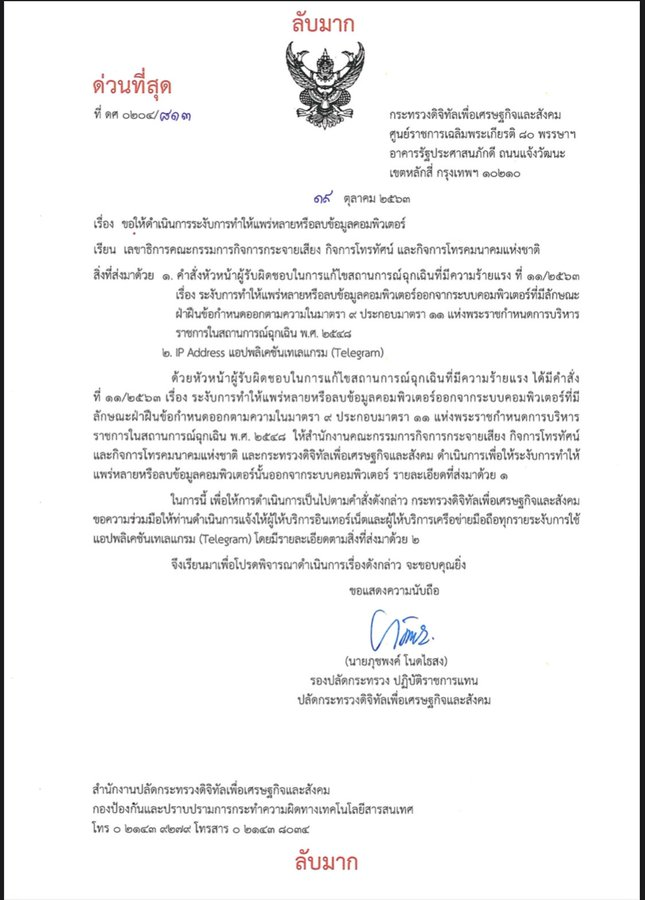

Figure 2: Letter from the Ministry of Digital Economy to the National Broadcasting and Telecommunications Commission on the suspension of use of Telegram app

However, those on the ground in Thailand had noted that Telegram was still working during the period. It may be possible that some of the countermeasures set up by Telegram have been effective in keeping Telegram up for the Thai.

### Network Landscape and Internet Penetration

Thailand obtained internet access in 1996, the third country in Southeast Asia to do so. As of now, 5G internet is also available in the country.[^7] Thailand is also one of the top 10 countries with the fastest broadband internet speeds in 2021[^8]. 

In terms of internet access[^9], 85% of households have access at home, and 98% of the population is covered by at least a 4G mobile network. There is little gap in internet access between urban and rural areas, with 89% of urban households and 82% of rural households having access.

The National Telecommunications Council grant licenses to operate to internet service providers in Thailand. There is a mix of state-owned companies and private operators, where the state-owned are CAT Telecom and TOT and the three major mobile carriers are Advance Info Service (AIS), DTAC and TrueMove.

In the 2017 report, it was highlighted that the Thai government has held expansive control over the internet, facilitated by its relationships with the internet providers and telecommunication companies. Former politicians, military officers, or members of their families also hold key positions in these companies.

## Findings of internet censorship in Thailand

The testing period covered in the analysis is from 1 January to 30 June 2022.

### Blocking of websites

As at time of writing this report, the Citizen Lab test list of Thailand consisted of 446 URLs.

In the six-month period, 3,129,067 measurements were recorded in OONI’s testing for web connectivity from 30 vantage points. From this total, it was found that 95.8% (2,996,695) were OK, 3.1% (96,626) were anomalies, 0.3% (8,982) were confirmed blockings and 0.9% (26,664) were failed measurements. Furthermore, 5 ASNs made up about 80% of the total measurements equivalent to 2.5 million measurements: JasTel Network International Gateway (29%), TripleT (16%), SBN-IIG (14%), TOT Public Company Limited (13%) and TRUE Internet Co. Ltd. 

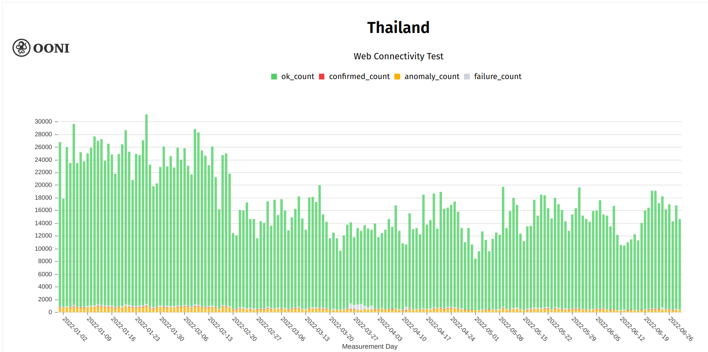

Figure 3: OONI measurements in Thailand, January-June 2022

OONI’s confirmed list of blocked domains contain 76 domains from various categories, whereas further analysis by heuristics added 43 to the list, bringing a total of 119 domains which are confirmed blockings. In comparison, the 2017 report showed that there were 13 websites blocked.

In the analysis, it was found that the blockings were conducted through DNS tampering, which redirected the domains to 2 IP addresses: ['180.180.255.130'] and ['125.26.170.3']. The former address did not show any blockpages and only time-outs, but as this IP address belonged to a local ISP TOT Public Company Limited, it is highly likely that it is a confirmed blocking.

The latter, led to a blockpage as below

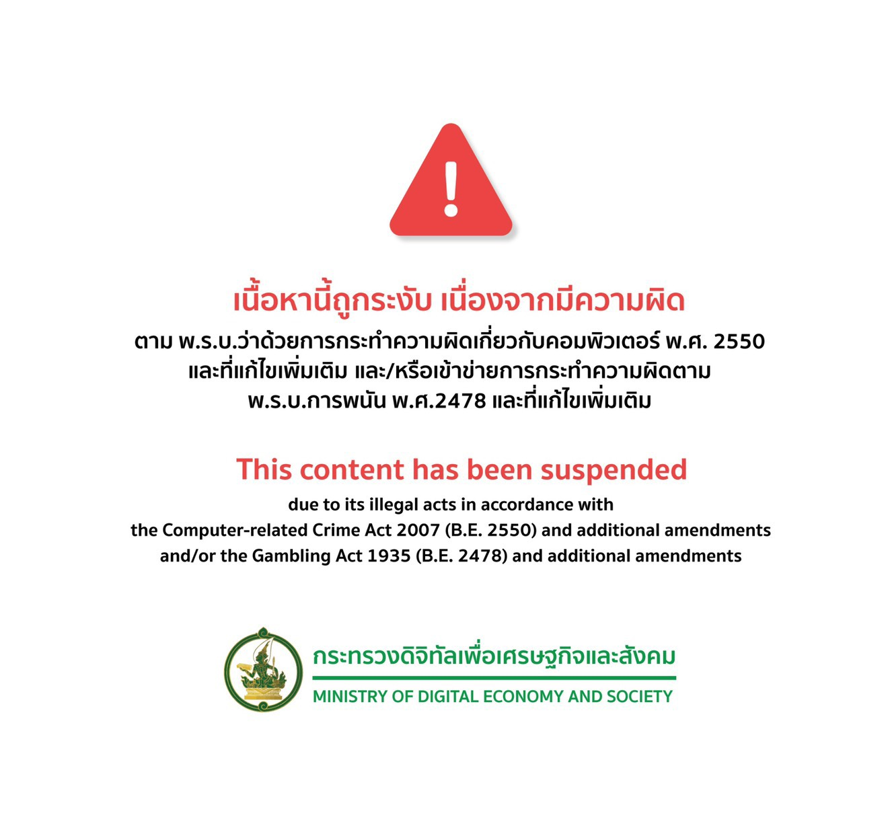

Figure 4: Blockpage in Thailand traced to the Ministry of Digital Economy and Society

Additionally, there were also blockings found from HTTP tampering whereby measurements returned with HTTP headers/body as below which traced back to the same blockpage ([http://103.288.24.21](http://103.288.24.21)) or a blank page that timed out ([http://110.164.252.137](http://110.164.252.137)) .

By category, the confirmed list of blockings comprised of various categories: 

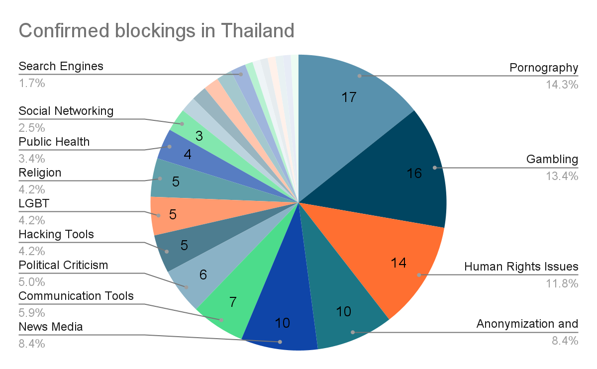

Figure 5: Pie chart depicting confirmed blockings in Thailand

The list is as in **Appendix 1**.

In the list, categories which contain the more than 10 domains are Anonymization and circumvention tools, Gambling, Human Rights Issues, News Media and Pornography.

#### Anonymization and circumvention tools

10 domains related to anonymization and circumvention tools were found blocked as follows:

| **Confirmed by OONI**      | **Confirmed by heuristics** |
|----------------------------|-----------------------------|
| anonymouse.org             | proxify.com                 |
| ultrasurf.us               | www.hidemyass.com           |
| proxy.org                  | www.hotspotshield.com       |
| proxytools.sourceforge.net | www.jmarshall.com           |
| spys.ru                    | www.peacefire.org           |

Based solely on OONI’s data, testing of the 10 domains result in the following:

| OK     | Confirmed | Anomaly | Failure | Total  |
| ------ | --------- | ------- | ------- | ------ |
| 20,401 | 563       | 2,270   | 381     | 23,615 |
| 86%  | 2%      | 10%  | 2%    | 100% |

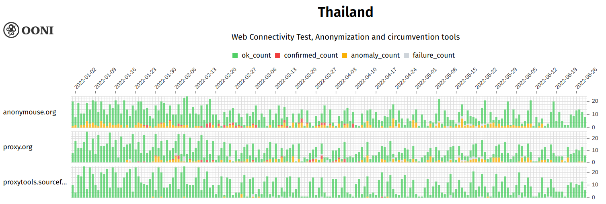
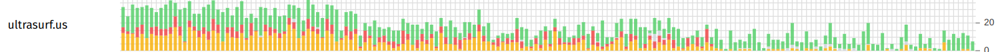
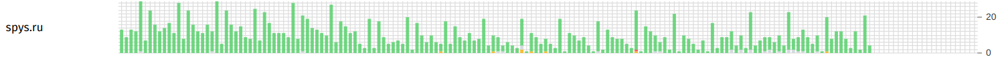

Figure 6: OONI measurements of confirmed blocked domains related to Anonymization and circumvention tools

Looking at the 5 domains confirmed blocked by OONI, the blockings occurred throughout the period, except for “proxytools.sourceforge.net” and “spys.ru” where the blockings happened only a few times.

The rest of the 5 domains, which were confirmed by the heuristics were either blocked through DNS or HTTP tampering. Omitting the “OK” measurements, there were up to 25 blockings per day recorded for the 5 domains, with mostly TLS connection reset, HTTP connection reset and DNS inconsistency.

#### Gambling

16 domains related to Gambling were detected blocked either solely by OONI or further by heuristics:

| **Confirmed by OONI**                                                       | **Confirmed by heuristics** |
|--------------------------------------------------|--------------------------------------------------|
| [Bet365.com](http://bet365.com)                               | www.betdaq.com              |
| [Ibcbet.com](http://ibcbet.com)                               | www.ladbrokes.com           |
| [www.888casino.com](http://www.888casino.com)                 | www.williamhill.com         |
| [www.betfair.com](http://www.betfair.com)                     | www.grandonline.com         |
| [www.casinotropez.com](http://www.casinotropez.com)           | casino.com                  |
| [www.europacasino.com](http://www.europacasino.com)           |                             |
| [www.riverbelle.com](http://www.riverbelle.com)               |                             |
| [www.spinpalace.com](http://www.spinpalace.com)               |                             |
| [www.sportingbet.com](http://www.sportingbet.com)             |                             |
| [www.sportsinteraction.com](http://www.sportsinteraction.com) |                             |
| [www.10bet.com](http://www.10bet.com)                         |                             |

Based solely on OONI’s data, testing of the 16 domains resulted in the following:

| OK     | Confirmed | Anomaly | Failure | Total  |
| ------ | --------- | ------- | ------- | ------ |
| 10,931 | 1,453     | 3,412   | 88      | 15,884 |
| 69%    | 9%        | 21%     | 1%      | 100%   |

Looking at the 11 domains confirmed blocked by OONI, the blockings occurred throughout the period, with highest confirmed and anomalies for `bet365.com`, `Ibcbet.com` and `www.sportingbet.com`

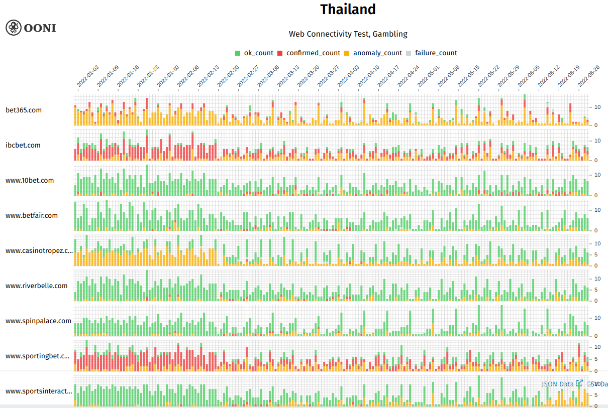
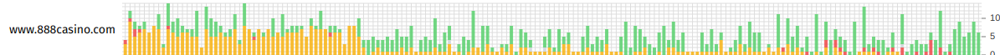
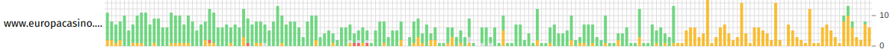

Figure 7: OONI measurements of confirmed blocked domains related to Gambling

The rest of the 5 domains, which were confirmed by the heuristics were either blocked through DNS or HTTP tampering. Omitting the “OK” measurements, there were up to 10 blockings per day recorded for the 5 domains, with mostly TLS connection reset and DNS confirmed.

#### Human Rights Issues

In line with human rights issues highlighted in the [2022 Thailand Country Report by Freedom House](https://freedomhouse.org/country/thailand/freedom-world/2022), 14 domains related were blocked as follows:

| **Confirmed by OONI**       | **Confirmed by heuristics**              |
|-----------------------------|------------------------------------------|
| no112.org                   | hirvikatu10.net                          |
| www.no112.org               | hrlibrary.umn.edu                        |
| change.org                  | www.hrw.org                              |
| www.enlightened-jurists.com | www.humanrights.asia                     |
| laborrights.org             | www.ihf-hr.org                           |
|                             | www.ohchr.org                            |
|                             | www.onlinewomeninpolitics.org            |
|                             | www.mwgthailand.org                      |
|                             | [hrw.org](http://hrw.org/) |

Based solely on OONI’s data, testing of the 14 domains resulted in the following:

| OK     | Confirmed | Anomaly | Failure | Total  |
| ------ | --------- | ------- | ------- | ------ |
| 42,616 | 1,636     | 2,869   | 584     | 47,705 |
| 89%    | 3%        | 6%      | 1%      | 100%   |

On the OONI Explorer, the 5 domains confirmed to have been blocked throughout the period, with most measurements shown on [www.enlightened-jurists.com](www.enlightened-jurists.com). According to a 2013 [The Nation Thailand article](https://www.nationthailand.com/life/30221433),  "enlightened jurists" or Khana Nitirat are a group of university law lecturers who called on MPs who voted for an all-elected Senate to ignore the Constitutional Court's ruling that struck down that amendment.

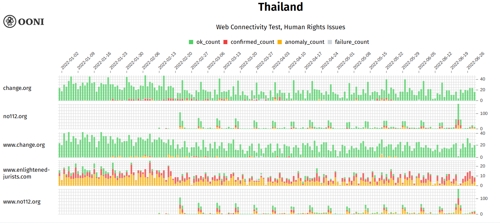

Figure 8: OONI measurements of confirmed blocked domains related to Human rights issues

The rest of the 7 domains, which were confirmed by the heuristics were either blocked through DNS or HTTP tampering. Omitting the “OK” measurements, there were up to 20 blockings per day recorded for the 7 domains, with mostly HTTP connection reset.

#### News Media

10 domains related were confirmed blocked as follows:

| **Confirmed by OONI**  | **Confirmed by heuristics** |
|------------------------|-----------------------------|
| www.midnightuniv.org   | midnightuniv.org            |
| en.wikipedia.org       | wartani.com                 |
| nypost.com             |                             |
| th.wikipedia.org       |                             |
| thaienews.blogspot.com |                             |
| www.bbc.com            |                             |
| www.dailymail.co.uk    |                             |
| www.theguardian.com    |                             |

Based solely on OONI’s data, testing of the 10 domains resulted in the following:

| OK     | Confirmed | Anomaly | Failure | Total  |
| ------ | --------- | ------- | ------- | ------ |
| 40,973 | 3,276     | 9,306   | 673     | 54,228 |
| 76%    | 6%        | 17%     | 1%      | 100%   |

Looking at the 8 domains confirmed blocked by OONI, there were significant anomalies throughout the period, with obvious blockings on `thaienews.blogspot.com` and `www.midnightuniv.org` across vantage points.

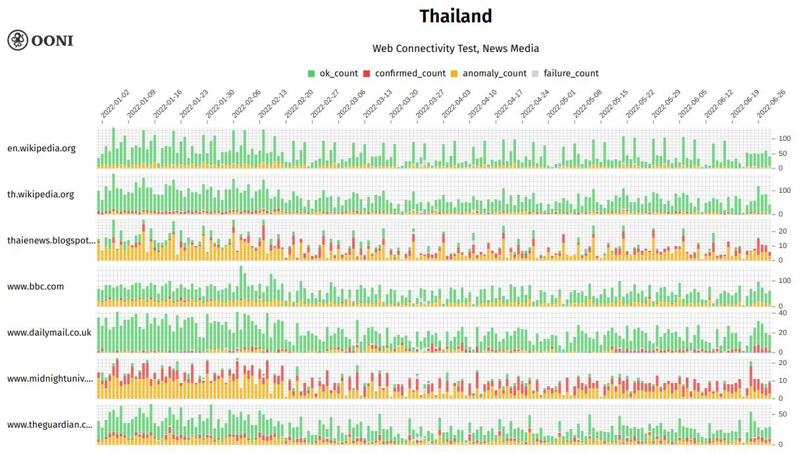
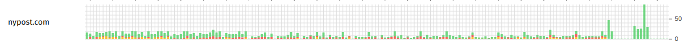

Figure 9: OONI measurements of confirmed blocked domains related to News Media

The rest of the 2 domains, which were confirmed by the heuristics were either blocked through DNS or HTTP tampering. Omitting the “OK” measurements, there were up to 10 blockings per day recorded for the 2 domains, with mostly HTTP generic failure or HTTP confirmed.

#### Pornography

17 domains related were confirmed blocked as follows:

| **Confirmed by OONI**                                                       | **Confirmed by heuristics**                                       |
|--------------------------------------------------|--------------------------------------------------|
| [www.pornhub.com](http://www.pornhub.com)                     | [8thstreetlatinas.com](http://8thstreetlatinas.com) |
| [beeg.com](http://beeg.com)                                   | [taknai.com](http://taknai.com)                     |
| [www.89.com](http://www.89.com)                               | [xhamster.com](http://xhamster.com)                 |
| [www.fuckingfreemovies.com](http://www.fuckingfreemovies.com) | [bravotube.net](http://bravotube.net)               |
| [www.sex.com](http://www.sex.com)                             | [avgle.com](http://avgle.com)                       |
| [www.thaigirls100.net](http://www.thaigirls100.net)           |                                                                   |
| [www.wetplace.com](http://www.wetplace.com)                   |                                                                   |
| [www.xvideos.com](http://www.xvideos.com)                     |                                                                   |
| [www.youporn.com](http://www.youporn.com)                     |                                                                   |
| [www.av-th.net](http://www.av-th.net)                         |                                                                   |
| [www.thaichix.com](http://www.thaichix.com)                   |                                                                   |
| [pornhub.com](http://pornhub.com)                             |                                                                   |

Based solely on OONI’s data, testing of the 17 domains resulted in the following:

| OK    | Confirmed | Anomaly | Failure | Total  |
| ----- | --------- | ------- | ------- | ------ |
| 8,038 | 519       | 5,093   | 94      | 13,744 |
| 58%   | 4%        | 37%     | 1%      | 100%   |

Looking at the 12 domains confirmed blocked by OONI, the confirmed blockings and anomalies were consistent throughout the period:

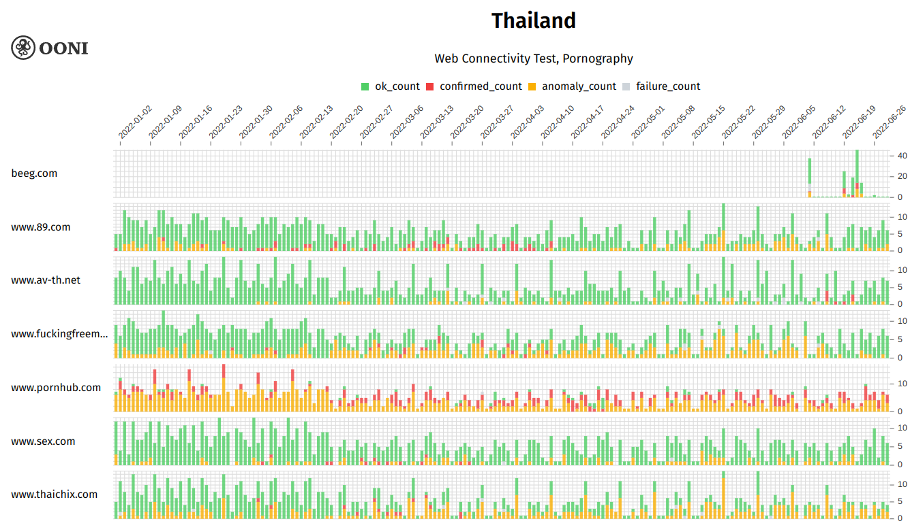
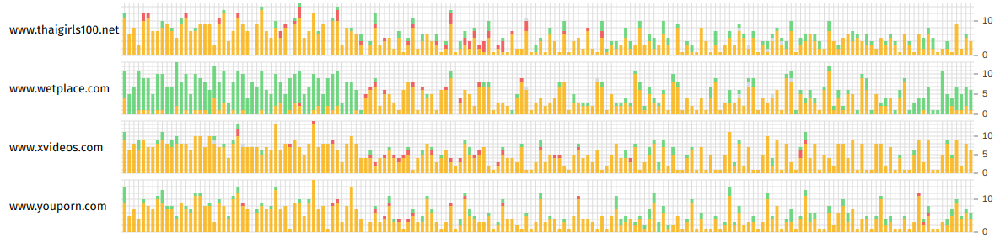
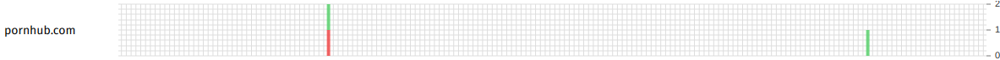

Figure 10: OONI measurements of confirmed blocked domains related to Pornography

The rest of the 5 domains, which were confirmed by the heuristics were either blocked through DNS or HTTP tampering. Omitting the “OK” measurements, there were up to 10 blockings per day recorded for the 5 domains, with various types of blockings.

#### Interesting websites

The findings below portray analysis of measurements on 2 highlighted websites: Change.org and No112.org.

##### Change.org

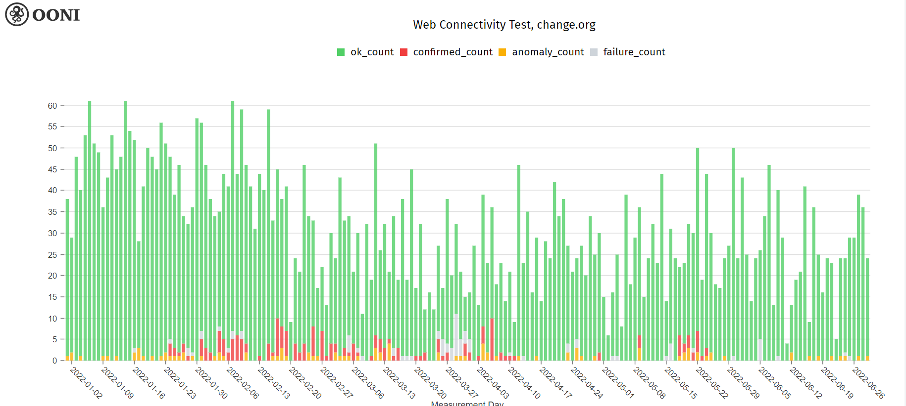

Figure 11: OONI measurements of Change.org

Signs of blocking of Change.org still persisted in 2022, after it was first blocked during the protests in October 2020. According to OONI’s data, it was found blocked from January until May.

| OK    | Confirmed | Anomaly | Failure | Total |
| ----- | --------- | ------- | ------- | ----- |
| 5,243 | 187       | 100     | 78      | 5,608 |
| 93%   | 2%        | 2%      | 1%      | 100%  |

By ASN, it was found that the internet provider which showed signs of confirmed blocking were AS137850 (Office of Info.Tech. Admin. for Educational Development) and AS4750 (CS LOXINFO PUBLIC COMPANY LIMITED).

Blockings were detected from 24 January 2022 until 24 May 2022 on AS137580. From the raw measurements, the blockings were conducted through DNS tampering with a blockpage ([125.26.170.3](http://125.26.170.3/)) by the Ministry of Digital Economy and Safety.

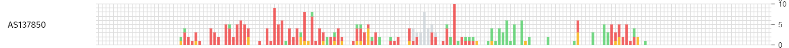

Figure 12: OONI measurements of Change.org on AS137580

Whereas on AS4750, blockings were detected on 30 April 2022, although with only 2 measurements. As on AS137850, the blocking was also conducted through DNS tampering with a blockpage ([125.26.170.3](http://125.26.170.3/)) by the Ministry of Digital Economy and Safety.

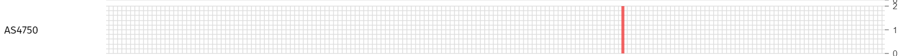

Figure 13: OONI measurements of Change.org on AS4750

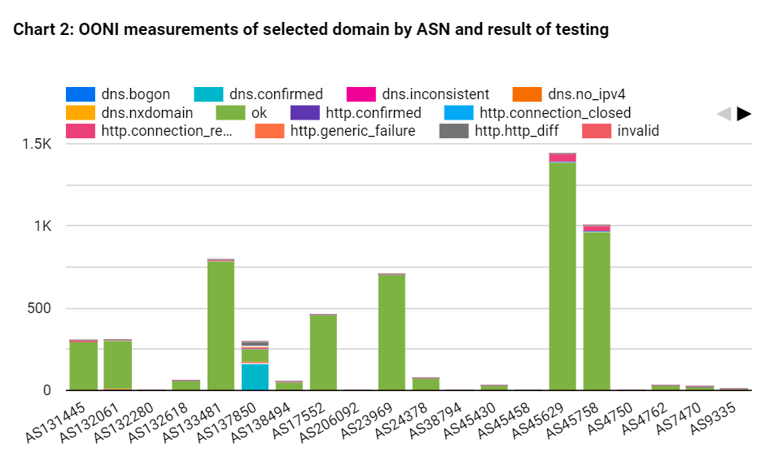

Figure 14: OONI measurements of Change.org by method of blocking

Looking at the other ASNs, there were also DNS inconsistencies recorded on AS45458 (SBN-IIG transit provider) and AS45758 (TripleT Internet). However, these may be cases of false positives.

##### No112.org

Lèse-majesté in Thailand is a crime according to Section 112 of the Thai Criminal Code. It is illegal to defame, insult, or threaten the monarch of Thailand (king, queen, heir-apparent, heir-presumptive, or regent). [No112.org](#heading=h.rfdrnliwjdf9) is a petition website to call for the abolishment of this section organised by the [Thai Progressive Movement](https://www.facebook.com/ThailandProgressiveMovement) and the [Ratsadon](https://www.facebook.com/TheRatsadon). Until the time of writing (September 2022), there were more than 237,000 signatures.

Based on OONI’s data, confirmed blockings were detected from 16 February 2022 to 28 June 2022. There were also significant anomalies in the measurements.

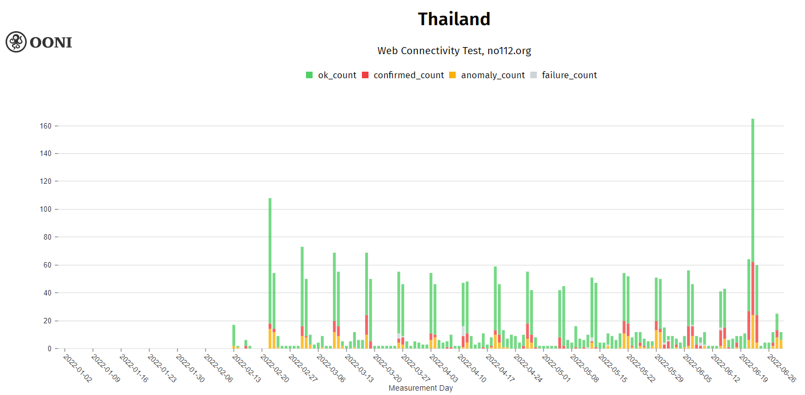

Figure 15: OONI measurements of No112.org 

| OK    | Confirmed | Anomaly | Failure | Total |
| ----- | --------- | ------- | ------- | ----- |
| 1,909 | 303       | 272     | 25      | 2,509 |
| 76%   | 12%       | 11%     | 1%      | 100%  |

By ASN, these confirmed blockings were detected on 8 vantage points: AS131090 (CAT TELECOM Public Company Ltd,CAT) , AS132061 (Realmove Company Limited), AS132618 (Real Future Company Limited), AS17552 (TRUE INTERNET Co.,Ltd.), AS23969 (TOT Public Company Limited), AS24378 (Total Access Communication PLC.), AS45758 (TripleT Internet) and AS7470 (TRUE INTERNET Co.,Ltd). 

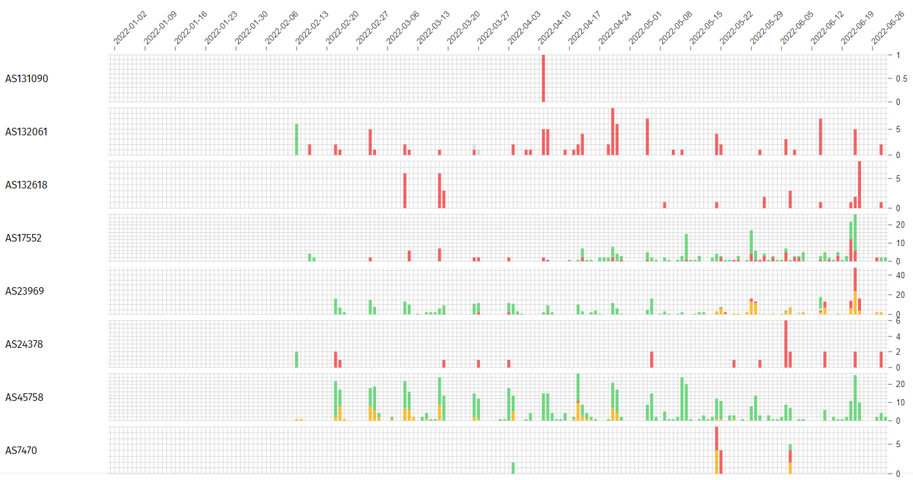

Figure 16: OONI measurements of No112.org by ASN

High anomalies were detected on AS137850 (Office of Info.Tech. Admin. for Educational Development). Based on raw measurements, these were due to HTTP inconsistencies, and the website was redirected to a “307 Temporary Redirect” page. 

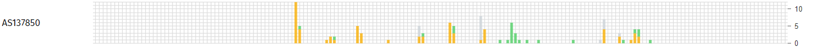

Figure 17: OONI measurements of No112.org on AS137580

Other than the confirmed blockings through DNS tampering, there were also DNS inconsistencies, TLS connection reset and HTTP connection reset on AS23969 (TOT Public Company Limited). There were also cases of HTTP generic failure on AS45758 (TripleT Internet service). Moreover, on AS137850 (Office of Info.Tech. Admin. for Educational Development), there were signs of blocking through DNS inconsistencies, HTTP generic failure, HTTP inconsistencies and TLS connection reset.

### Blocking of Instant Messaging Apps

There were 106,595 measurements on instant messaging apps recorded on OONI during the six-month period, in particular for Facebook Messenger, Telegram, Signal and Whatsapp. In Thailand, there did not seem to be any signs of blocking as more than 99 percent of these testings were successful.

### Blocking of Circumvention Tools

There were 55,573 measurements on circumvention tools recorded on OONI during the six-month period, in particular for Psiphon, Tor and Tor Snowflake. In Thailand, there did not seem to be any signs of blocking as more than 99 percent of these testings were successful. However, it may be noted that these tools may not be used as much as other tools in Thailand, since there were 10 domains related to anonymization and circumvention tools reported blocked using the web connectivity tests.

## Acknowledgement of Limitations

The examination of the findings of this study is limited to network measurements that were collected from 1 January to 30 June 2022 to examine the most recent censorship trends and events. 

Although the network measurements were collected from 30 vantage points in Thailand, the running of OONI software testing was not consistent across all networks. 

## Conclusion

Since the release of the 2017 report of The State of Censorship in Thailand, multiple censorship events had been reported, especially during the 2020/2021 protests. These include websites related to human rights and news media, which significantly affect the internet freedom in the country. The number of domains reported blocked on OONI had increased from 13 to 119, possibly due to improved methodology and heightened measurements. In the list, categories which contain the more than 10 domains are Anonymization and circumvention tools, Gambling, Human Rights Issues, News Media and Pornography.

It is expected that with this study, the measurements continue to grow with wider networks and more testers. 

### Contribute to the study

There are various ways one may contribute to the OONI measurements:

* Testing: You may test on [various platforms](https://ooni.org/install/), both on Mobile (iOS and Android) and Desktop, including on the CLI on Linux platforms. The domains you test can be either randomly selected from the [Citizenlab Test Lists](https://github.com/citizenlab/test-lists) or custom test lists specific to your needs.
* Contribute to the test lists: You can contribute to the test lists on GitHub or on [OONI](https://test-lists.ooni.org/).
* Translate the OONI Probe to your local language [here](https://www.transifex.com/otf/ooniprobe/).
* Participate in community discussions on the [OONI’s Slack channel](https://slack.ooni.org/)

## Acknowledgements

We would like to thank the OONI team for their various contributions to the writing of this report.

## 

## Annex I: Glossary

| **Term**         | Definition                                                                                                                                                                                                                                                                                                                                                                                                                                                                                                                                                                                                                                                                                                                                                                                                                                               |
|------------------|----------------------------------------------------------------------------------------------------------------------------------------------------------------------------------------------------------------------------------------------------------------------------------------------------------------------------------------------------------------------------------------------------------------------------------------------------------------------------------------------------------------------------------------------------------------------------------------------------------------------------------------------------------------------------------------------------------------------------------------------------------------------------------------------------------------------------------------------------------|
| **DNS**          | DNS stands for “Domain Name System” and it maps domain names to IP addresses. A domain is a name that is commonly attributed to websites (when they’re created), so that they can be more easily accessed and remembered. For example, twitter.com is the domain of the Twitter website. However, computers can’t connect to internet services through domain names, but based on IP addresses: the digital address of each service on the internet. Similarly, in the physical world, you would need the address of a house (rather than the name of the house itself) in order to visit it. The Domain Name System (DNS) is what is responsible for transforming a human- readable domain name (such as ooni.org) into its numerical IP address counterpart (in this case:104.198.14.52), thus allowing your computer to access the intended website.  |
| **HTTP**         | The Hypertext Transfer Protocol (HTTP) is the underlying protocol used by the World Wide Web to transfer or exchange data across the internet. The HTTP protocol allows communication between a client and a server. It does so by handling a client’s request to connect to a server, and the server’s response to the client’s request. All websites include an HTTP (or HTTPS) prefix (such as http://example.com/) so that your computer (the client) can request and receive the content of a website (hosted on a server). All websites include an HTTP (or HTTPS) prefix (such as http://example.com/) so that your computer (the client) can request and receive the content of a website (hosted on a server). The transmission of data over the HTTP protocol is unencrypted.                                                                  |
| **ISP**          | An Internet Service Provider (ISP) is an organization that provides services for accessing and using the internet. ISPs can be state-owned, commercial, community-owned, non-profit, or otherwise privately owned. Vodafone, AT&T, Airtel, and MTN are examples of ISPs.                                                                                                                                                                                                                                                                                                                                                                                                                                                                                                                                                                                 |
| **Middle boxes** | A middlebox is a computer networking device that transforms, inspects, filters, or otherwise manipulates traffic for purposes other than packet forwarding. Many Internet Service Providers (ISPs) around the world use middleboxes to improve network performance, provide users with faster access to websites, and for a number of other networking purposes. Sometimes though, middleboxes are also used to implement internet censorship and/or surveillance. The OONI Probe app includes two tests designed to measure networks with the aim of identifying the presence of middleboxes.                                                                                                                                                                                                                                                           |
| **TCP**          | The Transmission Control Protocol (TCP) is one of the main protocols on the internet. To connect to a website, your computer needs to establish a TCP connection to the address of that website. TCP works on top of the Internet Protocol (IP), which defines how to address computers on the internet. When speaking to a machine over the TCP protocol you use an IP and port pair, which looks something like this: 10.20.1.1:8080. The main difference between TCP and (another very popular protocol called) UDP is that TCP has the notion of a “connection”, making it a “reliable” transport protocol.                                                                                                                                                                                                                                          |
| **TLS**          | Transport Layer Security (TLS) – also referred to as “SSL” – is a cryptographic protocol that allows you to maintain a secure, encrypted connection between your computer and an internet service. When you connect to a website through TLS, the address of the website will begin with HTTPS (such as https://www.facebook.com/), instead of HTTP.                                                                                                                                                                                                                                                                                                                                                                                                                                                                                                     |

A comprehensive glossary related to OONI can be accessed here: [https://ooni.org/support/glossary/](https://ooni.org/support/glossary/). 

## Annex II: Methodology

### Data

Data computed based on the heuristics for this report can be downloaded here: [https://github.com/Sinar/imap-data](https://github.com/Sinar/imap-data) whereas aggregated data can be downloaded from [OONI Explorer](https://explorer.ooni.org/).

### Coverage

The iMAP State of Internet Censorship Country Report covers the findings of network measurement collected through Open Observatory of Network Interference (OONI) [OONI Probe App](https://ooni.org/install/) that measures the blocking of websites, instant messaging apps, circumvention tools and network tampering. The findings highlight the websites, instant messaging apps and circumvention tools confirmed to be blocked, the ASNs with censorship detected and method of network interference applied. The report also provides background context on the network landscape combined with the latest legal, social and political issues and events which might have an effect on the implementation of internet censorship in the country.

In terms of timeline, this first iMAP report covers measurements obtained in the six-month period from 1 January 2022 to 30 June 2022. The countries covered in this round are Cambodia, Hong Kong, Indonesia, Malaysia, Myanmar, Philippines, Thailand, and Viet Nam. India will only be included starting in the next period of reporting.  

### How are the network measurements gathered?

Network measurements are gathered through the use of [OONI Probe app](https://ooni.org/install/), a free software tool developed by [Open Observatory of Network Interference (OONI)](https://ooni.org/). To learn more about how the OONI Probe test works, please visit [https://ooni.org/nettest/](https://ooni.org/nettest/).

iMAP Country Researchers and anonymous volunteers run OONI Probe app to examine the accessibility of websites included in the [Citizen Lab test lists](https://github.com/citizenlab/test-lists/tree/master/lists). iMAP Country Researchers actively review the country-specific test lists to ensure up-to-date websites are included and context-relevant websites are properly categorised, in consultation with local communities and digital rights network partners. We adopt the [approach taken by Netalitica](https://netalitica.com/wp-content/uploads/2021/10/Guideline-for-Test-List-Researchers-V7.pdf) in reviewing country-specific test lists.

It is important to note that the findings are only applicable to the websites that were examined and do not fully reflect all instances of censorship that might have occurred during the testing period. 

### How are the network measurements analysed?

OONI processes the following types of data through its [data pipeline](https://github.com/ooni/pipeline):

#### Country code

OONI by default collects the code which corresponds to the country from which the user is running OONI Probe tests from, by automatically searching for it based on the user’s IP address through their [ASN database](https://github.com/ooni/asn-db-generator) the [MaxMind GeoIP database](https://www.maxmind.com/en/home). 

#### Autonomous System Number (ASN)

OONI by default collects the Autonomous System Number (ASN) of the network used to run OONI Probe app, thereby revealing the network provider of a user. 

#### Date and time of measurements

OONI by default collects the time and date of when tests were run to evaluate when network interferences occur and to allow comparison across time. UTC is used as the standard time zone in the time and date information. In addition, the charts generated on OONI MAT will exclude measurements on the last day by default.

#### Categories

The 32 website categories are based on the Citizenlab test lists: [https://github.com/citizenlab/test-lists](https://github.com/citizenlab/test-lists). As not all websites tested on OONI are on these test lists, these websites would have unclassified categories.

| **No.** | **Category Description**              | **Code** | **Description**                                                                                                                                                                                                                                                                                 |
|-----------|----------------------------|------------|--------------------------------------------------|
| 1       | Alcohol & Drugs                       | ALDR     | Sites devoted to the use, paraphernalia, and sale of drugs and alcohol irrespective of the local legality.                                                                                                                                                                                      |
| 2       | Religion                              | REL      | Sites devoted to discussion of religious issues, both supportive and critical, as well as discussion of minority religious groups.                                                                                                                                                              |
| 3       | Pornography                           | PORN     | Hard-core and soft-core pornography.                                                                                                                                                                                                                                                            |
| 4       | Provocative Attire                    | PROV     | Websites which show provocative attire and portray women in a sexual manner, wearing minimal clothing.                                                                                                                                                                                          |
| 5       | Political Criticism                   | POLR     | Content that offers critical political viewpoints. Includes critical authors and bloggers, as well as oppositional political organizations. Includes pro-democracy content, anti-corruption content as well as content calling for changes in leadership, governance issues, legal reform. Etc. |
| 6       | Human Rights Issues                   | HUMR     | Sites dedicated to discussing human rights issues in various forms. Includes women\'s rights and rights of minority ethnic groups.                                                                                                                                                              |
| 7       | Environment                           | ENV      | Pollution, international environmental treaties, deforestation, environmental justice, disasters, etc.                                                                                                                                                                                          |
| 8       | Terrorism and Militants               | MILX     | Sites promoting terrorism, violent militant or separatist movements.                                                                                                                                                                                                                            |
| 9       | Hate Speech                           | HATE     | Content that disparages particular groups or persons based on race, sex, sexuality or other characteristics                                                                                                                                                                                     |
| 10      | News Media                            | NEWS     | This category includes major news outlets (BBC, CNN, etc.) as well as regional news outlets and independent media.                                                                                                                                                                              |
| 11      | Sex Education                         | XED      | Includes contraception, abstinence, STDs, healthy sexuality, teen pregnancy, rape prevention, abortion, sexual rights, and sexual health services.                                                                                                                                              |
| 12      | Public Health                         | PUBH     | HIV, SARS, bird flu, centers for disease control, World Health Organization, etc                                                                                                                                                                                                                |
| 13      | Gambling                              | GMB      | Online gambling sites. Includes casino games, sports betting, etc.                                                                                                                                                                                                                              |
| 14      | Anonymization and circumvention tools | ANON     | Sites that provide tools used for anonymization, circumvention, proxy-services and encryption.                                                                                                                                                                                                  |
| 15      | Online Dating                         | DATE     | Online dating services which can be used to meet people, post profiles, chat, etc                                                                                                                                                                                                               |
| 16      | Social Networking                     | GRP      | Social networking tools and platforms.                                                                                                                                                                                                                                                          |
| 17      | LGBT                                  | LGBT     | A range of gay-lesbian-bisexual-transgender queer issues. (Excluding pornography)                                                                                                                                                                                                               |
| 18      | File-sharing                          | FILE     | Sites and tools used to share files, including cloud-based file storage, torrents and P2P file-sharing tools.                                                                                                                                                                                   |
| 19      | Hacking Tools                         | HACK     | Sites dedicated to computer security, including news and tools. Includes malicious and non-malicious content.                                                                                                                                                                                   |
| 20      | Communication Tools                   | COMT     | Sites and tools for individual and group communications. Includes webmail, VoIP, instant messaging, chat and mobile messaging applications.                                                                                                                                                     |
| 21      | Media sharing                         | MMED     | Video, audio or photo sharing platforms.                                                                                                                                                                                                                                                        |
| 22      | Hosting and Blogging Platforms        | HOST     | Web hosting services, blogging and other online publishing platforms.                                                                                                                                                                                                                           |
| 23      | Search Engines                        | SRCH     | Search engines and portals.                                                                                                                                                                                                                                                                     |
| 24      | Gaming                                | GAME     | Online games and gaming platforms, excluding gambling sites.                                                                                                                                                                                                                                    |
| 25      | Culture                               | CULTR    | Content relating to entertainment, history, literature, music, film, books, satire and humour                                                                                                                                                                                                   |
| 26      | Economics                             | ECON     | General economic development and poverty related topics, agencies and funding opportunities                                                                                                                                                                                                     |
| 27      | Government                            | GOVT     | Government-run websites, including military sites.                                                                                                                                                                                                                                              |
| 28      | E-commerce                            | COMM     | Websites of commercial services and products.                                                                                                                                                                                                                                                   |
| 29      | Control content                       | CTRL     | Benign or innocuous content used as a control.                                                                                                                                                                                                                                                  |
| 30      | Intergovernmental Organizations       | IGO      | Websites of intergovernmental organizations such as the United Nations.                                                                                                                                                                                                                         |
| 31      | Miscellaneous content                 | MISC     | Sites that don\'t fit in any category (XXX Things in here should be categorised)                                                                                                                                                                                                                |

#### IP addresses and other information

OONI does not collect or store users’ IP addresses deliberately. OONI takes measures to remove them from the collected measurements, to protect its users from [potential risks](https://ooni.org/about/risks/). However, there may be instances where users’ IP addresses and other potentially personally-identifiable information are unintentionally collected, if such information is included in the HTTP headers or other metadata of measurements. For example, this can occur if the tested websites include tracking technologies or custom content based on a user’s network location.

#### Network measurements

The types of network measurements that OONI collects depend on the types of tests that are run. Specifications about each OONI test can be viewed through its [git repository](https://github.com/ooni/spec), and details about what collected network measurements entail can be viewed through [OONI Explorer](https://explorer.ooni.org/world/) or through [OONI’s measurement API](https://api.ooni.io/).

In order to derive meaning from the measurements collected, OONI processes the data types mentioned above to answer the following questions:

* Which types of OONI tests were run?
* In which countries were those tests run?
* In which networks were those tests run?
* When were tests run?
* What types of network interference occurred?
* In which countries did network interference occur?
* In which networks did network interference occur?
* When did network interference occur?
* How did network interference occur?

To answer such questions, OONI’s pipeline is designed to answer such questions by processing network measurements data to enable the following:

* Attributing measurements to a specific country.
* Attributing measurements to a specific network within a country.
* Distinguishing measurements based on the specific tests that were run for their collection.
* Distinguishing between “normal” and “anomalous” measurements (the latter indicating that a form of network tampering is likely present).
* Identifying the type of network interference based on a set of heuristics for DNS tampering, TCP/IP blocking, and HTTP blocking.
* Identifying block pages based on a set of heuristics for HTTP blocking.
* Identifying the presence of “middle boxes” within tested networks.

According to OONI, false positives may occur within the processed data due to a number of reasons. DNS resolvers (operated by Google or a local ISP) often provide users with IP addresses that are closest to them geographically. While this may appear to be a case of DNS tampering, it is actually done with the intention of providing users with faster access to websites. Similarly, false positives may emerge when tested websites serve different content depending on the country that the user is connecting from, or in the cases when websites return failures even though they are not tampered with.

Furthermore, measurements indicating HTTP or TCP/IP blocking might actually be due to temporary HTTP or TCP/IP failures, and may not conclusively be a sign of network interference. It is therefore important to test the same sets of websites across time and to cross-correlate data, prior to reaching a conclusion on whether websites are in fact being blocked.

Since block pages differ from country to country and sometimes even from network to network, it is quite challenging to accurately identify them. OONI uses a series of heuristics to try to guess if the page in question differs from the expected control, but these heuristics can often result in false positives. For this reason OONI only says that there is a confirmed instance of blocking when a block page is detected.

Upon collection of more network measurements, OONI continues to develop its data analysis heuristics, based on which it attempts to accurately identify censorship events.

The full list of country-specific test lists containing confirmed blocked websites in Myanmar, Cambodia, Hong Kong, Indonesia, Malaysia, Philippines, Thailand, and Vietnam can be viewed here: [https://github.com/citizenlab/test-lists](https://github.com/citizenlab/test-lists). 

#### Confirmed vs Heuristics

Confirmed OONI measurements were based on blockpages with fingerprints recorded here [https://github.com/ooni/blocking-fingerprints](https://github.com/ooni/blocking-fingerprints). 

Hence, heuristics as below were run on raw measurements on all countries under iMAP to further confirm blockings. 

Firstly, IP addresses with more than 10 domains were identified. Then each of the IP address was checked for the following:

When blocking is determined, any domain redirected to these IP addresses would be marked as ‘dns.confirmed’. 

Secondly, HTTP titles and bodies were analysed to determine blockpages. This [example](https://explorer.ooni.org/measurement/20220411T125618Z_webconnectivity_IN_58678_n1_6zLG8ySiJHIq07Un?input=http%3A%2F%2Finfluence.in%2F) shows that the HTTP returns the text ‘The URL has been blocked as per the instructions of the DoT in compliance to the orders of Court of Law’. Any domain redirected to these HTTP titles and bodies would be marked as ‘http.confirmed’. 

As a result, false positives are eliminated and more confirmed blockings were obtained including countries like Cambodia, Vietnam and Philippines which have no confirmed blocking fingerprints on OONI.

In the case of Hong Kong, the results of the heuristics showed external censorship from outside of the country instead of local censorship. Thus, the local researchers had analysed the OONI measurements manually to identify confirmed blockings. The domains identified were based on the timed-out instances. 

---

## About iMAP

Internet Monitoring Action Project (iMAP) aims to establish regional and in-country networks that monitor network interference and restrictions to the freedom of expression online in 9 countries: Myanmar, Cambodia, Hong Kong, India, Indonesia, Malaysia, Philippines, Thailand, and Vietnam. Sinar Project is currently working with national digital rights partners in these 9 countries. The project is done via Open Observatory Network Interference (OONI) detection and reporting systems, involving the maintenance of test lists and measurements.

More information available at: [imap.sinarproject.org](http://imap.sinarproject.org). Any enquiries and suggestions about this report can be directed to [team@sinarproject.org](mailto:team@sinarproject.org).

## About Sinar Project

Sinar Project is a civic tech initiative using open technology, open data and policy analysis to systematically make important information public and more accessible to the Malaysian people. It aims to improve governance and encourage greater citizen involvement in the public affairs of the nation by making Parliament and the Malaysian Government more open, transparent and accountable. More information available at: [https://sinarproject.org](https://sinarproject.org).

Thailand, a country situated on the mainland of Southeast Asia, was under military junta for five years from 2014 to 2019. Upon the general election in 2019, the country has been nominally a parliamentary constitutional monarchy, although with lèse-majesté laws continuing to be invoked especially with regard to internet censorship. Adding the COVID-19 pandemic into the picture, the Thai government introduced Regulation 29 to curb fake news, which led to reported incidences of internet censorship.

[^1]:
     World Population Review. (2021). _Thailand Population 2020 (Demographics, Maps, Graphs)._ Worldpopulationreview.com. [https://worldpopulationreview.com/countries/thailand-population](https://worldpopulationreview.com/countries/thailand-population) 

[^2]:
     Religion in Thailand. (2022, November 11). _Wikipedia._ [https://en.wikipedia.org/wiki/Religion_in_Thailand#Demographics](https://en.wikipedia.org/wiki/Religion_in_Thailand#Demographics) 
    ‌

[^3]:
     _Thai Court Rules That Regulation Restraining Internet Access Violates Right to Free Expression._ (2021, August 12). Tilleke & Gibbins. [https://www.tilleke.com/insights/thai-court-rules-that-regulation-restraining-internet-access-violates-right-to-free-expression/](https://www.tilleke.com/insights/thai-court-rules-that-regulation-restraining-internet-access-violates-right-to-free-expression/) 
    ‌ 

[^4]:
    Wikipedia Contributors. _2020–2021 Thai protests._ Wikipedia; Wikimedia Foundation. (2021, October 29). [https://en.wikipedia.org/wiki/2020%E2%80%932021_Thai_protests](https://en.wikipedia.org/wiki/2020%E2%80%932021_Thai_protests) 

[^5]:
    [r-offers-thailand-respite-from-worries-of-covid-crisis/](https://www.thaipbsworld.com/popcat-fever-offers-thailand-respite-from-worries-of-covid-crisis/) 

[^6]:
     Chen, C. (2020, October 20). Thailand orders ISPs to block Telegram amid ongoing protests. PIA VPN Blog. [https://www.privateinternetaccess.com/blog/thailand-orders-isps-to-block-telegram-amid-ongoing-protests/](https://www.privateinternetaccess.com/blog/thailand-orders-isps-to-block-telegram-amid-ongoing-protests/) 

[^7]:
     _Internet in Thailand._ (2022, August 23). Wikipedia. [https://en.wikipedia.org/wiki/Internet_in_Thailand](https://en.wikipedia.org/wiki/Internet_in_Thailand) 

[^8]:
     _Internet Speeds by Country 2022._ (n.d.). [https://worldpopulationreview.com/country-rankings/internet-speeds-by-country](https://worldpopulationreview.com/country-rankings/internet-speeds-by-country) 

[^9]:
     _Digital Development. (n.d.)._ ITU. [https://www.itu.int/en/ITU-D/Statistics/Dashboards/Pages/Digital-Development.aspx](https://www.itu.int/en/ITU-D/Statistics/Dashboards/Pages/Digital-Development.aspx) 

