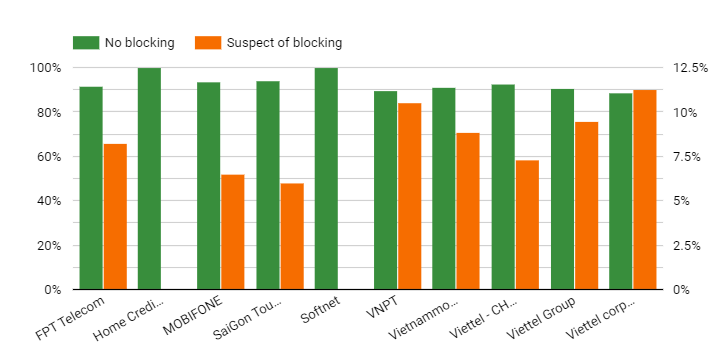
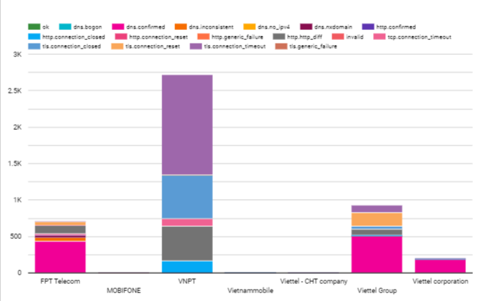

---

title: "iMAP State of Internet Censorship Report 2022 - Vietnam"

description: "This report shares internet censorship during the first half of 2022 in Vietnam using OONI data."

author: "Independent Researchers (Anonymous),  Kelly Koh (Sinar Project) and Siti Nurliza Samsudin (Sinar Project)"

date: "2022-12-23"

tags: ["vietnam", "censorship", "country-th", "theme-news_media", "theme-human_rights"]

categories: ["report"]

---

Swedish Ambassador to Vietnam Pereric Högberg affirmed that Vietnam is making good use of opportunities from the internet, being one of the leading countries in Southeast Asia in terms of internet connection and development[^1]. Vietnam is not limited to using the Internet and social networks[^2]. However, there are still websites with controlled access in Vietnam.

---

[Dịch sang tiếng Việt](https://imap.sinarproject.org/reports/2022/imap-state-of-internet-censorship-country-report-2022-vietnam/2022-vietnam-translation)

* Under the authoritarian political system, freedom of assembly, association, expression, press and religion, as well as civil society activism, is tightly restricted and controlled by the party despite legislation recognising civil and political rights in the Constitution.[^3] Certain contents and topics related to curtailing political opposition, unfavourable to the party, corruption, and human rights issues are censored in various ways.

* The OONI data in Vietnam reveals 1108 inaccessible websites across 10 different Internet Service Providers (ISP), between 1st January 2022 and 30th June 2022. Among these ISPs, users almost connect to the internet by three major networks namely VNPT, FPT and Viettel. Vietnamese ISPs appear to primarily be implementing censorship through DNS and http requests which serve block pages.
* The main types of blocked sites include:
    * Political criticism
    * News Media (mainly foreign sites)
    * Human rights
    * Pornography
    * Government websites from other countries, especially those with military content
* WhatsApp, Facebook, Zalo, Line, Instagram, Tiktok and several social networks appear to be accessible in all tested networks during the testing period.

## Table of Contents

**[Introduction](#introduction)**

**[Background](#background)**

> [Political Landscape](#political-landscape)
>
> [Legal environment](#legal-environment)
>
> [Freedom of the press](#freedom-of-the-press)
>
> [Access to information law](#access-to-information-law)
>
> [Privacy](#privacy)
>
> [Censorship and surveillance](#censorship-and-surveillance)
>
> [Reported cases of internet censorship](#reported-cases-of-internet-censorship)

**[Network Landscape and Internet
Penetration](#network-landscape-and-internet-penetration)**

**[Findings of internet censorship in
Vietnam](#findings-of-internet-censorship-in-vietnam)**

> [Censorship of Websites](#censorship-of-websites)
>
> [Blocking of Instant Messaging Apps](#blocking-of-instant-messaging-apps) 
>
> [Blocking of Circumvention Tools](#blocking-of-circumvention-tools) 

**[Acknowledgement of Limitations](#acknowledgement-of-limitations)**

**[Conclusion](#conclusion)**

**[Acknowledgements](#acknowledgements)**

**[Annex I: Glossary](#annex-i-glossary)**

**[Annex II: Methodology](#annex-ii-methodology)**

> [Data](#data)
>
> [Coverage](#coverage)
>
> [How are the network measurements gathered?](#how-are-the-network-measurements-gathered) 
>
> [How are the network measurements analysed?](#how-are-the-network-measurements-analysed)
>
> [Country code](#country-code)
>
> [Autonomous System Number (ASN)](#autonomous-system-number-asn)
>
> [Date and time of measurements](#date-and-time-of-measurements)
>
> [Categories](#categories)
>
> [IP addresses and other > information](#ip-addresses-and-other-information)
>
> [Network measurements](#network-measurements)
>
> [Confirmed vs Heuristics](#confirmed-vs-heuristics)

**[About Sinar Project](#about-sinar-project)**

**[About iMAP](#about-imap)**

## Introduction

Vietnam is one of the countries with the strictest surveillance in all aspects. Internet censorship is one of the government methods for national security. In the first half of 2022, more than 293,000 measurements (2054 URLs) were collected including global test list and country test list. The number of country test lists is over 500 URLs (corresponding to more than 60,000 measurements) based on the selected URL test list. Of these, more than 300 URLs have been reported as blocked or inaccessible, mostly with political and human rights websites. Freedom of speech and the press in Vietnam appear to be restricted without improvement. Independent news outlets such as BBC, CNN, RFA, RFI, VOA have also been blocked in the past. VPN tools have become very popular in the country. 

Under a joint study by the independent researchers in Vietnam and [Sinar Project](http://sinarproject.org/) with support from [Open Observatory of Network Interference (OONI)](https://ooni.org/), this report aims to examine the current state of internet censorship in Vietnam by collecting and analysing network measurements to provide more  transparency of internet controls in Vietnam. 

The report is constructed in four parts. First, it provides information about Vietnam's network landscape, and internet penetration. Secondly, it discusses the legal environment on freedom of expression, access to information and privacy. The third part describes cases of censorship and surveillance reported in the country. The remainder of the report documents this study's methodology and key findings.

## Background

Vietnam is a socialist republic country in Southeast Asia. It is a 100 million population country situated in a strategic location of the Indochina peninsula. The country is bordered to the North by China, to the West by Laos and Cambodia and a long coast to the East by the Eastern Sea (South China sea). 

Vietnam is a multi-ethnic country, made up of 54 ethnic groups. The Kinh ethnic group accounted for 85.4% of the population, while the remaining 53 ethnic groups make up only 14.6%.[^4] The majority of Vietnamese practices folk religions (45.3%), 16.4% of the population were Buddhists, 8.2% were Christians, and about 30% were unaffiliated to any religion.[^5]

Vietnam’s transformation from one of the world’s poorest countries in the 1980s to low middle-income status by 2010 is considered an economic success story. The Doi Moi reforms in 1986 led the country from a centralised economy to a liberalised and open market economy and focusing on a high level of foreign direct investment.[^6] Since the 1990s, Vietnam has been one of the world’s fastest GDP growth rate countries, at 6.86% annually during 1990-2019,[^7] lifting millions of people out of poverty. Even under the COVID-19 situation, Vietnam is predicted to be one of the few economies with strong resilience with positive growth in the coming period.[^8]

### Political Landscape 

The politics of Vietnam are dominated by a single party - the Communist Party of Vietnam (CPV). While the ideological orthodoxy of Communism has become less important over time, the country is still influenced strongly by the CPV. The General Secretary of the CPV is the supreme leader leading the communist party and is head of the Politburo and the Central Military Commission. At the same time, the President is the head of state, and the Prime Minister is the head of government. Executive power is exercised by the government and the state. Legislative power is vested in the National Assembly of Vietnam. The judiciary is independent of the executive.[^9] However, the separation of powers among the executive, legislative and judiciary is weak. In addition, there is a far-reaching overlap between the CPV and the government, extending to the lower levels of the political system.[^10]

### Legal environment

#### Freedom of the press

Freedom of the press is proclaimed in Article 19 of Vietnam’s Constitution, however, accompanied by articles that allow for the imprisonment of any news and information provider who proves troublesome to the government. Precisely, articles 109, 117, and 331 of the penal code specify anyone found guilty of “activities aimed at overthrowing the government”, “anti-state propaganda”, or “abusing the rights to freedom and democracy” can be sentenced to up to 20 years in prison.[^11] In addition, Press Law No. 103/2016/QH13 governs the press, including citizens’ rights to freedom of press and freedom of speech in the press and the rights and obligations of agencies, organisations, and individuals involved in the media industry. 

In practice, most news and media services are controlled by the state or have to follow the state’s orders. Independent bloggers and journalists are the only sources of freely reported news and information in a country; however, they are also strictly monitored, and many are put into jails. Facebook, Youtube and Zalo - a Vietnamese messaging app- are the most popular online platforms and currently serve as major tools for circulating news and information.[^12]

#### Access to information law 

The Law on access to information was issued in 2016 and enacted in July 2018. This law is an important document detailing the people’s right to information access and State agencies’ information provision responsibility. While Vietnam has made significant steps to build the legal framework for the rights to information, there is still a long way toward effective implementation of the law at all levels and stakeholders. Most state agencies do not disclose how information can be requested, many local government employees have not been trained to process information requests, and not enough citizens have been made aware of their rights.[^13] 

#### Privacy

Data privacy and security are mentioned in multiple government degrees and laws, including IT law 2006 ([67/2006/QH11](http://vbpl.vn/TW/Pages/vbpqen-toanvan.aspx?ItemID=4773)), Consumer Protection Law 2010 (59/2010/QH12), Civil Code 2015 (91/2015/QH13), Cyber Information Security Law 2015 (86/2015/QH13), Cybersecurity Law 2018 (24/2018/QH14), etc.[^14] However, Vietnam's legal regulations on personal data are still inadequate, inconsistent, and contradictory. Sanctions for violations are scattered in many legal documents, currently at a deficient level and not deterrent enough.[^15] 

In particular, the Cybersecurity Law 2018 provoked many debates nationally and internationally on personal data privacy and information censorship. The law requires companies like Facebook and Google to store information about Vietnamese users in Vietnam physically. It allows the government to block access to a broad range of content that could be defined as allegedly dangerous to national security. A draft decree to clarify the law’s implementation was still under consideration as of November 2020.

Following that, a Decree on personal data protection is put forward in the drafting process not finished until its version 2 from February 2021. It is expected to provide a robust set of rules regulating specific rights of data subjects, cross-border transfer of data, and processing of sensitive personal data. Non-compliance may subject stakeholders to a temporary suspension of operation and/or revocation of permission for cross-border data transfer, in addition to monetary fines. The governing scope of the Decree encompasses local and foreign companies (onshore and offshore) involved in processing personal data.

In 2021, the government further limited internet freedom by launching a national code of conduct for people using social media[^16] and revising a decree to add a provision that would restrict live streaming.[^17]

#### Censorship and surveillance

Under the authoritarian political system, freedom of assembly, association, expression, press and religion, as well as civil society activism, is tightly restricted and controlled by the party despite legislation recognising civil and political rights in the Constitution.[^18] Certain contents and topics related to curtailing political opposition, unfavourable to the party, corruption, and human rights issues are censored in various ways. In 2022, Vietnam ranked among the lowest globally at 174 out of 180 countries in the Press Freedom Index.[^19] The country was also classified by Freedom House as “not free” in terms of the Internet with significant obstacles to access, limited content, and significant violations of user rights.[^20] 

### Reported cases of internet censorship

Citizens enjoy more freedom in online discussions, and blogging and social media have become alternative sources of information and opinions from official public media. Bloggers, activists, and social media users have written about controversial subjects in Vietnam, such 

as human rights, democracy, religions, political figures, the communist party and the state. However, they became subjects under strict censorship and surveillance by authorities, especially those high-profile with many followers and readers.[^21]

Multiple websites critical of the government are often inaccessible from Vietnam's locations, namely Dân Luận,[^22] Luật Khoa,[^23] The Vietnamese,[^24] Việt Nam Thời báo,[^25] Dân Làm Báo.[^26]  Unstable and unpredictable access is also reported for international websites such as Human Rights Watch (HRW), the Vietnamese editions of Radio Free Asia (RFA) and the British Broadcasting Corporation (BBC).[^27]

The government had measures to force global technology firms to comply with government’s requests on censorship, such as Facebook’s local servers being taken offline in 2020.[^28]  According to the ministry of public security, in 2021, they have requested Facebook and Google to arrange 24/7 permanent staff to review content, removing  621 accounts, articles and videos with illegal content, and preventing access to 4,214 web servers that post harmful and toxic information from foreign countries.[^29] In another report from the Ministry of Information and Communication (MIC), in 2021, MIC required Internet Service Providers to censor 3,000 websites regularly, preventing 2,000 websites and posts. The ministry also requires cross-border service providers (Facebook, Google, Apple) to remove harmful and toxic content; specifically, Facebook has blocked/removed more than 3,377 posts; Google has removed 13,141 videos from YouTube; Tiktok blocked/removed: 1,180 videos.[^30]

Many journalists and bloggers have been arrested, assaulted and received criminal convictions.[^31] Notable cases include Pham Thi Doan Trang,[^32],[^33] Nguyen Quoc Duc Vuong,[^34] Nguyen Ngoc Nhu Quynh[^35], Tran Thi Nga,[^36] among 200 people imprisoned.[^37]   

## Network Landscape and Internet Penetration

Vietnam’s internet penetration rate stood at 73.2% of the total population in 2022 with 72,1 million internet users. There were 3,4 million internet users increased during 2021-2022. Vietnamese spend on average 6 hours and 38 mins daily on the internet on all devices. 95.8% of users access the internet via mobile phone. In addition, there were 156 million cellular mobile connections in Vietnam at the start of 2022.[^38] 

In terms of fixed broadband internet service providers, three leading companies include VNPT (state-owned enterprise), Viettel (military-owned enterprise) and FPT (private - own enterprise), covering 92% of market share.[^39] In terms of mobile service, Viettel, Mobiphone and Vinaphone are the three leaders, providing services to 98.1% of the market.[^40] Data from Ookla of July 2022 showed that median download speed via cellular mobile connection stood at 38.23 Mbps, ranked 47/140 countries while the speed provided by fixed broadband internet connection was 76.16 Mbps, ranked 45/182 countries.[^41] 

In terms of pricing, Vietnam is one of the countries with cheapest Internet rates for both fixed and mobile internet. Average monthly package cost for broadband internet in Vietnam is $10.81, ranked 13 out of 220 countries.[^42] The average price of 1GB of mobile data in Vietnam is US$0.61, ranked 37 out of 223 countries.[^43] 

Social media is widely used in Vietnam with 76.95 million users. Facebook, Zalo, Tiktok and Instagram are the most popular social media platforms in Vietnam. Vietnam is providing 70.4 million users to Facebook and 63.5 million users to Youtube, 39.91 million users to Titok, proving a highly promising and dynamic market for advertising and e-commerce.[^44] Vietnam’s digital economy is projected to exceed US$43 billion by 2025 as the country continues to pursue projects in e-government, internet of things, smart cities, financial technology, artificial intelligence etc.[^45] 

Over the last few years, the Vietnamese government has made great efforts in pushing the industry 4.0 agenda forward. The ongoing regulatory focus on digital transformation including e-government has helped the nation navigate the COVID-19 health crisis through its timely and evidence-based response and resulted in a significant rise in online public services.

## Findings of internet censorship in Vietnam

The aim of this study was to understand whether and to what extent censorship events occurred in Vietnam during the testing period from January 1st to June 30th, 2022.

The raw data in this period from OONI included 301,847 tests. However, we have to filter and remove the ones that are untrusted. Normally tests of blocked sites will return a page with the same title. We counted 1108 blocked websites across 10 different networks of autonomous system number (ASN): of which 3 ASN’s networks belong to Viettel (Viettel CHT company, Viettel Group, Viettel Corporation), a military-owned internet service provider; 3 ASN’s networks of state-owned enterprises (VNPT, MOBIFONE, SaiGon Tourist); 1 foreign joint venture enterprise (Vietnammobile); 1 private-owned enterprise (FPT Telecom); 2 foreign enterprises (Home Credit Vietnam Finance, Softnet). Networks with suspicious signals that blocked users are networks that are heavily regulated by the government. There are 2 suppliers that do not block users who are foreign businesses. However, the number of tests is too small. So, it is impossible to confirm anything and it depends on the user to access which category is restricted by the government. The six main internet and mobile service providers of Vietnam blocked users; these are VNPT, Viettel, FPT, Saigon Tourist, MOBIFONE and Vietnam Mobile. 

Figure: Percentage of no blocking and suspect of blocking by internet providers during the testing period.

Note that the terms used in this report refer to as follows:

* Blocking: DNS confirmed
* No blocking: OK
* Suspect of blocking: DNS inconsistent or DNS confirmed
* Untrusted: No results on HTTP testing

### Censorship of Websites

Websites that are actively censored are broken down into 4 categories including: 

* Human rights
* Pornography
* Political criticism
* News Media (mainly foreign sites)

Figure 1: The highest suspicion-blocked categories in Vietnam

The percentage of users who can't be accessed with political criticism category is the highest with 34%, followed by foreign news sites with 27.9%. In third place, it is human rights issues category and fourth place is pornography sites.

| **Categories**      | **ISPs**                                     | **Number of inaccessible pages** | **Total of blocking times** |
|---------------------|--------------------------|-------------|------------|
| News Media          | VNPT,Viettel, Mobifone, FPT, Saigon Tourist  | 57                               | 4360                        |
| Pornography         | VNPT, FPT, Viettel                           | 11                               | 824                         |
| Political Criticism | VNPT, FPT, Viettel, Vietnam Mobile, Mobifone | 54                               | 5324                        |
| Human Rights Issues | VNPT, FPT, Viettel, Vietnam Mobile, Mobifone | 38                               | 2460                        |

Table 1: Number of blocked pages and blocked times by categories

**Political Criticism**

54 pages on political criticism were blocked during the testing period by and up to 4360 blocking times. Network operators may use DNS tampering and block IP addresses of these websites to blacklist and making them inaccessible. FPT and Viettel used DNS tampering whistle VNPT almost always uses TLS ‘connection timeout and close’. The result of blocking over time is a fluctuating variable. 

Figure 2: Internet censorship methods of providers in Vietnam.

We choose three sites with a similar number of blocking time for further analysis, including:

* [Doan Trang page](http://www.phamdoantrang.com/)[^46], 

* [Ba Sam](https://anhbasam.wordpress.com/)[^47] and

* [Viet Nam Times](https://vietnamthoibao.org/)[^48]
The Doan Trang page is completely blocked by FPT Telecom and Viettel networks. However, VNPT opened for access from 16 June to 21 June 2022. At that time, there is an event on Human Rights Council to Hold its Fiftieth Regular Session from 13 June to 8 July 2022. The VNPT provider may have changed the moderation policy of this site and opened access to users. Until now they are still open access. 

Figure 3: Doan Trang page blocked over half of 2022.
 
  

Figure 4: ISPs blocked Doan Trang page.
  
 

Figure 5: Dates for opening access by VNPT network.
  

For the two websites of Viet Nam Thoi Bao (Viet Nam Times) and Ba Sam, the number of accesses to the above two pages of VNPT and Viettel networks is less than FPT Telecom network, although the number of tests is more than FPT. 

Figure 6: ISPs blocked Viet Nam Times and Ba Sam page.
 

VNPT is a state-owned enterprise and Viettel is a military internet service provider. So, we can understand that these two ISPs are under the strict management and supervision of the Vietnamese party and government. 

Figure 7: Blocking time series of Ba Sam website.
  

Figure 8: Blocking time series of Viet Nam Times page.
 

**News Media**

Broadly news media sites appear to be accessible, except for some international news media outlets. The ISPs mainly use the method of putting IP addresses in the list of blocked sites. Radio Free Asia (www.rfa.org) and British Broadcasting network (www.bbc.com) are two examples for further analysis.

VNPT often used TCP and TLS blocks whereas FPT and Viettel used DNS tampering to block RFA. Of the 334 tests performed upon the RFA page, 257 times the site was blocked. Access times were scattered during the testing period.

Figure 9: ISPs blocked the RFA page.

Figure 10: Allowing access in half of 2022 of The RFA page.

The BBC was tested over 892 times; however, the blockage was higher at 834 times during the testing period. VNPT mainly uses TLS and TCP blocking methods while Viettel and FPT use DNS level interference. The site was briefly accessible during the testing period 58 times with scattered accessibility in February and March. Significantly in May, it was completely blocked.

Figure 11: ISPs blocking on www.bbc.com

Figure 12: Allowing access in half of 2022 of the www.bbc.com page.

Figure 13: Blocking of www.bbc.com page in May 2022

With local news media, most are subject to censorship before publication. Therefore, all newspapers are accessible with very small instances of inaccessibility to confirm censorship.

Figure 14: Local news media in Vietnam with internet inaccessibility

**Pornography**

For the pornography category, 11 pornography pages were found blocked on VNPT, FPT and Viettel networks. There were 1,155 tests, of which 824 test results were not accessible and only 412 were accessible. Accessibility to pornography was restricted twice as much as when it was accessible. Additionally, access was scattered between February to June. 

Figure 15: ISPs blocking on pornography category

Figure 16: Blocking time series of pornography category

| Pages                         | Percentage of blocking |
|-------------------------------|------------------------|
| https://www.youporn.com/      | 11.2 %                 |
| https://www.xvideos.com/      | 11.2 %                 |
| https://www.pornhub.com/      | 10.9 %                 |
| http://www.wetplace.com/      | 10.8 %                 |
| https://beeg.com/             | 10.7 %                 |
| http://vnanchoi.ca/           | 10.4 %                 |
| http://sacduc.com/            | 9.3 %                  |
| https://sex-hay.pro/          | 9 %                    |
| http://ww7.gockhuatviet.com/  | 8 %                    |
| https://shoptraivip.com       | 7.8 %                  |
| https://www.coithienthai.com/ | 0.7 %                  |

Table 2.  Blocking percentage of pages in pornography category

**Human rights issues**

Human rights websites experienced a total of 9,241 tests, in which the number of times blocked was 2406 (26.04 % of the time). The total number of blocked pages on human rights was 38 pages. Among them, vnhrdmay.org (https://vnhrdmay11.org/) and mec.org (http://mec.org.vn/vi/) is completely blocked 100% by VNPT, FPT, Vietnam mobile and Viettel providers with the invalid status which means the presence of network components (“middleboxes”). So, these providers could be responsible for internet censorship, surveillance, and/or traffic manipulation. 

Next are the two pages of luatkhoa[^49] (https://www.luatkhoa.org/) and the88project[^50] (https://the88project.org/) are inaccessible to over 80%. ISPs also implemented different restrictive methods. FPT and Viettel mainly used DNS tampering while VNPT mainly used IP address blocking.

Figure 17: ISPs blocking on human rights issues category

Figure 18: Blocking time series of human rights issues category

In OONI's data, the UN's human rights page (https://www.ohchr.org/) and Freedom house (https://freedomhouse.org/) page were not blocked, but there were still some days of suspicion by two ISPs; VNPT and Viettel. 

| Date            | ISPs blocked | Pages                                            |
| --------------- | ------------ | ------------------------------------------------ |
| January 8, 2022 | Viettel      | https://freedomhouse.org                         |
| March 11, 2022  | VNPT         | https://www.ohchr.org/                           |
| April 7, 2022   | Viettel      | https://freedomhouse.org                         |
| April 15, 2022  | VNPT         | https://www.ohchr.org/                           |
| April 16, 2022  | VNPT         | https://www.ohchr.org/                           |
| April 22, 2022  | Viettel      | https://freedomhouse.org                         |
| April 24, 2022  | Viettel      | https://freedomhouse.org                         |
| May 4, 2022     | Viettel      | https://freedomhouse.org                         |
| May 5, 2022     | Viettel      | https://freedomhouse.org                         |
| May 6, 2022     | Viettel      | https://freedomhouse.org                         |
| May 7, 2022     | Viettel      | https://freedomhouse.org                         |
| May 20, 2022    | VNPT         | https://www.ohchr.org/                           |
| May 29, 2022    | VNPT         | https://www.ohchr.org/                           |
| June 13, 2022   | Viettel      | https://freedomhouse.org                         |
| June 16, 2022   | Viettel      | https://freedomhouse.org                         |
| June 19, 2022   | Viettel      | https://freedomhouse.org                         |
| June 26, 2022   | Viettel      | [https://www.ohchr.org/](https://www.ohchr.org/) |
|                 |              | https://freedomhouse.org                         |
| June 29, 2022   | Viettel      | [https://www.ohchr.org/](https://www.ohchr.org/) |

Table 3: Information of date, pages and ISPs on internet censorship in Vietnam

We choose two sites; Luatkhoa (https://www.luatkhoa.org/) and the88project (https://the88project.org/) to examine in more detail. 

For Luatkhoa, the total number of tests were 176 times, most of them blocked when running the test. The number of blocking times were up to 167 by the three main providers, VNPT, FPT and Viettel. However, VNPT and Viettel completely blocked this site. Only FPT opened 7 days in the first half of 2022.

Figure 19: Blocking time series of Luatkhoa page

Figure 20: Blocking of providers in Vietnam on Luatkhoa page

Figure 21: Allowing access in half of 2022 of FPT provider on Luatkhoa page.

The88project (https://the88project.org/) is a site with a database of activists and information about arrest and harassment incidents. The88project was tested on Vietnam mobile, VNPT, FPT and Viettel networks with 165 tests, but only 19 corresponding to 11.52% of them can be accessed. Accessibility to the site was found through VNPT and FPT networks while it was completely blocked by Viettel and Vietnam mobile. Network operators VNPT and Viettel used IP address blocks while FPT used DNS level interference. VNPT and FPT took turns opening the internet port on the following days:

| Date              | ISPs’ allowing access |
|-------------------|-----------------------|
| February 5, 2022  | FPT                   |
| February 13, 2022 | VNPT                  |
| February 24, 2022 | FPT                   |
| February 26, 2022 | FPT                   |
| February 27, 2022 | FPT                   |
| March 9, 2022     | FPT                   |
| March 13, 2022    | FPT                   |
| March 20, 2022    | FPT                   |
| April 12, 2022    | VNPT                  |
| April 14, 2022    | VNPT                  |
| April 17, 2022    | VNPT                  |
| April 19, 2022    | VNPT                  |
| April 20, 2022    | VNPT                  |
| May 9, 2022       | VNPT                  |
| June 5, 2022      | VNPT                  |
| June 18, 2022     | VNPT                  |

Table 4: Information of date, ISPs on internet allowing access in Vietnam

### Blocking of Instant Messaging Apps

Instant Messaging services were consistently accessible via web connectivity and mobile applications. WhatsApp, Facebook, Zalo, Line, Instagram, Tiktok and several social networks appeared to be accessible on all tested networks during the testing period. 

Figure 22: WhatsApp measure on OONI Math tool
  

Figure 23: Messenger measure on raw data from OONI

### Blocking of Circumvention Tools

When looking at anonymization and circumvention tools, we find that in Vietnam the [Psiphon](https://ooni.org/nettest/psiphon) test is not censored while the [Tor](https://ooni.org/nettest/tor) test has signs of censorship starting from February to June of 2022.

Figure 24: Reachability of Censorship Circumvention Tools of Psiphon and Tor

## Acknowledgement of Limitations

“The examination of the findings of this study is limited to network measurements that were collected from 1 January to 30 June 2022 to examine the most recent censorship trends and events. 

The findings of this study are limited to a total of 1108 URLs tested for censorship and shall not be deemed as an exhaustive list of websites affected by censorship. Websites fall outside of the [Vietnam_ test list](https://github.com/citizenlab/test-lists/blob/master/lists/vn.csv) and [Citizen Lab Global test list](https://github.com/citizenlab/test-lists/blob/master/lists/global.csv) are not tested and their state of censorship are unable to be verified through OONI Web Connectivity test. Should you wish to contribute by reviewing the test list, you may refer to the guidelines prepared by OONI: https://ooni.org/get-involved/contribute-test-lists.

Although the network measurements were collected from 18 local vantage points in Vietnam, the running of OONI software testing was not consistent across all networks. This study focuses on the main ASNs with higher counts of measurements collected.

## Conclusion

Multiple censorship events have been reported in Vietnam over the last decade. The objective of this study is to gain a better understanding of internet censorship events in Vietnam through the collection and analysis of network measurements. To this end, OONI software tests were run across the country with the aim of collecting and analysing network measurement data that could help examine whether sites, instant messaging apps, and censorship circumvention tools were blocked. Some of the tests that were also run are designed to examine whether systems (“middle boxes”) that could be responsible for censorship, surveillance, and traffic manipulation were present in the tested networks. 

Overall, the accessibility of 2052 sites were tested with 293,415 test times across 10 different ISPs, and the network measurement data collected between 1st January 2022 and 30th June 2022 was analysed. We found 1108 websites (54%) were inaccessible by three major networks including VNPT, FPT and Viettel.  

The key findings of this study show that Vietnamese ISPs appear to be implementing censorship through DNS and http requests (DNS tampering and IP address blocking into black list) which serve block pages. It's worth noting that Vietnamese ISPs appear to be implementing censorship at their own discretion, since the types of sites blocked vary across ISPs as well as the length of time to block or allow access.

As part of this study, the highest blocked sites belong to following categories:

* Human rights
* Pornography
* Political criticism
* News Media (News sites are mainly foreign news sites)

The fact that these categories are not blocked on all networks leads us to believe that the Vietnamese ISPs might have been filtering content under broad government orders to block what is related to curtailing political opposition, unfavourable to the party, corruption, and human rights. On a positive note, WhatsApp, Facebook, Zalo, Line, Instagram, Tiktok and several social networks appeared to be accessible on all tested networks during the testing period.

However, in the process of data research, there are a few limitations such as the test list has not been updated in the software and some pages have changed their domain addresses or died. So, they cannot be accessed, but the software still identifies them as corrupted or blocking and censorship.

## Acknowledgements

We would like to express our gratitude to the anonymous and brave volunteers in Vietnam who have run and continue to run OONI Probe, thus making this research possible.

## Annex I: Glossary

| **Term**         | Definition                                                                                                                                                                                                                                                                                                                                                                                                                                                                                                                                                                                                                                                                                                                                                                                                                                               |
|------------------|----------------------------------------------------------------------------------------------------------------------------------------------------------------------------------------------------------------------------------------------------------------------------------------------------------------------------------------------------------------------------------------------------------------------------------------------------------------------------------------------------------------------------------------------------------------------------------------------------------------------------------------------------------------------------------------------------------------------------------------------------------------------------------------------------------------------------------------------------------|
| **DNS**          | DNS stands for “Domain Name System” and it maps domain names to IP addresses. A domain is a name that is commonly attributed to websites (when they’re created), so that they can be more easily accessed and remembered. For example, twitter.com is the domain of the Twitter website. However, computers can’t connect to internet services through domain names, but based on IP addresses: the digital address of each service on the internet. Similarly, in the physical world, you would need the address of a house (rather than the name of the house itself) in order to visit it. The Domain Name System (DNS) is what is responsible for transforming a human- readable domain name (such as ooni.org) into its numerical IP address counterpart (in this case:104.198.14.52), thus allowing your computer to access the intended website.  |
| **HTTP**         | The Hypertext Transfer Protocol (HTTP) is the underlying protocol used by the World Wide Web to transfer or exchange data across the internet. The HTTP protocol allows communication between a client and a server. It does so by handling a client’s request to connect to a server, and the server’s response to the client’s request. All websites include an HTTP (or HTTPS) prefix (such as http://example.com/) so that your computer (the client) can request and receive the content of a website (hosted on a server). All websites include an HTTP (or HTTPS) prefix (such as http://example.com/) so that your computer (the client) can request and receive the content of a website (hosted on a server). The transmission of data over the HTTP protocol is unencrypted.                                                                  |
| **ISP**          | An Internet Service Provider (ISP) is an organization that provides services for accessing and using the internet. ISPs can be state-owned, commercial, community-owned, non-profit, or otherwise privately owned. Vodafone, AT&T, Airtel, and MTN are examples of ISPs.                                                                                                                                                                                                                                                                                                                                                                                                                                                                                                                                                                                 |
| **Middle boxes** | A middlebox is a computer networking device that transforms, inspects, filters, or otherwise manipulates traffic for purposes other than packet forwarding. Many Internet Service Providers (ISPs) around the world use middleboxes to improve network performance, provide users with faster access to websites, and for a number of other networking purposes. Sometimes though, middleboxes are also used to implement internet censorship and/or surveillance. The OONI Probe app includes two tests designed to measure networks with the aim of identifying the presence of middleboxes.                                                                                                                                                                                                                                                           |
| **TCP**          | The Transmission Control Protocol (TCP) is one of the main protocols on the internet. To connect to a website, your computer needs to establish a TCP connection to the address of that website. TCP works on top of the Internet Protocol (IP), which defines how to address computers on the internet. When speaking to a machine over the TCP protocol you use an IP and port pair, which looks something like this: 10.20.1.1:8080. The main difference between TCP and (another very popular protocol called) UDP is that TCP has the notion of a “connection”, making it a “reliable” transport protocol.                                                                                                                                                                                                                                          |
| **TLS**          | Transport Layer Security (TLS) – also referred to as “SSL” – is a cryptographic protocol that allows you to maintain a secure, encrypted connection between your computer and an internet service. When you connect to a website through TLS, the address of the website will begin with HTTPS (such as https://www.facebook.com/), instead of HTTP.                                                                                                                                                                                                                                                                                                                                                                                                                                                                                                     |

A comprehensive glossary related to OONI can be accessed here: [https://ooni.org/support/glossary/](https://ooni.org/support/glossary/). 

## Annex II: Methodology

### Data

Data computed based on the heuristics for this report can be downloaded here: [https://github.com/Sinar/imap-data](https://github.com/Sinar/imap-data) whereas aggregated data can be downloaded from [OONI Explorer](https://explorer.ooni.org/).

### **Coverage**

The iMAP State of Internet Censorship Country Report covers the findings of network measurement collected through Open Observatory of Network Interference (OONI) [OONI Probe App](https://ooni.org/install/) that measures the blocking of websites, instant messaging apps, circumvention tools and network tampering. The findings highlight the websites, instant messaging apps and circumvention tools confirmed to be blocked, the ASNs with censorship detected and method of network interference applied. The report also provides background context on the network landscape combined with the latest legal, social and political issues and events which might have an effect on the implementation of internet censorship in the country.

In terms of timeline, this first iMAP report covers measurements obtained in the six-month period from 1 January 2022 to 30 June 2022. The countries covered in this round are Cambodia, Hong Kong, Indonesia, Malaysia, Myanmar, Philippines, Thailand, and Viet Nam. India will only be included starting in the next period of reporting.  

### **How are the network measurements gathered?**

Network measurements are gathered through the use of [OONI Probe app](https://ooni.org/install/), a free software tool developed by [Open Observatory of Network Interference (OONI)](https://ooni.org/). To learn more about how the OONI Probe test works, please visit [https://ooni.org/nettest/](https://ooni.org/nettest/).

iMAP Country Researchers and anonymous volunteers run OONI Probe app to examine the accessibility of websites included in the [Citizen Lab test lists](https://github.com/citizenlab/test-lists/tree/master/lists). iMAP Country Researchers actively review the country-specific test lists to ensure up-to-date websites are included and context-relevant websites are properly categorised, in consultation with local communities and digital rights network partners. We adopt the [approach taken by Netalitica](https://netalitica.com/wp-content/uploads/2021/10/Guideline-for-Test-List-Researchers-V7.pdf) in reviewing country-specific test lists.

It is important to note that the findings are only applicable to the websites that were examined and do not fully reflect all instances of censorship that might have occurred during the testing period. 

### **How are the network measurements analysed?**

OONI processes the following types of data through its data pipeline: https://github.com/ooni/pipeline.

#### Country code

OONI by default collects the code which corresponds to the country from which the user is running OONI Probe tests from, by automatically searching for it based on the user’s IP address through their [ASN database](https://github.com/ooni/asn-db-generator) the [MaxMind GeoIP database](https://www.maxmind.com/en/home). 

#### Autonomous System Number (ASN)

OONI by default collects the Autonomous System Number (ASN) of the network used to run OONI Probe app, thereby revealing the network provider of a user. 

#### Date and time of measurements

OONI by default collects the time and date of when tests were run to evaluate when network interferences occur and to allow comparison across time. UTC is used as the standard time zone in the time and date information. In addition, the charts generated on OONI MAT will exclude measurements on the last day by default.

#### Categories

The 32 website categories are based on the Citizenlab test lists: [https://github.com/citizenlab/test-lists](https://github.com/citizenlab/test-lists). As not all websites tested on OONI are on these test lists, these websites would have unclassified categories.

| **No.** | **Category Description**              | **Code** | **Description**                                                                                                                                                                                                                                                                                 |
|-----------|----------------------------|------------|--------------------------------------------------|
| 1       | Alcohol & Drugs                       | ALDR     | Sites devoted to the use, paraphernalia, and sale of drugs and alcohol irrespective of the local legality.                                                                                                                                                                                      |
| 2       | Religion                              | REL      | Sites devoted to discussion of religious issues, both supportive and critical, as well as discussion of minority religious groups.                                                                                                                                                              |
| 3       | Pornography                           | PORN     | Hard-core and soft-core pornography.                                                                                                                                                                                                                                                            |
| 4       | Provocative Attire                    | PROV     | Websites which show provocative attire and portray women in a sexual manner, wearing minimal clothing.                                                                                                                                                                                          |
| 5       | Political Criticism                   | POLR     | Content that offers critical political viewpoints. Includes critical authors and bloggers, as well as oppositional political organizations. Includes pro-democracy content, anti-corruption content as well as content calling for changes in leadership, governance issues, legal reform. Etc. |
| 6       | Human Rights Issues                   | HUMR     | Sites dedicated to discussing human rights issues in various forms. Includes women\'s rights and rights of minority ethnic groups.                                                                                                                                                              |
| 7       | Environment                           | ENV      | Pollution, international environmental treaties, deforestation, environmental justice, disasters, etc.                                                                                                                                                                                          |
| 8       | Terrorism and Militants               | MILX     | Sites promoting terrorism, violent militant or separatist movements.                                                                                                                                                                                                                            |
| 9       | Hate Speech                           | HATE     | Content that disparages particular groups or persons based on race, sex, sexuality or other characteristics                                                                                                                                                                                     |
| 10      | News Media                            | NEWS     | This category includes major news outlets (BBC, CNN, etc.) as well as regional news outlets and independent media.                                                                                                                                                                              |
| 11      | Sex Education                         | XED      | Includes contraception, abstinence, STDs, healthy sexuality, teen pregnancy, rape prevention, abortion, sexual rights, and sexual health services.                                                                                                                                              |
| 12      | Public Health                         | PUBH     | HIV, SARS, bird flu, centers for disease control, World Health Organization, etc                                                                                                                                                                                                                |
| 13      | Gambling                              | GMB      | Online gambling sites. Includes casino games, sports betting, etc.                                                                                                                                                                                                                              |
| 14      | Anonymization and circumvention tools | ANON     | Sites that provide tools used for anonymization, circumvention, proxy-services and encryption.                                                                                                                                                                                                  |
| 15      | Online Dating                         | DATE     | Online dating services which can be used to meet people, post profiles, chat, etc                                                                                                                                                                                                               |
| 16      | Social Networking                     | GRP      | Social networking tools and platforms.                                                                                                                                                                                                                                                          |
| 17      | LGBT                                  | LGBT     | A range of gay-lesbian-bisexual-transgender queer issues. (Excluding pornography)                                                                                                                                                                                                               |
| 18      | File-sharing                          | FILE     | Sites and tools used to share files, including cloud-based file storage, torrents and P2P file-sharing tools.                                                                                                                                                                                   |
| 19      | Hacking Tools                         | HACK     | Sites dedicated to computer security, including news and tools. Includes malicious and non-malicious content.                                                                                                                                                                                   |
| 20      | Communication Tools                   | COMT     | Sites and tools for individual and group communications. Includes webmail, VoIP, instant messaging, chat and mobile messaging applications.                                                                                                                                                     |
| 21      | Media sharing                         | MMED     | Video, audio or photo sharing platforms.                                                                                                                                                                                                                                                        |
| 22      | Hosting and Blogging Platforms        | HOST     | Web hosting services, blogging and other online publishing platforms.                                                                                                                                                                                                                           |
| 23      | Search Engines                        | SRCH     | Search engines and portals.                                                                                                                                                                                                                                                                     |
| 24      | Gaming                                | GAME     | Online games and gaming platforms, excluding gambling sites.                                                                                                                                                                                                                                    |
| 25      | Culture                               | CULTR    | Content relating to entertainment, history, literature, music, film, books, satire and humour                                                                                                                                                                                                   |
| 26      | Economics                             | ECON     | General economic development and poverty related topics, agencies and funding opportunities                                                                                                                                                                                                     |
| 27      | Government                            | GOVT     | Government-run websites, including military sites.                                                                                                                                                                                                                                              |
| 28      | E-commerce                            | COMM     | Websites of commercial services and products.                                                                                                                                                                                                                                                   |
| 29      | Control content                       | CTRL     | Benign or innocuous content used as a control.                                                                                                                                                                                                                                                  |
| 30      | Intergovernmental Organizations       | IGO      | Websites of intergovernmental organizations such as the United Nations.                                                                                                                                                                                                                         |
| 31      | Miscellaneous content                 | MISC     | Sites that don\'t fit in any category (XXX Things in here should be categorised)                                                                                                                                                                                                                |

#### IP addresses and other information

OONI does not collect or store users’ IP addresses deliberately. OONI takes measures to remove them from the collected measurements, to protect its users from [potential risks](https://ooni.org/about/risks/). However, there may be instances where users’ IP addresses and other potentially personally-identifiable information are unintentionally collected, if such information is included in the HTTP headers or other metadata of measurements. For example, this can occur if the tested websites include tracking technologies or custom content based on a user’s network location.

#### Network measurements

The types of network measurements that OONI collects depend on the types of tests that are run. Specifications about each OONI test can be viewed through its [git repository](https://github.com/ooni/spec), and details about what collected network measurements entail can be viewed through [OONI Explorer](https://explorer.ooni.org/world/) or through [OONI’s measurement API](https://api.ooni.io/).

In order to derive meaning from the measurements collected, OONI processes the data types mentioned above to answer the following questions:

* Which types of OONI tests were run?
* In which countries were those tests run?
* In which networks were those tests run?
* When were tests run?
* What types of network interference occurred?
* In which countries did network interference occur?
* In which networks did network interference occur?
* When did network interference occur?
* How did network interference occur?

To answer such questions, OONI’s pipeline is designed to answer such questions by processing network measurements data to enable the following:

* Attributing measurements to a specific country.
* Attributing measurements to a specific network within a country.
* Distinguishing measurements based on the specific tests that were run for their collection.
* Distinguishing between “normal” and “anomalous” measurements (the latter indicating that a form of network tampering is likely present).
* Identifying the type of network interference based on a set of heuristics for DNS tampering, TCP/IP blocking, and HTTP blocking.
* Identifying block pages based on a set of heuristics for HTTP blocking.
* Identifying the presence of “middle boxes” within tested networks.

According to OONI, false positives may occur within the processed data due to a number of reasons. DNS resolvers (operated by Google or a local ISP) often provide users with IP addresses that are closest to them geographically. While this may appear to be a case of DNS tampering, it is actually done with the intention of providing users with faster access to websites. Similarly, false positives may emerge when tested websites serve different content depending on the country that the user is connecting from, or in the cases when websites return failures even though they are not tampered with.

Furthermore, measurements indicating HTTP or TCP/IP blocking might actually be due to temporary HTTP or TCP/IP failures, and may not conclusively be a sign of network interference. It is therefore important to test the same sets of websites across time and to cross-correlate data, prior to reaching a conclusion on whether websites are in fact being blocked.

Since block pages differ from country to country and sometimes even from network to network, it is quite challenging to accurately identify them. OONI uses a series of heuristics to try to guess if the page in question differs from the expected control, but these heuristics can often result in false positives. For this reason OONI only says that there is a confirmed instance of blocking when a block page is detected.

Upon collection of more network measurements, OONI continues to develop its data analysis heuristics, based on which it attempts to accurately identify censorship events.

The full list of country-specific test lists containing confirmed blocked websites in Myanmar, Cambodia, Hong Kong, Indonesia, Malaysia, Philippines, Thailand, and Vietnam can be viewed here: [https://github.com/citizenlab/test-lists](https://github.com/citizenlab/test-lists). 

#### 

#### Confirmed vs Heuristics

Confirmed OONI measurements were based on blockpages with fingerprints recorded here [https://github.com/ooni/blocking-fingerprints](https://github.com/ooni/blocking-fingerprints). 

Hence, heuristics as below were run on raw measurements on all countries under iMAP to further confirm blockings. 

Firstly, IP addresses with more than 10 domains were identified. Then each of the IP address was checked for the following:

When blocking is determined, any domain redirected to these IP addresses would be marked as ‘dns.confirmed’. 

Secondly, HTTP titles and bodies were analysed to determine blockpages. This [example](https://explorer.ooni.org/measurement/20220411T125618Z_webconnectivity_IN_58678_n1_6zLG8ySiJHIq07Un?input=http%3A%2F%2Finfluence.in%2F) shows that the HTTP returns the text _‘The URL has been blocked as per the instructions of the DoT in compliance to the orders of Court of Law’_. Any domain redirected to these HTTP titles and bodies would be marked as ‘http.confirmed’. 

As a result, false positives are eliminated and more confirmed blockings were obtained including countries like Cambodia, Vietnam and Philippines which have no confirmed blocking fingerprints on OONI.

In the case of Hong Kong, the results of the heuristics showed external censorship from outside of the country instead of local censorship. Thus, the local researchers had analysed the OONI measurements manually to identify confirmed blockings. The domains identified were based on the timed-out instances. 

## About iMAP

Internet Monitoring Action Project (iMAP) aims to establish regional and in-country networks that monitor network interference and restrictions to the freedom of expression online in 9 countries: Myanmar, Cambodia, Hong Kong, India, Indonesia, Malaysia, Philippines, Thailand, and Vietnam. Sinar Project is currently working with national digital rights partners in these 9 countries. The project is done via Open Observatory Network Interference (OONI) detection and reporting systems, involving the maintenance of test lists and measurements.

More information available at: [imap.sinarproject.org](http://imap.sinarproject.org). Any enquiries and suggestions about this report can be directed to [team@sinarproject.org](mailto:team@sinarproject.org).

## About Sinar Project

Sinar Project is a civic tech initiative using open technology, open data and policy analysis to systematically make important information public and more accessible to the Malaysian people. It aims to improve governance and encourage greater citizen involvement in the public affairs of the nation by making Parliament and the Malaysian Government more open, transparent and accountable. More information available at: [https://sinarproject.org](https://sinarproject.org).

[^1]:
     Duong Long. (2018, July, 10). Tự do internet ở Việt Nam: Một thực tế không thể phủ nhận [Internet freedom in Vietnam: An undeniable fact]. Tuyển giáo. [https://tuyengiao.vn/bao-ve-nen-tang-tu-tuong-cua-dang/tu-do-internet-o-viet-nam-mot-thuc-te-khong-the-phu-nhan-113371](https://tuyengiao.vn/bao-ve-nen-tang-tu-tuong-cua-dang/tu-do-internet-o-viet-nam-mot-thuc-te-khong-the-phu-nhan-113371) 

[^2]:
     Trường Giang. (2022, March 9). Việt Nam không giới hạn sử dụng Internet và mạng xã hội [Vietnam is not limited to using the Internet and social networks].BÁO ĐIỆN TỬ VOV. [https://vov.vn/chinh-tri/viet-nam-khong-gioi-han-su-dung-internet-va-mang-xa-hoi-post929064.vov](https://vov.vn/chinh-tri/viet-nam-khong-gioi-han-su-dung-internet-va-mang-xa-hoi-post929064.vov) 

[^3]:

     Freedom house. (2022). Vietnam country report. Retrieved from [https://freedomhouse.org/country/vietnam](https://freedomhouse.org/country/vietnam)

[^4]:
     Open Development Vietnam. (2019). Ethnic minorities and indigenous people. Retrieved from [https://vietnam.opendevelopmentmekong.net/topics/ethnic-minorities-and-indigenous-people/](https://vietnam.opendevelopmentmekong.net/topics/ethnic-minorities-and-indigenous-people/)

[^5]:
     Pew research center. (2012. The Global Religious Landscape. Retrieved from [https://www.pewresearch.org/religion/2012/12/18/global-religious-landscape-exec/](https://www.pewresearch.org/religion/2012/12/18/global-religious-landscape-exec/)

[^6]:
     Cameron A, et al. (2019). Vietnam’s future digital economy – Towards 2030 and 2045. CSIRO, Brisbane. Retrieved from [https://research.csiro.au/aus4innovation/foresight/](https://research.csiro.au/aus4innovation/foresight/)

[^7]:
     World Bank. (2022). World Development Indicators database. Retrieved from [https://data.worldbank.org/indicator/NY.GDP.MKTP.KD.ZG?locations=VN](https://data.worldbank.org/indicator/NY.GDP.MKTP.KD.ZG?locations=VN)

[^8]:
     IMF. (2021). Vietnam: Successfully Navigating the Pandemic. Retrieved from [https://www.imf.org/en/News/Articles/2021/03/09/na031021-vietnam-successfully-navigating-the-pandemic](https://www.imf.org/en/News/Articles/2021/03/09/na031021-vietnam-successfully-navigating-the-pandemic)

[^9]:
     Wikipedia. (2022). Politics of Vietnam. Retrieved from [https://en.wikipedia.org/wiki/Politics_of_Vietnam#cite_note-1](https://en.wikipedia.org/wiki/Politics_of_Vietnam#cite_note-1)

[^10]:
     The Political System in Vietnam. (2012). In The Vietnamese Health Care System in Change: A Policy Network Analysis of a Southeast Asian Welfare Regime (pp. 259-264). ISEAS–Yusof Ishak Institute.

[^11]:
     Reporter without borders. (2022). Vietnam country fact file. Retrieved from [https://rsf.org/en/country/vietnam](https://rsf.org/en/country/vietnam)

[^12]:
     Reporter without borders. (2022). Vietnam country fact file. Retrieved from [https://rsf.org/en/country/vietnam](https://rsf.org/en/country/vietnam).

[^13]:
     Transparency International. (2020). Ensure the rights to information in Vietnam - one step of many. Retrieved from [https://www.transparency.org/en/blog/ensuring-the-right-to-information-in-vietnam-one-step-of-many](https://www.transparency.org/en/blog/ensuring-the-right-to-information-in-vietnam-one-step-of-many)

[^14]:
     Amcham Vietnam. (2019). Data protection in Vietnam: overview. Retrieved from https://www.amchamvietnam.com/wp-content/uploads/2019/05/Data-Protection-in-Vietnam-Overview-April-2019.pdf

[^15]:
     Bach Thi Nha Nam. (2002). Finalise the legislation on personal data protection. Vietnam legislation research journal.  05 (453), 03/2022. Retrieved from [http://lapphap.vn/Pages/TinTuc/211048/Hoan-thien-phap-luat-ve-bao-ve-du-lieu-ca-nhan.html](http://lapphap.vn/Pages/TinTuc/211048/Hoan-thien-phap-luat-ve-bao-ve-du-lieu-ca-nhan.html)

[^16]:
     QUYẾT ĐỊNH VỀ VIỆC BAN HÀNH BỘ QUY TẮC ỨNG XỬ TRÊN MẠNG XÃ HỘI [Decision on the Promulgation of a Code of Behaviour on Social Network]. (2021). [https://thuvienphapluat.vn/van-ban/Cong-nghe-thong-tin/Quyet-dinh-874-QD-BTTTT-2021-Bo-Quy-tac-ung-xu-tren-mang-xa-hoi-478154.aspx](https://thuvienphapluat.vn/van-ban/Cong-nghe-thong-tin/Quyet-dinh-874-QD-BTTTT-2021-Bo-Quy-tac-ung-xu-tren-mang-xa-hoi-478154.aspx) 

[^17]:
     T.H. Hguyen. (2021, July 11). Muốn livestream facebook, youtube phải thông báo thông tin liên hệ với Bộ TT&TT (đề xuất) [To livestream Facebook, Youtube must notify the contact information to the Ministry of Information and Communications (recommended)].  [https://thuvienphapluat.vn/tintuc/vn/thoi-su-phap-luat/chinh-sach-moi/36497/muon-livestream-facebook-youtube-phai-thong-bao-thong-tin-lien-he-voi-bo-tt-tt-de-xuat](https://thuvienphapluat.vn/tintuc/vn/thoi-su-phap-luat/chinh-sach-moi/36497/muon-livestream-facebook-youtube-phai-thong-bao-thong-tin-lien-he-voi-bo-tt-tt-de-xuat) 

[^18]:
     Freedom house. (2022). Vietnam country report. Retrieved from [https://freedomhouse.org/country/vietnam](https://freedomhouse.org/country/vietnam)

[^19]:
     Reporter without borders. (2022). Vietnam country fact file. Retrieved from [https://rsf.org/en/country/vietnam](https://rsf.org/en/country/vietnam)

[^20]:
     Freedom house. (2021) Freedom on the net report - Vietnam country. Retrieved from ​​[https://freedomhouse.org/country/vietnam/freedom-net/2021](https://freedomhouse.org/country/vietnam/freedom-net/2021)

[^21]:
     Mai Duong.(2017). Blogging Three Ways in Vietnam's Political Blogosphere. Contemporary Southeast Asia (39:2 ed.)

[^22]:
     https://www.danluan.org/

[^23]:
     https://www.luatkhoa.org/

[^24]:
     https://www.thevietnamese.org/

[^25]:
     https://vietnamthoibao.org/

[^26]:
     https://danlambaovn.blogspot.com/

[^27]:
      Freedom house. (2021) Freedom on the net report - Vietnam country. Retrieved from ​​[https://freedomhouse.org/country/vietnam/freedom-net/2021](https://freedomhouse.org/country/vietnam/freedom-net/2021)

[^28]:
     Reuter. (2020). Vietnam threatens to shut down Facebook over censorship requests - source. Retrieved from [https://www.reuters.com/article/us-vietnam-facebook-shutdown-exclusive-idUKKBN27Z1MP](https://www.reuters.com/article/us-vietnam-facebook-shutdown-exclusive-idUKKBN27Z1MP)

[^29]:
     National army news. (2021). The Ministry of Public Security removed and blocked thousands of websites with bad and malicious content. Retrieved from [https://www.qdnd.vn/quoc-phong-an-ninh/tin-tuc/bo-cong-an-go-bo-ngan-chan-hang-nghin-trang-web-co-noi-dung-xau-doc-675020](https://www.qdnd.vn/quoc-phong-an-ninh/tin-tuc/bo-cong-an-go-bo-ngan-chan-hang-nghin-trang-web-co-noi-dung-xau-doc-675020)

[^30]:
     MIC. (2022). The Ministry of Information and Communications is determined to prevent and handle malicious information on social networks. Retrieved from [https://mic.gov.vn/mic_2020/Pages/TinTuc/152518/Bo-TT-TT-kien-quyet-ngan-chan--xu-ly-cac-thong-tin-xau-doc-tren-mang-xa-hoi.html](https://mic.gov.vn/mic_2020/Pages/TinTuc/152518/Bo-TT-TT-kien-quyet-ngan-chan--xu-ly-cac-thong-tin-xau-doc-tren-mang-xa-hoi.html)

[^31]:
     Mai Duong.(2017). Blogging Three Ways in Vietnam's Political Blogosphere. Contemporary Southeast Asia (39:2 ed.)

[^32]:
     The Washington Post. (2021). Vietnam jails its ‘most famous activist’ for nine years
    Retrieved from [https://www.washingtonpost.com/world/asia_pacific/vietnam-press-freedom-pham-doan-trang/2021/12/14/8ed0f008-57e4-11ec-8396-5552bef55c3c_story.html](https://www.washingtonpost.com/world/asia_pacific/vietnam-press-freedom-pham-doan-trang/2021/12/14/8ed0f008-57e4-11ec-8396-5552bef55c3c_story.html)

[^33]:
     National army news. (2021). After Pham Thi Doan Trang's trial court. Retrieved from [https://cand.com.vn/Chong-dien-bien-hoa-binh/lai-tung-hoa-mu-sau-phien-toa-xet-xu-pham-thi-doan-trang-i638333/](https://cand.com.vn/Chong-dien-bien-hoa-binh/lai-tung-hoa-mu-sau-phien-toa-xet-xu-pham-thi-doan-trang-i638333/)

[^34]:
     Reuter. (2020).Vietnam jails Facebook user for eight years over 'anti-state' posts.Retrieved from [https://www.reuters.com/article/us-vietnam-security-trial-idUSKBN24814T](https://www.reuters.com/article/us-vietnam-security-trial-idUSKBN24814T)

[^35]:
     The New York times. (2016). Vietnam arrests Mother Mushroom, a top blogger, for criticizing government. Retrieved from [https://www.nytimes.com/2016/10/12/world/asia/vietnam-arrest-blogger-mother-mushroom.html](https://www.nytimes.com/2016/10/12/world/asia/vietnam-arrest-blogger-mother-mushroom.html)

[^36]:
     CPJ.(2020). Freedom at a high cost for Vietnamese blogger Tran Thi Nga.Retrieved from [https://cpj.org/2020/02/vietnam-blogger-jail-exile-tran-thi-nga/](https://cpj.org/2020/02/vietnam-blogger-jail-exile-tran-thi-nga/)

[^37]:
     Bass, Thomas. (2017). Censorship in Vietnam: Brave New World. University of Massachusetts Press. [ISBN](https://en.wikipedia.org/wiki/ISBN_(identifier)) [978-1625342959](https://en.wikipedia.org/wiki/Special:BookSources/978-1625342959).

[^38]:
     Data reportal. (2022). Digital 2020: Vietnam report. Retrived from [https://datareportal.com/reports/digital-2022-vietnam](https://datareportal.com/reports/digital-2022-vietnam)

[^39]:
     Tienphong news. (2020). New trend in cable internet market. Retrieved from [https://tienphong.vn/he-lo-ve-lan-gio-moi-tren-thi-truong-internet-cap-quang-post1276350.tpo](https://tienphong.vn/he-lo-ve-lan-gio-moi-tren-thi-truong-internet-cap-quang-post1276350.tpo)

[^40]:
     Vietstock. (2020). Technology - Telecommunication industry report 2020. Retrieved from [https://finance.vietstock.vn/downloadedoc/7540](https://finance.vietstock.vn/downloadedoc/7540)

[^41]:
     Ookla. (2022). Speedtest global index. Retrieved from [https://www.speedtest.net/global-index](https://www.speedtest.net/global-index)

[^42]:
     Cable.co.uk. (2022). Global broadband pricing 2022. Retrieved from [https://www.cable.co.uk/broadband/pricing/worldwide-comparison/](https://www.cable.co.uk/broadband/pricing/worldwide-comparison/)

[^43]:
     Cable.co.uk. (2022).Worldwide Mobile Data 2022. Retrieved from [https://www.cable.co.uk/mobiles/worldwide-data-pricing/#pricing](https://www.cable.co.uk/mobiles/worldwide-data-pricing/#pricing)

[^44]:
     Data reportal. (2022). Digital 2020: Vietnam report. Retrived from [https://datareportal.com/reports/digital-2022-vietnam](https://datareportal.com/reports/digital-2022-vietnam)

[^45]:
     World Bank. (2020). Digital Economy in Vietnam: Building the Foundations for Future Growth.
    Retrieved from [https://blogs.worldbank.org/eastasiapacific/digital-economy-vietnam-building-foundations-future-growth](https://blogs.worldbank.org/eastasiapacific/digital-economy-vietnam-building-foundations-future-growth)

[^46]:

      Doan Trang page is a blog of a Vietnamese blogger, journalist, publisher, and democracy activist arrested by Government.

[^47]:

     Ba Sam page is a blog of a Vietnamese blogger arrested.

[^48]:

     The Vietnam Independent Journalists Association is an "independent journalistic professional" association, a "civil society" organization.

[^49]:
     A legal publication with the purpose of providing information and legal knowledge to the community, discussing legal issues as well as activities of expertise of law practitioners and law students, promoting legal study and research in Vietnam.

[^50]:
     A website on profiles of activists
