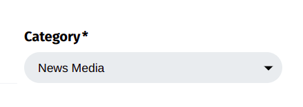
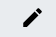

{{}}

Today the Open Observatory of Network Interference (OONI) team is
excited to announce the public launch of our new **[Test Lists Editor](https://test-lists.ooni.org/)**!

This platform enables the public to **review and contribute to the lists
of websites** (“[test lists](https://ooni.org/get-involved/contribute-test-lists)”) that are
**tested for censorship** by [OONI Probe](https://ooni.org/install/)
users around the world.

Help the internet freedom community discover website blocks around the
world by contributing through the new [Test Lists Editor](https://test-lists.ooni.org/)!

* [About test lists](#about-test-lists)

    * [What are test lists?](#what-are-test-lists)

    * [Types of test lists](#types-of-test-lists)

    * [Why contribute to test lists?](#why-contribute-to-test-lists)

    * [Why a web platform to contribute to test lists?](#why-a-web-platform-to-contribute-to-test-lists)

* [Using the Test Lists Editor](#using-the-test-lists-editor)

    * [Adding websites](#adding-websites)

    * [Editing test list entries](#editing-test-list-entries)

    * [Deleting test list entries](#deleting-test-list-entries)

* [Acknowledgements](#acknowledgements)

# About test lists

## What are test lists?

Test lists are [lists of websites](https://github.com/citizenlab/test-lists/tree/master/lists)
that are tested for censorship by [OONI Probe](https://ooni.org/install/) and tools developed by other
projects, such as [Censored Planet](https://censoredplanet.org/projects).

Since 2014, these lists have been [publicly hosted on GitHub](https://github.com/citizenlab/test-lists) by the [Citizen Lab](https://citizenlab.ca/) with the goal of encouraging community
review and contributions. As a result, these lists have been dynamically
updated on an ongoing basis over the years.

Test lists include a wide range of different types of websites based on
[30 standardized categories](https://github.com/citizenlab/test-lists/blob/master/lists/00-LEGEND-new_category_codes.csv)
(such as news media, political criticism, and human rights content).
Since these lists are tested by [OONI Probe](https://ooni.org/install/) users on local networks (who may
experience bandwidth constraints), they usually only include up to 1,000
URLs.

[Unlike a blocklist](https://ooni.org/support/faq/#what-is-the-difference-between-a-test-list-and-a-blocklist)
(which is a list of prohibited websites – all of which are usually
blocked – and may include thousands of URLs), test lists are *not* meant
to be limited to blocked websites. Rather, they serve the purpose of
monitoring when policies change - what’s most likely to be blocked or
unblocked.

While test lists usually include *some* websites that are known to be
blocked, many sites are not censored locally when they are added to test
lists. With test lists, we aim to **discover website censorship** (by
identifying the blocking of sites that were previously accessible), not
only confirm it.

## Types of test lists

There are 2 categories of test lists:

* **[Global test list](https://github.com/citizenlab/test-lists/blob/master/lists/global.csv)**:
Includes a wide range of internationally relevant websites (e.g.
facebook.com), most of which are in English. This list is tested
by **all** [OONI Probe](https://ooni.org/install/) users
globally.

* **[Country-specific test lists](https://github.com/citizenlab/test-lists/tree/master/lists)**:
Each list includes websites that are only relevant to a specific
country (e.g. Brazilian media websites), many of which are in
local languages. [OONI Probe](https://ooni.org/install/) users
test the list of the country that they are running tests from
(e.g. OONI Probe users in Brazil test the [Brazilian test list](https://github.com/citizenlab/test-lists/blob/master/lists/br.csv)).

## Why contribute to test lists?

Discovering cases of website blocking (such as the current [blocking of bbc.com in Russia](https://explorer.ooni.org/measurement/20220517T140500Z_webconnectivity_RU_48642_n1_DC1jDel4Ougo1Zpo?input=http%3A%2F%2Fwww.bbc.com%2Fnews))
really depends on *which* websites you test.

For example, if a specific human rights website is blocked in a country,
but it’s not included in a relevant test list, it won’t be tested by
tools like [OONI Probe](https://ooni.org/install/), which means that
relevant test results will not be [openly published](https://ooni.org/data/). Website censorship findings are
therefore only as interesting as the websites that are tested!

You can play an important role in ensuring that your country’s test list
includes websites that are worth monitoring for censorship.

Updating test lists requires **local knowledge**, an understanding of
which websites are relevant, commonly accessed, and more likely to be
blocked in light of a country’s social and political environment.

Websites constantly change (e.g. domains expire, domains change, new
websites are created), and what is sensitive to blocking changes over
time. It is therefore important that test lists are reviewed and updated
regularly.

The OONI Probe results of website testing are automatically published as
[open data](https://ooni.org/data/) in real-time.

## Why a web platform to contribute to test lists?

Community members with a social science background (such as political
scientists, researchers, journalists, and human rights advocates) are
often best-positioned to update test lists. A deep understanding of a
country’s social and political environment is often a requirement for
identifying the types of websites that risk being censored (as many
website blocks are often politically-motivated, reflect social and
cultural norms, and impact marginalized groups).

However, test lists have been hosted on
[GitHub](https://github.com/citizenlab/test-lists/), which is a
platform mainly used by developers. This has presented a barrier in
contributing to test lists.

To enable our broader community to more easily review and contribute to
test lists, we have created a new [Test Lists Editor](https://test-lists.ooni.org/). This platform includes all of
the [Citizen Lab test lists](https://github.com/citizenlab/test-lists/tree/master/lists), and
users can add URLs, edit existing entries, and propose the removal of
entries through a web interface (without using GitHub). User
contributions (submitted through the Test Lists Editor) automatically
end up as [pull requests on GitHub](https://github.com/citizenlab/test-lists/pulls), which are
peer-reviewed by the [Citizen Lab](https://citizenlab.ca/),
[OONI](https://ooni.org/), [Censored Planet](https://censoredplanet.org/), and
[Netalitica](https://netalitica.com/). Once these pull requests are
reviewed and merged, the contributions are integrated into test lists
and (automatically) prioritized for [OONI Probe](https://ooni.org/install) testing.

# Using the Test Lists Editor

You can use the new [Test Lists Editor](https://test-lists.ooni.org/)
through the following steps.

**Step 1.** Access [https://test-lists.ooni.org/](https://test-lists.ooni.org/)

{{}}

**Step 2.** Add your **email address** in the Email slot (we do *not* store email addresses).

{{}}

**Step 3.** Click **Login**. This will send a link to your email
address.

{{}}

**Step 4.** Click the link (“Please login here”) sent to your email to
log into the Test Lists Editor.

{{}}

**Step 5.** Once logged into the platform, **select a test list**
through the drop-down menu.

{{}}

In this example, we have selected the test list for Azerbaijan.

{{}}

As part of reviewing a test list, you can:

* **Add** websites;

* **Edit** existing entries (update the URL, update the
[category](https://github.com/citizenlab/test-lists/blob/master/lists/00-LEGEND-new_category_codes.csv),
add relevant context in the Notes);

* **Delete** existing entries (for example, if the domain has expired
or is otherwise no longer relevant).

## Adding websites

To add a website to a test list:

**Step 1.** Add the URL (e.g. `https://news.az/`) to the URL slot.

{{}}

**Step 2.** Select a category (e.g. `News Media`) through the Category
drop-down menu to categorize the URL (e.g. `https://news.az/`) you
have added.

{{}}

**Optional.** If you would like to add relevant context pertaining to
the added URL (which can help other researchers), please add it under
Notes.

{{}}

**Step 3.** Click **Add**.

{{}}

Your addition will be saved, and you can continue adding many more
websites.

**Step 4.** When you are done making changes, click **Submit** to
propose your changes.

{{}}

## Editing test list entries

You can edit existing test list entries to:

* **Update the URL.** If a website supports HTTPS, you can update it
to HTTPS. Or if a domain has changed, you can replace the URL with
the new URL.

* **Update the category.** If you think a website is wrongly
categorized, you can change the
[category](https://github.com/citizenlab/test-lists/blob/master/lists/00-LEGEND-new_category_codes.csv).

* **Add notes.** If you would like to share relevant contextual
information pertaining to a URL, please add it in the Notes
section.

To edit existing test list entries:

**Step 1.** Click the **edit icon** in the row of the entry.

{{}}

This will make the editing screen appear.

{{}}

**Step 2.** Edit the entry by updating the URL, updating the category,
or adding useful context in the Notes.

{{}}

**Step 3.** To enable third-party review of your changes, please briefly
explain why you are making these changes in the **Comment** section.

**Step 4.** Click **Done** when you’ve completed your edits.

Your proposed edits (along with any other changes) will appear at the
start of the Test Lists Editor.

{{}}

**Step 5.** When you are done making changes, click **Submit** to
propose your changes.

## Deleting test list entries

You can propose the deletion of a test list entry if a website is no
longer available (e.g expired domain), or if the website is not relevant
to the specific country.

To delete test list entries:

**Step 1.** Click the **delete icon** in the row of the entry.

{{}}

This will make the delete screen appear.

{{}}

**Step 2.** Please explain why you would like to propose the deletion of
a URL (e.g. “Website no longer exists”).

**Step 3.** Click **Delete** to propose the deletion of that URL.

Your proposed deletion (along with any other changes) will appear at the
start of the Test Lists Editor.

{{}}

**Step 4.** When you are done making changes, click **Submit** to
propose your changes.

# Acknowledgements

We thank the [Citizen Lab](https://citizenlab.ca/) for their
leadership in creating the test list project and for publicly hosting
the [test lists on GitHub](https://github.com/citizenlab/test-lists/)
(since 2014), enabling important community contributions over the last 8
years.

Special thanks go to [Netalitica](https://netalitica.com/) researchers
for their excellent work on extensive updates and improvements to
numerous test lists over the last years! Through their network of
country experts and researchers, they have significantly enhanced the
quality of website testing, enabling the discovery of multiple cases of
website censorship around the world.

Warm thanks go to our [partners](https://ooni.org/partners) and all
other community members who have contributed to the test lists over the
years. We also thank community members (such as [Coding Rights](https://www.codingrights.org/) and [The Bachchao Project](https://thebachchaoproject.org/event-report-india-lets-build-the-list/))
who facilitated test list workshops, encouraging contributions from
their local communities.

Finally, we thank all community members who shared feedback for the
development and improvement of our new [Test Lists Editor](https://test-lists.ooni.org/). We hope that this platform will
encourage even more contributions in the years to come!
