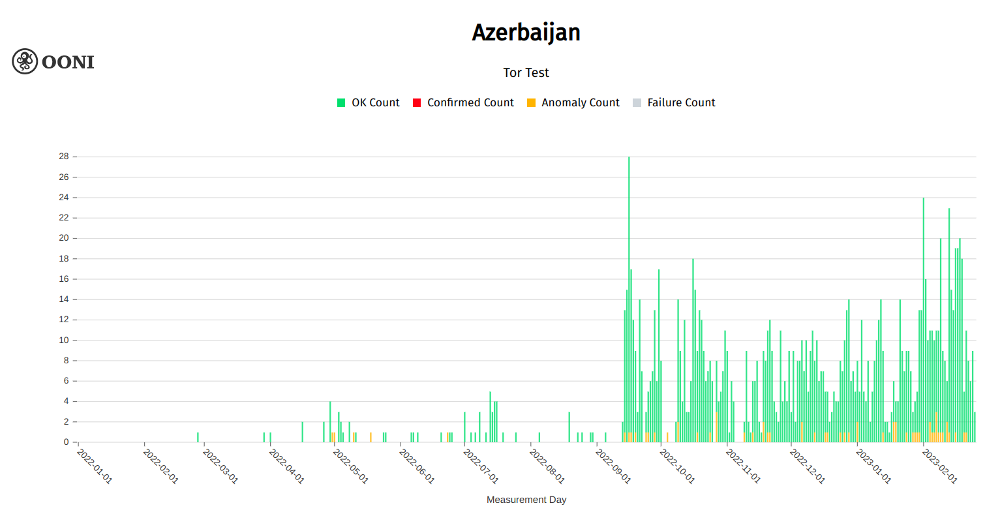

Azerbaijan is known to block access to independent news media websites – we previously [reported](https://ooni.org/post/2021-azerbaijan/) on this in July 2021. At the time, we analyzed OONI measurements collected from Azerbaijan between January 2020 to May 2021 and found that ISPs in Azerbaijan were [blocking access to several independent news media](https://ooni.org/post/2021-azerbaijan/#blocked-news-media-websites) and [circumvention tool sites](https://ooni.org/post/2021-azerbaijan/#blocked-circumvention-tool-sites). We also found that amid the [2020 Nagorno-Karabakh war](https://www.bbc.com/news/world-europe-54324772), ISPs in Azerbaijan [temporarily blocked access to social media](https://ooni.org/post/2021-azerbaijan/#blocking-of-social-media-amid-2020-nagorno-karabakh-war) services, and [attempted to block](https://ooni.org/post/2021-azerbaijan/#tor-and-psiphon) access to [Tor](https://www.torproject.org/) and [Psiphon](https://psiphon.ca/).

But how has Azerbaijan’s internet censorship landscape changed (if at all) over the last year?

We attempt to address this question as part of this report. Specifically, we analyzed [OONI data collected from Azerbaijan](https://explorer.ooni.org/chart/mat?probe_cc=AZ&since=2022-01-01&until=2023-02-24&time_grain=day&axis_x=measurement_start_day&test_name=web_connectivity) between **January 2022 to February 2023** with the goal of evaluating which tested services presented signs of blocking, and whether new blocks had emerged over the past year (in comparison to our [previous report](https://ooni.org/post/2021-azerbaijan/)).



## Key Findings

As part of our analysis of [OONI measurements collected from Azerbaijan](https://explorer.ooni.org/chart/mat?probe_cc=AZ&since=2022-01-01&until=2023-02-24&time_grain=day&axis_x=measurement_start_day&test_name=web_connectivity) between January 2022 to February 2023, we found:

*   **Blocking of news media websites.** Azerbaijan continues to [block access to several independent news media websites](https://explorer.ooni.org/chart/mat?probe_cc=AZ&since=2022-01-01&until=2023-02-24&time_grain=day&axis_x=measurement_start_day&axis_y=domain&test_name=web_connectivity&category_code=NEWS). OONI data also suggests that some ISPs in Azerbaijan [may have started blocking access to](https://explorer.ooni.org/search?since=2022-11-01&until=2023-02-25&failure=false&probe_cc=AZ&domain=www.theguardian.com&only=anomalies) [t](https://explorer.ooni.org/search?since=2022-11-01&until=2023-02-25&failure=false&probe_cc=AZ&domain=www.theguardian.com&only=anomalies)[he Guardian](https://explorer.ooni.org/search?since=2022-11-01&until=2023-02-25&failure=false&probe_cc=AZ&domain=www.theguardian.com&only=anomalies) on 25th December 2022.
*   **Azerbaijan and Russia block each other’s news media.** In [early June 2022](https://www.turan.az/ext/news/2022/6/free/politics_news/ru/5722.htm), Azerbaijan started [blocking access to Russia’s state-run RIA Novosti](https://explorer.ooni.org/search?until=2023-02-24&since=2022-01-01&probe_cc=AZ&test_name=web_connectivity&failure=false&category_code=NEWS&domain=ria.ru) media website. Since (at least) 7th June 2022, Russian ISPs have been [blocking](https://explorer.ooni.org/chart/mat?test_name=web_connectivity&axis_x=measurement_start_day&since=2022-06-01&until=2023-02-25&time_grain=day&probe_cc=RU&axis_y=domain) access to Azerbaijani news media websites (`haqqin.az`, `minval.az`, `oxu.az`, `ru.oxu.az`, `ru.baku.ws`). These blocks remain ongoing.
*   **Temporary blocking of TikTok amid border clashes with Armenia.** During the September 2022 border clashes, both [Azerbaijan and Armenia blocked access to TikTok](https://ooni.org/post/2022-azerbaijan-and-armenia-blocks-tiktok/). While the TikTok block was [lifted](https://explorer.ooni.org/search?since=2022-09-01&until=2022-09-30&failure=false&domain=www.tiktok.com&probe_cc=AM) in Armenia by 21st September 2022 (only lasting about a week), the [TikTok block](https://explorer.ooni.org/search?since=2022-09-01&until=2022-11-30&failure=false&domain=www.tiktok.com&probe_cc=AZ&only=anomalies) remained in place in Azerbaijan until November 2022 (lasting about 2 months).
*   **Blocking of circumvention tool sites.** Azerbaijan continues to [block access to numerous circumvention tool websites](https://explorer.ooni.org/chart/mat?probe_cc=AZ&since=2022-01-01&until=2023-02-24&time_grain=day&axis_x=measurement_start_day&axis_y=domain&test_name=web_connectivity&category_code=ANON), potentially limiting the ability to circumvent internet censorship in Azerbaijan. However, most OONI measurements suggest that tested circumvention tools ([Tor](https://explorer.ooni.org/chart/mat?probe_cc=AZ&since=2022-01-01&until=2023-02-24&time_grain=day&axis_x=measurement_start_day&test_name=tor) and [Psiphon](https://explorer.ooni.org/chart/mat?probe_cc=AZ&since=2022-01-01&until=2023-02-24&time_grain=day&axis_x=measurement_start_day&test_name=psiphon)) appear to be reachable.
*   **Variance of censorship across networks.** While most ISPs in Azerbaijan appear to adopt similar censorship techniques (as we continued to observe connection timeouts in most anomalous measurements across ASNs), different ISPs block access to different websites over time.

## Methods

Since 2012, OONI has developed [free and open source software](https://github.com/ooni/), called [OONI Probe](https://ooni.org/install/), designed to [measure various forms of internet censorship](https://ooni.org/nettest/). OONI Probe is run by volunteers in around 160 countries every month, and their test results are automatically [published by OONI as open data in real-time](https://ooni.org/data/). More than [a billion network measurements](https://explorer.ooni.org/) have been collected and published from 25 thousand networks in 241 countries and territories over the last decade.

To examine internet censorship in Azerbaijan, we analyzed [OONI measurements collected from Azerbaijan](https://explorer.ooni.org/chart/mat?probe_cc=AZ&since=2022-01-01&until=2023-02-24&time_grain=day&axis_x=measurement_start_day&test_name=web_connectivity) between January 2022 to February 2023. The goal of our analysis was to identify which websites and apps presented signs of blocking (“anomalies”) in Azerbaijan during the analysis period, particularly in comparison to blocks previously identified as part of our [past research](https://ooni.org/post/2021-azerbaijan/). 

Specifically, we analyzed measurements collected from [OONI’s Web Connectivity test](https://ooni.org/nettest/web-connectivity/), which is designed to measure the blocking of websites (these websites are publicly hosted on the [Citizen Lab test list Github repository](https://github.com/citizenlab/test-lists/tree/master/lists)). This test measures the accessibility of websites by attempting to perform a [DNS lookup](https://ooni.org/support/glossary/#dns-lookup), TCP/IP connection, and [HTTP GET request](https://ooni.org/support/glossary/#http-request) from two vantage points: (1) the local vantage point of the user and (2) a control network (non-censored network). The results from both networks are automatically compared and if they match, the tested URL is annotated as “accessible” (if the testing succeeds from the control vantage point). If the results differ, the tested URL is annotated as “[anomalous](https://ooni.org/support/faq/#what-do-you-mean-by-anomalies)”, which may provide a signal of potential blocking.

Depending on why the anomaly emerges, the anomalous measurement is automatically annotated as a DNS, TCP/IP, HTTP diff, or HTTP failure anomaly. For example, if the DNS lookup resolves to an IP address which differs from that resolved from the control vantage point, the measurement is annotated as a “DNS anomaly”, which may be a sign of [DNS tampering](https://ooni.org/support/glossary/#dns-tampering).

However, [false positives](https://ooni.org/support/faq/#what-are-false-positives) can occur, which is why we look at anomalous measurements in aggregate in order to determine if a tested URL consistently presents a large volume of anomalous measurements (in comparison to successful measurements) on a tested network. If a tested URL presents a large volume of anomalies, it may provide a stronger signal of potential blocking. If the types of anomalies are consistent (for example, always presenting DNS anomalies on a tested network), they offer an even stronger signal of potential censorship (since they suggest the use of a specific censorship technique, such as [DNS hijacking](https://ooni.org/support/glossary/#dns-hijacking)). But beyond aggregating anomalous measurements, we also analyze the raw data pertaining to anomalous measurements in order to identify the specific errors that occurred as part of the testing, offering insight into how a tested URL is potentially blocked.

Based on our current heuristics, we automatically confirm the blocking of websites when a [block page](https://ooni.org/support/glossary/#block-page) is served and we have added the fingerprint of that blockpage to our database. We also automatically confirm the blocking of websites based on DNS answers containing IP addresses that are known to be associated with implementing internet censorship. For other forms of censorship, we analyze OONI data in order to aggregate anomalous measurements and identify why and how those anomalies occur, offering insight into additional cases of potential blocking.

### Acknowledgement of limitations

The findings of this study present several limitations, including:

*   **Date range of analysis.** The findings are limited to [OONI measurements collected from Azerbaijan](https://explorer.ooni.org/chart/mat?probe_cc=AZ&since=2022-01-01&until=2023-02-24&time_grain=day&axis_x=measurement_start_day&test_name=web_connectivity) between January 2022 to February 2023. As a result, findings from measurements collected in different date ranges are excluded from this study.
*   **Type of measurements.** As part of this study, we primarily focus on OONI [Web Connectivity](https://ooni.org/nettest/web-connectivity/) measurements which pertain to the testing of websites for censorship. This focus was selected due to [known website censorship](https://ooni.org/post/2021-azerbaijan/) in the country, while aggregate views of OONI measurements from [other OONI Probe experiments](https://ooni.org/nettest) did not present an important volume of anomalies that would have warranted more dedicated analysis.
*   **Tested websites.** OONI Probe website testing in Azerbaijan is primarily limited to URLs included in 2 [Citizen Lab test lists](https://github.com/citizenlab/test-lists/tree/master/lists): the [global list](https://github.com/citizenlab/test-lists/blob/master/lists/global.csv) (including internationally-relevant URLs) and the [Azerbaijan list](https://github.com/citizenlab/test-lists/blob/master/lists/az.csv) (only including URLs relevant to Azerbaijan). As these lists are tested by [OONI Probe](https://ooni.org/install) users and there are bandwidth constraints, they are generally limited to around 1,000 URLs. As a result, the lists may exclude other websites which are blocked in Azerbaijan, and the findings are limited to the testing of the URLs included in these lists. Given that the lists are community-curated, we acknowledge the bias in terms of which URLs are added to the lists.
*   **Testing coverage of websites.** Not all URLs included in [test lists](https://github.com/citizenlab/test-lists/tree/master/lists) are measured equally across Azerbaijan over time. Whether OONI data is available for a particular website depends on whether, on which networks, and when an [OONI Probe](https://ooni.org/install) user in Azerbaijan tested it. As a result, tested websites received different testing coverage throughout the analysis period, which impacts the findings. 
*   **Tested ASNs.** The availability of OONI measurements depends on which networks [OONI Probe](https://ooni.org/install) users were connected to when performing tests. As a result, the measurement coverage varies across ASNs throughout the analysis period, impacting the findings.
*   **Measurement volume.** [OONI measurement coverage from Azerbaijan](https://explorer.ooni.org/country/AZ) has been rather limited over the years (in comparison to other countries), limiting our findings and confidence in confirming censorship events. The availability of OONI data depends entirely on volunteers running [OONI Probe](https://ooni.org/install/) locally in Azerbaijan, which can be challenging in light of the political environment, [potential risks](https://ooni.org/about/risks/) involved with running OONI Probe, and the relatively limited digital rights community engagement opportunities in Azerbaijan. That said, we observe an [important spike in the overall measurement volume](https://explorer.ooni.org/chart/mat?probe_cc=AZ&since=2022-01-01&until=2023-02-24&time_grain=day&axis_x=measurement_start_day&test_name=web_connectivity) from 14th September 2022 onwards (which has subsequently remained relatively stable), increasing our ability to detect censorship events thereafter. This is visible through the following chart.

**Chart:** OONI Probe Web Connectivity testing in Azerbaijan between 1st January 2022 to 23rd February 2023 (source: [OONI data](https://explorer.ooni.org/chart/mat?probe_cc=AZ&since=2022-01-01&until=2023-02-24&time_grain=day&axis_x=measurement_start_day&test_name=web_connectivity)).

## Background

In its latest [Freedom on the Net report](https://freedomhouse.org/country/azerbaijan/freedom-net/2022) by Freedom House, Azerbaijan was ranked “not free” among 70 countries assessed for the report. Internet freedoms have been on an overall decline in the country for a number of years, however, the situation escalated during the 2020 war between Armenia and Azerbaijan. Since then, while blocking of social media platforms, and internet throttling have reduced, the state continues to implement various forms of digital surveillance combined with offline measures targeting civil society representatives on a regular basis.

News websites critical of the authorities remain blocked, while the [Law on Media](https://www.az-netwatch.org/news/azerbaijans-media-registry-leaves-media-platforms-in-limbo/) enacted in February 2022 is yet another measure imposed by the state to restrict not only media freedom, and freedom of speech but also access to independent and opposition news.

Journalists across the country remain concerned about the new law. Most recently they have [joined](https://eurasianet.org/azerbaijani-journalists-fight-new-media-registry) in calls to abolish a new media registry introduced in the Media Law.

Meanwhile, civic activists [continue to face](https://www.az-netwatch.org/news/a-year-in-review-from-online-attacks-to-overall-environment-of-internet-censorship-in-azerbaijan/) online targeting. Az-Net Watch in [its December 2022 report](https://www.az-netwatch.org/news/a-year-in-review-from-online-attacks-to-overall-environment-of-internet-censorship-in-azerbaijan/), shared some of the findings of such attacks, identifying persistent trends of phishing attacks, questioning by the law-enforcement bodies over criticism voiced online, interference with personal data and devices, hacking attempts and installed spyware programs.

## Findings

As part of our analysis of [OONI measurements collected from Azerbaijan](https://explorer.ooni.org/chart/mat?probe_cc=AZ&since=2022-01-01&until=2023-02-24&time_grain=day&axis_x=measurement_start_day&test_name=web_connectivity) (between January 2022 to February 2023), we found a number of independent news media websites and circumvention tool websites blocked throughout the analysis period. Many of these blocks have been in place [since at least 2020](https://ooni.org/post/2021-azerbaijan/). Amid border clashes in September 2022, access to [TikTok was blocked](https://ooni.org/post/2022-azerbaijan-and-armenia-blocks-tiktok/) in both Azerbaijan and Armenia. We share further details in the sections below.

### Blocking of news media websites

Several news media websites (which have been [blocked over the last few years](https://ooni.org/post/2021-azerbaijan/#blocked-news-media-websites)) continue to be blocked in Azerbaijan, according to recent OONI data analysis.

The domains that presented the [largest volume of anomalies](https://explorer.ooni.org/chart/mat?probe_cc=AZ&since=2022-01-01&until=2023-02-24&time_grain=day&axis_x=measurement_start_day&axis_y=domain&test_name=web_connectivity&category_code=NEWS) (and overall testing coverage), thereby presenting the strongest signals of blocking in our analysis period, include:

1.  `azerbaycansaati.tv`
2.  `www.24saat.org`
3.  `www.abzas.net`
4.  `www.azadliq.info`
5.  `www.azadliq.org`
6.  `www.meydan.tv`
7.  `www.rferl.org`
8.  `www.gununsesi.org`
9.  `ria.ru`
10.  `www.theguardian.com`

While most of the above domains have been [blocked in Azerbaijan over the last few years](https://ooni.org/post/2021-azerbaijan/#blocked-news-media-websites), the testing of `www.theguardian.com` only started to present anomalies (on several networks) in late December 2022 onwards (we discuss this case in more detail in the next section of this report). Meanwhile, Azerbaijan [reportedly started blocking access to RIA Novosti](https://www.turan.az/ext/news/2022/6/free/politics_news/ru/5722.htm) (Russian state-owned news media) in early June 2022 over the publication of slanderous materials against Azerbaijan. At the time, RIA Novosti’s website (\`ria.ru\`) was only included in other countries' [test lists](https://github.com/citizenlab/test-lists/tree/master/lists); we therefore [added](https://github.com/citizenlab/test-lists/pull/1000) it to the [Global test list](https://github.com/citizenlab/test-lists/blob/master/lists/global.csv) to ensure that it gets tested by [OONI Probe](https://ooni.org/install) users in Azerbaijan and around the world. This is why [OONI measurement coverage](https://explorer.ooni.org/chart/mat?probe_cc=AZ&since=2022-01-01&until=2023-02-25&time_grain=day&axis_x=measurement_start_day&test_name=web_connectivity&domain=ria.ru) of `ria.ru` in Azerbaijan only begins in June 2022. 

Independent Azerbaijani media websites (such as `azadliq.info` and `meydan.tv`) have [reportedly](https://advox.globalvoices.org/2017/05/19/azerbaijan-blocks-independent-media-and-actually-admits-it/) been blocked since early 2017 for “posing a threat” to Azerbaijan’s national security. The state prosecutor reportedly accused these websites of sharing content that promotes violence, hatred, extremism, violates privacy and constitutes slander. However, the blocking of these media outlets may have been [politically motivated](https://advox.globalvoices.org/2017/05/19/azerbaijan-blocks-independent-media-and-actually-admits-it/). Azadliq, for example, reported on the [business dealings](https://www.azadliq.org/a/intihar-sui-qesd/28097510.html) of Vice President Mehriban Aliyeva’s private foundation, while the website of Gunun Sesi (which has [reportedly](https://freedomhouse.org/country/azerbaijan/freedom-net/2020) been blocked since August 2018) is [operated](https://freedomhouse.org/country/azerbaijan/freedom-net/2020) by Parviz Hashimli, a former political prisoner. The blocking of the RFE/RFL website (`www.rferl.org`) also [reportedly](https://www.rferl.org/a/azerbaijan-rferl-service-website-court-orders-blocked/28482679.html) began in 2017 following an Azerbaijani court order.

The following chart aggregates OONI measurement coverage (from [26 ASNs](https://explorer.ooni.org/chart/mat?probe_cc=AZ&since=2022-01-01&until=2023-02-25&time_grain=day&axis_x=measurement_start_day&axis_y=probe_asn&test_name=web_connectivity&category_code=NEWS)) for the news media domains that presented the strongest signals of blocking in Azerbaijan between January 2022 to February 2023.

**Chart:** Blocked news media websites in Azerbaijan between January 2022 to February 2023 (source: [OONI data](https://explorer.ooni.org/chart/mat?probe_cc=AZ&since=2022-01-01&until=2023-02-24&time_grain=day&axis_x=measurement_start_day&axis_y=domain&test_name=web_connectivity&category_code=NEWS)).

Most OONI measurements from the testing of these media websites (excluding `www.theguardian.com`, which is discussed in the next section) presented anomalies throughout the testing period, providing a signal of blocking. In contrast, most of the other URLs tested from the [Citizen Lab test lists](https://github.com/citizenlab/test-lists/tree/master/lists) during this period were found [accessible](https://explorer.ooni.org/search?until=2023-02-24&since=2022-01-01&probe_cc=AZ&test_name=web_connectivity&failure=false) (on the same networks in Azerbaijan).

What is evident from the above chart is that the vast majority of [anomalous measurements](https://explorer.ooni.org/search?until=2023-02-24&since=2022-01-01&probe_cc=AZ&test_name=web_connectivity&failure=false&category_code=NEWS&only=anomalies) presented [connection timeouts](https://explorer.ooni.org/measurement/20230223T180939Z_webconnectivity_AZ_28787_n1_bXGe6rZUa89gjAQQ?input=http%3A%2F%2Fazerbaycansaati.tv%2F) (for sites hosted on both HTTP and HTTPS). A consistent failure type can offer a strong signal of blocking, since it suggests the use of specific censorship techniques. In this case, the connection timeouts may indicate the use of [Deep Packet Inspection (DPI)](https://ooni.org/support/glossary/#dpi) technology for the implementation of blocks, given that the timeout only happens after the TLS ClientHello message. The fact that we observe the prevalence of connection timeouts across anomalous measurements aggregated across tested ASNs further suggests that most ISPs in Azerbaijan adopt similar censorship techniques.

This is further evident when viewing a per-ASN breakdown of the specific failures in the measurement of each of the blocked news media sites. The following chart, for example, presents the specific failures that occurred when `www.24saat.org` was tested on multiple ASNs in Azerbaijan during our analysis period.

**Chart:** Measurement results (`OK` and specific failures) from the testing of `www.24saat.org` on multiple ASNs in Azerbaijan (source: [OONI data](https://explorer.ooni.org/chart/mat?probe_cc=AZ&since=2022-01-01&until=2023-02-25&time_grain=day&axis_x=measurement_start_day&axis_y=probe_asn&test_name=web_connectivity&domain=www.24saat.org)).

From the above chart we can see that most failures (across most tested ASNs) involve timeout errors (annotated in red). But we also observe some successful measurements (annotated as `OK` in green) on some of those networks too. To understand why those measurements were successful, we provide a further breakdown by testing targets. The following chart only presents measurement results (including specific failures observed in anomalous measurements) for the testing of the HTTPS version of the site (`https://www.24saat.org/`) across networks. 

**Chart:** Measurement results (`OK` and specific failures) from the testing of `https://www.24saat.org/` on multiple ASNs in Azerbaijan (source: [OONI data](https://explorer.ooni.org/search?since=2022-01-01&until=2023-02-25&failure=false&input=https%3A%2F%2Fwww.24saat.org%2F&probe_cc=AZ)).

As we can see, the testing of the HTTPS version of the site was entirely successful on some networks, and presented consistent signs of blocking (consistently presenting connection timeouts) on others. In contrast, the testing of the HTTP version of the site (shared in the next chart below) shows that it presented signs of blocking on all of these tested networks.

**Chart:** Measurement results (`OK` and specific failures) from the testing of `http://www.24saat.org/` on multiple ASNs in Azerbaijan (source: [OONI data](https://explorer.ooni.org/search?since=2022-01-01&until=2023-02-25&failure=false&input=http%3A%2F%2Fwww.24saat.org%2F&probe_cc=AZ)).

The fact that we observe more prevalent blocking of the HTTP version of the site (even though it supports HTTPS) suggests that the block is not implemented properly on certain networks.

Similarly, we observe the prevalence of connection timeouts in the testing of many other news media websites across ASNs. The following chart provides a per-ASN breakdown of the [measurement results](https://explorer.ooni.org/search?since=2022-01-01&until=2023-02-25&failure=false&probe_cc=AZ&domain=azerbaycansaati.tv) from the testing of `azerbaycansaati.tv`, showing that none of the measurements were successful, and that most presented connection timeouts.

**Chart:** Measurement results (including specific failures for anomalous measurements) from the testing of `azerbaycansaati.tv` on multiple ASNs in Azerbaijan (source: [OONI data](https://explorer.ooni.org/search?since=2022-01-01&until=2023-02-25&failure=false&probe_cc=AZ&domain=azerbaycansaati.tv)).

The fact that the testing of `azerbaycansaati.tv` was not successful on any of the networks which received the largest volume of testing coverage, and that it consistently presented connection timeouts on most networks, provides a strong signal of blocking.

Similarly, we observe that the testing of `www.azadliq.org`, `www.meydan.tv`, and `www.rferl.org` mostly presented connection timeouts on tested networks, as illustrated through the following charts. 

**Chart:** Measurement results (including specific failures for anomalous measurements) from the testing of `www.azadliq.org` on multiple ASNs in Azerbaijan (source: [OONI data](https://explorer.ooni.org/search?since=2022-01-01&until=2023-02-25&failure=false&probe_cc=AZ&domain=www.azadliq.org)).

**Chart:** Measurement results (including specific failures for anomalous measurements) from the testing of `www.meydan.tv` on multiple ASNs in Azerbaijan (source: [OONI data](https://explorer.ooni.org/search?since=2022-01-01&until=2023-02-25&failure=false&probe_cc=AZ&domain=www.meydan.tv)).

**Chart:** Measurement results (including specific failures for anomalous measurements) from the testing of `www.rferl.org` on multiple ASNs in Azerbaijan (source: [OONI data](https://explorer.ooni.org/search?since=2022-01-01&until=2023-02-25&failure=false&probe_cc=AZ&domain=www.rferl.org)).

OONI data also suggests that the site (www.occrp.org) of the Organized Crime and Corruption Reporting Project (OCCRP) is [blocked](https://explorer.ooni.org/search?since=2022-01-01&until=2023-02-25&failure=false&probe_cc=AZ&domain=www.occrp.org) in Azerbaijan as well. The blocking of the OCCRP site [reportedly](https://www.meydan.tv/en/article/occrp-blocked-in-azerbaijan/) began in September 2017, following the publication of a major investigation (“[Azerbaijani Laundromat](https://www.occrp.org/en/azerbaijanilaundromat/)”) into corruption, bribery, and money laundering in which powerful figures were allegedly involved. The following chart provides a per-ASN breakdown of the [measurement results](https://explorer.ooni.org/search?since=2022-01-01&until=2023-02-25&failure=false&probe_cc=AZ&domain=www.occrp.org) from the testing of `www.occrp.org\`, showing that (similarly to the aforementioned blocked media sites) it presented connection timeouts on most networks.

**Chart:** Measurement results (including specific failures for anomalous measurements) from the testing of `www.occrp.org` on multiple ASNs in Azerbaijan (source: [OONI data](https://explorer.ooni.org/search?since=2022-01-01&until=2023-02-25&failure=false&probe_cc=AZ&domain=www.occrp.org)).

Overall, the prevalence of connection timeouts (observed for different websites measured on many different networks in Azerbaijan) provides a strong signal of blocking. These blocks appear to have been implemented several years ago, and remain ongoing.

#### Blocking of the Guardian?

On 25th December 2022, the testing of `www.theguardian.com` started to present anomalies in Azerbaijan. The following chart aggregates OONI measurement coverage from the testing of `www.theguardian.com` on [10 ASNs](https://explorer.ooni.org/chart/mat?probe_cc=AZ&since=2022-10-01&until=2023-02-25&time_grain=day&axis_x=measurement_start_day&axis_y=probe_asn&test_name=web_connectivity&domain=www.theguardian.com) in Azerbaijan between 1st October 2022 to 24th February 2023.

**Chart:** OONI Probe testing of the Guardian (`www.theguardian.com`) on 10 ASNs in Azerbaijan between 1st October 2022 to 24th February 2023 (source: [OONI data](https://explorer.ooni.org/chart/mat?probe_cc=AZ&since=2022-10-01&until=2023-02-25&time_grain=day&axis_x=measurement_start_day&test_name=web_connectivity&domain=www.theguardian.com)).

However, these anomalies were [not](https://explorer.ooni.org/chart/mat?probe_cc=AZ&since=2022-10-01&until=2023-02-25&time_grain=day&axis_x=measurement_start_day&axis_y=probe_asn&test_name=web_connectivity&domain=www.theguardian.com) [observed on all tested networks](https://explorer.ooni.org/chart/mat?probe_cc=AZ&since=2022-10-01&until=2023-02-25&time_grain=day&axis_x=measurement_start_day&axis_y=probe_asn&test_name=web_connectivity&domain=www.theguardian.com) in Azerbaijan. To better understand the [anomalies](https://explorer.ooni.org/search?since=2022-11-01&until=2023-02-25&failure=false&probe_cc=AZ&domain=www.theguardian.com&only=anomalies), we provide a breakdown of the specific failures observed in anomalous measurements on networks that received the largest testing coverage (through the following chart).

**Chart:** Measurement results (including specific failures for anomalous measurements) from ASNs in Azerbaijan where the testing of `www.theguardian.com` presented anomalies between November 2022 to February 2023 (source: [OONI data](https://explorer.ooni.org/search?since=2022-11-01&until=2023-02-25&failure=false&probe_cc=AZ&domain=www.theguardian.com)).

As is evident from the above chart, all [anomalous measurements](https://explorer.ooni.org/search?since=2022-11-01&until=2023-02-25&failure=false&probe_cc=AZ&domain=www.theguardian.com&only=anomalies) presented connection timeout errors (for both the HTTP and HTTPS versions of the site). The prevalence of connection timeouts, coupled with the fact that it is the same failure that we also observe in the blocking of other news media websites (discussed previously), provides a signal of blocking.

While the data suggests that access to `www.theguardian.com` may be blocked on a few networks in Azerbaijan (particularly on [AS29049](https://explorer.ooni.org/search?since=2022-11-01&until=2023-02-25&failure=false&probe_cc=AZ&domain=www.theguardian.com&probe_asn=AS29049) where we observe the largest volume of anomalies, which is consistent from 25th December 2022 onwards), it’s worth noting that it’s accessible on other networks (such as [AS28787](https://explorer.ooni.org/search?since=2022-11-01&until=2023-02-25&failure=false&probe_cc=AZ&domain=www.theguardian.com&probe_asn=AS28787), where almost all measurements are successful). As we didn’t come across any news articles reporting the recent blocking of the Guardian in Azerbaijan (which could have helped corroborate the anomalous data), and the overall measurement volume is quite low, our confidence in confirming this potential block is rather limited. 

#### Azerbaijani news media websites blocked in Russia

Following the [blocking](https://www.turan.az/ext/news/2022/6/free/politics_news/ru/5722.htm) of Russia’s state-run [RIA Novosti media website](https://explorer.ooni.org/search?until=2023-02-24&since=2022-01-01&probe_cc=AZ&test_name=web_connectivity&failure=false&category_code=NEWS&domain=ria.ru) in Azerbaijan in early June 2022, we were informed that certain Azerbaijani news media websites (`haqqin.az`, `minval.az`, `oxu.az`, `ru.oxu.az`, `ru.baku.ws`) were reportedly blocked in Russia. On 7th June 2022, we [added these URLs to the Russian test list](https://github.com/citizenlab/test-lists/pull/1000/files) so that these websites could get tested by [OONI Probe](https://ooni.org/install) users in Russia.

[OONI data](https://explorer.ooni.org/chart/mat?probe_cc=RU&since=2022-06-01&until=2023-02-25&time_grain=day&axis_x=measurement_start_day&axis_y=domain&test_name=web_connectivity) confirms that these Azerbaijani websites have been blocked in Russia since at least 7th June 2022, and that these blocks remain ongoing (as illustrated below).

**Chart:** OONI data on the blocking of Azerbaijani news media websites in Russia between 7th June 2022 to 24th February 2023 (source: [OONI data](https://explorer.ooni.org/chart/mat?test_name=web_connectivity&axis_x=measurement_start_day&since=2022-06-01&until=2023-02-25&time_grain=day&probe_cc=RU&axis_y=domain)).

The above chart aggregates OONI measurement coverage from numerous networks in Russia, showing that at least 5 Azerbaijani news media domains were blocked in Russia between June 2022 to February 2023. Throughout this period, we observe that almost all measurements are anomalous, suggesting that access to these Azerbaijani media sites is blocked on most tested networks in Russia. Russian ISPs adopt a [variety of censorship techniques](https://ooni.org/post/2022-russia-blocks-amid-ru-ua-conflict/) and, on some networks, we are able to [automatically confirm the blocking](https://explorer.ooni.org/search?since=2022-06-07&until=2022-06-08&probe_cc=RU&test_name=web_connectivity&category_code=NEWS&domain=haqqin.az&failure=false&only=confirmed) of these Azerbaijani news websites based on fingerprints (as IPs known to be associated with censorship are returned as part of DNS resolution).

### Temporary blocking of TikTok in Azerbaijan and Armenia amid border clashes

On 12th September 2022, fighting [erupted](https://www.bbc.com/news/world-europe-62828239) between Azerbaijani and Armenian troops along their border. The next day (13th September 2022), both [Azerbaijan and Armenia started blocking access to TikTok](https://ooni.org/post/2022-azerbaijan-and-armenia-blocks-tiktok/) amid the border clashes.

On 14th September 2022, Azerbaijan’s state security services [announced](https://dtx.gov.az/az/news/1715.html) the temporary suspension of TikTok. According to the statement, the content circulating on the social media platform was revealing military secrets and forming wrong opinions in society. As a result, the State Security Service decided to temporarily block access to the platform. Similarly, OONI data shows that the testing of TikTok also started to present signs of [blocking in Armenia](https://explorer.ooni.org/chart/mat?probe_cc=AM&test_name=web_connectivity&domain=tiktok.com&since=2022-08-16&until=2022-09-16&axis_x=measurement_start_day) from 13th September 2022 onwards.

At the time, we published a [report](https://ooni.org/post/2022-azerbaijan-and-armenia-blocks-tiktok/) documenting the block in both countries based on OONI data. Specifically, we found that [Azerbaijan](https://ooni.org/post/2022-azerbaijan-and-armenia-blocks-tiktok/#blocking-of-tiktok-in-azerbaijan) blocked access to the main TikTok website (`www.tiktok.com`) and several endpoints essential to its functionality on at least 3 networks (AS29049, AS41997, AS31721). On all networks where we identified blocking, it seemed to be implemented by means of TLS level interference by dropping packets after noticing a disallowed server_name. We also observed some level of inconsistency, as ISPs in Azerbaijan blocked TikTok based on different lists of TikTok endpoint domains.

In [Armenia](https://ooni.org/post/2022-azerbaijan-and-armenia-blocks-tiktok/#blocking-of-tiktok-in-armenia), TikTok was blocked on at least two networks (AS44395, AS43733). Not all tested networks in Armenia implemented the TikTok block and censorship techniques varied from network to network. TikTok interference was observed at the DNS level by returning an NXDOMAIN error, an IP address associated with www.google.com, or a set of unrelated IP addresses which offer an invalid TLS certificate (it’s an expired certificate for `it.domain.name`). Several endpoints used by the TikTok app and website were also blocked on at least one network in Armenia.

By comparing aggregate OONI measurements from the testing of TikTok’s website (`www.tiktok.com`) in Azerbaijan and Armenia between 1st September 2022 to 24th February 2023, we can see that both countries started blocking access to TikTok amid the September 2022 border clashes, but that the block remained in place in Azerbaijan for much longer than in Armenia.

**Chart:** OONI Probe testing of TikTok (`www.tiktok.com`) in Armenia and Azerbaijan between 1st September 2022 to 24th February 2023 (source: [OONI data](https://explorer.ooni.org/chart/mat?since=2022-09-01&until=2023-02-25&time_grain=day&axis_x=measurement_start_day&axis_y=probe_cc&test_name=web_connectivity&domain=www.tiktok.com)).

Specifically, we observe (through the above chart) that the TikTok block was [lifted](https://explorer.ooni.org/search?since=2022-09-01&until=2022-09-30&failure=false&domain=www.tiktok.com&probe_cc=AM) in Armenia by 21st September 2022 (only lasting about a week), while the [TikTok block](https://explorer.ooni.org/search?since=2022-09-01&until=2022-11-30&failure=false&domain=www.tiktok.com&probe_cc=AZ&only=anomalies) remained in place in Azerbaijan until November 2022 (lasting about 2 months).

Similarly to the testing of `www.tiktok.com`, OONI data suggests that [Azerbaijan blocked numerous TikTok endpoints](https://explorer.ooni.org/chart/mat?test_name=web_connectivity&axis_x=measurement_start_day&since=2022-09-01&until=2022-11-30&time_grain=day&probe_cc=AZ&axis_y=domain) as well during the same period (between mid-September 2022 to mid-November 2022), as illustrated through the following two charts.  

**Chart:** OONI Probe testing of TikTok endpoints in Azerbaijan between 1st September 2022 to 30th November 2022 (source: [OONI data](https://explorer.ooni.org/chart/mat?test_name=web_connectivity&axis_x=measurement_start_day&since=2022-09-01&until=2022-11-30&time_grain=day&probe_cc=AZ&axis_y=domain)).

**Chart:** OONI Probe testing of TikTok endpoints in Azerbaijan between 1st September 2022 to 30th November 2022 (source: [OONI data](https://explorer.ooni.org/chart/mat?test_name=web_connectivity&axis_x=measurement_start_day&since=2022-09-01&until=2022-11-30&time_grain=day&probe_cc=AZ&axis_y=domain)).

The fact that TikTok’s website (`www.tiktok.com`) and numerous TikTok endpoints presented anomalies on multiple tested networks in Azerbaijan during the same period provides a strong signal of blocking.

Between September to November 2022, the [anomalous measurements](https://explorer.ooni.org/search?since=2022-09-01&until=2022-11-30&failure=false&domain=www.tiktok.com&probe_cc=AZ&only=anomalies) from the testing of TikTok in Azerbaijan show that many of them time out when attempting to establish a TLS handshake to the target endpoint. While many such measurements are annotated (on [OONI Explorer](https://explorer.ooni.org/search?since=2022-09-01&until=2022-11-30&failure=false&domain=www.tiktok.com&probe_cc=AZ&only=anomalies)) as presenting DNS inconsistency, we were able to exclude that by validating that the returned IPs are able to complete a TLS handshake with a valid certificate for the target domain name. Moreover, when issuing an HTTP request with the appropriate headers, the response payload is consistent with the response from an endpoint served to a user in Europe. By inspecting the response header  and server certificate, it seems to be an Akamai cache.

### Blocking of circumvention tool websites

Circumventing internet censorship in Azerbaijan can potentially be challenging, as [numerous circumvention tool websites have been blocked](https://ooni.org/post/2021-azerbaijan/#blocked-circumvention-tool-sites) in Azerbaijan over the past years. Our latest analysis shows that these blocks remain ongoing.

The following chart aggregates [OONI measurement coverage](https://explorer.ooni.org/chart/mat?test_name=web_connectivity&axis_x=measurement_start_day&since=2022-01-01&until=2023-02-24&time_grain=day&probe_cc=AZ&axis_y=domain&category_code=ANON) for popular circumvention tool websites that presented a large volume of anomalies throughout the testing period in Azerbaijan.

**Chart:** Blocked circumvention tool websites in Azerbaijan between January 2022 to February 2023 (source: [OONI data](https://explorer.ooni.org/chart/mat?probe_cc=AZ&since=2022-01-01&until=2023-02-24&time_grain=day&axis_x=measurement_start_day&axis_y=domain&test_name=web_connectivity&category_code=ANON)).

Multiple circumvention tool websites (including `www.torproject.org`, `psiphon.ca`, and `www.tunnelbear.com`) continue to show signs of blocking on some networks in Azerbaijan, as illustrated through the above chart. Specifically, OONI data shows that when these sites were tested, we frequently observed the [timing out of the session after the ClientHello during the TLS handshake](https://explorer.ooni.org/measurement/20221119T180719Z_webconnectivity_AZ_29049_n1_qOeKK5mXoM5sjD3e?input=https%3A%2F%2Fnordvpn.com%2F). It’s worth noting though that these sites are not blocked on all networks in Azerbaijan, as some measurements were successful.

While many popular circumvention tool sites appear to be blocked in Azerbaijan, it’s worth highlighting that certain circumvention tools may work in the country. [OONI Probe](https://ooni.org/install) also includes tests designed to measure the reachability of the [Psiphon](https://ooni.org/nettest/psiphon/), [Tor](https://ooni.org/nettest/tor/) and [Tor Snowflake](https://ooni.org/nettest/tor-snowflake/) circumvention tools.

Between January 2022 to February 2023, [OONI Probe testing of Psiphon](https://explorer.ooni.org/chart/mat?probe_cc=AZ&since=2022-01-01&until=2023-02-26&time_grain=day&axis_x=measurement_start_day&test_name=psiphon) shows that it was reachable on tested networks in Azerbaijan, as illustrated below.

**Chart:** OONI Probe testing of Psiphon on 29 ASNs in Azerbaijan between 1st January 2022 to 25th February 2023 (source: [OONI data](https://explorer.ooni.org/chart/mat?probe_cc=AZ&since=2022-01-01&until=2023-02-26&time_grain=day&axis_x=measurement_start_day&test_name=psiphon)).

Most measurements (collected from [29 ASNs](https://explorer.ooni.org/chart/mat?probe_cc=AZ&since=2022-01-01&until=2023-02-26&time_grain=day&axis_x=measurement_start_day&axis_y=probe_asn&test_name=psiphon) during the testing period) show that it was possible to bootstrap Psiphon and use it to fetch a webpage, suggesting that the [circumvention tool](https://psiphon.ca/en/download.html?psiphonca) worked on tested networks in Azerbaijan.

While the testing of [Tor](https://www.torproject.org/) presented anomalies throughout the testing period, [most measurements](https://explorer.ooni.org/chart/mat?probe_cc=AZ&since=2022-01-01&until=2023-02-26&time_grain=day&axis_x=measurement_start_day&test_name=tor) from September 2022 onwards (when we also observe a spike in the overall measurement volume) suggest that [Tor was reachable](https://explorer.ooni.org/search?since=2022-09-14&until=2023-02-25&probe_cc=AZ&test_name=tor&failure=true) on most tested networks in Azerbaijan.

**Chart:** OONI Probe testing of Tor on 28 ASNs in Azerbaijan between 1st January 2022 to 25th February 2023 (source: [OONI data](https://explorer.ooni.org/chart/mat?probe_cc=AZ&since=2022-01-01&until=2023-02-26&time_grain=day&axis_x=measurement_start_day&test_name=tor)).

In Tor anomalous measurements, we see that attempted connections to Tor directory authorities failed on some networks. However, we also see that most connections to both Tor directory authorities and [Tor bridges](https://bridges.torproject.org/) were [successful](https://explorer.ooni.org/measurement/20210415T185710Z_tor_AZ_39232_n1_tfLLJx1UKF2l9v4H) (on many networks), indicating that it may have been possible to use [Tor](https://www.torproject.org/download/) in Azerbaijan.

Quite similarly, OONI data shows that it was possible to bootstrap [Tor Snowflake](https://snowflake.torproject.org/) on most networks in Azerbaijan throughout the testing period.

**Chart:** OONI Probe testing of Tor Snowflake on 20 ASNs in Azerbaijan between 1st January 2022 to 25th February 2023 (source: [OONI data](https://explorer.ooni.org/chart/mat?test_name=torsf&axis_x=measurement_start_day&since=2022-01-01&until=2023-02-26&time_grain=day&probe_cc=AZ)).

This suggests that while the [Psiphon](https://explorer.ooni.org/search?since=2022-01-01&until=2023-02-25&probe_cc=AZ&test_name=web_connectivity&failure=true&domain=psiphon.ca&only=anomalies) and [Tor Project](https://explorer.ooni.org/search?since=2022-01-01&until=2023-02-25&probe_cc=AZ&test_name=web_connectivity&failure=true&domain=www.torproject.org&only=anomalies) websites appear to be blocked on some networks in Azerbaijan (as discussed previously), their tools appear to work in the country (at least on tested networks).

## Conclusion

Azerbaijan continues to limit press freedom by [blocking access to several independent news media websites](https://explorer.ooni.org/chart/mat?probe_cc=AZ&since=2022-01-01&until=2023-02-24&time_grain=day&axis_x=measurement_start_day&axis_y=domain&test_name=web_connectivity&category_code=NEWS) – the blocking of which appears to be [politically motivated](https://advox.globalvoices.org/2017/05/19/azerbaijan-blocks-independent-media-and-actually-admits-it/). OONI data also suggests that some ISPs in Azerbaijan [may have started blocking access to the Guardian](https://explorer.ooni.org/search?since=2022-11-01&until=2023-02-25&failure=false&probe_cc=AZ&domain=www.theguardian.com&only=anomalies) on 25th December 2022, but the relatively limited measurement coverage and the seemingly absence of news articles reporting the block limit our confidence in confirming this.

In early June 2022, both Azerbaijan and Russia started blocking access to each other’s news media websites. In early June 2022, Azerbaijan started [blocking access to Russia’s state-run RIA Novosti](https://explorer.ooni.org/search?until=2023-02-24&since=2022-01-01&probe_cc=AZ&test_name=web_connectivity&failure=false&category_code=NEWS&domain=ria.ru) media website over the [publication of slanderous materials](https://www.turan.az/ext/news/2022/6/free/politics_news/ru/5722.htm) against Azerbaijan. Since (at least) 7th June 2022, Russian ISPs have been [blocking](https://explorer.ooni.org/chart/mat?test_name=web_connectivity&axis_x=measurement_start_day&since=2022-06-01&until=2023-02-25&time_grain=day&probe_cc=RU&axis_y=domain) access to Azerbaijani news media websites (`haqqin.az`, `minval.az`, `oxu.az`, `ru.oxu.az`, `ru.baku.ws`).

Amid the [September 2022 border clashes](https://www.bbc.com/news/world-europe-62828239), both [Azerbaijan and Armenia started blocking access to TikTok](https://ooni.org/post/2022-azerbaijan-and-armenia-blocks-tiktok/). However, while the TikTok block was [lifted](https://explorer.ooni.org/search?since=2022-09-01&until=2022-09-30&failure=false&domain=www.tiktok.com&probe_cc=AM) in Armenia by 21st September 2022 (only lasting about a week), the [TikTok block](https://explorer.ooni.org/search?since=2022-09-01&until=2022-11-30&failure=false&domain=www.tiktok.com&probe_cc=AZ&only=anomalies) remained in place in Azerbaijan until November 2022 (lasting about 2 months). But this was not the first time that Azerbaijan blocked access to a social media platform during conflict. Azerbaijan previously [blocked access to social media platforms during the 2020 Nagorno-Karabakh war](https://ooni.org/post/2021-azerbaijan/#blocking-of-social-media-amid-2020-nagorno-karabakh-war).

Both social media blocks during times of conflict and long-term news media blocks (as those seen in Azerbaijan) generally indicate government attempts to control political narratives. While numerous [circumvention tool websites appear to be blocked](https://explorer.ooni.org/chart/mat?probe_cc=AZ&since=2022-01-01&until=2023-02-24&time_grain=day&axis_x=measurement_start_day&axis_y=domain&test_name=web_connectivity&category_code=ANON) in Azerbaijan (potentially limiting the ability to circumvent blocks), it’s worth noting that several circumvention tools (such as [Tor](https://explorer.ooni.org/chart/mat?probe_cc=AZ&since=2022-01-01&until=2023-02-24&time_grain=day&axis_x=measurement_start_day&test_name=tor) and [Psiphon](https://explorer.ooni.org/chart/mat?probe_cc=AZ&since=2022-01-01&until=2023-02-24&time_grain=day&axis_x=measurement_start_day&test_name=psiphon)) may work in the country.

This study was carried out through the use of [open methodologies](https://github.com/ooni/spec/tree/master/nettests), [free and open source software](https://ooni.org/install/), and [open data](https://ooni.org/data/), enabling independent third-party verification of our research findings. We encourage researchers to expand upon this study by [running OONI Probe](https://ooni.org/install/) and analyzing [OONI measurements from Azerbaijan](https://explorer.ooni.org/search?since=2023-01-26&until=2023-02-26&failure=false&probe_cc=AZ). 

## Acknowledgements

We thank [OONI Probe](https://ooni.org/install) users in Azerbaijan for contributing measurements, supporting this study.
