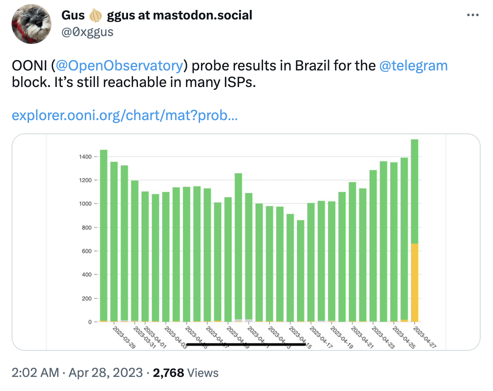
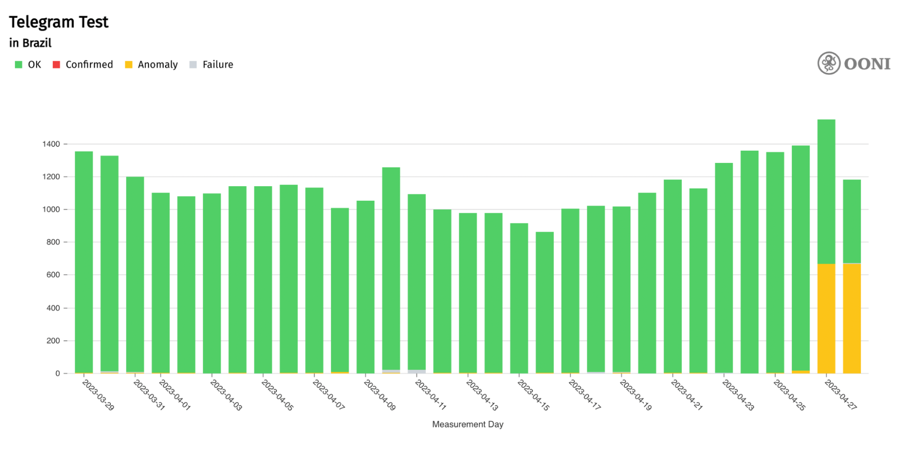
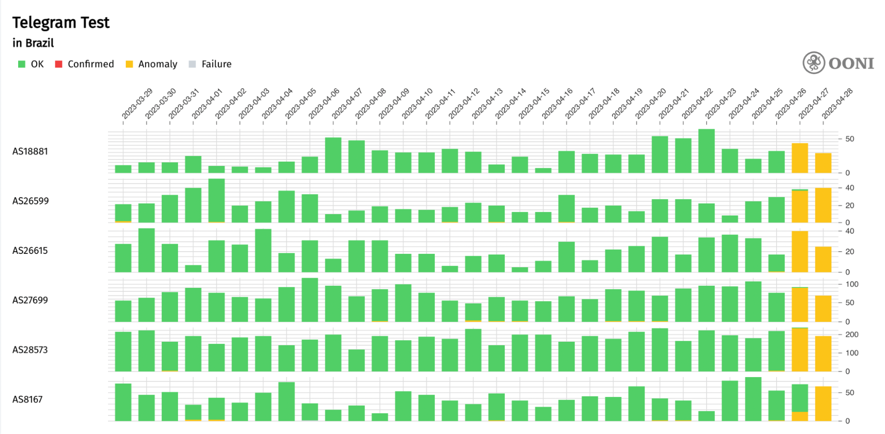
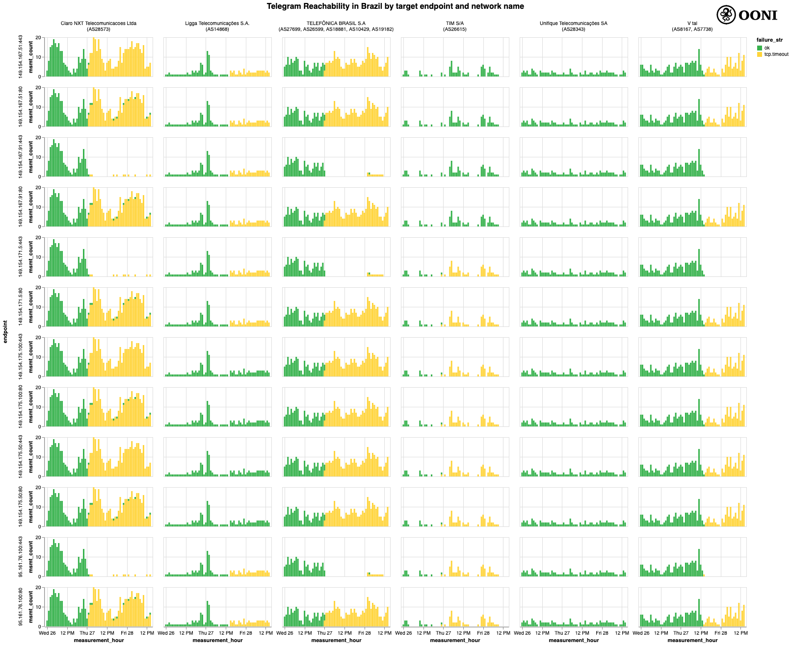
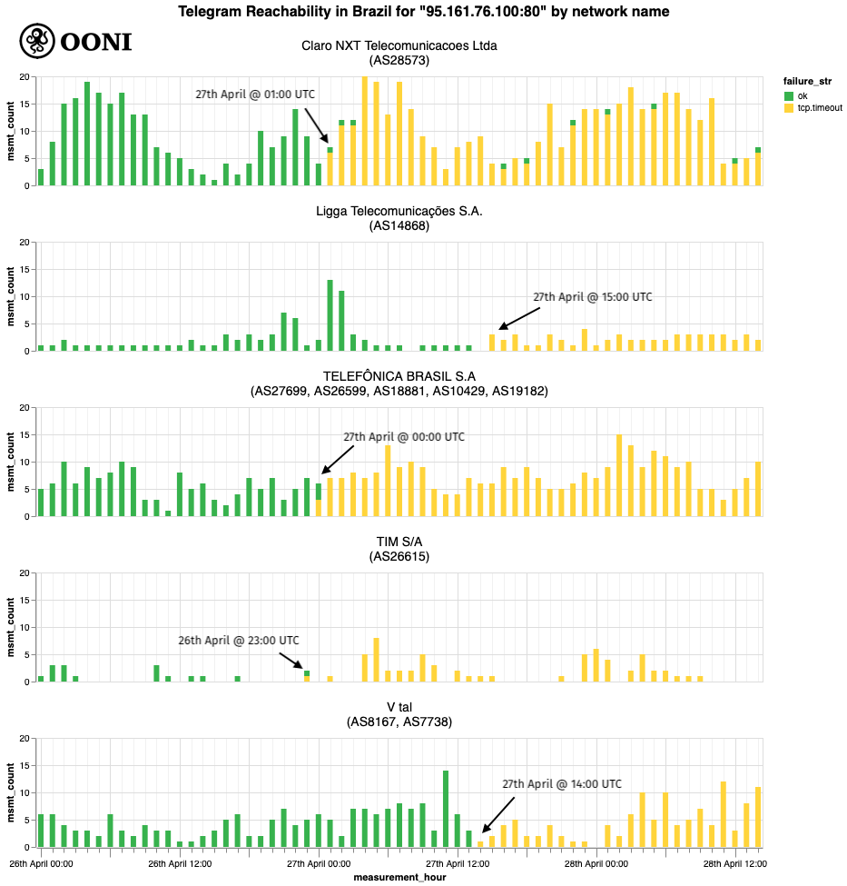

Encontre a versão em português do relatório localizada pela [Coding Rights](https://codingrights.org/) aqui: https://codingrights.org/library-item/brasil-dados-da-ooni-sobre-o-bloqueio-do-telegram/

Two days ago, on 26th April 2023, Brazil started [blocking](https://explorer.ooni.org/chart/mat?probe_cc=BR&since=2023-03-29&until=2023-04-29&time_grain=day&axis_x=measurement_start_day&test_name=telegram) access to Telegram.

On the same day, a federal judge in Brazil [reportedly](https://www.dw.com/en/brazil-court-orders-temporary-suspension-of-telegram-over-neo-nazi-probe/a-65446224) ordered the temporary suspension of Telegram in response to the messaging service’s alleged failure to share all information on neo-Nazi chat groups requested by the police. This information was [reportedly](https://www.nytimes.com/2023/04/26/briefing/brazil-telegram-ban.html) requested as part of a school attacks inquiry, as Brazilian authorities investigate neo-Nazi groups that are believed to have used Telegram to incite school attacks. However, Telegram’s CEO [claims](https://www.washingtonpost.com/business/2023/04/27/telegram-brazil-block/2ec1c1de-e554-11ed-9696-8e874fd710b8_story.html) ([on his Telegram channel](https://web.telegram.org/z/#-1006503122)) that it’s impossible for them to comply with the order, as the judge requested data that is not feasible for them to obtain.

As of 26th April 2023, OONI data [shows](https://explorer.ooni.org/chart/mat?probe_cc=BR&since=2023-03-29&until=2023-04-29&time_grain=day&axis_x=measurement_start_day&test_name=telegram) that some ISPs in Brazil started blocking access to Telegram. In this report, we share [OONI data collected from Brazil](https://explorer.ooni.org/chart/mat?probe_cc=BR&since=2023-03-29&until=2023-04-29&time_grain=day&axis_x=measurement_start_day&test_name=telegram), documenting the block.



## Background

On 19th April 2023, a federal judge in Brazil issued a [decision](https://www.conjur.com.br/dl/telegram-decisao-suspensao.pdf) ordering Telegram to provide the court with the information requested by the Federal Police and the Public Prosecutors' Office. The information requested included the names, official ID numbers, profile pictures, profile statuses, email addresses, physical addresses, bank data, credit card information, linked devices (including IMEI), trusted telephone numbers for two-factor authentication, and account creation logs (including IP addresses, logical port, date, and time) of all users linked to the "Movimento Anti-Semita Brasileiro" channel and a neo-Nazi chat group named "Frente Anti-Semita". In the case of failure to comply with the order, the judge stipulated a daily fine of R$100.000 (roughly 20.000 USD) to the platform, or 5% of its annual gross income in Brazil, whichever is lower.

Telegram [responded](https://www.conjur.com.br/2023-abr-26/juiz-es-determina-suspensao-telegram-todo-brasil) by arguing that, as the groups ended their activities a few months prior to the order, they would be unable to provide the court with all the information requested. The platform was able to identify only the user number, the telephone number, and the creation date of the channel, as it had already been requested by the Federal Police in another case, while it was still active. As for the group, Telegram stated it would not be possible to recover any personal information unless the telephone number of the administrator was provided to them.

The Federal Police, however, stated that the information was not sufficient. The judge sided with the public institutions, remarked that the compliance to the order has been precarious, and stipulated that the information provided by Telegram did not meet the order. On 26th April 2023, the judge [ordered](https://www.conjur.com.br/dl/telegram-decisao-suspensao.pdf) the temporary cessation of Telegram's service in Brazil. This decision was forwarded to several Brazilian Internet Service Providers (ISPs).

The reasoning for the decision is that application providers on the internet, according to the [Brazilian Civil Rights Framework for the Internet law](http://www.planalto.gov.br/ccivil_03/_ato2011-2014/2014/lei/l12965.htm), must store all data for a period of six months. Although Telegram alleged the group and the channel had already been deleted for more time than they are required to keep the data, according to the judge, Telegram has not proven such time had elapsed, and thus did not prove to have ridden itself of the legal obligation to keep the data.

Starting from 26th April 2023, several ISPs in Brazil started to [block](https://explorer.ooni.org/chart/mat?probe_cc=BR&since=2023-03-29&until=2023-04-29&time_grain=day&axis_x=measurement_start_day&test_name=telegram) access to Telegram. Community members from Brazil shared OONI data on the block with their networks. Gustavo Gus from the Tor Project, for example, [reported](https://twitter.com/0xggus/status/1651738674365620225) the blocking of Telegram in Brazil by sharing relevant OONI data on social media.

{{}}

As part of this report, we analyze [OONI data](https://explorer.ooni.org/chart/mat?probe_cc=BR&since=2023-03-29&until=2023-04-29&time_grain=day&axis_x=measurement_start_day&test_name=telegram) collected from Brazil to document the blocking of Telegram.

## Methods

Founded in 2012, the [Open Observatory of Network Interference (OONI)](https://ooni.org/) is a free software project that aims to document internet censorship around the world. To this end, we build free software apps ([OONI Probe](https://ooni.org/install/)) which include [experiments](https://ooni.org/nettest/) designed to measure various forms of internet censorship, including the blocking of [Telegram](https://ooni.org/nettest/telegram). These experiments are run by [OONI Probe](https://ooni.org/install/) users in around 160 countries (including Brazil) every month, testing their networks to detect the blocking of websites and apps. To increase transparency of internet censorship, we publish OONI Probe test results (“measurements”) from around the world as [open data](https://ooni.org/data/) in real-time.

To investigate the blocking of Telegram in Brazil, we analyzed recent measurements collected from the OONI Probe testing of Telegram in the country. The [OONI Probe Telegram experiment](https://ooni.org/nettest/telegram) is designed to measure the reachability of Telegram’s app and web version within a tested network.

More specifically, the test attempts to establish a TCP connection to Telegram’s access points (DCs) and perform an HTTP POST request, as well as an HTTPS GET request to Telegram’s web version (web.telegram.org) over the vantage point of the user. The test results are annotated as “anomalous” (indicating potential blocking) when connections to all access points [defined in the test specification](https://github.com/ooni/spec/blob/master/nettests/ts-020-telegram.md) fail. We acknowledge that this may potentially present a methodological limitation, as it’s possible that ISPs may only block a few endpoints, but not all – and in this case, the measurement result would still be annotated as “successful” (since it requires that connections to all tested endpoints fail in order for the result to be annotated as “anomalous”). We therefore aim to [review our heuristics](https://github.com/ooni/probe/issues/2466) to improve the automated classification of results.

Based on this [methodology](https://github.com/ooni/spec/blob/master/nettests/ts-020-telegram.md), Telegram’s app is likely blocked if TCP connections to all the tested Telegram access points fail, and/or if HTTP POST requests to Telegram’s access points do not send back a response to OONI’s servers. Telegram’s web version (web.telegram.org) is likely blocked if the HTTPS GET requests to web.telegram.org do not send back a consistent response to OONI’s servers.

However, [false positives](https://ooni.org/support/faq#what-are-false-positives) can occur due to a number of reasons, such as due to transient network failures, or if Telegram makes changes to their infrastructure that affect how the [OONI Probe Telegram experiment](https://github.com/ooni/spec/blob/master/nettests/ts-020-telegram.md) runs. We therefore analyze OONI Telegram measurements in aggregate with the goal of evaluating whether the test presents a relatively large volume of anomalies (in comparison to successful measurements) from each tested network during the date range of interest (in this case, comparing Telegram measurements collected from 26th April 2023 onwards with past Telegram measurements collected from Brazil over the last month). This aggregation is performed for all OONI Telegram measurements collected from all tested networks in Brazil.

While a comparatively (with past measurements) large volume of anomalous measurements can be indicative of Telegram blocking, it is necessary to inspect the raw measurement data to rule out false positives, understand why the anomalies occurred, and characterize the potential block. For this (more advanced) analysis, we used our [OONI data analysis tool](https://github.com/ooni/data) which enables us to more effectively analyze the raw measurement data, aggregate based on failure types, and characterize the block.

## Findings

Starting from 27th April 2023, [OONI Probe testing of Telegram in Brazil](https://explorer.ooni.org/chart/mat?probe_cc=BR&since=2023-03-29&until=2023-04-29&time_grain=day&axis_x=measurement_start_day&test_name=telegram) started to present a spike in anomalous measurements, as illustrated in the following chart.

{{}}

**Chart:** OONI Probe testing of Telegram on 378 ASNs in Brazil between 29th March 2023 to 28th April 2023 (source: [OONI MAT](https://explorer.ooni.org/chart/mat?probe_cc=BR&since=2023-03-29&until=2023-04-29&time_grain=day&axis_x=measurement_start_day&test_name=telegram)).

The above chart aggregates OONI Telegram measurement coverage from 378 ASNs in Brazil between 29th March 2023 to 28th April 2023. Successful Telegram measurements (indicating Telegram reachability) are annotated as “OK” (green), while measurements that present anomalies (signs of potential blocking) are annotated as “Anomaly” (orange).

As is evident, almost all measurements over the past month were successful, and in the chart above, we only observe a noticeable increase in anomalous measurements from 27th April 2023 onwards (which matches the timing of the reported block). The comparatively (with past measurements) large volume of anomalous measurements (along with the timing of the anomalies and the fact that they persisted the next day) provides a signal of Telegram blocking in Brazil. However, we also observe that some measurements (on 27th and 28th April 2023) were successful, indicating that if Telegram is blocked, it may not be blocked on all tested networks.

A [per-ASN breakdown of the measurement coverage](https://explorer.ooni.org/chart/mat?probe_cc=BR&since=2023-03-29&until=2023-04-29&time_grain=day&axis_x=measurement_start_day&axis_y=probe_asn&test_name=telegram) suggests that Telegram is not blocked on all tested networks in Brazil. OONI data, for example, shows that Telegram was reachable when tested on [AS262374](https://ipinfo.io/AS262374) on 28th April 2023, as the relevant measurements [show](https://explorer.ooni.org/search?since=2023-04-28&until=2023-04-29&probe_cc=BR&test_name=telegram&failure=true&probe_asn=AS262374) that connections to the tested Telegram endpoints were successful. However, it is possible that blocking may have been implemented for Telegram endpoints not currently included in the [OONI Probe Telegram experiment](https://github.com/ooni/spec/blob/master/nettests/ts-020-telegram.md). Moreover, the fact that the OONI Probe Telegram experiment [requires all tested endpoints to fail](https://github.com/ooni/probe/issues/2466) in order to be annotated as “anomalous” means that it’s possible that in cases where only a few endpoints are blocked (instead of all), those measurements would be annotated as “successful”. We implemented this heuristic because, when we wrote the experiment, it was sufficient for a single DC endpoint to be accessible for the Telegram app to work as intended. As mentioned previously, we may need to [review our heuristics](https://github.com/ooni/probe/issues/2466).

The following chart shares the [ASNs](https://explorer.ooni.org/chart/mat?probe_cc=BR&since=2023-03-29&until=2023-04-29&time_grain=day&axis_x=measurement_start_day&axis_y=probe_asn&test_name=telegram) which presented the largest volume of anomalies (and, therefore, the strongest signals of blocking) from the OONI Probe testing of Telegram in Brazil.

{{}}

**Chart:** ASNs in Brazil where the OONI Probe testing of Telegram presented the largest volume of anomalies between 29th March 2023 to 28th April 2023 (source: [OONI MAT](https://explorer.ooni.org/chart/mat?probe_cc=BR&since=2023-03-29&until=2023-04-29&time_grain=day&axis_x=measurement_start_day&axis_y=probe_asn&test_name=telegram)).

By performing a more detailed analysis using our [OONI data analysis tool](https://github.com/ooni/data) we are able to look at the Telegram reachability tests on a per-TCP-endpoint basis. In the chart below, we can see “TCP connect” observations. Each row represents a distinct TCP endpoint (an IP and port pair), while the columns are distinct network names (the same network name may be used by several different AS numbers). We limited this chart to some selected networks, focusing on the most popular ones, as well as those which had sufficient coverage during the measurement period and highlighted some differences in blocking of particular endpoints.

{{}}

**Chart:** Blocking on selected Telegram endpoints across selected Brazilian ISPs. Each row in the chart shows the status of a specific endpoint and each column of a specific ISP (source: [ooni/data](https://github.com/ooni/data) tool).

What we can see from the above chart is that most networks block all endpoints starting from around 27th April 2023. In some cases, however, the provider did not block all the measured endpoints effectively, but only chose to block some of them. For example, on TIM S/A (AS26615), the four top endpoints are not blocked. Since we observe consistent IP blocking regardless of the port, it’s plausible to speculate that blocking depends on IP address rather than IP address and port. On Ligga Telecomunicações S.A. (AS14868), we observe different endpoints being accessible (from 7th to 10th April 2023 in the chart above). This leads us to believe that there is no information sharing amongst providers of the targets for the block and each provider chooses what to block autonomously. On Unifique Telecomunicações SA (AS28343), we observe no evidence of blocking at all.

Within each network, we see that the block happens at the same time for all endpoints, suggesting that the blocking was deployed at the same time on the same network.

By looking at the blocking time for a particular endpoint across providers, we can see how the time in which the blocking started varies from provider to provider.

{{}}

**Chart**: Blocking of a specific Telegram endpoint for distinct ISPs. From the chart, we can see how each ISP started the blocking at a different point in time (source: [ooni/data](https://github.com/ooni/data) tool).

As is evident through the above chart, TIM was the first provider to implement the block at around 23:00 UTC on 26th April 2023, followed by Telefônica Brasil an hour later, followed by Claro the following hour. Several hours later, at around 14:00 UTC on 27th April 2023, V tal (also known as Oi) started blocking Telegram, followed an hour later by Ligga.

## Conclusion

OONI data [shows](https://explorer.ooni.org/chart/mat?probe_cc=BR&since=2023-03-29&until=2023-04-29&time_grain=day&axis_x=measurement_start_day&test_name=telegram) that some ISPs in Brazil immediately complied with the federal judge’s [decision](https://www.conjur.com.br/dl/telegram-decisao-suspensao.pdf) to suspend Telegram, as the blocking of Telegram started on 26th April 2023. However, the block was not implemented by all ISPs in Brazil, nor was it implemented in the same way. Some ISPs blocked access to all tested Telegram endpoints, while others only blocked some of them. This suggests lack of coordination between providers, and that each ISP implemented the block autonomously.

This is not the first time that access to a popular messaging service is blocked in Brazil over noncompliance with authorities’ requests to hand over user data. WhatsApp, for example, was [temporarily blocked](https://ooni.org/post/brazil-whatsapp-block/) in Brazil (in December 2015 and May 2016) over noncompliance with such requests.

You can continue to monitor the blocking of Telegram in Brazil through [OONI data](https://explorer.ooni.org/chart/mat?probe_cc=BR&since=2023-03-29&until=2023-04-29&time_grain=day&axis_x=measurement_start_day&test_name=telegram), which is automatically published in real-time. We thank [OONI Probe](https://ooni.org/install/) users in Brazil who contributed measurements, supporting this study.
