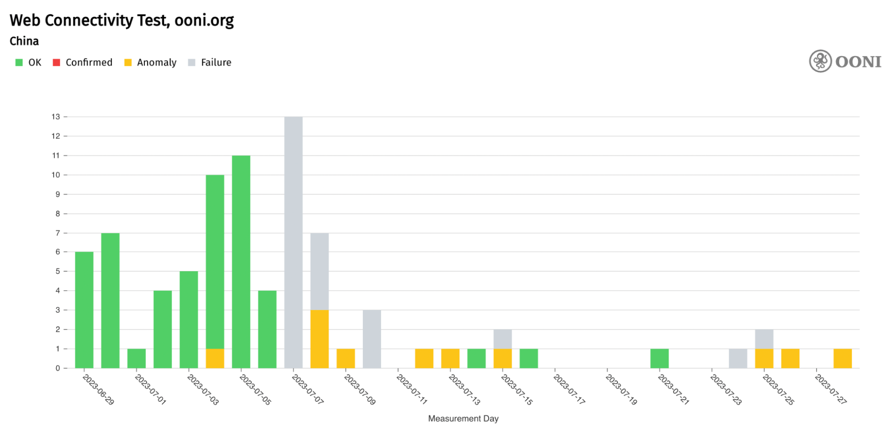
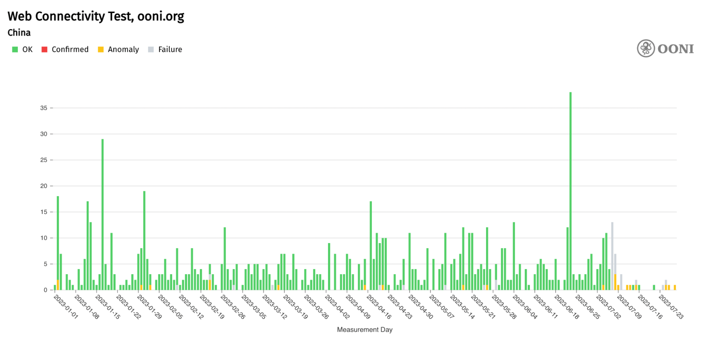
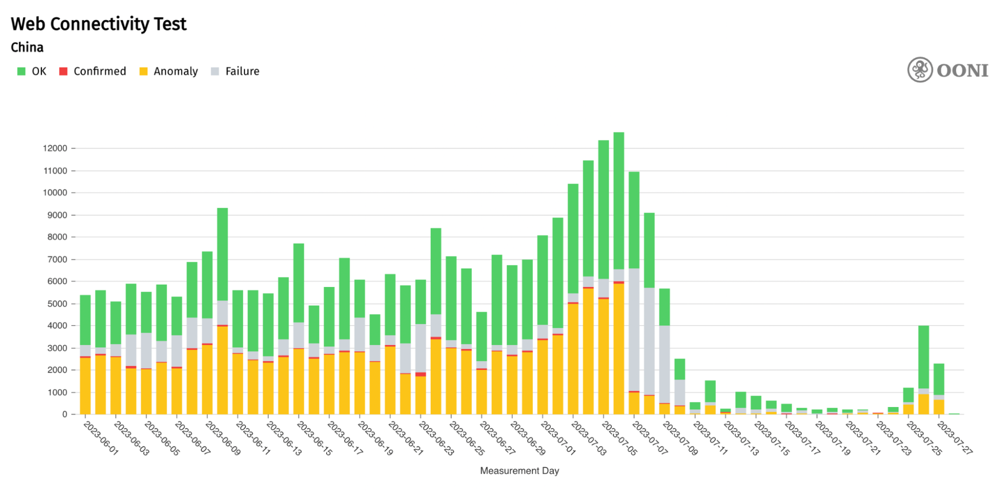
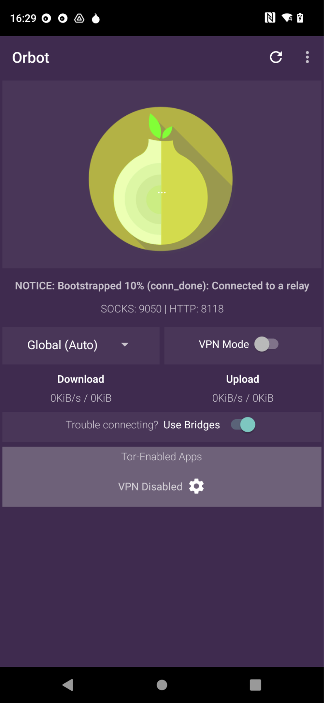
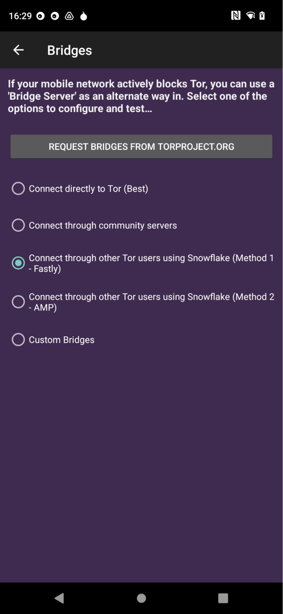
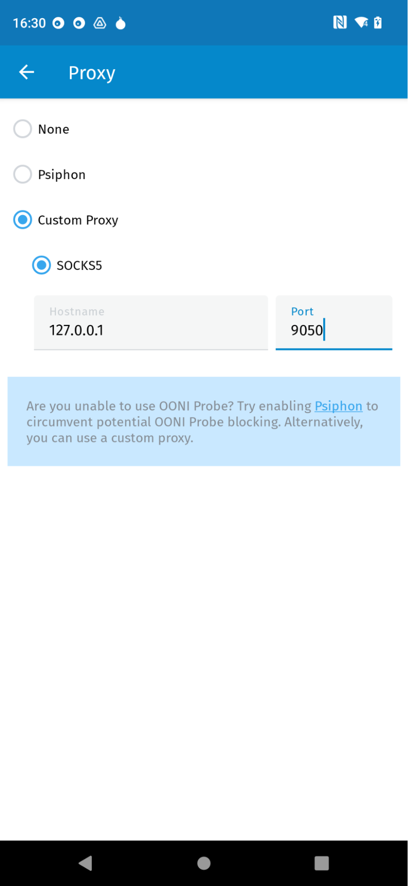

{{}}

We usually [report](https://ooni.org/reports/) on how other services are blocked. This time, we’re reporting on how our own services are blocked.

China recently started blocking access to our website (`ooni.org`) and censorship measurement app ([OONI Probe](https://ooni.org/install/)).

This is not too surprising, given the fact that our work and tools center around measuring and exposing internet censorship (in [China and around the world](https://explorer.ooni.org/)), and China has one of the most advanced and pervasive levels of internet censorship in the world. However, we’re not sure why China decided to start blocking us at this specific moment in time (as opposed to years ago), given that OONI measurements have been [collected from China](https://explorer.ooni.org/country/CN) since 2014. The timing of OONI blocking in China (which seems to have started on 7th July 2023) leads us to think that it might be related to our recent [reporting on the blocking of F-Droid](https://twitter.com/OpenObservatory/status/1673659531639894019) in China in late June 2023. But we also reported on the [blocking of Wikipedia in China](https://ooni.org/post/2019-china-wikipedia-blocking/) back in 2019 (among other [reports](https://ooni.org/reports/) on censorship observed in China), and China did not block our services at the time.

While we have noticed attempts to block our services in other countries in the past (which is why we [added backend proxy support to OONI Probe](https://ooni.org/post/making-ooni-probe-android-more-resilient/) to circumvent any accidental or deliberate blocking of our services), this is the **first time that we’re seeing a large, persistent drop in OONI measurement coverage** as a result of it.

In this report, we share [OONI data](https://explorer.ooni.org/chart/mat?test_name=web_connectivity&axis_x=measurement_start_day&since=2023-06-29&until=2023-07-29&time_grain=day&probe_cc=CN&domain=ooni.org) on the blocking of OONI services in China.



## Blocking of OONI website

Starting from 7th July 2023, access to our website (`ooni.org`) appears to be blocked on several networks in China. The following graph aggregates [OONI measurement coverage](https://explorer.ooni.org/chart/mat?test_name=web_connectivity&axis_x=measurement_start_day&since=2023-06-29&until=2023-07-29&time_grain=day&probe_cc=CN&domain=ooni.org) from the testing of `ooni.org` across networks in China over the past month.

 {{}}

**Chart:** OONI Probe testing of `ooni.org` on 13 ASNs in China between 29th June 2023 to 28th July 2023 (source: [OONI MAT](https://explorer.ooni.org/chart/mat?test_name=web_connectivity&axis_x=measurement_start_day&since=2023-06-29&until=2023-07-29&time_grain=day&probe_cc=CN&domain=ooni.org)).

As is evident from the above chart, all measurements failed on 7th July 2023, and most measurements collected thereafter either failed or presented anomalies. While measurements are generally annotated as “failed” when the OONI Probe experiment fails to perform as expected (for example, as the result of a bug), such measurements can also be [symptomatic of censorship](https://ooni.org/post/improving-data-quality-analysis-of-failed-measurements/). Meanwhile, measurements are annotated as “anomalies” when they present signs of internet censorship (though [false positives](https://ooni.org/support/faq#why-do-false-positives-occur) can occur).

It’s worth noting that OONI measurements collected from the testing of `ooni.org` in China were previously (mostly) successful, showing that `ooni.org` was accessible on tested networks in China before 7th July 2023. Only [one measurement on 4th July 2023 presented an anomaly](https://explorer.ooni.org/m/20230704155647.910233_CN_webconnectivity_ebf0bb00e7ef9ef3) (because DNS queries resulted in timeout errors), but that single measurement does not provide a strong signal of censorship (since the correct IP addresses were returned as part of DNS resolution). 

If we expand the date range of `ooni.org` measurement coverage in China (starting from the beginning of the year), we can more clearly see that most measurements were previously successful (with a few occasional anomalies), and that the ratio of failed and anomalous measurements increased from 7th July 2023 onwards (as illustrated below).

{{}}

**Chart:** OONI Probe testing of `ooni.org` in China between 1st January 2023 to 28th July 2023 (source: [OONI MAT](https://explorer.ooni.org/chart/mat?probe_cc=CN&since=2023-01-01&until=2023-07-29&time_grain=day&axis_x=measurement_start_day&test_name=web_connectivity&domain=ooni.org)).

The above chart not only suggests that China started blocking access to `ooni.org` on 7th July 2023, but that they may have also started blocking access to our backend services, preventing the submission of OONI measurements. The latter is suggested by the drop in measurement coverage (in comparison to previous months) over the last two weeks. We explore this further in the next section of this report.

The collected [data](https://explorer.ooni.org/m/20230728090314.290160_CN_webconnectivity_32735c1db7c056c4) (using our Web Connectivity v0.5 experiment) illustrates the blocking of `https://ooni.org`. The `queries` keys show that DNS lookups using the system and the `8.8.8.8:53/udp` resolvers return the values in the following table.

| IP address                          | AS Number   | Organization               |
|-------------------------------------|-------------|----------------------------|
| 2a03:2880:f12c:183:face:b00c:0:25de | 32934       | Facebook, Inc.             |
| 202.160.130.52                      | 13414       | Twitter Inc.               |
| 111.243.214.169                     | 3462        | Chunghwa Telecom Co., Ltd. |
| 2001::caa0:80d2                     | N/A (bogon) | N/A (bogon)                |

The first three IP addresses are obviously wrong for the `ooni.org` domain (hosted on [AS16509](https://ipinfo.io/AS16509)) and the fourth IP address is [a bogon IP address](https://ipinfo.io/bogon) (i.e., an IP address that should never appear on a public IP network). Serving seemingly random IP addresses belonging to large companies (such as Facebook) to censor DNS queries is [typical of the Great Firewall of China (GFW)](https://www.usenix.org/system/files/sec21-hoang.pdf).

OONI data [shows](https://explorer.ooni.org/m/20230728090314.290160_CN_webconnectivity_32735c1db7c056c4) that the test helper cannot connect to the second and third IP addresses. Because the fourth IP address is a bogon, the test helper does not even bother attempting to establish a connection. The test helper can, instead, connect to the first IP address, but obviously the TLS handshake fails because the given Facebook IP address cannot show a valid X.509 certificate for the `ooni.org` domain name.

In addition to attempting to validate the probe-discovered IP addresses using TLS, the test helper also provides the probes with valid IP addresses for the domain. In this measurement instance, the test helper returns `99.83.231.61` and `75.2.60.5` to the probe. In turn, the probe uses these two addresses, which both fail with connection reset during the TLS handshake.

Our DNS-over-UDP client waits for some time for duplicate DNS responses after receiving the first response. In this measurement, we receive two duplicate responses for each DNS query sent to the `8.8.8.8:53/udp` public DNS resolver. The following table shows the additional responses we received (where the first received response is `1`, the first duplicate is `2`, etc.).

| Domain   | Type | Count | Addresses                   | AS Number   | Organization |
|----------|------|-------|-----------------------------|-------------|--------------|
| ooni.org | AAAA | 2     | [ 2001::a27d:601 ]          | N/A (bogon) | N/A (bogon)  |
| ooni.org | A    | 2     | [ 108.160.165.173 ]         | 19679       | Dropbox Inc  |
| ooni.org | AAAA | 3     | None                        | N/A         | N/A          |
| ooni.org | A    | 3     | [ 75.2.60.5, 99.83.231.61 ] | 16509       | Amazon       |

The third response (second duplicate response) for each query contains the correct result. This fact strongly implies that there are middleboxes responding to queries before the legitimate responses could reach the probes, which is a well-known censorship property of the GFW.

To summarize, we conclude that `https://ooni.org/` is blocked by means of both **DNS injection and TLS interference**. DNS blocking consists of injecting responses containing invalid IP addresses. TLS blocking consists of interfering with the TLS handshake and resetting the TCP connection.

Moreover, OONI data [shows](https://explorer.ooni.org/m/20230728083839.690773_CN_webconnectivity_5f77d630a8e01f0e) the blocking of `https://ooni.torproject.org/`. The methodology used for blocking this URL is the same as discussed above for `https://ooni.org/`, as we observe both DNS injection and connection-reset interference with TLS handshakes.

## Blocking of OONI Probe

China also appears to be attempting to prevent [OONI Probe](https://ooni.org/install/) users from submitting measurements. For starters, this is suggested by the [large and persistent drop in OONI measurement coverage](https://explorer.ooni.org/chart/mat?test_name=web_connectivity&axis_x=measurement_start_day&since=2023-06-01&until=2023-07-29&time_grain=day&probe_cc=CN) from China over the last two weeks.

{{}}**Chart:** OONI Probe Web Connectivity measurements collected from China between 1st June 2023 to 28th July 2023 (source: [OONI MAT](https://explorer.ooni.org/chart/mat?test_name=web_connectivity&axis_x=measurement_start_day&since=2023-06-01&until=2023-07-29&time_grain=day&probe_cc=CN)).

The drop in measurement coverage suggests that most OONI Probe users in China may not be able to submit measurements for publication anymore. This is especially indicated by the fact that a much larger volume of measurements from China was previously collected on a daily basis, and that the drop in measurement coverage has been persistent over the past two weeks. We also observe an overall spike in the number of failed Web Connectivity measurements from 7th July 2023 onwards, which correlates with the date when the blocking of `ooni.org` appears to have started.

To block [OONI Probe](https://ooni.org/install/), ISPs in China would have to block our backend services, preventing OONI Probe users from submitting measurements. We therefore analyzed OONI data (collected through the use of [Snowflake](https://snowflake.torproject.org/) as a proxy) pertaining to the testing of our API and test helpers.

The following table summarizes our findings.

| Measurement | Target domain                | Bogons | Wrong addresses | TCP/IP blocking | TLS blocking |
|-------------|------------------------------|--------|-----------------|-----------------|--------------|
| [Data](https://explorer.ooni.org/m/20230728083857.902250_CN_webconnectivity_3137e005dc184949)  | api.ooni.io                  | ✔️     | ✔️              |                 | ✔️           |
| [Data](https://explorer.ooni.org/m/20230728083916.630047_CN_webconnectivity_72c2f6147ad8d0ba)  | 0.th.ooni.org                | ✔️     | ✔️              |                 | ✔️           |
| [Data](https://explorer.ooni.org/m/20230728180826.427812_CN_webconnectivity_421c328a77903533)  | 1.th.ooni.org                | ✔️     | ✔️              |                 | ✔️           |
| [Data](https://explorer.ooni.org/m/20230728083958.878705_CN_webconnectivity_605dc0e943bcc4d1)  | 2.th.ooni.org                | ✔️     | ✔️              |                 | ✔️           |
| [Data](https://explorer.ooni.org/m/20230728084031.469840_CN_webconnectivity_320f2a264c1ff012)  | 3.th.ooni.org                |        | ✔️              | ✔️              | ✔️           |
| [Data](https://explorer.ooni.org/m/20230728084048.694633_CN_webconnectivity_3f80c26bd9c93334)  | dkyhjv0wpi2dk.cloudfront.net |        |                 |                 | ✔️           |

The bogons, wrong addresses, and TLS blocking censorship conditions are exactly the same as previously discussed for the blocking of `https://ooni.org/`. In fact, we can synthetically characterize the blocking of `https://ooni.org/` as bogons, wrong addresses, and TLS blocking. The TCP/IP blocking censorship condition indicates we could not establish a TLS connection. Success indicates that we could successfully communicate with a server.

The `api.ooni.io`, `0.th.ooni.org`, `1.th.ooni.org` and `2.th.ooni.org` domains are blocked just like `ooni.org` is blocked.

The `3.th.ooni.org` domain differs from `ooni.org` in that the DNS responses did not include bogons but, rather, only included IP addresses that are not related to the `3.th.ooni.org` domain. Moreover, the IP address of the test helper is TCP/IP blocked as well. It’s unclear to us why they chose to block this test helper by IP, yet did not do the same for the other test helpers.

Through manual testing we were able to confirm that the SNI `3.th.ooni.org` is also being filtered and the filtering rule seems to apply to any subdomain of ooni.org or ooni.io.

Finally, `dkyhjv0wpi2dk.cloudfront.net`, our cloudfront endpoint, is only blocked during TLS handshakes. All the IP addresses returned by the local resolvers are legitimate.

## Circumvention

To enable OONI Probe users worldwide to circumvent the accidental or deliberate blocking of our services, the [OONI Probe mobile app](https://ooni.org/install/mobile) includes [backend proxy settings](https://ooni.org/support/ooni-probe-mobile#ooni-backend-proxy). Through these settings, you can enable [Psiphon](https://psiphon.ca/) or use a custom proxy for submitting OONI measurements.

OONI Probe users in China can [install Orbot on Android](https://play.google.com/store/apps/details?id=org.torproject.android) and configure it to use [Snowflake](https://snowflake.torproject.org/). They can then edit the [backend proxy](https://ooni.org/support/ooni-probe-mobile#ooni-backend-proxy) [settings](https://ooni.org/support/ooni-probe-mobile#ooni-backend-proxy) [of the OONI Probe mobile app](https://ooni.org/support/ooni-probe-mobile#ooni-backend-proxy) to use a custom proxy and point it to `127.0.0.1:9050`.

Specifically, this can be done through the following steps:

1.  Install Orbot from the [Play Store](https://play.google.com/store/apps/details?id=org.torproject.android&hl=en) or [download the APK from GitHub](https://github.com/guardianproject/orbot/releases/tag/17.0.0-RC-1-tor.0.4.7.11).

2.  Open Orbot and **enable the Use Bridges** option.

{{}}

3.  Select “**Connect through other Tor users using Snowflake (Method 1 - Fastly)**” and tap the back button.

{{}}

4.  Start Orbot by tapping on the big onion logo and wait for it to start.

5.  Inside of OONI Probe go into Settings -> [OONI backend proxy](https://ooni.org/support/ooni-probe-mobile#ooni-backend-proxy).

6.  Select “**Custom proxy**” and enter `127.0.0.1` as the hostname and `9050` for the port.

{{}}

If you [run OONI Probe](https://ooni.org/support/ooni-probe-mobile#running-ooni-probe-mobile), you should now be able to submit measurements for [publication](https://ooni.org/data/) using [Orbot](https://play.google.com/store/apps/details?id=org.torproject.android) and [Snowflake](https://snowflake.torproject.org/).

**Important:** Running OONI Probe can be [risky](https://ooni.org/about/risks), particularly in China. Now that ISPs in China are blocking OONI services, running OONI Probe in China may draw more attention and pose increased risk.  

## Conclusion

OONI measurements have been [collected from China](https://explorer.ooni.org/country/CN) since 2014, documenting the advanced and pervasive levels of internet censorship in the country. The recent blocking of our backend services means that running [OONI Probe](https://ooni.org/install/) in China is now harder (and potentially [riskier](https://ooni.org/about/risks)), resulting in the [significant drop](https://explorer.ooni.org/chart/mat?probe_cc=CN&since=2023-06-29&until=2023-07-29&time_grain=day&axis_x=measurement_start_day&test_name=web_connectivity) in OONI measurement coverage over the past weeks.

We are particularly concerned about this block because [OONI data from China](https://explorer.ooni.org/chart/mat?probe_cc=CN&since=2023-06-29&until=2023-07-29&time_grain=day&axis_x=measurement_start_day&test_name=web_connectivity) has served as a large open dataset on internet censorship in the country. Spanning from 2014 to date, consisting of [more than 8 million measurements collected from 193 networks](https://explorer.ooni.org/country/CN), OONI data has provided unique insight into China’s internet censorship landscape over the past 9 years. If OONI blocking continues, it would limit researchers’ ability to study internet censorship in China in the future.

This block therefore highlights that we need to improve our circumvention capabilities. While OONI Probe includes [backend proxy settings](https://ooni.org/support/ooni-probe-mobile#ooni-backend-proxy) for evading accidental or deliberate blocking, more work is needed to improve OONI Probe resiliency to help ensure that censorship measurement is still possible in censored environments.  

## Acknowledgements

We thank all those who ran [OONI Probe](https://ooni.org/install/) in China over the past 9 years.
