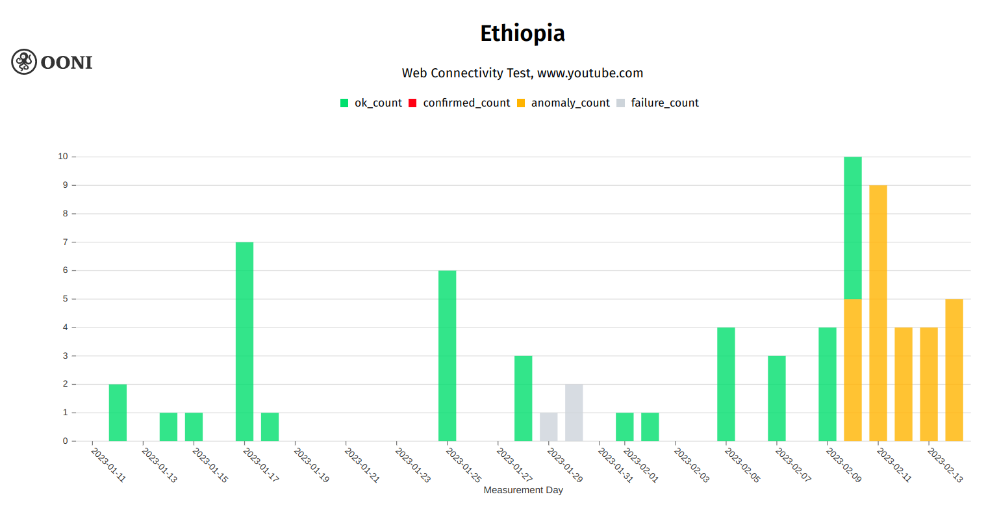

On 9th February 2023, amid church split tensions and calls for
anti-government protests, access to social media platforms (TikTok,
Facebook, Telegram) was [reportedly blocked](https://www.washingtonpost.com/world/ethiopias-social-media-blocked-amid-church-split-tensions/2023/02/10/15781c44-a93d-11ed-b2a3-edb05ee0e313_story.html)
in Ethiopia. Access Now also published a
[statement](https://www.accessnow.org/ethiopia-social-media-protest/)
urging authorities in Ethiopia to stop blocking access to social media.

OONI data collected from Ethiopia provides signals of these blocks.
Specifically, OONI data shows the ongoing blocking of
[Facebook](https://explorer.ooni.org/chart/mat?probe_cc=ET&test_name=web_connectivity&domain=www.facebook.com&since=2023-01-11&until=2023-02-15&axis_x=measurement_start_day)
and
[Telegram](https://explorer.ooni.org/chart/mat?probe_cc=ET&test_name=telegram&since=2023-01-11&until=2023-02-15&axis_x=measurement_start_day)
(since 9th February 2023) and
[YouTube](https://explorer.ooni.org/chart/mat?probe_cc=ET&test_name=web_connectivity&domain=www.youtube.com&since=2023-01-11&until=2023-02-15&axis_x=measurement_start_day)
(since 10th February 2023).

* [Blocking of Facebook](#blocking-of-facebook)

* [Blocking of TikTok?](#blocking-of-tiktok)

* [Blocking of Telegram](#blocking-of-telegram)

* [Blocking of YouTube](#blocking-of-youtube)

* [Conclusion](#conclusion)

# Blocking of Facebook

[OONI data](https://explorer.ooni.org/chart/mat?probe_cc=ET&test_name=web_connectivity&domain=www.facebook.com&since=2023-01-11&until=2023-02-15&axis_x=measurement_start_day)
from the testing of Facebook in Ethiopia provides signals of blocking,
starting from 9th February 2023.

The following
[chart](https://explorer.ooni.org/chart/mat?probe_cc=ET&test_name=web_connectivity&domain=www.facebook.com&since=2023-01-11&until=2023-02-15&axis_x=measurement_start_day)
aggregates OONI measurement coverage from the testing of
`www.facebook.com` in Ethiopia between 11th January 2023 to 14th
February 2023.

{{}}

**Chart:** OONI Probe testing of Facebook (`www.facbook.com`) in
Ethiopia between 11th January 2023 to 14th February 2023 (source: [OONI MAT](https://explorer.ooni.org/chart/mat?probe_cc=ET&test_name=web_connectivity&domain=www.facebook.com&since=2023-01-11&until=2023-02-15&axis_x=measurement_start_day)).

While the measurement coverage is rather limited, it’s worth noting that
we start to observe a spike in
[anomalies](https://explorer.ooni.org/search?since=2023-02-09&until=2023-02-15&probe_cc=ET&test_name=web_connectivity&domain=www.facebook.com&failure=false)
(resulting in [connection timeouts](https://explorer.ooni.org/measurement/20230211T120127Z_webconnectivity_ET_24757_n1_UaTRrjzNoa20cYU8?input=https%3A%2F%2Fwww.facebook.com%2F))
from 9th February 2023 onwards, which coincides with the timing of the
reported block. When inspecting the [raw data](https://explorer.ooni.org/measurement/20230211T120127Z_webconnectivity_ET_24757_n1_UaTRrjzNoa20cYU8?input=https%3A%2F%2Fwww.facebook.com%2F)
of anomalous measurements, we observe that connections time out after
sending the first TLS handshake message (ClientHello).

{{}}

**Image:** OONI data from the testing of `www.facebook.com` in
Ethiopia on 11th February 2023, showing TLS handshake timeout (source:
[OONI data](https://explorer.ooni.org/measurement/20230211T120127Z_webconnectivity_ET_24757_n1_UaTRrjzNoa20cYU8?input=https%3A%2F%2Fwww.facebook.com%2F)).

The TLS handshake timeouts observed in anomalous measurements suggest
that access to Facebook is blocked by means of **TLS-level
interference**. The [latest measurements](https://explorer.ooni.org/search?since=2023-02-09&until=2023-02-15&probe_cc=ET&test_name=web_connectivity&domain=www.facebook.com&failure=false)
from the testing of Facebook continue to
[show](https://explorer.ooni.org/measurement/20230214T055217Z_webconnectivity_ET_24757_n1_Sc63NwMMTJl790aZ?input=https%3A%2F%2Fwww.facebook.com%2F)
that TLS handshakes result in timeout errors, suggesting that the block
is ongoing.

# Blocking of TikTok?

On 10th February 2023, TikTok presented anomalies (signs of blocking)
when tested in Ethiopia.

The following chart aggregates OONI measurement coverage from the
testing of TikTok (`www.tiktok.com`) in Ethiopia between 11th January
2023 to 14th February 2023.

{{}}

**Chart:** OONI Probe testing of TikTok
(`www.tiktok.com`) in Ethiopia between 11th
January 2023 to 14th February 2023 (source: [OONI MAT](https://explorer.ooni.org/chart/mat?probe_cc=ET&test_name=web_connectivity&domain=www.tiktok.com&since=2023-01-11&until=2023-02-15&axis_x=measurement_start_day)).

As is evident, TikTok has been tested very few times in Ethiopia over
the last month, and the limited measurement coverage provides an
important limitation to our findings. Yet, it’s worth noting that while
TikTok was previously found accessible, we see that its testing only
presented
[anomalies](https://explorer.ooni.org/search?since=2023-02-10&until=2023-02-11&probe_cc=ET&test_name=web_connectivity&domain=www.tiktok.com&failure=true)
on 10th February 2023, which coincides with the timing of the
[reported](https://www.washingtonpost.com/world/ethiopias-social-media-blocked-amid-church-split-tensions/2023/02/10/15781c44-a93d-11ed-b2a3-edb05ee0e313_story.html)
block.

We also observe anomalies in the [testing of TikTok endpoints](https://explorer.ooni.org/chart/mat?probe_cc=ET&test_name=web_connectivity&since=2023-01-11&until=2023-02-15&axis_x=measurement_start_day&axis_y=domain)
in Ethiopia on 10th February 2023, as illustrated below.

{{}}

**Chart:** OONI Probe testing of TikTok endpoints in Ethiopia on 10th
February 2023 (source: [OONI MAT](https://explorer.ooni.org/chart/mat?probe_cc=ET&test_name=web_connectivity&since=2023-01-11&until=2023-02-15&axis_x=measurement_start_day&axis_y=domain)).

While the presence and timing of anomalies (some resulting in
[connection timeouts](https://explorer.ooni.org/measurement/20230210T113207Z_webconnectivity_ET_24757_n1_w0roNyB5tVzY1c4I?input=https%3A%2F%2Fp77-sign-va.tiktokcdn.com%2Frobots.txt)
and others in [connection resets](https://explorer.ooni.org/measurement/20230210T113207Z_webconnectivity_ET_24757_n1_w0roNyB5tVzY1c4I?input=https%3A%2F%2Fm.tiktok.com%2Frobots.txt))
suggests the potential blocking of TikTok, our confidence in confirming
this block is limited by the limited measurement volume.

# Blocking of Telegram

On 9th February 2023, the OONI Probe testing of Telegram in Ethiopia
started presenting a larger volume of anomalies, suggesting blocking of
the service.

The following
[chart](https://explorer.ooni.org/chart/mat?probe_cc=ET&test_name=telegram&since=2023-01-11&until=2023-02-15&axis_x=measurement_start_day)
aggregates OONI measurement coverage from the testing of Telegram in
Ethiopia between 11th January 2023 to 14th February 2023.

{{}}

**Chart:** OONI Probe testing of Telegram in Ethiopia between 11th
January 2023 to 14th February 2023 (source: [OONI MAT](https://explorer.ooni.org/chart/mat?probe_cc=ET&test_name=telegram&since=2023-01-11&until=2023-02-15&axis_x=measurement_start_day)).

Specifically, we observe that all measurements [collected from 18:52 UTC on 9th February 2023 onwards](https://explorer.ooni.org/search?since=2023-02-09&until=2023-02-10&probe_cc=ET&test_name=telegram&probe_asn=24757&failure=true)
present
[anomalies](https://explorer.ooni.org/search?since=2023-02-09&until=2023-02-15&probe_cc=ET&test_name=telegram&failure=false).
Through the [raw data](https://explorer.ooni.org/measurement/20230213T200634Z_telegram_ET_24757_n1_rnqhdG6z6IOKy9Q3)
of these anomalous measurements, we see that while TCP connections to
tested Telegram endpoints were successful, HTTP POST requests timeout
after sending the request, and that the testing of Telegram Web
(`web.telegram.org`) resulted in timeout errors. Based on [OONI’s Telegram testing methodology](https://ooni.org/nettest/telegram/), this
suggests that access to both Telegram’s mobile app and web interface was
interfered with.

Meanwhile, the [latest measurements](https://explorer.ooni.org/search?since=2023-02-09&until=2023-02-15&probe_cc=ET&test_name=telegram&failure=false)
from Ethiopia (collected on 14th February 2023), suggest that the
blocking of Telegram is ongoing.

# Blocking of YouTube

Starting from [17:28 UTC on 10th February 2023](https://explorer.ooni.org/search?since=2023-02-10&until=2023-02-11&probe_cc=ET&test_name=web_connectivity&domain=www.youtube.com&failure=true),
OONI data collected from Ethiopia started presenting anomalies every
time YouTube (`www.youtube.com`) was tested, providing a signal of
blocking.

The following
[chart](https://explorer.ooni.org/chart/mat?probe_cc=ET&test_name=web_connectivity&domain=www.youtube.com&since=2023-01-11&until=2023-02-15&axis_x=measurement_start_day)
aggregates OONI measurement coverage from the testing of YouTube
(`www.youtube.com`) in Ethiopia between 11th January 2023 to 14th
February 2023.

{{}}

**Chart:** OONI Probe testing of YouTube (`www.youtube.com`) in
Ethiopia between 11th January 2023 to 14th February 2023 (source: [OONI MAT](https://explorer.ooni.org/chart/mat?probe_cc=ET&test_name=web_connectivity&domain=www.youtube.com&since=2023-01-11&until=2023-02-15&axis_x=measurement_start_day)).

Similarly to the testing of Facebook (discussed previously), access to
YouTube appears to be blocked by means of **TLS-level interference** as
the [connection times out](https://explorer.ooni.org/search?since=2023-02-10&until=2023-02-15&probe_cc=ET&test_name=web_connectivity&domain=www.youtube.com&failure=false)
after the first TLS ClientHello message is written.

{{}}

**Chart:** Measurement failures for `www.youtube.com` in Ethiopia
between 2nd January 2023 to 14th February 2023 (source: [OONI data](https://explorer.ooni.org/search?since=2023-02-10&until=2023-02-15&probe_cc=ET&test_name=web_connectivity&domain=www.youtube.com&failure=false)).

{{}}

**Image:** OONI data from the testing of `www.youtube.com` in Ethiopia
on 14th February 2023, showing TLS handshake timeout (source: [OONI data](https://explorer.ooni.org/measurement/20230214T055217Z_webconnectivity_ET_24757_n1_Sc63NwMMTJl790aZ?input=https%3A%2F%2Fwww.youtube.com%2F)).

The blocking of YouTube is further suggested by Google’s Transparency
Report, which shows a [significant drop in YouTube traffic](https://transparencyreport.google.com/traffic/overview?fraction_traffic=start:1675555200000;end:1676332799999;product:21;region:ET&lu=fraction_traffic)
from Ethiopia during the same period (starting from 10th February 2023).

{{}}

**Chart:** YouTube traffic from Ethiopia between 5th February 2023 to
13th February 2023 (source: [Google Transparency Report](https://transparencyreport.google.com/traffic/overview?fraction_traffic=start:1675555200000;end:1676332799999;product:21;region:ET&lu=fraction_traffic)).

The above chart suggests that access to YouTube is still disrupted in
Ethiopia, and this is further corroborated by the [latest OONI measurements](https://explorer.ooni.org/search?since=2023-02-10&until=2023-02-15&probe_cc=ET&test_name=web_connectivity&domain=www.youtube.com&failure=false).

# Conclusion

Ethiopia has [blocked access to social media platforms](https://ooni.org/post/resurgence-internet-censorship-ethiopia-2019/)
several times over the past years. Some of these events coincided with
Ethiopia’s national high school exams (allegedly in an attempt to
prevent students from cheating) and following a [coup attempt](https://www.bbc.com/news/world-africa-48734572) in the Amhara
region. The latest (and currently ongoing) social media blocks in
Ethiopia appear to resemble a similar pattern of information controls
implemented in moments of tension.

That said, access to social media platforms is [commonly blocked](https://ooni.org/documents/2022-ooni-submission-ohchr-report-internet-shutdowns.pdf)
during moments of political tension in many countries around the world.
Many of these cases raise concerns related to human rights, particularly
since freedom of expression and access to information is critical in
politically-sensitive moments.

We thank [OONI Probe](https://ooni.org/install) users in Ethiopia who
contributed measurements, supporting this study. You can continue to
monitor the testing of services in Ethiopia through the [OONI Measurement Aggregation Toolkit (MAT)](https://explorer.ooni.org/chart/mat?probe_cc=ET&test_name=web_connectivity&since=2023-01-16&until=2023-02-16&axis_x=measurement_start_day),
which publishes OONI measurements as open data in real-time.
