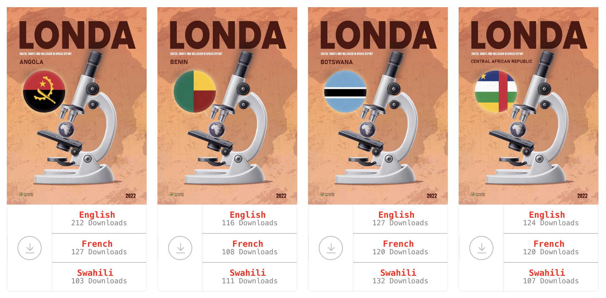
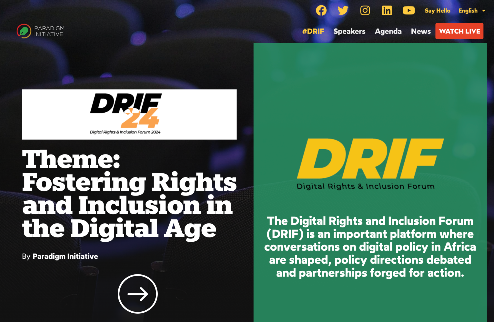

Today we are thrilled to publish an interview with **Ihueze Nwobilor**: Senior Programs Officer with [Paradigm Initiative](https://paradigmhq.org/team/ihueze-nwobilor/). Through our [partnership with Paradigm Initiative](https://ooni.org/partners/paradigm-initiative/), we have had the opportunity to collaborate on several research reports examining internet censorship in Nigeria. Ihueze’s work is focused on digital inclusion and on making digital technologies accessible to the under-served communities in numerous African countries, including Kenya, Nigeria, Senegal, South Sudan, Zambia, and Zimbabwe. 

Since the [blocking of Twitter in Nigeria in 2021](https://www.accessnow.org/press-release/nigeria-blocks-twitter-keepiton/), Ihueze has become an active [OONI Probe](https://ooni.org/install/) user and gained a unique experience of using [OONI data](https://ooni.org/data/) in his advocacy and government engagement work. Through his advocacy and litigation efforts with Paradigm Initiative, the Twitter ban in Nigeria was [declared unlawful](https://www.accessnow.org/press-release/ecowas-court-nigeria-unlawful-twitter-ban/) and access to the platform was restored. 



[Paradigm Initiative](https://paradigmhq.org/) is a non-profit organization **bridging the digital gap** by resolving access problems and bringing necessary ICT skills to young people in underserved communities. At the same time, Paradigm Initiative is one of the **leading advocacy organizations** engaging both social networking platforms and governments in policymaking efforts to build capacity to uphold digital rights in the region. 

Paradigm Initiative publishes a **yearly report called** **[LONDA](https://paradigmhq.org/londa/)**. This report is produced in collaboration with local researchers, and it covers the state of digital rights and digital inclusion in 24 African countries, issuing recommendations for local stakeholders and policymakers to improve the digital space. 

{{}}

Notably, Paradigm Initiative hosts the **annual** **[Digital Rights and Inclusion Forum](https://drif.paradigmhq.org/)**, a digital rights conference that brings together civil society organizations, policymakers, legal experts, academics, advocates, tech enthusiasts, and industry representatives from across Africa. 

{{}}

If you want to learn more about Paradigm Initative’s work, please check out their podcast and documentaries published on their [YouTube](https://www.youtube.com/@ParadigmHQ/playlists) channel. 

Meanwhile, we’ll be publishing more interviews with community members over the next months. [Subscribe to our YouTube channel](https://www.youtube.com/channel/UCQhDgj9wBf4_w5bWFvLlq-w?sub_confirmation=1) to stay tuned! 
