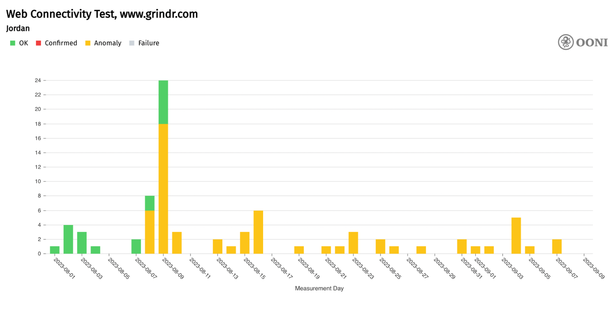
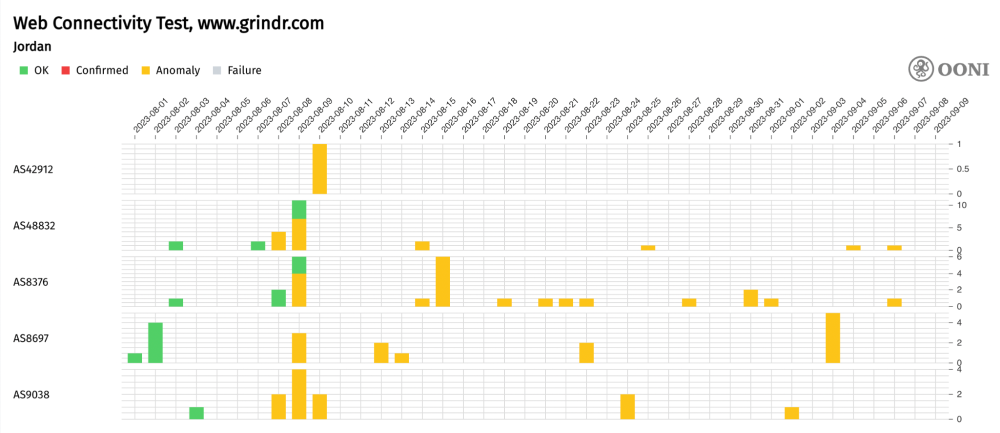
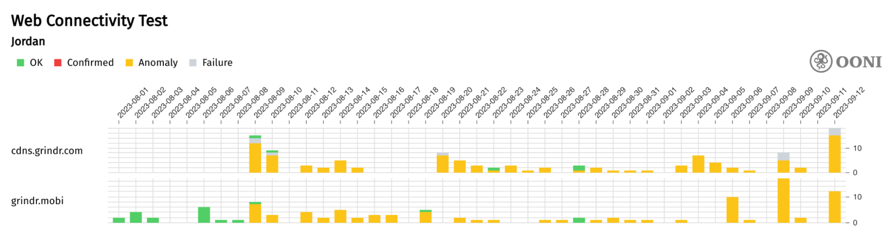
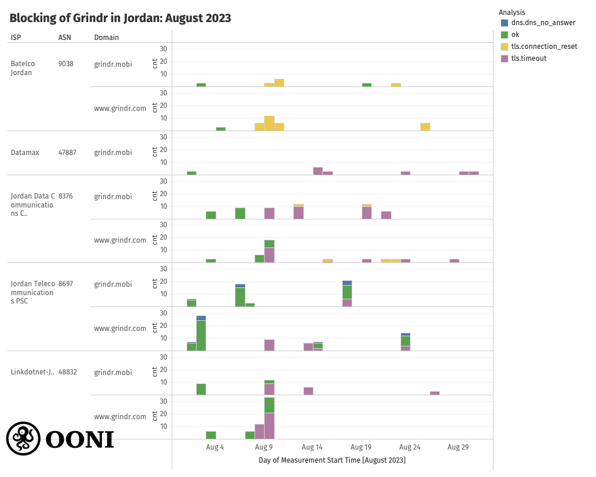
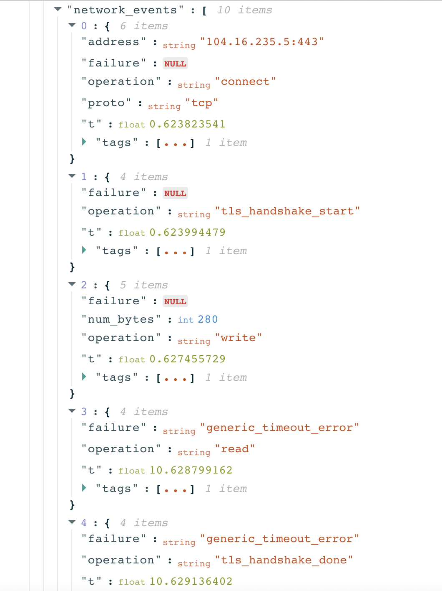
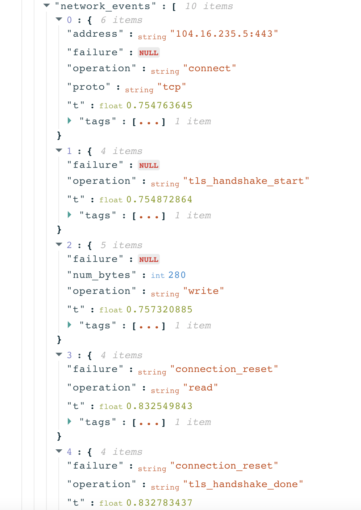

Jordan recently [blocked](https://explorer.ooni.org/m/20230808211935.881250_JO_webconnectivity_6b7549126aabe25d) access to [Grindr](https://www.grindr.com/) — the world’s largest social networking app for gay, bi, trans, and queer people — adding to the list of social media apps banned in the country, including [TikTok](https://explorer.ooni.org/chart/mat?probe_cc=JO&since=2023-08-13&until=2023-09-13&time_grain=day&axis_x=measurement_start_day&test_name=web_connectivity&domain=www.tiktok.com) and [Clubhouse](https://explorer.ooni.org/chart/mat?probe_cc=JO&since=2023-08-13&until=2023-09-13&time_grain=day&axis_x=measurement_start_day&test_name=web_connectivity&domain=www.clubhouse.com).

[OONI network measurement data](https://explorer.ooni.org/chart/mat?probe_cc=JO&since=2023-08-01&until=2023-09-10&time_grain=day&axis_x=measurement_start_day&test_name=web_connectivity&domain=www.grindr.com) collected from Jordan suggests that ISPs started blocking access to Grindr on August 8th 2023, and that the block [remains ongoing](https://explorer.ooni.org/chart/mat?probe_cc=JO&since=2023-08-01&until=2023-09-21&time_grain=day&axis_x=measurement_start_day&test_name=web_connectivity&domain=www.grindr.com).

This report shares [OONI data](https://explorer.ooni.org/chart/mat?probe_cc=JO&since=2023-08-01&until=2023-09-10&time_grain=day&axis_x=measurement_start_day&test_name=web_connectivity&domain=www.grindr.com) on the blocking of Grindr in Jordan.



## Background

Jordan is one of the few Middle Eastern countries where consensual same-sex sexual acts are not criminalised. Previously, the colonial-era [Criminal Code Bill (1936)](https://database.ilga.org/api/downloader/download/1/JO%20-%20LEG%20-%20Criminal%20Code%20Bill%20(1936)%20-%20OR-OFF(en).pdf) banned same-sex relations, but this was repealed in 1951 with the enactment of the country’s [Penal Code](https://database.ilga.org/api/downloader/download/1/JO%20-%20LEG%20-%20Penal%20Code%20(1951)%20-%20TR(en).pdf). While homosexual conduct is technically legal in Jordan, the General Iftaa Department issued a [religious ruling](https://database.ilga.org/api/downloader/download/1/JO%20-%20JUD%20-%20Fatwa%203670%20on%20Sexual%20Relations%20from%20an%20Islamic%20Perspective%20(2021)%20-%20OR(ar).pdf) (Fatwa) in December 2021, declaring that "homosexuality is illegal under Islamic law". Such religious rulings are not legally binding, but the General Iftaa Department acts in an advisory capacity to government branches and courts.

According to the International Lesbian, Gay, Bisexual, Trans and Intersex Association (ILGA), laws in Jordan provide [non-explicit barriers](https://database.ilga.org/jordan-lgbti) to the rights of freedom of expression and freedom of association. The [Constitution of Jordan](https://www.refworld.org/pdfid/3ae6b53310.pdf) does not explicitly include “sexual orientation”, “gender identity”, “gender expression” or “sex characteristics” as protected grounds of discrimination. Similarly, the [laws in Jordan](https://database.ilga.org/jordan-lgbti) do not offer protection against discrimination based on “sexual orientation”, “gender identity”, “gender expression” or “sex characteristics” in healthcare, education, housing, employment, or in the provision of goods and services. ILGA [reports](https://database.ilga.org/jordan-lgbti) that laws in Jordan neither aggravate penalties for crimes committed on the basis of “sexual orientation”, “gender identity”, “gender expression” or “sex characteristics” nor do they explicitly consider such crimes as “hate crimes”.

According to Human Rights Watch, Jordan’s [new Cybercrime Law](https://www.hrw.org/news/2023/08/14/jordans-new-cybercrime-law-disaster-lgbt-people) (which was approved in August 2023) contains vague provisions that could target LGBTQ people, as well as digital content around gender, sexuality, and LGBTQ rights.

Meanwhile, OutRight International [reports](https://outrightinternational.org/our-work/middle-east-and-north-africa/jordan) that surveys show low public acceptance of homosexuality in Jordan. In recent years, multiple reports have surfaced involving discrimination against LGBTQ communities in Jordan. In 2014, Jordanian authorities [arrested](https://english.alarabiya.net/News/middle-east/2014/02/27/Jordan-arrests-10-gays-over-get-together-party) 10 LGBT people for holding a party in east Amman. In 2015, the US ambassador's visit to an LGBT event in Jordan [sparked outrage](https://www.al-monitor.com/originals/2015/06/jordan-gay-event-us-ambassador-wells-uproar-lgbt-rights.html). In both [2016](https://www.bbc.com/news/world-middle-east-36148343) and [2017](https://edition.cnn.com/2017/06/16/middleeast/jordan-bans-lebanese-rock-band/index.html), a Lebanese band with queer members was  banned from performing in Jordan.

In July 2017, the authorities in Jordan [ordered the blocking of My Kali](https://cpj.org/2017/08/jordan-blocks-access-to-lgbtq-online-magazine/), one of the first [LGBTQI-inclusive online magazines](https://www.accessnow.org/jordan-blocking-first-lgbtqi-magazine-mena-region/) in the Southwest Asia and North Africa region (founded in Jordan). The block followed a parliament [request](https://www.hrw.org/news/2017/08/30/gay-bashing-jordan-government) to open an inquiry into the website, and the authorities concluded that the magazine had [violated Jordan’s Press and Publication Law](https://cpj.org/2017/08/jordan-blocks-access-to-lgbtq-online-magazine/) because it had not applied to the minister of information for a license. However, the founder of [My Kali](https://www.mykalimag.com/), Khalid Abdel-Hadi, reportedly [told](https://cpj.org/2017/08/jordan-blocks-access-to-lgbtq-online-magazine/) the Committee to Protect Journalists (CPJ) that their site had already been inaccessible in Jordan since 14th July 2016, following an interview about how homosexuals live in Jordan. The blockage has been confirmed and documented by digital rights organizations [Access Now](https://www.accessnow.org/jordan-blocking-first-lgbtqi-magazine-mena-region/) and [Qurium](https://www.qurium.org/alerts/jordan/internet-blocking-in-jordan/), while [OONI data](https://explorer.ooni.org/chart/mat?probe_cc=JO&since=2023-06-10&until=2023-09-13&time_grain=day&axis_x=measurement_start_day&test_name=web_connectivity&domain=www.mykalimag.com) shows that the block remains ongoing on some networks in Jordan.

In recent months, the crackdown on LGBTQ communities in Jordan has escalated. Hate speech, threats against members of the LGBTQ community, and anti-LGBTQ rhetoric have [reportedly](https://www.al-monitor.com/originals/2023/07/jordans-lgbtq-community-faces-increased-attacks-including-islamists) exploded on social media and leading media platforms, leading to some members of the community to be detained or called in for questioning. In mid-August 2023, it was [reported](https://www.theguardian.com/global-development/2023/aug/18/jordans-secret-police-accused-of-targeting-lgbtq-community) that Jordan’s secret police was accused of abducting, harassing, and “outing” LGBTQ+ people, as well as forcing the closure of several LGBTQ+ organizations.

A collective of queer/feminist activists in Jordan have produced a [report](https://storage.googleapis.com/qurium/mykalimag.com/en-2023-07-29-report-escalating-attacks-on-queer-initiatives-and-individuals-in-jordan-2023.html) on the escalating attacks on queer initiatives and individuals in Jordan. The report states:

“Since the end of 2022, there has been an alarming increase in attacks on queer spaces, initiatives, social media pages, applications, and individuals in Jordan. While some have linked this to the rise in anti-LGBTQ+ activities and discourses that [emerged](https://storage.googleapis.com/qurium/mykalimag.com/en-2023-01-21-queer-qataris-and-the-world-cup-a-critique-of-the-western-media-storm.html) around the 2022 World Cup in Qatar, this is part of a much longer campaign against queer (but also some critical and feminist) movements in the country. Taking place between online and in-person spaces, these attacks seem to be part of a coordinated effort by governmental entities, media organizations, and conservative politicians, leaders, and individuals acting via social media and in everyday interactions.”

While a series of factors (as described above) contributed to this tension over time, it’s worth noting that in early July 2023, Jordan’s Al Taj news site published an [investigation](https://altaj.news/jordannews/263262) on “an application that promotes sexual relations between men in Jordan”. In this publication, Al Taj argued that this app is in violation of the principles, rules, and ethics of Jordanian society, stating that their sources confirmed that the government would block access to the app within days. While Al Taj refrained from naming the specific application, they [referred](https://altaj.news/jordannews/263262) to it as “the world’s most famous application for promoting gay relationships”. On 10th August 2023, Al Taj [published an article on the blocking of Grindr](https://altaj.news/public/jordannews/266445), claiming that the authorities in Jordan blocked access to the app following the publication of their investigation in early July 2023.  

## Methods

Since 2012, the [Open Observatory of Network Interference (OONI)](https://ooni.org/) has developed free and open source software (called [OONI Probe](https://ooni.org/install/)) which is designed to [measure various forms of internet censorship](https://ooni.org/nettest/), including the blocking of websites and apps. Every month, OONI Probe is regularly run by volunteers in [around 160 countries](https://explorer.ooni.org/) (including [Jordan](https://explorer.ooni.org/country/JO)), and network measurements collected by OONI Probe users are automatically published as [open data in real-time](https://ooni.org/data).

On 10th August 2023, community members from Jordan alerted OONI that [Grindr](https://www.grindr.com/) was blocked in the country. To investigate the reported blocking of Grindr, we analyzed [OONI measurements](https://explorer.ooni.org/chart/mat?probe_cc=JO&since=2023-08-01&until=2023-09-10&time_grain=day&axis_x=measurement_start_day&test_name=web_connectivity&domain=www.grindr.com) collected from the testing of Grindr’s website (`www.grindr.com`) and endpoints (required for the functionality of the Grindr app) in Jordan throughout August 2023. The main question we attempted to answer was whether OONI data provides signals of Grindr blocking in Jordan during the reported dates. We also aimed to examine whether we see signals of Grindr blocking on different networks in Jordan, and to characterize the potential blocks (i.e. determine the censorship techniques) on each network.

Generally, [OONI Probe](https://ooni.org/install/) includes the [Web Connectivity experiment](https://ooni.org/nettest/web-connectivity/) which is designed to measure the blocking of many different [websites](https://ooni.org/support/faq#which-websites-will-i-test-for-censorship-with-ooni-probe) (including Grindr domains). Specifically, OONI’s [Web Connectivity test](https://ooni.org/nettest/web-connectivity/) is designed to measure the accessibility of [URLs](https://github.com/citizenlab/test-lists/tree/master/lists) by performing the following steps:

*   Resolver identification
*   DNS lookup
*   TCP connect to the resolved IP addresses
*   TLS handshake to the resolved IP addresses
*   HTTP(s) GET request following redirects

The above steps are automatically performed from both the local network of the user, and from a control vantage point. If the results from both networks are the same, the tested URL is annotated as accessible. If the results differ, the tested URL is annotated as [anomalous](https://ooni.org/support/faq#what-do-you-mean-by-anomalies), and the type of anomaly is further characterized depending on the reason that caused the failure (for example, if the TCP connection fails, the measurement is annotated as a TCP/IP anomaly).

[Anomalous measurements](https://ooni.org/support/faq#what-do-you-mean-by-anomalies) may be indicative of blocking, but [false positives](https://ooni.org/support/faq#what-are-false-positives) can occur. We therefore consider that the likelihood of blocking is greater if the overall volume of anomalous measurements is high in comparison to the overall measurement count (compared on an ASN level within the same date range for each OONI Probe experiment type).

Each [Web Connectivity](https://ooni.org/nettest/web-connectivity/) measurement provides further network information (such as information pertaining to TLS handshakes) that helps with evaluating whether an anomalous measurement presents signs of blocking. We therefore disaggregate based on the reasons that caused the anomaly (e.g. connection reset during the TLS handshake) and if they are consistent, they provide a stronger signal of potential blocking.

Based on OONI’s heuristics, we are able to automatically confirm the blocking of websites based on [fingerprints](https://github.com/ooni/blocking-fingerprints) if a [block page](https://ooni.org/support/glossary#block-page) is served, or if DNS resolution returns an IP known to be associated with censorship. While this method enables us to [automatically confirm website blocking](https://explorer.ooni.org/search?since=2023-08-10&until=2023-09-10&failure=false&only=confirmed) in numerous countries (such as [Indonesia](https://explorer.ooni.org/search?since=2023-08-10&until=2023-09-10&failure=false&probe_cc=ID&only=confirmed), [Russia](https://explorer.ooni.org/search?since=2023-08-10&until=2023-09-10&failure=false&probe_cc=RU&only=confirmed), and [Iran](https://explorer.ooni.org/search?since=2023-08-10&until=2023-09-10&failure=false&probe_cc=IR&only=confirmed)), in other countries like Jordan (where ISPs appear to implement censorship using different techniques), we analyze anomalous OONI measurements with our [OONI data analysis tool](https://github.com/ooni/data).

As part of OONI’s analysis for this report, [anomalous Grindr measurements](https://explorer.ooni.org/search?since=2023-08-01&until=2023-09-10&failure=false&domain=www.grindr.com&probe_cc=JO&only=anomalies) were aggregated based on failure types to evaluate if they are consistently present (or if the types of failures vary), as a more consistent failure type (such as a `connection\_reset` error) observed in a larger volume of measurements provides a stronger signal of blocking. We also analyzed the network information from TLS handshake data in these measurements to evaluate whether the errors were a result of TLS based interference.  

## Blocking of Grindr in Jordan

### OONI findings

As of 8th August 2023, [OONI data](https://explorer.ooni.org/chart/mat?probe_cc=JO&since=2023-08-01&until=2023-09-10&time_grain=day&axis_x=measurement_start_day&test_name=web_connectivity&domain=www.grindr.com) collected from Jordan suggests that access to [Grindr](https://www.grindr.com/) is blocked. The block appears to be implemented for both [Grindr’s website](https://explorer.ooni.org/chart/mat?test_name=web_connectivity&axis_x=measurement_start_day&since=2023-08-01&until=2023-09-10&time_grain=day&probe_cc=JO&domain=www.grindr.com) (`www.grindr.com`) and [app](https://explorer.ooni.org/chart/mat?probe_cc=JO&since=2023-08-01&until=2023-09-13&time_grain=day&axis_x=measurement_start_day&axis_y=domain&test_name=web_connectivity).

The following chart aggregates OONI measurement coverage from the testing of `www.grindr.com` on 5 networks in Jordan between 1st August 2023 to 9th September 2023.

{{}}

**Chart:** OONI Probe testing of Grindr’s website (`www.grindr.com`) in Jordan between 1st August 2023 to 9th September 2023 (source: [OONI MAT](https://explorer.ooni.org/chart/mat?test_name=web_connectivity&axis_x=measurement_start_day&since=2023-08-01&until=2023-09-10&time_grain=day&probe_cc=JO&domain=www.grindr.com)).

In the above chart, successful measurements (showing that `www.grindr.com` was found accessible on tested networks) are annotated in green (“OK”), while measurements that presented signs of blocking (“[anomalies](https://ooni.org/support/faq#what-do-you-mean-by-anomalies)”) are annotated in orange.

As is evident, the testing of `www.grindr.com` previously showed that the site was accessible in Jordan, and only started presenting signs of blocking (“anomalies”) on 8th August 2023. The timing of the anomalies coincides with the timing that Al Taj [reported](https://altaj.news/public/jordannews/266445) on the blocking of Grindr, as well as with the timing that this was reported to OONI by their community. The fact that most measurements thereafter continued to present anomalies provides a further signal of Grindr blocking, while suggesting that the block remains ongoing.

A per-network breakdown of the measurement coverage shows that the testing of `www.grindr.com` presented signs of blocking (“anomalies”) on all 5 tested networks in Jordan during the same period.

{{}}

**Chart:** OONI Probe testing of Grindr’s website (`www.grindr.com`) on 5 networks in Jordan between 1st August 2023 to 9th September 2023 (source: [OONI MAT](https://explorer.ooni.org/chart/mat?test_name=web_connectivity&axis_x=measurement_start_day&since=2023-08-01&until=2023-09-10&time_grain=day&probe_cc=JO&axis_y=probe_asn&domain=www.grindr.com)).

The fact that we observe anomalies in the testing of Grindr’s website on 5 different networks in Jordan during the same period provides a strong indication of blocking, and suggests that Grindr is blocked on at least 5 networks in the country. It’s worth noting though that the block does not appear to have started on all networks at the same time. On Jordan Data Communications (AS8376), for example, the block appears to have started on 9th August 2023 (instead of 8th August 2023). However, the overall limited measurement coverage presents an important limitation in our ability to track the specific timing when the block started on each network.

OONI data [suggests](https://explorer.ooni.org/chart/mat?probe_cc=JO&since=2023-08-01&until=2023-09-13&time_grain=day&axis_x=measurement_start_day&axis_y=domain&test_name=web_connectivity) that access to Grindr’s app (available through the [Google](https://play.google.com/store/apps/details?id=com.grindrapp.android) and [Apple](https://apps.apple.com/us/app/grindr-gay-dating-chat/id319881193) app stores) is blocked by Internet Service Providers (ISPs) in Jordan as well. Most OONI measurements from the testing of [endpoints](https://github.com/RobbieTechie/Grindr-API/blob/1ddcae51d8bc6737e66beeeb93722fba543d68bf/grindr8.12.1-api-documentation.md?plain=1#L23) (`cdns.grindr.com` and `grindr.mobi`) required for the functionality of the Grindr app presented anomalies from 9th August 2023 onwards, which correlates with the timing when `www.grindr.com` started to present anomalies (as discussed previously). This is illustrated through the following chart, which aggregates OONI measurement coverage from the testing of Grindr endpoints in Jordan between 1st August 2023 to 12th September 2023.  

{{}}

**Chart:** OONI Probe testing of Grindr endpoints (`cdns.grindr.com` and `grindr.mobi`) in Jordan between 1st August 2023 to 12th September 2023 (source: [OONI data](https://explorer.ooni.org/chart/mat?probe_cc=JO&since=2023-08-01&until=2023-09-13&time_grain=day&axis_x=measurement_start_day&axis_y=domain&test_name=web_connectivity)).

It is necessary to inspect the [network measurement data](https://explorer.ooni.org/search?since=2023-08-01&until=2023-09-10&failure=false&domain=www.grindr.com&probe_cc=JO&only=anomalies) to understand why these anomalies occurred. This helps with ruling out false positives and evaluating if these anomalies emerged as a result of blocking.

To this end, we analyzed the [anomalous OONI measurements](https://explorer.ooni.org/search?since=2023-08-01&until=2023-09-10&failure=false&domain=www.grindr.com&probe_cc=JO&only=anomalies) collected from Jordan throughout August 2023 with our [OONI data analysis tool](https://github.com/ooni/data). In addition to `www.grindr.com`, we applied this analysis to `grindr.mobi` to check if the block was also implemented to endpoints required for the Grindr app functionality.

The results of our analysis are presented through the following chart.

{{}}

**Chart:** Blocking of Grindr domains (`www.grindr.com` and `grindr.mobi`) in Jordan in August 2023 (source: [ooni/data](https://github.com/ooni/data) tool).

From the above chart, we can see that the anomalous measurements from the testing of Grindr domains (`www.grindr.com` and `grindr.mobi`) mainly presented connection reset and timeout errors during the TLS handshake. Moreover, on each tested network, we observe that the type of error (`connection\_reset` or `timeout`) is mostly consistent for both Grindr domains. Out of the two errors, we mainly observe that the TLS handshakes result in timeout errors.

Specifically, on most tested networks, OONI data shows the [timing out of the session after the ClientHello message during the TLS handshake](https://explorer.ooni.org/m/20230907152239.600241_JO_webconnectivity_1b714256b4926df8).

{{}}

On Batelco Jordan (AS9038), OONI data shows a [connection reset during the TLS handshake](https://explorer.ooni.org/m/20230902094416.483159_JO_webconnectivity_63762aaa3f6906fc).

{{}}

On all tested networks, we observe interference during the TLS handshake, indicating that access to Grindr is blocked in Jordan by means of **TLS interference**.

### Impact of the block

To understand the impact of this block, we reached out to **Grindr**, who shared the following statement:

“We are highly concerned that the Grindr app has been blocked in Jordan. Grindr provides an invaluable platform for our community to connect. Here users find friendship, love, and commonalities with other people who share their experiences, cutting through the social isolation that can be suffocating.

Grindr for Equality, Grindr’s program for LGBTQ social justice, has played an important role in addressing the HIV epidemic in Jordan, connecting users with testing, treatment, and Arabic language sexual health resources. This ban jeopardizes a key public health strategy with implications for the entire country.

Here at Grindr, we believe that people everywhere should have the right to connect with one another for the pursuit of happiness, regardless of sexual orientation or gender identity. We offer our strong support to the LGBTQ people and their allies in Jordan who are asking for internet freedoms and for a world that is safer and more celebratory of all people.”

In relation to the blocking of Grindr, an **LGBTQ community member from Jordan** shared:

“I want to clarify that my perspective doesn't represent the entire queer community in Amman. I acknowledge that my experiences are influenced by my socio-economic background. Nevertheless, as a queer individual living in a society with prevalent homophobia and transphobia, the recent blocking of Grindr has deeply concerning implications.

While Grindr is primarily known as a hookup app and is not commonly associated with making friends or building a sense of community, it has served as a valuable online space for many of my peers, as well as myself, to explore and express our queerness in an environment that otherwise lacks such opportunities. This avenue for self-exploration has now been abruptly cut off.

The ongoing targeted actions against the queer and LGBTQIA+ community (if we can even call it that anymore) have garnered international attention through various non-Jordanian media outlets. However, there's a real risk that these incidents may be disregarded.

Describing these actions as merely 'restrictive' doesn't fully capture the gravity of the situation. They signify the extent of the government's surveillance capabilities and the ease with which they can exercise control. It's a stark reminder that no matter where you are or what you're doing, someone is observing. This block isn't just restrictive; it's a clear threat and a warning to conform, or face consequences”.

## Conclusion

LGBTQ spaces are shrinking in Jordan. The recent [blocking of Grindr](https://explorer.ooni.org/chart/mat?test_name=web_connectivity&axis_x=measurement_start_day&since=2023-08-01&until=2023-09-10&time_grain=day&probe_cc=JO&domain=www.grindr.com) appears to be a symptom of escalated (and possibly long-term) intolerance and discrimination against LGBTQ communities in the country.

Censorship of online LGBTQ spaces in Jordan is not new. OONI data shows that [My Kali](https://www.mykalimag.com/) (one of the first [LGBTQI-inclusive online magazines](https://www.accessnow.org/jordan-blocking-first-lgbtqi-magazine-mena-region/) in the MENA region) [remains blocked](https://explorer.ooni.org/chart/mat?probe_cc=JO&since=2023-06-10&until=2023-09-10&time_grain=day&axis_x=measurement_start_day&test_name=web_connectivity&domain=www.mykalimag.com) on some networks (originally blocked in July 2016, but the information of the blockage [became public](https://cpj.org/2017/08/jordan-blocks-access-to-lgbtq-online-magazine/) July 2017, as documented by [Access Now](https://www.accessnow.org/jordan-blocking-first-lgbtqi-magazine-mena-region/), and [Qurium](https://www.qurium.org/alerts/jordan/internet-blocking-in-jordan/)). This raises concerns about the potential long-term blocking of Grindr as well, and the impact that this would have on the well-being of LGBTQ communities in Jordan. According to Grindr, the block impacts their public health strategy as their [Grindr for Equality](https://www.grindr.com/g4e) program has played an important role in addressing the HIV epidemic in Jordan.

Meanwhile, online LGBTQ spaces appear to be shrinking in many other countries as well. OONI data shows that **Grindr is also blocked in several other countries**, including [Iran](https://explorer.ooni.org/chart/mat?probe_cc=IR&since=2023-08-10&until=2023-09-10&time_grain=day&axis_x=measurement_start_day&test_name=web_connectivity&domain=www.grindr.com), [Turkey](https://explorer.ooni.org/chart/mat?probe_cc=TR&since=2023-08-10&until=2023-09-10&time_grain=day&axis_x=measurement_start_day&test_name=web_connectivity&domain=www.grindr.com), [Indonesia](https://explorer.ooni.org/chart/mat?probe_cc=ID&since=2023-08-10&until=2023-09-10&time_grain=day&axis_x=measurement_start_day&test_name=web_connectivity&domain=www.grindr.com), [Oman](https://explorer.ooni.org/chart/mat?probe_cc=OM&since=2023-08-10&until=2023-09-10&time_grain=day&axis_x=measurement_start_day&test_name=web_connectivity&domain=www.grindr.com), [Saudi Arabia](https://explorer.ooni.org/chart/mat?probe_cc=SA&since=2023-08-10&until=2023-09-10&time_grain=day&axis_x=measurement_start_day&test_name=web_connectivity&domain=www.grindr.com), the [United Arab Emirates](https://explorer.ooni.org/chart/mat?probe_cc=AE&since=2023-08-10&until=2023-09-10&time_grain=day&axis_x=measurement_start_day&test_name=web_connectivity&domain=www.grindr.com), [Qatar](https://explorer.ooni.org/chart/mat?test_name=web_connectivity&axis_x=measurement_start_day&since=2023-01-01&until=2023-04-30&time_grain=day&probe_cc=QA&domain=www.grindr.com), [Lebanon](https://explorer.ooni.org/chart/mat?test_name=web_connectivity&axis_x=measurement_start_day&since=2023-01-10&until=2023-09-10&time_grain=day&probe_cc=LB&domain=www.grindr.com), [Pakistan](https://explorer.ooni.org/chart/mat?test_name=web_connectivity&axis_x=measurement_start_day&since=2023-01-10&until=2023-09-10&time_grain=day&probe_cc=PK&domain=www.grindr.com), and [China](https://explorer.ooni.org/chart/mat?test_name=web_connectivity&axis_x=measurement_start_day&since=2023-01-10&until=2023-09-10&time_grain=day&probe_cc=CN&domain=www.grindr.com). Beyond Grindr, many [other LGBTQ websites are blocked in many countries](https://ooni.org/documents/2021-lgbtiq-website-censorship-report/2021-lgbtiq-website-censorship-report-v2.pdf) around the world. The recent blocking of Grindr, therefore, raises the concern that Jordan may expand its censorship to more online LGBTQ spaces, increasing the risk posed to LGBTQ communities.

You can help document and increase transparency of LGBTQ censorship in your country by running [OONI Probe](https://ooni.org/install/). Please note though that running OONI Probe can potentially be [risky](https://ooni.org/about/risks/). If you do run OONI Probe, you would contribute measurements to the world’s largest [open dataset](https://ooni.org/data/) on internet censorship.  

## Acknowledgements

We thank [OONI Probe](https://ooni.org/install/) users in Jordan who contributed measurements, supporting this study.

We also thank [Grindr](https://www.grindr.com/) and LGBTQ communities in Jordan for discussing the impact of this block and sharing their experience with us.
