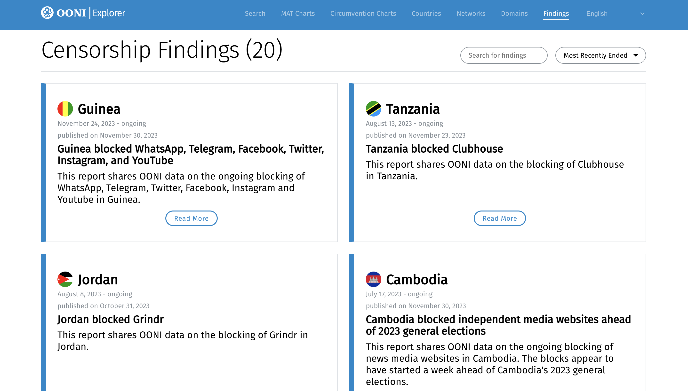

{{}}
**Image:** OONI Censorship Findings platform.

Today we are thrilled to announce the launch of the OONI [Censorship
Findings](https://explorer.ooni.org/findings) platform!

Internet censorship is frequently being reported around the world, but
how can we verify such events with empirical evidence?

Our [new platform provides short reports](https://explorer.ooni.org/findings) on internet censorship around the world based on OONI's [open data](https://ooni.org/data/). With the launch of the platform, we are **publishing 20 reports on internet censorship** that emerged in 2023. In response to emergent censorship events, this
platform will be updated with new reports on an ongoing basis.

Learn more below.



# About OONI

If you're not familiar with our work, the [Open Observatory of Network
Interference (OONI)](https://ooni.org/) is a non-profit
free software project which started back in 2012. Our goal is to empower
decentralized efforts in increasing transparency of internet censorship
around the world.

To this end, we provide free and open source software -- called [OONI
Probe](https://ooni.org/install/) -- which you can install
on your [mobile](https://ooni.org/install/mobile) or
[desktop](https://ooni.org/install/desktop) device to run
[network measurement tests](https://ooni.org/nettest/) to
detect various forms of internet censorship. Since 2012, OONI Probe has
been run in 241 countries and territories, and users have contributed
[more than a billion measurements](https://explorer.ooni.org/) which we publish
as [open data](https://ooni.org/data/). Every day, new
measurements from around the world are [published in real-time](https://explorer.ooni.org/search), shedding
light on emergent censorship events.

We therefore maintain what is arguably the [largest open dataset on internet censorship](https://explorer.ooni.org/) to date.

To enable researchers and human rights defenders to investigate and
respond to internet censorship based on OONI data, we created [OONI Explorer](https://explorer.ooni.org/) (originally [launched in 2016](https://blog.torproject.org/ooni-explorer-censorship-and-other-network-anomalies-around-world/)):
a web platform that includes a [Search Tool](https://explorer.ooni.org/search) for exploring the measurements, and a [Measurement Aggregation Toolkit (MAT)](https://explorer.ooni.org/chart/mat) for generating
charts based on OONI data. In collaboration with our
[partners](https://ooni.org/partners), we have published
[85 research reports](https://ooni.org/reports/) based on
the analysis of OONI data. Over the past decade, OONI data has
[supported a wide range of research and advocacy efforts](https://ooni.org/post/highlights-10-years-of-ooni/#community-use-of-ooni-data).

# About OONI's Censorship Findings platform

Today we are launching a new section on OONI Explorer: the [Censorship Findings](https://explorer.ooni.org/findings) platform.
This platform provides short reports on emergent censorship events
around the world based on [OONI data](https://ooni.org/data/). Our goal is to support
research and advocacy efforts aimed at monitoring and responding to
internet censorship around the world.

With the launch of the platform, we **published the following 20 reports on internet censorship events** that emerged in 2023:

* [Guinea blocked WhatsApp, Telegram, Facebook, Twitter, Instagram, and YouTube](https://explorer.ooni.org/findings/296303006301)
* [Tanzania blocked Clubhouse](https://explorer.ooni.org/findings/185407756401)
* [Jordan blocked Grindr](https://explorer.ooni.org/findings/179818906201)
* [Cambodia blocked independent media websites ahead of 2023 general elections](https://explorer.ooni.org/findings/373150675601)
* [China started blocking OONI](https://explorer.ooni.org/findings/57494519801)
* [China started blocking F-Droid](https://explorer.ooni.org/findings/206551055901)
* [Egypt started blocking Proton privacy services](https://explorer.ooni.org/findings/18597244501)
* [Tanzania blocked Grindr](https://explorer.ooni.org/findings/203466718601)
* [Cambodia blocked access to Voice of Democracy (VOD)](https://explorer.ooni.org/fndings/382061061001)
* [Kenya blocked Telegram during the KCSE 2023 exams](https://explorer.ooni.org/fndings/228466228201)
* [Azerbaijan blocked TikTok and Google Play Store amid military offensive in Ngorno-Karabakh](https://explorer.ooni.org/findings/67768606801)
* [Iraq temporarily blocked Telegram](https://explorer.ooni.org/findings/64077907701)
* [Ethiopia blocked social media amid church split tensions](https://eplorer.ooni.org/findings/186069533301)
* [Senegal blocked social media amid political unrest](https://explorer.ooni.org/fndings/25060018801)
* [Guinea blocked social media amid protests](https://explorer.ooni.org/findings/34000980901)
* [Pakistan blocked social media following arrest of former Prime Minister](https://eplorer.ooni.org/findings/300902917301)
* [Brazil blocked Telegram](https://explorer.ooni.org/findings/76657383201)
* [Pakistan started blocking Deutsche Welle (DW)](https://explorer.ooni.org/findings/7767321701)
* [Turkey blocked Twitter following deadly earthquake](https://explorer.ooni.org/fndings/279627325801)
* [Pakistan blocked Wikipedia](https://explorer.ooni.org/findings/352315080001)

Each of the above reports links to relevant OONI data (that can serve as
evidence of internet censorship), providing charts that are generated
from our [Measurement Aggregation Toolkit (MAT)](https://explorer.ooni.org/chart/mat). The reports
also provide concise interpretation of OONI censorship measurement
findings.

Why did we create this platform since we already provide [OONI Explorer](https://explorer.ooni.org/) and publish [research reports](https://ooni.org/reports/)?

Using the various [OONI Explorer](https://explorer.ooni.org/) tools requires
knowing [how to use them](https://ooni.org/support/ooni-explorer/) and what to
look for. The OONI Explorer [MAT](https://explorer.ooni.org/chart/mat), for example,
is a powerful tool for those interested in digging through OONI data to
investigate internet censorship, corroborate reported cases, and
*discover* (potentially unreported) cases of internet censorship. But as
part of community feedback, we have learned that providing *summary
information* about key censorship findings is important for rapid
response efforts. And this is precisely what we are trying to achieve
with the [Censorship Findings](https://explorer.ooni.org/findings) platform.

New censorship events frequently emerge worldwide on an ongoing basis,
but producing an in-depth
[report](https://ooni.org/reports/) and analysis on each
event (in a timely manner) is not easily scalable. Meanwhile, rapid
response efforts benefit from censorship findings that are easier and
quicker to consume.

Therefore, we created the [Censorship Findings](https://explorer.ooni.org/findings) platform to
regularly provide short reports with summary information on emergent
censorship events based on OONI data and charts. We hope that this will
enable journalists and human rights defenders to more easily learn about
and respond to censorship events. Over time, we expect the platform will
become an archive of known censorship incidents from around the world
based on OONI network measurement data.

## Limitations

Currently, the [Censorship Findings](https://explorer.ooni.org/findings) platform is
limited to censorship events that emerged in 2023. We plan to continue
publishing reports on an ongoing basis over the next years.

The platform does *not* include all censorship events that occurred in
2023, nor do we consider it possible to ever cover all censorship events
in all countries over time. Almost every country in the world
experiences some form of internet censorship, and many countries (such
as [Iran](https://explorer.ooni.org/country/IR),
[China](https://explorer.ooni.org/country/CN), and
[Russia](https://explorer.ooni.org/country/RU)) experience
pervasive levels of censorship that change on an ongoing basis.
Moreover, the availability of OONI data depends on whether, when, and
how frequently [OONI Probe](https://ooni.org/install/)
users in a country run tests and contribute measurements. As a result,
OONI measurement coverage [varies significantly from country to country](https://explorer.ooni.org/countries), limiting our
ability to document and report on all censorship events.

The main criteria that influence which cases we report on the
[Censorship Findings](https://explorer.ooni.org/findings)
platform include:

* **Impact.** We prioritize censorship cases which have larger public impact, such a the blocking of popular instant messaging apps and social media platforms. As our goal is to defend human rights on the internet, we also aim to report on censorship cases that have an impact on human rights.
* **Public interest.** We aim to report on censorship cases that are of public iterest. For example, this includes cases involving the blocking of news media websites. We also take into account the censorship cases that are of interest to (and reported to us by) the digital rights community.

We acknowledge the potential for bias in our reporting selection. The
[Censorship Findings](https://explorer.ooni.org/findings)
platform is our attempt to highlight some key censorship findings based
on OONI data, which we hope journalists, researchers, and human rights
defenders will find useful. We encourage you to also use [OONI Explorer](https://explorer.ooni.org/search) to discover
many more censorship events around the world!

# Acknowledgements

We thank the OONI community around the world for contributing
measurements, making the creation of the [Censorship Findings](https://explorer.ooni.org/findings) platform
possible.
