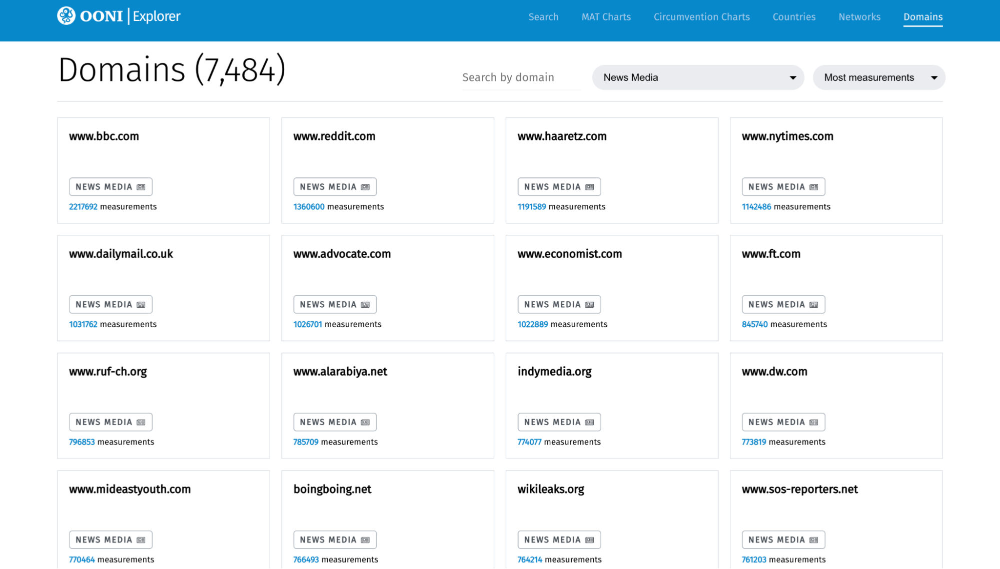
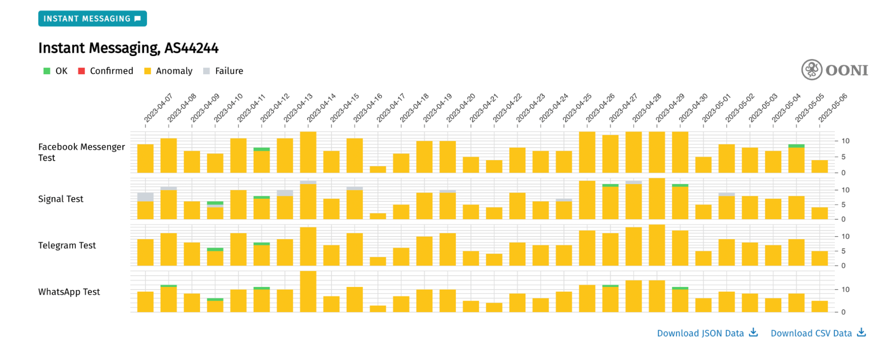

We’re excited to share that [OONI Explorer](https://explorer.ooni.org/) includes new features for investigating internet censorship worldwide based on open data.

Specifically, these features include:
*   New [domain-centric pages](https://explorer.ooni.org/domains);
*   New [network-centric pages](https://explorer.ooni.org/networks);
*   New “internet outage” charts (integrating IODA, Google traffic, and Cloudflare Radar data), available in each [country-specific](https://explorer.ooni.org/countries) and [network-specific](https://explorer.ooni.org/networks) page;
*   New user feedback reporting mechanism, available through the “Verify” button in the banner of each OONI measurement page.

In this blog post, we share information about these new features.



## About OONI Explorer

[OONI Explorer](https://explorer.ooni.org/) is the world’s largest **open dataset on internet censorship**.

This data is contributed by [OONI Probe](https://ooni.org/install/) users worldwide, who run censorship measurement tests on their local networks, contributing test results as open data in real-time. Since 2012, OONI Probe users have contributed [more than a billion measurements from 25 thousand networks in 241 countries and territories](https://explorer.ooni.org/), all of which is publicly available on OONI Explorer. Every day, as OONI Probe users continue to run tests, new measurements are openly published in real-time.

To enable researchers and human rights defenders to monitor and respond to censorship events worldwide, we created [OONI Explorer](https://explorer.ooni.org/): a web platform that includes a [Search Tool](https://explorer.ooni.org/search) for searching through the measurements, as well as a [Measurement Aggregation Toolkit (MAT)](https://explorer.ooni.org/chart/mat) for generating charts based on aggregate views of OONI data.

You can contribute OONI data by [running OONI Probe](https://ooni.org/install/).

## New OONI Explorer features

In response to community feedback, we created new OONI Explorer pages that enable users to view the data based on [domain-centric](https://explorer.ooni.org/domains) and [network-centric](https://explorer.ooni.org/networks) views. As part of our ongoing efforts to improve OONI data quality, we shipped a new feature (“Verify” button in the header of each OONI measurement page) that enables users to manually verify the outcome of an OONI measurement. As many community members are also interested in investigating internet outages (otherwise referred to as internet connectivity shutdowns), we integrated relevant third-party datasets ([IODA](https://ioda.inetintel.cc.gatech.edu/), [Google traffic](https://transparencyreport.google.com/traffic/overview), and [Cloudflare Radar](https://radar.cloudflare.com/) data) into new charts in each [country-specific](https://explorer.ooni.org/countries) and [network-specific](https://explorer.ooni.org/networks) page of OONI Explorer.

### Domain-centric pages

We launched new [domain-centric pages](https://explorer.ooni.org/domains) that enable you to view OONI measurements pertaining to the OONI Probe [testing](https://ooni.org/nettest/web-connectivity/) of specific domains. Overall, OONI Probe users around the world have tested more than 27,000 domains for censorship, and you can find dedicated [measurement pages](https://explorer.ooni.org/domains) for each of these domains.

{{}}

**Image:** OONI Explorer domain-centric pages (source: [OONI Explorer](https://explorer.ooni.org/domains)).

The new [Domains](https://explorer.ooni.org/domains) page on OONI Explorer includes a search function for searching based on the domain that interests you, a filter for narrowing your search based on specific [website categories](https://github.com/citizenlab/test-lists/blob/master/lists/00-LEGEND-new_category_codes.csv), and a dropdown menu that enables sorting based on the volume of measurement coverage that they received. By default, the Domains page presents all website categories, with the domains that received the largest measurement coverage listed first.

If, for example, you would like to narrow your search to news media domains, select `News Media` as a category filter. This will show that more than 7,000 domains categorized as “news media” have been tested, including measurement pages for each of them (as illustrated below).

 {{}}

**Image:** OONI Explorer domain-centric page filtered by “News Media” (source: [OONI Explorer](https://explorer.ooni.org/domains)).

Please note though that some domains may have been miscategorized. Generally, domains are manually [categorized](https://github.com/citizenlab/test-lists/blob/master/lists/00-LEGEND-new_category_codes.csv) as part of a community-curated process (on [GitHub](https://github.com/citizenlab/test-lists) and through our [Test Lists Editor](https://test-lists.ooni.org/)). Sometimes categorizations are applied based on the web page of a URL (for example, the URL `https://www.facebook.com/unitednationshumanrights/` may be categorized as “Human Rights Issues” ), which may not always be the right category for simply the domain (for example, `www.facebook.com` would be categorized as “Social Networking” ). Moreover, the content hosted on websites often changes when domains expire and get purchased by unrelated entities, which could also have an impact on categorization. As a result, we strive to constantly review and update (when needed) the categories of tested domains, and we encourage you to [contribute](https://test-lists.ooni.org/) to this process too.

By clicking on any of the displayed domains on the OONI Explorer [Domains](https://explorer.ooni.org/domains) page, you will access the relevant measurement page for that domain. In the example below, we have clicked on the measurement page for `twitter.com`.

{{}}

**Image:** OONI Explorer domain-centric page for `twitter.com` (source: [OONI Explorer](https://explorer.ooni.org/domain/twitter.com?since=2023-04-05&until=2023-05-05)).

In each domain-centric page, you will find the following:

* **Chart with domain-specific measurement coverage in each country around the world.** This chart provides aggregate OONI measurement coverage for the selected domain (e.g. `twitter.com`) in each country over the last month. You can adjust the date range by changing the `From` and `Until` filters. You can also limit your chart to measurement coverage from a specific country by selecting that country in the `Country` filter. But by viewing the measurement coverage for all countries, you are able to gain a bird’s eye view of where the tested domain is likely blocked (annotated as “[confirmed](https://ooni.org/support/interpreting-ooni-data/#confirmed)” or “[anomaly](https://ooni.org/support/interpreting-ooni-data/#anomalies)”), and to easily compare its potential blocking between countries.
  
* **Countries where the domain is confirmed blocked.** Based on our heuristics, we [automatically confirm](https://ooni.org/support/interpreting-ooni-data/#confirmed) the blocking of a website if a [block page](https://ooni.org/support/glossary#block-page) is served, or if DNS resolution returns an IP associated with censorship. Automatically detecting such cases requires that relevant [fingerprints](https://github.com/ooni/blocking-fingerprints) have been added to the OONI database. The new OONI Explorer [Domain pages](https://explorer.ooni.org/domain/) list the countries where the tested domain has automatically been confirmed blocked based on these heuristics. It’s important though to note the following limitations:
  * **Geolocation challenges.** In a few cases, measurements may have inaccurate geolocation, which means that they may claim to be coming from a different country than where they really are from. In such cases, you may find a country listed as “blocking a domain” based on a small set of measurements. For each country, we display the total count of “[confirmed](https://ooni.org/support/interpreting-ooni-data/#confirmed)”, “[anomalous](https://ooni.org/support/interpreting-ooni-data/#anomalies)”, and “OK” measurements, encouraging users to compare the number of “confirmed” measurements with the number of “OK” measurements. The larger the volume of “confirmed” measurements (in comparison to “OK” measurements), the stronger the signal that the tested domain is in fact blocked in that country. We also recommend comparing against “anomalous” measurements, as a large volume of “anomalous” measurements (in comparison to “OK” measurements) can also be a signal of blocking (though likely implemented through the use of different censorship techniques).
  * **Blocking is often implemented through the use of other censorship techniques.** If a country is not listed as “blocking a domain”, that does not necessarily mean that it is not blocking access to that domain. They could be blocking access though the use of other censorship techniques (such as IP blocking, resetting connections, etc), which we are not currently able to automatically detect and confirm. Those cases are annotated as “[anomalies](https://ooni.org/support/interpreting-ooni-data/#anomalies)” in OONI measurements.

* **Recent measurements.** Each domain-centric page ends with a listing of the most recent OONI measurements collected globally for the tested domain. You can access the raw data by clicking on each of the listed measurements.

Overall, the new [domain-centric pages](https://explorer.ooni.org/domains) on OONI Explorer enable you to easily discover which countries block access to a specific domain, and to **compare the blocking of that domain between countries over time** based on empirical network measurement data.  

### Network-centric pages

With the new [network-centric pages](https://explorer.ooni.org/networks) on OONI Explorer, you can learn about all OONI Probe testing on a specific [ASN](https://ooni.org/support/glossary#asn). Overall, OONI Probe users globally have run tests on more than 25,000 networks, and you can find dedicated [measurement pages](https://explorer.ooni.org/networks) for each of these networks.

{{}}

**Image:** OONI Explorer network-centric pages (source: [OONI Explorer](https://explorer.ooni.org/networks)).

The new [Networks](https://explorer.ooni.org/networks) page on OONI Explorer includes a search function for searching based on the AS that interests you, as well as functionality for searching ASs based on the volume of measurement coverage that they received. By default, the Networks page lists the ASs that received the largest measurement coverage first.

By clicking on any of the displayed ASs on the OONI Explorer [Networks](https://explorer.ooni.org/networks) page, you will access the relevant measurement page for that AS. In the example below, we have clicked on the measurement page for `AS44244 Iran Cell Service and Communication Company`.

{{}}

**Image:** OONI Explorer network-centric page for `AS44244 Iran Cell Service and Communication Company` (source: [OONI Explorer](https://explorer.ooni.org/as/AS44244?since=2023-04-07&until=2023-05-07)).

Each network-centric page starts off by listing the countries in which that specific network is observed (in this case, Iran). This can be useful as some ASs operate in several countries (as opposed to just one). The page subsequently shares information about OONI measurement coverage on the network, sharing the total number of OONI measurements, the dates of the first and last OONI measurements, as well as a graph on the annual volume of measurement coverage from that network. **Knowing the overall volume and frequency of measurement coverage on a network is important for assessing any censorship findings.** If a network receives a large volume of stable measurement coverage over time, we are more likely to detect and confirm censorship cases.

Following the measurement coverage stats, each [network-centric page](https://explorer.ooni.org/as/AS44244?since=2023-04-07&until=2023-05-07) shares charts with aggregate OONI measurement coverage for each of the main [OONI Probe test categories](https://ooni.org/nettest/) (websites, instant messaging apps, and circumvention tools) on that network. First, the page shares a chart with aggregate OONI measurement coverage for each tested domain on that network over the last month (as illustrated below).

  {{}}

**Image:** OONI Explorer network-centric page showing the testing of domains on `AS44244 Iran Cell Service and Communication Company` (source: [OONI Explorer](https://explorer.ooni.org/as/AS44244?since=2023-04-07&until=2023-05-07)).

By scrolling through this chart, you can discover websites that are blocked on this network, and compare the testing of different domains (accessible domains are annotated as “[OK](https://ooni.org/support/interpreting-ooni-data/#types-of-test-results)”, likely blocked domains are annotated as “[Anomaly](https://ooni.org/support/interpreting-ooni-data/#anomalies)”, confirmed blocked domains are annotated as “[Confirmed](https://ooni.org/support/interpreting-ooni-data/#confirmed)”, while failed measurements are annotated as “[Failure](https://ooni.org/support/interpreting-ooni-data/#types-of-test-results)”). You can adjust the date range by changing the `From` and `Until` filters above the chart, and you can access the measurements for each tested domain by clicking on the chart bars. Under the chart, you also have the option to download the data used to plot the chart in JSON or CSV format.

Each [network-centric page](https://explorer.ooni.org/networks) also includes a chart with aggregate OONI Probe measurement coverage from the testing of the [WhatsApp](https://ooni.org/nettest/whatsapp/), [Facebook Messenger](https://ooni.org/nettest/facebook-messenger/), [Telegram](https://ooni.org/nettest/telegram/), and [Signal](https://ooni.org/nettest/signal/) apps on that network (as demonstrated in the image below).

{{}}

**Image:** OONI Explorer network-centric page showing the testing of the WhatsApp, Facebook Messenger, Telegram, and Signal apps on `AS44244 Iran Cell Service and Communication Company` (source: [OONI Explorer](https://explorer.ooni.org/as/AS44244?since=2023-04-07&until=2023-05-07)).

From the above chart, it is evident that almost all OONI measurements collected from the testing of these apps presented [anomalies](https://ooni.org/support/interpreting-ooni-data/#anomalies) on this network, strongly suggesting that they’re blocked.

Similarly, the OONI Explorer [network-centric pages](https://explorer.ooni.org/networks) include a chart with aggregate OONI Probe measurement coverage from the testing of [Psiphon](https://ooni.org/nettest/psiphon/), [Tor](https://ooni.org/nettest/tor/), and [Tor Snowflake](https://ooni.org/nettest/tor-snowflake/) on that network (as shown below).

{{}}

**Image:** OONI Explorer network-centric page showing the testing of Psiphon, Tor, and Tor Snowflake on `AS44244 Iran Cell Service and Communication Company` (source: [OONI Explorer](https://explorer.ooni.org/as/AS44244?since=2023-04-07&until=2023-05-07)).

This chart enables you to view the testing coverage of these circumvention tools on the specific network, and to check if they present signs of potential blocking (this is suggested mainly for Tor, as we see that almost all measurements present [anomalies](https://ooni.org/support/interpreting-ooni-data/#anomalies)).

The OONI Explorer [network-centric pages](https://explorer.ooni.org/networks) also include a chart which integrates third-party datasets that provide signals of internet outages (discussed in the following sections of this blog post), as well as a list of recent OONI measurements collected from that network.

### User feedback reporting mechanism

As part of our ongoing efforts to [improve OONI data quality](https://github.com/ooni/probe/issues?q=is%3Aopen+is%3Aissue+label%3A%22data+quality%22), we launched a new feature that enables you to help out! With the new user feedback reporting mechanism, you can share feedback on OONI measurements. Such feedback will help us improve our methods for measurement and analysis, improving the overall quality of OONI data.

**Important:** Please note that this feature is primarily intended for **experienced** [OONI Explorer](https://explorer.ooni.org/) users who are familiar with how OONI Probe [experiments](https://github.com/ooni/spec/tree/master/nettests) work, and who can interpret the raw network measurement data in OONI measurements. Through this feature, you would be providing feedback based on the interpretation of the raw technical data inside a specific OONI measurement.

You can use this feature and share feedback on OONI measurements through the following steps:

**Step 1.** Access an OONI measurement on [OONI Explorer](https://explorer.ooni.org/search). You can see how to do that through our [user guide](https://ooni.org/support/ooni-explorer/#measurement-pages).

{{}}

In the right corner of the header in OONI measurement pages, there is a new “Verify” button.

**Step 2.** Click the Verify button.

{{}}

To share feedback on an OONI measurement, you are required to log into OONI Explorer. We ask that you share an email address that we can send a login link to, but we do not store email addresses.

**Step 3.** Type your email address and click Login.

{{}}

A login link will now be sent to your email.

{{}}

**Step 4.** Check your email and click on “Please login here” (the received login link).

{{}}

The login link will redirect you to the selected measurement.

Now that you’re logged in, you can help verify the measurement.

{{}}

Specifically, based on the **raw data of the measurement**, please let us know if the tested service is:

*   **OK.** The tested service appears to be accessible/reachable based on the measurement data.
*   **Down.** The tested service appears to be **inaccessible/unreachable**, but **not** due to blocking. Instead, the measurement data suggests that the service is unreachable due to other reasons (for example, the tested website is down due to server issues, or misconfigured).
*   **Blocked.** The tested service appears to be blocked. Based on the measurement data, let us know how it appears to be blocked (e.g. TLS blocking).

{{}}

**Step 5.** Select an option and click Submit.

{{}}

Your measurement feedback will enable us to improve our data analysis capabilities and the quality of OONI measurements. We thank you for your feedback!

### Charts on internet outages

Blocks around the world [often emerge](https://ooni.org/reports/) before and/or after complete internet connectivity shutdowns (“internet outages”). When investigating internet outages, we refer to several third-party datasets that provide relevant signals: [IODA](https://ioda.inetintel.cc.gatech.edu/), [Google traffic](https://transparencyreport.google.com/traffic/overview), and [Cloudflare Radar](https://radar.cloudflare.com/) data. We refer to these datasets because they’re public and they each provide important (and complementary to each other) insight on internet outages around the world.

Generally, we consider it important to refer to multiple relevant datasets (instead of just one), because if you see the same signal in many independent datasets, you have stronger confidence in the finding. For example, if [IODA](https://ioda.inetintel.cc.gatech.edu/), [Google traffic](https://transparencyreport.google.com/traffic/overview), and [Cloudflare Radar](https://radar.cloudflare.com/) all present signals of an internet disruption in a particular country on a specific date, those datasets combined may provide a strong signal that that country experienced an internet outage. This is why we frequently refer to all three datasets when [reporting](https://ooni.org/reports/) on internet outages.

To enable the internet freedom community to monitor internet outages based on these datasets, we added charts to OONI Explorer which integrate [IODA](https://ioda.inetintel.cc.gatech.edu/), [Google traffic](https://transparencyreport.google.com/traffic/overview), and [Cloudflare Radar](https://radar.cloudflare.com/) data. These “internet outage” charts are available in each [country-specific](https://explorer.ooni.org/countries) and [network-specific](https://explorer.ooni.org/networks) page of OONI Explorer.

The charts in the [country-specific](https://explorer.ooni.org/countries) pages share [IODA](https://ioda.inetintel.cc.gatech.edu/), [Google traffic](https://transparencyreport.google.com/traffic/overview), and [Cloudflare Radar](https://radar.cloudflare.com/) data monitoring overall internet connectivity in a specific country (e.g. Italy).

{{}}

**Image:** Chart for monitoring internet outages in Italy based on [IODA](https://ioda.inetintel.cc.gatech.edu/), [Google traffic](https://transparencyreport.google.com/traffic/overview), and [Cloudflare Radar](https://radar.cloudflare.com/) data (source: [OONI Explorer](https://explorer.ooni.org/country/IT?since=2023-04-07&until=2023-05-07)).

The charts in the [network-specific](https://explorer.ooni.org/networks) pages share [IODA](https://ioda.inetintel.cc.gatech.edu/) and [Cloudflare Radar](https://radar.cloudflare.com/) data monitoring internet connectivity on a specific network (Google traffic data is excluded because it does not provide AS-level granularity).  

{{}}

**Image:** Chart for monitoring internet outages on AS7922 based on [IODA](https://ioda.inetintel.cc.gatech.edu/) and [Cloudflare Radar](https://radar.cloudflare.com/) data (source: [OONI Explorer](https://explorer.ooni.org/as/AS7922?since=2023-04-07&until=2023-05-07)).

You can refer to these charts to monitor internet outages affecting specific countries or networks, while viewing multiple datasets in one chart. We hope this helps support relevant research and [advocacy](https://www.accessnow.org/campaign/keepiton/) efforts!

## Acknowledgements

We thank each and every [OONI Probe](https://ooni.org/install/) user who has contributed measurements from 2012 to date, enabling the internet freedom community to monitor and respond to censorship events worldwide.
