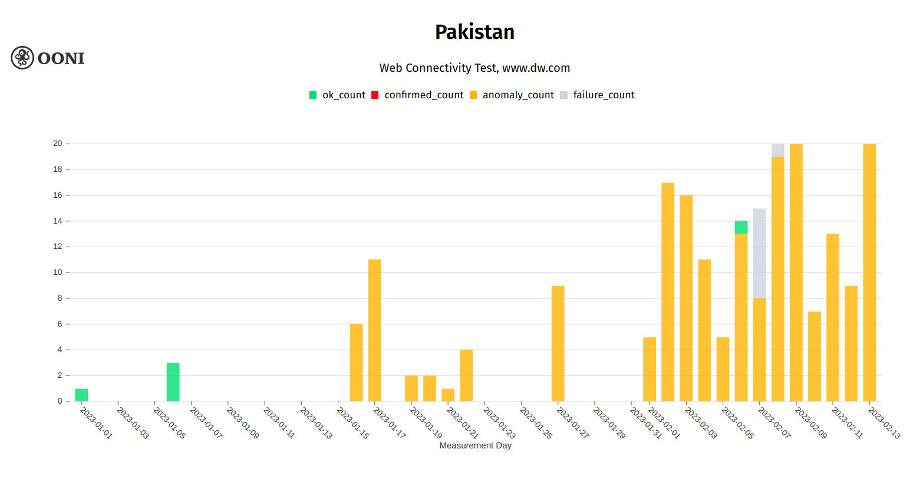
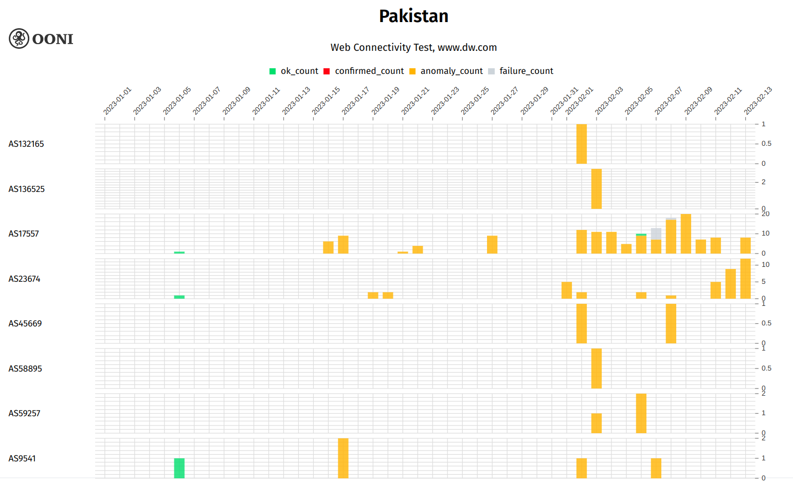
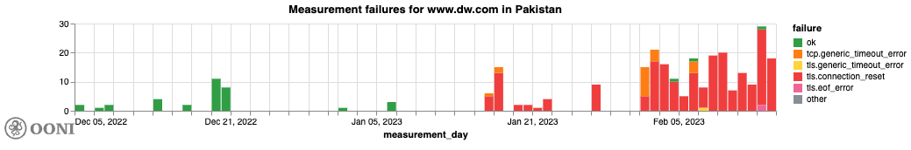
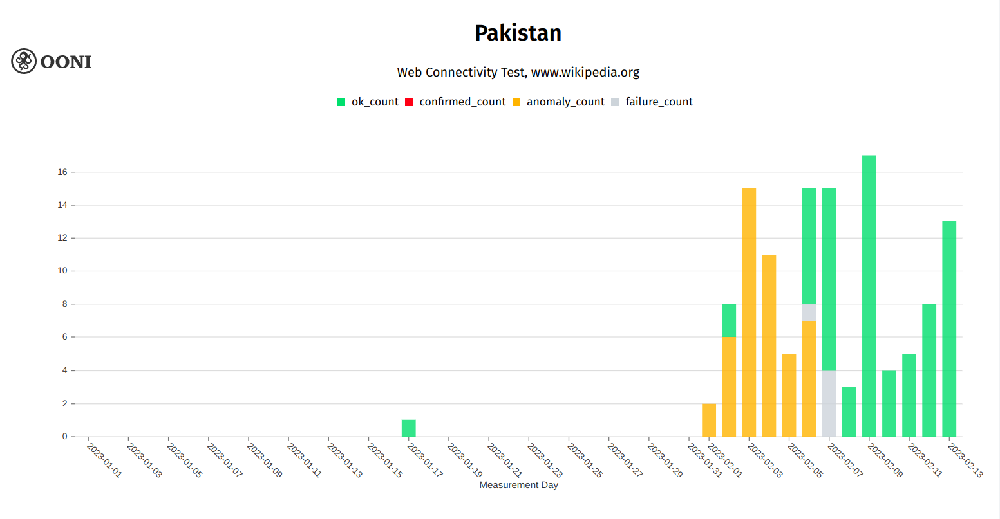
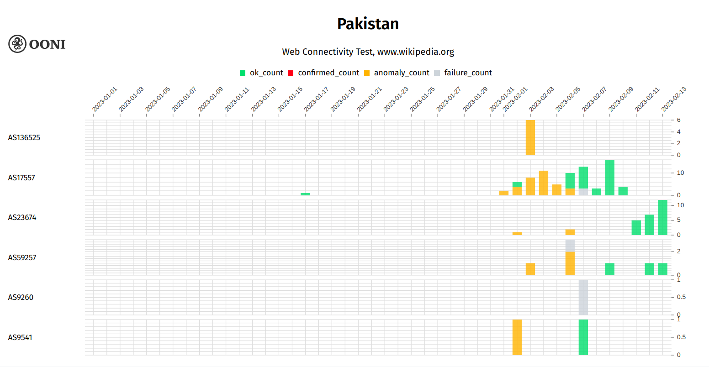
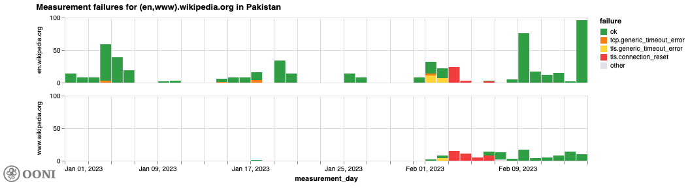

Over the past weeks, access to Wikipedia and Deutsche Welle’s (DW)
website was [reportedly](https://time.com/6253154/wikipedia-blocked-pakistan-blasphemy/)
blocked in Pakistan.

As part of this report, we share OONI data from Pakistan that provides
signals of these blocks. Specifically, OONI data shows that access to
[Wikipedia was temporarily restricted](https://explorer.ooni.org/chart/mat?probe_cc=PK&test_name=web_connectivity&domain=www.wikipedia.org&since=2023-01-01&until=2023-02-14&axis_x=measurement_start_day)
between 1st to 6th February 2023, while access to [Deutsche Welle (DW) remains blocked](https://explorer.ooni.org/chart/mat?probe_cc=PK&test_name=web_connectivity&domain=www.dw.com&since=2023-01-01&until=2023-02-15&axis_x=measurement_start_day)
since (at least) 16th January 2023.

* [Blocking of Deutsche Welle](#blocking-of-deutsche-welle)

* [Blocking of Wikipedia](#blocking-of-wikipedia)

* [Conclusion](#conclusion)

# Blocking of Deutsche Welle

As of 16th January 2023, OONI data suggests that access to Deutsche
Welle’s (DW) website (which provides an [Urdu language service](https://www.dw.com/ur/) for Pakistan) has been
[blocked](https://explorer.ooni.org/search?since=2023-01-01&until=2023-02-14&failure=false&domain=www.dw.com&probe_cc=PK)
on multiple networks in Pakistan – *and that the block remains ongoing*.
This was brought to our attention by Oliver Linow, an Internet Freedom
Specialist working with DW, who
[tweeted](https://twitter.com/OliverLinow/status/1619282417629675522)
about it sharing OONI data.

The following
[chart](https://explorer.ooni.org/chart/mat?probe_cc=PK&test_name=web_connectivity&domain=www.dw.com&since=2023-01-01&until=2023-02-14&axis_x=measurement_start_day)
aggregates OONI measurement coverage from the [OONI Probe](https://ooni.org/install) testing of DW’s website
(`www.dw.com`) on all tested networks (10 ASNs) in Pakistan. As is
evident, almost all measurements collected between 16th January 2023 to
13th February 2023 (excluding a few failed measurements on 7th and 8th
February 2023) presented anomalies, providing signs of blocking.

{{}}

**Chart:** OONI Probe testing of Deutsche Welle’s website
(`www.dw.com`) on multiple networks in Pakistan between 1st January
2023 to 13th February 2023 (source: [OONI MAT](https://explorer.ooni.org/chart/mat?probe_cc=PK&test_name=web_connectivity&domain=www.dw.com&since=2023-01-01&until=2023-02-14&axis_x=measurement_start_day)).

The fact that [most measurements from 16th January 2023 onwards presented anomalies](https://explorer.ooni.org/chart/mat?probe_cc=PK&test_name=web_connectivity&domain=www.dw.com&since=2023-01-01&until=2023-02-14&axis_x=measurement_start_day)
(along with the fact that previous measurements in early January 2023
were successful) provides an indication of blocking. Moreover, we
observe that these anomalies occurred during the same period (between
16th January 2023 to 13th February 2023) on [most tested networks](https://explorer.ooni.org/chart/mat?probe_cc=PK&test_name=web_connectivity&domain=www.dw.com&since=2023-01-01&until=2023-02-14&axis_x=measurement_start_day&axis_y=probe_asn)
in Pakistan. Out of the 10 tested ASNs, we observe anomalies on 8
networks. On the other 2 ASNs (AS138910 and AS9260), there is no data
available from 16th January onwards to draw any conclusions (on AS138910
`www.dw.com` was [not tested after 1st January 2023](https://explorer.ooni.org/search?since=2023-01-01&until=2023-01-02&probe_cc=PK&test_name=web_connectivity&probe_asn=138910&domain=www.dw.com&failure=true),
while on AS9260 the site was only tested once on 7th February 2023, and
that experiment
[failed](https://explorer.ooni.org/search?since=2023-02-07&until=2023-02-08&probe_cc=PK&test_name=web_connectivity&probe_asn=9260&domain=www.dw.com&failure=true)).

The following
[chart](https://explorer.ooni.org/chart/mat?probe_cc=PK&test_name=web_connectivity&domain=www.dw.com&since=2023-01-01&until=2023-02-14&axis_x=measurement_start_day&axis_y=probe_asn)
provides a per-ASN breakdown of the OONI Probe measurement coverage of
`www.dw.com` within this period, limited to the 8 ASNs where we
observe anomalies.

{{}}

**Chart:** ASNs in Pakistan where the OONI Probe testing of
`www.dw.com` presented anomalies between 1st January 2023 to 13th
February 2023 (source: [OONI MAT](https://explorer.ooni.org/chart/mat?probe_cc=PK&test_name=web_connectivity&domain=www.dw.com&since=2023-01-01&until=2023-02-14&axis_x=measurement_start_day&axis_y=probe_asn)).

We can see that the testing of `www.dw.com` started to present
anomalies on 16th January 2023 on Pakistan Telecommunication Company
(AS17557) – which is the [largest](https://en.wikipedia.org/wiki/PTCL)
ISP in Pakistan. This is also the network which received the largest
testing coverage in the following weeks. We observe [most anomalies on all tested networks](https://explorer.ooni.org/chart/mat?probe_cc=PK&test_name=web_connectivity&domain=www.dw.com&since=2023-01-01&until=2023-02-14&axis_x=measurement_start_day&axis_y=probe_asn)
from 2nd February 2023 onwards, which is also when `www.dw.com` was
tested on more networks. However, it remains unclear if the potential
block started before 16th January 2023, as `www.dw.com` was not tested
by [OONI Probe](https://ooni.org/install) users in Pakistan between
7th to 15th January 2023.

By looking at the [anomalous measurements](https://explorer.ooni.org/search?since=2023-01-01&until=2023-02-14&failure=false&domain=www.dw.com&probe_cc=PK),
we can see that almost the totality of failing measurements result in
[connection reset](https://explorer.ooni.org/measurement/20230213T103324Z_webconnectivity_PK_17557_n1_EPJNY37yvMFY5dMT?input=https%3A%2F%2Fwww.dw.com%2F)
errors.

{{}}

**Chart:** Measurement failures that occurred when `www.dw.com` was
tested in Pakistan between 16th January 2023 to 14th February 2023
(source: [OONI data](https://explorer.ooni.org/search?since=2023-01-01&until=2023-02-14&failure=false&domain=www.dw.com&probe_cc=PK)).

When we do observe a connection reset, this always occurs right after
the ClientHello message during the TLS handshake.

Overall, the blocking of DW’s website in Pakistan is suggested by OONI
data because:

* Almost all measurements collected from most tested networks in
Pakistan presented anomalies between 16th January 2023 to 13th
February 2023;

* Most anomalies measurements (across networks) present connection
reset errors;

* Consistent anomaly patterns usually indicate blocking.

# Blocking of Wikipedia

On 1st February 2023, Pakistan’s Telecommunication Authority (PTA)
[announced](https://twitter.com/PTAofficialpk/status/1620748000246251521)
that they had degraded Wikipedia services in the country as a result of
non-compliance by Wikipedia with their request to block or remove
sacrilegious content. PTA
[specified](https://twitter.com/PTAofficialpk/status/1620748003954028545)
that they would degrade Wikipedia services for 48 hours, noting that a
block could follow if Wikimedia Foundation did not comply with the
takedown requests.

On 3rd February 2023, Wikimedia Foundation published a
[statement](https://wikimediafoundation.org/news/2023/02/03/wikimedia-foundation-urges-pakistan-telecommunications-authority-to-restore-access-to-wikipedia-in-pakistan/)
notifying the public of PTA’s decision, stating that (as of that day)
their internal traffic reports indicated that Wikipedia and Wikimedia
projects were no longer available to users in Pakistan, and urging PTA
to restore access to their services. This statement was updated on 6th
February 2023 with a notification that PTA had been directed to restore
access to Wikipedia in Pakistan, and that this was confirmed by their
internal traffic team.

Interestingly, both the timing and nature of this reported block appears
to be corroborated by OONI data collected from Pakistan.

The following
[chart](https://explorer.ooni.org/chart/mat?probe_cc=PK&test_name=web_connectivity&domain=www.wikipedia.org&since=2023-01-01&until=2023-02-14&axis_x=measurement_start_day)
aggregates OONI measurement coverage from the testing of Wikipedia
(`www.wikipedia.org`) on multiple networks in Pakistan between 1st
January 2023 to 13th February 2023. As is evident, we only observe
anomalies between 1st to 6th February 2023, which coincides with the
aforementioned period when access to Wikipedia was interfered with.

{{}}

**Chart:** OONI Probe testing of Wikipedia (`www.wikipedia.org`) on
multiple networks in Pakistan between 1st January 2023 to 13th February
2023 (source: [OONI MAT](https://explorer.ooni.org/chart/mat?probe_cc=PK&test_name=web_connectivity&domain=www.wikipedia.org&since=2023-01-01&until=2023-02-14&axis_x=measurement_start_day)).

Between 1st to 6th February 2023, `www.wikipedia.org` was [tested on 5 ASNs](https://explorer.ooni.org/chart/mat?probe_cc=PK&test_name=web_connectivity&domain=www.wikipedia.org&since=2023-01-01&until=2023-02-14&axis_x=measurement_start_day&axis_y=probe_asn)
in Pakistan, and presented anomalies on all networks, as illustrated
below.

{{}}

**Chart:** ASNs in Pakistan which received OONI Probe testing of
`www.wikipedia.org` between 1st January 2023 to 13th February 2023
(source: [OONI MAT](https://explorer.ooni.org/chart/mat?probe_cc=PK&test_name=web_connectivity&domain=www.wikipedia.org&since=2023-01-01&until=2023-02-14&axis_x=measurement_start_day&axis_y=probe_asn)).

Similarly to the testing of `www.dw.com` (discussed previously), we
observe that most `www.wikipedia.org` testing was carried out on
Pakistan Telecommunication Company (AS17557) – which is also the
country’s largest ISP. Most measurements from that network presented
anomalies between 1st to 6th February 2023, and we also observed
anomalies when `www.wikipedia.org` was tested on 4 other ASNs during
this period.

Wikipedia blocking is indicated by the fact that we observe [anomalies on multiple networks](https://explorer.ooni.org/chart/mat?probe_cc=PK&test_name=web_connectivity&domain=www.wikipedia.org&since=2023-01-01&until=2023-02-14&axis_x=measurement_start_day&axis_y=probe_asn)
during the same period, while all measurements (excluded measurements
from failed experiments) from 7th February 2023 onwards were successful.
The latter also suggests that access to Wikipedia was [unblocked on 6th February 2023](https://explorer.ooni.org/search?since=2023-02-06&until=2023-02-07&probe_cc=PK&test_name=web_connectivity&domain=www.wikipedia.org&failure=false),
particularly since we start to observe many successful measurements that
day.

By looking at the [anomalous measurements](https://explorer.ooni.org/search?since=2023-02-01&until=2023-02-06&probe_cc=PK&test_name=web_connectivity&domain=www.wikipedia.org&failure=false),
we observe that most measurements collected on 1st and 2nd February
resulted in [timeout errors](https://explorer.ooni.org/measurement/20230202T045219Z_webconnectivity_PK_23674_n1_I8KQnsRiR1H58RFF?input=https%3A%2F%2Fwww.wikipedia.org%2F),
which is consistent with PTA’s
[announced](https://twitter.com/PTAofficialpk/status/1620748003954028545)
48-hour degradation of Wikipedia services. Between 3rd to 6th February
2023, we observe that most measurements resulted in [connection reset errors](https://explorer.ooni.org/measurement/20230205T200537Z_webconnectivity_PK_17557_n1_QIGM5lFlD4abHEzm?input=https%3A%2F%2Fwww.wikipedia.org%2F)
(which is consistent with what we observed in the
[blocking](https://explorer.ooni.org/measurement/20230213T103324Z_webconnectivity_PK_17557_n1_EPJNY37yvMFY5dMT?input=https%3A%2F%2Fwww.dw.com%2F)
of `www.dw.com`), suggesting that ISPs switched to blocking access to
Wikipedia on 3rd February 2023 (which is what both PTA and [Wikimedia Foundation](https://wikimediafoundation.org/news/2023/02/03/wikimedia-foundation-urges-pakistan-telecommunications-authority-to-restore-access-to-wikipedia-in-pakistan/)
announced). This was also
[reported](https://twitter.com/vinifortuna/status/1621648126372085760)
by Vinicius Fortuna (Engineering lead of Google’s [Jigsaw](https://jigsaw.google.com/) Internet Freedom team), who analyzed OONI data and
shared these findings on social media.

{{}}

**Chart:** Measurement failures that occurred when `www.wikipedia.org`
and `en.wikipedia.org` were tested in Pakistan between 1st January
2023 to 14th February 2023 (source: [OONI data](https://explorer.ooni.org/search?since=2023-02-01&until=2023-02-06&probe_cc=PK&test_name=web_connectivity&domain=www.wikipedia.org&failure=false)).

From the above chart, we can also see that the testing of
`en.wikipedia.org` presents similar results to the testing of
`www.wikipedia.org`. Moreover, we observe that both
`en.wikipedia.org` and `www.wikipedia.org` presented the same
failures between 1st to 6th February 2023, with both domains presenting
connection timeouts during the TLS handshake on 1st and 2nd February
2023, and connection resets between 3rd to 6th February 2023. The
consistent pattern observed for both domains provides a stronger signal
of blocking.

Similarly to what was
[reported](https://wikimediafoundation.org/news/2023/02/03/wikimedia-foundation-urges-pakistan-telecommunications-authority-to-restore-access-to-wikipedia-in-pakistan/)
by Wikimedia Foundation, OONI data shows that access to Wikipedia was
[restored](https://explorer.ooni.org/search?since=2023-02-06&until=2023-02-07&probe_cc=PK&test_name=web_connectivity&domain=www.wikipedia.org&failure=false)
on 6th February 2023.

# Conclusion

Over the years, Wikipedia has been blocked in several other countries as
well, including
[China](https://ooni.org/post/2019-china-wikipedia-blocking/),
[Venezuela](https://ooni.org/post/venezuela-blocking-wikipedia-and-social-media-2019/),
and [Iran](https://ooni.org/post/2020-iran-blocks-farsi-wikipedia/).

Past [OONI research](https://ooni.org/post/pakistan-internet-censorship/#religious-criticism)
(involving the analysis of OONI data collected between 2014 to 2017) has
shown that ISPs in Pakistan censored content that was viewed as
blasphemous, serving as a precedent for the recent blocking of
Wikipedia. While OONI data has previously shown the [blocking of news media websites in Pakistan](https://ooni.org/post/how-pakistan-blocked-social-media/#blocking-of-news-websites)
during Islamist protests in November 2017, this is likely the first time
that we are noticing the blocking of an international media website
(Deutsche Welle) in Pakistan.

We thank [OONI Probe](https://ooni.org/install) users in Pakistan who
contributed measurements, supporting this study. You can continue to
monitor the testing of services in Pakistan through the [OONI Measurement Aggregation Toolkit (MAT)](https://explorer.ooni.org/chart/mat?probe_cc=PK&test_name=web_connectivity&since=2023-01-16&until=2023-02-16&axis_x=measurement_start_day),
which publishes OONI measurements as open data in real-time.
