As of today, last year, Russia started its [military operation in Ukraine](https://www.bbc.com/news/world-60525350). This was followed by increased levels of internet censorship, as Internet Service Providers (ISPs) in Russia started [blocking access to several news media websites](https://ooni.org/post/2022-russia-blocks-amid-ru-ua-conflict/#blocking-of-news-media-websites). In early March 2022, OONI published a [report](https://ooni.org/post/2022-russia-blocks-amid-ru-ua-conflict/) documenting these blocks, as well as the [blocking of a site](https://ooni.org/post/2022-russia-blocks-amid-ru-ua-conflict/#blocked-website-about-captured-and-killed-russian-soldiers) (200rf.com) that shares information about captured and killed Russian soldiers in Ukraine. OONI also reported that Russian ISPs started [throttling access to Twitter](https://ooni.org/post/2022-russia-blocks-amid-ru-ua-conflict/#twitter-throttled) on 26th February 2022, and switched to [blocking](https://ooni.org/post/2022-russia-blocks-amid-ru-ua-conflict/#twitter-and-facebook-blocked) it by 4th March 2022 – at which point, they also started [blocking access to Facebook](https://explorer.ooni.org/search?since=2022-02-04&until=2022-03-07&failure=false&domain=www.facebook.com&probe_cc=RU&only=anomalies).

Information controls are known to occur during conflicts, and the increased censorship events in Russia suggest an attempt to control the narrative surrounding the conflict in Ukraine. But has internet censorship changed in Russia over the last year?

In this report, we attempt to answer this question through the analysis of [OONI measurements collected from Russia](https://explorer.ooni.org/chart/mat?probe_cc=RU&since=2022-01-01&until=2023-02-19&time_grain=day&axis_x=measurement_start_day&test_name=web_connectivity) between January 2022 to February 2023. We supplement our findings with information from relevant legal analysis and desk research provided by [Roskomsvoboda](https://roskomsvoboda.org/).



## Key Findings

Our analysis of [OONI Web Connectivity measurements collected from Russia](https://explorer.ooni.org/chart/mat?probe_cc=RU&since=2022-01-01&until=2023-02-19&time_grain=day&axis_x=measurement_start_day&test_name=web_connectivity) between January 2022 to February 2023 shows the **blocking of 494 domains**, 48 of which do not appear to be included in [Roskomnadzor’s official blocking registry](https://eais.rkn.gov.ru/en/). Overall, the blocked domains fall under a wide range of 28 different categories, suggesting pervasive levels of internet censorship in Russia.

New blocks that emerged over the last year include:

*   Blocking of **international human rights websites** ([Human Rights Watch](https://explorer.ooni.org/chart/mat?test_name=web_connectivity&axis_x=measurement_start_day&since=2022-01-01&until=2023-02-21&time_grain=day&probe_cc=RU&domain=www.hrw.org) and [Amnesty International](https://explorer.ooni.org/chart/mat?test_name=web_connectivity&axis_x=measurement_start_day&since=2022-01-01&until=2023-02-22&time_grain=day&probe_cc=RU&domain=www.amnesty.org));
*   Blocking of **Russian human rights websites** ([Moscow Helsinki Group](https://explorer.ooni.org/chart/mat?test_name=web_connectivity&axis_x=measurement_start_day&since=2022-09-01&until=2023-02-21&time_grain=day&probe_cc=RU&domain=www.mhg.ru));
*   Blocking of **investigative journalism** ([Agentura.Ru](https://explorer.ooni.org/chart/mat?test_name=web_connectivity&axis_x=measurement_start_day&since=2022-01-01&until=2023-02-21&time_grain=day&probe_cc=RU&domain=www.agentura.ru)) and **independent news media** sites ([The Bell](https://explorer.ooni.org/chart/mat?test_name=web_connectivity&axis_x=measurement_start_day&since=2023-01-20&until=2023-02-21&time_grain=day&probe_cc=RU&domain=thebell.io));
*   Blocking of [Instagram](https://explorer.ooni.org/chart/mat?test_name=web_connectivity&axis_x=measurement_start_day&since=2022-01-01&until=2023-02-22&time_grain=day&probe_cc=RU&domain=www.instagram.com), [SoundCloud](https://explorer.ooni.org/chart/mat?test_name=web_connectivity&axis_x=measurement_start_day&since=2022-09-01&until=2023-02-19&time_grain=day&probe_cc=RU&domain=soundcloud.com), and [Patreon](https://explorer.ooni.org/chart/mat?test_name=web_connectivity&axis_x=measurement_start_day&since=2022-07-01&until=2023-02-19&time_grain=day&probe_cc=RU&domain=www.patreon.com).

Access to the Tor Project’s website was [temporarily unblocked](https://explorer.ooni.org/chart/mat?test_name=web_connectivity&axis_x=measurement_start_day&since=2022-01-01&until=2022-12-31&time_grain=day&probe_cc=RU&domain=www.torproject.org) (between 15th to 28th July 2022), while several discontinued sites have been unblocked (possibly as part of a “blocklist cleanup”).

## Background

### Legal environment

An outstanding scale of internet censorship in 2022 in Russia became possible thanks to the mechanism of control over the Internet, which began to be prepared long before the invasion of Ukraine. The first time when access to a website was restricted by a court order happened back in 2004, when the decision [was made](https://novayagazeta.eu/articles/2022/04/21/zdes-byl-roskomnadzor) by the Savelovsky Court of Moscow. The blocked URL led to the text of the religious treatise "The Book of Monotheism", [according to the experts](https://www.sova-center.ru/misuse/news/persecution/2020/04/d42281/) of the SOVA Center, the text does indeed contain “certain elements of hate speech and a number of references to jihad referred to in a positive way,” but this does not give the right to “approach the religious work of the 18th century with modern standards.” The next waves of blocking, which happened in the 2000s, affected mainly musical performers, religious and far-right literature.

Internet censorship has been used by the Russian authorities as one of the key tools for establishing “information sovereignty” over the past decade. Since November 1, 2012, when the [law](https://base.garant.ru/70207766/) creating a [registry of prohibited in Russia resources](https://reestr.rublacklist.net/) was adopted, there has been an increase in the number of categories of prohibited information that can be blocked out of court, and the number of departments that have the power to add resources to the registry out of court. Each department also has its own vision of how to treat this power.

At the same time, there are [public entities](https://roskomsvoboda.org/post/mizulina-vozrozhdayet-97fz/) that regularly report “forbidden” content to these departments. There are already hundreds of thousands of questionable decisions: for example, on drugs or on educational activities, which are equated with propaganda. The fact that absolutely any platform in Russia can be blocked for absolutely any reason became obvious a few years ago. Large resources, including those at risk, we saw this in the [example of Twitter](https://roskomsvoboda.org/cards/card/twitter-vs-rkn/) which [was throttled](https://rkn.gov.ru/news/rsoc/news73464.htm) at the request of Roskomnadzor "in order to protect citizens." The agency said that since 2017, the microblogging service has not removed content that encourages minors to commit suicide, contains child pornography and information about the use of drugs.

The mass blocking of resources bypassing the court became possible thanks to the “Lugovoy law” (398-FZ). It came into force in December 2013 and allowed Roskomnadzor, on the orders of the Prosecutor General's Office, to immediately block websites with calls for riots and "extremist" information without a court decision.

At the end of 2017, the Prosecutor General's Office received the right to block the websites of "undesirable" organizations without trial. Two weeks after the [amendments](https://rg.ru/2017/11/25/fz327-site-dok.html) were made to the law "On Information", "Open Russia" and other projects of Khodorkovsky were blocked: "Open University", the project "Instead of Putin", which was created to enable independent voting for possible presidential candidates, and the politician's own website.

In addition to the Prosecutor General's Office, 16 other departments have now received the right to censor. Among them is the FSB, which can request to limit access to websites directly from the domain registrars. This means that they can bypass not only the courts, but also the Roskomnadzor registry. Roskomnadzor shares the right to implement internet censorship with several departments, however, it always executes the decision to block by itself, if the decision did not come from the FSB. Roskomnadzor adds the domain name, the IP address of the website or the address of a specific page into the registry – a "blocklist", which Russian Internet providers regularly upload to their equipment.

In 2022, Russia adopted a package of laws on military censorship that establishes criminal and administrative liability for criticizing the armed forces or actions of the authorities abroad. On the basis of “military” orders from the Prosecutor General’s Office and Roskomnadzor, dozens of independent Russian and foreign media, blog platforms, news aggregators, websites of human rights and charity organizations, social networks such as Facebook, Instagram and Twitter have been blocked.  

In February 2022, the Ministry of Internal Affairs [determined](https://roskomsvoboda.org/post/poryadok-blokirovki-dannyx-goszashishionnyx/) a mechanism for blocking resources containing the private data of people under state protection. Roskomnadzor became a body responsible for submitting such websites to the register of prohibited websites. Roskomnadzor became obliged to add an appropriate entry to the register within 24 hours from the date of receipt of the decision to recognize the information as prohibited and the decision to restrict access to it.

In March 2022, the State Duma and the Federation Council quickly adopted [amendments to the Criminal Code](http://duma.gov.ru/news/53620/). According to the amendments, spreading fake news about military actions, calling for sanctions, and discrediting the Russian armed forces faces will be followed by penalties ranging from a fine of 100,000 rubles to 15 years in prison, for example:  

*   A fine of 100,000 rubles will be charged "for actions aimed at discrediting the RF Armed Forces, including for public calls to obstruct the use of the armed forces of the Russian Federation."
*   15 years in prison for spreading fakes about the use of the Russian armed forces, if they entailed serious consequences.

In addition, articles 207.1 and 207.2 of the Criminal Code of the Russian Federation are in force, according to which the dissemination of unreliable socially significant information (e.g., about the depreciation of the ruble, the collapse of the economy or default) can be also followed by charges.

Roskomnadzor indicated that to cover the Russian military actions in Ukraine only information and data from [official Russian sources](https://rkn.gov.ru/news/rsoc/news74084.htm) should be used. Roskomnadzor [prohibited naming the “special operation” an attack, an invasion, or a war](https://rkn.gov.ru/news/rsoc/news74112.htm_). Thus, any information that was not obtained from a Russian official source, such as the Ministry of Defense, should be considered fake. In addition to the obvious violation of the provisions of the Russian Constitution and of the laws "On Mass Media", both of which prohibit censorship.

In April 2022 parliamentarians [proposed](https://roskomsvoboda.org/post/zachistka-infopolya-v-rossii/) amending certain legislative acts of the Russian Federation, thereby giving the Prosecutor General's Office the right to permanently block media for disseminating false information about Russia's "special military operation".

In July, President Vladimir Putin [signed](https://t.me/roskomsvoboda/9144) a number of laws: on “foreign agents”, “on countermeasures in response to discrimination against Russian media abroad”, on the creation of a database of extremist materials, on turnover fines for foreign IT companies who became “hostages”, etc.

Judging by the emerging law enforcement practice, online content that contradicts the official position of the government is considered to be defamatory. The FSB expert unit for the Sverdlovsk region [explained](https://www.kommersant.ru/doc/5357212) that there are four types of defamation:

*   discrediting the army as a whole;
*   discrediting the RF Armed Forces as a state institution;
*   discrediting military personnel;
*   discrediting the symbols and paraphernalia of the Russian army.

In addition, the State Duma [adopted](https://roskomsvoboda.org/post/ugolovka-za-vsio/) amendments to the Criminal Code and the Code of Criminal Procedure on liability for "calls to carry out activities against the security of the state."

In 2022, Network Freedoms [counted](https://t.me/tvrain/62375) 779 cases of criminal charges brought for statements on the network (posts, reposts, statuses on social networks and messengers). This is the annual maximum for 15 years of observations, according to the project's annual report on Internet freedom in Russia. The security forces opened at least 42 criminal cases on "discrediting" the army, six of which resulted in real sentences.

Moreover, 187 criminal cases were initiated under the article of "fake news". This is more than under articles on “discrediting” because there is no administrative responsibility for “fakes” (only criminal).

In addition, there are 1889 cases of administrative charges, including for the distribution of extremist materials and symbols of banned organizations (including projects by Alexei Navalny), and for disrespect for the authorities.

Telecom operators became responsible for allowing traffic through the TSPU. In case of rejection of using the TSPU, the operators now [face fines](https://63.rkn.gov.ru/news/news15228891.htm) of up to 5 million rubles. Roskomnadzor [uses TSPU](https://roskomsvoboda.org/post/suvenir-runet-obrastaet-cenzuroy/) as "Internet jammers” to block websites for political reasons without adding them to the register of prohibited information. The same law introduces fines for search engines that do not inform users about violations (discrediting acts, fake news, foreign agent status) of Internet resources sought by users through these search engines.

In August, the Ministry of Digital Transformation [published documents](https://roskomsvoboda.org/post/blokirovka-kopiy-saytov/) proposing to empower Roskomnadzor to block mirrors of previously blocked sites. The Decree will come into force on March 1st, 2023 and will be valid for 6 years, however the mirrors of the media websites are being [consistently blocked](https://www.zaks.ru/new/archive/view/229271) since February 2022.

After the adoption of the [law](https://publication.pravo.gov.ru/Document/View/0001202212260025?index=1&rangeSize=1) banning LGBT propaganda in December, the Government [added information](https://roskomsvoboda.org/post/lgbt-perechen-blokirovok/) promoting ‘non-traditional’ sexual relations, pedophilia and gender reassignment to the list of content to be included in the register of information banned in the Russian Federation on the Internet by a decision of Roskomnadzor. This means that even more blocking related to this kind of content is expected from next year. Previously, individual sites and pages with LGBT topics were blocked at the request of Rosmolodezh.

On December 1, 2022, the law “On Control over the Activities of Persons Under Foreign Influence” [came into force](https://roskomsvoboda.org/cards/card/inoagenty-popravki-v-dekabre/). Now foreign influence can be interpreted so broadly that theoretically everyone, from social media users to philanthropists and entrepreneurs, is at risk of becoming a foreign agent.  
  
[248 individuals and legal entities](https://drive.google.com/file/d/1RiYPt8dkQAOYW6Yz4cO9LP9oChbVeqSd/view) were added to the registry of foreign agents in 2022. The “military” motivation of the decisions is beyond doubt: 62 people included in the registry of individuals performing the functions of a foreign agent have Ukraine as a source of influence. The latest organization recognized by the Russian Ministry of Justice as a foreign agent in 2022 was Roskomsvoboda.

At the end of 2022, a [new law](https://roskomsvoboda.org/post/blokirovki-i-biometria-v-odnom-flakone/) expanded the powers of the Prosecutor General's Office in terms of extrajudicial blocking. The agency was given the authority to restrict access to materials containing “substantiation and (or) justification for carrying out extremist activities, including terrorist activities,” without a court decision.

### Censorship context

Over the last year, Russian authorities blocked access to social networks, Russian and foreign media, VPN services, and some specific content, such as anime, lyrics of banned songs, offers to buy sanctioned products, and articles with compromising information on government officials.

There was a record number of blocks in 2022. More than 247,492 URLs [were added](https://reestr.rublacklist.net/ru/?status=1&gov=all&date_start=01-01-2022&date_end=22-12-2022) to Roskomnadzor’s registry of banned websites in 2022. Many blocking orders regarding independent media and human rights organizations appear aimed at censoring articles or media materials covering events in Ukraine in 2022.

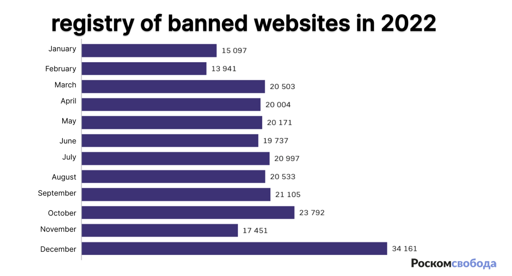

**Chart:** New entries added to the registry of prohibited websites maintained by Roskomnadzor in 2022 (distributed by months).

In November 2022, Roskomsvoboda mentioned that some of the entries in the registry became unattributed to the authority, meaning that there is no information about who requested the website to be blocked. At the same time, most resources which were added anonymously contain information that could allegedly discredit or contain fakes about the actions of the Russian army. This motivation for restricting access seems very similar to the approach of the Prosecutor General's Office.

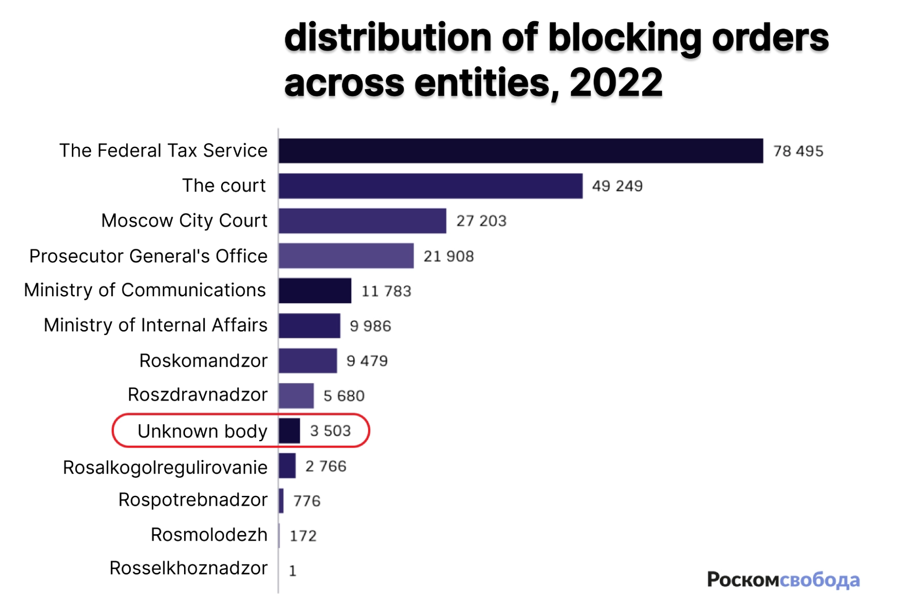

**Chart:** Distribution of blocking orders across entities in 2022 according to Roskomsvoboda’s registry.

### Censored topics, services and websites

**Websites of Ukrainian and international media**

Ukrainian news sites and portals, as well as the website of the Ministry of Health of Ukraine, were the first to be hit by military censorship in 2022. The attention of the Prosecutor General's Office was [attracted](https://roskomsvoboda.org/post/hromadske-blocked/) by two links to materials from the website of the popular Ukrainian Internet TV channel Hromadske. The department considered the materials posted there extremist, and decided to fully block the website. Later, three major Ukrainian news outlets were blocked in Russia: Korrespondent.Net, Ukrayinska Pravda, and the site of journalist Dmitry Gordon. Together with them, by the same decision, Current Time, the Ukrainian Interfax, and a portal with information about the losses of the Russian army [were included in the registry](https://roskomsvoboda.org/post/gp-zablochila-ukrsayty-za-warnews/). Later, whole [batches of Ukrainian portals and media](https://roskomsvoboda.org/post/gp-blochit-ukr-oficsayty-i-smi/) were added to the registry, now “Left Bank”, “Censor.Net”, “New Time” (nv.ua), “Depo”, “Gazeta.UA”, “Focus. UA”, “Zakhid.Net”, the unified information agency of the country “UkrInform”, UAinfo and others are being blocked in Russia.

**Anti-corruption investigations and resources**

Since February 2022, the authorities have continued to fight against the publications of the investigations of Navalny and the FBK (Anti-Corruption Foundation). Roskomnadzor [sent a letter](https://roskomsvoboda.org/post/cenzura-izza-fbk-i-navalny/) to the media outlets demanding to remove publications mentioning the film “He is not Dimon to you”, materials about the palace of Vladimir Putin, the apartment of the head of Rostech Sergey Chemezov on Manezhnaya Square, the dacha of the head of Roskosmos Dmitry Rogozin and other officials. Russian media, namely, Meduza, Dozhd, Ekho Moskvy, Svobodnye Novosti (Saratov), Vesma (Magadan), The Village, Paper, Znak.com, TJournal and Republic confirmed receipt of such a letter.

At the same time in February 2022, the website for FBK donations, websites with Navalny's investigations about the Simonyan-Keosayan family, deputy Slutsky and Vladimir Solovyov, [were blocked](https://t.me/roskomsvoboda/8211) altogether by one decision of the Prosecutor General's Office. Later in March, 7 more URLs with reprints of the investigations mentioning Vladimir Putin, Dmitry Medvedev and his wife, Vladimir Yakunin, and Vladimir Solovyov, as well as information about the public outcry these investigations had, were [added to the registry](https://t.me/roskomsvoboda/8540).

**VPN services**

One of the first high-profile blockings in 2022 was the [restriction of access](https://roskomsvoboda.org/post/tunnelbear-nedostupen/) to the TunnelBear service. The decision to block TunnelBear was made back in 2017 by the Dyurtyulinsky District Court of the Republic of Bashkortostan. It was included in the registry since 2018, but it was accessible through the GhostBear option (which makes encrypted data look like regular Internet data) [until January 2022](https://roskomsvoboda.org/post/tunnelbear-nedostupen/). In June, residents of different regions of Russia [began to report failures](https://t.me/roskomsvoboda/8898) in the operation of ProtonVPN and NordVPN. In addition, at the end of 2022, the following list of VPNs was blocked (or there were blocking attempts): Betternet, Lantern, X-VPN, Cloudflare WARP, Tachyon VPN, PrivateTunnel, VyprVPN, Opera VPN, Hola! VPN, ExpressVPN, KeepSolid VPN Unlimited, Speedify VPN, IPVanish VPN and others.

**Websites with leaks of Russian citizens’ private data**

Websites `saverudata.info` and `itarmy.com.ua` hosted a merged database from Russian services such as Yandex.Food, Delivery Club, Wildberries, SDEK, Beeline, etc. The decision to block these resources [was made on 10th March](https://t.me/roskomsvoboda/8523), but the URLs were [added](https://reestr.rublacklist.net/search/?q=2-892%2F2022) to the registry only on 23rd March, and at the same time access to them began to be restricted.

**Podcasts**

BBC Russian service’s podcast “What was it” [was removed](https://roskomsvoboda.org/post/v-yamu-ne-stalo-cho-eto-bylo/) from Yandex.Music at the request of Roskomnadzor in April 2022, which in turn relied on the decision of the Prosecutor General's Office. The websites of the [BBC](https://reestr.rublacklist.net/record/4090149/) and the [BBC Russian Service](https://reestr.rublacklist.net/search/?q=bbcrussian.com) have previously been blocked in Russia for covering the “special operation”. In October, Yandex.Music [removed several more podcasts](https://t.me/roskomsvoboda/9568) at the request of Roskomnadzor: What Happened, Text of the Week and Signal podcasts by Meduza, and the Freedom Quotes podcast by Radio Liberty.

**Gaming websites and services with appeal to the users regarding events in Ukraine**

The website of the popular computer game ‘S.T.A.L.K.E.R. 2: Heart of Chornobyl’ was [blocked](https://roskomsvoboda.org/post/stalker2-blocked/) in April 2022. The Prosecutor General's Office found an appeal from the creators of the game to fans and subscribers, which spoke of the condemnation of the so-called "military special operation" on this website. In April 2022, one of the most popular chess websites, [chess.com](https://www.chess.com/), was added to the registry. The attention of the Prosecutor General's Office was attracted by [two articles](https://roskomsvoboda.org/post/block-chess-com-resonance/): one about the website's policy in regards to the "special operation" carried out by the Russian army, and the second about Ukrainian chess players and the events that happened to them.

**Secure email services**

On 3rd June 2022 German cloud and mail service Eclipso [was blocked](https://reestr.rublacklist.net/search/?q=27-31-2022%2F%D0%A2%D1%80%D0%B5%D0%B1671-22). It was added to the registry at the request of the Prosecutor General's Office, which means that the department found either extremism, calls for riots or content "discrediting the Russian army" in its services or publications. The Swiss secure email service Swisscows.email was also [blocked](https://roskomsvoboda.org/post/swisscows-email-blocked/). As in other cases involving the blocking of mail services, the Prosecutor General's Office acted as the initiator, apparently due to [reports of false mining](https://www.interfax.ru/russia/850901) [sent through the service](https://www.interfax.ru/russia/850901).

**Crypto exchanges and websites about cryptocurrencies**

On 4th June 2022 one of the most popular media about cryptocurrencies, Forklog, [was included in the registry](https://roskomsvoboda.org/post/forklog-pod-voen-cens/) by the Prosecutor General's Office because of an article with an appeal to readers regarding the invasion in Ukraine. In August, some more [crypto exchanges](https://roskomsvoboda.org/post/block-vyvoda-bitka-v-rubli/) and websites explaining how to exchange cryptocurrencies for rubles were blocked by the Saratov court at the suit of the district prosecutor's office.

**LGBTQ+ related content**

The website "Nuntiare et Recreare", dedicated to religious LGBT personas, and the website of the Museum of LGBT History in Russia [were blocked](https://t.me/roskomsvoboda/9126) in July 2022. They were included in the registry of prohibited websites at the request of Rosmolodezh. After the adoption of the [law on the ban on LGBT propaganda](https://roskomsvoboda.org/post/skrepozakon-1-prinyat/) and the inclusion of this category of information in the list of prohibited for distribution, we expect more websites related to LGBTQ+ to be added to the registry, and consequently to be blocked in Russia.

**Anime and cartoons**

By two court decisions in Saint-Petersburg and Saratov, 15 URLs to the websites sharing anime (Attack on Titan, Dante’s Inferno, Inuyasha) were [added to the registry](https://t.me/roskomsvoboda/8097) and were blocked in January 2022. Following a court decision in Kaliningrad, 13 more URLs pertaining to the anime-sharing websites were [added to the registry](https://t.me/roskomsvoboda/8127) (Dead Space: Downfall, Dante’s Inferno, Cat Paradise). Some more court decisions were added to the registry, anime and cartoons that already have been blocked in the past years: Happy Tree Friends, Demon King Daimao, Redo Of Healer. Another 170 URLs to the anime Saiyuuki Reload: Zeroin [were added to the registry](https://t.me/roskomsvoboda/9054) after the appeal by OKKO (Russian streaming platform).

**Music, lyrics and videos**

At the beginning of the year, websites with phonograms and lyrics of Russian raper  Morgenstern’s song "Rose Wine-2" were added to the registry, at the same time the ​​song was removed from all streaming platforms (VK, Yandex Music, Spotify, Apple Music) and Youtube. Earlier, the musician was fined 100 thousand rubles under an article on drug propaganda for the release of this song. In January 2022, the Ministry of Internal Affairs [added 4 websites](https://t.me/roskomsvoboda/8112) with the song to the register, then twice [added several more URLs](https://t.me/roskomsvoboda/8137) to this list. In some cases, since the blocking was carried out via HTTPS, entire websites were blocked.

Later, the website of the [Bandcamp](https://t.me/roskomsvoboda/8894) music platform was blocked for posting the song "Arm!" by an anarchist punk group "Brigadir". This song was previously included in the registry of extremist materials. Another song that was added to the same list at the request of Rosmolodezh is ["Columbine"](https://t.me/roskomsvoboda/8954) by rappers "Zamay" and "Glory to the CPSU". By the decision of the court and prosecutor's office in Krasnoyarsk, the song of the punk band "Orgasm of Nostradamus" was also [added to the registry of extremist materials](https://t.me/roskomsvoboda/9532) for a call for reprisal against the younger generation.

### Military censorship

So far, there are [more than ten thousand websites blocked](https://roskomsvoboda.org/post/10000-military-cens/) on the basis that they allegedly distribute materials that “discredit the Russian armed forces” or “military fakes”. The Prosecutor General's Office of the Russian Federation was leading the decision to restrict access to most of them, but there are also decisions by regional courts, and the number of decisions taken regionally is growing monthly.

Blocking decisions by the Prosecutor General's Office have become so widespread because, by the Prosecutor General’s Office’s decision, it is possible to restrict access to websites and other resources without going through the courts. For example, the Prosecutor General's Office has [blocked more than 6,000 websites](https://reestr.rublacklist.net/ru/?q=27-31-2020%2F%D0%98%D0%B42145-22) and URLs on the basis of a single decision numbered 27-31-2020 / ID2145-22 since the beginning of the war. This became one of the very first and most massive decisions of the Prosecutor General's Office in terms of the number of resources added to the registry of prohibited information.

The decision 27-31-2020 / ID2145-22 was made right after the beginning of the invasion, at a time when the law on military censorship had not yet been adopted. We have an assumption that URLs are still being entered into the registry as part of this decision. However, we can’t say this with 100% certainty, since in the decisions of the “Unknown state agency” only the date, the mass blocking and the type of resources that are being blocked are similar to the blockings of the Prosecutor General's Office based on the decision  27-31-2020 / ID2145-22.

For example, in the case of restricting access to CloudFront, you can see that there are [only two initiators here](https://reestr.rublacklist.net/ru/?q=cloudfront.net): the [“Unknown state agency”](https://reestr.rublacklist.net/ru/?status=all&gov=2639&date_start=&date_end=&q=cloudfront.net) and (until November 2022) [the Prosecutor General's Office](https://reestr.rublacklist.net/ru/?status=all&gov=5&date_start=&date_end=&q=cloudfront.net). Since November, the authorities have preferred to hide the rest of the details from the public.

It’s hard to categorize military censorship in Russia. For example, the websites included in the registry now include: websites of public organizations, state portals of countries that the Russian authorities consider “unfriendly”, the websites of large media, online cinemas and websites with pirated content. Unfortunately, for the owners of certain websites blocking is sometimes only the beginning of a series of events. For example, it is not uncommon to see how representatives of censored media face criminal or administrative prosecution.

### Services

[Patreon, Grammarly](https://t.me/roskomsvoboda/9267) and SoundCloud were blocked due to accusations of spreading fakes. The True Story media aggregator, launched by the ex-creator of Yandex.News, [was blocked](https://t.me/roskomsvoboda/9368) a few days after its launch. ‘Help desk’, a service created in May 2022 to help people affected by the actions of the Russian authorities, was also [blocked](https://t.me/roskomsvoboda/9675).

The Prosecutor General's Office [blocked](https://t.me/roskomsvoboda/8456) Instagram, which, by the number of authors, is ahead of all social networking platforms in Russia (at the end of 2021, there were almost [40 million users](https://lenta.ru/news/2021/11/19/socialnet/)). Blocking [was carried out according to the “mask”](https://reestr.rublacklist.net/record/4138821/), which means that access to all domains and subdomains of the social network is restricted. There is only one Instagram IP address in the registry, but it is possible that Roskomnadzor will continue to add other resources of the service to its registry.

The Prosecutor General's Office demanded that Roskomnadzor restrict access to Instagram in the territory of the Russian Federation as an out-of-court decision, as "informational materials containing calls for violent acts against citizens of the Russian Federation, including military personnel" [were spreading](https://t.me/rkn_tg/213) on Instagram.

In its press release, Roskomnadzor also referred to a statement by Meta Platforms Inc., about [lifting the ban](https://www.reuters.com/world/europe/exclusive-facebook-instagram-temporarily-allow-calls-violence-against-russians-2022-03-10/) on its social networks for residents of a number of countries to post information containing calls for violence against Russian citizens, including military personnel. After this statement, the Prosecutor General's Office [filed a lawsuit](https://roskomsvoboda.org/post/meta-genprokuratura/) demanding that Meta be recognized as an extremist organization and banned from its activities in the country, while at the same time ordering Roskomnadzor to block access to Instagram. And although the company representative [clarified](https://www.gazeta.ru/social/news/2022/03/11/17409241.shtml) that calls for violence against civilians would still remain banned, the Russian authorities nevertheless decided to restrict access to some of its services.

### Media censorship

During the 10 years of active censorship in Runet, almost all independent Russian and some foreign media have been blocked, forced to close or stop their journalist activities.  

Media censorship became especially massive after February 24, 2022. Since March 4, 2022, dozens of media resources have been blocked in Russia at the request of Roskomnadzor, and since April 2022, media blocked in Russia [have ceased to be shown](https://roskomsvoboda.org/post/poiskoviki-ne-vydayut-smi/) in search results by Russian search engines: Yandex, Mail.ru and Rambler. Yandex [explained](https://ria.ru/20220418/yandeks-1784165802.html) that they remove all links that Roskomnadzor enters into the registry of prohibited websites from their search results.

In response to a request about why links disappear from their search engine, Yandex [said](https://ria.ru/20220418/yandeks-1784165802.html):

“Links disappear from Yandex search results if they were added by Roskomnadzor to the register of prohibited sites. According to the legislation of the Russian Federation, search engines are required to exclude links to the websites and their "mirrors" as soon as Roskomnadzor includes them into the register."

At the same time, all new media websites which were created after 24th February 2022 were blocked within a month after the launch. Depending on the type and scale of the created media or platform, sometimes it took only a few days to restrict access to the resource, as in the example of [True Story project](https://t.me/roskomsvoboda/9368).

Among the first organizations who have faced censorship after the beginning of Russian invasion in Ukraine were:

*   [DOXA](https://roskomsvoboda.org/post/rkn-doxa-block/) (local independent media);
*   [BBC](https://reestr.rublacklist.net/ru/record/4090149/);
*   [Voice of America](https://reestr.rublacklist.net/ru/record/4109961/);
*   [DW](https://reestr.rublacklist.net/ru/record/4090078/);
*   [TJ](https://reestr.rublacklist.net/ru/record/4142484/) (blogging platform);
*   [Bumaga](https://reestr.rublacklist.net/ru/record/4138853/) (local independent media);
*   [Meduza](https://reestr.rublacklist.net/ru/record/4119326/) (local independent media);
*   [Activatica](https://reestr.rublacklist.net/ru/record/4126120/);
*   [Mediazona](https://reestr.rublacklist.net/ru/record/4126117/) (local independent media);
*   [Sobesednik](https://reestr.rublacklist.net/ru/record/4126122/) (local independent media);
*   [Radio Freedom](https://reestr.rublacklist.net/ru/record/4109959/);
*   [Echo Kavakaza](https://reestr.rublacklist.net/ru/record/4126132/) (local independent media);
*   [Republic](https://reestr.rublacklist.net/ru/record/4126118/) (local independent media);
*   [7x7. Horizontal Russia](https://reestr.rublacklist.net/ru/record/4126125/) (local independent media);
*   [Tayga Info](https://reestr.rublacklist.net/ru/record/4100916/) (local independent media);
*   [The Village](https://reestr.rublacklist.net/ru/record/4109860/) (local independent media);
*   [LentaChel](https://reestr.rublacklist.net/ru/record/4126116/) (local independent media), which [faced censorship](https://roskomsvoboda.org/post/chelyabinskoe-onlajn-smi-nakazyivayut-za/) many times before 24th February.

It’s far from a full list of websites, access to which was restricted.

Back in early March last year, two major Russian media outlets, Ekho Moskvy and Dozhd, [were blocked](https://roskomsvoboda.org/post/echo-i-tvrain-banyat/). In the result, radio station Echo Moskvy faced censorship from two sides at once: the Prosecutor General's Office censored it because of the coverage of hostilities in Ukraine, and Google restricted access to its YouTube channel for EU residents because of radio’s connection with Gazprom-Media.

In July last year, Dozhd received permission to continue broadcasting from Riga, but after the revocation of the Latvian media license, it moved its broadcast to the Netherlands. The radio station "Echo of Moscow", which has been operating since August 22, 1990, suspended its work by the decision of the director of the radio station, Alexei Venediktov.

 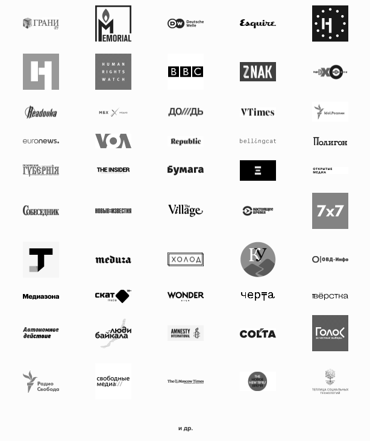

**Image:** Logos of censored news media in Russia.

In 2023, Meduza (which was blocked in spring 2022), was declared by the Prosecutor General's Office an “undesirable” organization. The oversight agency [considered](https://t.me/roskomsvoboda/10147) that this media poses a "threat to the foundations of the constitutional order and security of the Russian Federation."

Also, “Unknown Agency” continues to consistently block Novaya Gazeta and its materials. The media [found in the registry](https://t.me/roskomsvoboda/10203) its report from the Samara region, where the funeral of the dead mobilized Russians from Makeevka took place. Recently, the Moscow City Court approved the decision of the court of the previous instance to annul Novaya's media certificate (which was an unprecedented move, as Novaya Gazeta is one of the oldest independent media in Russia, founded in 1993).

The website of the Moscow Helsinki Group, one of the oldest human rights organizations in Russia, [has been blocked](https://t.me/roskomsvoboda/10226). Roskomnadzor [explained](https://t.me/lentachold/57638) this to Interfax by “repeated placement of prohibited content and materials discrediting the Russian Armed Forces”. Recently, the website of [Dmitry Ivanov](https://reestr.rublacklist.net/ru/record/5395887/) (blogger Kamikaze Di) and Chuvash activist [Alexander Udikov](https://reestr.rublacklist.net/ru/record/5407900/) were also added to the registry.

Blocking of the media websites and their mirrors one after another led to ​​the rapid decrease of traffic for almost all independent media and consequently affected their funding both through donations and through the advertising contracts. Different media approached traffic loss differently, some launched their own VPNs to share them for free with users (Bumaga, DOXA and Mullvad), other media stopped using websites and focused on social networks (Instagram, Telegram), while some media with bigger capacity continued to release new mirrors.

However, none of these solutions became permanent and many media are continuing to struggle to get access to their audiences. Due to the implied sanctions it’s not possible to pay for non-Russian services using Russian payment systems, therefore the readers cannot donate money to the international bank accounts, and they cannot donate to the Russian bank accounts if they access the donation page through a VPN – Russian banks consider this an international transfer and do not accept the funds. At the same time, for some media, which are already labeled as foreign agents and who may become an ‘undesirable’ or ‘extremist’ organization, as in the case of Meduza, having financial relationships with Russian organizations or individuals brings risks for them becoming ‘supporters’ of an extremist organization and facing criminal charges.

On the other hand, even though some media focused their effort on third-party services (social networks), they still faced a number of difficulties with using Instagram and Telegram — even though they weren’t effectively blocked. Bot attacks became quite common, and often media accounts would get reported and blocked. In case of such events, media would need to go to the services’ support and provide evidence that they did not violate platforms’ policies, but it could take weeks before the account gets unblocked, and consequently the organization loses traffic and followers.

## Methods

Since 2012, OONI has developed [free and open source software](https://github.com/ooni/), called [OONI Probe](https://ooni.org/install/), designed to [measure various forms of internet censorship](https://ooni.org/nettest/). OONI Probe is run by volunteers in around 160 countries every month, and their test results are automatically [published by OONI as open data in real-time](https://ooni.org/data/). More than [a billion network measurements](https://explorer.ooni.org/) have been collected and published from 25 thousand networks in 241 countries and territories over the last decade.

OONI Probe users in Russia, in particular, regularly contribute a large volume of measurements, having contributed [more than 200 million measurements from more than 2,600 local networks in Russia](https://explorer.ooni.org/country/RU) over the years. In fact, out of all countries, Russia accounts for the second country (following the U.S) with the largest volume of OONI measurements globally. Every day, new measurements are collected from Russia and [openly published](https://explorer.ooni.org/search?since=2022-02-02&until=2022-03-05&failure=false&probe_cc=RU) in real-time. We base the analysis of this research on a subset of these measurements collected from Russia over the last year (between January 2022 to February 2023).

The main research question that guided this report is what has changed in Russia’s internet censorship landscape over the last year, following the start of the conflict in Ukraine on 24th February 2022.

Specifically, we aim to address the following main questions:

*   Are the [new blocks that emerged in Russia after 24th February 2022](https://ooni.org/post/2022-russia-blocks-amid-ru-ua-conflict/) still in place? Have services been unblocked?
*   Have other new blocks emerged in Russia since our [last report](https://ooni.org/post/2022-russia-blocks-amid-ru-ua-conflict/) (published in early March 2022)? If so, which services do they affect?
*   Is internet censorship in Russia still being implemented in a [decentralized](https://ooni.org/post/2022-russia-blocks-amid-ru-ua-conflict/#key-findings) way?
*   How do the blocks observed through OONI data over the last year compare with Russia’s official blocking orders?

Based on the above questions, we have limited our analysis to services that have only recently been blocked from 24th February 2022 onwards, while excluding findings on the many other, long-term blocks that were already in place (such as the long-term [blocking of LGBTIQ websites](https://ooni.org/post/2021-no-access-lgbtiq-website-censorship-six-countries/)).

To examine the above questions, we analyzed [OONI Web Connectivity data collected from Russia](https://explorer.ooni.org/chart/mat?test_name=web_connectivity&axis_x=measurement_start_day&since=2022-01-01&until=2023-02-19&time_grain=day&probe_cc=RU) between **January 2022 to February 2023**. Specifically, we analyzed measurements collected from [OONI’s Web Connectivity test](https://ooni.org/nettest/web-connectivity/), which is designed to measure the blocking of websites (these websites are publicly hosted on the [Citizen Lab test list Github repository](https://github.com/citizenlab/test-lists/tree/master/lists)). This test measures the accessibility of websites by attempting to perform a [DNS lookup](https://ooni.org/support/glossary/#dns-lookup), TCP/IP connection, and [HTTP GET request](https://ooni.org/support/glossary/#http-request) from two vantage points: (1) the local vantage point of the user and (2) a control network (non-censored network). The results from both networks are automatically compared and if they match, the tested URL is annotated as “accessible” (if the testing succeeds from the control vantage point). If the results differ, the tested URL is annotated as “[anomalous](https://ooni.org/support/faq/#what-do-you-mean-by-anomalies)”, which may provide a signal of potential blocking.

Depending on why the anomaly emerges, the anomalous measurement is automatically annotated as a DNS, TCP/IP, HTTP diff, or HTTP failure anomaly. For example, if the DNS lookup resolves to an IP address which differs from that resolved from the control vantage point, the measurement is annotated as a “DNS anomaly”, which may be a sign of [DNS tampering](https://ooni.org/support/glossary/#dns-tampering).

However, [false positives](https://ooni.org/support/faq/#what-are-false-positives) can occur, which is why we look at anomalous measurements in aggregate in order to determine if a tested URL consistently presents a large volume of anomalous measurements (in comparison to successful measurements) on a tested network. If a tested URL presents a large volume of anomalies, it may provide a stronger signal of potential blocking. If the types of anomalies are consistent (for example, always presenting DNS anomalies on a tested network), they offer an even stronger signal of potential censorship (since they suggest the use of a specific censorship technique, such as [DNS hijacking](https://ooni.org/support/glossary/#dns-hijacking)). But beyond aggregating anomalous measurements, we also analyze the raw data pertaining to anomalous measurements in order to identify the specific errors that occurred as part of the testing, offering insight into how a tested URL is potentially blocked.

Based on our current heuristics, we automatically confirm the blocking of websites when a [block page](https://ooni.org/support/glossary/#block-page) is served and we have added the fingerprint of that blockpage to our database. We also automatically confirm the blocking of websites based on DNS answers containing IP addresses that are known to be associated with implementing internet censorship. For other forms of censorship, we analyze OONI data in order to aggregate anomalous measurements and identify why and how those anomalies occur, offering insight into additional cases of potential blocking.

In addition to our analysis of all [OONI Web Connectivity measurements collected from Russia](https://explorer.ooni.org/chart/mat?probe_cc=RU&since=2022-01-01&until=2023-02-19&time_grain=day&axis_x=measurement_start_day&test_name=web_connectivity) between January 2022 to February 2023, we compared our findings on blocked websites with the URLs that were added to [Russia’s official blocklist](https://eais.rkn.gov.ru/) over the past year. The goal of this analysis was to identify whether websites found blocked in OONI data are missing from Russia’s blocking registry, and vice versa. Given that [Roskomnadzor’s official register](https://eais.rkn.gov.ru/) requires searching for potentially blocked domains one by one (rather than providing a comprehensive list), Roskomsvoboda maintains a [mirror of the official registry](https://reestr.rublacklist.net/en/) which provides a searchable list. As part of this analysis, we compared OONI data on blocked websites (over the past year) with this list.

We identified hundreds of URLs that presented signs of blocking in OONI data, and which did not appear to be included in Russia’s official blocking registry. We manually reviewed all of the fingerprints that matched the measurements (fingerprints for ISP and national block pages), and we also [identified some new fingerprints](https://github.com/ooni/blocking-fingerprints/pull/4/files), which we added to our database.

To supplement OONI findings and examine internet censorship in Russia more holistically, we also carried out relevant legal analysis and desk research (the findings of which are shared in previous sections of this report).

### Acknowledgement of limitations

The findings of this study present several limitations, including:

*   **Date range of analysis.** The findings are limited to [OONI Web Connectivity measurements collected from Russia](https://explorer.ooni.org/chart/mat?probe_cc=RU&since=2022-01-01&until=2023-02-19&time_grain=day&axis_x=measurement_start_day&test_name=web_connectivity) between January 2022 to February 2023. As a result, findings from measurements collected in different date ranges are excluded from this study.
*   **Type of measurements.** The findings are limited to OONI [Web Connectivity](https://ooni.org/nettest/web-connectivity/) measurements, pertaining to the testing of websites for censorship. As a result, findings from [other OONI Probe experiments](https://ooni.org/nettest) are excluded from this study.
*   **Tested websites.** While OONI Probe users in Russia regularly contribute a large volume of measurements, the testing is limited to URLs included in 2 [Citizen Lab test lists](https://github.com/citizenlab/test-lists/tree/master/lists): the [global list](https://github.com/citizenlab/test-lists/blob/master/lists/global.csv) (including internationally-relevant URLs) and the [Russian list](https://github.com/citizenlab/test-lists/blob/master/lists/ru.csv) (only including URLs relevant to Russia). As these lists are tested by [OONI Probe](https://ooni.org/install) users and there are bandwidth constraints, they are generally limited to around 1,000 URLs. As a result, the lists exclude many other websites which are blocked in Russia, and the findings are limited to the testing of the URLs included in these lists. Given that the lists are curated by our community, we acknowledge the bias in terms of which URLs are added to the lists.
*   **Testing coverage of websites.** Not all URLs included in [test lists](https://github.com/citizenlab/test-lists/tree/master/lists) are measured equally across Russia over time. Whether OONI data is available for a particular website depends on whether, on which networks, and when an [OONI Probe](https://ooni.org/install) user in Russia tested it. As a result, tested websites received different testing coverage throughout the analysis period, which impacts the findings.  
*   **Tested ASNs.** While OONI Probe tests are regularly performed on multiple ASNs in Russia, not all networks are tested equally. Rather, the availability of measurements depends on which networks [OONI Probe](https://ooni.org/install) users were connected to when performing tests. As a result, the measurement coverage varies across ASNs throughout the analysis period, impacting the findings.
*   **Blocking fingerprints.** To identify the number of blocked domains between January 2022 to February 2023, and to compare those domains with those in the [blocking registry maintained by Roskomsvoboda](https://reestr.rublacklist.net/), we limited our analysis to measurements where we were able to automatically confirm blocking based on [fingerprints](https://github.com/ooni/blocking-fingerprints). We further limited our analysis to fingerprints that we considered more reliable and indicative of government-commissioned censorship. As a result, we excluded many other cases where censorship was implemented through the use of other censorship techniques, as each of those cases requires dedicated analysis to determine and characterize blocking. We do, however, share some of those cases (and relevant analysis) under the “Notable changes in blocking over time” sections.  

## Findings

### Blocked websites

Overall, our analysis of [OONI Web Connectivity measurements collected from Russia](https://explorer.ooni.org/chart/mat?probe_cc=RU&since=2022-01-01&until=2023-02-19&time_grain=day&axis_x=measurement_start_day&test_name=web_connectivity) between January 2022 to February 2023 shows the **[blocking of 494 domains (28 categories of websites)](/post/2023-russia-a-year-after-the-conflict/2023-02-21-russia-blocked-confirmed-domains.csv)**, suggesting pervasive levels of internet censorship in the country.

As [OONI Probe](https://ooni.org/install) users test URLs included in the [Citizen Lab test lists](https://github.com/citizenlab/test-lists/tree/master/lists), where each URL is categorized based on one of the [30 standardized category codes](https://github.com/citizenlab/test-lists/blob/master/lists/00-LEGEND-new_category_codes.csv), we have used the categorization annotated to each of the URLs found blocked in our analysis. The blocked websites fall under almost all categories (28 out of 30), including illegal content (such as [gambling](https://explorer.ooni.org/chart/mat?probe_cc=RU&since=2023-01-19&until=2023-02-19&time_grain=day&axis_x=measurement_start_day&test_name=web_connectivity&category_code=GMB), [alcohol and drugs](https://explorer.ooni.org/chart/mat?probe_cc=RU&since=2023-01-19&until=2023-02-19&time_grain=day&axis_x=measurement_start_day&test_name=web_connectivity&category_code=ALDR)), [file-sharing services](https://explorer.ooni.org/chart/mat?probe_cc=RU&since=2023-01-19&until=2023-02-19&time_grain=day&axis_x=measurement_start_day&test_name=web_connectivity&category_code=FILE), [LGBTIQ websites](https://explorer.ooni.org/chart/mat?probe_cc=RU&since=2023-01-19&until=2023-02-19&time_grain=day&axis_x=measurement_start_day&test_name=web_connectivity&category_code=LGBT), [human rights websites](https://explorer.ooni.org/chart/mat?probe_cc=RU&since=2023-01-19&until=2023-02-19&time_grain=day&axis_x=measurement_start_day&test_name=web_connectivity&category_code=HUMR), [sites that express political criticism](https://explorer.ooni.org/chart/mat?probe_cc=RU&since=2023-01-19&until=2023-02-19&time_grain=day&axis_x=measurement_start_day&test_name=web_connectivity&category_code=POLR) (such as the [website of opposition leader Alexei Navalny](https://explorer.ooni.org/chart/mat?probe_cc=RU&since=2023-01-19&until=2023-02-19&time_grain=day&axis_x=measurement_start_day&test_name=web_connectivity&domain=navalny.com)), and [circumvention tool sites](https://explorer.ooni.org/chart/mat?probe_cc=RU&since=2023-01-19&until=2023-02-19&time_grain=day&axis_x=measurement_start_day&test_name=web_connectivity&category_code=ANON), among many others.

The following bubble chart shares the [28 categories of websites](https://explorer.ooni.org/chart/mat?probe_cc=RU&since=2022-01-01&until=2023-02-19&time_grain=day&axis_x=measurement_start_day&axis_y=category_code&test_name=web_connectivity) that we found blocked in Russia based on OONI data analysis over the last year.

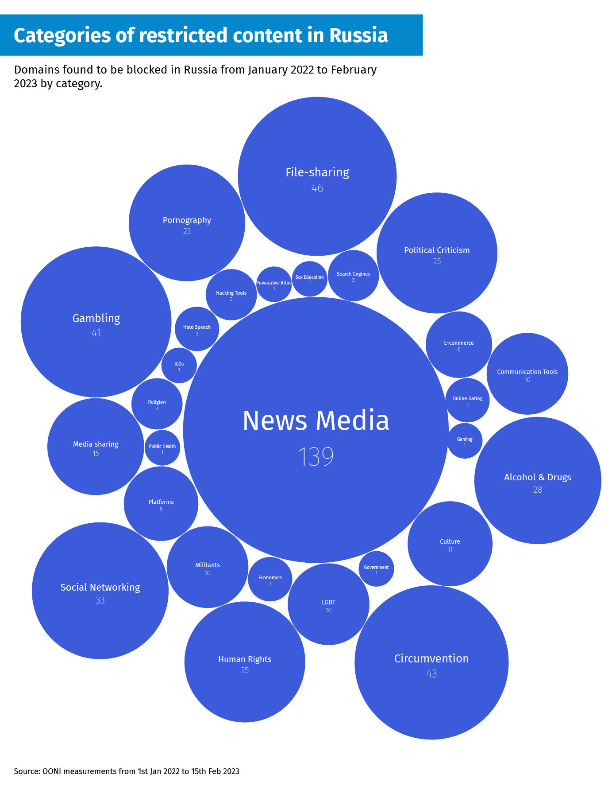

**Chart:** Categories and number of domains found blocked in Russia between 1st January 2022 to 15th February 2023 (source: [OONI data](https://explorer.ooni.org/chart/mat?probe_cc=RU&since=2022-01-01&until=2023-02-15&time_grain=day&axis_x=measurement_start_day&test_name=web_connectivity)).

Notably, **news media websites were found blocked the most** (139 blocked news media domains), including the [news media websites that we reported as newly blocked](https://ooni.org/post/2022-russia-blocks-amid-ru-ua-conflict/#blocking-of-news-media-websites) right after the conflict in Ukraine started last year. The latest OONI data from Russia suggests that these [media blocks remain ongoing](https://explorer.ooni.org/chart/mat?probe_cc=RU&since=2023-01-19&until=2023-02-19&time_grain=day&axis_x=measurement_start_day&axis_y=domain&test_name=web_connectivity&category_code=NEWS). Following news media, file-sharing and circumvention tool websites (46 and 43 domains blocked in each category respectively) were found blocked the most, while many gambling, social networking, human rights, LGBTIQ, and political websites were found blocked as well. These blocks also appear to be [ongoing](https://explorer.ooni.org/chart/mat?probe_cc=RU&since=2023-01-19&until=2023-02-19&time_grain=day&axis_x=measurement_start_day&axis_y=domain&test_name=web_connectivity).

However, it’s important to highlight that these findings are influenced (and limited) by both the types of URLs included in [test lists](https://github.com/citizenlab/test-lists/tree/master/lists), as well as by how much testing coverage each URL received throughout the analysis period. The findings are based on URLs included in the community-curated [Citizen Lab test lists](https://github.com/citizenlab/test-lists/tree/master/lists), and we acknowledge that there is bias in terms of which URLs are added to the lists. Moreover, these URLs did not receive equal measurement coverage throughout the testing period, nor were they tested equally across ASNs in Russia. This means that while we found news media websites to be blocked the most, that does not necessarily mean that news media websites are actually blocked more than other website categories in Russia.

The bias in the findings is further evident when viewing which website categories received the most testing coverage over the past year. From the following chart, we can see that news media websites received by far the most testing coverage between January 2022 to January 2023.

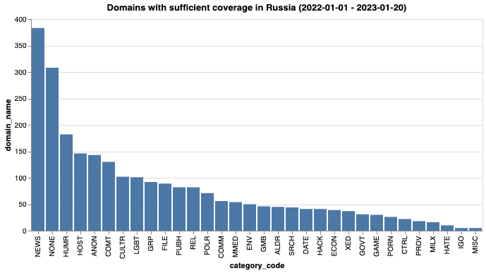

**Chart:** OONI Probe testing coverage of website categories (based on URLs included in the [Citizen Lab test lists](https://github.com/citizenlab/test-lists/tree/master/lists)) in Russia between January 2022 to January 2023 (limited to the number of domains per category that were tested at least 1000 times in the analysis period).

Moreover, it’s worth highlighting that our findings on the total number of blocked domains in Russia over the past year is limited to cases that we were able to automatically confirm based on [fingerprints](https://github.com/ooni/blocking-fingerprints) that show government-mandated censorship. As a result, we exclude from this count the many other cases of blocking which were implemented through the use of different techniques. Each of those cases requires dedicated analysis to characterize blocking (while confirming such blocking cases accurately is a [well-documented challenge](https://censoredplanet.org/assets/censorship-data-analysis.pdf) in light of the many reasons that can result in false positives), which is currently challenging to scale for thousands of URLs.

We share a CSV that lists all 494 domains that we confirmed blocked in Russia based on OONI data **[here](/post/2023-russia-a-year-after-the-conflict/2023-02-21-russia-blocked-confirmed-domains.csv)**. We also share a CSV that lists all the corresponding blocked URLs **[here](/post/2023-russia-a-year-after-the-conflict/2023-02-21-russia-blocked-confirmed-urls.csv)**. Both CSVs include links to relevant OONI measurements for each domain/URL, where the raw data (showing the blocks) is available.  

The fact that we found *many* news media, political, and human rights websites blocked in Russia over the past year (amid the conflict in Ukraine) raises concerns. Moreover, the fact that we found 28 different categories of websites blocked suggests that the levels of internet censorship in Russia are pervasive (and not limited to just a few illegal content categories, as found in [many other countries](https://explorer.ooni.org/chart/mat?since=2023-01-22&until=2023-02-22&time_grain=day&axis_x=measurement_start_day&axis_y=category_code&test_name=web_connectivity)).

In the following sections, we share a few examples of notable blocking changes that we observed in Russia through OONI data over the last year.  

### Notable changes in blocking over time

#### Blocking of Human Rights Watch

On 17th April 2022, the website of Human Rights Watch (HRW) was [added](https://reestr.rublacklist.net/en/record/4270594/) to Russia’s blocking registry. At the time, the authorities specified the blocking of `https://www.hrw.org/ru/news/2022/03/18/381363`, which is an article published by HRW in early March 2022 on the shelling of humanitarian corridors in Ukraine.

Even though the block was implemented for the HTTPS version of HRW’s website (thereby blocking all pages of the website), Russian authorities issued [two more blocking orders](https://reestr.rublacklist.net/en/?q=www.hrw.org) in June and September 2022 for an [article](https://www.hrw.org/ru/news/2019/11/06/335226) published in November 2019 which accuses Russia of having violated its human rights obligations in Crimea.

[OONI data](https://explorer.ooni.org/chart/mat?test_name=web_connectivity&axis_x=measurement_start_day&since=2022-01-01&until=2023-02-21&time_grain=day&probe_cc=RU&domain=www.hrw.org) collected from Russia corroborates the blocking of HRW’s website (`www.hrw.org`), showing that the block started on 17th April 2022.


**Chart:** OONI Probe testing of `www.hrw.org` on 411 ASNs in Russia between 1st January 2022 to 20th February 2023 (source: [OONI data](https://explorer.ooni.org/chart/mat?test_name=web_connectivity&axis_x=measurement_start_day&since=2022-01-01&until=2023-02-21&time_grain=day&probe_cc=RU&domain=www.hrw.org)).

The above chart aggregates OONI measurement coverage from the testing of `www.hrw.org` on [411 ASNs](https://explorer.ooni.org/chart/mat?probe_cc=RU&since=2022-01-01&until=2023-02-21&time_grain=day&axis_x=measurement_start_day&axis_y=probe_asn&test_name=web_connectivity&domain=www.hrw.org) in Russia between 1st January 2022 to 20th February 2023. As is evident, `www.hrw.org` was previously mostly accessible on tested networks in Russia, and only started presenting anomalies on 17th April 2022 – which matches the [blocking date](https://reestr.rublacklist.net/en/record/4270594/) listed in Roskomnadzor’s registry.

OONI data shows that the block is implemented on [most tested networks](https://explorer.ooni.org/chart/mat?probe_cc=RU&since=2022-01-01&until=2023-02-21&time_grain=day&axis_x=measurement_start_day&axis_y=probe_asn&test_name=web_connectivity&domain=www.hrw.org) in Russia. The following chart shares the ASNs which presented the largest volume of anomalies (more than 1,200 anomalies) throughout the testing period.


**Chart:** ASNs which presented the largest volume of anomalies (more than 1,200 anomalies) in the testing of `www.hrw.org` in Russia between 1st January 2022 to 20th February 2023 (source: [OONI data](https://explorer.ooni.org/chart/mat?test_name=web_connectivity&axis_x=measurement_start_day&since=2022-01-01&until=2023-02-21&time_grain=day&probe_cc=RU&axis_y=probe_asn&domain=www.hrw.org)).

Based on [fingerprints](https://github.com/ooni/blocking-fingerprints/), we are able to automatically confirm the blocking of `www.hrw.org` on the following ASNs in Russia.

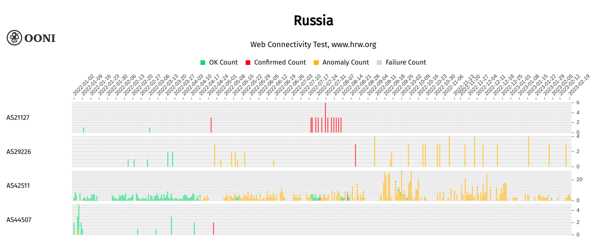

**Chart:** ASNs where the blocking of `www.hrw.org` in Russia is automatically confirmed based on fingerprints between 1st January 2022 to 20th February 2023 (source: [OONI data](https://explorer.ooni.org/chart/mat?test_name=web_connectivity&axis_x=measurement_start_day&since=2022-01-01&until=2023-02-21&time_grain=day&probe_cc=RU&axis_y=probe_asn&domain=www.hrw.org)).

#### Blocking of Amnesty International

On 27th January 2023, Amnesty International’s website (`*.amnesty.org`) was [added](https://reestr.rublacklist.net/en/record/5368773/) to Russia’s blocking registry. This is corroborated by [OONI data](https://explorer.ooni.org/chart/mat?probe_cc=RU&since=2022-01-01&until=2023-02-22&time_grain=day&axis_x=measurement_start_day&test_name=web_connectivity&domain=www.amnesty.org), which shows that Russian ISPs started blocking access to `www.amnesty.org` on 27th January 2023, as illustrated below.


**Chart:** OONI Probe testing of Amnesty International’s website (`www.amnesty.org`) on 373 ASNs in Russia between 1st January 2022 to 21st February 2023 (source: [OONI data](https://explorer.ooni.org/chart/mat?probe_cc=RU&since=2022-01-01&until=2023-02-22&time_grain=day&axis_x=measurement_start_day&test_name=web_connectivity&domain=www.amnesty.org)).

The above chart aggregates OONI measurement coverage from the testing of `www.amnesty.org` on [373 ASNs](https://explorer.ooni.org/chart/mat?probe_cc=RU&since=2022-01-01&until=2023-02-22&time_grain=day&axis_x=measurement_start_day&axis_y=probe_asn&test_name=web_connectivity&domain=www.amnesty.org) in Russia between 1st January 2022 to 21st February 2023. As is evident, `www.amnesty.org` was previously accessible on tested networks in Russia, and only [started to present signs of blocking on 27th January 2023](https://explorer.ooni.org/search?since=2023-01-27&until=2023-01-28&probe_cc=RU&test_name=web_connectivity&domain=www.amnesty.org&failure=false) – which matches the [blocking date](https://reestr.rublacklist.net/en/record/5368773/) listed in Rosmonadzor’s registry.

OONI data shows that the block is implemented on [most tested networks](https://explorer.ooni.org/chart/mat?probe_cc=RU&since=2022-01-01&until=2023-02-22&time_grain=day&axis_x=measurement_start_day&axis_y=probe_asn&test_name=web_connectivity&domain=www.amnesty.org) in Russia. The following chart shares the ASNs where the largest volume of anomalies (more than 50) is observed during the testing period.

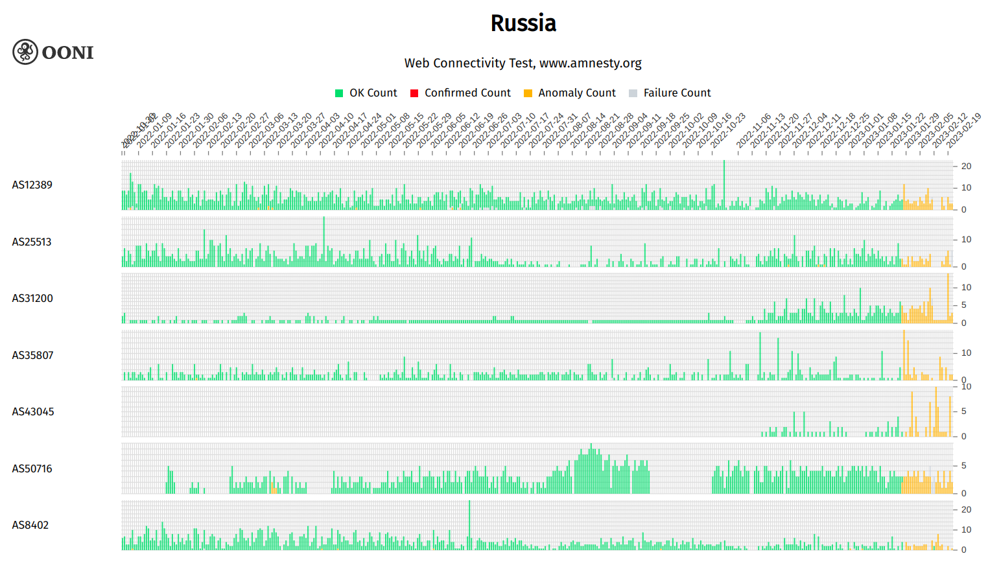

**Chart:** ASNs in Russia which presented the largest volume of anomalies (more than 50) in the testing of `www.amnesty.org` between 1st January 2022 to 21st February 2023 (source: [OONI data](https://explorer.ooni.org/chart/mat?probe_cc=RU&since=2022-01-01&until=2023-02-22&time_grain=day&axis_x=measurement_start_day&axis_y=probe_asn&test_name=web_connectivity&domain=www.amnesty.org)).

But this is not the first time that access to [Amnesty International domains is blocked](https://reestr.rublacklist.net/en/?q=amnesty) in Russia.

On 21st July 2021, `www.amnesty.org.ru` was [added](https://reestr.rublacklist.net/en/record/3463470/) (by Russia’s Federal Tax Service) to Russia’s blocking registry, while `*eurasia.amnesty.org` was [added](https://reestr.rublacklist.net/en/record/4134476/) on 10th March 2022. 

The timing and the blocking of `eurasia.amnesty.org` is corroborated by [OONI data](https://explorer.ooni.org/chart/mat?test_name=web_connectivity&axis_x=measurement_start_day&since=2022-01-01&until=2023-02-21&time_grain=day&probe_cc=RU&domain=eurasia.amnesty.org), as illustrated below.

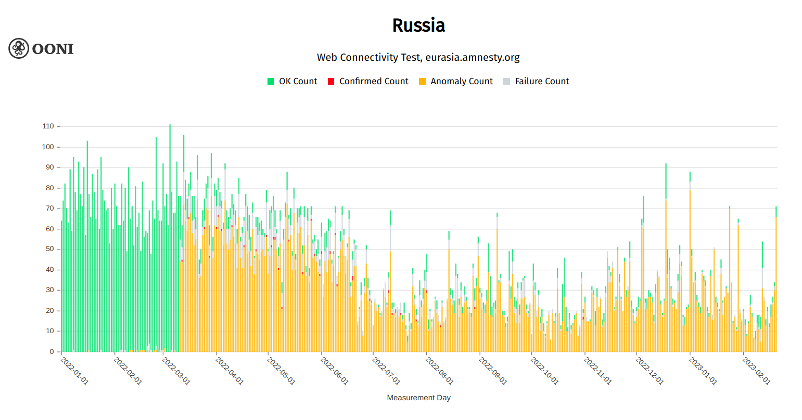

**Chart:** OONI Probe testing of `eurasia.amnesty.org` on 418 ASNs in Russia between 1st January 2022 to 20th February 2023 (source: [OONI data](https://explorer.ooni.org/chart/mat?test_name=web_connectivity&axis_x=measurement_start_day&since=2022-01-01&until=2023-02-21&time_grain=day&probe_cc=RU&domain=eurasia.amnesty.org)).

Unfortunately `www.amnesty.org.ru` wasn’t previously included in the list of URLs measured by [OONI Probe](https://ooni.org/install) users in Russia (“[Russia test list](https://github.com/citizenlab/test-lists/blob/master/lists/ru.csv)”), and was only [added](https://github.com/citizenlab/test-lists/pull/1227) on 20th February 2023. Therefore, [OONI data](https://explorer.ooni.org/chart/mat?probe_cc=RU&since=2023-01-22&until=2023-02-22&time_grain=day&axis_x=measurement_start_day&test_name=web_connectivity&domain=www.amnesty.org.ru) on the testing of `www.amnesty.org.ru` is only available from 20th February 2023 onwards, and appears to corroborate the block.

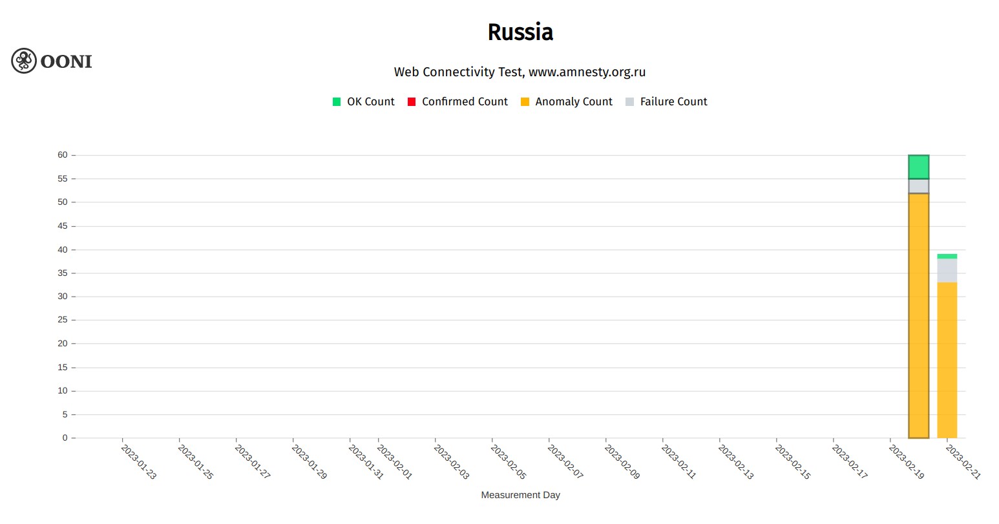

**Chart:** OONI Probe testing of `amnesty.org.ru` in Russia, starting from 20th February 2023 (source: [OONI data](https://explorer.ooni.org/chart/mat?probe_cc=RU&since=2023-01-22&until=2023-02-22&time_grain=day&axis_x=measurement_start_day&test_name=web_connectivity&domain=www.amnesty.org.ru)). 

These blocking events were followed by the [closing down of Amnesty International’s Moscow office](https://www.amnesty.org/en/latest/news/2022/04/russia-authorities-close-down-amnesty-internationals-moscow-office/) in April 2022, along with the closing down of offices of other international NGOs (including [Human Rights Watch](https://www.hrw.org/news/2022/04/08/russia-government-shuts-down-human-rights-watch-office)).

#### Blocking of Moscow Helsinki Group

Local human rights organizations in Russia have been censored as well.

On 6th February 2023, the website of [Moscow Helsinki Group](https://www.mhg.ru/) (`*.mhg.ru`) was [added](https://reestr.rublacklist.net/en/?q=mhg.ru) to Roskomnadzor’s blocking registry. Originally founded in 1976 (to monitor Soviet compliance with the Helsinki Accords and to report on Soviet human rights abuses), Moscow Helsinki Group was one of Russia’s oldest human rights organizations. In December 2022, Russia’s Ministry of Justice filed a [court order](https://www.themoscowtimes.com/2022/12/20/russias-justice-ministry-seeks-dissolution-of-moscow-helsinki-group-a79753) to dissolve the organization.

OONI data collected from Russia corroborates the blocking of `www.mhg.ru`, starting from 6th February 2023.

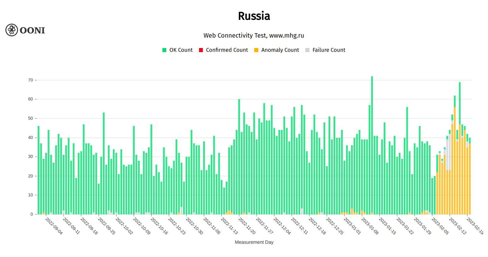

**Chart:** OONI Probe testing of `www.mhg.ru` on 169 ASNs in Russia between 1st September 2022 to 20th February 2023 (source: [OONI data](https://explorer.ooni.org/chart/mat?probe_cc=RU&since=2022-09-01&until=2023-02-21&time_grain=day&axis_x=measurement_start_day&test_name=web_connectivity&domain=www.mhg.ru)).

The above chart aggregates OONI measurement coverage from the testing of `www.mhg.ru` on [169 ASNs](https://explorer.ooni.org/chart/mat?probe_cc=RU&since=2022-09-01&until=2023-02-21&time_grain=day&axis_x=measurement_start_day&axis_y=probe_asn&test_name=web_connectivity&domain=www.mhg.ru) in Russia between 1st September 2022 to 20th February 2023. As is evident, `www.mhg.ru` was previously mostly accessible on tested networks in Russia, and [only started presenting signs of blocking on 7th February 2023](https://explorer.ooni.org/chart/mat?probe_cc=RU&since=2023-01-22&until=2023-02-22&time_grain=day&axis_x=measurement_start_day&test_name=web_connectivity&domain=www.mhg.ru) – which correlates with the [blocking date](https://reestr.rublacklist.net/en/record/5418006/) listed in Roskomnadzor’s registry.

OONI data shows that the block is implemented on many tested networks in Russia. The following chart [shares](https://explorer.ooni.org/chart/mat?probe_cc=RU&since=2023-01-22&until=2023-02-22&time_grain=day&axis_x=measurement_start_day&axis_y=probe_asn&test_name=web_connectivity&domain=www.mhg.ru) the ASNs which presented the largest volume of anomalies (more than 30) in the testing of `www.mhg.ru` in Russia between 22nd January 2023 to 21st February 2023.

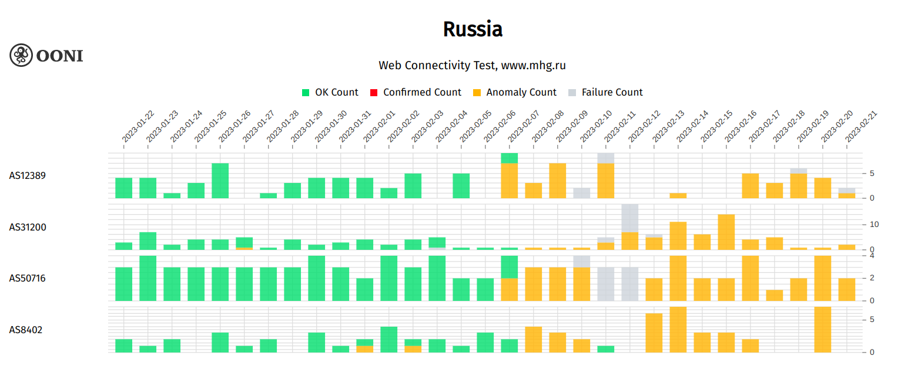

**Chart:** ASNs in Russia which presented the largest volume of anomalies (more than 30) in the testing of `www.mhg.ru` between 22nd January 2023 to 21st February 2023 (source: [OONI data](https://explorer.ooni.org/chart/mat?probe_cc=RU&since=2023-01-22&until=2023-02-22&time_grain=day&axis_x=measurement_start_day&axis_y=probe_asn&test_name=web_connectivity&domain=www.mhg.ru)).

#### Blocking of Agentura.Ru

[Agentura.Ru](https://agentura.ru/) is a secret services watchdog, founded in 2000 and run by Russian investigative journalists. On 13th March 2022, Agentura.Ru’s website (`*.agentura.ru`) was [added](https://reestr.rublacklist.net/en/record/4139167/) to Russia’s blocking registry. Another [blocking order](https://reestr.rublacklist.net/en/record/4156764/) was issued by the same authority (Genprokuratura) on 18th March 2022, adding the site’s IPv6 address. A [third blocking order](https://reestr.rublacklist.net/en/record/5368778/) was issued by another authority (Gosorgan ne ukazan) on 27th January 2023, even though access to the site was already blocked.

OONI data collected from Russia [corroborates the blocking](https://explorer.ooni.org/chart/mat?test_name=web_connectivity&axis_x=measurement_start_day&since=2022-01-01&until=2023-02-21&time_grain=day&probe_cc=RU&domain=www.agentura.ru) of `www.agentura.ru`, showing that the block started on 13th March 2022 and is ongoing.


**Chart:** OONI Probe testing of `www.agentura.ru` on 380 ASNs in Russia between 1st January 2022 to 20th February 2023 (source: [OONI data](https://explorer.ooni.org/chart/mat?test_name=web_connectivity&axis_x=measurement_start_day&since=2022-01-01&until=2023-02-21&time_grain=day&probe_cc=RU&domain=www.agentura.ru)).

The above chart aggregates OONI measurement coverage from the testing of `www.agentura.ru` on [380 ASNs](https://explorer.ooni.org/chart/mat?probe_cc=RU&since=2022-01-01&until=2023-02-21&time_grain=day&axis_x=measurement_start_day&axis_y=probe_asn&test_name=web_connectivity&domain=www.agentura.ru) in Russia between 1st January 2022 to 20th February 2023. While the site was previously accessible on tested networks (though presenting an initial spike in anomalies in early March 2022), we observe that the block was implemented on most tested networks in Russia [from 13th March 2022 onwards](https://explorer.ooni.org/chart/mat?probe_cc=RU&since=2022-03-01&until=2022-03-31&time_grain=day&axis_x=measurement_start_day&test_name=web_connectivity&domain=www.agentura.ru) – which matches the [blocking date](https://reestr.rublacklist.net/en/record/4139167/) listed in Roskomnadzor’s registry.

Based on [fingerprints](https://github.com/ooni/blocking-fingerprints/), we are able to [automatically confirm the blocking](https://explorer.ooni.org/search?since=2022-03-13&until=2023-02-21&probe_cc=RU&test_name=web_connectivity&domain=www.agentura.ru&failure=true&only=confirmed) of `www.agentura.ru` on multiple networks in Russia. The following chart shares the ASNs where most measurements (more than 200) confirmed blocking during the testing period.


**Chart:** ASNs in Russia where most measurements (more than 200) confirmed the blocking of `www.agentura.ru` between 1st January 2022 to 20th February 2023 (source: [OONI data](https://explorer.ooni.org/chart/mat?probe_cc=RU&since=2022-01-01&until=2023-02-21&time_grain=day&axis_x=measurement_start_day&axis_y=probe_asn&test_name=web_connectivity&domain=www.agentura.ru)).

We observe that the block was implemented almost uniformly across networks in Russia around 13th March 2022. In many of these cases, we are able to [automatically confirm the blocking](https://explorer.ooni.org/search?since=2022-03-13&until=2023-02-21&probe_cc=RU&test_name=web_connectivity&domain=www.agentura.ru&failure=true&only=confirmed) of `www.agentura.ru` because [DNS resolution returned IPs](https://explorer.ooni.org/measurement/20230220T232729Z_webconnectivity_RU_41754_n1_wURIcRPRIdkUdwUc?input=http%3A%2F%2Fwww.agentura.ru%2F) (such as `188.186.154.88`) hosting block pages (such as the following) or a blockpage was being served via a transparent proxy.


**Image:** Block page hosted by the IP `188.186.154.88` returned as part of DNS resolution for `www.agentura.ru` (source: [OONI data](https://explorer.ooni.org/measurement/20230220T232729Z_webconnectivity_RU_41754_n1_wURIcRPRIdkUdwUc?input=http%3A%2F%2Fwww.agentura.ru%2F)).

#### Blocking of The Bell news media website

On 17th February 2023, [The Bell](https://thebell.io/) news media website was added to [Russia’s blocklist](https://reestr.rublacklist.net/en/record/5483370/). The block was also [reported](https://thebell.io/sayt-the-bell-v-rossii-zablokirovan) by The Bell, who argue that the grounds for the blocking of their website were not specified.

Founded in 2017, [The Bell](https://thebell.io/) is the latest independent news media website to be blocked in Russia, following the [blocking of numerous other independent news media websites](https://ooni.org/post/2022-russia-blocks-amid-ru-ua-conflict/#blocking-of-news-media-websites) over the last year. Citing the danger to its journalists, The Bell [reportedly](https://www.reuters.com/business/media-telecom/russia-blocks-access-bell-news-website-2023-02-19/) stopped covering the conflict in Ukraine last year, but continued to publish stories on the conflict’s effects on Russia’s economy. Both the media outlet and its founder were labeled as “foreign agents”, subject to increased scrutiny by Russian authorities.

[OONI data](https://explorer.ooni.org/chart/mat?probe_cc=RU&since=2023-01-20&until=2023-02-21&time_grain=day&axis_x=measurement_start_day&test_name=web_connectivity&domain=thebell.io) collected from Russia corroborates these reports, showing that Russian ISPs started blocking access to The Bell (`thebell.io`) on 17th February 2023.


**Chart:** OONI Probe testing of The Bell (`thebell.io`) on 97 ASNs in Russia between 20th January 2023 to 20th February 2023 (source: [OONI data](https://explorer.ooni.org/chart/mat?probe_cc=RU&since=2023-01-20&until=2023-02-21&time_grain=day&axis_x=measurement_start_day&test_name=web_connectivity&domain=thebell.io)).

The above chart aggregates OONI measurement coverage from the testing of `thebell.io` on [97 ASNs](https://explorer.ooni.org/chart/mat?probe_cc=RU&since=2023-01-20&until=2023-02-21&time_grain=day&axis_x=measurement_start_day&axis_y=probe_asn&test_name=web_connectivity&domain=thebell.io) in Russia between 20th January 2023 to 20th February 2023. Throughout this period, the testing of `thebell.io` was successful on most tested networks, and only started presenting an increased volume in anomalies from 17th February 2023 onwards. A per-ASN measurement breakdown shows that these [anomalies emerged on several networks](https://explorer.ooni.org/search?since=2023-02-17&until=2023-02-18&probe_cc=RU&test_name=web_connectivity&domain=thebell.io&failure=true&only=anomalies), while the following chart shares the ASNs which provided the largest volume of anomalies.

 

**Chart:** ASNs which presented the largest volume of anomalies in the OONI Probe testing of `thebell.io` in Russia between 20th January 2023 to 20th February 2023 (source: [OONI data](https://explorer.ooni.org/chart/mat?probe_cc=RU&since=2023-01-20&until=2023-02-21&time_grain=day&axis_x=measurement_start_day&axis_y=probe_asn&test_name=web_connectivity&domain=thebell.io)).

The fact that `thebell.io` was previously accessible in Russia and started presenting anomalies on many tested networks from 17th February 2023 onwards (when `thebell.io` was [added](https://reestr.rublacklist.net/en/record/5483370/) to Russia’s blocking registry) provides a strong signal of blocking.

The following chart provides a breakdown of the specific failures observed on tested ASNs, suggesting that different ISPs in Russia block access to `thebell.io` using different censorship techniques.

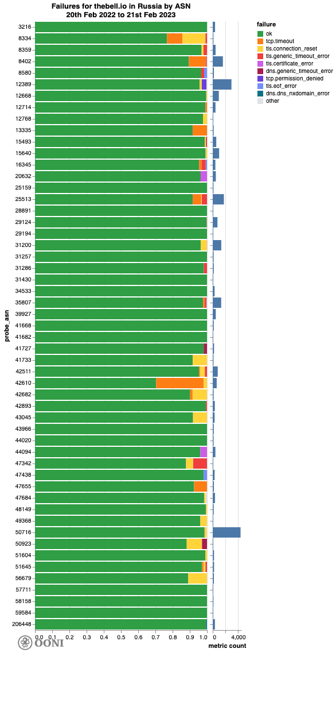

**Chart:** Measurement failures observed when `thebell.io` was tested on different ASNs in Russia between 17th February 2022 to 21st February 2023 (source: [OONI data](https://explorer.ooni.org/chart/mat?probe_cc=RU&since=2022-02-17&until=2023-02-22&time_grain=day&axis_x=measurement_start_day&axis_y=probe_asn&test_name=web_connectivity&domain=thebell.io)).

#### Blocking of Ukrainian news media website

In the weeks leading up to the start of the conflict in Ukraine, Russia had already [blocked](https://roskomsvoboda.org/post/hromadske-blocked/) access to Hromadske (`hromadske.ua`), a Ukrainian news media website.

Starting from 7th February 2022, OONI data shows the [blocking of Hromadske](https://explorer.ooni.org/chart/mat?probe_cc=RU&since=2022-01-01&until=2023-02-19&time_grain=day&axis_x=measurement_start_day&test_name=web_connectivity&domain=hromadske.ua) in Russia.

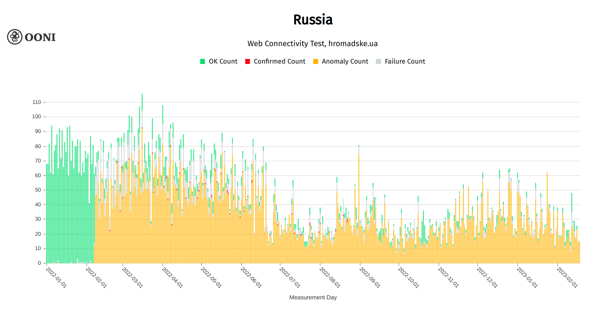

**Chart:** OONI Probe testing of Hromadske (`hromadske.ua`) on 402 ASNs in Russia between 1st January 2022 to 18th February 2023 (source: [OONI data](https://explorer.ooni.org/chart/mat?probe_cc=RU&since=2022-01-01&until=2023-02-19&time_grain=day&axis_x=measurement_start_day&test_name=web_connectivity&domain=hromadske.ua)).

The above chart aggregates OONI measurement coverage from the testing of `hromadske.ua` on [402 ASNs](https://explorer.ooni.org/chart/mat?probe_cc=RU&since=2022-01-01&until=2023-02-19&time_grain=day&axis_x=measurement_start_day&axis_y=probe_asn&test_name=web_connectivity&domain=hromadske.ua) in Russia between 1st January 2022 to 18th February 2023. We can see that while `hromadske.ua` was previously accessible on all tested networks, it started to present a large volume of anomalies on 7th February 2022, two weeks before the start of the conflict in Ukraine. These [anomalies](https://explorer.ooni.org/search?since=2022-02-07&until=2023-02-19&probe_cc=RU&test_name=web_connectivity&domain=hromadske.ua&failure=true&only=anomalies) have persisted to date (with most measurements from almost all tested networks resulting in anomalies), providing a strong signal of blocking.

By analyzing the [anomalous data](https://explorer.ooni.org/search?since=2022-02-07&until=2023-02-19&probe_cc=RU&test_name=web_connectivity&domain=hromadske.ua&failure=true&only=anomalies), we can see that ISPs in Russia blocked access to Hromadske using a variety of different censorship techniques. The following chart provides a breakdown of the specific failures observed on tested ASNs, suggesting that different ISPs in Russia block access to `hromadske.ua` using different censorship techniques.


**Chart:** Measurement failures observed when `hromadske.ua` was tested on different ASNs in Russia between 7th February 2022 to 18th February 2023 (source: [OONI data](https://explorer.ooni.org/chart/mat?probe_cc=RU&since=2022-02-07&until=2023-02-18&time_grain=day&axis_x=measurement_start_day&axis_y=probe_asn&test_name=web_connectivity&domain=hromadke.ua)).

The blocking of Hromadske was also [reported](https://roskomsvoboda.org/post/hromadske-blocked/) at the time by Roskomsvoboda. Hromadske explained that the block was implemented to [censor content related to the arrests of Crimean Tatars](https://hromadske.ua/ru/posts/v-rossii-zablokirovali-sajt-hromadske-prichina-material-ob-arestah-krymskih-tatar). But since the site is hosted on HTTPS, it was not possible to limit the block to the 2 intended webpages, and they [blocked access to the entire website](https://imi.org.ua/en/news/russia-blocked-hromadske-and-ekonomichna-pravda-i43749). The court order requesting to implement the block of the full domain (court order number “27-31-2020/Ид2145-22” by the General Prosecutor’s Office) was only [issued several weeks later](https://reestr.rublacklist.net/ru/record/4105350/) (on 24th February 2022).

#### Blocking of Instagram

On 13th March 2022, Instagram was [added](https://reestr.rublacklist.net/en/record/4138821/) to Russia’s official blocking registry. This followed the blocking of [Twitter](https://reestr.rublacklist.net/en/record/4106096/) and [Facebook](https://reestr.rublacklist.net/en/record/4106094/) on 4th March 2022 (both blocks are [corroborated by OONI data](https://ooni.org/post/2022-russia-blocks-amid-ru-ua-conflict/#twitter-and-facebook-blocked)).

OONI data shows that [Russia started blocking Instagram on 13th March 2022](https://explorer.ooni.org/chart/mat?probe_cc=RU&since=2022-01-01&until=2023-02-22&time_grain=day&axis_x=measurement_start_day&test_name=web_connectivity&domain=www.instagram.com), and that the block is ongoing (similarly to [Twitter](https://explorer.ooni.org/chart/mat?probe_cc=RU&since=2022-01-01&until=2023-02-22&time_grain=day&axis_x=measurement_start_day&test_name=web_connectivity&domain=twitter.com) and [Facebook](https://explorer.ooni.org/chart/mat?probe_cc=RU&since=2022-01-01&until=2023-02-22&time_grain=day&axis_x=measurement_start_day&test_name=web_connectivity&domain=www.facebook.com)).


**Chart:** OONI Probe testing of Instagram (`www.instagram.com`) on 797 ASNs in Russia between 1st January 2022 to 21st February 2023 (source: [OONI data](https://explorer.ooni.org/chart/mat?test_name=web_connectivity&axis_x=measurement_start_day&since=2022-01-01&until=2023-02-22&time_grain=day&probe_cc=RU&domain=www.instagram.com)).

The above chart aggregates OONI measurement coverage from the testing of `www.instagram.com` on [797 ASNs](https://explorer.ooni.org/chart/mat?probe_cc=RU&since=2022-01-01&until=2023-02-22&time_grain=day&axis_x=measurement_start_day&axis_y=probe_asn&test_name=web_connectivity&domain=www.instagram.com) in Russia between 1st January 2022 to 21st February 2023. As is evident, `www.instagram.com` was previously found accessible on tested networks, and only started presenting a large volume of anomalies on 13th March 2022 – which matches the [blocking date](https://reestr.rublacklist.net/en/record/4138821/) listed in the official registry. Most subsequent measurements have continued to present anomalies, demonstrating that Instagram remains blocked on most tested networks in Russia.

Based on fingerprints, OONI data automatically confirms the blocking of Instagram on the networks in the following chart.

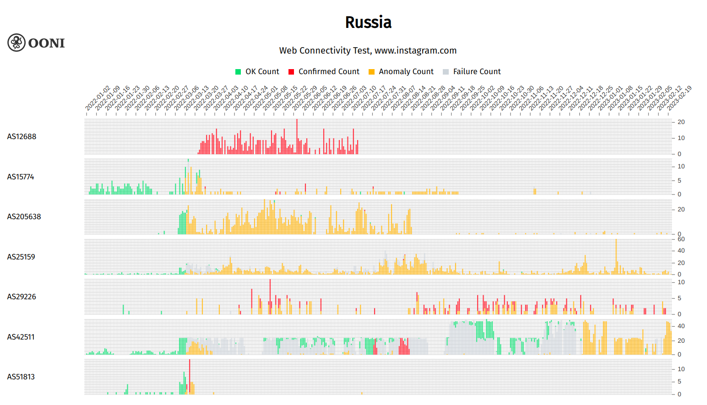

**Chart:** ASNs in Russia where the blocking of Instagram (`www.instagram.com`) is automatically confirmed based on fingerprints (source: [OONI data](https://explorer.ooni.org/chart/mat?probe_cc=RU&since=2022-01-01&until=2023-02-22&time_grain=day&axis_x=measurement_start_day&axis_y=probe_asn&test_name=web_connectivity&domain=www.instagram.com)).

#### Potential blocking of YouTube

Starting from 5th December 2022, OONI data started to show [signs of YouTube blocking on MTS (AS8359)](https://explorer.ooni.org/search?since=2022-11-01&until=2023-02-19&failure=false&domain=www.youtube.com&probe_cc=RU&probe_asn=AS8359&only=anomalies).


**Chart:** OONI Probe testing of YouTube (`www.youtube.com`) on AS8359 in Russia between 1st November 2022 to 19th February 2023 (source: [OONI data](https://explorer.ooni.org/chart/mat?probe_cc=RU&since=2022-11-01&until=2023-02-19&time_grain=day&axis_x=measurement_start_day&axis_y=probe_asn&test_name=web_connectivity&domain=www.youtube.com)).

When inspecting the [anomalous data](https://explorer.ooni.org/search?since=2022-11-01&until=2023-02-19&failure=false&domain=www.youtube.com&probe_cc=RU&probe_asn=AS8359&only=anomalies) pertaining to the testing of YouTube on AS8359, we can see that it presents [connection reset errors](https://explorer.ooni.org/measurement/20230217T085223Z_webconnectivity_RU_8359_n1_iFt3pIOF0dnCFAjq?input=https%3A%2F%2Fwww.youtube.com%2F), suggesting blocking of the service. When we do observe a connection reset, this always occurs right after the ClientHello message during the TLS handshake. The following chart provides a breakdown of the failure types observed in measurements, demonstrating the spike in connection resets from 5th December 2022 onwards.

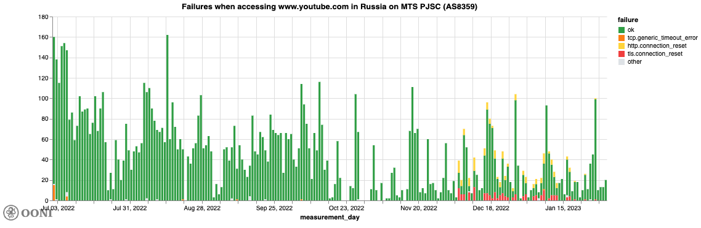

**Chart:** Failure types observed in OONI measurements pertaining to the testing of YouTube (`www.youtube.com`) on AS8359 in Russia between 1st July 2022 to 1st February 2023 (source: [OONI data](https://explorer.ooni.org/search?since=2022-11-01&until=2023-02-19&failure=false&domain=www.youtube.com&probe_cc=RU&probe_asn=AS8359)).

The metrics displayed in the above chart are aggregated with a resolution that is greater than an OONI measurement. This means that we count a metric once for each individual TLS handshake or HTTP request that was performed by the probe.

We see that within a particular measurement session, there are still many TLS handshake attempts that are successful, as illustrated with the proportional breakdown in the chart below.

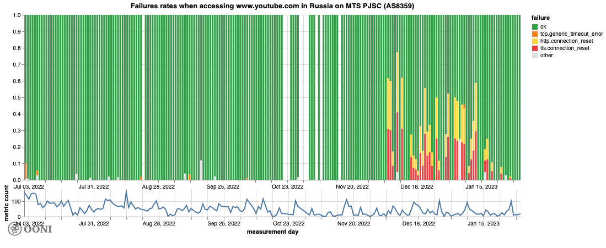

**Chart:** Percentage of failures observed in OONI measurements pertaining to the testing of YouTube (`www.youtube.com`) on AS8359 in Russia between 1st July 2022 to 1st February 2023 (source: [OONI data](https://explorer.ooni.org/search?since=2022-11-01&until=2023-02-19&failure=false&domain=www.youtube.com&probe_cc=RU&probe_asn=AS8359)).

Yet in the tested period, we do see a failure rate that is at times greater than 50%, leading us to believe that might have had a significant impact on the availability of the YouTube service for users of this network.

The reason why we don’t see this reflected on the [OONI Measurement Aggregation Toolkit (MAT)](https://explorer.ooni.org/chart/mat?test_name=web_connectivity&axis_x=measurement_start_day&since=2022-11-01&until=2023-02-19&time_grain=day&probe_cc=RU&axis_y=probe_asn&domain=www.youtube.com) is because the heuristics used there for assessing measurements look at the measurements in aggregate and are not sensitive enough to spot failures only affecting a subset of all the TLS handshakes.

#### Blocking of SoundCloud

On 30th September 2022, SoundCloud’s website was [added](https://reestr.rublacklist.net/en/record/4863486/) to Roskomnadzor’s blocking registry. The registry [specifies](https://reestr.rublacklist.net/en/?q=soundcloud.com) the URL `https://soundcloud.com/radio-svoboda`, which is the page of Radio Liberty (whose [websites have been blocked in Russia](https://ooni.org/post/2022-russia-blocks-amid-ru-ua-conflict/#radio-free-europeradio-liberty-rferl-service-websites) since the start of the conflict in Ukraine). SoundCloud was [reportedly](https://www.interfax.ru/russia/865880) blocked in Russia on the grounds of containing false information related to the conflict in Ukraine.

Starting from 1st October 2022, OONI data shows the [blocking of SoundCloud](https://explorer.ooni.org/chart/mat?test_name=web_connectivity&axis_x=measurement_start_day&since=2022-09-01&until=2023-02-19&time_grain=day&probe_cc=RU&domain=soundcloud.com) in Russia.


**Chart:** OONI Probe testing of SoundCloud (`soundcloud.com`) on 133 ASNs in Russia between 1st September 2022 to 18th February 2023 (source: [OONI data](https://explorer.ooni.org/chart/mat?test_name=web_connectivity&axis_x=measurement_start_day&since=2022-09-01&until=2023-02-19&time_grain=day&probe_cc=RU&domain=soundcloud.com)).

The above chart aggregates OONI measurement coverage from the testing of `soundcloud.com` on [133 ASNs](https://explorer.ooni.org/chart/mat?probe_cc=RU&since=2022-09-01&until=2023-02-19&time_grain=day&axis_x=measurement_start_day&axis_y=probe_asn&test_name=web_connectivity&domain=soundcloud.com) in Russia between 1st September 2022 to 18th February 2023. We can see that while `soundcloud.com` was previously accessible on all tested networks, it started to present a large volume of anomalies on 1st October 2022. These [anomalies](https://explorer.ooni.org/search?since=2022-10-01&until=2023-02-19&probe_cc=RU&test_name=web_connectivity&domain=soundcloud.com&failure=true&only=anomalies) have persisted to date (with most measurements from almost all tested networks resulting in anomalies), providing a strong signal of blocking.

By analyzing the [anomalous data](https://explorer.ooni.org/search?since=2022-10-01&until=2023-02-19&probe_cc=RU&test_name=web_connectivity&domain=soundcloud.com&failure=true&only=anomalies), we are able to see that access to SoundCloud has been blocked by ISPs using a variety of different censorship techniques. The following chart provides a breakdown of the specific failures observed on tested ASNs, limited to ASNs that received at least 100 measurements.

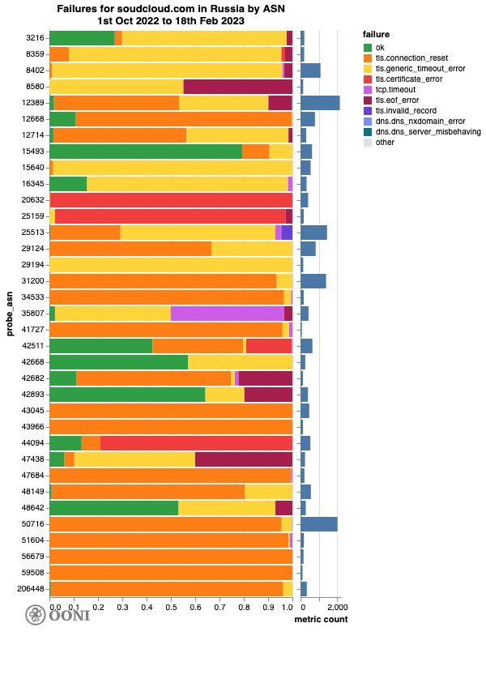

**Chart:** Measurement failures observed when `soundcloud.com` was tested on different ASNs in Russia (limited to ASNs that received at least 100 measurements) between 1st October 2022 to 18th February 2023 (source: [OONI data](https://explorer.ooni.org/chart/mat?probe_cc=RU&since=2022-10-01&until=2023-02-18&time_grain=day&axis_x=measurement_start_day&axis_y=probe_asn&test_name=web_connectivity&domain=soundcloud.com)).

#### Blocking of Patreon

On 6th August 2022, Patreon’s website (`www.patreon.com`) was [added](https://reestr.rublacklist.net/en/?q=www.patreon.com) to Roskomnadzor’s blocking registry. On 10th August 2022, Patreon published a [statement](https://blog.patreon.com/patreon-is-restricted-in-russia) on the restriction of their platform in Russia. Patreon specified that they were notified of the block by Russia’s internet regulator, who demanded that they remove a Russian creator and their content (which condemns the invasion of Ukraine). As a result of non-compliance, access to Patreon was reportedly blocked in Russia, and this is corroborated by OONI data.  

Starting from 6th August 2022, OONI data shows the [blocking of Patreon](https://explorer.ooni.org/chart/mat?test_name=web_connectivity&axis_x=measurement_start_day&since=2022-07-01&until=2023-02-19&time_grain=day&probe_cc=RU&domain=www.patreon.com) in Russia.

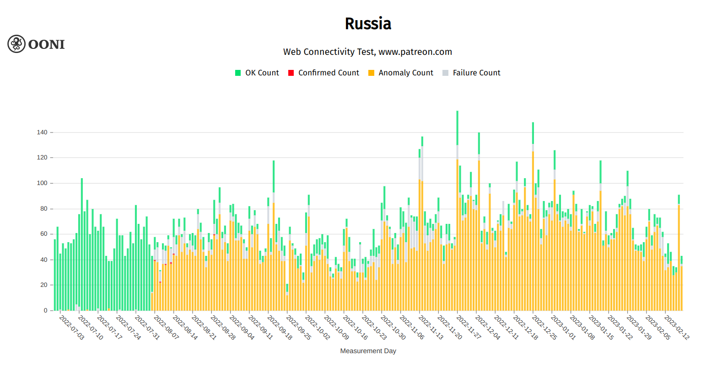

**Chart:** OONI Probe testing of Patreon (`www.patreon.com`) on 352 ASNs in Russia between 1st July 2022 to 18th February 2023 (source: [OONI data](https://explorer.ooni.org/chart/mat?test_name=web_connectivity&axis_x=measurement_start_day&since=2022-07-01&until=2023-02-19&time_grain=day&probe_cc=RU&domain=www.patreon.com)).

The above chart aggregates OONI measurement coverage from the testing of `www.patreon.com` on [352 ASNs](https://explorer.ooni.org/chart/mat?probe_cc=RU&since=2022-07-01&until=2023-02-19&time_grain=day&axis_x=measurement_start_day&axis_y=probe_asn&test_name=web_connectivity&domain=www.patreon.com) in Russia between 1st July 2022 to 18th February 2023. We can see that while `www.patreon.com` was previously accessible on all tested networks, it started to present a large volume of anomalies on 6th August 2022. These [anomalies](https://explorer.ooni.org/search?since=2022-08-01&until=2023-02-19&probe_cc=RU&test_name=web_connectivity&domain=www.patreon.com&failure=true&only=anomalies) have persisted to date (with most measurements from almost all tested networks resulting in anomalies), providing a strong signal of blocking. By analyzing the [anomalous data](https://explorer.ooni.org/search?since=2022-08-01&until=2023-02-19&probe_cc=RU&test_name=web_connectivity&domain=www.patreon.com&failure=true&only=anomalies), we can see that ISPs in Russia blocked access to Patreon using a variety of different censorship techniques. The following chart provides a breakdown of the specific failures observed on tested ASNs.

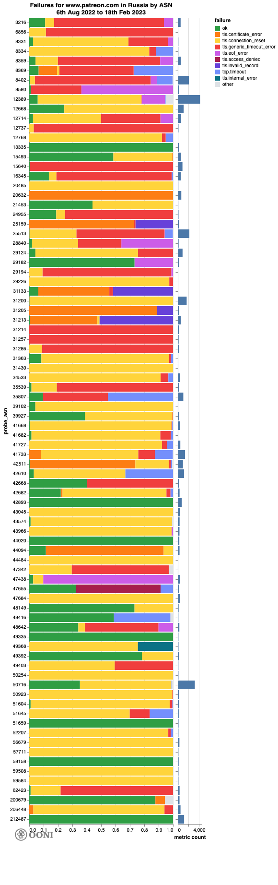

**Chart:** Measurement failures observed when `www.patreon.com` was tested on different ASNs in Russia between 6th August 2022 to 18th February 2023 (source: [OONI data](https://explorer.ooni.org/chart/mat?probe_cc=RU&since=2022-08-06&until=2023-02-18&time_grain=day&axis_x=measurement_start_day&axis_y=probe_asn&test_name=web_connectivity&domain=www.patreon.com)).

#### Temporary unblocking of the Tor Project’s website

In early December 2021, Russia started blocking access to [Tor](https://www.torproject.org/), which provides free software for online privacy, anonymity, and censorship circumvention. At the time, OONI published a [report](https://ooni.org/post/2021-russia-blocks-tor/) documenting the [blocking of the Tor anonymity network](https://ooni.org/post/2021-russia-blocks-tor/#blocking-of-the-tor-network) (which started on 1st December 2021) and the [blocking of the Tor Project website](https://ooni.org/post/2021-russia-blocks-tor/#blocking-of-the-tor-project-website) (which started on 7th December 2021) in Russia.

While both blocks ([Tor](https://explorer.ooni.org/chart/mat?probe_cc=RU&since=2023-01-19&until=2023-02-19&time_grain=day&axis_x=measurement_start_day&test_name=tor) and [Tor Project website](https://explorer.ooni.org/chart/mat?probe_cc=RU&since=2023-01-19&until=2023-02-19&time_grain=day&axis_x=measurement_start_day&test_name=web_connectivity&domain=www.torproject.org)) have been ongoing and are still in place, OONI data shows that access to the Tor Project’s website (`www.torproject.org`) was temporarily unblocked between 15th to 28th July 2022, as illustrated below. 

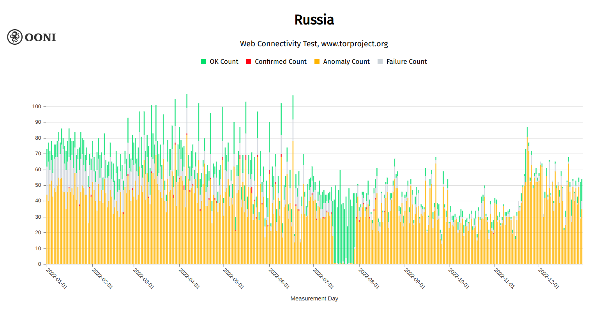

**Chart:** OONI Probe testing of `www.torproject.org` on 358 ASNs in Russia between 1st January 2022 to 31st December 2022 (source: [OONI data](https://explorer.ooni.org/chart/mat?probe_cc=RU&since=2022-01-01&until=2022-12-31&time_grain=day&axis_x=measurement_start_day&test_name=web_connectivity&domain=www.torproject.org)).

The above chart aggregates OONI measurement coverage from the testing of `www.torproject.org` on [358 ASNs](https://explorer.ooni.org/chart/mat?probe_cc=RU&since=2022-01-01&until=2022-12-31&time_grain=day&axis_x=measurement_start_day&axis_y=probe_asn&test_name=web_connectivity&domain=www.torproject.org) in Russia between 1st January 2022 to 31st December 2022. While the vast majority of measurements throughout the testing period are anomalous (providing a strong signal of blocking), [most measurements were successful between 15th to 28th July 2022](https://explorer.ooni.org/chart/mat?probe_cc=RU&since=2022-07-01&until=2022-07-31&time_grain=day&axis_x=measurement_start_day&test_name=web_connectivity&domain=www.torproject.org), suggesting that access to `www.torproject.org` was temporarily unblocked during these dates.

The pattern of unblocking is consistent across tested ISPs during this period (as illustrated through the chart below), thereby excluding the hypothesis that this was caused by a change in the distribution in measurement coverage.

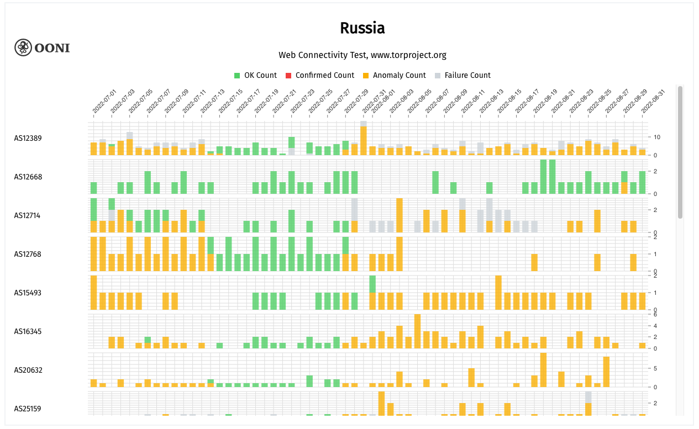

**Chart:** Per-ASN breakdown of OONI Probe testing coverage of `www.torproject.org` in Russia between 1st July 2022 to 1st September 2022 (source: [OONI data](https://explorer.ooni.org/chart/mat?test_name=web_connectivity&axis_x=measurement_start_day&since=2022-07-01&until=2022-09-01&time_grain=day&probe_cc=RU&axis_y=probe_asn&domain=www.torproject.org)).

According to [Roskomsvoboda](https://roskomsvoboda.org/post/the-tor-project-unblocked/) (who helped overturn Roskomnadzor’s blocking decision), a court decision in May 2022 ruled in favor of unblocking access to Tor Project’s website. However, the site was only unblocked several months later, as the filtering rule for \*.torproject.org was [removed from the blocking registry on 14th July 2022](https://reestr.rublacklist.net/en/record/3845366/). Following another [court decision](https://www.interfax.ru/digital/854271) to resume the block, the filter for the blocking of `www.torproject.org` was [re-added to the registry](https://reestr.rublacklist.net/en/record/4661526/) on 29th July 2022. The [timing of these unblocking and blocking events](https://explorer.ooni.org/chart/mat?probe_cc=RU&since=2022-07-01&until=2022-07-31&time_grain=day&axis_x=measurement_start_day&test_name=web_connectivity&domain=www.torproject.org) is corroborated by OONI data.

#### Other cases of unblocking

Starting from early June 2022, access to DEEPRISM’s website (`deeprism.com`) appears to have been [unblocked](https://explorer.ooni.org/chart/mat?test_name=web_connectivity&axis_x=measurement_start_day&since=2022-01-01&until=2023-01-21&time_grain=day&probe_cc=RU&domain=deeprism.com) in Russia, as suggested by OONI data.


**Chart:** OONI Probe testing of `deeprism.com` on 411 ASNs in Russia between 1st January 2022 to 21st January 2023 (source: [OONI data](https://explorer.ooni.org/chart/mat?test_name=web_connectivity&axis_x=measurement_start_day&since=2022-01-01&until=2023-01-21&time_grain=day&probe_cc=RU&domain=deeprism.com)). 

The above chart aggregates OONI measurement coverage from the testing of `deeprism.com` on [411 ASNs](https://explorer.ooni.org/chart/mat?probe_cc=RU&since=2022-01-01&until=2023-01-21&time_grain=day&axis_x=measurement_start_day&axis_y=probe_asn&test_name=web_connectivity&domain=deeprism.com) in Russia between 1st January 2022 to 21st January 2023. As is evident, the block was implemented before the start of the conflict in Ukraine, and appears to have been unblocked in early June 2022, as most subsequent measurements thereafter were successful. This is corroborated by [Russia’s blocking registry](https://reestr.rublacklist.net/en/record/3123553/), which shows that the site was originally blocked on 1st April 2021, and unblocked on 2nd June 2022.

Several other websites appear to have been unblocked over the past year, as shown through both [OONI data](https://explorer.ooni.org/chart/mat?probe_cc=RU&since=2022-01-01&until=2023-02-21&time_grain=day&axis_x=measurement_start_day&test_name=web_connectivity&domain=netmap.su) and unblocking orders listed in Russia’s [registry](https://reestr.rublacklist.net/en/). Some of these cases (such as the unblocking of [netmap.su](https://reestr.rublacklist.net/en/record/930780/) and [www.1gay.ru](https://reestr.rublacklist.net/en/record/919031/)) involve sites that no longer exist (and which were originally blocked many years ago), suggesting that their recent unblocking may have been the result of some “blocklist cleanup” (removing domains that no longer host the content that warranted their original blocking).

### Blocks that are inconsistent with Russia’s official blocklist

As part of this study, we also examined the question: How do the blocks observed through OONI data over the last year compare with Russia’s official blocking orders?

To this end, we compared the [494 domains](/post/2023-russia-a-year-after-the-conflict/2023-02-21-russia-blocked-confirmed-domains.csv) that we automatically confirmed blocked based on OONI data analysis with the domains that were added to [Roskomnadzor’s blocking registry](https://reestr.rublacklist.net/en/) over the last year.

We found **48 confirmed blocked domains** based on OONI data, which are *not* included in Russia’s official [blocking registry](https://reestr.rublacklist.net/en/). The list of these 48 domains (along with relevant OONI measurements) is available through this **[CSV](/post/2023-russia-a-year-after-the-conflict/2023-02-21-russia-blocked-not-in-list.csv)**.

Through the following chart, we provide a breakdown of the domains (categorized based on the standardized [Citizen Lab category codes](https://github.com/citizenlab/test-lists/blob/master/lists/00-LEGEND-new_category_codes.csv)) confirmed blocked through OONI data, but which are not included in Russia’s [blocking registry](https://reestr.rublacklist.net/en/).


**Chart:** Number and category of domains confirmed blocked based on OONI data (between January 2022 to February 2023), but which are not included in Russia’s official blocking registry.

The blocked domains (that are not included in the official registry) include the following 3 domains used by Twitter:

```
abs.twimg.com
pbs.twimg.com
video.twimg.com
```

While [Twitter](https://reestr.rublacklist.net/en/record/4106096/) domains are included in Russia’s blocking registry, the specific domains above are not. This suggests that some Russian ISPs are not just implementing rules as specified in the registry, but that they are doing an extra step by enumerating and blocking other domains used by these services as well.

Several other interesting cases are included in the list of [48 blocked domains](/post/2023-russia-a-year-after-the-conflict/2023-02-21-russia-blocked-not-in-list.csv) (which are not included in Russia’s official blocking registry). For example, [OONI data confirms the blocking of a Let’s Encrypt domain](https://explorer.ooni.org/search?since=2022-10-22&until=2023-02-22&failure=false&domain=ocsp.int-x3.letsencrypt.org&probe_cc=RU&only=confirmed) (`ocsp.int-x3.letsencrypt.org`) on at least one network (AS44094), even though [no Let’s Encrypt domains are included in Russia’s blocking registry](https://reestr.rublacklist.net/en/?q=letsencrypt). On this network, OONI data [shows](https://explorer.ooni.org/measurement/20230123T020230Z_webconnectivity_RU_44094_n1_oXfJElJv2eXCRtnO?input=http%3A%2F%2Focsp.int-x3.letsencrypt.org%2F) that when a request for the letsencrypt OCSP URL is made, the client is redirected to `http://m.megafonpro.ru/rkn?channel=3` which hosts a blockpage. 

Notably, OONI data shows the [blocking of a major CDN](https://explorer.ooni.org/search?since=2022-08-03&until=2023-02-01&probe_cc=RU&test_name=web_connectivity&domain=ajax.aspnetcdn.com&failure=true&only=anomalies) (`ajax.aspnetcdn.com`), which is also [not](https://reestr.rublacklist.net/en/?q=ajax.aspnetcdn.com) [included](https://reestr.rublacklist.net/en/?q=ajax.aspnetcdn.com) in Rosmonadzor’s blocking registry.

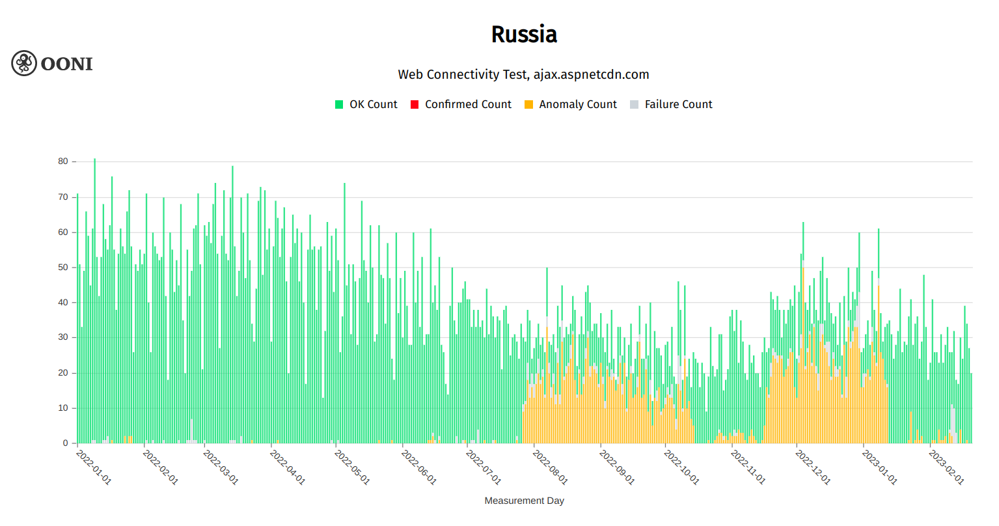

**Chart:** OONI Probe testing of `ajax.aspnetcdn.com` on 325 ASNs in Russia between 1st January 2022 to 20th February 2023 (source: [OONI data](https://explorer.ooni.org/chart/mat?probe_cc=RU&since=2022-01-01&until=2023-02-21&time_grain=day&axis_x=measurement_start_day&test_name=web_connectivity&domain=ajax.aspnetcdn.com)).

This case is not included in our list of 48 blocked domains, because the block was not implemented via a block page and hence we could not automatically detect it. We analyzed this case manually, and found that connections to `ajax.aspnetcdn.com` were [reset](https://explorer.ooni.org/measurement/20230128T060600Z_webconnectivity_RU_12389_n1_jmdWpzUh4DfqG0Z4?input=https%3A%2F%2Fajax.aspnetcdn.com%2Fajax%2F4.5.2%2F1%2FMicrosoftAjax.js) on some networks. While the block does not appear to be ongoing on tested networks, it’s worth noting that blocking a popular CDN could result in collateral damage. In practice, the impact of blocking `ajax.aspnetcdn.com` is that many websites that use it to deliver JS assets (like jQuery) would probably break.

## Conclusion

Since the start of the conflict in Ukraine a year ago (24th February 2022), Russia has continued to expand its control over information on the internet.

A year later, the [independent news media websites](https://ooni.org/post/2022-russia-blocks-amid-ru-ua-conflict/#blocking-of-news-media-websites) and [social media platforms](https://ooni.org/post/2022-russia-blocks-amid-ru-ua-conflict/#twitter-and-facebook-blocked) (Twitter and Facebook) that were blocked by early March 2022 [continue to be blocked](https://explorer.ooni.org/chart/mat?probe_cc=RU&since=2023-01-22&until=2023-02-22&time_grain=day&axis_x=measurement_start_day&axis_y=domain&test_name=web_connectivity&category_code=NEWS). Meanwhile, many additional blocks have been implemented, and our analysis automatically confirms the blocking of 494 domains which fall under 28 different categories, suggesting pervasive levels of internet censorship in Russia.

New blocks include international human rights websites ([Human Rights Watch](https://explorer.ooni.org/chart/mat?test_name=web_connectivity&axis_x=measurement_start_day&since=2022-01-01&until=2023-02-21&time_grain=day&probe_cc=RU&domain=www.hrw.org) and [Amnesty International](https://explorer.ooni.org/chart/mat?test_name=web_connectivity&axis_x=measurement_start_day&since=2022-01-01&until=2023-02-22&time_grain=day&probe_cc=RU&domain=www.amnesty.org)), Russian human rights websites ([Moscow Helsinki Group](https://explorer.ooni.org/chart/mat?test_name=web_connectivity&axis_x=measurement_start_day&since=2022-09-01&until=2023-02-21&time_grain=day&probe_cc=RU&domain=www.mhg.ru)), investigative journalism ([Agentura.Ru](https://explorer.ooni.org/chart/mat?test_name=web_connectivity&axis_x=measurement_start_day&since=2022-01-01&until=2023-02-21&time_grain=day&probe_cc=RU&domain=www.agentura.ru)) and independent news media sites ([The Bell](https://explorer.ooni.org/chart/mat?test_name=web_connectivity&axis_x=measurement_start_day&since=2023-01-20&until=2023-02-21&time_grain=day&probe_cc=RU&domain=thebell.io)), as well as the blocking of [Instagram](https://explorer.ooni.org/chart/mat?test_name=web_connectivity&axis_x=measurement_start_day&since=2022-01-01&until=2023-02-22&time_grain=day&probe_cc=RU&domain=www.instagram.com), [SoundCloud](https://explorer.ooni.org/chart/mat?test_name=web_connectivity&axis_x=measurement_start_day&since=2022-09-01&until=2023-02-19&time_grain=day&probe_cc=RU&domain=soundcloud.com), and [Patreon](https://explorer.ooni.org/chart/mat?test_name=web_connectivity&axis_x=measurement_start_day&since=2022-07-01&until=2023-02-19&time_grain=day&probe_cc=RU&domain=www.patreon.com).

Many of these new blocks appear to have one thing in common: They aim to censor information related to the conflict in Ukraine.

While blocking orders are centralized (through [Roskomnadzor’s official blocking registry](https://eais.rkn.gov.ru/en/)), the implementation of internet censorship in Russia continues to be [decentralized](https://ooni.org/post/2022-russia-blocks-amid-ru-ua-conflict/). OONI data shows that blocks are not implemented on all networks, and that different ISPs implement blocks using a variety of different censorship techniques.

When comparing OONI data on the 494 confirmed blocked domains with Russia’s official blocking orders over the last year, we found that the vast majority of blocked domains were indeed included in Roskomnadzor’s registry. However, 48 of those domains were not included in the [registry](https://eais.rkn.gov.ru/en/). This suggests that some ISPs in Russia might not just implement blocks as specified in the registry, but also enumerate and block other domains used by these services as well.

## Acknowledgements

We thank [OONI Probe](https://ooni.org/install/) users in Russia who contributed measurements, supporting this study.
