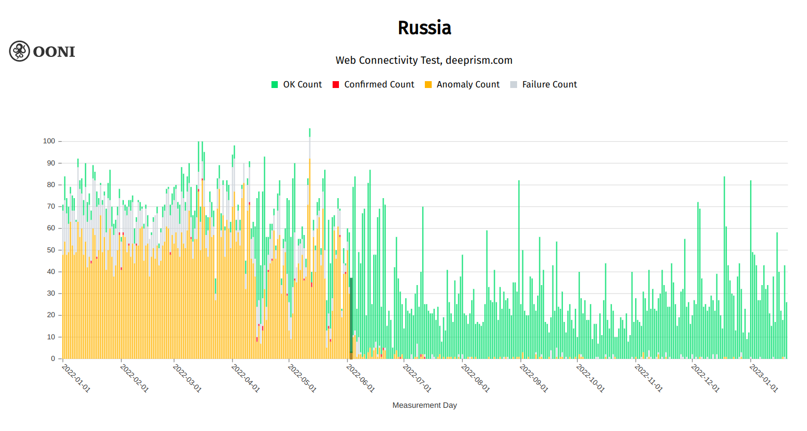

Ровно год назад в этот день Россия начала [военную операцию в Украине](https://www.bbc.com/news/world-60525350). За этим последовало усиление интернет-цензуры: интернет-провайдеры в России начали [блокировать доступ к различным местным и международным медиа](https://ooni.org/post/2022-russia-blocks-amid-ru-ua-conflict/#blocking-of-news-media-websites). В начале марта 2022 года OONI опубликовали [отчет](https://ooni.org/post/2022-russia-blocks-amid-ru-ua-conflict/), в котором задокументированы эти блокировки, а также блокировка [сайта](https://ooni.org/post/2022-russia-blocks-amid-ru-ua-conflict/#blocked-website-about-captured-and-killed-russian-soldiers) (200rf.com), на котором размещена информация о российских солдатах захваченных и убитых в Украине. OONI также заметил, что российские интернет-провайдеры начали [ограничивать доступ](https://ooni.org/post/2022-russia-blocks-amid-ru-ua-conflict/#twitter-throttled) к Twitter 26-го февраля 2022 года и перешли на его [блокировку](https://ooni.org/post/2022-russia-blocks-amid-ru-ua-conflict/#twitter-and-facebook-blocked) к 4-му марта 2022 года,вскоре после этого они также начали [блокировать](https://explorer.ooni.org/search?since=2022-02-04&until=2022-03-07&failure=false&domain=www.facebook.com&probe_cc=RU&only=anomalies) Facebook.

Известно, что во время военных конфликтов часто происходят попытки информационного контроля, и усиление цензуры в России предполагает попытку контролировать нарратив вокруг конфликта в Украине. Но изменилась ли интернет-цензура в России за последний год?

В этом отчете мы попытаемся ответить на этот вопрос с помощью [анализа измерений OONI](https://explorer.ooni.org/chart/mat?probe_cc=RU&since=2022-01-01&until=2023-02-19&time_grain=day&axis_x=measurement_start_day&test_name=web_connectivity), собранных в России с января 2022 года по февраль 2023 года. Мы дополнили наши выводы обзором юридического контекста и контекстуальным исследованием [Роскомсвободы](https://roskomsvoboda.org/).



## Основные выводы

Наш анализ [измерений, собранных с помощью теста OONI Web Connectivity из России](https://explorer.ooni.org/chart/mat?probe_cc=RU&since=2022-01-01&until=2023-02-19&time_grain=day&axis_x=measurement_start_day&test_name=web_connectivity) с января 2022 года по февраль 2023 года показывает блокировку 494 доменов, 48 из которых оказались не включены в [официальный реестр блокировок Роскомнадзора](https://eais.rkn.gov.ru/en/). Все заблокированные домены можно распределить по 28 категориям, что предполагает повсеместный масштаб интернет-цензуры в России.

Блокировки, появившиеся за прошедший год включают:

*   Блокировку **сайтов международных организаций** ([Human Rights Watch](https://explorer.ooni.org/chart/mat?test_name=web_connectivity&axis_x=measurement_start_day&since=2022-01-01&until=2023-02-21&time_grain=day&probe_cc=RU&domain=www.hrw.org) и [Amnesty International](https://explorer.ooni.org/chart/mat?test_name=web_connectivity&axis_x=measurement_start_day&since=2022-01-01&until=2023-02-22&time_grain=day&probe_cc=RU&domain=www.amnesty.org));

*   Блокировку **российских правозащитных организаций** ([Moscow Helsinki Group](https://explorer.ooni.org/chart/mat?test_name=web_connectivity&axis_x=measurement_start_day&since=2022-09-01&until=2023-02-21&time_grain=day&probe_cc=RU&domain=www.mhg.ru));
*   Блокировку **расследовательской журналистики** ([Agentura.Ru](https://explorer.ooni.org/chart/mat?test_name=web_connectivity&axis_x=measurement_start_day&since=2022-01-01&until=2023-02-21&time_grain=day&probe_cc=RU&domain=www.agentura.ru)) и **независимых новостных сайтов** ([The Bell](https://explorer.ooni.org/chart/mat?test_name=web_connectivity&axis_x=measurement_start_day&since=2023-01-20&until=2023-02-21&time_grain=day&probe_cc=RU&domain=thebell.io));
*   Блокировку [Instagram](https://explorer.ooni.org/chart/mat?test_name=web_connectivity&axis_x=measurement_start_day&since=2022-01-01&until=2023-02-22&time_grain=day&probe_cc=RU&domain=www.instagram.com), [SoundCloud](https://explorer.ooni.org/chart/mat?test_name=web_connectivity&axis_x=measurement_start_day&since=2022-09-01&until=2023-02-19&time_grain=day&probe_cc=RU&domain=soundcloud.com) и [Patreon](https://explorer.ooni.org/chart/mat?test_name=web_connectivity&axis_x=measurement_start_day&since=2022-07-01&until=2023-02-19&time_grain=day&probe_cc=RU&domain=www.patreon.com).

Доступ к сайту Tor Project был [временно разблокирован](https://explorer.ooni.org/chart/mat?test_name=web_connectivity&axis_x=measurement_start_day&since=2022-01-01&until=2022-12-31&time_grain=day&probe_cc=RU&domain=www.torproject.org) (с 15-го по 28-е июля 2022), также несколько сайтов, прекративших свое существование, были разблокированы (возможно, в рамках «очистки черного списка»).

## Контекст

### Правовая среда

Рекордные блокировки сайтов и СМИ в 2022 году в России стали возможными благодаря механизму контроля над интернетом, который появился задолго до вторжения в Украину. Впервые [ограничить доступ к контенту](https://novayagazeta.eu/articles/2022/04/21/zdes-byl-roskomnadzor) в интернете потребовал Савеловский суд Москвы в 2004 году. Ссылки вели на текст религиозного трактата «Книга единобожия», запрещенного в России тем же судебным решением. Основной текст учения ваххабизма, по [оценке](https://www.sova-center.ru/misuse/news/persecution/2020/04/d42281/) экспертов центра «Сова», действительно содержит «отдельные элементы языка вражды и ряд взятых из первоисточника упоминаний джихада в положительном ключе», однако это не дает права «подходить к религиозному сочинению XVIII века с современными мерками». Следующие волны блокировок, прокатившиеся в 2000-х годах, затронули в основном музыкальных исполнителей, религиозную и ультраправую литературу.

В последнее десятилетие интернет-цензура использовалась российскими властями как один из ключевых инструментов для создания «Суверенного Рунета». С 1 ноября 2012 года, когда был принят первый [закон](https://base.garant.ru/70207766/) о чёрных списках сайтов и введен [реестр](https://reestr.rublacklist.net/) запрещенных в России ресурсов, наблюдается рост числа категорий запрещенной информации, которую можно блокировать во внесудебном порядке, и числа ведомств, имеющих право выносить такое требование. У каждого ведомства также есть собственное видение того, как относиться к полученным полномочиям.

Кроме того существуют [общественные организации](https://roskomsvoboda.org/post/mizulina-vozrozhdayet-97fz/), которые регулярно докладывают о «запрещенных» материалах этим ведомствам. По этим материалам приняты сотни тысяч решений, которые вызывают вопросы: например, о просветительской деятельности, которая приравнивается к пропаганде. То, что для блокировки любой платформы в России можно найти юридические основания, стало очевидно еще несколько лет назад. Крупные ресурсы тоже оказались в зоне риска, [нанапример Twitter](https://roskomsvoboda.org/cards/card/twitter-vs-rkn/) начали блокировать еще в 2021 году – тогда его трафик [стали замедлять](https://rkn.gov.ru/news/rsoc/news73464.htm) по требованию Роскомнадзора «с целью защиты граждан». Ведомство заявило, что с 2017 года сервис не удалял контент, склоняющий несовершеннолетних к совершению самоубийств, содержащий детскую порнографию и информацию об использовании наркотических средств.

Массовая блокировка ресурсов в обход суда стала возможной благодаря «закону Лугового» (398-ФЗ). Он вступил в силу в декабре 2013 года и позволил Роскомнадзору по предписанию Генпрокуратуры немедленно блокировать сайты с призывами к массовым беспорядкам и «экстремистской» информацией без судебного решения.

В конце 2017 года Генпрокуратура получила право без суда блокировать сайты «нежелательных» организаций. Спустя две недели после внесения [правок](https://rg.ru/2017/11/25/fz327-site-dok.html) в закон «Об информации» была заблокирована «Открытая Россия» и другие проекты Ходорковского: «Открытый университет», проект «Вместо Путина», созданный для всенародного голосования за возможных кандидатов на пост президента, и собственный сайт политика.

Помимо Генпрокуратуры право вводить цензуру получили еще 16 ведомств. В их числе ФСБ, которое может обращаться напрямую к регистраторам доменов. Это значит, что они могут осуществлять блокировки не только в обход судов, но и «черного списка» Роскомнадзора. Кроме него право применения интернет-цензуры есть у нескольких ведомств, однако блокировку сайтов осуществляет Роскомнадзор, за исключением блокировок совершаемых ФСБ. Роскомнадзор добавляет доменное имя, IP-адрес сайта или адрес определенной страницы в «черный список», который российские интернет-провайдеры регулярно обновляют на своем оборудовании.

В 2022 году в России принят пакет законов о военной цензуре, устанавливающих уголовную и административную ответственность за критику вооруженных сил, а также действий властей за рубежом. На основании «военных» распоряжений Генпрокуратуры и Роскомнадзора заблокированы десятки независимых российских и зарубежных медиа, блог-платформы, агрегаторы новостей, сайты правозащитных и благотворительных организаций, социальные сети — Facebook, Instagram и Twitter.

В феврале 2022 года МВД России [определило механизм блокировки ресурсов](https://roskomsvoboda.org/post/poryadok-blokirovki-dannyx-goszashishionnyx/) содержащих персональные данные людей, которые находятся под охраной государства. Роскомнадзор стал органом ответственным за добавление таких сайтов в списки для блокировки. Роскомнадзор обязан добавить соответствующую запись в реестр в течении 24 часов начиная с момента получения решения об ограничении доступа к ресурсу.

В марте 2022 Государственная дума и Совет федерации стремительно [приняли поправки в Уголовный кодекс](http://duma.gov.ru/news/53620/). В соответствии с поправками за распространение фейков о военной операции, призывы к введению санкций и дискредитацию вооруженных сил России грозит наказание от штрафа в размере 100 000 рублей до 15 лет тюрьмы.

*   Штраф в размере 100 000 рублей грозит «за действия, направленные на дискредитацию использования ВС РФ, в том числе за публичные призывы к воспрепятствованию использованию вооруженных сил РФ».
*   15 лет тюрьмы грозит за распространение фейков об использовании вооружённых сил России, если они повлекли тяжкие последствия.

Кроме того, действуют статьи 207.1 и 207.2 УК РФ, по которым наказывают за распространение недостоверной общественно значимой информации, например, о падении курса рубля, коллапса экономики или дефолте.

Роскомнадзор указал, что для освещения военной операции в Украине следует использовать только информацию и данные из [официальных российских источников](https://rkn.gov.ru/news/rsoc/news74084.htm). Роскомнадзор [запретил называть «специальную операцию» нападением, вторжением и войной](https://rkn.gov.ru/news/rsoc/news74112.htm_). Таким образом, фейком считается любая информация, которая была получена не из официального российского источника, такого как министерство обороны. Кроме очевидного нарушения положений Конституции России о запрете цензуры, действия Роскомнадзора нарушают закон «О СМИ».

В апреле 2022 года депутаты [предложили](https://roskomsvoboda.org/post/zachistka-infopolya-v-rossii/) внести поправки в отдельные законодательные акты РФ, наделив таким образом Генпрокуратуру правом навсегда блокировать СМИ за распространение недостоверных сведений о «военной спецоперации».

В июле Владимир Путин [подписал](https://t.me/roskomsvoboda/9144) ряд законов: об «иноагентах», «о контрмерах в ответ на дискриминацию российских СМИ за рубежом», о создании банка данных экстремистских материалов, об оборотных штрафах для иностранных IT-компаний, которые стали «заложниками» и т.д.

Судя по складывающейся правоприменительной практике, в интернете дискредитирующим считается разного рода контент, противоречащий официальной позиции властей. Экспертное подразделение УФСБ по Свердловской области [разъяснило](https://www.kommersant.ru/doc/5357212), что дискредитация бывает четырёх видов:  

*   дискредитация армии в целом;
*   дискредитация ВС РФ как государственного института;
*   дискредитация военнослужащих;
*   дискредитация символики и атрибутики российской армии.

Кроме того, Госдума [приняла](https://roskomsvoboda.org/post/ugolovka-za-vsio/) поправки в УК и УПК об ответственности за «призывы к осуществлению деятельности против безопасности государства».

В 2022 году организация «Сетевые свободы» [насчитала](https://t.me/tvrain/62375) 779 случаев привлечения людей к уголовной ответственности за высказывания в сети, посты и репосты. Это годовой максимум за 15 лет наблюдений, говорится в ежегодном докладе проекта, посвященному свободе интернета в России. Спецслужбы возбудили не менее 42 уголовных дел о «дискредитации» армии, по шести из которых суды вынесли обвинительные приговоры.

Также 187 уголовных дел были возбуждены по статье о «фейках» про армию. Это больше, чем по статьям о «дискредитации», потому что административной ответственности за «фейки» нет.

Кроме того 1889 административных дел, включая распространение экстремистских материалов и символов запрещенных организаций (включая проекты Алексея Навального), и за неуважение к власти.

Установлена ответственность и для операторов сотовой связи за отказ пропускать трафик через ТСПУ — их [ждут](https://63.rkn.gov.ru/news/news15228891.htm) штрафы до 5 млн руб. Напомним, РКН [использует](https://roskomsvoboda.org/post/suvenir-runet-obrastaet-cenzuroy/) ТСПУ в качестве «интернет-глушилок», блокируя сайты по политическим мотивам, даже не занося их в реестр запрещенной информации. Этот же закон вводит штрафы и для поисковиков, не информирующих пользователей о нарушениях интернет-ресурсов, разыскиваемых пользователями через эти самые поисковики.

В августе Министерство цифрового развития [опубликовало](https://roskomsvoboda.org/post/blokirovka-kopiy-saytov/) документы, предлагающие наделить Роскомнадзор полномочиями по блокировке зеркал ранее заблокированных сайтов. Постановление вступит в силу с 1 марта 2023 года и будет действовать в течение 6 лет, однако зеркала медиа ресурсов [последовательно блокировались](https://www.zaks.ru/new/archive/view/229271) начиная с февраля 2022 года.

После вступления в силу [закона](https://publication.pravo.gov.ru/Document/View/0001202212260025?index=1&rangeSize=1) о запрете ЛГБТ-пропаганды в декабре Правительство [внесло](https://roskomsvoboda.org/post/lgbt-perechen-blokirovok/) информацию пропагандирующую «нетрадиционные» сексуальные отношения, педофилию и смену пола в перечень контента для внесения в реестр запрещенной в РФ информации в интернете по решению Роскомнадзора. Это означает, что со следующего года ожидается ещё больше блокировок, связанных с такого рода контентом. Ранее отдельные сайты и страницы с ЛГБТ-тематикой блокировались по требованию Росмолодежи.

С 1 декабря 2022 года [вступил в силу](https://roskomsvoboda.org/cards/card/inoagenty-popravki-v-dekabre/) закон «О контроле за деятельностью лиц, находящихся под иностранным влиянием». Теперь иностранное влияние можно трактовать настолько широко, что теоретически в зоне риска оказываются все, от пользователей соцсетей до благотворителей и предпринимателей.

[248 человек и юридических лиц](https://drive.google.com/file/d/1RiYPt8dkQAOYW6Yz4cO9LP9oChbVeqSd/view) пополнили реестр иностранных агентов в 2022 году. «Военная» мотивированность решений не вызывает сомнений: у каждого из 62 человек, включенных в прежний реестр физических лиц, выполняющих функции иностранного агента, в качестве источника влияния указана Украина. Последней организацией, признанной Министерством юстиции России иностранным агентом в прошедшем 2022 году, стала «Роскомсвобода».

В конце 2022 года [был принят](https://roskomsvoboda.org/post/blokirovki-i-biometria-v-odnom-flakone/) закон, расширяющий полномочия Генпрокуратуры в части внесудебных блокировок. Ведомство наделили полномочиями без решения суда ограничивать доступ к материалам, в которых содержатся «обоснование и (или) оправдание осуществления экстремистской деятельности, включая террористическую деятельность».

### Примеры цензуры

В течение года власти РФ блокировали соцсети, российские и зарубежные медиа, VPN-сервисы, а также ссылки на аниме, тексты запрещенных песен, предложения о покупке санкционных продуктов и статьи с компроматом на чиновников.

2022 год стал рекордным по числу блокировок. Судя по официальной статистике Роскомнадзора заблокировано или удалено около 610 654 страниц запрещенного контента.

В 2022 году было зафиксировано рекордное количество блокировок. В реестр запрещенных сайтов Роскомнадзора в 2022 году [было добавлено](https://reestr.rublacklist.net/ru/?status=1&gov=all&date_start=01-01-2022&date_end=22-12-2022) более 247 492 URL-адресов. Многие постановления о блокировке, касающиеся независимых СМИ и правозащитных организаций оказались направлены на цензуру статей или материалов СМИ, освещающих события в Украине в 2022 году.


**График:** Новые записи, добавленные в реестр запрещенных сайтов, который ведет Роскомнадзор в 2022 году (распределены по месяцам).

В ноябре 2022 года Роскомсвобода заметила, что в реестре стали появляться записи без указания органа, потребовавшего внести тот или иной сайт под блокировку. При этом мотивы ограничения доступа к таким сайтам остаются теми же, что есть у Генпрокуратуры — на них власти обнаружили информацию, которая может якобы дискредитировать или содержать фейки о действиях российской армии.


**График:** Распределение блокировок по ведомствам в 2022 году согласно реестру Роскомсвободы.

### Подцензурные темы, сервисы и сайты

**Сайты украинских и других зарубежных медиа**

Подобные блокировки начались еще с февраля, и первыми под удар военной цензуры попали сайты украинские новостные сайты и порталы, а также сайт Министерства здравоохранения Украины. Внимание Генпрокуратуры [привлекли](https://roskomsvoboda.org/post/hromadske-blocked/) две ссылки на материалы с сайта популярного украинского интернет-телеканала «Громадське» («Общественное»). Размещенные по ним материалы ведомство посчитало экстремистскими, однако в бан решило отправить сайт полностью. Позднее блокировки в России коснулись три крупных украинских новостных сайта: «Корреспондент.Net», «Украинская правда» и сайт журналиста Дмитрия Гордона. Вместе с ними этим же решением в реестр [были внесены](https://roskomsvoboda.org/post/gp-zablochila-ukrsayty-za-warnews/) ссылки на сайт «Настоящего времени», украинский «Интерфакс», а также портал с  информацией о потерях российской армии. Позднее в реестр запрещённых сайтов украинские порталы и медиа [вносились](https://roskomsvoboda.org/post/gp-blochit-ukr-oficsayty-i-smi/) целыми пачками, под запретом сейчас «Левый берег», «Цензор.Нет», «Новое время» (nv.ua), «Депо», «Газета.UA», «Фокус.UA», «Захід.Net», единое информационное агентство страны «УкрИнформ», UAinfo и др.

**Антикоррупционные расследования и ресурсы**

С февраля 2022-го года власти продолжили борьбу с публикациями расследований Навального и ФБК. Роскомнадзор [разослал](https://roskomsvoboda.org/post/cenzura-izza-fbk-i-navalny/) изданиям письмо с требованием удалить публикации, в которых речь шла о фильме «Он вам не Димон», материалах о дворце Владимира Путина, квартире главы «Ростеха» Сергея Чемезова на Манежной площади, даче главы «Роскосмоса» Дмитрия Рогозина и других чиновниках. Получение такого письма подтвердили «Медуза», «Дождь», «Эхо Москвы», «Свободные новости» (Саратов), «Весьма» (Магадан), The Village, «Бумага», Znak.com, TJournal и Republic.

Также в феврале под запрет попали [попали](https://t.me/roskomsvoboda/8211) страница для пожертвований ФБК, страницы с расследованиями Навального про семью Симоньян-Кеосаян, депутата Слуцкого и Владимира Соловьева. Все — одним решением Генпрокуратуры. Позднее в реестр [было внесено](https://t.me/roskomsvoboda/8540) еще 7 ссылок с перепечаткой материалов, которые касаются Владимира Путина, Дмитрия Медведева и его жены, Владимира Якунина, Владимира Соловьёва, а также информацией о том, какой они имели общественный резонанс.

**VPN сервисы**

Одной из первых громких блокировок в 2022 году [стало](https://roskomsvoboda.org/post/tunnelbear-nedostupen/) ограничение доступа к сервису TunnelBear. Ссылка на него в реестре находится ещё с 2018, однако до января 2022 года получить доступ помогала опция GhostBear (Make my encrypted data look like regular Internet data) в настройках клиента. При этом решение о блокировке TunnelBear было вынесено еще в 2017 году Дюртюлинским районным судом Республики Башкортостан. В июне жители разных регионов России [начали сообщать](https://t.me/roskomsvoboda/8898) о сбоях в работе ProtonVPN и NordVPN. Помимо них на конец 2022 года заблокированными (или предприняты попытки блокировки): Betternet, Lantern, X-VPN, Cloudflare WARP, Tachyon VPN, PrivateTunnel, VyprVPN, Opera VPN, Hola! VPN, ExpressVPN, KeepSolid VPN Unlimited, Speedify VPN, IPVanish VPN, и др.

**Сайты с утекшими персональными данными россиян**

Сайты `saverudata.info` и `itarmy.com.ua`, на которых была размещена слитая база данных из «Яндекс.Еды», а затем и других сервисов — Delivery Club, Wildberries, СДЭК, Билайна и др. Решение о блокировке [было принято](https://t.me/roskomsvoboda/8523) 10 марта, однако в [внесены](https://reestr.rublacklist.net/search/?q=2-892%2F2022) в реестр они были только 23 марта, и тогда же доступ к ним начали ограничивать.

**Подкасты**

Из «Яндекс.Музыки» был удален подкаст русской службы BBC «Что это было». Сам подкаст [был удалён](https://roskomsvoboda.org/post/v-yamu-ne-stalo-cho-eto-bylo/) по требованию Роскомнадзора, который в свою очередь опирается на решение Генпрокуратуры. Сайты самих [BBC](https://reestr.rublacklist.net/record/4090149/) и [«Русской службы Би-би-си»](https://reestr.rublacklist.net/search/?q=bbcrussian.com) ранее уже были заблокированы в России за освещение «спецоперации». Также по требованию Роскомнадзора «Яндекс.Музыка» [заблокировала](https://t.me/roskomsvoboda/9568) подкасты «Что случилось», «Текст недели» и «Сигнал» от «Медузы» и подкаст «Цитаты Свободы» от «Радио Свобода».

**Сайты игр и различных сервисов, где были обращения к читателям относительно событий в Украине**

[Был заблокирован](https://roskomsvoboda.org/post/stalker2-blocked/) сайт популярной компьютерной игры S.T.A.L.K.E.R. 2: Heart of Chernobyl. На нем Генпрокуратура обнаружила обращение создателей игры к фанатам и подписчикам, в котором говорилось об осуждении так называемой «военной спецоперации». Также с апреля 2022 года в реестре находится один из самых популярных шахматных сайтов [Chess.com](https://www.chess.com/). Внимание Генпрокуратуры [привлекли](https://roskomsvoboda.org/post/block-chess-com-resonance/) две статьи: в одной из них говорилось о политике сайта в связи проводимой российской армией «спецоперацией», во второй — об украинских шахматистах и произошедших с ними событиях.

**Сервисы защищенной электронной почты**

3 июня 2022-го года был заблокирован немецкий облачный и почтовый сервис [Eclipso](https://reestr.rublacklist.net/search/?q=27-31-2022%2F%D0%A2%D1%80%D0%B5%D0%B1671-22). Он был внесён в реестр по требованию Генпрокуратуры, что означает, что ведомство обнаружило на нём экстремизм, призывы к массовым беспорядкам или «дискредитацию российской армии».

Также был заблокирован швейцарский защищенный почтовый сервис [Swisscows.email](https://roskomsvoboda.org/post/swisscows-email-blocked/). Как и в случае другими блокировками почтовых сервисов, инициатором выступила Генпрокуратура, судя по всему, из-за [сообщений о лжеминированиях](https://www.interfax.ru/russia/850901) отправленных через этот сервис.

**Криптообменники и сайты о криптовалютах**

4-го июня 2022-го года в реестр [был внесен](https://roskomsvoboda.org/post/forklog-pod-voen-cens/) один из самых популярных в России сайтов и криптовалютах Forklog, позднее — и его дополнительный домен. Решение о блокировке было принято Генпрокуратурой из-за опубликованного обращения к читателям после начала военных действий в Украине. В августе под запрет в России также попали [криптообменники](https://roskomsvoboda.org/post/block-vyvoda-bitka-v-rubli/) и сайты, на которых рассказывалось о том, как обменять биткоины на рубли, заблокированные судом Саратова по иску районной прокуратуры.

**Ссылки, связанные с ЛГБТК+-тематикой**

[Сайт](https://t.me/roskomsvoboda/9126) «Nuntiare et Recreare», посвященный верующим представителям ЛГБТ различной религиозной и конфессиональной принадлежности, а также сайт музея истории ЛГБТ в России [были заблокированы](https://t.me/roskomsvoboda/9126) в июле 2022-го года. В реестр запрещённых они были внесены по требованию Росмолодежи. После принятия [закона](https://roskomsvoboda.org/post/skrepozakon-1-prinyat/) о запрете ЛГБТ-пропаганды и внесении этой информации в перечень запрещенной к распространению, можно ожидать, что подобных ссылок в реестре станет больше, а ограничивать доступ к ним будет в том числе и Роскомнадзор.

**Аниме и мультфильмы**

По двум решениям судов в Санкт-Петербурге и Саратове, в январе 2022-го года в реестр [попали](https://t.me/roskomsvoboda/8097) 15 ссылок на «Атаку титанов», «Ад Данте» и «Инуяшики». По решению Калининградского суда в январе были [заблокированы](https://t.me/roskomsvoboda/8127) еще 13 ссылок на аниме «Космос: территория смерти», «Ад Данте» и «Кошачий рай». В мае суды продолжили принимать решения о блокировке [ссылок](https://t.me/roskomsvoboda/8839)  на признанные ранее запрещенными аниме и мультфильмы: «Счастливые лесные друзья», «Князь тьмы с задней парты» и  «Маг-целитель. Новый старт». Ещё 170 ссылок на аниме «Саюки: Перезарядка: Зероин» в июне 2022 [было заблокировано](https://t.me/roskomsvoboda/9054) по иску «ОККО».

**Песни, тексты песен и клипы**

В начале года в реестр были внесены ссылки на фонограммы и тексты запрещенной ранее песни Моргенштерна «Розовое вино 2», в тоже время песня была удалена со всех стриминговых платформ (ВК, Яндекс.Музыка, Spotify, Apple Music) и с Youtube. Ранее музыканта [оштрафовали](https://roskomsvoboda.org/post/rozovoe-vino-2-i-konoplya-zapresheny/) на 100 тысяч рублей за эту же песню по статье о пропаганде наркотиков.

Позднее был заблокирован сайт музыкальной платформы [Bandcamp](https://t.me/roskomsvoboda/8894) за размещение на нём песни «Вооружайся!» анархистской панк-группы «Бригадир», ранее внесенной в реестр экстремистских материалов. Под запрет также попала [песня](https://t.me/roskomsvoboda/8954) «Колумбайн» рэперов «Замай» и «Слава КПСС» по требованию Росмолодежи. Кроме этого, был запрещён текст песни панк-группы «Оргазм Нострадамуса». Суд и прокуратура в Красноярске [приняли](https://t.me/roskomsvoboda/9532) текст песни за реальный призыв к расправе над молодым поколением.

### Военная цензура

На данный момент мы насчитали [больше десяти тысяч сайтов](https://roskomsvoboda.org/post/10000-military-cens/), которые власти отправили в бан на основании того, что те распространяют «дискредитирующие российские вооружённые силы» материалы или «военные фейки». Генеральная прокуратура РФ стала основным инициатором большинства блокировок связанных с дискредитацией, но есть также немало ссылок были добавлены в реестр по решению региональных судов, количество таких решений тоже продолжает расти.

Блокировки Генпрокуратуры стали столь массовыми во многом благодаря тому, что по её решениям можно ограничивать доступ к сайтам минуя судебный процесс. Например, на основании одного только решения Генпрокуратуры за номером 27-31-2020/Ид2145-22 [были заблокированы](https://reestr.rublacklist.net/ru/?q=27-31-2020%2F%D0%98%D0%B42145-22) более 6000 сайтов и ссылок. Это стало одним из самых первых и самым массовым по количеству добавленных в реестр ресурсов решение надзорного ведомства.

Решение  27-31-2020/Ид2145-22 было вынесено сразу после начала вторжения, когда закон о военной цензуре ещё не был принят. У нас есть предположение, что на основании этого решения сайты и ссылки до сих пор вносятся в реестр запрещенных. Однако мы не можем этого утверждать, так как в решениях «Неизвестного госоргана» с решениями Генпрокуратуры совпадают только дата, массовость блокировок и направленность сайтов, которые этим решением блокируются.

Например, в случае с блокировкой CloudFront можно [убедиться](https://reestr.rublacklist.net/ru/?q=cloudfront.net), что инициаторов только два: [«Неизвестный госорган»](https://reestr.rublacklist.net/ru/?status=all&gov=2639&date_start=&date_end=&q=cloudfront.net) и [Генпрокуратура](https://reestr.rublacklist.net/ru/?status=all&gov=5&date_start=&date_end=&q=cloudfront.net) (до ноября 2022 года). Остальные подробности с ноября от общественности власти предпочли скрывать.

Сложно категоризировать военную цензуру в России. Сейчас реестр включает очень разные сайты: публичных организаций, сайты государственных органов и проектов «недружественных стран», сайты медиа, онлайн кинотеатров, сайты с пиратским контентом и т.д. К сожалению, для владельцев некоторых ресурсов блокировка становится только началом других процессов. Например, многие представители многих медиа, подвергшихся цензуре, далее подверглись административному или уголовному преследованию.

### Сервисы

[Patreon, Grammarly](https://t.me/roskomsvoboda/9267) и SoundCloud были заблокированы из-за обвинений в распространении фейков. Медиа-агрегатор The True Story, запущенный создателем «Яндекс.Новостей», [был заблокирован](https://t.me/roskomsvoboda/9368) через несколько дней после запуска. «[Служба поддержки](https://t.me/roskomsvoboda/9675)» – сервис, запущенный в мае 2022 года для помощи людям, пострадавшим от действий российских властей, также попал под [блокировку](https://t.me/roskomsvoboda/9675).

Генеральная прокуратура РФ [заблокировала](https://t.me/roskomsvoboda/8456) социальную сеть Instagram, которая по количеству авторов опережает в России все подобные платформы (на конец 2021 года аудитория сервиса [составляла](https://lenta.ru/news/2021/11/19/socialnet/) почти 40 миллионов человек). Блокировка [осуществляется](https://reestr.rublacklist.net/record/4138821/) по «маске», то есть — доступ ограничивается ко всем доменам и поддоменам соцсети. IP-адрес Instagram в реестре, правда, пока только один, но не исключено, что Роскомнадзор будет в дальнейшем пополнять свой реестр и другими ресурсами сервиса.

Генеральная прокуратура потребовала от Роскомнадзора во внесудебном порядке ограничить доступ к Instagram на территории РФ, поскольку [обнаружила](https://t.me/rkn_tg/213) там «информационные материалы, содержащие призывы к совершению насильственных действий в отношении граждан Российской Федерации, в том числе военнослужащих».

В своём пресс-релизе РКН [сослался](https://t.me/rkn_tg/213) также на заявление компании Meta Platforms Inc. о [снятии](https://www.reuters.com/world/europe/exclusive-facebook-instagram-temporarily-allow-calls-violence-against-russians-2022-03-10/) запрета в принадлежащих ей соцсетях для жителей ряда стран на размещение информации, содержащей призывы к насилию против российских граждан, в том числе военнослужащих. После этого Генпрокуратура [обратилась](https://roskomsvoboda.org/post/meta-genprokuratura/) в суд с требованием признать Meta экстремистской организацией и запретить ее деятельность на территории страны, одновременно приказав Роскомнадзору заблокировать доступ к Instagram. И хотя представитель компании [уточнил](https://www.gazeta.ru/social/news/2022/03/11/17409241.shtml), что призывы к насилию в отношении гражданских лиц по-прежнему останутся под запретом, российские власти всё же решили ограничить доступ к некоторым сервисам Meta.

### Медиа цензура

За 10 лет активной фазы цензуры в Рунете были заблокированы, вынуждено закрыты или прекратили работу практически все независимые российские и некоторые зарубежные медиа.

Особенно массовым это явление стало после 24 февраля 2022 года. С 4 марта 2022 года в России по требованию Роскомнадзора заблокированы десятки медиаресурсов, и с апреля заблокированные в России СМИ [перестали](https://roskomsvoboda.org/post/poiskoviki-ne-vydayut-smi/) показывать в поисковой выдаче российские поисковики — это «Яндекс»,  Mail.ru и Rambler. В «Яндексе» [объяснили](https://ria.ru/20220418/yandeks-1784165802.html) это тем, что компания убирает из поисковой выдачи все ссылки, которые Роскомнадзор вносит в реестр запрещённых.

В ответ на запрос о том, почему ссылки исчезают из их поисковика, пресс-служба Яндекса [ответила](https://ria.ru/20220418/yandeks-1784165802.html):

«Ссылки пропадают из поисковой выдачи "Яндекса", если они были добавлены [Роскомнадзором](https://ria.ru/organization_Roskomnadzor/) в реестр запрещенных сайтов. Согласно законодательству [РФ](https://ria.ru/location_rossiyskaya-federatsiya/), поисковые системы обязаны исключать ссылки на сайты и их "зеркала", как только Роскомнадзор вносит их в реестр. Синхронизация с реестром происходит автоматически»

При этом все новые медиа-сайты, созданные после 24-го февраля 2022-го года, были заблокированы в течение месяца после запуска. В зависимости от типа и масштаба создаваемого носителя или платформы иногда на ограничение доступа к ресурсу уходило всего несколько дней, как, например, в случае [проекта True Story](https://t.me/roskomsvoboda/9368).

Среди первых организаций, подвергшихся цензуре после начала вторжения России в Украину оказались:  

*   [DOXA](https://roskomsvoboda.org/post/rkn-doxa-block/);
*   [BBC](https://reestr.rublacklist.net/ru/record/4090149/);
*   [Voice of America](https://reestr.rublacklist.net/ru/record/4109961/);
*   [DW](https://reestr.rublacklist.net/ru/record/4090078/);
*   [TJ](https://reestr.rublacklist.net/ru/record/4142484/);
*   [Бумага](https://reestr.rublacklist.net/ru/record/4138853/);
*   [Медуза](https://reestr.rublacklist.net/ru/record/4119326/);
*   [Активатика](https://reestr.rublacklist.net/ru/record/4126120/);
*   [Медиазонв](https://reestr.rublacklist.net/ru/record/4126117/);
*   [Собеседник](https://reestr.rublacklist.net/ru/record/4126122/);
*   [Радио Свобода](https://reestr.rublacklist.net/ru/record/4109959/);
*   [Эхо Кавказа](https://reestr.rublacklist.net/ru/record/4126132/);
*   [Republic](https://reestr.rublacklist.net/ru/record/4126118/);
*   [7x7. Горизонтальная Россия](https://reestr.rublacklist.net/ru/record/4126125/);
*   [Тайга.Инфо](https://reestr.rublacklist.net/ru/record/4100916/);
*   [The Village](https://reestr.rublacklist.net/ru/record/4109860/);
*   [ЛентаЧел](https://reestr.rublacklist.net/ru/record/4126116/).

Это далеко не полный список сайтов, попавших под блокировку.

В начале марта прошлого года блокировке [подверглись](https://roskomsvoboda.org/post/echo-i-tvrain-banyat/) два крупнейших российских медиа «Эхо Москвы» и «Дождь». Причем радиостанции «Эхо» пришлось столкнуться с цензурой сразу с двух сторон. От Генпрокуратуры – из-за освещения военных действий в Украине, и от Google, который, в свою очередь, ограничил доступ для жителей ЕС к YouTube-каналу радиостанции из-за ее связи с «Газпром-медиа».

В июле прошлого года «Дождь» получил разрешение на трансляцию из Риги, но после отзыва латвийской лицензии принял приглашение на вещание в Нидерландах. Радиостанция «Эхо Москвы», работавшая с 22-го августа 1990-го года, [приостановила](https://www.interfax.ru/russia/825936) свою работу, решением директора радиостанции Алексея Венедиктова.


**Иллюстрация:** Логотипы медиа, заблокированных в России.

В 2023 году «Медузу», заблокированную еще весной 2022-го года, Генпрокуратура [объявила](https://t.me/roskomsvoboda/10147) нежелательной организацией. Надзорное ведомство посчитало, что данное издание представляет «угрозу основам конституционного строя и безопасности Российской Федерации».

Также «Неизвестное ведомство» продолжает последовательно блокировать «Новую газету» и её материалы. Издание [обнаружило](https://t.me/roskomsvoboda/10203) в реестре запрещенной информации свой репортаж из Самарской области, где прошли похороны погибших мобилизованных россиян из Макеевки. Недавно Мосгорсуд утвердил решение суда предыдущей инстанции об аннулировании свидетельства о регистрации СМИ у «Новой газеты».

Под блокировку [попал](https://t.me/roskomsvoboda/10226) сайт Московской Хельсинкской группы, одной из старейших правозащитных организаций России. В Роскомнадзоре «Интерфаксу» [обосновали](https://t.me/lentachold/57638) это «неоднократным размещением запрещенного контента и материалов, дискредитирующих ВС РФ». На днях туда также попали сайт [Дмитрия Иванова](https://reestr.rublacklist.net/ru/record/5395887/) (блогер Камикадзе Ди) и чувашского активиста [Александра Удикова](https://reestr.rublacklist.net/ru/record/5407900/).

Блокировка сайтов СМИ и их зеркал одного за другим привела к резкому падению посещаемости сайтов практически всех независимых СМИ и, как следствие, сказалась на их финансировании как за счет пожертвований, так и за счет рекламных контрактов. Разные СМИ по-разному подошли к потере трафика, некоторые запустили свои собственные VPN, чтобы бесплатно делиться ими с пользователями (Бумага, DOXA), другие медиа перестали использовать веб-сайты и сосредоточились на социальных сетях (Instagram, Telegram), некоторые СМИ с большей пропускной способностью продолжили создавать и публиковать новые зеркала.

Однако ни одно из этих решений не стало постоянным, и многие СМИ продолжают бороться за доступ к своей аудитории. Из-за наложенных санкций для российских пользователей стало невозможным оплачивать нероссийские услуги с помощью российских платежных систем, поэтому читатели не могут пожертвовать деньги на международные банковские счета, а также не могут пожертвовать на российские банковские счета, если они заходят на страницу пожертвований через VPN – российские банки считают такие платежи международными переводами и не принимают средства. В то же время для некоторых СМИ, которые уже объявлены иностранными агентами, и которые могут стать «нежелательной» или «экстремистской» организацией, как произошло с «Медузой», наличие финансовых отношений с российскими организациями или физическими лицами сопряжено с риском превращения их в «сторонников» экстремистской организации и последующей уголовной ответственностью.

С другой стороны, несмотря на то, что некоторые СМИ сосредоточили свои усилия на сторонних сервисах (в основном социальных сетях), они столкнулись с рядом трудностей и с использованием Instagram и Telegram, хотя последний сервис не подвергался блокировкам. Несмотря на отсутствие блокировки, атаки ботов стали довольно частым явлением на обеих платформах, и многие аккаунты СМИ блокировались самими сервисами из-за массовых репортов «пользователей». СМИ, потерявшие свои аккаунты, были вынуждены обращаться в службу поддержки сервисов, но разблокировка аккаунтов занимает несколько недель, и, как следствие, организации вновь теряли трафик и подписчиков.

## Методы

С 2012 года OONI разрабатывает [бесплатное открытое программное обеспечение](https://github.com/ooni/) OONI Probe, предназначенное для отслеживания [различных форм интернет-цензуры](https://ooni.org/nettest/). [OONI Probe](https://ooni.org/install/) используется для тестирования местных сетей волонтерами примерно в 160 странах каждый месяц, и результаты их тестов автоматически публикуются OONI в виде [открытых данных](https://ooni.org/data/) в режиме реального времени. За последнее десятилетие было собрано и опубликовано [более миллиарда](https://explorer.ooni.org/) сетевых измерений, собранных в 25 тысячах сетей в 241 стране и территории.

Пользователи OONI Probe в России регулярно тестируют огромное число сайтов, сделав за эти годы [более 200 миллионов измерений на более чем 2600 местных сетях](https://explorer.ooni.org/country/RU). Фактически Россия является второй страной (после США) по количеству измерений OONI в мире. Каждый день новые тесты проводятся в России, и их результаты публикуются [в открытом доступе](https://explorer.ooni.org/search?since=2022-02-02&until=2022-03-05&failure=false&probe_cc=RU) в режиме реального времени. Мы провели анализ измерений, собранных в России за последний год (с января 2022 г. по февраль 2023 г.).

Главный исследовательский вопрос этого отчета, — что изменилось в российской интернет-цензуре за последний год после начала конфликта в Украине 24 февраля 2022 года.

Мы стараемся ответить на следующие вопросы:

*   Продолжают ли действовать блокировки, появившиеся в России [после 24 февраля 2022 года](https://ooni.org/post/2022-russia-blocks-amid-ru-ua-conflict/)? Есть ли разблокированные сервисы?
*   Появились ли новые блокировки с момента публикации нашего [последнего исследования](https://ooni.org/post/2022-russia-blocks-amid-ru-ua-conflict/) (опубликовано в начале марта 2022-го года)? Если да, то какие сервисы они затронули?
*   Продолжает ли цензура в России реализовываться [децентрализованным](https://ooni.org/post/2022-russia-blocks-amid-ru-ua-conflict/#key-findings) способом?
*   Насколько блокировки, замеченные в результате тестов OONI совпадают с официальными решениями о блокировках в России?

Основываясь на этих вопросах, мы ограничили наш анализ сервисами, которые были заблокированы совсем недавно, начиная с 24 февраля 2022 года, и исключили результаты многих других долгосрочных блокировок, которые присутствовали задолго до 24-го февраля (например, долгосрочная [блокировка ЛГБТК+-сайтов](https://ooni.org/post/2021-no-access-lgbtiq-website-censorship-six-countries/)).

Чтобы ответить на эти вопросы, мы проанализировали [данные, собранные в России с помощью теста Web Connectivity](https://explorer.ooni.org/chart/mat?test_name=web_connectivity&axis_x=measurement_start_day&since=2022-01-01&until=2023-02-19&time_grain=day&probe_cc=RU) в период с января 2022 года по февраль 2023 года. Это тест, предназначенный для отслеживания блокировок сайтов (список сайтов размещен в открытом доступе в [Github-репозитории Citizen Lab](https://github.com/citizenlab/test-lists/tree/master/lists)). Тест измеряет доступность сайтов, пытаясь выполнить [DNS-поиск](https://ooni.org/support/glossary/#dns-lookup), осуществить соединение TCP/IP и [HTTP-запрос GET](https://ooni.org/support/glossary/#http-request) с двух позиций: (1) локальная сеть пользователя и (2) контрольная сеть (сеть без цензуры)). Результаты тестов с обеих сетей автоматически сравниваются, и, если они совпадают, проверенный URL-адрес помечается как «доступный» (если сайт был доступен в контрольной сети). Если результаты отличаются, проверенный URL-адрес помечается как [«аномальный»](https://ooni.org/support/faq/#what-do-you-mean-by-anomalies), и такой статус может указывать на потенциальную блокировку.

В зависимости от того как различались измерения с двух сетей, аномальное измерение автоматически аннотируется как DNS, TCP/IP, HTTP diff или аномалия HTTP-ошибки. Например, если DNS-поиск выдает IP-адрес, который отличается от адреса, к которому удалось подключиться в контрольной сети, измерение аннотируется как «аномалия DNS», что может быть признаком [DNS-фальсификации](https://ooni.org/support/glossary/#dns-tampering).

Однако могут случаться [ложные аномалии](https://ooni.org/support/faq/#what-are-false-positives), поэтому мы всегда анализируем аномальные измерения в совокупности, чтобы определить, постоянно ли тестируемый URL-адрес показывает аномальные измерения в этой сети (по сравнению с успешными измерениями). Если тесты конкретного сайта содержат большое количество аномалий, мы видим сильный сигнал о потенциальной блокировке. Если типы аномалий совпадают (например, попытка подключения к сайту всегда показывает DNS-ошибку в одной и той же сети), для нас это еще более сильный сигнал потенциальной цензуры (поскольку такие постоянные блокировки предполагают использование определенного метода цензуры, такого как [DNS-перехват](https://ooni.org/support/glossary/#dns-hijacking)). Но помимо анализа аномальных измерений мы также анализируем необработанные данные, относящиеся к этим измерениям, чтобы выявить возможные ошибки, которые произошли в ходе тестирования.

Основываясь на нашей текущей эвристике, мы автоматически подтверждаем блокировку веб-сайтов, когда в результате попытки подключения к сайту, тест видит [страницу блокировки](https://ooni.org/support/glossary/#block-page), и отпечаток этой страницы уже добавлен в нашу базу данных. Мы также автоматически подтверждаем блокировку сайтов на основе DNS-ответов, содержащих IP-адреса, которые, как нам известно, связаны с осуществлением интернет-цензуры. Что касается других форм цензуры, мы вручную анализируем данные OONI, чтобы агрегировать аномальные измерения и определить, почему и как возникают эти аномалии, таким образом собирая информацию о дополнительных случаях блокировок.

В дополнение к нашему анализу [всех результатов теста OONI Web Connectivity](https://explorer.ooni.org/chart/mat?probe_cc=RU&since=2022-01-01&until=2023-02-19&time_grain=day&axis_x=measurement_start_day&test_name=web_connectivity), собранных в России в период с января 2022 года по февраль 2023 года, мы сравнили наши выводы о заблокированных ресурсах с URL-адресами, которые были добавлены в официальный [реестр Роскомнадзора](https://eais.rkn.gov.ru/) за последний год. Цель этого анализа состояла в том, чтобы определить, присутствуют ли все сайты, заблокированные по данным OONI, в реестре. Учитывая, что в официальном [реестре Роскомнадзора](https://eais.rkn.gov.ru/) можно искать домены подвергшиеся блокировке только по одному (нельзя получить полный список), «Роскомсвобода» ведет [зеркало официального реестра](https://reestr.rublacklist.net/en/), которым мы воспользовались, чтобы получить доступ к полному списку заблокированных ресурсов. В рамках этого анализа мы сравнили данные OONI о заблокированных сайтах (за последний год) с этим списком.

Мы выявили сотни URL-адресов, которые имели признаки блокировки по данным OONI и которые, по-видимому, не были включены в официальный реестр Роскомнадзора. Мы вручную проверили все отпечатки, которые соответствовали измерениям (отпечатки интернет-провайдера и национальных блокировок), а также выявили несколько [новых отпечатков](https://github.com/ooni/blocking-fingerprints/pull/4/files), которые мы добавили в нашу базу данных.

Чтобы дополнить выводы OONI и более комплексно изучить интернет-цензуру в России, мы также провели соответствующий юридический анализ и контекстуальное исследование, результаты которых представлены в предыдущих разделах этого отчета.

### Ограничения исследования

Результаты этого исследования ограничены следующими фактами:

*   **Временной диапазон, выбранный для анализа.** Результаты ограничены результататми тестов [OONI Web Connectivity](https://explorer.ooni.org/chart/mat?probe_cc=RU&since=2022-01-01&until=2023-02-19&time_grain=day&axis_x=measurement_start_day&test_name=web_connectivity), собранными в России в период с января 2022 года по февраль 2023 года. Результаты измерений, собранных в другие даты, исключены из этого исследования.
*   **Типы измерений.** Выводы ограничены тестом OONI [Web Connectivity](https://ooni.org/nettest/web-connectivity/), тестирующим сайты на предмет цензуры. Результаты [других тестов OONI Probe](https://ooni.org/nettest) исключены из этого исследования.
*   **Тестируемые сайты.** В то время как российские пользователи OONI Probe регулярно вносят большой объем измерений, тестирование ограничивается URL-адресами, включенными в 2 [списка тестов Citizen Lab](https://github.com/citizenlab/test-lists/tree/master/lists): [глобальный список](https://github.com/citizenlab/test-lists/blob/master/lists/global.csv) (включает сайты, важные для международного контекста) и [российский список](https://github.com/citizenlab/test-lists/blob/master/lists/ru.csv) (включает только сайты релевантные для России). Поскольку эти списки тестируются пользователями [OONI Probe](https://ooni.org/install) и существуют ограничения пропускной способности, они обычно ограничены примерно 1000 URL-адресами. В результате из списков исключены многие другие сайты, заблокированные в России, а выводы нашего исследования ограничиваются проверкой URL-адресов, включенных в эти списки. Учитывая, что списки составляются нашим сообществом, мы признаем предвзятость в отношении того, какие URL-адреса добавляются в списки.
*   **Количество тестирований сайтов.** Не все URL-адреса, включенные в [списки для тестирования](https://github.com/citizenlab/test-lists/tree/master/lists), тестируются в России одинаковое количество раз с течением времени. Доступность данных OONI для конкретного сайта зависит от того, в каких сетях и когда его тестировал пользователь [OONI Probe](https://ooni.org/install) в России. В результате протестированные сайты тестировались разное количество раз на протяжении всего периода анализа, что влияет на результаты.
*   **Тестируемые ASN (сети).** Хотя тесты OONI Probe регулярно проводятся на многих ASN в России, не все сети тестируются одинаково. Наличие измерений зависит от того, к каким сетям пользователи [OONI Probe](https://ooni.org/install) были подключены при выполнении тестов. В результате объем измерений варьируется в зависимости от ASN на протяжении всего периода анализа, что влияет на результаты.
*   **Следы блокировки.** Чтобы определить количество заблокированных доменов в период с января 2022 года по февраль 2023 года и сравнить эти домены с доменами в [реестре блокировок, который ведет Роскомсвобода](https://reestr.rublacklist.net/), мы ограничили наш анализ измерениями, в которых мы могли автоматически подтвердить блокировку на основе знакомых нам [следов блокировки](https://github.com/ooni/blocking-fingerprints). Мы также ограничили наш анализ паттернами, которые мы считали более надежными и свидетельствующими о государственной цензуре. В результате мы исключили многие другие случаи, когда цензура осуществлялась с использованием других механизмов, поскольку каждый из этих случаев требует специального анализа для определения и характеристики блокировки. Однако мы делимся некоторыми из этих случаев (и соответствующим анализом) в разделах «Заметные изменения в блокировках с течением времени».

## Выводы

### Заблокированные сайты

Наш анализ результатов тестов [OONI Web Connectivity](https://explorer.ooni.org/chart/mat?probe_cc=RU&since=2022-01-01&until=2023-02-19&time_grain=day&axis_x=measurement_start_day&test_name=web_connectivity), проведенных в России с января 2022 по февраль 2023 показывает **блокировку 494 доменов соответствующих 28 [категориям сайтов](https://ooni.org/get-involved/contribute-test-lists/#drawing-inspiration-from-30-categories)**, что можно характеризовать как повсеместный уровень интернет-цензуры в стране.

Поскольку пользователи [OONI Probe](https://ooni.org/install) тестируют ссылки, включенные в тестовые списки Citizen Lab, где каждая ссылка классифицируется на основе одной из [30 стандартизированных кодов категорий](https://github.com/citizenlab/test-lists/blob/master/lists/00-LEGEND-new_category_codes.csv), мы использовали такую же категоризацию для каждого из обнаруженных в нашем анализе заблокированных URL-адресов. Заблокированные сайты попадают практически во все категории (28 из 30), включая нелегальный контент (например, [азартные игры](https://explorer.ooni.org/chart/mat?probe_cc=RU&since=2023-01-19&until=2023-02-19&time_grain=day&axis_x=measurement_start_day&test_name=web_connectivity&category_code=GMB), [алкоголь и наркотики](https://explorer.ooni.org/chart/mat?probe_cc=RU&since=2023-01-19&until=2023-02-19&time_grain=day&axis_x=measurement_start_day&test_name=web_connectivity&category_code=ALDR)), [файлообменные сервисы](https://explorer.ooni.org/chart/mat?probe_cc=RU&since=2023-01-19&until=2023-02-19&time_grain=day&axis_x=measurement_start_day&test_name=web_connectivity&category_code=FILE), [ЛГБТК+-сайты](https://explorer.ooni.org/chart/mat?probe_cc=RU&since=2023-01-19&until=2023-02-19&time_grain=day&axis_x=measurement_start_day&test_name=web_connectivity&category_code=LGBT), [правозащитные сайты](https://explorer.ooni.org/chart/mat?probe_cc=RU&since=2023-01-19&until=2023-02-19&time_grain=day&axis_x=measurement_start_day&test_name=web_connectivity&category_code=HUMR), [сайты политических организаций](https://explorer.ooni.org/chart/mat?probe_cc=RU&since=2023-01-19&until=2023-02-19&time_grain=day&axis_x=measurement_start_day&test_name=web_connectivity&category_code=POLR) (например, [сайт Алексея Навального](https://explorer.ooni.org/chart/mat?probe_cc=RU&since=2023-01-19&until=2023-02-19&time_grain=day&axis_x=measurement_start_day&test_name=web_connectivity&domain=navalny.com)), а также [сайты с инструментами для обхода цензуры](https://explorer.ooni.org/chart/mat?probe_cc=RU&since=2023-01-19&until=2023-02-19&time_grain=day&axis_x=measurement_start_day&test_name=web_connectivity&category_code=ANON) и многие другие.

На следующей диаграмме показаны [28 категорий сайтов](https://explorer.ooni.org/chart/mat?probe_cc=RU&since=2022-01-01&until=2023-02-19&time_grain=day&axis_x=measurement_start_day&axis_y=category_code&test_name=web_connectivity), которые мы обнаружили заблокированными в России на основе анализа данных OONI за последний год.


**График:** Категории и количество заблокированных доменов в России с 1-го января 2022-го года по 15 февраля 2023-го года (источник: [OONI data](https://explorer.ooni.org/chart/mat?probe_cc=RU&since=2022-01-01&until=2023-02-15&time_grain=day&axis_x=measurement_start_day&test_name=web_connectivity)).

Примечательно, что среди тестируемых сайтов, **сайты медиа блокировались чаще всего** (139 заблокированных доменов новостных медиа), в том числе сайты новостных медиа, [заблокированные сразу после начала конфликта в Украине](https://ooni.org/post/2022-russia-blocks-amid-ru-ua-conflict/#blocking-of-news-media-websites) в прошлом году. Последние данные OONI из России говорят о том, что эти [блокировки медиа продолжаются](https://explorer.ooni.org/chart/mat?probe_cc=RU&since=2023-01-19&until=2023-02-19&time_grain=day&axis_x=measurement_start_day&axis_y=domain&test_name=web_connectivity&category_code=NEWS). Вслед за СМИ, чаще всего блокируются сайты для обмена файлами и сайты с инструментами обхода блокировок (46 и 43 домена заблокированы в каждой категории соответственно). Также [продолжаются](https://explorer.ooni.org/chart/mat?probe_cc=RU&since=2023-01-19&until=2023-02-19&time_grain=day&axis_x=measurement_start_day&axis_y=domain&test_name=web_connectivity) блокировки сайтов, посвященные азартным играм, социальных сетей, сайтов, посвященным правам человека, ЛГБТК+ и политических сайтов.

Важно заметить, что на эти выводы влияют типы URL-адресов, включенных в сп[иски для тестирования](https://github.com/citizenlab/test-lists/tree/master/lists), так и объем измерений для каждого из сайтов, собранный в течение последнего года. Выводы основаны на URL-адресах, включенных в курируемые сообществом [списки для тестирования Citizen Lab](https://github.com/citizenlab/test-lists/tree/master/lists), и мы признаем, что существует предвзятость в отношении того, какие URL-адреса добавляются в списки. Более того, эти URL-адреса не получили одинаковое количество измерений на протяжении всего периода тестирования, а также не были протестированы одинаковое количество раз на всех российских ASN. Это означает, что хотя мы обнаружили, что сайты медиа блокируются чаще всего, это не обязательно означает, что сайты медиа на самом деле блокируются больше, чем сайты других категорий в России.

Предвзятость результатов становится еще более очевидной если посмотреть на то, какие категории сайтов были протестированы наибольшее количество раз за последний год. Из следующей диаграммы видно, что сайты СМИ получили наибольшее количество измерений в период с января 2022 по январь 2023 года.


**График:** Количество тестов OONI Probe по категориям сайтов (на основе URL-адресов, включенных в [списки для тестирования Citizen Lab](https://github.com/citizenlab/test-lists/tree/master/lists)) в России с января 2022 г. по январь 2023 г. (показаны только домены каждой категории, которые были протестированы не менее 1000 раз за время исследования).

Стоит подчеркнуть, что наши выводы об общем количестве заблокированных доменов в России за последний год ограничены случаями, которые мы смогли автоматически подтвердить на основе [следов блокировок](https://github.com/ooni/blocking-fingerprints), которые свидетельствуют о государственной цензуре. В результате мы исключаем из этого подсчета многие другие случаи блокировки, которые были реализованы с использованием других методов. Каждый из этих случаев требует специального анализа для характеристики блокировки (хотя точное подтверждение таких случаев блокировки является хорошо [задокументированной проблемой](https://censoredplanet.org/assets/censorship-data-analysis.pdf)), который в настоящее время сложно масштабировать для тысяч URL-адресов, тестируемых в России.

Мы публикуем [CSV-файл](/post/2023-russia-a-year-after-the-conflict/2023-02-21-russia-blocked-confirmed-domains.csv), в котором перечислены все 494 домена, которые заблокированы в России на основании данных OONI. Мы также публикуем [CSV-файл](/post/2023-russia-a-year-after-the-conflict/2023-02-21-russia-blocked-confirmed-urls.csv), в котором перечислены все соответствующие этим доменам заблокированные URL-адреса. Оба файла содержат ссылки на соответствующие измерения OONI для каждого домена/URL, где доступны необработанные данные (показывающие блокировки).

Тот факт, что за последний год (на фоне вторжения России в Украину) в России были заблокированы многие новостные, политические и правозащитные веб-сайты вызывает обеспокоенность. Более того, тот факт, что мы обнаружили блокировки сайтов из 28 категорий (всего категорий 30), свидетельствует о повсеместном уровне интернет-цензуры в России, а не локальном, когда блокируются только отдельные категории нелегального контента, как во [многих других странах](https://explorer.ooni.org/chart/mat?since=2023-01-22&until=2023-02-22&time_grain=day&axis_x=measurement_start_day&axis_y=category_code&test_name=web_connectivity).

В следующих разделах мы поделимся несколькими примерами заметных изменений в блокировках, которые мы наблюдали в России по данным OONI за последний год.

### Заметные изменения в блокировках

#### Блокировка Human Rights Watch

17 апреля 2022 года сайт Human Rights Watch (HRW) был [внесен](https://reestr.rublacklist.net/en/record/4270594/) в реестр Роскомнадзора. Власти уточнили блокировку именно статьи «[https://www.hrw.org/ru/news/2022/03/18/381363](https://www.hrw.org/ru/news/2022/03/18/381363)» об обстрелах гуманитарных коридоров Украины, опубликованную HRW в начале марта 2022 года.

Несмотря на то, что была заблокирована HTTPS-версия сайта HRW (таким образом были заблокированы все страницы сайта), в июне и сентябре 2022 года российские власти издали еще [два постановления](https://reestr.rublacklist.net/en/?q=www.hrw.org) о блокировке другой [статьи](https://www.hrw.org/ru/news/2019/11/06/335226), опубликованной в ноябре 2019 года, в которой Россия обвиняется в нарушении прав человека в Крыму.

[Данные OONI](https://explorer.ooni.org/chart/mat?test_name=web_connectivity&axis_x=measurement_start_day&since=2022-01-01&until=2023-02-21&time_grain=day&probe_cc=RU&domain=www.hrw.org), собранные в России, подтверждают блокировку веб-сайта HRW (`www.hrw.org`), и показывают, что блокировка началась 17 апреля 2022 года.


**График:** тесты OONI Probe `www.hrw.org` на 411 сетях в России с 1 января по 20 февраля 2023  (источник: [OONI data](https://explorer.ooni.org/chart/mat?test_name=web_connectivity&axis_x=measurement_start_day&since=2022-01-01&until=2023-02-21&time_grain=day&probe_cc=RU&domain=www.hrw.org)).

Приведенная выше диаграмма показывает измерения OONI, собранные при тестировании www.hrw.org на [411 сетях](https://explorer.ooni.org/chart/mat?probe_cc=RU&since=2022-01-01&until=2023-02-21&time_grain=day&axis_x=measurement_start_day&axis_y=probe_asn&test_name=web_connectivity&domain=www.hrw.org) в России в период с 1 января 2022 г. по 20 февраля 2023 г. Как видно, в начале года www.hrw.org был практически всегда доступен во всех протестированных сетях и начал показывать аномалии только 17 апреля 2022 года, что совпадает с [датой блокировки](https://reestr.rublacklist.net/en/record/4270594/), указанной в реестре Роскомнадзора.

Данные OONI показывают, что блокировка реализована в [большинстве протестированных в России сетей](https://explorer.ooni.org/chart/mat?probe_cc=RU&since=2022-01-01&until=2023-02-21&time_grain=day&axis_x=measurement_start_day&axis_y=probe_asn&test_name=web_connectivity&domain=www.hrw.org). На следующей диаграмме показаны ASN, на которых был собран наибольший объем аномалий (более 1200 аномалий) за время тестирования.


**График:** ASN (сети), на которых представлено наибольшее количество аномалий (более 1200 аномалий) при тестировании `www.hrw.org` в России с 1 января 2022 по 20 февраля 2023 (источник: [OONI data](https://explorer.ooni.org/chart/mat?test_name=web_connectivity&axis_x=measurement_start_day&since=2022-01-01&until=2023-02-21&time_grain=day&probe_cc=RU&axis_y=probe_asn&domain=www.hrw.org)).

Основываясь на уже известных нам [следах блокировок](https://github.com/ooni/blocking-fingerprints/), мы смогли автоматически подтвердить блокировку `www.hrw.org` на следующих сетях в России.


**График:** ASN (сети), где блокировка `www.hrw.org` в России была автоматически подтверждена  is automatically confirmed based on fingerprints between 1st January 2022 to 20th February 2023 (source: [OONI data](https://explorer.ooni.org/chart/mat?test_name=web_connectivity&axis_x=measurement_start_day&since=2022-01-01&until=2023-02-21&time_grain=day&probe_cc=RU&axis_y=probe_asn&domain=www.hrw.org)).

#### Блокировка Amnesty International

27 января 2023 года сайт Amnesty International (`*.amnesty.org`) был [добавлен](https://reestr.rublacklist.net/en/record/5368773/) в российский реестр блокировок. Это подтверждается [данными OONI](https://explorer.ooni.org/chart/mat?probe_cc=RU&since=2022-01-01&until=2023-02-22&time_grain=day&axis_x=measurement_start_day&test_name=web_connectivity&domain=www.amnesty.org), которые показывают, что российские интернет-провайдеры начали блокировать доступ к `www.amnesty.org` 27 января 2023 года, как показано ниже.


**График:** тесты OONI Probe сайта Amnesty International’s website (`www.amnesty.org`) на 373 ASN (сетях) в России с 1 января 2022 до 21 февраля 2023 (источник: [OONI data](https://explorer.ooni.org/chart/mat?probe_cc=RU&since=2022-01-01&until=2023-02-22&time_grain=day&axis_x=measurement_start_day&test_name=web_connectivity&domain=www.amnesty.org)).

На графике выше собраны результаты тестов `www.amnesty.org` на [373 ASN](https://explorer.ooni.org/chart/mat?probe_cc=RU&since=2022-01-01&until=2023-02-22&time_grain=day&axis_x=measurement_start_day&axis_y=probe_asn&test_name=web_connectivity&domain=www.amnesty.org) (сетях) в России в период с 1 января 2022 года по 21 февраля 2023 года. Как видно, `www.amnesty.org` раньше был доступен в тестируемых сетях в России, и только 27 января 2023 года [начал проявлять признаки блокировки](https://explorer.ooni.org/search?since=2023-01-27&until=2023-01-28&probe_cc=RU&test_name=web_connectivity&domain=www.amnesty.org&failure=false), что совпадает с [датой блокировки](https://reestr.rublacklist.net/en/record/5368773/), указанной в реестре Роскомнадзора.

Данные OONI показывают, что блокировка реализована на [большинстве протестированных в России сетей](https://explorer.ooni.org/chart/mat?probe_cc=RU&since=2022-01-01&until=2023-02-22&time_grain=day&axis_x=measurement_start_day&axis_y=probe_asn&test_name=web_connectivity&domain=www.amnesty.org). На следующем графике представлены ASN, где за время тестирования наблюдался наибольший объем аномалий (более 50).


**График:** ASN (сети) в России, где представлено наибольшее число аномалий (более 50) за время тестирования `www.amnesty.org` с 1 января 2022 по 21 февраля 2023 (источник: [OONI data](https://explorer.ooni.org/chart/mat?probe_cc=RU&since=2022-01-01&until=2023-02-22&time_grain=day&axis_x=measurement_start_day&axis_y=probe_asn&test_name=web_connectivity&domain=www.amnesty.org)).

Однако это не первый раз, когда [доступ к сайту Amnesty International был заблокирован](https://reestr.rublacklist.net/en/?q=amnesty) в России.

21 июня 2021, домен `www.amnesty.org.ru` был [добавлен](https://reestr.rublacklist.net/en/record/3463470/) (по решению ФНС) в реестр Роскомнадзора, а домен `*eurasia.amnesty.org` был [добавлен](https://reestr.rublacklist.net/en/record/4134476/) 10 марта 2022.

Время и блокировка `eurasia.amnesty.org` подтверждается [данными OONI](https://explorer.ooni.org/chart/mat?test_name=web_connectivity&axis_x=measurement_start_day&since=2022-01-01&until=2023-02-21&time_grain=day&probe_cc=RU&domain=eurasia.amnesty.org), как показано ниже.


**График:** тесты OONI Probe сайта `eurasia.amnesty.org` на 418 ASN (сетях) в России с 1 января 2022 по 20 февраля 2023 (источник: [OONI data](https://explorer.ooni.org/chart/mat?test_name=web_connectivity&axis_x=measurement_start_day&since=2022-01-01&until=2023-02-21&time_grain=day&probe_cc=RU&domain=eurasia.amnesty.org)).

К сожалению, `www.amnesty.org.ru` не был ранее включен в список сайтов, тестируемых пользователями [OONI Probe](https://ooni.org/install) в России («[список сайтов для тестирования в России](https://github.com/citizenlab/test-lists/blob/master/lists/ru.csv)»), и был [добавлен](https://github.com/citizenlab/test-lists/pull/1227) только 20 февраля 2023 года. Таким образом, [данные OONI](https://explorer.ooni.org/chart/mat?probe_cc=RU&since=2023-01-22&until=2023-02-22&time_grain=day&axis_x=measurement_start_day&test_name=web_connectivity&domain=www.amnesty.org.ru) о тестировании `www.amnesty.org.ru` доступны только с 20 февраля 2023 года и, похоже, подтверждают блокировку.


**График:** тесты OONI Probe сайта  `amnesty.org.ru` в России, с 20 февраля 2023 (источник: [OONI data](https://explorer.ooni.org/chart/mat?probe_cc=RU&since=2023-01-22&until=2023-02-22&time_grain=day&axis_x=measurement_start_day&test_name=web_connectivity&domain=www.amnesty.org.ru)). 

За этими блокировками последовало [закрытие московского офиса Amnesty International](https://www.amnesty.org/en/latest/news/2022/04/russia-authorities-close-down-amnesty-internationals-moscow-office/) в апреле 2022 года, а также закрытие офисов других международных некоммерческих организаций (включая [Human Rights Watch](https://www.hrw.org/news/2022/04/08/russia-government-shuts-down-human-rights-watch-office)).

#### Блокировка сайта Московской Хельсинкской группы

Местные правозащитные организации в России также подверглись блокировкам.

6 февраля 2023 года сайт [Московской Хельсинкской группы](https://www.mhg.ru/) (`*.mhg.ru`) был [добавлен](https://reestr.rublacklist.net/en/?q=mhg.ru) в реестр Роскомнадзора. Основанная в 1976 году, чтобы контролировать соблюдение Советским Союзом Хельсинкских соглашений и сообщать о нарушениях прав человека в СССР, МХГ является одной из самых старых правозащитных организаций в России. В декабре 2022, Министерство Юстиции РФ [подало в суд заявление](https://www.themoscowtimes.com/2022/12/20/russias-justice-ministry-seeks-dissolution-of-moscow-helsinki-group-a79753) о ликвидации организации.

Данные OONI, собранные в России, подтверждают блокировку [www.mhg.ru](http://www.mhg.ru), начиная с 6 февраля 2023 года.


**График:** тесты OONI Probe сайта `www.mhg.ru` на 169 ASN (сетях) в России с 1 сентября 2022 по 20 февраля 2023 (источник: [OONI data](https://explorer.ooni.org/chart/mat?probe_cc=RU&since=2022-09-01&until=2023-02-21&time_grain=day&axis_x=measurement_start_day&test_name=web_connectivity&domain=www.mhg.ru)).

На приведенном выше графике собраны данные результаты тестов OONI сайта [www.mhg.ru](http://www.mhg.ru) на [169 ASN](https://explorer.ooni.org/chart/mat?probe_cc=RU&since=2022-09-01&until=2023-02-21&time_grain=day&axis_x=measurement_start_day&axis_y=probe_asn&test_name=web_connectivity&domain=www.mhg.ru) в России в период с 1 сентября 2022 года по 20 февраля 2023 года. Как можно заметить, `www.mhg.ru` раньше был в основном доступен на тестируемых в России сетях, и [только 7 февраля 2023 года начал проявлять признаки блокировки](https://explorer.ooni.org/chart/mat?probe_cc=RU&since=2023-01-22&until=2023-02-22&time_grain=day&axis_x=measurement_start_day&test_name=web_connectivity&domain=www.mhg.ru) – что соответствует [дате блокировки](https://reestr.rublacklist.net/en/record/5418006/), указанной в реестре Роскомнадзора.

Данные OONI показывают, что блокировка реализована на многих тестируемых в России сетях. На следующем графике [представлены](https://explorer.ooni.org/chart/mat?probe_cc=RU&since=2023-01-22&until=2023-02-22&time_grain=day&axis_x=measurement_start_day&axis_y=probe_asn&test_name=web_connectivity&domain=www.mhg.ru) ASN, на которых было собрано наибольшее количество аномалий (более 30) при тестировании `www.mhg.ru` в России в период с 22 января 2023 года по 21 февраля 2023 года.


**График:** российские ASN (сети), на которых представлено наибольшее количество аномалий (более 30) при тестировании сайта `www.mhg.ru` с 22 января 2023 по 21 февраля 2023 (источник: [OONI data](https://explorer.ooni.org/chart/mat?probe_cc=RU&since=2023-01-22&until=2023-02-22&time_grain=day&axis_x=measurement_start_day&axis_y=probe_asn&test_name=web_connectivity&domain=www.mhg.ru)).

#### Блокировка сайта Agentura.Ru

[Agentura.ru](https://agentura.ru/) – это организация по наблюдению за деятельностью спецслужб, основанная в 2000 году и управляемая российскими журналистами-расследователями. 13 марта 2022 года сайт Agentura.ru (`*.agentura.ru`) был [добавлен](https://reestr.rublacklist.net/en/record/4139167/) в российский реестр блокировок. Другое [распоряжение о блокировке](https://reestr.rublacklist.net/en/record/4156764/) добавляющее IPv6-адрес сайта было выдано тем же органом (Генпрокуратурой) 18 марта 2022 года. Третий [приказ о блокировке](https://reestr.rublacklist.net/en/record/5368778/) был издан другим органом («Госорган не указан») 27 января 2023 года, хотя доступ к сайту уже был заблокирован.

Данные OONI, собранные в России, [подтверждают блокировку](https://explorer.ooni.org/chart/mat?test_name=web_connectivity&axis_x=measurement_start_day&since=2022-01-01&until=2023-02-21&time_grain=day&probe_cc=RU&domain=www.agentura.ru) `www.agentura.ru`, показывая, что блокировка началась 13 марта 2022 года.


**График:** тесты OONI Probe сайта `www.agentura.ru` на 380 ASN (сетях) в России с 1 января 2022 по 20 февраля 2023 (источник: [OONI data](https://explorer.ooni.org/chart/mat?test_name=web_connectivity&axis_x=measurement_start_day&since=2022-01-01&until=2023-02-21&time_grain=day&probe_cc=RU&domain=www.agentura.ru)).

На приведенном выше графике собраны результаты тестов OONI сайта `www.agentura.ru` на [380 ASN](https://explorer.ooni.org/chart/mat?probe_cc=RU&since=2022-01-01&until=2023-02-21&time_grain=day&axis_x=measurement_start_day&axis_y=probe_asn&test_name=web_connectivity&domain=www.agentura.ru) в России в период с 1 января 2022 года по 20 февраля 2023 года. Хотя сайт раньше был доступен в сетях, на которых проводились тесты (хотя и демонстрировал начальный всплеск аномалий в начале марта 2022 года), мы наблюдаем, что блокировка в большинстве тестируемых сетей была осуществлена в России [с 13 марта 2022 года](https://explorer.ooni.org/chart/mat?probe_cc=RU&since=2022-03-01&until=2022-03-31&time_grain=day&axis_x=measurement_start_day&test_name=web_connectivity&domain=www.agentura.ru), что совпадает с [датой блокировки](https://reestr.rublacklist.net/en/record/4139167/), указанной в реестре Роскомнадзора.

Используя уже известные [следы блокировок](https://github.com/ooni/blocking-fingerprints/), мы смогли [автоматически подтвердить блокировку](https://explorer.ooni.org/search?since=2022-03-13&until=2023-02-21&probe_cc=RU&test_name=web_connectivity&domain=www.agentura.ru&failure=true&only=confirmed)  `www.agentura.ru` на многих сетях в России. Следующий график показывает ASN (сети), где было собрано наибольшее количество измерений (более 200), автоматически определяемых как блокировка.


**График:** ASN (сети в России, где большинство измерений (более 200) подтверждают блокировку сайта `www.agentura.ru` с 1 января по 20 февраля 2023 (источник: [OONI data](https://explorer.ooni.org/chart/mat?probe_cc=RU&since=2022-01-01&until=2023-02-21&time_grain=day&axis_x=measurement_start_day&axis_y=probe_asn&test_name=web_connectivity&domain=www.agentura.ru)).

По нашим наблюдениям, блокировка была осуществлена почти равномерно по всем сетям в России примерно 13 марта 2022 года. Во многих из этих случаев мы можем [автоматически подтвердить блокировку](https://explorer.ooni.org/search?since=2022-03-13&until=2023-02-21&probe_cc=RU&test_name=web_connectivity&domain=www.agentura.ru&failure=true&only=confirmed) `www.agentura.ru`, поскольку [DNS-запросы вернули IP-адреса](https://explorer.ooni.org/measurement/20230220T232729Z_webconnectivity_RU_41754_n1_wURIcRPRIdkUdwUc?input=http%3A%2F%2Fwww.agentura.ru%2F) (например, `188.186.154.88`), на которых размещены блокирующие страницы (например, следующие), или блокирующая страница подавалась через прокси.


**Иллюстрация:** Страница блокировки, размещенная на IP-адресе `188.186.154.88` и полученная по DNS-запросу `www.agentura.ru` (источник: [OONI data](https://explorer.ooni.org/measurement/20230220T232729Z_webconnectivity_RU_41754_n1_wURIcRPRIdkUdwUc?input=http%3A%2F%2Fwww.agentura.ru%2F)).

#### Блокировка сайта The Bell

17 февраля 2023 сайт [The Bell](https://thebell.io/), новостного российского медиа, был [добавлен](https://reestr.rublacklist.net/en/record/5483370/) в реестр Роскомнадзора. The Bell также [сообщили](https://thebell.io/sayt-the-bell-v-rossii-zablokirovan) о блокировке, указав, что основания для блокировки их сайта не уточняются.

Основанный в 2017 году, [The Bell](https://thebell.io/) стал на данный момент последним независимым новостным веб-сайтом, который был заблокирован в России, после [блокировки множества других независимых новостных сайтов за последний год](https://ooni.org/post/2022-russia-blocks-amid-ru-ua-conflict/#blocking-of-news-media-websites). Ссылаясь на опасность для своих журналистов, The Bell [не освещал](https://www.reuters.com/business/media-telecom/russia-blocks-access-bell-news-website-2023-02-19/) события в Украине в прошлом году, но продолжал публиковать материалы о влиянии конфликта на экономику России. И само СМИ, и его основатель и главный редактор были причислены к "иностранным агентам" и стали объектом повышенного внимания со стороны российских властей.

[Данные OONI](https://explorer.ooni.org/chart/mat?probe_cc=RU&since=2023-01-20&until=2023-02-21&time_grain=day&axis_x=measurement_start_day&test_name=web_connectivity&domain=thebell.io), собранные в России, подтверждают блокировку, показывая, что российские интернет-провайдеры начали блокировать доступ к The Bell (`thebell.io`) 17 февраля 2023 года.


**График:** тесты OONI Probe сайте The Bell (`thebell.io`) на 97 ASN (сетях) в России с 20 января 2023 по 20 февраля 2023 (источник: [OONI data](https://explorer.ooni.org/chart/mat?probe_cc=RU&since=2023-01-20&until=2023-02-21&time_grain=day&axis_x=measurement_start_day&test_name=web_connectivity&domain=thebell.io)).

Приведенный выше график показывает тесты OONI сайта `thebell.io` на [97 ASN](https://explorer.ooni.org/chart/mat?probe_cc=RU&since=2023-01-20&until=2023-02-21&time_grain=day&axis_x=measurement_start_day&axis_y=probe_asn&test_name=web_connectivity&domain=thebell.io) в России в период с 20 января 2023 года по 20 февраля 2023 года. В течение всего этого периода тестирование `thebell.io` было успешным на большинстве тестируемых сетей, и только с 17 февраля 2023 года и далее можно заметить увеличение количества аномалий. Разбивка измерений по каждой сети показывает, что аномалии [возникли сразу в нескольких сетях](https://explorer.ooni.org/search?since=2023-02-17&until=2023-02-18&probe_cc=RU&test_name=web_connectivity&domain=thebell.io&failure=true&only=anomalies), на следующей диаграмме представлены ASN, где собрано самое большое количество аномалий.


**График:** ASN (сети), где было собрано наибольшее количество аномалий при тестировании сайта `thebell.io` с помощью OONI Probe в России с 20 января 2023 по 20 февраля 2023 (источник: [OONI data](https://explorer.ooni.org/chart/mat?probe_cc=RU&since=2023-01-20&until=2023-02-21&time_grain=day&axis_x=measurement_start_day&axis_y=probe_asn&test_name=web_connectivity&domain=thebell.io)).

Тот факт, что `thebell.io` ранее был доступен в России и начал показывать аномалии во многих сетях с 17 февраля 2023 года (когда `thebell.io` был [добавлен](https://reestr.rublacklist.net/en/record/5483370/) в российский реестр блокировок), является сильным сигналом о присутствии блокировки.

На следующем графике представлена разбивка конкретных ошибок, наблюдаемых на протестированных ASN, что позволяет предположить, что различные интернет-провайдеры в России блокируют доступ к `thebell.io`, используя различные методы цензуры.


**График:** Ошибки в измерениях, наблюдаемые при тестировании `thebell.io` на различных ASN (сетях) в России с 17 февраля 2022 по 21 февраля 2023 (источник: [OONI data](https://explorer.ooni.org/chart/mat?probe_cc=RU&since=2022-02-17&until=2023-02-22&time_grain=day&axis_x=measurement_start_day&axis_y=probe_asn&test_name=web_connectivity&domain=thebell.io)).

#### Блокировка украинских новостных изданий

За несколько недель до начала конфликта в Украине Россия уже [блокировала](https://roskomsvoboda.org/post/hromadske-blocked/) доступ к "Hromadske" (`hromadske.ua`), сайту украинского СМИ.

Начиная с 7 февраля 2022 года данные OONI показывают [блокировку Hromadske](https://explorer.ooni.org/chart/mat?probe_cc=RU&since=2022-01-01&until=2023-02-19&time_grain=day&axis_x=measurement_start_day&test_name=web_connectivity&domain=hromadske.ua) в России.


**График:** тесты OONI Probe сайта Hromadske (`hromadske.ua`) на 402 ASN (сетях) в России с 1 января 2022 по 18 февраля 2023 (источник: [OONI data](https://explorer.ooni.org/chart/mat?probe_cc=RU&since=2022-01-01&until=2023-02-19&time_grain=day&axis_x=measurement_start_day&test_name=web_connectivity&domain=hromadske.ua)).

На приведенном выше графике собраны результаты тестов OONI сайта `hromadske.ua`, проведенных в период с 1 января 2022 года по 18 февраля 2023 года на [402 ASN](https://explorer.ooni.org/chart/mat?probe_cc=RU&since=2022-01-01&until=2023-02-19&time_grain=day&axis_x=measurement_start_day&axis_y=probe_asn&test_name=web_connectivity&domain=hromadske.ua) в России. Мы видим, что хотя ранее сайт `hromadske.ua` был доступен во всех протестированных сетях, он начал демонстрировать большое количество аномалий при тестировании начиная с 7 февраля 2022 года, за две недели до начала российского вторжения в Украину. Эти [аномалии](https://explorer.ooni.org/search?since=2022-02-07&until=2023-02-19&probe_cc=RU&test_name=web_connectivity&domain=hromadske.ua&failure=true&only=anomalies) сохраняются до сих пор (при этом большинство измерений почти во всех протестированных сетях приводят к аномалиям), что является сильным сигналом блокировки.

Анализируя [аномальные измерения](https://explorer.ooni.org/search?since=2022-02-07&until=2023-02-19&probe_cc=RU&test_name=web_connectivity&domain=hromadske.ua&failure=true&only=anomalies), мы видим, что интернет-провайдеры в России блокировали доступ к Hromadske, используя различные методы цензуры. На следующем графике представлена разбивка конкретных ошибок, наблюдаемых на протестированных сетях, что позволяет предположить, что различные провайдеры в России блокируют доступ к `hromadske.ua`, используя различные методы цензуры.


**График:** Ошибки в измерениях, наблюдаемые при тестировании `hromadske.ua` на различных ASN (сетях) в России с 7 февраля по 18 февраля 2022 (источник: [OONI data](https://explorer.ooni.org/chart/mat?probe_cc=RU&since=2022-02-07&until=2023-02-18&time_grain=day&axis_x=measurement_start_day&axis_y=probe_asn&test_name=web_connectivity&domain=hromadke.ua)).

О блокировке Hromadske в то время также [сообщила](https://roskomsvoboda.org/post/hromadske-blocked/) "Роскомсвобода". Hromadske [объяснил](https://hromadske.ua/ru/posts/v-rossii-zablokirovali-sajt-hromadske-prichina-material-ob-arestah-krymskih-tatar), что блокировка была осуществлена для ограничения доступа к статье, освещающей аресты крымских татар. Но поскольку сайт размещен на HTTPS, Роскомнадзору не удалось ограничить блокировку двумя страницами, и [был заблокирован доступ ко всему сайту](https://imi.org.ua/en/news/russia-blocked-hromadske-and-ekonomichna-pravda-i43749). Постановление суда о блокировке всего домена (номер судебного приказа Генеральной прокуратуры "27-31-2020/Ид2145-22") [было вынесено только через несколько недель](https://reestr.rublacklist.net/ru/record/4105350/) (24 февраля 2022 года).

#### Блокировка инстаграма

13 марта 2022 года, Instagram был [добавлен](https://reestr.rublacklist.net/en/record/4138821/) в реестр Роскомнадзора вслед за блокировкой [Twitter](https://reestr.rublacklist.net/en/record/4106096/) и [Facebook](https://reestr.rublacklist.net/en/record/4106094/) 4 марта 2022 (обе блокировки [подтверждаются данными OONI](https://ooni.org/post/2022-russia-blocks-amid-ru-ua-conflict/#twitter-and-facebook-blocked)).

Данные OONI показывают, что [Россия начала ограничивать доступ к Instagram 13 марта 2022 года](https://explorer.ooni.org/chart/mat?probe_cc=RU&since=2022-01-01&until=2023-02-22&time_grain=day&axis_x=measurement_start_day&test_name=web_connectivity&domain=www.instagram.com), и что блокировка продолжается до сегодняшнего дня (также как и блокировки [Twitter](https://explorer.ooni.org/chart/mat?probe_cc=RU&since=2022-01-01&until=2023-02-22&time_grain=day&axis_x=measurement_start_day&test_name=web_connectivity&domain=twitter.com) и [Facebook](https://explorer.ooni.org/chart/mat?probe_cc=RU&since=2022-01-01&until=2023-02-22&time_grain=day&axis_x=measurement_start_day&test_name=web_connectivity&domain=www.facebook.com)).


**График:** тесты OONI Probe сайта Instagram (`www.instagram.com`) на 797 ASN (сетях) в России с 1 января 2022 по 21 февраля 2023 (источник: [OONI data](https://explorer.ooni.org/chart/mat?test_name=web_connectivity&axis_x=measurement_start_day&since=2022-01-01&until=2023-02-22&time_grain=day&probe_cc=RU&domain=www.instagram.com)).

На приведенном выше графике собраны результаты тестов OONI сайта `www.instagram.com` на [797 ASN](https://explorer.ooni.org/chart/mat?probe_cc=RU&since=2022-01-01&until=2023-02-22&time_grain=day&axis_x=measurement_start_day&axis_y=probe_asn&test_name=web_connectivity&domain=www.instagram.com) в России в период с 1 января 2022 года по 21 февраля 2023 года. Как видно, `www.instagram.com` был доступен в протестированных сетях до дня блокировки, и только 13 марта 2022 года начал показывать большое количество аномалий – что совпадает с [датой блокировки](https://reestr.rublacklist.net/en/record/4138821/), указанной в официальном реестре. Большинство последующих измерений продолжают показывать аномалии, демонстрируя, что Instagram остается заблокированным в большинстве протестированных сетей в России.

Основываясь на следах блокировки, данные OONI автоматически подтверждают блокировку Instagram на сетях, указанных на следующем графике.


**График:** ASN (сети) в России, где блокировка Instagram (`www.instagram.com`) подтверждается автоматически на основании известных следов блокировки (источник: [OONI data](https://explorer.ooni.org/chart/mat?probe_cc=RU&since=2022-01-01&until=2023-02-22&time_grain=day&axis_x=measurement_start_day&axis_y=probe_asn&test_name=web_connectivity&domain=www.instagram.com)).

#### Возможная блокировка YouTube

Начиная с 5 декабря 2022 года, данные OONI начали показывать [признаки блокировки YouTube на сети MTS (AS8359)](https://explorer.ooni.org/search?since=2022-11-01&until=2023-02-19&failure=false&domain=www.youtube.com&probe_cc=RU&probe_asn=AS8359&only=anomalies).


**График:** тесты OONI Probe сайта  YouTube (`www.youtube.com`) на сети AS8359 в России с 1 ноября 2022 по 19 февраля 2023 (источник: [OONI data](https://explorer.ooni.org/chart/mat?probe_cc=RU&since=2022-11-01&until=2023-02-19&time_grain=day&axis_x=measurement_start_day&axis_y=probe_asn&test_name=web_connectivity&domain=www.youtube.com)).

При изучении [аномальных данных](https://explorer.ooni.org/search?since=2022-11-01&until=2023-02-19&failure=false&domain=www.youtube.com&probe_cc=RU&probe_asn=AS8359&only=anomalies), собранных в результате тестирования YouTube на сети AS8359, мы видим, что тесты показывают [ошибки соединения](https://explorer.ooni.org/measurement/20230217T085223Z_webconnectivity_RU_8359_n1_iFt3pIOF0dnCFAjq?input=https%3A%2F%2Fwww.youtube.com%2F), что свидетельствует о блокировке сервиса. Когда мы наблюдаем ошибку соединения, это всегда происходит сразу после сообщения ClientHello во время рукопожатия TLS. На следующем графике представлена разбивка типов сбоев, наблюдаемых в ходе тестирования, и демонстрирующая всплеск сбросов соединения, начавшийся 5 декабря 2022 года.


**График:** Типы ошибок, наблюдаемых в результатах тестов OONI относящихся к сайту YouTube (`www.youtube.com`) на сети AS8359 в России с 1 июля 2022 по 1 февраля 2023 (источник: [OONI data](https://explorer.ooni.org/search?since=2022-11-01&until=2023-02-19&failure=false&domain=www.youtube.com&probe_cc=RU&probe_asn=AS8359)).

Метрики, отображаемые на приведенном выше графике, агрегируются с разрешением, которое больше, чем при измерении OONI. Это означает, что мы считаем метрику один раз для каждого отдельного TLS-рукопожатия или HTTP запроса, который был выполнен при тестировании.

Мы видим, что в рамках конкретного теста все еще много успешных попыток TLS-рукопожатия, что иллюстрируется пропорциональным распределением на графике ниже.


**График:** Процент ошибок, наблюдаемых во время тестов OONI относящихся к сайту YouTube (`www.youtube.com`) на сети AS8359 в России с 1 июля 2022 по 1 февраля 2023 (источник: [OONI data](https://explorer.ooni.org/search?since=2022-11-01&until=2023-02-19&failure=false&domain=www.youtube.com&probe_cc=RU&probe_asn=AS8359)).

Тем не менее, в тестируемый период мы наблюдаем частоту отказов, которая иногда превышает 50%, что позволяет нам предположить, что это могло оказать значительное влияние на доступность сервиса YouTube для пользователей этой сети.

Причина, по которой мы не видим этого отражения в [OONI Measurement Aggregation Toolkit (MAT)](https://explorer.ooni.org/chart/mat?test_name=web_connectivity&axis_x=measurement_start_day&since=2022-11-01&until=2023-02-19&time_grain=day&probe_cc=RU&axis_y=probe_asn&domain=www.youtube.com), заключается в том, что эвристика, используемая там для оценки измерений, рассматривает измерения в совокупности и недостаточно чувствительна, чтобы обнаружить сбои, влияющие только на TLS-рукопожатия.

#### Блокировка SoundCloud

30 сентября 2022 года сайт SoundCloud был [добавлен](https://reestr.rublacklist.net/en/record/4863486/) в реестр блокировок Роскомнадзора. В реестре [указан](https://reestr.rublacklist.net/en/?q=soundcloud.com) URL `https://soundcloud.com/radio-svoboda`, который является страницей Радио Свобода (чьи [сайты были заблокированы в России](https://ooni.org/post/2022-russia-blocks-amid-ru-ua-conflict/#radio-free-europeradio-liberty-rferl-service-websites) с начала российского вторжения в Украину). SoundCloud, как [сообщается](https://www.interfax.ru/russia/865880), был заблокирован в России на основании содержания ложной информации, связанной с конфликтом в Украине.

Начиная с 1 октября 2022 года, данные OONI свидетельствуют о [блокировке SoundCloud](https://explorer.ooni.org/chart/mat?test_name=web_connectivity&axis_x=measurement_start_day&since=2022-09-01&until=2023-02-19&time_grain=day&probe_cc=RU&domain=soundcloud.com) в России.


**График:** тесты OONI Probe сайта SoundCloud (`soundcloud.com`) на 133 ASN (сетях) в России с 1 сентября по 18 февраля 2023 (источник: [OONI data](https://explorer.ooni.org/chart/mat?test_name=web_connectivity&axis_x=measurement_start_day&since=2022-09-01&until=2023-02-19&time_grain=day&probe_cc=RU&domain=soundcloud.com)).

На приведенном выше графике собраны результаты тестов OONI сайта `soundcloud.com` на [133 ASN](https://explorer.ooni.org/chart/mat?probe_cc=RU&since=2022-09-01&until=2023-02-19&time_grain=day&axis_x=measurement_start_day&axis_y=probe_asn&test_name=web_connectivity&domain=soundcloud.com) в России в период с 1 сентября 2022 года по 18 февраля 2023 года. Мы видим, что хотя раньше сайт `soundcloud.com был доступен во всех тестируемых сетях, с 1 октября 2022 года результаты многих тестов начали показывать большое количество аномалий. Эти [аномалии](https://explorer.ooni.org/search?since=2022-10-01&until=2023-02-19&probe_cc=RU&test_name=web_connectivity&domain=soundcloud.com&failure=true&only=anomalies) сохраняются до сих пор (при этом большинство измерений почти во всех протестированных сетях приводят к аномалиям), что является сильным сигналом блокировки.

Анализируя [аномальные данные](https://explorer.ooni.org/search?since=2022-10-01&until=2023-02-19&probe_cc=RU&test_name=web_connectivity&domain=soundcloud.com&failure=true&only=anomalies), мы видим, что доступ к SoundCloud был заблокирован интернет-провайдерами с помощью различных методы цензуры. На следующей диаграмме представлена разбивка конкретных ошибок, наблюдаемых на протестированных ASN, где было произведено не менее 100 измерений.


**График:** Ошибки измерений, наблюдаемые при тестировании сайта `soundcloud.com` на разных ASN (сетях) в России (включены только ASN, где было собрано более 100 измерений) с 1 октября до 18 февраля 2023 (источник: [OONI data](https://explorer.ooni.org/chart/mat?probe_cc=RU&since=2022-10-01&until=2023-02-18&time_grain=day&axis_x=measurement_start_day&axis_y=probe_asn&test_name=web_connectivity&domain=soundcloud.com)).

#### Блокировка Patreon

6 августа 2022 года сайт Patreon (`www.patreon.com`) был [добавлен](https://reestr.rublacklist.net/en/?q=www.patreon.com) в реестр блокировок Роскомнадзора. 10 августа 2022 года Patreon опубликовал [заявление](https://blog.patreon.com/patreon-is-restricted-in-russia) об ограничении работы своей платформы в России. Patreon уточнил, что о блокировке их уведомил российский интернет-регулятор, который потребовал удалить одного из российских пользователей платформы и его контент (осуждающий вторжение в Украину). Как сообщается, в результате невыполнения требований доступ к Patreon был заблокирован в России, блокировка подтверждается данными OONI.

Начиная с 6 августа 2022, данные OONI показывают [блокировку Patreon](https://explorer.ooni.org/chart/mat?test_name=web_connectivity&axis_x=measurement_start_day&since=2022-07-01&until=2023-02-19&time_grain=day&probe_cc=RU&domain=www.patreon.com) в России.


**График:** тесты OONI Probe сайта Patreon (`www.patreon.com`) на 352 ASN (сетях) в России с 1 июля 2022 по 18 февраля 2023 (источник: [OONI data](https://explorer.ooni.org/chart/mat?test_name=web_connectivity&axis_x=measurement_start_day&since=2022-07-01&until=2023-02-19&time_grain=day&probe_cc=RU&domain=www.patreon.com)).

На приведенном выше графике собраны данные результаты тестов OONI сайта `www.patreon.com` на [352 ASN](https://explorer.ooni.org/chart/mat?probe_cc=RU&since=2022-07-01&until=2023-02-19&time_grain=day&axis_x=measurement_start_day&axis_y=probe_asn&test_name=web_connectivity&domain=www.patreon.com) в России в период с 1 июля 2022 года по 18 февраля 2023 года. Мы видим, что хотя раньше `www.patreon.com` был доступен во всех протестированных сетях, с 6 августа 2022 года среди тестов этого сайта стало появляться большое количество аномалий. Эти [аномалии](https://explorer.ooni.org/search?since=2022-08-01&until=2023-02-19&probe_cc=RU&test_name=web_connectivity&domain=www.patreon.com&failure=true&only=anomalies) сохраняются до сих пор (большинство тестов почти во всех протестированных сетях приводят к аномалиям), что является сильным сигналом блокировки. Анализируя [аномальные данные](https://explorer.ooni.org/search?since=2022-08-01&until=2023-02-19&probe_cc=RU&test_name=web_connectivity&domain=www.patreon.com&failure=true&only=anomalies), мы видим, что интернет-провайдеры в России блокировали доступ к Patreon, используя различные методы цензуры. На следующей диаграмме представлена разбивка конкретных ошибок, наблюдаемых на протестированных ASN.


**График:** Ошибки в измерениях, наблюдаемые при тестировании сайта `www.patreon.com` на различных ASN (сетях) в России с 6 августа 2022 по 18 февраля 2023 (источник: [OONI data](https://explorer.ooni.org/chart/mat?probe_cc=RU&since=2022-08-06&until=2023-02-18&time_grain=day&axis_x=measurement_start_day&axis_y=probe_asn&test_name=web_connectivity&domain=www.patreon.com)).

#### Временная разблокировка сайта Tor Project

В начале декабря 2021 года Россия начала блокировать доступ к [Tor](https://www.torproject.org/), который предоставляет бесплатное программное обеспечение для обеспечения конфиденциальности, анонимности и обхода цензуры в Интернете. В то время OONI опубликовал [отчет](https://ooni.org/post/2021-russia-blocks-tor/), документирующий блокировку [сервиса Tor](https://ooni.org/post/2021-russia-blocks-tor/#blocking-of-the-tor-network), которая началась 1 декабря 2021 года, и блокировку [веб-сайта проекта Tor](https://ooni.org/post/2021-russia-blocks-tor/#blocking-of-the-tor-project-website), которая началась 7 декабря 2021 года в России.

Хотя обе блокировки ([Tor](https://explorer.ooni.org/chart/mat?probe_cc=RU&since=2023-01-19&until=2023-02-19&time_grain=day&axis_x=measurement_start_day&test_name=tor) и [сайта проекта Tor](https://explorer.ooni.org/chart/mat?probe_cc=RU&since=2023-01-19&until=2023-02-19&time_grain=day&axis_x=measurement_start_day&test_name=web_connectivity&domain=www.torproject.org)) продолжались и продолжаются до сих пор, данные OONI показывают, что доступ к сайту проекта Tor (`www.torproject.org`) был временно разблокирован в период с 15 по 28 июля 2022 года, как показано ниже.


**График:** тесты OONI Probe сайта `www.torproject.org` на 358 ASN (сетях) в России с 1 января 2022 по 31 декабря 2022 (источник: [OONI data](https://explorer.ooni.org/chart/mat?probe_cc=RU&since=2022-01-01&until=2022-12-31&time_grain=day&axis_x=measurement_start_day&test_name=web_connectivity&domain=www.torproject.org)).

На приведенном выше графике собраны результаты тестов OONI сайта `www.torproject.org`, проведенных в период с 1 января 2022 года по 31 декабря 2022 года на [358 ASN](https://explorer.ooni.org/chart/mat?probe_cc=RU&since=2022-01-01&until=2022-12-31&time_grain=day&axis_x=measurement_start_day&axis_y=probe_asn&test_name=web_connectivity&domain=www.torproject.org) в России. Хотя подавляющее большинство измерений в течение всего периода тестирования являются аномальными (что свидетельствует о блокировке), [большинство измерений в период с 15 по 28 июля 2022 года были успешными](https://explorer.ooni.org/chart/mat?probe_cc=RU&since=2022-07-01&until=2022-07-31&time_grain=day&axis_x=measurement_start_day&test_name=web_connectivity&domain=www.torproject.org), что говорит о том, что доступ к `www.torproject.org` был временно разблокирован в эти даты.

В течение этого периода разблокировка последовательна у всех протестированных провайдеров (как показано на графике ниже), что исключает гипотезу о том, что это было вызвано изменением распределения в охвате измерений.


**График:** Разбивка тестов OONI Probe сайта [www.torproject.org](http://www.torproject.org) по ASN в России с 1 июля 2022 по 1 сентября 2022 (источник: [OONI data](https://explorer.ooni.org/chart/mat?test_name=web_connectivity&axis_x=measurement_start_day&since=2022-07-01&until=2022-09-01&time_grain=day&probe_cc=RU&axis_y=probe_asn&domain=www.torproject.org)).

По данным [Роскомсвободы](https://roskomsvoboda.org/post/the-tor-project-unblocked/), которая помогла отменить решение Роскомнадзора о блокировке, в мае 2022 года суд вынес решение в пользу разблокировки доступа к сайту Tor Project. Однако сайт был разблокирован только через несколько месяцев, поскольку правило фильтрации для \*.torproject.org [было удалено из реестра блокировок 14 июля 2022 года](https://reestr.rublacklist.net/en/record/3845366/). После очередного решения суда о возобновлении блокировки, фильтр для блокировки `www.torproject.org` был [вновь добавлен в реестр](https://reestr.rublacklist.net/en/record/4661526/) 29 июля 2022 года. Время [разблокировки и блокировки](https://explorer.ooni.org/chart/mat?probe_cc=RU&since=2022-07-01&until=2022-07-31&time_grain=day&axis_x=measurement_start_day&test_name=web_connectivity&domain=www.torproject.org) подтверждается данными OONI.

#### Другие случаи разблокировки

С начала июня 2022 года доступ к сайту DEEPRISM (`deeprism.com`) в России, судя по данным OONI, был [разблокирован](https://explorer.ooni.org/chart/mat?test_name=web_connectivity&axis_x=measurement_start_day&since=2022-01-01&until=2023-01-21&time_grain=day&probe_cc=RU&domain=deeprism.com).



**График:** тесты OONI Probe сайта `deeprism.com` на 411 ASN (сетях) в России с 1 января 2022 по 21 января 2023 (источник: [OONI data](https://explorer.ooni.org/chart/mat?test_name=web_connectivity&axis_x=measurement_start_day&since=2022-01-01&until=2023-01-21&time_grain=day&probe_cc=RU&domain=deeprism.com)). 

На приведенном выше графике собраны результаты тестов OONI сайта `deeprism.com`, проведенных в период с 1 января 2022 года по 21 января 2023 года в России на [411 ASN](https://explorer.ooni.org/chart/mat?probe_cc=RU&since=2022-01-01&until=2023-01-21&time_grain=day&axis_x=measurement_start_day&axis_y=probe_asn&test_name=web_connectivity&domain=deeprism.com). Как можно заметить, блокировка была реализована до начала вторжения России в Украину и, по-видимому, была разблокирована в начале июня 2022 года, поскольку большинство последующих измерений были успешными. Это подтверждает [российский реестр блокировок](https://reestr.rublacklist.net/en/record/3123553/), который показывает, что сайт был первоначально заблокирован 1 апреля 2021 года, а разблокирован 2 июня 2022 года.

За последний год были разблокированы еще несколько сайтов, о чем свидетельствуют как [данные OONI](https://explorer.ooni.org/chart/mat?probe_cc=RU&since=2022-01-01&until=2023-02-21&time_grain=day&axis_x=measurement_start_day&test_name=web_connectivity&domain=netmap.su), так и постановления о разблокировке, внесенные в российский реестр. Некоторые из этих случаев (например, разблокировка [netmap.su](https://reestr.rublacklist.net/en/record/930780/) и [www.1gay.ru](http://www.1gay.ru)) касаются сайтов, которые больше не существуют (и которые были первоначально заблокированы много лет назад), что позволяет предположить, что их недавняя разблокировка могла быть результатом некоторой "чистки блок-листа" (удаления доменов, на которых больше не размещается контент, послуживший основанием для их первоначальной блокировки).

### Блокировки, не соответствующие официальному российскому блок-листу

В рамках этого исследования мы также изучили вопрос: Насколько блокировки, замеченные в результате тестов OONI совпадают с официальными решениями о блокировках в России?

Для этого мы сравнили 494 домена, блокировку которых мы автоматически определили на основе анализа данных OONI, с доменами, которые были добавлены в [реестр блокировок Роскомнадзора](https://reestr.rublacklist.net/en/) за последний год.

Мы обнаружили **48 заблокированных доменов** (блокировки подтвержденные данными OONI), которые не включены в [официальный реестр](https://reestr.rublacklist.net/en/) блокировок России. Список этих 48 доменов (вместе с соответствующими измерениями OONI) доступен в этом [CSV](/post/2023-russia-a-year-after-the-conflict/2023-02-21-russia-blocked-not-in-list.csv).

На следующем графике мы приводим разбивку заблокированных, но не включенных в [российский реестр блокировок](https://reestr.rublacklist.net/en/), доменов по категориям (на основе [стандартизированных кодов категорий Citizen Lab](https://github.com/citizenlab/test-lists/blob/master/lists/00-LEGEND-new_category_codes.csv)).


**График:** Количество и категории заблокированных согласно данным OONI доменов в период с января 2022 по февраль 2023, не внесенных в официальный реестр Роскомнадзора

Заблокированные домены, не внесенные в официальный реестр, также включают три доменных имени, используемых сервисом Twitter:

```
abs.twimg.com
pbs.twimg.com
video.twimg.com
```

Хотя основные домены [Twitter](https://reestr.rublacklist.net/en/record/4106096/) есть в российском реестре блокировки, конкретные адреса, указанные выше, туда не включены. Это говорит о том, что некоторые российские интернет-провайдеры не просто выполняют правила, указанные в реестре, но и делают дополнительный шаг, перечисляя и блокируя другие домены, используемые этими сервисами.

В список из 48 заблокированных доменов (не включенных в официальный реестр блокировок России) попали еще несколько интересных случаев. Например, [данные OONI подтверждают блокировку домена Let's Encrypt](https://explorer.ooni.org/search?since=2022-10-22&until=2023-02-22&failure=false&domain=ocsp.int-x3.letsencrypt.org&probe_cc=RU&only=confirmed) (`ocsp.int-x3.letsencrypt.org`) как минимум в одной сети (AS44094), несмотря на то, что ни один [домен Let's Encrypt не включен в российский реестр блокировок](https://reestr.rublacklist.net/en/?q=letsencrypt). В этой сети данные OONI [показывают](https://explorer.ooni.org/measurement/20230123T020230Z_webconnectivity_RU_44094_n1_oXfJElJv2eXCRtnO?input=http%3A%2F%2Focsp.int-x3.letsencrypt.org%2F), что при запросе URL-адреса letsencrypt OCSP клиент перенаправляется на `http://m.megafonpro.ru/rkn?channel=3`, где размещена страница блокировки.

Примечательно, что данные OONI показывают [блокировку крупной CDN](https://explorer.ooni.org/search?since=2022-08-03&until=2023-02-01&probe_cc=RU&test_name=web_connectivity&domain=ajax.aspnetcdn.com&failure=true&only=anomalies) (`ajax.aspnetcdn.com`), которая также [не включена](https://reestr.rublacklist.net/en/?q=ajax.aspnetcdn.com) в реестр блокировок Роскомнадзора.


**График:** тесты OONI Probe `ajax.aspnetcdn.com` на 325 ASN (сетях) в России с 1 января 2022 по 20 февраля 2023 (источник: [OONI data](https://explorer.ooni.org/chart/mat?probe_cc=RU&since=2022-01-01&until=2023-02-21&time_grain=day&axis_x=measurement_start_day&test_name=web_connectivity&domain=ajax.aspnetcdn.com)).

Этот случай не включен в наш список 48 заблокированных доменов, поскольку блокировка не была реализована через страницу блокировки, и мы не смогли автоматически обнаружить ее. Мы проанализировали этот случай вручную и обнаружили, что соединения с `ajax.aspnetcdn.com` выдавали [ошибку соединения](https://explorer.ooni.org/measurement/20230128T060600Z_webconnectivity_RU_12389_n1_jmdWpzUh4DfqG0Z4?input=https%3A%2F%2Fajax.aspnetcdn.com%2Fajax%2F4.5.2%2F1%2FMicrosoftAjax.js) в нескольких сетях. Хотя блокировка, похоже, не продолжается в проверенных сетях сейчас, стоит отметить, что блокировка популярной CDN может привести к эффекту домино и сопутствующему ущербу. На практике блокировка `ajax.aspnetcdn.com` приводит к тому, что многие сайты, использующие ее для доставки JS-файлов (например, jQuery), вероятно, сломаются.

## Заключение

С момента начала конфликта в Украине год назад (24 февраля 2022 года) Россия продолжает расширять свой контроль над информацией в интернете.

Год спустя [независимые медиа](https://ooni.org/post/2022-russia-blocks-amid-ru-ua-conflict/#blocking-of-news-media-websites) и [социальные сети](https://ooni.org/post/2022-russia-blocks-amid-ru-ua-conflict/#twitter-and-facebook-blocked) (Twitter и Facebook), которые были заблокированы в начале марта 2022 года, [продолжают блокироваться](https://explorer.ooni.org/chart/mat?probe_cc=RU&since=2023-01-22&until=2023-02-22&time_grain=day&axis_x=measurement_start_day&axis_y=domain&test_name=web_connectivity&category_code=NEWS). Между тем, было введено множество дополнительных блокировок, и наш анализ автоматически подтверждает блокировку 494 доменов, относящихся к 28 различным категориям, что свидетельствует о повсеместном распространении интернет-цензуры в России.

Новые блокировки включают международные правозащитные сайты ([Human Rights Watch](https://explorer.ooni.org/chart/mat?test_name=web_connectivity&axis_x=measurement_start_day&since=2022-01-01&until=2023-02-21&time_grain=day&probe_cc=RU&domain=www.hrw.org) и [Amnesty International](https://explorer.ooni.org/chart/mat?test_name=web_connectivity&axis_x=measurement_start_day&since=2022-01-01&until=2023-02-22&time_grain=day&probe_cc=RU&domain=www.amnesty.org)), российские правозащитные сайты ([Московская Хельсинкская группа](https://explorer.ooni.org/chart/mat?test_name=web_connectivity&axis_x=measurement_start_day&since=2022-09-01&until=2023-02-21&time_grain=day&probe_cc=RU&domain=www.mhg.ru)), журналистские расследования ([Agentura.ru](https://explorer.ooni.org/chart/mat?test_name=web_connectivity&axis_x=measurement_start_day&since=2022-01-01&until=2023-02-21&time_grain=day&probe_cc=RU&domain=www.agentura.ru)) и сайты независимых новостных СМИ ([The Bell](https://explorer.ooni.org/chart/mat?test_name=web_connectivity&axis_x=measurement_start_day&since=2023-01-20&until=2023-02-21&time_grain=day&probe_cc=RU&domain=thebell.io)), а также блокировку [Instagram](https://explorer.ooni.org/chart/mat?test_name=web_connectivity&axis_x=measurement_start_day&since=2022-01-01&until=2023-02-22&time_grain=day&probe_cc=RU&domain=www.instagram.com), [SoundCloud](https://explorer.ooni.org/chart/mat?test_name=web_connectivity&axis_x=measurement_start_day&since=2022-09-01&until=2023-02-19&time_grain=day&probe_cc=RU&domain=soundcloud.com) и [Patreon](https://explorer.ooni.org/chart/mat?test_name=web_connectivity&axis_x=measurement_start_day&since=2022-07-01&until=2023-02-19&time_grain=day&probe_cc=RU&domain=www.patreon.com).

Многие из этих новых блокировок имеют одну общую черту: они направлены на цензуру информации, связанной с конфликтом в Украине.

Хотя распоряжения о блокировке централизованы (через [официальный реестр блокировок Роскомнадзора](https://eais.rkn.gov.ru/en/)), реализация интернет-цензуры в России продолжает оставаться децентрализованной. Данные OONI показывают, что блокировки осуществляются не во всех сетях, и что разные провайдеры осуществляют блокировки, используя различные методы цензуры.

Сравнивая данные OONI о 494 заблокированных доменах с официальными распоряжениями России о блокировке за последний год, мы обнаружили, что подавляющее большинство заблокированных доменов действительно были включены в реестр Роскомнадзора. Однако 48 из этих доменов не были включены в [реестр](https://eais.rkn.gov.ru/en/). Это говорит о том, что некоторые интернет-провайдеры в России могут не только осуществлять блокировку, указанную в реестре, но и перечислять и блокировать другие домены, используемые этими службами.

## Благодарности

Мы благодарим пользователей [OONI Probe](https://ooni.org/install/) в России, которые предоставили результаты измерений, поддержав данное исследование.
